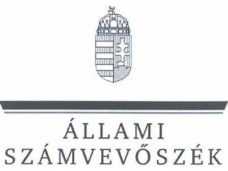
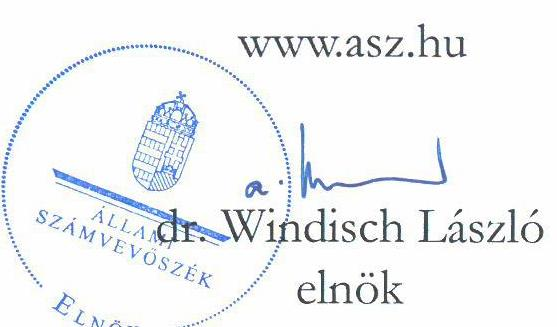

# JELENTÉS 

A többségi állami tulajdonban lévő gazdasági társaságok felügyelőbizottságainak múködésére irányuló célzott ellenőrzés

Országos Kórházi Főigazgatóság - Gönc és Térsége Egészségéért Egészségügyi Szolgáltató Nonprofit Kft.

2024.

---

ÁlLAMI
SZÁMVEVÔSZÉK

# JELENTÉS 

## A többségi állami tulajdonban lévő gazdasági társaságok felügyelőbizottságainak múködésére irányuló célzott ellenőrzés

Országos Kórházi Főigazgatóság - Gönc és Térsége Egészségéért Egészségügyi Szolgáltató Nonprofit Kft.

2024. 

24059

---

# ELLENŐRZÉSI IGAZGATÓSÁG: 

ÁLLAMI VAGYONGAZDÁLKODÁST ELLENŐRZŐ IGAZGATÓSÁG

## ELLENŐRZÉSI IGAZGATÓ:

HERCZEGH ZSOLT ellenőrzési igazgató

## ELLENŐRZÉSVEZETŐ:

Jelentéseink az interneten a www.asz.hu címen olvashatók.

## DABISNÉ NYIKOS MELINDA ellenőrzésvezető

IKTATÓSZÁM: EL-4009-003/2024
TÉMASZÁM: 2720
ELLENŐRZÉS-AZONOSÍTÓ SZÁM: V1064

---

# TARTALOMJEGYZÉK 

AZ ELLENŐRZÉS ALAPADATAI ..... 5
AZ ELLENŐRZÖTT SZERVEZETEK ..... 7
ÖSSZEFOGLALÁS ..... 8
AZ ELLENŐRZÉS FÓKUSZTERÜLETE ..... 9
MEGÁLLAPÍTÁSOK ..... 10
JAVASLATOK ..... 13
MELLÉKLETEK ..... 14
I. sz. melléklet: Értelmező szótár ..... 14
II. sz. melléklet: Az ellenőrzött szervezetek jegyzéke ..... 15
III. sz. melléklet: Ellenőrzési kritériumok ..... 16
FÜGGELÉK: ÉSZREVÉTELEK ..... 17
RÖVIDÍTÉSEK JEGYZÉKE ..... 18

---

.

---

# AZ ELLENŐRZÉS ALAPADATAI 

## AZ ELLENŐRZÉS CÉLJA

Az ellenőrzés célja annak értékelése volt, hogy a többségi állami tulajdonban álló gazdasági társaság felügyelőbizottsága szabályszerűen múködött-e, valamint a felügyelőbizottság feladatait megfelelően látta-e el.

## AZ ELLENŐRZÉS TÍPUSA

Megfelelőségi ellenőrzés.

## AZ ELLENŐRZÖTT IDŐSZAK

A 2022. év.

## AZ ELLENŐRZÉS TÁRGYA

Az ellenőrzés tárgyát képezte a többségi állami tulajdonban lévő gazdasági társaság felügyelőbizottsága múködésének szabályszerűsége, valamint feladatellátásának megfelelősége. Az éves számviteli beszámoló elfogadással kapcsolatos felügyelőbizottsági feladatellátás ellenőrzése a 2021. éves számviteli beszámolóra terjedt ki. Az ellenőrzés kiterjedt továbbá a felügyelőbizottsági tagok megválasztásának, a tagság megszűnésének szabályszerűségi ellenőrzésére, valamint a tulajdonosi joggyakorló által, a felügyelőbizottsággal szemben támasztott elvárások, meghatározott követelmények teljesítésének vizsgálatára és értékelésére is.

A felügyelőbizottság múködése szabályszerűségének ellenőrzése magába foglalta a felügyelőbizottság tagjai megválasztásnak, a felügyelőbizottsági tagság megszűnésének ellenőrzését mind a tulajdonosi joggyakorlónál, mind pedig az irányítása alatt álló többségi állami tulajdonban lévő gazdasági társaságnál, továbbá kiterjedt arra, hogy a tulajdonosi joggyakorló a felügyelőbizottság feladatellátását nyomon követte-e, értékelte-e.

A feladatellátás megfelelőségének ellenőrzése magába foglalta azt, hogy a felügyelőbizottság ténylegesen ellátta-e azt a funkcióját, amelyre létrehozták, a felügyelőbizottság a gazdasági társaság vezetését a tulajdonos érdekeinek megóvása céljából ellenőrizte-e, ezáltal támogatta-e a tulajdonosi joggyakorló ellenőrzési tevékenységének megvalósulását, továbbá múködéséről beszámolt-e a tulajdonosi joggyakorló részére.

A felügyelőbizottság feladatellátása tekintetében ellenőrizni kellett, hogy a felügyelőbizottság ellátta-e az ellenőrzési, véleményezési és beszámolási tevékenységét, illetve minden olyan tevékenységet, amelyet jogszabályok, belső szabályozók meghatároztak, vagy a tulajdonosi joggyakorló a felügyelőbizottság hatókörébe rendelt.

Az ellenőrzés kiterjedt minden olyan körülményre és adatra, amely az ÁSZ ${ }^{1}$ jogszabályban meghatározott feladatainak teljesítéséhez, valamint a program végrehajtása folyamán felmerült újabb összefüggések feltárásához szükséges volt.

---

# AZ ELLENŐRZÉS JOGALAPJA 

Az ellenőrzés jogszabályi alapját az ÁSZ tv. ${ }^{2} 1 . \int$ (3) bekezdés és az 5. § (4) bekezdés előírásai képezték.

## AZ ELLENŐRZÉS MÓDSZERE

Az ellenőrzés végrehajtása a nemzetközi standardokat irányadónak tekintve az ellenőrzési program szempontjai, az ellenőrzött időszakban hatályos jogszabályok, az ellenőrzés szakmai szabályok és a jelen ellenőrzésre irányadó ÁSZ módszertan figyelembevételével történt.

Az ellenőrzési kérdések megválaszolásához szükséges bizonyítékok megszerzése az ellenőrzött szervezetek által rendelkezésre bocsátott dokumentumokra és adatokra alapozva, továbbá megfigyelés, összehasonlítás, interjú (kérdésfeltevés), valamint elemző eljárás útján valósult meg.

Az ellenőrzési bizonyítékként felhasználható adatforrások közé tartoztak egyrészt az ellenőrzéshez kért dokumentumok, adatforrások, másrészt adatforrás volt még minden - az ellenőrzés folyamán - feltárt, az ellenőrzés szempontjából információkat tartalmazó dokumentum.

Az ellenőrzés során mintavételre nem került sor. Az ellenőrzés lefolytatásához az ellenőrzött szervezetek az ÁSZ által kért dokumentumok, adatok, információk megküldésével és az ellenőrzés során szolgáltatott adatokat. Az ellenőrzéshez az ÁSZ felhasználhatta a nyilvánosan elérhető közhiteles adatokat is.

---

# AZ ELLENŐRZÖTT SZERVEZETEK 

## Országos Kórházi FÓigazgatósáG

Az OKFŐ ${ }^{3}$ az 506/2020 (XI.17.) Korm.rendelettel ${ }^{4}$ létrejött, az egészségügyért felelős miniszter járványügyi készzïltség idején a rendészetért felelös miniszter - irányítása alá tartozó, központi hivatalként működő központi költségvetési szerv. Az OKFŐ feladata az 506/2020 (XI.17.) Korm.rendelet 3. §-a alapján az egészségügyi ellátórendszer múködésének figyelemmel kísérése, valamint az egészségügyi ellátórendszer felülvizsgálatát érintő stratégiai kormányzati döntések megalapozása volt, mely keretében közreműködött az egységes és átlátható új nemzeti egészségügyi irányítási rendszer kialakításában. Az OKFŐ feladatai részletesen az 516/2020 (XI.25.) Korm.rendeletben ${ }^{5}$ kerültek szabályozásra. Az OKFŐ a Bkr. ${ }^{6}$ hatálya alá tartozott, 2021.01.01. óta a Gönc és Térsége Egészségéért Nonprofit Kft. ${ }^{7}$ tulajdonosi joggyakorlója.

## Gönc és Térsége Egészségéért Egészségügyi Szolgáltató Nonprofit Korlátolt Felelősségü Társaság

A Gönc és Térsége Egészségéért Nonprofit Kft.-t 2008.09.04-én Gönc Város Önkormányzata és Hidasnémeti Község Önkormányzata által képviselt tulajdonosi közösség alapította, a Gönci Kistérségi Járóbeteg Szakellátó Centrum megvalósulása érdekében. A Gönci Kistérségi Járóbeteg Szakellátó Centrum működését 2011-ben kezdte meg, 2014-ben a Sátoraljaújhelyi Erzsébet Kórház a működtetést átvette. A társaság fő tevékenységi köre TEÁOR 4110’08 épületépítési projekt szervezése volt, az ellenőrzött időszakban nem tartozott sem a Bkr., sem pedig a Gbkr. ${ }^{8}$ hatálya alá. A Gönc és Térsége Egészségéért Nonprofit Kft. 2018.02.28.-2023.08.01. közötti időszakban közhasznú jogállású társaság volt.

A Gönc és Térsége Egészségéért Nonprofit Kft. 2021. évi saját tőke összege 443390 E Ft, mérlegfőösszege 542979 E Ft, értékesítés nettó árbevétele 900 E Ft, adózott eredménye -12615 E Ft, az átlagosan foglalkoztatottak száma 0 fő, a 2022. évi saját tőke összege 430248 E Ft, mérlegfőösszege 537637 E Ft, értékesítés nettó árbevétele 1133 E Ft, adózott eredménye -13 142 E Ft, az átlagosan foglalkoztatottak száma 1 fő volt. A társaság 2021. évi számviteli beszámolójáról könyvvizsgálói vélemény nem készült, a Gönc és Térsége Egészségéért Nonprofit Kft. könyvvizsgálóval nem rendelkezett.

A tulajdonosi ellenőrzés támogatására a Gönc és Térsége Egészségéért Nonprofit Kft-nél három tagból álló felügyelőbizottság került létrehozásra. Az ellenőrzött időszak vonatkozásában a Gönc és Térsége Egészségéért Nonprofit Kft. egy felügyelőbizottsági taggal rendelkezett 2022.03.11-ig (a felügyelöbizottsági tag megbiz̧ásának időtartama: 2021.01.06.-2024.01.01.), majd 2022.03.12-től a cégjegyzékben szereplő adatok alapján további két felügyelőbizottsági tag került megbízásra (megbiz̧ásuk vége: 2023.02.01.). A cégjegyzékben szereplő adatok szerint a 2023.02.01.-2023.12.31. közötti időszakban a Gönc és Térsége Egészségéért Nonprofit Kftnél felügyelőbizottság nem működött. A felügyelőbizottsági tagok díjazás nélkül látták el a feladatukat.

---

# ÖSSZEFOGLALÁS 

A jogi személy tulajdonosi ellenőrzése a Ptk. rendelkezései alapján a felügyelőbizottság létrehozásán és működtetésén keresztül valósul meg, mely az állami tulajdonú gazdasági társaságok esetében azt jelenti, hogy a Magyar Állam nevében a tulajdonosi joggyakorlóként kijelölt szervezet bízza meg az állami tulajdonú gazdasági társaság felügyelőbizottságának tagjait. A felügyelőbizottság munkájának kiemelkedő szerepe van, mivel a gazdasági társaság vezetését a tulajdonos érdekeinek megóvása céljából ellenőrzi. A tulajdonosi joggyakorló a felügyelőbizottság tájékoztatásain, jelzésein keresztül értesül a gazdasági társaságot érintő múködési, gazdálkodási, valamint minden egyéb jelentős területet érintő kérdésről, és amennyiben szükséges, akkor lehetősége van a megfelelő időben történő beavatkozásra.

Az ellenőrzés megállapította, hogy a Gönc és Térsége Egészségéért Nonprofit Kft. felügyelőbizottsága nem múködött szabályszerűen, valamint feladatait nem látta el megfelelően.

A TULAJDONOSI JOGGYAKORLÓ a felügyelőbizottság múködési kereteinek kialakítása és biztosítása során nem járt el szabályszerűen, az ellenőrzés során lényeges hiányosságok kerültek feltárásra. A tulajdonosi joggyakorló nem biztosította, hogy a felügyelőbizottság múködése a törvényi előírásoknak megfeleljen, az ellenőrzött időszak egy részében a Gönc és Térsége Egészségéért Nonprofit Kft. felügyelőbizottsága nem múködött. A törvényi előírásokban foglaltakkal szemben a felügyelőbizottsági tagok vagyonnyilatkozattal, valamint nemzetbiztonsági ellenőrzéssel a felügyelőbizottsági jogviszonyukra tekintettel nem rendelkeztek. A Felügyelőbizottsági ügyrendet a törvényi előírásban foglaltak ellenére a tulajdonosi joggyakorló nem fogadta el, a Felügyelőbizottsági ügyrend hiányát az OKFŐ a felügyelőbizottság felé nem jelezte. A 2021. évi számviteli beszámoló a közhasznúsági melléklet, valamint a könyvvizsgálói vélemény nélkül került elfogadásra, mely nem felelt meg a jogszabályi és a belső szabályozóban foglaltaknak. A felügyelőbizottság feladatellátását a tulajdonosi joggyakorló a jogszabályi előírásokkal szemben nem követte nyomon és nem értékelte.

A GÖNC ÉS TÉRSÉGE EGÉSZSÉGÉÉRT NONPROFIT KFT. felügyelőbizottságának múködése és feladatellátása nem volt szabályszerű, az ellenőrzés során lényeges hiányosságok kerültek feltására. A felügyelőbizottság a törvényi előírásban foglaltak ellenére a tulajdonosi joggyakorló által elfogadott Felügyelőbizottsági ügyrenddel nem rendelkezett, a belső szabályozóban foglaltakkal szemben a 2021. évi számviteli beszámolót a közhasznúsági melléklet és a könyvvizsgálói vélemény hiányában fogadta el. A felügyelőbizottsággal kapcsolatos adatok a jogszabályban foglaltak ellenére nem kerültek a társaság honlapján közzétételre. A felügyelőbizottság nem látta el a feladatát, a tulajdonosi joggyakorló törvényben rögzített érdekei sérültek.

---

# AZ ELLENŐRZÉS FÓKUSZTERÜLETE 

1. A többségi állami tulajdonban álló gazdasági társaság felügyelőbizottságának müködése, feladatellátása.

---

# 1. Országos Kórházi Főigazgatóság 

## Összegző megállapítás

Az OKFŐ a felügyelőbizottság múködési kereteinek kialakítása és biztosítása során nem szabályszerűen járt el, a felügyelőbizottság feladatellátását nem követte nyomon, nem értékelte.

Az OKFŐ, mint tulajdonosi joggyakorló a felügyelőbizottság múködésével kapcsolatos kereteket a Gönc és Térsége Egészségéért Nonprofit Kft. Alapító okiratában ${ }^{9}{ }_{1,2}$, valamint az alapítói határozattal elfogadott Javadalmazási szabályzatban ${ }^{10}$ határozta meg.
Az Alapító okirat ${ }_{1,2}$ alapján a felügyelőbizottság feladata volt a társaság ügyvezetésének, múködésének, gazdálkodásának az ellenőrzése, valamint az éves beszámoló és az egyéb jelentések vizsgálata. A felügyelőbizottság az Alapító okirat ${ }_{1,2}$ alapján tájékoztatási kötelezettséggel tartozott a tulajdonosi joggyakorló felé a társaság múködtetésével kapcsolatos jogszabálysértésekről, a társaság érdekeit sértő eseményekről, illetve a vezető tisztségviselők felelősségét megalapozó tényekről. A rendelkezésre álló nyilatkozat alapján a Gönc és Térsége Egészségéért Nonprofit Kft. az ellenőrzött időszakban lényegében nem múködött, szervezeti vagy múködési célok az OKFŐ részéről nem kerültek meghatározásra, mivel a társaság megszüntetése volt a cél. Az ellenőrzés megállapította, hogy a cégjegyzékben szereplő adatok alapján az ellenőrzött időszakra vonatkozóan felszámolási, végelszámolási eljárás nem indult a Gönc és Térsége Egészségéért Nonprofit Kft. tekintetében.
A Gönc és Térsége Egészségéért Nonprofit Kft-nél a 2022.01.01.-2022.03.11. közötti időszakban a tulajdonosi joggyakorló részéről három fő helyett csak egy felügyelőbizottsági tag került megbízásra (megbizásának kezdete: 2021.01.06., meghi̇̇ásának, vége: 2024.01.01.). A további két felügyelőbizottsági tag megbízásának kezdete a cégjegyzékben szereplő adatok alapján 2022.03.12. volt (a két felügyelöbizottsági tag megbizásának, vége: 2023.02.01.). A Ptk. 3:121. § (1) bekezdése, a Tak.tv. ${ }^{11}$ 4. § (2) bekezdése, valamint az Alapító okirat ${ }_{1,2}$ XIII. fejezetének rendelkezései ellenére az OKFŐ nem gondoskodott a három fős felügyelőbizottság létrehozásáról. A felügyelőbizottság a 2022.01.01.-2022.03.11. időszak között nem múködött.
Az OKFŐ a felügyelőbizottsági tagok összeférhetetlenségi szabályoknak való megfelelését a rendelkezésre álló információk szerint a Ptk. 3:26. § (2) bekezdése és az Alapító okirat ${ }_{1,2}$ XIII. fejezete alapján vizsgálta. Ezzel kapcsolatban egy felügyelőbizottsági tag tekintetében került összeférhetetlenségi nyilatkozat átadásra.
A 2007. évi CLII. törvény ${ }^{12}$ 3. § (3) bekezdés c) pontja értelmében a felügyelőbizottsági tagok vagyonnyilatkozat-tételre kötelezettek. A rendelkezésre álló információk alapján a felügyelőbizottsági tagok - a felügyelőbizottsági jogviszonyukra tekintettel - vagyonnyilatkozatot nem tettek, a vagyonnyilatkozat-tételi kötelezettség az OKFŐ részéről nem került igazolásra.
Az 1995. évi CXXV. törvény ${ }^{13}$ 74. § i) pont alapján a felügyelőbizottság tagja nemzetbiztonsági ellenőrzés alá eső személy. A rendelkezésre álló információk alapján a felügyelőbizottsági tagokra - a felügyelőbizottsági jogviszonyukra tekintettel - nemzetbiztonsági ellenőrzés nem került lefolytatásra. Az OKFŐ részéről a felügyelőbizottsági tagok nemzetbiztonsági ellenőrzése nem került igazolásra.

---

A Ptk. 3:122. § (3) bekezdése, valamint az Alapító okirat ${ }_{1,2}$ XIII. fejezetének előírásaival szemben az OKFŐ a Gönc és Térsége Egészségéért Nonprofit Kft. Felügyelőbizottsági ügyrendjét - beterjesztés hiányában - nem hagyta jóvá. A tulajdonosi joggyakorló a Felügyelőbizottsági ügyrend hiányát a felügyelőbizottság felé nem jelezte.
Az OKFŐ a Ptk. előírása szerint határozattal döntött a 2021. évi számviteli beszámolóról, amely azonban a Civil tv. ${ }^{14}$ 46. $\$ (1) bekezdése ellenére a közhasznúsági mellékletet nem tartalmazta. A 2021. évi számviteli beszámolót a tulajdonosi joggyakorló az Alapító okirat ${ }_{1,2}$ XIV. fejezetében foglaltak ellenére könyvvizsgálói vélemény hiányában fogadta el. A közhasznúsági melléklet és a könyvvizsgálói vélemény hiányát a tulajdonosi joggyakorló a felügyelőbizottság részére nem jelezte.
Mindezek alapján a tulajdonosi joggyakorló a Bkr. 3. § e) pont és 10 . § ellenére a felügyelőbizottság feladatellátását nem követte nyomon, nem értékelte.

# 2. Gönc és Térsége Egészségéért Nonprofit Kft. felügyelőbizottsága 

Összegző megállapítás A Gönc és Térsége Egészségéért Nonprofit Kft. felügyelőbizottságának múködése nem felelt meg a jogszabályokban, valamint a belső szabályozókban foglaltaknak. A felügyelőbizottság a feladatait nem látta el szabályszerűen, ezáltal funkcióját nem töltötte be. A felügyelőbizottság múködése a tulajdonosi joggyakorló ellenőrzési tevékenységét nem támogatta.

A Gönc és Térsége Egészségéért Nonprofit Kft. felügyelőbizottságának múködése és feladatellátása az Alapító okiratban ${ }_{1,2}$, a Javadalmazási szabályzatban, valamint az Összeférhetetlenségi szabályzatban ${ }^{15}$ került szabályozásra.
A felügyelőbizottság Felügyelőbizottsági ügyrend tervezetet készített, azonban a Ptk. 3:122. § (3) bekezdésében foglaltak ellenére a tulajdonosi joggyakorló által jóváhagyott Felügyelőbizottsági ügyrenddel nem rendelkezett.
Az Alapító okirat ${ }_{1,2}$-ban foglaltak szerint a felügyelőbizottságnak szükség szerint, de évente legalább egy alkalommal kellett üléseznie. A felügyelőbizottság a 2022. évben a Ptk.-ban és az Alapító okirat ${ }_{1,2}$-ban foglalt előírásoknak megfelelően egy alkalommal ülésezett, mely során a 2021. évi számviteli beszámoló került véleményezésre, valamint a Ptk. rendelkezésének megfelelően a felügyelőbizottság elnöke került megválasztásra.
A Gönc és Térsége Egészségéért Nonprofit Kft. ügyvezetője részéről a 2021. évi számviteli beszámoló nyolc nappal a felügyelőbizottsági ülés előtt elektronikus úton megküldésre került a felügyelőbizottsági tagok részére. A rendelkezésre bocsátott 2021. évi számviteli beszámoló tartalmát a felügyelőbizottság megvizsgálta, azonban a Civil tv. 46. § (1) bekezdésében foglaltak ellenére a 2021. évi számviteli beszámoló mellé közhasznúsági melléklet nem készült, annak hiányát a felügyelőbizottság nem jelezte a tulajdonosi joggyakorló részére. A 2021. évi számviteli beszámoló annak ellenére került a felügyelőbizottság részéről véleményezésre, és a tulajdonosi joggyakorló felé jóváhagyásra beterjesztésre, hogy arról az Alapító okirat ${ }_{1,2}$ XIV. fejezetében rögzített könyvvizsgálati kötelezettség ellenére könyvvizsgálói vélemény nem

---

készült. A felügyelőbizottság ténylegesen nem látta el a feladatát, a Ptk. 3:26. § (1) bekezdése, valamint az Alapító okirat ${ }_{1,2}$ XIII. fejezete ellenére a felügyelőbizottság a Gönc és Térsége Egészségéért Nonprofit Kft. ügyvezetésének az ellenőrzését nem biztosította, a tulajdonosi joggyakorló érdekei sérültek.
Az Alapító okirat ${ }_{1,2}$ XIV. fejezetében rögzített előírásokkal szemben a Gönc és Térsége Egészségéért Nonprofit Kft. 2019.05.31-et követően könyvvizsgálóval nem rendelkezett, a Tak.tv. 4. § (1c) bekezdésben foglaltak ellenére az ellenőrzött időszak vonatkozásában az ügyvezetés a felügyelőbizottság egyetértésével javaslatot nem tett a társaság legfőbb szervének a könyvvizsgáló személyére.
A Tak.tv. 2. § (1) bekezdés d) pontja ellenére a felügyelőbizottsággal kapcsolatos adatok közzétételére nem került sor a Gönc és Térsége Egészségéért Nonprofit Kft. honlapján.

---

# JAVASLATOK 

Az ÁSZ tv. 33. § (1) bekezdésében foglaltak értelmében az ellenőrzött szervezet vezetője köteles a jelentésben foglalt megállapításokhoz kapcsolódó intézkedési tervet összeállítani és azt a jelentés kézhezvételétől számított 30 napon belül az ÁSZ részére megküldeni. Amennyiben az ellenőrzött szervezet vezetője nem küldi meg határidőben az intézkedési tervet, vagy továbbra sem elfogadható intézkedési tervet küld, az Állami Számvevőszék elnöke az ÁSZ tv. 33. § (3) bekezdése a) és b) pontjaiban foglaltakat érvényesítheti.

## OKFŐ TULAJDONOSI JOGGYAKORLÓ RÉSZÉRE

1. Intézkedjen, hogy a Gönc és Térsége Egészségéért Nonprofit Kft. felügyelőbizottságának müködési keretei biztosításra kerüljenek (felügyelőbizottsági tagok megbizása, nemzetbiztonsági ellenőrzés, vagyonnyilatkozat-tételi kötelezettség betartása).
2. Intézkedjen, hogy a felügyelőbizottság a tulajdonosi joggyakorló által elfogadott Felügyelőbizottsági ügyrenddel rendelkezzen.
3. Vizsgálja meg az Alapitó okirat könyvvizsgálatra vonatkozó rendelkezéseit, és amennyiben nem tartja indokoltnak a rendelkezések hatályban tartását, tegye meg a szükséges intézkedéseket.

## GÖNC ÉS TÉRSÉGE EGÉSZSÉGÉÉRT NONPROFIT KFT. ÜGYVEZETŐJE RÉSZÉRE

1. Intézkedjen, hogy a Gönc és Térsége Egészségéért Nonprofit Kft. honlapján a Takt.tv. 2. § (1) bekezdés d) pont alapján a felügyelőbizottságra vonatkozó adatokat tegyék közzé.

---

# MELLÉKLETEK 

## I. SZ. MELLÉKLET: ÉRTELMEZŐ SZÓTÁR

gazdasági társaság
többségi állami tulajdon
tulajdonosi joggyakorló
felügyelőbizottság

A gazdasági társaságok üzletszerű közös gazdasági tevékenység folytatására, a tagok vagyoni hozzájárulásával létrehozott, jogi személyiséggel rendelkező vállalkozások, amelyekben a tagok a nyereségből közösen részesednek, és a veszteséget közösen viselik.
(Ptk. 3:88. § (1) bekezdése)
Az állam tulajdonában lévő tagsági jogviszonyt megtestesítő értékpapír, illetve az állam tulajdonában lévő egyéb társasági részesedés, amennyiben a társaságban a Magyar Állam közvetlenül vagy közvetetten a szavazatok több mint felével rendelkezik.
(ÁSZ definíció a Vtv. ${ }^{16}$ 1. § (2) bekezdés c) pontja és a Ptk. 8:2. § (1), (3)-(4) bekezdései alapján)
Aki a nemzeti vagyon felett az államot vagy a helyi önkormányzatot megillető tulajdonosi jogok és kötelezettségek összességének gyakorlására jogosult. (Nvtv. ${ }^{17}$ 3. § (1) bekezdés 17. pontja)
A gazdasági társaságnál a tulajdonos érdekeinek megóvása céljából múködő legalább három tagból álló ellenőrző testület.
(ÁSZ definíció a Ptk. 3:26. § (1) bekezdés alapján)

---

# II. SZ. MELLÉKLET: AZ ELLENŐRZÖTT SZERVEZETEK JEGYZÉKE 

## ELLENŐRZÖTT SZERVEZET NEVE

1. Országos Kórházi Főigazgatóság
2. Gönc és Térsége Egészségéért Nonprofit Kft.

## SZEREPE

Tulajdonosi joggyakorló
Többségi tulajdonban álló gazdasági társaság

---

# III. SZ. MELLÉKLET: ELLENŐRZÉSI KRITÉRIUMOK 

## FOKUSZTÉRÜLET

1. A többségi állami tulajdonban álló gazdasági társaság felügyelőbizottságának múködése, feladatellátása.

## ELLENŐRZÉSI KRITÉRIUMOK

Tak.tv. 2. $\$$ (1) bek., 4. $\$$ (1)-(3) bek., 5. $\$$ (3)-(4) bek., 6. $\$$.
(2)-(4) bek., 7/J. $\$$ (2), (5)-(7) bek.
Ptk. 3:22. $\$, 3: 25 . \$, 3: 26 . \$, 3:27. $\$, 3: 28 . \$, 3: 36 . \$(3) bek., 3:38. $\$(1), 3: 111 . \$, 3:115. $\$, 3: 119 . \$, 3: 120 . \$, 3:121. $\$$, 3:122. $\$, 3: 123 . \$, 3: 124 . $\$, 3: 125 . \$, 3: 126 . $\$, 3: 127 . \$, 3: 128 . $\$ 3: 131 . \$(3) bek.
2007. évi CLII. törvény 3. $\$$ (3) bek. c) pont, 5. $\$, 6 . \$(2) bek.
1995. évi CXXV. törvény 74. $\$$. ij) pont

Mt. ${ }^{18} 208 . \$$

Civil tv. 46. $\$$ (1) bek.
Bkr. 3. $\$$ e) bek., 10. $\$$

a gazdasági társaság alapító okirata
a Felügyelőbizottság ügyrendje
belső szabályzatok, irányítási eszközök
tulajdonosi joggyakorló írásbeli elvárásai

---

# FÜGGELÉK: ÉSZREVÉTELEK 

A jelentéstervezetet a Számvevőszék 15 napos észrevételezésre megküldte az ellenőrzött szervezet vezetőjének az ÁSZ tv. 29. §* (1) bekezdése előírásának megfelelően.

Az ellenőrzött szervezetek vezetői a jelentéstervezet megállapításaira észrevételt nem tettek.

[^0]
[^0]:    * 29. § (1) Az Állami Számvevőszék az ellenőrzési megállapításait megküldi az ellenőrzött szervezet vezetőjének vagy az általa megbízott személynek, és annak, akinek személyes felelősségét állapította meg.
    (2) Az ellenőrzött szervezet vezetője és a felelősként megjelölt személy az ellenőrzés megállapításaira tizenöt napon belül írásban észrevételt tehet.
    (3) Az Állami Számvevőszék az észrevételre a beérkezésétől számított harminc napon belül írásban válaszol. A figyelembe nem vett észrevételeket köteles a jelentésben feltüntetni, és megindokolni, hogy azokat miért nem fogadta el.

---

# RÖVIDÍTÉSEK JEGYZÉKE 

${ }^{1}$ ÁSZ
${ }^{2}$ ÁSZ tv.
${ }^{3}$ OKFŐ
${ }^{4}$ 506/2020. (XI. 17.) Korm.rendelet
${ }^{5}$ 516/2020. (XI. 25.) Korm. rendelet
${ }^{6}$ Bkr.
${ }^{7}$ Gönc és Térsége Egészségéért Nonprofit Kft. Gönc és Térsége Egészségéért Egészségügyi Szolgáltató Nonprofit Korlátolt Felelősségű Társaság
${ }^{8}$ Gbkr.
${ }^{9}$ Alapító okirat ${ }_{1,2}$
${ }^{10}$ Javadalmazási szabályzat
${ }^{11}$ Tak.tv.
${ }^{12}$ 2007. évi CLII. törvény
${ }^{13}$ 1995. évi CXXV. törvény
${ }^{14}$ Civil tv.
${ }^{15}$ Összeférhetetlenségi szabályzat
${ }^{16}$ Vtv.
${ }^{17}$ Nvtv.
${ }^{18} \mathrm{Mt}$.

Állami Számvevőszék
2011. évi LXVI. törvény az Állami Számvevőszékről

Országos Kórházi Főigazgatóság
506/2020. (XI. 17.) Korm. rendelet az Országos Kórházi Főigazgatóságról
516/2020. (XI. 25.) Korm. rendelet az Országos Kórházi Főigazgatóság feladatairól
370/2011. (XII.31.) Korm. rendelet a költségvetési szervek belső kontrollrendszeréről és belső ellenőrzéséről
Gönc és Térsége Egészségéért Egészségügyi Szolgáltató Nonprofit Korlátolt Felelősségű Társaság
339/2019. (XII.23.) Korm. rendelet a köztulajdonban álló gazdasági társaságok belső kontrollrendszeréről
Alapító okirat ${ }_{1}$ 2021.01.06-tól 2022.02.22-ig hatályos Gönc és Térsége Egészségéért Egészségügyi Szolgáltató Közhasznú Nonprofit Korlátolt Felelősségű Társaság Alapító okirat
Alapító okirat ${ }_{2}$ 2022.02.23-tól hatályos Gönc és Térsége Egészségéért Egészségügyi Szolgáltató Közhasznú Nonprofit Korlátolt Felelősségű Társaság Alapító okirat
Gönc és Térsége Egészségéért Egészségügyi Szolgáltató Közhasznú Nonprofit Korlátolt Felelősségű Társaság Javadalmazási szabályzat, hatályos 2018.08.01-től
2009. évi CXXII. törvény a köztulajdonban álló gazdasági társaságok takarékosabb müködéséről
2007. évi CLII. törvény egyes vagyonnyilatkozat-tételi kötelezettségekről
1995. évi CXXV. törvény a nemzetbiztonsági szolgálatokról
2011. évi CLXXV. törvény az egyesülési jogról, a közhasznú jogállásról, valamint a civil szervezetek müködéséről és támogatásáról
Gönc és Térsége Egészségéért Egészségügyi Szolgáltató Közhasznú Nonprofit Korlátolt Felelősségű Társaság Összeférhetetlenségi szabályzat, hatályos 2021.07.01től
2007. évi CVI. törvény az állami vagyonról
2011. évi CXCVI. törvény a nemzeti vagyonról
2012. évi I. törvény a munka törvénykönyvéről

---

1052 Budapest, Apáczai Csere János u. 10. | 1364 Budapest 4., Pf. 54
www.asz.hu | szamvevoszek@asz.hu
telefon: +36 14849100