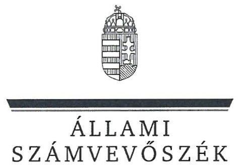
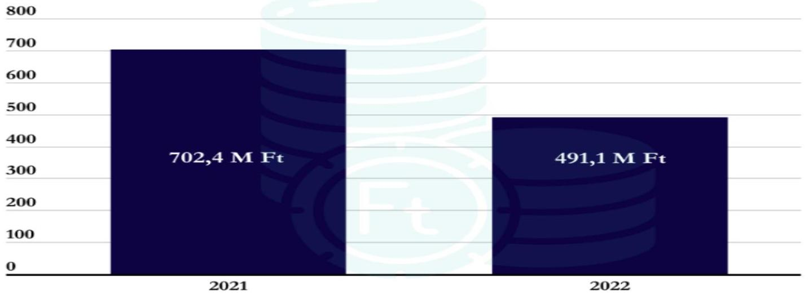
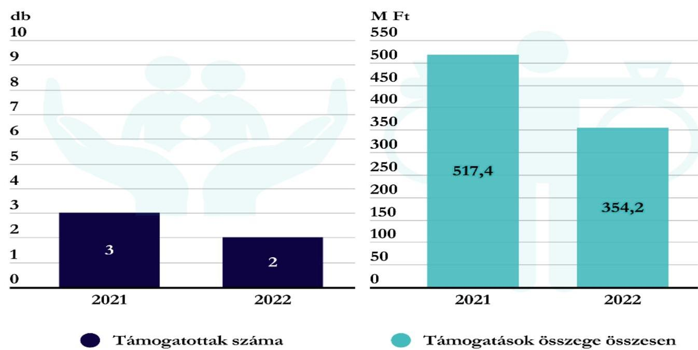

# JELENTÉS 

## Költségvetési támogatásban részesülő pártalapítványok 2021-2022. évi gazdálkodása törvényességének ellenőrzése

## Jobbik Magyarországért Alapítvány

2024.

---

ÁLLAMI
SZÁMVEVÔSZÉK

# JELENTÉS 

## Költségvetési támogatásban részesülő pártalapítványok 2021-2022. évi gazdálkodása törvényességének ellenőrzése

Jobbik Magyarországért Alapítvány

2024.

---

# ELLENŐRZÉSI IGAZGATÓSÁG: 

## ÁLLAMHÁZTARTÁSON KÍVÜLI SZERVEZETEKET ELLENŐRZŐ IGAZGATÓSÁG

## ELLENŐRZÉSI IGAZGATÓ:

## KLINGA LÁSZLÓ igazgató

## ELLENŐRZÉSVEZETŐ:

Jelentéseink az interneten a www.asz.hu címen olvashatók.

## KAKAS SÁNDOR ellenőrzésvezető

IKTATÓSZÁM: EL-3847-182/2024
TÉMASZÁM: 2673
ELLENŐRZÉS-AZONOSÍTÓ SZÁM: V1017

---

# TARTALOMJEGYZÉK 

- AZ ELLENŐRZÉS ALAPADATAI ..... 5
- AZ ELLENŐRZÖTT SZERVEZET ..... 8
- ÖSSZEFOGLALÁS ..... 10
- AZ ELLENŐRZÉS FÓKUSZKÉRDÉSEI ..... 12
- MEGÁLLAPÍTÁSOK ..... 13
- JAVASLATOK ..... 19
- MELLÉKLETEK ..... 20
I. sz. melléklet: Értelmező szótár ..... 20
II. sz. melléklet: Ellenőrzési kritériumok ..... 21
- FÜGGELÉK: ÉSZREVÉTELEK ..... 22
- RÖVIDÍTÉSEK JEGYZÉKE ..... 23

---

.

---

# AZ ELLENŐRZÉS ALAPADATAI 

## AZ ELLENŐRZÉS CÉLJA

Az ellenőrzés célja annak értékelése volt, hogy a Pártalapítvány ${ }^{1}$ törvényesen gazdálkodott-e; az éves számviteli beszámolók és a Pártalapítvány tevékenységéről szóló éves jelentések a jogszabályi előírásoknak megfeleltek-e; a könyvvezetés és gazdálkodás során a vonatkozó jogszabályi rendelkezéseket és belső előírásokat betartották-e. Az ellenőrzés célja továbbá annak értékelése, hogy a Pártalapítvány legutóbbi ellenőrzése eredményeként készült számvevőszéki jelentésben foglalt megállapításokkal összhangban készített intézkedési tervben meghatározott feladatokat végrehajtotta-e.

## AZ ELLENŐRZÉS TÍPUSA

Szabályszerüségi ellenőrzés

## AZ ELLENŐRZÖTT IDŐSZAK

2021-2022. évek
Az utóellenőrzés tekintetében az utóellenőrzés alapját képező 22021. számú ÁSZ jelentés² közzétételének napjától (2022.06.14.) az ellenőrzésről szóló adatszolgáltatásra felhívó levél keltének napjáig (2023.09.13.) terjedő időszak.

## AZ ELLENŐRZÉS TÁRGYA

Az ellenőrzés tárgyát képezte a Pártalapítvány gazdálkodása, a könyvvezetés szabályozása és gyakorlatának szabályszerűsége, az egyszerűsített éves beszámolókra és a Pártalapítvány tevékenységéről szóló éves jelentésekre vonatkozó kötelezettség teljesítése, valamint a gazdálkodáshoz kapcsolódó korábbi ÁSZ ${ }^{3}$ ellenőrzés javaslatainak hasznosítására irányuló tevékenység.

Az ellenőrzés kiterjedt minden olyan körülményre és adatra, amely az ÁSZ jogszabályban meghatározott feladatainak teljesítéséhez, valamint az ellenőrzési program végrehajtása során felmerülő újabb összefüggések feltárásához szükséges volt.

## AZ ELLENŐRZÉS JOGALAPJA

Az ellenőrzés jogalapját az ÁSZ tv. ${ }^{4} 1 . \int(3)$ bekezdése, 5. $\int(3)$ bekezdése, 33. $\int(7)$ bekezdése, valamint a Pmtv. ${ }^{5} 4 . \int(2)$ és (4) bekezdéseinek előírásai képezték.

---

# AZ ELLENŐRZÉS MÓDSZERE 

Az ellenőrzés az ellenőrzött időszakban hatályos jogszabályok, az ellenőrzés szakmai szabályai, a jelen ellenőrzésre irányadó ÁSZ módszertanok, az ellenőrzési programban foglalt értékelési szempontok szerint került végrehajtásra.

Az ellenőrzési kérdések megválaszolásához szükséges bizonyítékok megszerzése az ellenőrzött által rendelkezésre bocsátott dokumentumokra, adatokra alapozva kérdésfeltevés (információkérés), mintavételezés, továbbá helyszíni interjú útján történt. Az ellenőrzési bizonyítékként felhasználható adatforrások közé tartoztak egyrészt az ellenőrzési programban felsorolt adatforrások, másrészt minden, az ellenőrzés folyamán feltárt, az ellenőrzés szempontjából információt tartalmazó dokumentum.

Az ellenőrzés lefolytatásához az ellenőrzött szervezet tanúsítványok kitöltésével és az ÁSZ által kért dokumentumok, adatok, információk megküldésével az ellenőrzés során szolgáltatott adatokat.

A Pártalapítvány kiadásai, ráfordításai elszámolásának szabályszerűségét (2. fókuszkérdés), a Pártalapítvány által nyújtott támogatások elszámolásának szabályszerűségét (2. fókuszkérdés), valamint a mérlegtételek besorolásának, év végi értékelésének, azok leltárral való alátámasztottságának szabályszerűségét (3. fókuszkérdés) mintavételi eljárással kiválasztott tételek alapján ellenőrizte az ÁSZ.

A 2. fókuszkérdésnél az egyes vizsgálandó részterületek ellenőrzése részterületenként 30 elemű minta értékelésével mintavételes, 30 db -ot meg nem haladó tételszám esetében tételes ellenőrzéssel történt. Az ÁSZ a 2. fókuszkérdésnél, a kiadások vonatkozásában 30-30 mintatételt ellenőrzött, a minták értékelése alapján statisztikai kivetítést alkalmazott, további lényegességi szempontok alapján 2021. évben 7 db, 2022. évben 7 db kiválasztott mintatételt ellenőrzött. Az ÁSZ a 2. fókuszkérdésnél a Pártalapítvány által nyújtott támogatások vonatkozásában - tekintettel arra, hogy az alapsokaság elemszáma egyik évben sem haladta meg a 30 tételt - tételes ellenőrzést végzett. Az ÁSZ a 3. fókuszkérdésnél, a mérlegtételek vonatkozásában évenként 30-30 mintatételt ellenőrzött, a tények feltárása és azok összegzése során a megállapítások az ellenőrzött tételekre vonatkozóan kerültek megfogalmazásra.

A vizsgált terület „szabályszerü" minősítést kapott, ha a minta ellenőrzésének eredménye alapján 95\%-os bizonyossággal a teljes sokaságban az átlagos hibaarány nem haladta meg a 10\%-ot, „nem szabályszerű", ha nagyobb volt, mint $10 \%$. Amennyiben a sokaság elemszáma nem haladta meg az előírt minta elemszámot, akkor a sokaság valamennyi elemének tételes ellenőrzésére került sor.

A Pártalapítvány bevételei elszámolásának szabályszerűségét teljeskörűen ellenőrizte az ÁSZ.
Az utóellenőrzés megállapításai az ÁSZ rendelkezésére álló dokumentumok, valamint az ÁSZ adatbekérése szerint, az ellenőrzött szervezet által rendelkezésre bocsátott dokumentumok, adatok alapján kerültek megfogalmazásra. Az ÁSZ a 2022. évben a Pártalapítvány 2019-2020. évi gazdálkodását ellenőrizte, megállapításait a 22021. számú jelentésben tette közzé. Az ellenőrzés esetében a 22021. számú ÁSZ jelentés alapján a Pártalapítvány által készített intézkedési tervben előírt feladat annak végrehajthatósága, illetve végrehajtása szempontjából az alábbiak szerint került értékelésre:

- „határidőben végrehajtott" a feladat, ha a teljesítés dokumentáltan, az intézkedési tervben előírt határidőben és tartalommal megtörtént;
- „határidőn túl végrehajtott" a feladat, ha annak teljesítése az intézkedési tervben meghatározott módon, de az abban előírt határidőn túl történt meg;

---

- „nem végrehajtott" a feladat, ha a végrehajtás nem történt meg, vagy amennyiben a teljesítést/végrehajtást nem dokumentálták, dokumentumokkal nem tudják igazolni annak teljesítését;
- „okafogyottá vált" a feladat, ha végrehajtására - meghatározott esemény bekövetkezése, továbbá külső körülmény, a múködést érintő feltétel változása miatt - már nincs szükség, illetve lehetőség, és egyértelműen megállapítható, hogy az intézkedést szükségessé tevő körülmény a jövőben nem fordulhat elő;
- „nem idöszerü" az a feladat, amelynek ellenőrzési időszakon belüli végrehajtására azért nem került (kerülhetett) sor, mert az intézkedés alapjául szolgáló esemény nem következett be, de annak jövőbeni előfordulása lehetséges, a végrehajtása nem volt esedékes, vagy a végrehajtás határideje még nem járt le.
A gazdálkodás hibáinak kijavítására irányuló javaslatok kidolgozásakor a hatályos jogszabályok voltak az irányadóak.

---

# AZ ELLENŐRZÖTT SZERVEZET 

## JOBBIK MAGYARORSZÁGÉRT ALAPÍTVÁNY

A Jobbik Magyarországért Mozgalom* 2011. évben alapította a Gyarapodó Magyarországért Alapítványt, 2,2 M Ft induló vagyon rendelkezésre bocsátásával. A Pártalapítvány névváltozására 2015. június 2-án került sor, ezt követően Jobbik Magyarországért Alapítvány néven múködött tovább.

A Pártalapítvány Alapító okirat ${ }^{6}$ szerinti célja „a politikai kultúra fejlesztése a magyar nemzettudat, a nemzeti elkötelezettség és a keresztény identitás jegyében". Alapcéljával összhangban az Alapító okiratban szereplő további céljai a „politikai értékrendher kapcsolódó tudományos, kutatási tevékenység szervezése, oktatási, ismeretterjesztő tevékenység végzése, elöadások, konferenciák, rendezvények, alapítványi díjak és ösztöndijak létrehozása, továbbá szakkönsvek, szaklapok kiadása a politikai tevékenység minöségének, batékonyságának javitása érdekében".

A Pártalapítvány legfőbb döntést hozó és kezelő szerve a Kuratórium ${ }^{7}$, mely az Elnökből és további három tagból állt. A Pártalapítvány 2022. 07. 28-án a kuratóriumi tagok összetételére irányuló Alapító okirat módosítást nyújtott be a Fővárosi Törvényszék felé, melyet a Törvényszék elutasított, így az ellenőrzött időszakban a 2020. 11. 25-én kelt Alapító okirat volt hatályban. A Pártalapítvány működésének és gazdálkodásának jog- és célszerűségének ellenőrzésére az Alapító okiratban háromtagú Felügyelőbizottságot jelöltek ki. A Pártalapítvány az ellenőrzött időszakban a pénzügyi-számviteli feladatai ellátását külső szervezet bevonásával biztosította, az egyszerűsített éves beszámolóit a Kuratórium döntése alapján könyvvizsgáló felülvizsgálta.

A Pártalapítvány tevékenységének ellátásához az ellenőrzött időszakban a központi költségvetésből részesült támogatásban, egyéb támogatást, adományt az alapító párt ${ }^{8}$-tól, egyéb szervezettől, vagy magánszemélytől az ellenőrzött időszakban nem kapott.

A Pártalapítvány 2021. és 2022. évben kapott költségvetési támogatásának évenkénti alakulását az 1. ábra mutatja be:
1. ábra

[^0]
[^0]:    * 2023.02.25-től Jobbik-Konzervatívok

---

A Pártalapítvány a 2013. évben 10,0 M Ft tőkével alapította a $\mathrm{KMA}^{\circ}$-t, az alapításkor érvényben lévő törvényi szabályozás szerint. A Pártalapítvány az ellenőrzött időszakban alapcél szerinti tevékenységet folytatott, vállalkozási tevékenységet nem végzett.

A Pártalapítványnál az ellenőrzött időszakban külső ellenőrzésre, törvényességi felügyeleti ellenőrzésre nem került sor.

---

# ÖSSZEFOGLALÁS 

Az ÁSZ ellenőrzése a Párttv. ${ }^{10}$ alapján a politikai kultúra fejlesztése érdekében tudományos, ismeretterjesztő, kutatási, oktatási tevékenység folytatása céljából, a Ptk. ${ }^{11}$ szerinti Alapító okiraton alapuló bírósági nyilvántartásba vétellel létrejött Pártalapítvány gazdálkodására terjedt ki. A Pmtv. 4. § (2) bekezdése értelmében a pártalapítványok gazdálkodása törvényességének ellenőrzése az ÁSZ feladata. A Pmtv. 4. $\S$ (4) bekezdése alapján az ÁSZ kétévente - kötelező jelleggel - ellenőrzi azoknak a pártalapítványoknak a gazdálkodását, amelyek állami költségvetési támogatásban részesültek.

A pártalapítványok ellenőrzésével az ÁSZ hozzájárul ahhoz, hogy a társadalom objektív képet alkothasson a pártalapítványok működéséről, gazdálkodásáról. Az ellenőrzésről készített számvevőszéki jelentésben megfogalmazott megállapítások, javaslatok alapján a törvényalkotók konkrét lépéseket tehetnek a pártalapítványokra vonatkozó szabályozások megváltoztatása, átláthatóbbá, ellenőrizhetőbbé tétele érdekében. Az ellenőrzött szervezetek szintjén a hiányosságok, szabálytalanságok feltárása, az ennek kapcsán megfogalmazott megállapítások elősegíthetik a pártalapítványok szabályszerű gazdálkodását.

A Pártalapítvány Alapító okirata megfelelt a jogszabályi előírásoknak.
A gazdálkodás szervezeti kereteinek kialakítása szabályszerű volt.

A Pártalapítvány az ellenőrzött időszakban rendelkezett a Számv. tv. ${ }^{12}$ szerinti kötelezően elkészítendő szabályzatokkal; számviteli politikával ${ }^{13}$, az eszközök és a források leltározási és leltárkészítési szabályzatával ${ }^{14}$, az eszközök és a források értékelési szabályzatával ${ }^{15}$, pénzkezelési szabályzattal ${ }^{16}$, továbbá számlarenddel ${ }^{17}$. A
szabályzatok a Számv. tv.-ben előírtaknak megfeleltek.
A Pártalapítvány a kapott támogatások elszámolása során a jogszabályi előírásokat betartotta. A Pártalapítvány beszámolói és főkönyvi nyilvántartása alapján magánszemélytől, külföldi szervezettől, egyéb jogi személytől támogatást vagy adományt nem fogadott el.

A kiadások, nyújtott
támogatások elszámolása
szabályszerú volt.

A Pártalapítvány a 2021. és a 2022. évben a tevékenységének költségeit, ráfordításait szabályszerűen számolta el. Két esetben előfordult, hogy a kifizetést Kuratóriumi döntés nem alapozta meg.

A Pártalapítvány mindkét ellenőrzött évben nyújtott támogatást harmadik személy részére. A nyújtott támogatások a Pártalapítvány céljaival összhangban voltak, a támogatások odaítélése, elszámolása, nyilvántartása során a jogszabályi rendelkezéseket betartották. A Pártalapítványnál a nyújtott támogatások pénzügyi teljesítését alátámasztó bizonylat több esetben a Számv. tv. előírása ellenére az utalványozó aláírását nem tartalmazta.

Az ellenőrzött kiadási tételek alapján a Pártalapítvány az alapító párt részére támogatást, vagyoni hozzájárulást az ellenőrzött időszakban nem adott, ezzel eleget tett a Párttv. előírásainak.

A tevékenységről szóló éves
jelentések és a számviteli
beszámolók a jogszabályi
előírásoknak megfeleltek.

A Pártalapítvány a jogszabályi előírások szerint mindkét ellenőrzött évben elkészítette a tevékenységéről szóló éves jelentést, valamint az egyszerűsített éves beszámolót. A Pártalapítvány a 2021. évben a tevékenységről szóló éves jelentés és egyszerűsített éves beszámoló saját honlapján való

---

közzétételénél a jogszabályban előírt határidőt nem tartotta be, mert egy éves késedelemmel tette közzé azokat. A közzétételre vonatkozó jogszabályi előírásokat a 2022. évi tevékenységéről szóló éves jelentés és egyszerűsített éves beszámoló esetében betartotta.

A 2021. és 2022. évi egyszerűsített éves beszámolók ellenőrzött mérlegtételeinek besorolása, értékelése, leltárral való alátámasztottsága megfelelt a Számv. tv. előírásainak. A Pártalapítvány a kapott támogatások fel nem használt részét 2022. évben a Számv. tv. és a számviteli politika belső előírásaival ellentétben könyvelésében nem határolta el.

Az intézkedési tervben meghatározott feladatot határidőben végrehajtották.

A Pártalapítvány az utóellenőrzés megállapítása alapján az intézkedési tervben meghatározott feladatot határidőben végrehajtotta.
Az ÁSZ a Pártalapítvány Kuratóriumi Elnöke részére az ellenőrzés során feltárt szabálytalanságok megszüntetése érdekében három javaslatot fogalmazott meg.

---

# AZ ELLENŐRZÉS FÓKUSZKÉRDÉSEI 

1.     - A Pártalapítvány kialakította-e a törvényes gazdálkodásához szükséges szabályokat?
2.     - A Pártalapítvány a könyvvezetése és gazdálkodása során betartotta-e a jogszabályi előírásokat?
3.     - A Pártalapítvány tevékenységéről szóló jelentések, az éves számviteli beszámolók a jogszabályi előírásoknak megfeleltek-e?
4. A Pártalapítvány az intézkedési tervben meghatározott feladatokat végrehajtotta-e?

---

# 1. A Pártalapítvány kialakította-e a törvényes gazdálkodásához szükséges szabályokat? 

## Összegző megállapítás

1.1. számú megállapítás

A Pártalapítvány a törvényes gazdálkodáshoz szükséges szabályokat az ellenőrzött időszakban kialakította.
A Pártalapítvány működésének szabályait a jogszabályi előírásoknak megfelelően rögzítették.

Az Alapító okirat a Ptk. ${ }^{18}$ előírásai szerint tartalmazta a Pártalapítvány célját és tevékenységét, a Kuratóriumra, mint ügyvezető szervre vonatkozó előírásokat, meghatározva a kuratóriumi tagok számát és összetételét, továbbá a Kuratórium Elnökének képviseletre vonatkozó jogosultságát.
A Pártalapítvány 2022. 07. 28-án a Kuratórium tagjai közül egy személy tagságának megszűnésére és egy új tag jelölésére irányuló Alapító okirat módosítást nyújtott be a Fővárosi Törvényszék felé, melyet a Törvényszék elutasított, így az ellenőrzött időszakban a 2020. 11. 25-én kelt Alapító okirat volt hatályos. Az Alapító okirat módosítására irányuló kérelem elutasítása ellenére a Kuratórium a döntéshozatal során határozatképes volt. A Pártalapítvány gazdálkodásával kapcsolatos könyvvezetési- és nyilvántartási rendszerét az Eszkr. ${ }^{19}$ előírásainak megfelelően kialakította, az alkalmazott eredménykimutatás megfelelt a jogszabályi előírásoknak. A 2021. és 2022. évekre vonatkozóan a Számv. tv. előírásai szerint kettős könyvvitellel alátámasztott egyszerűsített éves beszámolót készített. A Pártalapítvány a pénzügyi- és számviteli feladatainak ellátását külső szervezet bevonásával, Ptk. ${ }_{2}$ szerinti szerződés megkötésével biztosította. A számviteli szolgáltatás körébe tartozó feladatokat végző, beszámolót készítő személy rendelkezett az Eszkr. rendelkezéseinek megfelelő, szükséges szakmai képzettséggel, végzettséggel.
1.2. számú megállapítás

A Pártalapítvány gazdálkodására vonatkozó belső szabályozás megfelelt a jogszabályi előírásoknak.

A Pártalapítvány az ellenőrzött időszakban a Számv. tv. előírásainak megfelelően rendelkezett számviteli politikával és az annak keretében elkészítendő eszközök és források leltárkészítési és leltározási szabályzatával, az eszközök és a források értékelési szabályzatával és pénzkezelési szabályzattal, a szabályzatok a Számv. tv.-ben előírtaknak megfeleltek.
Az eszközök és a források leltárkészítési és leltározási szabályzatában a Számv. tv. előírásaival összhangban határozták meg a mennyiségi felvétellel történő leltározás gyakoriságát. A pénzkezelési szabályzatban rögzítették, hogy a Pártalapítvány gazdálkodása során házipénztárt nem működtetett, melyet az ellenőrzött időszakra vonatkozó főkönyvi nyilvántartások alátámasztották.
A kettős könyvvitel vezetésére kötelezett Pártalapítvány az ellenőrzött időszakban a Számv. tv. előírásai szerint rendelkezett számlarenddel.
A Pártalapítvány céljaira rendelt vagyont és annak felhasználási módját a törvényi előírásokkal összhangban az Alapító okiratban rögzítették. A Pártalapítvány céljaira rendelt vagyon nyilvántartását, elszámolása rendjét, e vagyon nyilvántartásának tovább részletezését a jogszabályi előírásoknak megfelelően biztosították.

---

1.3. számú megállapítás

A Pártalapítvány alapcélja szerinti tevékenysége az ellenőrzött időszakban szabályszerű volt.

A Pártalapítvány az ellenőrzött időszakban alapcél szerinti tevékenységet folytatott. A Pártalapítvány 2021. és 2022. évi egyszerűsített éves beszámolója és eredménykimutatása alapján nem folytatott gazdasági vállalkozási tevékenységet.
A Pártalapítvány 2021. és 2022. éves tevékenységéről szóló jelentéseinek és egyszerúsített éves beszámolóinak adatai alapján a Ptk. ${ }_{2}$-ben előírtaknak és az Alapító okiratban foglaltaknak megfelelően nem volt korlátlan felelősségű tagja más jogalanynak, nem volt alapítója, tagja más alapítványnak, nem csatlakozott más alapítványhoz.

# 2. A Pártalapítvány a könyvvezetése és gazdálkodása során betartotta-e a jogszabályi előírásokat? 

## Összegző megállapítás

2.1. számú megállapítás

A Pártalapítvány a 2021. és 2022. évben a könyvvezetése és gazdálkodása során a jogszabályi előírásokat betartotta.

A Pártalapítvány a 2021. és 2022. évben a központi költségvetésből kapott támogatásokat szabályszerűen fogadta el és számolta el.

A Pártalapítvány az ellenőrzött időszakban a Párttv. és a Pmtv. előírásai szerint a 2021. és 2022. évi Kv.tv. ${ }^{20}$ és az 1284/2022. (VI. 7.) Korm. határozat ${ }^{21}$ alapján meghatározott állami költségvetési támogatásban részesült.
A Pártalapítvány a kapott költségvetési támogatást a főkönyvében az egyéb bevételek számlacsoporton belül tartotta nyilván az Eszkr. előírásainak megfelelően.
2.2. számú megállapítás

A Pártalapítvány által a 2021. és 2022. évben nyújtott cél szerinti támogatások odaítélése, elszámolása, beszámolóban történő bemutatása szabályszerű volt.

A Pártalapítvány az ellenőrzött időszakban a harmadik fél részére nyújtott támogatások elbírálásának, folyósításának, nyilvántartásának, elszámolásának rendjét az Alapító okiratban, az SZMSZ ${ }^{22}$-ben, a számviteli politikában és a számlarendben kialakította. Előírták, hogy a harmadik fél részére nyújtott támogatásokról a Kuratórium dönt. A számlarendben a Számv. tv. előírásaival összhangban meghatározták a nyújtott támogatások elkülönített nyilvántartási kötelezettségét.
A Pártalapítvány a Ptk. ${ }_{2}$ és az Alapító okiratban az alapítványi vagyon felhasználására vonatkozó előírásokat betartva az ellenőrzött időszakban kérelem alapján a KMA részére a 2021. évben 513,0 M Ft, a 2022. évben 352,4 M Ft összegben, magánszemélyek részére a 2021. évben 4,4 M Ft összegben támogatást, a 2022. évben pedig 1,8 M Ft ösztöndíjat nyújtott.
A Pártalapítvány által nyújtott támogatások alakulását a 2. ábra mutatja be:

---

1. ábra

Forrás: ÁSZ saját szerkesztés
A Pártalapítvány által a 2021. és 2022. évben harmadik személy részére nyújtott támogatások elszámolása szabályszerű volt. A Pártalapítvány által nyújtott támogatások jogcímei megfeleltek az Alapító okiratban foglaltaknak. A Kuratórium határozata alapján nyújtott támogatások kedvezményezettjeivel a Ptk. 2 és a belső szabályzatok előírásait betartva támogatási szerződést, illetve ösztöndíj folyósítására irányuló szerződést kötöttek. A támogatások folyósítása a kedvezményezett bankszámlájára történő utalással valósult meg, a támogatási szerződésekben foglaltak szerint. A folyósított támogatások és ösztöndíjak főkönyvi elszámolását az egyéb ráfordítások között mutatták ki, a számlarendben előírtaknak megfelelően. A nyújtott támogatások felhasználásáról a támogatási szerződésben beszámolási kötelezettséget írtak elő, melyet a rendelkezésre álló dokumentumok alapján a támogatottak teljesítettek és annak elfogadásáról a Kuratórium döntést hozott.
A harmadik személy részére nyújtott támogatások esetében a 2021. évben öt tétel, a 2022. évben 12 tétel esetében a támogatás könyvviteli elszámolását közvetlenül alátámasztó bizonylat a Számv. tv. 167. § (1) bekezdés c) pontjában foglaltak ellenére az utalványozó aláírását nem tartalmazta.
A Pártalapítvány az alapító párt részére támogatást, vagyoni hozzájárulást az ellenőrzött időszakban nem adott, ezzel eleget tett a Párttv. előírásainak.
2.3. számú megállapítás

A Pártalapítvány 2021. és 2022. évi kiadásainak elszámolása szabályszerű volt.
A Pártalapítvány a 2021. és 2022. évben a személyi- és anyagjellegủ költségek és ráfordítások elszámolása és kifizetése során a Számv. tv., az Eszkr., továbbá a számviteli politika, a számlarend, a pénzkezelési szabályzat előírásait betartotta.
A Pártalapítvány kiadásai az ellenőrzött időszakban minden esetben a Pártalapítvány cél szerinti tevékenysége vagy a múködés fenntartása érdekében merültek fel a Ptk. 2 előírásai szerint, kötelezettségvállalóként és utalványozóként a Kuratórium Elnöke járt el. A költségelszámolás, ráfordítás számviteli elszámolását megalapozó munkaszerződés, számla, megrendelés, bankszámlakivonat a

---

Számv. tv.-ben előírtak szerint rendelkezésre állt. A kiadásokat a Számv. tv.-nek megfelelően szabályszerűen kiállított bizonylat alapján jegyezték be a könyvviteli nyilvántartásba. A költségeket és ráfordításokat a Számv. tv. és a számlarend szerinti költségnemekre számolták el, melyet a főkönyvi kivonat és az egyszerűsített éves beszámolók adatai alátámasztottak. A számviteli bizonylatok a könyvviteli számlákra történő hivatkozást az előírások szerint tartalmazták.
A 2021. és 2022. évre lényegességi szempont szerint kiválasztott kiadási mintatételek ellenőrzése során az ellenőrzés a következőket állapította meg:

- egy esetben orvosi ágyak szállításának fuvarköltsége esetében a pénzügyi teljesítés összege meghaladta a Kuratórium 22/2021(07.11) sz. határozatban elfogadott 1 M Ft-ban meghatározott maximális összeget $0,1 \mathrm{M}$ Ft-tal, továbbá
- egy esetben adomány szállításához kapcsolódó $0,5 \mathrm{M}$ Ft összegű fuvardíj jogcímen felmerült költséget az Alapító okirat V.1. és VII.3.g./ pontjában foglaltak ellenére kuratóriumi döntés nélkül fizettek ki.

# 3. A Pártalapítvány tevékenységéről szóló jelentések, az éves számviteli beszámolók a jogszabályi előírásoknak megfeleltek-e? 

Összegző megállapítás A Pártalapítvány a tevékenységéről szóló 2021. és 2022. évi jelentéseket és az egyszerüsített éves beszámolókat elkészítette és közzétette.
3.1. számú megállapítás

A Pártalapítvány a 2021. és 2022. évi tevékenységéről szóló éves jelentés készítési kötelezettségét szabályszerűen teljesítette. A 2021. évi tevékenységéről szóló éves jelentést saját honlapján az előírt határidőig nem tette közzé, a Hivatalos Értesítőben szabályszerűen közzétette. A 2022. évi közzététel során a jogszabályi előírásokat betartotta.

A Pártalapítvány a Pmtv. előírásának megfelelően a 2021. és 2022. évi tevékenységéről szóló jelentését elkészítette. Az éves jelentés a Pmtv. szerint tartalmazta a számviteli beszámolót, a költségvetési támogatás felhasználására vonatkozó kimutatást, a vagyon felhasználásával kapcsolatos kimutatást, a cél szerinti juttatások kimutatását, a központi költségvetési szervtől kapott támogatások kimutatását, a Pártalapítvány egyes vezető tisztségviselőinek nyújtott juttatások értékét, illetve összegét, továbbá a Pártalapítvány tevékenységéről szóló rövid tartalmi beszámolót.
A jelentéseket a Magyar Közlöny mellékleteként megjelenő Hivatalos Értesítőben a Pmtv. és az Eszkr. előírásai szerinti határidőben közzétették.
A Pártalapítvány a 2021. évi tevékenységéről szóló éves jelentést saját honlapján a Pmtv. 3/A. § (5) bekezdésében előírt határidőhöz képest egy éves késedelemmel tette közzé. A Pártalapítvány a 2022. évi tevékenységéről szóló éves jelentést saját honlapján a jogszabályban előírtak szerint közzétette.

---

3.2. számú megállapítás

A Pártalapítvány a 2021. és 2022. évre a jogszabályok előírásainak megfelelően elkészítette az egyszerűsített éves beszámolóját. A 2022. évre a Számv. tv. előírása ellenére a költségei ellentételezésére kapott költségvetési támogatás fel nem használt részét a mérlegben passzív időbeli elhatárolásként nem mutatta ki.

A Pártalapítvány a 2021. évre a Számv. tv. és az Eszkr. előírásai szerinti, a 2022. évre a Számv. tv., az Eszkr. és az Ectv. ${ }^{23}$ előírásai szerinti egyszerűsített éves beszámolót készített, melyet a Kuratórium elfogadott. A beszámolók a jogszabályi előírásoknak megfelelően mérlegből, eredménykimutatásból, kiegészítő mellékletből álltak, továbbá a Pártalapítvány közhasznúsági mellékletet is készített. Az egyszerűsített éves beszámolókat könyvvizsgáló felülvizsgálta.
A Pártalapítvány a 2021. évi és a 2022. évi egyszerűsített éves beszámolóját a jogszabályban előírt határidőben az $\mathrm{OBH}^{24}$-nál letétbe helyezte és közzétette. A Pártalapítvány a 2021. és 2022. évi beszámolóját a honlapján közzétette, azonban a 2021. évi beszámoló saját honlapon történő közzétételére határidőn túl - egy éves késedelemmel - került sor a Ectv. 30. § (1) és (4) bekezdése, és az Eszkr. 17. § (2) bekezdésében előírtak ellenére.
A Pártalapítvány főkönyvi nyilvántartása és egyszerűsített éves beszámolója alapján a 2022. évben kapott költségvetési támogatás teljes összegét költségei nem ellentételezték, a fel nem használt visszafizetési kötelezettség nélküli, pénzügyileg rendezett költségvetési támogatás összegét a Számv. tv. 44. § (2) bekezdése és a számviteli politika előírásai ellenére passzív időbeli elhatárolásként nem mutatta ki.
A Pártalapítvány 2021. és 2022. évi egyszerűsített éves beszámoló mérlegtételeinek tartalma, besorolása és bekerülési értékének meghatározása valamennyi mintatételnél megfelelt a Számv. tv. és az Eszkr. előírásainak. A mérlegtételeket a Számv. tv., az Eszkr. és a belső szabályzatok előírásainak megfelelően az ellenőrzött időszakban leltárral alátámasztották, a leltárakat az analitikus és főkönyvi nyilvántartás adataival egyeztették. A tárgyi eszközök leltározását az ellenőrzött időszakban a Számv. tv. és a belső előírásoknak megfelelően mennyiségi leltárfelvétellel végezték el. A mérlegtételek év végi értékelése a jogszabályi és a belső előírások szerint megtörtént.
3.3. számú megállapítás

A Pártalapítvány céljaira rendelt vagyon kezelése és védelme, az arról való beszámolás szabályszerű volt.

Az Alapító okiratban a Ptk. ${ }_{2}$ előírásainak megfelelően meghatározták a Pártalapítvány céljaira és tevékenységére rendelkezésre bocsátott vagyoni hozzájárulás mértékét, valamint a vagyon kezelésének és felhasználásának szabályait, amellyel összhangban az SZMSZ is tartalmazott rendelkezéseket. A Pártalapítvány céljaira rendelt vagyon nyilvántartása, elszámolása rendjét, e vagyon nyilvántartásának továbbrészletezését kialakították.
A Pártalapítvány az államháztartásból ingyenesen átadott vagyont, illetve véglegesen tulajdonba adott vagyont nem kapott, az Nvtv. ${ }^{25}$, valamint a Vtvr. ${ }^{26}$ előírásai szerinti vagyonhoz kapcsolódó nyilvántartási, adatszolgáltatási kötelezettsége nem keletkezett.

---

# 4. A Pártalapítvány az intézkedési tervben meghatározott feladatokat végrehajtotta-e? 

## Összegző megállapítás A Pártalapítvány az intézkedési tervben meghatározott feladatot határidőben végrehajtotta.

Az ÁSZ a 22021. számú jelentésében egy javaslatot fogalmazott meg a Pártalapítvány részére: "Intézkedjen a jövőben a Pártalapítvány tevékenységéröl szóló éves jelentés és számviteli beszámoló jogszabályi elöírások szerinti elkészitéséröl." A Pártalapítvány intézkedési tervében vállaltak szerint a Pártalapítvány elnöke - határidőn belül - 2022. november 17-én írásban hívta fel a számviteli szolgáltatást nyújtó vállalkozás vezetőjének és a pártalapítványi igazgató figyelmét a beszámoló Számv. tv. előírásainak megfelelő elkészítésére és közzétételére. Az ellenőrzés megállapítása alapján a Pártalapítvány a 2022. évre vonatkozóan a tevékenységéről szóló éves jelentését és egyszerűsített éves beszámolóját a jogszabályi előírások szerinti határidőben elkészítette és közzétette.

---

# JAVASLATOK 

Az ÁSZ tv. 33. § (1) bekezdésében foglaltak értelmében az ellenőrzött szervezet vezetője köteles a jelentésben foglalt megállapításokhoz kapcsolódó intézkedési tervet összeállítani és azt a jelentés kézhezvételétől számított 30 napon belül az ÁSZ részére megküldeni. Amennyiben az ellenőrzött szervezet vezetője nem küldi meg határidőben az intézkedési tervet, vagy továbbra sem elfogadható intézkedési tervet küld, az Állami Számvevőszék elnöke az ÁSZ tv. 33. § (3) bekezdése a) és b) pontjaiban foglaltakat érvényesítheti.

## A JOBBIK MAGYARORSZÁGÉRT ALAPÍTVÁNY KURATÓRIUMI ELNÖKE RÉSZÉRE

1. Gondoskodjon arról, hogy a nyújtott támogatások könyvviteli elszámolását közvetlenül alátámasztó bizonylat a Számv. tv. előirásainak megfelelően tartalmazza az utalványozó aláírását.
2. Gondoskodjon arról, hogy a kiadások teljesitése az Alapitó okirat előírásait betartva Kuratóriumi döntés alapján történjen.
3. Gondoskodjon a Pártalapítvány számviteli nyilvántartásaiban a költségek, ráforditások ellentételezésére - visszafizetési kötelezettség nélkül - kapott, pénzügyileg rendezett, egyéb bevételként elszámolt támogatás összegéből az üzleti évben költséggel, ráfordítással nem ellentételezett összeg Számv. tv.-ben foglaltaknak megfelelő időbeli elhatárolásáról.

---

# MELLÉKLETEK 

## I. SZ. MELLÉKLET: ÉRTELMEZŐ SZÓTÁR

adomány
alaptevékenység
alapítvány
gazdasági-vállalkozási tevékenység
költségvetési támogatás
pártalapítvány

A civil szervezetnek - létesítő okiratban rögzített céljaira - ellenszolgáltatás nélkül juttatott eszköz, illetve nyújtott szolgáltatás (Forrás: Ectv. 2. § 1. pont)
A jogszabályban, illetve létesítő okiratában meghatározott, a tevékenység célja szerinti, közhasznú, egyesületi, alapítványi célú tevékenység. (Forrás: Eszkr. 6. §)
Az alapítvány az alapító által az alapító okiratban meghatározott tartós cél folyamatos megvalósítására létrehozott jogi személy. Az alapító az alapító okiratban meghatározza az alapítványnak juttatott vagyont és az alapítvány szervezetét. Alapítvány nem alapítható gazdasági tevékenység folytatására. Az alapítvány az alapítványi cél megvalósításával közvetlenül összefüggő gazdasági tevékenység végzésére jogosult. Alapítvány nem lehet korlátlan felelősségű tagja más jogalanynak, nem létesíthet alapítványt és nem csatlakozhat alapítványhoz. (Forrás: Ptk. 3 :378. §, 3:379. § (1)-(3) bekezdés)
A jövedelem- és vagyonszerzésre irányuló vagy azt eredményező, üzletszerűen végzett gazdasági tevékenység, kivéve az adomány (ajándék) elfogadását,), a pénzeszközök betétbe, értékpapírba, társasági részesedésbe történő elhelyezését és az ingatlan megszerzését, használatának átengedését és átruházását. (Forrás: Ectv. 2. § 11. pont, Pmtv. 2021. július 1. napjától hatályos 3. § (6a) bekezdés)
A pártalapítványoknak a Párttv. 9/A. § (1) bekezdése és a Pmtv. 1. § előírásainak értelmében, az éves költségvetési törvények szerint - jellemzően az 1. számú melléklet I. Országgyűlés fejezet 9. Pártalapítványok támogatás címen - az állami költségvetésből juttatott támogatás.
A politikai kultúra fejlesztése érdekében, tudományos, ismeretterjesztő, kutatási és oktatási tevékenység folytatása céljából pártok által létrehozott, külön jogszabályban - a Pmtv. 1. § és 3. § (1) bekezdése - meghatározott, jogi személynek minősülő egyéb szervezet, speciális jogállású alapítvány. (Forrás: Párttv. 9/A. § (1) bekezdés, Pmtv. 1. §, Ectv. 2. § 6. c) pont, Számv. tv. 3. § (1) bekezdés 4. pont, Eszkr. 2. § (1) bekezdés I) pont)

---

# II. SZ. MELLÉKLET: ELLENŐRZÉSI KRITÉRIUMOK 

## FOKUSZKÉRDÉS

1. A Pártalapítvány kialakította-e a törvényes gazdálkodásához szükséges szabályokat?
2. A Pártalapítvány a könyvvezetése és gazdálkodása során betartotta-e a jogszabályi előírásokat
3. A Pártalapítvány tevékenységéről szóló jelentések, az éves számviteli beszámolók a jogszabályi előírásoknak megfeleltek-e?
4. A Pártalapítvány az intézkedési tervben meghatározott feladatokat végrehajtotta-e?

## ELLENŐRZÉSI KRITÉRIUMOK

Ptk.: 3:21-3:25. §, 3:29-3:30. §, 3:379. § (3) bekezdés, 3:391. § (1) bekezdés c) pont, 3:391. § (2) bekezdés h) pont, 3:397-3:398. §, 3:400.§ (2) bekezdés
Ectv. 28-31. §
Eszkr. 7. § (3)-(4) bekezdés b) pont, (6) bekezdés, 8. § (2) bekezdés, 9. § (4) bekezdés, 12-15. §,
Számv.tv. 14. § (3)-(4) bekezdés, 14. § (5) bekezdés a), b) és d) pont, 14. § (8) bekezdés, 14. § (12) bekezdés, 16.§ (4) bekezdés, 96. §, 150. §, 161. § (1) bekezdés, 161. § (2) bekezdés c), d) pont, 161. § (4) bekezdés
Pmtv. 3. § (6), (6a) bekezdés
Ptk.: 3:384. § (1) bekezdés
Párttv. 5. § (2) bekezdés, 9/A. § (1) bekezdés, 9/A. § (3) bekezdés,
Pmtv. 3. § (3) bekezdés, 3. § (4) bekezdés a pont, 3/A § (3) bekezdés b), d) e) pont
2021. és 2022. évi Kv.tv. 1. sz. melléklete

1284/2022 (VI.7) Korm. határozat 1. sz. melléklet
Számv.tv. 78.-79. §, 161/A. § (2) bekezdés, 165. § (1) bekezdés, 166. § (1) bekezdés, 167. § (1) bekezdés c), h) pont
Ectv. 2. § 1. pont
Eszkr.13. § (3) bekezdés, 9. § (9) bekezdés, 12. § (4) bekezdés, 14. § (1) bekezdés,
Ptk.: 3:4, 3:9 - 3:10. §, 3:378 - 3:383. §, 3:388 - 3:390. §, 3:391. § (1) bekezdés b) pont, (2) bekezdés c) pont.
Pmtv. (1)-(2) bekezdés, 3/A § (3), (5) bekezdés, (6) bekezdés, 3. § (4) bekezdés
Ectv. 28. § (1)-(3) bekezdés, 29. § (2)-(5) bekezdés, 30. §., 46. §. (1) bekezdés,

Eszkr. 7. § (1)-(3), (4) bekezdés b) pontja, (6)-(8). bekezdés, 8. § (2) bekezdés, 9. § (4) bekezdés, 11. §, 14. § (1) bekezdés, 16. §.,17. §., 23. § (1) bekezdés,
Ectv. 30.§ (1) és (4) bekezdés,
Számv. tv. 8. § (2) bekezdés b) pontja, 8. §. (5) bekezdés, 9. § (2) bekezdés, 19. § (1) bekezdés.; 23-31. §, 35. §, 44. § (2) bekezdés, 47-51. §, 52., 54-56. §,57-59. §, 65. § (1)-(7) bekezdés, 69. §, 91. § a) pont, 96. § (1) bekezdés, 153.§, 154. §, 155. § (7) bekezdés, 161. § (2)-(3) bekezdés, 161/A. § (2) bekezdés, 165. § (4) bekezdés,
Nvtv. 7. § (1) bekezdés, 13. § (3) bekezdés, 13. § (4) bekezdés b) pont,
Vtvr. 14. § (1)-(3) bekezdés,17.§. (1)-(2) bekezdés, melléklet II/8. pont
Intézkedési terv,
ÁSZ tv. 33. § (7) bekezdése

---

# FÜGGELÉK: ÉSZREVÉTELEK 

A jelentéstervezetet a Számvevőszék 15 napos észrevételezésre megküldte az ellenőrzött szervezet vezetőjének az ÁSZ tv. 29. §* (1) bekezdése előirásának megfelelően.

A Jobbik Magyarországért Alapítvány Kuratóriumi Elnöke a jelentéstervezetre nem tett észrevételt.

[^0]
[^0]:    * 29. § (1) Az Állami Számvevőszék az ellenőrzési megállapításait megküldi az ellenőrzött szervezet vezetőjének vagy az általa megbízott személynek, és annak, akinek személyes felelősségét állapította meg.
    (2) Az ellenőrzött szervezet vezetője és a felelősként megjelölt személy az ellenőrzés megállapításaira tizenöt napon belül írásban észrevételt tehet.
    (3) Az Állami Számvevőszék az észrevételre a beérkezésétől számított harminc napon belül írásban válaszol. A figyelembe nem vett észrevételeket köteles a jelentésben feltüntetni, és megindokolni, hogy azokat miért nem fogadta el.

---

# RÖVIDÍTÉSEK JEGYZÉKE 

${ }^{1}$ Pártalapítvány
${ }^{2}$ 22021. számú ÁSZ jelentés
${ }^{3}$ ÁSZ
${ }^{4}$ ÁSZ tv.
${ }^{5}$ Pmtv.
${ }^{6}$ Alapító okirat
${ }^{7}$ Kuratórium
${ }^{8}$ alapító párt
${ }^{9}$ KMA
${ }^{10}$ Párttv.
${ }^{11}$ Ptk. 1
${ }^{12}$ Számv. tv.
${ }^{13}$ számviteli politika
${ }^{14}$ eszközök és a források leltárkészittési és leltározási szabályzata
${ }^{15}$ eszközök és a források értékelési szabályzata
${ }^{16}$ pénzkezelési szabályzat
${ }^{17}$ számlarend
${ }^{18}$ Ptk. 2
${ }^{19}$ Eszkr.
${ }^{20}$ 2021. és 2022. évi Kv.tv.
${ }^{21}$ 1284/2022. (VI. 7.) Korm. határozat
${ }^{22}$ SZMSZ
${ }^{23}$ Ectv.
${ }^{24}$ OBH
${ }^{25}$ Nvtv.
${ }^{26}$ Vtvr.

Jobbik Magyarországért Alapítvány
A költségvetési támogatásban részesülő pártalapítványok 2019-2020. évi gazdálkodása törvényességének ellenőrzése Jobbik Magyarországért Alapítvány
Állami Számvevőszék
2011. évi LXVI. törvény az Állami Számvevőszékről
2003. évi XLVII. törvény a pártok müködését segítő tudományos, ismeretterjesztő, kutatási, oktatási tevékenységet végző alapítványokról
Jobbik Magyarországért Alapítvány 2020.11.25-én kelt alapító okirata
Jobbik Magyarországért Alapítvány Kuratóriuma
Jobbik Magyarországért Mozgalom
Kiegyensúlyozott Médiáért Alapítvány
1989. évi XXXIII. törvény a pártok müködéséről és gazdálkodásáról

Polgári Törvénykönyvről szóló 1959. évi IV. törvény
2000. évi C. törvény a számvitelről

Jobbik Magyarországért Alapítvány 2020.01.01-től hatályos számviteli politikája

Jobbik Magyarországért Alapítvány 2020.01.01-től hatályos eszközök és források leltárkészítési és leltározási szabályzata
Jobbik Magyarországért Alapítvány 2020.01.01-től hatályos eszközök és források értékelési szabályzata
Jobbik Magyarországért Alapítvány 2020.03.20-tól hatályos pénzkezelési szabályzata
Jobbik Magyarországért Alapítvány 2020.01.01-től hatályos számlarendje
2013. évi V. törvény a Polgári Törvénykönyvről
a számviteli törvény szerinti egyes egyéb szervezetek beszámoló készítési és könyvvezetési kötelezettségének sajátosságairól szóló 479/2016. (XII. 28.) Korm. rendelet
2020. évi XC. törvény Magyarország 2021. évi központi költségvetéséről
2021. évi XC. törvény Magyarország 2022. évi központi költségvetéséről
1284/2022. (VI. 7.) Korm. határozat a pártokat és a pártalapítványokat az országgyűlési képviselők 2022. évi általános választása eredményének megfelelően megillető támogatás mértékének meghatározásáról, valamint a támogatást szolgáló előirányzatok közötti átcsoportosításról
Jobbik Magyarországért Alapítvány 2016.12.29-én kelt Szervezeti és Müködési Szabályzata
az egyesülési jogról, a közhasznú jogállásról, valamint a civil szervezetek müködéséről és támogatásáról szóló 2011. évi CLXXV. törvény
Országos Bírói Hivatal
2011. évi CXCVI. törvény a nemzeti vagyonról
254/2007. (X. 4.) Korm. rendelet az állami vagyonnal való gazdálkodásról

---

1052 Budapest, Apáczai Csere János u. 10. | 1364 Budapest 4., Pf. 54
www.asz.hu | szamvevoszek@asz.hu
telefon: +36 14849100