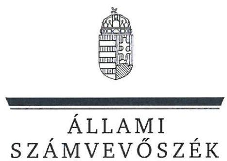
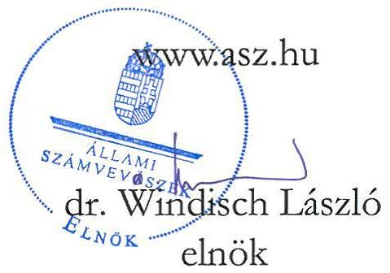
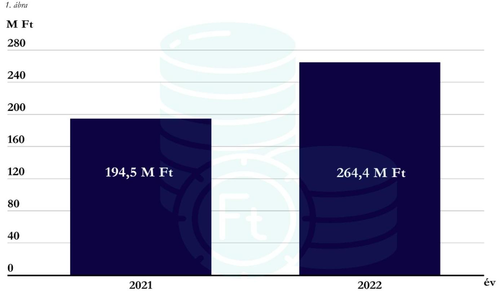
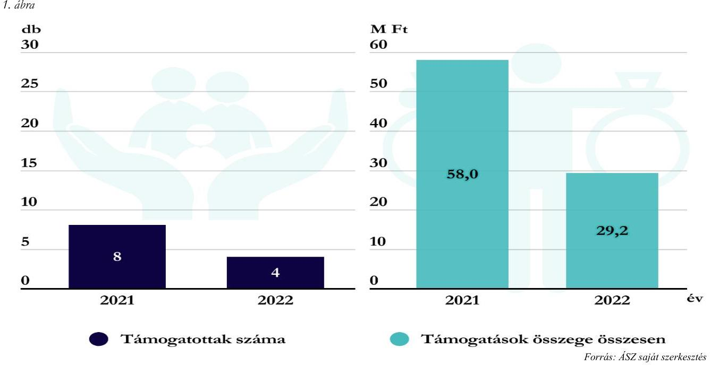

# JELENTÉS 

## Költségvetési támogatásban részesülő pártalapítványok 2021-2022. évi gazdálkodása törvényességének ellenőrzése

Új Köztársaságért Alapítvány

2024.

---

ÁLLAMI SZÁMVEVŐSZÉK

# JELENTÉS 

## Költségvetési támogatásban részesülő pártalapítványok 2021-2022. évi gazdálkodása törvényességének ellenőrzése

Új Köztársaságért Alapítvány

2024.

24061

---

# ELLENŐRZÉSI IGAZGATÓSÁG: 

## ÁLLAMHÁZTARTÁSON KÍVÜLI SZERVEZETEKET ELLENŐRZŐ IGAZGATÓSÁG

## ELLENŐRZÉSI IGAZGATÓ:

## KLINGA LÁSZLÓ igazgató

## ELLENŐRZÉSVEZETŐ:

## KAKAS SÁNDOR ellenőrzésvezető

## Jelentéseink az interneten a www.asz.hu címen olvashatók.

IKTATÓSZÁM: EL-3847-178/2024

TÉMASZÁM: 2673

ELLENŐRZÉS-AZONOSÍTÓ SZÁM: V1017

---

# TARTALOMJEGYZÉK 

- AZ ELLENŐRZÉS ALAPADATAI ..... 5
- AZ ELLENŐRZÖTT SZERVEZET ..... 8
- ÖSSZEFOGLALÁS ..... 10
- AZ ELLENŐRZÉS FÓKUSZKÉRDÉSEI ..... 12
- MEGÁLLAPÍTÁSOK ..... 13
- JAVASLATOK ..... 20
- MELLÉKLETEK ..... 21
I. sz. melléklet: Értelmező szótár ..... 21
II. sz. melléklet: Ellenőrzési kritériumok ..... 22
- FÜGGELÉK: ÉSZREVÉTELEK ..... 23
- RÖVIDÍTÉSEK JEGYZÉKE ..... 24

---

.

---

# AZ ELLENŐRZÉS ALAPADATAI 

## AZ ELLENŐRZÉS CÉLJA

Az ellenőrzés célja annak értékelése volt, hogy a Pártalapítvány ${ }^{1}$ törvényesen gazdálkodott-e; az éves számviteli beszámolók és a Pártalapítvány tevékenységéről szóló éves jelentések a jogszabályi előírásoknak megfeleltek-e; a könyvvezetés és gazdálkodás során a vonatkozó jogszabályi rendelkezéseket és belső előírásokat betartották-e. Az ellenőrzés célja továbbá annak értékelése, hogy a Pártalapítvány legutóbbi ellenőrzése eredményeként készült számvevőszéki jelentésben foglalt megállapításokkal összhangban készített intézkedési tervben meghatározott feladatokat a Pártalapítvány végrehajtotta-e.

## AZ ELLENŐRZÉS TÍPUSA

Szabályszerüségi ellenőrzés

## AZ ELLENŐRZÖTT IDŐSZAK

2021-2022. évek
Az utóellenőrzés tekintetében az utóellenőrzés alapját képező 22034. számú ÁSZ jelentés² közzétételének napjától (2022.06.14.) az ellenőrzésről szóló adatszolgáltatásra felhívó levél keltének napjáig (2023.09.13.) terjedő időszak.

## AZ ELLENŐRZÉS TÁRGYA

Az ellenőrzés tárgyát képezte a Pártalapítvány gazdálkodása, a könyvvezetés szabályozása és gyakorlatának szabályszerűsége, az egyszerűsített éves beszámolókra és a Pártalapítvány tevékenységéről szóló éves jelentésekre vonatkozó kötelezettség teljesítése, valamint a gazdálkodáshoz kapcsolódó korábbi ÁSZ ${ }^{3}$ ellenőrzés javaslatainak hasznosítására irányuló tevékenység.

Az ellenőrzés kiterjedt minden olyan körülményre és adatra, amely az ÁSZ jogszabályban meghatározott feladatainak teljesítéséhez, valamint az ellenőrzési program végrehajtása során felmerülő újabb összefüggések feltárásához szükséges volt.

## AZ ELLENŐRZÉS JOGALAPJA

Az ellenőrzés jogalapját az ÁSZ tv. ${ }^{4} 1 . \int(3)$ bekezdése, 5. $\int(3)$ bekezdése, 33. $\int(7)$ bekezdése, valamint a Pmtv. ${ }^{5} 4 . \int(2)$ és (4) bekezdéseinek előírásai képezték.

---

# AZ ELLENŐRZÉS MÓDSZERE 

Az ellenőrzés az ellenőrzött időszakban hatályos jogszabályok, az ellenőrzés szakmai szabályai, a jelen ellenőrzésre irányadó ÁSZ módszertanok, az ellenőrzési programban foglalt értékelési szempontok szerint került végrehajtásra.

Az ellenőrzési kérdések megválaszolásához szükséges bizonyítékok megszerzése az ellenőrzött által rendelkezésre bocsátott dokumentumokra, adatokra alapozva kérdésfeltevés (információkérés), mintavételezés, továbbá helyszíni interjú útján történt. Az ellenőrzési bizonyítékként felhasználható adatforrások közé tartoztak egyrészt az ellenőrzési programban felsorolt adatforrások, másrészt minden az ellenőrzés folyamán feltárt, az ellenőrzés szempontjából információt tartalmazó dokumentum.

Az ellenőrzés lefolytatásához az ellenőrzött szervezet tanúsítványok kitöltésével és az ÁSZ által kért dokumentumok, adatok, információk megküldésével, és az ellenőrzés során szolgáltatott adatokat.

A Pártalapítvány kiadásai, ráfordításai elszámolásának szabályszerűségét (2. fókuszkérdés), a Pártalapítvány által nyújtott támogatások elszámolásának szabályszerűségét (2. fókuszkérdés), valamint a mérlegtételek besorolásának, év végi értékelésének, azok leltárral való alátámasztottságának szabályszerűségét (3. fókuszkérdés) mintavételi eljárással kiválasztott tételek alapján ellenőrizte az ÁSZ.

A 2. fókuszkérdésnél az egyes vizsgálandó részterületek ellenőrzése részterületenként 30 elemű minta értékelésével, mintavételes, 30 db -ot meg nem haladó tételszám esetében tételes ellenőrzéssel történt. A kiadások esetében lényegességi szempontok alapján az ÁSZ további mintatételeket is értékelt, amelyek a kivetítésbe nem tartoztak bele. Az ÁSZ a 2. fókuszkérdésnél, a kiadások vonatkozásában 30-30 mintatételt ellenőrzött, a minták értékelése alapján statisztikai kivetítést alkalmazott, további lényegességi szempontok alapján 2021. évben 11 db, 2022. évben 7 db kiválasztott mintatételt ellenőrzött. Az ÁSZ a 2. fókuszkérdésnél a Pártalapítvány által nyújtott támogatások vonatkozásában - tekintettel arra, hogy az alapsokaság elemszáma egyik évben sem haladta meg a 30 tételt - tételes ellenőrzést végzett. Az ÁSZ a 3. fókuszkérdésnél, a mérlegtételek vonatkozásában 30-30 mintatételt ellenőrzött, a tények feltárása és azok összegzése során a megállapítások az ellenőrzött tételekre vonatkozóan kerültek megfogalmazásra.

A vizsgált terület „szabályszerü" minősítést kapott, ha a minta ellenőrzésének eredménye alapján 95\%-os bizonyossággal a teljes sokaságban az átlagos hibaarány nem haladta meg a 10\%-ot, „nem szabályszerű", ha nagyobb volt, mint $10 \%$. Amennyiben a sokaság elemszáma nem haladta meg az előírt minta elemszámot, akkor a sokaság valamennyi elemének tételes ellenőrzésére került sor.

A Pártalapítvány bevételei elszámolásának szabályszerűségét teljeskörűen ellenőrizte az ÁSZ.
Az utóellenőrzés megállapításai az ÁSZ rendelkezésére álló dokumentumok, valamint az ÁSZ adatbekérése szerint, az ellenőrzött szervezet által rendelkezésre bocsátott dokumentumok, adatok alapján kerültek megfogalmazásra. Az ÁSZ a 2022. évben a Pártalapítvány 2019-2020. évi gazdálkodását ellenőrizte, megállapításait a 22034. számú jelentésben tette közzé. Az ellenőrzés esetében a 22034. számú ÁSZ jelentés alapján a Pártalapítvány által készített intézkedési tervben előírt feladatok, azok végrehajthatósága, illetve végrehajtása szempontjából az alábbiak szerint kerültek értékelésre:

- „határidőben végrehajtott" a feladat, ha a teljesítés dokumentáltan, az intézkedési tervben előírt határidőben és tartalommal megtörtént;
- „határidőn túl végrehajtott" a feladat, ha annak teljesítése az intézkedési tervben meghatározott módon, de az abban előírt határidőn túl történt meg;

---

- „nem végrehajtott" a feladat, ha a végrehajtás nem történt meg, vagy amennyiben a teljesítést/végrehajtást nem dokumentálták, dokumentumokkal nem tudják igazolni annak teljesítését;
- „okafogyottá vált" a feladat, ha végrehajtására - meghatározott esemény bekövetkezése, továbbá külső körülmény, a múködést érintő feltétel változása miatt - már nincs szükség, illetve lehetőség, és egyértelműen megállapítható, hogy az intézkedést szükségessé tevő körülmény a jövőben nem fordulhat elő;
- „nem idöszert" az a feladat, amelynek ellenőrzési időszakon belüli végrehajtására azért nem került (kerülhetett) sor, mert az intézkedés alapjául szolgáló esemény nem következett be, de annak jövőbeni előfordulása lehetséges, a végrehajtása nem volt esedékes, vagy a végrehajtás határideje még nem járt le.
A gazdálkodás hibáinak kijavítására irányuló javaslatok kidolgozásakor a hatályos jogszabályok az irányadóak.

---

# AZ ELLENŐRZÖTT SZERVEZET 

## ÜJ KÖZTÁRSASÁGÉRT ALAPÍTVÁNY

A Demokratikus Koalíció 2014. decemberében, $0,2 \mathrm{M}$ Ft induló vagyonnal a párt működését segítő alapítványként hozta létre a Pártalapítványt, amelyet a Fővárosi Törvényszék 2014. december 10-én jogerőre emelkedett végzésével vett nyilvántartásba.

A Pártalapítvány Alapító okirat ${ }_{1-2}{ }^{8}$-ben foglalt célja: a politikai kultúra fejlesztése érdekében történő politikai képzés, kutatás, tudományos és ismeretterjesztő tevékenység támogatása. A Pártalapítvány céljai elérése érdekében az Alapító okirat ${ }_{1-2}$ szerint elsősorban az alább felsorolt tevékenységeket végezte/és vagy támogatta:

- „kutatás, tudományos tevékenység; hazai közpolitikai és nemzetközi kutatások, felmérések, a politikai folyamatok és a közzélemény monitorozása, tanulmányok, politikai programok készítése, közremüködés a Demokratikus Koalíció programjának, szakpolitikai-, és választási elképpeléseinek kidolgozásában, megvitatásában, terjesztésében, hazai és nemzetközi konferenciák szervezése, kiadványok megjelentetése;
- politikai képzés, oktatás, képesség-fejlesztés és tehetséggondozás;
- ismeretterjesztő tevékenység;
- egyéb tevékenység."

A Pártalapítvány ügyvezető és vagyonkezelő szerve a Kuratórium ${ }^{7}$. Az ellenőrzött időszakban a Kuratórium elnökének és egy tagjának személyében egy alkalommal történt változás.

A Pártalapítvány az Alapító okirat ${ }_{1-2}$ szerint gazdasági tevékenység végzésére volt jogosult, ezen túl az $\mathrm{SZMSZ}_{1-2}{ }^{8}$ is tartalmazza, hogy vállalkozási tevékenységet folytathatott, azonban az ellenőrzött időszakban gazdasági-vállalkozói tevékenységet nem végzett.

A Pártalapítvány jogszabályi előírás alapján könyvvizsgálatra nem volt kötelezett, a Pártalapítvány 2021-2022. évi egyszerűsített éves beszámolóit független könyvvizsgáló nem vizsgálta felül.

A Pártalapítvány tekintetében külső ellenőrzés, törvényességi felügyeleti ellenőrzés az ellenőrzött időszakban nem volt.

A Pártalapítvány célszerinti tevékenységének ellátásához 2021. és 2022. évben részesült költségvetési támogatásban, amelynek évenkénti alakulását az 1. ábra szemlélteti. A Pártalapítvány a költségvetési támogatáson túl magánszemélyektől 2021. évben 4,0 M Ft, 2022. évben 4,2 M Ft támogatást kapott.

---

# Költségvetési támogatás

*Forrás: ÁSZ saját szerkesztés*

---

# ÖSSZEFOGLALÁS 

Az ÁSZ ellenőrzése a Párttv. ${ }^{9}$ alapján a politikai kultúra fejlesztése érdekében tudományos, ismeretterjesztő, kutatási, oktatási tevékenység folytatása céljából, a Ptk. ${ }^{10}$ szerinti alapító okiraton alapuló bírósági nyilvántartásba vétellel létrejött Pártalapítvány gazdálkodására terjedt ki. A Pmtv. 4. § (2) bekezdése értelmében a pártalapítványok gazdálkodása törvényességének ellenőrzése az ÁSZ feladata. A Pmtv. 4. $\S$ (4) bekezdése alapján az ÁSZ kétévente - kötelező jelleggel - ellenőrzi azoknak a pártalapítványoknak a gazdálkodását, amelyek állami költségvetési támogatásban részesültek.

A pártalapítványok ellenőrzésével az ÁSZ hozzájárul ahhoz, hogy a társadalom objektív képet alkothasson a pártalapítványok működéséről, gazdálkodásáról. Az ellenőrzésről készített számvevőszéki jelentésben megfogalmazott megállapítások, javaslatok alapján a törvényalkotók konkrét lépéseket tehetnek a pártalapítványokra vonatkozó szabályozások megváltoztatása, átláthatóbbá, ellenőrizhetőbbé tétele érdekében. Az ellenőrzött szervezetek szintjén a hiányosságok, szabálytalanságok feltárása, az ennek kapcsán megfogalmazott megállapítások elősegíthetik a pártalapítványok szabályszerű gazdálkodását.

Az ellenőrzött időszakban az Alapító okirat ${ }_{1-2}$ rögzítette a Pártalapítvány működési kereteit. Az Alapító okirat ${ }_{1-2}$ a jogszabályi előírásokkal összhangban tartalmazta a Pártalapítvány működésének célját, tevékenységét, meghatározták a Pártalapítvány ügyvezető szervét, összetételét, működését.

A Pártalapítvány a gazdálkodás szervezeti kereteit nem teljeskörűen alakította ki.

A Pártalapítvány az ellenőrzött időszakban rendelkezett a Számv. tv. ${ }^{11}$ szerint kötelezően elkészítendő számviteli politika ${ }_{1-2}{ }^{12}$-vel, és annak keretében elkészített leltározási szabályzat ${ }_{1-2}{ }^{13}$-vel, az eszközök és a források értékelési szabályzat ${ }^{14}$-ával és a pénzkezelési szabályzat ${ }^{15}$-tal. A Pártalapítvány az ellenőrzött időszakban rendelkezett számlarend ${ }_{1-2}{ }^{16}$-vel. A számviteli szabályzatok a számlarend ${ }_{1}$ és a pénzkezelési szabályzat ${ }_{2}$ kivételével megfeleltek a Számv. tv.-ben előírtaknak.

A kiadások, nyújtott támogatások elszámolása szabályszerű volt.

A Pártalapítvány a 2021. és a 2022. évben a tevékenységének költségeit, ráfordításait szabályszerűen számolta el. A Pártalapítvány a kapott támogatások elszámolása során a jogszabályi előírásokat betartotta. A Pártalapítvány mindkét ellenőrzött évben nyújtott támogatást harmadik személy részére. A nyújtott támogatások a Pártalapítvány céljaival összhangban voltak, a támogatások odaítélése, elszámolása, nyilvántartása során a jogszabályi rendelkezéseket betartották. A Pártalapítvány az ellenőrzött időszakban a Párttv. előírásainak megfelelve az alapító párt ${ }^{17}$ részére támogatást, vagyoni hozzájárulást nem adott.

A Pártalapítvány a jogszabályi előírások alapján mindkét ellenőrzött évben elkészítette és közzétette a

A 2022. évi számviteli beszámoló mérlegtételeinek alátámasztása nem felelt meg a jogszabályi előírásoknak.
tevékenységéről szóló éves jelentéseket, valamint az egyszerűsített éves beszámolóit, azonban a tevékenységről szóló éves jelentések a Pmtv.-ben foglaltak ellenére nem tartalmazták a költségvetési támogatás felhasználására vonatkozó kimutatást. A 2022. évi egyszerűsített éves beszámoló ellenőrzött mérlegtételeit a Számv. tv. előírásai ellenére teljeskörűen leltárral nem támasztották alá.

---

Az egyszerűsített éves beszámolók mérlegtételeinek besorolása, értékelése az ellenőrzött tételek esetében szabályszerű volt.

A Pártalapítvány a 2022. évben kapott központi költségvetési támogatás fel nem használt részét a Számv. tv. és a számviteli politika ${ }_{1,2}$ előírásaival ellentétben könyvelésében nem határolta el.

Az intézkedési tervben meghatározott feladatokat határidőben végrehajtották.

A Pártalapítvány az utóellenőrzés megállapítása alapján az intézkedési tervben meghatározott feladatokat határidőben végrehajtotta.

Az ÁSZ a Kuratórium Elnöke részére a feltárt szabálytalanságok jövőbeni kiküszöbölése érdekében négy javaslatot fogalmazott meg.

---

# AZ ELLENŐRZÉS FÓKUSZKÉRDÉSEI 

1. A Pártalapítvány kialakította-e a törvényes gazdálkodásához szükséges szabályokat?
2. A Pártalapítvány a könyvvezetése és gazdálkodása során betartotta-e a jogszabályi előírásokat?
3. A Pártalapítvány tevékenységéről szóló jelentések, az éves számviteli beszámolók a jogszabályi előírásoknak megfeleltek-e?
4. A Pártalapítvány az intézkedési tervben meghatározott feladatokat végrehajtotta-e?

---

# 1. A Pártalapítvány kialakította-e a törvényes gazdálkodásához szükséges szabályokat? 

Összegző megállapítás A 2021-2022. években a Pártalapítvány a törvényes gazdálkodásához szükséges szabályokat teljeskörűen nem alakította ki, mivel a számviteli szabályzatok tekintetében az ellenőrzés hiányosságot tárt fel.
1.1. számú megállapítás

A Pártalapítvány működésének szabályait a jogszabályokban előírtaknak megfelelően rögzítették.

Az Alapító okirat ${ }_{1-2}$-ben a Pmtv. és a Ptk. ${ }_{2}$ előírásának megfelelőn kijelölték a Pártalapítvány ügyvezető szervét, a Kuratóriumot, a Kuratórium tagjait, a Pártalapítvány képviseletére jogosult személyeket, valamint meghatározták a képviseleti jog terjedelmét, továbbá a képviseleti jog gyakorlásának módját. A Pártalapítványt a Kuratórium Elnöke, továbbá 2022. július 1-jétől az Alapító okirat2-ben megjelölt kuratóriumi tag is önállóan jogosult képviselni.
A Pártalapítvány a gazdálkodásával kapcsolatos könyvvezetési-nyilvántartási rendszerét az Eszkr. ${ }^{18}$ rendelkezéseinek megfelelően kialakította. A Pártalapítvány a 2021. és 2022. évekre vonatkozóan a Számv. tv.-ben előírtak szerint kettős könyvvitellel alátámasztott egyszerűsített éves beszámolót készített, az ellenőrzött időszakban könyvvezetését, beszámolórendszerét nem változtatta. A Pártalapítvány pénzügyi- és számviteli feladatait az ellenőrzött időszakban munkaszerződés alapján a pénzügyi vezető látta el. A könyvviteli szolgáltatás végzésével, a beszámoló elkészítésével megbízott pénzügyi vezető rendelkezett a Számv. tv. és az Eszkr. rendelkezéseinek megfelelő, szükséges szakmai szakképesítéssel.
1.2. számú megállapítás

A Pártalapítvány gazdálkodására vonatkozó számviteli szabályzatok esetében hiányosságokat tárt fel az ellenőrzés.

A Pártalapítvány az ellenőrzött időszakban a Számv. tv.-nek megfelelően rendelkezett számviteli politikával ${ }_{1-2}$, és annak keretében elkészítette a leltározási szabályzatot ${ }_{1-2}$, az eszközök és a források értékelési szabályzatát és a pénzkezelési szabályzatot ${ }_{1-2}$, rendelkezett számlarenddel ${ }_{1-2}$.
A számviteli politika ${ }_{1-2}$, a leltározási szabályzat ${ }_{1-2}$ és az eszközök és a források értékelési szabályzata a Számv. tv-ben előírtaknak megfelelt. A 2021. május 19-től hatályos pénzkezelési szabályzat ${ }_{2}$ a Számv. tv. 14. § (8) bekezdésében foglaltakkal ellentétben nem tartalmazott előírást a napi készpénz záró állomány maximális mértékéről.
A Számv. tv. 161. § (2) bekezdés a)-b) pontjában foglaltakkal ellentétben a számlarend ${ }_{1}$ nem tartalmazta minden alkalmazásra kijelölt számla számjelét és megnevezését (pl.: 1131 Kisértékủ vagyoni értékủ jogok; 143 Irodai, igazgatási, berendezések és felszerelések; 4632 Nyugdíjjárulék elszámolása; 5221 Teréz krt. iroda bérlet; 532 Bankköltségek; 564 Szakképzési hozzájárulás stb.), valamint a számla tartalmát, ha az a

---

számla megnevezéséből egyértelműen nem következett, továbbá a számla értéke növekedésének, csökkenésének jogcímeit, a számlát érintő gazdasági eseményeket, azok más számlákkal való kapcsolatát.
A Pártalapítvány céljaira rendelt vagyont és annak felhasználási módját a törvényi előírásoknak megfelelően az Alapító okirat ${ }_{1-2}$-ben rögzítették, amellyel összhangban a Pártalapítvány SZMSZ ${ }_{1-2}$-ben is rendelkeztek az alapítványi vagyonról és felhasználásának módjáról. A Pártalapítvány céljaira rendelt vagyon nyilvántartását, elszámolása rendjét, e vagyon nyilvántartásának továbbrészletezését a jogszabályi előírásoknak megfelelően biztosították.
1.3. számú megállapítás

A Pártalapítvány alapcélja ellátásához kapcsolódó gazdálkodási tevékenysége szabályszerű volt.

A Pártalapítvány a 2021. és 2022. évi tevékenységéről szóló jelentéseinek és egyszerűsített éves beszámolóinak adatai alapján a Ptk. ${ }_{2}$-ban előírtaknak és az Alapító okirat ${ }_{1-2}$-ben foglaltaknak megfelelően nem volt korlátlan felelősségű tagja más jogalanynak, nem volt alapítója más alapítványnak, nem csatlakozott más alapítványhoz.
A Pártalapítvány Alapító okirat ${ }_{1-2}$-ának 3.3 pontja a Pmtv. előírásaival összhangban tartalmazta, hogy a Pártalapítvány „Az alapítványi cél megvalósitásával közzvetlenül összefüggő gazdasági tevékenység végzésére jogosult.", továbbá az SZMSZ ${ }_{1-2}$ II. 1) a. pontjában is rögzítették, hogy a Pártalapítvány „másodlagos és kisegitő jelleggel vállalkozási tevékenységet folytathat". A Pártalapítvány 2021. és 2022. évben az egyszerűsített éves beszámolók és az azokat alátámasztó könyvviteli nyilvántartások adatai szerint gazdasági-vállalkozói tevékenységet nem folytatott.

# 2. A Pártalapítvány a könyvvezetése és gazdálkodása során betartotta-e a jogszabályi előírásokat? 

## Összegző megállapítás

2.1. számú megállapítás

A Pártalapítvány a könyvvezetése és gazdálkodása során a jogszabályi rendelkezéseket és a belső szabályzatok előírásait betartotta.

A Pártalapítvány a 2021-2022. évben a támogatásokat szabályszerűen fogadta el, számolta el.

A Pártalapítvány a 2021. és 2022. évi Kv.tv. ${ }^{19}$, továbbá az 1284/2022. (VI. 7.) Korm. határozat ${ }^{20}$ alapján a 2021. évben 194,5 MFt, a 2022. évben 264,4 MFt költségvetési támogatásban részesült. A Pártalapítvány a költségvetésből juttatott támogatáson túl az ellenőrzött időszakban magánszemélyektől fogadott el támogatást a Pmtv.-ben előírtaknak megfelelően; a támogatást nyújtó egyértelműen azonosítható volt, a támogatás minden esetben az azt nyújtó személy fizetési számlájáról a Pártalapítvány pénzforgalmi számlájára történő átutalással valósult meg, továbbá a Pártalapítvány a honlapján a támogatást nyújtó személy nevét és a támogatás összegét közzétette. Külföldről származó támogatás a Pártalapítvány részére az ellenőrzött időszakban nem érkezett.
A Pártalapítvány az Eszkr. előírásainak megfelelően, a számlarend ${ }_{1-2}$-ben foglaltak szerint az egyéb bevételeken belül elkülönítetten tartotta nyilván a költségvetésből kapott támogatást, juttatást, valamint az egyéb kapott támogatásokat. A Pártalapítvány az ellenőrzött időszakban nem kapott továbbutalási céllal támogatást.

---

A kapott támogatások az Eszkr. rendelkezéseinek megfelelően a 2021. és 2022. évi egyszerűsített éves beszámolók eredménykimutatásában egyaránt bevételként kerültek elszámolásra. A Pártalapítvány a 2021. évi egyszerűsített éves beszámolójának eredménykimutatásában a magánszemélyektől kapott támogatások összegét az Eszkr. 12. § (3) bekezdésében, továbbá Ectv. ${ }^{21}$ 2. § 1. pontjában foglaltakkal ellentétben tévesen adományként tüntette fel. A Pártalapítvány 2021. évi főkönyvi kivonata alapján a Pártalapítvány az ellenőrzött időszakban adományt nem kapott, amelyet a Pártalapítvány által kiállított 7. számú tanúsítvány is alátámasztott, továbbá a helyszíni ellenőrzés során a Pártalapítvány részéről adott tájékoztatás is megerősített. A Pártalapítvány a 2022. évi egyszerűsített éves beszámolójának eredménykimutatásában az Eszkr. 24. § (2) bekezdésében foglaltakkal ellentétben az egyéb bevételeken belül a kapott támogatások összegét nem részletezte, mivel az eredménykimutatás támogatások elnevezésű során a kapott támogatás összegét nem szerepeltette.
A Pártalapítvány a Pmtv.-ben foglaltaknak megfelelően a központi költségvetési szervtől kapott támogatás mértékét a tevékenységről szóló éves jelentésében szerepeltette.
2.2. számú megállapítás

A 2021. és 2022. évben a Pártalapítvány által nyújtott cél szerinti támogatások odaítélése, elszámolása, beszámolóban történő bemutatása szabályszerű volt.

A Pártalapítvány 2021. és 2022. évben jogi személyek és egy természetes személy részére nyújtott támogatást. A magánszemély részére nyújtott támogatás összege 2021. évben 1,0 M Ft volt. Az ellenőrzött időszakban a támogatottak számát és a ténylegesen nyújtott támogatás összegét a 2. ábra mutatja be.

Az ellenőrzés tételesen ellenőrizte a 2021-2022. évben nyújtott cél szerinti támogatásokat.
Az Alapító okirat ${ }_{1-2}$ mellett, azzal összhangban az SZMSZ ${ }_{1-2}$-ben szabályozták a támogatások nyújtását. A Pártalapítvány által a 2021. és 2022. évben nyújtott támogatások - a vonatkozó kuratóriumi határozatok tartalma szerint - egyéni támogatási kérelmek alapján kerültek kiutalásra. A támogatás összegének kifizetését minden esetben a Kuratórium Elnöke engedélyezte és egyúttal utalványozta. A támogatások kifizetése minden esetben a kedvezményezett részére történt. A Pártalapítvány a kedvezményezettel a Ptk. ${ }_{2}$-ban, továbbá az SZMSZ-ben foglaltaknak megfelelően minden esetben

---

támogatási szerződést kötött. A támogatások odaítéléséről a Ptk. ${ }_{2}$ értelmében a Pártalapítvány arra jogosult szerve, a Kuratórium határozott. A megkötött támogatási szerződések összhangban voltak a Kuratórium döntésével. Az adott támogatások rendeltetésszerű felhasználásának ellenőrzése céljából, konkrét határidő megjelölésével, tételes elszámolás megküldését írta elő a Kuratórium a támogatottak részére. A Pártalapítvány a kedvezményezetteket a támogatást jóváhagyó döntésben és a támogatási szerződésben előírtaknak megfelelően beszámoltatta.
A Számv. tv. rendelkezéseinek megfelelően a támogatások a 86 Egyéb ráfordítások között kerültek elszámolásra.
A Pártalapítvány 2021. és 2022. évi egyszerűsített éves beszámolóinak közhasznúsági melléklete az Ectv. előírásának megfelelően tartalmazta a közhasznú cél szerinti juttatásokról készült kimutatást. A Pártalapítvány tevékenységről szóló éves jelentés mindkét ellenőrzött évben a Pmtv.-ben foglaltaknak megfelelően tartalmazta a Pártalapítvány által nyújtott támogatásokkal kapcsolatos adatokat.
2.3. számú megállapítás

A Pártalapítvány kiadásainak elszámolása a 2021. és 2022. évben szabályszerűen történt.

A Pártalapítvány kiadásainak elszámolása 2021. évben és 2022. évben is szabályszerű volt, a kiadási mintatételek ellenőrzése során az ellenőrzés az alábbiakat tárta fel:

- a könyvviteli elszámolást közvetlenül alátámasztó bizonylatok - 2021. évben három mintatétel, 2022. évben pedig két mintatétel kivételével - a Számv. tv.-nek megfelelően tartalmazták a gazdasági műveletet elrendelő személy aláírását. A kivételt képező mintatételek esetén a könyvviteli elszámolást közvetlenül alátámasztó bizonylat nem felelt meg a Számv.tv. 167. § (1) bekezdés c) pontjában és az SZMSZ Az Alapítványi vagyon és felhasználásának módja III. pontjában előírtaknak;
- az utalványozás a számlákon - 2021-2022. években két-két mintatétel kivételével - szabályszerűen történt a Számv. tv. előírásai alapján. A kivételt képező mintatételek esetén a mintatételekhez becsatolt egyszerűsített számlákon a Számv.tv. 167. § (1) bekezdés c) pontjában és az SZMSZ Az Alapítványi vagyon és felhasználásának módja IV. pontjában foglaltak ellenére nem szerepel az utalványozásra jogosult aláírása és az utalványozás dátuma;
- a végrehajtás igazolása - 2021. és 2022. évben két-két mintatétel kivételével - a számlára történő rávezetéssel vagy külön dokumentumban a Számv. tv.-nek megfelelően megtörtént;
- a könyvviteli elszámolást alátámasztó bizonylatokon az érintett könyvviteli számlákra történő hivatkozás - 2021. évben tizenkilenc, 2022. évben pedig öt mintatétel kivételével - megfelelt a Számv. tv. előírásainak. A kivételek esetén a bizonylatok - tekintettel arra, hogy az azokra felvezetett számlaszámok nem egyeztek a számlarend; által megnevezett számlákkal, mivel a számlarend; nem tartalmazta valamennyi alkalmazásra kijelölt számla számjelét, megnevezését, tartalmát - nem feleltek meg a Számv.tv. 167. § (1) bekezdés h) pontjában előírt általános tartalmi kellékeknek, követelményeknek.
- a költségek elszámolása a Számv. tv.-ben foglaltak alapján mindkét évben a megfelelő költségnemre történt.
A 2021. és 2022. évre lényegességi szempont szerint kiválasztott kiadási mintatételek ellenőrzése során az ellenőrzés a következőket állapította meg:

---

- a könyvviteli elszámolást közvetlenül alátámasztó bizonylatok - 2021. évben két, 2022. évben egy mintatétel kivételével - a Számv. tv.-nek megfelelően tartalmazták a gazdasági műveletet elrendelő személy aláírását. A kivételt képező mintatételek esetén a könyvviteli elszámolást közvetlenül alátámasztó bizonylat nem felelt meg a Számv.tv. 167. § (1) bekezdés c) pontjában és az SZMSZ Az Alapítványi vagyon és felhasználásának módja III. pontjában előírtaknak;
- a kiadásokat a Számv. tv.-nek megfelelően szabályszerűen kiállított bizonylat alapján jegyezték be a könyvviteli nyilvántartásba;
- az utalványozás és a végrehajtás igazolása a Számv. tv.-nek megfelelően megtörtént;
- a költségek elszámolása a Számv. tv.-ben foglaltak alapján mindkét évben a megfelelő költségnemre történt;
- a számviteli bizonylatok az érintett könyvviteli számlákra történő hivatkozást - 2021-2022. években két-két mintatétel kivételével - a Számv. tv. 167. § (1) bekezdés h) pontjában rögzített előírás ellenére nem tartalmazták, a számlarend1 vonatkozásában feltárt hiányosság okán.

# 3. A Pártalapítvány tevékenységéről szóló jelentések, az éves számviteli beszámolók a jogszabályi előírásoknak megfeleltek-e? 

Összegző megállapítás

A Pártalapítvány 2021. és 2022. évi tevékenységéről szóló éves jelentések esetében az ellenőrzés hiányosságot tárt fel. A Pártalapítvány 2021. évi egyszerűsített éves beszámolója megfelelt, 2022. évi egyszerűsített éves beszámolója nem felelt meg a Számv. tv. előírásainak.
3.1. számú megállapítás

A Pártalapítvány a 2021. és 2022. évi tevékenységéről szóló éves jelentését elkészítette, azonban a tevékenységről szóló éves jelentések a Pmtv. előírása ellenére nem tartalmazták a költségvetési támogatás felhasználására vonatkozó kimutatást.

A Pártalapítvány a Pmtv. előírásai alapján a 2021. és 2022. évre vonatkozóan elkészítette tevékenységéről szóló éves jelentését. Az éves tevékenységről szóló jelentések a Pmtv.-ben foglaltak szerint tartalmazták a számviteli beszámolót, annak részeként a vagyon felhasználásával kapcsolatos kimutatást, a cél szerinti juttatások kimutatását, a központi költségvetési szervtől kapott támogatás mértékét; a Pártalapítvány egyes vezető tisztségviselőinek nyújtott juttatások értékét, illetve összegét; továbbá a Pártalapítvány tevékenységéről szóló rövid tartalmi beszámolót. A Pártalapítvány 2021. és 2022. évi tevékenységéről szóló éves jelentése a Pmtv. 3/A. § (3) bekezdés b) pontjában foglaltak ellenére nem tartalmazta a költségvetési támogatás felhasználására vonatkozó kimutatást.
A Pártalapítvány 2021. és 2022. évekre vonatkozó éves tevékenységről szóló jelentését - annak hiányossága ellenére - a Kuratórium elfogadta, az éves tevékenységről szóló jelentések a Magyar Közlöny mellékleteként megjelenő Hivatalos Értesítőben a Pmtv. előírásainak megfelelő határidőben jelentek meg. A 2021. és 2022. évi tevékenységről szóló jelentéseit a Pártalapítvány a Pmtv.-ben rögzített határidőben honlapján közzétette.

---

3.2. számú megállapítás

A Pártalapítvány a jogszabályok előírásai alapján elkészítette 2021. és 2022. évre vonatkozóan egyszerúsített éves beszámolóit, azonban a 2022. évi egyszerúsített éves beszámoló ellenőrzött mérlegtételeinek alátámasztásához teljeskörű leltárat nem készített.

A Pártalapítvány a Számv. tv., valamint az Eszkr. és az Ectv. előírásai alapján a 2021. és 2022. évi múködéséről, vagyoni, pénzügyi és jövedelmi helyzetéről az üzleti év könyveinek lezárását követően, az üzleti év utolsó napjával elkészítette egyszerűsített éves beszámolóit, kiegészítő és közhasznúsági mellékleteit.
A Pártalapítvány 2021. évi és 2022. évi egyszerűsített éves számviteli beszámolóját a Kuratórium határozattal elfogadta, ezt követően egyszerűsített éves beszámolóit, valamint közhasznúsági mellékleteit a Kuratórium által elfogadott tartalommal, az Ectv. előírásának megfelelően - határidőn belül - 2022. május 23-án, illetve 2023. május 25-én megküldte az $\mathrm{OBH}^{22}$-nak, továbbá a 2021. és 2022. évi jelentéssel saját honlapján közzé tette.
A Pártalapítvány a 2022. évi egyszerűsített éves beszámolójának ellenőrzött mérlegtételeinek alátámasztásához a Számv. tv. 69. § (1) bekezdésében foglaltak ellenére nem állított össze olyan leltárat, amely tételesen és ellenőrizhető módon tartalmazta a Pártalapítványnak a mérleg fordulónapján meglévő eszközeit és forrásait mennyiségben és értékben, mivel a 2022. évi egyszerűsített éves beszámoló alátámasztásához, 2023. április 14-én készített mérlegleltár a befektetett eszközök és az aktív időbeli elhatárolások leltárát nem tartalmazta.
A 2021. és 2022. évi egyszerűsített éves beszámolók mérlegtételeit megfelelő főkönyvi számon tartották nyilván, a mérlegtételek tartalma, besorolása és bekerülési értékének meghatározása megfelelt a Számv. tv. és az Eszkr. előírásainak.
A Pártalapítvány a könyvviteli nyilvántartásában a költségvetési támogatást és a magánszemélytől kapott támogatásokat elkülönítetten tartotta nyilván, azonban a támogatások felhasználását a 2021. és 2022. évi főkönyvi kivonatok alapján az Eszkr. 14. § (1) bekezdésében foglaltak ellenére nyilvántartásában nem különítette el.
A Pártalapítvány a 2022. évi egyszerűsített éves számviteli beszámolóját alátámasztó főkönyvi kivonat alapján a 2022. évben kapott központi költségvetési támogatást teljeskörűen nem használta fel. A Pártalapítvány 2022. év végén a költségek (a ráfordítások) ellentételezésére - visszafizetési kötelezettség nélkül - kapott, pénzügyileg rendezett, egyéb bevételként elszámolt támogatás összegéből az üzleti évben költséggel, ráfordítással nem ellentételezett összeget a Számv. tv. 44. § (2) bekezdése ellenére a 2022. évi egyszerűsített éves beszámolójában nem mutatta ki passzív időbeli elhatárolásként.
3.3. számú megállapítás

A Pártalapítvány céljaira rendelt vagyonnak a kezelése és védelme, az arról való beszámolás szabályszerű volt.

Az alapító párt a Ptk. ${ }_{2}$-ben foglalt előírásoknak megfelelően az Alapító okirat ${ }_{1-2}$-ben meghatározta a Pártalapítvány céljait és tevékenységi köreit, a Pártalapítványnak juttatott induló vagyont ( $0,2 \mathrm{MFt}$ ), az induló vagyon rendelkezésre bocsátásának módját és idejét, a vagyoni hozzájárulásokat, rögzítették továbbá a Pártalapítvány vagyonával kapcsolatos rendelkezéseket. Az Alapító okirat ${ }_{1-2}$-n kívül az $\mathrm{SZMSZ}_{1-2}$ is tartalmazott előírásokat az alapítványi vagyonról és felhasználásának módjáról. A 2021. és 2022. évben a Pártalapítvány céljaira rendelt vagyon nyilvántartását, elszámolásának rendjét, a vagyon nyilvántartásának tovább részletezését biztosították.

---

A Pártalapítvány hasznosításra az államháztartásból ingyenesen átadott vagyont, illetve véglegesen az államháztartásból tulajdonba adott vagyont nem kapott, így nem keletkezett az Nvtv. ${ }^{23}$, valamint a Vtvr. ${ }^{24}$ előírásai szerinti vagyonhoz kapcsolódó nyilvántartási, adatszolgáltatási kötelezettsége.

# 4. A Pártalapítvány tevékenységéről szóló jelentések, az éves számviteli beszámolók a jogszabályi előírásoknak megfeleltek-e? 

## Összegző megállapítás A Pártalapítvány az intézkedési tervben meghatározott feladatokat határidőben végrehajtotta.

Az ÁSZ a 2021. évben végzett ellenőrzés megállapításait tartalmazó, 2022. június 14-én nyilvánosságra hozott, 22034 számú, „A költségvetési támogatásban részesülö pártalapítványok 2019-2020. évi gazdálkodása törvényességének ellenörzése" című jelentésében a Pártalapítvány kuratóriumi elnöke részére négy javaslatot fogalmazott meg. A Pártalapítvány az ÁSZ tv.-ben előírtaknak eleget tett, a jelentésben foglalt megállapításokhoz kapcsolódóan intézkedési tervet állított össze, amelyet az ÁSZ elfogadott. A Pártalapítvány az intézkedési tervben meghatározott feladatokat az alábbiak szerint, határidőben végrehajtotta:

- A Pártalapítvány honlapján közzétette azon támogatói nevét és a nyújtott támogatás összegét, akik adott tárgyévben legalább 0,5 M Ft-tal járultak hozzá a Pártalapítvány működéséhez.
- A Pártalapítvány által a 2022. június 14-től nyújtott támogatások esetén, valamint a személyi jellegű ráfordítások esetén a mintatételként kiválasztott bizonylatokon szerepel az utalványozó aláírása.
- A Pártalapítvány 2022. július 30-tól módosította számlarendjét. A Pártalapítvány által megküldött és a helyszíni ellenőrzés során megtekintett kiadási mintatételekhez kapcsolódó számlákon a könyvviteli számlák feltüntetésre kerültek.
- A Pártalapítvány a 2022. évi számviteli beszámolójában a Pártalapítvány egyes vezető tisztségviselőinek nyújtott juttatások összegét feltüntették.

---

# JAVASLATOK 

Az ÁSZ tv. 33. § (1) bekezdésében foglaltak értelmében az ellenőrzött szervezet vezetője köteles a jelentésben foglalt megállapításokhoz kapcsolódó intézkedési tervet összeállítani és azt a jelentés kézhezvételétől számított 30 napon belül az ÁSZ részére megküldeni. Amennyiben az ellenőrzött szervezet vezetője nem küldi meg határidőben az intézkedési tervet, vagy továbbra sem elfogadható intézkedési tervet küld, az Állami Számvevőszék elnöke az ÁSZ tv. 33. § (3) bekezdése a) és b) pontjaiban foglaltakat érvényesítheti.

## AZ ÚJ KÖZTÁRSASÁGÉRT ALAPÍTVÁNY KURATÓRIUMI ELNÖKE RÉSZÉRE

1. Gondoskodjon a Számv. tv.-nek megfelelő pénzkezelési szabályzat elkészitéséről.
2. Gondoskodjon arról, hogy a Pártalapítvány éves tevékenységéről szóló éves jelentés a Pmtv. előírásainak megfelelően tartalmazza a költségvetési támogatás felhasználására vonatkozó kimutatást
3. Gondoskodjon arról, hogy a beszámolók mérlegtételeinek alátámasztásához a Számv. tv. előírásainak megfelelően kerüljenek összeállításra a leltárak.
4. Gondoskodjon a Pártalapítvány számviteli nyilvántartásaiban a költségek, ráfordítások ellentételezésére - visszafizetési kötelezettség nélkül - kapott, pénzügyileg rendezett, egyéb bevételként elszámolt támogatás összegéből az üzleti évben költséggel, ráfordítással nem ellentételezett összeg Számv. tv.-ben foglaltaknak megfelelő időbeli elhatárolásáról.

---

# MELLÉKLETEK 

## I. SZ. MELLÉKLET: ÉRTELMEZŐ SZÓTÁR

adomány
alaptevékenység
alapítvány
gazdasági-vállalkozási tevékenység
költségvetési támogatás
pártalapítvány

A civil szervezetnek - létesítő okiratban rögzített céljaira - ellenszolgáltatás nélkül juttatott eszköz, illetve nyújtott szolgáltatás (Forrás: Ectv. 2. § 1. pont)
A jogszabályban, illetve a létesítő okiratban meghatározott, a tevékenység célja szerinti, közhasznú, egyesületi, alapítványi célú tevékenység. (Forrás: Eszkr. 6. §)
Az alapítvány az alapító által az alapító okiratban meghatározott tartós cél folyamatos megvalósítására létrehozott jogi személy. Az alapító az alapító okiratban meghatározza az alapítványnak juttatott vagyont és az alapítvány szervezetét. Alapítvány nem alapítható gazdasági tevékenység folytatására. Az alapítvány az alapítványi cél megvalósításával közvetlenül összefüggő gazdasági tevékenység végzésére jogosult. Alapítvány nem lehet korlátlan felelősségű tagja más jogalanynak, nem létesíthet alapítványt és nem csatlakozhat alapítványhoz. (Forrás: Ptk. 3:378. §, 3:379. § (1)-(3) bekezdés)
A jövedelem- és vagyonszerzésre irányuló vagy azt eredményező, üzletszerűen végzett gazdasági tevékenység, kivéve az adomány (ajándék) elfogadását, a pénzeszközök betétbe, értékpapírba, társasági részesedésbe történő elhelyezését és az ingatlan megszerzését, használatának átengedését és átruházását. (Forrás: Ectv. 2. § 11. pont, Pmtv. 2021. július 1. napjától hatályos 3. § (6a) bekezdés)
A pártalapítványoknak a Párttv. 9/A. § (1) bekezdése és a Pmtv. 1. § előírásainak értelmében, az éves költségvetési törvények szerint - jellemzően az 1. számú melléklet I. Országgyűlés fejezet 9. Pártalapítványok támogatás címen - az állami költségvetésből juttatott támogatás.
A politikai kultúra fejlesztése érdekében, tudományos, ismeretterjesztő, kutatási és oktatási tevékenység folytatása céljából pártok által létrehozott, külön jogszabályban - a Pmtv. 1. § és 3. § (1) bekezdése - meghatározott, jogi személynek minősülő egyéb szervezet, speciális jogállású alapítvány. (Forrás: Párttv. 9/A. § (1) bekezdés, Pmtv. 1. §, Ectv. 2. § 6. c) pont, Számv. tv. 3. § (1) bekezdés 4. pont, Eszkr. 2. § (1) bekezdés I) pont)

---

# II. SZ. MELLÉKLET: ELLENŐRZÉSI KRITÉRIUMOK 

## FOKUSZKÉRDÉS

1. A Pártalapítvány kialakította-e a törvényes gazdálkodásához szükséges szabályokat?
2. A Pártalapítvány a könyvvezetése és gazdálkodása során betartotta-e a jogszabályi előírásokat?
3. A Pártalapítvány tevékenységéről szóló jelentések, az éves számviteli beszámolók a jogszabályi előírásoknak megfeleltek-e?
4. A Pártalapítvány az intézkedési tervben meghatározott feladatokat végrehajtotta-e?

## ELLENŐRZÉSI KRITÉRIUMOK

Ptk.: 3:21-3:25. §, 3:29-3:30. §, 3:379. § (3) bekezdés, 3:391. § (1) bekezdés c) pont, 3:391. § (2) bekezdés h) pont, 3:397-3:398. §, 3:400.§ (2) bekezdés
Ectv. 28-31. §
Eszkr. 7. § (3)-(4) bekezdés b) pont, (6) bekezdés, 8. $\S$ (2) bekezdés, 9. $\S$ (4) bekezdés, 12-15. §
Számv. tv. 14. § (3)-(4) bekezdés, 14. § (5) bekezdés a), b) és d) pont, 14. § (8) bekezdés, 14. § (12) bekezdés, 16. § (4) bekezdés, 96. §, 150. §, 161. § (1) bekezdés, 161. § (2) bekezdés, 161. § (4) bekezdés
Pmtv. 3. § (6), (6a) bekezdés
Ptk.: 3:384. § (1) bekezdés, 3:385. §, 3:386. §
Párttv. 5. § (2) bekezdés, 9/A. § (1) bekezdés, 9/A. § (3) bekezdés
Pmtv. 3. § (3) bekezdés, 3. § (4) bekezdés a pont, 3/A § (3) bekezdés b), d) e) pont
Kv. tv. 1. sz. melléklete
Kv. tv. 2 1. sz. melléklete
1284/2022 (VI.7) Korm. határozat 1. sz. melléklet
Kbt. 5. § (2)-(3) bekezdés, 15. § (5) bekezdés, 19. §, 27. § (1)-(2) bekezdés, 111. § p), 131. §
Számv. tv. 78. § - 81. §, 160. §, 161/A. § (2) bekezdés, 165. § (1) bekezdés, 166. §, 167. § (1) bekezdés c), h) pont
Ectv. 2. § 1. pont, 29. § (7) bekezdés
Eszkr. 13. § (3) bekezdés, 9. § (9) bekezdés, 12. § (4) bekezdés, 14. § (1) bekezdés, 29. § (4) bekezdés

Pmtv. 3/A § (3), (5) bekezdés, (6) bekezdés, 3. § (4), (6) bekezdés
Ectv. 28. § (1)-(3) bekezdés, 29. § (2)-(5) bekezdés, 30. §, 46. § (1) bekezdés
Eszkr. 7. § (1)-(3), (4) bekezdés b) pontja, (6)-(8) bekezdés, 8. § (2) bekezdés, 11. §, 12. §, 13.§ (4)-(5) bekezdés, 14. § (1) bekezdés, 23. §, 24. §, 16. §, 17. §

Számv. tv. 8. § (2) bekezdés b) pontja, 8. § (5) bekezdés, 9. § (2) bekezdés, 19. § (1) bekezdés; 23-31. §, 35. §, 44. § (2) bekezdés, 47-51. §, 52., 54-56. §, 57-59. §, 65. § (1)-(7) bekezdés, 69. §, 70. §, 91. § a) pont, 96. § (1) bekezdés, 155. § (7) bekezdés, 161. § (2)-(3) bekezdés, Számv. tv. 161/A. § (2) bekezdés, 165. § (4) bekezdés
Ptk.: 3:4, 3:9 - 3:10. §, 3:378 - 3:383. §, 3:388 - 3:390. §, 3:391. § (1) bekezdés b) pont, (2) bekezdés c) pont

Nvtv. 7. § (1) bekezdés, 13. § (3) bekezdés, 13. § (4) bekezdés b) pont
Vtvr. 14. § (1)-(3) bekezdés,17. (1)-(2) bekezdés, melléklet II/8. pont
Intézkedési terv
ÁSZ tv. 33. § (7) bekezdés

---

# FÜGGELÉK: ÉSZREVÉTELEK 

A jelentéstervezetet a Számvevőszék 15 napos észrevételezésre megküldte az ellenőrzött szervezet vezetőjének az ÁSZ tv. 29. §* (1) bekezdése előírásának megfelelően.
Az Új Köztársaságért Alapitvány Kuratóriumi Elnöke a jelentéstervezetre nem tett észrevételt.

[^0]
[^0]:    * 29. § (1) Az Állami Számvevőszék az ellenőrzési megállapításait megküldi az ellenőrzött szervezet vezetőjének vagy az általa megbízott személynek, és annak, akinek személyes felelősségét állapította meg.
    (2) Az ellenőrzött szervezet vezetője és a felelősként megjelölt személy az ellenőrzés megállapításaira tizenöt napon belül írásban észrevételt tehet.
    (3) Az Állami Számvevőszék az észrevételre a beérkezésétől számított harminc napon belül írásban válaszol. A figyelembe nem vett észrevételeket köteles a jelentésben feltüntetni, és megindokolni, hogy azokat miért nem fogadta el.

---

# RÖVIDÍTÉSEK JEGYZÉKE 

${ }^{1}$ Pártalapítvány
${ }^{2}$ 22034. számú ÁSZ jelentés
${ }^{3}$ ÁSZ
${ }^{4}$ ÁSZ tv.
${ }^{5}$ Pmtv.
${ }^{6}$ Alapító okirat ${ }_{1}$
Alapító okiarat ${ }_{2}$
${ }^{7}$ Kuratórium
${ }^{8}$ SZMSZ ${ }_{1}$
SZMSZ ${ }_{2}$
${ }^{9}$ Párttv.
${ }^{10}$ Ptk. ${ }_{1}$
Ptk. ${ }_{2}$
${ }^{11}$ Számv. tv.
${ }^{12}$ számviteli politika ${ }_{1}$
számviteli politika ${ }_{2}$
${ }^{13}$ leltározási szabályzat ${ }_{1}$
leltározási szabályzat ${ }_{2}$
${ }^{14}$ az eszközök és a források értékelési szabályzata
${ }^{15}$ pénzkezelési szabályzat ${ }_{1}$
pénzkezelési szabályzat ${ }_{2}$
${ }^{16}$ számlarend ${ }_{1}$
számlarend ${ }_{2}$
${ }^{17}$ alapító párt
${ }^{18}$ Eszkr.
${ }^{19}$ 2021. és 2022. évi Kv.tv.
${ }^{20}$ 1284/2022. (VI. 7.) Korm. határozat
${ }^{21}$ Ectv.
${ }^{22}$ OBH
${ }^{23}$ Nvtv.
${ }^{24}$ Vtvr.

Új Köztársaságért Alapítvány
A költségvetési támogatásban részesülő pártalapítványok 2019-202. évi gazdálkodása törvényességének ellenőrzése - Új Köztársaságért Alapítvány
Állami Számvevőszék
2011. évi LXVI. törvény az Állami Számvevőszékről
2003. évi XLVII. törvény a pártok müködését segítő tudományos, ismeretterjesztő, kutatási, oktatási tevékenységet végző alapítványokról
az Új Köztársaságért Alapítvány 2020. március 6-án elfogadott módosítással egységes szerkezetbe foglalt alapító okirata
az Új Köztársaságért Alapítvány 2021. június 18-án elfogadott módosítással egységes szerkezetbe foglalt alapító okirata
Új Köztársaságért Alapítvány kuratóriuma
az Új Köztársaságért Alapítvány Szervezeti és müködési szabályzata (hatályos: 2016. november 26 -tól)
az Új Köztársaságért Alapítvány Szervezeti és müködési szabályzata (hatályos: 2021. június 18 -tól)
1989. évi XXXIII. törvény a pártok müködéséről és gazdálkodásáról
1959. évi IV. törvény a Polgári Törvénykönyvről
2013. évi V. törvény a Polgári Törvénykönyvről
2000. évi C. törvény a számvitelről (hatályos: 2001. január 1-jétől)

Az Új Köztársaságért Alapítvány Leltározási szabályzata (hatályos: 2015. március 26-tól)
Az Új Köztársaságért Alapítvány Leltározási szabályzata (hatályos: 2021. május 19-től)
Az Új Köztársaságért Alapítvány Leltározási szabályzata (hatályos: 2015. március 26-tól)
Az Új Köztársaságért Alapítvány Leltározási és selejtezési szabályzata (hatályos: 2021. május 19-től)

Az Új Köztársaságért Alapítvány Értékelési szabályzata (hatályos: 2020. május 19-től)
Az Új Köztársaságért Alapítvány Pénzkezelési szabályzata (hatályos: 2015. március 26-tól)
Az Új Köztársaságért Alapítvány Pénzkezelési szabályzata (hatályos: 2021. május 19-től)
Az Új Köztársaságért Alapítvány Számlarendje (hatályos: 2015. március 26-tól)
Az Új Köztársaságért Alapítvány Számlarendje (hatályos: 2022. július 30-tól)
Demokratikus Koalíció
479/2016. (XII. 28.) Korm. rendelet a számviteli törvény szerinti egyes egyéb szervezetek beszámoló készítési és könyvvezetési kötelezettségének sajátosságairól (hatályos: 2017. január 1-jétől)
2020. évi XC. törvény Magyarország 2021. évi központi költségvetéséről
2021. évi XC. törvény Magyarország 2022. évi központi költségvetéséről
1284/2022. (VI. 7.) Korm. határozat a pártokat és a pártalapítványokat az országgyűlési képviselők 2022. évi általános választása eredményének megfelelően megillető támogatás mértékének meghatározásáról, valamint a támogatást szolgáló előirányzatok közötti átesoportosításról
2011. évi CLXXV. törvény az egyesülési jogról, a közhasznú jogállásról, valamint a civil szervezetek müködéséről és támogatásáról
Országos Bírósági Hivatal
a nemzeti vagyonról szóló 2011. évi CXCVI. törvény
az állami vagyonnal való gazdálkodásról szóló 254/2007. (X. 4.) Korm. rendelet

---

1052 Budapest, Apáczai Csere János u. 10. | 1364 Budapest 4., Pf. 54
www.asz.hu | szamvevoszek@asz.hu
telefon: +36 14849100