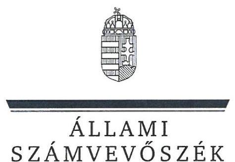
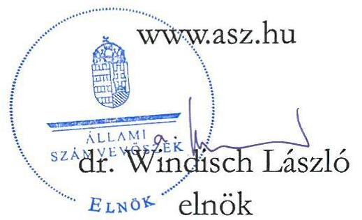
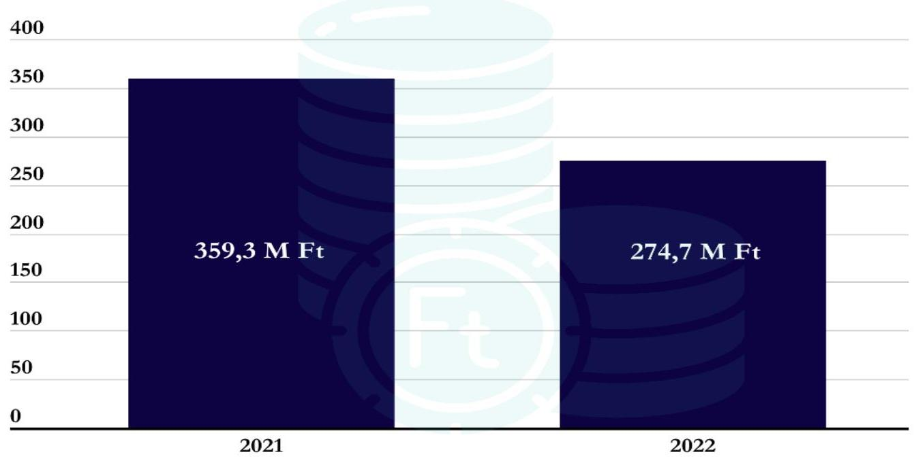
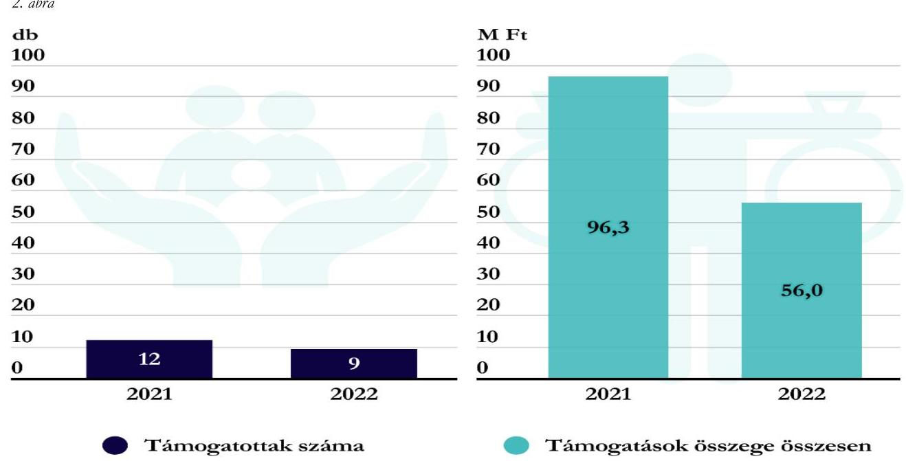

# JELENTÉS 

## Költségvetési támogatásban részesülő pártalapítványok 2021-2022. évi gazdálkodása törvényességének ellenőrzése

Táncsics Mihály Alapítvány

2024.

---

ÁLLAMI SZÁMVEVŐSZÉK

# JELENTÉS 

## Költségvetési támogatásban részesülő pártalapítványok 2021-2022. évi gazdálkodása törvényességének ellenőrzése

Táncsics Mihály Alapítvány

2024.

24062

---

# ELLENŐRZÉSI IGAZGATÓSÁG: 

## ÁLLAMHÁZTARTÁSON KÍVÜLI SZERVEZETEKET ELLENŐRZŐ IGAZGATÓSÁG

## ELLENŐRZÉSI IGAZGATÓ:

## KLINGA LÁSZLÓ igazgató

## ELLENŐRZÉSVEZETŐ:

Jelentéseink az interneten a www.asz.hu címen olvashatók.

## KAKAS SÁNDOR ellenőrzésvezető

IKTATÓSZÁM: EL-3847-179/2024
TÉMASZÁM: 2673
ELLENŐRZÉS-AZONOSÍTÓ SZÁM: V1017

---

# TARTALOMJEGYZÉK 

AZ ELLENŐRZÉS ALAPADATAI ..... 5
AZ ELLENŐRZÖTT SZERVEZET ..... 7
ÖSSZEFOGLALÁS ..... 9
AZ ELLENŐRZÉS FÓKUSZKÉRDÉSEI ..... 10
MEGÁLLAPÍTÁSOK ..... 11
JAVASLATOK ..... 16
MELLÉKLETEK ..... 17
I. sz. melléklet: Értelmező szótár ..... 17
II. sz. melléklet: Ellenőrzési kritériumok ..... 18
FÜGGELÉK: ÉSZREVÉTELEK ..... 19
RÖVIDÍTÉSEK JEGYZÉKE ..... 20

---

.

---

# AZ ELLENŐRZÉS ALAPADATAI 

## AZ ELLENŐRZÉS CÉLJA

Az ellenőrzés célja annak értékelése volt, hogy a Pártalapítvány ${ }^{1}$ törvényesen gazdálkodott-e; az éves számviteli beszámolók és a Pártalapítvány tevékenységéről szóló éves jelentések a jogszabályi előírásoknak megfeleltek - e; a könyvvezetés és gazdálkodás során a vonatkozó jogszabályi rendelkezéseket és belső előírásokat betartották-e.

## AZ ELLENŐRZÉS TÍPUSA

Szabályszerüségi ellenőrzés

## AZ ELLENŐRZÖTT IDŐSZAK

2021-2022. évek

## AZ ELLENŐRZÉS TÁRGYA

Az ellenőrzés tárgyát képezte a Pártalapítvány gazdálkodása, a könyvvezetés szabályozása és gyakorlatának szabályszerűsége, az egyszerűsített éves beszámolókra és a Pártalapítvány tevékenységéről szóló éves jelentésekre vonatkozó kötelezettség teljesítése.

Az ellenőrzés kiterjedt minden olyan körülményre és adatra, amely az ÁSZ ${ }^{2}$ jogszabályban meghatározott feladatainak teljesítéséhez, valamint az ellenőrzési program végrehajtása során felmerülő újabb összefüggések feltárásához szükséges volt.

## AZ ELLENŐRZÉS JOGALAPJA

Az ellenőrzés jogalapját az ÁSZ tv. ${ }^{3}$ 1. § (3) bekezdése, 5. § (3) bekezdése, valamint a Pmtv. ${ }^{4}$ 4. $\S$ (2) és (4) bekezdéseinek előírásai képezték.

## AZ ELLENŐRZÉS MÓDSZERE

Az ellenőrzés az ellenőrzött időszakban hatályos jogszabályok, az ellenőrzés szakmai szabályai, a jelen ellenőrzésre irányadó ÁSZ módszertanok, az ellenőrzési programban foglalt értékelési szempontok szerint került végrehajtásra.

Az ellenőrzési kérdések megválaszolásához szükséges bizonyítékok megszerzése az ellenőrzött által rendelkezésre bocsátott dokumentumokra, adatokra alapozva kérdésfeltevés (információkérés), valamint mintavételezés, továbbá helyszíni ellenőrzés útján történt. Az ellenőrzési bizonyítékként felhasználható

---

adatforrások közé tartoztak egyrészt az ellenőrzési programban felsorolt adatforrások, másrészt minden az ellenőrzés folyamán feltárt, az ellenőrzés szempontjából információt tartalmazó dokumentum.

Az ellenőrzés lefolytatásához az ellenőrzött szervezet tanúsítvány kitöltésével és az ÁSZ által kért dokumentumok, adatok, információk megküldésével és az ellenőrzés során szolgáltatott adatokat.

A Pártalapítvány kiadásai, ráfordításai elszámolásának szabályszerűségét, (2. fókuszkérdés), a Pártalapítvány által nyújtott támogatások elszámolása szabályszerűségét (2. fókuszkérdés), valamint a mérlegtételek besorolásának, év végi értékelésének, azok leltárral való alátámasztottságának szabályszerűségét (3. fókuszkérdés) mintavételi eljárással kiválasztott tételek alapján ellenőrizte az ÁSZ.

A 2. fókuszkérdésnél az egyes vizsgálandó részterületek ellenőrzése részterületenként 30 elemű minta értékelésével, mintavételes, 30 db -ot meg nem haladó tételszám esetében tételes ellenőrzéssel történt. Az ÁSZ a 2. fókuszkérdésnél, a kiadások vonatkozásában 30-30 mintatételt ellenőrzött, a minták értékelése alapján statisztikai kivetítést alkalmazott, további lényegességi szempontok alapján 2021. évben 6 db, 2022. évben 4 db kiválasztott mintatételt ellenőrzött. Az ÁSZ a 2. fókuszkérdésnél a Pártalapítvány által nyújtott támogatások vonatkozásában - tekintettel arra, hogy az alapsokaság elemszáma egyik évben sem haladta meg a 30 tételt - tételes ellenőrzést végzett. Az ÁSZ a 3. fókuszkérdésnél, a mérlegtételek vonatkozásában 30-30 mintatételt ellenőrzött, a tények feltárása és azok összegzése során a megállapítások az ellenőrzött tételekre vonatkozóan kerültek megfogalmazásra.

A vizsgált terület „szabályszerú" minősítést kapott, ha a minta ellenőrzésének eredménye alapján 95\%-os bizonyossággal a teljes sokaságban az átlagos hibaarány nem haladta meg a $10 \%$-ot, „nem szabályszerű", ha nagyobb volt, mint $10 \%$. Amennyiben a sokaság elemszáma nem haladta meg az előírt minta elemszámot, akkor a sokaság valamennyi elemének tételes ellenőrzésére került sor.

A Pártalapítvány bevételei elszámolásának szabályszerűségét teljeskörűen ellenőrizte az ÁSZ.
A gazdálkodás hibáinak kijavítására irányuló javaslat kidolgozásakor a hatályos jogszabályok voltak az irányadóak.

---

# AZ ELLENŐRZÖTT SZERVEZET 

## TÁNCSICS MiHÁLY AlAPíTVÁNY

A Pártalapítványt 1 M Ft induló vagyon rendelkezésre bocsátásával, határozatlan időre alapította az MSZP ${ }^{5}$. A Fővárosi Törvényszék bejegyző határozata jogerőre emelkedésének dátuma 2003. december 18. volt.

A Pártalapítvány céljainak megvalósítása érdekében, fő tevékenységként segíti az MSZP működését. Alapító okirat ${ }_{1,2}{ }^{6}$ szerinti céljai:

- elősegíteni az MSZP Alkotmányban biztosított, a népakarat kialakításában, valamint kinyilvánításában történő hatékony közreműködését,
- szélesíteni az állampolgárok tájékozódásót a magyar társadalmat érintő társadalmi és politikai kérdésekről, a szociáldemokrácia elméleti megközelítéseiről,
- ösztönözni a magyar politikai kultúra színvonalának emelését, a demokrácia elveinek és gyakorlatának erősítését,
- bátorítani a magyar és a globális kulturális értékek, valamint a tudományos eredmények tiszteletben tartását és elfogadtatását,
- előmozdítani a szociáldemokrata gondolkodás fejlődését és a szociáldemokrata eszmeiség terjesztését,
- segíteni a nemzeti érdekeknek a változó körülményeknek megfelelő időszerű megfogalmazását, különös figyelmet fordítva Magyarország uniós tagságából következő feladatokra.
Céljait a Pártalapítvány részben saját intézményi és szervezeti keretei között, részben projekt-szervező és projekt-finanszírozó jelleggel, más intézményeket felkérve valósítja meg.

A Pártalapítvány Alapító okirata ${ }_{1,2}$ szerint a Pártalapítvány testületi vezető szerve a héttagú Kuratórium ${ }^{7}$, melynek összetétele az ellenőrzött időszakban két tag tekintetében változott. A Pártalapítvány működésének törvényességének, továbbá vagyonának kezelésével kapcsolatos tevékenységnek ellenőrzésére három tagú Felügyelőbizottságot hoztak létre, a tagok személyében az ellenőrzött időszakban változás történt.

A Pártalapítvány kizárólagos tulajdonosa a Kapcsolat.hu Kommunikációs és Szolgáltató Nonprofit Korlátolt Felelősségű Társaságnak, amelyet 2006. március 7-én alapított.

A Pártalapítvány az Alapító okirat ${ }_{1,2}$ szerint vállalkozási tevékenységet is folytathat, azonban az ellenőrzött időszakban vállalkozási tevékenységet nem végzett.

A Pártalapítvány 2021-2022. évi egyszerűsített éves beszámolóit a Kuratórium döntése alapján független könyvvizsgáló felülvizsgálta.

A Pártalapítvány tekintetében külső ellenőrzés, törvényességi felügyeleti ellenőrzés az ellenőrzött időszakban nem volt.

---

A Pártalapítvány a központi költségvetésből kapott támogatás mellett a 2021. évben egy magánszemélytől fogadott el támogatást, összesen 8 E Ft értékben. Az ellenőrzött időszakban a Pártalapítvány tevékenysége ellátásához kapott költségvetési támogatás évenkénti alakulását az 1. ábra szemlélteti:
1. ábra

Költségvetési támogatás

---

# ÖSSZEFOGLALÁS 

Az ÁSZ ellenőrzése a Párttv. ${ }^{8}$ alapján a politikai kultúra fejlesztése érdekében tudományos, ismeretterjesztő, kutatási, oktatási tevékenység folytatása céljából, a Ptk. ${ }^{9}$ szerinti alapító okiraton alapuló bírósági nyilvántartásba vétellel létrejött Pártalapítvány gazdálkodására terjedt ki. A Pmtv. értelmében a pártalapítványok gazdálkodása törvényességének ellenőrzése az ÁSZ feladata. A Pmtv. előírása alapján az ÁSZ kétévente - kötelező jelleggel - ellenőrzi azoknak a pártalapítványoknak a gazdálkodását, amelyek állami költségvetési támogatásban részesültek.

A pártalapítványok ellenőrzésével az ÁSZ hozzájárul ahhoz, hogy a társadalom objektív képet alkothasson a pártalapítványok működéséről, gazdálkodásáról. Az ellenőrzésről készített számvevőszéki jelentésben megfogalmazott megállapítások, javaslat alapján a törvényalkotók konkrét lépéseket tehetnek a pártalapítványokra vonatkozó szabályozások megváltoztatása, átláthatóbbá, ellenőrizhetőbbé tétele érdekében. Az ellenőrzött szervezetek szintjén a hiányosságok, szabálytalanságok feltárása, az ennek kapcsán megfogalmazott megállapítások elősegíthetik a pártalapítványok szabályszerű gazdálkodását.

A gazdálkodás szervezeti kereteinek kialakítása szabályszerű volt.

A Pártalapítvány az ellenőrzött időszakban rendelkezett a Számv. tv. ${ }^{10}$ szerint kötelezően elkészítendő számviteli politika ${ }_{1,2,3}{ }^{11}$-val és annak keretében elkészített leltározási szabályzattal ${ }^{12}$, az eszközök és a források értékelési szabályzatával ${ }^{13}$, és a pénzkezelési szabályzattal ${ }^{14}$. A Pártalapítvány a Számv. tv.-nek megfelelően rendelkezett számlarenddel ${ }^{15}$. A számviteli szabályzatok megfeleltek a Számv. tv.-ben előírtaknak.

A Pártalapítvány az ellenőrzött időszakban a támogatásokat főkönyvi könyvelésében egyéb bevételként tartotta nyilván az Eszkr. ${ }^{16}$ továbbá a számviteli politika ${ }_{1,2,3}$ és a számlarend előírásának megfelelően.

A kiadások, nyújtott
támogatások elszámolása
szabályszerú volt.

A Pártalapítvány a 2021-2022. években bevételeit működési kiadásaira, egyéb cél szerinti kiadásaira, továbbá cél szerinti támogatás nyújtására fordította. A 2021. és 2022. évben nyújtott támogatások a Pártalapítvány céljaival összhangban voltak, odaítélésük, elszámolásuk, nyilvántartásuk során a jogszabályi rendelkezéseket betartották. A Pártalapítvány tevékenysége költségeinek, ráfordításainak felhasználása, kifizetése, elszámolása szabályszerű volt. Az ellenőrzött kiadási tételek alapján a Pártalapítvány az alapító párt részére támogatást, vagyoni hozzájárulást az ellenőrzött időszakban nem adott, ezzel eleget tett a Párttv. előírásainak.

A tevékenységről szóló éves jelentések és a számviteli beszámolók a jogszabályi előírásoknak megfeleltek.

A Pártalapítvány a jogszabályi előírások alapján mindkét ellenőrzött évben elkészítette és közzétette az éves tevékenységéről szóló jelentéseket, valamint az egyszerűsített éves beszámolókat. A Pártalapítvány a 2021. és 2022. évekre vonatkozóan elkészítette és határidőben megküldte az $\mathrm{OBH}^{17}$-nak és közzétette a honlapján az egyszerűsített éves beszámolóit, a tevékenységéről szóló jelentéseket. Az egyszerűsített éves beszámolók mérlegtételeinek besorolása, értékelése az ellenőrzött tételek esetében a 2021. és 2022. években szabályszerű volt.

A Pártalapítvány a kapott támogatások fel nem használt részét a Számv. tv. és a számviteli politika2,3 előírásaival ellentétben könyvelésében nem határolta el.

Az ÁSZ a Kuratórium Elnökének a feltárt szabálytalanság jövőbeni kiküszöbölése érdekében egy javaslatot fogalmazott meg.

---

# AZ ELLENŐRZÉS FÓKUSZKÉRDÉSEI 

1.     - A Pártalapítvány kialakította-e a törvényes gazdálkodásához szükséges szabályokat?
2.     - A Pártalapítvány a könyvvezetése és gazdálkodása során betartotta-e a jogszabályi előírásokat?
3.     - A Pártalapítvány tevékenységéről szóló jelentések, az éves számviteli beszámolók a jogszabályi előírásoknak megfeleltek-e?

---

# 1. A Pártalapítvány kialakította-e a törvényes gazdálkodásához szükséges szabályokat? 

## Összegző megállapítás

1.1. számú megállapítás

A 2021-2022. években a Pártalapítvány a törvényes gazdálkodásához szükséges szabályokat kialakította.

A Pártalapítvány működésének szabályait a jogszabályi előírásoknak megfelelően rögzítették.

Az Alapító okirat ${ }_{1,2}$-ben a Pmtv. és a Ptk. ${ }_{2}$ előírásának megfelelőn rögzítették a Pártalapítvány működési szabályait, kijelölték a Pártalapítvány ügyvezető szervét, a Kuratóriumot, továbbá a képviseltre jogosult személyt. A képviseleti jog kapcsán meghatározták annak terjedelmét, a képviseleti jog gyakorlásának módját a Ptk. ${ }_{2}$ előírásainak megfelelően. A Kuratórium Elnöke, mint teljeskörű, minden ügyre kiterjedő hatáskörű képviseletre jogosult személy kijelöléséről gondoskodtak, aki egyedül és önállóan képviselte a Pártalapítványt. A Pártalapítvány gazdálkodásával kapcsolatos feladatokat ellátó szervek létrehozása, kialakítása megfelelt a jogszabályi előírásoknak.
A Pártalapítvány gazdálkodásával kapcsolatos könyvvezetési-nyilvántartási rendszerét az Eszkr. előírásainak megfelelően kialakította. A 2021. és 2022. évekre vonatkozóan a Számv. tv.-ben előírtak szerint kettős könyvvitellel alátámasztott egyszerűsített éves beszámolót készített, az ellenőrzött időszakban könyvvezetését, beszámolórendszerét nem változtatta. A Pártalapítvány a pénzügyi-számviteli feladatok ellátását külső szervezettel, a Ptk. ${ }_{2}$ szerinti szerződés megkötésével biztosította. A számviteli szolgáltatást nyújtó szolgáltató megfelelt a Számv. tv. és az Eszkr. előírásainak.
1.2. számú megállapítás

A Pártalapítvány gazdálkodására vonatkozó belső szabályozás megfelelt a jogszabályi előírásoknak.

A Pártalapítvány gazdálkodásával kapcsolatos feladat- és hatásköröket, szabályokat, az ellenőrzött időszakban az Alapító okirat ${ }_{1,2}$-ben és az SZMSZ ${ }^{18}$-ben határozták meg, mely szerint a Pártalapítvány céljainak megvalósulásával összefüggő döntések meghozatala a Kuratórium hatáskörébe tartozott.
A Pártalapítvány az ellenőrzött időszakban a Számv. tv.-nek megfelelően rendelkezett hatályos számviteli politika ${ }_{1,2,3}$-val. A Pártalapítvány az ellenőrzött időszakban a Számv. tv.-ben foglaltaknak megfelelően elkészítette a számviteli politika ${ }_{1,2}$ keretében a leltározási szabályzatot, az eszközök és a források értékelési szabályzatát, és a pénzkezelési szabályzatot. A leltározási szabályzat a Számv. tv. előírásaival összhangban tartalmazta a mennyiségi felvétellel történő leltározás gyakoriságát. A Kuratórium Elnöke az ellenőrzött időszakra vonatkozóan a jogszabályi előírásoknak megfelelően meghatározta, kialakította a pénzgazdálkodással kapcsolatos folyamatokat, feladat- és hatásköröket a pénzkezelési szabályzatban. A Pártalapítvány a Számv. tv.- nek megfelelően rendelkezett számlarenddel. A számviteli szabályzatok a Számv. tv-ben előírtaknak megfeleltek. A számviteli szabályzatokat a Számv. tv. előírásainak megfelelve a Kuratórium Elnöke léptette hatályba, a szabályzatok személyi, tárgyi és időbeli hatályát meghatározták.

---

A Pártalapítvány céljaira rendelt vagyont és annak felhasználási módját a törvényi előírásokkal összhangban az Alapító okirat ${ }_{1,2}$-ben meghatározták, ezen belül az induló vagyon nagyságát, annak rendelkezésre bocsájtásának módját, a vagyonnövekedés lehetőségeit, vagyonmegoszlását valamint a vagyongazdálkodás alapelveit kialakították.
1.3. számú megállapítás

A Pártalapítvány alapcélja ellátásához kapcsolódó gazdálkodási tevékenysége szabályszerű volt.

A Pártalapítvány Alapító okirat ${ }_{1,2}$-ben rögzített közérdekủ céljai és tevékenységei összhangban voltak a Párttv. előírásaival. A Pártalapítvány Alapító okirata ${ }_{1,2}$ VIII/1. pontja szerint a Pmtv. előírásaival összhangban tartalmazta, hogy a Pártalapítvány másodlagos és kisegítő jelleggel vállalkozási tevékenységet is folytathat, a 2021. és 2022. évben az egyszerűsített éves beszámolók és az azokat alátámasztó könyvviteli nyilvántartások adatai szerint gazdasági-vállalkozói tevékenységet nem folytatott. A Pártalapítvány 2021. és 2022. évi tevékenységéről szóló éves jelentéseinek és beszámolóinak adatai alapján a Pártalapítvány a Ptk. ${ }_{2}$ előírásait betartva a 2021-2022. években nem volt korlátlan felelősségű tagja más jogalanynak, nem létesített alapítványt és nem csatlakozott alapítványhoz. A Pártalapítvány kizárólagos tulajdonában lévő, az ellenőrzött időszakot megelőzően alapított Kapcsolat.hu Kommunikációs és Szolgáltató Nonprofit Korlátolt Felelősségű Társaság alapító okiratában rögzítették, hogy a Pártalapítvány a társaság tartozásaiért nem vállal teljes felelősséget, azokért csak 8,0 M Ft törzsbetétje erejéig felelős.

# 2. A Pártalapítvány a könyvvezetése és gazdálkodása során betartotta-e a jogszabályi előírásokat? 

## Összegző megállapítás

2.1. számú megállapítás

A Pártalapítvány könyvvezetése és gazdálkodása során a vonatkozó jogszabályi rendelkezéseket és belső szabályzataiban foglalt előírásokat betartotta.

A Pártalapítvány a központi költségvetésből és egy magánszemélytől kapott támogatást szabályszerűen fogadta el és számolta el a 2021-2022. években.

A Pártalapítvány a Párttv. és a Pmtv. előírásai szerint a 2021. és 2022. évi Kv.tv. ${ }^{19}$ és a 1284/2022 (VI.7) Korm. határozatban ${ }^{20}$ meghatározott állami költségvetésből juttatott támogatásban részesült.
A Pártalapítvány a 2021. évben egy magánszemélytől összesen 8,0 E Ft összegben fogadott el támogatást. A támogatás elfogadása során betartották a Pmtv-ben foglaltakat, mivel a támogató személy egyértelműen azonosítható, és a fizetés a támogatást nyújtó személy számlájáról a Pártalapítvány pénzforgalmi számlájára átutalással történt. A támogatás összege nem haladta meg az ötszázezer forintot, ezért a Pmtv. szerinti közzétételi kötelezettsége nem volt a Pártalapítványnak.
A Pártalapítvány az ellenőrzött időszakban a támogatásokat főkönyvi könyvelésében egyéb bevételként tartotta nyilván az Eszkr., továbbá a számviteli politika ${ }_{1,2,3}$ és a számlarend előírásának megfelelően. A költségvetési támogatást, a magánszemélytől 2021. évben kapott támogatástól elkülönítetten, a Számv. tv. és a Eszkr.-ben előírraknak, valamint a számviteli politika ${ }_{1,2,3}$ és a számlarend előírásainak megfelelően tartották nyilván.

---

2.2. számú megállapítás

A Pártalapítvány által 2021. és 2022. évben nyújtott cél szerinti támogatások odaítélése, elszámolása, beszámolóban történő bemutatása szabályszerűen történt.

A harmadik fél részére juttatott cél szerinti támogatás elbírálásának, folyósításának, nyilvántartásának, elszámolásának, a támogatások közzétételének rendjét kialakították. Az Alapító okirat ${ }_{1,2}$ ben rögzítettek szerint a Kuratórium hatáskörébe tartozott a pályázatok kiírása és elbírálása, továbbá döntés az alapítványi cél szerinti támogatások odaítéléséről. Az SZMSZ-ben meghatározták a támogatási rendszer működésének elemeit.
A 2021. és 2022. évi továbbadott támogatás alakulását (támogatott szervezetek száma, támogatás összege) a 2. ábra szemlélteti:

A Pártalapítvány által nyújtott támogatásokra fordított összegek odaítélése, elszámolása szabályszerű volt, mivel a pályázók által benyújtott támogatási kérelemről a belső szabályozásban rögzítettekkel összhangban a Kuratórium határozatban döntött, továbbá az odaítélt támogatások céljai összhangban voltak a jogszabályi előírásokkal és az Alapító okirat ${ }_{1,2}$ szerinti céljaival, továbbá a sikeres pályázókkal kötött együttműködési megállapodások összhangban voltak a Kuratórium döntésével. Az együttműködési megállapodásokat szabályszerűen a Kuratórium Elnöke írta alá, a folyósításról, kifizetésről az arra jogosult (Kuratórium Elnöke, Titkárságvezető) rendelkezett, továbbá az együttműködési megállapodásokban foglaltakat betartva a támogatott szervezetek a támogatás felhasználásáról megküldték az elszámolást és a kifizetést a Számv. tv.-ben előírtaknak megfelelően a számviteli nyilvántartásokban rögzítették.
A Pártalapítvány éves tevékenységéről szóló jelentések tartalmazták a Pmtv.-vel összhangban a Pártalapítvány által nyújtott cél szerinti támogatások kimutatását.
Az ellenőrzött kiadási tételek alapján a Pártalapítvány az alapító párt részére támogatást, vagyoni hozzájárulást az ellenőrzött időszakban nem adott, ezzel eleget tett a Párttv. előírásainak.

---

# 2.3. számú megállapítás 

A Pártalapítvány kiadásainak elszámolása a 2021. és 2022. évben szabályszerűen történt.

A Pártalapítvány kiadásainak elszámolása a 2021. és 2022. években szabályszerű volt, mivel a költségelszámolás, ráfordítás számviteli elszámolását a Számv. tv. előírása szerint a Számv. tv. -ben meghatározott dokumentumokkal alátámasztották, továbbá a számviteli bizonylatokon a gazdasági műveletet elrendelő személy megjelölése a Számv. tv.-ben rögzítetteknek megfelelően történt, a belső szabályozás szerint arra jogosult által. A könyvviteli elszámolást alátámasztó bizonylatokon a kontírozást (számlakijelölést) a Számv. tv.-ben előírtaknak megfelelően elvégezték, valamint az utalványozás és teljesítés igazolás a Számv. tv. - ben rögzítetteknek és a pénzkezelési szabályzatban foglaltaknak megfelelően megtörtént. A Pártalapítvány kiadásai az ellenőrzött időszakban minden esetben a Pártalapítvány cél szerinti tevékenysége vagy a múködés fenntartása érdekében merültek fel a Ptk.2-ben meghatározottak szerint.

## 3. A Pártalapítvány tevékenységéről szóló jelentések, az éves számviteli beszámolók a jogszabályi előírásoknak megfeleltek-e?

Összegző megállapítás
A Pártalapítvány a 2021. és 2022. évi tevékenységéről szóló jelentéseket és az egyszerúsített éves beszámolókat a jogszabályi előírásoknak megfelelően elkészítette és közzétette.
3.1. számú megállapítás

A Pártalapítvány a tevékenységéről szóló éves jelentés készítési és közzétételi kötelezettségét a Pmtv. előírásának megfelelően, szabályszerűen teljesítette.

A Pártalapítvány a Pmtv. előírásának megfelelően a 2021. és 2022. évi tevékenységéről szóló jelentéseket elkészítette. Az éves jelentések a Pmtv. szerint tartalmazták a számviteli beszámolót, a költségvetési támogatás felhasználására vonatkozó kimutatást, a vagyon felhasználásával kapcsolatos kimutatást, a cél szerinti juttatások kimutatását, a központi költségvetési szervtől kapott támogatások kimutatását, a Pártalapítvány egyes vezető tisztségviselőinek nyújtott juttatások értékét, illetve összegét, továbbá a Pártalapítvány tevékenységéről szóló rövid tartalmi beszámolót.
A Kuratórium a 2021. és 2022. évekre vonatkozó Pártalapítvány éves tevékenységéről szóló jelentést elfogadta, az elfogadott éves jelentéseket, a Pmtv. előírásainak megfelelően a Magyar Közlöny mellékleteként megjelenő Hivatalos Értesítőben a törvényi határidőn belül közzétették és a saját honlapján a törvényben rögzített határidőn belül megjelentették.
3.2. számú megállapítás

A Pártalapítvány a jogszabályok előírásainak megfelelően elkészítette 2021. és 2022. évre vonatkozóan az egyszerűsített éves beszámolókat, azokat határidőben közzétette. A 2021. és 2022. évi egyszerűsített éves beszámolókban a Számv.tv. előírása ellenére a költségei ellentételezésére kapott költségvetési támogatás fel nem használt részét a mérlegben passzív időbeli elhatárolásként nem mutatta ki.

A Pártalapítvány a Számv. tv., valamint az Eszkr. előírásainak megfelelően a 2021. és 2022. évi múködéséről, vagyoni, pénzügyi és jövedelmi helyzetéről az üzleti év könyveinek lezárását követően, az

---

üzleti év utolsó napjával, december 31-gyel, mint fordulónappal elkészítette a 2021. és 2022. évre vonatkozó egyszerűsített éves beszámolóját, amely tartalmazta a mérleget, az eredménykimutatást és a kiegészítő mellékletet továbbá a Pártalapítvány a beszámolójával egyidejűleg közhasznúsági mellékletet is készített.
A Kuratórium a 2021. évre vonatkozó egyszerűsített éves beszámolót, közhasznúsági jelentést 2022. május 24-én elfogadta, ezt követően a Számv. tv. és az Ectv. előírásának megfelelően - határidőn belül - 2022. május 30-án megküldte az OBH-nak, illetve 2022. május 25-én saját honlapján közzé tette.
A Kuratórium a 2022. évre vonatkozó egyszerűsített éves beszámolót, közhasznúsági jelentést 2023. május 17-én fogadta el, majd a Számv. tv. és az Ectv. előírásának megfelelően - határidőn belül - 2023. május 26-án megküldte az OBH-nak. Ezt követően 2023. május 30-án saját honlapján jelentette meg.
A Pártalapítvány által készített 2021. és 2022. évi egyszerűsített éves beszámolók kiegészítő melléklete a Számv. tv. előírása szerint tartalmazta a tárgyévben végzett főbb tevékenységi köröket, továbbá a tárgyévben foglalkoztatott munkavállalók létszámát, illetve annak megoszlását. Ezen kívül a Pártalapítvány a Pmtv. előírásának megfelelően az üzleti évben végzett főbb tevékenységeket és programokat bemutatta a szöveges beszámolóban.
A 2021. és 2022. évi egyszerűsített éves beszámolót alátámasztó főkönyvi kivonat alapján a 2021. és 2022. évben kapott központi költségvetési támogatást nem használta fel teljeskörűen a Pártalapítvány, melyet a költségvetési támogatás felhasználására vonatkozó kimutatás is alátámasztott. A Pártalapítvány 2021. és 2022. év végén a költségek (a ráfordítások) ellentételezésére - visszafizetési kötelezettség nélkül - kapott, pénzügyileg rendezett, egyéb bevételként elszámolt támogatás összegéből az üzleti évben költséggel, ráfordítással nem ellentételezett összeget a Számv. tv. 44. § (2) bekezdése és a számviteli politika ${ }_{2,3}$ elöírásai ellenére nem mutatta ki passzív időbeli elhatárolásként.
Az egyszerűsített éves beszámolók mérlegtételeinek besorolása, év végi értékelése, azok leltárral való alátámasztottsága szabályszerű volt. A mérlegtételek tartalma, besorolása, illetve bekerülési értékének meghatározása és számba vétele a Számv. tv. előírásai szerint történt. A Pártalapítványnak az ellenőrzött időszakban követelése nem volt, a kiválasztott mintatételek esetében elszámolt értékvesztésre, illetve visszaírásra nem került sor. A leltározás, továbbá a mérleg mintatételek összegeinek egyeztetése a főkönyvi számlákkal, az analitikus nyilvántartással, egyéb számviteli nyilvántartással a Számv. tv. előírásai alapján megtörtént.
3.3. számú megállapítás A Pártalapítvány céljaira rendelt vagyonnak a kezelése és védelme, az arról való beszámolás szabályszerű volt.

A Pártalapítvány céljaira rendelt vagyont és annak felhasználási módját a törvényi előírásokkal összhangban rögzítették az Alapító okirat ${ }_{1,2}$-ben. A Pártalapítvány céljaira rendelt vagyon nyilvántartása, elszámolása rendjét, a vagyon nyilvántartásának tovább részletezését biztosították. A Pártalapítvány hasznosításra az államháztartásból ingyenesen átadott vagyont, illetve véglegesen az államháztartásból tulajdonba adott vagyont nem kapott, így nem keletkezett az Nvtv. ${ }^{21}$, valamint a Vtvr. ${ }^{22}$ előírásai szerinti vagyonhoz kapcsolódó nyilvántartási, adatszolgáltatási kötelezettsége.

---

# JAVASLATOK 

Az ÁSZ tv. 33. § (1) bekezdésében foglaltak értelmében az ellenőrzött szervezet vezetője köteles a jelentésben foglalt megállapításokhoz kapcsolódó intézkedési tervet összeállítani és azt a jelentés kézhezvételétől számított 30 napon belül az ÁSZ részére megküldeni. Amennyiben az ellenőrzött szervezet vezetője nem küldi meg határidőben az intézkedési tervet, vagy továbbra sem elfogadható intézkedési tervet küld, az Állami Számvevőszék elnöke az ÁSZ tv. 33. § (3) bekezdése a) és b) pontjaiban foglaltakat érvényesítheti.

## A TÁNCSICS MIHÁLY ALAPÍTVÁNY KURATÓRIUMÁNAK ELNÖKE RÉSZÉRE

1. Gondoskodjon a Pártalapítvány számviteli nyilvántartásaiban a költségek (a ráfordítások) ellentételezésére - visszafizetési kötelezettség nélkül - kapott, pénzügyileg rendezett, egyéb bevételként elszámolt támogatás összegéből az üzleti évben költséggel, ráfordítással nem ellentételezett összeg Számv. tv.-ben foglaltaknak megfelelő időbeli elhatárolásáról.

---

# MELLÉKLETEK 

## I. SZ. MELLÉKLET: ÉRTELMEZŐ SZÓTÁR

alapítvány
alaptevékenység
gazdasági-vállalkozási tevékenység
költségvetési támogatás
pártalapítvány

Az alapítvány az alapító által az alapító okiratban meghatározott tartós cél folyamatos megvalósítására létrehozott jogi személy. Az alapító az alapító okiratban meghatározza az alapítványnak juttatott vagyont és az alapítvány szervezetét. Alapítvány nem alapítható gazdasági tevékenység folytatására. Az alapítvány az alapítványi cél megvalósításával közvetlenül összefüggő gazdasági tevékenység végzésére jogosult. Alapítvány nem lehet korlátlan felelősségű tagja más jogalanynak, nem létesíthet alapítványt és nem csatlakozhat alapítványhoz.
(Forrás: Ptk. 3:378. §, 3:379. § (1)-(3) bekezdés)
A jogszabályban, illetve létesítő okiratban meghatározott, a tevékenység cél szerinti, közhasznú, egyesületi. alapítványi célú tevékenység (Forrás: Eszkr. 6. §)

A jövedelem- és vagyonszerzésre irányuló vagy azt eredményező, üzletszerűen végzett gazdasági tevékenység, kivéve az adomány (ajándék) elfogadását, a pénzeszközök betétbe, értékpapírba, társasági részesedésbe történő elhelyezését és az ingatlan megszerzését, használatának átengedését és átruházását. (Forrás: Ectv. ${ }^{23}$ 2. § 11. pont., Pmtv. 2021. július 1. napjától hatályos 3. § (6a) bekezdés)

A pártalapítványoknak a Párttv. 9/A. § (1) bekezdése és a Pmtv. 1. § előírásainak értelmében, az éves költségvetési törvények szerint jellemzően az 1. számú melléklet I. Országgyűlés fejezet 9. Pártalapítványok támogatás címen - az állami költségvetésből juttatott támogatás.

A politikai kultúra fejlesztése érdekében, tudományos, ismeretterjesztő, kutatási és oktatási tevékenység folytatása céljából pártok által létrehozott, külön jogszabályban - a Pmtv. 1. § és 3. § (1) bekezdése - meghatározott, jogi személynek minősülő egyéb szervezet, speciális jogállású alapítvány.
(Forrás: Párttv. 9/A. § (1) bekezdés, Pmtv. 1. §, Ectv. 2. § 6. c) pont, Számv. tv. 3. § (1) bekezdés 4. pont, Eszkr. 2. § (1) bekezdés 1) pont)

---

# II. SZ. MELLÉKLET: ELLENŐRZÉSI KRITÉRIUMOK 

## FOKUSZKÉRDÉSEK

1. A Pártalapítvány kialakította-e a törvényes gazdálkodásához szükséges szabályokat?
2. A Pártalapítvány a könyvvezetése és gazdálkodása során betartotta-e a jogszabályi előírásokat?
3. A Pártalapítvány tevékenységéről szóló jelentések, az éves számviteli beszámolók a jogszabályi előírásoknak megfeleltek-e?

## ELLENŐRZÉSI KRITÉRIUMOK

Ptk. 3 3:21-3:25. §, 3:29-3:30. §, 3:379. § (3) bekezdés, 3:391. § (1) bekezdés. c) pont, 3:391. § (2) bekezdés. h) pont, 3:397-3:398. §, 3:400.§ (2) bekezdés
Ectv. 28-31. §
Eszkr. 7. § (3)-(4) bekezdés b) pont, (6) bekezdés, 8. § (2) bekezdés, 9. § (4) bekezdés, 12-15. §,
Számv.tv. 14. § (3)-(4) bekezdés, 14. § (5) bekezdés a), b) és d) pont, 14. § (8) bekezdés, 14. § (12) bekezdés, 16. § (4) bekezdés, 96. §, 150. §, 161. § (1) bekezdés, 161. § (2) bekezdés c), d) pont, 161. § (4) bekezdés
Pmtv. 3. § (6), (6a) bekezdés

Ptk. 3 3:384.§ (1) bekezdés
Párttv. 5. § (2) bekezdés, 9/A. § (1) bekezdés, 9/A. § (3) bekezdés,
Pmtv. 3. § (3) bekezdés, 3. § (4) bekezdés a pont, 3/A § (3) bekezdés b), d) e) pont
költségvetési törvény1 1. sz. melléklete
költségvetési törvény2 1. sz. melléklete
1284/2022 (VI.7) Korm. határozat 1. sz. melléklet
Számv.tv. 78.-79. §., 161/A. § (2) bekezdés, 165. § (1) bekezdés, 166. § (1) bekezdés, 167. § (1) bekezdés c), h) pont
Ectv. 2. § 1. pont
Eszkr.13. § (3) bekezdés, 9. § (9) bekezdés, 12. § (4) bekezdés, 14. § (1) bekezdés,
Pmtv. 3/A § (3), (5) bekezdés, (6) bekezdés, 3. § (4),(6) bekezdés
Ectv. 28. § (1)-(3) bekezdés, 29. § (2)-(5) bekezdés, 30. §. (1) bekezdés, 46. §. (1) bekezdés,
Eszkr. 7. § (1)-(3), (4) bekezdés b) pontja, (6)-(8). bekezdés, 8. § (2) bekezdés, 9. § (4) bekezdés, 11. §, 14. § (1) bekezdés, 16. §.,17. §.(1) bekezdés, 23. § (1) bekezdés, Számv. tv. 8. § (2) bekezdés b) pontja, 8. §. (5) bekezdés, 9. § (2) bekezdés, 19. § (1) bekezdés.; 23-31. §, 35. §, 44. § (2) bekezdés, 47-51. §, 52., 54-56. §,57-59. §, 65. § (1)-(7) bekezdés, 69. §, 91. § a) pont, 96. § (1) bekezdés, 155. § (7) bekezdés, 161. § (2)-(3) bekezdés, 161/A. § (2) bekezdés, 165. § (4) bekezdés,

Nvtv. 7. § (1) bekezdés, 13. § (3) bekezdés, 13. § (4) bekezdés b) pont,
Vtvr. 14. § (1)-(3) bekezdés,17. § (1)-(2) bekezdés, melléklet II/8. pont

---

# FÜGGELÉK: ÉSZREVÉTELEK 

A jelentéstervezetet a Számvevőszék 15 napos észrevételezésre megküldte az ellenőrzött szervezet vezetőjének az ÁSZ tv. 29. §* (1) bekezdése előírásának megfelelően.
A Táncsics Mihály Alapítvány Kuratóriumának Elnöke a jelentéstervezetre nem tett észrevételt.

[^0]
[^0]:    * 29. § (1) Az Állami Számvevőszék az ellenőrzési megállapításait megküldi az ellenőrzött szervezet vezetőjének vagy az általa megbízott személynek, és annak, akinek személyes felelősségét állapította meg.
    (2) Az ellenőrzött szervezet vezetője és a felelősként megjelölt személy az ellenőrzés megállapításaira tizenöt napon belül írásban észrevételt tehet.
    (3) Az Állami Számvevőszék az észrevételre a beérkezésétől számított harminc napon belül írásban válaszol. A figyelembe nem vett észrevételeket köteles a jelentésben feltüntetni, és megindokolni, hogy azokat miért nem fogadta el.

---

# RÖVIDÍTÉSEK JEGYZÉKE 

${ }^{1}$ Pártalapítvány
${ }^{2}$ ÁSZ
${ }^{3}$ ÁSZ tv.
${ }^{4}$ Pmtv.
${ }^{5}$ MSZP
${ }^{6}$ Alapító okirat ${ }_{1,2}$
${ }^{7}$ Kuratórium
${ }^{8}$ Párttv.
${ }^{9}$ Ptk. 1
Ptk. 2
${ }^{10}$ Számv. tv.
${ }^{11}$ számviteli politika $1,2,3$
${ }^{12}$ leltározási szabályzat
${ }^{13}$ eszközök és a források értékelési szabályzata
${ }^{14}$ pénzkezelési szabályzat
${ }^{15}$ számlarend
${ }^{16}$ Eszkr.
${ }^{17}$ OBH
${ }^{18}$ SZMSZ
${ }^{19}$ 2021. és 2022. évi Kv.tv.
${ }^{20}$ 1284/2022 (VI.7) Korm. határozat
${ }^{21}$ Nvtv.
${ }^{22}$ Vtvr.
${ }^{23}$ Ectv.

Táncsics Mihály Alapítvány
Állami Számvevőszék
2011. évi LXVI. törvény az Állami Számvevőszékről
2003. évi XLVII. törvény a pártok müködését segítő tudományos, ismeretterjesztő, kutatási, oktatási tevékenységet végző alapítványokról
Magyar Szocialista Párt
Alapító okirata ${ }_{1}$ a Táncsics Mihály Alapítvány alapító okirata 2020. április 15-i keltezésű
Alapító okirata ${ }_{2}$ a Táncsics Mihály Alapítvány alapító okirata 2022. szeptember 20-i keltezésű
Táncsics Mihály Alapítvány kuratóriuma
1989. évi XXXIII. törvény a pártok müködéséről és gazdálkodásáról
1959. évi IV. törvény a Polgári Törvénykönyvről
2013. évi V. törvény a Polgári Törvénykönyvről
2000. évi C. törvény a számvitelről

Számviteli politika ${ }_{1}$ Táncsics Mihály Alapítvány 2019. január 1-jétől - 2021. július 1jéig hatályos számviteli politikája,
Számviteli politika ${ }_{2}$ Táncsics Mihály Alapítvány 2021. július 2-átől - 2021. december 31-éig hatályos számviteli politikája,
Számviteli politika ${ }_{3}$ Táncsics Mihály Alapítvány 2022. január 1-jétől hatályos számviteli politikája
Táncsics Mihály Alapítvány 2014. szeptember 4-től hatályos leltározási szabályzata
Táncsics Mihály Alapítvány 2019. január 1-től hatályos eszközök és források értékelési szabályzata
Táncsics Mihály Alapítvány 2019. szeptember 11-től hatályos pénzkezelési szabályzata
Táncsics Mihály Alapítvány 2021. január 1-jétől hatályos számlarendje
a számviteli törvény szerinti egyes egyéb szervezetek beszámoló készítési és könyvvezetési kötelezettségének sajátosságairól szóló 479/2016. (XII. 28.) Korm. rendelet (hatályos: 2017. január 1-jétől)
Országos Bírósági Hivatal
Táncsics Mihály Alapítvány Szervezeti és Működési Szabályzata: hatályos 2018.12.19-től
2020. évi XC. törvény Magyarország 2021. évi központi költségvetéséről
2021. évi XC. törvény Magyarország 2022. évi központi költségvetéséről
1284/2022. (VI. 7.) Korm. határozat a pártokat és a pártalapítványokat az országgyűlési képviselők 2022. évi általános választása eredményének megfelelően megillető támogatás mértékének meghatározásáról, valamint a támogatást szolgáló előirányzatok közötti átcsoportosításról
2011. évi CXCVL törvény a nemzeti vagyonról
254/2007. (X. 4.) Korm. rendelet az állami vagyonnal való gazdálkodásról
az egyesülési jogról, a közhasznú jogállásról, valamint a civil szervezetek müködéséről és támogatásáról szóló 2011. évi CLXXV. törvény

---

1052 Budapest, Apáczai Csere János u. 10. | 1364 Budapest 4., Pf. 54
www.asz.hu | szamvevoszek@asz.hu
telefon: +36 14849100