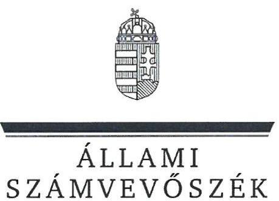
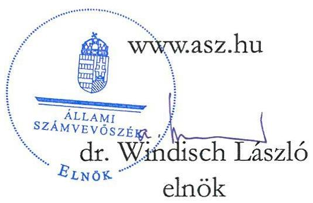
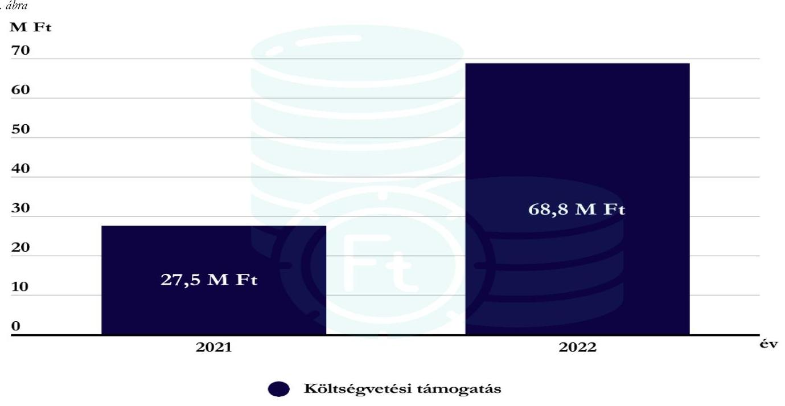
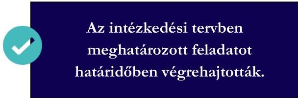
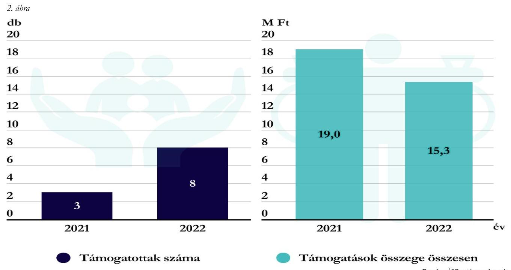

# JELENTÉS 

## Költségvetési támogatásban részesülő pártalapítványok 2021-2022. évi gazdálkodása törvényességének ellenőrzése

Megújuló Magyarországért Alapítvány

2024.

---

ÁLLAMI
SZÁMVEVŐSZÉK

# JELENTÉS 

## Költségvetési támogatásban részesülő pártalapítványok 2021-2022. évi gazdálkodása törvényességének ellenőrzése

Megújuló Magyarországért Alapítvány

2024.

24063

---

# ELLENŐRZÉSI IGAZGATÓSÁG: 

## ÁLLAMHÁZTARTÁSON KÍVÜLI SZERVEZETEKET ELLENŐRZŐ IGAZGATÓSÁG

## ELLENŐRZÉSI IGAZGATÓ:

## KLINGA LÁSZLÓ igazgató

## ELLENŐRZÉSVEZETŐ:

Jelentéseink az interneten a www.asz.hu címen olvashatók.

## KAKAS SÁNDOR ellenőrzésvezető

IKTATÓSZÁM: EL-3847-181/2024
TÉMASZÁM: 2673
ELLENŐRZÉS-AZONOSÍTÓ SZÁM: V1017

---

# TARTALOMJEGYZÉK 

AZ ELLENŐRZÉS ALAPADATAI ..... 5
AZ ELLENŐRZÖTT SZERVEZET ..... 8
ÖSSZEFOGLALÁS ..... 10
AZ ELLENŐRZÉS FÓKUSZKÉRDÉSEI ..... 12
MEGÁLLAPÍTÁSOK ..... 13
JAVASLATOK ..... 19
MELLÉKLETEK ..... 20
I. sz. melléklet: Értelmező szótár ..... 20
II. sz. melléklet: Ellenőrzési kritériumok ..... 21
FÜGGELÉK: ÉSZREVÉTELEK ..... 22
RÓVIDÍTÉSEK JEGYZÉKE ..... 23

---

.

---

# AZ ELLENŐRZÉS ALAPADATAI 

## AZ ELLENŐRZÉS CÉLJA

Az ellenőrzés célja annak értékelése volt, hogy a Pártalapítvány ${ }^{1}$ törvényesen gazdálkodott-e; az éves számviteli beszámolók és a Pártalapítvány tevékenységéről szóló éves jelentések a jogszabályi előírásoknak megfeleltek-e; a könyvvezetés és gazdálkodás során a vonatkozó jogszabályi rendelkezéseket és belső előírásokat betartották-e. Az ellenőrzés célja továbbá annak értékelése, hogy a Pártalapítvány legutóbbi ellenőrzése eredményeként készült számvevőszéki jelentésben foglalt megállapításokkal összhangban készített intézkedési tervben meghatározott feladatokat végrehajtotta-e.

## AZ ELLENŐRZÉS TÍPUSA

Szabályszerüségi ellenőrzés

## AZ ELLENŐRZŐTT IDŐSZAK

2021-2022. évek
Az utóellenőrzés tekintetében az utóellenőrzés alapját képező 22022. számú ÁSZ jelentés² közzétételének napjától (2022.06.14.) az ellenőrzésről szóló adatszolgáltatásra felhívó levél keltének napjáig (2023.09.13.) terjedő időszak.

## AZ ELLENŐRZÉS TÁRGYA

Az ellenőrzés tárgyát képezte a Pártalapítvány gazdálkodása, a könyvvezetés szabályozása és gyakorlatának szabályszerűsége, az egyszerűsített éves beszámolókra és a Pártalapítvány tevékenységéről szóló éves jelentésekre vonatkozó kötelezettség teljesítése, valamint a gazdálkodáshoz kapcsolódó korábbi ÁSZ ${ }^{3}$ ellenőrzés javaslatainak hasznosítására irányuló tevékenység.

Az ellenőrzés kiterjedt minden olyan körülményre és adatra, amely az ÁSZ jogszabályban meghatározott feladatainak teljesítéséhez, valamint az ellenőrzési program végrehajtása során felmerülő újabb összefüggések feltárásához szükséges volt.

## AZ ELLENŐRZÉS JOGALAPJA

Az ellenőrzés jogalapját az ÁSZ tv. ${ }^{4} 1 . \int(3)$ bekezdése, 5. $\int(3)$ bekezdése, 33. $\int(7)$ bekezdése, valamint a Pmtv. ${ }^{5} 4 . \int(2)$ és (4) bekezdéseinek előírásai képezték.

---

# AZ ELLENŐRZÉS MÓDSZERE 

Az ellenőrzés az ellenőrzött időszakban hatályos jogszabályok, az ellenőrzés szakmai szabályai, a jelen ellenőrzésre irányadó ÁSZ módszertanok, az ellenőrzési programban foglalt értékelési szempontok szerint került végrehajtásra.

Az ellenőrzési kérdések megválaszolásához szükséges bizonyítékok megszerzése az ellenőrzött által rendelkezésre bocsátott dokumentumokra, adatokra alapozva kérdésfeltevés (információkérés), mintavételezés, továbbá helyszíni interjú útján történt. Az ellenőrzési bizonyítékként felhasználható adatforrások közé tartoztak egyrészt az ellenőrzési programban felsorolt adatforrások, másrészt minden, az ellenőrzés folyamán feltárt, az ellenőrzés szempontjából információt tartalmazó dokumentum.

Az ellenőrzés lefolytatásához az ellenőrzött szervezet tanúsítványok kitöltésével és az ÁSZ által kért dokumentumok, adatok, információk megküldésével az ellenőrzés során szolgáltatott adatokat.

A Pártalapítvány kiadásai, ráfordításai elszámolásának szabályszerűségét (2. fókuszkérdés), a Pártalapítvány által nyújtott támogatások elszámolásának szabályszerűségét (2. fókuszkérdés), valamint a mérlegtételek besorolásának, év végi értékelésének, azok leltárral való alátámasztottságának szabályszerűségét (3. fókuszkérdés) mintavételi eljárással kiválasztott tételek alapján ellenőrizte az ÁSZ.

A 2. fókuszkérdésnél az egyes vizsgálandó részterületek ellenőrzése részterületenként 30 elemű minta értékelésével mintavételes, 30 db -ot meg nem haladó tételszám esetében tételes ellenőrzéssel történt. Az ÁSZ a 2. fókuszkérdésnél, a kiadások vonatkozásában 30-30 mintatételt ellenőrzött, a minták értékelése alapján statisztikai kivetítést alkalmazott, további lényegességi szempontok alapján 2021. évben 7 db, 2022. évben 7 db kiválasztott mintatételt ellenőrzött. Az ÁSZ a 2. fókuszkérdésnél a Pártalapítvány által nyújtott támogatások vonatkozásában - tekintettel arra, hogy az alapsokaság elemszáma egyik évben sem haladta meg a 30 tételt - tételes ellenőrzést végzett. Az ÁSZ a 3. fókuszkérdésnél, a mérlegtételek vonatkozásában évenként 30-30 mintatételt ellenőrzött, a tények feltárása és azok összegzése során a megállapítások az ellenőrzött tételekre vonatkozóan kerültek megfogalmazásra.

A vizsgált terület „szabályszerü" minősítést kapott, ha a minta ellenőrzésének eredménye alapján 95\%-os bizonyossággal a teljes sokaságban az átlagos hibaarány nem haladta meg a 10\%-ot, „nem szabályszerű", ha nagyobb volt, mint $10 \%$. Amennyiben a sokaság elemszáma nem haladta meg az előírt minta elemszámot, akkor a sokaság valamennyi elemének tételes ellenőrzésére került sor.

A Pártalapítvány bevételei elszámolásának szabályszerűségét teljeskörűen ellenőrizte az ÁSZ.
Az utóellenőrzés megállapításai az ÁSZ rendelkezésére álló dokumentumok, valamint az ÁSZ adatbekérése szerint, az ellenőrzött szervezet által rendelkezésre bocsátott dokumentumok, adatok alapján kerültek megfogalmazásra. Az ÁSZ a 2022. évben a Pártalapítvány 2019-2020. évi gazdálkodását ellenőrizte, megállapításait a 22022. számú jelentésben tette közzé. Az ellenőrzés esetében a 22022. számú ÁSZ jelentés alapján a Pártalapítvány által készített intézkedési tervben előírt feladat annak végrehajthatósága, illetve végrehajtása szempontjából az alábbiak szerint került értékelésre:

- „határidőben végrehajtott" a feladat, ha a teljesítés dokumentáltan, az intézkedési tervben előírt határidőben és tartalommal megtörtént;
- „határidőn túl végrehajtott" a feladat, ha annak teljesítése az intézkedési tervben meghatározott módon, de az abban előírt határidőn túl történt meg;

---

- „nem végrehajtott" a feladat, ha a végrehajtás nem történt meg, vagy amennyiben a teljesítést/végrehajtást nem dokumentálták, dokumentumokkal nem tudják igazolni annak teljesítését;
- „okafogyottá vált" a feladat, ha végrehajtására - meghatározott esemény bekövetkezése, továbbá külső körülmény, a múködést érintő feltétel változása miatt - már nincs szükség, illetve lehetőség, és egyértelműen megállapítható, hogy az intézkedést szükségessé tevő körülmény a jövőben nem fordulhat elő;
- „nem idősyyrơ" az a feladat, amelynek ellenőrzési időszakon belüli végrehajtására azért nem került (kerülhetett) sor, mert az intézkedés alapjául szolgáló esemény nem következett be, de annak jövőbeni előfordulása lehetséges, a végrehajtása nem volt esedékes, vagy a végrehajtás határideje még nem járt le.
A gazdálkodás hibáinak kijavítására irányuló javaslatok kidolgozásakor a hatályos jogszabályok voltak az irányadóak.

---

# AZ ELLENŐRZÖTT SZERVEZET 

## MEGÚJULÓ MAGYARORSZÁGÉRT ALAPÍTVÁNY

A Párbeszéd Magyarországért Párt* 2014. évben alapította meg a Megújuló Magyarországért Alapítványt, $0,2 \mathrm{M} \mathrm{Ft}$ induló vagyon rendelkezésre bocsátásával.

A Pártalapítvány Alapító okirat ${ }_{1,2,3}$-ában ${ }^{6}$ rögzítették: „Az Alapítvány célja, bogy a Párbeszéd Magyarországért Párt által képviselt zöld és baloldali értékek népszerüsitésével, a fontos kö̉ügyek és különbözö társadalmi érdekek ennek megfelelö bemutatásával bozzájáruljon a politikai kultúra fejlesztésébez, árnyalt és széles körü tájékoztatással az állampolgárok ezen értékek iránti elkötelezödését elösegitve támogassa a Pártot küldetésének megvalósitásában, célkitüzéseinek elérésében."

A Pártalapítvány legfőbb döntést hozó szerve a hét taggal működő Kuratórium ${ }^{7}$ volt, amelynek fő feladata az alapítványi célok megvalósítása, a képviselet, a vagyonnal való gazdálkodás volt. A Pártalapítvány működésének és gazdálkodásának jog- és célszerűségének ellenőrzésére háromtagú Felügyelőbizottságot ${ }^{8}$ jelöltek ki. A Pártalapítvány a Kuratórium Elnöke által irányított munkaszervezetet alakított ki.

A Pártalapítvány az ellenőrzött időszakban a pénzügyi-számviteli feladatai ellátását külső szervezet bevonásával biztosította, az egyszerűsített éves beszámolóit könyvvizsgáló nem vizsgálta felül, könyvvizsgálatra nem volt kötelezett.

A Pártalapítvány tevékenységének ellátásához az ellenőrzött időszakban a központi költségvetésből, az alapító párttól ${ }^{9}$ és magánszemélytől kapott támogatást.

A Pártalapítvány 2021-2022. évben kapott költségvetési támogatásának évenkénti alakulását az 1. ábra mutatja be:

[^0]
[^0]:    * 2023.05.27-től Párbeszéd - a Zöldek Párja

---

A Pártalapítvány Alapító okirata ${ }_{1,2,3}$ szerint az alapítványi cél megvalósításával közvetlenül összefüggő gazdasági tevékenységet folytathat. Az ellenőrzött időszakban alapcél szerinti tevékenységet folytatott, vállalkozási tevékenységet nem végzett.

A Pártalapítványnál az ellenőrzött időszakban külső ellenőrzésre, továbbá törvényességi felügyeleti ellenőrzésre nem került sor.

---

# ÖSSZEFOGLALÁS 

Az ÁSZ ellenőrzése a Párttv. ${ }^{10}$ alapján a politikai kultúra fejlesztése érdekében tudományos, ismeretterjesztő, kutatási, oktatási tevékenység folytatása céljából, a Ptk. ${ }^{11}$ szerinti Alapító okiraton alapuló bírósági nyilvántartásba vétellel létrejött Pártalapítvány gazdálkodására terjedt ki. A Pmtv. 4. § (2) bekezdése értelmében a pártalapítványok gazdálkodása törvényességének ellenőrzése az ÁSZ feladata. A Pmtv. 4. § (4) bekezdése alapján az ÁSZ kétévente - kötelező jelleggel - ellenőrzi azoknak a pártalapítványoknak a gazdálkodását, amelyek állami költségvetési támogatásban részesültek.

A pártalapítványok ellenőrzésével az ÁSZ hozzájárul ahhoz, hogy a társadalom objektív képet alkothasson a pártalapítványok működéséről, gazdálkodásáról. Az ellenőrzésről készített számvevőszéki jelentésben megfogalmazott megállapítások, javaslatok alapján a törvényalkotók konkrét lépéseket tehetnek a pártalapítványokra vonatkozó szabályozások megváltoztatása, átláthatóbbá, ellenőrizhetőbbé tétele érdekében. Az ellenőrzött szervezetek szintjén a hiányosságok, szabálytalanságok feltárása, az ennek kapcsán megfogalmazott megállapítások elősegíthetik a pártalapítványok szabályszerű gazdálkodását.

A Pártalapítvány Alapító okirata ${ }_{1,2,3}$ megfelelt a jogszabályi előírásoknak.

A gazdálkodás szervezeti kereteinek kialakítása szabályszerű volt.

A Pártalapítvány az ellenőrzött időszakban rendelkezett a Számv. tv. ${ }^{12}$ szerint kötelezően elkészítendő szabályzatokkal, az értékelési szabályzatot is magába foglaló számviteli politikával ${ }_{1,2}{ }^{13}$, az eszközök és a források leltározási és leltárkészítési szabályzatával ${ }_{1,2}{ }^{14}$, pénzkezelési szabályzattal ${ }_{1,2}{ }^{15}$, továbbá számlarenddel ${ }_{1,2}{ }^{16}$. A szabályzatok a Számv. tv.-ben előírtaknak megfeleltek.

A Pártalapítvány a kapott támogatások elszámolása során a jogszabályi előírásokat betartotta.
A Pártalapítvány a 2021. és a 2022. évben a tevékenységének költségeit, ráfordításait szabályszerűen számolta el. Több esetben előfordult, hogy a kiadás elszámolását alátámasztó bizonylat a Számv. tv. előírása ellenére nem tartalmazta a könyvelés módjára, az érintett könyvviteli számlákra történő hivatkozást.

A Pártalapítvány mindkét ellenőrzött évben nyújtott támogatást harmadik személy részére. A nyújtott

A kiadások, nyújtott
támogatások elszámolása
szabályszerű volt.
támogatások a Pártalapítvány céljaival összhangban voltak, a támogatások odaítélése, elszámolása, nyilvántartása során a jogszabályi rendelkezéseket betartották.

A Pártalapítvány az ellenőrzött időszakban a Párttv. előírásainak megfelelve az alapító párt részére támogatást, vagyoni hozzájárulást nem adott.

A Pártalapítvány mindkét ellenőrzött évben elkészítette a tevékenységéről szóló éves jelentését, azonban a tevékenységről szóló éves jelentések a Pmtv.-ben foglaltak ellenére nem tartalmazták a költségvetési támogatás felhasználására vonatkozó kimutatást. A Pártalapítvány tevékenységéről szóló éves jelentéseket a Magyar

A 2021. és 2022. évi jelentés és beszámoló közzétételi kötelezettség teljesítése nem volt szabályszerű

Közlöny mellékleteként megjelenő Hivatalos Értesítőben az előírt határidőben közzétette. A saját honlapján közzétett éves jelentések nem tartalmazták a jogszabályi előírások szerinti egyszerűsített éves beszámolót, mivel az egyszerűsített éves beszámolók a 2021. évben nem
tartalmazták a kiegészítő mellékletet, a 2022. évben a mérleget és a kiegészítő mellékletet.

---

A 2021. évi és 2022. évi egyszerűsített éves beszámoló közzétételénél a jogszabályi előírásokat nem tartották be, mert nem a Kuratórium által elfogadott beszámolót helyezték letétbe. Az ellenőrzés időszaka alatt 2023. október 17-én a 2022. évi számviteli beszámolót újra közzétették. Az egyszerűsített éves beszámolók mérlegtételeinek besorolása, értékelése az ellenőrzött tételek esetében szabályszerű volt.

A Pártalapítvány a 2022. évben kapott központi költségvetési támogatás fel nem használt részét a Számv. tv. előírásaival ellentétben könyvelésében nem határolta el.

A Pártalapítvány az utóellenőrzés megállapítása alapján az intézkedési tervben meghatározott feladatot

határidőben végrehajtotta, az ellenőrzött időszakban a támogatások kifizetése során a teljesítésigazolást a belső előírásoknak megfelelően igazolta.

Az ÁSZ a Pártalapítvány Kuratóriumának elnöke részére az ellenőrzés során feltárt szabálytalanságok megszüntetése érdekében hat javaslatot fogalmazott meg.

---

# AZ ELLENŐRZÉS FÓKUSZKÉRDÉSEI 

1.     - A Pártalapítvány kialakította-e a törvényes gazdálkodásához szükséges szabályokat?
2.     - A Pártalapítvány a könyvvezetése és gazdálkodása során betartotta-e a jogszabályi előírásokat?
3.     - A Pártalapítvány tevékenységéről szóló jelentések, az éves számviteli beszámolók a jogszabályi előírásoknak megfeleltek-e?
4. A Pártalapítvány az intézkedési tervben meghatározott feladatokat végrehajtotta-e?

---

# 1. A Pártalapítvány kialakította-e a törvényes gazdálkodásához szükséges szabályokat? 

## Összegző megállapítás

1.1. számú megállapítás

A Pártalapítvány az ellenőrzött időszakban a törvényes gazdálkodáshoz szükséges szabályokat kialakította.

A Pártalapítvány működésének szabályait a jogszabályi előírásoknak megfelelően rögzítették.

Az Alapító okirat ${ }_{1,2,3}$ a Ptk. előírásai szerint tartalmazta a Pártalapítvány célját és tevékenységét, a Kuratóriumra, mint ügyvezető szervre vonatkozó előírásokat, a kuratóriumi tagok számát és összetételét. Az Alapító okirat ${ }_{1,2,3}$-ban a Ptk. előírásai szerint rendelkeztek a Pártalapítvány működésének és gazdálkodásának jog- és célszerűségét ellenőrző három tagú Felügyelőbizottság létrehozásáról, továbbá a Pártalapítvány munkaszervezetéről.
A Pártalapítvány gazdálkodásával kapcsolatos könyvvezetési- és nyilvántartási rendszerét az Eszkr ${ }^{17}$. előírásainak megfelelően kialakította, az alkalmazott eredménykimutatás megfelelt a jogszabályi előírásoknak.
A Pártalapítvány pénzügyi-gazdasági feladatait szerződés alapján ellátó számviteli szolgáltató rendelkezett az Eszkr. rendelkezéseinek megfelelő, szükséges szakmai képzettséggel, végzettséggel.
1.2. számú megállapítás

A Pártalapítvány gazdálkodására vonatkozó belső szabályozás a számviteli politikában egy tartalmi hiányosság kivételével megfelelt a jogszabályi előírásoknak.

A Pártalapítvány az ellenőrzött időszakban a Számv. tv. előírásainak megfelelően rendelkezett számviteli politikával ${ }_{1,2}$, amely az eszközök és a források értékelési szabályzatát is magában foglalta, továbbá a számviteli politika keretében elkészítendő eszközök és a források leltárkészítési és leltározási szabályzattal ${ }_{1,2}$, pénzkezelési szabályzattal ${ }_{1,2}$, és számlarenddel ${ }_{1,2}$. A szabályzatok a számviteli politika ${ }_{1,2}$ kivételével a Számv. tv. előírásainak megfeleltek.
A számviteli politikában ${ }_{1,2}$ a Számv. tv. 14. § (4) bekezdésében előírtak ellenére nem rögzítették, hogy mit tekintenek kivételes nagyságú vagy előfordulású bevételnek, költségnek, ráfordításnak.
A Pártalapítvány céljaira rendelt vagyont és annak felhasználási módját a törvényi előírásokkal összhangban az Alapító okirat ${ }_{1,2,3}$-ban meghatározták, ezen belül az induló vagyont, a vagyoni hozzájárulás tárgyát, mértékét, módját és idejét, valamint az alapítványi vagyon kezelésének és felhasználásának részletszabályait kialakították. A Pártalapítvány vagyonának felhasználására vonatkozó döntés a Kuratórium kizárólagos jogkörébe utalták.

---

1.3. számú megállapítás

A Pártalapítvány alapcélja szerinti tevékenysége az ellenőrzött időszakban szabályszerű volt.

A Pártalapítvány az ellenőrzött időszakban alapcél szerinti tevékenységet folytatott. A Pártalapítvány 2021. és 2022. évi egyszerűsített éves beszámolója és eredménykimutatása alapján nem folytatott gazdasági vállalkozási tevékenységet.
A Pártalapítvány 2021. és 2022. éves tevékenységéről szóló jelentéseinek és egyszerűsített éves beszámolóinak adatai alapján a Ptk.-ben előírtaknak és az Alapító okirat ${ }_{1,2,3}$-ban foglaltaknak megfelelően nem volt korlátlan felelősségű tagja más jogalanynak, nem volt alapítója más alapítványnak, nem csatlakozott más alapítványhoz.

# 2. A Pártalapítvány a könyvvezetése és gazdálkodása során betartotta-e a jogszabályi előírásokat? 

## Összegző megállapítás

2.1. számú megállapítás

A Pártalapítvány a 2021. és 2022. évben a könyvvezetése és gazdálkodása során a jogszabályi előírásokat betartotta.

A Pártalapítvány 2021. és 2022. évben a kapott támogatásokat szabályszerűen fogadta és számolta el.

A Pártalapítvány az ellenőrzött időszakban a Párttv. és a Pmtv. előírásai szerint a 2021. és 2022. évi Kv.tv. ${ }^{18}$ és az 1284/2022. (VI. 7.) Korm. határozat ${ }^{19}$ alapján meghatározott állami költségvetésből juttatott támogatásban részesült, továbbá magánszemélytől és az alapító párttól is fogadott el támogatást a Pmtv.ben előírtakat betartva. Az alapcél szerinti tevékenysége költségei, ráfordításai ellentételezésére visszafizetési kötelezettség nélkül kapott támogatásokat főkönyvi nyilvántartásában az egyéb bevételek számlacsoporton belül megnyitott főkönyvi számlákon elkülönítetten tartotta nyilván az Eszkr. előírásainak megfelelően.
A Pártalapítvány az ellenőrzött időszakban továbbutalási céllal nem kapott támogatást.
2.2. számú megállapítás

A Pártalapítvány által a 2021. és 2022. évben nyújtott cél szerinti támogatások odaítélése, elszámolása, beszámolóban történő bemutatása szabályszerű volt.

A Pártalapítvány az ellenőrzött időszakban a harmadik fél részére nyújtott támogatások elbírálásának, folyósításának, nyilvántartásának, elszámolásának rendjét az Alapító okirat ${ }_{1,2,3}$-ban, az SZMSZ ${ }_{1,2,3}{ }^{20}$-ban, a Kuratórium ügyrendjében ${ }^{21}$, továbbá a számviteli politiká ${ }_{1,2}$-ban és a számlarend ${ }_{1,2}$-ben alakította ki. A Kuratórium az éves költségvetési terv jóváhagyásával döntött a harmadik fél részére nyújtott támogatások odaítéléséről.
A Pártalapítvány a Ptk. és az Alapító okirat ${ }_{1,2,3}$-ban az alapítványi vagyon felhasználására vonatkozó előírásokat betartva az ellenőrzött időszakban kérelem alapján szervezetek részére 2021. évben 19,0 M Ft, míg 2022. évben 14,7 M Ft összegű támogatást nyújtott, magánszemélyek támogatására a 2022. évben került sor, összesen 0,6 M Ft összegben.
A Pártalapítvány által nyújtott támogatások alakulását a 2. ábra mutatja be:

---

A Pártalapítvány által a 2021. és 2022. évben harmadik személy részére nyújtott támogatások elszámolása szabályszerű volt. A Pártalapítvány által nyújtott támogatások jogcímei megfeleltek az Alapító okirat ${ }_{1,2,3}$ ban foglalt céloknak. A támogatás kedvezményezettje minden esetben megfelelt a Ptk. előírásainak, a támogatásról az előírások szerint a Kuratórium döntésével összhangban szerződést kötöttek. A támogatások folyósítása a kedvezményezett bankszámlájára történő utalással valósult meg, a támogatási szerződésekben foglaltak szerint.
A folyósított támogatások főkönyvi elszámolása az egyéb ráfordítások között, a számlarend ${ }_{1,2}$-ben előírtaknak megfelelően történt.
A Pártalapítvány tevékenységről szóló éves jelentések az ellenőrzött időszakban a Pmtv.-ben foglaltaknak megfelelően tartalmazták a nyújtott támogatásokkal kapcsolatos adatokat.
A Pártalapítvány az alapító párt részére támogatást, vagyoni hozzájárulást az ellenőrzött időszakban nem adott, ezzel eleget tett a Párttv. előírásainak.
2.3. számú megállapítás

A Pártalapítvány 2021. és 2022. évi kiadásainak elszámolása szabályszerű volt.

A Pártalapítvány a 2021. és 2022. évben a személyi- és anyagjellegú költségek és ráfordítások elszámolása és kifizetése során a Számv. tv., az Eszkr., továbbá a számviteli politika ${ }_{1,2}$, a számlarend ${ }_{1,2}$, a pénzkezelési szabályzat ${ }_{1,2}$ előírásait betartotta.
A Pártalapítvány kiadásai az ellenőrzött időszakban az ellenőrzött tételek alapján a Pártalapítvány cél szerinti tevékenysége vagy a múködés fenntartása érdekében merültek fel a Ptk. előírásai szerint. A kifizetéseknél kötelezettségvállalóként a Kuratórium ügyrendjében előírtak szerint jártak el. A költségelszámolás, ráfordítás számviteli elszámolását megalapozó munkaszerződés, számla, megrendelés, bankszámla kivonat a Számv. tv.-ben előírtak szerint minden mintatétel esetében rendelkezésre állt. A számviteli bizonylatokon megtörtént a Számv. tv. szerinti utalványozás és a végrehajtás ellenőrzés igazolása a belső szabályzatok előírásai szerint.

---

A 2021. és 2022. évre kiválasztott kiadási mintatételek ellenőrzése során az ellenőrzés a következőket állapította meg:
2021. évben egy esetben, 2022. évben 16 esetben a kiadás elszámolását alátámasztó bizonylat a Számv. tv. 167.§ (1) bekezdés h) pontja ellenére nem tartalmazta a könyvelés módjára, az érintett könyvviteli számlákra történő hivatkozást.

# 3. A Pártalapítvány tevékenységéről szóló jelentések, az éves számviteli beszámolók a jogszabályi előírásoknak megfeleltek-e? 

## Összegző megállapítás

3.1. számú megállapítás

A Pártalapítvány 2021. és 2022. évre a tevékenységéről szóló éves jelentést és egyszerúsített éves beszámolót nem a jogszabályi előírások szerint készítette el.

A Pártalapítvány a 2021. és 2022. évi tevékenységéről szóló éves jelentéskészítési és közzétételi kötelezettségét nem szabályszerűen teljesítette.

A Pártalapítvány a Pmtv. előírásának megfelelően a 2021. és 2022. évekre vonatkozóan éves tevékenységéről jelentést készített. Az éves jelentés a Pmtv. szerint tartalmazta a számviteli beszámolót, a vagyon felhasználásával kapcsolatos kimutatást, a cél szerinti juttatások kimutatását, a kapott támogatások kimutatását, a Pártalapítvány egyes vezető tisztségviselőinek nyújtott juttatások összegét, továbbá a Pártalapítvány tevékenységéről szóló rövid tartalmi beszámolót. A tevékenységről szóló éves jelentések egyik évben sem tartalmazták a Pmtv. 3/A. § (3) bekezdés b) pontja ellenére a költségvetési támogatás felhasználására vonatkozó kimutatást. Az ellenőrzött időszakra készített jelentéseket a Magyar Közlöny mellékleteként megjelenő Hivatalos Értesítőben a Pmtv. előírásai szerinti határidőben közzétették.
A Pártalapítvány a Pmtv. 3/A. § (5) bekezdésében előírtak ellenére a tevékenységről szóló éves jelentések saját honlapon történő közzétételének nem szabályszerűen tett eleget, mert a saját honlapon közzétett 2021. évi jelentés részét képező egyszerűsített éves beszámoló a kiegészítő mellékletet, a 2022. évi jelentés részét képező egyszerűsített éves beszámoló a mérleget és a kiegészítő mellékletet nem tartalmazta.
3.2. számú megállapítás

A Pártalapítvány a 2021. és 2022. évre a jogszabályi előírások szerinti egyszerűsített éves beszámolót készített, azonban közzétételi kötelezettségét nem szabályszerűen teljesítette. A 2022. évre a Számv. tv. előírása ellenére a költségei ellentételezésére kapott költségvetési támogatás fel nem használt részét a mérlegben passzív időbeli elhatárolásként nem mutatta ki.

A Pártalapítvány a 2021. és a 2022. évre a Számv. tv., az Eszkr. és az Ectv. alapján egyszerűsített éves beszámolót készített, melyet a Kuratórium a Felügyelőbizottság véleménye birtokában elfogadott. Az elfogadott beszámolók a jogszabályi előírásoknak megfelelően mérlegből, eredménykimutatásból, kiegészítő mellékletből álltak, továbbá a Pártalapítvány beszámolójával egyidejűleg közhasznúsági mellékletet is készített.

---

A Pártalapítvány a 2021. évi és a 2022. évi egyszerűsített éves beszámolójának letétbe helyezése és közzététele során az Ectv. 30. § (1) bekezdésében előírtakat nem tartotta be, mert nem a Kuratórium által elfogadott beszámolókat helyezték letétbe és tették közzé. A Kuratórium által elfogadott 2021. évi egyszerűsített éves beszámoló mérlegében a követelések, a mérlegfőösszeg, a tárgyévi eredmény sorokon szereplő összeg, a 2022. évi egyszerűsített éves beszámoló mérlegében a forgóeszközök, pénzeszközök, saját tőke, tárgyévi eredmény és a rövid lejáratú kötelezettségek sorokon szereplő összegek eltértek a leltétbe helyezett egyszerűsített éves beszámolókban rögzített összegektől. A Pártalapítvány a 2022. évi beszámolót 2023. október 17-én újra közzé tette.
A Pártalapítvány a 2021. és 2022. évi egyszerűsített éves beszámolója saját honlapján történő közzétételénél az Ectv. 30. § (4) bekezdésében előírtakat nem tartotta be, mert a közzétett 2021. évi egyszerűsített éves beszámoló kiegészítő mellékletet, a 2022. évi egyszerűsített éves beszámoló a mérleget és kiegészítő mellékletet nem tartalmazott.
A Pártalapítvány főkönyvi nyilvántartása és egyszerűsített éves beszámolója alapján a 2022. évben kapott költségvetési támogatás teljes összegét költségei nem ellentételezték, a fel nem használt visszafizetési kötelezettség nélküli, pénzügyileg rendezett költségvetési támogatás összegét a Számv. tv. 44. § (2) bekezdése előírásai ellenére passzív időbeli elhatárolásként nem mutatta ki.
A Pártalapítvány 2021. és 2022. évi egyszerűsített éves beszámoló mérlegtételeinek tartalma, besorolása és bekerülési értékének meghatározása valamennyi ellenőrzött tételnél megfelelt a Számv. tv. és az Eszkr. előírásainak. Az ellenőrzött mérlegtételeket a Számv. tv., az Eszkr. és a belső szabályzatok előírásainak megfelelően az ellenőrzött időszakban leltárral alátámasztották.
3.3. számú megállapítás

A Pártalapítvány céljaira rendelt vagyon kezelése és védelme, az arról való beszámolás szabályszerű volt.

Az Alapító okirat ${ }_{1,2,3}$-ban a Ptk. előírásainak megfelelően meghatározták a Pártalapítvány céljaira és tevékenységére rendelkezésre bocsátott vagyoni hozzájárulás mértékét, valamint az alapítói vagyon kezelésének és felhasználásának szabályait. A Pártalapítvány SZMSZ-ben a vagyon kezelésének szabályait részletezték. A Pártalapítvány céljaira rendelt vagyon nyilvántartása, elszámolása rendjét, nyilvántartásának továbbrészletezését kialakították.
A Pártalapítvány az államháztartásból ingyenesen átadott vagyont, illetve véglegesen tulajdonba adott vagyont nem kapott, ebből adódóan az Nvtv. ${ }^{22}$, valamint a Vtvr. ${ }^{23}$ előírásai szerinti vagyonhoz kapcsolódó nyilvántartási, adatszolgáltatási kötelezettsége nem keletkezett.

# 4. A Pártalapítvány az intézkedési tervben meghatározott feladatokat végrehajtotta-e? 

## Összegző megállapítás A Pártalapítvány az intézkedési tervben meghatározott feladatot határidőben végrehajtotta.

Az ÁSZ a 22022. számú jelentésében egy javaslatot fogalmazott meg a Kuratóriumi Elnök részére: „Intézkedjen a jövőben a jogszabályi elöírás szerint a támogatási szerzödések alapján történt kifizetések könyveiteli elszámolását közzvetlenül alátámasztó bizonylatokon az utalványozó és a rendelkezés végrebajzását igazoló személy, valamint az ellenör alárásának feltüntetéséről."

---

A Pártalapítvány Elnöke az intézkedési tervben vállaltak szerint előírta a támogatási szerződések kifizetéséhez a teljesítést igazoló (ügyvezető), az utalványozó (kuratórium elnöke) az ellenőrzés végrehajtását igazoló (a számlaellenőrzésre kijelölt munkavállaló) és a végrehajtást igazoló (alapítvány titkára) aláírását tartalmazó teljesítésigazolást. Az ellenőrzés megállapítása szerint Pártalapítványnál a 2022. június 14 -től a támogatási szerződésekhez teljesítésigazolást készítettek, amely tartalmazta a teljesítést igazoló, az utalványozó, az ellenőrzés végrehajtását igazoló és a rendelkezés végrehajtását igazoló aláírását.

---

# JAVASLATOK 

Az ÁSZ tv. 33. § (1) bekezdésében foglaltak értelmében az ellenőrzött szervezet vezetője köteles a jelentésben foglalt megállapításokhoz kapcsolódó intézkedési tervet összeállítani és azt a jelentés kézhezvételétől számított 30 napon belül az ÁSZ részére megküldeni. Amennyiben az ellenőrzött szervezet vezetője nem küldi meg határidőben az intézkedési tervet, vagy továbbra sem elfogadható intézkedési tervet küld, az Állami Számvevőszék elnöke az ÁSZ tv. 33. § (3) bekezdése a) és b) pontjaiban foglaltakat érvényesítheti.

## A MEGÚJULÓ MAGYARORSZÁGÉRT ALAPÍTVÁNY ELNÖKE RÉSZÉRE

1. Gondoskodjon arról, hogy a számviteli politika megfeleljen a Számv. tv.-ben elöirtaknak.
2. Gondoskodjon arról, hogy a kiadások elszámolását alátámasztó bizonylat a Számv. tv. elöírása szerint tartalmazza a könyvelés módjára, az érintett könyvviteli számlákra történő hivatkozást.
3. Gondoskodjon arról, hogy a Pártalapítvány tevékenységről szóló éves jelentések a Pmtv.-ben elöírtak szerint tartalmazzák a költségvetési támogatás felhasználására vonatkozó kimutatást.
4. Gondoskodjon a tevékenységéről szóló éves jelentések saját honlapon való szabályszerű közzétételéről a Pmtv. elöírásai szerint.
5. Gondoskodjon az egyszerüsített éves beszámoló Számv. tv., Ectv. és Eszkr. elöírásai szerinti tartalommal való közzétételéről.
6. Gondoskodjon a költségek, ráfordítások ellentételezésére - visszafizetési kötelezettség nélkül - kapott, pénzügyileg rendezett, egyéb bevételként elszámolt támogatás összegéből az üzleti évben költséggel, ráfordítással nem ellentételezett összeg időbeli elhatárolásáról a számviteli nyilvántartásaiban a Számv. tv.-ben foglaltaknak megfelelően.

---

# MELLÉKLETEK 

## I. SZ. MELLÉKLET: ÉRTELMEZŐ SZÓTÁR

alaptevékenység
alapítvány
gazdasági-vállalkozási tevékenység
költségvetési támogatás
pártalapítvány

A létesítő okiratban meghatározott, a tevékenység célja szerinti, közhasznú, egyesületi, alapítványi célú tevékenység. (Forrás: Eszkr. 6. §)
Az alapítvány az alapító által az alapító okiratban meghatározott tartós cél folyamatos megvalósítására létrehozott jogi személy. Az alapító az alapító okiratban meghatározza az alapítványnak juttatott vagyont és az alapítvány szervezetét. Alapítvány nem alapítható gazdasági tevékenység folytatására. Az alapítvány az alapítványi cél megvalósításával közvetlenül összefüggő gazdasági tevékenység végzésére jogosult. Alapítvány nem lehet korlátlan felelősségű tagja más jogalanynak, nem létesíthet alapítványt és nem csatlakozhat alapítványhoz. (Forrás: Ptk. 3:378. §, 3:379. § (1)-(3) bekezdés)
A jövedelem- és vagyonszerzésre irányuló vagy azt eredményező, üzletszerűen végzett gazdasági tevékenység, kivéve az adomány (ajándék) elfogadását, a létesítő okiratban meghatározott cél szerinti tevékenységet (ideértve a közhasznú tevékenységet is), a pénzeszközök betétbe, értékpapírba, társasági részesedésbe történő elhelyezését és az ingatlan megszerzését, használatának átengedését és átruházását. (Forrás: Ectv. 2. § 11. pont.)
A pártalapítványoknak a Párttv. 9/A. § (1) bekezdése és a Pmtv. 1. § előírásainak értelmében, az éves költségvetési törvények szerint - jellemzően az 1. számú melléklet I. Országgyűlés fejezet 9. Pártalapítványok támogatás címen - az állami költségvetésből juttatott támogatás.
A politikai kultúra fejlesztése érdekében, tudományos, ismeretterjesztő, kutatási és oktatási tevékenység folytatása céljából pártok által létrehozott, külön jogszabályban - a Pmtv. 1. § és 3. § (1) bekezdése - meghatározott, jogi személynek minősülő egyéb szervezet, speciális jogállású alapítvány. (Forrás: Párttv. 9/A. § (1) bekezdés, Pmtv. 1. §, az egyesülési jogról, a közhasznú jogállásról, Ectv. 2. §6. c) pont, Számv. tv. 3. § (1) bekezdés 4. pont, Eszkr. 2. § (1) bekezdés 1) pont)

---

## FOKUSZTERÜLET/FOKUSZKÉRDÉS

1. A Pártalapítvány kialakította-e a törvényes gazdálkodásához szükséges szabályokat?
2. A Pártalapítvány a könyvvezetése és gazdálkodása során betartotta-e a jogszabályi előírásokat
3. A Pártalapítvány tevékenységéről szóló jelentések, az éves számviteli beszámolók a jogszabályi előírásoknak megfeleltek-e?
4. A Pártalapítvány az intézkedési tervben meghatározott feladatokat végrehajtotta-e?

## ELLENÖRZÉSI KRITÉRIUMOK

Ptk. 3:21-3:25. §, 3:29-3:30. §, 3:379. § (3) bekezdés, 3:391. § (1) bekezdés c) pont, 3:391. § (2) bekezdés h) pont, 3:3973:398. §, 3:400.§ (2) bekezdés

Ectv. 28-31. §
Eszkr. 7. § (3)-(4) bekezdés b) pont, (6) bekezdés, 8. § (2) bekezdés, 9. § (4) bekezdés, 12-15. §,
Számv.tv. 14. § (3)-(4) bekezdés, 14. § (5) bekezdés a), b) és d) pont, 14. § (8) bekezdés, 14. § (12) bekezdés, 16.§ (4) bekezdés, 96. §, 150. §, 161. § (1) bekezdés, 161. § (2) bekezdés pont, 161. § (4) bekezdés
Pmtv. 3. § (6), (6a) bekezdés
Ptk. 3:384. § (1) bekezdés
Párttv. 5. § (2) bekezdés, 9/A. § (1) bekezdés, 9/A. § (3) bekezdés,
Pmtv. 3. § (3) bekezdés, 3. § (4) bekezdés a pont, 3/A § (3) bekezdés b), d) e) pont
2021. és 2022. évi Kv.tv.1284/2022 (VI.7) Korm. határozat 1. sz. melléklet

Számv.tv. 78.-79. §., 161/A. § (2) bekezdés, 165. § (1) bekezdés, 166. § (1) bekezdés, 167. § (1) bekezdés c), h) pont
Ectv. 2. § 1. pont
Eszkr.13. § (3) bekezdés, 9. § (9) bekezdés, 12. § (4) bekezdés, 14. § (1) bekezdés,
Ptk. 3:4, 3:9 - 3:10. §, 3: 378 - 3:383. §, 3:388 - 3:390. §, 3:391. § (1) bekezdés b) pont, (2) bekezdés c) pont.
Pmtv. (1)-(2) bekezdés, 3/A § (3), (5) bekezdés, (6) bekezdés, 3. § (4) bekezdés

Ectv. 28. § (1)-(3) bekezdés, 29. § (2)-(5) bekezdés, 30. §., 46. §. (1) bekezdés,
Eszkr. 7. § (1)-(3), (4) bekezdés b) pontja, (6)-(8). bekezdés, 8. § (2) bekezdés, 9. § (4) bekezdés, 11. §, 14. § (1) bekezdés, 16. §.,17. §., 23. § (1) bekezdés,

Számv. tv. 8. § (2) bekezdés b) pontja, 8. §. (5) bekezdés, 9. § (2) bekezdés, 19. § (1) bekezdés.; 23-31. §, 35. §, 44. § (2) bekezdés, 47-51. §, 52., 54-56. §,57-59. §, 65. § (1)-(7) bekezdés, 69. §, 91. § a) pont, 96. § (1) bekezdés, 153.§, 154. §, 155. § (7) bekezdés, 161. § (2)-(3) bekezdés, 161/A. § (2) bekezdés, 165. § (4) bekezdés,
Nvtv. 7. § (1) bekezdés, 13. § (3) bekezdés, 13. § (4) bekezdés b) pont,

Vtvr. 14. § (1)-(3) bekezdés,17. (1)-(2) bekezdés, melléklet II/8. pont
Intézkedési terv,
ÁSZ tv. 33. § (7) bekezdése

---

# FÜGGELÉK: ÉSZREVÉTELEK 

A jelentéstervezetet a Számvevőszék 15 napos észrevételezésre megküldte az ellenőrzött szervezet vezetőjének az ÁSZ tv. 29. §* (1) bekezdése előírásának megfelelően.

A Megújuló Magyarországért Alapítvány Elnöke a jelentéstervezetre nem tett észrevételt.

[^0]
[^0]:    * 29. § (1) Az Állami Számvevőszék az ellenőrzési megállapításait megküldi az ellenőrzött szervezet vezetőjének vagy az általa megbízott személynek, és annak, akinek személyes felelősségét állapította meg.
    (2) Az ellenőrzött szervezet vezetője és a felelősként megjelölt személy az ellenőrzés megállapításaira tizenöt napon belül írásban észrevételt tehet.
    (3) Az Állami Számvevőszék az észrevételre a beérkezésétől számított harminc napon belül írásban válaszol. A figyelembe nem vett észrevételeket köteles a jelentésben feltüntetni, és megindokolni, hogy azokat miért nem fogadta el.

---

# RÖVIDÍTÉSEK JEGYZÉKE 

${ }^{1}$ Pártalapítvány
${ }^{2}$ 22022. számú ÁSZ jelentés
${ }^{3}$ ÁSZ
${ }^{4}$ ÁSZ tv.
${ }^{5}$ Pmtv.
${ }^{6}$ Alapító okirat ${ }_{1,2,3}$
${ }^{7}$ Kuratórium
${ }^{8}$ Felügyelőbizottság
${ }^{9}$ alapító párt
${ }^{10}$ Párttv.
${ }^{11}$ Ptk.
${ }^{12}$ Számv. tv.
${ }^{13}$ számviteli politika $_{1,2}$
${ }^{14}$ eszközök és a források leltárkészittési és leltározási szabályzata ${ }_{1,2}$
${ }^{15}$ pénzkezelési szabályzat ${ }_{1,2}$
${ }^{16}$ számlarend $_{1,2}$
${ }^{17}$ Eszkr.
${ }^{18}$ 2021. és 2022. évi Kv.tv.
${ }^{19}$ 1284/2022. (VI. 7.) Korm. határozat
${ }^{20}$ SZMSZ $_{1,2,3}$
${ }^{21}$ Kuratóriumi ügyrend
${ }^{22}$ Nvtv.
${ }^{23}$ Vtvr.

Megújuló Magyarországért Alapítvány
A költségvetési támogatásban részesülő pártalapítványok 2019-2020. évi gazdálkodása törvényességének ellenőrzése Megújuló Magyarországért Alapítvány Állami Számvevőszék
2011. évi LXVI. törvény az Állami Számvevőszékről
2003. évi XLVII. törvény a pártok müködését segítő tudományos, ismeretterjesztő, kutatási, oktatási tevékenységet végző alapítványokról
Megújuló Magyarországért Alapítvány Alapító okirat ${ }_{1}$ (hatályos 2020.07.292021.08.14.) Megújuló Magyarországért Alapítvány Alapító okirat ${ }_{2}$ (hatályos 2021.08.15-2022.12.06.) Megújuló Magyarországért Alapítvány Alapító okirat ${ }_{3}$ (hatályos 2022.12.17-től)
Megújuló Magyarországért Alapítvány Kuratóriuma
Megújuló Magyarországért Alapítvány Felügyelőbizottsága
Párbeszéd Magyarországért Párt
1989. évi XXXIII. törvény a pártok müködéséről és gazdálkodásáról
2013. évi V. törvény a Polgári Törvénykönyvről
2000. évi C. törvény a számvitelről

Megújuló Magyarországért Alapítvány számviteli politika ${ }_{1}$ (hatályos 2020. 10. 30.2022.05.03.) Megújuló Magyarországért Alapítvány számviteli politika ${ }_{2}$ (hatályos 2022.05.04-től)
Megújuló Magyarországért Alapítvány eszközök és források leltárkészittési és leltározási szabályzat ${ }_{1}$ (hatályos 2020. 10. 30.-2022.05.03.) Megújuló Magyarországért Alapítvány eszközök és források leltárkészittési és leltározási szabályzat2 (hatályos 2022.05.04-től)

Megújuló Magyarországért Alapítvány pénzkezelési szabályzat1 (hatályos 2020. 10. 30.-2022.05.03.) Megújuló Magyarországért Alapítvány pénzkezelési szabályzat2 (hatályos 2022.05.04-től)
Megújuló Magyarországért Alapítvány számlarend1 (hatályos 2020. 10. 30.2022.05.03.) Megújuló Magyarországért Alapítvány számlarend2 (hatályos 2022.05.04-től)
a számviteli törvény szerinti egyes egyéb szervezetek beszámoló készittési és könyvvezetési kötelezettségének sajátosságairól szóló 479/2016. (XII. 28.) Korm. rendelet
2020. évi XC. törvény Magyarország 2021. évi központi költségvetéséről és
2021. évi XC. törvény Magyarország 2022. évi központi költségvetéséről
1284/2022. (VI. 7.) Korm. határozat a pártokat és a pártalapítványokat az országgyűlési képviselők 2022. évi általános választása eredményének megfelelően megillető támogatás mértékének meghatározásáról, valamint a támogatást szolgáló előirányzatok közötti átcsoportosításról
Megújuló Magyarországért Alapítvány Szervezeti és működési szabályzat ${ }_{1}$ (hatályos 2020.10.30-2021.02.08.)

Megújuló Magyarországért Alapítvány Szervezeti és működési szabályzat2 (hatályos 2021.02.09-2022.05.03.)

Megújuló Magyarországért Alapítvány Szervezeti és működési szabályzat3 (hatályos 2022.05.04-től)

Megújuló Magyarországért Alapítvány Kuratóriumának ügyrendje
2011. évi CXCVI. törvény a nemzeti vagyonról
254/2007. (X. 4.) Korm. rendelet az állami vagyonnal való gazdálkodásról

---

1052 Budapest, Apáczai Csere János u. 10. | 1364 Budapest 4., Pf. 54
www.asz.hu | szamvevoszek@asz.hu
telefon: +36 14849100