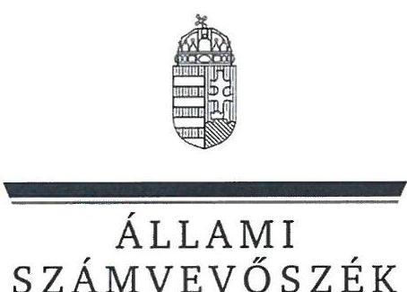
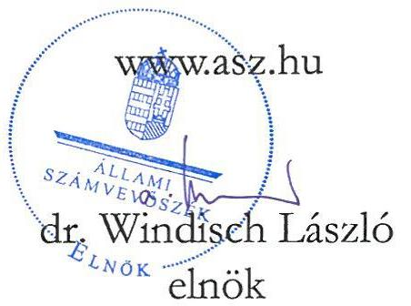
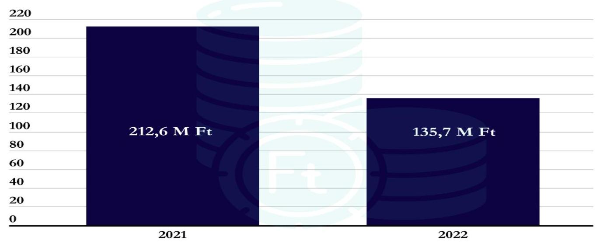
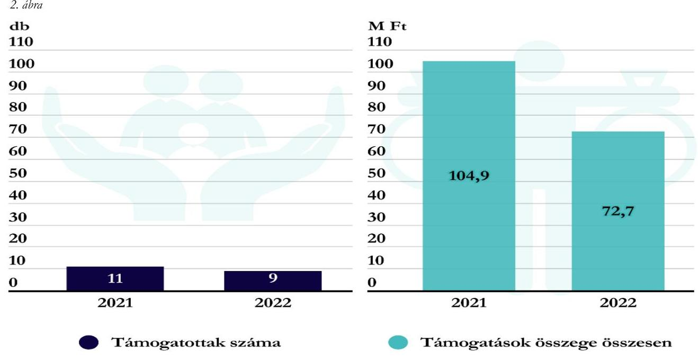

# JELENTÉS 

## Költségvetési támogatásban részesülő pártalapítványok 2021-2022. évi gazdálkodása törvényességének ellenőrzése

Ökopolisz Alapítvány

2024.

---

ÁLLAMI
SZÁMVEVŐSZÉK

# JELENTÉS 

## Költségvetési támogatásban részesülő pártalapítványok 2021-2022. évi gazdálkodása törvényességének ellenőrzése

Ökopolisz Alapítvány

2024.

24064

---

# ELLENŐRZÉSI IGAZGATÓSÁG: 

## ÁLLAMHÁZTARTÁSON KÍVÜLI SZERVEZETEKET ELLENŐRZŐ IGAZGATÓSÁG

## ELLENŐRZÉSI IGAZGATÓ:

## KLINGA LÁSZLÓ igazgató

## ELLENŐRZÉSVEZETŐ:

## KAKAS SÁNDOR ellenőrzésvezető

## Jelentéseink az interneten a www.asz.hu címen olvashatók.

IKTATÓSZÁM: EL-3847-180/2024
TÉMASZÁM: 2673
ELLENŐRZÉS-AZONOSÍTÓ SZÁM: V1017

---

# TARTALOMJEGYZÉK 

AZ ELLENŐRZÉS ALAPADATAI ..... 5
AZ ELLENŐRZÖTT SZERVEZET ..... 7
ÖSSZEFOGLALÁS ..... 9
AZ ELLENŐRZÉS FÓKUSZKÉRDÉSEI ..... 10
MEGÁLLAPÍTÁSOK ..... 11
JAVASLATOK ..... 16
MELLÉKLETEK ..... 17
I. sz. melléklet: Értelmező szótár ..... 17
II. sz. melléklet: Ellenőrzési kritériumok ..... 18
FÜGGELÉK: ÉSZREVÉTELEK ..... 19
RÖVIDÍTÉSEK JEGYZÉKE ..... 20

---

.

---

# AZ ELLENŐRZÉS ALAPADATAI 

## AZ ELLENŐRZÉS CÉLJA

Az ellenőrzés célja annak értékelése volt, hogy a Pártalapítvány ${ }^{1}$ törvényesen gazdálkodott-e; az éves számviteli beszámolók és a Pártalapítvány tevékenységéről szóló éves jelentések a jogszabályi előírásoknak megfeleltek-e; a könyvvezetés és gazdálkodás során a vonatkozó jogszabályi rendelkezéseket és belső előírásokat betartották-e.

## AZ ELLENŐRZÉS TÍPUSA

Szabályszerűségi ellenőrzés

## AZ ELLENŐRZÖTT IDŐSZAK

2021-2022. évek

## AZ ELLENŐRZÉS TÁRGYA

Az ellenőrzés tárgyát képezte a Pártalapítvány gazdálkodása, a könyvvezetés szabályozása és gyakorlatának szabályszerűsége, az éves számviteli beszámolókra és a Pártalapítvány tevékenységéről szóló éves jelentésekre vonatkozó kötelezettség teljesítése.

Az ellenőrzés kiterjedt minden olyan körülményre és adatra, amely az ÁSZ ${ }^{2}$ jogszabályban meghatározott feladatainak teljesítéséhez, valamint az ellenőrzési program végrehajtása során felmerülő újabb összefüggések feltárásához szükséges volt.

## AZ ELLENŐRZÉS JOGALAPJA

Az ellenőrzés jogalapját az ÁSZ tv. ${ }^{3}$ 1. § (3) bekezdése, 5. § (3) bekezdése, valamint a Pmtv. ${ }^{4}$ 4. § (2) és (4) bekezdéseinek előírásai képezték.

## AZ ELLENŐRZÉS MÓDSZERE

Az ellenőrzés az ellenőrzött időszakban hatályos jogszabályok, az ellenőrzés szakmai szabályai, a jelen ellenőrzésre irányadó ÁSZ módszertanok, az ellenőrzési programban foglalt értékelési szempontok szerint került végrehajtásra.

Az ellenőrzési kérdések megválaszolásához szükséges bizonyítékok megszerzése az ellenőrzött által rendelkezésre bocsátott dokumentumokra, adatokra alapozva kérdésfeltevés (információkérés), mintavételezés, továbbá helyszíni interjú útján történt. Az ellenőrzési bizonyítékként felhasználható

---

adatforrások közé tartoztak egyrészt az ellenőrzési programban felsorolt adatforrások, másrészt minden az ellenőrzés folyamán feltárt, az ellenőrzés szempontjából információt tartalmazó dokumentum.

Az ellenőrzés lefolytatásához az ellenőrzött szervezet tanúsítványok kitöltésével és az ÁSZ által kért dokumentumok, adatok, információk megküldésével, és az ellenőrzés során szolgáltatott adatokat.

A Pártalapítvány kiadásai, ráfordításai elszámolásának szabályszerűségét (2. fókuszkérdés), a Pártalapítvány által nyújtott támogatások elszámolásának szabályszerűségét (2. fókuszkérdés), valamint a mérlegtételek besorolásának, év végi értékelésének, azok leltárral való alátámasztottságának szabályszerűségét (3. fókuszkérdés) mintavételi eljárással kiválasztott tételek alapján ellenőrizte az ÁSZ.

A 2. fókuszkérdésnél az egyes vizsgálandó részterületek ellenőrzése részterületenként 30 elemű minta értékelésével, mintavételes, 30 db -ot meg nem haladó tételszám esetében tételes ellenőrzéssel történt. Az ÁSZ a 2. fókuszkérdésnél, a kiadások vonatkozásában 30-30 mintatételt ellenőrzött, a minták értékelése alapján statisztikai kivetítést alkalmazott, további lényegességi szempontok alapján 2021. évben 10 db, 2022. évben 11 db kiválasztott mintatételt ellenőrzött. Az ÁSZ a 2. fókuszkérdésnél a Pártalapítvány által nyújtott támogatások vonatkozásában - tekintettel arra, hogy az alapsokaság elemszáma egyik évben sem haladta meg a 30 tételt - tételes ellenőrzést végzett. Az ÁSZ a 3. fókuszkérdésnél, a mérlegtételek vonatkozásában 30-30 mintatételt ellenőrzött, a tények feltárása és azok összegzése során a megállapítások az ellenőrzött tételekre vonatkozóan kerültek megfogalmazásra.

A vizsgált terület „szabályszerű" minősítést kapott, ha a minta ellenőrzésének eredménye alapján 95%-os bizonyossággal a teljes sokaságban az átlagos hibaarány nem haladta meg a 10%-ot, „nem szabályszerű", ha nagyobb volt, mint 10%. Amennyiben a sokaság elemszáma nem haladta meg az előírt minta elemszámot, akkor a sokaság valamennyi elemének tételes ellenőrzésére került sor.

A Pártalapítvány bevételei elszámolásának szabályszerűségét teljeskörűen ellenőrizte az ÁSZ.
A gazdálkodás hibáinak kijavítására irányuló javaslat kidolgozásakor a hatályos jogszabályok az irányadóak.

---

# AZ ELLENŐRZÖTT SZERVEZET 

## ÖKOPOLISZ ALAPÍTVÁNY

A Pártalapítványt a Lehet Más a Politika párt hozta létre 2010-ben határozatlan időre, 0,5 M Ft induló vagyon rendelkezésére bocsátásával. A Pártalapítványt a Tatabányai Törvényszék a 2010. augusztus 6-án jogerőre emelkedett végzésével vette nyilvántartásba.

A Pártalapítvány Alapító okirat ${ }_{1-2}{ }^{3}$ szerinti célja „az állampolgári tájékoztatás és tájékozódás javítása, a politikai kultúra fejlesztése és a közjó szolgálata, kiemelten az ökopolitikai gondolkodásmód elterjesztése, az ökopolitikai alternatívák megfogalmazása, valamint az ökopolitika képviseletének elősegítése a fenntarthatóság, a közügyekben való állampolgári részvétel és az igazságosság széleskörű népszerűsítése révén." A Pártalapítvány céljai elérése érdekében az Alapító okirat ${ }_{1-2}$ szerint elsősorban az alább felsorolt tevékenységeket végezte/és vagy támogatta:
„a) tudományos elemzés, kutatás, közvélemény-kutatás;
b) nevelés, oktatás, ismeretterjesztés;
c) előadások, konferenciák, vitakörök, rendezvények szervezése;
d) könyvek, tanulmányok, kiadványok nyomtatott és elektronikus kiadása, megjelentetése;
e) könyvek, tanulmányok, kiadványok, dokumentumok gyűjtése, archiválása, rendszerezése, feldolgozása;
f) tudásbázis létrehozása és működtetése;
g) módszertani anyagok fejlesztése, terjesztése;
h) pályázatokon történő részvétel;
i) kezdeményezések támogatása, ösztöndíjrendszer kialakítása és működtetése;
j) kapcsolatok építése és ápolása, együttműködés civil szervezetekkel, illetve az Alapítvány céljaival összeegyeztethető célokat kitűző és hasonló elvek alapján működő alapítványokkal Magyarországon és külföldön."
A Pártalapítvány legfőbb döntéshozó és kezelő szerve az öt tagból álló Kuratórium ${ }^{6}$, a Pártalapítvány működése és gazdálkodása jog- és célszerűségének ellenőrzésére az Alapító okirat ${ }_{1-2}$ szerint háromtagú Felügyelőbizottságot jelöltek ki. Az ellenőrzött időszakban a Kuratórium tagjainak összetételében egy alkalommal, a felügyelőbizottsági tagok személyében nem történt változás.

A Pártalapítvány az Alapító okirat ${ }_{1-2}$ szerint vállalkozási tevékenységet is folytathat, azonban az ellenőrzött időszakban gazdasági-vállalkozói tevékenységet nem végzett.

A Pártalapítvány 2021-2022. évi egyszerűsített éves beszámolóit a Kuratórium döntése alapján független könyvvizsgáló felülvizsgálta.

A Pártalapítvány tekintetében külső ellenőrzés, törvényességi felügyeleti ellenőrzés az ellenőrzött időszakban nem volt.

A Pártalapítvány célszerinti tevékenységének ellátásához a 2021. és 2022. évben részesült költségvetési támogatásban, amelynek évenkénti alakulását az 1. ábra szemlélteti.

---

# Az ellenőrzött szervezet

## 1. ábra

## 2. költségvetési támogatás

*Forrás: ÁSZ saját szerkesztésű*

---

# ÖSSZEFOGLALÁS 

Az ÁSZ ellenőrzése a Párttv. ${ }^{7}$ alapján a politikai kultúra fejlesztése érdekében tudományos, ismeretterjesztő, kutatási, oktatási tevékenység folytatása céljából, a Ptk. ${ }^{8}$ szerinti alapító okiraton alapuló bírósági nyilvántartásba vétellel létrejött Pártalapítvány gazdálkodására terjedt ki. A Pmtv. 4. § (2) bekezdése értelmében a pártalapítványok gazdálkodása törvényességének ellenőrzése az ÁSZ feladata. A Pmtv. 4. § (4) bekezdése alapján az ÁSZ kétévente - kötelező jelleggel - ellenőrzi azoknak a pártalapítványoknak a gazdálkodását, amelyek állami költségvetési támogatásban részesültek.

A pártalapítványok ellenőrzésével az ÁSZ hozzájárul ahhoz, hogy a társadalom objektív képet alkothasson a pártalapítványok működéséről, gazdálkodásáról. Az ellenőrzésről készített számvevőszéki jelentésben megfogalmazott megállapítások, javaslat alapján a törvényalkotók konkrét lépéseket tehetnek a pártalapítványokra vonatkozó szabályozások megváltoztatása, átláthatóbbá, ellenőrizhetőbbé tétele érdekében. Az ellenőrzött szervezetek szintjén a hiányosságok, szabálytalanságok feltárása, az ennek kapcsán megfogalmazott megállapítások elősegíthetik a pártalapítványok szabályszerű gazdálkodását.

Az ellenőrzött időszakban az Alapító okirat ${ }_{1-2}$ rögzítette a Pártalapítvány működési kereteit. Az Alapító okirat ${ }_{3-2}$ a jogszabályi előírásokkal összhangban tartalmazta a Pártalapítvány célját, tevékenységét, meghatározták a Pártalapítvány ügyvezető szervét, összetételét, működését, a Felügyelőbizottság tagjait, feladataikat.

A gazdálkodás szervezeti kereteinek kialakítása szabályszerű volt.

A Számv. tv. ${ }^{9}$-ben előírtak szerint a Pártalapítvány képviseletére jogosult személyek, a Kuratórium Társelnökei kialakították és írásba foglalták a Pártalapítvány számviteli politikáját ${ }_{1-2}{ }^{10}$, valamint elkészítették a leltározási szabályzatot ${ }^{11}$, az értékelési szabályzatot ${ }^{12}$ és a pénzkezelési szabályzatot ${ }_{1-6}{ }^{13}$. A Pártalapítvány a Számv. tv.-nek megfelelően rendelkezett számlarenddel ${ }_{1-3}{ }^{14}$ és bizonylati renddel ${ }^{15}$. A szabályzatok a Számv. tv.-ben előírtaknak megfeleltek.

A támogatások számviteli nyilvántartása a Számv. tv. előírásainak megfelelt. A Pártalapítvány a 2021. és 2022. évben a tevékenységének költségeit, ráfordításait szabályszerűen számolta el. A 2021. és 2022. évben nyújtott támogatások a Pártalapítvány céljaival összhangban voltak, odaítélésük, elszámolásuk, nyilvántartásuk

## A kiadások, nyújtott

támogatások elszámolása szabályszerű volt.

A Pártalapítvány a jogszabályi előírások alapján mindkét ellenőrzött évben elkészítette és közzétette a tevékenységéről szóló éves jelentéseket, valamint az egyszerűsített éves beszámolóit. A Pártalapítvány az

A számviteli beszámolók mérlegtételeinek alátámasztása nem felelt meg a jogszabályi előírásoknak.
ellenőrzött időszakban nem tartotta be teljeskörűen a Számv. tv. és a számviteli politika ${ }_{1-2}$ előírásait, mert az üzleti év zárásáig, az egyszerűsített éves beszámolók ellenőrzött mérlegtételeinek alátámasztásához, sem a 2021. évben, sem pedig a 2022. évben nem készített leltárt. Az egyszerűsített éves beszámolók mérlegtételeinek besorolása, értékelése az ellenőrzött tételek esetében a 2021. és 2022. évben is szabályszerű volt.

Az ÁSZ a Kuratórium Társelnökeinek a feltárt szabálytalanság jövőbeni kiküszöbölése érdekében egy javaslatot fogalmazott meg.

---

# AZ ELLENŐRZÉS FÓKUSZKÉRDÉSEI 

1. A Pártalapítvány kialakította-e a törvényes gazdálkodásához szükséges szabályokat?
2. A Pártalapítvány a könyvvezetése és gazdálkodása során betartotta-e a jogszabályi előírásokat?
3. A Pártalapítvány tevékenységéről szóló jelentések, az éves számviteli beszámolók a jogszabályi előírásoknak megfeleltek-e?

---

# 1. A Pártalapítvány kialakította-e a törvényes gazdálkodásához szükséges szabályokat? 

Összegző megállapítás A 2021-2022. években a Pártalapítvány a törvényes gazdálkodásához szükséges szabályokat kialakította.
1.1. számú megállapítás A Pártalapítvány működésének szabályait a jogszabályi előírásoknak megfelelően rögzítették.

Az Alapító okirat ${ }_{1-2}$-ben a Ptk. ${ }_{2}$ előírásainak megfelelően kijelölték a Pártalapítvány ügyvezető szervét, a Kuratóriumot, a Kuratórium tagjait, a Pártalapítvány képviseletére jogosult személyeket, valamint meghatározták a kuratóriumi tagság keletkezésére és megszűnésére vonatkozó szabályokat, továbbá a képviselet szabályait.
Az Alapító okirat ${ }_{1-2}$ a Ptk. ${ }_{2}$ és a Pmtv. előírásaival összhangban tartalmazta az alapítvány célját, feladatait, a működés keretszabályait, valamint a Pártalapítványhoz történő csatlakozás feltételeit, a Kuratóriumra vonatkozó szabályokat.
A Pártalapítvány a gazdálkodásával kapcsolatos könyvvezetési-nyilvántartási rendszerét az Eszkr. ${ }^{17}$ rendelkezéseinek megfelelően kialakította. A Pártalapítvány a 2021. és 2022. évekre vonatkozóan a Számv. tv.-ben előírtak szerint kettős könyvvitellel alátámasztott egyszerűsített éves beszámolót készített, az ellenőrzött időszakban könyvvezetését, beszámolórendszerét nem változtatta. A Pártalapítvány a pénzügyi- és számviteli feladatainak ellátását külső szervezet bevonásával, a Ptk. ${ }_{2}$ szerinti szerződés megkötésével biztosította. A számviteli szolgáltatás körébe tartozó feladatokat végző, beszámolót készítő személy rendelkezett a Számv. tv. és az Eszkr. rendelkezéseinek megfelelő, szükséges szakképesítéssel.
1.2. számú megállapítás A Pártalapítvány gazdálkodására vonatkozó belső szabályozás megfelelt a jogszabályi előírásoknak.

A Pártalapítvány az ellenőrzött időszakban a Számv. tv.-nek megfelelően rendelkezett számviteli politikával ${ }_{1-2}$, amelyben a Számv. tv. és az Eszkr. rendelkezései alapján meghatározták a számviteli beszámoló típusát, a kapcsolódó könyvvezetés módját, a mérlegkészítés idejét, a mérleg fordulónapját, az egyszerűsített éves beszámoló készítésének rendjét, a beszámoló elkészítésének és közzétételének ütemezését. A Pártalapítvány az ellenőrzött időszakban a Számv. tv.-ben foglaltaknak megfelelően elkészítette a számviteli politika ${ }_{1-2}$ keretében a leltározási szabályzatot, az értékelési szabályzatot és a pénzkezelési szabályzatot ${ }_{1-6}$, rendelkezett számlarenddel ${ }_{1-3}$ és bizonylati renddel. A szabályzatok a Számv. tv-ben előírtaknak megfeleltek.
A gazdálkodási jogkörök gyakorlásának rendjéről a Pártalapítvány a kötelezettségvállalási szabályzatban ${ }^{18}$, az SZMSZ ${ }^{19}$-ben, és a pénzügyekért és gazdálkodásért felelős munkavállaló munkaköri leírásában rendelkezett. A számviteli szabályzatokat a Kuratórium Társelnökei
 kiadmányozták, a Kuratórium döntéssel jóváhagyta.

---

A Pártalapítvány céljaira rendelt vagyont és annak felhasználási módját a törvényi előírásokkal összhangban az Alapító okirat 1-2-ben rögzítették. A Pártalapítvány céljaira rendelt vagyon nyilvántartását, elszámolásának rendjét, e vagyon nyilvántartásának továbbrészletezését a jogszabályi előírásoknak megfelelően biztosították.
1.3. számú megállapítás

A Pártalapítvány alapcélja ellátásához kapcsolódó gazdálkodási tevékenysége szabályszerű volt.

A Pártalapítvány a 2021. és 2022. évi tevékenységéről szóló jelentéseinek és egyszerűsített éves beszámolóinak adatai alapján a Ptk. 12-ben előírtaknak és az Alapító okirat 1-2-ben foglaltaknak megfelelően nem volt korlátlan felelősségű tagja más jogalanynak, nem volt alapítója, tagja más alapítványnak, nem csatlakozott más alapítványhoz.
A Pártalapítvány Alapító okirat 1-2-ának 3.2. pontja a Pmtv. előírásaival összhangban tartalmazta, hogy a Pártalapítvány az alapítványi cél megvalósításával közvetlenül összefüggő gazdasági tevékenység végzésére jogosult, azonban a 2021. és 2022. évben az egyszerűsített éves beszámolók és az azokat alátámasztó könyvviteli nyilvántartások adatai szerint gazdasági-vállalkozói tevékenységet nem folytatott.

# 2. A Pártalapítvány a könyvvezetése és gazdálkodása során betartotta-e a jogszabályi előírásokat? 

## Összegző megállapítás

A Pártalapítvány könyvvezetése és gazdálkodása során a jogszabályi rendelkezéseket és a belső szabályzatok előírásait betartotta.
2.1. számú megállapítás

A Pártalapítvány a 2021-2022. években a támogatásokat szabályszerűen fogadta el, számolta el.

A Pártalapítvány a 2021. és 2022. évi Kv.tv. 20, továbbá az 1284/2022. (VI. 7.) Korm. határozat 21 alapján a 2021. évben 212,6 M Ft, a 2022. évben 135,7 M Ft költségvetési támogatásban részesült. A Pártalapítvány a költségvetésből juttatott támogatáson túl egy jogi személytől fogadott el 2021-ben 2,2 M Ft, a 2022. évben 2,1 M Ft támogatást a Pmtv.-ben előírtaknak megfelelően; a támogatást nyújtó egyértelműen azonosítható volt, a külföldről kapott támogatás az azt nyújtó fizetési számlájáról a Pártalapítvány pénzforgalmi számlájára történő átutalással történt, továbbá a Pártalapítvány a honlapján a támogatást nyújtó jogi személy azonosításához szükséges adatokat és a támogatás összegét a támogatás beérkezését követő harminc napon belül közzétette.
A Pártalapítvány az Eszkr. előírásainak megfelelően, a számlarend 1-3-ban foglaltak szerint az egyéb bevételeken belül elkülönítetten tartotta nyilván a központi költségvetésből kapott támogatást, valamint a költségek, ráfordítások ellentételezésére kapott támogatásokat. A Pártalapítvány az ellenőrzött időszakban nem kapott továbbutalási céllal támogatást.
A Pártalapítvány az Eszkr. rendelkezéseinek megfelelően, a 2021. és 2022. évi egyszerűsített éves beszámolói eredménykimutatásában az egyéb bevételeken belül részletezte a kapott támogatások összegét. Az eredménykimutatásában a központi költségvetési támogatás soron a tárgyévben kapott és az előző évről fennmaradt költségvetési támogatásnak az üzleti évben költséggel, ráfordítással ellentételezett részét szerepeltette. A Pártalapítvány a 2021. és 2022. évi egyszerűsített éves beszámolóinak kiegészítő mellékletében a kapott támogatásokat és azok felhasználását a jogszabályi előírásoknak megfelelően bemutatta.

---

2.2. számú megállapítás

A 2021. és 2022. évben a Pártalapítvány által nyújtott cél szerinti támogatások odaítélése, elszámolása, beszámolóban történő bemutatása szabályszerű volt.

A Pártalapítvány a 2021. és 2022. évben jogi személyek és egy természetes személy részére nyújtott támogatást. A magánszemély részére nyújtott támogatás összege a 2021. évben 0,15 M Ft volt, amelyet a Pártalapítvány a számlarend 1-3 előírásának megfelelően személyi jellegű egyéb kifizetésként számolt el.
Az ellenőrzött időszakban a támogatottak számát és a ténylegesen nyújtott támogatás összegét a 2. ábra mutatja be.

Forrás: ÁSZ saját szerkesztés
A harmadik fél részére juttatott cél szerinti támogatás elbírálásának, folyósításának, nyilvántartásának, elszámolásának, a támogatások közzétételének rendjét kialakították. A pályázók által benyújtott támogatási kérelmekről, a támogatások odaítéléséről az Alapító okirat 1-2 6.3. pontjában foglaltaknak megfelelően minden esetben az arra jogosult Kuratórium döntött. Az odaítélt támogatások céljai összhangban voltak a Ptk. 2 előírásaival, illetve a Pártalapítvány Alapító okirat 1-2 szerinti céljaival. A megkötött támogatási szerződések összhangban voltak a Kuratórium döntésével. A Pártalapítvány a támogatási szerződésekben előírtaknak megfelelően a támogatás felhasználásáról minden esetben beszámoltatta a kedvezményezettet. A beszámolókat és a pénzügyi elszámolásokat a Kuratórium határozattal elfogadta. A kifizetés minden támogatás esetében a támogatási döntés szerinti kedvezményezett részére történt. Az utalványozásról, kifizetésekről szabályszerűen a Kuratórium Társelnöke rendelkezett.
A Pártalapítvány éves tevékenységéről szóló jelentései az ellenőrzött időszakban tartalmazták a Pmtv.-ben előírtak szerint a cél szerinti juttatások kimutatását.
Az ellenőrzött kiadási tételek alapján a Pártalapítvány az alapító párt részére támogatást, vagyoni hozzájárulást az ellenőrzött időszakban nem adott, ezzel eleget tett a Párttv. előírásainak.

---

# 2.3. számú megállapítás 

A Pártalapítvány kiadásainak elszámolása a 2021. és 2022. évben szabályszerűen történt.

A Pártalapítvány kiadásainak elszámolása a 2021. és 2022. években szabályszerű volt, mivel a költségelszámolás, ráfordítás számviteli elszámolását a Számv. tv.-ben meghatározott dokumentumokkal (munkaszerződés, megbízási szerződés, vállalkozási szerződés, számla, megrendelés) alátámasztották; a gazdasági művelet elrendelése, az utalványozás és a teljesítések igazolása a Számv. tv.-ben rögzítetteknek megfelelően, a belső szabályozás szerint megtörtént; a könyvviteli elszámolást alátámasztó bizonylatokon az érintett könyvviteli számlákra történő hivatkozás a Számv. tv.-ben előírtaknak megfelelően megtörtént; a költségeket és a ráfordításokat a Számv. tv. és a számlarend 1-3 előírásainak megfelelő költségnemre számolták el; a kiadások a Ptk. 2-nek megfelelően az Alapító okirat 1-2-ben meghatározott, a Pártalapítvány cél szerinti tevékenysége/működése érdekében merültek fel.

## 3. A Pártalapítvány tevékenységéről szóló jelentések, az éves számviteli beszámolók a jogszabályi előírásoknak megfeleltek-e?

## Összegző megállapítás

A Pártalapítvány a tevékenységéről szóló 2021. és 2022. évi jelentéseket és az egyszerűsített éves beszámolókat a vonatkozó jogszabályi előírások szerint készítette el és tette közzé, azonban az üzleti év zárásáig, a beszámolók ellenőrzött mérlegtételeinek alátámasztásához leltárt nem készített.
3.1. számú megállapítás

A Pártalapítvány a 2021. és 2022. évi tevékenységéről szóló éves jelentés készítési és közzétételi kötelezettségét a Pmtv. előírásának megfelelően, szabályszerűen teljesítette.

A Pártalapítvány a Pmtv. előírásai alapján a 2021. és 2022. évre vonatkozóan elkészítette tevékenységéről szóló éves jelentését. Az éves tevékenységről szóló jelentések a Pmtv.-ben foglaltak szerint tartalmazták a számviteli beszámolót, a költségvetési támogatás felhasználására vonatkozó kimutatást, a vagyon felhasználásával kapcsolatos kimutatást, a cél szerinti juttatások kimutatását, tartalmazták továbbá a központi költségvetési szervtől, helyi önkormányzattól kapott támogatás mértékét, az egyes vezető tisztségviselőinek nyújtott juttatások értékét, illetve összegét, valamint a Pártalapítvány tevékenységéről szóló rövid tartalmi összefoglalót.
A Pártalapítvány 2021. és 2022. évekre vonatkozó éves tevékenységről szóló jelentését a Kuratórium elfogadta, az elfogadott éves tevékenységről szóló jelentések a Pmtv. előírásainak megfelelően a Magyar Közlöny mellékleteként megjelenő Hivatalos Értesítőben határidőben megjelentek. A 2021. és 2022. évi tevékenységről szóló jelentéseit a Pmtv. előírásainak megfelelően a Pártalapítvány honlapján határidőben közzétette.

---

3.2. számú megállapítás

A Pártalapítvány a jogszabályok előírásainak megfelelően elkészítette egyszerűsített éves beszámolóit, azonban az üzleti év zárásáig, a beszámolók ellenőrzött mérlegtételeinek alátámasztásához leltárt nem készített. A Pártalapítvány a jogszabályok előírásainak megfelelően a 2021. évi és a 2022. évi egyszerűsített éves beszámolóját letétbe helyezte és közzétette.

A Pártalapítvány a Számv. tv., valamint az Eszkr. előírásai alapján a 2021. és 2022. évi működéséről, vagyoni, pénzügyi és jövedelmi helyzetéről az üzleti év könyveinek lezárását követően, az üzleti év utolsó napjával elkészítette éves beszámolóit, kiegészítő és közhasznúsági mellékleteit.
A Pártalapítvány a Kuratórium által elfogadott egyszerűsített éves beszámolóinak, valamint közhasznúsági mellékleteinek közzétételére történő megküldési kötelezettségét a Számv. tv. és az Ectv. előírásának megfelelően, határidőn belül az OBH22 felé teljesítette, illetve saját honlapján közzé tette.
A Pártalapítvány 2021. és 2022. évi egyszerűsített éves beszámolójának kiegészítő melléklete a Számv. tv.-nek megfelelt.
A Pártalapítvány a Számv. tv. és a számviteli politika 1-2 előírásainak ellenére az üzleti év zárásáig, a mérleg tételeinek alátámasztásához nem készített leltárt. A Pártalapítvány az ellenőrzött időszakban az üzleti év zárásáig, az egyszerűsített éves beszámolók mérlegtételeinek alátámasztásához a Számv. tv. 69. § (1) bekezdésében foglaltak ellenére nem állított össze olyan leltárt, amely tételesen és ellenőrizhető módon tartalmazta a Pártalapítványnak a mérleg fordulónapján meglévő eszközeit és forrásait mennyiségben és értékben. A 2021. és 2022. évi egyszerűsített éves beszámolók elkészítéséig (2022. május 20., 2023. május 20.) nem készültek leltárak, csak azt követően - a 2021. évi mérlegtételek esetében 2022. június 3-án, a 2022. évi mérlegtételek esetében 2023. június 6-án, amelyek ezáltal nem nyújthattak alapot a könyvek üzleti év végi zárásához, a beszámoló elkészítéséhez, a mérleg tételeinek alátámasztásához.
A 2021. és 2022. évi egyszerűsített éves beszámolók mérlegtételeinek tartalma, besorolása és bekerülési értékének meghatározása megfelelt a Számv. tv. és az Eszkr. előírásainak.
A Pártalapítvány a Számv. tv., az Eszkr. és a Pmtv. előírásainak megfelelően a 2021. és a 2022. évi egyszerűsített éves beszámolójában biztosította a költségvetési támogatások elkülönített nyilvántartását, bemutatását.
A Pártalapítvány a 2021. és 2022. évben kapott központi költségvetési támogatást maradéktalanul nem használta fel, amelyet az egyszerűsített éves beszámolók kiegészítő melléleteiben szereplő kimutatás is alátámasztott. A Pártalapítvány a fel nem használt támogatást a Számv. tv. előírásainak megfelelően passzív időbeli elhatárolásként mutatta ki a 2021. és 2022. évi egyszerűsített éves beszámolóiban.
3.3. számú megállapítás

A Pártalapítvány céljaira rendelt vagyonnak a kezelése és védelme, az arról való beszámolás szabályszerű volt.

Az alapító párt a Ptk. 2-ben foglalt előírásoknak megfelelően az Alapító okiratban 1-2 meghatározta a Pártalapítvány céljait és tevékenységét, valamint a vagyoni hozzájárulás értékét, valamint az alapítói vagyon kezelésének és felhasználásának szabályait, amellyel összhangban a Pártalapítvány SZMSZ-e is tartalmazott rendelkezéseket. A Pártalapítvány céljaira rendelt vagyon nyilvántartása, elszámolásának rendjét, e vagyon nyilvántartásának továbbrészletezését biztosították.
A Pártalapítvány hasznosításra az államháztartásból ingyenesen átadott vagyont, illetve véglegesen az államháztartásból tulajdonba adott vagyont nem kapott, nem keletkezett az Nvtv. 23, valamint a Vtvr. 24 előírásai szerinti vagyonhoz kapcsolódó nyilvántartási, adatszolgáltatási kötelezettsége.

---

# JAVASLATOK 

Az ÁSZ tv. 33. § (1) bekezdésében foglaltak értelmében az ellenőrzött szervezet vezetője köteles a jelentésben foglalt megállapításokhoz kapcsolódó intézkedési tervet összeállítani és azt a jelentés kézhezvételétől számított 30 napon belül az ÁSZ részére megküldeni. Amennyiben az ellenőrzött szervezet vezetője nem küldi meg határidőben az intézkedési tervet, vagy továbbra sem elfogadható intézkedési tervet küld, az Állami Számvevőszék elnöke az ÁSZ tv. 33. § (3) bekezdése a) és b) pontjaiban foglaltakat érvényesítheti.

## Az Ökopolisz Alapítvány Kuratóriumának Társelnökei részére

1. Gondoskodjanak arról, hogy a beszámolók mérlegtételeinek alátámasztásához az üzleti év zárásáig kerüljenek összeállításra a leltárak a Számv. tv. előírásainak megfelelően.

---

# MELLÉKLETEK 

## I. SZ. MELLÉKLET: ÉRTELMEZŐ SZÓTÁR

alaptevékenység
alapítvány
gazdasági-vállalkozási tevékenység
költségvetési támogatás
pártalapítvány

A jogszabályban, illetve a létesítő okiratban meghatározott, a tevékenység célja szerinti, közhasznú, egyesületi, alapítványi célú tevékenység. (Forrás: Eszkr. 6. §)
Az alapítvány az alapító által az alapító okiratban meghatározott tartós cél folyamatos megvalósítására létrehozott jogi személy. Az alapító az alapító okiratban meghatározza az alapítványnak juttatott vagyont és az alapítvány szervezetét. Alapítvány nem alapítható gazdasági tevékenység folytatására. Az alapítvány az alapítványi cél megvalósításával közvetlenül összefüggő gazdasági tevékenység végzésére jogosult. Alapítvány nem lehet korlátlan felelősségű tagja más jogalanynak, nem létesíthet alapítványt és
 nem csatlakozhat alapítványhoz. (Forrás: Ptk.: 3:378. §, 3:379. § (1)-(3) bekezdés)
A jövedelem- és vagyonszerzésre irányuló vagy azt eredményező, üzletszerűen végzett gazdasági tevékenység, kivéve az adomány (ajándék) elfogadását, a pénzeszközök betétbe, értékpapírba, társasági részesedésbe történő elhelyezését és az ingatlan megszerzését, használatának átengedését és átruházását. (Forrás: Ectv. ${ }^{25}$ 2. § 11. pont., Pmtv. 2021. július 1. napjától hatályos 3. § (6a) bekezdés)
A pártalapítványoknak a Párttv. 9/A. § (1) bekezdése és a Pmtv. 1. § előírásainak értelmében, az éves költségvetési törvények szerint - jellemzően az 1. számú melléklet I. Országgyűlés fejezet 9. Pártalapítványok támogatás címen - az állami költségvetésből juttatott támogatás.
A politikai kultúra fejlesztése érdekében, tudományos, ismeretterjesztő, kutatási és oktatási tevékenység folytatása céljából pártok által létrehozott, külön jogszabályban - a Pmtv. 1. § és 3. § (1) bekezdése - meghatározott, jogi személynek minősülő egyéb szervezet, speciális jogállású alapítvány. (Forrás: Párttv. 9/A. § (1) bekezdés, Pmtv. 1. §, Ectv. 2. § 6. c) pont, Számv. tv. 3. § (1) bekezdés 4. pont, Eszkr. 2. § (1) bekezdés I) pont)

---

# II. SZ. MELLÉKLET: ELLENŐRZÉSI KRITÉRIUMOK 

## FOKUSZKÉRDÉS

1. A Pártalapítvány kialakította-e a törvényes gazdálkodásához szükséges szabályokat?
2. A Pártalapítvány a könyvvezetése és gazdálkodása során betartotta-e a jogszabályi előírásokat?
3. A Pártalapítvány tevékenységéről szóló jelentések, az éves számviteli beszámolók a jogszabályi előírásoknak megfeleltek-e?

## ELLENŐRZÉSI KRITÉRIUMOK

Ptk. 3:21-3:25. §, 3:29-3:30. §, 3:379. § (3) bekezdés, 3:391. § (1) bekezdés c) pont, 3:391. § (2) bekezdés h) pont, 3:397-3:398. §, 3:400.§ (2) bekezdés
Ectv. 28-31. §
Eszkr. 7. § (3)-(4) bekezdés b) pont, (6) bekezdés, 8. § (2) bekezdés, 9. § (4) bekezdés, 12-15. §

Számv. tv. 14. § (3)-(4) bekezdés, 14. § (5) bekezdés a), b) és d) pont, 14. § (8) bekezdés, 14. § (12) bekezdés, 16. § (4) bekezdés, 96. §, 150. §, 161. § (1) bekezdés, 161. § (2) bekezdés c), d) pont, 161. § (4) bekezdés

Pmtv. 3. § (6), (6a) bekezdés
Ptk.: 3:384. § (1) bekezdés, 3:385. §, 3:386. §
Párttv. 5. § (2) bekezdés, 9/A. § (1) bekezdés, 9/A. § (3) bekezdés
Pmtv. 3. § (3) bekezdés, 3. § (4) bekezdés a) pont, 3/A § (3) bekezdés b), d) e) pont

Kv. tv. 1. sz. melléklete
Kv. tv. 2. sz. melléklete
1284/2022 (VI.7) Korm. határozat 1. sz. melléklet
Kbt. 5. § (2)-(3) bekezdés, 15. § (5) bekezdés, 19. §, 27. § (1)-(2) bekezdés, 111. § p), 131. §
Számv. tv. 78. § - 81. §, 160. §, 161/A. § (2) bekezdés, 165. § (1) bekezdés, 166. §, 167. § (1) bekezdés c), h) pont

Ectv. 2. § 1. pont, 29. § (7) bekezdés
Eszkr. 13. § (3) bekezdés, 9. § (9) bekezdés, 12. § (4) bekezdés, 14. § (1) bekezdés, 29. § (4) bekezdés
Pmtv. 3/A § (3), (5) bekezdés, (6) bekezdés, 3. § (4), (6) bekezdés
Ectv. 28. § (1)-(3) bekezdés, 29. § (2)-(5) bekezdés, 30. §, 46. § (1) bekezdés

Eszkr. 7. § (1)-(3), (4) bekezdés b) pontja, (6)-(8) bekezdés, 8. § (2) bekezdés, 11. §, 12. §, 13.§ (4)-(5) bekezdés, 14. § (1) bekezdés, 23. §, 24. §, 16. §, 17. §
Számv. tv. 8. § (2) bekezdés b) pontja, 8. § (5) bekezdés, 9. § (2) bekezdés, 19. § (1) bekezdés; 23-31. §, 35. §, 44. § (2) bekezdés, 47-51. §, 52., 54-56. §, 57-59. §, 65. § (1)-(7) bekezdés, 69. §, 70. §, 91. § a) pont, 96. § (1) bekezdés, 155. § (7) bekezdés, 161. § (2)-(3) bekezdés, Számv. tv. 161/A. § (2) bekezdés, 165. § (4) bekezdés
Ptk.: 3:4, 3:9 - 3:10. §, 3:378 - 3:383. §, 3:388 - 3:390. §, 3:391. § (1) bekezdés b) pont, (2) bekezdés c) pont
Nvtv. 7. § (1) bekezdés, 13. § (3) bekezdés, 13. § (4) bekezdés b) pont
Vtvr. 14. § (1)-(3) bekezdés, 17. § (1)-(2) bekezdés, melléklet II/8. pont

---

# FÜGGELÉK: ÉSZREVÉTELEK 

A jelentéstervezetet a Számvevőszék 15 napos észrevételezésre megküldte az ellenőrzött szervezet vezetőjének az ÁSZ tv. 29. § (1) bekezdése előírásának megfelelően.
Az Ökopolisz Alapítvány Kuratóriuma Társelnökei a jelentéstervezetre nem tettek észrevételt.

[^0]
[^0]:    * 29. § (1) Az Állami Számvevőszék az ellenőrzési megállapításait megküldi az ellenőrzött szervezet vezetőjének vagy az általa megbízott személynek, és annak, akinek személyes felelősségét állapította meg.
    (2) Az ellenőrzött szervezet vezetője és a felelősként megjelölt személy az ellenőrzés megállapításaira tizenöt napon belül írásban észrevételt tehet.
    (3) Az Állami Számvevőszék az észrevételre a beérkezésétől számított harminc napon belül írásban válaszol. A figyelembe nem vett észrevételeket köteles a jelentésben feltüntetni, és megindokolni, hogy azokat miért nem fogadta el.

---

# RÖVIDÍTÉSEK JEGYZÉKE 

${ }^{1}$ Pártalapítvány
${ }^{2}$ ÁSZ
${ }^{3}$ ÁSZ tv.
${ }^{4}$ Pmtv.
${ }^{5}$ Alapító okirat ${ }_{1}$
Alapító okirat ${ }_{2}$
${ }^{6}$ Kuratórium
${ }^{7}$ Párttv.
${ }^{8}$ Ptk. ${ }_{1}$
Ptk. ${ }_{2}$
${ }^{9}$ Számv. tv.
${ }^{10}$ számviteli politika ${ }_{1}$
számviteli politika ${ }_{2}$
${ }^{11}$ leltározási szabályzat
${ }^{12}$ értékelési szabályzat
${ }^{13}$ pénzkezelési szabályzat ${ }_{1}$
pénzkezelési szabályzat ${ }_{2}$
pénzkezelési szabályzat ${ }_{3}$
pénzkezelési szabályzat ${ }_{4}$
pénzkezelési szabályzat ${ }_{5}$
pénzkezelési szabályzat ${ }_{6}$
${ }^{14}$ számlarend ${ }_{1}$
számlarend ${ }_{2}$
számlarend ${ }_{3}$
${ }^{15}$ bizonylati rend
${ }^{16}$ alapító párt
${ }^{17}$ Eszkr.
${ }^{18}$ kötelezettségvállalási szabályzat
${ }^{19}$ SZMSZ
${ }^{20}$ 2021. és 2022. évi Kv. tv.
${ }^{21}$ 1284/2022. (VI. 7.) Korm. határozat
${ }^{22}$ OBH
${ }^{23}$ Nvtv.
${ }^{24}$ Vtvr.
${ }^{25}$ Ectv.

Ökopolisz Alapítvány
Állami Számvevőszék
2011. évi LXVI. törvény az Állami Számvevőszékről
2003. évi XLVII. törvény a pártok működését segítő tudományos, ismeretterjesztő, kutatási, oktatási tevékenységet végző alapítványokról
Pártalapítvány 2020. október 17-én elfogadott módosítással egységes szerkezetbe foglalt alapító okirata (bírósági végzés napja: 2020. november 2.)
Pártalapítvány 2022. szeptember 7-én elfogadott módosítással egységes szerkezetbe foglalt alapító okirata (bírósági végzés napja: 2022. október 25.)
Ökopolisz Alapítvány kuratóriuma
1989. évi XXXIII. törvény a pártok működéséről és gazdálkodásáról
1959. évi IV. törvény a Polgári Törvénykönyvről
2013. évi V. törvény a Polgári Törvénykönyvről
2000. évi C. törvény a számvitelről

Az Ökopolisz Alapítvány Számviteli Politikája (hatályos: 2021. január 1-től)
Az Ökopolisz Alapítvány Számviteli Politikája (hatályos: 2022. december 1-től)
Eszközök és források leltározási és leltárkészítési szabályzata (hatályos: 2021. január 1-től)
Eszközök és források értékelési szabályzata (hatályos: 2017. január 1-től)
Az Ökopolisz Alapítvány Pénzkezelési szabályzata (hatályos: 2019. október 1-től)
Az Ökopolisz Alapítvány Pénzkezelési szabályzata (hatályos: 2021. augusztus 17-től)
Az Ökopolisz Alapítvány Pénzkezelési szabályzata (hatályos: 2021. augusztus 26-tól)
Az Ökopolisz Alapítvány Pénzkezelési szabályzata (hatályos: 2022. szeptember 2-től)
Az Ökopolisz Alapítvány Pénzkezelési szabályzata (hatályos: 2022. szeptember 30-tól)
Az Ökopolisz Alapítvány Pénzkezelési szabályzata (hatályos: 2022. november 25-től)
Az Ökopolisz Alapítvány Számlarendje (hatályos: 2021. január 1-től)
Az Ökopolisz Alapítvány Számlarendje (hatályos: 2022. január 1-től)
Az Ökopolisz Alapítvány Számlarendje (hatályos: 2022. november 25-től)
Az Ökopolisz Alapítvány Bizonylati rendje (hatályos: 2021. március 18-tól)
Lehet Más a Politika, 2020. július 25-től elnevezése LMP - Magyarország Zöld Pártja
479/2016. (XII. 28.) Korm. rendelet - a számviteli törvény szerinti egyes egyéb szervezetek beszámoló készítési és könyvvezetési kötelezettségének sajátosságairól
Az Ökopolisz Alapítvány Kötelezettségvállalási és utalványozási szabályzata (hatályos: 2017. január 1-től)

Az Ökopolisz Alapítvány Szervezeti és Működési Szabályzata ${ }_{1}$ (hatályos: 2020. március 18-tól)
2020. évi XC. törvény Magyarország 2021. évi központi költségvetéséről
2021. évi XC. törvény Magyarország 2022. évi központi költségvetéséről
1284/2022. (VI. 7.) Korm. határozat a pártokat és a pártalapítványokat az országgyűlési képviselők 2022. évi általános választása eredményének megfelelően megillető támogatás mértékének meghatározásáról, valamint a támogatást szolgáló előirányzatok közötti átcsoportosításról
Országos Bírósági Hivatal
2011. évi CXCVI. törvény a nemzeti vagyonról
254/2007. (X. 4.) Korm. rendelet az állami vagyonnal való gazdálkodásról
2011. évi CLXXV. törvény az egyesülési jogról, a közhasznú jogállásról, valamint a civil szervezetek működéséről és támogatásáról

---

1052 Budapest, Apáczai Csere János u. 10. | 1364 Budapest 4., Pf. 54
www.asz.hu | szamvevoszek@asz.hu
telefon: +36 1 4849100

