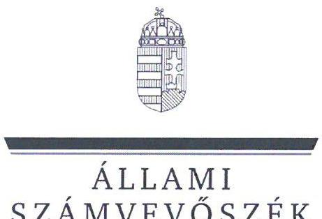
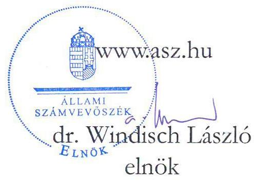
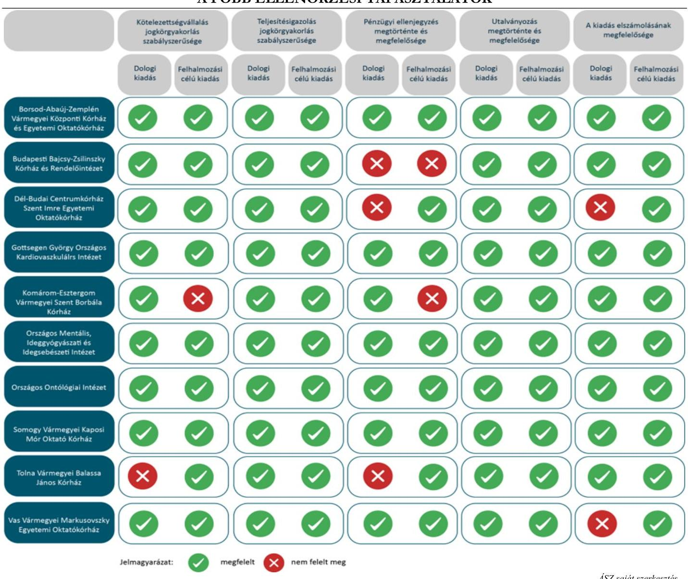

# JELENTÉS 

Az államháztartás központi alrendszerébe tartozó költségvetési szerv által teljesített dologi és felhalmozási célú kiadás szabályszerűségének rapid ellenőrzése
2024.

---

ÁLLAMI
SZÁMVEVÔSZÉK

# JELENTÉS 

## Az államháztartás központi alrendszerébe tartozó költségvetési szerv által teljesített dologi és felhalmozási célú kiadás szabályszerűségének rapid ellenőrzése

2024. 

24065

---

# ELLENŐRZÉSI IGAZGATÓSÁG: 

## ÁLLAMHÁZTARTÁS KÖZPONTI SZINTJÉT ELLENŐRZŐ IGAZGATÓSÁG

ELLENŐRZÉSI IGAZGATÓ:
SINKÁNÉ DR. CSENDES ÁGNES igazgató

ELLENŐRZÉSVEZETŐ:
MOLNÁR ZSUZSANNA ellenőrzésvezető

IKTATÓSZÁM: EL-3949-035/2024.
TÉMASZÁM: 2685

ELLENŐRZÉS-AZONOSÍTÓ SZÁM: V102910

---

# TARTALOMJEGYZÉK 

AZ ELLENŐRZÉS ALAPADATAI ..... 5
AZ ELLENŐRZÖTT SZERVEZETEK ..... 8
ÖSSZEFOGLALÁS ..... 14
AZ ELLENŐRZÉS FÓKUSZKÉRDÉSEI ..... 15
MEGÁLLAPÍTÁSOK ..... 16
JAVASLATOK ..... 22
MELLÉKLETEK ..... 24
I. sz. melléklet: Értelmező szótár ..... 24
II. sz. melléklet: Az ellenőrzött szervezetek jegyzéke ..... 25
III. sz. melléklet: Ellenőrzési kritériumok ..... 26
FÜGGELÉK: ÉSZREVÉTELEK ..... 27
RÖVIDÍTÉSEK JEGYZÉKE ..... 31

---

.

---

# AZ ELLENŐRZÉS ALAPADATAI 

## AZ ELLENŐRZÉS CÉLJA

Az államháztartás központi alrendszerébe tartozó költségvetési szerv által teljesített dologi és felhalmozási célú kiadások egy-egy kiválasztott tételének szabályszerűségi szempontból történő értékelése.

## AZ ELLENŐRZÉS TÍPUSA

Megfelelőségi ellenőrzés.

## AZ ELLENŐRZŐTT IDŐSZAK

| Ssz. | ELLENŐRZŐTT SZERVEZETEK | DOLOGI   KIADÁSOK   ESÉTÉBEiN | FELHALMOZÁSI   CÉLÚ KIADÁSOK   ESÉTÉBEiN |
| :--: | :--: | :--: | :--: |
| 1. | Borsod-Abaúj-Zemplén Vármegyei Központi Kórház és   Egyetemi Oktatókórház | 2023. szeptember 22. | 2023. szeptember 27. |
| 2. | Budapesti Bajcsy-Zsilinszky Kórház és Rendelőintézet | 2023. október 5. | 2023. október 16. |
| 3. | Dél-budai Centrumkórház Szent Imre Egyetemi Oktatókórház | 2023. október 3. | 2023. szeptember 28. |
| 4. | Gottsegen György Országos Kardiovaszkuláris Intézet | 2023. szeptember 21. | 2023. október 6. |
| 5. | Komárom-Esztergom Vármegyei Szent Borbála Kórház | 2023. szeptember 25. | 2023. szeptember 29. |
| 6. | Országos Mentális, Ideggyógyászati és Idegsebészeti Intézet | 2023. október 4. | 2023. szeptember 20. |
| 7. | Országos Onkológiai Intézet | 2023. október 10. | 2023. szeptember 18. |
| 8. | Somogy Vármegyei Kaposi Mór Oktató Kórház | 2023. szeptember 26. | 2023. október 6. |
| 9. | Tolna Vármegyei Balassa János Kórház | 2023. szeptember 26. | 2023. szeptember 18. |
| 10. | Vas Vármegyei Markusovszky Egyetemi Oktatókórház | 2023. október 12. | 2023. szeptember 21. |

## AZ ELLENŐRZÉS TÁRGYA

Az államháztartás központi alrendszerébe tartozó költségvetési szerv által teljesített, ellenőrzésre kiválasztott dologi és felhalmozási célú kiadás szabályszerű teljesítése, ezen belül a gazdálkodási jogkörök szabályszerű gyakorlása. Az ellenőrzés kiterjedt minden olyan körülményre és adatra, amely az ÁSZ ${ }^{1}$ jogszabályban meghatározott feladatainak teljesítéséhez, valamint a program végrehajtása folyamán felmerült újabb összefüggések feltárásához szükséges.

---

Az ellenőrzés során az ÁSZ

- a Borsod-Abaúj-Zemplén Vármegyei Központi Kórház és Egyetemi Oktatókórház, a Dél-budai Centrumkórház Szent Imre Egyetemi Oktatókórház, a Komárom-Esztergom Vármegyei Szent Borbála Kórház, az Országos Mentális, Ideggyógyászati és Idegsebészeti Intézet, a Vas Vármegyei Markusovszky Egyetemi Oktatókórház esetében a dologi kiadások körébe tartozó Egyéb szolgáltatások; a Gottsegen György Országos Kardiovaszkuláris Intézet esetében a dologi kiadások körébe tartozó Üzemeltetési anyagok beszerzése; a Tolna Vármegyei Balassa János Kórház esetében a dologi kiadások körébe tartozó Árubeszerzés; a Somogy Vármegyei Kaposi Mór Oktató Kórház esetében a dologi kiadások körébe tartozó Karbantartási, kisjavítási szolgáltatások; a Budapesti Bajcsy-Zsilinszky Kórház és Rendelőintézet, az Országos Onkológiai Intézet esetében a dologi kiadások körébe tartozó Szakmai tevékenységet segítő szolgáltatások;
- a Borsod-Abaúj-Zemplén Vármegyei Központi Kórház és Egyetemi Oktatókórház, a Budapesti Bajcsy-Zsilinszky Kórház és Rendelőintézet, a Dél-budai Centrumkórház Szent Imre Egyetemi Oktatókórház, a Somogy Vármegyei Kaposi Mór Oktató Kórház, a Tolna Vármegyei Balassa János Kórház esetében a felhalmozási célú kiadások körébe tartozó Egyéb tárgyi eszközök beszerzése, létesítése; az Országos Mentális, Ideggyógyászati és Idegsebészeti Intézet esetében a felhalmozási célú kiadások körébe tartozó Immateriális javak beszerzése, létesítése; a KomáromEsztergom Vármegyei Szent Borbála Kórház esetében a felhalmozási célú kiadások körébe tartozó Ingatlanok beszerzése, létesítése; a Gottsegen György Országos Kardiovaszkuláris Intézet esetében a felhalmozási célú kiadások körébe tartozó Informatikai eszközök beszerzése, létesítése; az Országos Onkológiai Intézet, a Vas Vármegyei Markusovszky Egyetemi Oktatókórház esetében a felhalmozási célú kiadások körébe tartozó az Ingatlanok felújítása
rovatokon elszámolt kiadások egy-egy kiválasztott mintatételének szabályszerűségét értékelte.

# AZ ELLENŐRZÉS JOGALAPJA 

Az ellenőrzés jogszabályi alapját az ÁSZ tv. ${ }^{2} 1 . \int(3)$ bekezdés és az 5. $\int(6)$ bekezdés előírásai képezték.

## AZ ELLENŐRZÉS MÓDSZERE

Az ellenőrzést az ÁSZ az ellenőrzött időszakban hatályos jogszabályok, az ellenőrzés szakmai szabályai alapján, „Az állambáztartás kö̃ponti alrendszerébe tartozó költségvetési szerv által teljesitett dologi kiadás szabályszerűségének rapid ellenörzéséről" és „Az állambáztartás kö̃ponti alrendszerébe tartozó költségvetési szerv által teljesitett felhalmozzási célú kiadás szabályszerüségének rapid ellenörzéséről" című ellenőrzési programok (továbbiakban: ellenőrzési programok) kérdéseire adott válaszok kiértékelésével, az ellenőrzési programokban megjelölt adatforrások figyelembevételével folytatta le. Amennyiben az adott mintatétel ellenőrzési program szerinti értékelése során további kapcsolódó szabálytalanságot tárt fel az ÁSZ, a szabálytalansághoz tartozó kritériummal bővült az ellenőrzés.

Az ellenőrzési kérdések megválaszolásához szükséges bizonyítékok megszerzése a következő ellenőrzési eljárások alkalmazásával történt: megfigyelés, összehasonlítás, elemző eljárás, a dologi kiadások, felhalmozási célú kiadások ellenőrzéssel érintett rovatairól történő mintavétel. Az ellenőrzési bizonyítékként felhasználható adatforrások közé tartoztak egyrészt az ellenőrzéshez kért dokumentumok, adatforrások, másrészt adatforrás

---

volt még minden - az ellenőrzés folyamán - feltárt, az ellenőrzés szempontjából információkat tartalmazó dokumentum.

Az ÁSZ az ellenőrzés során a kiválasztott mintatételek ellenőrzési programokban meghatározott szempontok szerinti szabályszerűségét értékelte, így a kötelezettségvállalás és a teljesítésigazolás gazdálkodási jogkörök tekintetében a jogkörgyakorlás szabályszerűségét, a pénzügyi ellenjegyzés és az utalványozás gazdálkodási jogkörök tekintetében ezek megtörténtét és az ellenőrzési kritériumoknak való megfelelőségét.

---

# AZ ELLENŐRZÖTT SZERVEZETEK 

Az ellenőrzés a Borsod-Abaúj-Zemplén Vármegyei Központi Kórház és Egyetemi Oktatókórház, a Budapesti Bajcsy-Zsilinszky Kórház és Rendelőintézet, a Dél-budai Centrumkórház Szent Imre Egyetemi Oktatókórház, a Gottsegen György Országos Kardiovaszkuláris Intézet, a Komárom-Esztergom Vármegyei Szent Borbála Kórház, az Országos Mentális, Ideggyógyászati és Idegsebészeti Intézet, az Országos Onkológiai Intézet, a Somogy Vármegyei Kaposi Mór Oktató Kórház, a Tolna Vármegyei Balassa János Kórház és a Vas Vármegyei Markusovszky Egyetemi Oktatókórház elnevezésű szervezetekre, mint az államháztartás központi alrendszerébe tartozó költségvetési szervekre terjedt ki.

## BORSOD-ABAÚJ-ZEMPLÉN VÁRMEGYEI KÖZPONTI KÓRHÁZ ÉS EGYETEMI OKTATÓKÓRHÁZ

A B-A-Z Vármegyei Központi Kórház ${ }^{3}$ közfeladata az Eütv. ${ }^{4}$ alapján ellátási területére kiterjedően a járóés fekvőbetegek diagnosztikus, valamint terápiás szakorvosi ellátása, rehabilitációja, követéses gondozása. Ennek keretében végzi a fekvőbetegek aktív és krónikus ellátását, rehabilitációját, járóbetegek gyógyító és rehabilitációs szakellátását, valamint egynapos ellátását az egyén gyógykezelése, életveszély elhárítása, a megbetegedés következtében kialakult állapot javítása vagy a további állapotromlás megelőzése céljából. Alaptevékenységébe tartozik a betegszállítás, az egészségüggyel kapcsolatos kutatások és egészségügyi szakmai képzések végzése. Közfeladata továbbá az Eatv. ${ }^{5}$ alapján a védőnői ellátás biztosítása, ennek keretében az egészségmegőrzés, tanácsadás, gondozás, betegségmegelőzés-szűrés, felvilágosítás, egészségnevelés.

## BORSOD-ABAÚJ-ZEMPLÉN VÁRMEGYEI KÖZPONTI KÓRHÁZ ÉS EGYETEMI OKTATÓKÓRHÁZ FÖBB ADATAINAK REMUTATÁSA

Alapításának éve:
Irányító szerve:
Középirányító szerve:
Gazdasági szervezettel való rendelkezés:
Illetékessége, müködési területe:
Általános képviseletét ellátó vezetője:
Vezetői kinevezés kezdete:
2022. évben teljesített bevételek összege:
2022. évben teljesített kiadások összege:

2017.
Belügyminisztérium
Országos Kórházi Főigazgatóság
Gazdasági szervezettel rendelkezik
2006. évi CXXXII. törvény ${ }^{6}$ alapján vezetett közhiteles kapacitásnyilvántartásban szereplő ellátási terület
főigazgató
2024.01.01.
$74394,2 \mathrm{M} \mathrm{Ft}$
$71071,8 \mathrm{M} \mathrm{Ft}$

---

# BUDAPESTI BAJCSY-ZSILINSZKY KÓRHÁZ ÉS RENDELŐINTÉZET 

A Bajcsy-Zsilinszky Kórház ${ }^{7}$ közfeladata az Eütv. alapján ellátási területére kiterjedően a járó- és fekvőbetegek diagnosztikus, valamint terápiás szakorvosi ellátása, rehabilitációja, követéses gondozása. Ennek keretében végzi a fekvőbetegek aktív és krónikus ellátását, rehabilitációját, járóbetegek gyógyító és rehabilitációs szakellátását, valamint egynapos ellátását az egyén gyógykezelése, életveszély elhárítása, a megbetegedés következtében kialakult állapot javítása vagy a további állapotromlás megelőzése céljából. Alaptevékenységébe tartozik a gyógyszer és gyógyászati segédeszköz kereskedelme, terápiás célú gyógyfürdő-szolgáltatások nyújtása, egészségüggyel kapcsolatos kutatások végzése.

## BudAPESTI BAJCSY-ZSILINSZKY KÓRHÁZ ÉS RENDELÓINTÉZET FÖBB ADATAINAK BEMUTATÁSA

Alapításának éve:
Irányító szerve:
Középirányító szerve:
Gazdasági szervezettel való rendelkezés:
Illetékessége, múködési területe:
A törvényes és szakszerú múködésért felelős vezetője:
Vezetői kinevezés kezdete:
2022. évben teljesített bevételek összege:
2022. évben teljesített kiadások összege:

1980.
Belügyminisztérium
Országos Kórházi Főigazgatóság
Gazdasági szervezettel nem rendelkezik
2006. évi CXXXII. törvény alapján vezetett közhiteles kapacitásnyilvántartásban szereplő ellátási terület
főigazgató
2022.08.01.
$24670,1 \mathrm{M} \mathrm{Ft}$
$24405,7 \mathrm{M} \mathrm{Ft}$

## DÉL-BUDAI CENTRUMKÓRHÁZ SZENT IMRE EGYETEMI OKTATÓKÓRHÁZ

A DBC Szent Imre Oktatókórház ${ }^{8}$ közfeladata az Eütv. alapján ellátási területére kiterjedően a járó- és fekvőbetegek diagnosztikus, valamint terápiás szakorvosi ellátása, rehabilitációja, követéses gondozása. Ennek keretében végzi a fekvőbetegek aktív és krónikus ellátását, rehabilitációját, járóbetegek gyógyító és rehabilitációs szakellátását, valamint egynapos ellátását az egyén gyógykezelése, életveszély elhárítása, a megbetegedés következtében kialakult állapot javítása vagy a további állapotromlás megelőzése céljából. Alaptevékenységébe tartozik a gyógyszer-kiskereskedelem, az orvostudományi kutatások, egészségügyi szakmai képzések és továbbképzések végzése. Feladata továbbá az Eatv. alapján a védőnői ellátás keretében az egészségmegőrzés, tanácsadás, gondozás, betegségmegelőzés-szűrés, felvilágosítás, egészségnevelés.

## DÉL-BUDAI CENTRUMKÓRHÁZ SZENT IMRE EGYETEMI OKTATÓKÓRHÁZ FÖBB ADATAINAK BEMUTATÁSA

Alapításának éve:
Irányító szerve:
Középirányító szerve:
Gazdasági szervezettel való rendelkezés:
Illetékessége, múködési területe:
Általános képviseletét ellátó vezetője:
Vezetői kinevezés kezdete:
2022. évben teljesített bevételek összege:
2022. évben teljesített kiadások összege:

1980.
Belügyminisztérium
Országos Kórházi Főigazgatóság
Gazdasági szervezettel rendelkezik
2006. évi CXXXII. törvény alapján vezetett közhiteles kapacitásnyilvántartásban szereplő ellátási terület
főigazgató
2021.01.01.
$17776,3 \mathrm{M} \mathrm{Ft}$
$17351,7 \mathrm{M} \mathrm{Ft}$

---

# GOTtSEGEN GYÖRGY ORSZÁGOS KARDIOVASZKULÁRIS INTÉZET 

A GOKVI ${ }^{9}$ közfeladatához tartozik az Eütv. alapján a szív- és érrendszeri betegségek teljes spektrumának diagnosztikája, valamint non-invazív és invazív terápiája az intervenciós kardiológia és intervenciós radiológia, az elektrofiziológia, az érsebészet, a szívsebészet, a szívtranszplantáció területén. Alapfeladatai közé tartozik a szív- és érrendszeri megbetegedések megelőzése, továbbá monitorozása. Szakmai és módszertani szempontból segíti a szakterületéhez tartozó intézmények munkáját, az egészségügyi szolgáltatók szakmai felügyeletét ellátó intézményekkel együttműködve. Részt vesz az Egészségügyi Szakmai Kollégium Kardiológia, Szívsebészet, Transzplantáció, valamint az Angiológia és érsebészet Tagozatok döntéseinek előkészítésében, a döntések végrehajtásában.

## GOTTSEGEN GYÖRGY ORSZÁGOS KARDIOVASZKULÁRIS INTÉZET FÖRR ADATAINAK BEMUTATÁSA

Alapításának éve:
Irányító szerve:
Középirányító szerve:
Gazdasági szervezettel való rendelkezés:
Illetékessége, múködési területe:
Általános képviseletét ellátó vezetője:
Vezetői kinevezés kezdete:
2022. évben teljesített bevételek összege:
2022. évben teljesített kiadások összege:

1983.
Belügyminisztérium
Országos Kórházi Főigazgatóság
Gazdasági szervezettel rendelkezik
2006. évi CXXXII. törvény alapján vezetett közhiteles kapacitásnyilvántartásban szereplő ellátási terület
főigazgató
2021.03.01.
$22023,5 \mathrm{M} \mathrm{Ft}$
$21160,3 \mathrm{M} \mathrm{Ft}$

## KOMÁROM-ESZTERGOM VÁRMEGYEI SZENT BORBÁLA KÓRHÁZ

A Szent Borbála Kórház ${ }^{10}$ közfeladata az Eütv. alapján ellátási területére kiterjedően a járó- és fekvőbetegek diagnosztikus, valamint terápiás szakorvosi ellátása, rehabilitációja, követéses gondozása. Ehhez kapcsolódóan alapfeladata a fekvőbetegek aktív és krónikus ellátása, rehabilitációja, járóbetegek gyógyító és rehabilitációs szakellátása, valamint egynapos ellátása az egyén gyógykezelése, életveszély elhárítása, a megbetegedés következtében kialakult állapot javítása vagy a további állapotromlás megelőzése céljából. Feladata továbbá az Eatv. alapján a védőnői ellátás biztosítása, ennek keretében az egészségmegőrzés, tanácsadás, gondozás, betegségmegelőzés-szűrés, felvilágosítás, egészségnevelés.

## KOMÁROM-ESZTERGOM VÁRMEGYEI SZENT BORBÁLA KÓRHÁZ FÖRR ADATAINAK BEMUTATÁSA

Alapításának éve:
Irányító szerve:
Középirányító szerve:
Gazdasági szervezettel való rendelkezés:
Illetékessége, múködési területe:
Általános képviseletét ellátó vezetője:
Vezetői kinevezés kezdete:
2022. évben teljesített bevételek összege:
2022. évben teljesített kiadások összege:

1900
Belügyminisztérium
Országos Kórházi Főigazgatóság
Gazdasági szervezettel rendelkezik
2006. évi CXXXII. törvény alapján vezetett közhiteles kapacitásnyilvántartásban szereplő ellátási terület
főigazgató
2024.01.01.
$27962,9 \mathrm{M} \mathrm{Ft}$
$27383,4 \mathrm{M} \mathrm{Ft}$

---

# Országos MENTÁlis, IDEGGYÓGYÁsZATI És IDEGSEBÉsZETI IntÉzet 

Az OMIII ${ }^{11}$ közfeladata az Eütv. alapján ellátási területére kiterjedően a járó- és fekvőbetegek diagnosztikus, valamint terápiás szakorvosi ellátása, rehabilitációja, követéses gondozása. Az OMIII az idegsebészet és neurológia területén országos gyógyintézetként ellátja az idegsebészeti, ideggyógyászati, epileptológiai és stroke-, továbbá ezen szakterületek határterületeihez tartozó járó- és fekvőbetegek diagnosztikus, valamint terápiás szakorvosi feladatait. Müködteti az egészségügyi szakmai kollégium idegsebészeti, neurológiai, pszichiátriai, pszichoterápiás és addiktológiai tagozatait, valamint részt vesz azok döntéseinek előkészítésében, továbbá a döntések végrehajtásában.

## Országos MENTÁlis, IDEGGYÓGYÁsZATIÉs IDEGSEBÉsZETI INTÉZET FÖBB ADATAINAK BEMUTATÁSA

Alapításának éve:
Irányító szerve:
Középirányító szerve:
Gazdasági szervezettel való rendelkezés:
Illetékessége, múködési területe:
Általános képviseletét ellátó vezetője:
Vezetői kinevezés kezdete:
2022. évben teljesített bevételek összege:
2022. évben teljesített kiadások összege:
2021.
Belügyminisztérium
Országos Kórházi Főigazgatóság
Gazdasági szervezettel rendelkezik
2006. évi CXXXII. törvény alapján vezetett közhiteles kapacitásnyilvántartásban szereplő ellátási terület
főigazgató
2021.04.01.
$21790,7 \mathrm{MFt}$
$21673,5 \mathrm{M} \mathrm{Ft}$

## Országos Onkológiai IntÉzet

Az $\mathrm{OOI}^{12}$ közfeladata az Eütv. alapján ellátási területére kiterjedően a járó- és fekvőbetegek diagnosztikus, valamint terápiás szakorvosi ellátása, rehabilitációja, követéses gondozása. Ennek keretében végzi a fekvőbetegek aktív ellátását, rehabilitációját, járóbetegek gyógyító és rehabilitációs szakellátását, valamint egynapos ellátását. A daganatos betegség területén szakma-módszertani, kutatási, továbbképzési, adatgyűjtési és elemzési tevékenységet folytat. Alaptevékenységébe tartozik a gyógyszer-kiskereskedelem. Müködteti a Nemzeti Rákregisztert és a Ritka Betegségek szakértői központot.

## Országos Onkológiai IntÉzet FÖBB ADATAINAK BEMUTATÁSA

Alapításának éve:
Irányító szerve:
Középirányító szerve:
Gazdasági szervezettel való rendelkezés:
Illetékessége, múködési területe:
Általános képviseletét ellátó vezetője:
Vezetői kinevezés kezdete:
2022. évben teljesített bevételek összege:
2022. évben teljesített kiadások összege:

1954.
Belügyminisztérium
Országos Kórházi Főigazgatóság
Gazdasági szervezettel rendelkezik
2006. évi CXXXII. törvény alapján vezetett közhiteles kapacitásnyilvántartásban szereplő ellátási terület
főigazgató
2021.01.01.
$44390,0 \mathrm{M} \mathrm{Ft}$
$42905,8 \mathrm{M} \mathrm{Ft}$

---

# Somogy VÁrmegyei Kaposi Mór Oktató KórháZ 

A Kaposi Mór Oktató Kórház ${ }^{13}$ közfeladata az Eütv. alapján ellátási területére kiterjedően a járó- és fekvőbetegek diagnosztikus, valamint terápiás szakorvosi ellátása, rehabilitációja, követéses gondozása. Ennek keretében végzi a fekvőbetegek aktív és krónikus ellátását, rehabilitációját, járóbetegek gyógyító és rehabilitációs szakellátását, valamint egynapos ellátását az egyén gyógykezelése, életveszély elhárítása, a megbetegedés következtében kialakult állapot javítása vagy a további állapotromlás megelőzése céljából. Alaptevékenységébe tartozik a gyógyszer és gyógyászati termék kiskereskedelme, orvostudományi kutatások, egészségügyi szakmai képzések és továbbképzések végzése. Közfeladata továbbá az Eatv. alapján a védőnői ellátás biztosítása, ennek keretében az egészségmegőrzés, tanácsadás, gondozás, betegségmegelőzés-szűrés, felvilágosítás, egészségnevelés.

## Somogy VÁrmegyei Kaposi Mór Oktató KórháZ FÖBB ADATAINAK REMUTATÁSA

Alapításának éve:
Irányító szerve:
Középirányító szerve:
Gazdasági szervezettel való rendelkezés:
Illetékessége, múködési területe:
Általános képviseletét ellátó vezetője:
Vezetői kinevezés kezdete:
2022. évben teljesített bevételek összege:
2022. évben teljesített kiadások összege:

1980.
Belügyminisztérium
Országos Kórházi Főigazgatóság
Gazdasági szervezettel rendelkezik
2006. évi CXXXII. törvény alapján vezetett közhiteles kapacitásnyilvántartásban szereplő ellátási terület
főigazgató
2023.04.01.
$37164,1 \mathrm{MFt}$
$35733,7 \mathrm{MFt}$

## Tolna VÁrmegyei Balassa János KórháZ

A Balassa János Kórház ${ }^{14}$ közfeladata az Eütv. alapján ellátási területére kiterjedően a járó- és fekvőbetegek diagnosztikus, valamint terápiás szakorvosi ellátása, rehabilitációja, követéses gondozása. Ennek keretében végzi a fekvőbetegek aktív és krónikus ellátását, rehabilitációját, járóbetegek gyógyító és rehabilitációs szakellátását, valamint egynapos ellátását az egyén gyógykezelése, életveszély elhárítása, a megbetegedés következtében kialakult állapot javítása vagy a további állapotromlás megelőzése céljából. Feladata továbbá az Eatv. alapján a védőnői ellátás biztosítása, ennek keretében az egészségmegőrzés, tanácsadás, gondozás, betegségmegelőzés-szűrés, felvilágosítás, egészségnevelés.

## Tolna VÁrmegyei Balassa János KórháZ FÖBB ADATAINAK REMUTATÁSA

Alapításának éve:
Irányító szerve:
Középirányító szerve:
Gazdasági szervezettel való rendelkezés:
Illetékessége, múködési területe:
Általános képviseletét ellátó vezetője:
Vezetői kinevezés kezdete:
2022. évben teljesített bevételek összege:
2022. évben teljesített kiadások összege:

1979.
Belügyminisztérium
Országos Kórházi Főigazgatóság
Gazdasági szervezettel rendelkezik
2006. évi CXXXII. törvény alapján vezetett közhiteles kapacitásnyilvántartásban szereplő ellátási terület
főigazgató
2024.01.01.
$22354,8 \mathrm{MFt}$
$22272,1 \mathrm{MFt}$

---

# VAS VÁRMEGYEI MARKUSOVSZKY EGYETEMI OKTATÓKÓRHÁZ 

A Markusovszky Egyetemi Oktatókórház ${ }^{15}$ közfeladata az Eütv. alapján ellátási területére kiterjedően a járó- és fekvőbetegek diagnosztikus, valamint terápiás szakorvosi ellátása, rehabilitációja, követéses gondozása. Ennek keretében végzi a fekvőbetegek aktív és krónikus ellátását, rehabilitációját, ápolását, járóbetegek gyógyító és rehabilitációs szakellátását, valamint egynapos ellátását az egyén gyógykezelése, életveszély elhárítása, a megbetegedés következtében kialakult állapot javítása vagy a további állapotromlás megelőzése céljából. Végzi továbbá a bányaipari és energiaszolgáltató-ipari dolgozók utókezelését, rehabilitációját, éjjeli szanatóriumi ellátását, bányász nyugdíjasok, bányamunkában megrokkantak gyógykezelését, valamint egyéb nyugdíjasok, aktív korú dolgozók ellátását. Közfeladata továbbá az Eatv. alapján a védőnői ellátás biztosítása, ennek keretében az egészségmegőrzés, tanácsadás, gondozás, betegségmegelőzés-szűrés, felvilágosítás, egészségnevelés. Alaptevékenységébe tartozik a pszichiátriai betegek tartós bentlakásos ellátása, gyógyászati termék kiskereskedelme, orvostudományi kutatások, szakmai gyakorlati oktatás és felsőfokú szakképzés végzése.

## VAS VÁRMEGYEI MARKUSOVSZKY EGYETEMI OKTATÓKÓRHÁZ FÖRR ADATADNAK BEMUTATÁSA

Alapításának éve:
Irányító szerve:
Középirányító szerve:
Gazdasági szervezettel való rendelkezés:
Illetékessége, múködési területe:
Általános képviseletét ellátó vezetője:
Vezetői kinevezés kezdete:
2022. évben teljesített bevételek összege:
2022. évben teljesített kiadások összege:

2013.
Belügyminisztérium
Országos Kórházi Főigazgatóság
Gazdasági szervezettel rendelkezik
2006. évi CXXXII. törvény alapján vezetett közhiteles kapacitásnyilvántartásban szereplő ellátási terület
föigazgató
2021.03.01.
$37038,3 \mathrm{M} \mathrm{Ft}$
$35907,7 \mathrm{M} \mathrm{Ft}$

---

# ÖSSZEFOGLALÁS 

Az ellenőrzött kiadások tekintetében az ellenőrzött szervezetek vonatkozásában a kötelezettségvállalások két eset kivételével a jogszabályi előírásoknak megfelelően történtek. A teljesítésigazolási jogkörgyakorlások szabályszerűek voltak, az utalványozások megfelelően történtek. A pénzügyi ellenjegyzés egy esetben nem történt meg, négy esetben pedig nem a jogszabályi előírásoknak megfelelően történt. Két dologi kiadást nem megfelelő rovaton számoltak el. Két dologi kiadás esetében nem folytattak le közbeszerzési eljárást.

A DBC Szent Imre Oktatókörház főigazgatója az ÁSZ tv. 29. § (2) bekezdés szerinti, a jelentéstervezet megállapításaira tett észrevételében arról tájékoztatta az ÁSZ-t, hogy intézkedéseket tesz az ÁSZ ellenőrzés során felmerült hiányosság megszüntetése érdekében, melynek keretében valamennyi 2024. évi teljesítés esetén a közbeszerzési díjat érintő tétel felülvizsgálatra és amennyiben szükséges a megfelelő rovatra átvezetésre kerül, ezzel az ÁSZ megállapítása az ellenőrzés során hasznosult.

1. ábra

## A FŐBB ELLENŐRZÉSI TAPASZTALATOK

---

# AZ ELLENŐRZÉS FÓKUSZKÉRDÉSEI 

1.- Az államháztartás központi alrendszerébe tartozó költségvetési szervnél a kiválasztott dologi kiadás teljesitése az egyes jogszabályi rendelkezések alapján szabályszerű volt-e?
2.- Az államháztartás központi alrendszerébe tartozó költségvetési szervnél a kiválasztott felhalmozási célú kiadás teljesitése az egyes jogszabályi rendelkezések alapján szabályszerű volt-e?

---

# MEGÁLLAPÍTÁSOK 

## 1. Az államháztartás központi alrendszerébe tartozó költségvetési szervnél a kiválasztott dologi kiadás teljesítése az egyes jogszabályi rendelkezések alapján szabályszerű volt-e?

Összegző megállapítás Az ellenőrzött 10 dologi kiadás teljesítése hat esetben az ellenőrzés keretében vizsgált jogszabályi előírásoknak megfelelt. Egy dologi kiadás esetében a kötelezettségvállalási jogkörgyakorlás nem volt szabályszerű, mert pénzügyi ellenjegyzés nélkül történt. Két további dologi kiadás esetében a pénzügyi ellenjegyzés nem volt megfelelő. Két dologi kiadás számviteli elszámolása nem felelt meg a jogszabályi előírásoknak. Két dologi kiadás esetében nem folytattak le közbeszerzési eljárást.

A B-A-Z Vármegyei Központi Kórháznál, a GOKVI-nél, a Szent Borbála Kórháznál, az OMIIInél, az OOI-nél és a Kaposi Mór Oktató Kórháznál az ellenőrzött mintatételek esetében a kötelezettségvállalási és a teljesítésigazolási jogkörgyakorlás, továbbá a kiadás elszámolása az Áht. ${ }^{16}$, az Ávr. ${ }^{17}$ és az Áhsz. ${ }^{18}$ előírásai szerint szabályszerűen történt, a pénzügyi ellenjegyzés és az utalványozás megfelelő volt:

- Kötelezettséget az Áht.-ben és az Ávr.-ben foglaltakkal összhangban az arra jogosultsággal rendelkező személy vállalt.
- A kötelezettségvállalásra az Áht.-ben foglaltak szerint, a pénzügyi ellenjegyzés után került sor.
- A teljesítésigazoló az Ávr.-ben előírt írásbeli kijelöléssel rendelkezett.
- A teljesítésigazolás során az Ávr.-ben foglaltak szerint ellenőrizhető okmányok alapján ellenőrizték és igazolták a kiadás teljesítésének jogosságát, összegszerűségét, valamint az ellenszolgáltatás teljesítését.
- A teljesítésigazoló a teljesítést az Ávr.-ben foglaltakkal összhangban, az igazolás dátumának és a teljesítés tényére történő utalás megjelölésével, aláírásával igazolta.
- Az utalványozásra az Áht.-ben, valamint az Ávr.-ben foglaltakkal összhangban, a teljesítésigazolást és az érvényesítést követően került sor.
- A kiadás számviteli elszámolása a megfelelő rovaton történt az Áhsz.-ben előírtakkal összhangban.

---

A Bajcsy-Zsilinszky Kórháznál az ellenőrzött mintatétel esetében a kötelezettségvállalási és a teljesítésigazolási jogkörgyakorlás, továbbá a kiadás elszámolása az Áht., az Ávr. és az Áhsz. előírásai szerint szabályszerűen történt, az utalványozás megfelelő volt. A pénzügyi ellenjegyzés nem volt megfelelő:

- Kötelezettséget az Áht.-ben és az Ávr.-ben foglaltakkal összhangban az arra jogosultsággal rendelkező személy vállalt.
- A pénzügyi ellenjegyzés az Ávr. 55. § (1) bekezdésében foglaltak ellenére nem tartalmazta az ellenjegyzés dátumát. A dátum hiányában nem lehetett megállapítani, hogy a kötelezettségvállalásra az Áht. 37. § (1) bekezdésében foglalt előírás szerint a pénzügyi ellenjegyzés után került sor.
- A teljesítésigazoló az Ávr.-ben előírt írásbeli kijelöléssel rendelkezett.
- A teljesítésigazolás során az Ávr.-ben foglaltak szerint ellenőrizhető okmányok alapján ellenőrizték és igazolták a kiadás teljesítésének jogosságát, összegszerűségét, valamint az ellenszolgáltatás teljesítését.
- A teljesítésigazoló a teljesítést az Ávr.-ben foglaltakkal összhangban, az igazolás dátumának és a teljesítés tényére történő utalás megjelölésével, aláírásával igazolta.
- Az utalványozásra az Áht.-ben, valamint az Ávr.-ben foglaltakkal összhangban, a teljesítésigazolást és érvényesítést követően került sor.
- A kiadás számviteli elszámolása a megfelelő rovaton történt az Áhsz.-ben előírtakkal összhangban.

A DBC Szent Imre Oktatókórháznál az ellenőrzött mintatétel esetében a kötelezettségvállalási, a teljesítésigazolási jogkörgyakorlás az Áht. és az Ávr. előírásai szerint szabályszerűen történt, az utalványozás megfelelő volt. A pénzügyi ellenjegyzés nem volt megfelelő, valamint a kiadás elszámolása nem volt szabályszerű:

- Kötelezettséget az Áht.-ben és az Ávr.-ben foglaltakkal összhangban az arra jogosultsággal rendelkező személy vállalt.
- A pénzügyi ellenjegyzés az Ávr. 55. § (1) bekezdésében foglaltak ellenére nem tartalmazta az ellenjegyzés dátumát. A dátum hiányában nem lehetett megállapítani, hogy a kötelezettségvállalásra az Áht. 37. § (1) bekezdésében foglalt előírás szerint a pénzügyi ellenjegyzés után került sor.
- A teljesítésigazoló az Ávr.-ben előírt írásbeli kijelöléssel rendelkezett.
- A teljesítésigazolás során az Ávr.-ben foglaltak szerint ellenőrizhető okmányok alapján ellenőrizték és igazolták a kiadás teljesítésének jogosságát, összegszerűségét, valamint az ellenszolgáltatás teljesítését.
- A teljesítésigazoló a teljesítést az Ávr.-ben foglaltakkal összhangban, az igazolás dátumának és a teljesítés tényére történő utalás megjelölésével, aláírásával igazolta.
- Az utalványozásra az Áht.-ben, valamint az Ávr.-ben foglaltakkal összhangban, a teljesítésigazolást és érvényesítést követően került sor.
- A kiadás elszámolása nem felelt meg az Áhsz. 40. § (1) bekezdésben és a 15. melléklet I. pontban foglaltaknak, mert az elszámolt kifizetésnek a közbeszerzési díj része, nettó 871402 Ft helytelenül a K337 Egyéb szolgáltatások rovaton került elszámolásra, a K355 Egyéb dologi kiadások rovat helyett. A DBC Szent Imre Oktatókórház főigazgatója az ÁSZ tv. 29. § (2)

---

bekezdés szerinti, a jelentéstervezet megállapításaira tett észrevételében arról tájékoztatta az ÁSZ-t, hogy intézkedéseket tesz az ÁSZ ellenőrzés során felmerült hiányosság megszüntetése érdekében, melynek keretében valamennyi 2024. évi teljesítés esetén a közbeszerzési díjat érintő tétel felülvizsgálatra és amennyiben szükséges a megfelelő rovatra átvezetésre kerül, ezzel az ÁSZ megállapítása az ellenőrzés során hasznosult.
A Balassa János Kórháznál az ellenőrzött mintatétel esetében a teljesítésigazolási jogkörgyakorlás, továbbá a kiadás elszámolása az Áht., az Ávr. és az Áhsz. előírásai szerint szabályszerűen történt, az utalványozás megfelelő volt. A kötelezettségvállalási jogkörgyakorlás nem volt szabályszerű, a pénzügyi ellenjegyzés nem történt meg.

- A teljesítésigazoló az Ávr.-ben előírt írásbeli kijelöléssel rendelkezett.
- A teljesítésigazolás során az Ávr.-ben foglaltak szerint ellenőrizhető okmányok alapján ellenőrizték és igazolták a kiadás teljesítésének jogosságát, összegszerűségét, valamint az ellenszolgáltatás teljesítését.
- A teljesítésigazoló a teljesítést az Ávr.-ben foglaltakkal összhangban, az igazolás dátumának és a teljesítés tényére történő utalás megjelölésével, aláírásával igazolta.
- Kötelezettséget az Áht.-ben és az Ávr.-ben foglaltakkal összhangban az arra jogosultsággal rendelkező személy vállalt.
- A kötelezettségvállalás dokumentuma (megrendelés) az Ávr. 50. § (1) bekezdés d) pontjában foglaltak ellenére nem tartalmazta a pénzügyi ellenjegyzés tényét és a pénzügyi ellenjegyző keltezéssel ellátott aláírását, ezáltal a nettó 4296318 Ft értékű kötelezettségvállalásra az Áht. 37. $\S$ (1) bekezdésében foglaltak ellenére pénzügyi ellenjegyzés nélkül került sor.
- Az utalványozásra az Áht.-ben, valamint az Ávr.-ben foglaltakkal összhangban, a teljesítésigazolást és érvényesítést követően került sor.
- A kiadás számviteli elszámolása a megfelelő rovaton történt az Áhsz.-ben előírtakkal összhangban.

A Markusovszky Egyetemi Oktatókórháznál az ellenőrzött mintatétel esetében a kötelezettségvállalási, a teljesítésigazolási jogkörgyakorlás az Áht. és az Ávr. előírásai szerint szabályszerűen történt, a pénzügyi ellenjegyzés és az utalványozás megfelelő volt. A kiadás elszámolása nem volt szabályszerű:

- Kötelezettséget az Áht.-ben és az Ávr.-ben foglaltakkal összhangban az arra jogosultsággal rendelkező személy vállalt.
- A kötelezettségvállalásra az Áht.-ben foglaltak szerint, a pénzügyi ellenjegyzés után került sor.
- A teljesítésigazoló az Ávr.-ben előírt írásbeli kijelöléssel rendelkezett.
- A teljesítésigazolás során az Ávr.-ben foglaltak szerint ellenőrizhető okmányok alapján ellenőrizték és igazolták a kiadás teljesítésének jogosságát, összegszerűségét, valamint az ellenszolgáltatás teljesítését.
- A teljesítésigazoló a teljesítést az Ávr.-ben foglaltakkal összhangban, az igazolás dátumának és a teljesítés tényére történő utalás megjelölésével, aláírásával igazolta.
- Az utalványozásra az Áht.-ben, valamint az Ávr.-ben foglaltakkal összhangban, a teljesítésigazolást és az érvényesítést követően került sor.
- A kiadás elszámolása nem felelt meg az Áhsz. 40. § (1) bekezdésben és a 15. melléklet I. pontban foglaltaknak, mert az informatikai rendszer karbantartásával kapcsolatban elszámolt nettó

---

801500 Ft kifizetés helytelenül a K337 Egyéb szolgáltatások rovaton került elszámolásra, a K321 Informatikai szolgáltatások igénybevétele rovat helyett.

# Az ellenőrzés során feltárt szabálytalanság: 

- A Markusovszky Egyetemi Oktatókórház által 2022. január 3-án, az informatikai programrendszer bevezetésére, valamint a rendszerrel kapcsolatos tanácsadási, szoftverkövetési és adatkarbantartási szolgáltatásra vonatkozó, határozatlan idejű szolgáltatási szerződés módosítására - az ÁSZ értékelése szerint - közbeszerzési eljárás lefolytatása nélkül került sor.
A szerződés módosítás (amely egy korábban kötött szolgáltatási szerződés 3. számú módosítása) szerint a szolgáltatás ellenértéke 2022. január 1-jétől nettó 700000 Ft/hó összegre változott. Határozatlan időre kötött szerződés esetén a szolgáltatás becsült értéke a Kbt. 17. § (3) bekezdés b) pontja alapján, a havi ellenszolgáltatás negyvennyolcszorosa. Így a szolgáltatási szerződés 3. számú módosításának becsült értéke nettó 33600000 Ft , amely meghaladja a Közbeszerzési Hatóság honlapján közzétett, 2022. január 1-jétől a klasszikus ajánlatkérők esetében a szolgáltatás beszerzésére irányadó 15000000 Ft-os nemzeti közbeszerzési értékhatárt. A Markusovszky Egyetemi Oktatókórház a Kbt. 4. § (1) és 141. § (2) bekezdéseiben foglaltak ellenére közbeszerzési eljárás lefolytatása nélkül szerezte be a szolgáltatást.
- Az ÁSZ értékelése szerint az OOI 2016. április 29-én közbeszerzési eljárás mellőzésével kötött PET/CT diagnosztikai szolgáltatások végzésére vonatkozó, határozatlan idejű szolgáltatási szerződést. A szolgáltatás becsült értéke olyan szerződés esetében, amely nem tartalmazza a teljes díjat, a Kbt. 17. § (3) bekezdése b) pontja alapján, a havi ellenszolgáltatás negyvennyolcszorosa. A szerződésben meghatározott vizsgálatonkénti díj ( $192000 \mathrm{Ft} /$ vizsgálat-15 $360 \mathrm{Ft} /$ vizsgálat) 176640 Ft. A szerződés évi maximum 4000 vizsgálatot irányzott elő, melynek alapján a szolgáltatás értéke 1 évre ( 176640 Ft /vizsgálat * 4000 vizsgálat) 706560000 Ft. Ennek 4 évre (48 havi) vetített összege (706 560 000*4) 2826240000 Ft. Szolgáltatásmegrendelés esetén a 2016. évben alkalmazandó uniós közbeszerzési értékhatár a Kbt. 5. §-a szerinti egyéb ajánlatkérő esetében: 209000 euró, azaz 64135830 Ft. Az OOI a Kbt. 4. § (1) bekezdésében foglalt kötelezettsége ellenére a szolgáltatás vonatkozásában nem folytatott le közbeszerzési eljárást.

## 2. Az államháztartás központi alrendszerébe tartozó költségvetési szervnél a kiválasztott felhalmozási célú kiadás teljesítése az egyes jogszabályi rendelkezések alapján szabályszerű volt-e?

## Összegző megállapítás

Az ellenőrzött 10 felhalmozási célú kiadás teljesítéséből hét
megfelelt az ellenőrzés keretében vizsgált jogszabályi
előírásoknak. Egy felhalmozási célú kiadás esetében a
kötelezettségvállalási jogkörgyakorlás nem volt szabályszerű,
mert a pénzügyi ellenjegyzés nem volt megfelelő. Egy
további felhalmozási célú kiadás esetében a pénzügyi
ellejegyzés nem volt megfelelő.
A B-A-Z Vármegyei Központi Kórháznál, a DBC Szent Imre Oktatókórháznál, a GOKVI-nél, az
OMIII-nél, az OOI-nél, a Kaposi Mór Oktató Kórháznál, a Balassa János Kórháznál és a

---

Markusovszky Egyetemi Oktatókórháznál az ellenőrzött mintatételek esetében a kötelezettségvállalási és a teljesítésigazolási jogkörgyakorlás, továbbá a kiadás elszámolása az Áht., az Ávr. és az Áhsz. előírásai szerint szabályszerűen történt, a pénzügyi ellenjegyzés és az utalványozás megfelelő volt:

- Kötelezettséget az Áht.-ben és az Ávr.-ben foglaltakkal összhangban az arra jogosultsággal rendelkező személy vállalt.
- A kötelezettségvállalásra az Áht.-ben foglaltak szerint, a pénzügyi ellenjegyzés után került sor.
- A teljesítésigazoló az Ávr.-ben előírt írásbeli kijelöléssel rendelkezett.
- A teljesítésigazolás során az Ávr.-ben foglaltak szerint ellenőrizhető okmányok alapján ellenőrizték és igazolták a kiadás teljesítésének jogosságát, összegszerűségét, valamint az ellenszolgáltatás teljesítését.
- A teljesítésigazoló a teljesítést az Ávr.-ben foglaltakkal összhangban, az igazolás dátumának és a teljesítés tényére történő utalás megjelölésével, aláírásával igazolta.
- Az utalványozásra az Áht.-ben, valamint az Ávr.-ben foglaltakkal összhangban, a teljesítésigazolást és az érvényesítést követően került sor.
- A kiadás számviteli elszámolása a megfelelő rovaton történt az Áhsz.-ben előírtakkal összhangban.

A Bajcsy-Zsilinszky Kórháznál az ellenőrzött mintatétel esetében a kötelezettségvállalási, teljesítésigazolási jogkörgyakorlás és a kiadás elszámolása az Áht., az Ávr. és az Áhsz. előírásai szerint szabályszerűen történt, az utalványozás megfelelő volt. A pénzügyi ellenjegyzés nem volt megfelelő:

- Kötelezettséget az Áht.-ben és az Ávr.-ben foglaltakkal összhangban az arra jogosultsággal rendelkező személy vállalt.
- A pénzügyi ellenjegyzés az Ávr. 55. § (1) bekezdésében foglaltak ellenére nem tartalmazta az ellenjegyzés dátumát. A dátum hiányában nem lehetett megállapítani, hogy a bruttó 12001500 Ft értékű kötelezettségvállalásra az Áht. 37. § (1) bekezdésében foglalt előírás szerint a pénzügyi ellenjegyzés után került sor.
- A teljesítésigazoló az Ávr.-ben előírt írásbeli kijelöléssel rendelkezett.
- A teljesítésigazolás során az Ávr.-ben foglaltak szerint ellenőrizhető okmányok alapján ellenőrizték és igazolták a kiadás teljesítésének jogosságát, összegszerűségét, valamint az ellenszolgáltatás teljesítését.
- A teljesítésigazoló a teljesítést az Ávr.-ben foglaltakkal összhangban, az igazolás dátumának és a teljesítés tényére történő utalás megjelölésével, aláírásával igazolta.
- Az utalványozásra az Áht.-ben, valamint az Ávr.-ben foglaltakkal összhangban, a teljesítésigazolást és az érvényesítést követően került sor.
- A kiadás számviteli elszámolása a megfelelő rovaton történt az Áhsz.-ben előírtakkal összhangban.

A Szent Borbála Kórháznál az ellenőrzött mintatétel esetében a teljesítésigazolási jogkörgyakorlás és a kiadás elszámolása az Áht., az Ávr. és az Áhsz. előírásai szerint szabályszerűen történt, az utalványozás megfelelő volt. A pénzügyi ellenjegyzés nem volt megfelelő és a kötelezettségvállalás nem volt szabályszerű.

- Kötelezettséget az Áht.-ben és az Ávr.-ben foglaltakkal összhangban az arra jogosultsággal rendelkező személy vállalt.

---

- Kötelezettségvállalásra az Áht. 37. § (1) bekezdésében foglaltak ellenére nem a 2023. július 5-ei pénzügyi ellenjegyzés után került sor, hanem pénzügyi ellenjegyzéshez képest két nappal korábban, 2023. július 3-án.
- A teljesítésigazoló az Ávr.-ben előírt írásbeli kijelöléssel rendelkezett.
- A teljesítésigazolás során az Ávr.-ben foglaltak szerint ellenőrizhető okmányok alapján ellenőrizték és igazolták a kiadás teljesítésének jogosságát, összegszerűségét, valamint az ellenszolgáltatás teljesítését.
- A teljesítésigazoló a teljesítést az Ávr.-ben foglaltakkal összhangban, az igazolás dátumának és a teljesítés tényére történő utalás megjelölésével, aláírásával igazolta.
- Az utalványozásra az Áht.-ben, valamint az Ávr.-ben foglaltakkal összhangban, a teljesítésigazolást és az érvényesítést követően került sor.
- A kiadás számviteli elszámolása a megfelelő rovaton történt az Áhsz.-ben előírtakkal összhangban.

---

# JAVASLATOK 

Az ÁSZ tv. 33. § (1) bekezdésében foglaltak értelmében az ellenőrzött szervezet vezetője köteles a jelentésben foglalt megállapításokhoz kapcsolódó intézkedési tervet összeállítani és azt a jelentés kézhezvételétől számított 30 napon belül az ÁSZ részére megküldeni. Amennyiben az ellenőrzött szervezet vezetője nem küldi meg határidőben az intézkedési tervet, vagy továbbra sem elfogadható intézkedési tervet küld, az Állami Számvevőszék elnöke az ÁSZ tv. 33. § (3) bekezdése a) és b) pontjaiban foglaltakat érvényesítheti.

## KOMÁROM-ESZTERGOM VÁRMEGYEI SZENT BORBÁLA KÓRHÁZ FÓIGAZGATÓJÁNAK

1. Kezdeményezzen a Bkr. 31. § (6) bekezdése alapján soron kívüli belső ellenőrzést a jelen ellenőrzés során feltárt szabálytalanságok kialakulása okainak, illetve a szabálytalanságok megszüntetése érdekében.
2. A Bkr. 13. § (2) bekezdésében foglaltak alapján, valamint a 1. számú javaslat szerinti belső ellenőrzés megállapításait és javaslatait is figyelembe véve tegyen intézkedéseket azon kontrolltevékenységek kiépítésére és/vagy megfelelő müködtetésére, amelyek megelőzik a jelentésben leírt szabálytalanságok ismételt előfordulását.

## TOLNA VÁRMEGYEI BALASSA JÁNOS KÓRHÁZ FÓIGAZGATÓJÁNAK

1. Kezdeményezzen a Bkr. 31. § (6) bekezdése alapján soron kívüli belső ellenőrzést a jelen ellenőrzés során feltárt szabálytalanságok kialakulása okainak feltárása, illetve a szabálytalanságok megszüntetése érdekében.
2. A Bkr. 13. § (2) bekezdésében foglaltak alapján, valamint a 1. számú javaslat szerinti belső ellenőrzés megállapításait és javaslatait is figyelembe véve tegyen intézkedéseket azon kontrolltevékenységek kiépítésére és/vagy megfelelő müködtetésére, amelyek megelőzik a jelentésben leírt szabálytalanságok ismételt előfordulását.

---

# Országos Onkológiai Intézet FőigaZGATÓjáNAK 

1. Kezdeményezzen a Bkr. 31. § (6) bekezdése alapján soron kívüli belső ellenőrzést a jelen ellenőrzés során feltárt szabálytalanság kialakulása okainak feltárása, illetve a szabálytalanság megszüntetése érdekében.
2. A Bkr. 13. § (2) bekezdésében foglaltak alapján, valamint a 1. számú javaslat szerinti belső ellenőrzés megállapításait és javaslatait is figyelembe véve tegyen intézkedéseket azon kontrolltevékenységek kiépítésére és/vagy megfelelő müködtetésére, amelyek megelőzik a jelentésben leírt szabálytalanság ismételt előfordulását.

## VAS VÁRMEGYEI MARKUSOVSZKY EGYETEMI OKTATÓKÓRHÁZ FÓIGAZGATÓJÁNAK

3. Kezdeményezzen a Bkr. 31. § (6) bekezdése alapján soron kívüli belső ellenőrzést a jelen ellenőrzés során feltárt szabálytalanságok kialakulása okainak feltárása, illetve a szabálytalanságok megszüntetése érdekében.
4. A Bkr. 13. § (2) bekezdésében foglaltak alapján, valamint a 1. számú javaslat szerinti belső ellenőrzés megállapításait és javaslatait is figyelembe véve tegyen intézkedéseket azon kontrolltevékenységek kiépítésére és/vagy megfelelő müködtetésére, amelyek megelőzik a jelentésben leírt szabálytalanságok ismételt előfordulását.

---

# MELLÉKLETEK 

## I. SZ. MELLÉKLET: ÉRTELMEZŐ SZÓTÁR

kötelezettségvállalás
pénzügyi ellenjegyzés
teljesítésigazolás
utalványozás

A költségvetési szerv által a kiadási előirányzatok és - ha jogszabály lehetővé teszi - a kijelölt lebonyolító szerv számára a Kormány rendeletében meghatározottak szerinti rendelkezésre bocsátott összeg terhére fizetési kötelezettség vállalásáról szóló - így különösen a foglalkoztatásra irányuló jogviszony létesítésére, szerződés megkötésére, költségvetési támogatás biztosítására irányuló - szabályszerűen megtett jognyilatkozat.
Forrás: Áht. 1. $\$ 15$. pont
A kötelezettségvállalást megelőző múvelet, amelynek során a pénzügyi ellenjegyzőnek meg kell győződnie arról, hogy a szükséges szabad előirányzat - több évet érintő kötelezettségvállalás esetén minden egyes évben rendelkezésre áll, a tervezett kifizetési időpontokban a pénzügyi fedezet biztosított, valamint a kötelezettségvállalás nem sérti a gazdálkodásra vonatkozó szabályokat. Kötelezettséget vállalni a Kormány rendeletében foglalt kivételekkel csak pénzügyi ellenjegyzés után, a pénzügyi teljesítés esedékességét megelőzően, írásban lehet.
Forrás: Áht. 37. $\$ 1$ (1) bekezdés
A kötelezettségvállalásban a másik fél által vállalt feltételek teljesítéséhez kapcsolódó igazolás, amely a kiadási előirányzat terhére vállalt utalványozást előzi meg. A teljesítés igazolása során ellenőrizhető okmányok alapján ellenőrizni és igazolni kell a kiadások teljesítésének jogosságát, összegszerűségét, ellenszolgáltatást is magában foglaló kötelezettségvállalás esetében - ha a kifizetés vagy annak egy része az ellenszolgáltatás teljesítését követően esedékes - annak teljesítését. A teljesítést az igazolás dátumának és a teljesítés tényére történő utalás megjelölésével, az arra jogosult személy aláírásával kell igazolni.
Forrás: Áht. 38. § (1) bekezdés; Ávr. 57. § (1) és (3) bekezdések
A bevételek és kiadások elszámolására utalványozás alapján kerülhet sor. A kiadási előirányzatok terhére történő utalványozás esetén az utalványozásra csak azután kerülhet sor, ha a kiadás alapjául szolgáló kötelezettségvállalásban meghatározott feltételeket a másik szerződő fél már teljesítette. A kiadási előirányzatok terhére történő utalványozásra a teljesítés igazolását és az érvényesítést követően, a bevételi előirányzatok esetén a belső szabályzatban a bevételek meghatározott körére esetlegesen elrendelt teljesítés igazolását követően kerülhet sor.
Forrás: Áht. 38. § (1) bekezdés; Ávr. 57. § (2) bekezdés és 59. § (1b) bekezdés

---

# II. SZ. MELLÉKLET: AZ ELLENŐRZÖTT SZERVEZETEK JEGYZÉKE 

## ELLENÖRZÖTT SZERVEZETEK MEGNEVEZÉSE

Borsod-Abaúj-Zemplén Vármegyei Központi Kórház és Egyetemi Oktatókórház
Budapesti Bajcsy-Zsilinszky Kórház és Rendelőintézet
Dél-budai Centrumkórház Szent Imre Egyetemi Oktatókórház
Gottsegen György Országos Kardiovaszkuláris Intézet
Komárom-Esztergom Vármegyei Szent Borbála Kórház
Országos Mentális, Ideggyógyászati és Idegsebészeti Intézet
Országos Onkológiai Intézet
Somogy Vármegyei Kaposi Mór Oktató Kórház
Tolna Vármegyei Balassa János Kórház
Vas Vármegyei Markusovszky Egyetemi Oktatókórház

---

# III. SZ. MELLÉKLET: ELLENŐRZÉSI KRITÉRIUMOK 

## FOKUSZKÉRDÉS

1. Az államháztartás központi alrendszerébe tartozó költségvetési szervnél a kiválasztott dologi kiadás teljesítése az egyes jogszabályi rendelkezések alapján szabályszerű volt-e?

Kötelezettségvállalás

Pénzügyi ellenjegyzés
Teljesítésigazolás

Utalványozás

Kiadások elszámolása
Közbeszerzési eljárás lefolytatása
2. Az államháztartás központi alrendszerébe tartozó költségvetési szervnél a kiválasztott felhalmozási célú kiadás teljesítése az egyes jogszabályi rendelkezések alapján szabályszerű volt-e?

Kötelezettségvállalás

Pénzügyi ellenjegyzés
Teljesítésigazolás

Utalványozás

Kiadások elszámolása

## ELLENŐRZÉSI KRITÉRIUMOK

Áht. 36. $\$ 7$ (7), 37. $\$ 1$ (1) bekezdések
Ávr. 50. $\$ 1$ (1) bekezdés d) pont, 52. $\$ 1$ (1), (9), 53. $\$ 1$ (1), 60. $\$$ (3) bekezdések
belső szabályzat
Ávr. 55. $\$ 1$ (1), (4) bekezdések
Áht. 38. $\$ 1$ (1), (2) bekezdések
Ávr. 57. $\$ 1$ (1), (3)-(5), 60. $\$ 3$ bekezdések
Áht. 38. $\$ 1$ (1), (2) bekezdések
Ávr. 59. $\$$ (1b), (2) bekezdések, (3) bekezdés g) pont, (4) bekezdés

Áhsz. 40. $\$ 1$ (1) bekezdés, 15. melléklet I. pont
Kbt. 4. $\$ 1$ (1) bekezdés, 17. $\$ 3$ (3) bekezdés b) pont, 141. $\$$ (2) bekezdés

Áht. 36. $\$ 7$ (7), 37. $\$ 1$ (1) bekezdések
Ávr. 50. $\$ 1$ (1) bekezdés d) pont, 52. $\$ 1$ (1), (9), 53. $\$ 1$ (1), 60. $\$$ (3) bekezdések
belső szabályzat
Ávr. 55. $\$ 1$ (1), (4) bekezdések
Áht. 38. $\$ 1$ (1), (2) bekezdések
Ávr. 57. $\$ 1$ (1), (3)-(5), 60. $\$ 3$ bekezdések
Áht. 38. $\$ 1$ (1), (2) bekezdések
Ávr. 59. $\$ 1$ (1b), (2) bekezdések, (3) bekezdés g) pont, (4) bekezdés

Áhsz. 40. $\$ 1$ (1) bekezdés, 15. melléklet I. pont

---

# FÜGGELÉK: ÉSZREVÉTELEK 

A jelentéstervezetet a Számvevőszék 15 napos észrevételezésre megküldte az ellenőrzött szervezet vezetőjének az ÁSZ tv. 29. §* (1) bekezdése előírásának megfelelően.

A Borsod-Abaúj-Zemplén Vármegyei Központi Kórház és Egyetemi Oktatókórház, a Gottsegen György Országos Kardiovaszkuláris Intézet, az Országos Mentális, Ideggyógyászati és Idegsebészeti Intézet, az Országos Onkológiai Intézet, a Somogy Vármegyei Kaposi Mór Oktató Kórház, a Vas Vármegyei Markusovszky Egyetemi Oktatókórház vezetői a jelentéstervezet megállapításaira észrevételt nem tettek.
A jelentéstervezet megállapításaira a Budapesti Bajcsy-Zsilinszky Kórház és Rendelőintézet föigazgatója, a Dél-budai Centrumkórház Szent Imre Egyetemi Oktatókórház föigazgatója, a Komárom-Esztergom Vármegyei Szent Borbála Kórház megbízott föigazgatója, a Tolna Vármegyei Balassa János Kórház föigazgatója észrevételt tett. Az ÁSZ tv. 29. § (3) bekezdésével összhangban az Állami Számvevőszék a Függelékben feltünteti a megállapításokkal kapcsolatban tett, el nem fogadott észrevételeket, és megindokolja, hogy azokat miért nem fogadta el.
A Budapesti Bajcsy-Zsilinszky Kórház és Rendelőintézet észrevétele: „A jelentéstervezet "Megállapítások" megjelölésű részének 2. pontjában szereplő, a Budapesti BajcsyZsilinszky Kórház és Rendelőintézetre vonatkozó megállapítások között feltüntetésre került, hogy a pénzügyi ellenjegyzés nem volt megfelelő, tekintettel arra, hogy az nem tartalmazta a pénzügyi ellenjegyzés dátumát.
Fenti megállapítással összefüggésben jelzem, hogy intézményünknek az érintett szerződés megkötésének időpontjában hatályos, a szerződéskötés rendjéről szóló szabályzata (6.2.2. pont) lehetőséget biztosít arra, hogy amennyiben a pénzügyi ellenjegyzésre a szerződés kötelezettségvállaló általi aláírását megelőzően, de ugyanazon a napon kerül sor, a pénzügyi ellenjegyzés dátumát a pénzügyi ellenjegyző a szerződés kelténél tünteti fel.
A hivatkozott szabályzatot mellékelten megküldöm és kérem, hogy a jelentéstervezet "Megállapítások" megjelölésű részének 2. pontjában szereplő fenti megállapítást törölni szíveskedjenek."

[^0]
[^0]:    * 29. § (1) Az Állami Számvevőszék az ellenőrzési megállapításait megküldi az ellenőrzött szervezet vezetőjének vagy az általa megbízott személynek, és annak, akinek személyes felelősségét állapította meg.
    (2) Az ellenőrzött szervezet vezetője és a felelősként megjelölt személy az ellenőrzés megállapításaira tizenöt napon belül írásban észrevételt tehet.
    (3) Az Állami Számvevőszék az észrevételre a beérkezésétől számított barminc napon belül írásban válaszol. A figyelembe nem vett észrevételeket köteles a jelentésben feltüntetni, és megindokolni, hogy azokat miért nem fogadta el.

---

# Az észrevétellel érintett megállapítások: 

A dologi kiadási mintatétel esetében:
„A pénzügyi ellenjegyzés az Ávr. 55. §. (1) bekezdésében foglaltak ellenére nem tartalmazta az ellenjegyzés dátumát. A dátum hiányában nem lehetett megállapítani, hogy a kötelezettségvállalásra az Áht. 37. §. (1) bekezdésében foglalt előirás szerint a pénzügyi ellenjegyzés után került sor. "
A felhalmozási kiadási mintatétel esetében:
„A pénzügyi ellenjegyzés az Ávr. 55. §. (1) bekezdésében foglaltak ellenére nem tartalmazta az ellenjegyzés dátumát. A dátum hiányában nem lehetett megállapítani, hogy a bruttó 12.001.500 Ft értékü kötelezettségvállalásra az Áht. 37. §. (1) bekezdésében foglalt előirás szerint a pénzügyi ellenjegyzés után került sor."
El nem fogadás indoka: „Az államháztartásról szóló törvény végrehajtásáról rendelkező 368/2011. (XII. 31.) Korm. rendelet 50. § (1) bekezdés d) pontja szerint a megkötött visszterhes szerződésnek, adott megbizásnak, megrendelésnek, vagy más hasonló visszterhes magánjogi kötelem írásba foglalását tartalmazó okiratnak az általános adatokon, feltételeken túlmenően tartalmaznia kell egyebek mellett a pénzügyi ellenjegyzö keltezéssel ellátott aláirását. Az Ávr. 55. § (1) bekezdés elöirása szerint a pénzügyi ellenjegyzést a kötelezettségvállalás dokumentumán - többek között - a pénzügyi ellenjegyzés dátumának megjelölésével kell igazolni. Fentiekre tekintettel felhívom szíves figyelmét, hogy A szerződéskötés rendjéről szóló 9. számú szabályzat 6.2.2. pontjában a pénzügyi ellenjegyzés keltére vonatkozó szabályozás nincs összhangban a jogszabályi előírásokkal. Tekintettel arra, hogy az ellenőrzés részére átadott szerződés a pénzügyi ellenjegyzö keltezését nem tartalmazza, melynek következtében nem lehet megítélni, hogy a kötelezettségvállalásra az Áht. 37. § (1) bekezdésében foglalt elöirás szerint a pénzügyi ellenjegyzés után került sor, ezért észrevételét nem fogadjuk el."

A Dél-budai Centrumkórház Szent Imre Egyetemi Oktatókórház észrevétele: „Intézményünkben minden esetben a jogszabályi elöírásoknak megfelelően megelözi a pénzügyi ellenjegyzés a kötelezettségvállalást. A vizsgált konkrét esetben azonos napra esett a pénzügyi ellenjegyzés és a kötelezettségvállalás ideje, ezért nem került rögzítésre külön dátum."
Az észrevétellel érintett megállapítás: „A pénzügyi ellenjegyzés az Ávr. 55. §. (1) bekezdésében foglaltak ellenére nem tartalmazta az ellenjegyzés dátumát. A dátum hiányában nem lehetett megállapítani, hogy a kötelezettségvállalásra az Áht. 37. §. (1) bekezdésében foglalt elöirás szerint a pénzügyi ellenjegyzés után került sor."
El nem fogadás indoka: „A pénzügyi ellenjegyzés keltezésének hiányára vonatkozó észrevételével kapcsolatban tájékoztatom, hogy az államháztartásról szóló törvény végrehajtásáról rendelkező 368/2011. (XII. 31.) Korm. rendelet 50. § (1) bekezdés d) pontja szerint a megkötött visszterhes szerzödésnek, adott megbizásnak, megrendelésnek, vagy más hasonló visszterhes magánjogi kötelem írásba foglalását tartalmazó okiratnak az általános adatokon, feltételeken túlmenően tartalmaznia kell egyebek mellett a pénzügyi ellenjegyzö

---

keltezéssel ellátott aláirását. Az Ávr. 55. § (1) bekezdés előirása szerint a pénzügyi ellenjegyzést a kötelezettségvállalás dokumentumán -többek között - a pénzügyi ellenjegyzés dátumának megjelölésével kell igazolni.
Tekintettel arra, hogy az ellenőrzés részére átadott szerződés a pénzügyi ellenjegyzö keltezését nem tartalmazza, nem lehet megitélni, hogy a kötelezettségvállalásra az Áht. 37. § (1) bekezdésében foglalt előirás szerint a pénzügyi ellenjegyzés után került sor. A válaszlevelében leirtak megerősítették a pénzügyi ellenjegyzés keltének hiányát, ezért a megállapítás módosítása nem indokolt."

A Komárom-Esztergom Vármegyei Szent Borbála Kórház észrevétele: „KomáromEsztergom Vármegyei Szent Borbála Kórház vizsgálatával kapcsolatosan felhalmozási célú kiadás keretében végzett ellenőrzés alapján megállapították, hogy a kötelezettségvállalás 2 nappal elöbb valósult meg, mint annak pénzügyi ellenjegyzése.
A vizsgált szerződés elkészitésének ideje 2023. július 03., a szerződésen látható a pénzügyi ellenjegyzés dátuma, amely 2023. július 05-e.
A szerződés készitésének idejében a kötelezettségvállalást aláiró föigazgató 2023. július 03-07-ig hivatalosan 5 nap szabadságot vett igénybe, nem tartózkodott az Intézményben, ennek tükrében a szerzödés elkészitésének napján nem írhatta alá a dokumentumot.
A leírt tényadatok alapján kérem elfogadni észrevételünket, mely alapján nem valósult meg a kötelezettségvállalás szabálytalansága."
Az észrevétellel érintett megállapítás: „Kötelezettségvállalásra az Áht. 37. § (1) bekezdésében foglaltak ellenére nem a 2023. július 5-ei pénzügyi ellenjegyzés után került sor, hanem ellenjegyzéshez képest két nappal korábban, 2023. július 3-án."
El nem fogadás indoka: „A kötelezettségvállalás szabálytalanságára vonatkozó észrevétele nem támasztja alá, hogy a pénzügyi ellenjegyzés az Áht. 37. § (1) bekezdésében foglaltak szerint, a kötelezettségvállalást megelőzően történt volna meg. Tekintettel arra, hogy az ellenőrzés részére átadott szerződés aláírásának dátuma két nappal korábbi a pénzügyi ellenjegyzö keltezését tartalmazó aláírásnál, észrevételét nem fogadjuk el."

A Tolna Vármegyei Balassa János Kórház észrevétele: „A mintavétel során kiválasztott dologi kiadású tétel az Ezüst Kigyó Közforgalmú Gyógyszertár számlája (szállító: Hungaropharma Zrt.; számlaszám: 6230754640; belső sorszám: 2023/S0009361) volt.
A közforgalmú gyógyszertárak esetében a rendelések nem az Intézmény által használt CTEcoSTAT programban történnek, hanem a gyógyszertári NOVODATA programban, így a megrendelési folyamatban elektronikus aláírásra nem volt mód. A program nem államháztartási logikára épült. Míg az államháztartásban nevesítve szerepel a megrendelés dokumentumán a kötelezettségvállaló és pénzügyi ellenjegyzö, addig a NOVODATA megrendelésein csak „engedélyező" megnevezés szerepel az egyes aláírások alatt. Minden, ebben a rendszerben készített megrendelésen két „engedélyező" szerepel, melyek közül a bal oldali minden esetben a kötelezettségvállalói, a jobb oldali pedig a pénzügyi ellenjegyzői jogkörgyakorló általi aláírás.

---

A közforgalmú gyógyszertár esetében előfeltétel, hogy a fedezet mindig biztositott legyen." Az észrevétellel érintett megállapítás: „A kötelezettségvállalási jogkörgyakorlás nem volt szabályszerű, a teljesítésigazolás és pénzügyi ellenjegyzés nem történt meg, továbbá az utalványozás nem volt megfelelő.
A kötelezettségvállalás dokumentuma (megrendelés) az Ávr. 50. § (1) bekezdés d) pontjában foglaltak ellenére nem tartalmazta a pénzügyi ellenjegyzés tényét és a pénzügyi ellenjegyző keltezéssel ellátott aláirását, ezáltal a nettó 4296318 Ft értékủ kötelezettségvállalásra az Áht. 37. § (1) bekezdésében foglaltak ellenére pénzügyi ellenjegyzés nélkül került sor."
El nem fogadás indoka: „Az államháztartásról szóló törvény végrehajtásáról rendelkező 368/2011. (XII. 31.) Korm. rendelet 50. § (1) bekezdés d) pontja szerint a megkötött visszterhes szerződésnek, vagy más hasonló visszterhes magánjogi kötelem írásba foglalását tartalmazó okiratnak az általános adatokon, feltételeken túlmenően tartalmaznia kell egyebek mellett a pénzügyi ellenjegyzés tényét és a pénzügyi ellenjegyzö keltezéssel ellátott aláírását. Az Ávr. 55. § (1) bekezdésben foglalt előírás szerint a pénzügyi ellenjegyzést a kötelezettségvállalás dokumentumán a pénzügyi ellenjegyzés dátumának és a pénzügyi ellenjegyzés tényére történő utalás megjelölésével, az arra jogosult személy aláírásával kell igazolni. A pénzügyi ellenjegyzö aláírása az észrevétel alapján nem azonosítható be, az ellenőrzés rendelkezésére bocsátott dokumentumok nem támasztják alá a pénzügyi ellenjegyzés megtörténtét, ezért észrevételét nem fogadjuk el."

---

# RÖVIDÍTÉSEK JEGYZÉKE 

${ }^{1}$ ÁSZ
${ }^{2}$ ÁSZ tv.
${ }^{3}$ B-A-Z Vármegyei Központi Kórház
${ }^{4}$ Eütv.
${ }^{5}$ Eatv.
${ }^{6}$ 2006. évi CXXXII. törvény
${ }^{7}$ Bajesy-Zsilinszky Kórház
${ }^{8}$ DBC Szent Imre Oktatókórház
${ }^{9}$ GOKVI
${ }^{10}$ Szent Borbála Kórház
${ }^{11}$ OMIII
${ }^{12}$ OOI
${ }^{13}$ Kaposi Mór Oktató Kórház
${ }^{14}$ Balassa János Kórház
${ }^{15}$ Markusovszky Egyetemi Oktatókórház
${ }^{16}$ Áht.
${ }^{17}$ Ávr.
${ }^{18}$ Áhsz.

Állami Számvevőszék
2011. évi LXVI. törvény az Állami Számvevőszékről

Borsod-Abaúj-Zemplén Vármegyei Központi Kórház és Egyetemi
Oktatókórház
1997. évi CLIV. törvény az egészségügyről
2015. évi CXXIII. törvény az egészségügyi alapellátásról
2006. évi CXXXII. törvény az egészségügyi ellátórendszer
fejlesztéséről
Budapesti Bajesy-Zsilinszky Kórház és Rendelőintézet
Dél-budai Centrumkórház Szent Imre Egyetemi Oktatókórház
Gottsegen György Országos Kardiovaszkulátis Intézet
Komárom-Esztergom Vármegyei Szent Borbála Kórház
Országos Mentális, Ideggyógyászati és Idegsebészeti Intézet
Országos Onkológiai Intézet
Somogy Vármegyei Kaposi Mór Oktató Kórház
Tolna Vármegyei Balassa János Kórház
Vas Vármegyei Markusovszky Egyetemi Oktatókórház
2011. évi CXCV. törvény az államháztartásról

368/2011. (XII. 31.) Korm. rendelet az államháztartásról szóló
törvény végrehajtásáról
4/2013. (I. 11.) Korm. rendelet az államháztartás számviteléről

---

1052 Budapest, Apáczai Csere János u. 10. | 1364 Budapest 4., Pf. 54
www.asz.hu | szamvevoszek@asz.hu
telefon: +36 14849100