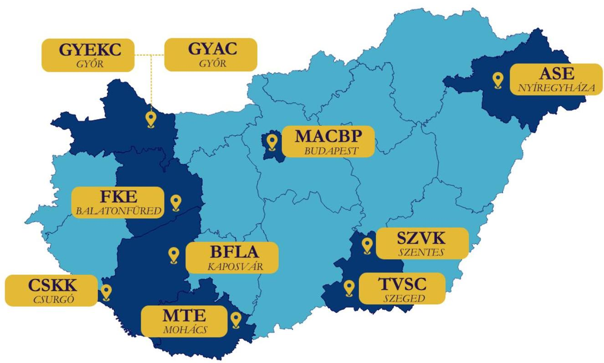
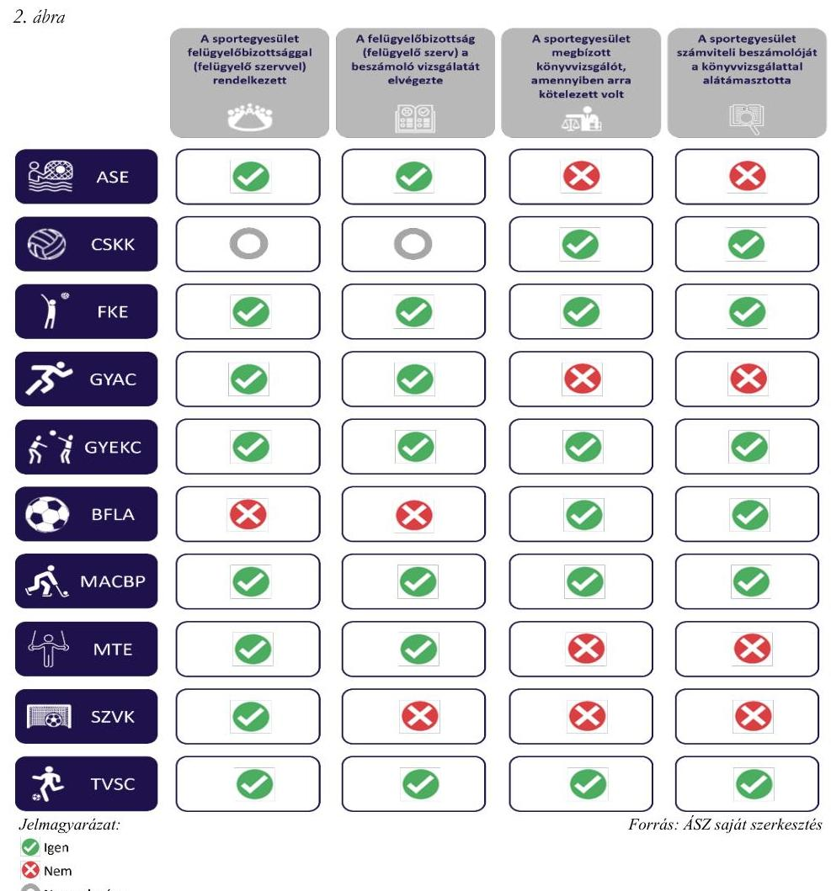

# JELENTÉS 

## A költségvetési támogatásban részesült sportegyesületeknél a felügyelőbizottság, felügyelő szerv létrehozása és könyvvizsgáló alkalmazása szabályszerűségének ellenőrzése

AQUA SPORT EGYESÜLET, CSURGÓI KÉZILABDA KLUB, FÜREDI KÉZILABDASPORT EGYESÜLET, GYŐRI ATLÉTIKAI CLUB - II. KERÜLET DÓZSA, GYŐRI ETO KÉZILABDA CLUB, KAPOSVÁRI RÁKÓCZI BENE FERENC LABDARÜGÓ AKADÉMIA, MAC BUDAPEST JÉGKORONG AKADÉMIA EGYESÜLET, MOHÁCSI TORNA EGYLET 1888, SZENTESI VÍZILABDA KLUB, TISZA VOLÁN SC
2024.

---

# JELENTÉS 

## A költségvetési támogatásban részesült sportegyesületeknél a felügyelőbizottság, felügyelő szerv létrehozása és könyvvizsgáló alkalmazása szabályszerűségének ellenőrzése

AQUA SPORT EGYESÜLET, CSURGÓI KÉZILABDA KLUB, FÜREDI KÉZILABDASPORT EGYESÜLET, GYŐRI ATLÉTIKAI CLUB - II. KERÜLET DÓZSA, GYŐRI ETO KÉZILABDA CLUB, KAPOSVÁRI RÁKÓCZI BENE FERENC LABDARÜGÓ AKADÉMIA, MAC BUDAPEST JÉGKORONG AKADÉMIA EGYESÜLET, MOHÁCSI TORNA EGYLET 1888, SZENTESI VÍZILABDA KLUB, TISZA VOLÁN SC
2024.

---

# ELLENŐRZÉSI IGAZGATÓSÁG: 

## ÁLLAMHÁZTARTÁSON KÍVÜLI SZERVEZETEKET ELLENŐRZŐ IGAZGATÓSÁG

## ELLENŐRZÉSI IGAZGATÓ:

## KLINGA LÁSZLÓ igazgató

## ELLENŐRZÉSVEZETŐ:

Jelentéseink az interneten a www.asz.hu címen olvashatók.

## HOFMEISTER LÁSZLÓ ellenőrzésvezető

IKTATÓSZÁM: EL-4070-002/2024.
TÉMASZÁM: 2717
ELLENŐRZÉS-AZONOSÍTÓ SZÁM: V1061

---

# TARTALOMJEGYZÉK 

AZ ELLENŐRZÉS ALAPADATAI ..... 5
AZ ELLENŐRZÖTT SZERVEZETEK ..... 7
ÖSSZEFOGLALÁS ..... 10
AZ ELLENŐRZÉS FÓKUSZKÉRDÉSE ..... 11
MEGÁLLAPÍTÁSOK ..... 12
JAVASLATOK ..... 14
MELLÉKLETEK ..... 15
I. sz. melléklet: Értelmező szótár ..... 15
II. sz. melléklet: Az ellenőrzött szervezetek jegyzéke ..... 16
III. sz. melléklet: Ellenőrzési kritériumok ..... 17
FÜGGELÉK: ÉSZREVÉTELEK ..... 18
RÖVIDÍTÉSEK JEGYZÉKE ..... 19

---

.

---

# AZ ELLENŐRZÉS ALAPADATAI 

## AZ ELLENŐRZÉS CÉLJA

Az ellenőrzés célja annak értékelése volt, hogy az ellenőrzött sportegyesületnél a jogszabályi előírásoknak megfelelően létrehoztak-e, működtettek-e felügyelőbizottságot vagy felügyelő szervet, továbbá alkalmaztak-e könyvvizsgálót, a könyvvizsgáló vizsgálta-e a sportegyesület 2022. évi beszámolóját.

## AZ ELLENŐRZÉS TÍPUSA

Szabályszerűségi ellenőrzés.

## AZ ELLENŐRZÖTT IDŐSZAK

A 2022. év és a 2022. évi beszámoló elfogadásáig terjedő időszak.

## AZ ELLENŐRZÉS TÁRGYA

Az ellenőrzés a költségvetési támogatásban részesült sportegyesületek tekintetében a felügyelőbizottság vagy felügyelő szerv létrehozásának és működtetésének, a könyvvizsgáló alkalmazásának szabályszerűségére, a sportegyesület gazdálkodásáról készített 2022. évi beszámoló könyvvizsgáló általi vizsgálatának megtörténtére irányult.

## AZ ELLENŐRZÉS JOGALAPJA

Az ellenőrzés jogalapját az ÁSZ tv. ${ }^{1}$ 5. § (3) bekezdése képezte.

## AZ ELLENŐRZÉS MÓDSZERE

Az ellenőrzést az Alaptörvény ${ }^{2}$ 43. cikk (1) bekezdésében meghatározott törvényességi és célszerűségi szempontok szerint, valamint a nemzetközi standardokat irányadónak tekintve az ellenőrzési program szempontjai, az ellenőrzött időszakban hatályos jogszabályok, az ellenőrzés szakmai szabályok és módszertan figyelembevételével végezte el az ÁSZ ${ }^{3}$.

Az ellenőrzési kérdések megválaszolásához szükséges bizonyítékok megszerzése az ellenőrzött szervezet által rendelkezésre bocsátott dokumentumokra, adatokra alapozva kérdésfeltevés (információkérés), interjú útján történt.

Az ellenőrzési bizonyítékként felhasználható adatforrások közé tartoztak egyrészt az ellenőrzési programban felsorolt adatforrások, másrészt az ellenőrzés folyamán feltárt, az ellenőrzés szempontjából releváns információt tartalmazó dokumentumok.

---

Az ellenőrzés lefolytatásához az ellenőrzött szervezetek tanúsítványok kitöltésével, hitelesítésével, valamint a teljességi és hitelességi nyilatkozattal alátámasztott adatok, dokumentumok rendelkezésre bocsátásával szolgáltattak adatokat.

---

# AZ ELLENŐRZÖTT SZERVEZETEK 

Az ellenőrzött szervezetek a Sport tv. ${ }^{4}$ 16. § (1) bekezdése szerint, a Civil. tv. ${ }^{5}$ és a Ptk. ${ }^{6}$ szabályai szerint működő olyan sportegyesületek, amelyek a Számv. tv. ${ }^{7}$ 3. § (1) bekezdés 4. a) pontja szerinti egyéb szervezeteknek minősültek.

Az ellenőrzött szervezetek területi elhelyezkedését az 1. ábra mutatja:
1. ábra

Forrás: ÁSZ saját szerkesztés

## AQUA SPORT EGYESÜLET

Az $\mathrm{ASE}^{8}$ 2004-ben jött létre azzal a céllal, hogy Szabolcs-Szatmár-Bereg vármegye és azon belül Nyíregyháza Megyei Jogú Város sportéletének részeként az utánpótlását biztosító egyesületeket, általános-, közép-, és főiskolákat szakmai és anyagi úton támogassa, megteremtse az úszó- és a vízilabda sporthoz szükséges tárgyi- és anyagi eszköz feltételeket az egyesület sportolói részére.

A sportegyesület éves bevétele a 2022. évben 139638 E Ft volt és az egyszerűsített éves beszámoló támogatások sora alapján 117477 E Ft támogatásban részesült. Az ASE közhasznú szervezetnek minősült. A tagi létszám meghaladta a 100 főt, a Ptk. alapján felügyelőbizottság létrehozására volt kötelezett. Könyvvizsgálatra kötelezett volt.

## CSURGÓI KÉZILABDA KLUB

A CSKK ${ }^{9}$ 1992-ben alakult Csurgón. Célja a kézilabda sportág népszerűsítése és folyamatos utánpótlásának biztosítása, szervezett keretek közötti sportolás lehetőségének megteremtése, a szabadidő hasznos eltöltésének megszervezése.

---

A sportegyesület éves bevétele a 2022. évben 334386 E Ft volt és az egyszerűsített éves beszámoló közhasznúsági melléklete alapján 223234 E Ft támogatásban részesült. A CSKK nem minősült közhasznú szervezetnek és a tagi létszáma 100 fő alatti volt, ezért felügyelőbizottság, felügyelő szerv létrehozására nem volt kötelezett. Könyvvizsgálatra kötelezett volt.

# FÜREDI KÉZILABDASPORT EGYESÜLET 

Az FKE ${ }^{10}$ 1996-ban alakult Balatonfüreden. Célja versenysport és az utánpótlás nevelés a tömegsport jellegű és a szabadidő egészséges eltöltéséhez kulturált, szervezett keretek közötti lehetőség biztosítása.

Éves bevétele a 2022. évben 287189 E Ft volt és az egyszerűsített éves beszámoló támogatások sora alapján 197879 E Ft támogatásban részesült. Közhasznú szervezetnek minősült. Felügyelő szerv létrehozására és könyvvizsgálatra volt kötelezett.

## GYŐRI ATLÉTIKAI CLUB - II. KERÜLET DÓZSA

A GYAC ${ }^{11}$ 1919-ben alakult Győrött. Fő célja a sporttevékenységen belül a verseny- és élsport, illetve az utánpótlásnevelés. Célja továbbá a rendszeres sportolás, versenyzés, testedzés, felüdülés és rekreációs tevékenységek biztosítása, az ilyen igények felkeltése, tagjainak nevelése, a társadalmi öntevékenység és közösségi élet kibontakoztatása.

Az egyesület éves bevétele a 2022. évben 417683 E Ft volt, és az egyszerűsített éves beszámoló támogatások sora alapján 263832 E Ft támogatásban részesült. Nem minősült közhasznú szervezetnek. A tagi létszám meghaladta a 100 főt, a Ptk. alapján felügyelőbizottság létrehozására volt kötelezett. Könyvvizsgálatra kötelezett volt.

## GYŐRI ETO KÉZILABDA CLUB

A GYEKC ${ }^{12}$-t 1904-ben hozták létre Győr városában. Célja tagjai részére rendszeres testedzés és sportolás lehetőségének biztosítása, fiatal tehetséges versenyzők felkutatása, kinevelése, támogatása, valamint az eddig elért szakmai sikerek tovább gazdagítása, az egyesület presztízsének, a sporthagyományok és sportsikerek megőrzése.

Éves bevétele a 2022. évben 1665925 E Ft volt, és az egyszerűsített éves beszámoló támogatások sora alapján 1045896 E Ft támogatásban részesült. Nem minősült közhasznú szervezetnek. A tagi létszám meghaladta a 100 főt, a Ptk. alapján felügyelőbizottság létrehozására volt kötelezett. Könyvvizsgálatra kötelezett volt.

## KAPOSVÁRI RÁKÓCZI BENE FERENC LABDARÜGÓ AKADÉMIA

A kaposvári székhelyű BFLA ${ }^{13}$-t 2007-ben alapították azzal a céllal, hogy Somogy vármegye, és az azzal határos területek települései (azon belül kiemelten Kaposvár és környéke) labdarúgó utánpótlást képezze, nem hivatásos sporttevékenység keretében végezze a 6-19 éves korú labdarúgóinak minőségi felkészítését, versenyeztetését, és korosztályos labdarúgó csapatok működtetését, továbbá futsal csapat versenyeztetését.

A BFLA éves bevétele a 2022. évben 466744 E Ft volt, amelyből az egyszerűsített éves beszámoló támogatások sora alapján 442272 E Ft támogatás. A 2022. évben közhasznú szervezetnek minősült, felügyelő szerv létrehozására és könyvvizsgálatra volt kötelezett.

## MAC BUDAPEST JÉGKORONG AKADÉMIA EGYESÜLET

A MACBP ${ }^{14}$-t 1963-ban Budapesten hozták létre azzal a céllal, hogy tagjai részére biztosítsa a rendszeres testedzés és sportolás lehetőségét versenyszerű körülmények között, ápolja és fejlessze hazai- és nemzetközi

---

sportkapcsolatait. Feladata az egyesületi célok megvalósítása érdekében a jégkorong sportág működési feltételeinek biztosítása, a hazai és nemzetközi sporteseményeken való részvétel biztosítása, és versenyek rendezése. Ezen kívül sportszakmai képzést, utánpótlásnevelést is végez.

A MACBP éves bevétele a 2022. évben 421874 E Ft volt, amelyből az egyszerűsített éves beszámoló támogatások sora alapján 354702 E Ft támogatás. A 2022. évben a szervezet közhasznúnak minősült, felügyelő szerv létrehozására és könyvvizsgálatra volt kötelezett.

# MOHÁCSI TORNA EGYLET 1888 

A mohácsi székhelyű $\mathrm{MTE}^{15}$-t 1888-ban alapították. Célja, hogy tagjai és mások részére a rendszeres testedzés és sportolás lehetőségét biztosítsa, a bázisszervek dolgozói részére a sportolási és testedzési lehetőséget biztosítsa, a sportegyesülettel kapcsolatban lévő oktatási, nevelési intézmények tanulóinak (hallgatóinak) részére a sportolási, testedzési lehetőséget megteremtse, és a lakosság szabadidősportját segítse. Az MTE emellett sportkapcsolatokat létesít és fejlesztéseket hajt végre.

Az MTE éves bevétele a 2022. évben 438569 E Ft volt, melyből az egyszerűsített éves beszámoló támogatások sora alapján 384861 E Ft támogatás. A 2022. évben közhasznú szervezetnek minősült, és könyvvizsgálatra volt kötelezett. A tagi létszám meghaladta a 100 főt, a Ptk. alapján felügyelőbizottság létrehozására volt kötelezett.

## SZENTESI VÍZILABDA KLUB

Az SZVK ${ }^{16}$ 1996-ban alakult Szentesen. Célja a vízilabda sport népszerűsítése, művelése, versenylehetőség biztosítása, Szentes sportfeladatainak megvalósítása, minőségi sporteredmények elérése. Feladata az egyesületi célok megvalósítása érdekében az utánpótlás nevelés, edzések szervezése versenylehetőség biztosítása a sportolóknak, versenyek szervezése, sporteszközök és sportlétesítmények biztosítása a sportolók részére.

Az SZVK éves bevétele a 2022. évben 479907 E Ft volt, melyből az egyszerűsített éves beszámoló támogatások sora alapján 320894 E Ft támogatás. A 2022. évben a szervezet közhasznúnak minősült, és könyvvizsgálatra volt kötelezett. A tagi létszám meghaladta a 100 főt, a Ptk. alapján felügyelőbizottság létrehozására volt kötelezett.

## TISZA VOLÁN SC

A szegedi székhelyű TVSC ${ }^{17}$-t 1970-ben alapították. Elsődleges célja a rendszeres sportolás (versenyzés), testedzés, aktív pihenés, valamint az egyes szakosztályok, versenyzők részvételének biztosítása a különböző nemzeti bajnokságokon és nemzetközi versenyeken.

A TVSC éves bevétele a 2022. évben 648991 E Ft volt, melyből az egyszerűsített éves beszámoló támogatások sora alapján 590806 E Ft támogatás. A 2022. évben a szervezet nem minősült közhasznúnak, könyvvizsgálatra, valamint a Ptk. alapján felügyelőbizottság létrehozására volt kötelezett, mivel a tagi létszám meghaladta a 100 főt.

---

# ÖSSZEFOGLALÁS 

Az ellenőrzésre kiválasztott tíz sportegyesület közül a 2022. évben nyolc rendelkezett felügyelőbizottsággal (felügyelő szervvel) a jogszabályi előírásoknak megfelelően. Egy sportegyesület a 2022. évben a jogszabályi előírás ellenére nem rendelkezett felügyelő szervvel. Egy sportegyesület jogszabályi előírások alapján nem volt kötelezett felügyelőbizottság létrehozására.

Hét sportegyesület felügyelőbizottsága (felügyelő szerve) a jogszabályi előírásoknak megfelelően tárgyalta a 2022. évi beszámolót. Egy sportegyesület felügyelőbizottságának működése nem felelt meg a jogszabályi előírásoknak, mivel jogszabályi előírás ellenére a 2022. évi beszámoló vizsgálatát nem végezte el.

Hat sportegyesület a jogszabályi előírásoknak megfelelően alkalmazott könyvvizsgálót a beszámoló felülvizsgálatának elvégzésére. Négy sportegyesület nem tartotta be a könyvvizsgálatra vonatkozó jogszabályi előírásokat, a 2022. évi közzétett beszámolók könyvvizsgálattal nem voltak alátámasztottak.

Három sportegyesület felügyelő szerve a jogszabályi előírásoknak megfelelően, egy sportegyesület felügyelőbizottsága az alapszabályában foglaltak alapján megalkotta az ügyrendjét. Két sportegyesület felügyelő szerve a jogszabályi előírások ellenére az ügyrendjét nem alkotta meg. Két sportegyesület felügyelőbizottsága részére nem volt ügyrend készítési kötelezettség előírva.

A főbb ellenőrzési tapasztalatokat ez ellenőrzött időszakra vonatkozóan a 2. ábra szemlélteti sportegyesületenként:

---

# AZ ELLENŐRZÉS FÓKUSZKÉRDÉSE 

1. A jogszabályi előírásoknak megfelelően történt-e a sportegyesület felügyelőbizottságának vagy felügyelő szervének létrehozása, a 2022. évi beszámoló felügyelőbizottság általi megvizsgálása, valamint annak elfogadása során a könyvvizsgáló alkalmazása?

---

# MEGÁLLAPÍTÁSOK 

## 1. A jogszabályi előírásoknak megfelelően történt-e a sportegyesület felügyelőbizottságának vagy felügyelő szervének létrehozása, a 2022. évi beszámoló felügyelőbizottság általi megvizsgálása, valamint annak elfogadása során a könyvvizsgáló alkalmazása?

Összegző megállapítás

Nyolc ellenőrzött sportegyesület a 2022. évben rendelkezett, egy sportegyesület a Civil tv.-ben foglalt előírások ellenére nem rendelkezett felügyelő szervvel, egy egyesület nem volt kötelezett felügyelőbizottság létrehozására. Nyolcból hét szervezet
 felügyelőbizottsága a 2022. évi beszámolót megvizsgálta a jogszabályi előírásoknak megfelelően, egy szervezet felügyelőbizottsága azonban a Ptk. előírásainak ellenére ezt elmulasztotta. Hat sportegyesületnél az előírt könyvvizsgálat teljesült a jogszabályi előírásoknak megfelelően, négy sportegyesület a könyvvizsgálati kötelezettségének nem tett eleget a Civilszr.-ben rögzített előírások ellenére. Két sportegyesület felügyelő szerve a Civil tv. előírása ellenére az ügyrendjét nem alkotta meg.

Felügyelőbizottság, felügyelő szerv létrehozása, működtetése
Az ASE, a GYAC, a GYEKC, az MTE, az SZVK, a TVSC 2022-ben a Ptk. előírásainak megfelelően rendelkezett három tagból álló felügyelőbizottsággal. Az FKE és a MACBP a Civil tv. előírásai alapján a 2022. évben rendelkezett felügyelő szervvel. A CSKK-nak nem kellett létrehoznia felügyelőbizottságot.

A BFLA a Civil tv. 40. § (1) bekezdésében előírtakkal szemben nem rendelkezett felügyelő szervvel annak ellenére, hogy a szervezet közhasznú szervezetnek minősült és éves bevétele meghaladta az ötvenmillió forintot a 2022. évben.
Az ASE, az FKE, a GYAC, a GYEKC, a MACBP, az MTE és a TVSC felügyelőbizottsága (felügyelő szerve) a Ptk.-ban előírtaknak megfelelően a közgyűlés elé beterjesztett 2022. évi beszámolót megvizsgálta, a döntéshozó szervvel ismertette az álláspontját.
Az SZVK felügyelőbizottsága a Ptk. 3:80. § b) pontja szerint a közgyűlés elé beterjesztett 2022. évi beszámolót a Ptk. 3:27. § (1) bekezdésben foglaltak ellenére nem vizsgálta meg, álláspontját a döntéshozó szervvel nem ismertette.
Az FKE, a MACBP, az SZVK felügyelőbizottsága a Civil tv., a TVSC felügyelőbizottsága az egyesület alapszabályában foglaltak alapján megalkotta az ügyrendjét. Az ASE és az MTE felügyelőbizottsága, mint az egyesület felügyelő szerve, a Civil tv. 40. § (2) bekezdésének előírása ellenére az ügyrendjét nem alkotta meg. A GYAC és a GYEKC felügyelőbizottságai számára nem volt ügyrend készítési kötelezettség előírva.

---

# Könyvvizsgáló alkalmazása, beszámoló felülvizsgálata 

A BFLA, az FKE, a CSKK, a GYEKC, a MACBP és a TVSC a 2022. évben a Civilszr. ${ }^{18}$-ban előírtak alapján biztosították a könyvvizsgálatot, a beszámoló felülvizsgálatával könyvvizsgálót bíztak meg. Ezen hat sportegyesület a 2022. évi beszámolóját a Civil tv. előírásainak megfelelően a könyvvizsgálói jelentéssel alátámasztotta.
Az ellenőrzött időszakban az ASE, a GYAC, az MTE, és az SZVK sportegyesületek a Civilszr. 16. § (1) bekezdésében foglaltak ellenére a 2022. évi beszámoló felülvizsgálatára nem bíztak meg könyvvizsgálót, így a 2022. évi beszámoló könyvvizsgálattal nem volt alátámasztott. Az MTE és az SZVK vezetése jelen ÁSZ ellenőrzés megkezdését követően intézkedett a 2022. évi beszámoló utólagos könyvvizsgálatáról. Az ASE és a GYAC esetében a 2022. évi beszámoló könyvvizsgálói felülvizsgálata nem történt meg.

---

# JAVASLATOK 

Az ÁSZ tv. 33. § (1) bekezdésében foglaltak értelmében az ellenőrzött szervezet vezetője köteles a jelentésben foglalt megállapításokhoz kapcsolódó intézkedési tervet összeállítani és azt a jelentés kézhezvételétől számított 30 napon belül az ÁSZ részére megküldeni. Amennyiben az ellenőrzött szervezet vezetője nem küldi meg határidőben az intézkedési tervet, vagy továbbra sem elfogadható intézkedési tervet küld, az Állami Számvevőszék elnöke az ÁSZ tv. 33. § (3) bekezdése a) és b) pontjaiban foglaltakat érvényesítheti.

## AZ AQUA SPORT EGYESÜLET ELNÖKÉNEK

1. Gondoskodjon a jövőben a számviteli beszámoló könyvvizsgálóval való felülvizsgálatáról a Civilszr. 16. § (1) bekezdésében előírtaknak megfelelően.
2. Gondoskodjon arról, hogy a felügyelőbizottság megalkotja az ügyrendjét a Civil tv. 40. § (2) bekezdésében foglalt előírásnak megfelelően.

## A GYŐRI ATLÉTIKAI CLUB - II. KERÜLET DÓZSA ELNÖKÉNEK

1. Gondoskodjon a jövőben a számviteli beszámoló könyvvizsgálóval való felülvizsgálatáról a Civilszr. 16. § (1) bekezdésében előírtaknak megfelelően.

## A KaposVÁRI RÁKÓCZI BENE FERENC LABDARÚGÓ AKADÉMIA ELNÖKÉNEK

1. Gondoskodjon a felügyelő szerv létrehozásáról a Civil tv. 40. § (1) bekezdésében foglalt előírásnak megfelelően.

## A MOHÁCSI TORNA EGYLET 1888 ELNÖKÉNEK

1. Gondoskodjon a jövőben a számviteli beszámoló könyvvizsgálóval való felülvizsgálatáról a Civilszr. 16. § (1) bekezdésében előírtaknak megfelelően.
2. Gondoskodjon arról, hogy a felügyelőbizottság megalkotja az ügyrendjét a Civil tv. 40. § (2) bekezdésében foglalt előírásnak megfelelően.

## A SZENTESI VÍZILABDA KLUB ELNÖKÉNEK

1. Gondoskodjon a jövőben arról, hogy a felügyelőbizottság a Ptk. 3:27. § (1) bekezdésben foglalt előírásnak megfelelően az éves számviteli beszámolót vizsgálja meg és a döntéshozó szervvel ismertesse az álláspontját.
2. Gondoskodjon a jövőben a számviteli beszámoló könyvvizsgálóval való felülvizsgálatáról a Civilszr. 16. § (1) bekezdésében előírtaknak megfelelően.

---

# MELLÉKLETEK 

## I. SZ. MELLÉKLET: ÉRTELMEZŐ SZÓTÁR

költségvetési támogatás
felügyelőbizottság
felügyelő szerv
könyvvizsgálati kötelezettség
sportegyesület
a társadalombiztosítás pénzügyi alapjai kivételével az államháztartás központi alrendszeréből ellenérték nélkül, pénzben nyújtott támogatások (Áht. ${ }^{19} 1 . \S 14$. pont)
a felügyelőbizottság feladata az ügyvezetés ellenőrzése a jogi személy érdekeinek megóvása céljából (Ptk. 3:26. § (1) bekezdés). Kötelező felügyelőbizottságot létrehozni, ha a tagok több mint fele nem természetes személy, vagy ha a tagság létszáma a száz főt meghaladja (Ptk. 3:82. § (1) bekezdés)
a felügyelő szerv ellenőrzi a közhasznú szervezet működését és gazdálkodását (Civil tv. 41. § (1) bekezdés). Ha a közhasznú szervezet éves bevétele meghaladja az ötvenmillió forintot, a vezető szervtől elkülönült felügyelő szerv létrehozása akkor is kötelező, ha ilyen kötelezettség más jogszabálynál fogva egyébként nem áll fenn (Civil tv. 40. $\S$ (1) bekezdés)
kötelező a könyvvizsgálat annál az egyéb szervezetnél, amelynél az éves (éves szintre átszámított) bevétel az üzleti évet megelőző két üzleti év átlagában meghaladja a 300 millió forintot. Minden olyan esetben, amikor a könyvvizsgálat e rendelet vagy más jogszabály előírásai szerint nem kötelező, az egyéb szervezet dönthet arról, hogy a beszámoló felülvizsgálatával könyvvizsgálót bíz meg (Civilszr. 16. $\S$ (1) bekezdés)
a sportegyesület olyan egyesület, amelynek alaptevékenysége a sporttevékenység szervezése, valamint a sporttevékenység feltételeinek megteremtése (Sport tv. 16. § (1) bekezdése)

---

II. SZ. MELLÉKLET: AZ ELLENŐRZÖTT SZERVEZETEK JEGYZÉKE

|  | ASE | BFLA | CSKK | FRE | GYAC | GYERC | MACBF | MTE | SZVK | TWSC |
| :--: | :--: | :--: | :--: | :--: | :--: | :--: | :--: | :--: | :--: | :--: |
| Közhasznú jogállású volt | I | I | N | I | N | N | I | I | I | N |
| Könyvvizsgálatra kötelezett volt | I | I | I | I | I | I | I | I | I | I |
| Felügyelőbizottság / felügyelő szerv létrehozására kötelezett volt | I | I | N | I | I | I | I | I | I | I |
| Ügyrend készítési kötelezettsége Civil tv. alapján állt fenn | I | I | N | I | N | N | I | I | I | N |
| Kapott támogatást | I | I | I | I | I | I | I | I | I | I |
| Tagi létszám nagyobb mint 100 fő | I | N | N | N | I | I | N | I | I | I |
| Tagok több mint fele nem természetes személy | N | N | N | N | N | N | N | N | I | N |
| Bevétel 2020. év (EFt) | 2949458 | 346089 | 412824 | 459373 | 366461 | 1656139 | 428951 | 405308 | 321675 | 515252 |
| Bevétel 2021. év (EFt) | 163147 | 376953 | 600275 | 563493 | 476330 | 2212877 | 472585 | 462440 | 414110 | 545984 |
| Bevétel 2022. év (EFt) | 139638 | 466744 | 334386 | 287189 | 417683 | 1665925 | 421874 | 438569 | 479907 | 648991 |

---

# III. SZ. MELLÉKLET: ELLENŐRZÉSI KRITÉRIUMOK 

## FOKUSZTERÜLET/FOKUSZKÉRDÉS

1. A jogszabályi előírásoknak megfelelően történt-e a sportegyesület felügyelőbizottságának vagy felügyelő szervének létrehozása, a 2022. évi beszámoló felügyelőbizottság általi megvizsgálása, valamint annak elfogadása során a könyvvizsgáló alkalmazása?

## ELLENŐRZÉSI KRITÉRIUMOK

Számv. tv. 156. § (4) bek.,
Civil tv. 30. § (1)., 40. § (1) (2)., Civil tv. 41. § Civilszr. 16. § (1) bek.,
Ptk. 3:26. § (1), (2), 3:27. § (1), 3:82. § (1), (2) bek.
Felügyelőbizottság vagy felügyelő szerv ügyrendje
Sportegyesület alapító okirat/alapszabály

---

# FÜGGELÉK: ÉSZREVÉTELEK 

A jelentéstervezetet a Számvevőszék 15 napos észrevételezésre megküldte az ellenőrzött szervezet vezetőjének az ÁSZ tv. 29. § (1) bekezdése előírása szerint.

Az ellenőrzött szervezetek elnökei a jelentéstervezetre nem tettek észrevételt.

* 29. §(1) Az Állami Számvevőszék az ellenőrzési megállapításait megküldi az ellenőrzött szervezet vezetőjének vagy az általa megbízott személynek, és annak, akinek személyes felelősségét állapította meg.
(2) Az ellenőrzött szervezet vezetője és a felelősként megjelölt személy az ellenőrzés megállapításaira tizenöt napon belül írásban észrevételt tehet.
(3) Az Állami Számvevőszék az észrevételre a beérkezésétől számított harminc napon belül írásban válaszol. A figyelembe nem vett észrevételeket köteles a jelentésben feltüntetni, és megindokolni, hogy azokat miért nem fogadta el.

---

# RÖVIDÍTÉSEK JEGYZÉKE 

${ }^{1}$ ÁSZ tv.
${ }^{2}$ Alaptörvény
${ }^{3}$ ÁSZ
${ }^{4}$ Sport tv.
${ }^{5}$ Civil tv.
${ }^{6}$ Ptk.
${ }^{7}$ Számv. tv.
${ }^{8}$ ASE
${ }^{9}$ CSKK
${ }^{10}$ FKE
${ }^{11}$ GYAC
${ }^{12}$ GYEKC
${ }^{13}$ BFLA
${ }^{14}$ MACBP
${ }^{15}$ MTE
${ }^{16}$ SZVK
${ }^{17}$ TVSC
${ }^{18}$ Civilszr.
${ }^{19}$ Áht.
2011. évi LXVI. törvény az Állami Számvevőszékről
Magyarország Alaptörvénye
Állami Számvevőszék
2004. évi I. törvény a sportról
2011. évi CLXXV. törvény az egyesülési jogról, a közhasznú jogállásról, valamint a civil szervezetek működéséről és támogatásáról
2013. évi V. törvény a Polgári Törvénykönyvről
2000. évi C. törvény a számvitelről

AQUA Sport Egyesület
Csurgói Kézilabda Klub
Füredi Kézilabdasport Egyesület
Győri Atlétikai Club - II. kerület Dózsa
Győri ETO Kézilabda Club
Kaposvári Rákóczi Bene Ferenc Labdarúgó Akadémia
MAC Budapest Jégkorong Akadémia Egyesület
Mohácsi Torna Egylet 1888
Szentesi Vízilabda Klub
Tisza Volán SC
479/2016. (XII. 28.) Korm. rendelet a számviteli törvény szerinti egyes egyéb szervezetek beszámoló készítési és könyvvezetési kötelezettségének sajátosságairól
2011. évi CXCV. törvény az államháztartásról

---

1052 Budapest, Apáczai Csere János u. 10. | 1364 Budapest 4., Pf. 54
www.asz.hu | szamvevoszek@asz.hu
telefon: +36 1 4849100

