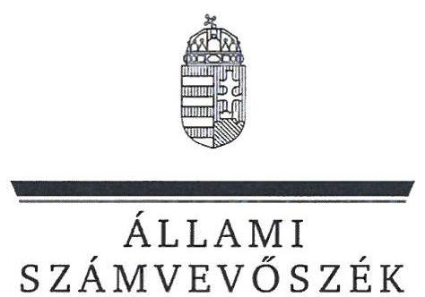
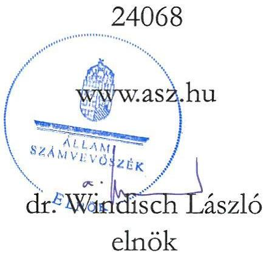
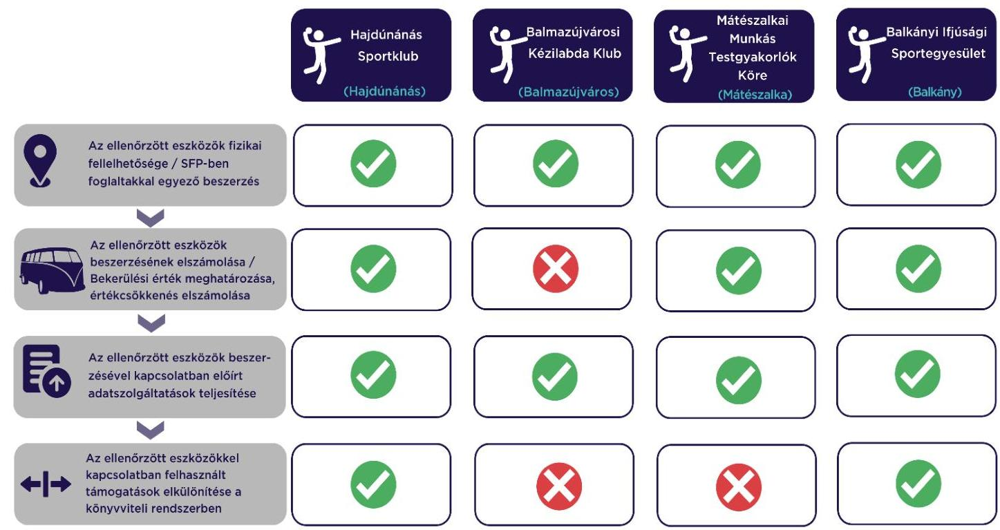

# JELENTÉS 

## Sportegyesületek eszközbeszerzésre kapott támogatás felhasználása szabályszerűségének ellenőrzése

Hajdúnánás Sportklub, Balmazújvárosi Kézilabda Klub, Mátészalkai Munkás Testgyakorlók Köre, Balkányi Ifjúsági Sportegyesület

2024.

---

ÁLLAMI
SZÁMVEVŐSZÉK

# JELENTÉS 

## Sportegyesületek eszközbeszerzésre kapott támogatás felhasználása szabályszerűségének ellenőrzése

Hajdúnánás Sportklub, Balmazújvárosi Kézilabda Klub, Mátészalkai Munkás Testgyakorlók Köre, Balkányi Ifjúsági Sportegyesület
2024.

---

# ELLENŐRZÉSI IGAZGATÓSÁG: 

## ÁLLAMHÁZTARTÁSON KÍVÜLI SZERVEZETEKET ELLENŐRZŐ IGAZGATÓSÁG

## ELLENŐRZÉSI IGAZGATÓ:

## KLINGA LÁSZLÓ igazgató

## ELLENŐRZÉSVEZETŐ:

Jelentéseink az interneten a www.asz.hu címen olvashatók.

## KAKAS SÁNDOR ellenőrzésvezető

IKTATÓSZÁM: EL-3870-278/2024
TÉMASZÁM: 2638.
ELLENŐRZÉS-AZONOSÍTÓ SZÁM: V1027

---

# TARTALOMJEGYZÉK 

AZ ELLENŐRZÉS ALAPADATAI ..... 5
AZ ELLENŐRZÖTT SZERVEZET ..... 6
ÖSSZEFOGLALÁS ..... 7
AZ ELLENŐRZÉS FÓKUSZKÉRDÉSE ..... 8
MEGÁLLAPÍTÁSOK ..... 9
JAVASLATOK ..... 10
MELLÉKLETEK ..... 11
I. sz. melléklet: Értelmező szótár ..... 11
II. sz. melléklet: Az ellenőrzött szervezetek jegyzéke ..... 12
III. sz. melléklet: Ellenőrzési kritériumok ..... 13
FÜGGELÉK: ÉSZREVÉTELEK ..... 14
RÖVIDÍTÉSEK JEGYZÉKE ..... 15

---

.

---

# AZ ELLENŐRZÉS ALAPADATAI 

## AZ ELLENŐRZÉS CÉLJA

Annak ellenőrzése, hogy az ellenőrzött sportegyesületnél a $\mathrm{TAO}^{1}$ támogatásból megvalósult kiválasztott eszközbeszerzés szabályszerűen történt-e.

## AZ ELLENŐRZÉS TÍPUSA

Szabályszerűségi ellenőrzés.

## AZ ELLENŐRZÖTT IDŐSZAK

A kiválasztott sportfejlesztési támogatás felhasználásáról szóló döntéstől a tartó időszak.

## AZ ELLENŐRZÉS TÁRGYA

A sportegyesületeknél a TAO támogatásból megvalósult kiválasztott eszközbeszerzések ellenőrzése.

## AZ ELLENŐRZÉS JOGALAPJA

Az ellenőrzés jogalapját az ÁSZ tv. ${ }^{2} 1 . \S$ (3), valamint az 5. § (3) bekezdése képezi.

## AZ ELLENŐRZÉS MÓDSZERE

Az ellenőrzést az ellenőrzési program szempontjai, az ellenőrzött időszakban hatályos jogszabályok, előírások, az ellenőrzés általános szakmai szabályai, az ellenőrzésre irányadó ÁSZ ${ }^{3}$ módszertanok figyelembevételével végezte az ÁSZ.

Az ellenőrzési kérdések megválaszolásához szükséges bizonyítékok megszerzése az ellenőrzött szervezet által rendelkezésre bocsátott dokumentumokra, adatokra alapozva kérdésfeltevés (információkérés), helyszíni szemle, interjú, mintavételezés útján történt. A helyszíni szemle során a sportfejlesztési program alapján beszerzett eszközök közül legalább három - a legnagyobb értékű - eszköz került kiválasztásra. Amennyiben háromnál kevesebb eszközt szereztek be, úgy mindegyik eszközt ellenőrizte az ÁSZ.

Az ellenőrzési bizonyítékként felhasználható adatforrások közé tartoztak egyrészt az ellenőrzési programban felsorolt adatforrások, másrészt adatforrás lehetett még az ellenőrzés folyamán feltárt, az ellenőrzés szempontjából releváns információt tartalmazó dokumentum.

---

# AZ ELLENŐRZÖTT SZERVEZET 

## HAJDÚNÁNÁS SPORTKLUB

Az ellenőrzés a kézilabda sportágat érintő SFP-10037/2022/MKSZ számú, 2022. március 28-án határozattal jóváhagyott sportfejlesztési program megvalósítására eszközbeszerzés jogcímen kapott TAO támogatásból a 2022-2023. években megvalósult eszközbeszerzések elszámolásának szabályszerűségére és a helyszíni ellenőrzés (2024. február 6.) során a kiválasztott, beszerzett eszközök fizikai szemrevételezésére terjedt ki.

Az ellenőrzött az SFP-10037/2022/MKSZ számú sportfejlesztési program keretében két eszközt szerzett be az ellenőrzés megkezdéséig. A beszerzett eszközök beszerzési árából a támogatott összeg 17063 E Ft volt. A helyszíni ellenőrzés keretében az eszközök szemrevételezésre kerültek.

## BALMAZÚJVÁROSI KÉZILABDA KLUB

Az ellenőrzés a kézilabda sportág SFP-10079/2022/MKSZ számú, 2022. március 28-án határozattal jóváhagyott sportfejlesztési program megvalósítására eszközbeszerzés jogcímen kapott TAO támogatásból a 2022-2023. években megvalósult eszközbeszerzések elszámolásának szabályszerűségére és a helyszíni ellenőrzés (2024. február 5.) során a kiválasztott, beszerzett eszközök fizikai szemrevételezésére terjedt ki.

Az ellenőrzött az SFP-10079/2022/MKSZ számú sportfejlesztési program keretében öt eszközt szerzett be az ellenőrzés megkezdéséig. A beszerzett eszközök beszerzési árából a támogatott összeg 10044 E Ft volt. A helyszíni ellenőrzés keretében az eszközök szemrevételezésre kerültek.

## MÁTÉSZALKAI MUNKÁS TESTGYAKORLÓK KÖRE

Az ellenőrzés a kézilabda sportágat érintő SFP-10092/2022/MKSZ számú, 2022. május 18-án határozattal jóváhagyott sportfejlesztési program megvalósítására eszközbeszerzés jogcímen kapott TAO támogatásból a 2022-2023. években megvalósult eszközbeszerzések elszámolásának szabályszerűségére és a helyszíni ellenőrzés (2024. február 1.) során a kiválasztott, beszerzett eszköz fizikai szemrevételezésére terjedt ki.

Az ellenőrzött az SFP-10092/2022/MKSZ számú sportfejlesztési program keretében két eszközt szerzett be az ellenőrzés megkezdéséig. A beszerzett eszközök beszerzési árából a támogatott összeg 18033 E Ft volt. Az eszközök a helyszíni ellenőrzés keretében szemrevételezésre kerültek.

## BALKÁNYI IFJÚSÁGI SPORTEGYESÜLET

Az ellenőrzés a kézilabda sportág SFP-10566/2022/MKSZ számú, 2022. május 12-én határozattal jóváhagyott sportfejlesztési program megvalósítására eszközbeszerzés jogcímen kapott TAO támogatásból a 2022-2023. években megvalósult eszközbeszerzések elszámolásának szabályszerűségére és a helyszíni ellenőrzés (2024. február 5.) során a kiválasztott, beszerzett eszközök fizikai szemrevételezésére terjedt ki.

Az ellenőrzött az SFP-10566/2022/MKSZ számú sportfejlesztési program keretében egy tárgyi eszközt szerzett be az ellenőrzés megkezdéséig. A beszerzett eszköz beszerzési árából a támogatott összeg 10082 E Ft volt. A helyszíni ellenőrzés keretében az eszköz szemrevételezésre került.

---

# ÖSSZEFOGLALÁS 

Az ellenőrzött eszközbeszerzésre kapott TAO támogatások elszámolása, számviteli nyilvántartása a Sportegyesület ${ }^{4}{ }_{1,4}$-nél szabályszerűen valósult meg, a Sportegyesület ${ }_{2,3}$-nél nem volt szabályszerű.

A Sportegyesület ${ }_{1-4}$ által a sportfejlesztési program ${ }_{1-4}{ }^{5}$-ben meghatározott támogatásokból megvásárolt eszközök megfeleltek a sportfejlesztési program ${ }_{1-4}$-ben meghatározottaknak. A TAO támogatásból beszerzett eszközök a nyilvántartással összhangban a helyszíni szemrevételezés során fellelhetőek voltak. Az ellenőrzési bizonyítékok alapján a beszerzett eszközök esetében nem merült fel az egyesületi céltól eltérő felhasználás.

A bekerülési érték meghatározása, az értékcsökkenés elszámolása a Sportegyesület ${ }_{1,3,4}$-nél szabályszerűen történt. A Sportegyesület ${ }_{2}$ az értékcsökkenést két beszerzett eszköz esetében nem szabályszerűen számolta el.

Az előírt elszámolási, adatszolgáltatási kötelezettségét a Sportegyesület ${ }_{1-4}$ szabályszerűen teljesítette.
A sportfejlesztési program ${ }_{1-4}$ keretében beszerzett eszközökkel kapcsolatos támogatások és azok felhasználásának könyvvitelben való elkülönítése a Sportegyesület ${ }_{1,4}$-nél a jogszabályi előírásoknak megfelelően történt. A Sportegyesület ${ }_{2,3}$ a támogatásokról és azok felhasználásáról a jogszabályi előírásoknak megfelelő elkülönített nyilvántartást nem vezetett.

Az 1. sz. ábra a főbb ellenőrzési tapasztalatokat szemlélteti sportegyesületenként:
1. ábra

---

# AZ ELLENŐRZÉS FÓKUSZKÉRDÉSE 

- Szabályszerű volt-e a Sportegyesületek eszközbeszerzésre kapott támogatásának felhasználása?

---

# 1. Szabályszerű volt-e a Sportegyesületek eszközbeszerzésre kapott támogatásának felhasználása? 

Összegző megállapítás Az ellenőrzött eszközbeszerzésre kapott TAO támogatások elszámolása, számviteli nyilvántartása a Sportegyesület ${ }_{1,4}$-nél szabályszerűen valósult meg, a Sportegyesület ${ }_{2,3}$-nél nem volt szabályszerű. A Sportegyesület ${ }_{1-4}$ a támogatásokat a sportfejlesztési program ${ }_{1-4}$-ben jóváhagyott eszközök beszerzésére fordította.

Az ellenőrzött eszközök fizikai fellelhetősége, sportfejlesztési program ${ }_{1-4}$-ben foglaltakkal egyező tartalma A TAO támogatásból beszerzett ellenőrzött eszközök a Sportegyesület ${ }_{1-4}$-nél a helyszíni szemrevételezés során fizikailag fellelhetőek voltak. A helyszíni szemle során az ellenőrzött támogatásból beszerzett eszközök az eszköz típusa, megnevezése, illetve gyári száma alapján beazonosíthatók voltak.
A Sportegyesület ${ }_{1-4}$ a sportfejlesztési program ${ }_{1-4}$-ben meghatározott támogatásokat a sportfejlesztési program ${ }_{1-4}$-ben jóváhagyott eszközök beszerzésére fordította. A beszerzett eszközök esetén az ellenőrzés során megszerzett bizonyítékok alapján nem merült fel a Sportegyesület ${ }_{1-4}$ céljaitól eltérő felhasználás.
Az ellenőrzött eszközök beszerzésének elszámolása, a bekerülési érték és az értékcsökkenés meghatározása
A Sportegyesület ${ }_{1,3,4}$ a 2022-2023. években a sportfejlesztési program ${ }_{1,3,4}$ keretében megvalósult eszközbeszerzését a Számv. tv. ${ }^{6}$-ben előírtak szerint számolta el, az ellenőrzött eszközök bekerülési értékének megállapítása a Számv. tv.-ben előírtak szerint történt. A Sportegyesület ${ }_{1,3,4}$ az értékcsökkenést a Számv. tv. előírásainak megfelelően számolta el. A Sportegyesület ${ }_{2}$ a 2022. évben a sportfejlesztési program ${ }_{2}$ keretében megvalósult eszközbeszerzések közül két eszköz esetében - a Számv. tv. 80. § (2) bekezdésében foglaltak ellenére - az eszközök teljes bekerülési értékét elszámolta a használatba vételkor értékcsökkenésként, pedig az eszközök bekerülési értéke meghaladta a kétszázezer forintot.

## Az ellenőrzött eszközökkel kapcsolatos előírt adatszolgáltatások teljesítése

A sportfejlesztési program ${ }_{1-4}$ vonatkozásában a 107/2011. Korm. rendeletben ${ }^{7}$ előírt elszámolási és adatszolgáltatási kötelezettségének a Sportegyesület ${ }_{1-4}$ eleget tett, az előrehaladási jelentések, záró elszámolások beküldésre kerültek a Magyar Kézilabda Szövetség részére.
Az ellenőrzött eszközökkel kapcsolatban felhasznált támogatások elkülönítése a könyvviteli rendszerben
A Sportegyesület ${ }_{1,4}$ a 107/2011. Korm. rendeletben, illetve a Civil tv. ${ }^{8}$-ben foglaltakkal összhangban az alapcél szerinti tevékenysége költségei, ráfordításai ellentételezésére visszafizetési kötelezettség nélkül kapott támogatásokról elkülönített számviteli nyilvántartást vezetett, ami alapján támogatásonként megállapítható és ellenőrizhető volt a kapott támogatás felhasználása. A Sportegyesület ${ }_{2,3}$ az alapcél szerint tevékenysége költségei, ráfordításai ellentételezésére visszafizetési kötelezettség nélkül kapott támogatásokról a 107/2011. Korm. rendelet 9. § (9) bekezdésében, illetve Civil tv. 20.§ (4) bekezdésében előírtak ellenére nem vezetett elkülönített számviteli nyilvántartást.

---

# JAVASLATOK 

Az ÁSZ tv. 33. § (1) bekezdésében foglaltak értelmében az ellenőrzött szervezet vezetője köteles a jelentésben foglalt megállapításokhoz kapcsolódó intézkedési tervet összeállítani és azt a jelentés kézhezvételétől számított 30 napon belül az ÁSZ részére megküldeni. Amennyiben az ellenőrzött szervezet vezetője nem küldi meg határidőben az intézkedési tervet, vagy továbbra sem elfogadható intézkedési tervet küld, az Állami Számvevőszék elnöke az ÁSZ tv. 33. § (3) bekezdése a) és b) pontjaiban foglaltakat érvényesítheti.

## BALMAZÚJVÁROSI KÉZILABDA KLUB ELNŐKE RÉSZÉRE

1. Gondoskodjon az értékcsökkenés Számv. tv. 52. §-nak megfelelő elszámolásáról.
2. Gondoskodjon a támogatásokról és azok felhasználásáról elkülönített nyilvántartás vezetéséről a Civil tv. 20. § (4) bekezdésében és a 107/2011. Korm. rendelet 9.§ (9) bekezdésében előírtak szerint.

## MÁTÉSZALKAI MUNKÁS TESTGYAKORLÓK KÖRE ELNŐKE RÉSZÉRE

1. Gondoskodjon a támogatásokról és azok felhasználásáról elkülönített nyilvántartás vezetéséről a Civil tv. 20. § (4) bekezdésében és a 107/2011. Korm. rendelet 9.§ (9) bekezdésében előírtak szerint.

---

# MELLÉKLETEK 

## I. SZ. MELLÉKLET: ÉRTELMEZŐ SZÓTÁR

költségvetési támogatás

TAO támogatás
kiválasztott eszköz
sportfejlesztési program
sportegyesület
a társadalombiztosítás pénzügyi alapjai kivételével az államháztartás központi alrendszeréből ellenérték nélkül, pénzben nyújtott támogatások (Áht. ${ }^{9} 1 . \S 14$. pont)
látvány-csapatsport támogatása: az adóévben visszafizetési kötelezettség nélkül nyújtott támogatás, juttatás, véglegesen átadott pénzeszköz és térítés nélkül átadott eszköz könyv szerinti értéke, az adóévben térítés nélkül nyújtott szolgáltatás bekerülési értéke az e törvényben meghatározott jogcímeken (Tao tv. ${ }^{10} 4 . \S 44$. pont)
az ÁSZ által ellenőrzésre kiválasztott tárgyi eszköz, forgóeszköz
a támogatás igénybevételére jogosult szervezet által készített, a sportpolitikáért felelős miniszter, illetve az országos sportági szakszövetség által jóváhagyott, a látvány-csapatsport támogatás igénybevételének feltételét képező, tervezett támogatással érintett sportfejlesztési program (Tao. tv. 22/C. § (3e) bekezdés)
a sportegyesület olyan egyesület, amelynek alaptevékenysége a sporttevékenység szervezése, valamint a sporttevékenység feltételeinek megteremtése (Sport tv. ${ }^{11} 16 . \S$ (1) bekezdése)

---

II. SZ. MELLÉKLET: AZ ELLENŐRZÖTT SZERVEZETEK JEGYZÉKE

| SSZ. | SPORTEGYESÜLET MEGNEVEZÉSE | SZÉKHELY |
| :-- | :-- | :-- |
| 1. | Hajdúnánás Sportklub | Hajdúnánás |
| 2. | Balmazújvárosi Kézilabda Klub | Balmazújváros |
| 3. | Mátészalkai Munkás Testgyakorlók Köre | Mátészalka |
| 4. | Balkányi Ifjúsági Sportegyesület | Balkány |

---

# III. SZ. MELLÉKLET: ELLENŐRZÉSI KRITÉRIUMOK 

## FOKUSZKÉRDÉS

Szabályszerű volt-e a sportegyesület eszközbeszerzésre kapott támogatásának felhasználása?

## KRITÉRIUMOK

Számv. tv. 14.§ (4) bekezdés, (5) bekezdés b) pont, 23. §, 24-33. §, 47-51. §, 52-53. §, 57-66. §, 80. §, 165. § (1)-(3) bekezdés
Civil tv. 20. § (4) bekezdés
479/2016. (XII. 28.) Korm. rendelet ${ }^{12}$ 9. § (9)-(10), 13. § (3) bekezdés, 14. § (1) bekezdés

107/2011 (VI.30) Korm. rendelet 9. § (9) bekezdés, 11. § (2)-(5) bekezdés,
sportfejlesztési program

---

# FÜGGELÉK: ÉSZREVÉTELEK 

A jelentéstervezetet a Számvevőszék 15 napos észrevételezésre megküldte az ellenőrzött szervezet vezetőjének az ÁSZ tv. 29. §* (1) bekezdése előírásának megfelelően.

A Hajdúnánás Sportklub, a Balmazújvárosi Kézilabda
 Klub, a Mátészalkai Munkás Testgyakorlók Köre, valamint a Balkányi Ifjúsági Sportegyesület elnökei a jelentéstervezetre nem tettek észrevételt.

[^0]
[^0]:    * 29. § (1) Az Állami Számvevőszék az ellenőrzési megállapításait megküldi az ellenőrzött szervezet vezetőjének vagy az általa megbízott személynek, és annak, akinek személyes felelősségét állapította meg.
    (2) Az ellenőrzött szervezet vezetője és a felelősként megjelölt személy az ellenőrzés megállapításaira tizenöt napon belül írásban észrevételt tehet.
    (3) Az Állami Számvevőszék az észrevételre a beérkezésétől számított harminc napon belül írásban válaszol. A figyelembe nem vett észrevételeket köteles a jelentésben feltüntetni, és megindokolni, hogy azokat miért nem fogadta el.

---

# RÖVIDÍTÉSEK JEGYZÉKE 

${ }^{1}$ TAO
${ }^{2}$ ÁSZ tv.
${ }^{3}$ ÁSZ
${ }^{4}$ Sportegyesület ${ }_{1-4}$
${ }^{5}$ sportfejlesztési program ${ }_{1-4}$
${ }^{6}$ Számv. tv.
${ }^{7}$ 107/2011. Korm. rendelet
${ }^{8}$ Civil tv.
${ }^{9}$ Áht.
${ }^{10}$ Tao tv.
${ }^{11}$ Sport tv.
${ }^{12}$ 479/2016. (XII. 28.) Korm. rendelet

Társasági adó
2011. évi LXVI. törvény az Állami Számvevőszékről

Állami Számvevőszék
1 Hajdúnánás Sportklub
2 Balmazújvárosi Kézilabda Klub
3 Mátészalkai Munkás Testgyakorlók Köre
4 Balkányi Ifjúsági Sportegyesület
1 SFP-10037/2022/MKSZ
2 SFP-10079/2022/MKSZ
3 SFP-10092/2022/MKSZ
4 SFP-10566/2022/MKSZ
2000. évi C. törvény a számvitelről

107/2011. (VI. 30.) Korm. rendelet a látvány-csapatsport támogatását biztosító támogatási igazolás kiállításáról, felhasználásáról, a támogatás elszámolásának és ellenőrzésének, valamint visszafizetésének szabályairól
2011. évi CLXXV. törvény az egyesülési jogról, a közhasznú jogállásról, valamint a civil szervezetek működéséről és támogatásáról
2011. évi CXCV. törvény az államháztartásról
1996. évi LXXXI. törvény a társasági adóról és az osztalékadóról
2004. évi I. törvény a sportról

479/2016. (XII. 28.) Korm. rendelet a számviteli törvény szerinti egyes egyéb szervezetek beszámoló készítési és könyvvezetési kötelezettségének sajátosságairól

---

1052 Budapest, Apáczai Csere János u. 10. | 1364 Budapest 4., Pf. 54
www.asz.hu | szamvevoszek@asz.hu
telefon: +36 14849100
