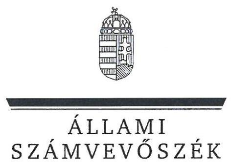
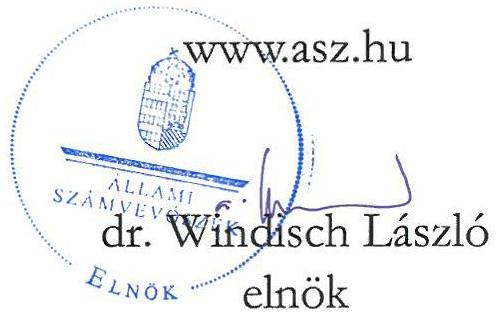
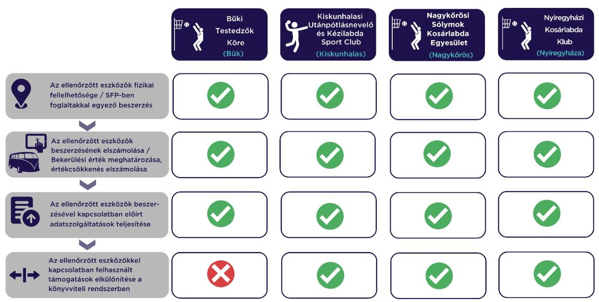

# JELENTÉS 

## Sportegyesületek eszközbeszerzésre kapott támogatás felhasználása szabályszerűségének ellenőrzése

Büki Testedzők Köre, Kiskunhalasi Utánpótlásnevelő és Kézilabda Sport Club, Nagykőrösi Sólymok Kosárlabda Egyesület, Nyíregyházi Kosárlabda Klub

2024.

---

ÁLLAMI
SZÁMVEVŐSZÉK

# JELENTÉS 

## Sportegyesületek eszközbeszerzésre kapott támogatás felhasználása szabályszerűségének ellenőrzése

Büki Testedzők Köre, Kiskunhalasi Utánpótlásnevelő és Kézilabda Sport Club, Nagykőrösi Sólymok Kosárlabda Egyesület, Nyíregyházi Kosárlabda Klub

2024. 

24069

---

# ELLENŐRZÉSI IGAZGATÓSÁG: 

## ÁLLAMHÁZTARTÁSON KÍVÜLI SZERVEZETEKET ELLENŐRZŐ IGAZGATÓSÁG

ELLENŐRZÉSI IGAZGATÓ:
KLINGA LÁSZLÓ igazgató
ELLENŐRZÉSVEZETŐ:
Jelentéseink az interneten a www.asz.hu címen olvashatók.

KAKAS SÁNDOR ellenőrzésvezető

IKTATÓSZÁM: EL-3870-277/2024
TÉMASZÁM: 2638.
ELLENŐRZÉS-AZONOSÍTÓ SZÁM: V1027

---

# TARTALOMJEGYZÉK 

AZ ELLENŐRZÉS ALAPADATAI ..... 5
AZ ELLENŐRZÖTT SZERVEZET ..... 6
ÖSSZEFOGLALÁS ..... 7
AZ ELLENŐRZÉS FÓKUSZKÉRDÉSE ..... 8
MEGÁLLAPÍTÁSOK ..... 9
JAVASLATOK ..... 11
MELLÉKLETEK ..... 12
I. sz. melléklet: Értelmező szótár ..... 12
II. sz. melléklet: Az ellenőrzött szervezetek jegyzéke ..... 13
III. sz. melléklet: Ellenőrzési kirtériumok ..... 14
FÜGGELÉK: ÉSZREVÉTELEK ..... 15
RÖVIDÍTÉSEK JEGYZÉKE ..... 16

---

.

---

# AZ ELLENŐRZÉS ALAPADATAI 

## AZ ELLENŐRZÉS CÉLJA

Annak ellenőrzése, hogy az ellenőrzött sportegyesületnél a $\mathrm{TAO}^{1}$ támogatásból megvalósult kiválasztott eszközbeszerzés szabályszerűen történt-e.

## AZ ELLENŐRZÉS TÍPUSA

Szabályszerúségi ellenőrzés.

## AZ ELLENŐRZÖTT IDŐSZAK

A kiválasztott sportfejlesztési támogatás felhasználásáról szóló döntéstől a helyszíni ellenőrzés napjáig tartó időszak.

## AZ ELLENŐRZÉS TÁRGYA

A sportegyesületeknél a TAO támogatásból megvalósult kiválasztott eszközbeszerzések ellenőrzése.

## AZ ELLENŐRZÉS JOGALAPJA

Az ellenőrzés jogalapját az ÁSZ tv. ${ }^{2} 1 . \S$ (3), valamint az 5. $\S$ (3) bekezdése képezi.

## AZ ELLENŐRZÉS MÓDSZERE

Az ellenőrzést az ellenőrzési program szempontjai, az ellenőrzött időszakban hatályos jogszabályok, előírások, az ellenőrzés általános szakmai szabályai, az ellenőrzésre irányadó ÁSZ ${ }^{3}$ módszertan figyelembevételével végezte az ÁSZ.

Az ellenőrzési kérdések megválaszolásához szükséges bizonyítékok megszerzése az ellenőrzött szervezet által rendelkezésre bocsátott dokumentumokra, adatokra alapozva kérdésfeltevés (információkérés), helyszíni szemle, interjú, mintavételezés útján történt. A helyszíni szemle során a sportfejlesztési program alapján beszerzett eszközök közül legalább három - a legnagyobb értékű - eszköz került kiválasztásra. Amennyiben háromnál kevesebb eszközt szereztek be, úgy mindegyik eszközt ellenőrizte az ÁSZ.

Az ellenőrzési bizonyítékként felhasználható adatforrások közé tartoztak egyrészt az ellenőrzési programban felsorolt adatforrások, másrészt adatforrás lehetett még az ellenőrzés folyamán feltárt, az ellenőrzés szempontjából releváns információt tartalmazó dokumentum.

---

# AZ ELLENŐRZÖTT SZERVEZET 

## BÜKI TESTEDZŐK KÖRE

Az ellenőrzés a kosárlabda sportágat érintő SFP-19189/2022/MKOSZ számú, 2022.04.05-én határozattal jóváhagyott sportfejlesztési program megvalósításra eszközbeszerzés jogcímen kapott TAO támogatásból 2022-2023. években megvalósult eszközbeszerzések elszámolásának szabályszerűségére és a helyszíni ellenőrzés (2024. február 1.) során a kiválasztott, beszerzett eszközök fizikai szemrevételezésére terjedt ki.

Az ellenőrzött az SFP-19189/2022/MKOSZ számú sportfejlesztési program keretében két eszközt szerzett be az ellenőrzés megkezdéséig. A beszerzett eszközök beszerzési árából a támogatott összeg 14457 E Ft volt. A helyszíni ellenőrzés keretében a két eszköz szemrevételezésre került.

## KISKUNHALASI UTÁNPÓTLÁSNEVELŐ ÉS KÉZILABDA SPORT CLUB

Az ellenőrzés a kézilabda sportágat érintő SFPMOD01-10030/2022/MKSZ számú, 2023.06.23-án határozattal jóváhagyott sportfejlesztési program megvalósításra eszközbeszerzés jogcímen kapott TAO támogatásból 2022-2023. években megvalósult eszközbeszerzések elszámolásának szabályszerűségére és a helyszíni ellenőrzés (2024. január 31.) során a kiválasztott, beszerzett eszközök fizikai szemrevételezésére terjedt ki.

Az ellenőrzött az SFPMOD01-10030/2022/MKSZ számú sportfejlesztési program keretében négy eszközt szerzett be az ellenőrzés megkezdéséig. A beszerzett eszközök beszerzési árából a támogatott összeg 26500 E Ft volt. A helyszíni ellenőrzés keretében a négy eszköz szemrevételezésre került.

## NAGYKÖRÖSI SÓLYMOK KOSÁRLABDA EGYESÜLET

Az ellenőrzés a kosárlabda sportágat érintő SFP-15047/2020/MKOSZ és SFP-17047/2021/MKOSZ számú, 2020.05.05-én és 2021.05.12-én határozattal jóváhagyott sportfejlesztési programok megvalósításra eszközbeszerzés jogcímen kapott TAO támogatásból a 2023. évben megvalósult eszközbeszerzések elszámolásának szabályszerűségére és a helyszíni ellenőrzés (2024. február 6.) során a kiválasztott, beszerzett eszközök fizikai szemrevételezésére irányult.

Az ellenőrzött az SFP-15047/2020/MKOSZ számú és az SFP-17047/2021/MKOSZ számú sportfejlesztési programok keretében egy-egy eszközt szerzett be az ellenőrzés megkezdéséig. A beszerzett eszközök beszerzési árából a támogatott összeg összesen 692 E Ft (146 E Ft és 546 E Ft) volt. A helyszíni ellenőrzés keretében egy eszköz szemrevételezésre került, egy eszköz telephelyen kívüli használatra kiadott eszköz volt, így a helyszínen nem volt fellelhető.

## NYÍREGYHÁZI KOSÁRLABDA Klub

Az ellenőrzés a kosárlabda sportágat érintő SFPMOD02-19013/2022/MKOSZ számú, 2023.04.21-én határozattal jóváhagyott sportfejlesztési program megvalósításra eszközbeszerzés jogcímen kapott TAO támogatásból 2022-2023. években megvalósult eszközbeszerzések elszámolásának szabályszerűségére és a helyszíni ellenőrzés (2024. február 1.) során a kiválasztott, beszerzett eszközök fizikai szemrevételezésére irányult.

Az ellenőrzött az SFPMOD02-19013/2022/MKOSZ számú sportfejlesztési program keretében három eszközt szerzett be az ellenőrzés megkezdéséig. A beszerzett eszközök beszerzési árából a támogatott összeg 14350 E Ft volt. A helyszíni ellenőrzés keretében a három eszköz szemrevételezésére került sor.

---

# ÖSSZEFOGLALÁS 

A Sportegyesület ${ }_{2-4}$-nél ${ }^{4}$ az ellenőrzött eszközbeszerzésre kapott TAO támogatások elszámolása, számviteli nyilvántartása szabályszerűen valósult meg. A Sportegyesület ${ }_{1}$-nél az ellenőrzött eszközbeszerzésre kapott TAO támogatások számviteli nyilvántartása nem volt szabályszerű.

A Sportegyesület ${ }_{1-4}$ által a sportfejlesztési program ${ }_{1-4}{ }^{5}$-ben meghatározott támogatásokból megvásárolt eszközök megfeleltek a sportfejlesztési program ${ }_{1-4}$-ben meghatározottaknak. A sportfejlesztési program ${ }_{1-4}$-ben jóváhagyott eszközök egy részének megvásárlására nem került sor a helyszíni ellenőrzés időpontjáig, az elszámolási határidő meghosszabbításra került.

A sportfejlesztési program ${ }_{1,2,4}$-ben a TAO támogatásból beszerzett eszközök a nyilvántartással összhangban a helyszíni szemrevételezés során fellelhetőek voltak, a sportfejlesztési program ${ }_{5}$-ban beszerzett eszközök közül egy eszköz helyszíni szemrevételezés során fellelhető volt, egy eszköz - a helyszíni jegyzőkönyv alapján - használatra kiadott eszköz volt. Az ellenőrzési bizonyítékok alapján a beszerzett eszközök esetében nem merült fel az egyesületi céltól való eltérő felhasználás.

A Sportegyesület ${ }_{1-4}$-nél a sportfejlesztési program ${ }_{1-4}$ keretében beszerzett eszközök vonatkozásában a bekerülési érték meghatározása, az értékcsökkenés elszámolása szabályszerű volt.

Az előírt elszámolási, adatszolgáltatási kötelezettségét a Sportegyesület ${ }_{1-4}$ a 107/2011. Korm. rendeletben ${ }^{6}$ előírtaknak megfelelően teljesítette.

A sportfejlesztési program ${ }_{1-4}$ keretében beszerzett eszközökkel kapcsolatos támogatások felhasználásának könyvvitelben való elkülönítése a Sportegyesület ${ }_{2-4}$-nél a jogszabályoknak megfelelően történt. A Sportegyesület ${ }_{1}$ a tevékenysége költségei, ráfordításai ellentételezésére kapott támogatásokról és azok felhasználásáról a jogszabályi előírások ellenére nem vezetett elkülönített nyilvántartást.

Az 1. sz. ábra a főbb ellenőrzési tapasztalatokat szemlélteti sportegyesületenként:
1. ábra

---

# AZ ELLENŐRZÉS FÓKUSZKÉRDÉSE 

- Szabályszerü volt-e a Sportegyesületek eszközbeszerzésre kapott támogatásának felhasználása?

---

# 1. Szabályszerú volt-e a Sportegyesületek eszközbeszerzésre kapott támogatásának felhasználása? 

| Összegző megállapítás | A Sportegyesület ${ }_{2-4}$-nél az ellenőrzött eszközbeszerzésre kapott TAO támogatások elszámolása, számviteli nyilvántartása szabályszerűen valósult meg, a Sportegyesület ${ }_{1}$-nél a támogatások számviteli nyilvántartása nem volt szabályszerű. A Sportegyesület ${ }_{1-4}$ a támogatásokat a sportfejlesztési program ${ }_{1-4}$-ben jóváhagyott eszközök beszerzésére fordította. |
| :--: | :--: |

Az ellenőrzött eszközök fizikai fellelhetősége, sportfejlesztési program ${ }_{1-4}$-ben foglaltakkal egyező tartalma

A TAO támogatásból beszerzett ellenőrzött eszközök a Sportegyesület ${ }_{1-4}$-nél a helyszíni szemrevételezés során - egy, dokumentáltan a telephelyen kívüli használatra kiadott eszköz kivételével - fizikailag fellelhetőek voltak. A helyszíni szemle során az ellenőrzött támogatásból beszerzett eszközök az eszköz típusa, megnevezése, illetve gyári száma alapján beazonosíthatók voltak.
A Sportegyesület ${ }_{1-4}$ a sportfejlesztési program ${ }_{1-4}$-ben meghatározott támogatásokat a sportfejlesztési program ${ }_{1-4}$-ben jóváhagyott eszközök beszerzésére fordította. A sportfejlesztési program ${ }_{1-4}$-ben meghatározott eszközök egy részének beszerzése az ellenőrzött időszakban nem történt meg, a sportfejlesztési program ${ }_{1-4}$-ben rögzített elszámolási határidő meghosszabbításra került.
A beszerzett eszközök esetén az ellenőrzés során megszerzett bizonyítékok alapján nem merült fel a Sportegyesület ${ }_{1-4}$ céljaitól eltérő felhasználás.

Az ellenőrzött eszközök beszerzésének elszámolása, a bekerülési érték és az értékcsökkenés meghatározása

A Sportegyesület ${ }_{1-4}$ a 2020-2023. években sportfejlesztési program ${ }_{1-4}$ keretében megvalósult tárgyi eszközök beszerzését a Számv. tv. ${ }^{7}$-ben előírtak szerint számolta el, az ellenőrzött eszközök bekerülési értékének megállapítása, az értékcsökkenés elszámolása a Számv. tv.-ben előírtaknak megfelelően történt.

## Az ellenőrzött eszközökkel kapcsolatos előírt adatszolgáltatások teljesítése

A sportfejlesztési program ${ }_{1-4}$ vonatkozásában a 107/2011. Korm. rendeletben előírt elszámolási és adatszolgáltatási kötelezettségének a Sportegyesület ${ }_{1-4}$ eleget tett, az előrehaladási jelentések, záró elszámolások beküldésre kerültek a Sportszövetség ${ }_{1,2}{ }^{8}$ részére.

---

# Az ellenőrzött eszközökkel kapcsolatban felhasznált támogatások elkülönítése a könyvviteli rendszerben 

A Sportegyesület ${ }_{2.4}$ a 107/2011. Korm. rendeletben, illetve a Civil tv. ${ }^{9}$-ben foglaltakkal összhangban az alapcél szerinti tevékenysége költségei, ráfordításai ellentételezésére visszafizetési kötelezettség nélkül kapott támogatásokról elkülönített számviteli nyilvántartást vezetett, ami alapján támogatásonként megállapítható és ellenőrizhető a kapott támogatás felhasználása. A Sportegyesület ${ }_{1}$ az alapcél szerint tevékenysége költségei, ráfordításai ellentételezésére visszafizetési kötelezettség nélkül kapott támogatásokról, azok felhasználásáról a 107/2011. Korm. rendelet 9.§ (9) bekezdésében, illetve a Civil tv. 20.§ (4) bekezdésében előírtak ellenére nem vezetett elkülönített számviteli nyilvántartást.

---

# JAVASLATOK 

Az ÁSZ tv. 33. § (1) bekezdésében foglaltak értelmében az ellenőrzött szervezet vezetője köteles a jelentésben foglalt megállapításokhoz kapcsolódó intézkedési tervet összeállítani és azt a jelentés kézhezvételétől számított 30 napon belül az ÁSZ részére megküldeni. Amennyiben az ellenőrzött szervezet vezetője nem küldi meg határidőben az intézkedési tervet, vagy továbbra sem elfogadható intézkedési tervet küld, az Állami Számvevőszék elnöke az ÁSZ tv. 33. § (3) bekezdése a) és b) pontjaiban foglaltakat érvényesítheti.

## A BÜKI TESTEDZŐK KÖRE ELNÖKE RÉSZÉRE

1. Gondoskodjon a támogatásokról és azok felhasználásáról elkülönített nyilvántartás vezetéséről a Civil tv. 20. § (4) bekezdésében és a 107/2011. Korm. rendelet 9.§ (9) bekezdésében elöirtak szerint.

---

# MELLÉKLETEK 

## I. SZ. MELLÉKLET: ÉRTELMEZŐ SZÓTÁR

költségvetési támogatás

TAO támogatás
kiválasztott eszköz
sportfejlesztési program
sportegyesület
a társadalombiztosítás pénzügyi alapjai kivételével az államháztartás központi alrendszeréből ellenérték nélkül, pénzben nyújtott támogatások (Áht. ${ }^{10}$ 1. $\$ 14$. pont)
látvány-csapatsport támogatása: az adóévben visszafizetési kötelezettség nélkül nyújtott támogatás, juttatás, véglegesen átadott pénzeszköz és térítés nélkül átadott eszköz könyv szerinti értéke, az adóévben térítés nélkül nyújtott szolgáltatás bekerülési értéke az e törvényben meghatározott jogcímeken (Tao tv. ${ }^{11}$ 4. $\$ 44$. pont)
az ÁSZ által ellenőrzésre kiválasztott tárgyi eszköz, forgóeszköz
a támogatás igénybevételére jogosult szervezet által készített, a sportpolitikáért felelős miniszter, illetve az országos sportági szakszövetség által jóváhagyott, a látvány-csapatsport támogatás igénybevételének feltételét képező, tervezett támogatással érintett sportfejlesztési program (Tao tv. 22/C. § (3e) bekezdés)
a sportegyesület olyan egyesület, amelynek alaptevékenysége a sporttevékenység szervezése, valamint a sporttevékenység feltételeinek megteremtése (Sport tv. ${ }^{12}$ 16. § (1) bekezdése)

---

II. SZ. MELLÉKLET: AZ ELLENŐRZÖTT SZERVEZETEK JEGYZÉKE

| S5Z. | SPORTEGYESÜLET MEGNEVEZÉSE | SZÉKHELY |
| :-- | :-- | :-- |
| 1. | Büki Testedzők Köre | Bük |
| 2. | Kiskunhalasi Utánpótlásnevelő és Kézilabda Sport Club | Kiskunhalas |
| 3. | Nagykőrösi Sólymok Kosárlabda Egyesület | Nagykőrös |
| 4. | Nyíregyházi Kosárlabda Klub | Nyíregyháza |

---

# III. SZ. MELLÉKLET: ELLENŐRZÉSI KIRTÉRIUMOK 

## FOKUSZKÉRDÉS

Szabályszerú volt-e a eszközbeszerzésre kapott felhasználása?

## KIRTÉRIUMOK

Számv. tv. 14.§ (4) bekezdés, (5) bekezdés b) pont, 23. §, 24-33. §, 47-51. §, 52-53. §, 57-66. §, 80. §, 165. § (1)-(3) bekezdés Civil tv. 20. § (4) bekezdés
479/2016. (XII. 28.) Korm. rendelet ${ }^{13}$ 9. § (9)-(10), 13. § (3) bekezdés, 14. § (1) bekezdés

107/2011 (VI.30) Korm. rendelet 9. § (9) bekezdés, 11. § (2)-(5) bekezdés, sportfejlesztési program

---

# FÜGGELÉK: ÉSZREVÉTELEK 

A jelentéstervezetet a Számvevőszék 15 napos észrevételezésre megküldte az ellenőrzött szervezet vezetőjének az ÁSZ tv. 29. §* (1) bekezdése előírásának megfelelően.
A Büki Testedzők Köre, a Kiskunhalasi Utánpótlásnevelő és Kézilabda Sport Club, a Nagykörösi Sólymok Kosárlabda Egyesület, valamint a Nyíregyházi Kosárlabda Klub elnökei a jelentéstervezetre nem tettek észrevételt.

[^0]
[^0]:    * 29. § (1) Az Állami Számvevőszék az ellenőrzési megállapításait megküldi az ellenőrzött szervezet vezetőjének vagy az általa megbízott személynek, és annak, akinek személyes felelősségét állapította meg.
    (2) Az ellenőrzött szervezet vezetője és a felelősként megjelölt személy az ellenőrzés megállapításaira tizenöt napon belül írásban észrevételt tehet.
    (3) Az Állami Számvevőszék az észrevételre a beérkezésétől számított harminc napon belül írásban válaszol. A figyelembe nem vett észrevételeket köteles a jelentésben feltüntetni, és megindokolni, hogy azokat miért nem fogadta el.

---

# RÖVIDÍTÉSEK JEGYZÉKE 

${ }^{1}$ TAO
${ }^{2}$ ÁSZ tv.
${ }^{3}$ ÁSZ
${ }^{4}$ Sportegyesület ${ }_{1-4}$
${ }^{5}$ sportfejlesztési program $_{1-4}$
${ }^{6}$ 107/2011. Korm. rendelet
${ }^{7}$ Számv. tv.
${ }^{8}$ Sportszövetség ${ }_{1-2}$
${ }^{9}$ Civil tv.
${ }^{10}$ Áht.
${ }^{11}$ Tao tv.
${ }^{12}$ Sport tv.
${ }^{13}$ 479/2016. (XII. 28.) Korm. rendelet

Társasági adó
2011. évi LXVI. törvény az Állami Számvevőszékről

Állami Számvevőszék
${ }_{1}$ Büki Testedzők Köre
${ }_{2}$ Kiskunhalasi Utánpótlásnevelő és Kézilabda Sport Club
${ }_{3}$ Nagykőrósi Sólymok Kosárlabda Egyesület
${ }_{4}$ Nyíregyházi Kosárlabda Klub
${ }_{1}$ SFP-19189/2022/MKOSZ
${ }_{2}$ SFPMOD01-10030/2022/MKSZ
${ }_{3.1}$ SFP-15047/2020/MKOSZ
${ }_{3.2}$ SFP-17047/2021/MKOSZ
${ }_{4}$ SFPMOD02-19013/2022/MKOSZ
107/2011. (VI. 30.) Korm. rendelet a látvány-csapatsport támogatását biztosító támogatási igazolás kiállításáról, felhasználásáról, a támogatás elszámolásának és ellenőrzésének, valamint visszafizetésének szabályairól
2000. évi C. törvény a számvitelről

Sportszövetség:: Magyar Kosárlabdázók Országos Szövetsége
Sportszövetség:: Magyar Kézilabda Szövetség
2011. évi CLXXV. törvény az egyesülési jogról, a közhasznú jogállásról, valamint a civil szervezetek müködéséről és támogatásáról
2011 évi CXCV. törvény az államháztartásról
1996. évi LXXXI. törvény a társasági adóról és az osztalékadóról
2004. évi I. törvény a sportról

479/2016. (XII. 28.) Korm. rendelet a számviteli törvény szerinti egyes egyéb szervezetek beszámoló készítési és könyvvezetési kötelezettségének sajátosságairól

---

1052 Budapest, Apáczai Csere János u. 10. | 1364 Budapest 4., Pf. 54
www.asz.hu | szamvevoszek@asz.hu
telefon: +36 14849100