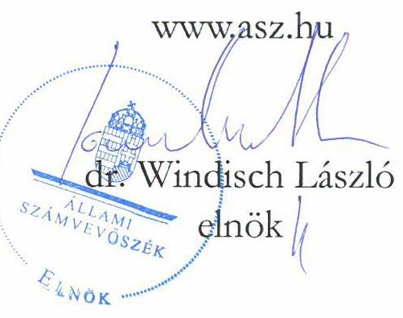

# JELENTÉS 

## Az állami vagyon feletti tulajdonosi joggyakorlással kapcsolatos tevékenységek ellenőrzése

Magyar Turisztikai Ügynökség Zártkörűen Múködő
Részvénytársaság,
Kisfaludy2030 Turisztikai Fejlesztő Nonprofit Zártkörűen Múködő
Részvénytársaság
2024.

24070
www.asz.hu

---

# JELENTÉS 

## Az állami vagyon feletti tulajdonosi joggyakorlással kapcsolatos tevékenységek ellenőrzése

Magyar Turisztikai Ügynökség Zártkörűen Müködő Részvénytársaság,
Kisfaludy2030 Turisztikai Fejlesztő Nonprofit Zártkörűen Müködő Részvénytársaság
2024.

24070

---

# ELLENŐRZÉSI IGAZGATÓSÁG: 

## ÁLLAMI VAGYONGAZDÁLKODÁST ELLENŐRZŐ IGAZGATÓSÁG

## ELLENŐRZÉSI IGAZGATÓ:

HERCZEGH ZSOLT ellenőrzési igazgató

## ELLENŐRZÉSVEZETŐ:

Jelentéseink az interneten a www.asz.hu címen olvashatók.

PENCZ MÁRIA ellenőrzésvezető

IKTATÓSZÁM: EL-3952-006/2024.
TÉMASZÁM: 2710
ELLENŐRZÉS-AZONOSÍTÓ SZÁM: V-1054

---

# TARTALOMJEGYZÉK 

AZ ELLENŐRZÉS ALAPADATAI ..... 5
ELLENŐRZÓTT SZERVEZETEK ..... 7
ÖSSZEFOGLALÁS ..... 8
AZ ELLENŐRZÉS FÓKUSZTERÜLETEI ..... 10
MEGÁLLAPÍTÁSOK ..... 11
MELLÉKLETEK ..... 15
I. sz. melléklet: Értelmező szótár ..... 15
II. sz. melléklet: Az ellenőrzött szervezetek jegyzéke ..... 17
III. sz. melléklet: Ellenőrzési kritériumok ..... 18
FÜGGELÉK: ÉSZREVÉTELEK ..... 19
RÖVIDÍTÉSEK JEGYZÉKE ..... 20

---

.

---

# AZ ELLENŐRZÉS ALAPADATAI 

## AZ ELLENŐRZÉS CÉLJA

Az ellenőrzés célja annak értékelése volt, hogy az állam tulajdonosi jogait gyakorló szervezet tulajdonosi joggyakorlása megfelelt-e a vonatkozó jogszabályok előírásainak.

## AZ ELLENŐRZÉS TÍPUSA

Megfelelőségi ellenőrzés

## AZ ELLENŐRZÖTT IDŐSZAK

A 2022. év. A 2022. évi számviteli törvény szerinti beszámoló elfogadását érintő döntések vonatkozásában a 2023. január 01-jétől 2023. május 31-ig tartó időszak.

## AZ ELLENŐRZÉS TÁRGYA

Az ellenőrzés tárgya az állami vagyon körébe tartozó részesedések feletti, a Magyar Állam nevében történő tulajdonosi joggyakorlással összefüggő tevékenységek ellenőrzése volt. Az ÁSZ ${ }^{1}$ a tulajdonosi joggyakorlás tényleges megvalósulását, teljeskörűségét a joggyakorlás alá tartozó gazdasági társaság állóeszközgazdálkodásának ellenőrzése keretében értékelte.

A gazdasági társaságnál - elsősorban annak állóeszköz-gazdálkodásán keresztül - az ÁSZ azt ellenőrizte, hogy a tulajdonos által előírt kötelezettségeket szabályszerűen teljesítette-e, továbbá, hogy a tulajdonosi joggyakorló a tulajdonosi tevékenységével hozzájárult-e az irányítása alatt álló gazdasági társaság szabályszerű és felelős gazdálkodásához.

Az ellenőrzés kiterjedt - a tulajdonosi joggyakorló joggyakorlása alatt álló gazdasági társaság állóeszközgazdálkodásán keresztül - annak értékelésére, hogy a tulajdonosi joggyakorlási tevékenység támogatta-e a tulajdonosi joggyakorlással érintett gazdasági társaság vagyonmegőrzési tevékenységét és az állami vagyonnal való felelős gazdálkodását. Az ellenőrzés kiterjedt a tulajdonosi joggyakorlás ellenőrzött időszakban hatályos belső szabályozási és ellenőrzési rendszere kialakításának és működtetésének ellenőrzésére, valamint a vonatkozó döntési és végrehajtási folyamatok értékelésére. Az ellenőrzés kiterjedt továbbá a tulajdonosi joggyakorló joggyakorlása alatt álló gazdasági társaság állóeszközzel való gazdálkodásának szabályszerűségére, valamint az ellenőrzött időszak állóeszköz gazdálkodásával összefüggésben hozott döntések megalapozottságára, célszerűségére, valamint ezzel összefüggésben az állami vagyon értékének megőrzésére, védelmére, az állami vagyonnal való felelős gazdálkodás érvényesülésére.

Az ellenőrzés kiterjedt minden olyan körülményre és adatra, amely az ÁSZ jogszabályban meghatározott feladatainak teljesítéséhez, valamint a program végrehajtása folyamán felmerült újabb összefüggések feltárásához szükséges volt.

---

# Az ellenőrzés jogsalapja 

Az ellenőrzés jogszabályi alapját az ÁSZ tv. ${ }^{2}$ 5. $\$ 4$ bekezdésének, valamint a Vtv. ${ }^{3}$ 3. $\$ 4$ bekezdésének előírásai képezték.

## AZ ELLENŐRZÉS MÓDSZERE

Az ellenőrzés végrehajtása a nemzetközi standardokat irányadónak tekintve az ellenőrzési program szempontjai, az ellenőrzött időszakban hatályos jogszabályok, az ellenőrzés szakmai szabályok és módszertanok figyelembevételével történt.

Az ellenőrzési kérdések megválaszolásához szükséges bizonyítékok megszerzése az ellenőrzött szervezet által rendelkezésre bocsátott dokumentumokra és adatokra alapozva, továbbá szemrevételezés, kérdésfeltevés (információkérés), elemző eljárás és mintavétel útján történt.

Az ellenőrzés lefolytatásához az ellenőrzött szervezet tanúsítvány kitöltésével, valamint az ÁSZ által kért dokumentumok, adatok, információk megküldésével szolgáltatott adatokat. Az ellenőrzéshez az ÁSZ felhasználta a nyilvánosan elérhető közhiteles adatokat is.

Az ellenőrzési bizonyítékként felhasználható adatforrások közé tartoztak az ellenőrzési program részletes szempontjainál felsorolt adatforrások, valamint minden egyéb - az ellenőrzés folyamán feltárt, az ellenőrzés szempontjából releváns információt tartalmazó - dokumentum.

Az ÁSZ a tanúsítványi adatszolgáltatás alapján mintavételi eljárással kiválasztott tíz növekedési és egy csökkenési mintatétel alapján ellenőrizte a gazdasági társaság állóeszköz-gazdálkodásának megfelelőségét. A mintavételi eljárással érintett ellenőrzési területek értékelését további ellenőrzési szempontok is támogatták.

Az ellenőrzést az ÁSZ szabályszerűségi és célszerűségi szempontok alapján folytatta le. A tények feltárása és azok összegzése során a gazdasági társaság állóeszköz gazdálkodásával kapcsolatos megállapítások az ellenőrzött mintatételekre vonatkozóan kerültek megfogalmazásra.

Az ellenőrzés kitért minden olyan körülményre, amely a program végrehajtása kapcsán felmerült és az ellenőrzés céljával összhangban volt.

---

# ELLENŐRZÖTT SZERVEZETEK

Az állami vagyon feletti tulajdonosi joggyakorlással kapcsolatos tevékenységek ellenőrzésének kötelezettségét a Vtv. és az ÁSZ tv. is előírja az ÁSZ számára.

Az ÁSZ tv.-ben rögzített előírás alapján az ÁSZ ellenőrzése kiterjedt a Magyar Állam nevében tulajdonosi jogokat gyakorló MTÜ Zrt.4-re és a joggyakorlása alatt álló Kisfaludy2030 Zrt.5-re.

**AZ MTÜ ZRT.** a Magyar Állam tulajdonában álló, a turisztikai ágazat kormányzati szervezete. Az MTÜ Zrt. fő feladatai közé tartozik a turizmusfejlesztés irányítása és stratégiájának meghatározása. Emellett országos szinten koordinálja a turizmusmarketinget, beleértve a magyarországi turisztikai márkarendszer kialakításával kapcsolatos feladatokat és a belföldi, illetve nemzetközi marketing és kommunikációs tevékenységet is. Az egyes állami tulajdonban álló gazdasági társaságok felett az államot megillető tulajdonosi jogok és kötelezettségek összességét gyakorló személyek kijelöléséről szóló 1/2018. (VI. 25.) NVTNM rendelet6 3. § és a 3. melléklet I.3. pontja, illetve 2022. május 26-tól az 1/2022. (V. 26.) GFM rendelet7 3. § és a 3. melléklet I.2. pontja alapján az MTÜ Zrt. gyakorolja az államot megillető tulajdonosi jogok és kötelezettségek összességét a Kisfaludy2030 Zrt. felett. Az MTÜ Zrt. központi kormányzati alszektorba besorolt szervezet és a Taktv.8 alapján az ellenőrzött időszakban a Gbkr.9 hatálya alá tartozott.

**A KISFALUDY2030 ZRT.** 2017. január 18-án alakult, a Magyar Állam 100%-os tulajdonában álló, a kiemelt állami turisztikai beruházások megvalósítása céljából létrehozott, közhasznú jogállású, központi kormányzati alszektorba sorolt, nonprofit gazdasági társaság.

A Kisfaludy2030 Zrt. pályázati úton vagy pályázati rendszeren kívül, egyedi döntés vagy jogszabály alapján nyújt a turisztikai beruházásokhoz, fejlesztésekhez költségvetési, illetve európai uniós forrásokból származó támogatásokat. Továbbá a Nemzeti Turizmusfejlesztési Stratégia 2030-ban megfogalmazott célok megvalósításával hozzájárul az egyes turisztikai kínálati elemek minőségének javításához, kapacitásaik bővítéséhez, valamint elősegíti piacra jutásukat. A Kisfaludy2030 Zrt. az ellenőrzött időszakban a Taktv. alapján nem tartozott a Gbkr. hatálya alá, azonban központi kormányzati alszektorba besorolt szervezetként a Bkr.10 hatálya alá tartozott. A Kisfaludy2030 Zrt. 2022. évi beszámolójának kiemelt adatait az 1. táblázat tartalmazza.

*1. táblázat*

|  Ellenőrzött szervezet | A 2022. évi beszámoló kiemelt adatai (exer Ft-ban) |   |
| --- | --- | --- |
|  Általudy Zrt. | Értékesítés nettó árbevétele | 128 000  |
|   | Adózott eredmény | 7 000  |
|   | Immateriális javak | 7 939 000  |
|   | Tárgyi eszközök | 848 000  |
|   | Mérlegfőösszeg | 311 957 000  |
|   | Átlagos létszám (fő) | 49  |

*Forrás: a Kisfaludy2030 Zrt. 2022. évi beszámolójja*

---

# ÖSSZEFOGLALÁS 

A nemzeti vagyon meghatározó részét képező állami vagyonnal való gazdálkodás szabályozási rendszere sokrétű. Az állami tulajdonban álló részesedések feletti tulajdonosi joggyakorlásra vonatkozó általános szabályokat az Nvtv. ${ }^{11}$, a Vtv., a további részletszabályokat a Vtv.vhr. ${ }^{12}$ tartalmazza.

Az Nvtv. meghatározza a nemzeti vagyon alapvető rendelteltését, és kimondja, hogy a nemzeti vagyonnal felelős módon kell gazdálkodni. A Vtv. szerint a tulajdonosi joggyakorlás és az állami vagyonnal való gazdálkodás alapvető feladata a vagyon rendeltetésszerü, hatékony és felelős felhasználásának biztosítása az állami vagyon értékének megőrzése, gyarapítása érdekében.

A részesedésekben megtestesülö állami vagyon értékének megörzésére, növelésére alapvető befolyást gyakorol a gazdasági társaságok gazdálkodási tevékenysége.

Az állami tulajdonú gazdasági társaságok esetében a tulajdonosi joggyakorlás az államot, mint tulajdonost megillető jogoknak és kötelezettségeknek a gyakorlását jelenti. Az államot megillető társasági részesedések a nemzeti vagyon részét képezik és legfőbb rendeltetésük a közfeladatok ellátása. A nemzeti vagyonnal való felelős gazdálkodás körében kiemelten fontos szerepe van az állami tulajdonú gazdasági társaságok vezetői által meghozott, gazdálkodással összefüggő döntéseknek, továbbá a társaság múködésében meghatározó döntések szabályszerűségi, megalapozottsági és célszerűségi szempontból történő értékelésének. A felelős vagyongazdálkodás elveinek érvényesülése érdekében fontos továbbá a társaságok gazdálkodásával kapcsolatosan felmerülő kockázatok folyamatos értékelése, és olyan kontrollrendszer kialakítása, amely alkalmas a kockázatok minimalizálására és a meghozott döntések hatásainak nyomon követésére.

Az állam nevében tulajdonosi jogokat gyakorló szervezetek a tulajdonosi joggyakorlásuk alá tartozó gazdasági társaságoknál kötelesek érvényesíteni az ügyvezetés felelősségét, valamint a közérdek érvényesülését biztosító vagyongazdálkodást. A megfelelő tulajdonosi ellenőrzés és a felügyelőbizottságok társaságok feletti tulajdonosi felügyelete fontos szerepet tölt be a gazdasági társaságok állami vagyonnal való felelős gazdálkodásában.

AZ MTÜ ZRT. tulajdonosi joggyakorlása megfelelt a jogszabályi előírásoknak. A tulajdonosi joggyakorlás kereteinek kialakítása és múködtetése alkalmas volt a Magyar Állam tulajdonosi érdekeinek érvényesítésére. Az MTÜ Zrt. a tulajdonosi kontrollok rendszerét a tulajdonosi érdekekhez igazodóan alakította ki. A legfontosabb tulajdonosi kontrollok közé tartozott a meghatározott értékhatár feletti kötelezettségvállalásokhoz kapcsolódó jogok saját hatáskörbe vonása, továbbá a Kisfaludy2030 Zrt. gazdálkodásának nyomon követését, és a megalapozott tulajdonosi döntések meghozatalát biztosító rendszeres beszámolási és tájékoztatási kötelezettség előírása a Kisfaludy2030 Zrt. részére. Az ellenőrzött időszakban az MTÜ Zrt. által - a Kisfaludy2030 Zrt. feletti tulajdonosi joggyakorlása körében - hozott döntések szabályszerűek és megalapozottak voltak. Az MTÜ Zrt. határozatait az $\mathrm{FB}^{13}$ javaslatának figyelembevételével hozta. Az MTÜ Zrt. tulajdonosi joggyakorlási tevékenysége hozzájárult a Kisfaludy2030 Zrt. állami vagyonnal való felelős gazdálkodásához. Az MTÜ Zrt. az Infotv. ${ }^{14}$, a Taktv. és a Számv. tv. ${ }^{15}$ szerinti közzétételi kötelezettségének eleget tett.

A KISFALUDY2030 ZRT. múködési és gazdálkodási kereteit a jogszabályok, valamint az Alapszabály ${ }^{16}$ előírásainak megfelelően alakította ki. A Kisfaludy2030 Zrt. állóeszközgazdálkodásának és a tulajdonosi joggyakorló felé teljesítendő beszámolók, adatszolgáltatások teljesítésének hatásköri és felelőségi viszonyai rögzítettek voltak. A Kisfaludy2030 Zrt. rendelkezett a Számv. tv.-ben kötelezően előírt belső szabályzatokkal,

---

amelyek rendelkezései a felelős gazdálkodás elvének érvényesülését támogatták. A Kisfaludy2030 Zrt. a belső szabályzataiban foglaltakat megfelelően alkalmazta. A Kisfaludy2030 Zrt. az MTÜ Zrt. felé a negyedéves beszámolási kötelezettségeit, valamint az értékhatárhoz kötött tájékoztatási kötelezettségeit az Alapszabályban, valamint az Alapítói határozatban foglaltaknak megfelelően, szabályszerűen teljesítette. Az adatszolgáltatásokban szereplő adatok részletesen mutatták be a Kisfaludy2030 Zrt. tevékenységét és gazdálkodását, likviditási helyzetét és az időarányos tény adatokat, azok alkalmasak voltak a tulajdonosi döntések megalapozására. A Kisfaludy2030 Zrt.-nél működő FB tevékenységével támogatta az MTÜ Zrt. tulajdonosi döntéseit. A mintatételként kiválasztott, állóeszköz változásokkal kapcsolatos döntések szabályszerűek és megalapozottak voltak, a döntéshozatal során érvényesült a célszerűség követelménye. Az előterjesztések tartalmaztak minden szükséges adatot, információt a megalapozott döntésekhez. A döntéseket az Alapszabályban előírt értékhatároknak megfelelő döntéshozó hozta, azok a Kisfaludy2030 Zrt. tevékenységével és céljaival összhangban voltak. Az állóeszköz-változások számviteli elszámolása megfelelt a Számv. tv. előírásainak. A Kisfaludy2030 Zrt. az Infotv., valamint a Taktv. és a Számv. tv. által előírt közzétételi kötelezettségeinek eleget tett.

---

# AZ ELLENŐRZÉS FÓKUSZTERÜLETEI 

Az állam tulajdonosi jogait gyakorló szervezet állami tulajdonban lévő gazdasági társaság feletti tulajdonosi joggyakorlással kapcsolatos tevékenységének megfelelősége.

2 A tulajdonosi joggyakorlás alá tartozó állami tulajdonú gazdasági társaság állóeszközökkel való gazdálkodásának megfelelősége, a gazdálkodási döntések szabályszerüsége, megalapozottsága és célszerüsége, valamint a felelős gazdálkodás elvének érvényesülése.

---

# MEGÁLLAPÍTÁSOK 

## 1. Az állam tulajdonosi jogait gyakorló szervezet állami tulajdonban lévő gazdasági társaság feletti tulajdonosi joggyakorlással kapcsolatos tevékenységének megfelelősége.

Összegző megállapítás: Az MTÜ Zrt. Kisfaludy2030 Zrt. feletti tulajdonosi joggyakorlással kapcsolatos tevékenysége megfelelő volt, hozzájárult az állami vagyonnal való felelős gazdálkodás elveinek érvényesüléséhez.

AZ MTÜ ZRT. a Kisfaludy2030 Zrt. Alapszabályában a Ptk. ${ }^{17}$ és a Taktv. előírásaival összhangban meghatározta a tulajdonosi jogok gyakorlásának kereteit, kialakította a Kisfaludy2030 Zrt. beszámoltatásának rendszerét.
Az MTÜ Zrt. a Kisfaludy2030 Zrt. Alapszabályában a Ptk.-ban előírt jogokon és kötelezettségeken felül saját hatáskörbe vonta - többek között - az alábbi, állóeszközgazdálkodás szempontjából releváns jogköröket:

- a Kisfaludy2030 Zrt. tulajdonában álló tárgyi eszközök, egyéb vagyonelemek tulajdonjoga bármely jogcímen történő átruházásának, megterhelésének vagy azokra ilyen jogügyletet eredményező jog alapításának engedélyezése, amennyiben a jogügyletben érintett vagyon értéke az 50 M Ft-ot eléri vagy meghaladja,
- a Kisfaludy2030 Zrt. tulajdonában álló ingatlanok bármely jogcímen történő átruházásának, megterhelésének vagy azokra ilyen jogügyletet eredményező jog alapításának engedélyezése,
- az 1000 M Ft-ot elérő vagy meghaladó kötelezettségvállalásokról való döntés,
- bármilyen hitelfelvételről történő döntés.

Az MTÜ Zrt. a tulajdonosi joggyakorlásával kapcsolatos feladatokat és hatásköröket a Gbkr. előírásával összhangban az MTÜ SZMSZ ${ }^{18}$-ében határozta meg, amely során - többek között - előírta, hogy a tulajdonosi joggyakorlási feladatok ellátásával megbízott Portfóliókezelési Igazgatósága, 2022. szeptember 29-től a Jogi és Beszerzési Igazgatóság évente legalább egyszer ellenőrizze a Kisfaludy2030 Zrt. FB-jének múködését. Az MTÜ Zrt. az MTÜ SZMSZ 41. u) pontjában előírtak ellenére a Kisfaludy Zrt. FB-jének múködését nem ellenőrizte a 2022. évben.
Az MTÜ Zrt. által kialakított szabályozási rendszer alkalmas volt a szabályszerű tulajdonosi joggyakorlói tevékenység végzéséhez, mert a Kisfaludy2030 Zrt. gazdálkodásához, tevékenységeihez, kockázataihoz igazítottan határozta meg a tulajdonosi joggyakorlással összefüggő jogokat és kötelezettségeket.
Az MTÜ Zrt. elé kerülő előterjesztéseket az FB a Ptk. előírásaival összhangban előzetesen megvizsgálta és határozatba foglalta az előterjesztések vizsgálatának eredményét, illetve javaslatát az abban foglaltak elfogadására vonatkozóan. Az előterjesztések tartalmazták a megalapozott döntéshez szükséges információkat. Az MTÜ Zrt. határozatait az FB javaslatának figyelembevételével hozta meg.

---

Az MTÜ Zrt. a Kisfaludy2030 Zrt. Alapszabályában előírta a vezérigazgató számára az FB és az MTÜ Zrt. felé történő beszámolási kötelezettséget, valamint meghatározott értékhatár felett az MTÜ Zrt. tájékoztatásának kötelezettségét. Az MTÜ Zrt. a 2022. évben az Alapszabályban, valamint a 28/2021. (XII.16.) számú Alapítói határozatban évente egyszeri, illetve rendszeres adatszolgáltatást kért a Kisfaludy2030 Zrt.-től. A Kisfaludy2030 Zrt.-nek negyedéves beszámolási kötelezettsége volt gazdálkodásáról és működéséről. A Kisfaludy2030 Zrt.-nek ezen túl az Alapszabályban foglaltaknak megfelelően tájékoztatási kötelezettsége volt a 100 M Ft -ot elérő vagy meghaladó kötelezettségvállalásokról. Az MTÜ Zrt. által kialakított adatszolgáltatási rendszer biztosította a Kisfaludy2030 Zrt.-re vonatkozó megalapozott döntésekhez szükséges adatok, információk rendelkezésre állását, valamint a Kisfaludy2030 Zrt. gazdálkodásának, pénzügyi, vagyoni helyzetének folyamatos nyomon követését.
Az MTÜ Zrt. az Alapszabályban foglaltaknak megfelelően Alapítói határozatban döntött - többek között - a Kisfaludy2030 Zrt. 2021. és 2022. évi számviteli beszámolóinak elfogadásáról, a Kisfaludy2030 Zrt. SZMSZ ${ }^{19}$-ének, Számviteli politikájának ${ }^{20}$, Beszerzési ${ }^{21}$, Közbeszerzési szabályzatainak ${ }^{22}$, az üzleti, valamint közbeszerzési tervének jóváhagyásáról. A számviteli beszámolók elfogadását megelőzően a Kisfaludy2030 Zrt. FB-a az MTÜ Zrt. elé kerülő előterjesztéseket a Ptk. előírásaival összhangban előzetesen véleményezte. Az MTÜ Zrt. a 2022. év folyamán öt esetben az Alapszabály előírásával összhangban döntött az 1000 M Ft -ot elérő vagy meghaladó kötelezettségvállalásokról.
Az MTÜ Zrt. az Infotv., a Taktv.és a Számv. tv. szerinti közzétételi kötelezettségének eleget tett.

# 2. A tulajdonosi joggyakorlás alá tartozó állami tulajdonú gazdasági társaság állóeszközökkel való gazdálkodásának megfelelősége, a gazdálkodási döntések szabályszerűsége, megalapozottsága és célszerűsége, valamint a felelős gazdálkodás elvének érvényesülése. 

Összegző megállapítás: A Kisfaludy2030 Zrt. állóeszközökkel való gazdálkodása megfelelő volt, a vonatkozó döntések szabályszerűek, megalapozottak és célszerűek voltak, érvényesült a felelős gazdálkodás elve.

A GAZDÁLKODÁSI ÉS MŰKÖDÉSI KERETEIT a Kisfaludy2030 Zrt. a Ptk., a Számv. tv. és az Alapszabályban foglaltaknak megfelelően alakította ki.
Az ellenőrzött időszakban hatályos Alapszabály előírása szerint a vezérigazgató az állóeszközgazdálkodás szempontjából releváns alábbi területeken volt jogosult dönteni:

- a 100 M Ft -ot el nem érő kötelezettségvállalást tartalmazó jogügyletekről,
- minden olyan jogügyletről, amelyhez kapcsolódó kötelezettségvállalás értéke eléri vagy meghaladja a 100 M Ft -ot, de nem éri el az 1000 M Ft -ot az MTÜ Zrt. előzetes értesítése mellett.
A Kisfaludy2030 Zrt. az előírt adatszolgáltatásokat az ellenőrzött időszakban szabályszerűen teljesítette, tájékoztatási kötelezettségének eleget tett. Ennek keretében beszámolt az MTÜ Zrt.-nek a gazdálkodásáról, szakmai tevékenységéről, likviditási és tőkehelyzetéről, mérleg, eredménykimutatás

---

adatairól, a támogatási szerződései aktuális állásáról, továbbá tizennégy esetben tájékoztatta az MTÜ Zrt-t a 100 M Ft-ot elérő vagy azt meghaladó kötelezettségvállalásairól. A Kisfaludy 2030 Zrt. egyszeri adatszolgáltatásként többek között a beszámolót, illetve az üzleti jelentést küldte meg az MTÜ Zrt.-nek. A negyedéves jelentéseket az Alapszabály előírása szerint az FB véleményezte. A Kisfaludy2030 Zrt. által teljesített adatszolgáltatások és tájékoztatások biztosították az MTÜ Zrt. számára a megalapozott döntésekhez szükséges információt.
A Kisfaludy2030 Zrt. a Ptk. előírásainak megfelelően rendelkezett SZMSZ-szel, amelyben meghatározta a tulajdonosi joggyakorló felé történő adatszolgáltatások felelőseit.
A Kisfaludy2030 Zrt. rendelkezett a Számv.tv. által előírt hatályos Számviteli politikával, Eszközök és a források leltárkészítési és leltározási szabályzatával ${ }^{23}$, Eszközök és a források értékelési szabályzatával ${ }^{24}$, Pénzkezelési szabályzattal ${ }^{25}$, Számlarenddel ${ }^{26}$. Számviteli szabályzatai a Számv. tv.-ben foglaltakkal összhangban tartalmazták az állóeszközök nyilvántartásainak és számviteli elszámolásainak előírásait. A Kisfaludy2030 Zrt. a Kbt. ${ }^{27}$ és az Alapszabály előírásainak megfelelően rendelkezett többek között Gazdálkodási ${ }^{28}$, Selejtezési ${ }^{29}$, Beszerzési, Közbeszerzési és Javadalmazási szabályzattal ${ }^{30}$, valamint Informatikai ${ }^{31}$ szabályzattal. A Kisfaludy2030 Zrt. gazdálkodását és múködési kereteit meghatározó szabályzatokat az Alapszabály előírásával összhangban az MTÜ Zrt. jóváhagyta.
A Kisfaludy2030 Zrt.-nél az ellenőrzött időszakban az Alapszabály előírásával összhangban 3 tagú FB működött. Az FB létrehozásával, működtetésével kapcsolatos, Alapszabályban rögzített rendelkezések a Ptk. és a Taktv. előírásainak megfeleltek. Az FB az Alapszabályban foglaltaknak megfelelően rendelkezett az MTÜ Zrt. által jóváhagyott Ügyrend ${ }^{32}$-del. Az ellenőrzött időszakban az FB tevékenységével támogatta az MTÜ Zrt. tulajdonosi döntéseit.
A Kisfaludy2030 Zrt. a Számv. tv. előírásainak megfelelően elkészítette a 2022. évre vonatkozó számviteli beszámolóját. A 2022. évi beszámolót az FB megtárgyalta és elfogadásra javasolta.
A Kisfaludy2030 Zrt. az Infotv., valamint a Taktv. és a Számv. tv. által előírt közzétételi kötelezettségeinek eleget tett.
AZ ÁLLÓESZKÖZ NÖVEKEDÉSSEL KAPCSOLATOS DÖNTÉSEK az ellenőrzött mintatételek - BAKTER és TÉRKÖ projektekhez kapcsolódó informatikai beruházások, beléptető pont kialakítás, biztonságtechnikai szolgáltatás beszerzés - vonatkozásában szabályszerűek, megalapozottak és célszerűek voltak. A beszerzések szükségessége, indokoltsága bizonyított volt, amit stratégiai terv, megvalósíthatósági tanulmány, illetve a Kisfaludy2030 Zrt. feladatellátásával kapcsolatos egyéb iratok támasztottak alá. A beruházások a Kisfaludy2030 Zrt. tevékenységével és céljaival összhangban valósultak meg, társadalmi érdekeket szolgáltak. Az előterjesztések minden esetben tartalmazták a megalapozott döntéshez szükséges adatokat, információkat, a beruházás célját, indokait, pénzügyi forrását, a projektet megalapozó tanulmány rendelkezésre állt. A döntési eljárások során betartották az Alapszabály rendelkezéseit, a döntéseket az Alapszabályban előírt értékhatároknak megfelelő döntéshozó hozta. A beruházások alakulásáról a Kisfaludy2030 Zrt. a 28/2021. (XII.16.) számú Alapítói határozatban foglaltaknak megfelelően negyedéves beszámolások során rendszeresen tájékoztatta az MTÜ Zrt.-t.
A SZERZŐDÉSEK MEGKÖTÉSE ÉS TELJESÍTÉSE az ellenőrzött mintatételek vonatkozásában szabályszerű volt. A közbeszerzési eljárásokat az informatikai beszerzések tekintetében a 301/2018. (XII.27.) Korm. rendeletben ${ }^{33}$ foglaltaknak megfelelően a DKÜ ${ }^{34}$-n keresztül folytatták le, a szerződéseket a Kbt. előírásainak megfelelően a nyertes ajánlattevővel kötötték meg. A szerződések összhangban voltak a beruházásra meghozott döntéssel, továbbá tartalmazták a beruházás során meghatározott lényeges

---

feltételeket (szerződés tárgya, határidők, garanciák és biztosítékok). Az Alapszabály előírása szerint, a kötelezettségvállalásról a Kisfaludy2030 Zrt. - ahol szükséges volt - beszerezte az MTÜ Zrt. jóváhagyását, vagy tájékoztatta az MTÜ Zrt.-t.
AZ ÁLLÓESZKÖZ CSÖKKENÉSSEL KAPCSOLATOS DÖNTÉS az ellenőrzött mintatétel vagyoni értékű jog (licence) kivezetése - tekintetében szabályszerű, megalapozott és célszerű volt. A kivezetett eszköz korábbi beszerzésének célja a Kisfaludy2030 Zrt. feladatellátását szolgáló informatikai infrastruktúra rendelkezésre állása és annak költséghatékony, felhő alapú üzemeltetése volt. A licence felhasználására és ezt követően a számviteli nyilvántartásokból történő kivezetésére a Kisfaludy2030 Zrt. feladatellátásával összefüggésben került sor. A döntésre jegyzőkönyv alapján, az Alapszabályban foglaltaknak megfelelően a vezérigazgató jóváhagyásával került sor.
AZ ÁLLÓESZKÖZ-VÁLTOZÁSOK SZÁMVITELI ELSZÁMOLÁSA az ellenőrzött mintatételek vonatkozásában megfelelt a Számv. tv. és a belső szabályzatok előírásainak. Az állóeszköz növekedéssel kapcsolatos mintatételeket a Számv. tv. és a belső szabályzatok előírásainak megfelelően az immateriális javak és a beruházások között számolták el. Az állóeszköz csökkenés mintatétele esetében az eszköz könyvekből történő kivezetésére terven felüli értékcsökkenésként került sor, ami megfelelt a Számv. tv. előírásainak.

---

# MELLÉKLETEK 

## I. SZ. MELLÉKLET: ÉRTELMEZŐ SZÓTÁR

állami vagyon
állóeszköz
állóeszköz-gazdálkodás
felelős gazdálkodás
gazdasági társaság

A Vtv. alkalmazásában állami vagyonnak minősül:
a) az állam tulajdonában lévő dolog, valamint dolog módjára hasznosít-ható természeti erő;
b) az a) pont hatálya alá tartozó mindazon vagyon, amely vonatkozásában törvény az állam kizárólagos tulajdonjogát nevesíti;
c) az állam tulajdonában lévő tagsági jogviszonyt megtestesítő értékpapír, illetve az államot megillető egyéb társasági részesedés;
d) az államot megillető olyan immateriális, vagyoni értékkel rendelkező jogosultság, amelyet jogszabály vagyoni értékủ jogként nevesít;
e) az állam tulajdonában álló a befektetési vállalkozásokról és az árutőzsdei szolgáltatókról, valamint az általuk végezhető tevékenységek szabályairól szóló 2007. évi CXXXVIII. törvény szerinti pénzügyi eszköz,
f) azon országgyűlési képviselőről, aki más, Alaptörvényben nevesített közjogi tisztséget is betöltve közfeladatot lát el, e közfeladata ellátása körében vagy ezzel összefüggésben, költségvetési forrásból készített, szerzői vagy szomszédos jogi védelmet élvező műhöz vagy teljesítményhez, különösen kép-, illetve hangfelvételhez kapcsolódó, felhasználási szerződés útján vagy a szerzői jogról szóló törvény alapján megszerzett felhasználási engedély, illetve vagyoni jog.
(Forrás: Vtv. 1. § (2) bekezdése)
Az állóeszközök olyan eszközök, amelyek a társaság céljait hosszú távon szolgálják, egy éven túl a vállalkozás tulajdonában maradnak és szolgálják annak múködését. Az állóeszközök között szerepelnek az immateriális javak és tárgyi eszközök (ideértve a beruházásokat, felújításokat, működtetést, fenntartást és karbantartást, illetve az ezekhez kapcsolódó adott előlegek, valamint a vagyonkezelésbe vett eszközöket is).
(Forrás: ÁSZ definíció)
Az állóeszköz-gazdálkodás, mint a gazdasági társaság múködésének funkcionális részterülete magába foglalja az immateriális javakkal és tárgyi eszközökkel való gazdálkodást (ideértve a beruházásokat, felújításokat, működtetést, fenntartást és karbantartást, illetve az ezekhez kapcsolódó adott előlegek, valamint a vagyonkezelésbe vett eszközöket is) és a kapcsolódó költségeket, ráfordításokat, egyéb bevételeket (a támogatások kivételével).
(Forrás: ÁSZ definíció)
Az állami vagyon rendeltetésének megfelelő, - az állami feladatok ellátásához, a társadalmi szükségletek kielégítéséhez, valamint a Kormány gazdaságpolitikája megvalósításának elősegítéséhez szükséges, egységes elveken alapuló, önálló ágazatként megjelenő - hatékony, költségtakarékos, értékmegőrző, értéknövelő felhasználásának biztosítása érdekében történő gazdálkodás.
(Forrás: Vtv. 2. § (1) bekezdése)
A gazdasági társaságok üzletszerű közös gazdasági tevékenység folytatására, a tagok vagyoni hozzájárulásával létrehozott, jogi személyiséggel rendelkező vállalkozások, amelyekben a tagok a nyereségből közösen részesednek, és a veszteséget közösen viselik.
(Forrás: Ptk. 3:88. § (1) bekezdése)

---

létesítő okirat
nemzeti vagyon
többségi állami tulajdon
tulajdonosi joggyakorló
vagyongazdálkodás alapelvei

A jogi személy létrehozásáról a személyek szerződésben, alapító okiratban vagy alapszabályban szabadon rendelkezhetnek, a jogi személy szervezetét és müködési szabályait maguk állapíthatják meg.
(Forrás: Ptk. 3:4. § (1) bekezdés)
Nemzeti vagyonba tartozik:
a) az állam vagy a helyi önkormányzat kizárólagos tulajdonában álló dolgok,
b) az a) pont hatálya alá nem tartozó, az állam vagy a helyi önkormányzat tulajdonában lévő dolog,
c) az állam vagy a helyi önkormányzat tulajdonában lévő pénzügyi eszközök, továbbá az államot vagy a helyi önkormányzatot megillető társasági részesedések,
d) az államot vagy a helyi önkormányzatot megillető bármely vagyoni értékkel rendelkező jogosultság, amelyet jogszabály vagyoni értékủ jogként nevesít,
e) Magyarország határa által körbezárt terület feletti légtér,
f) az üvegházhatású gázok kibocsátási egységeinek kereskedelméről szóló törvény szerinti kibocsátási egység és légiközlekedési kibocsátási egység, valamint az ENSZ Éghajlat-változási Keretegyezménye és annak Kiotói Jegyzőkönyve végrehajtási keretrendszeréről szóló törvény szerinti kiotói egység,
g) állami vagy helyi önkormányzati fenntartású közgyűjtemény (muzeális intézmény, levéltár, közgyűjteményként működő kép- és hangarchívum, valamint könyvtár) saját gyűjteményében nyilvántartott kulturális javak körébe tartozó dolog, kivéve, ha a dolog más tulajdonában áll,
h) a régészeti lelet,
i) a nemzeti adatvagyon körébe tartozó állami nyilvántartások fokozottabb védelméről szóló törvény szerinti nemzeti adatvagyon.
(Forrás: Nvtv. 1. § (2) bekezdése)
Az állam tulajdonában lévő tagsági jogviszonyt megtestesítő értékpapír, illetve az állam tulajdonában lévő egyéb társasági részesedés, amennyiben a társaságban a Magyar Állam közvetlenül vagy közvetetten a szavazatok több mint felével rendelkezik.
(Forrás: ÁSZ definíció a Vtv. 1. § (2) bekezdés c) pontja és a Ptk. 8:2. § (1), (3)-(4) bekezdései alapján)
Aki a nemzeti vagyon felett az államot vagy a helyi önkormányzatot megillető tulajdonosi jogok és kötelezettségek összességének gyakorlására jogosult. (Forrás: Nvtv. 3. § (1) bekezdés 17. pont)
A nemzeti vagyon alapvető rendeltetése a közfeladat ellátásának biztosítása, ideértve a lakosság közszolgáltatásokkal való ellátását és e feladatok ellátásához szükséges infrastruktúra biztosítását. A nemzeti vagyonnal felelős módon, rendeltetésszerűen kell gazdálkodni.
A nemzeti vagyongazdálkodás feladata a nemzeti vagyon megőrzése, értékének és állagának védelme, rendeltetésének megfelelő, az állam, az önkormányzat mindenkori teherbíró képességéhez igazodó, elsődlegesen a közfeladatok ellátásához és a mindenkori társadalmi szükségletek kielégítéséhez szükséges, egységes elveken alapuló, átlátható, hatékony és költségtakarékos működtetése, értéknövelő használata, hasznosítása, gyarapítása, továbbá az állam vagy a helyi önkormányzat feladatának ellátása szempontjából feleslegessé váló vagyontárgyak elidegenítése, azzal, hogy a nemzeti vagyon megőrzése érdekében végzett bontás vagy átalakítás nem minősül az állag védelmi kötelezettség megszegésének.
(Forrás: Nvtv. 7. § (1)-(2) bekezdései)

---

# II. SZ. MELLÉKLET: AZ ELLENŐRZÖTT SZERVEZETEK JEGYZÉKE 

## ELLENŐRZÖTT SZERVEZET NEVE

Magyar Turisztikai Ügynökség Zártkörűen Működő Részvénytársaság
Kisfaludy2030 Turisztikai Fejlesztő Nonprofit Zártkörűen Müködő Részvénytársaság

---

# III. SZ. MELLÉKLET: ELLENŐRZÉSI KRITÉRIUMOK 

## FOKUSZTERÜLET

1. Az állam tulajdonosi jogait gyakorló szervezet állami tulajdonban lévő gazdasági társaság feletti tulajdonosi joggyakorlással kapcsolatos tevékenységének megfelelősége.

## ELLENÖRZÉSI KRITÉRIUMOK

Ptk. 3:4. §, 3:5. §, 3:21. § (3) bek., 3:24. § (1) bek., 3:26. § (1), (4) bek., 3:27. § (1) bek., 3:28. §, 3:35. §, 3:99/A. §, 3:102. §, 3:109. §, 3:120. (1)-(3) bek., 3:121. §, 3:122. §, 3:123. §, 3:270. §, 3:284. §

Taktv. 4. § (1)-(2) bek., 5. § (3) bek.
Gbkr. 4. § (1) bek. a) és c) pont
Nvtv. 7. § (1)-(2) bek.
Vtv. 2. § (1) bek.
Infotv. 37. § (1) bek., 1. melléklet
Számv. tv. 154. §
a gazdasági társaság létesítő okirata, a tulajdonosi joggyakorló belső szabályzatai, 28/2021. (XII.16.) számú Alapítói határozat
2. A tulajdonosi joggyakorlás alá tartozó állami tulajdonú gazdasági társaság állóeszközökkel való gazdálkodásának megfelelősége, a gazdálkodási döntések szabályszerűsége, megalapozottsága és célszerűsége, valamint a felelős gazdálkodás elvének érvényesülése.

Nvtv. 7. § (1) bek.,
Ptk. 3:4. § (1) bek., 3:21. § (1)-(3) bek., 3:109. § (2) bek., 3:112. § (2)-(3) bek., 3:270. § (1)-(3) bek., 6:58. §, 6:63. §, 6:191. §,
Számv. tv. 4. § (1) bek., 8. §, 12. § (1) bek., 14. §, 17. § (1) bek., 19. § (1) bek., 26. §., 47-53. §, 57-59. §, 69. §, 77. § (1) bek., (3). bek. e) pont, 81. § (3) bek. c) és e) pont, 154. §, 161. §, 161/A. §, 166. § (1) bek.

Kbt. 27. § (1) bek.
Infotv. 37. § (1) bek., 1. melléklet
Taktv. 2. §
301/2018. (XII.27.) Korm. rendelet
a gazdasági társaság létesítő okirata, belső szabályzatai, 28/2021. (XII.16.) számú Alapítói határozat

---

# FÜGGELÉK: ÉSZREVÉTELEK 

A jelentéstervezetet a Számvevőszék 15 napos észrevételezésre megküldte az ellenőrzött szervezet vezetőjének az ÁSZ tv. 29. §* (1) bekezdése előírásának megfelelően.

A jelentéstervezetben rögzített javaslatra az MTÜ Zrt. vezetője észrevételt tett, amely alapján a Számvevőszék a jelentést - a megállapítás fenntartása mellett - módosította.

[^0]
[^0]:    * 29. § (1) Az Állami Számvevőszék az ellenőrzési megállapításait megküldi az ellenőrzött szervezet vezetőjének vagy az általa megbízott személynek, és annak, akinek személyes felelősségét állapította meg.
    (2) Az ellenőrzött szervezet vezetője és a felelősként megjelölt személy az ellenőrzés megállapításaira tizenöt napon belül írásban észrevételt tehet.
    (3) Az Állami Számvevőszék az észrevételre a beérkezésétől számított harminc napon belül írásban válaszol. A figyelembe nem vett észrevételeket köteles a jelentésben feltüntetni, és megindokolni, hogy azokat miért nem fogadta el.

---

# RÖVIDÍTÉSEK JEGYZÉKE 

${ }^{1}$ ÁSZ
${ }^{2}$ ÁSZ tv.
${ }^{3}$ Vtv.
${ }^{4}$ MTÜ Zrt.
${ }^{5}$ Kisfaludy2030 Zrt.
${ }^{6}$ 1/2018. (VI. 25.) NVTNM rendelet
${ }^{7}$ 1/2022. (V. 26.) GFM rendelet
${ }^{8}$ Taktv.
${ }^{9}$ Gbkr.
${ }^{10}$ Bkr.
${ }^{11}$ Nvtv.
${ }^{12}$ Vtv.vbr.
${ }^{13} \mathrm{FB}$
${ }^{14}$ Infotv.
${ }^{15}$ Számv. tv.
${ }^{16}$ Alapszabály
${ }^{17}$ Ptk.
${ }^{18}$ MTÜ SZMSZ
${ }^{19}$ SZMSZ
${ }^{20}$ Számviteli politika

Állami Számvevőszék
2011. évi LXVI. törvény az Állami Számvevőszékről
2007. évi CVI. törvény az állami vagyonról

Magyar Turisztikai Ügynökség Zártkörűen Müködő Részvénytársaság
Kisfaludy2030 Turisztikai Fejlesztő Nonprofit Zártkörűen Müködő Részvénytársaság
1/2018. (VI. 25.) NVTNM rendelet az egyes állami tulajdonban álló gazdasági társaságok felett az államot megillető tulajdonosi jogok és kötelezettségek összességét gyakorló személyek kijelöléséről
1/2022. (V. 26.) GFM rendelet az egyes állami tulajdonban álló gazdasági társaságok felett az államot megillető tulajdonosi jogok és kötelezettségek összességét gyakorló személyek kijelöléséről
2009. évi CXXII. törvény a köztulajdonban álló gazdasági társaságok takarékosabb müködéséről
339/2019. (XII. 23.) Korm. rendelet a köztulajdonban álló gazdasági társaságok belső kontrollrendszeréről
370/2011. (XII. 31.) Korm. rendelet a költségvetési szervek belső kontrollrendszeréről és belső ellenőrzéséről
2011. évi CXCVI. törvény a nemzeti vagyonról

254/2007. (X.4.) Korm. rendelet az állami vagyonnal való gazdálkodásról
a Kisfaludy2030 Zrt. felügyelőbizottsága
2011. évi CXII. törvény az információs önrendelkezési jogról és az információszabadságról
2000. évi C. törvény a számvitelről

Kisfaludy2030 Turisztikai Fejlesztő Nonprofit Zártkörűen Müködő Részvénytársaság Alapszabálya (hatályos: 2022. április 7-ig)
Kisfaludy2030 Turisztikai Fejlesztő Nonprofit Zártkörűen Müködő Részvénytársaság Alapszabálya (hatályos: 2022. április 8-tól 2022. augusztus 24-ig)
Kisfaludy2030 Turisztikai Fejlesztő Nonprofit Zártkörűen Müködő Részvénytársaság Alapszabálya (hatályos: 2022. augusztus 25-től)
2013. évi V. törvény a Polgári Törvénykönyvről

26/2021.sz. vezérigazgatói utasítás a Szervezeti és Müködési Szabályzat kiadásáról (hatályos: 2021. december 1-jétől 2022. február 14-ig))
6/2022. sz. vezérigazgatói utasítás a Szervezeti és Müködési Szabályzat kiadásáról (hatályos: 2022. február 15-től 2022. május 8-ig)
16/2022. sz. vezérigazgatói utasítás a Szervezeti és Müködési Szabályzat kiadásáról (hatályos: 2022. május 9-től 2022. július 25-ig)
19/2022. sz. vezérigazgatói utasítás a Szervezeti és Müködési Szabályzat kiadásáról (hatályos: 2022. július 1-jétől 2022. július 25-ig)
5/2022. sz. Igazgatósági határozat a Szervezeti és Müködési Szabályzat kiadásáról (hatályos: 2022. július 26-től)
2/2022. (II. 16.) Vezérigazgatói utasítás a Társaság Szervezeti és Müködési Szabályzatáról (hatályos: 2022. február 15-től 2022. november 9-ig)
16/2022. (XI.10.) Vezérigazgatói utasítás a Társaság Szervezeti és Müködési Szabályzatáról (hatályos: 2022. november 10-től)
24/2021. (VIII. 12.) Vezérigazgatói utasítás a Társaság Számviteli politikájáról szóló 42/2020. (VIII. 14.) Vezérigazgatói utasítás módosításáról (hatályos: 2021. augusztus 12-től)

---

${ }^{21}$ Beszerzési szabályzat
${ }^{22}$ Közbeszerzési szabályzat
${ }^{23}$ Eszközök és a források leltárkészítési és leltározási szabályzata
${ }^{24}$ Eszközök és a források értékelési szabályzata
${ }^{25}$ Pénzkezelési szabályzat
${ }^{26}$ Számlarend
${ }^{27} \mathrm{Kbt}$.
${ }^{28}$ Gazdálkodási szabályzat
${ }^{29}$ Selejtezési szabályzat
${ }^{30}$ Javadalmazási szabályzat
${ }^{31}$ Informatikai szabályzat
${ }^{32}$ Ügyrend
${ }^{33}$ 301/2018. (XII.27.) Korm. rendelet
${ }^{34}$ DKÜ
15/2021. (V. 27.) Vezérigazgatói utasítás a Társaság Beszerzési és szerződéskötési szabályzatáról (hatályos: 2021. május 27-tól)
22/2021. (VII. 22.) Vezérigazgatói utasítás a Társaság Közbeszerzési szabályzatáról szóló 5/2021. (II. 25.) számú Vezérigazgatói utasítás módosításáról (hatályos: 2021. július 22-tól)
8/2020. (II. 12.) Vezérigazgatói utasítás a Kisfaludy2030 Zrt. Eszközök és Források Leltárkészítési és Leltározási szabályzatáról (hatályos: 2020. február 12-tól)
24/2021. (VIII. 12.) Vezérigazgatói utasítás a Társaság Eszközök és Források Értékelési szabályzatáról szóló 51/2020. (XII. 29.) Vezérigazgatói utasítás módosításáról (hatályos: 2021. augusztus 12-tól)
24/2021. (VIII. 12.) Vezérigazgatói utasítás a Társaság Számviteli politikájáról szóló 42/2020. (VIII. 14.) Vezérigazgatói utasítás módosításáról 2. számú melléklet Pénzkezelési szabályzat (hatályos: 2021. augusztus 12-tól)
42/2020. (VIII. 14.) Vezérigazgatói utasítás Számviteli politikáról 5. számú melléklete Számlarend (hatályos: 2020. augusztus 14-tól)
2015. évi CXLIII. törvény - a közbeszerzésekről
18/2022. (XI. 30.) Vezérigazgatói utasítás a Kisfaludy2030 Turisztikai Fejlesztő Nonprofit Zrt. gazdálkodási szabályzatáról szóló 24/2019. (XI. 19.) számú vezérigazgatói utasítás módosításáról szóló 28/2021. (IX. 20.) számú vezérigazgatói utasítás módosításáról (hatályos: 2022. november 23-tól)
7/2020. (II. 12.) Vezérigazgatói utasítás a Kisfaludy2030 Turisztikai Fejlesztő Nonprofit Zrt. Selejtezési szabályzatáról (hatályos: 2020. február 12-tól)
22/2019. (IX. 26.) Vezérigazgatói utasítás a Társaság Javadalmazási szabályzatáról (hatályos: 2019. szeptember 26-tól)
35/2020. (VII. 20.) Vezérigazgatói utasítás A felhasználók informatikai feladatiról, jogairól és kötelességeiről (hatályos: 2020. július 20-tól)
Kisfaludy2030 Zrt. Felügyelőbizottságának Ügyrendje (hatályos: 2020. április 6-tól)
a Nemzeti Hírközlési és Informatikai Tanácsról, valamint a Digitális Kormányzati Ügynökség Zártkörűen Működő Részvénytársaság és a kormányzati informatikai beszerzések központosított közbeszerzési rendszeréről szóló 301/2018. (XII.27.) Korm. rendelet
Digitális Kormányzati Ügynökség Zártkörűen Müködő Részvénytársaság

---

1052 Budapest, Apáczai Csere János u. 10. | 1364 Budapest 4., Pf. 54
www.asz.hu | szamvevoszek@asz.hu
telefon: +36 14849100