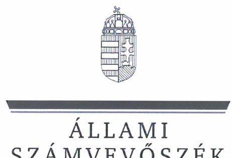
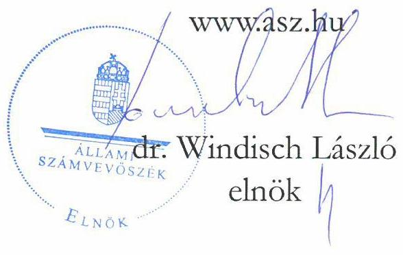
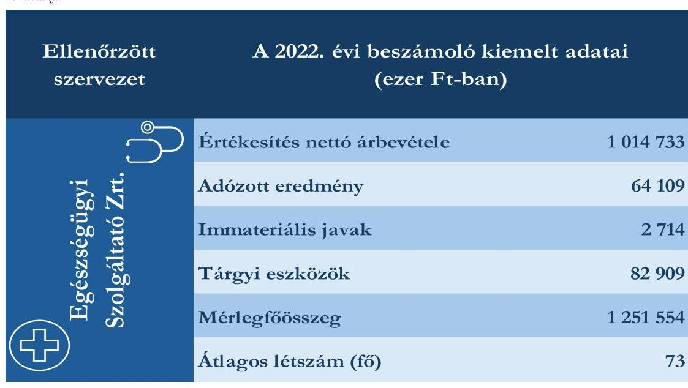

# JELENTÉS 

## Az állami vagyon feletti tulajdonosi joggyakorlással kapcsolatos tevékenységek ellenőrzése

Közbeszerzési és Ellátási Főigazgatóság,
Egészségügyi Szolgáltató Zártkörűen Működő Részvénytársaság

2024.

---

ÁLLAMI
SZÁMVEVŐSZÉK

# JELENTÉS 

## Az állami vagyon feletti tulajdonosi joggyakorlással kapcsolatos tevékenységek ellenőrzése

Közbeszerzési és Ellátási Főigazgatóság,
Egészségügyi Szolgáltató Zártkörűen Működő Részvénytársaság
2024.

24071

---

# ELLENŐRZÉSI IGAZGATÓSÁG: 

## ÁLLAMI VAGYONGAZDÁLKODÁST ELLENŐRZŐ IGAZGATÓSÁG

## ELLENŐRZÉSI IGAZGATÓ:

HERCZEGH ZSOLT ellenőrzési igazgató

## ELLENŐRZÉSVEZETŐ:

Jelentéseink az interneten a www.asz.hu címen olvashatók.

PENCZ MÁRIA ellenőrzésvezető

IKTATÓSZÁM: EL-3952-005/2024.
TÉMASZÁM: 2710
ELLENŐRZÉS-AZONOSÍTÓ SZÁM: V-1054

---

# TARTALOMJEGYZÉK 

AZ ELLENŐRZÉS ALAPADATAI ..... 5
ELLENŐRZÖTT SZERVEZETEK ..... 7
ÖSSZEFOGLALÁS ..... 8
AZ ELLENŐRZÉS FÓKUSZTERÜLETEI ..... 10
MEGÁLLAPÍTÁSOK ..... 11
JAVASLATOK ..... 15
MELLÉKLETEK ..... 16
I. sz. melléklet: Értelmező szótár ..... 16
II. sz. melléklet: Az ellenőrzött szervezetek jegyzéke ..... 18
III. sz. melléklet: Ellenőrzési kritériumok ..... 19
FÜGGELÉK: ÉSZREVÉTELEK ..... 20
RÖVIDÍTÉSEK JEGYZÉKE ..... 21

---

.

---

# AZ ELLENŐRZÉS ALAPADATAI 

## AZ ELLENŐRZÉS CÉLJA

Az ellenőrzés célja annak értékelése volt, hogy az állam tulajdonosi jogait gyakorló szervezet tulajdonosi joggyakorlása megfelelt-e a vonatkozó jogszabályok előírásainak.

## AZ ELLENŐRZÉS TÍPUSA

Megfelelőségi ellenőrzés

## AZ ELLENŐRZÖTT IDŐSZAK

A 2022. év. A 2022. évi számviteli törvény szerinti beszámoló elfogadását érintő döntések vonatkozásában a 2023. január 01-jétől 2023. május 31-ig tartó időszak.

## AZ ELLENŐRZÉS TÁRGYA

Az ellenőrzés tárgya az állami vagyon körébe tartozó részesedések feletti, a Magyar Állam nevében történő tulajdonosi joggyakorlással összefüggő tevékenységek ellenőrzése volt. Az ÁSZ ${ }^{1}$ a tulajdonosi joggyakorlás tényleges megvalósulását, teljeskörűségét a joggyakorlás alá tartozó gazdasági társaság állóeszközgazdálkodásának ellenőrzése keretében értékelte.

A gazdasági társaságnál - elsősorban annak állóeszköz-gazdálkodásán keresztül - az ÁSZ azt ellenőrizte, hogy a tulajdonos által előírt kötelezettségeket szabályszerűen teljesítette-e, továbbá, hogy a tulajdonosi joggyakorló a tulajdonosi tevékenységével hozzájárult-e az irányítása alatt álló gazdasági társaság szabályszerű és felelős gazdálkodásához.

Az ellenőrzés kiterjedt - a tulajdonosi joggyakorló joggyakorlása alatt álló gazdasági társaság állóeszközgazdálkodásán keresztül - annak értékelésére, hogy a tulajdonosi joggyakorlási tevékenység támogatta-e a tulajdonosi joggyakorlással érintett gazdasági társaság vagyonmegőrzési tevékenységét és az állami vagyonnal való felelős gazdálkodását. Az ellenőrzés kiterjedt a tulajdonosi joggyakorlás ellenőrzött időszakban hatályos belső szabályozási és ellenőrzési rendszere kialakításának és működtetésének ellenőrzésére, valamint a vonatkozó döntési és végrehajtási folyamatok értékelésére. Az ellenőrzés kiterjedt továbbá a tulajdonosi joggyakorló joggyakorlása alatt álló gazdasági társaság állóeszközzel való gazdálkodásának szabályszerűségére, valamint az ellenőrzött időszak állóeszköz gazdálkodásával összefüggésben hozott döntések megalapozottságára, célszerűségére, valamint ezzel összefüggésben az állami vagyon értékének megőrzésére, védelmére, az állami vagyonnal való felelős gazdálkodás érvényesülésére.

Az ellenőrzés kiterjedt minden olyan körülményre és adatra, amely az ÁSZ jogszabályban meghatározott feladatainak teljesítéséhez, valamint a program végrehajtása folyamán felmerült újabb összefüggések feltárásához szükséges volt.

---

# Az ellenőrzés jogalapja 

Az ellenőrzés jogszabályi alapját az ÁSZ tv. ${ }^{2}$ 5. § 4. bekezdésének, valamint a Vtv. ${ }^{3}$ 3. § 4. bekezdésének előírásai képezték.

## AZ ELLENŐRZÉS MÓDSZERE

Az ellenőrzés végrehajtása a nemzetközi standardokat irányadónak tekintve az ellenőrzési program szempontjai, az ellenőrzött időszakban hatályos jogszabályok, az ellenőrzés szakmai szabályok és módszertanok figyelembevételével történt.

Az ellenőrzési kérdések megválaszolásához szükséges bizonyítékok megszerzése az ellenőrzött szervezet által rendelkezésre bocsátott dokumentumokra és adatokra alapozva, továbbá szemrevételezés, kérdésfeltevés (információkérés), elemző eljárás és mintavétel útján történt.

Az ellenőrzés lefolytatásához az ellenőrzött szervezet tanúsítvány kitöltésével, valamint az ÁSZ által kért dokumentumok, adatok, információk megküldésével szolgáltatott adatokat. Az ellenőrzéshez az ÁSZ felhasználta a nyilvánosan elérhető közhiteles adatokat is.

Az ellenőrzési bizonyítékként felhasználható adatforrások közé tartoztak az ellenőrzési program részletes szempontjainál felsorolt adatforrások, valamint minden egyéb - az ellenőrzés folyamán feltárt, az ellenőrzés szempontjából releváns információt tartalmazó - dokumentum.

Az ÁSZ a tanúsítványi adatszolgáltatás alapján mintavételi eljárással kiválasztott tíz állomány-növekedési és tíz állomány-csökkenési mintatétel alapján ellenőrizte a gazdasági társaság állóeszköz-gazdálkodásának megfelelőségét. A mintavételi eljárással érintett ellenőrzési területek értékelését további ellenőrzési szempontok is támogatták.

Az ellenőrzést az ÁSZ szabályszerűségi és célszerűségi szempontok alapján folytatta le. A tények feltárása és azok összegzése során a gazdasági társaság állóeszköz gazdálkodásával kapcsolatos megállapítások az ellenőrzött mintatételekre vonatkozóan kerültek megfogalmazásra.

Az ellenőrzés kitért minden olyan körülményre, amely a program végrehajtása kapcsán felmerült és az ellenőrzés céljával összhangban volt.

---

# ELLENŐRZÖTT SZERVEZETEK 

Az állami vagyon feletti tulajdonosi joggyakorlással kapcsolatos tevékenységek ellenőrzésének kötelezettségét a Vtv. és az ÁSZ tv. is előírja az ÁSZ számára.

Az ÁSZ tv.-ben rögzített előírás alapján az ÁSZ ellenőrzése kiterjedt a Magyar Állam nevében tulajdonosi jogokat gyakorló KEF${ }^{4}$-re és a joggyakorlása alatt álló Egészségügyi Szolgáltató Zrt. ${ }^{5}$-re.

A KEF az államháztartásért felelős miniszter irányítása alá tartozó költségvetési szerv, amely a 250/2014. (X. 2.) Korm. rendelet ${ }^{6}$ alapján végzi a központosított közbeszerzési eljárások lebonyolítását, valamint a központosított közbeszerzési rendszer működtetését. A KEF, mint központi beszerző szervezet a 165/2020. (IV. 30.) Korm. rendelet ${ }^{7}$ alapján, annak 1. számú mellékletében nevesített egészségügyi fogyóeszközök központosított közbeszerzési feladatait 2020. május 1-jétől átvette az Állami Egészségügyi Ellátó Központtól. A 1725/2020. (X. 30.) Korm. határozat ${ }^{8}$ a KEF feladatkörébe utalta az állami fenntartású fekvőbeteg szakellátást nyújtó intézmények beszerzéseinek lebonyolítását. Ezen feladatait a KEF az Egészségügyi Szolgáltató Zrt.-n keresztül látja el.

AZ EGÉSZSÉGÜGYI SZOLGÁLTATÓ ZRT.-t 2009. január 29-én alapította Budapest Főváros Önkormányzata. Az Egészségügyi Szolgáltató Zrt. a 2011. évi CLIV. törvény ${ }^{9}$ 2. § (1) bekezdése alapján 2012. január 1-jén került a Magyar Állam kizárólagos tulajdonába. A Magyar Állam nevében az Egészségügyi Szolgáltató Zrt. felett a tulajdonosi jogokat 2020. december 25-től a 2012. évi XXXVIII. törvény ${ }^{10}$ 13/A. §-a alapján a KEF gyakorolja. Az Egészségügyi Szolgáltató Zrt. a KEF megbízásából végzi az egészségügyi vonatkozású közbeszerzési eljárások előkészítését és lebonyolítását, gyógyszerészeti és orvostechnikai szakértői feladatok elvégzését, továbbá a KEF és az Országos Kórházi Főigazgatóság részére logisztikai és üzemeltetési feladatokat lát el. Az Egészségügyi Szolgáltató Zrt. az ellenőrzött időszakban nem volt központi kormányzati alszektorba besorolt szervezet és a Taktv. ${ }^{11}$ alapján nem tartozott a Gbkr. ${ }^{12}$ hatálya alá. Az Egészségügyi Szolgáltató Zrt. 2022. évi beszámolójának kiemelt adatait az 1. táblázat tartalmazza.

## 1. táblázat

---

# ÖSSZEFOGLALÁS 

A nemzeti vagyon meghatározó részét képező állami vagyonnal való gazdálkodás szabályozási rendszere sokrétű. Az állami tulajdonban álló részesedések feletti tulajdonosi joggyakorlásra vonatkozó általános szabályokat az Nvtv. ${ }^{13}$, a Vtv., a további részletszabályokat a Vtv.vhr. ${ }^{14}$ tartalmazza.

Az Nvtv. meghatározza a nemzeti vagyon alapvető rendeltetését, és kimondja, hogy a nemzeti vagyonnal felelős módon kell gazdálkodni. A Vtv. szerint a tulajdonosi joggyakorlás és az állami vagyonnal való gazdálkodás alapvető feladata a vagyon rendeltetésszerű, hatékony és felelős felhasználásának biztosítása az állami vagyon értékének megőrzése, gyarapítása érdekében.

A részesedésekben megtestesülő állami vagyon értékének megőrzésére, növelésére alapvető befolyást gyakorol a gazdasági társaságok gazdálkodási tevékenysége.

Az állami tulajdonú gazdasági társaságok esetében a tulajdonosi joggyakorlás az államot, mint tulajdonost megillető jogoknak és kötelezettségeknek a gyakorlását jelenti. Az államot megillető társasági részesedések a nemzeti vagyon részét képezik és legfőbb rendeltetésük a közfeladatok ellátása. A nemzeti vagyonnal való felelős gazdálkodás érvényesítésében kiemelten fontos szerepe van az állami tulajdonú gazdasági társaságok vezetői által meghozott, gazdálkodással összefüggő döntéseknek, továbbá a társaság működésében meghatározó döntések szabályszerűségi, megalapozottsági és célszerűségi szempontból történő értékelésének. A felelős vagyongazdálkodás elveinek érvényesülése érdekében fontos továbbá a társaságok gazdálkodásával kapcsolatosan felmerülő kockázatok folyamatos értékelése, és olyan kontrollrendszer kialakítása, amely alkalmas a kockázatok minimalizálására és a meghozott döntések hatásainak nyomon követésére.

Az állam nevében tulajdonosi jogokat gyakorló szervezetek a tulajdonosi joggyakorlásuk alá tartozó gazdasági társaságoknál kötelesek érvényesíteni a cégvezetés felelősségét, valamint a közérdek érvényesülését biztosító vagyongazdálkodást. A megfelelő tulajdonosi ellenőrzés és a felügyelőbizottságok társaságok feletti tulajdonosi felügyelete fontos szerepet tölt be a gazdasági társaságok állami vagyonnal való felelős gazdálkodásában.

A KEF tulajdonosi joggyakorlása megfelelt a jogszabályi előírásoknak. A tulajdonosi joggyakorlás kereteinek kialakítása és működtetése alkalmas volt a Magyar Állam tulajdonosi érdekeinek érvényesítésére. A KEF a tulajdonosi kontrollok rendszerét a tulajdonosi érdekekhez igazodóan alakította ki. A legfontosabb tulajdonosi kontrollok közé tartozott az előzetes hozzájárulás a meghatározott értékhatár feletti kötelezettségvállalásokhoz, továbbá az Egészségügyi Szolgáltató Zrt. gazdálkodásának nyomon követését, és a megalapozott tulajdonosi döntések meghozatalát biztosító rendszeres jelentéstételi kötelezettség előírása az Egészségügyi Szolgáltató Zrt. részére. Emellett a KEF a tulajdonosi kontroll keretében a 2022. évben - a Bkr. előírása alapján elkészített éves belső ellenőrzési tervben foglaltaknak megfelelően - szabályszerűségi ellenőrzést végzett az Egészségügyi Szolgáltató Zrt.-nél. A jelentésben foglaltak alapján az Egészségügyi Szolgáltató Zrt. intézkedési tervet készített, amelynek végrehajtását a KEF nyomon követte. Az ellenőrzött időszakban a KEF tulajdonosi joggyakorlása keretében hozott döntései szabályszerűek, megalapozottak és célszerűek voltak. A KEF tulajdonosi döntéseit az FB${ }^{15}$ véleményének figyelembevételével hozta. A KEF tulajdonosi joggyakorlói tevékenysége hozzájárult az Egészségügyi Szolgáltató Zrt. állami vagyonnal való felelős gazdálkodásához. A KEF a rábízott vagyonra vonatkozó beszámoló Infotv. ${ }^{16}$ szerinti közzétételi kötelezettségének nem tett eleget.

AZ EGÉSZSÉGÜGYI SZOLGÁLTATÓ ZRT. gazdálkodási és működési kereteit a jogszabályok, valamint az Alapszabály ${ }^{17}$ előírásainak megfelelően alakította ki. Az Egészségügyi Szolgáltató Zrt.

---

állóeszközgazdálkodásának és a tulajdonosi joggyakorló felé teljesítendő beszámolók és jelentések teljesítésének hatásköri és felelősségi viszonyai rögzítettek voltak. Az Egészségügyi Szolgáltató Zrt. rendelkezett a jogszabályokban előírt belső szabályzatokkal, amelyek rendelkezései a felelős gazdálkodás elvének érvényesülését támogatták. Az Egészségügyi Szolgáltató Zrt. a KEF és az FB felé jelentéstételi kötelezettségeit, valamint az értékhatárhoz kötött, a KEF előzetes hozzájárulásának kérésére irányuló kötelezettségeit az Alapszabályban foglaltaknak megfelelően, szabályszerűen teljesítette. Az adatszolgáltatásokban bemutatták az Egészségügyi Szolgáltató Zrt. vagyoni, pénzügyi és jövedelmi helyzetére vonatkozó adatokat, azok alkalmasak voltak a tulajdonosi döntések megalapozására. Az Egészségügyi Szolgáltató Zrt.-nél működő FB tevékenységével támogatta a KEF tulajdonosi döntéseit. A mintatételként kiválasztott, állóeszköz változásokkal kapcsolatos döntések szabályszerűek és megalapozottak voltak, a döntéshozatal során érvényesült a célszerűség követelménye. Az előterjesztések tartalmazták a megalapozott döntéshozatalhoz szükséges információkat, a döntéseket az Alapszabályban előírt értékhatároknak megfelelő döntéshozó hozta, azok az Egészségügyi Szolgáltató Zrt. tevékenységével és céljaival összhangban voltak. Az állóeszköz-változások számviteli elszámolása megfelelt a Számv. tv. előírásainak. Az Egészségügyi Szolgáltató Zrt. az Infotv., a Taktv. és a Számv. tv. által előírt közzétételi kötelezettségeinek eleget tett.

---

# AZ ELLENŐRZÉS FÓKUSZTERÜLETEI 

Az állam tulajdonosi jogait gyakorló szervezet állami tulajdonban lévő gazdasági társaság feletti tulajdonosi joggyakorlással kapcsolatos tevékenységének megfelelősége.

2 A tulajdonosi joggyakorlás alá tartozó állami tulajdonú gazdasági társaság állóeszközökkel való gazdálkodásának megfelelősége, a gazdálkodási döntések szabályszerűsége, megalapozottsága és célszerűsége, valamint a felelős gazdálkodás elvének érvényesülése.

---

# MEGÁLLAPÍTÁSOK 

## 1. Az állam tulajdonosi jogait gyakorló szervezet állami tulajdonban lévő gazdasági társaság feletti tulajdonosi joggyakorlással kapcsolatos tevékenységének megfelelősége

Összegző megállapítás A KEF Egészségügyi Szolgáltató Zrt. feletti tulajdonosi joggyakorlással kapcsolatos tevékenysége megfelelő volt, hozzájárult az állami vagyonnal való felelős gazdálkodás elveinek érvényesüléséhez.

A KEF az SZMSZ ${ }^{18}$-ében, az Egészségügyi Szolgáltató Zrt. Alapszabályában az Áht. ${
 }^{19}$, a Ptk. ${ }^{20}$ és a Taktv. előírásaival összhangban meghatározta a tulajdonosi jogok gyakorlásának kereteit, kialakította az Egészségügyi Szolgáltató Zrt. beszámoltatásának rendszerét.
A KEF által kialakított szabályozási rendszer alkalmas volt a szabályszerű tulajdonosi joggyakorlói tevékenység végzéséhez, mert az Egészségügyi Szolgáltató Zrt. gazdálkodásához, tevékenységeihez, kockázataihoz igazítottan határozta meg a tulajdonosi joggyakorlással összefüggő jogokat és kötelezettségeket. A KEF az Egészségügyi Szolgáltató Zrt. Alapszabályában a Ptk.-ban előírt jogokon és kötelezettségeken felül saját hatáskörébe vonta - többek között - az alábbi, állóeszközgazdálkodás szempontjából releváns jogkört:

- előzetes hozzájárulás a 100 M Ft-ot meghaladó összegű kötelezettségvállalásokhoz.
A KEF a 2022. évben az Egészségügyi Szolgáltató Zrt. Alapszabályában rendszeres adatszolgáltatást kért az Egészségügyi Szolgáltató Zrt.-től. A KEF az Egészségügyi Szolgáltató Zrt. igazgatóságának éves jelentéstételi kötelezettséget írt elő az ügyvezetésről, az Egészségügyi Szolgáltató Zrt. vagyoni helyzetéről és üzletpolitikájáról. Ezen túl a KEF az Alapszabályban rögzítette, hogy az Egészségügyi Szolgáltató Zrt. igazgatósága az ügyvezetésről, az Egészségügyi Szolgáltató Zrt. vagyoni helyzetéről és üzletpolitikájáról három havonta jelentést köteles készíteni az FB részére. Az Egészségügyi Szolgáltató Zrt. igazgatóságának emellett az Alapszabályban foglaltaknak megfelelően a KEF előzetes hozzájárulását kellett kérnie a 100 M Ft-ot meghaladó kötelezettségvállalásokhoz. A KEF által kialakított adatszolgáltatási rendszer - beleértve a 100 M Ft-ot meghaladó kötelezettségvállalásokkal összefüggő előzetes alapítói hozzájárulás kérését is - biztosította az Egészségügyi Szolgáltató Zrt.-re vonatkozó megalapozott döntésekhez szükséges adatok, információk rendelkezésre állását, valamint az Egészségügyi Szolgáltató Zrt. gazdálkodásának, pénzügyi, vagyoni helyzetének folyamatos nyomon követését.
A KEF az Áht. előírásainak megfelelően rendelkezett SZMSZ-szel, amely tartalmazta a tulajdonosi joggyakorlással kapcsolatos feladatokat, felelősöket és hatásköröket.
A KEF a Taktv.-ben foglaltaknak megfelelően elkészítette és alapítói határozattal jóváhagyta az Egészségügyi Szolgáltató Zrt. Javadalmazási Szabályzatát ${ }^{21}$.
A KEF az Alapszabályban foglaltaknak megfelelően alapítói határozatban döntött - többek között - az Egészségügyi Szolgáltató Zrt. SZMSZ-ének, valamint a 2021. és a 2022. évi számviteli beszámolójának

---

és a 2022. évi üzleti tervének elfogadásáról, továbbá az FB ügyrendjének ${ }^{22}$ jóváhagyásáról. Az előterjesztések tartalmazták a döntéshozatalhoz szükséges információkat, továbbá az FB határozatát az előterjesztések vizsgálatának eredményéről és az elfogadásukra vonatkozó javaslatot. A KEF a határozatait az FB javaslatának figyelembevételével hozta meg.
A KEF a Bkr. ${ }^{23}$ előírásaival összhangban elkészítette a kockázatelemzésen alapuló 2022. évi ellenőrzési tervét, amelyben az Egészségügyi Szolgáltató Zrt.-t magas kockázatúnak minősítette, ezért az Egészségügyi Szolgáltató Zrt.-nél szabályszerűségi ellenőrzést végzett. A KEF belső ellenőrzési egysége által végzett szabályszerűségi ellenőrzés az Egészségügyi Szolgáltató Zrt. belső szabályozottságának vizsgálatára, az Egészségügyi Szolgáltató Zrt.-nél végzett külső ellenőrzések és az azokhoz kapcsolódó intézkedési tervek megvalósulásának ellenőrzésére, továbbá a belső kontrollrendszer kialakításának és annak az Egészségügyi Szolgáltató Zrt. belső szabályzataiban való érvényesülésének értékelésére terjedt ki. A KEF az ellenőrzésről készült jelentésben foglalt javaslatok alapján az Egészségügyi Szolgáltató Zrt. Igazgatósága által elfogadott Cselekvési Programban ${ }^{24}$ meghatározott feladatok végrehajtását a vezérigazgatói ${ }^{25}$ beszámoló útján nyomon követte.
A KEF az Infotv. 37. § (1) bekezdésében előírtak ellenére a törvény 1. melléklete III. Gazdálkodási adatok 1. pontjában foglalt közzétételi kötelezettségének nem tett eleget, mivel a rábízott vagyonra vonatkozó beszámolóját a honlapján nem tette közzé.
2. A tulajdonosi joggyakorlás alá tartozó állami tulajdonú gazdasági társaság állóeszközökkel való gazdálkodásának megfelelősége, a gazdálkodási döntések szabályszerűsége, megalapozottsága és célszerűsége, valamint a felelős gazdálkodás elvének érvényesülése.

# Összegző megállapítás: A Egészségügyi Szolgáltató Zrt. állóeszközökkel való gazdálkodása megfelelő volt, a gazdálkodási döntések szabályszerűek, megalapozottak és célszerűek voltak, érvényesült a felelős gazdálkodás elve. 

A GAZDÁLKODÁSI, MŰKÖDÉSI KERETEIT az Egészségügyi Szolgáltató Zrt. a Ptk., a Számv. tv. ${ }^{26}$, a Kbt. ${ }^{27}$, valamint az Alapszabály előírásainak megfelelően alakította ki, a beszámolási feladatok végrehajtásának felelőseit meghatározta.
Az ellenőrzött időszakban hatályos Alapszabály előírása szerint a vezérigazgató az állóeszközgazdálkodás szempontjából releváns, alábbi területeken volt jogosult dönteni:

- az Egészségügyi Szolgáltató Zrt. folyamatos működését szolgáló nettó 5 M Ft-ot meg nem haladó kötelezettségvállalásokról, azzal, hogy az azonos féllel, azonos tárgyban adott üzleti éveben kötött szerződések egybeszámítandók,
- az egybeszámítandó szerződések esetén legfeljebb nettó 15 M Ft kötelezettségvállalási összeghatárig az Igazgatóság egyedi engedélyével.

---

A vezérigazgató részére meghatározott értékhatár feletti kötelezettségvállalásokról 100 M Ft értékhatárig az igazgatóság volt jogosult dönteni. A 100 M Ft-os értékhatárt meghaladó kötelezettségvállalásokról az igazgatóság a KEF előzetes hozzájárulásával hozhatott döntést.
Az Egészségügyi Szolgáltató Zrt. a Ptk. előírásainak megfelelően a szervezetét és működési szabályait SZMSZ ${ }^{28}$-ben állapította meg. A tulajdonosi joggyakorló felé történő gazdálkodásra vonatkozó adatszolgáltatásokkal, jelentésekkel, továbbá a számviteli nyilvántartások vezetésével, üzleti tervezéssel kapcsolatos feladatokat a Gazdasági és HR Igazgatóság Ügyrendje ${ }^{29}$ tartalmazta.
A KEF által az Alapszabályban előírt jelentéstételi és tájékoztatási kötelezettségeit az Egészségügyi Szolgáltató Zrt. az ellenőrzött időszakban szabályszerűen teljesítette. Ennek keretében az ügyvezetésről, az Egészségügyi Szolgáltató Zrt. vagyoni helyzetéről és üzletpolitikájáról éves jelentést készített a KEF részére, továbbá három havonta az FB részére. A KEF előzetes hozzájárulását igénylő, 100 M Ft-os értékhatárt meghaladó kötelezettségvállalásra egy mintatételhez kapcsolódóan került sor, amelyre vonatkozóan az Egészségügyi Szolgáltató Zrt. a 2021. évben megkérte a KEF jóváhagyását. A KEF a kötelezettségvállalást jóváhagyó döntését a beszerzési engedély jóváhagyási kérelemben szereplő tervezett eszköz értékére tekintettel, a szállításra vonatkozó adatok, információk alapján hozta meg. Az Egészségügyi Szolgáltató Zrt. által teljesített adatszolgáltatások és tájékoztatások alkalmasak voltak a KEF számára a megalapozott döntéshozatalhoz.
Az Egészségügyi Szolgáltató Zrt. rendelkezett a Számv. tv. által előírt, hatályos Számviteli politikával ${ }^{30}$, és annak keretében elkészítendő Leltározási szabályzattal ${ }^{31}$, Értékelési szabályzattal ${ }^{32}$, valamint Pénzkezelési Szabályzattal ${ }^{33}$. A számlarendre és a bizonylati rendre vonatkozó előírásokat a Számviteli politika tartalmazta. Számviteli szabályzatai a Számv. tv.-ben foglaltakkal összhangban tartalmazták az állóeszközök nyilvántartásainak és számviteli elszámolásainak előírásait. Az Egészségügyi Szolgáltató Zrt. a Kbt. előírásaival összhangban rendelkezett Közbeszerzési szabályzattal ${ }^{34}$. Az Egészségügyi Szolgáltató Zrt. gazdálkodását és működési kereteit meghatározó szabályzatokat az Alapszabály előírásával összhangban a KEF jóváhagyta.
Az Egészségügyi Szolgáltató Zrt.-nél az ellenőrzött időszakban az Alapszabály előírásával összhangban 3 tagú FB működött. Az FB létrehozásával, működtetésével kapcsolatos, Alapszabályban rögzített rendelkezések a Ptk. és a Taktv. előírásainak megfeleltek. Az FB az Alapszabályban foglaltaknak megfelelően rendelkezett a KEF által jóváhagyott Ügyrenddel. A KEF elé kerülő előterjesztéseket az FB a Ptk. előírásaival összhangban előzetesen megvizsgálta és határozatba foglalta az előterjesztések vizsgálatának eredményét, illetve javaslatát az elfogadásukra vonatkozóan. Az ellenőrzött időszakban az FB tevékenységével támogatta a KEF tulajdonosi döntéseit.
Az Egészségügyi Szolgáltató Zrt. a Számv. tv. előírásainak megfelelően elkészítette a 2022. évre vonatkozó beszámolóját. A 2022. évi beszámolót az FB a Ptk. előírásával összhangban megtárgyalta és elfogadásra javasolta. Az Egészségügyi Szolgáltató Zrt. az Infotv., valamint a Taktv. és a Számv. tv. által előírt közzétételi kötelezettségeinek eleget tett.
AZ ÁLLÓESZKÖZ NÖVEKEDÉSSEL KAPCSOLATOS DÖNTÉSEK az ellenőrzött mintatételek - kamerarendszer, bútor, informatikai eszközök beszerzése - vonatkozásában szabályszerűek, megalapozottak és célszerűek voltak. A beszerzések szükségessége bizonyított volt, amit a KEF által elfogadott üzleti terv, illetve az Egészségügyi Szolgáltató Zrt. feladatellátásának biztosítása indokolt. A beszerzések az Egészségügyi Szolgáltató Zrt. tevékenységével és céljaival összhangban valósultak meg. Az előterjesztések minden esetben tartalmazták a megalapozott döntéshez szükséges adatokat, információkat, a beszerzés célját, indokait, pénzügyi forrását. A döntési eljárások során

---

betartották az Alapszabály rendelkezéseit, a döntéseket az Alapszabályban előírt értékhatároknak megfelelő döntéshozó hozta.
A SZERZŐDÉSEK MEGKÖTÉSE ÉS TELJESÍTÉSE az ellenőrzött mintatételek vonatkozásában szabályszerű volt. A közbeszerzési eljárásokat az informatikai beszerzések tekintetében a 301/2018. (XII.27.) Korm. rendeletben ${ }^{35}$ foglaltaknak megfelelően a DKÜ ${ }^{36}$-n keresztül folytatták le, a szerződéseket a Kbt. előírásainak megfelelően a nyertes ajánlattevővel kötötték meg. A szerződések összhangban voltak a beruházásra meghozott döntéssel, továbbá tartalmazták a beruházás során meghatározott lényeges feltételeket (szerződés tárgya, határidők, garanciák és biztosítékok). Az Alapszabály előírása szerint a kötelezettségvállalásról az Egészségügyi Szolgáltató Zrt. - ahol szükséges volt - beszerezte a KEF előzetes hozzájárulását.
AZ ÁLLÓESZKÖZ CSÖKKENÉSSEL KAPCSOLATOS DÖNTÉSEK az ellenőrzött mintatételek - selejtezések és leltárhiányok elszámolása - vonatkozásában szabályszerűek, megalapozottak és célszerűek voltak. A tárgyi eszközök selejtezéséről, továbbá a leltárhiányként való elszámolásáról az Alapszabályban foglaltaknak megfelelően - az okok feltárása mellett - a vezérigazgató döntött. Az eszközök selejtezésére indokoltan kerül sor, a selejtezésről készült jegyzőkönyvek tartalmazták a selejtezés okát, amely alapján a kiselejtezett eszközök nullára leírt, elhasználódott eszközök voltak. A leltárhiányok kezelése megfelelően történt, a felelősség érvényesítése érdekében intézkedéseket hoztak a hiányért felelős személy megállapítására.
AZ ÁLLÓESZKÖZ-VÁLTOZÁSOK SZÁMVITELI ELSZÁMOLÁSA az ellenőrzött mintatételek vonatkozásában megfelelt a Számv. tv. és a belső szabályzatok előírásainak. Az állóeszköz növekedéssel kapcsolatos mintatételeket a Számv. tv. és a belső szabályzatok előírásainak megfelelően a tárgyi eszközök és beruházások között számolták el. Az állóeszköz csökkenéssel kapcsolatos mintatételek esetében az eszközök könyvekből történő kivezetése megfelelt a Számv. tv. és a belső szabályzatok előírásainak.

---

# JAVASLATOK 

Az ÁSZ tv. 33. § (1) bekezdésében foglaltak értelmében az ellenőrzött szervezet vezetője köteles a jelentésben foglalt megállapításokhoz kapcsolódó intézkedési tervet összeállítani és azt a jelentés kézhezvételétől számított 30 napon belül az ÁSZ részére megküldeni. Amennyiben az ellenőrzött szervezet vezetője nem küldi meg határidőben az intézkedési tervet, vagy továbbra sem elfogadható intézkedési tervet küld, az Állami Számvevőszék elnöke az ÁSZ tv. 33. § (3) bekezdése a) és b) pontjaiban foglaltakat érvényesítheti.

## A KEF FŐIGAZGATÓJA RÉSZÉRE

1. Intézkedjen az Info tv. 37. § (1) bekezdésében és az 1. melléklet III/1. pontjában foglaltak szerint a rábízott vagyon tekintetében elkészített éves költségvetési beszámoló honlapon történő közzétételéről.

---

# MELLÉKLETEK 

## I. SZ. MELLÉKLET: ÉRTELMEZŐ SZÓTÁR

állami vagyon
állóeszköz
állóeszköz-gazdálkodás
felelős gazdálkodás
gazdasági társaság

A Vtv. alkalmazásában állami vagyonnak minősül:
a) az állam tulajdonában lévő dolog, valamint dolog módjára hasznosítható természeti erő;
b) az a) pont hatálya alá tartozó mindazon vagyon, amely vonatkozásában törvény az állam kizárólagos tulajdonjogát nevesíti;
c) az állam tulajdonában lévő tagsági jogviszonyt megtestesítő értékpapír, illetve az államot megillető egyéb társasági részesedés;
d) az államot megillető olyan immateriális, vagyoni értékkel rendelkező jogosultság, amelyet jogszabály vagyoni értékű jogként nevesít;
e) az állam tulajdonában álló a befektetési vállalkozásokról és az árutőzsdei szolgáltatókról, valamint az általuk végezhető tevékenységek szabályairól szóló 2007. évi CXXXVIII. törvény szerinti pénzügyi eszköz,
f) azon országgyűlési képviselőről, aki más, Alaptörvényben nevesített közjogi tisztséget is betöltve közfeladatot lát el, e közfeladata ellátása körében vagy ezzel összefüggésben, költségvetési forrásból készített, szerzői vagy szomszédos jogi védelmet élvező műhöz vagy teljesítményhez, különösen kép-, illetve hangfelvételhez kapcsolódó, felhasználási szerződés útján vagy a szerzői jogról szóló törvény alapján megszerzett felhasználási engedély, illetve vagyoni jog.
(Forrás: Vtv. 1. § (2) bekezdése)
Az állóeszközök olyan eszközök, amelyek a társaság céljait hosszú távon szolgálják, egy éven túl a vállalkozás
 tulajdonában maradnak és szolgálják annak működését. Az állóeszközök között szerepelnek az immateriális javak és tárgyi eszközök (ideértve a beruházásokat, felújításokat, működtetést, fenntartást és karbantartást, illetve az ezekhez kapcsolódó adott előlegek, valamint a vagyonkezelésbe vett eszközöket is).
(Forrás: ÁSZ definíció)
Az állóeszköz-gazdálkodás, mint a gazdasági társaság működésének funkcionális részterülete magába foglalja az immateriális javakkal és tárgyi eszközökkel való gazdálkodást (ideértve a beruházásokat, felújításokat, működtetést, fenntartást és karbantartást, illetve az ezekhez kapcsolódó adott előlegek, valamint a vagyonkezelésbe vett eszközöket is) és a kapcsolódó költségeket, ráfordításokat, egyéb bevételeket (a támogatások kivételével).
(Forrás: ÁSZ definíció)
Az állami vagyon rendeltetésének megfelelő, - az állami feladatok ellátásához, a társadalmi szükségletek kielégítéséhez, valamint a Kormány gazdaságpolitikája megvalósításának elősegítéséhez szükséges, egységes elveken alapuló, önálló ágazatként megjelenő - hatékony, költségtakarékos, értékmegőrző, értéknövelő felhasználásának biztosítása érdekében történő gazdálkodás.
(Forrás: Vtv. 2. § (1) bekezdés)
A gazdasági társaságok üzletszerű közös gazdasági tevékenység folytatására, a tagok vagyoni hozzájárulásával létrehozott, jogi személyiséggel rendelkező vállalkozások, amelyekben a tagok a nyereségből közösen részesednek, és a veszteséget közösen viselik.
(Forrás: Ptk. 3:88. § (1) bekezdése)

---

létesítő okirat
nemzeti vagyon
többségi állami tulajdon
tulajdonosi joggyakorló
vagyongazdálkodás alapelvei

A jogi személy létrehozásáról a személyek szerződésben, alapító okiratban vagy alapszabályban szabadon rendelkezhetnek, a jogi személy szervezetét és működési szabályait maguk állapíthatják meg.
(Forrás: Ptk. 3:4. § (1) bekezdés)
Nemzeti vagyonba tartozik:
a) az állam vagy a helyi önkormányzat kizárólagos tulajdonában álló dolgok,
b) az a) pont hatálya alá nem tartozó, az állam vagy a helyi önkormányzat tulajdonában lévő dolog,
c) az állam vagy a helyi önkormányzat tulajdonában lévő pénzügyi eszközök, továbbá az államot vagy a helyi önkormányzatot megillető társasági részesedések,
d) az államot vagy a helyi önkormányzatot megillető bármely vagyoni értékkel rendelkező jogosultság, amelyet jogszabály vagyoni értékű jogként nevesít,
e) Magyarország határa által körbezárt terület feletti légtér,
f) az üvegházhatású gázok kibocsátási egységeinek kereskedelméről szóló törvény szerinti kibocsátási egység és légiközlekedési kibocsátási egység, valamint az ENSZ Éghajlat-változási Keretegyezménye és annak Kiotói Jegyzőkönyve végrehajtási keretrendszeréről szóló törvény szerinti kiotói egység,
g) állami vagy helyi önkormányzati fenntartású közgyűjtemény (muzeális intézmény, levéltár, közgyűjteményként működő kép- és hangarchívum, valamint könyvtár) saját gyűjteményében nyilvántartott kulturális javak körébe tartozó dolog, kivéve, ha a dolog más tulajdonában áll,
h) a régészeti lelet,
i) a nemzeti adatvagyon körébe tartozó állami nyilvántartások fokozottabb védelméről szóló törvény szerinti nemzeti adatvagyon.
(Forrás: Nvtv. 1. § (2) bekezdése)
Az állam tulajdonában lévő tagsági jogviszonyt megtestesítő értékpapír, illetve az állam tulajdonában lévő egyéb társasági részesedés, amennyiben a társaságban a Magyar Állam közvetlenül vagy közvetetten a szavazatok több mint felével rendelkezik.
(Forrás: ÁSZ definíció a Vtv. 1. § (2) bekezdés c) pontja és a Ptk. 8:2. § (1), (3)-(4) bekezdései alapján)
Aki a nemzeti vagyon felett az államot vagy a helyi önkormányzatot megillető tulajdonosi jogok és kötelezettségek összességének gyakorlására jogosult. (Forrás: Nvtv. 3. § (1) bekezdés 17. pont)
A nemzeti vagyon alapvető rendeltetése a közfeladat ellátásának biztosítása, ideértve a lakosság közszolgáltatásokkal való ellátását és e feladatok ellátásához szükséges infrastruktúra biztosítását. A nemzeti vagyonnal felelős módon, rendeltetésszerűen kell gazdálkodni.
A nemzeti vagyongazdálkodás feladata a nemzeti vagyon megőrzése, értékének és állagának védelme, rendeltetésének megfelelő, az állam, az önkormányzat mindenkori teherbíró képességéhez igazodó, elsődlegesen a közfeladatok ellátásához és a mindenkori társadalmi szükségletek kielégítéséhez szükséges, egységes elveken alapuló, átlátható, hatékony és költségtakarékos működtetése, értéknövelő használata, hasznosítása, gyarapítása, továbbá az állam vagy a helyi önkormányzat feladatának ellátása szempontjából feleslegessé váló vagyontárgyak elidegenítése, azzal, hogy a nemzeti vagyon megőrzése érdekében végzett bontás vagy átalakítás nem minősül az állagvédelmi kötelezettség megszegésének.
(Forrás: Nvtv. 7. § (1)-(2) bekezdései)

---

II. SZ. MELLÉKLET: AZ ELLENŐRZÖTT SZERVEZETEK JEGYZÉKE

# ELLENŐRZÖTT SZERVEZET NEVE 

Közbeszerzési és Ellátási Főigazgatóság
Egészségügyi Szolgáltató Zártkörűen Működő Részvénytársaság

---

# 111. SZ. MELLÉKLET: ELLENŐRZÉSI KRITÉRIUMOK 

## FOKUSZTERÜLET

1. Az állam tulajdonosi jogait gyakorló szervezet állami tulajdonban lévő gazdasági társaság feletti tulajdonosi joggyakorlással kapcsolatos tevékenységének megfelelősége.
2. A tulajdonosi joggyakorlás alá tartozó állami tulajdonú gazdasági társaság állóeszközökkel való gazdálkodásának megfelelősége, a gazdálkodási döntések szabályszerűsége, megalapozottsága és célszerűsége, valamint a felelős gazdálkodás elvének érvényesülése.

## ELLENŐRZÉSI KRITÉRIUMOK

Ptk. 3:4. §, 3:5. §, 3:21. § (3) bek., 3:24. § (1) bek., 3:26. § (1), (4) bek., 3:27. § (1) bek., 3:28. §, 3:35. §, 3:99/A. §, 3:102. §, 3:109. §, 3:120. (1)-(3) bek., 3:121. §, 3:122. §, 3:123. §, 3:270. §, 3:284. §

Taktv. 4. § (1)-(2) bek., 5. § (3) bek.
Nvtv. 7. § (1)-(2) bek.
Vtv. 2. § (1) bek.
Áht. 10. § (5) bek., 70. § (1) bek. d) pont
Bkr. 6. § (1) bek. a) és b) pont, 6. § (3) bek., 9. §, 15. § (1) bek., 21. § (1) bek., 39. § (1) bek., 45-46. §, 47. § (1)-(2) bek.

Infotv. 37. § (1) bek., 1. melléklet
a gazdasági társaság létesítő okirata, a tulajdonosi joggyakorló belső szabályzatai

Nvtv. 7. § (1) bek.
Ptk. 3:4. § (1) bek., 3:21. § (1)-(3) bek., 3:109. § (2) bek., 3:112. § (2)-(3) bek., 3:270. § (1)-(3) bek., 6:58. §, 6:63. §, 6:191. §

Számv. tv. 4. § (1) bek., 8. §, 12. § (1) bek., 14. §, 17. § (1) bek., 19. § (1) bek., 26. §, 47-53. §, 57-59. §, 69. §, 77. § (1) bek., (3). bek. e) pont, 81. § (3) bek. e) és e) pont, 96. § (1) bek.,154. §, 161. §, 161/A. §, 166. § (1) bek.
Kbt. 27. § (1) bek.
Infotv. 37. § (1) bek., 1. melléklet
Taktv. 2. §
a gazdasági társaság létesítő okirata, belső szabályzatai

---

# FÜGGELÉK: ÉSZREVÉTELEK 

A jelentéstervezetet a Számvevőszék 15 napos észrevételezésre megküldte az ellenőrzött szervezet vezetőjének az ÁSZ tv. 29. § (1) bekezdése előírásának megfelelően.

A jelentéstervezetre a KEF vezetője észrevételt nem tett.

[^0]
[^0]:    * 29. § (1) Az Állami Számvevőszék az ellenőrzési megállapításait megküldi az ellenőrzött szervezet vezetőjének vagy az általa megbízott személynek, és annak, akinek személyes felelősségét állapította meg.
    (2) Az ellenőrzött szervezet vezetője és a felelősként megjelölt személy az ellenőrzés megállapításaira tizenöt napon belül írásban észrevételt tehet.
    (3) Az Állami Számvevőszék az észrevételre a beérkezésétől számított harminc napon belül írásban válaszol. A figyelembe nem vett észrevételeket köteles a jelentésben feltüntetni, és megindokolni, hogy azokat miért nem fogadta el.

---

# RÖVIDÍTÉSEK JEGYZÉKE 

${ }^{1}$ ÁSZ
${ }^{2}$ ÁSZ tv.
${ }^{3}$ Vtv.
${ }^{4}$ KEF
${ }^{5}$ Egészségügyi Szolgáltató Zrt.
${ }^{6}$ 250/2014. (X. 2.) Korm. rendelet
${ }^{7}$ 165/2020. (IV. 30.) Korm. rendelet
${ }^{8}$ 1725/2020. (X. 30.) Korm. határozat
${ }^{9}$ 2011. évi CLIV. törvény
${ }^{10}$ 2012. évi XXXVIII. törvény
${ }^{11}$ Taktv.
${ }^{12}$ Gbkr.
${ }^{13}$ Nvtv.
${ }^{14}$ Vtv.vhr.
${ }^{15} \mathrm{FB}$
${ }^{16}$ Info tv.
${ }^{17}$ Alapszabály
${ }^{18}$ KEF SZMSZ
${ }^{19}$ Áht.
${ }^{20}$ Ptk.
${ }^{21}$ Javadalmazási szabályzat
${ }^{22}$ FB Ügyrend
${ }^{23}$ Bkr.
${ }^{24}$ Cselekvési Program

Állami Számvevőszék
2011. évi LXVI. törvény az Állami Számvevőszékről
2007. évi CVI. törvény az állami vagyonról

Közbeszerzési és Ellátási Főigazgatóság
Egészségügyi Szolgáltató Zártkörűen Működő Részvénytársaság
250/2014. (X. 2.) Korm. rendelet a Közbeszerzési és Ellátási Főigazgatóságról
a központosított közbeszerzési rendszerről, valamint a központi beszerző szervezet feladat- és hatásköréről szóló 168/2004. (V. 25.) Korm. rendelet és a fekvőbeteg szakellátást nyújtó intézmények részére történő gyógyszer-, orvostechnikai eszköz és fertőtlenítőszer beszerzések országos központosított rendszeréről szóló 46/2012. (III. 28.) Korm. rendelet módosításáról
1725/2020. (X. 30.) Korm. határozat az egészségügyi szolgáltatók központosított közbeszerzéseivel kapcsolatos egyes döntésekről
2011. évi CLIV. törvény a megyei önkormányzatok konszolidációjáról, a megyei önkormányzati intézmények és a Fővárosi Önkormányzat egyes egészségügyi intézményeinek átvételéről
2012. évi XXXVIII. törvény a települési önkormányzatok fekvőbeteg-szakellátó intézményeinek átvételéről és az átvételhez kapcsolódó egyes törvények módosításáról
2009. évi CXXII. törvény a köztulajdonban álló gazdasági társaságok takarékosabb működéséről
339/2019. (XII. 23.) Korm. rendelet a köztulajdonban álló gazdasági társaságok belső kontrollrendszeréről
2011. évi CXCVI. törvény a nemzeti vagyonról
254/2007. (X.4.) Korm. rendelet az állami vagyonnal való gazdálkodásról
Egészségügyi Szolgáltató Zártkörűen Működő Részvénytársaság Felügyelőbizottsága
2011. évi CXII. törvény az információs önrendelkezési jogról és az információszabadságról
Egészségügyi Szolgáltató Zártkörűen Működő Részvénytársaság Alapszabály (hatályos: 2021.09.24.-től 2022.08.31-ig)
Egészségügyi Szolgáltató Zártkörűen Működő Részvénytársaság Alapszabály (hatályos: 2022.09.01-től 2023.08.28-ig)
A Közbeszerzési és Ellátási Főigazgatóság Szervezeti és Működési Szabályzata (hatályos: 2021.06.15-től)
2011. évi CXCV. törvény az államháztartásról
2013. évi V. törvény - a Polgári Törvénykönyvről
Egészségügyi Szolgáltató Zártkörűen Működő Részvénytársaság - ESZ/390/2018.; AEEK/55722-4/2018. iktatószámú - Javadalmazási szabályzata (hatályos: 2018.09.07-től)
Az Egészségügyi Szolgáltató Zártkörűen Működő Részvénytársaság Felügyelőbizottságának Ügyrendje ESZ/66-2/2021. (hatályos: 2021.01.27.2022.10.17-ig)
Az Egészségügyi Szolgáltató Zártkörűen Működő Részvénytársaság Felügyelőbizottságának Ügyrendje ESZ/161-21/2022. (hatályos: 2022.10.18.2023.12.06-ig)
370/2011. (XII. 31.) Korm. rendelet a költségvetési szervek belső kontrollrendszeréről és belső ellenőrzéséről
Az Egészségügyi Szolgáltató Zrt. ESZ/194-5/2022. iktatószámú, a 16/2022. (11.10.) számú igazgatósági határozattal elfogadott Cselekvési Programja

---

${ }^{25}$ Vezérigazgató
${ }^{26}$ Számv. tv.
${ }^{27} \mathrm{Kbt}$.
${ }^{28}$ SZMSZ
${ }^{29}$ Gazdasági és HR Igazgatóság Ügyrend
${ }^{30}$ Számviteli politika
${ }^{31}$ Leltározási szabályzat
${ }^{32}$ Értékelési szabályzat
${ }^{33}$ Pénzkezelési Szabályzat
${ }^{34}$ Közbeszerzési szabályzat
${ }^{35}$ 301/2018. (XII.27.) Korm. rendelet
${ }^{36}$ DKÜ

Egészségügyi Szolgáltató Zártkörűen Működő Részvénytársaság vezérigazgatója 2000. évi C. törvény - a számvitelről
2015. évi CXLIII. törvény a közbeszerzésekről

Egészségügyi Szolgáltató Zártkörűen Működő Részvénytársaság Szervezeti és működési szabályzata (hatályos: 2021.05.31-től 2022.03.14-ig)
Egészségügyi Szolgáltató Zártkörűen Működő Részvénytársaság Szervezeti és működési szabályzata (hatályos: 2022.03.15-től 2023.02.15-ig)
Egészségügyi Szolgáltató Zártkörűen Működő Részvénytársaság Gazdasági és HR Igazgatóság Ügyrend (hatályos: 2022.11.09-től)
Egészségügyi Szolgáltató Zártkörűen Működő Részvénytársaság - ESZ/3332/2021. iktatószámú - Számviteli politika, számlarend, bizonylati rend (hatályos: 2021.09.30-tól 2022.06.09-ig)

Egészségügyi Szolgáltató Zártkörűen Működő Részvénytársaság ESZ/789/2022. iktatószámú - Számviteli politika, számlarend, bizonylati rend (hatályos: 2022.06.10-től)

Egészségügyi Szolgáltató Zártkörűen Működő Részvénytársaság ESZ/2345/2016. iktatószámú - Leltározási szabályzat (hatályos: 2016.07.01-től)
Egészségügyi Szolgáltató Zártkörűen Működő Részvénytársaság - ESZ/10011/2020. iktatószámú - Eszközök és források értékelési szabályzata (hatályos: 2020.03.23-től 2022.06.12-ig)

Egészségügyi Szolgáltató Zártkörűen Működő Részvénytársaság - ESZ/7812/2022. iktatószámú - Eszközök és források értékelési szabályzata (hatályos: 2022.06.13-től)

Egészségügyi Szolgáltató Zártkörűen Működő Részvénytársaság - ESZ/3334/2022. iktatószámú - Pénzkezelési Szabályzat (hatályos: 2021.09.30-tól)
Egészségügyi Szolgáltató Zártkörűen Működő Részvénytársaság - ESZ/159/2019. iktatószámú - Közbeszerzési és Beszerzési Szabályzat (hatályos: 2019.05.27-től 2022.01.25-ig)

Egészségügyi Szolgáltató Zártkörűen Működő Részvénytársaság - ESZ/783/2022. iktatószámú - Közbeszerzési és Beszerzési Szabályzat (hatályos: 2022.01.26-től 2022.06.27-ig)

Egészségügyi Szolgáltató Zártkörűen Működő Részvénytársaság - ESZ/7811/2022. iktatószámú - Közbeszerzési és Beszerzési Szabályzat (hatályos: 2022.06.28-től 2022.08.15-ig)

Egészségügyi Szolgáltató Zártkörűen Működő Részvénytársaság - ESZ/7817/2022. iktatószámú - Közbeszerzési Szabályzat (hatályos: 2022.08.16-től)
a Nemzeti Hírközlési és Informatikai Tanácsról, valamint a Digitális Kormányzati Ügynökség Zártkörűen Működő Részvénytársaság és a kormányzati informatikai beszerzések központosított közbeszerzési rendszeréről szóló 301/2018. (XII.27.) Korm. rendelet
Digitális Kormányzati Ügynökség Zártkörűen Működő Részvénytársaság

---

1052 Budapest, Apáczai Csere János u. 10. | 1364 Budapest 4., Pf. 54
www.asz.hu | szamvevoszek@asz.hu
telefon: +36 14849100

