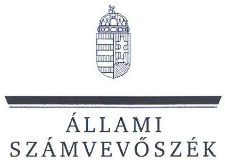
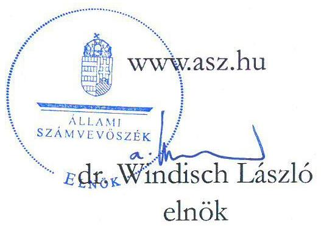
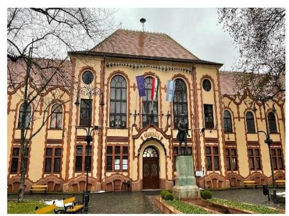
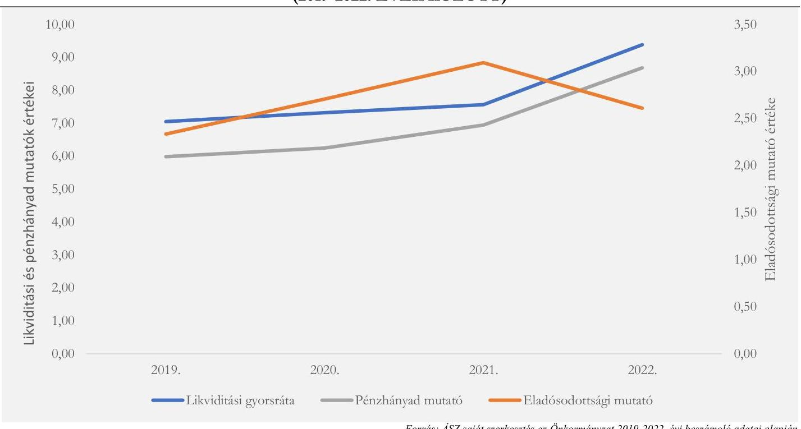
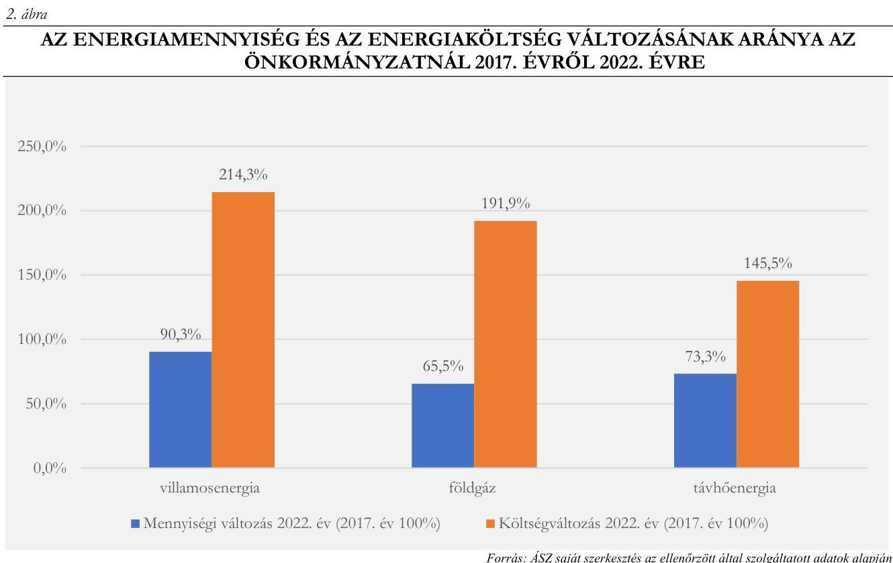
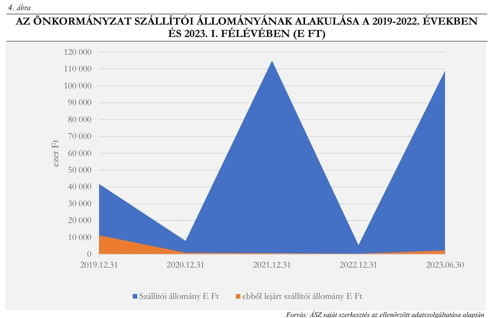
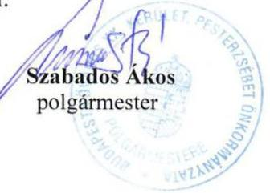
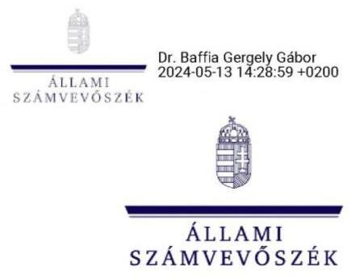

# JELENTÉS 

## Az önkormányzatok energiahatékonysági intézkedéseinek ellenőrzése

Budapest Főváros XX. kerület Pesterzsébet Önkormányzata

2024.

---

ÁLLAMI
SZÁMVEVŐSZÉK

# JELENTÉS 

## Az önkormányzatok energiahatékonysági intézkedéseinek ellenőrzése

Budapest Főváros XX. kerület Pesterzsébet Önkormányzata

2024. 

24072

---

# ELLENŐRZÉSI IGAZGATÓSÁG: 

## ÁLLAMHÁZTARTÁS HELYI SZINTJÉT ELLENŐRZŐ IGAZGATÓSÁG

## ELLENŐRZÉSI IGAZGATÓ:

DR. BAFFIA GERGELY GÁBOR igazgató

## ELLENŐRZÉSVEZETŐ:

Jelentéseink az interneten a www.asz.hu címen olvashatók.

HUDÁK MAGDOLNA ellenőrzésvezető

IKTATÓSZÁM: EL-4049-008/2024.
TÉMASZÁM: 2676
ELLENŐRZÉS-AZONOSÍTÓ SZÁM: V102006

---

# TARTALOMJEGYZÉK 

AZ ELLENŐRZÉS ALAPADATAI ..... 5
AZ ELLENŐRZÖTT SZERVEZET ..... 7
ÖSSZEFOGLALÁS ..... 9
AZ ELLENŐRZÉS FÓKUSZTERÜLETEI ..... 12
MEGÁLLAPÍTÁSOK ..... 13
JAVASLATOK ..... 26
MELLÉKLETEK ..... 27
I. sz. melléklet: Értelmező szótár ..... 27
II. sz. melléklet: Az ellenőrzött szervezetek jegyzéke ..... 31
III. sz. melléklet: Ellenőrzési kritériumok ..... 32
IV. sz. melléklet: Tájékoztató adatok ..... 34
FÜGGELÉK: ÉSZREVÉTELEK ..... 41
RÖVIDÍTÉSEK JEGYZÉKE ..... 48

---

.

---

# AZ ELLENŐRZÉS ALAPADATAI 

## AZ ELLENŐRZÉS CÉLJA

Az ellenőrzés célja annak vizsgálata volt, hogy az Önkormányzat ${ }^{1}$ értékelte-e az energiaárak változásának a költségvetése végrehajtására, a gazdálkodására, valamint a kötelező és önként vállalt feladatainak ellátására gyakorolt hatását. Az ellenőrzés kiterjedt arra, hogy az Önkormányzat és a költségvetési szervei az energiaköltségek csökkentése érdekében tettek-e energiahatékonysági intézkedéseket, továbbá az Önkormányzat által tett intézkedések hozzájárultak-e a költségvetés pénzügyi egyensúlyának, a kötelező feladatok ellátásának a biztosításához.

## AZ ELLENŐRZÉS TÍPUSA

Megfelelőségi és teljesítmény ellenőrzés

## AZ ELLENŐRZÖTT IDŐSZAK

A 2022. év és a 2023. év I. féléve.
Ezen túlmenően elemzési céllal a 3. fókuszterületnél a megkezdett és lebonyolított beruházások adatainak tanúsítványon történő bekérése tekintetében a 2017-2021. évek, továbbá a 4. fókuszterületnél a pénzügyi, egyensúlyi mutatók számítása esetében a 2019-2023. I. félévének időszaka.

## AZ ELLENŐRZÉS TÁRGYA

Az ellenőrzés tárgyát képezte az Önkormányzat és költségvetési szervei gazdálkodásának biztonsága és a kötelező feladatok ellátása érdekében - az energiaárak 2022. évi változásának ellensúlyozására - tett energiahatékonyságot növelő, energiamegtakarítást célzó, a pénzügyi egyensúly fenntartására tett intézkedések megfelelőségének és eredményességének értékelése a 2022. évben és a 2023. I. félévben.

Elemzési módszerrel a 2017-2021. években végrehajtott energiahatékonysági beruházások, fejlesztések, szakpolitikai intézkedésekben való részvétel értékelése a tekintetben, hogy azok megelőző intézkedést jelentettek-e, illetve befolyásolták-e az energiaköltségek csökkentése érdekében a 2022. évben és a 2023. I. félévében megtett intézkedéseket.

## AZ ELLENŐRZÉS JOGALAPJA

Az ellenőrzés jogszabályi alapját az ÁSZ tv. ${ }^{2}$ 5. § (2) bekezdésének előírásai képezték.

---

# AZ ELLENŐRZÉS MÓDSZERE 

Az ellenőrzést az Alaptörvény ${ }^{3}$ 43. cikk (1) bekezdésében meghatározott törvényességi, célszerűségi szempontok, valamint a nemzetközi standardokat irányadónak tekintve az ellenőrzési program szempontjai, az ellenőrzött időszakban hatályos jogszabályok, az ellenőrzés szakmai szabályok és módszertanok figyelembevételével végezte az ÁSZ ${ }^{4}$.

Az ellenőrzési kérdések megválaszolásához szükséges bizonyítékok megszerzése az ellenőrzött szervezet által rendelkezésre bocsátott dokumentumokra és adatokra, valamint az ellenőrzést támogató szervezetektől ${ }^{5}$ kapott adatokra alapozva, továbbá megfigyelés, szemle (szemrevételezés), kérdésfeltevés (információkérés), valamint elemző eljárás útján történt.

Az ellenőrzés során bizonyítékként felhasználható adatforrások közé tartoztak egyrészt az ellenőrzéshez kért dokumentumok, adatforrások, másrészt adatforrás volt még a közhiteles (Elektronikus Közbeszerzési rendszer) és egyéb adatbázisból (Önkormányzati rendelettár) származó, az ellenőrzés szempontjából információkat tartalmazó dokumentum.

Az ellenőrzés lefolytatásához az ellenőrzött szervezet a tanúsítványok kitöltésével, valamint az ÁSZ által kért dokumentumok, adatok, információk megküldésével és a helyszíni ellenőrzés során interjú keretében szolgáltatott adatokat. A rendelkezésre bocsátott adatok, információk kontrolljára helyszíni ellenőrzés keretében is sor került. Ellenőrzést támogató szervezetként adatot kértünk a BM${ }^{6}$-től, a PM${ }^{7}$-től, az EM${ }^{8}$-től, a HM${ }^{9}$-től és a ME${ }^{10}$-től az energiaáremelkedéssel kapcsolatos intézkedések keretében nyújtott állami támogatásokról, továbbá az EMIT${ }^{11}$-ek teljesítésére vonatkozóan a MEKH${ }^{12}$-től, amely szervezet az Energetikusi Hálózaton keresztül támogatta a közintézmények Ehat. tv.${ }^{13}$-ben foglalt adatszolgáltatási kötelezettségeinek teljesítését.

Az ellenőrzés során egy kockázati alapon kiválasztott önkormányzati energiahatékonyság növelését célzó beruházás előkészítése, megvalósítása, elszámolása, nyilvántartása tételes ellenőrzésre került.

Elemzési módszerrel tanúsítványon szolgáltatott adatok alapján értékeltük, hogy a 2017-2021 között végrehajtott (indított, illetve befejezett) energiahatékonyságot növelő, energiamegtakarítást célzó beruházások mennyiben befolyásolták, milyen hatással voltak a rendkívüli energiaár növekedések következtében a 2022. évben és a 2023. I. félévben megtett intézkedésekre.

A tanúsítványokon szolgáltatott adatok, az Önkormányzat által rendelkezésre bocsátott dokumentumok alapján értékeltük, hogy a meghozott takarékossági intézkedések hogyan érintették az Önkormányzat kötelező, illetve önként vállalt feladatainak ellátását, öt mutatószám (likviditási gyorsráta változása, eladósodottsági mutató, lejárt szállítói állomány változása, pénzhányad mutató alakulása) segítségével értékeltük az Önkormányzatnál a pénzügyi egyensúly fenntartására tett intézkedések eredményességét.

Az ellenőrzés kiterjedt minden olyan körülményre és adatra, amely az ÁSZ jogszabályban meghatározott feladatainak teljesítéséhez, valamint a program végrehajtása folyamán felmerült újabb összefüggések feltárásához szükséges volt.

---

# AZ ELLENŐRZÖTT SZERVEZET 

Budapest Főváros XX. kerület Pesterzsébet lakónépessége a KSH${ }^{14}$ adata szerint 61766 fő volt 2023. január 1-jén.

A kerület polgármestere 1998. év óta látta el tisztségét, a Képviselő-testületnek${ }^{15}$ a polgármesteren kívül 17 fő képviselő tagja volt. Az Önkormányzat működésével kapcsolatos feladatokat Budapest Főváros XX. kerület Pesterzsébeti Polgármesteri Hivatal látta el. A Hivatal${ }^{16}$ engedélyezett létszáma 2023. évben 165 fő volt, a jegyző 2016. április 4-től látta el tisztségét.

Az Önkormányzat - a Hivatal mellett - bölcsődei, óvodai, könyvtári és kulturális, múzeumi, szociális, humán szolgáltatási feladatokat, valamint gazdasági működtető és ellátó költségvetési szerveket, összesen 11 költségvetési szervet irányított. Az Önkormányzat kizárólagos tulajdonába egy - piacok üzemeltetésével, társasházkezeléssel foglalkozó - gazdasági társaság (továbbiakban önkormányzati Kft.${ }^{17}$ ) tartozott, a sportlétesítményeket (uszoda, jégcsarnok) - koncessziós szerződés keretében - az ESMTK sportegyesület${ }^{18}$ működtette.

Az Önkormányzat 2022. évi konszolidált beszámolójának főbb adatait az 1. táblázat mutatja be:
1. táblázat

AZ ÖNKORMÁNYZAT 2022. ÉVI KONSZOLIDÁLT BESZÁMOLÓJÁNAK FŐBB ADATAI

| MEGNEVEZÉS | 2022. EVI KONSZOLIDÁLT ÖNKORMÁNYZATI BESZÁMOLÓ (M Ft) |
| :--: | :--: |
| Költségvetési bevétel | 13887,5 |
| Ebből: |  |
| Működési célú támogatások államháztartáson belülről | 4885,1 |
| Felhalmozási célú támogatások államháztartáson belülről | 151,2 |
| Közhatalmi bevételek | 7047,8 |
| Költségvetési kiadás | 13833,3 |
| Ebből: |  |
| Dologi kiadások | 4357,7 |
| Ebből: közüzemi díjak | 311,3 |
| Beruházások | 758,9 |
| Felújítások | 1112,3 |
| Ebből: ingatlanok felújítása | 879,1 |
| Finanszírozási bevételek | 29638,6 |
| Ebből: |  |
| Maradvány igénybevétele | 4729,5 |
| Államháztartáson belüli megelőlegezések | 294,1 |
| Finanszírozási kiadások | 24893,0 |

Forrás: Az Önkormányzat 2022. évi konszolidált beszámolójáa alapján ÁSZ saját szerkesztés
A Finanszírozási bevételek és kiadások tartalmazták 24 615,0 M Ft összegben a lekötött bankbetétek megszüntetésével, illetve az ideiglenesen szabad pénzeszközök bankbetétbe helyezésével kapcsolatos tételeket. Az Önkormányzat a 2020. évben elnyerte az energiahatékonysági és megújuló energetikai fejlesztések támogatására létrejött Virtuális Erőmú program ${ }^{19}$ keretében az „Energiahatékony Önkormányzat" díjat. A Hivatal

---

a Képviselő-testület döntésének értelmében kidolgozta Fenntartható Energia- és Klíma Akciótervét (SECAP ${ }^{20}$ ), amelyet a Képviselő-testület a 2021. évben elfogadott és elrendelte benyújtását a Polgármesterek Klíma és Energiaügyi szövetségének. A vállalásnak megfelelően a SECAP keretében bemutatták a kerület energiafogyasztását, ágazati és energiahordozó bontásban az UHG${ }^{21}$ kibocsátást, a széndioxid kibocsátási, éghajlati változásra való felkészülési stratégiát és akciótervet, a végrehajtás szervezésével kapcsolatos feladatokat.

---

# ÖSSZEFOGLALÁS 

Az energiaárak 2022. évben bekövetkezett jelentős emelkedése, a források korlátozott rendelkezésre állása új fókuszba helyezte az önkormányzatoknál az energiagazdálkodás kérdését. Az energia változatlan mennyiségben történő felhasználása a magas költségkitettség miatt jelentős kockázatokat eredményezett az önkormányzatok pénzügyi-gazdasági egyensúlyára, valamint a közfeladatok ellátásának biztonságára. Az energiaárak emelkedéséből eredő kockázatok önkormányzati kezelésének támogatása érdekében kormányzati intézkedések történtek. Az európai uniós irányelveken alapuló energiahatékonyságról szóló törvény a települési önkormányzatok, mint a közfeladat ellátását szolgáló épületek tulajdonosai, használói, valamint az üzemeltetésért és fenntartásért felelős szervezetek vezetői számára több energiahatékonysági feladatot is meghatározott. Az ellenőrzés rávilágított az Önkormányzat törvényben foglalt energiagazdálkodással kapcsolatos feladatai ellátásának megfelelőségére, az energiagazdálkodási feladatok és a pénzügyi-gazdálkodási feladatok közötti összefüggésekre.

Az Önkormányzat a 2022. évben és 2023. I. félévében az energiaáremelkedésből eredő problémákat eredményesen kezelte, intézkedéseivel, energiahatékonyságot növelő beruházásaival hozzájárult az Önkormányzat működőképességének, pénzügyi egyensúlyának fenntartásához, kötelező feladatainak ellátásához.

Az Önkormányzat és a költségvetési szervek vezetőinek az Önkormányzat tulajdonában, illetve használatában álló, közfeladat ellátását szolgáló épületekkel kapcsolatos energetikai üzemeltetési és fenntartási feladatellátása nem felelt meg teljeskörűen a jogszabályi előírásoknak, mivel a 2023-ban hatályos EMIT-ek az Önkormányzat és költségvetési szervei által használt épületállomány 16,7%-ára nem álltak rendelkezésre, illetve az elkészült EMIT-ek nem feleltek meg a MEKH által kiadott mintának. Az érintett 42 épületből mindössze hét épület rendelkezett energetikai tanúsítvánnyal. Az Önkormányzat és a költségvetési szervek vezetői a havi energiaadatszolgáltatási és éves beszámolási kötelezettségüknek nem tettek eleget, az Önkormányzatnál az energetikai felelősi feladatokat ellátó személyek munkaköri leírásában nem rögzítették az Ehat. tv.-ből eredő konkrét feladatokat.

A Képviselő-testület az Önkormányzat és költségvetési szervei energiaköltségeinek csökkentése, a pénzügyi egyensúly fenntartása érdekében menedzsmenttervről, bevételnövelő és kiadáscsökkentő intézkedésekről döntött, valamint a polgármester és a jegyző 2022. októberében együttes utasításban beavatkozási pontokat határozott meg a villamosenergia, a földgázfogyasztás, a távhőfelhasználás terén. Az Önkormányzat a menedzsmentterv alapján folytatott tárgyalás eredményeként 458,7 M Ft állami támogatás igénybevételére vált jogosulttá. A Képviselő-testület által meghozott bevételnövelő intézkedések a nem lakáscélú helyiségek bérleti díjának emelésére, a kiadáscsökkentő intézkedések a villamosenergia, a földgáz, valamint a távhőfogyasztás csökkentésére irányultak. A 2022. évben és a 2023. év I. félévében a bevételnövelő intézkedések költségvetési hatása 8,5 M Ft, a kiadást csökkentő intézkedések költségvetési hatása 157,9 M Ft volt.

Az energiaköltségek csökkentése, a pénzügyi egyensúly fenntartása érdekében hozott intézkedések mellett az Önkormányzat figyelmet fordított a követelések behajtására, amelynek eredményeként a 2022. évben és 2023. I. félévében az összes kinnlevőség 11,4%-át, összesen 113,6 M Ft helyiadó hátralékot és egyéb követelést hajtottak be.

A 2022. évben a villamosenergia ellátás érdekében az Önkormányzat és a Hivatal, a földgáz ellátás érdekében az Önkormányzat és hét költségvetési szerv nyilatkozott a végső menedékes státuszra vonatkozóan.

---

A 2023. évben a fixált áras árképzésű energia beszerzés lehetőségével az Önkormányzat a villamosenergia beszerzésre vonatkozóan élt.

Az Önkormányzat 2023. évben közös közbeszerzési eljárást bonyolított le az Önkormányzat, a Hivatal és az intézmények földgázbeszerzése vonatkozásában. A szerződés megkötése azonban nem felelt meg a jogszabályi előírásoknak, mivel azt a Hivatal és az intézmények tekintetében is a polgármester írta alá a költségvetési szervek vezetői helyett.

Az Önkormányzat pénzügyi helyzete stabil, likviditása biztosított volt, amelyet főbb pénzügyi mutatóinak alakulása is alátámasztott. A 2019-2022. évek között a likviditási gyorsráta, a pénzhányad mutató, valamint az eladósodottsági mutató értéke kedvezően, a referencia tartományban alakult, az eladósodottsági mutató értéke a 2021. év kivételével 3% alatti volt, a likviditási gyorsráta az egyes években 7,05 és 9,39 között mozgott, valamint a pénzhányad mutató értéke 5,98 és 8,68 között alakult. Az Önkormányzat pénzügyi mutatóinak alakulását az 1. ábra mutatja

 be.

# 1. ábra 

BUDAPEST FŐVÁROS XX. KERÜLET PESTERZSÉBET ÖNKORMÁNYZATA MUTATÓSZÁMAI (2019-2022. ÉVEK KÖZÖTT)

Forrás: ÁSZ saját szerkesztés az Önkormányzat 2019-2022. évi beszámoló adatai alapján
Az Önkormányzat a megújuló energiahordozók közül a Hivatal és az uszoda épületeinél a napenergiát hasznosította, amelyekkel kapcsolatos beruházások megvalósítása az ellenőrzött időszakot megelőzően történt. A 2017-2023. I. féléve között indított energiamegtakarítást célzó fejlesztések hőszigetelésre, világítás és fűtéskorszerűsítésre irányultak, ezek során újabb napelemek telepítése nem történt.

A Képviselő-testület a 2017-2022. években 10, összesen 874,1 M Ft tervezett bekerülési összegű, hőszigetelésre, nyílászáró cserére, fűtéskorszerűsítésre irányuló, energiamegtakarítást célzó fejlesztésről döntött, amelyeket 62,0 %-ban önkormányzati saját forrásból, 38,0 %-ban hazai és uniós forrásból, hitel felvétele nélkül valósítottak meg. A 2023. év I. félévében egy önkormányzati saját forrásból megvalósítandó, hőveszteség csökkentésére irányuló 38,1 M Ft értékű energetikai beruházás volt folyamatban. Az Önkormányzat által végrehajtott energiahatékonyságot növelő, energiamegtakarítást célzó fejlesztésekkel kapcsolatos döntések előkészítése vonatkozásában a jogszabályi előírások ellenére nem építettek ki a szervezeti célok elérését

---

veszélyeztető kockázatok csökkentésére irányuló kontrollokat a döntések célszerűségi, gazdaságossági, hatékonysági és eredményességi szempontú megalapozottsága érdekében. Nem vizsgálták a létrejövő tárgyi eszközök, berendezések üzemeltetésével, működtetésével, karbantartásával kapcsolatos várható kiadásokat, valamint a fejlesztéssel elérni kívánt eredményeket egy európai uniós forrásból megvalósuló - önkormányzati épületek nyílászáróinak cseréjére irányuló - fejlesztés kivételével nem számszerűsítették.

Az Önkormányzatnál a 2017. évről a 2022. évre a villamosenergia fogyasztás 9,7 %-kal, a földgáz fogyasztás 34,5 %-kal, és a távhő fogyasztás 26,7 %-kal csökkent, amelyhez - egyéb tényezők mellett - a végrehajtott energiahatékonysági beruházások is hozzájárultak. A 2023. év I. félévében a villamosenergia és távhőenergia fogyasztás a 2022. évhez képest időarányosan, (50,9 % és 47,4 %) alakult, a gázenergiafogyasztás kissé elmaradt az időarányostól, 39,9 % volt. Az energiafogyasztás csökkenése azonban nem tudta teljes mértékben ellensúlyozni az áremelkedések hatását, az energiaköltségek a 2017. évi 199,9 M Ft-ról 2022-re 360,0 M Ft-ra, 80,1%-kal emelkedtek. A megemelkedett kiadások fedezetét a bevételnövelő és kiadáscsökkentő intézkedések mellett az Önkormányzat saját forrásból, valamint központi támogatásokból biztosította. A tételes ellenőrzésre kiválasztott Önkormányzati Ingatlanok felújítása - Bóbitatagóroda $^{22}$ felújítása tárgyú, bruttó 102,6 M Ft összköltségű energetikai célú fejlesztés előkészítése, megvalósítása és pénzügyi elszámolása során az Önkormányzat betartotta a jogszabályok, valamint belső szabályzatainak előírásait.

A belső ellenőrzés a 2022. évben nem végzett energiahatékonysággal kapcsolatos ellenőrzést. A 2023. évi belső ellenőrzési tervben $^{23}$ 2023. II-III. negyedévére ütemezték az energetikai gazdálkodási feladatok ellátásának ellenőrzését, amely az ÁSZ ellenőrzés lezárásáig még nem fejeződött be.

Az ÁSZ az ellenőrzés során feltárt hiányosságok felszámolása, a szabályszerű működés feltételeinek megteremtése érdekében a polgármesternek kettő, a jegyzőnek négy javaslatot tett.

---

# AZ ELLENŐRZÉS FÓKUSZTERÜLETEI 

1.- Az önkormányzat és költségvetési szervei tulajdonában, illetve használatában álló, közfeladat ellátását szolgáló épületekkel kapcsolatos energetikai üzemeltetési és fenntartási feladatellátás
2.- Az energiaárak változására tekintettel a gazdálkodás biztonsága érdekében a központi intézkedések adta lehetőségek önkormányzat általi hasznosítása
3.- Az energiaköltségek csökkentése, az energiahatékonyság növelése érdekében kezdeményezett, illetve folyamatban lévő energetikai beruházások értékelése
4.- Az energiaárak hatásának kezelésére, a kötelező feladatok ellátására, a pénzügyi egyensúly fenntartására tett intézkedések értékelése

---

# MEGÁLLAPÍTÁSOK 

## 1. Az önkormányzat és költségvetési szervei tulajdonában, illetve használatában álló, közfeladat ellátását szolgáló épületekkel kapcsolatos energetikai üzemeltetési és fenntartási feladatellátás

Összegző megállapítás Az Önkormányzat és költségvetési szervei tulajdonában, illetve használatában álló, közfeladat ellátását szolgáló épületekkel kapcsolatos energetikai üzemeltetési és fenntartási feladatellátás nem felelt meg teljeskörűen az Ehat. tv. és az Mötv. $^{24}$ előírásainak, mivel 2023-ra csak az érintett épületek 83,3 %-ára álltak rendelkezésre az EMIT-ek, és mindössze 16,7 %-ára az energetikai tanúsítványok, valamint az Önkormányzat nem tett eleget az éves jelentéssel, továbbá a havi energiafogyasztási adatokkal kapcsolatos adatszolgáltatási kötelezettségeknek.

Az Önkormányzat tulajdonában álló 61 közfeladatellátásban érintett épületből 42 az Önkormányzat és költségvetési szervei használatában volt.
Az Önkormányzat és költségvetési szervei vezetői - az ellenőrzött időszakban - a közfeladatellátásban érintett 42 épület, épületrész esetében nem tettek teljeskörűen eleget az Ehat. tv. 11/A. § előírásainak.

- Az Ehat. tv. 11/A. § a) pontjának előírása ellenére az Önkormányzat használatában lévő 42 épületből hét épületre (a Hivatal kettő épülete $^{25}$, kettő orvosi rendelő $^{26}$, kettő Galéria $^{27}$, Békaporonty Tagóvoda $^{28}$ ) nem készítettek EMIT-et.
- Az Ehat. tv. 11/A. § b) pontjában foglaltak ellenére - a 2022. év kivételével - nem készítettek az EMIT-ek teljesítéséről éves jelentést, a 2022. évre vonatkozóan elkészített éves jelentést 2023. március 31-ig, illetve az ÁSZ helyszíni ellenőrzés megkezdéséig nem töltötték fel a Nemzeti Energetikusi Hálózat által üzemeltetett online felületre.
- Az Ehat. tv. 11/A. § c) pontjának, valamint a 122/2015. (V. 26.) Korm. rendelet $^{29}$ 7/F. § előírásának ellenére nem jelentették be az épületekre, illetve épületrészekre vonatkozó havi energiafogyasztási adatokat.
- Az ellenőrzésre kiválasztott kilenc épület (Gézengúz $^{30}$, Nyitnikék $^{31}$, Kerekerdő $^{32}$ és Gyermekmosoly $^{33}$ Óvodák, Múzeum $^{34}$, kettő Szociális Szolgáltató Központ $^{35}$, Hivatal, Gyermekjóléti Központ $^{36}$ ) vonatkozásában az EMIT-ek az Ehat. tv. 11/A. § a) pontja előírása ellenére nem feleltek meg a MEKH által kiadott mintának, mivel hiányoztak az előírt mellékletek, így az épületenergetikai tanúsítványok másolatai, fotódokumentációk, intézkedési terv elkészítésében közreműködő szakemberek felsorolása, tervezett szemléletformáló akciók. Emellett nem mutatták be a beruházást igénylő, a beruházást nem igénylő és a minimális ráfordítást igénylő beavatkozásokat sem. A kilenc épület esetében az éves jelentés kizárólag a

---

2021-2022. évek villamosenergia és földgáz/távhő fogyasztási adatát tartalmazta. Az éves jelentések nem tartalmazták az EMIT-ben rögzített beruházást nem igénylő beavatkozások (tervszerű megelőző karbantartások) ismertetését, teljesülését, valamint az Ehat. tv. 11/A. § d) pontja előírása ellenére nem számoltak be a szemléletformáló akciók megvalósulásáról.

- 2022-ben az EMIT-ek részeként mindössze az épületek 16,7 %-a (hét épület) rendelkezett a 176/2008. (VI. 30.) Korm. rendelet $^{37}$ 1. § (3) bekezdésében foglalt energetikai tanúsítvánnyal. A meglévő energetikai tanúsítványokat az Ehat. tv. 11/A. § f) pontja előírása ellenére nem töltötték fel a Nemzeti Energetikusi Hálózat által üzemeltetett felületre.
- Az Önkormányzat az Ehat. tv.-ből eredő feladat ellátása céljából energetikai felelős$_{1,2}$ $^{38}$-t foglalkoztatott, valamint, amikor energetikai felelős nem foglalkoztatott, a jegyző kijelölte a műszaki ügyintézőt, azonban a dolgozók munkaköri leírása nem rendelkezett az Ehat. tv.-hez kapcsolódóan ellátandó konkrét feladatokról.
Az Önkormányzat tulajdonában lévő épületek számát, az EMIT-ek, valamint az energetikai tanúsítványok számának alakulását a 2. táblázat szemlélteti.

# 2. táblázat 

A KÖZFELADATELLÁTÁSBAN ÉRINTETT ÉPÜLETEKRE AZ EHAT. TV. ALAPJÁN ELKÉSZÍTETT DOKUMENTUMOK BEMUTATÁSA 2022. ÉVBEN ÉS 2023. I. FÉLÉVÉBEN

| KÖZFELADAT   ELLÁTÁSÁBAN ÉRINTETT   SZERVEZETCMPORT   MEGNEVEZÉSE | KÖZFELADAT   ELLÁTÁSBAN ÉRINTETT   ÉPÜLETEK SZÁMA   DB | ÉPÜLETEKRE ELKÉSZÍTETT   2022. ÉVBEN ÉS 2023.   I. FÉLÉVÉBEN MEGLÉVŐ   EMIT-EK |  | ÉPÜLETEKRE ELKÉSZÍTETT   2022. ÉVBEN ÉS 2023.   I. FÉLÉVÉBEN MEGLÉVŐ   ENERGETIKAI   TANÚSÍTVÁNYOK |  |
| :--: | :--: | :--: | :--: | :--: | :--: |
|  |  | SZÁMA,DB | ÁRÁNYA\% | SZÁMA,DB | ÁRÁNYA\% |
| Önkormányzat   tulajdonában lévő   épületek száma | 61 | 35 | 57,4 | 8 | 13,1 |
| Ebből |  |  |  |  |  |
| Polgármesteri Hivatal   használatában | 3 | 1 | 33,3 | 1 | 33,3 |
| Intézmények   használatában | 39 | 34 | 87,2 | 6 | 15,4 |
| Önkormányzati   költségvetési szervek   használatában   összesen | 42 | 35 | 83,3 | 7 | 16,7 |
| Gazdasági tásaságok   használatában | 4 | na | na | na |  |
| Vagyonkezelő   szervezetek   használatában | 6 | na | na | na |  |
| Sportegyesületek és   egyéb szervezetek   használatában | 9 | na | na | 1 | 11,1 |

Forrás: ÁSZ saját szerkesztés az ellenőrzött tanúsítványon szolgáltatott adatai alapján.
Az Önkormányzat tulajdonában álló 61 közfeladatellátásban érintett épületből 42 az Önkormányzat és költségvetési szervei használatában volt.

- A gazdasági társaságok (Integrit-XX. Kft., Magyar Nemzeti Vagyonkezelő Zrt., Kontiki-Szakképző Zrt.) használatában összesen négy, a vagyonkezelő szervezetek (Külső-Pesti Tankerületi Központ és

---

a Közép-Pesti Tankerületi Központ) használatában hat, sportegyesületek és egyéb szervezetek (ESMTK Sportegyesület, Pesterzsébeti Polgári Lövészegylet, a Budapest-Pesterzsébet-Klapka téri Református Egyházközség, Csupacsoda Alapítvány, Esztergom-Budapesti Főegyházmegye Katolikus Iskolai Főhatósága, Budapesti Montessori Általános Iskola és Gimnázium) használatában összesen kilenc közfeladatellátásban érintett épület volt.

# 2. Az energiaárak változására tekintettel a gazdálkodás biztonsága érdekében a központi intézkedések adta lehetőségek önkormányzat általi hasznosítása 

| Összegző megállapítás | Az Önkormányzat az energiaszolgáltatás   folyamatosságának biztosítása érdekében élt az   energiaárak hatásának mérséklését célzó központi   intézkedések adta lehetőségekkel. A 2023. évben az   Önkormányzat által megkötött földgáz beszerzési   szerződés nem felelt meg az Ávr. $^{39}$ előírásának. |
| :-- | :-- |

Az energiaárak jelentős emelkedésével párhuzamosan a Kormány több olyan intézkedést hozott, amelyeknek célja volt az energiaválság kezelésének megkönnyítése az önkormányzatok és intézményeik számára. A kormányzati intézkedéseket és az azokhoz kapcsolódó önkormányzati nyilatkozatokat az alábbi táblázat mutatja be.
3. táblázat

A KORMÁNY ÁLTAL BIZTOSÍTOTT LEHETŐSÉGEKHEZ KAPCSOLÓDÓAN A 2022. ÉVBEN ÉS 2023. I. FÉLÉVÉBEN MEGTETT NYILATKOZATOK SZÁMA (DB)

| KORMÁNYZATI INTÉZKEDÉS | ÖNKORMÁNYZAT |  | KÖLTSÉGYETÉSI,   SZERVEK HAVATÁLLAL   EGYÜTT* |  |  |
| :--: | :--: | :--: | :--: | :--: | :--: |
|  | IGEN | NEM | IGEN | NEM | NR |
| Végső menedékes jogintézmény keretében biztosított   villamosenergia-ellátás - 217/2022. (VI.17.) Korm. rendelet $^{40}$ 3. § | 1 | 0 | 1 | 11 | 0 |
| Végső menedékes jogintézmény keretében biztosított földgázellátás   217/2022. (VI.17.) Korm. rendelet 8. § | 1 | 0 | 7 | 3 | 2 |
| Teljes ellátás alapú veszélyhelyzeti átmeneti villamosenergia-ellátás   biztosítása 520/2022. (XII. 13.) Korm. rendelet $^{41}$ 5. § | 0 | 1 | 0 | 12 | 0 |
| Veszélyhelyzeti átmeneti földgázellátás biztosítása   388/2022. (X.14.) Korm. rendelet $^{42}$ 4. § | 0 | 1 | 0 | 10 | 2 |
| Fixált áras árképzésű villamosenergia vásárlás   41/2023. (II. 20.) Korm. rendelet $^{43}$ 2. § | 1 | 0 | 0 | 12 | 0 |
| Fixált áras árszabású földgáz vásárlás   12/2023. (I. 20.) Korm. rendelet $^{44}$ 2. § | 0 | 1 | 0 | 10 |
 | 2 |
| Földgáz-kereskedelmi szerződésben rögzített minimális mennyiség   érvényesítése - 354/2022 (IX.19.) Korm. rendelet ${ }^{45} 2 . \S$ | 0 | 1 | 0 | 10 | 2 |

A 2022. évben a villamosenergia-ellátás érdekében az Önkormányzat és a Hivatal, a földgázellátás biztosítása érdekében az Önkormányzat, a Hivatal és hat – érvényes energiavásárlási szerződéssel nem rendelkező – költségvetési szerv nyilatkozott az energiaellátás folytonosságát célzó kormányzati

---

intézkedések közül a végső menedékes státuszra vonatkozóan. A 2023. évben meglévő hatályos, rögzített árat tartalmazó közüzemi szerződéseikre tekintettel a Hivatal és a költségvetési szervek nem éltek a fixált áras árképzésű villamosenergia-vásárlás lehetőségével, valamint az Önkormányzat, és költségvetési szervei nem éltek a fixált áras árképzésű földgáz-vásárlás lehetőségével.

- A földgázellátással kapcsolatban a végső menedékes státuszt kérő költségvetési intézmények voltak: a Hivatal, a Német Nemzetiségi${ }^{46}$, a Gyermekmosoly${ }^{47}$, a Lurkóház${ }^{48}$ és a Nyitnikék Óvoda, a Múzeum, a Humán Szolgáltatások Intézménye${ }^{49}$.
- Két költségvetési szerv (GAMESZ${ }^{50}$, Szociális Foglalkoztató${ }^{51}$ ) nem tett nyilatkozatot, mivel mindkét intézmény távhőszolgáltatást vett igénybe, továbbá a GAMESZ által üzemeltetett konyhák esetében a földgázt a Tankerületi Központok${ }^{52}$ szerezték be, ezért esetükben a nyilatkozattétel nem volt releváns.
Az Önkormányzat és költségvetési szervei éltek a földgáz-kereskedelmi szerződésben lekötött földgázmennyiségnél kisebb (75%, majd 2022. december 16-tól 60%) mennyiségű földgáz felhasználására biztosított lehetőséggel, mivel a 2022. évre érvényes szerződésük a minimális mennyiségre vonatkozóan nem tartalmazott kedvezőbb feltételeket.
(Az intézkedéseket és a megtett nyilatkozatokat a IV. számú melléklet 1. táblázata részletezi.)
A 2023. évben a közbeszerzési eljárás alapján megkötött önkormányzati szintű földgáz-beszerzésére irányuló szerződésben az Önkormányzat, a költségvetési szervei, valamint az önkormányzati Kft. nevében a polgármester vállalt kötelezettséget. A polgármester által valamennyi szervezeti egységre kiterjedő kötelezettségvállalás nem felelt meg az Ávr. 52. § (1) bekezdés a) pontjában foglaltaknak, mivel a polgármester a költségvetési szervek, illetve az önkormányzati Kft. esetében nem állt ezen szervezetek alkalmazásában. Az aláírt szerződés szerint a közüzemi számlákat külön-külön, felhasználási helyenként a költségvetési szervek fizették.
- A 2023. évben az Önkormányzat, a költségvetési szervei, valamint az önkormányzati Kft. (továbbiakban Ajánlatkérők) földgázbeszerzés céljából közös közbeszerzési eljárást folytattak le, amelynek előkészítésére az Ajánlatkérők között 2023. június 6-án együttműködési Megállapodás${ }^{53}$ jött létre. A Megállapodás szerint az Ajánlatkérők az Önkormányzatot bízták meg a gesztori feladatok ellátásával. A gesztor feladata volt a közbeszerzési eljárás teljeskörű előkészítése és lebonyolítása, az Ajánlatkérők részére szerződéstervezetek előkészítése és a szerződések aláírásának megszervezése, azonban a Megállapodás nem tartalmazott felhatalmazást a polgármester számára a szerződés Ajánlatkérők nevében történő aláírására.
A jegyző a Bkr.${ }^{54}$ 3. § c) pontjában és a Bkr. 8. § (2) bekezdés c) pontjában foglaltak ellenére nem működtetett olyan kontrolltevékenységeket, amelyek biztosították volna a döntések dokumentumainak előkészítése során a szervezeti célok elérését veszélyeztető kockázatok csökkentését, mivel a földgázvásárlási szerződést az Ávr. 52. § (1) bekezdésében foglaltak ellenére nem a kötelezettségvállalásra jogosultak írták alá. A jogosulatlan kötelezettségvállalást a pénzügyi ellenjegyző az Ávr. 55. § (1) bekezdésében foglaltak, valamint az érvényesítő az Ávr. 58. § (1) bekezdésében foglaltak ellenére nem észrevételezte.
A fővárosi kerületekben a közvilágítás biztosítása a Fővárosi Önkormányzat${ }^{55}$ feladata. Az energiaárak emelkedésére tekintettel a Fővárosi Önkormányzat nem kereste meg az Önkormányzatot a közvilágítás korlátozása, illetve a többletköltségekhez való hozzájárulás céljából.

---

# 3. Az energiaköltségek csökkentése, az energiahatékonyság növelése érdekében kezdeményezett, illetve folyamatban lévő energetikai beruházások értékelése 

Összegző megállapítás Az Önkormányzatnál az ellenőrzött időszakban végrehajtott fejlesztések támogatták az energiaárak emelkedésének kompenzálására tett intézkedések teljesülését, azonban a Bkr.-ben foglaltak ellenére nem építették ki a szervezeti célok elérését veszélyeztető kockázatok csökkentésére irányuló kontrollokat a beruházási döntések célszerűségi, gazdaságossági, hatékonysági és eredményességi szempontú megalapozottsága érdekében.

Az Önkormányzat 2017. év és 2023. I. féléve között 12 épületet érintően 11 energiahatékonyság-növelést, energiamegtakarítást célzó fejlesztést tervezett megvalósítani 912 152,0 E Ft összegben, melyek főbb adatait a 4. táblázat mutatja be.
4. táblázat

AZ ÖNKORMÁNYZATNÁL A 2017-2022. ÉVEK, VALAMINT 2023. I. FÉLÉVE KÖZÖTT INDÍTOTT, FOLYAMATBAN LÉVŐ, ILLETVE BEFEJEZETT ENERGIAHATÉKONYSÁGOT CÉLZŐ FEJLESZTÉSI FELADATOK FŐBB ADATAI (E FT)

| MEGNE-   VEZÉS | PROJEKT-   SZÁM | FEJLESZTÉS CÉLJA | TERVEZETT   FEJLESZTÉSI   KIADÁS | EBBŐL |  | 2023. I.   FÉLÉVÉIG   TELJESÍ-   TETT   KIADÁS | EBBŐL |  |
| :--: | :--: | :--: | :--: | :--: | :--: | :--: | :--: | :--: |
|  |  |  |  | PÁLYÁZATI   FORRÁS | SAJÁT   FORRÁS |  | PÁLYÁZATI   FORRÁS | SAJÁT   FORRÁS |

2017-2022. években, valamint 2023. I. félévében tervezett és befejezett fejlesztési feladatok

| Megvalósított, lezárt projektek | 9 | Homlokzat, tető hőszigetelés, nyílászárók, kazánok, fűtőtestek, lámpatestek cseréje, energia csökkentése | 654 968,0 | 230 875,0 | 424 093,0 | 641 547,0 | 230 875,0 | 410 672,0 |
| :--: | :--: | :--: | :--: | :--: | :--: | :--: | :--: | :--: |
| Megvalósított, lezárás alatt lévő projekt | 1 | Nyílászárók cseréjével hőveszteség csökkentése, fűtési energia csökkentése | 219 084,0 | 101 465,0 | 117 619,0 | 219 084,0 | 101 465,0 | 117 619,0 |
| Összesen |  |  | 874 052,0 | 332 340,0 | 541 712,0 | 860 631,0 | 332 340,0 | 528 291,0 |
| 2023. I. félévében megindított, 2023. 06.30-án folyamatban lévő fejlesztési feladat |  |  |  |  |  |  |  |  |
| Megvalósítás alatt lévő projekt | 1 | Energiatakarékosság, hőveszteség csökkentése, fűtési/hűtési energia csökkentése a homlokzat szigetelésével | 38 100,0 | 0,0 | 38 100,0 | 37 958,0 | 0,0 | 37 958,0 |
| Mindösszesen | 11 |  | 912 152,0 | 332 340,0 | 579 812,0 | 898 589,0 | 332 340,0 | 566 249,0 |

---

(A megvalósított beruházások, fejlesztések adatait a IV. számú melléklet 2. táblázata tartalmazza.)
A Képviselő-testület az energetikai célú fejlesztések forrásait az Áht. és az Ávr. előírásainak megfelelően a költségvetésben megtervezte, amelynek elfogadása során az SZMSZ${ }^{56}$ előírásai szerint figyelemmel voltak az illetékes bizottságok véleményére.
Az Önkormányzat a megújuló energiahordozók közül a Hivatal és az uszoda épületeinél a napenergiát hasznosította, amelyekkel kapcsolatos beruházások megvalósítása az ellenőrzött időszakot megelőzően történt. A 2017-2023. I. féléve között indított energetikai célú fejlesztések hőszigetelésre, világítás- és fűtéskorszerűsítésre irányultak, ezek során újabb napelemek telepítése nem történt.

- A Hivatal – a 225/2022. (IX. 22.) Ök. határozatot végrehajtva – felmérte az Önkormányzat használatában lévő ingatlanok esetében a napelemek elhelyezésének lehetőségét. A felmérés eredményeként tájékoztatták a Képviselő-testületet arról, hogy mely épületek esetében és milyen műszaki feltételekkel lehetséges a napenergia hasznosítása. Az előterjesztés szerint a fejlesztéshez helyszínenként 15-20 M Ft előirányzat lenne szükséges, melynek eredményeként éves szinten megközelítőleg 1,5 M Ft értékű villamos energiát lehetne megtakarítani. A felmérés alapján a Képviselő-testület az ellenőrzött időszakban 2023. I. félévéig nem döntött újabb napelemes beruházásokról.
A fejlesztési döntések során az Mötv. előírásaival összhangban figyelemmel voltak az Önkormányzat teherbíró képességére és a pályázati lehetőségekkel is éltek. A fejlesztések 11,3%-ban európai uniós, 25,7%-ban hazai és 63,0%-ban az Önkormányzat saját forrásaiból valósultak meg. A 2017-2023. években a fejlesztésekhez hitel felvételt nem terveztek és nem is vettek igénybe.
- Az Önkormányzat a KEHOP${ }^{57}$, a „Pesterzsébeti önkormányzati beruházások, felújítások”${ }^{58}$, az „Egészséges Budapest Program”${ }^{59}$, valamint az „Önkormányzati Ingatlanok felújítása”${ }^{60}$ projektek keretében részesült külső forrásban.
A külső források főbb adatait az 5. táblázat mutatja be.
5. táblázat

# AZ ÖNKORMÁNYZAT 2017. ÉV 2023. I. FÉLÉV KÖZÖTT MEGVALÓSULT ENERGETIKAI CÉLÚ FEJLESZTÉSEK TÁMOGATÁSI FORRÁSAI (E FT) 

| ÉV | TÁMOGATÁS JOGALAPJA | MEGÍTÉLT   TÁMOGATÁS   ÖSSZEGE | EBBŐL ENERGETIKAI   KORSZERŰSÍTÉSRE   FORRÁSÍTOTT ÖSSZEG |
| :-- | :-- | :--: | :--: |
| 2017. | KEHOP-5.2.9-16-0008661 (nyílászárók cseréje) | 101 465,0 | 101 465,0 |
| 2019. | Pesterzsébeti önkormányzati beruházások,   felújítások (Bölcsődében világítás-korszerűsítés) | 1 000 000,0 | 13903,0 |
| 2021. | Egészséges Budapest Program (Orvosi   rendelőkben homlokzat- és tető hőszigetelés,   nyílászárók, fűtőtestek cseréje, világítás   korszerűsítés) | 250 000,0 | 114 510,0 |
| 2022. | Önkormányzati Ingatlanok felújítása (Óvodában   nyílászárók cseréje, világítás-korszerűsítés) | 911 220,0 | 102 462,0 |
| Mindösszesen |  | 2 262 685,0 | 332 340,0 |

A fejlesztési döntések előkészítése vonatkozásában, a Bkr. 8. § (2) bekezdés b) pontjában foglaltak ellenére nem építettek ki a szervezeti célok elérését veszélyeztető kockázatok csökkentésére irányuló kontrollokat a döntések célszerűségi, gazdaságossági, hatékonysági és eredményességi szempontú

---

megalapozottsága érdekében. Így – egy európai uniós forrásból megvalósuló, nyílászárók cseréjére irányuló beruházás kivételével – nem határozták meg a fejlesztés elvárt eredményét és nem számszerűsítették az elvárt energia-megtakarítást sem, nem vizsgálták a létrejövő tárgyi eszközök, berendezések üzemeltetésével, működtetésével, karbantartásával kapcsolatos várható kiadásokat.

- A KEHOP pályázat keretében végrehajtott energetikai korszerűsítésre vonatkozó támogatási okiratban feltüntették az érintett épületekre (Békaporonty Tagóvoda, Gyermekvédelmi Központ és Idősek Átmeneti Gondozóháza, Kerekerdő Óvoda, Gyermekek Egészségháza) vonatkozóan a fejlesztés eredményeként elérni kívánt indikátorok célértékeit. Indikátorokat határoztak meg az üvegházhatású gázok kibocsájtásának csökkentésére, a középületek éves elsődleges energia-fogyasztásának csökkentésére és az energiahatékonysági fejlesztések által elért primer energiafelhasználás-csökkenésére. Az Önkormányzat adatszolgáltatása szerint ezek visszamérése a fenntartási időszakban megtörtént, az indikátorok elvárt célértékei teljesültek.
Az energetikai fejlesztésekkel érintett költségvetési szervek villamosenergia-, földgáz-, valamint távhő-fogyasztási adatai az önkormányzati épületek energetikai felújítását követő években minden érintett intézményben csökkenést mutattak. Az energiafogyasztás csökkenéséhez az energiahatékonyságot célzó fejlesztéseken kívül hozzájárultak az energiamegtakarító intézkedések (pl. hőfok-visszavétele, óvodai csoportok összevonása, közigazgatási szünet és otthoni munkavégzés elrendelése, stb.), és ezek mellett egyéb tényezők – a 2020-2022. években a COVID-járvány miatti, szokásostól eltérő igénybevétel – is.
(Az Önkormányzat által megvalósított energetikai felújítással és korszerűsítéssel érintett intézmények villamosenergia- és földgáz-felhasználásának naturális adataiban bekövetkezett változást a IV. számú mellékletben található 4. táblázat mutatja be.)
Az energiafogyasztásban kimutatható csökkenés azonban teljeskörűen nem ellensúlyozta az áremelkedések hatását, a közüzemi költségek emelkedését, amelyet a 2. ábra szemléltet. Az energia-költségek jelentős emelkedéséhez hozzájárult, hogy a 2017-2022. évek között önkormányzati szinten a villamosenergia ára átlagosan 34,0%-kal, a földgázé 199,5%-kal emelkedett. A villamosenergia átlagos ára 2017-ben 33,8 Ft/kWh, 2022-ben 45,28 Ft/kWh, a földgáz átlagos ára 2017-ben 3,10 Ft/MJ, 2022-ben 9,28 Ft/MJ volt. Az Önkormányzat
 energia célú kiadásainak nagysága a 2022. évben a megugró energiaárak hatására 2023. év I. félévében 410 712,0 E Ft volt, ami 50 674,0 E Ft-tal, 14,1%-kal meghaladta a 2022. évi teljesítést 360 038,0 E Ft-ot. A megemelkedett kiadások fedezetét a bevételnövelő- és kiadáscsökkentő intézkedések mellett az Önkormányzat saját forrásból, valamint központi támogatásokból biztosította.

---

(Az energiafogyasztási, valamint energiaköltség adatok alakulását a 2017-2023. I. féléve között a IV. számú melléklet 3. táblázata mutatja be.)
Az ellenőrzés keretében egy fejlesztés - „Önkormányzati Ingatlanok felújítása - Bóbita Tagóvoda" - előkészítését, megvalósítását és elszámolását tételesen ellenőriztük.
Az Önkormányzat az "Önkormányzati Ingatlanok felújítása" projekt keretében a 2021. évben 911 220,0 E Ft támogatásban részesült, amelyből 102 462,0 E Ft-ot fordítottak a Kerekerdő Óvoda Bóbita Tagóvodájának fejlesztésére. A fejlesztés forrásait a 2022. és 2023. évi költségvetési rendeletekben szerepeltették.
A fejlesztésekhez szükséges előirányzatokat - az SZMSZ előírásait betartva az illetékes bizottságok véleményezését követően - a Képviselő-testület a költségvetési rendeletek módosításai során biztosította. A beruházás kivitelezőjét a Kbt. ${ }^{62}$ előírásait betartva választották ki. A szerződést a Kbt. előírásait betartva a legjobb ajánlatot tevővel a polgármester kötötte meg. A gazdasági eseményhez kapcsolódó jogkörgyakorlás az Áht. ${ }^{63}$ előírása szerint az arra jogosultak által történt. Az Ávr.-ben előírtak szerint gondoskodtak a kötelezettségvállalás nyilvántartásba vételéről. A kifizetést és annak ellenőrzését alátámasztó dokumentumok rendelkezésre álltak. A gazdasági eseményeket az Áhsz. ${ }^{64}$ előírása szerint számolták el. A fejlesztés üzembehelyezése és aktiválása a Számv. tv. ${ }^{65}$ előírása szerint megtörtént, az Áhsz. előírásának megfelelően meghatározták az értékcsökkenési leírási kulcsot és elszámolták az értékcsökkenést.

---

# 4. Az energiaárak hatásának kezelésére, a kötelező feladatok ellátására, a pénzügyi egyensúly fenntartására tett intézkedések értékelése 

## Összegző megállapítás

Az energiaáremelkedés kezelése céljából hozott döntések eredményesek voltak, a pénzügyi helyzet stabil, a kötelező feladatok ellátása biztosított volt.

Az Önkormányzat 2022. nyarán értékelte az energiaárak változásának hatását a költségvetés végrehajtására, a gazdálkodásra, a kötelező és önként vállalt feladatok ellátására, melynek során bemutatták a Képviselő-testületnek az energiahordozók áremelkedése miatti várható többlet forrás igényeket az Önkormányzat, a Hivatal, a költségvetési szervek, valamint az egyéb felhasználási helyek (térfigyelő kamerák, öntözőrendszer, nemzetiségi önkormányzatok által használt helyiségek, csónakházak és egyéb helyiségek) vonatkozásában.

- A Hivatal számításai szerint - önkormányzati szinten változatlan fogyasztási volumen mellett - a 2022. évi várható nettó éves energia költség csaknem háromszorosával, 338 099,3 E Ft-tal, a 2023. évi várható nettó éves energia költség több mint kilencszeresével, 727 336,0 E Ft-tal haladja meg a 2021. évi nettó éves energiaköltséget.
A polgármester és a jegyző a 3/2022. (X. 3.) együttes utasításában ${ }^{66}$ felelősök és határidő megjelölésével rezsicsökkentési intézkedésekről döntött, amely egyben a menedzsmenttervet is jelentette. A menedzsmenttervben beavatkozási pontokat határoztak meg mind a Hivatal, mind a költségvetési szervek vonatkozásában a villamosenergia-, földgáz fogyasztás, a távhőfelhasználás területén.
A Képviselő-testület a 272/2022. (X. 27.) Ök. sz. határozatában ${ }^{67}$ rögzítette, hogy „mindent meg kell tenni a kötelező feladatok biztosítása, a munkabérek megőrzése, az energia fogyasztás csökkentése érdekében”.
A növekvő energiaárak kezelése céljából hozott intézkedések főbb adatait a 6. táblázat mutatja be.
6. táblázat

AZ ENERGIAÁRAK VÁLTOZÁSÁNAK KEZELÉSÉRE, ILLETVE A BEVÉTELEK NÖVELÉSÉRE TETT INTÉZKEDÉSEK BEMUTATÁSA AZ ÖNKORMÁNYZATNÁL ÉS KÖLTSÉGVETÉSI SZERVEINÉL - 2022. ÉV ÉS 2023. I. FÉLÉV ÖSSZESEN

|  | ÖNKORMÁNYZAT |  |  | KÖLTSÉGVETÉSI SZERVEK |  |
| :--: | :--: | :--: | :--: | :--: | :--: |
| MEGTETT   INTÉZKEDÉSEK | SZÁMA (DB) |  | TERVEZETT   BEVÉTEL/   MEGTAKARÍTÁS   ÖSSZEGE   (E F:T) | SZÁMA   (DB) | TERVEZETT MEGTAKARÍTÁS   ÖSSZEGE   (E F:T) |
| Bevételt növelő intézkedések |  | 2 | 8454,0 | 0 |  |
| Ebből: |  |  |  |  |  |
| a nem lakás célú helyiségek bérleti dijának emelése |  | 2 | 8454,0 |  |  |
| Kiadáscsökkentő intézkedések |  |  |  | 48 | 157 916,3 |
| Ebből: |  |  |  |  |  |
| személyi jellegű kiadásokhoz kapcsolódó |  | 0 |  | 0 |  |
| beszerzéseket érintő |  | 0 |  | 0 |  |
| működést, üzemeltetést érintő |  | 0 |  | 48 | 157 916,3 |

---

A Képviselő-testület a bevételek növelése érdekében a 2022. és a 2023. évben a nem lakás céljára szolgáló helyiségek bérleti díjának emeléséről döntött. A nem lakás célú helyiségek bérleti díjának 2022. évi emelése során figyelemmel voltak a 2021. évi XCIX. törvény ${ }^{68}$ előírásaira. Emellett a rezsidíjak növekedése miatti élelmiszeráremelkedés kompenzálása érdekében a 2022. évben a Képviselő-testület döntött az élelmiszer nyersanyagnormák és így a térítési díjak emeléséről is, ennek eredményeként a tervezett többletbevétel 16 353,0 E Ft volt, amelyet teljes egészében élelmiszer vásárlásra kellett fordítani, így az az energiaáremelkedés kompenzálásában többletforrást az önkormányzat számára nem jelentett.
A 48 kiadást csökkentő intézkedés mindegyike energiafelhasználás csökkentést célzó, intézményi működést korlátozó intézkedés volt. Az intézkedések számszerűsített eredménye önkormányzati szinten a 2022. évre 69 535,5 E Ft, a 2023. évre 88 380,8 E Ft volt.

- A távhő költségek csökkentése érdekében a szolgáltatóval ${ }^{69}$ egyedi üzemviteli megállapodásokban rögzítették a helyiségekben az egyes napszakokban biztosítandó átlagos hőmérséklet, valamint a használati melegvíz hőfokának értékét.
- Az energia fogyasztás naturális és költség adatait - a korábbi gyakorlatnak megfelelően - intézményi bontásban, havonta rögzítették, figyelték, elemezték.
- Korlátozták, illetve engedélyhez kötötték az elektronikus berendezések (elektromos fűtési eszközök, klímák, fénymásolók, hűtőszekrények) használatát.
- Az óvodákban és a bölcsődékben csoportokat vontak össze, összevont ügyeletet szerveztek.
- A Hivatal és a GAMESZ esetében részleges otthoni munkavégzést rendeltek el.
- A Képviselő-testület igazgatási szünetet ${ }^{70}$ rendelt el 2022. december 22. - 2023. január 6. közötti időszakban.
- Korlátozták a CSILI Művelődési Központ, valamint a Múzeum és a Galériák nyitvatartási idejét.

A Képviselő-testület az energiaköltségek várható emelkedése miatt - az Áht. előírásait betartva gondoskodott a 2022. évi és a 2023. évi költségvetési rendelet módosításáról, az előirányzatok módosítása, valamint a 2023. évi költségvetési rendelet megalkotása során figyelembe vette az energiaárak változásának és a megtett intézkedéseknek a költségvetési hatásait, továbbá az energiaárak emelkedése miatti többletköltségek fedezetének biztosítása céljából a 2023. évben 100 000,0 E Ft-ot céltartalékba helyezett.
Az energiaárak változásának kezelése céljából tett intézkedések végrehajtása a Képviselő-testület döntéseinek megfelelően történt, a végrehajtás eredményét a Hivatal munkatársai folyamatosan nyomon követték, az intézkedések végrehajtásáról a polgármester 2022. december, valamint a 2023. november hónapban tájékoztatta a Képviselő-testületet.
Az Önkormányzat az energiaáremelések hatásainak csökkentése, a működési költségek finanszírozása érdekében élt a központi költségvetésből igényelhető támogatás lehetőségével, amelyből származó forrást a 7. táblázat mutatja be.
7. táblázat

AZ ENERGIAÁRAK VÁLTOZÁSÁHOZ KAPCSOLÓDÓ, MEGÍTÉLT KÖZPONTI TÁMOGATÁS A 2022-2023. I. FÉLÉV KÖZÖTT

| SZ. | TÁMOGATÁS JOGCÍME | 2022. VI. |  | 2023. I. FÉLÉV |  |
| :--: | :--: | :--: | :--: | :--: | :--: |
|  |  | DB | ÖsszÉG (E Ft) | DB | ÖsszÉG (E Ft) |
| 1. | Energiaáremelkedés miatti 10 000 fő feletti települések támogatása (1473/2022. Korm. határozat ${ }^{71}$, 580/2022. Korm. rendelet ${ }^{72}$ ) | - | - | 1 | 458 657,4 |
|  | Összesen | - | - | 1 | 458 657,4 |

---

- Az Önkormányzat tulajdonában lévő uszodát koncessziós szerződés keretében az ESMTK Sportegyesület üzemeltette. Sem az Önkormányzat, sem az ESMTK nem kért és nem kapott támogatást a HM-től az uszoda működtetéséhez.
A Képviselő-testület az önkormányzati Kft. részére az energiaárak emelkedése miatti kedvezőtlen pénzügyi hatások mérséklése céljából támogatás nyújtásáról nem döntött.
A Képviselő-testület figyelemmel kísérte az Önkormányzat pénzügyi helyzetének alakulását.
- A polgármester a Képviselő-testületi üléseken tájékoztatást adott az Önkormányzat anyagi helyzetéről, bemutatva a költségvetési számla és egyéb bankszámlák egyenlegét, valamint a betétben elhelyezett, lekötött összegeket.
Az energiaköltségek csökkentése, a pénzügyi egyensúly fenntartása érdekében hozott intézkedések mellett az Önkormányzat figyelmet fordított a követelések behajtására, amelynek eredményeként a 2022. évben 83 027,7 E Ft, 2023. I. félévben 30 562,2 E Ft helyi adótartozást és egyéb követelést szedett be, amely a kinnlevőségek 14,5%-át, illetve 7,2%-át jelentette.
A pénzügyi egyensúly fenntartása érdekében hozott és megtett intézkedések eredményesek voltak, azok elérték céljukat, az Önkormányzat megőrizte és fenn tudta tartani működőképességét. Intézmények bezárására, feladatok átadására nem került sor, a meghozott intézkedések eredményeként az Önkormányzat kötelező feladatait el tudta látni, pénzügyi helyzete a 2019-2022. években és 2023. I. félévében stabil volt, likviditását biztosítani tudta. A főbb pénzügyi mutatók alakulását a 8. táblázat mutatja be.
8. táblázat

| A PÉNZÜGYI EGYENSÚLY ALAKULÁSA - MUTATÓSZÁMOK |  |  |  |  |  |  |  |
| :--: | :--: | :--: | :--: | :--: | :--: | :--: | :--: |
|  | MEGNEVEZÉS | KEDVEZŐ   REFERENCIA   ÉRTÉK | 2019.12.31 | 2020.12.31 | 2021.12.31 | 2022.12.31 | 2023.06.30 |
| 1. | Likviditási gyorsráta: a likvid eszközök és a rövid időn belül esedékes kötelezettségek hányadosa | $>1,00$ | 7,05 | 7,32 | 7,56 | 9,39 | 11,74 |
| 2. | Likviditási gyorsráta változása az előző évhez képest | $>0$ | - | 0,27 | 0,24 | 1,83 | 2,35 |
| 3. | Eladósodottsági mutató: a kötelezettségek és az összes forrás hányadosa (\%) | $\max .50-60 \%$ | 2,34 | 2,71 | 3,09 | 2,61 | 2,71 |
| 4. | Lejárt szállítói állomány aránya az összes szállítói állományon belül (\%) | aránya nem növekvő | 27,10 | 11,82 | 0,59 | 6,27 | 2,09 |
| 5. | Pénzhányad mutató: a pénzeszközök és a rövid időn belül esedékes kötelezettségek hányadosa | $>=0,4$ és az előző időszakhoz képest nem csökken | 5,98 | 6,25 | 6,95 | 8,68 | 6,68 |

Forrás: ÁSZ saját szerkesztés az ellenőrzött adatszolgáltatása alapján

Az Önkormányzat likviditása az ellenőrzött időszakban mind a likviditási gyorsráta, mind a pénzhányad mutató tekintetében kedvezően alakult, a referencia tartományban maradt. A likvid eszközök 2022. évi 5 802 144,3 E Ft összegű állománya több mint kilencszeresen, a pénzeszközök állománya pedig több mint nyolcszorosan meghaladta a rövid időn belül esedékes kötelezettségek 618 177,5 E Ft-os összegét, köszönhetően a pénzeszközök 5 367 914,3 E Ft-os állományának. A pénzállomány alakulását

---

kedvezően befolyásolta, hogy a 2022. évben
 a Fővárosi Önkormányzathoz befolyt iparűzési adóbevétel a várakozások felett alakult, amely miatt az Önkormányzat forrásmegosztásból ${ }^{73}$ származó 2022. évi iparűzési adó bevétele (5 953 761,5 E Ft) csaknem egy milliárd forinttal (839 195,5 E Ft) meghaladta az 5 114 566,0 E Ft tervezett összeget.
Az Önkormányzat eladósodottsági szintje az ellenőrzött időszakban kedvező volt, a vizsgált években $3 \%$ körül alakult, 2022. évben 2,61\% volt, amely a bázis 2019. évhez képest 0,27 százalékponttal emelkedett, azonban az előző 2021. évihez képest 0,48 százalékponttal csökkent. A csökkenés oka a kötelezettségek 13,12\%-os (120 095,8 E Ft-os), ezen belül a szállítói kötelezettségek 109 491 E Ft-os csökkenése volt.

- A szállítói állomány aránya az összes kötelezettségeken belül a 2019-2022. években - a 2021. év kivételével folyamatosan csökkent, 2022. végére $0,69 \%$ (5487,0 E Ft) volt, amelynek oka, hogy az Önkormányzat és költségvetési szervei szinte valamennyi szállítói számlát kiegyenlítették. A lejárt szállítói állomány - 2022. év kivételével - jellemzően 30 napon belüli tartozás volt.
- A 2021. évi 114 978,0 E Ft összegű szállító állományból 114 499,0 E Ft az Önkormányzat által megvalósított Tér-Köz Dunaparti sétány fejlesztéshez, valamint a Hivatal esetében a 2022. évben esedékes szolgáltatási számlákhoz kapcsolódott, 479,0 E Ft a költségvetési szerveknél keletkezett. A lejárt szállítói állomány összes szállítói állományon belüli aránya fokozatosan csökkent, azok jellemzően az igazgatási szünet alatt érkező számlákból, illetve az évvégi egyeztetés során fellelt és utólagosan (késedelmesen) rendezett számlákból keletkeztek.
A 2023. I. félévi szállítói állomány 95,0\%-a dologi kiadásokhoz kapcsolódott. A lejárt szállító állomány mindösszesen 2,09\%-ot jelentett az összes tartozáson belül és 98,5\%-ban a költségvetési szervek 30 napon belüli tartozása volt.
A szállítói állomány változása az ellenőrzött időszakban nem volt negatív hatással az Önkormányzat pénzügyi helyzetére.
(A pénzügyi egyensúly mutatószámaihoz kapcsolódó adatokat a IV. számú melléklet 5. és 6. táblázatai tartalmazzák.)
A szállítói állomány alakulását a 4. ábra szemlélteti.

---

Forrás: ÁSZ saját szerkesztés az ellenőrzött adatszolgáltatása alapján
(A szállítói állomány alakulását a IV. számú melléklet 5. táblázata tartalmazza.)
A belső ellenőrzés a 2022. évben nem végzett energiahatékonyságot, energiamegtakarítást érintő ellenőrzést. A 2023. évi belső ellenőrzési tervben 2023. II-III. negyedévére ütemezték az „Energetikai gazdálkodási feladatok ellátása" című rendszer ellenőrzést az Önkormányzatnál és Hivatalnál, amely az ÁSZ helyszíni ellenőrzés idején a megbízólevél kiadásával elindult.

---

# JAVASLATOK 

Az ÁSZ tv. 33. § (1) bekezdésében foglaltak értelmében az ellenőrzött szervezet vezetője köteles a jelentésben foglalt megállapításokhoz kapcsolódó intézkedési tervet összeállítani és azt a jelentés kézhezvételétől számított 30 napon belül az ÁSZ részére megküldeni. Amennyiben az ellenőrzött szervezet vezetője nem küldi meg határidőben az intézkedési tervet, vagy továbbra sem elfogadható intézkedési tervet küld, az Állami Számvevőszék elnöke az ÁSZ tv. 33. § (3) bekezdése a) és b) pontjaiban foglaltakat érvényesítheti.

## BUDAPEST FŐVÁROS XX. KERÜLET PESTERZSÉBET ÖNKORMÁNYZATÁNAK POLGÁRMESTERE RÉSZÉRE

1. Intézkedjen az Állami Számvevőszék nyilvánosságra hozott jelentésének a kézhezvételt követő 30 napon belül a Képviselő-testület elé terjesztéséről. A jelentést a napirend tárgyalásáról szóló jegyzőkönyvvel együtt tájékoztatásul küldje meg a Kormányhivatal részére is.
2. Az Ehat. tv. 11/A. §-ában foglalt felelőssége körében, a közfeladat ellátását szolgáló épületek tulajdonosának képviseletében az üzemeltetésért és fenntartásért felelős vezetőként gondoskodjon az energiamegtakarítási intézkedési tervek és éves beszámolók elkészítéséről, a havi fogyasztási adatokkal kapcsolatos adatszolgáltatás teljesítéséről.

## BUDAPEST FŐVÁROS XX. KERÜLET PESTERZSÉBET POLGÁRMESTERI HIVATAL JEGYZŐJE RÉSZÉRE

1. A Mötv. 41. § (1) bekezdésében foglaltakra tekintettel, a Polgármesteri hivatalnak, a Képviselő-testület szervének vezetőjeként intézkedjen a Bkr. 8. § (1) bekezdésében foglalt olyan kontrolltevékenységek kialakításáról, amelyek biztosítják az Ehat. tv. 11/A. § a), b), c), f) és i) pontjában foglalt dokumentumok elkészítését és adatszolgáltatási kötelezettségek teljesítését.
2. A Bkr. 3. § c) pontjában foglaltak szerint gondoskodjon a Bkr. 8. § (2) bekezdés a) pontja alapján kialakított kontrolltevékenységek megfelelő működtetéséről annak érdekében, hogy a kötelezettségvállalásokat az Ávr. 52. § (1) bekezdésében foglalt jogosultak írják alá.
3. Intézkedjen, hogy az energetikai felelős munkaköri leírásában az Ehat. tv. 11/A. §-a szerinti feladatok szerepeljenek.
4. A Bkr. 8. § (2) bekezdés b) pontjában foglaltakra tekintettel az energetikai célú fejlesztésekre irányuló döntések megalapozottsága, a létrehozott tárgyi eszközök hosszú távú üzemeltethetősége érdekében gondoskodjon arról, hogy az előterjesztésekben a tervezett beruházásokat gazdaságossági számításokkal támaszszák alá, valamint mutassák ki az eszközök, berendezések fenntartásával, működtetésével kapcsolatos várható kiadásokat, illetve tegyen javaslatot a beruházások eredményeképpen elért megtakarítások folyamatos figyelemmel kísérésére.

---

# MELLÉKLETEK 

## I. SZ. MELLÉKLET: ÉRTELMEZŐ SZÓTÁR

beruházás
egyetemes szolgáltatás
egyetemes
szolgáltatás
egyetemes szolgáltatásra jogosultak
eladósodottsági mutató
energia
energiahatékonyság
javulása

A tárgyi eszköz beszerzése, létesítése, saját vállalkozásban történő előállítása, a beszerzett tárgyi eszköz üzembe helyezése, rendeltetésszerű használatbavétele érdekében az üzembe helyezésig, a rendeltetésszerű használatbavételig végzett tevékenység (szállítás, vámkezelés, közvetítés, alapozás, üzembe helyezés, továbbá mindaz a tevékenység, amely a tárgyi eszköz beszerzéséhez hozzákapcsolható, ideértve a tervezést, az előkészítést, a lebonyolítást, a hiteligénybevételt, a biztosítást is); beruházás a meglévő tárgyi eszköz bővítését, rendeltetésének megváltoztatását, átalakítását, élettartamának, teljesítőképességének közvetlen növelését eredményező tevékenység is, az előbbiekben felsorolt, e tevékenységhez hozzákapcsolható egyéb tevékenységekkel együtt. (Forrás: Számv.tv. 3. § (4) bek. 7. pont)
A gáz- és villamosenergia-kereskedelem körébe tartozó sajátos gáz- és villamosenergia-értékesítési mód, amely Magyarország területén bárhol, meghatározott minőségben a jogosult felhasználó számára méltányos, összehasonlítható, átlátható ár ellenében igénybe vehető. (Forrás: Vet. ${ }^{74}$ 3. § (7.) pont; Get. ${ }^{75}$ tv. 3. § (8) pont)
2022. augusztus 1-jétől villamosenergia egyetemes szolgáltatásra jogosult a lakossági fogyasztó, valamint kis- és középvállalkozásokról, fejlődésük támogatásáról szóló 2004. évi XXXIV. törvény 3. § (3) bekezdése szerinti mikrovállalkozásnak minősülő, kisfeszültségen vételező, összes felhasználási helye tekintetében együttesen 3*63 A-nál nem nagyobb csatlakozási teljesítményű felhasználó $4606 \mathrm{kWh} /$ év/összes felhasználási hely fogyasztásig.
2022. augusztus 1-jétől földgázellátás egyetemleges szolgáltatásra jogosult a lakossági felhasználó, valamint a 20 m³/óra kapacitást meg nem haladó vásárolt kapacitással rendelkező mikrovállalkozás 54810 MJ/év/összes felhasználási hely mértékig. (Forrás: 217/2022. (VI. 17.) Korm. rendelet 2. § (1) bekezdés, 7. § (1) bekezdés)
Az eladósodottsági mutató alapképlete az idegen forrásoknak az összes eszközhöz viszonyított aránya megállapítására szolgál. A mutató az eladósodottság mértékét fejezi ki százalékos formában. Jelen ellenőrzés keretében a mutató az önkormányzat kötelezettségeinek arányát mutatja az összes forráson belül. Kedvező, ha az eladósodottságot jelző mutatószám 50-60\% körül van, magas, ha $60 \%$ és $100 \%$ között van, kedvezőtlen a helyzet, ha $100 \%$ vagy e felett helyezkedik el. (Forrás Zéman Zoltán, Bébm Imre A pénzügyi menedzsment controll elemzési eszköztára, https://mersz.hu/dokumentum/di242apmcee 152/ alapján ÁVZ meghatározás)
Az energiastatisztikáról szóló, 2008. október 22-i 1099/2008/EK európai parlamenti és tanácsi rendelet 2. cikk d) pontja szerinti energiatermékek minden formája, éghető üzemanyagok, hő, megújuló energiák, villamosenergia vagy az energia bármely más formája. (Forrás: Ebat. tv. 1. § 3. pont)
A teljesítményben, a szolgáltatásban, a termékben vagy az energiában kifejezett eredmény és a befektetett energia hányadosa (Forrás: Ebat. tv. 1. § 6. pont)
Az energiahatékonyság növekedése a technológiai, magatartásbeli, vagy gazdasági változások vagy ezek kombinációjának eredményeképpen. (Forrás: Ebat. tv. 1. § 10. pont)

---

energia megtakarítás
energia-
megtakarítási intézkedési terv - EMIT
építmény
épület
épületrész
felújítás
költségvetési szerv

Az az energiamennyiség, amellyel csökkent valamely energiahatékonyság-javító intézkedés végrehajtása után a mért vagy becsült fogyasztás az intézkedést megelőzőhöz képest, biztosítva az energiafogyasztást befolyásoló külső feltételeknek megfelelő normalizálást. (Forrás: Ebat. tv. 1. § 11. pont)
A közintézményi tulajdonban és használatban álló, közfeladat ellátását szolgáló épület vagy épületrész üzemeltetéséért és fenntartásáért felelős szervezet vezetője ötévente a MEKH által elkészített és az energiahatékonysági tájékoztató honlapon közzétett minta szerinti energiamegtakarítási intézkedési tervet készít, amit a készítés évében március 31-ig köteles feltölteni a Nemzeti Energetikusi Hálózat által üzemeltetett online felületre. A teljesítésről évente jelentést készít, amit a tárgyévet követő év március 31-ig köteles feltölteni az online felületre. (Forrás: Ebat. tv.11/A. § a); b) bekezdés)
Építési tevékenységgel létrehozott, illetve késztermékként az építési helyszínre szállított, rendeltetésére, szerkezeti megoldására, anyagára, készültségi fokára és kiterjedésére tekintet nélkül minden olyan helyhez kötött műszaki alkotás, amely a terepszint, a víz vagy az azok alatti talaj, illetve azok feletti légtér megváltoztatásával, beépítésével jön létre, az építmény, az épület és műtárgy gyűjtőfogalma. (Forrás: Étv. tv. ${ }^{\text {76 }} 2 . \S 8$. pontja)
Jellemzően emberi tartózkodás céljára szolgáló építmény, amely szerkezeteivel részben vagy egészben teret, helyiséget vagy ezek együttesét zárja körül meghatározott rendeltetés vagy rendeltetésével összefüggő tevékenység, avagy rendszeres munkavégzés, illetve tárolás céljából. (Forrás: Étv. tv. 2. § 10. pontja)
Az épület önálló rendeltetésű, a szabadból vagy az épület közös közlekedőjéből nyíló önálló bejárattal ellátott helyisége vagy helyiség-csoportja, amely azzal a feltétellel felel meg lakásnak, üdülőnek, kereskedelmi egységnek, egyéb nem lakás céljára szolgáló épületnek, hogy az ingatlannyilvántartásban önálló ingatlanként nem szerepel. (Forrás: Htv. 52. § 6. pontja)
Az elhasználódott tárgyi eszköz eredeti állaga (kapacitása, pontossága) helyreállítását szolgáló, időszakonként visszatérő olyan tevékenység, amely mindenképpen azzal jár, hogy az adott eszköz élettartama megnövekszik, eredeti műszaki állapota, teljesítőképessége megközelítőleg vagy teljesen visszaáll, az előállított termékek minősége vagy az adott eszköz használata jelentősen javul és így a felújítás pótlólagos ráfordításából a jövőben gazdasági előnyök származnak; felújítás a korszerűsítés is, ha az a korszerű technika alkalmazásával a tárgyi eszköz egyes részeinek az eredetitől eltérő megoldásával vagy kicserélésével a tárgyi eszköz üzembiztonságát, teljesítőképességét, használhatóságát vagy gazdaságosságát növeli; a tárgyi eszközt akkor kell felújítani, amikor a folyamatosan, rendszeresen elvégzett karbantartás mellett a tárgyi eszköz oly mértékben elhasználódott (szerkezeti elemei elöregedtek), amely elhasználódottság már a rendeltetésszerű használatot veszélyezteti; nem felújítás az elmaradt és felhalmozódó karbantartás egyidőben való elvégzése, függetlenül a költségek nagyságától. (Forrás: Számv.tv. 3. § (4) bekezdés 8. pont)
A költségvetési szerv az államháztartás sajátos jogi személyiségtípusa. A költségvetési szerv jogszabályban vagy alapító okiratban meghatározott közfeladat ellátására létrejött jogi személy. A költségvetési szerv jogi személyiségéből adódóan bármilyen olyan jogot megszerezhet és kötelezettséget vállalhat, amely megszerzését vagy vállalását törvény kifejezetten nem tiltja. A költségvetési szerv tevékenysége lehet a nem haszonszerzés céljából végzett alaptevékenység, valamint államháztartáson kívüli forrásból, haszonszerzés céljából, nem kötelezően végzett vállalkozási tevékenység (Forrás: Ábt. 7. § (1)-(2) bekezdés
https://allambaztartas.kommany.hu/koltsegvetesi-szervek)

---

közfeladat

Közfeladat a jogszabályban meghatározott állami vagy önkormányzati feladat. A közfeladatok ellátása költségvetési szervek alapításával és működtetésével vagy az azok ellátásához szükséges pénzügyi fedezet az Ábt-ban meghatározott eszközökkel, részben vagy egészben történő biztosításával valósul meg. A közfeladatok ellátásában államháztartáson kívüli szervezet jogszabályban meghatározott rendben közreműködhet. A közfeladatot meghatározó jogszabályban meg kell határozni a közfeladat ellátásának módját és egyidejűleg rendelkezni kell az annak ellátásához szükséges pénzügyi fedezet biztosításáról. Új közfeladat kizárólag az annak ellátásához megfelelő pénzügyi fedezet rendelkezésre állása esetén írható elő vagy vállalható. Ha a pénzügyi

 fedezet már nem áll rendelkezésre, intézkedni kell a pénzügyi fedezet biztosításáról vagy a közfeladat megszüntetéséről. (Forrás: Ábt. 3/A. §)
közintézmény

A közbeszerzésekről szóló törvényben meghatározott ajánlatkérő szervezet. Az ajánlatkérő szervezeteket a Kbt. 5. § (1) bekezdés határozza meg. (Forrás: Ebat. tv. 1. § 23. pont)
Közbeszerzési eljárás lefolytatására kötelezett a költségvetési szerv, a helyi önkormányzat, a jogképes szervezet, amelyet kifejezetten közérdekű tevékenység céljából hoztak létre, vagy amely bármilyen mértékben ilyen tevékenységet lát el. (Forrás: Kbt. 5. § (1) bekezdés ch), cd, e) pont)
Kormányrendeletben meghatározott állami vagy önkormányzati feladatot ellátó szociális, gyermekjóléti, gyermekvédelmi, egészségügyi, köznevelési vagy szakképző intézmény. (Forrás: Vet. tv. 63/A. § (1) bekezdés)
közüzemi díjak
lejárt szállítói állomány
likviditási gyorsráta
menedzsment-
terv

Villamosenergia szolgáltatás díja, gázenergia szolgáltatás díja, távhő- és melegvízszolgáltatás díja, vízés csatorna szolgáltatás díja (Áhsz. 15. melléklet K331)
A számlán rögzített fizetési határidőn túli (lejárt) szállítói állomány. A pénzügyi egyensúly szempontjából magas kockázatú, kedvezőtlen, ha a lejárt szállítói állomány aránya az összes szállítói állományon belül emelkedett. (Forrás: $A S Z$ )
A Likviditási gyorsráta a likvid eszközök és a likvid források közötti arányt oly módon határozza meg, hogy a készletállományt a likvid eszközök közül figyelmen kívül hagyja. Jelen ellenőrzés keretében a mutató mutatja, hogy a likvid eszközök hányszorosát teszik ki a likvid forrásoknak, vagyis a forgóeszközök mekkora mértékben fedezik a rövid lejáratú kötelezettségeket. Kedvező, ha a mutató értéke 1-nél nagyobb értéket ér el. Ha kisebb, mint 1 akkor fizetőképtelenség fenyeget, vagy bekövetkezett (Forrás: Zéman Zoltán, Béhm Imre A pénzügyi menedzsment controll elemzési eszköztára, https://mersz.hu/dokumentum/dj242apmcee__152/ alapján $A S Z$ meghatározás.)
Nem fosszilis és nem nukleáris energiaforrás, amelyből nap-, szél-, légtermikus, geotermikus, hidrotermikus energia, vízenergia, biomasszából nyert energia - beleértve a biogázból (hulladéklerakóból, illetve szennyvízkezelő létesítményből származó, valamint az egyéb szerves anyagokból előállított éghető gázból) nyert energiát - állítható elő. (Forrás: Vet.tr. 3. § 45. pont)
A menedzsmentterv olyan dokumentum, amelyben az önkormányzat bemutatja, milyen intézkedéseket tesz a megnövekedett működési költségek fedezetének biztosítása, illetve a kiadások csökkentése érdekében, amennyiben szükséges a rendelkezésre álló tartalékok felhasználásának ütemezését, illetve a vagyonértékesítés kapcsán megtenni tervezett intézkedéseket. (Forrás: 1473/2022. (X. 5.) Korm. határozat 3. pont)

---

önkormányzat
vagyon
pénzhányad mutató
végső
menedékes
státusz
veszélyhelyzeti átmeneti földgázellátás
veszélyhelyzeti átmeneti villamosenergia-ellátás

A helyi önkormányzat jogi személy. Az önkormányzati feladatok ellátását a képviselő-testület és szervei biztosítják. A képviselőtestület szervei: a polgármester, a főpolgármester, a vármegyei közgyűlés elnöke, a képviselő-testület bizottságai, a részönkormányzat testülete, a polgármesteri hivatal, a vármegyei önkormányzati hivatal, a közös önkormányzati hivatal, a jegyző, továbbá a társulás. A képviselő-testület a feladatkörébe tartozó közszolgáltatások ellátására - jogszabályban meghatározottak szerint - költségvetési szervet, a Polgári perrendtartásról szóló 2016. évi CXXX. törvény szerinti gazdálkodó szervezetet (a továbbiakban: gazdálkodó szervezet), nonprofit szervezetet és egyéb szervezetet (a továbbiakban együtt: intézmény) alapíthat, továbbá szerződést köthet természetes és jogi személlyel vagy jogi személyiséggel nem rendelkező szervezettel. (Forrás: Mötv. 41. § (1), (2), (6) bekezdései)
A helyi önkormányzat vagyona a tulajdonából és a helyi önkormányzatot megillető vagyoni értékű jogokból áll, amelyek az önkormányzati feladatok és célok ellátását szolgálják. (Forrás: Mötv. 106. § (2) bekezdés)

A Pénzhányad a készletek és a követelések nélküli likvid eszközök likviditását fejezi ki. Jelen ellenőrzés keretében a mutató a mobilizálható pénzeszközöket veti össze a rövid lejáratú kötelezettségekkel. Megfelelő az értéke, ha értéke 0,4 vagy magasabb.
(Forrás: Zéman Zoltán, Béhm Imre A pénzügyi menedzsment controll elemzési eszköztára https://merez.hu/dokumentum/dj242apmcee_152/alapján ÁSZ meghatározás)
Ideiglenes földgáz- és villamosenergia-ellátás, amelyet a Hivatal által kijelölt földgáz- és villamosenergiakereskedő biztosít azon egyetemes szolgáltatók vagy egyetemes szolgáltatásra jogosult felhasználók részére, akiket földgáz- és villamosenergiakereskedőjük valamilyen okból nem képes ellátni. (Forrás: Get tv. 3. §69. fogalommeghatározás alapján ÁSZ szerkesztés)
Azon egyetemes szolgáltatásra nem jogosult felhasználók, akik számára az őket 2022. október végéig ellátó földgázkereskedő a továbbiakban egyéb módon nem biztosítja a szolgáltatást. (Forrás: $M V M$ bírek. https://mvmenergiakereskedo.hu/aktualitasok/11409)
Azon egyetemes szolgáltatásra nem jogosult felhasználók, akik villamosenergia-ellátása 2022. december 12. napján semmilyen formában nem volt biztosított, nem rendelkeztek ezen időpontban elfogadott ajánlattal, megkötött villamosenergia-vásárlási szerződéssel, továbbá a végső villamosenergia-menedékes ellátást követően nem került automatikusan az MVM Next versenypiaci ellátásába. (Forrás: MVM binek. https://www.mvmenergakereskedo.hu/aktualitasok/31311)

---

# II. SZ. MELLÉKLET: AZ ELLENŐRZÖTT SZERVEZETEK JEGYZÉKE 

## MEGNEVEZÉS

Budapest Főváros XX. kerület Pesterzsébet Önkormányzata
Budapest Főváros XX. kerület Pesterzsébet Polgármesteri Hivatal
Pesterzsébet Önkormányzata Gazdasági Működtető és Ellátó Szervezet
Pesterzsébet Önkormányzatának Szociális Foglalkoztatója
Pesterzsébet Önkormányzatának Humán Szolgáltatások Intézménye
Pesterzsébeti Múzeum
Pesterzsébeti Lurkóház Óvoda
Pesterzsébeti Gézengúz Óvoda
Pesterzsébeti Kerekerdő Óvoda
Pesterzsébeti Gyermekmosoly Óvoda
Pesterzsébeti Nyitnikék Óvoda
Pesterzsébeti Baross Német Nemzetiségi Óvoda
Csili Művelődési Központ

---

# III. SZ. MELLÉKLET: ELLENŐRZÉSI KRITÉRIUMOK 

## FOKUSZTERÜLET/FOKUSZKÉRDÉS

1. Az önkormányzat és költségvetési szervei tulajdonában, illetve használatában álló, közfeladat ellátását szolgáló épületekkel kapcsolatos energetikai üzemeltetési és fenntartási feladatellátás
2. Az energiaárak változására tekintettel a gazdálkodás biztonsága érdekében a központi intézkedések adta lehetőségek önkormányzat általi hasznosítása
3. Az energiaköltségek csökkentése, az energiahatékonyság növelése érdekében kezdeményezett, illetve folyamatban lévő energetikai beruházások értékelése
4. Az energiaárak hatásának kezelésére, a kötelező feladatok ellátására, a pénzügyi egyensúly fenntartására tett intézkedések értékelése

## ELLENŐRZÉSI KRITÉRIUMOK

Ehat. tv. 11/A § a), b), c), d), f), i) pont
Mötv. $81 \S$ (3) bekezdés c) pont; 107. §
176/2008. (VI. 30.) Korm.rendelet ${ }^{77} 1$ § (3) bekezdés;
8. $\S$ (1) bekezdés
122/2015. (V. 26.) Korm. rendelet ${ }^{78} 7 / \mathrm{F} \S$
217/2022. (VI.17) Korm. rendelet 3. § (1) bekezdés, 8. § (1) és (5) bekezdés
354/2022. (IX. 19). Korm. rendelet 2. §
388/2022. (X. 14.) Korm. rendelet 4. §
520/2022. (XII. 13.) Korm. rendelet 5. §
12/2023.(I. 20) Korm. rendelet 2. § (1) bekezdés
41/2023. (II. 20) Korm. rendelet 2. § (1) bekezdés
Ávr. 52. § (1) bekezdés; 55. § (1) bekezdés; 58. § (1) bekezdés
Bkr. 3. § c) pont; 8. § (2) bekezdés c) pont
Mötv. 6. § b) pont, 41.§ (3)
Számv.tv. 52. § (2) bekezdés
Kbt. 115. §, 131. § (1) bekezdés
Áht. 36-38. §
Áhsz. 10. § (2) bekezdés, 16. § (3d) bekezdés, 17. § (3)
bekezdés, 15., 16., melléklet
Ávr. 56. § (1) bekezdés, 60. § (3) bekezdés
Bkr. 8. § (2) bekezdés b) pont,
Képviselő-testületi határozat
SZMSZ 64. §; 66. § (1), (2), (6) és (7) bekezdései
Gazdálkodás szabályzat
Alaptörvény N) cikk (1) és (2) bekezdés
Nvtv. ${ }^{79} 7 . \S$
Mötv. 6. §, 42. § 4. pont, 115. §
2023. évi Kvtv ${ }^{80}$. 2-3. mellékletek

Számv.tv. 15. § (1)
Hatásköri tv ${ }^{81}$ 138. § (1) b)-e) és h) pontok
2021. évi XCIX. törvény ${ }^{82} 147 . \S$

Helyi adó tv. 51/L §
Bkr.8. § (2) bekezdés a)-b) pont, 9. § (2) bekezdés, 10. §
Áht. 11. §, 23. §, 24. § (2) 34. § (3) bekezdés
Áhsz. 14. §, 37. §, 14. melléklet
Ávr. 14. § 24. § 42. §
353/2022. (IX.19) Korm. rendelet ${ }^{83} 5$. §
1473/2022. (X. 5.) Korm. határozat

---

Az ellenőrzés során alkalmazott mutatószámok és referencia értékük:

Likviditási gyorsráta: Kedvező volt, ha a mutató értéke 1-nél nagyobb értéket ért el.

Likviditási gyorsráta változása: Kedvező, ha a mutató az előző időszakhoz képest nem csökken.

Eladósodottsági mutató: Kedvező, ha a mutatószám 50-60% körül volt, magas, ha 60,0% és 100,0% között volt, kedvezőtlen, ha 100% vagy e felett helyezkedett el.

Lejárt szállítói állomány változása: Kedvező, ha a lejárt szállítói állomány aránya az összes szállítói állományon belül nem emelkedett.

Pénzhányad mutató alakulása: A mutatószám akkor megfelelő, ha értéke 0,4 vagy 0,4-nél magasabb. Kedvező, ha a mutató az előző időszakhoz képest nem csökkent.

A pénzügyi egyensúly fenntartására tett intézkedések eredményesek voltak, ha az öt mutatószámból (likviditási gyorsráta, likviditási gyorsráta változása, eladósodottsági mutató, lejárt szállítói állomány változása, pénzhányad mutató alakulása) három mutató értéke a kedvezőnek minősített tartományban van.

---

# IV. SZ. MELLÉKLET: TÁJÉKOZTATÓ ADATOK

## AZ ÖNKORMÁNYZAT ÉS KÖLTSÉGVETÉSI SZERVEINEK NYILATKOZATAI A KORMÁNYZATI INTÉZKEDÉSEKHEZ KAPCSOLÓDÓAN

|  MEGNEVEZÉS | VÉGSŐ MENEDÉKES JOGINTÉZMÉNY |  | VESZÉLYHELYZETI ÁTMENETI ELLÁTÁS |  | FIX ÁRAS ÁRKÉPZÉSŰ VÁSÁRLÁSI LEHETŐSÉG |  | SZERZŐDÉSBEN LEKÖTÖTT MINIMÁLIS FÖLDGÁZ MENNYISÉG  |
| --- | --- | --- | --- | --- | --- | --- | --- |
|   | ELEKTROMOS ÁRAM | FÖLDGÁZ | ELEKTROMOS ÁRAM | FÖLDGÁZ | ELEKTROMOS ÁRAM | FÖLDGÁZ |   |
|   | (1/2N/3/4B) | (1/2N/3/4B) | (1/2N/3/4B) | (1/2N/3/4B) | (1/2N/3/4B) | (1/2N/3/4B) | (1/2N/3/4B)  |
|  Budapest Főváros XX. Kerület Pesterzsébet Önkormányzata | I | I | NR | NR | I | N | N  |
|  Budapest Főváros XX. Kerület Pesterzsébeti Polgármesteri Hivatal | I | I | NR | NR | N | N | N  |
|  Csili Művelődési Központ | N | N | N | N | N | N | N  |
|  Pesterzsébeti Baross Német Nemzetiségi Óvoda | N | I | N | NR | N | N | N  |
|  Pesterzsébeti Gézengúz Óvoda | N | N | N | N | N | N | N  |
|  Pesterzsébeti Gyermekmosoly Óvoda | N | I | N | NR | N | N | N  |
|  Pesterzsébeti Kerekerdő Óvoda | N | N | N | N | N | N | N  |
|  Pesterzsébeti Lurkóház Óvoda | N | I | N | NR | N | N | N  |
|  Pesterzsébeti Múzeum | N | I | N | NR | N | N | N  |
|  Pesterzsébeti Nyitnikék Óvoda | N | I | N | NR | N | N | N  |
|  Pesterzsébet Önkormányzata Gazdasági Működtető és Ellátó Szervezet | N | NR | N | NR | N | NR | NR  |
|  Pesterzsébet Önkormányzatának Humán Szolgáltatások Intézménye | N | I | N | NR | N | N | N  |
|  Pesterzsébet Önkormányzatának Szociális Foglalkoztatója | N | NR | N | NR | N | NR | NR  |
|  Összesen | 13 | 13 | 13 | 13 | 13 | 13 | 13  |
|  Nem | 11 | 3 | 11 | 3 | 12 | 11 | 11  |
|  Igen | 2 | 8 | 0 | 0 | 1 | 0 | 0  |
|  Nem releváns | 0 | 2 | 2 | 10 | 0 | 2 | 2  |

Forrás: ÁSZ saját szerkesztés az ellenőrök adatszolgáltatása alapján.

---

### *2. táblázat*

### **AZ
 ÖNKORMÁNYZAT ÁLTAL 2017-2023. I. FÉLÉVE KÖZÖTT INDÍTOTT, MEGVALÓSÍTOTT, FOLYAMATBAN LÉVŐ ENERGETIKAI CÉLÚ FEJLESZTÉSEK**

|  SŰRSZÁM | PROJEKT MEGNEVEZÉSE | FEJLESZTÉS
MEGKEZDÉSÉNEK
DÁTUMA | TERVEZETT
KIADÁS | TELJESÍTETT
FEJLESZTÉSI
KIADÁS | TELJESÍTETT FEJLESZTÉSI KIADÁS FORRÁSA |  |  | FEJLESZTÉS
SEL
ÉRINTETT
ÉPÜLETEK
SZÁMA  |
| --- | --- | --- | --- | --- | --- | --- | --- | --- |
|   |  |  |  |  | UNIÓS
FORRÁS | HAZAI
TÁMOGATÁS | SAJÁT
FORRÁS |   |
|   |  |  | E ÉT | E ÉT | E ÉT | E ÉT | E ÉT | DB  |
|  1. | Győngyszem Tagóvodában^{84} hőszigetelési munkák | 2023.03.14 | 38 100,0 | 37 958,0 | 0 | 0 | 37 958,0 | 1  |
|  Folyamatban lévő projektek összesen |  |  | 38 100,0 | 37 958,0 | 0 | 0 | 37 958,0 | 1  |
|  1. | Csili Művelődési Központ tető szigetelési munkái II. ütem | 2017.07.03 | 65 077,0 | 65 077,0 | 0 | 0 | 65 077,0 | 1  |
|  2. | Csili Művelődési Központ tető szigetelési munkái | 2017.11.29 | 50 800,0 | 37 379,0 | 0 | 0 | 37 379,0 | 1  |
|  3. | Csili Művelődési Központ felújítási munkái II. ütem | 2018.03.02 | 269 501,0 | 269 501,0 | 0 | 0 | 269 501,0 | 1  |
|  4. | Pesterzsébeti önkormányzati beruházások, felújítások - Ady Endre úti Bölcsőde álmennyezet csere és világítás korszerűsítés | 2019.07.16 | 16 089,0 | 16 089,0 | 0 | 13 903,0 | 2186,0 | 1  |
|  5. | Jókai Mór utcai Rendelő épület kazán csere, kémény kialakítása | 2020.04.29 | 5025,0 | 5025,0 | 0 | 0 | 5025,0 | 1  |
|  6. | Vas Gereben utcai Rendelő kazán csere, kémény kialakítása | 2020.04.29 | 3701,0 | 3701,0 | 0 | 0 | 3701,0 | 1  |
|  7. | Orvosi rendelők felújítása Pesterzsébeten az Egészséges Budapest Program keretében | 2021.11.30 | 123 155,0 | 123 155,0 | 0 | 114 510,0 | 8645,0 | 2  |
|  8. | Ady Bölcsődében világítás- és álmennyezet korszerűsítés | 2022.06.14 | 19 062,0 | 19 062,0 | 0 | 0 | 19 062,0 | 1  |
|  9. | Önkormányzati Ingatlanok felújítása – Bóbita Tagóvoda: tetőfelújítás, álmennyezet csere, világításkorszerűsítés | 2023.01.11 | 102 558,0 | 102 558,0 | 0 | 102 462,0 | 96,0 | 1  |

---

|  5085248 |  |  |  |  |  |  |  |   |
| --- | --- | --- | --- | --- | --- | --- | --- | --- |
|   |  |  |  |  |  |  |  | FEJLESZTÉS  |
|   |  |  |  |  |  |  |  | SEL  |
|   |  |  |  |  |  |  |  | ÉRINTETT  |
|   |  |  |  |  |  |  |  | ÉPÜLETEK  |
|   |  |  |  |  |  |  |  | SZÁMA  |
|   |  |  |  |  |  |  |  |   |
|   |  |  |  |  |  |  |  | DB  |
|   |  |  |  |  |  |  |  | 7*  |
|  Megvalósult/Lezárt projektek összesen |  |  |  |  |  |  |  |   |
|   |  |  |  |  |  |  |  | 1  |
|   |  |  |  |  |  |  |  | 2  |
|  1. | KEHOP-5.2.9-16-00086 | - | Önkormányzati | épületek |  |  |  |   |
|   |  |  |  |  |  |  |  | 1  |
|   |  |  |  |  |  |  |  | 2  |
|  |   |   |   |   |   |   |   |   |
|   |  |  |  |  |  |  |  | 3  |
|  |   |   |   |   |   |   |   |   |
|   |  |  |  |  |  |  |  | 4  |
|  |   |   |   |   |   |   |   |   |
|   |  |  |  |  |  |  |  | 5  |
|  |   |   |   |   |   |   |   |   |
|   |  |  |  |  |  |  |  | 12  |
|  |   |   |   |   |   |   |   |   |
|   |  |  |  |  |  |  |  | Forrás: Az Önkormányzat adatszolgáltatása alapján ÁSZ saját szerkesztés  |
|  |   |   |   |   |   |   |   |   |
|  |   |   |   |   |   |   |   |   |
|  |   |   |   |   |   |   |   |   |
|  |   |   |   |   |   |   |   |   |
|  |   |   |   |   |   |   |   |   |
|  |   |   |   |   |   |   |   |   |
|  |   |   |   |   |   |   |   |   |
|  |   |   |   |   |   |   |   |   |
|  |   |   |   |   |   |   |   |   |
|  |   |   |   |   |   |   |   |   |
|  |   |   |   |   |   |   |   |   |
|  |   |   |   |   |   |   |   |   |
|  |   |   |   |   |   |   |   |   |
|  |   |   |   |   |   |   |   |   |
|  |   |   |   |   |   |   |   |   |
|  |   |   |   |   |   |   |   |   |
|  |   |   |   |   |   |   |   |   |
|  |   |   |   |   |   |   |   |   |
|  |   |   |   |   |   |   |   |   |
|  |   |   |   |   |   |   |   |   |
|  |   |   |   |   |   |   |   |   |

  |
|  |   |   |   |   |   |   |   |   |
|  |   |   |   |   |   |   |   |   |
|  |   |   |   |   |   |   |   |   |
|  |   |   |   |   |   |   |   |   |
|  |   |   |   |   |   |   |   |   |
|  |   |   |   |   |   |   |   |   |
|  |   |   |   |   |   |   |   |   |

---

1. táblázat

# AZ ÖNKORMÁNYZAT ÉS KÖLTSÉGVETÉSI SZERVEI ENERGIAFELHASZNÁLÁSÁNAK NATURÁLIS ADATAI ÉS KIADÁSAI A 2017-2022. ÉVEKBEN ÉS 2023. I. FÉLÉVBEN

|  IDŐSZAK | NATURÁLIS ADATOK |  |  | KIADÁSOK (BRUTTÓ) |  |   |
| --- | --- | --- | --- | --- | --- | --- |
|   | VILLAMOS-ENERGIA | FÖLDGÁZ | TÁVHŐENERGIA | VILLAMOS-ENERGIA | FÖLDGÁZ | TÁVHŐENERGIA  |
|   | KWH | $\mathbf{M}^{\mathbf{3}}$ | GJ | E FT | E FT | E FT  |
|  2017. év | 1180 417,8 | 595742,5 | 12086,6 | 49979,0 | 74882,0 | 75069,0  |
|  2018. év | 1147 557,9 | 474311,3 | 10669,0 | 49124,0 | 74683,0 | 76093,0  |
|  2019. év | 1272 278,2 | 403142,0 | 11623,3 | 67057,0 | 79887,0 | 76445,0  |
|  2020. év | 1244 512,0 | 535350,8 | 9934,2 | 71797,0 | 83512,0 | 64528,0  |
|  2021. év | 1059 599,8 | 491956,9 | 12011,5 | 65439,0 | 77164,0 | 68974,0  |
|  2022. év | 1066 093,1 | 390148,1 | 8854,5 | 107100,0 | 143731,0 | 109207,0  |
|  2023. I. félév | 542 666,6 | 153503,2 | 4198,4 | 93804,0 | 126342,0 | 190566,0  |
|  Változás 2021. év (2017. év 100\%) | $89,8 \%$ | $82,6 \%$ | $99,4 \%$ | $130,9 \%$ | $103,0 \%$ | $91,9 \%$  |
|  Változás 2022. év (2017. év 100\%) | $90,3 \%$ | $65,5 \%$ | $73,3 \%$ | $214,3 \%$ | $191,9 \%$ | $145,5 \%$  |
|   |  |  |  |  | Forrás: ÁSZ saját szerkesztés az ellenőrzött adatszolgáltatása alapján. |   |

---

# 4. táblázat

ENERGIAHATÉKONYSÁG NÖVELÉSÉT CÉLZŐ 2017-2022. ÉVEKBEN ÉS 2023. I. FÉLÉVI BERUHÁZÁSOKBAN ÉRINTETT ÉPÜLETEK ENERGIAFOGYASZTÁS VÁLTOZÁSA

|  IDŐSZAK | ENERGIAFOGYASZTÁS NATURÁLIS ADATOK VÁLTOZÁSA - 2017. ÉVHEZ VISZONYÍTVA |  |  |  |  |  |  |  |  |  |  |  |  |  |   |
| --- | --- | --- | --- | --- | --- | --- | --- | --- | --- | --- | --- | --- | --- | --- | --- |
|   | NYITNIKÉK ÖVODA (1) |  |  |  | KEREKERDŐ ÖVODA (2) |  |  |  | HUMÁN SZOLGÁLTATÁSOK INTÉZMÉNYE (3) |  |  |  | CSILI MŰVELŐDÉSI KÖZPONT (4) |  | ÖSSZESEN  |
|   | ÁRAM (KW/1) | FÖLDGÁZ (M3) | TÁVHŐ (GJ) | ÁRAM (KW/1) | FÖLDGÁZ (M3) | TÁVHŐ (GJ) | ÁRAM (KW/1) | FÖLDGÁZ (M3) | TÁVHŐ (GJ) | ÁRAM (KW/1) | FÖLDGÁZ (M3) | TÁVHŐ (GJ) | ÁRAM (KW/1) | FÖLDGÁZ (M3) | TÁVHŐ (GJ)  |
|  1. | 2017. év | - | - |  | - | - |  | - | - |  | - | - |  | - | -  |
|  2. | 2018. év | $-4009,0$ | $-4021,0$ | $-23,0$ | 680,0 | $-13210,0$ | $-21,0$ | 6833,0 | $-24002,0$ | $-211,0$ | 6792,0 | $-3772,0$ | NR | 10296,0 | $-45005,0$  |
|  3. | 2019. év | $-7745,0$ | $-2258,0$ | $-65,0$ | $-5856,0$ | $-23510,0$ | $-59,0$ | $-13354,0$ | $-18075,0$ | 191,0 | $-7017,0$ | $-7121,0$ | NR | $-33972,0$ | $-50964,0$  |
|  4. | 2020. év | $-14656,0$ | $-6137,0$ | $-66,0$ | $-11028,0$ | $-18577,0$ | $-92,0$ | $-37374,0$ | $-22118,0$ | $-147,0$ | $-34117,0$ | $-1138,0$ | NR | $-97175,0$ | $-47970,0$  |
|  5. | 2021. év | $-20581,0$ | $-5084,0$ | 1,0 | $-14407,0$ | $-18542,0$ | 23,0 | $-62861,0$ | $-21748,0$ | 266,0 | $-37680,0$ | 20949,0 | NR | $-135529,0$ | $-24425,0$  |
|  6. | 2022. év | $-28828,0$ | $-9002,0$ | $-227,0$ | $-10737,0$ | $-21926,0$ | $-105,0$ | $-51645,0$ | $-30083,0$ | $-409,0$ | $-26925,0$ | $-10497,0$ | NR | $-118135,0$ | $-71508,0$  |
|  7. | 2023. I. félév | $-32171,0$ | $-27570,0$ | $-635,0$ | $-26791,0$ | $-28376,0$ | $-375,0$ | $-197007,0$ | $-81790,0$ | $-2123,0$ | $-91287,0$ | $-44180,0$ | NR | $-347256,0$ | $-181916,0$  |

Forrás: ÁSZ szerkesztés az ellenőrzött tanúsítványon szolgáltatott adatai alapján (1) Önkormányzat tulajdonában lévő épületek energetikai felújításának aktiválása 2017.10.19. (2) Önkormányzat tulajdonában lévő épületek energetikai felújításának aktiválásai 2017.10.19. valamint. 2023.05.02. (3) Önkormányzat tulajdonában lévő épületek energetikai felújításának aktiválásai 2017.10.19.; 2020.08.04.; 2022.05.09; 2022.09.01.; 2022.08.10.2023.05.02. (4) Önkormányzat tulajdonában lévő épületek energetikai felújításának aktiválása 2018. 10.19.

---

# 5. táblázat 

AZ ÖNKORMÁNYZAT ÉS KÖLTSÉGVETÉSI SZERVEI SZÁLLÍTÓI TARTOZÁSAINAK ALAKULÁSA A 2019-2022. ÉVEKBEN ÉS 2023. I. FÉLÉVÉBEN (E FT)

| MEGNEVEZÉS | 2019.12.31. | 2020.12.31. | 2021.12.31. | 2022.12.31. | 2023.06.30. |
| :--: | :--: | :--: | :--: | :--: | :--: |
| Önkormányzat |  |  |  |  |  |
| Szállítói kötelezettség összesen | 6766,0 | 1575,0 | 97001,0 | 344,0 | 69631,0 |
| Ebből lejárt szállítói tartozás | 962,0 | 762,0 | 61,0 | 344,0 | 35,0 |
| Lejárt szállítói tartozás aránya az összes szállítói kötelezettségből | $14,2 \%$ | $48,4 \%$ | $0,1 \%$ | $100,0 \%$ | $0,1 \%$ |
| Költségvetési szervek |  |  |  |  |  |
| Szállítói kötelezettség összesen | 35009,0 | 6434,0 | 17977,0 | 5143,0 | 39340,0 |
| Ebből lejárt szállítói tartozás | 10358,0 | 185,0 | 619,0 | 0,0 | 2243,0 |
| Lejárt szállítói tartozás aránya az összes szállítói kötelezettségből | $29,6 \%$ | $2,9 \%$ | $3,4 \%$ | $0,0 \%$ | $5,7 \%$ |
| Önkormányzat, költségvetési szervek szállítói kötelezettségek együtt | 41775,0 | 8009,0 | 114978,0 | 5487,0 | 108971,0 |

Forrás: ÁSZ saját szerkesztés az ellenőrzött tanúsítványon szolgáltatott adatai alapján

---

|  A PÉNZÜGYI EGYENSÜLY ALAKULÁSÁT MEGALAPOZÓ BESZÁMOLÓ ADATOK (FT) |  |  |  |  |  |   |
| --- | --- | --- | --- | --- | --- | --- |
|  MÉRLEGSOR |  | 2019. | 2020. | 2021. | 2022. | 2023. 1. félév  |
|  Likviditási gyorsrátához |  |  |  |  |  |   |
|  1. B/II -Értékpapírok |  | 184000 |  |  |  |   |
|  2. C-Pénzeszközök |  | 3167417884 | 3509282620 | 5313723757 | 5367914259 | 6594375333  |
|  3. C/I/1 -Éven túli lejáratú forint lekötött bankbetétek |  |  |  |  |  |   |
|  4. C/I/2 - Éven túli lejáratú deviza lekötött bankbetétek |  |  |  |  |  |   |
|  5. D/I - Költségvetési évben esedékes követelések |  | 563733827 | 600861157 | 469260592 | 434230089 | 4990201193  |
|  6. Likvid eszközök (1+2-3-4+5 sor) |  | 3731335711 | 4110143777 | 5782984349 | 5802144348 | 11584576526  |
|  7. H/I - Költségvetési évben esedékes kötelezettségek |  | 42514227 | 8060546 | 115019560 | 9522813 | 111504013  |
|  8. H/III - Kötelezettség jellegű sajátos elszámolások |  | 486724602 | 553639399 | 649783261 | 608654731 | 875353512  |
|  9. Rövid időn belül esedékes kötelezettségek (7+8) |  | 529238829 | 561699945 | 764802821 | 618177544 | 986857525  |
|  Eladósodottsági mutatóhoz: Összes kötelezettség/Összes forrás |  |  |  |  |  |   |
|  1. H) Kötelezettségek |  | 653384205 | 756235103 | 915635148 | 795539325 | 986859525  |
|  2. FORRÁSOK ÖSSZESEN $(=\mathrm{G}+\mathrm{H}+\mathrm{I}+\mathrm{J})$ |  | 27980197813 | 27937108984 | 29597984178 | 30484790475 | 36358250078  |
|  Pénzhányad mutatóhoz |  |  |  |  |  |   |
|  1. Pénzeszközök (Mérleg C) |  | 3167417884 | 3509282620 | 5313723757 | 5367914259 | 6594375333  |
|  2. Költségvetési évben esedékes kötelezettségek (Mérleg H/I) |  | 42514227 | 8060546 | 115019560 | 9522813 | 111504013  |
|  3. Kötelezettség jellegű sajátos elszámolások (Méreg H/III) |  | 486724602 | 553639399 | 649783261 | 608654731 | 875353512  |
|  4. Rövid időn belül esedékes kötelezettségek (2+3 sor) |  | 529238829 | 561699945 | 764802821 | 618177544 | 986857525  |

---

# FÜGGELÉK: ÉSZREVÉTELEK 

A jelentéstervezetet a Számvevőszék 15 napos észrevételezésre
 megküldte az ellenőrzött szervezet vezetőjének az ÁSZ tv. 29. § (1) bekezdése előírásának megfelelően.
A jelentéstervezet megállapításaira Budapest Főváros XX. kerület Pesterzsébet Önkormányzatának polgármestere észrevételt tett. Az Állami Számvevőszék az észrevételeket részben fogadta el. A függelék tartalmazza az ellenőrzött észrevételeit, illetve az ÁSZ tv. 29. § (3) bekezdése előírásával összhangban az el nem fogadott észrevételek elutasításának indoklását.

[^0]
[^0]:    * 29. § (1) Az Állami Számvevőszék az ellenőrzési megállapításait megküldi az ellenőrzött szervezet vezetőjének vagy az általa megbízott személynek, és annak, akinek személyes felelősségét állapította meg.
    (2) Az ellenőrzött szervezet vezetője és a felelősként megjelölt személy az ellenőrzés megállapításaira tizenöt napon belül írásban észrevételt tehet.
    (3) Az Állami Számvevőszék az észrevételre a beérkezésétől számított harminc napon belül írásban válaszol. A figyelembe nem vett észrevételeket köteles a jelentésben feltüntetni, és megindokolni, hogy azokat miért nem fogadta el.

---

# BUDAPEST FÖVÁROS XX. KERÜLET, PESTERZSÉBET ÖNKORMÁNYZATÁNAK POLGÁRMESTERE 

1201 Budapest, Kossuth Lajos tér 1. Tel.: 283-0646
www.pesterzsebet.hu

Ügyiratszám: KP/7266-3/2024
Tárgy: Észrevételek „Az önkormányzatok energiahatékonysági intézkedéseinek ellenőrzése - Budapest Főváros XX. kerület Pesterzsébet Önkormányzata" című számvevőszéki jelentéstervezethez

Állami Számvevőszék
Államháztartás Helyi Szintjét Ellenőrző Igazgatóság
dr. Baffia Gergely Gábor
igazgató úr részére

## BUDAPEST

Apáczai Csere János út 10.
1052

Tisztelt Igazgató Úr!

Köszönettel vettem kézhez EL-4049-004/2024. iktatószám alatt megküldött, Önkormányzatunkhoz 2024. április 5. napján érkezett, „Az önkormányzatok energiahatékonysági intézkedéseinek ellenőrzése - Budapest Főváros XX. kerület Pesterzsébet Önkormányzata" című számvevőszéki jelentéstervezetet, melyhez az Állami Számvevőszékről szóló 2011. évi LXVI. törvény 29. § (2) bekezdésében foglaltak szerint az alábbi észrevételeket teszem:

A jelentéstervezet 13. oldalán kezdődő „Megállapítások" fejezet 1. pontjában rögzítik, hogy „2022-ben az EMIT-ek részenként mindössze az épületek 16,7%-a (hét épület) rendelkezett a 176/2008. (VI.30.) Korm. rendelet 1. § (3) bekezdésében foglalt energetikai tanúsítvánnyal, melyből hat hatálya - a 176/2008. (VI.30.) Korm. rendelet 2023. november 1-től hatályos 8. § (1) bekezdésében foglaltak következtében - 2023-ban lejárt, így 2023. év végén már csak egy hatályos energetikai tanúsítvány volt."

Fenti megállapítás egy része véleményünk szerint nem pontos. Az épületek energetikai jellemzőinek tanúsításáról szóló 176/2008. (VI.30.) Korm. rendelet 8. § (1) bekezdésének 2023. szeptember 30-ig hatályos szövege szerint az energetikai tanúsítvány 10 évig hatályos. A 176/2008. (VI.30.) Korm. rendelet 8. §-ának szövege 2023. november 1-jétől valóban 5 évre módosította az energetikai tanúsítványok hatályát, de véleményünk szerint a jogszabály módosítását visszamenőlegesen, a korábbi jogszabály alapján elkészített tanúsítványok hatályát tekintve alkalmazni nem lehet. A 2023. szeptember 30-át megelőzően készített tanúsítványok hatályát a módosítás nem érinthette, így azok álláspontunk szerint a készítés dátumától számított 10 évig hatályosak, így a mai napon is hatályosnak tekintendők.

---

A jelentéstervezet 15. oldalán kezdődő „Megállapítások" fejezet 2. pontjában az összegző megállapításban rögzítik, hogy „A 2023. évben az Önkormányzat által megkötött földgáz beszerzési szerződés nem felelt meg az Ávr. előírásainak." A megállapítás a jelentéstervezet 16. oldalán szereplő azon indokoláson alapul, mely szerint „A gesztor feladata volt a közbeszerzési eljárás teljeskörű előkészítése és lebonyolítása, az Ajánlatkérők részére szerződéstervezetek előkészítése és a szerződések aláírásának megszervezése, azonban a Megállapodás nem tartalmazott felhatalmazást a polgármester számára a szerződés Ajánlatkérők nevében történő aláírására."

A fenti megállapítással kapcsolatban az alábbiakat adjuk elő:
A „Pesterzsébet-Földgáz beszerzése" tárgyú közbeszerzési eljárás lebonyolítására kötött Együttműködési megállapodás (a továbbiakban: Megállapodás) II.1. pontjában ajánlatkérők megbízzák, és meghatalmazzák a Gesztort, hogy nevükben a Kbt. 29. § (2) bekezdése alapján folytassa le a „Pesterzsébet -Földgáz beszerzése" közbeszerzési eljárást, amely megbízást, meghatalmazást a Gesztor elfogad.

A Megállapodás III.1. pontja szerint: „A közös közbeszerzési eljárást a Felek Gesztor közbeszerzési szabályzata alapján bonyolítják le."
Gesztor Beszerzési Szabályzatának I.5. pontja szerint: „Közbeszerzések esetén az ajánlatkérő nevében eljáró személy és kötelezettségvállaló az Önkormányzat vonatkozásában a polgármester."

A Megállapodás álláspontunk szerint konkrét és teljeskörű felhatalmazást ad a (Gesztor képviseletében eljáró) polgármesternek a közbeszerzési eljárás - Gesztor közbeszerzési szabályzata alapján történő - lefolytatására, mely felhatalmazás a Szabályzat alapján kiterjed az eljárás eredményeképpen kötendő szerződés aláírására is.

A beszerzés megindításához szükséges felhatalmazást, előzetes kötelezettségvállalást tartalmazó 181/2023. (VI. 08.) Ök. sz. határozatában (a továbbiakban: Határozat) a Képviselő-testület is a polgármestert kérte fel az önkormányzat és intézményei tekintetében a közbeszerzési eljárás lebonyolítására, és a polgármestert jelölte meg felelősként az intézmények tekintetében is a közbeszerzési eljárás megindításához szükséges kötelezettségvállalás biztosítására (az Integrit XX. Kft. saját forrásaiból biztosította a fedezetet, melynek rendelkezésre állását külön nyilatkozattal igazolta a közbeszerzési eljárás megindítását megelőzően). Fentiek alapján álláspontunk szerint az Önkormányzat polgármestere rendelkezett a szerződés aláírására vonatkozó felhatalmazással a földgáz beszerzésére vonatkozó szerződés esetében.

Kérem, hogy a fenti észrevételeinket megvizsgálni és egyetértésük esetén a jelentéstervezetet pontosítani szíveskedjenek. Egyéb észrevételünk a jelentéstervezettel kapcsolatban nincsen.

Segítő együttműködésüket ezúton is megköszönöm!
Budapest, 2024. április 18.
Tisztelettel:

---

ÁLLAMHÁZTARTÁS HELYI SZINTJÉT ELLENŐRZŐ IGAZGATÓSÁG

Ikt. szám: EL-4049-007/2024.
Ügyintéző: Hudák Magdolna
Telefonszám: +36 1 484-9190

# Szabados Ákos 

polgármester
Budapest Főváros XX. kerület Pesterzsébet Önkormányzata
Budapest

Tárgy: Válaszlevél „Az önkormányzatok energiatakarékossági intézkedéseinek ellenőrzése - Budapest Főváros XX. kerület Pesterzsébet Önkormányzata" című jelentéstervezettel kapcsolatos észrevétel kezeléséről

## Tisztelt Polgármester Úr!

„Az önkormányzatok energiatakarékossági intézkedéseinek ellenőrzése - Budapest Főváros XX. kerület Pesterzsébet Önkormányzata" című jelentéstervezetre tett, 2024. április 18-i keltezésű észrevételét köszönettel megkaptam.

Az Állami Számvevőszék észrevételekre vonatkozó álláspontjáról az alábbi tájékoztatást adom:
A jelentéstervezet 13. oldal 2. bekezdés 5. alpont szerinti észrevétellel érintett megállapítás:
Megállapítás:

- „2022-ben az EMIT-ek részeként mindössze az épületek 16,7%-a (hét épület) rendelkezett a 176/2008. (VI. 30.) Korm. rendelet 1. § (3) bekezdésében foglalt energetikai tanúsítvánnyal, melyből hat hatálya - a 176/2008. (VI. 30.) Korm. rendelet 2023. november 1-től hatályos 8. § (1) bekezdésében foglaltak következtében - 2023-ban lejárt, így 2023. év végén már csak egy hatályos energetikai tanúsítvány volt."

## Az észrevétel:

„A jelentéstervezet 13. oldalán kezdődő „Megállapítások" fejezet 1. pontjában rögzítik, hogy „2022-ben az EMIT-ek részenként mindössze az épületek 16,7%-a (hét épület) rendelkezett a 176/2008. (VI.30.) Korm. rendelet 1. § (3) bekezdésében foglalt energetikai tanúsítvánnyal, melyből hat hatálya - a 176/2008. (VI.30.) Korm. rendelet 2023. november 1-től hatályos 8. § (1) bekezdésében foglaltak következtében 2023-ban lejárt, így 2023. év végén már csak egy hatályos energetikai tanúsítvány volt.
Fenti megállapítás egy része véleményünk szerint nem pontos. Az épületek energetikai jellemzőinek tanúsításáról szóló 176/2008. (VI.30.) Korm. rendelet 8. § (1) bekezdésének 2023. szeptember 30-ig hatályos szövege szerint az energetikai tanúsítvány 10 évig hatályos. A 176/2008. (VI.30.) Korm. rendelet 8. §-ának szövege 2023. november 1-jétől valóban 5 évre módosította az energetikai

---

tanúsítványok hatályát, de véleményünk szerint a jogszabály módosítását visszamenőlegesen, a korábbi jogszabály alapján elkészített tanúsítványok hatályát tekintve alkalmazni nem lehet. A 2023. szeptember 30-át megelőzően készített tanúsítványok hatályát a módosítás nem érinthette, így azok álláspontunk szerint a készítés dátumától számított 10 évig hatályosak, így a mai napon is hatályosnak tekintendők."
Polgármester úr észrevételét megköszönve, azt elfogadva a jelentéstervezetből az észrevétellel érintett megállapítást töröltük.
Megállapítás az észrevételt követően:

- „2022-ben az EMIT-ek részeként mindössze az épületek 16,7%-a (hét épület) rendelkezett a 176/2008. (VI. 30.) Korm. rendelet 1. § (3) bekezdésében foglalt energetikai tanúsítvánnyal. -melyből hat hatálya-a 176/2008. (VI. 30.) Korm. rendelet 2023. november 1-től hatályos 8. § (1) bekezdésében foglaltak következtében-2023-ban lejárt, így 2023. év végén már csak egy hatályos energetikai tanúsítvány volt."

# A jelentéstervezet észrevétellel érintett 15. oldal összegző megállapítás 2. mondata, 16. oldal 3. bekezdés részbekezdése 

## Összegző megállapítás:

„A 2023. évben az Önkormányzat által megkötött földgáz beszerzési szerződés nem felelt meg az Ávr. előírásainak."

## Megállapítás:

„A 2023. évben a közbeszerzési eljárás alapján megkötött önkormányzati szintű földgáz beszerzésére irányuló szerződésben az Önkormányzat, a költségvetési szervei, valamint az önkormányzati Kft. nevében a polgármester vállalt kötelezettséget. A polgármester által valamennyi szervezeti egységre kiterjedő kötelezettségvállalás nem felelt meg az Ávr. 52. § (1) bekezdés a) pontjában foglaltaknak, mivel a polgármester a költségvetési szervek, illetve az önkormányzati Kft. esetében nem állt ezen szervezetek alkalmazásában. Az aláírt szerződés szerint a közüzemi számlákat külön-külön, felhasználási helyenként a költségvetési szervek fizették.

- A 2023. évben az Önkormányzat, a költségvetési szervei, valamint az önkormányzati Kft. (továbbiakban Ajánlatkérők) földgázbeszerzés céljából közös közbeszerzési eljárást folytattak le, amelynek előkészítésére az Ajánlatkérők között 2023. június 6-án együttműködési Megállapodás jött létre. A Megállapodás szerint az Ajánlatkérők az Önkormányzatot bízták meg a gesztori feladatok ellátásával. A gesztor feladata volt a közbeszerzési eljárás teljeskörű előkészítése és lebonyolítása, az Ajánlatkérők részére szerződéstervezetek előkészítése és a szerződések aláírásának megszervezése, azonban a Megállapodás nem tartalmazott felhatalmazást a polgármester számára a szerződés Ajánlatkérők nevében történő aláírására."

## Az észrevétel:

„A jelentéstervezet 15. oldalán kezdődő „Megállapítások" fejezet 2. pontjában az összegző megállapításban rögzítik, hogy „A 2023. évben az Önkormányzat által megkötött földgáz beszerzési szerződés nem felelt meg az Ávr. előírásainak. "A megállapítás a jelentéstervezet 16. oldalán szereplő azon indokoláson alapul, mely szerint „A gesztor feladata volt a közbeszerzési eljárás teljeskörű előkészítése és lebonyolítása, az Ajánlatkérők részére szerződéstervezetek előkészítése és a szerződések aláírásának megszervezése, azonban a Megállapodás nem tartalmazott felhatalmazást a

---

polgármester számára a szerződés Ajánlatkérők nevében történő aláírására.
A „Pesterzsébet-Földgáz beszerzése" tárgyú közbeszerzési eljárás lebonyolítására kötött Együttműködési megállapodás (a továbbiakban: Megállapodás) II. 1. pontjában ajánlatkérők megbízzák, és meghatalmazzák a Gesztort, hogy nevükben a Kbt. 29. § (2) bekezdése alapján folytassa le a „Pesterzsébet -Földgáz beszerzése" közbeszerzési eljárást, amely megbízást, meghatalmazást a Gesztor elfogad.
A Megállapodás III. 1. pontja szerint: „A közös közbeszerzési eljárást a Felek Gesztor közbeszerzési szabályzata alapján bonyolítják le."
Gesztor Beszerzési Szabályzatának 1.5. pontja szerint: „Közbeszerzések esetén az ajánlatkérő nevében eljáró személy és kötelezettségvállaló az Önkormányzat vonatkozásában a polgármester."
A Megállapodás álláspontunk szerint konkrét és teljeskörű felhatalmazást ad a (Gesztor képviseletében eljáró) polgármesternek a közbeszerzési eljárás - Gesztor közbeszerzési szabályzata alapján történő - lefolytatására, mely felhatalmazás a Szabályzat alapján kiterjed az eljárás eredményeképpen kötendő szerződés aláírására is.
A beszerzés megindításához szükséges felhatalmazást, előzetes kötelezettségvállalást tartalmazó 181/2023. (VI. 08.) Ök. sz. határozatában (a továbbiakban: Határozat) a Képviselő-testület is a polgármestert kérte fel az önkormányzat és intézményei tekintetében a közbeszerzési eljárás lebonyolítására, és a polgármestert jelölte meg felelősként az intézmények tekintetében is a közbeszerzési eljárás megindításához szükséges kötelezettségvállalás biztosítására (az Integrit XX. Kft. saját forrásaiból biztosította a fedezetet, melynek rendelkezésre állását külön nyilatkozattal igazolta a közbeszerzési eljárás megindítását megelőzően). Fentiek alapján álláspontunk szerint az Önkormányzat polgármestere rendelkezett a szerződés aláírására vonatkozó felhatalmazással a földgáz beszerzésére vonatkozó szerződés esetében."
Polgármester úr észrevétele alapján a jelentéstervezet módosítása nem indokolt, az észrevételt nem fogadjuk el az alábbi indokok miatt:
Az észrevételben hivatkozott szabályozás (A gesztor Beszerzési Szabályzatának 1.5. pontja szerint: „Közbeszerzések esetén az ajánlatkérő nevében
 eljáró személy és kötelezettségvállaló az Önkormányzat vonatkozásában a polgármester.") nem tekinthető az Ávr. 52. § (1) bekezdés szerinti felhatalmazásnak a következők miatt:

- az észrevételben hivatkozott belső szabályozás az Önkormányzat mellett rendelkezést tartalmaz a Polgármesteri Hivatalra, amely szerint a Polgármesteri Hivatal vonatkozásában a jegyző jogosult a kötelezettségvállalására, viszont nem tartalmaz rendelkezést a költségvetési szervekre vonatkozóan.
- a beszerzési szabályzat hatálya nem terjed ki a költségvetési szervekre, azt a költségvetési szervek nem hagyták jóvá, megismeréséről nem nyilatkoztak.
Az észrevételben hivatkozott 181/2023. (VI. 08.) határozatban a Képviselő-testület Polgármester urat a közbeszerzési eljárás lebonyolítására, valamint a közbeszerzés eredményeképpen megkötött szerződésben szereplő áraknak a 2024. évi költségvetési rendelet-tervezet előkészítésénél való figyelembevételére, és nem a közbeszerzés eredményeként megkötendő szerződés aláírására hatalmazta fel.
Megjegyzendő, amennyiben a Képviselő-testület Polgármester úrnak felhatalmazást adott volna az intézmények nevében való szerződés aláírására, úgy az intézményvezetők Ávr. 52. § (1) a) bekezdésében foglalt kötelezettségvállalási jogát vonta volna el.

---

Tájékoztatom Polgármester urat, hogy a számvevőszéki jelentésben a figyelembe nem vett észrevételt szerepeltetjük az elutasítás indokának feltüntetésével.

Budapest, időbélyegző szerint

Tisztelettel:
az Állami Számvevőszék elnöke nevében:

Dr. Baffia Gergely Gábor
igazgató, kiadmányozó
Állami Számvevőszék
Államháztartás helyi szintjét ellenőrző igazgatóság

---

# RÖVIDÍTÉSEK JEGYZÉKE 

${ }^{1}$ Önkormányzat ${ }^{2}$ ÁSZ tv. ${ }^{3}$ Alaptörvény ${ }^{4}$ ÁSZ ${ }^{5}$ ellenőrzést támogató szervezetek ${ }^{6}$ BM ${ }^{7}$ PM ${ }^{8} \mathrm{EM}$ ${ }^{9} \mathrm{HM}$ ${ }^{10} \mathrm{ME}$ ${ }^{11}$ EMIT ${ }^{12} \mathrm{MEKH}$ ${ }^{13}$ Ehat. tv. ${ }^{14} \mathrm{KSH}$ ${ }^{15}$ Képviselő-testület ${ }^{16}$ Hivatal ${ }^{17}$ önkormányzati Kft. ${ }^{18}$ ESMTK Sportegyesület ${ }^{19}$ Virtuális Erőmú program

[^0]Budapest Főváros XX. kerület Pesterzsébet Önkormányzata
2011. évi LXVI. törvény az Állami Számvevőszékről

Magyarország -Alaptörvénye (2011. április 25.)
Állami Számvevőszék
Belügyminisztérium, Energiaügyi Minisztérium, Honvédelmi Minisztérium, Miniszterelnökség, Pénzügyminisztérium, Magyar Energetikai és Közmű-szabályozási Hivatal
Belügyminisztérium
Pénzügyminisztérium
Energiaügyi Minisztérium
Honvédelmi Minisztérium
Miniszterelnökség
Energiamegtakarítási intézkedési terv
Magyar Energetikai és Közmű-szabályozási Hivatal
2015. évi LVII. törvény az energiahatékonyságról (hatályos: 2015. június 7-től)

Központi Statisztikai Hivatal
Budapest Főváros XX. kerület Pesterzsébet Önkormányzat Képviselő-testülete
Budapest Főváros XX. kerület Pesterzsébeti Polgármesteri Hivatal
Integrit-XX. Kft.
Erzsébeti Spartacus Munkás Testedző Kör Sportegyesület
A Virtuális Erőmú Program (VEP), mint prevenciós program célja, hogy az energiahatékonysági és megújuló energia alapú jó gyakorlatok gyűjtésével és disszeminációjával, ill. projektek generálásával és megvalósítás-támogatásával elősegítse a hazai vállalati, intézményi, önkormányzati és lakossági szektor energetikai szükséglet racionalizálását, ill. ezen keresztül a fenntarthatatlan, fosszilis bázisú energiatermelő rendszerek kiváltását és megszüntetését egy olyan virtuálisan vizualizált építéssel (ún. energia és CO2 megtakarítás bebankolással) ami a sikeresen megvalósított zöld energetikai projektek energiamegtakarításaiból felépítve épít fel egy olyan fosszilis erőművet, aminek a VEP sikere esetén sosem kell felépülnie.
Fenntartható Energia- és Klíma Akcióterv
üvegházhatású gázok
„Önkormányzati Ingatlanok felújítása, út-és járda felújítás" projekten belül a Bp. XX., kerület Kerekerdő Óvoda Bóbitat Tagóvodájának (1204 Bp., Ady Endre u. 98.) felújítása Budapest Főváros XX. kerület Pesterzsébet Önkormányzat Képviselő-testületének 323/2022. (XII. 01.) Ök. sz. határozata az Önkormányzat 2023. évi belső ellenőrzési munkatervének jóváhagyása
2011. évi CLXXXIX. törvény Magyarország helyi önkormányzatairól

Rendvédelmi Osztály, Polgármesteri Hivatal Raktár
Pacsirta gyermekorvosi rendelő, Zamárdi háziorvosi rendelő
Rátkay-Átlók Galéria, Gaál Imre Galéria
Pesterzsébeti Nyitnikék Óvoda Békaporonty Tagóvodája
122/2015. (V. 26.) Korm. rendelet az energiahatékonyságról szóló törvény végrehajtásáról
Pesterzsébeti Gézengúz Óvoda
Pesterzsébeti Nyitnikék Óvoda
Pesterzsébeti Kerekerdő Óvoda
Pesterzsébeti Gyermekmosoly Óvoda

[^0]:    ${ }^{20}$ SECAP
    ${ }^{21}$ ÜHG
    ${ }^{22}$ Önkormányzati Ingatlanok felújítása - Bóbitat Tagóvoda
    ${ }^{23}$ 2023. évi belső ellenőrzési terv
    ${ }^{24}$ Mötv.
    ${ }^{25}$ Hivatal két épülete
    ${ }^{26}$ kettő orvosi rendelő
    ${ }^{27}$ Galéria
    ${ }^{28}$ Békaporonty Tagóvoda
    ${ }^{29}$ 122/2015. (V. 26.) Korm. rendelet
    ${ }^{30}$ Gézengúz Óvoda
    ${ }^{31}$ Nyitnikék Óvoda
    ${ }^{32}$ Kerekerdő Óvoda
    ${ }^{33}$ Gyermekmosoly Óvoda

---

${ }^{54}$ Múzeum
${ }^{55}$ Szociális Szolgáltató Központ
${ }^{56}$ Gyermekjóléti Központ
${ }^{57}$ 176/2008. (VI. 30.) Korm. rendelet
${ }^{58}$ energetikai felelős1,2
${ }^{59}$ Ávr.
${ }^{40}$ 217/2022. (VI. 17.) Korm. rendelet
${ }^{41}$ 520/2022. (XII. 13.) Korm. rendelet
${ }^{42}$ 388/2022. (X. 14.) Korm. rendelet
${ }^{43}$ 41/2023. (II.20.) Korm. rendelet
${ }^{44}$ 12/2023. (I. 20) Korm. rendelet
${ }^{45}$ 354/2022. (IX.19) Korm. rendelet
${ }^{46}$ Német Nemzetiségi Óvoda
${ }^{47}$ Gyermekmosoly Óvoda
${ }^{48}$ Lurkóház Óvoda
${ }^{49}$ Humán Szolgáltatások Intézménye
${ }^{50}$ GAMESZ
${ }^{51}$ Szociális Foglalkoztatója
${ }^{52}$ Tankerületi Központok
${ }^{53}$ Megállapodás
${ }^{54}$ Bkr.
${ }^{55}$ Fővárosi Önkormányzat
${ }^{56}$ SZMSZ
${ }^{57}$ KEHOP
${ }^{58}$ Pesterzsébeti önkormányzati
beruházások, felújítások
${ }^{59}$ Egészséges Budapest Program
${ }^{60}$ Önkormányzati Ingatlanok felújítása
${ }^{61}$ KEHOP-5.2.9-16-00086

Pesterzsébeti Múzeum
Nagy Győri utcai Szociális Szolgáltató Központ, Lajtha utcai Szociális Szolgáltató Központ
Család- és Gyermekjóléti Központ
176/2008. (VI. 30.) Korm. rendelet az épületek energetikai jellemzőinek tanúsításáról (2023. XI. 1-től hatálytalan)
2021. május 17 - 2022. május 31, illetve 2023. január 9 - 2024. január között foglalkoztatott energetikus
368/2011. (XII. 31.) Korm. rendelet az államháztartásról szóló törvény végrehajtásáról 217/2022. (VI. 17.) Korm. rendelet a veszélyhelyzet ideje alatt az egyetemes szolgáltatásra jogosultak körének meghatározásáról
520/2022. (XII. 13.) Korm. rendelet a veszélyhelyzeti átmeneti villamosenergia-ellátás biztosításáról és egyetemes szolgáltatási árszabások meghatározásával kapcsolatos szabályokról
388/2022. (X. 14.) Korm. rendelet a veszélyhelyzeti átmeneti földgázellátás biztosításáról
41/2023. (II. 20.) Korm. rendelet az intézmények villamosenergia-beszerzéseivel kapcsolatos veszélyhelyzeti szabályokról
12/2023. (I. 20) Korm. rendelet egyes intézmények földgázbeszerzéseivel kapcsolatos veszélyhelyzeti szabályokról
354/2022. (IX.19) Korm. rendelet egyes intézmények földgázfelhasználásának szabályozásáról
Pesterzsébeti Baross Német Nemzetiségi Óvoda
Pesterzsébeti Gyermekmosoly Óvoda
Pesterzsébeti Lurkóház Óvoda
Pesterzsébet Önkormányzatának Humán Szolgáltatások Intézménye
Pesterzsébet Önkormányzata Gazdasági Működtető és Ellátó Szervezet
Pesterzsébet Önkormányzatának Szociális Foglalkoztatója
Külső-Pesti Tankerületi Központ, Közép-Pesti Tankerületi Központ
Az Önkormányzat, a Hivatal, az intézmények és az önkormányzati Kft. között 2023. június 6-án földgázbeszerzés közös lebonyolítására létrejött együttműködési megállapodás 370/2011. (XII. 31.) Korm. rendelet a költségvetési szervek belső kontrollrendszeréről és belső ellenőrzéséről
Budapest Főváros Önkormányzata
Budapest Főváros XX. kerület Pesterzsébet Önkormányzata Képviselő-Testületének 26/2019. (XI.29.) önkormányzati rendelete Budapest Főváros XX. kerület Pesterzsébet Önkormányzata és Szervei Szervezeti és Működési Szabályzatáról
Környezeti és Energiahatékonysági Operatív Program
1697/2018. (XII. 17.) Korm. határozata a települési önkormányzat támogatásáról, egyes települési önkormányzatok támogatását érintő kormányhatározatok módosításáról és intézmény átadás-átvételhez kapcsolódó fejezetek közötti előirányzatátcsoportosításról (8. a) pont)
1439/2021. (VII. 6.) Korm. határozat a fővárosi alapellátás és járóbeteg-szakellátás fejlesztésének az Egészséges Budapest Program keretében történő megvalósításával kapcsolatos 2021. évi feladatok (1. melléklet 19. pont)
1640/2021. (IX.21.) Korm. határozat címrendi kiegészítésről, a Központi Maradványelszámolási Alapból, a Gazdaság-újraindítási programok előirányzatból, a Járvány Elleni Védekezés Központi Tartaléka előirányzatból, a rendkívüli kormányzati intézkedésekre szolgáló tartalékból, fejezeten belüli és fejezetek közötti előirányzatátcsoportosításról, kormányhatározat végrehajtása során alkalmazandó eltérő rendelkezésről, valamint kormányhatározat módosításáról (1. melléklet 5. pont)
KEHOP-5.2.9-16-00086 Önkormányzati intézmények épületeinek energiahatékonysági korszerűsítése Pesterzsébeten

---

${ }^{62}$ Kbt.
${ }^{63}$ Áht.
${ }^{64}$ Áhsz.
${ }^{65}$ Számv. tv.
${ }^{66}$ 3/2022. (X. 03.) együttes utasítás
${ }^{67}$ 272/2022. (X.27.) Ök. sz. határozat
${ }^{68}$ 2021. évi XCIX. törvény
${ }^{69}$ szolgáltató
${ }^{70}$ 31/2022. (XI. 29.) rendelet
${ }^{71}$ 1473/2022. (X. 5.) Korm. határozat
${ }^{72}$ 580/2022. (XII. 23.) Korm. rendelet
${ }^{73}$ forrásmegosztás
${ }^{74}$ Vet. tv.
${ }^{75}$ Get. tv.
${ }^{76}$ Étv. tv.
${ }^{77}$ 176/2008. (VI. 30.) Korm.rendelet
${ }^{78}$ 122/2015. (V. 26.) Korm. rendelet
${ }^{79}$ Nvtv.
${ }^{80}$ 2023. évi Kvtv.
${ }^{81}$ Hatásköri tv.
${ }^{82}$ 2021. évi XCIX. törvény
${ }^{83}$ 353/2022. (IX. 19.) Korm.rendelet
${ }^{84}$ Gyöngyszem Tagóvoda
2015. évi CXLIII. törvény a közbeszerzésekről
2011. évi CXCV. törvény az államháztartásról
4/2013. (I. 11.) Korm. rendelet az államháztartás számviteléről
2000. évi C. törvény a számvitelről

Budapest Főváros XX. kerület Pesterzsébet Önkormányzata polgármesterének és jegyzőjének 3/2022. (X. 03.) együttes utasítása a hivatali/önkormányzati rezsicsökkentésről
Az energiaárak emelkedése miatt megteendő intézkedésekről
2021. évi XCIX. törvény a veszélyhelyzettel összefüggő átmeneti szabályokról

FŐTÁV - BKM Budapesti Közművel Nonprofit Zrt. FŐTÁV Távhőszolgáltatási Divízió
Budapest Főváros XX. kerület Pesterzsébet Önkormányzata Képviselő-testületének 31/2022. (XI. 29.) önkormányzati rendelete a Budapest Főváros XX. kerület Pesterzsébeti Hivatalban az igazgatási szünet elrendeléséről
1473/2022. (X. 5.) Korm. határozat az önkormányzatokkal folytatandó tárgyalások eljárásrendjéről
580/2022. (XII. 23.) Korm. rendelet az energia-áremelkedés hatásai enyhítése érdekében meghozott első intézkedés keretében a Magyarország 2023. évi központi költségvetéséről szóló 2022. évi XXV. törvény helyi önkormányzatok támogatására vonatkozó egyes rendelkezéseinek a veszélyhelyzettel összefüggő eltérő szabályairól
A fővárosi önkormányzat és a kerületi önkormányzatok közötti forrásmegosztásról szóló 2006. évi CXXXIII. törvény (4. § (1) bekezdésben foglaltak alapján az Önkormányzatot megillető bevétel)
2007. évi LXXXVI. törvény a villamos energiáról
2008. évi XL. törvény a földgázellátásról
1997. évi LXXVIII. törvény az épített környezet alakításáról és védelméről
176/2008. (VI. 30.) Korm. rendelet az épületek energetikai jellemzőinek tanúsításáról 122/2015. (V. 26.) Korm. rendelet az energiahatékonyságról szóló törvény végrehajtásáról
2011. évi CXCVI. törvény a nemzeti vagyonról
2022. évi XXV. törvény Magyarország 2023. évi költségvetéséről
1991. évi XX. törvény a helyi önkormányzatok és szerveik, a köztársasági megbízottak, valamint egyes centrális alárendeltségű szervek feladat- és hatásköreiről 2021. évi XCIX. törvény a veszélyhelyzettel összefüggő átmeneti szabályokról 353/2022. (IX. 19.) Korm. rendelet egyes intézmények veszélyhelyzeti működéséről Pesterzsébeti Gézengúz Óvoda - Gyöngyszem Tagóvodája

---

1052 Budapest, Apáczai Csere János u. 10. | 1364 Budapest 4., Pf. 54
www.asz.hu | szamvevoszek@asz.hu
telefon: +36 14849100
