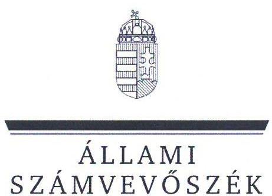
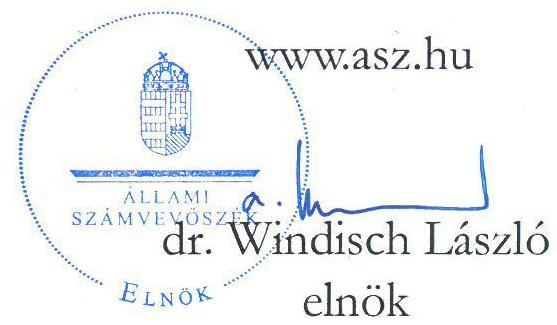
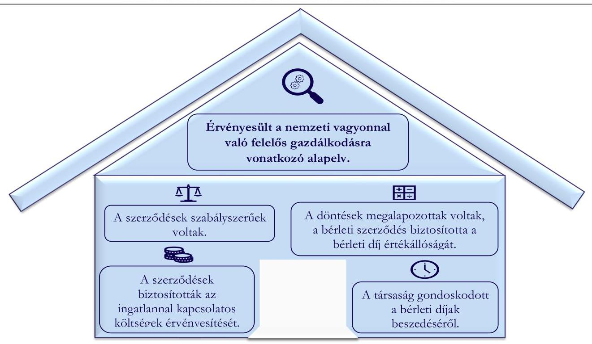

# JELENTÉS 

## A többségi állami tulajdonú gazdasági társaságok ingatlan bérbeadásának célzott ellenőrzése

Annamajori Mezőgazdasági és Kereskedelmi Korlátolt Felelősségű Társaság

2024.

---

ÁLLAMI
SZÁMVEVŐSZÉK

# JELENTÉS 

## A többségi állami tulajdonú gazdasági társaságok ingatlan bérbeadásának célzott ellenőrzése

Annamajori Mezőgazdasági és Kereskedelmi Korlátolt Felelősségű Társaság

2024.

24073

---

# ELLENŐRZÉSI IGAZGATÓSÁG: 

ÁLLAMI VAGYONGAZDÁLKODÁST ELLENŐRZŐ IGAZGATÓSÁG

ELLENŐRZÉSI IGAZGATÓ:
HERCZEGH ZSOLT ellenőrzési igazgató

ELLENŐRZÉSVEZETŐ:
Jelentéseink az interneten a www.asz.hu címen olvashatók.

IMRE ZSUZSANNA ellenőrzésvezető

IKTATÓSZÁM: EL-3915-009/2024
TÉMASZÁM: 2706
ELLENŐRZÉS-AZONOSÍTÓ SZÁM: V1050

---

# TARTALOMJEGYZÉK 

AZ ELLENŐRZÉS ALAPADATAI ..... 3
MEGÁLLAPÍTÁSOK ÉS KÖVETKEZTETÉSEK. ..... 5
MELLÉKLETEK ..... 8
I. sz. melléklet: Értelmező szótár ..... 8
II. sz. melléklet: Ellenőrzési kritériumok ..... 9
FÜGGELÉK: ÉSZREVÉTELEK ..... 10
RÖVIDÍTÉSEK JEGYZÉKE ..... 11

---

.

---

# AZ ELLENŐRZÉS ALAPADATAI 

## AZ ELLENŐRZÉS CÉLJA

Az ellenőrzés célja a gazdasági társaságnál az ingatlanbérbeadási szerződések szabályszerűségének és a kapcsolódó döntések megalapozottságának, valamint a bérleti díj értékállóságának, a bérleti díjakból eredő követelések érvényesítésének értékelése volt.

## AZ ELLENŐRZÖTT IDŐSZAK

A 2022. január 01. napjától 2023. június 30. napjáig tartó időszak.

## AZ ELLENŐRZÉS TÁRGYA

A többségi állami tulajdonú gazdasági társaság ingatlan bérbeadásra szóló szerződéseinek és módosításainak szabályszerűsége, a kapcsolódó döntések megalapozottsága, valamint a bérleti díj értékállóságának (az ingatlannal kapcsolatos költségek érvényesítésének) biztosítása, a bérleti díjakból eredő követelések érvényesítése volt.

Az ellenőrzés kiterjedt minden olyan körülményre és adatra, amely az Állami Számvevőszék (továbbiakban: ÁSZ ${ }^{1}$ ) jogszabályban meghatározott feladatainak teljesítéséhez, valamint a program végrehajtása folyamán felmerült újabb összefüggések feltárásához szükséges volt.

## AZ ELLENŐRZÉS JOGALAPJA

Az ellenőrzés jogszabályi alapját az ÁSZ tv. ${ }^{2} 1. § (3)$ bekezdése és az 5. § (4) bekezdése képezték.

## AZ ELLENŐRZÉS MÓDSZERE

Az ellenőrzést az ÁSZ a nemzetközi standardokat irányadónak tekintve az ellenőrzési program szempontjai, az ellenőrzött időszakban hatályos jogszabályok, az ellenőrzés szakmai szabályok és módszertanok figyelembevételével folytatta le.

Az ellenőrzési kérdések megválaszolásához szükséges bizonyítékok megszerzése az ellenőrzött szervezet által rendelkezésre bocsátott dokumentumokra és adatokra alapozva, a következő ellenőrzési eljárások alkalmazásával történt: megfigyelés, összehasonlítás, szemrevételezés, mintavételezés, elemző eljárás, kérdésfeltevés (interjú). Az ellenőrzési bizonyítékként felhasználható adatforrások közé tartoztak egyrészt az ellenőrzéshez kért dokumentumok, adatforrások, másrészt adatforrás volt minden - az ellenőrzés folyamán feltárt, az ellenőrzés szempontjából releváns információt tartalmazó - dokumentum.

Az ellenőrzés lefolytatásához az ellenőrzött szervezet a tanúsítvány kitöltésével, valamint az ÁSZ által kért dokumentumok, adatok, információk megküldésével és az ellenőrzés során szolgáltatott adatokat. Az

---

Annamajori Mezőgazdasági és Kereskedelmi Korlátolt Felelősségű Társaság a tanúsítványban szolgáltatott adatok alapján az ellenőrzött időszakban 32 db ingatlan bérbeadási szerződéssel rendelkezett. A mintavételezés keretében két db ingatlan bérbeadási szerződés került kiválasztásra. Az ÁSZ jelentése a mintatételek vonatkozásában tesz megállapítást, ad véleményt.

# AZ ELLENŐRZŐTT SZERVEZET 

## ANNAMAJORI MEZŐGAZDASÁGI ÉS KERESKEDELMI KORLÁTOLT FELELŐSSÉGŰ TÁRSASÁG

A Magyar Állam tulajdonában álló Annamajori Kft. ${ }^{3}$ 1993. december 31. napján alakult, a büntetés végrehajtási intézetekben szabadságvesztés büntetést töltő és egyéb jogcímen fogvatartottak kötelező foglalkoztatására létrehozott gazdálkodó szervezet. Az ellenőrzött időszakban az államot megillető tulajdonosi jogok és kötelezettségek összességét a Büntetés-végrehajtás Országos Parancsnoksága gyakorolta. Az Annamajori Kft. a BV. Holding elismert vállalatcsoport egyik ellenőrzött társasága volt. Az elismert vállalatcsoport uralkodó tagja a BV. Holding Korlátolt Felelősségű Társaság volt.

Fertás: Annamajori Kft. honlapja

Az Annamajori Kft. főtevékenysége a gabonaféle, hüvelyes növény, olajos mag termesztése, tevékenységei között szerepelt továbbá az állattenyésztés, bérmunka, kiskereskedelem, központosított ellátás, növénytermesztés, oktatás, élelmiszeripari, sütőüzemi tevékenység és ingatlan bérbeadása, üzemeltetése is. Az Annamajori Kft. székhelye Baracskán található. Az ellenőrzött időszakban fiókteleppel rendelkezett Szegeden.

Az Annamajori Kft. 2022. évi beszámolója alapján a mérlegfőösszege 2401,0 M Ft, a saját tőke összege 1170,5 M Ft, az értékesítés nettó árbevétele 2790,5 M Ft, a foglalkoztatottak átlagos statisztikai állományi létszáma 89 fő volt.

Az Annamajori Kft. az ellenőrzött időszakban a Taktv. ${ }^{4}$ 7/J. § (1) bekezdése és így a Gbkr. ${ }^{5}$ hatálya alá tartozott.

Az ellenőrzésre kiválasztott lakásbérleti szerződés ${ }^{6}$ megkötésére 2019. január 22. napján, 5 éves határozott időtartamra került sor, a szerződés a társaság tulajdonában álló lakáscélú ingatlan bérbeadására irányult, a szerződő partner a társaság alkalmazottja volt. Az ellenőrzésre kiválasztott bérleti szerződés ${ }^{7}$-t a társaság a BV. Holding Kft. ${ }^{8}$-vel 2022. április 1-én kötötte meg 5 éves határozott időtartamra, a szerződés a társaság tulajdonában álló kivett üzlet, udvar és kivett major bérbeadására irányult. A BV. Holding Kft. az ingatlant kiskereskedelmi tevékenység folytatása céljából bérelte.

---

# MEGÁLLAPÍTÁSOK ÉS KÖVETKEZTETÉSEK 

1. ábra

AZ ELLENŐRZÉS MEGÁLLAPÍTÁSAINAK ÖSSZEGZÉSE

Forrás: Az ellenőrzés során rendelkezésre bocsátott dokumentumok alapján ÁSZ saját szerkesztés

## Az Annamajori Kft. ellenőrzéssel érintett ingatlan bérbeadási szerződései a jogszabályi előírások alapján szabályszerűek voltak.

A lakásbérleti szerződés és a bérleti szerződés tartalmazta a bérlet tárgyát, időtartamát, a bérleti díj összegét, a késedelmes fizetés esetén alkalmazandó eljárásokat, a felmondási időt, valamint a szerződés megszűnése esetén követendő eljárásokat. A bérleti szerződésben és a lakásbérleti szerződésben is rendelkeztek arról, hogy a bérlő viseli a használattal együtt járó költségeket. A lakásbérleti szerződés és a bérleti szerződés szabályszerűek voltak, a Ptk. ${ }^{9}$ előírásaival összhangban kerültek elkészítésre. A lakásbérleti szerződés előírásai összhangban álltak a 1993. évi LXXVIII. törvény ${ }^{10}$ vonatkozó rendelkezéseivel.
Az Annamajori Kft. a bérleti szerződés megkötése során érvényesítette az Nvtv. ${ }^{11}$-ben rögzített, a nemzeti vagyonnal való felelős gazdálkodásra vonatkozó alapelvet, valamint a Taktv.-ben foglaltaknak megfelelően biztosította, hogy az ingatlan bérbeadási tevékenységét gazdaságosan hajtsa végre.

## Az Annamajori Kft. ellenőrzéssel érintett ingatlan bérbeadásaihoz kapcsolódó döntései megalapozottak voltak, a Bérleti szerződés a bérleti díj értékállóságát biztosította.

Az Annamajori Kft. a lakásbérleti szerződést a vele alkalmazásban álló munkavállalóval kötötte. Az Annamajori Kft. nyilatkozata alapján a lakásbérleti szerződés megkötése során az Annamajori Kft. alkalmazottai részére biztosított kedvezményes bérleti díj került megállapításra. A lakásbérleti szerződés nem tartalmazott rendelkezést a bérleti díj felülvizsgálatára, a bérleti díj emelésére. A lakásbérleti szerződés felülvizsgálatára, a bérleti díj emelésére az ellenőrzött időszakot követően aláírt módosítása kapcsán került

---

1. táblázat

A BÉRLETI SZERZŐDÉSHEZ ÉS A LAKÁSBÉRLETI SZERZŐDÉSHEZ KAPCSOLÓDÓ BEVÉTELEK ÉS TOVÁBBSZÁMLÁZOTT KÖLTSÉGEK (ADATOK EZER FORINTBAN)

| MEGNEVEZÉS | 2022. ÉV | 2023.   I. FÉLÉV |
| :-- | :--: | :--: |
| Ingatlan bérbeadásból származó   bevételek (bérleti díj) | 4546,4 | 3233,6 |
| Továbbszámlázott ráfordításokból   eredő bevételek | 8559,7 | 6007,6 |

Forrás: Az ellenőrzés során rendelkezésre bocsátott dokumentumok alapján ÁSZ saját szerkesztés
sor. Az Annamajori Kft.-nek a lakásbérleti szerződésre vonatkozó döntései az ingatlan jellegére és a korlátozott hasznosítási lehetőségekre, a speciális szerződéses viszonyra (munkavállalóval kötött szerződés) tekintettel megalapozottak voltak, így az Nvtv.-ben rögzített, a nemzeti vagyonnal való felelős gazdálkodásra vonatkozó alapelv érvényesült.
Az Annamajori Kft. nyilatkozata alapján a BV. Holding Kft.-vel, mint az elismert vállalatcsoport uralkodó tagjával kötött bérleti szerződésben megjelölt bérleti díj közös megállapodás alapján került megállapításra. A bérleti szerződésben rendelkeztek a bérleti díj évenkénti történő felülvizsgálatáról, annak megemeléséről a KSH által közzétett inflációs ráta mértékével egyezően, biztosítva a bérleti díj értékállóságát. Az Annamajori Kft. a 2023. évben élt a bérleti díj megemelésének a bérleti szerződésben biztosított lehetőségével. Az Annamajori Kft.-nek a bérleti szerződésre vonatkozó döntései az ingatlan jellegére és a korlátozott hasznosítási lehetőségekre, a speciális szerződéses viszonyra (uralkodó taggal kötött szerződés) tekintettel megalapozott volt, így az Nvtv.-ben rögzített, a nemzeti vagyonnal való felelős gazdálkodásra vonatkozó alapelv érvényesült.
Az Annamajori Kft. a lakásbérleti szerződés és a bérleti szerződés tekintetében döntéseit írásba foglalta, ezzel megfelelt a Gbkr.-ben foglaltaknak.
Az Annamajori Kft. kialakította az ingatlan bérbeadási tevékenységének nyomon követését biztosító rendszer kereteit, a rendelkezésre bocsátott analitikus nyilvántartás ${ }^{12}$ tartalmazta az ellenőrzött időszakra vonatkozóan a bérlők részére kiállított számlák nettó és bruttó összegét, a számlák keltét, a teljesítés időpontját, a számla esedékességét, valamint a kiegyenlítés dátumát. Az ingatlan bérbeadás tekintetében a nyomon követési rendszer működése biztosított volt, ezzel megfelelt a Gbkr.-ben foglaltaknak.

# Az Annamajori Kft. ellenőrzéssel érintett ingatlan bérbeadási szerződései biztosították a bérbeadott ingatlannal kapcsolatos költségek érvényesítését. 

A lakásbérleti szerződésben megjelölt bérleti díj az ellenőrzött időszakban nem változott. A lakásbérleti szerződésben rendelkeztek arról, hogy a lakással kapcsolatos közüzemi díjakat, karbantartási költségeket, felújítási költségeket a bérlő viseli. A rendelkezésre bocsátott analitikus nyilvántartás alapján a lakás bérbeadással kapcsolatban ráfordítások az ellenőrzött időszakban az Annamajori Kft.-nél nem merültek fel, összhangban a lakásbérleti szerződésben foglaltakkal.
A bérleti szerződés tartalmazta, hogy a bérleti díjon felül a bérlő viseli a használattal együtt járó közüzemi költségeket, amelyek elszámolására a közmű szolgáltatók által számlázott egységárak figyelembevételével tovább számlázás útján került sor. Az Annamajori Kft. a bérleti szerződésben biztosított lehetőség alapján a bérleti díj összegét 2023. január 1-től 7,0%-kal megemelte, valamint a bérbeadott ingatlannal kapcsolatosan felmerült közüzemi díjakat (áram-, víz-, gázdíj) az ellenőrzött időszakban tovább számlázta a bérlő részére, így érvényesült az Nvtv.-ben rögzített, a nemzeti vagyonnal való felelős gazdálkodásra vonatkozó alapelv.
Az Annamajori Kft. ellenőrzött időszakra vonatkozó ingatlan bérbeadásból származó bérleti díjbevételeit és a továbbszámlázott ráfordításokat az 1. táblázat mutatja be. A bérbeadásból származó bevételekről számviteli nyilvántartás számlánkénti bontásban tartalmazta az ellenőrzött időszakra vonatkozóan az

---

Annamajori Kft. ingatlan bérbeadásból származó bevételeit és ráfordításait. Az Annamajori Kft. nyomon követte az ingatlan bérbeadási tevékenységgel kapcsolatban felmerült bevételeket és továbbszámlázott ráfordításokat a bérbe adott ingatlannal kapcsolatosan, ezzel megfelelt a Gbkr.-ben foglalt előírásoknak.
Az Annamajori Kft.-nél a bérleti díj évenkénti megemelésének a bérleti szerződésben foglalt lehetőségével, annak ellenőrzött időszakban történő érvényesítésével, valamint az ingatlannal kapcsolatos közüzemi díjak viselésének a lakásbérleti szerződésbe és bérleti szerződésbe foglalásával, továbbá a bérbeadásból származó bevételek és a kapcsolódó ráfordítások nyomon követésével érvényesült az Nvtv.-ben rögzített, a nemzeti vagyonnal való felelős gazdálkodásra vonatkozó alapelv.

# Az Annamajori Kft. az ellenőrzéssel érintett ingatlan bérbeadási szerződései tekintetében gondoskodott a bérleti díjak beszedéséről. 

Az Annamajori Kft.-nek az ellenőrzött időszakban a lakásbérleti szerződésből eredően 2023. I. félévében hat havi bérleti díjat tartalmazó határidőn túli követelése keletkezett. Az Annamajori Kft. a bérlő nem fizetése miatt az ingatlan bérleti díjak beszedése érdekében intézkedett, 2023. május 5. napján fizetési felszólítást küldött a bérlőnek. A tartozás bérlő általi megfizetésére az ellenőrzött időszak végéig nem került sor.
Az Annamajori Kft.-nek az ellenőrzött időszakban a bérleti szerződésből eredően határidőn túli követelése nem keletkezett.
Az Annamajori Kft. az ellenőrzött lakásbérleti szerződés és bérleti szerződés alapján az ingatlan bérbeadási tevékenysége során előforduló, a vagyoni, pénzügyi, jövedelmi helyzetére kiható gazdasági eseményeket a követelésekről vezetett nyilvántartásban folyamatosan rögzítette, ezzel megfelelt a Számv. tv. ${ }^{13}$-ben foglaltaknak.
Az Annamajori Kft. a lakásbérleti szerződésben és a bérleti szerződésben meghatározta a késedelmes vagy nem fizetés esetén alkalmazandó eljárásokat, ezzel megfelelt a Gbkr.-ben foglaltaknak. Az Annamajori Kft. a lakásbérleti szerződés a bérleti szerződés tekintetében kialakította az eredményes gazdálkodás kereteit, melynek során kontrollokat épített ki a bérleti díjak
 beszedésének érdekében, valamint nyomon követte a követelések pénzügyi teljesülését, ezzel megfelelt a Gbkr. előírásaiban foglaltaknak és érvényesítette az Nvtv.-ben rögzített, a nemzeti vagyonnal való felelős gazdálkodásra vonatkozó alapelvet.

---

# MELLÉKLETEK 

- I. SZ. MELLÉKLET: ÉRTELMEZŐ SZÓTÁR
gazdasági társaság
többségi állami tulajdon
többségi befolyás

A gazdasági társaságok üzletszerű közös gazdasági tevékenység folytatására, a tagok vagyoni hozzájárulásával létrehozott, jogi személyiséggel rendelkező vállalkozások, amelyekben a tagok a nyereségből közösen részesednek, és a veszteséget közösen viselik. Forrás: Ptk. 3:88. § (1) bekezdése
Az állam tulajdonában lévő tagsági jogviszonyt megtestesítő értékpapír, illetve az állam tulajdonában lévő egyéb társasági részesedés, amennyiben a társaságban a Magyar Állam közvetlenül vagy közvetetten a szavazatok több mint felével rendelkezik.
Forrás: ÁSZ definíció a Vtv. ${ }^{14}$ 1. § (2) bekezdés c) pontja és a Ptk. 8:2. § (1), (3)-(4) bekezdései alapján

Olyan kapcsolat, amelynek révén a befolyással rendelkező egy jogi személyben a szavazatok több mint ötven százalékával - közvetlenül vagy a jogi személyben szavazati joggal rendelkező más jogi személy (köztes vállalkozás) szavazati jogán keresztül - rendelkezik, azzal, hogy a közvetett módon való rendelkezés meghatározása során a jogi személyben szavazati joggal rendelkező más jogi személyt (köztes vállalkozást) megillető szavazati hányadot meg kell szorozni a befolyással rendelkezőnek a köztes vállalkozásban, illetve vállalkozásokban fennálló szavazati hányadával, ha azonban a köztes vállalkozásban fennálló szavazatainak hányada az ötven százalékot meghaladja, akkor azt egy egészként kell figyelembe venni. A befolyás számításánál nem kell figyelembe venni a huszonöt százalékot el nem érő közvetett befolyást.
Forrás: Taktv. 1. § b) pont

---

# II. SZ. MELLÉKLET: ELLENŐRZÉSI KRITÉRIUMOK 

## ELLENŐRZÉSI KRITÉRIUMOK

Nvtv. 7. § (1), (2) bekezdés
Taktv. 7/J. § (3) bekezdés a)-d) és f) pontok
Ptk. 6:331-6:341. §
Számv. tv. 12. § (1), 14. § (5) bekezdés c) pont, 16. § (1) bekezdés, 29. §, 164. § (1), (2) bekezdés
Gbkr. 3. § (1) bekezdés e) pont, 4. § (1) bekezdés c) pont, (3) bekezdés, 6. § (1), (2) bekezdés, 8. §
1993. évi LXXVIII. törvény 2. § (5) bekezdés, 12. § (1), (2), (4) bekezdés, 21. § (1) bekezdés

---

# FÜGGELÉK: ÉSZREVÉTELEK 

A jelentéstervezetet a Számvevőszék 15 napos észrevételezésre megküldte az ellenőrzött szervezet vezetőjének az ÁSZ tv. 29. § (1) bekezdése előírásának megfelelően.

Az Annamajori Mezőgazdasági és Kereskedelmi Korlátolt Felelősségű Társaság észrevételt nem tett.

[^0]
[^0]:    * 29. § (1) Az Állami Számvevőszék az ellenőrzési megállapításait megküldi az ellenőrzött szervezet vezetőjének vagy az általa megbízott személynek, és annak, akinek személyes felelősségét állapította meg.
    (2) Az ellenőrzött szervezet vezetője és a felelősként megjelölt személy az ellenőrzés megállapításaira tizenöt napon belül írásban észrevételt tehet.
    (3) Az Állami Számvevőszék az észrevételre a beérkezésétől számított harminc napon belül írásban válaszol. A figyelembe nem vett észrevételeket köteles a jelentésben feltüntetni, és megindokolni, hogy azokat miért nem fogadta el.

---

# RÖVIDÍTÉSEK JEGYZÉKE 

${ }^{1}$ ÁSZ
${ }^{2}$ ÁSZ tv.
${ }^{3}$ Annamajori Kft.
${ }^{4}$ Taktv.
${ }^{5}$ Gbkr.
${ }^{6}$ lakásbérleti szerződés
${ }^{7}$ bérleti szerződés
${ }^{8}$ Bv. Holding Kft.
${ }^{9}$ Ptk.
${ }^{10}$ 1993. évi LXXVIII. törvény
${ }^{11}$ Nvtv.
${ }^{12}$ analitikus nyilvántartás
${ }^{13}$ Számv. tv.
${ }^{14}$ Vtv.

Állami Számvevőszék
2011. évi LXVI. törvény az Állami Számvevőszékről

Annamajori Mezőgazdasági és Kereskedelmi Korlátolt Felelősségű Társaság
2009. évi CXXII. törvény a köztulajdonban álló gazdasági társaságok takarékosabb működéséről
339/2019. (XII. 23.) Korm. rendelet a köztulajdonban álló gazdasági társaságok belső kontrollrendszeréről
Az Annamajori Kft. és alkalmazottja között Baracskán, 2019. január 22. napján kelt lakásbérleti szerződés
Az Annamajori Kft. és a Bv. Holding között 2022. április 1. napján létrejött bérleti szerződés kivett üzlet, udvar ( 492 m 2 ) és kivett major ( 1523 m 2 ) és az ahhoz tartozó raktár és irodahelyiség ( $271,12 \mathrm{~m} 2$ ) tekintetében
Bv. Holding Korlátolt Felelősségű Társaság
2013. évi V. törvény a Polgári Törvénykönyvről
1993. évi LXXVIII. törvény a lakások és helyiségek bérletére, valamint az elidegenítésükre vonatkozó egyes szabályokról
2011. évi CXCVI. törvény a nemzeti vagyonról

Az Annamajori Kft. által rendelkezésre bocsátott, az ingatlanok bérbeadásából származó bevételeket és tovább számlázott ráfordításokat tartalmazó analitikus nyilvántartás a 2022.01.01-2023.06.30. időszakra vonatkozóan
2000. évi C. törvény a számvitelről
2007. évi CVI. törvény az állami vagyonról

---

1052 Budapest, Apáczai Csere János u. 10. | 1364 Budapest 4., Pf. 54
www.asz.hu | szamvevoszek@asz.hu
telefon: +36 14849100
