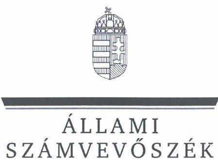
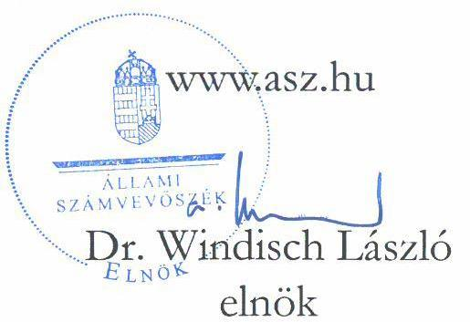
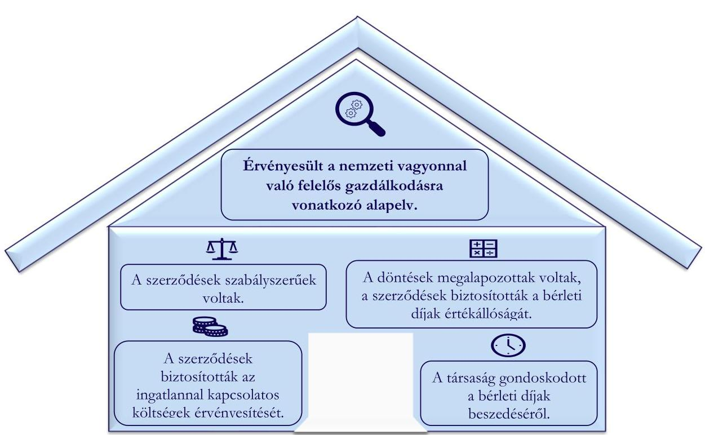

# JELENTÉS 

## A többségi állami tulajdonú gazdasági társaságok ingatlan bérbeadásának célzott ellenőrzése

DUNA PAPÍR Termelő, Kereskedelmi és Szolgáltató Korlátolt
Felelősségű Társaság

2024.

---

ÁLLAMI
SZÁMVEVŐSZÉK

# JELENTÉS 

## A többségi állami tulajdonú gazdasági társaságok ingatlan bérbeadásának célzott ellenőrzése

DUNA PAPÍR Termelő, Kereskedelmi és Szolgáltató Korlátolt
Felelősségű Társaság

2024. 

24074

---

# ELLENŐRZÉSI IGAZGATÓSÁG: 

ÁLLAMI VAGYONGAZDÁLKODÁST ELLENŐRZŐ IGAZGATÓSÁG

## ELLENŐRZÉSI IGAZGATÓ:

HERCZEGH ZSOLT ellenőrzési igazgató

## ELLENŐRZÉSVEZETŐ:

Jelentéseink az interneten a www.asz.hu címen olvashatók.

IMRE ZSUZSANNA ellenőrzésvezető

IKTATÓSZÁM: EL-3915-011/2024
TÉMASZÁM: 2706
ELLENŐRZÉS-AZONOSÍTÓ SZÁM: V1050

---

# TARTALOMJEGYZÉK 

AZ ELLENŐRZÉS ALAPADATAI ..... 5
MEGÁLLAPÍTÁSOK ÉS KÖVETKEZTETÉSEK. ..... 7
MELLÉKLETEK ..... 10
I. sz. melléklet: Értelmező szótár ..... 10
II. sz. melléklet: Ellenőrzési kritériumok ..... 11
FÜGGELÉK: ÉSZREVÉTELEK ..... 12
RÖVIDÍTÉSEK JEGYZÉKE ..... 13

---

.

---

# AZ ELLENŐRZÉS ALAPADATAI 

## AZ ELLENŐRZÉS CÉLJA

Az ellenőrzés célja a gazdasági társaságnál az ingatlan bérbeadási szerződések szabályszerűségének és a kapcsolódó döntések megalapozottságának, valamint a bérleti díj értékállóságának, a bérleti díjakból eredő követelések érvényesítésének értékelése volt.

## AZ ELLENŐRZÖTT IDŐSZAK

A 2022. január 01. napjától 2023. június 30. napjáig tartó időszak.

## AZ ELLENŐRZÉS TÁRGYA

A többségi állami tulajdonú gazdasági társaság ingatlan bérbeadásra szóló szerződéseinek és módosításainak szabályszerűsége, a kapcsolódó döntések megalapozottsága, valamint a bérleti díj értékállóságának (az ingatlannal kapcsolatos költségek érvényesítésének) biztosítása, a bérleti díjakból eredő követelések érvényesítése volt.

Az ellenőrzés kiterjedt minden olyan körülményre és adatra, amely az Állami Számvevőszék (továbbiakban: ÁSZ ${ }^{1}$ ) jogszabályban meghatározott feladatainak teljesítéséhez, valamint a program végrehajtása folyamán felmerült újabb összefüggések feltárásához szükséges volt.

## AZ ELLENŐRZÉS JOGALAPJA

Az ellenőrzés jogszabályi alapját az ÁSZ tv. ${ }^{2} 1 . \int(3)$ bekezdése és az 5. $\int(4)$ bekezdése képezték.

## AZ ELLENŐRZÉS MÓDSZERE

Az ellenőrzést az ÁSZ a nemzetközi standardokat irányadónak tekintve az ellenőrzési program szempontjai, az ellenőrzött időszakban hatályos jogszabályok, az ellenőrzés szakmai szabályok és módszertanok figyelembevételével folytatta le.

Az ellenőrzési kérdések megválaszolásához szükséges bizonyítékok megszerzése az ellenőrzött szervezet által rendelkezésre bocsátott dokumentumokra és adatokra alapozva, a következő ellenőrzési eljárások alkalmazásával történt: megfigyelés, összehasonlítás, szemrevételezés, mintavételezés, elemző eljárás, kérdésfeltevés (interjú). Az ellenőrzési bizonyítékként felhasználható adatforrások közé tartoztak egyrészt az ellenőrzéshez kért dokumentumok, adatforrások, másrészt adatforrás volt minden - az ellenőrzés folyamán feltárt, az ellenőrzés szempontjából releváns információt tartalmazó - dokumentum.

Az ellenőrzés lefolytatásához az ellenőrzött szervezet a tanúsítvány kitöltésével, valamint az ÁSZ által kért dokumentumok, adatok, információk megküldésével és az ellenőrzés során szolgáltatott adatokat. A

---

tanúsítvány adatai alapján a DUNA PAPÍR Termelő, Kereskedelmi és Szolgáltató Korlátolt Felelősségű Társaság az ellenőrzött időszakban kilenc darab ingatlan bérbeadási szerződéssel rendelkezett. A mintavételezés keretében kettő darab ingatlan bérbeadási szerződés került kiválasztásra. Az ÁSZ jelentése a mintatételek vonatkozásában tesz megállapítást, ad véleményt.

# AZ ELLENŐRZÖTT SZERVEZET 

## DUNA PAPÍR TERMELŐ, KERESKEDELMI ÉS SZOLGÁLTATÓ KORLÁTOLT FELELŐSSÉGŰ TÁRSASÁG

A Magyar Állam tulajdonában álló DUNA PAPÍR Kft. ${ }^{3}$ 1993. december 31-én alakult, a büntetés végrehajtási intézetekben szabadságvesztés büntetést töltő fogvatartottak kötelező foglalkoztatására létrehozott gazdálkodó szervezet. Az ellenőrzött időszakban az államot megillető tulajdonosi jogok és kötelezettségek összességét a Büntetés-végrehajtás Országos Parancsnoksága gyakorolta. A DUNA PAPÍR Kft. a BV. Holding elismert vállalatcsoport egyik ellenőrzött társasága volt. Az elismert vállalatcsoport uralkodó tagja a BV. Holding Korlátolt Felelősségű Társaság volt.

A DUNA PAPÍR Kft. fő tevékenysége háztartási egészségügyi papírtermék gyártása, tevékenységei között szerepel iratmegsemmisítés és bérmunka is.

A DUNA PAPÍR Kft. székhelye Tökölön található, az ellenőrzött időszakban telephellyel és fiókteleppel nem rendelkezett.

A DUNA PAPÍR Kft. 2022. évi beszámolója alapján mérlegfőösszege 1857 812,0 E Ft, a saját tőke összege 1076 524,0 E Ft, az értékesítés nettó árbevétele 3050 518,0 E Ft, a foglalkoztatottak átlagos statisztikai állományi létszáma 52 fő volt.

A DUNA PAPÍR Kft. az ellenőrzött időszakban a Taktv. ${ }^{4}$ 7/J. § (1) bekezdése és így a Gbkr. ${ }^{5}$ hatálya alá tartozott.

Az ellenőrzésre kiválasztott, 2019. november 01. napjától hatályos, az ellenőrzött időszakban két alkalommal módosított bérleti szerződés; ${ }^{6}$ egy $986 \mathrm{~m}^{2}$ alapterületű, fedett munkacsarnok határozatlan időtartamú bérbeadására vonatkozott. A bérleti szerződés ${ }_{1}$ 2022. június 01. napjával új bérlőre történő átruházását követően jött létre a bérleti szerződés ${ }_{2}{ }^{\top}$. A bérleti szerződés ${ }_{2}$ módosítására az ellenőrzött időszakban négy alkalommal került sor.

---

# MEGÁLLAPÍTÁSOK ÉS KÖVETKEZTETÉSEK 

1. ábra

AZ ELLENŐRZÉS MEGÁLLAPÍTÁSAINAK ÖSSZEGZÉSE

Forrás: Az ellenőrzés során rendelkezésre bocsátott dokumentumok alapján ÁSZ saját szerkesztés

## A DUNA PAPÍR Kft. ellenőrzéssel érintett ingatlan bérbeadási szerződései a jogszabályi és a belső irányító eszközökben foglalt előírások alapján szabályszerűek voltak.

A DUNA PAPÍR Kft.-nél az ellenőrzött időszakban a szerződéskötések rendjét a BV. Holding vállalatcsoport valamennyi tagjára és az általuk létesítendő szerződésekre kiterjedő Jogi szabályzat ${ }_{1,2}{ }^{8,9}$ szabályozta. A bérleti szerződésekben alkalmazandó bérleti díjak ügyvezetői intézkedés ${ }^{10}$-ben és ügyvezetői utasítás ${ }^{11}$-ban kerültek meghatározásra. A DUNA PAPÍR Kft. kialakította a szerződéskötések rendjét, valamint meghatározta az ingatlanbérbeadási tevékenységre vonatkozó kontrollokat, amivel megfelelt a Gbkr.-ben foglalt követelményeknek. A bérleti szerződés ${ }_{1,2}$-ek tartalmazták a bérlet tárgyát, a bérleti díj összegét, fizetésének módját, gyakoriságát, a költségviselést, a bérlet időtartamát, a késedelmes fizetés, valamint a nem rendeltetésszerű használat esetén alkalmazandó eljárást, a bérbeadó szavatosságát és szerződés megszűnése esetén követendő eljárást. A bérleti szerződés ${ }_{1,2}$-ek tartalmazták a jogi szabályzat ${ }_{1}$-ban előírt tartalmi elemeket. A bérleti szerződés ${ }_{1,2}$-ek ellenőrzött időszakban történt módosításai során a bérleti díjak meghatározása a hatályos ügyvezetői intézkedésben és ügyvezetői utasításban rögzített bérleti díjak érvényesítésével történt. A bérleti szerződés ${ }_{1,2}$-ek és módosításaik szabályszerűek voltak, a Ptk. ${ }^{12}$ előírásaival és a belső irányító eszközökben foglaltakkal összhangban kerültek elkészítésre.
A DUNA PAPÍR Kft. a bérleti szerződés ${ }_{1,2}$-ek létrehozása során érvényesítette az Nvtv. ${ }^{13}$-ben rögzített, a nemzeti vagyonnal való felelős gazdálkodásra vonatkozó alapelveket, valamint a Taktv.-ben foglaltaknak megfelelően biztosította, hogy gazdálkodása során az ingatlanbérbeadási tevékenységét gazdaságosan hajtsa végre.

---

# A DUNA PAPÍR Kft. ellenőrzéssel érintett ingatlan bérbeadásához kapcsolódó döntései a bérleti szerződés ${ }_{1,2}$ tekintetében megalapozottak voltak és a bérleti díj értékállóságát biztosították. 

A DUNA PAPÍR Kft. a bérleti szerződés ${ }_{1,2}$-ek megkötését megelőzően készített és a BVOP ${ }^{14}$ Gazdasági Társaságok Főosztálya részére megküldött előterjesztésben és a bérleti szerződés ${ }_{1,2}$-ekben rögzítette a szerződéskötés indokoltságát, amivel biztosította az ingatlan bérbeadási szerződésekre vonatkozó döntések célszerűségi, gazdaságossági szempontú megalapozottságát. A DUNA PAPÍR Kft. a bérleti szerződés ${ }_{1,2}$-ekben rögzítette a bérlő bérleti díjon felüli fizetési (közüzemi díjak) kötelezettségeit. A bérleti szerződés ${ }_{1,2}$-ekben rögzítésre került, hogy a bérbeadó a bérleti díjat évenként, a hivatalosan megállapított inflációs rátának megfelelően módosíthatja, biztosítva a bérleti díj értékállóságát. A DUNA PAPÍR Kft. az ellenőrzött időszakban alkalmazandó bérleti díj mértékét a 2022. évre vonatkozóan ügyvezetői intézkedésben $600 \mathrm{Ft} / \mathrm{m}^{2}$ összegben, 2023. évre vonatkozóan ügyvezetői utasításban $660 \mathrm{Ft} / \mathrm{m}^{2}$ összegben határozta meg - melyet 2023. január 01-től a bérleti szerződés ${ }_{2}$-ben is érvényesített -, figyelemmel a környező vállalkozások esetében ismert bérleti díjakra, illetve egyezség alapján, a büntetésvégrehajtási jogkorlátozások miatti sajátosságokra tekintettel. A DUNA PAPÍR Kft. a bérleti szerződés ${ }_{1,2}$ eket az ellenőrzött időszak alatt felülvizsgálta, többször módosította, részben a bérleti díjmértékének, részben a bérlő által bérbe vett terület nagyságának változása következtében.
A bérleti szerződés ${ }_{1,2}$-ek és módosításaik, a döntéselőkészítő előterjesztésben foglaltak biztosították az ingatlan bérbeadási szerződésre vonatkozó döntések célszerűségi, gazdaságossági szempontú megalapozottságát, megfelelve a Gbkr. előírásainak. A DUNA PAPÍR Kft. a bérleti szerződés ${ }_{1,2}$-ek módosításainak indokát dokumentálta, a módosításokat, a bérleti díjakkal kapcsolatos döntéseit írásba foglalta, ezzel megfelelt a Gbkr.-ben foglaltaknak, érvényesültek az Nvtv.-ben rögzített, a nemzeti vagyonnal való felelős gazdálkodásra vonatkozó alapelvek.
A DUNA PAPÍR Kft. kialakította az ingatlan bérbeadási tevékenységének, valamint a célok megvalósításának nyomon követését biztosító rendszer kereteit, folyamatosan vezette a bérlőkkel szembeni követelések nyilvántartását, amely tartalmazta a bizonylat számát, bizonylat dátumát, a könyvelés dátumát, a követelés összegét, az esedékesség dátumát és kiegyenlítés dátumát, a bérbeadáshoz kapcsolódó ráfordításokat ingatlanonként, a bérlők részére továbbszámlázott tételeket szerződő partnerenként rögzítette, a továbbszámlázott tételeket alátámasztó elszámolásokat jegyzőkönyvben rögzítette. Az ingatlan bérbeadás tekintetében a nyomon követési rendszer működése biztosított volt, ezzel megfelelt a Gbkr.-ben foglaltaknak.

## A DUNA PAPÍR Kft. ellenőrzéssel érintett ingatlanbérbeadási szerződései biztosították a bérbeadott ingatlanokkal kapcsolatos költségek érvényesítését.

A bérleti szerződés ${ }_{1}$ az ellenőrzött időszakban két alkalommal, a bérleti szerződés ${ }_{2}$ négy alkalommal került módosításra. A bérleti szerződés ${ }_{1,2}$-ek módosításai során a bérleti díj megállapítása a hatályos ügyvezetői intézkedés és ügyvezetői utasításban foglalt mértékkel összhangban történt. A bérleti szerződés ${ }_{1,2}$-ek rendelkeztek arról, hogy a közüzemi díjakat a bérlő köteles megfizetni, valamint, hogy a bérlő átalakítási és felújítási munkálatokat kizárólag a bérbeadó engedélyével folytathat, továbbá kizárták, hogy a bérlő az esetleges értéknövelő beruházások ellenértékét a bérbeadótól követelje. A DUNA PAPÍR Kft. a bérleti szerződés ${ }_{1,2}$-ek alapján bérbeadott ingatlannal kapcsolatban felmerült közüzemi díjakat tovább számlázta a bérlő részére. A bérleti szerződés ${ }_{1,2}$-ekhez kapcsolódó bevételeket és tovább számlázott ráfordításokat az. 1. táblázat mutatja be.

---

| 1. táblázat |  |   |
| --- | --- | --- |
|  A BÉRLETI SZERZŐDÉS ${ }_{1,2}$ ALAPJÁN ELÉRT EREDMÉNY (ADATOK E FT-BAN)) |  |   |
|  MEGNEVEZÉS | 2022. ÉV | 2023. ÉV I. FÉLÉV  |
|  BEVÉTEL | 9 977,9 | 5 539,0  |
|  - ebből bérleti díj | 6 614,0 | 3 614,2  |
|  - ebből továbbszámlázott ráfordításokból származó bevétel | 3 363,9 | 1 924,8  |
|  RÁFORDÍTÁSOK | 4 433,2 | 2 311,9  |
|  ebből továbbszámlázott ráfordítások | 3 363,9 | 1 924,8  |
|  egyéb költségek | 1 071,3 | 387,1  |
|  EREDMÉNY | 5 544,7 | 3 227,1  |
|  Forrás: Az ellenőrzés során rendelkezésre bocsátott dokumentumok alapján ÁSZ saját szerkesztés |  |   |

A DUNA PAPÍR Kft. által rendelkezésre bocsátott nyilvántartások ${ }^{15}$ tartalmazták az ellenőrzött időszakra vonatkozóan az ingatlan bérbeadásból származó bevételeket és kapcsolódó ráfordításokat számlánkénti bontásban. A DUNA PAPÍR Kft. nyomon követte az ingatlan bérbeadási tevékenységgel kapcsolatban felmerült bevételeket és továbbszámlázott ráfordításokat ingatlan bérbeadási szerződésenként, ezzel megfelelt a Gbkr.-ben foglalt előírásoknak. A DUNA PAPÍR Kft. ingatlan bérbeadásból származó árbevételei - a rendelkezésre bocsátott számviteli nyilvántartások alapján - a bérleti szerződés ${ }_{1,2}$-ei esetében (2022. évben, valamint 2023. év I. félévében is) meghaladták a kapcsolódó ráfordításokat, így érvényesültek az Nvtv.-ben rögzített, a nemzeti vagyonnal való felelős gazdálkodásra vonatkozó alapelvek, valamint a Taktv.-ben foglalt, a gazdaságos és eredményes gazdálkodásra vonatkozó követelmények.

# A DUNA PAPÍR Kft.
 az ellenőrzéssel érintett ingatlan bérbeadási szerződései tekintetében gondoskodott a bérleti díjak beszedéséről.

A DUNA PAPÍR Kft.-nek az ellenőrzött időszakban a bérleti szerződés ${ }_{1}$-ből eredően a 2022. március havi bérleti díj késedelme kapcsán keletkezett határidőn túli követelése. A DUNA PAPÍR Kft. a bérlő nem fizetése miatt az ingatlan bérleti díjak beszedése érdekében intézkedett, három alkalommal került sor fizetési felszólítás kiállítására. A követelés nyilvántartás alapján a bérleti díj hátralék 2022. június 30. napján kiegyenlítésre került. A DUNA PAPÍR Kft. a bérleti szerződés ${ }_{1,2}$-ek alapján az ingatlan bérbeadási tevékenysége során előforduló, a vagyoni, pénzügyi, jövedelmi helyzetére kiható gazdasági eseményeket a követelésekről vezetett nyilvántartásban folyamatosan rögzítette, ezzel megfelelt a Számv. tv. ${ }^{16}$-ban foglaltaknak. A DUNA PAPÍR Kft. a bérleti szerződés ${ }_{1,2}$-ek tekintetében nyomon követte a követelések pénzügyi teljesülését, intézkedéseket tett a bérlők késedelmes fizetése esetén, ezzel megfelelt a Gbkr. előírásaiban foglaltaknak és érvényesítette az Nvtv.-ben rögzített, a nemzeti vagyonnal való felelős gazdálkodásra vonatkozó alapelveket.

---

# MELLÉKLETEK 

- I. SZ. MELLÉKLET: ÉRTELMEZŐ SZÓTÁR
gazdasági társaság
többségi állami tulajdon
többségi befolyás

A gazdasági társaságok üzletszerű közös gazdasági tevékenység folytatására, a tagok vagyoni hozzájárulásával létrehozott, jogi személyiséggel rendelkező vállalkozások, amelyekben a tagok a nyereségből közösen részesednek, és a veszteséget közösen viselik. Forrás: Ptk. 3:88. § (1) bekezdése
Az állam tulajdonában lévő tagsági jogviszonyt megtestesítő értékpapír, illetve az állam tulajdonában lévő egyéb társasági részesedés, amennyiben a társaságban a Magyar Állam közvetlenül vagy közvetetten a szavazatok több mint felével rendelkezik.
Forrás: ÁSZ definíció a Vtv. ${ }^{17}$ 1. § (2) bekezdés c) pontja és a Ptk. 8:2. § (1), (3)-(4) bekezdései alapján

Olyan kapcsolat, amelynek révén a befolyással rendelkező egy jogi személyben a szavazatok több mint ötven százalékával - közvetlenül vagy a jogi személyben szavazati joggal rendelkező más jogi személy (köztes vállalkozás) szavazati jogán keresztül - rendelkezik, azzal, hogy a közvetett módon való rendelkezés meghatározása során a jogi személyben szavazati joggal rendelkező más jogi személyt (köztes vállalkozást) megillető szavazati hányadot meg kell szorozni a befolyással rendelkezőnek a köztes vállalkozásban, illetve vállalkozásokban fennálló szavazati hányadával, ha azonban a köztes vállalkozásban fennálló szavazatainak hányada az ötven százalékot meghaladja, akkor azt egy egészként kell figyelembe venni. A befolyás számításánál nem kell figyelembe venni a huszonöt százalékot el nem érő közvetett befolyást.
Forrás: Taktv. 1. § b) pont

---

# II. SZ. MELLÉKLET: ELLENŐRZÉSI KRITÉRIUMOK 

## ELLENŐRZÉSI KRITÉRIUMOK

Nvtv. 7. § (1), (2) bekezdés
Taktv. 7/J. § (3) bekezdés a) -d) és f) pontok
Ptk. 6:331-6:341. §
Számv. tv. 12. § (1), 14. § (5) bekezdés c) pont, 16. § (1) bekezdés, 29. §, 164. § (1), (2) bekezdés
Gbkr. 3. § (1) bekezdés e) pont, 4. § (1) bekezdés c) pont, (3) bekezdés, 6. § (1), (2) bekezdés, 8. §
Jogi szabályzat ${ }_{1,2}$
Ügyvezetői intézkedés
Ügyvezetői utasítás

---

# FÜGGELÉK: ÉSZREVÉTELEK 

A jelentéstervezetet a Számvevőszék 15 napos észrevételezésre megküldte az ellenőrzött szervezet vezetőjének az ÁSZ tv. 29. § (1) bekezdése előírásának megfelelően.

A DUNA PAPÍR Termelő, Kereskedelmi és Szolgáltató Korlátolt Felelősségű Társaság észrevételt nem tett.

* 29. § (1) Az Állami Számvevőszék az ellenőrzési megállapításait megküldi az ellenőrzött szervezet vezetőjének vagy az általa megbízott személynek, és annak, akinek személyes felelősségét állapította meg.
(2) Az ellenőrzött szervezet vezetője és a felelősként megjelölt személy az ellenőrzés megállapításaira tizenöt napon belül írásban észrevételt tehet.
(3) Az Állami Számvevőszék az észrevételre a beérkezésétől számított harminc napon belül írásban válaszol. A figyelembe nem vett észrevételeket köteles a jelentésben feltüntetni, és megindokolni, hogy azokat miért nem fogadta el.

---

# RÖVIDÍTÉSEK JEGYZÉKE 

${ }^{1}$ ÁSZ ${ }^{2}$ ÁSZ tv. ${ }^{3}$ DUNA PAPÍR Kft. ${ }^{4}$ Taktv. ${ }^{5}$ Gbkr. ${ }^{6}$ bérleti szerződés ${ }_{1}$ ${ }^{7}$ bérleti szerződés ${ }_{2}$ ${ }^{8}$ Jogi szabályzat ${ }_{1}$ ${ }^{9}$ Jogi szabályzat ${ }_{2}$ ${ }^{10}$ ügyvezetői intézkedés ${ }^{11}$ ügyvezetői utasítás ${ }^{12}$ Ptk. ${ }^{13}$ Nvtv. ${ }^{14}$ BVOP ${ }^{15}$ nyilvántartások ${ }^{16}$ Számv. tv. ${ }^{17}$ Vtv.

Állami Számvevőszék
2011. évi LXVI. törvény az Állami Számvevőszékről

DUNA PAPÍR Termelő, Kereskedelmi és Szolgáltató Korlátolt Felelősségű Társaság 2009. évi CXXII. törvény a köztulajdonban álló gazdasági társaságok takarékosabb működéséről
339/2019. (XII. 23.) Korm. rendelet a köztulajdonban álló gazdasági társaságok belső kontrollrendszeréről
A DUNA PAPÍR Kft., mint bérbeadó és a bérlő között létrejött bérleti szerződés, hatályos: 2019.11.01.-2022.05.31.
A DUNA PAPÍR Kft., mint bérbeadó és a bérlő között - szerződésátruházást követően - 2022.06.01-től hatályos bérleti szerződés
a Bv. Holding vállalatcsoport jogi szabályzatáról, és a jogi tanácsadó szolgálat működtetéséről szóló szabályzat, amely a 81/2020. (08.14.) számú uralkodó tagi határozattal került jóváhagyásra, hatályos 2020.08.15.-2023.03.31.
a Bv. Holding vállalatcsoport jogi szabályzatáról szóló szabályzat, amely a 30/2023. (03.31.) számú uralkodó tagi határozattal került jóváhagyásra, hatályos 2023.04.01-től
az ügyvezető 28/2021. (XI.13.) számú intézkedése rögzíti a DUNA PAPÍR Kft. területének bérmunkapartnereivel szerződéses kötelmekben rögzített bérleti/területhasználati szerződéses jogviszonyban meghatározott díjakat, hatályos: 2022.01.01-től 2022.12.31-ig
az ügyvezető 2/2023. (I.02.) számú utasítása rögzíti a DUNA PAPÍR Kft. területének bérmunkapartnereivel, egyéb bérlőivel szerződéses kötelmekben rögzített bérleti/területhasználati szerződéses jogviszonyban meghatározott díjakat, 2023.01.01-től 2023.12.31-ig
2013. évi V. törvény a Polgári Törvénykönyvről
2011. évi CXCVI. törvény a nemzeti vagyonról

Büntetés-végrehajtás Országos Parancsnoksága
A DUNA PAPÍR Kft. által rendelkezésre bocsátott, az ingatlanok bérbeadásából származó bevételeket és tovább számlázott ráfordításokat tartalmazó analitikus nyilvántartások a 2022.01.01-2023.06.30. időszakra vonatkozóan
2000. évi C. törvény a számvitelről
2007. évi CVI. törvény az állami vagyonról

---

1052 Budapest, Apáczai Csere János u. 10. | 1364 Budapest 4., Pf. 54
www.asz.hu | szamvevoszek@asz.hu
telefon: +36 14849100
