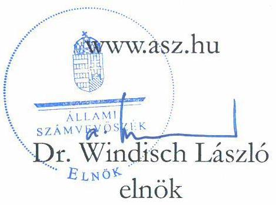
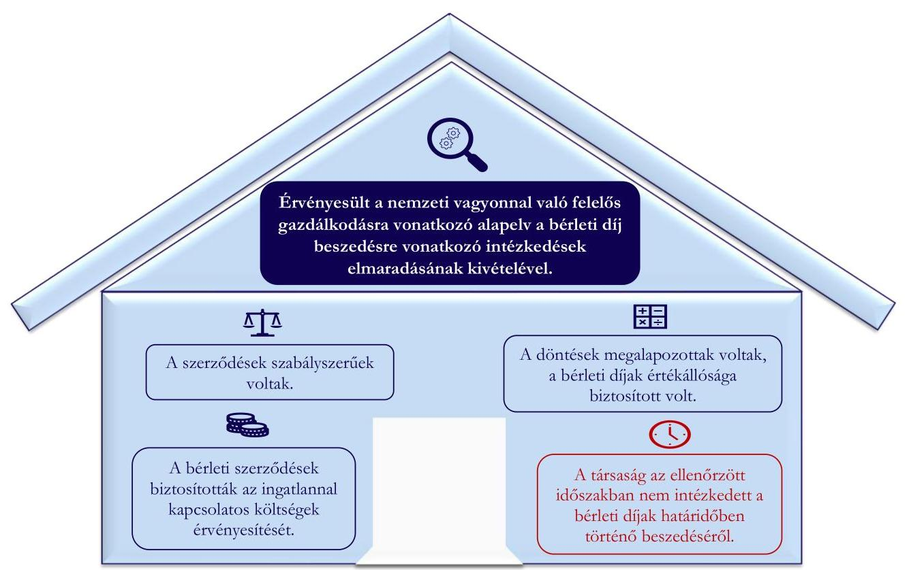
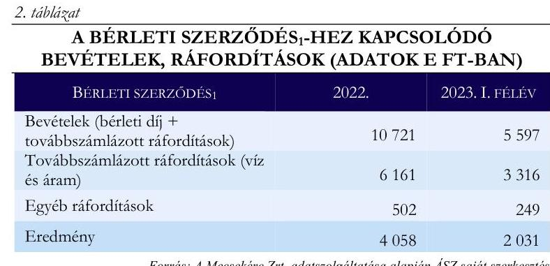

# JELENTÉS 

A többségi állami tulajdonú gazdasági társaságok ingatlan bérbeadásának célzott ellenőrzése

MECSEKÉRC Környezetvédelmi Zártkörűen Müködő
Részvénytársaság
2024.

---

# JELENTÉS 

## A többségi állami tulajdonú gazdasági társaságok ingatlan bérbeadásának célzott ellenőrzése

MECSEKÉRC Környezetvédelmi Zártkörűen Müködő
Részvénytársaság
2024.

24075

---

# ELLENŐRZÉSI IGAZGATÓSÁG: 

## ÁLLAMI VAGYONGAZDÁLKODÁST ELLENŐRZŐ IGAZGATÓSÁG

## ELLENŐRZÉSI IGAZGATÓ:

HERCZEGH ZSOLT ellenőrzési igazgató

## ELLENŐRZÉSVEZETŐ:

Jelentéseink az interneten a www.asz.hu címen olvashatók.

IMRE ZSUZSANNA ellenőrzésvezető

IKTATÓSZÁM: EL-3915-013/2024
TÉMASZÁM: 2706
ELLENŐRZÉS-AZONOSÍTÓ SZÁM: V1050

---

# TARTALOMJEGYZÉK 

AZ ELLENŐRZÉS ALAPADATAI ..... 5
MEGÁLLAPÍTÁSOK ÉS KÖVETKEZTETÉSEK. ..... 7
JAVASLATOK ..... 11
MELLÉKLETEK ..... 12
I. sz. melléklet: Értelmező szótár ..... 12
II. sz. melléklet: Ellenőrzési kritériumok ..... 13
FÜGGELÉK: ÉSZREVÉTELEK ..... 14
RÖVIDÍTÉSEK JEGYZÉKE ..... 15

---

.

---

# AZ ELLENŐRZÉS ALAPADATAI 

## AZ ELLENŐRZÉS CÉLJA

Az ellenőrzés célja a gazdasági társaságnál az ingatlan bérbeadási szerződések szabályszerűségének és a kapcsolódó döntések megalapozottságának, valamint a bérleti díj értékállóságának, a bérleti díjakból eredő követelések érvényesítésének értékelése volt.

## AZ ELLENŐRZÖTT IDŐSZAK

A 2022. január 01. napjától 2023. június 30. napjáig tartó időszak.

## AZ ELLENŐRZÉS TÁRGYA

A többségi állami tulajdonú gazdasági társaságok ingatlan bérbeadásra szóló szerződéseinek és módosításainak szabályszerűsége, a kapcsolódó döntések megalapozottsága, valamint a bérleti díj értékállóságának (az ingatlannal kapcsolatos költségek érvényesítésének) biztosítása, a bérleti díjakból eredő követelések érvényesítése volt.

Az ellenőrzés kiterjedt minden olyan körülményre és adatra, amely az Állami Számvevőszék (továbbiakban: ÁSZ ${ }^{1}$ ) jogszabályban meghatározott feladatainak teljesítéséhez, valamint a program végrehajtása folyamán felmerült újabb összefüggések feltárásához szükséges volt.

## AZ ELLENŐRZÉS JOGALAPJA

Az ellenőrzés jogszabályi alapját az ÁSZ tv. ${ }^{2} 1 . \int(3)$ bekezdése és az 5. $\int(4)$ bekezdése képezték.

## AZ ELLENŐRZÉS MÓDSZERE

Az ellenőrzést az ÁSZ a nemzetközi standardokat irányadónak tekintve az ellenőrzési program szempontjai, az ellenőrzött időszakban hatályos jogszabályok, az ellenőrzés szakmai szabályok és módszertanok figyelembevételével folytatta le.

Az ellenőrzési kérdések megválaszolásához szükséges bizonyítékok megszerzése az ellenőrzött szervezet által rendelkezésre bocsátott dokumentumokra és adatokra alapozva, a következő ellenőrzési eljárások alkalmazásával történt: megfigyelés, összehasonlítás, szemrevételezés, mintavételezés, elemző eljárás, kérdésfeltevés (interjú). Az ellenőrzési bizonyítékként felhasználható adatforrások közé tartoztak egyrészt az ellenőrzéshez kért dokumentumok, adatforrások, másrészt adatforrás volt minden - az ellenőrzés folyamán feltárt, az ellenőrzés szempontjából releváns információt tartalmazó - dokumentum.

---

Az ingatlan bérbeadási szerződésekhez kapcsolódó döntések megalapozottsága - mivel az ellenőrzött szerződések megkötésének időpontja öt évvel korábbi volt, mint az ellenőrzött időszak kezdő időpontja - a szerződésmódosítása kapcsán hozott döntések tekintetében került értékelésre.

Az ellenőrzött bérleti szerződés ${ }_{1,2,3}$-ek 8-15 évvel az ellenőrzött időszakot megelőzően kerültek megkötésre, így a döntések megalapozottsága a bérleti szerződések ellenőrzött időszakban történt módosításai tekintetében kerültek értékelésre.

Az ellenőrzés lefolytatásához az ellenőrzött szervezet a tanúsítvány kitöltésével, valamint az ÁSZ által kért dokumentumok, adatok, információk megküldésével és az ellenőrzés során szolgáltatott adatokat. A tanúsítvány adatai alapján a MECSEKÉRC Környezetvédelmi Zártkörűen Működő Részvénytársaság az ellenőrzött időszakban 37 darab ingatlan bérbeadási szerződéssel rendelkezett. A mintavételezés keretében három darab ingatlan bérbeadási szerződés került kiválasztásra.

Az ÁSZ jelentése a mintatételek vonatkozásában tesz megállapítást, ad véleményt.

# AZ ELLENŐRZÖTT SZERVEZET 

## MECSEKÉRC KÖRNYEZETVÉDELMI ZÁRTKÖRÜEN MÜKÖDŐ RÉSZVÉNYTÁRSASÁG

A Mecsekérc Zrt. ${ }^{3}$-t az Állami Privatizációs és Vagyonkezelő Rt. alapította 1998. április 30-án, 2012. május 29. napjától közvetlen, egyedüli tulajdonosa a Magyar Állam, tulajdonosi joggyakorlója az MNV Zrt. ${ }^{4}$ volt.

A Mecsekérc Zrt. főtevékenysége az urán-, tóriumérc-bányászat, valamint radioaktív hulladék tárolási lehetőségeinek kutatását, kialakítását, környezetvédelmi rekultivációs, monitoring és laboratóriumi vizsgálati tevékenységet végzett. A Mecsekérc Zrt. székhelye Pécsett található, emellett három telephellyel rendelkezik Pécsett, valamint hét fiókteleppel Bátaapáti és Kővágószőlős településeken.

A Mecsekérc Zrt. 2022. évi beszámolója alapján a mérlegfőösszeg 4464 769,0 E Ft, a saját tőke összege 2219 587,0 E Ft, az értékesítés nettó árbevétele 3129 896,0 E Ft, a foglalkoztatottak átlagos statisztikai állományi létszáma 116 fő volt.

1. táblázat

A BÉRLETI DÍJBÓL SZÁRMAZÓ BEVÉTELEK ÉS AZ ÉRTÉKESÍTÉS NETTÓ ÁRBEVÉTELÉNEK ÖSSZEHASONLÍTÁSA (ADATOK E FT-BAN)

2022.
Értékesítés nettó árbevétele
3129 896,0
Bérleti díjból származó
bevételek
$64076,0$
Forrás: A Mecsekérc Zrt. adatszolgáltatása alapján ÁSZ saját szerkezés

A Mecsekérc Zrt. az ellenőrzött időszakban a Taktv. ${ }^{5} 7 / \mathrm{J} . \S$ (1) bekezdése és így a Gbkr. ${ }^{6}$ hatálya alá tartozott.

Az ellenőrzésre kiválasztott szerződések közül a bérleti szerződés ${ }_{1}{ }^{7}$ a Kővágószőlős településen (0222/35. hrsz) található magraktár épület, a bérleti szerződés; ${ }^{8}$ Pécsett az Esztergár Lajos utca 19. számú épület egyik 40 m 2 -es irodahelyiségének, a bérleti szerződés; ${ }^{9}$ a Kővágószőlős településen (0222/35. hrsz) található 21.sz. épület (volt iroda és raktár) helyiségei (összesen $50 \mathrm{~m}^{2}$ ) bérbeadására vonatkozott.

---

# MEGÁLLAPÍTÁSOK ÉS KÖVETKEZTETÉSEK 

1. ábra

AZ ELLENŐRZÉS MEGÁLLAPÍTÁSAINAK ÖSSZEGZÉSE

Forrás: Az ellenőrzés során rendelkezésre bocsátott dokumentumok alapján ÁSZ saját szerkesztés

## A Mecsekérc Zrt. ellenőrzéssel érintett ingatlanhérbeadási szerződései a jogszabályi előírások alapján szabályszerüek voltak.

Az ellenőrzött időszakban hatályos bérleti szerződés ${ }_{1,2,3}$-ek tartalmazták a bérlet tárgyát, időtartamát, a bérleti díj összegét, annak éves felülvizsgálatára és emelésére vonatkozó rendelkezéseket, a fizetési feltételeket, a késedelmes fizetés esetén alkalmazandó eljárásokat, valamint a bérbeadó és a bérlő jogait és kötelezettségeit, amelyekre tekintettel a szerződések szabályszerűek voltak, megfeleltek a Ptk. ${ }^{10}$-ban foglaltaknak. A bérleti szerződés ${ }_{1,3}$-ek tartalmaztak rendelkezést arról, hogy az ingatlannal kapcsolatos infrastrukturális szolgáltatásról, azok díjáról és a költségek bérlő általi viseléséről a felek külön szerződésben állapodnak meg, így a Mecsekére Zrt. a bérlőkkel Villamos szolgáltatási szerződés ${ }_{1,2}{ }^{11,12}$-t és Vízszolgáltatási szerződés ${ }_{1,2}{ }^{13,14}$-t kötött. A bérleti szerződés ${ }_{2}$-ben rögzítettek alapján a bérleti díj tartalmazta a közüzemi díjakat és a bérbeadott ingatlanrésszel kapcsolatosan felmerült egyéb költségeket. A bérleti szerződés ${ }_{1,2,3}$-ek - szerződés lejáratára, a bérleti díj változására vonatkozó - módosításait írásba foglalták, azok szabályszerűek voltak, érvényesültek az Nvtv-ben rögzített, a nemzeti vagyonnal való felelős gazdálkodásra vonatkozó alapelvek, valamint a Taktv.-ben foglalt követelmények.

---

A Mecsekérc Zrt. ellenőrzéssel érintett ingatlan bérbeadásaihoz kapcsolódó, a bérleti szerzödések módosítására vonatkozó döntései megalapozottak voltak, a bérleti díjak értékállósága biztositott volt. A Mecsekérc Zrt. a bérleti szerződésı szerinti bérleti dij ellenörzött idöszakban történő megállapítása során a dokumentáltságot nem biztositotta.
A bérleti szerződés ${ }_{1,2,3}$-ekben rögzítésre került, hogy a bérbeadó, Mecsekérc Zrt. a bérleti díjat évente az infláció mértékével emelheti.
A bérleti szerződés ${ }_{1}$ esetében 2019. február 1. napjától érvényes bérleti díjat a Mecsekérc Zrt. az ellenőrzött időszakban nem módosította, nem élt azzal a szerződéses jogával, miszerint a bérleti díjat évente az infláció mértékével emelheti. A bérleti szerződés ${ }_{1}$-hez kapcsolódó tevékenység az ellenőrzött időszakban eredményes - a bevételek lényegesen meghaladták a ráfordításokat -, így a bérleti díj értékállósága biztosított volt. A Mecsekérc Zrt. nyilatkozata alapján a bérlővel „évenként átheczélésre kerültek a szakmai együttmüködés feltételei és a két társaság szóbeli megállapodás alapján döntött a bérleti dij mértékének, változatlanul bagyásáról’. Az ellenőrzés során beszerzett adatok és információk alapján az ingatlan bérbeadáshoz kapcsolódó - bérleti szerződés változatlanul hagyására irányuló - döntések a bérlő társasággal való stratégiai együttműködésre és az ellenőrzött időszakban közösen folytatott kutatási projektekre tekintettel megalapozottak és célszerúek voltak, azonban a döntések előkészítése során az Nvtv. 7. § (2) bekezdésében és a Taktv. 7/J. § (3) bekezdés e) pontjában előírtak érvényesülésének dokumentálása nem történt meg. Dokumentáció hiányában nem biztosították a döntések átláthatóságát.
A Mecsekérc Zrt. a bérleti szerződés ${ }_{2}$-ben rögzített bérleti díjat az ellenőrzött időszak mindkét évében felülvizsgálta és az infláció mértékét meghaladó mértékben, 2022. február 1-i és 2023. január 1-i hatállyal megemelte.
A Mecsekérc Zrt. a bérleti szerződés ${ }_{3}$-ben rögzített és az ellenőrzött időszakig változatlan bérleti díjat felülvizsgálta, 2022. február 1-i hatállyal (47,7\%-kal megemelve) módosította.
A Mecsekérc Zrt. a bérleti szerződés ${ }_{2,3}$ módosításaira vonatkozó döntéseit írásba foglalta, ezzel megfelelt a Gbkr.-ben foglaltaknak. A Mecsekérc Zrt. a bérleti szerződés ${ }_{2,3}$-ek tekintetében a bérleti díjak - KSH által közzétett inflációs ráta mértékét meghaladó mértékủ - emelésével biztosította a bérleti díjak értékállóságát. A Mecsekérc Zrt. - az ellenőrzéssel érintett bérleti szerződés ${ }_{2,3}$-ek tekintetében - ingatlan bérbeadással kapcsolatosan hozott döntéseinél érvényesültek az Nvtv.-ben rögzített, a nemzeti vagyonnal való felelős gazdálkodásra vonatkozó alapelvek, valamint a Taktv.-ben foglalt előírások.
A Mecsekérc Zrt. kialakította az ingatlanbérbeadási tevékenységének nyomon követését biztosító folyamatát, a rendelkezésre bocsátott nyilvántartás tartalmazta az ellenőrzött időszakra vonatkozóan a bérlők részére kiállított számlák összegét, a számlák keltét, valamint a kapcsolódó főkönyvi számokat, megfelelve a Gbkr.-ben foglaltaknak.

# A Mecsekérc Zrt. - az ellenőrzött időszakban, az ellenőrzéssel érintett ingatlanbérbeadási szerzödéseiben - biztositotta a bérbeadott ingatlanokkal kapcsolatos költségek érvényesitését. 

A Mecsekérc Zrt. ellenőrzött időszakban hatályos bérleti szerződés ${ }_{1,2,3}$-ei tartalmaztak rendelkezést a bérleti díjak évenkénti, az infláció mértékének megfelelő mértékủ emeléséről, melyet a bérleti szerződés ${ }_{2,3}$ -ek esetében érvényesítettek. A bérleti szerződés ${ }_{2}$ alapján az irodahelyiség bérbeadásával kapcsolatosan felmerült valamennyi - közüzemi díjak és egyéb - költségre a bérleti díj nyújtott fedezetet, a bérleti szerződés ${ }_{1,3}$-ekhez kapcsolódó értékcsökkenési leírás összegét a bérleti díjak fedezték, míg az áram- és

---

vízköltségek a bérlők részére tovább számlázásra kerültek. (A bérleti szerződés ${ }_{12,3}$-ekhez kapcsolódó bevételeket és tovább számlázott ráfordításokat az 1-3. táblázatok szemléltetik.)

# 3. táblázat 

A BÉRLETI SZERZŐDÉS ${ }_{3}$-HEZ KAPCSOLÓDÓ BEVÉTELEK, RÁFORDÍTÁSOK (ADATOK E FT-BAN)

| BÉRLETI SZERZŐDÉS ${ }_{3}$ | 2022. | 2023. E TELEV |
| :-- | --: | --: |
| Bevételek (bérleti díj +   továbbszámlázott ráfordítások) | 10721 | 5597 |
| Továbbszámlázott ráfordítások (víz   és áram) | 6161 | 3316 |
| Egyéb ráfordítások | 502 | 249 |
| Eredmény | 4058 | 2031 |

Forrás: A Mecsekérc Zrt. adatszolgáltatása alapján ÁSZ saját szerkesztés
3. táblázat

A BÉRLETI SZERZŐDÉS ${ }_{3}$-HEZ KAPCSOLÓDÓ
BEVÉTELEK, RÁFORDÍTÁSOK (ADATOK E FT-BAN)

| BÉRLETI SZERZŐDÉS ${ }_{3}$ | 2022. | 2023. E TELEV |
| :-- | --: | --: |
| Bevételek (bérleti díj) | 3427 | 2138 |
| Ráfordítások | 1421 | 1007 |
| Eredmény | 2006 | 1132 |

Forrás: A Mecsekérc Zrt. adatszolgáltatása alapján ÁSZ saját szerkesztés
4. táblázat

A BÉRLETI SZERZŐDÉS ${ }_{3}$-HEZ KAPCSOLÓDÓ
BEVÉTELEK, RÁFORDÍTÁSOK (ADATOK E FT-BAN)

| BÉRLETI SZERZŐDÉS ${ }_{3}$ | 2022. | 2023. E TELEV |
| :-- | --: | --: |
| Bevételek (bérleti díj +   továbbszámlázott ráfordítások)   Továbbszámlázott ráfordítások (víz és   áram) | 496 | 413 |
| Egyéb ráfordítások | 262 | 293 |
| Eredmény | 84 | 42 |
|  | 149 | 78 |

Forrás: A Mecsekérc Zrt. adatszolgáltatása alapján ÁSZ saját szerkesztés

A Mecsekérc Zrt. által rendelkezésre bocsátott nyilvántartások tartalmazták az ellenőrzött időszakra vonatkozóan az ingatlan bérbeadásból származó bevételeket bérlőnkénti, számlánkénti és a kapcsolódó ráfordításokat - igénybe vett közvetített szolgáltatásokat - számlánkénti bontásban, valamint a bérbeadott ingatlanokkal kapcsolatosan felmerült költségek felosztását az egyes bérlőkre. Így a Mecsekérc Zrt. nyomon követte az ingatlan bérbeadási tevékenységgel kapcsolatban felmerült bevételeket és ráfordításokat, ezzel megfelelt a Gbkr.-ben foglalt előírásoknak.

A Mecsekérc Zrt. az ingatlan bérbeadásból származó árbevételei - a rendelkezésre bocsátott számviteli nyilvántartások alapján - mindhárom bérleti szerződés esetében (2022. évben, valamint 2023. év I. félévében is) meghaladták a kapcsolódó ráfordításokat, így érvényesültek az Nvtv.-ben rögzített, a nemzeti vagyonnal való felelős gazdálkodásra vonatkozó alapelvek, valamint a Taktv.-ben foglalt, a gazdaságos és eredményes gazdálkodásra vonatkozó követelmények.

## A Mecsekérc Zrt. az ellenőrzéssel érintett ingatlan bérbeadási szerzödései tekintetében - az ellenőrzött időszakban - nem gondoskodott a bérleti díjak beszedéséről.

A Mecsekérc Zrt. a bérlőkkel szembeni követelésekről vezetett nyilvántartása az ellenőrzött időszakban tételesen (számlánkénti bontásban) tartalmazta a követelések összegét, a számla keltét, a fizetési határidőt, valamint kiegyenlített számlák esetében a kiegyenlítés dátumát és az összegét, ezzel megfelelt a Számv. tv. ${ }^{15}$-ben foglaltaknak.
A Mecsekérc Zrt. az ellenőrzött időszak utolsó napján a bérleti szerződés ${ }_{1,2,3}$-ekhez kapcsolódóan mindkét bérlővel szemben jelentős határidőn túli követeléssel rendelkezett. A bérleti szerződés ${ }_{1}$-hez kapcsolódóan 10,8 M Ft-tal (mely egy éves bérleti díj és egy év továbbszámlázott közüzemi díjakból eredő követelésnek felel meg), míg a bérleti szerződés ${ }_{2,3}$-ekhez kapcsolódóan 7,6 M Ft-tal (mely közel egy éves bérleti díj és közel egy év továbbszámlázott közüzemi díjakból eredő követelésnek felel meg). A Mecsekérc Zrt. a rendelkezésre bocsátott, a bérlőkkel szembeni követelések lejárat szerinti részletezését tartalmazó lista

---

alapján a bérleti szerződés ${ }_{1}$-hez kapcsolódóan a követelés több, mint $30 \%$-a, a bérleti szerződés ${ }_{2,3}$-ekhez kapcsolódóan több, mint $50 \%$-a 181 napon túli követelés volt.
A Mecsekérc Zrt. a bérleti szerződés ${ }_{1,2,3}$-ben ugyan meghatározta a késedelmes vagy nem fizetés esetén alkalmazandó eljárásokat, ugyanakkor az ellenőrzött időszakban nem élt a - a késedelmes vagy nem fizetés esetén - a bérleti szerződés ${ }_{1,2,3}$-ekben rögzített jogaival, nem tette meg a bérleti díjak beszedéséhez szükséges intézkedéseket.
A Mecsekérc Zrt. az ellenőrzés megkezdését követően 2023. október 31-én küldött fizetési felszólítást a bérleti szerződés ${ }_{1,2,3}$ szerinti bérlői részére.
A bérleti szerződés ${ }_{1,}$ az ellenőrzött időszakot követően, 2023. december 31-i hatállyal megszüntetésre került, mely időpontra a bérlővel szembeni követelések összege $0,5 \mathrm{M}$ Ft-ra csökkent.
A bérleti szerződés ${ }_{2,3}$-ekhez kapcsolódó követelések összege az ellenőrzött időszakot követően, 2023. december 31-én 10,98 M Ft volt, melynek megfizetését a bérlő - a Mecsekérc Zrt.-nek címzett részletfizetés iránti kérelmében - 2024. július 01. napjától, 24 havi egyenlő részletekben vállalta megfizetni. A Mecsekérc Zrt. - azzal, hogy a bérlők részére a fizetési felszólítást több, mint egy év fizetési késedelem után küldte meg - nem gondoskodott a bérleti díjak határidőben történő beszedéséről, így nem érvényesültek az Nvtv. 7. § (1) bekezdésében rögzített, a nemzeti vagyonnal való felelős gazdálkodásra vonatkozó alapelvek, valamint a Taktv. 7/J. § (3) bekezdés a), c), f) és g) pontjaiban foglalt követelmények.

---

# JAVASLATOK 

Az ÁSZ tv. 33. § (1) bekezdésében foglaltak értelmében az ellenőrzött szervezet vezetője köteles a jelentésben foglalt megállapításokhoz kapcsolódó intézkedési tervet összeállítani és azt a jelentés kézhezvételétől számított 30 napon belül az ÁSZ részére megküldeni. Amennyiben az ellenőrzött szervezet vezetője nem küldi meg határidőben az intézkedési tervet, vagy továbbra sem elfogadható intézkedési tervet küld, az Állami Számvevőszék elnöke az ÁSZ tv. 33. § (3) bekezdése a) és b) pontjaiban foglaltakat érvényesítheti.

## A MECSEKÉRC ZRT. VEZÉRIGAZGATÓJÁNAK

1. Müködtessen olyan kontrollokat, amelyek biztositják a követelések határidőben történő beszedését, a Taktv. 7/J. § (3) bekezdés a), c), f) és g) pontjaiban elöirtak érvényesülését.
2. Tegyen intézkedéseket azon kontrolltevékenységek kialakítására és megfelelő müködtetésére, amelyek megelőzik a döntéselőkészittési folyamat dokumentálása tekintetében feltárt hiányosság ismételt elöfordulását, valamint biztositják a Taktv. 7/J. § (3) bekezdés e) pontjában és az Nvtv. 7. § (2) bekezdésében elöirtak érvényesülését, a megalapozottság, a célszerüség dokumentálását, ezáltal a döntések átláthatóságát.

---

# MELLÉKLETEK 

- I. SZ. MELLÉKLET: ÉRTELMEZŐ SZÓTÁR
gazdasági társaság
többségi állami tulajdon
többségi befolyás

A gazdasági társaságok üzletszerű közös gazdasági tevékenység folytatására, a tagok vagyoni hozzájárulásával létrehozott, jogi személyiséggel rendelkező vállalkozások, amelyekben a tagok a nyereségből közösen részesednek, és a veszteséget közösen viselik. Forrás: Ptk. 3:88. § (1) bekezdése
Az állam tulajdonában lévő tagsági jogviszonyt megtestesítő értékpapír, illetve az állam tulajdonában lévő egyéb társasági részesedés, amennyiben a társaságban a Magyar Állam közvetlenül vagy közvetetten a szavazatok több mint felével rendelkezik.
Forrás: ÁSZ definíció a Vtv. ${ }^{16}$ 1. § (2) bekezdés c) pontja és a Ptk. 8:2. $\mathbb{S}(1),(3)-(4)$ bekezdései alapján
Olyan kapcsolat, amelynek révén a befolyással rendelkező egy jogi személyben a szavazatok több mint ötven százalékával - közvetlenül vagy a jogi személyben szavazati joggal rendelkező más jogi személy (köztes vállalkozás) szavazati jogán keresztül - rendelkezik, azzal, hogy a közvetett módon való rendelkezés meghatározása során a jogi személyben szavazati joggal rendelkező más jogi személyt (köztes vállalkozást) megillető szavazati hányadot meg kell szorozni a befolyással rendelkezőnek a köztes vállalkozásban, illetve vállalkozásokban fennálló szavazati hányadával, ha azonban a köztes vállalkozásban fennálló szavazatainak hányada az ötven százalékot meghaladja, akkor azt egy egészként kell figyelembe venni. A befolyás számításánál nem kell figyelembe venni a huszonöt százalékot el nem érő közvetett befolyást
Forrás: Taktv. 1. § b) pont

---

# II. SZ. MELLÉKLET: ELLENŐRZÉSI KRITÉRIUMOK 

## ELLENŐRZÉSI KRITÉRIUMOK

Nvtv. 7. § (1), (2) bekezdés
Taktv. 7/J. § (3) bekezdés a)-g) pontok
Ptk. 6:331-6:341. §
Számv. tv. 12. § (1), 14. § (5) bekezdés c.) pont, 16 § (1) bekezdés, 29. §, 164 § (1), (2) bekezdés
Gbkr. 3. § (1) bekezdés e) pont, 4. § (1) bekezdés c) pont, (3) bekezdés, 6. § (1), (2) bekezdés, 8. §
52/2021. (II. 9.) Korm. rendelet ${ }^{17}$

---

# FÜGGELÉK: ÉSZREVÉTELEK 

A jelentéstervezetet a Számvevőszék 15 napos észrevételezésre megküldte az ellenőrzött szervezet vezetőjének az ÁSZ tv. 29. §* (1) bekezdése előírásának megfelelően.

A MECSEKÉRC Környezetvédelmi Zártkörüen Müködő Részvénytársaság észrevételt nem tett.

[^0]
[^0]:    * 29. § (1) Az Állami Számvevőszék az ellenőrzési megállapításait megküldi az ellenőrzött szervezet vezetőjének vagy az általa megbízott személynek, és annak, akinek személyes felelősségét állapította meg.
    (2) Az ellenőrzött szervezet vezetője és a felelősként megjelölt személy az ellenőrzés megállapításaira tizenöt napon belül írásban észrevételt tehet.
    (3) Az Állami Számvevőszék az észrevételre a beérkezésétől számított harminc napon belül írásban válaszol. A figyelembe nem vett észrevételeket köteles a jelentésben feltüntetni, és megindokolni, hogy azokat miért nem fogadta el.

---

# RÖVIDÍTÉSEK JEGYZÉKE 

${ }^{1}$ ÁSZ ${ }^{2}$ ÁSZ tv. ${ }^{3}$ Mecsekérc Zrt. ${ }^{4}$ MNV Zrt. ${ }^{5}$ Taktv. ${ }^{6}$ Gbkr. ${ }^{7}$ bérleti szerződés ${ }_{1}$ ${ }^{8}$ bérleti szerződés ${ }_{2}$ ${ }^{9}$ bérleti szerződés ${ }_{3}$ ${ }^{10}$ Ptk. ${ }^{11}$ Villamos szolgáltatási szerződés ${ }_{1}$ ${ }^{12}$ Villamos szolgáltatási szerződés ${ }_{2}$ ${ }^{13}$ Vízszolgáltatási szerződés ${ }_{1}$ ${ }^{14}$ Vízszolgáltatási szerződés ${ }_{2}$ ${ }^{15}$ Számv. tv. ${ }^{16} \mathrm{Vtv}$ ${ }^{17}$ 52/2021. (II. 9.) Korm. rendelet

Állami Számvevőszék
2011. évi LXVI. törvény az Állami Számvevőszékről

MECSEKÉRC Környezetvédelmi Zártkörűen Működő Részvénytársaság
Magyar Nemzeti Vagyonkezelő Zártkörűen Működő Részvénytársaság
2009. évi CXXII. törvény a köztulajdonban álló gazdasági társaságok takarékosabb müködéséről
339/2019. (XII. 23.) Korm. rendelet a köztulajdonban álló gazdasági társaságok belső kontrollrendszeréről
A Mecsekérc Zrt., mint bérbeadó és a bérlő között 2009. május 1-i hatállyal 10 év határozott időre létrejött bérleti szerződés, amely többszöri hosszabbítást követően 2023. december 31-i hatállyal megszüntetésre került
A Mecsekérc Zrt., mint bérbeadó és a bérlő között 2008. november 1-i hatállyal határozatlan időre létrejött bérleti szerződés
A Mecsekérc Zrt., mint bérbeadó és a bérlő között 2015. október 1-i hatállyal határozatlan időre létrejött bérleti szerződés
2013. évi V. törvény a Polgári Törvénykönyvről
A Mecsekérc Zrt., mint bérbeadó és a bérlő között 2009. május 1-i hatállyal létrejött Villamos szolgáltatási szerződés
A Mecsekérc Zrt., mint bérbeadó és a bérlő között 2015. szeptember 30-án kötött Villamos szolgáltatási szerződés
A Mecsekérc Zrt., mint bérbeadó és a bérlő között 2009. május 1-i hatállyal létrejött Vízszolgáltatási szerződés
A Mecsekérc Zrt., mint bérbeadó és a bérlő között 2015. július 1-i hatállyal létrejött Vízszolgáltatási szerződés
2000. évi C. törvény a számvitelről
2007. évi CVI. törvény az állami vagyonról

52/2021. (II. 9.) Korm. rendelet a bérletidíj-fizetési mentességről

---

1052 Budapest, Apáczai Csere János u. 10. | 1364 Budapest 4., Pf. 54
www.asz.hu | szamvevoszek@asz.hu
telefon: +36 14849100