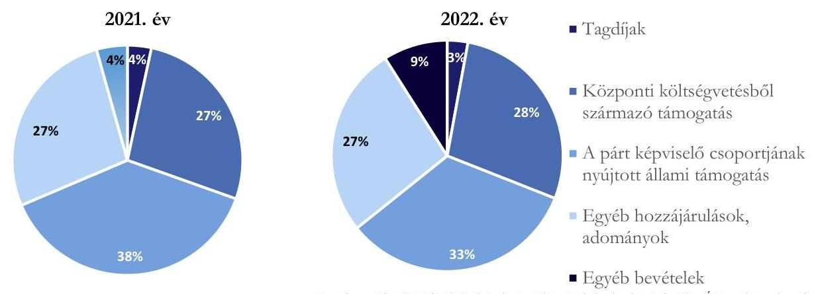
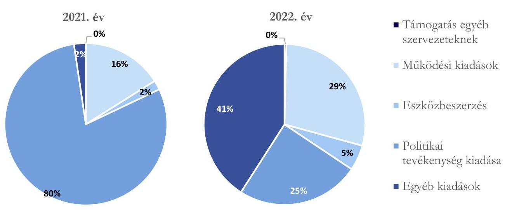

# JELENTÉS 

A költségvetési támogatásban részesülő pártok 2021-2022. évi gazdálkodása törvényességének ellenőrzése

Demokratikus Koalíció
2024.

---

# JELENTÉS 

A költségvetési támogatásban részesülő pártok 2021-2022. évi gazdálkodása törvényességének ellenőrzése

Demokratikus Koalíció
2024.

---

# ELLENŐRZÉSI IGAZGATÓSÁG:

## ÁLLAMHÁZTARTÁSON KÍVÜLI SZERVEZETEKET ELLENŐRZŐ IGAZGATÓSÁG

### ELLENŐRZÉSI IGAZGATÓ:

#### KLINGA LÁSZLÓ igazgató

### ELLENŐRZÉSVEZETŐ:

Jelentéseink az interneten a www.asz.hu címen olvashatók.

SOLYMÁR ÁGNES ellenőrzésvezető

IKTATÓSZÁM: EL-4087-001/2024.

TÉMASZÁM: 2679.

ELLENŐRZÉS-AZONOSÍTÓ SZÁM: V1023

---

# TARTALOMJEGYZÉK 

AZ ELLENŐRZÉS ALAPADATAI ..... 5
AZ ELLENŐRZÖTT SZERVEZET ..... 8
ÖSSZEFOGLALÁS ..... 10
AZ ELLENŐRZÉS FÓKUSZKÉRDÉSEI ..... 11
MEGÁLLAPÍTÁSOK ..... 12
JAVASLATOK ..... 18
MELLÉKLETEK ..... 19
I. sz. melléklet: Értelmező szótár ..... 19
II. sz. melléklet: Ellenőrzési kritériumok ..... 21
FÜGGELÉK: ÉSZREVÉTELEK ..... 22
RÖVIDÍTÉSEK JEGYZÉKE ..... 23

---

.

---

# AZ ELLENŐRZÉS ALAPADATAI 

## AZ ELLENŐRZÉS CÉLJA

Az ellenőrzés célja annak értékelése volt, hogy a Párt ${ }^{1}$ közzétett éves pénzügyi kimutatása a törvényi előírásoknak megfelelt-e, a könyvvezetés és gazdálkodás során betartotta-e a vonatkozó jogszabályi és belső előírásokat, a Párt a működéséhez szabályszerűen igénybe vehető forrásokat használt-e fel, a pártok működéséről és gazdálkodásáról szóló Párttv.-ben engedélyezett gazdasági-vállalkozási tevékenységet folytatott-e. Az ellenőrzés célja továbbá annak értékelése volt, hogy az előző számvevőszéki jelentésben foglalt megállapításokkal összhangban készített intézkedési tervben meghatározott feladatokat a Párt végrehajtotta-e.

## AZ ELLENŐRZÉS TÍPUSA

Szabályszerűségi ellenőrzés.

## AZ ELLENŐRZÖTT IDŐSZAK

A 2021-2022. évek.
Az utóellenőrzés tekintetében az utóellenőrzés alapját képező ÁSZ ${ }^{3}$ jelentés közzétételének napjától (2021. 12. 23.) az ellenőrzésről szóló adatszolgáltatásra felhívó levél keltének (2023.09.12.) napjáig terjedő időszak.

## AZ ELLENŐRZÉS TÁRGYA

A Párt ellenőrzése során az ellenőrzés tárgyát képezte a 2021. és a 2022. évre vonatkozó pénzügyi kimutatás elkészítésére, jóváhagyására, közzétételére, a Párt könyvvezetésére, gazdálkodására, ennek keretében a számviteli szabályozás kialakítására, a bizonylati rend, bizonylati fegyelem betartására, egyéb gazdálkodási, ellenőrzési és pénzügyi-számviteli feladatok ellátására irányuló tevékenységek. Az ellenőrzés tárgya volt továbbá a Párttv. szerinti források elszámolása és felhasználása, valamint a vagyon jogszabályi előírásoknak megfelelő használata, hasznosítása.

Az ellenőrzés kiterjedt minden olyan körülményre és adatra, amely az ÁSZ jogszabályban meghatározott feladatainak teljesítéséhez, valamint a program végrehajtása folyamán felmerült újabb összefüggések feltárásához szükséges volt.

Jelen ellenőrzés a 2022. évi országgyűlési képviselő-választási kampányra fordított pénzeszközök elszámolásának ellenőrzésére nem terjedt ki, azt az ÁSZ „A 2022. évi országgyűlési képviselő-választási kampányra fordított pénzeszközök elszámolásának ellenőrzése" című önálló ellenőrzése (továbbiakban: kampányellenőrzés ${ }^{4}$ ) keretében ellenőrizte.

---

# Az ellenőrzés jogalapját 

Az ellenőrzés jogalapját az ÁSZ tv. ${ }^{5}$ 5. § (11) bekezdés a) pontja, a Párttv. 4. § (4)-(5) bekezdései, valamint 10. § (1), (3)-(4) bekezdései képezték.

## AZ ELLENŐRZÉS MÓDSZERE

Az ellenőrzést az ellenőrzési program szempontjai, az ellenőrzött időszakban hatályos jogszabályok, az ellenőrzés általános szakmai szabályai, az ellenőrzésre irányadó ÁSZ módszertanok figyelembevételével végezte az ÁSZ.

Az ellenőrzési kérdések megválaszolásához szükséges bizonyítékok megszerzése az ellenőrzött szervezet által rendelkezésre bocsátott dokumentumokra, adatokra alapozva kérdésfeltevés (információkérés), interjú, mintavételezés útján történt. Az ÁSZ a 2021-2022. évi bevételeket és kiadásokat mintavételi eljárással kiválasztott tételek alapján ellenőrizte.

Az ellenőrzési bizonyítékként felhasználható adatforrások közé tartoztak egyrészt az ellenőrzési programban felsorolt adatforrások, másrészt adatforrás lehetett még - minden az ellenőrzés folyamán - feltárt, az ellenőrzés szempontjából információt tartalmazó dokumentum.

Az ellenőrzés lefolytatásához az ellenőrzött szervezet tanúsítványok kitöltésével, hitelesítésével és a teljességi és hitelességi nyilatkozattal alátámasztott dokumentumok rendelkezésre bocsátásával szolgáltatott adatokat.

Az ÁSZ a tételes ellenőrzés mellett statisztikai alapú, véletlenszerű és kockázatalapú mintavételezést és értékelést alkalmazott. A statisztikai alapú mintavételnél a minták kiválasztása rétegzett mintavételezéssel történt, amelynek értékelése „szabályszerű”, ha a minta ellenőrzésének eredménye alapján 95%-os bizonyossággal a teljes sokaságban az átlagos hibaarány nem haladja meg a 10%-ot, „nem szabályszerű”, ha nagyobb, mint 10%. Abban az esetben, ha a teljes sokaság tekintetében a 10%-os hibaarányhoz való viszony megítélésének megbízhatósága nem érte el a 95%-ot, annak elérése érdekében az értékelés további szempontokkal egészült ki, a feltárt hibák értéke is figyelembevételre került. A statisztikai alapú mintavétel kiegészült évente az öt legnagyobb forgalmi értékkel rendelkező szállító tételes ellenőrzésével a lényegesség biztosítása érdekében. A kockázati alapon kiválasztott mintatételek értékelése nem került kivetítésre. Tételes ellenőrzésre kerültek a bevételek közül a központi költségvetésből származó támogatások, valamint a Párt országgyűlési képviselőcsoportjának nyújtott állami támogatások. A kiadások közül tételes ellenőrzésre kerültek az egyéb szervezetek részére nyújtott támogatások, valamint a reklámhordozón elhelyezett hirdetések költségei. A bérköltségekből és eszközbeszerzésekből egyszerű véletlenszerű leválogatással került kiválasztásra tíz-tíz mintatétel.

A kampányellenőrzés keretében az ÁSZ ellenőrizte a 2022. évi országgyűlési képviselő választásra fordított állami és a Párttv.-ben meghatározott más pénzeszközök elszámolását, ezért jelen ellenőrzés a kampányidőszakra vonatkozó bevételi és kiadási tételek értékelését nem tartalmazza.

Az utóellenőrzés megállapításai az ÁSZ rendelkezésére álló dokumentumok, az ellenőrzött szervezet által rendelkezésre bocsátott dokumentumok, adatok alapján kerültek megfogalmazásra. A korábbi ÁSZ jelentés alapján a Párt által készített intézkedési tervben előírt feladatok végrehajtása az alábbiak szerint kerültek értékelésre:

---

- „határidőben végrehajtott”-nak minősült a feladat, ha a teljesítés dokumentáltan, az intézkedési tervben előírt határidőben és tartalommal megtörtént;
- „határidőn túl végrehajtott”-nak minősült a feladat, ha annak teljesítése az intézkedési tervben meghatározott módon, de az abban előírt határidőn túl történt meg;
- „nem végrehajtott”-nak minősült a feladat, ha a végrehajtás nem történt meg, vagy amennyiben a teljesítést/végrehajtást nem dokumentálták, dokumentumokkal nem tudják igazolni annak teljesítését;
- „okafogyottá vált”-nak minősült a feladat, ha végrehajtására - meghatározott esemény bekövetkezése, továbbá külső körülmény, a működést érintő feltétel változása miatt - már nincs szükség, illetve lehetőség, és egyértelműen megállapítható, hogy az intézkedést szükségessé tevő körülmény a jövőben nem fordulhat elő;
- „nem időszzerű”-nek minősült az a feladat, amelynek ellenőrzési időszakon belüli végrehajtására azért nem került (kerülhetett) sor, mert az intézkedés alapjául szolgáló esemény nem következett be, de annak jövőbeni előfordulása lehetséges, a végrehajtása nem volt esedékes, vagy a végrehajtás határideje még nem járt le.”

---

# AZ ELLENŐRZÖTT SZERVEZET 

## DEMOKRATIKUS KOALÍCIÓ

A Demokratikus Koalíció 2011. november 06-án létrejött egyesület, amely nyilvántartott tagsággal rendelkezik, a nyilvántartásba vételét végző bíróság előtt a Párt alapítói kinyilvánították, hogy a Párttv. rendelkezéseit magukra nézve kötelezőnek ismerik el a Párttv. 1. §-a alapján.

Az Alapszabálya ${ }_{1,2,3}{ }^{6}$ alapján a Demokratikus Koalíció legfelsőbb szerve a Kongresszus. A Párt vezetésével kapcsolatos feladatokat az Elnökség látja el, amely mellett, mint tanácsadó, véleményező testület működik az Országos Tanács. Az Etikai Bizottság a Párt etikai ügyekben eljáró országos hatáskörű testületként, a Felügyelő Bizottság a pártszervek, a jogszabályok, az Alapszabály és a testületi határozatok végrehajtásának, betartásának ellenőrzése céljából működik. Az ellenőrzött időszakban a Párt országosan 104 szervezettel rendelkezett.

A Demokratikus Koalíció elnökének személye a Párt alakulása óta nem változott. A Pártot az elnök, az ügyvezető alelnök, valamint az SZMSZ ${ }_{1,2,3}$-ben ${ }^{7}$ meghatározott feladatkörében eljárva a pártigazgató képviseli. A Gazdálkodási Szabályzat ${ }^{8}$ alapján a pártigazgató felelős a gazdálkodás szabályszerűségéért, illetve az átláthatóság érvényesüléséért, a bevételek és kiadások nyilvántartásáért. A választókerületi szervezetek gazdálkodási feladataiért a választókerület szervezet elnöke tartozik közvetlen felelősséggel. Az Alapszabály ${ }_{1,2,3}$ alapján önálló utalványozási joggal rendelkezik az elnök, valamint a Pénzkezelési Szabályzat ${ }_{1,2,3}{ }^{9}$ értelmében a pártigazgató.

A Demokratikus Koalíció a Párttv. 6. § (3) bekezdésében foglaltakkal összhangban a 2012. évben egyszemélyes gazdasági társaságot alapított (DÉKÁ Rendezvény Kft.), más gazdasági társaságban részesedést nem szerzett. A Párt 2014. évben a Párttv. 9/A.§ (1) bekezdés alapján biztosított lehetőséggel élve létrehozta az Új Köztársaságért Alapítványt (továbbiakban: Pártalapítvány ${ }^{10}$ ).

A Demokratikus Koalíció által készített és a Magyar Közlöny mellékletét képező Hivatalos Értesítő 2022. évi 24. számában, illetve a 2023. évi 27. számában közzétett pénzügyi kimutatások adatai alapján a 2021. évben 764441 ezer Ft bevételt - melyből 207100 ezer Ft központi költségvetési támogatás - és 784364 ezer Ft kiadást, a 2022. évben 908819 ezer Ft bevételt - melyből 530423 ezer Ft központi költségvetési támogatás és 718696 ezer Ft kiadást mutatott ki, melynek részletezését az 1. táblázat tartalmazza. A Hivatalos Értesítő 2023. évi 27. számában közzétett pénzügyi kimutatás számszaki és tartalmi eltérést mutat, amelyet a 2.2. számú megállapítás részletezése tartalmaz.

---

1. táblázat

A PÁRT 2021-2022. ÉVI PÉNZÜGYI KIMUTATÁSÁNAK ADATAI (ADATOK EZER FT-BAN)

|  BEVÉTELEK | 2021. ÉV | 2022. ÉV  |
| --- | --- | --- |
|  Tagdíjak | 25638 | 24933  |
|  Központi költségvetésből származó támogatás | 207100 | 243003  |
|  A párt országgyűlési képviselőcsoportjának nyújtott állami támogatás | 291640 | 287420  |
|  Egyéb hozzájárulások, adományok | 207026 | 231450  |
|  - az 500000 forint feletti hozzájárulás nevesítve | 141267 | 44300  |
|  A párt által alapított kft. nyereségéből származó bevétel | 0 | 0  |
|  Egyéb bevételek | 33037 | 77714  |
|  Összes bevétel a gazdasági évben | 764441 | 908819  |
|  KIADÁSOK | 2021. ÉV | 2022. ÉV  |
|  Támogatás a párt országgyűlési képviselőcsoportja számára | 0 | 0  |
|  Támogatás egyéb szervezeteknek | 60 | 2693  |
|  Vállalkozás alapítására fordított összegek | 0 | 0  |
|  Működési kiadások | 125774 | 207721  |
|  Eszközbeszerzés | 14733 | 36766  |
|  Politikai tevékenység kiadása | 625314 | 477324  |
|  Egyéb kiadások | 18483 | 294192  |
|  Összes kiadás a gazdasági évben | 784364 | 718696  |

Forrás: A Párt 2021. és a 2022. évi pénzügyi kimutatása, ÁSZ saját szerkesztés. *A Hivatalos Értesítő 2023. évi 27. számában közzétett pénzügyi kimutatás tartalmi és számszaki eltérést mutat, a 2.2. számú megállapítás tartalmazza a részleteit.

---

# ÖSSZEFOGLALÁS 

A Párttv. 1. §-a kimondja: a párt olyan egyesület, amely nyilvántartott tagsággal rendelkezik, és amely a nyilvántartásba vételét végző bíróság előtt kinyilvánítja, hogy a Párttv. rendelkezéseit magára nézve kötelezőnek ismeri el.

Az ÁSZ tv. 5. § (11) bekezdés a) pontja alapján az ÁSZ - a Párttv. rendelkezéseinek megfelelően törvényességi szempontok szerint ellenőrzi a pártok gazdálkodását. A Párttv. 10. § (3) bekezdése alapján az ÁSZ kétévente ellenőrzi azoknak a pártoknak a gazdálkodását, amelyek a központi költségvetésből rendszeres támogatásban részesültek. A Demokratikus Koalíció pénzügyi kimutatásai szerint a központi költségvetésből 2021-ben 207100 ezer Ft, a 2022. évben 243003 ezer Ft támogatásban részesült.

Az ÁSZ a kampányellenőrzés keretében ellenőrizte a 2022. évi országgyűlési képviselő választásra fordított állami és a Párttv.-ben meghatározott más pénzeszközök felhasználását. Jelen ellenőrzés az országgyűlési képviselő választásra kapott pénzeszközökre és azok felhasználására nem terjedt ki. Emiatt jelen ellenőrzésnek a pénzügyi kimutatásra, az azt alátámasztó könyvvezetésre, a bevételek, kiadások elszámolására vonatkozó megállapításai a párt gazdálkodásának a kampányellenőrzéssel nem
 érintett részére vonatkoznak.

Szabályozási környezet nem a jogszabályoknak megfelelő

A Párt a jogszabályi előírásoknak megfelelően rendelkezett a gazdálkodás kereteit meghatározó belső szabályzatokkal az ellenőrzött időszakban. A számviteli szabályzatok kialakítása nem volt megfelelő, a Számviteli politika ${ }_{1,2,3}{ }^{11}$ és a Számlarend ${ }_{1,2}{ }^{12}$ szabályozásai nem biztosították a pénzügyi kimutatás Párttv.-ben foglaltaknak megfelelő összeállítását.

Nem alátámasztott pénzügyi kimutatás

A Párt a 2021-2022. évekre vonatkozó pénzügyi kimutatásait határidőben elkészítette, a Magyar Közlöny mellékletét képező Hivatalos Értesítőben, valamint saját honlapján közzétette. A 2022. évi pénzügyi kimutatás adatait a főkönyvi kivonat a Számv. tv. előírása ellenére nem támasztotta alá. A tagdíjak és egyéb hozzájárulások, adományok tekintetében a Párt kialakított könyvvezetési rendszere és nyilvántartásai a Számv. tv.-ben foglaltak ellenére egyik ellenőrzött évben sem voltak alkalmasak a Párttv. 1. számú mellékletében meghatározott pénzügyi kimutatás adatainak alátámasztására. Az egy naptári év alatt kapott 500 000 forint feletti hozzájárulások a Párttv. előírásai szerint nevesítésre kerültek, azonban teljes körűségük nem volt alátámasztott. Az ellenőrzött mintatételek alapján a bevételek elszámolása nem volt szabályszerű, a Számv. tv. előírásai ellenére nem tartalmazták az érintett könyvviteli számlákra történő hivatkozást az ellenőrzött időszakban. Az ellenőrzött mintatételek alapján a kiadások elszámolása során a Párt betartotta a Számv. tv. és a belső szabályzatok előírásait. A Párt gazdálkodása során megfelelően kialakította a vagyongazdálkodás kereteit, a vagyon nyilvántartása, használata, hasznosítása körében nem tárt fel szabálytalanságot az ellenőrzés.

A gazdálkodási tevékenység ellenőrzése a pénztárellenőrzés kivételével megfelelő

Nem megfelelően végrehajtott intézkedési terv

A Párt létrehozta Felügyelő Bizottságát, megalkotta a gazdálkodásának és törvényes működésének ellenőrzésére vonatkozó szabályokat. A Felügyelő Bizottság a belső előírások szerinti ellenőrzéseket elvégezte. A Párt pénzügyi vezetője nem hajtotta végre a belső szabályzatokban meghatározott pénztárellenőrzéseket.

A Párt a korábbi ÁSZ ellenőrzés megállapításai alapján készített intézkedési tervében meghatározott feladatok közül három intézkedést határidőben, három intézkedést nem hajtott végre.

---

# AZ ELLENŐRZÉS FÓKUSZKÉRDÉSEI 

1.- A Párt a jogszabályi előírásoknak megfelelően kialakította-e a pénzügyi kimutatás összeállítására és az azt alátámasztó könyvvezetésre vonatkozó belső szabályozást?
2.- A Párt pénzügyi kimutatása, az azt alátámasztó könyvvezetése, a bevételek, kiadások elszámolása, valamint a vagyon nyilvántartása és használata, hasznosítása megfelelt-e a jogszabályi és belső előírásoknak?
3.- A Párt gazdálkodásának ellenőrzése az előírásoknak megfelelően működött-e?
4.- A korábbi ÁSZ ellenőrzés megállapításai alapján készített intézkedési tervben foglaltak végrehajtásra kerültek-e?

---

# MEGÁLLAPÍTÁSOK 

## 1. A Párt a jogszabályi előírásoknak megfelelően kialakította-e a pénzügyi kimutatás összeállítására és az azt alátámasztó könyvvezetésre vonatkozó belső szabályozást?

Összegző megállapítás A Párt a 2021-2022. években a pénzügyi kimutatás összeállítására és az azt alátámasztó könyvvezetésre vonatkozó belső szabályozását nem a jogszabályi előírásoknak megfelelően alakította ki.

A Párt az ellenőrzött időszakban rendelkezett a Számv. tv. előírásainak megfelelően Számviteli politikával ${ }_{1,2,3}$, melynek keretében elkészítette a Leltározási szabályzatot ${ }_{1,2,3}{ }^{13}$, az Értékelési szabályzatot ${ }_{1,2}{ }^{14}$, a Pénzkezelési szabályzatot ${ }_{1,2,3}$, valamint kialakította Számlarendjét ${ }_{1,2}$ és Bizonylati szabályzatát ${ }_{1,2}{ }^{15}$, azok a Számviteli politika ${ }_{1,2,3}$ és Számlarend ${ }_{1,2}$ kivételével megfeleltek a Számv. tv. előírásainak. A számviteli szabályzatok elkészítéséről és hatályba léptetéséről a Számv. tv., a Civil tv. ${ }^{16}$ és az Alapszabály előírásai szerint a Párt képviseletére jogosult pártigazgató gondoskodott.
A Párt gazdálkodásával kapcsolatos szabályzatok kialakítása a 2021. és 2022. években a Számviteli politika ${ }_{2,3}$, és a Számlarend ${ }_{1,2}$ esetében nem biztosították a pénzügyi kimutatás a Párttv. 9. § és 1. számú mellékletben foglaltaknak megfelelő tagolásban történő elkészítését az alábbiak miatt:

- A Számviteli politika ${ }_{2,3}$ a Számv. tv. 14. § (3) bekezdésében meghatározott előírásoktól eltérően nem biztosította a Párt adottságainak, körülményeinek leginkább megfelelő szabályozást, mivel a pénzügyi kimutatás összeállítására vonatkozó szabályozás nem volt teljeskörű, nem tartalmazta a Párttv. 9. § és az 1. számú melléklet szerinti sorok közül a politikai és egyéb kiadások sorok tartalmát.
- A Számlarend ${ }_{1,2}$ nem felelt meg a Számv. tv. 161. § (2) bekezdés (a) pontjában foglaltaknak, mivel nem tartalmazta minden alkalmazásra kijelölt számla számjelét és megnevezését (pl. 171 tartós részesedések számla, a 386 devizabetétszámla, a 463 költségvetési befizetési kötelezettség számla, a 9675 és 9679 bevételi számlák).
A Ptk.-ban ${ }^{17}$ foglaltaknak megfelelően meghatározásra került az Alapszabályban, a tagdíjak fogalomkörébe tartozó tartalom, a tagok által fizetendő tagdíj összege, a tagdíjbefizetés szabályai.

---

# 2. A Párt pénzügyi kimutatása, az azt alátámasztó könyvvezetése, a bevételek, kiadások elszámolása, valamint a vagyon nyilvántartása és használata, hasznosítása megfelelt-e a jogszabályi és belső előírásoknak? 

Összegző megállapítás

2.1. számú megállapítás

A Párt pénzügyi kimutatásai nem feleltek meg a Párttv., az alátámasztó könyvvezetése a Számv. tv. előírásainak. A bevételek, kiadások elszámolása nem volt szabályszerű, a vagyon nyilvántartása, használata, hasznosítása körében nem tárt fel szabálytalanságot az ellenőrzés.

A Párt 2021-2022. évekre vonatkozó pénzügyi kimutatásai nem feleltek meg a jogszabályi követelményeknek. A könyvvezetése az ellenőrzött időszakban nem felelt meg a Számv. tv. előírásainak.

A 2021. és 2022. évi pénzügyi kimutatásokat a Párt belső szabályzatában előírt, hatáskörrel rendelkező testület, az Elnökség mind a két ellenőrzött évben elfogadta a Felügyelő Bizottság jóváhagyását követően, a közzétételük a Magyar Közlöny mellékletét képező Hivatalos Értesítőben, valamint a Párt saját honlapján az előírt határidőben történt.
A Párt a 2022. évről készített pénzügyi kimutatásában szereplő adatokat a Számv. tv. 164. § (2) bekezdés előírásától eltérően nem támasztotta alá a főkönyvi kivonat, a főkönyvi kivonat és a pénzügyi kimutatás eltérő adatokat tartalmazott. A pénzügyi kimutatás tartalmi és számszaki hiányosságai a bevételekkel és kiadásokkal kapcsolatos megállapítások között kerülnek részletezésre.
2.2. számú megállapítás

A Párt 2021. és 2022. évi pénzügyi kimutatásaiban a bevételek szerepeltetése és könyvviteli elszámolása nem volt szabályszerű.

A Párt bevételei a Párttv.-ben meghatározott forrásokból - tagdíjfizetés, központi költségvetési támogatás, adományok és egyéb bevételek - származtak az ellenőrzött időszakban. Összes bevétele a 2021. évben 764 441 ezer Ft volt, 2022. évben 908 819 ezer Ft volt, melynek megoszlását az 1. ábra mutatja.
1. ábra

A PÁRT BEVÉTELEINEK ALAKULÁSA A 2021-2022. ÉVEKBEN

---

A 2021. évben a Párt bevételeit tartalmazó főkönyvi számlákon szereplő és a pénzügyi kimutatás egyes bevételi sorain bemutatott összegek megegyeztek. A 2022. évi pénzügyi kimutatás a Párttv. 9. § (1) bekezdésben hivatkozott 1. számú melléklet szerinti bevételi soraiban szereplő adatok könyvviteli nyilvántartással nem voltak alátámasztottak, amelyet a 3. táblázat mutat be a következők szerint:

- 287 420 ezer Ft központi költségvetésből származó támogatás a Párt országgyűlési képviselőcsoportjának nyújtott állami támogatás soron került kimutatásra,
- 231 450 ezer Ft a Párt országgyűlési képviselőcsoportjának nyújtott állami támogatás az egyéb hozzájárulások, adományok soron került kimutatásra,
- 77 516 ezer Ft egyéb hozzájárulás, adomány az egyéb bevételek soron került kimutatásra.

Továbbá összeadási hibát is tartalmaz a Hivatalos Értesítőben közzétett 2022. évi pénzügyi kimutatás, mivel az összes bevétel meghatározásakor a 44 300 ezer Ft összegű tájékoztató adat is szerepelt az összesített adatban.
2. táblázat

# A PÁRT 2021-2022. ÉVI PÉNZÜGYI KIMUTATÁSÁBAN ÉS A KÖNYVVITELI NYILVÁNTARTÁSBAN KIMUTATOTT BEVÉTELEK 

| BEVÉTELEGYEZDE   MEGNEVEZDE   (MUTOR EZER FURAN) | PÉNZÜGYI   KIMUTATÁS | 2021   FÖKÖNYVI   NYILVÁNTARTÁS | ÉLETÉRES | PÉNZÜGYI   KIMUTATÁS | 2022   FÖKÖNYVI   NYILVÁNTARTÁS | ÉLETÉRES |
| :--: | :--: | :--: | :--: | :--: | :--: | :--: |
| Tagdíjak | 25 638 | 25 638 | - | 24 932 | 24 932 | - |
| Központi költségvetésből   származó támogatás | 207 100 | 207 100 | - | 243 003 | 530 422 | -287 420 |
| A Párt országgyűlési   képviselőcsoportjának nyújtott   állami támogatás | 291 640 | 291 640 | - | 287 420 | 231 450 | 55 970 |
| Egyéb hozzájárulások,   adományok   - az 500 000 forint feletti   hozzájárulás nevesítve | 207 026 | 207 026 | - | 231 450 | 121 817 | 109 633 |
| A Párt által alapított Kft.   nyereségéből származó bevétel | - | - | - | - | - | - |
| Egyéb bevételek | 33 037 | 33 037 | - | 77 714 | 197 | 77 516 |
| Összes bevétel | 764 441 | 764 441 | - | 864 519 | 908 819 | 44 300 |

Forrás: a Párt 2021. és 2022. évben a Hivatalos Értesítőben közzétett pénzügyi kimutatása, valamint a 2021. és 2022. évi záró főkönyvi kivonata

Az ellenőrzött időszakban a Párt az Egyéb hozzájárulások, adományok nyilvántartására alkalmazott főkönyvi számlákon szereplő összegekről, ezen belül a pénzügyi kimutatásban nevesített, éves szinten 500 000 forint feletti hozzájárulásokról, a Számv. tv. 161. § (3) bekezdésében előírtak ellenére, nem vezetett olyan analitikus nyilvántartást, amely biztosította a nyilvántartás és a főkönyvi könyvelés között az értékadatok számszerű egyeztetésének lehetőségét.
Az ellenőrzött időszakban a bevételek elszámolása az ellenőrzött mintatételek alapján nem volt szabályszerű mivel:

- A Számv. tv. 167. § (1) bekezdés h) pont előírása ellenére a könyvviteli elszámolást közvetlenül alátámasztó bizonylatok nem tartalmazták az érintett könyvviteli számlákra történő hivatkozást.
- A 2022. évben egy 120 000 Ft összegű adomány (egyéb bevételek 60,9%-át tette ki) főkönyvi besorolása nem volt megfelelő, mivel a Számlarend; 91 és 96 számlaosztályokra vonatkozó előírásától eltérően a pénzügyi kimutatásban egyéb bevételként és nem adományként szerepelt.

---

# 2.3. számú megállapítás

A Párt kiadásainak pénzügyi kimutatásban történő szerepeltetése és azok könyvviteli elszámolása a 2021. évben megfelelt, a 2022. évben nem felelt meg a jogszabályi előírásoknak.

A Párt 2021. és 2022. évi pénzügyi kimutatásaiban a Párttv. előírásával összhangban kiadásként szerepeltette az egyéb szervezeteknek nyújtott támogatást, a működési kiadásokat, az eszközbeszerzést, a politikai tevékenység kiadásait és az egyéb kiadások összesített értékeit.

A Párt az ellenőrzött időszakban vállalkozást nem alapított, országgyűlési képviselőcsoportja részére támogatást nem folyósított, így ezek a tételek a Párttv. előírásainak megfelelően a pénzügyi kimutatásokban érték nélkül szerepeltek. A Párt összes kiadása a 2021. évben 784 364 ezer Ft, a 2022. évben 718 696 ezer Ft volt, melynek megoszlását a 2. ábra mutatja.

*2. ábra*

*Forrás: a Párt 2021 és 2022. évi pénzügyi kimutatásának adatai alapján, ÁSZ szerkesztés*

A 2022. évről készített pénzügyi kimutatásban szereplő kiadások esetében a főkönyvi kivonat és a pénzügyi kimutatás között az egyezőség nem állt fenn egyrészt az egyéb és a működési kiadások közötti besorolási eltérések, illetve a rövid lejáratra kapott kölcsön visszafizetése miatt.

A támogatás egyéb szervezeteknek, a működési kiadások, a politikai tevékenység kiadása és az egyéb kiadások pénzügyi kimutatás sorok vonatkozásában a kiadások kifizetése, bizonylatolása és elszámolása megfelelt a Számv. tv. előírásainak az ellenőrzött időszakban az ellenőrzött mintatételek alapján.

Az ellenőrzött tételek alapján a foglalkoztatással összefüggő és a személyi jellegű kifizetések, illetve az ehhez kapcsolódó bejelentési, adó- és járulék nyilvántartási, levonási, bevallási, befizetési, adatszolgáltatási kötelezettségek teljesítése megfelelt a Párttv., a
 Számv. tv., az SZJA tv.18 és a Mt.19 előírásainak.

A Párt médiahirdetésfelület-értékesítőkkel kötött reklámhordozón elhelyezett szerződések költségeinek elszámolása megfelelt a Számv. tv. előírásainak. Az elszámolt költségszámlákon szereplő árak összhangban voltak a szerződések, megrendelők adataival.

---

# 2.4. számú megállapítás A Pártnál a vagyon nyilvántartása, használata, hasznosítása körében nem tárt fel szabálytalanságot az ellenőrzés. 

A Párt a Számv. tv. előírásainak megfelelően az ellenőrzött időszakban hatályos belső szabályzataiban előírta a vagyonnal való gazdálkodás, ezen belül a kapcsolódó feladat- és hatáskörök, felelősségi viszonyok szabályozását. A Párt MFB20 által nyújtott hitellel nem rendelkezett a 2021. és 2022. években.
A Párt nem rendelkezett saját tulajdonú ingatlannal, saját tulajdonában lévő ingóságot a Párt az ellenőrzött időszakban nem adott bérbe. Ingó és ingatlan vagyon értékesítésére nem került sor az ellenőrzött időszakban.
A bérelt ingatlanokhoz kapcsolódó bérleti díjak és kifizetésük megfelelő könyvviteli nyilvántartással alátámasztottak voltak.
Az eszközbeszerzések elszámolása, a bekerülési érték meghatározása és a nyilvántartásba vétel az ellenőrzött mintatételek tekintetében a 2021. és 2022. évben összhangban volt a Számv. tv., a Számviteli politika2,3 és a Számlarend1,2 előírásaival.

## 3. A Párt gazdálkodásának ellenőrzése az előírásoknak megfelelően működött-e?

## Összegző megállapítás A Párt gazdálkodásának ellenőrzése - a pénztárellenőrzés kivételével - az előírásoknak megfelelően működött.

A Párt létrehozta Felügyelő Bizottságát a Ptk. előírásaival összhangban.
A Párt gazdálkodásának és törvényes működésének ellenőrzésére vonatkozó szabályokat az Alapszabályban1,2,3, az SZMSZ-ben1,2,3 és a Gazdálkodási szabályzatban határozták meg. A Felügyelő Bizottság elnökét és két tagját, valamint két póttagját a Kongresszus választja meg négy évre.
A Felügyelő Bizottság Alapszabályban1,2,3 meghatározott feladata a pártszervek, valamint a jogszabályok, az alapszabály és a testületi határozatok végrehajtásának, betartatásának ellenőrzése volt. A Felügyelő Bizottság a Párt gazdálkodásával kapcsolatos ellenőrzési feladatait dokumentáltan elvégezte az ellenőrzött időszakban, az SZMSZ-ben1,2,3 megjelölt rendszerességgel, így az megfelelt a Felügyelő Bizottságot érintő belső szabályzatnak.
A Párt a Számv. tv. előírásaival összhangban a Bizonylati szabályzatban rögzítette a gazdálkodás feltételeit és a gazdasági folyamatok ellenőrzésének kereteit.
A Párt pénzügyi vezetője a Pénzkezelési szabályzatban1,2 5.6. pontjában meghatározottak ellenére a 2021. évben nem, a 2022. évben nem az előírt negyedéves rendszerességgel végezte el a pénztárellenőrzést, mivel a 2022. évben a III. és IV. negyedévben nem végzett pénztárellenőrzést.
Az ellenőrzött időszakban a Pártnál az ÁSZ-on kívül külső szerv ellenőrzést nem végzett.

---

# 4. A korábbi ÁSZ ellenőrzés megállapításai alapján készített intézkedési tervben foglaltak végrehajtásra kerültek-e? 

## Összegző megállapítás A Párt az intézkedési tervben21 előírt hat intézkedés közül három intézkedést határidőben végrehajtott, három intézkedést nem hajtott végre.

A Párt 2019-2020. évi gazdálkodása törvényességének ellenőrzéséről készült 21120 sorszámú ÁSZ jelentésben rögzített megállapításokkal kapcsolatban készített és elfogadott intézkedési terve hat feladatot tartalmazott, melyből három intézkedést határidőben teljesített. Az ellenőrzött mintatételek esetében a Párt a végrehajtási határidőt követően a szabályzatokban rögzített módosításokat a könyvvezetési gyakorlatában érvényesítette. Ennek megfelelően intézkedett:

- A Számviteli politika3 kiegészítéséről az egyéb hozzájárulások, adományok kezelésének folyamatára vonatkozóan, hogy az elszámolást közvetlenül alátámasztó bizonylatok tartalmazzák az utalványozó személy aláírását és az érintett könyvviteli számlára történő hivatkozást.
- A Számviteli politika3 és a pénzügyi kimutatás készítési folyamat tekintetében olyan módon, hogy a gazdasági műveletek könyvelési bizonylatain szerepeljen a könyvviteli nyilvántartásokban történő rögzítés időpontja a jogszabályi előírás szerint.
- A Pénzkezelési szabályzat3-ban a pénzkezelés folyamata kiegészítésre került azzal az előírással, hogy a napi záró készpénzállomány szabályzatban meghatározott maximális záró értékét nem haladhatja meg.
Az intézkedési tervben rögzített, a pénzügyi vezető hatáskörébe tartozó feladatok közül három „nem végrehajtott feladat"-nak minősült, az alábbiak szerint:
- A Leltározási szabályzat3 kiegészítése határidőben megtörtént, a gyakorlatban azonban a szabályzat előírásainak megfelelő leltárt az ellenőrzött évek vonatkozásában teljeskörűen nem készítettek a könyvek évvégi zárásakor.
- A Pénzkezelési szabályzat3 és a pénzkezelés folyamata kiegészítésre került a pénztárellenőrzések tekintetében, azokat azonban az előírt módon és rendszerességgel nem végezte el.
- A Számviteli politika3 továbbra sem biztosította a pénzügyi kimutatás és az azt alátámasztó főkönyvi kivonat a bevételeinek és kiadásainak a Párttv. 1. számú mellékletében előírt tagolás szerinti besorolását.

---

# JAVASLATOK 

Az ÁSZ tv. 33. § (1) bekezdésében foglaltak értelmében az ellenőrzött szervezet vezetője köteles a jelentésben foglalt megállapításokhoz kapcsolódó intézkedési tervet összeállítani és azt a jelentés kézhezvételétől számított 30 napon belül az ÁSZ részére megküldeni. Amennyiben az ellenőrzött szervezet vezetője nem küldi meg határidőben az intézkedési tervet, vagy továbbra sem elfogadható intézkedési tervet küld, az Állami Számvevőszék elnöke az ÁSZ tv. 33. § (3) bekezdése a) és b) pontjaiban foglaltakat érvényesítheti.

## DEMOKRATIKUS KOALÍCIÓ ELNÖKE

1. Gondoskodjon a Számviteli politika kiegészítéséről oly módon, hogy az a Párttv. 9. § (1) bekezdése és az 1. számú melléklete szerinti pénzügyi kimutatás szabályszerű összeállítását biztosítsa.
2. Gondoskodjon a Számlarend kiegészítéséről, annak érdekében, hogy a Számv. tv. 161. § (2) bekezdés a) pontjában meghatározottak szerint tartalmazza valamennyi alkalmazásra kijelölt számla számlaszámát és megnevezését.
3. Gondoskodjon szabályszerű, a Párttv. 9. § (1) bekezdése és az 1. számú melléklet előírásai szerinti tartalommal és főkönyvi nyilvántartással alátámasztott pénzügyi kimutatás összeállításáról.
4. Gondoskodjon a tagdíjak és egyéb hozzájárulások, adományok - és azon belül az egy naptári év alatt kapott 500 000 forint feletti hozzájárulások olyan nyilvántartási rendszerének kialakításáról, amely biztosítja a főkönyv és az analitika egyeztethetőségét, valamint tételesen, jogcímenként és befizetőnként alkalmas a befizetések azonosítására.
5. Gondoskodjon arról, hogy a könyvviteli elszámolást közvetlenül alátámasztó bizonylatok megfeleljenek a Számv. tv. 167. § (1) bekezdés h) pont szerinti előírásnak, tartalmazzák az érintett könyvviteli számlákra történő hivatkozást.

---

# MELLÉKLETEK 

## I. SZ. MELLÉKLET: ÉRTELMEZŐ SZÓTÁR

egyesület
költségvetési támogatás
pénzügyi kimutatás
a párt gazdasági-vállalkozási tevékenysége
nem pénzbeli támogatás
ingó vagyontárgyak
intézkedési terv

Az egyesület a tagok közös, tartós, alapszabályban meghatározott céljának folyamatos megvalósítására létesített, nyilvántartott tagsággal rendelkező jogi személy. (Forrás: Ptk. 3:63. § (1) bekezdés) A Számv. tv. szempontjából egyéb szervezet. (Számv. tv. 3. § 4. a) pont)
A társadalombiztosítás pénzügyi alapjai kivételével az államháztartás központi alrendszeréből ellenérték nélkül, pénzben nyújtott támogatások. (Forrás: Áht.22 1. § 14. pont)
A pártok a pénzügyi kimutatást kötelesek minden év május 31-ig a Magyar Közlönyben, valamint saját honlappal rendelkező pártok a honlapjukon is közzétenni.
(Párttv. 9. § (1) bekezdés, 1. számú melléklet)
A párt a költségeinek fedezése és vagyonának gyarapítása érdekében a következő gazdasági-vállalkozási tevékenységeket folytathatja:
a) politikai céljainak és tevékenységének megismertetése érdekében kiadványokat jelentethet meg és terjeszthet, a pártot szimbolizáló jelvényeket és más ilyen célú tárgyakat árusíthat, és pártrendezvényeket szervezhet;
b) a tulajdonában álló ingatlanokat és ingókat díj ellenében hasznosíthatja és elidegenítheti.
(Párttv. 6. § (1) bekezdés)
Vagyoni értékkel rendelkező forgalomképes dolog, szellemi alkotás, illetve vagyoni értékű jog részben vagy egészében, véglegesen vagy ideiglenesen, teljesen vagy részben ingyenesen történő átruházása vagy átengedése, illetve szolgáltatás biztosítása.
(Civil tv. 2. § 25. pont)
Ingó vagyontárgy: az ingatlannak nem minősülő dolog, kivéve a fizetőeszközt, az értékpapírt és a föld tulajdonosváltozása nélkül értékesített lábon álló (betakarítatlan) termést, terményt (pl. lábon álló fa). (Szja tv. 3. § 30. pont)
Az ellenőrzött szervezet vezetője által készített, a jelentés kézhezvételétől számított harminc napon belül az ÁSZ részére megküldött, az ÁSZ által elfogadott, intézkedéseket tartalmazó terv.
(ÁSZ tv. 33. §)

---

reklám
reklámhordozó

Gazdasági reklám: olyan közlés, tájékoztatás, illetve megjelenítési mód, amely valamely birtokba vehető forgalomképes ingó dolog - ideértve a pénzt, az értékpapírt és a pénzügyi eszközt, valamint a dolog módjára hasznosítható természeti erőket - (a továbbiakban együtt: termék), szolgáltatás, ingatlan, vagyoni értékű jog (a továbbiakban mindezek együtt: áru) értékesítésének vagy más módon történő igénybevételének előmozdítására, vagy e céllal összefüggésben a vállalkozás neve, megjelölése, tevékenysége népszerűsítésére vagy áru, árujelző ismertségének növelésére irányul, ide nem értve:

- a cégtáblát, üzletfeliratot, a vállalkozás használatában álló ingatlanon elhelyezett, a vállalkozást népszerűsítő egyéb feliratot és más grafikai megjelenítést,
- az üzlethelyiség portáljában (kirakatában) elhelyezett gazdasági reklámot,
- a járművön, valamint tájékozódást segítő jelzést megjelenítő reklámcélú eszközön elhelyezett gazdasági reklámot, továbbá
- a tulajdonos által az ingatlanán elhelyezett, annak elidegenítésére vonatkozó ajánlati felhívást (hirdetést), valamint a helyi önkormányzat által lakossági apróhirdetések közzétételének megkönnyítése céljából biztosított táblán vagy egyéb felületen elhelyezett, kisméretű hirdetéseket; (Reklámtörvény 3. § d) pont, Tvtv. 11/F 3. pont)
A funkcióját vagy létesítésének célját tekintve túlnyomórészt reklám közzétételét, illetve elhelyezését biztosító, elősegítő vagy támogató eszköz, berendezés, létesítmény; ide nem értve a közúti közlekedési tárgyú jogszabályokban meghatározott életmentő funkciót ellátó reklámcélú eszköz. (Tvtv. 11/F. §4. pont)

---

# II. SZ. MELLÉKLET: ELLENŐRZÉSI KRITÉRIUMOK 

## FOKUSZTERÜLET/FOKUSZKÉRDÉS

1. A Párt a jogszabályi előírásoknak megfelelően kialakította-e a pénzügyi kimutatás összeállítására és az azt alátámasztó könyvvezetésre vonatkozó belső szabályozást?
2. A Párt pénzügyi kimutatása, az azt alátámasztó könyvvezetése, a bevételek, kiadások elszámolása, valamint a vagyon nyilvántartása és használata, hasznosítása megfelelt-e a jogszabályi és belső előírásoknak?
3. A Párt gazdálkodásának ellenőrzése az előírásoknak megfelelően működött-e?
4. A korábbi ÁSZ ellenőrzés megállapításai alapján készített intézkedési tervben foglaltak végrehajtásra kerültek-e?

## ELLENŐRZÉSI KRITÉRIUMOK

Számv. tv. 3. §, 6. §, 12. §, 14. §, 15-16. §, 160-161/A. §, 164-169. §, 23-45. §, 46-53. §, 57-68. §, 69. §
Párttv. 4. §, 6. §, 9. §, 1. sz. melléklet
Civil tv. 2. §
479/2016. (XII. 28.) Korm. rendelet23 4. § (1) bekezdés, 9. §, 15-16. §

Ptk. 3:4. §, 3:26-3:28. §, 3:63-3:87. §
Alapszabály, a Párt belső szabályozásai
Számv. tv. 6. §, 12. §, 14. §, 159. §, 160. §, 161-161/A. §, 164-167. §
Párttv. 4. §, 6. §, 9. §, 1. sz. melléklet
Mt. 14. §, 45. §, 48. §
Szja tv. 3. §, 25. §, 47. §, 3. sz. melléklet
Ptk. 3:74. §, 6:272-6:280. §, 6:331-6:341. §
Civil tv. 2. §
Tvtv.24 11/F. §, 11/G. §
Reklámtörvény25 3. §,
104/2017. (IV. 28.) Korm. rendelet26 8/C. §
Art.27 1. sz. melléklet
465/2017. (XII.28.) Korm. rendelet28
437/2015.(XII.28.) Korm. rendelet29
TAO tv.30 4. §, 18. §
Vtv.31 68. §
Alapszabály, a Párt belső szabályozásai
Számv. tv. 14. §
Belső szabályzatok, felügyelőbizottság ügyrendjében foglaltak, A 2019-2020. évi ÁSZ ellenőrzésről készült ÁSZ jelentés megállapításai alapján készített intézkedési tervben foglalt előírások, ellenőrzési határozatok, jegyzőkönyvek.
A korábbi évek ÁSZ ellenőrzéséről készült ÁSZ jelentés megállapításai alapján készített intézkedési tervben foglalt előírások.

---

# FÜGGELÉK: ÉSZREVÉTELEK 

A jelentéstervezetet a Számvevőszék 15 napos észrevételezésre megküldte az ellenőrzött szervezet vezetőjének az ÁSZ tv. 29. §*(1) bekezdése előírásának megfelelően.

Az ellenőrzött szervezet vezetője a jelentéstervezet megállapításaira nem tett észrevételt.

[^0]
[^0]:    * 29. § (1) Az Állami Számvevőszék az ellenőrzési megállapításait megküldi az ellenőrzött szervezet vezetőjének vagy az általa megbízott személynek,

 és annak, akinek személyes felelősségét állapította meg.
    (2) Az ellenőrzött szervezet vezetője és a felelősként megjelölt személy az ellenőrzés megállapításaira tizenöt napon belül írásban észrevételt tehet.
    (3) Az Állami Számvevőszék az észrevételre a beérkezésétől számított harminc napon belül írásban válaszol. A figyelembe nem vett észrevételeket köteles a jelentésben feltüntetni, és megindokolni, hogy azokat miért nem fogadta el.

---

# RÖVIDÍTÉSEK JEGYZÉKE 

${ }^{1}$ Párt
${ }^{2}$ Párttv.
${ }^{3}$ ÁSZ
${ }^{4}$ kampányellenőrzés
${ }^{5}$ ÁSZ tv.
${ }^{6}$ Alapszabály
Alapszabály ${ }_{1}$
Alapszabály ${ }_{2}$
Alapszabály ${ }_{3}$
${ }^{7}$ SZMSZ
SZMSZ ${ }_{1}$
SZMSZ $_{2}$
SZMSZ $_{3}$
${ }^{8}$ Gazdálkodási szabályzat
${ }^{9}$ Pénzkezelési szabályzat
Pénzkezelési szabályzat ${ }_{1}$
Pénzkezelési szabályzat ${ }_{2}$
Pénzkezelési szabályzat ${ }_{3}$
${ }^{10}$ Pártalapítvány
${ }^{11}$ Számviteli politika
Számviteli politika ${ }_{1}$
Számviteli politika ${ }_{2}$
Számviteli politika ${ }_{3}$
${ }^{12}$ Számlarend
Számlarend ${ }_{1}$
Számlarend $_{2}$
${ }^{13}$ Leltározási szabályzat
Leltározási szabályzat ${ }_{1}$
Leltározási szabályzat ${ }_{2}$
Leltározási szabályzat ${ }_{3}$
${ }^{14}$ Értékelési Szabályzat
Értékelési Szabályzat ${ }_{1}$
Értékelési Szabályzat ${ }_{2}$
${ }^{15}$ Bizonylati szabályzat
Bizonylati szabályzat ${ }_{1}$
Bizonylati szabályzat ${ }_{2}$
${ }^{16}$ Civil tv.
${ }^{17}$ Ptk.

Demokratikus Koalíció
1989. évi XXXIII. törvény a pártok működéséről és gazdálkodásáról

Állami Számvevőszék
„A 2022. évi országgyűlési képviselő-választási kampányra fordított pénzeszközök elszámolásának ellenőrzése” című ÁSZ ellenőrzés
2011. évi LXVI. törvény az Állami Számvevőszékről

A Demokratikus Koalíció alapszabálya (hatályos: 2020. március 01. napjától)
A Demokratikus Koalíció alapszabálya (2021. augusztus 29. napjától)
A Demokratikus Koalíció alapszabálya (hatályos: 2022. október 29. napjától)

A Demokratikus Koalíció Szervezeti és működési szabályzata (hatályos: 2021. március 19.)
A Demokratikus Koalíció Szervezeti és működési szabályzata (hatályos: 2022. július 01.)
A Demokratikus Koalíció Szervezeti és működési szabályzata (hatályos: 2022. november 22.)
A Demokratikus Koalíció Gazdálkodási Szabályzata (hatályos: 2020. május 29.)

A Demokratikus Koalíció Pénzkezelési Szabályzata, 2016. szeptember 30. napjával módosított (hatályos: 2017. január 01.)
A Demokratikus Koalíció Pénzkezelési Szabályzata (hatályos: 2021. május 19.)
A Demokratikus Koalíció Pénzkezelési Szabályzata (hatályos: 2022. április 30.)
A Demokratikus Koalíció által 2014. évben létrehozott Új Köztársaságért Alapítvány

A Demokratikus Koalíció Számviteli politikája (hatályos: 2018. március 01.)
A Demokratikus Koalíció Számviteli politikája (hatályos: 2021. május 19.)
A Demokratikus Koalíció Számviteli politikája (hatályos: 2022. április 30.)

A Demokratikus Koalíció Számlarendje (hatályos: 2021. május 18-ig.)
A Demokratikus Koalíció Számlarendje (hatályos: 2021. május 19-től.)

A Demokratikus Koalíció Eszközök és források leltárkezelési, leltározási és selejtezési szabályzata (hatályos: 2017. február 15.)
A Demokratikus Koalíció Leltározási és selejtezési szabályzata (hatályos: 2021. május 19.)
A Demokratikus Koalíció Leltározási és selejtezési szabályzata (hatályos: 2022. április 30.)

A Demokratikus Koalíció Eszközök és források értékelési szabályzata (hatályos: 2017. február 15.)

A Demokratikus Koalíció Eszközök és források értékelési szabályzata (hatályos: 2021. május 19.)

A Demokratikus Koalíció Bizonylati szabályzata (hatályos 2014. január 01.)
A Demokratikus Koalíció Bizonylati szabályzata (hatályos 2021. május 19.)
2011. évi CLXXV. törvény az egyesülési jogról, a közhasznú jogállásról, valamint a civil szervezetek működéséről és támogatásáról
2013. évi V. törvény a Polgári Törvénykönyvről

---

${ }^{18}$ Szja tv.
${ }^{19} \mathrm{Mt}$.
${ }^{20}$ MFB
${ }^{21}$ Intézkedési terv
${ }^{22}$ Áht.
${ }^{23}$ 479/2016. Korm. rendelet
${ }^{24}$ Tvtv.
${ }^{25}$ Reklámtörvény
${ }^{26}$ 104/2017. (IV.28) Korm. rendelet
${ }^{27}$ Art.
${ }^{28}$ 465/2017. (XII.28.) Korm. rendelet
${ }^{29}$ 437/2015. (XII. 28.) Korm. rendelet
${ }^{30}$ TAO tv.
${ }^{31}$ Vtv.
1995. évi CXVII. törvény a személyi jövedelemadóról
2012. évi I. törvény a munka törvénykönyvéről
Magyar Fejlesztési Bank
A Demokratikus Koalíció 2019-2020. évi gazdálkodása törvényességének ellenőrzéséről készült 21120 sorszámú számvevőszéki jelentéséhez kapcsolódó intézkedési terv
2011. évi CXCV. törvény az államháztartásról

479/2016. (XII. 28.) Korm. rendelet a számviteli törvény szerinti egyes egyéb szervezetek beszámoló készítési és könyvvezetési kötelezettségének sajátosságairól 2016. évi LXXIV. törvény a településkép védelméről
2008. évi XLVIII. törvény a gazdasági reklámtevékenység alapvető feltételeiről és egyes korlátairól
104/2017. (IV.28) Korm. rendelet a településkép védelméről szóló törvény reklámok közzétételével kapcsolatos rendelkezéseinek végrehajtásáról
2017. évi CL. törvény az adózás rendjéről

465/2017. (XII.28.) Korm. rendelet az adóigazgatási eljárás részletszabályairól
437/2015. (XII. 28.) Korm. rendelet a belföldi hivatalos kiküldetést teljesítő munkavállaló költségtérítéséről
1996. évi LXXXI. törvény a társasági adóról és az osztalékadóról
2007. évi CVI. törvény az állami vagyonról

---

1052 Budapest, Apáczai Csere János u. 10. | 1364 Budapest 4., Pf. 54
www.asz.hu | szamvevoszek@asz.hu
telefon: +36 14849100
