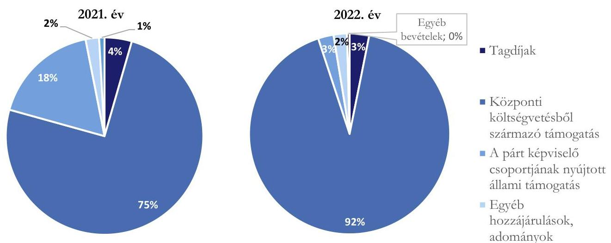
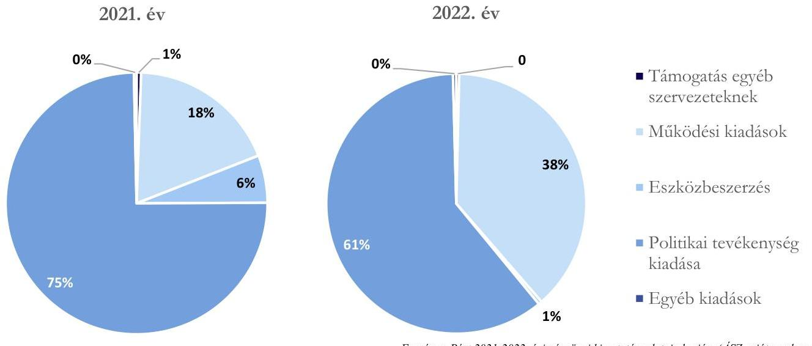

# JELENTÉS 

A költségvetési támogatásban részesülő pártok 2021-2022. évi gazdálkodása törvényességének ellenőrzése

Jobbik - Konzervatívok Párt
2024.

---

# JELENTÉS 

A költségvetési támogatásban részesülő pártok 2021-2022. évi gazdálkodása törvényességének ellenőrzése

Jobbik - Konzervatívok Párt
2024.

---

# ELLENŐRZÉSI IGAZGATÓSÁG: 

ÁLLAMHÁZTARTÁSON KÍVÜLI SZERVEZETEKET ELLENŐRZŐ IGAZGATÓSÁG

## ELLENŐRZÉSI IGAZGATÓ:

KLINGA LÁSZLÓ igazgató

## ELLENŐRZÉSVEZETŐ:

Jelentéseink az interneten a www.asz.hu címen olvashatók.

SOLYMÁR ÁGNES ellenőrzésvezető

IKTATÓSZÁM: EL-4087-002/2024.
TÉMASZÁM: 2679.
ELLENŐRZÉS-AZONOSÍTÓ SZÁM: V1023

---

# TARTALOMJEGYZÉK 

AZ ELLENŐRZÉS ALAPADATAI ..... 5
ELLENŐRZÓTT SZERVEZET ..... 8
ÖSSZEFOGLALÁS ..... 9
AZ ELLENŐRZÉS FÓKUSZKÉRDÉSEI ..... 10
MEGÁLLAPÍTÁSOK ..... 11
JAVASLATOK ..... 17
MELLÉKLETEK ..... 18
I. sz. melléklet: Értelmező szótár ..... 18
II. sz. melléklet: Ellenőrzési kritériumok ..... 20
FÜGGELÉK: ÉSZREVÉTELEK ..... 21
RÖVIDÍTÉSEK JEGYZÉKE ..... 22

---

.

---

# AZ ELLENŐRZÉS ALAPADATAI 

## AZ ELLENŐRZÉS CÉLJA

Az ellenőrzés célja annak értékelése volt, hogy a Párt ${ }^{1}$ által közzétett éves pénzügyi kimutatások a törvényi előírásoknak megfeleltek-e, a könyvvezetés és gazdálkodás során a Párt betartotta-e a vonatkozó jogszabályi és belső előírásokat, a Párt a működéséhez szabályszerűen igénybe vehető forrásokat használt-e fel, a pártok működéséről és gazdálkodásáról szóló Párttv. ${ }^{2}$-ben engedélyezett gazdasági-vállalkozási tevékenységet folytatott-e. Az ellenőrzés célja továbbá annak értékelése volt, hogy az előző számvevőszéki jelentésben foglalt megállapításokkal összhangban készített intézkedési tervben meghatározott feladatokat a Párt végrehajtotta-e.

## AZ ELLENŐRZÉS TÍPUSA

Szabályszerúségi ellenőrzés.

## AZ ELLENŐRZÖTT IDŐSZAK

A 2021-2022. évek,
az utóellenőrzés tekintetében az utóellenőrzés alapját képező ÁSZ ${ }^{3}$ jelentés közzétételének napjától (2021. december 23.) az ellenőrzésről szóló adatszolgáltatásra felhívó levél keltének (2023.09.12) napjáig terjedő időszak.

## AZ ELLENŐRZÉS TÁRGYA

A Párt ellenőrzése során az ellenőrzés tárgyát képezték a 2021. és a 2022. évre vonatkozó pénzügyi kimutatás elkészítésére, jóváhagyására, közzétételére, a Párt könyvvezetésére, gazdálkodására, ennek keretében a számviteli szabályozás kialakítására, a bizonylati rend, bizonylati fegyelem betartására, egyéb gazdálkodási, ellenőrzési és pénzügyi-számviteli feladatok ellátására irányuló tevékenységek. Az ellenőrzés tárgya volt továbbá a Párttv. szerinti források elszámolása és felhasználása, valamint a vagyon jogszabályi előírásoknak megfelelő használata, hasznosítása.

Az ellenőrzés kiterjedt minden olyan körülményre és adatra, amely az ÁSZ jogszabályban meghatározott feladatainak teljesítéséhez, valamint a program végrehajtása folyamán felmerült újabb összefüggések feltárásához szükséges volt.

Jelen ellenőrzés a 2022. évi országgyűlési képviselő-választási kampányra fordított pénzeszközök elszámolásának ellenőrzésére nem terjedt ki, azt az ÁSZ „A 2022. évi országgyülési képvieselö-választási kampányra forditott pénzeszközök elszámolásának ellenörzése" című önálló ellenőrzése (továbbiakban: kampányellenőrzés ${ }^{4}$ ) keretében ellenőrizte.

---

# Az ellenőrzés jogsalapja 

Az ellenőrzés jogszabályi alapját az ÁSZ tv. 5. § (11) bekezdés a) pontja, a Párttv. 4. § (4)-(5) bekezdései, valamint a 10. § (1), (3)-(4) bekezdései képezték.

## AZ ELLENŐRZÉS MÓDSZERE

Az ellenőrzést az ellenőrzési program szempontjai, az ellenőrzött időszakban hatályos jogszabályok, az ellenőrzés általános szakmai szabályai, valamint az ellenőrzésre irányadó ÁSZ módszertanok figyelembevételével végezte az ÁSZ.

Az ellenőrzési kérdések megválaszolásához szükséges bizonyítékok megszerzése az ellenőrzött szervezet által rendelkezésre bocsátott dokumentumokra, adatokra alapozva, továbbá kérdésfeltevés (információkérés), interjú, mintavételezés útján történt. A 2021-2022. évi bevételeket és kiadásokat mintavételi eljárással kiválasztott tételek alapján ellenőrizte az ÁSZ.

Az ellenőrzési bizonyítékként felhasználható adatforrások közé tartoztak egyrészt az ellenőrzési programban felsorolt adatforrások, másrészt adatforrás lehetett még minden további, az ellenőrzés folyamán feltárt, az ellenőrzés szempontjából információt tartalmazó dokumentum.

Az ellenőrzés lefolytatásához az ellenőrzött szervezet a tanúsítványok kitöltésével, valamint az ÁSZ által kért dokumentumok, adatok, információk megküldésével és az ellenőrzés során szolgáltat adatokat.

Az ÁSZ a tételes ellenőrzés mellett statisztikai alapú, véletlenszerű és kockázatalapú mintavételezést és értékelést is alkalmazott. A statisztikai alapú mintavételnél a minták kiválasztása rétegzett mintavételezéssel történt, amelynek értékelése „szabályszerü", ha a minta ellenőrzésének eredménye alapján $95 \%$-os bizonyossággal a teljes sokaságban az átlagos hibaarány nem haladja meg a $10 \%$-ot, „nem szabályszerü", ha nagyobb, mint $10 \%$. Abban az esetben, ha a teljes sokaság tekintetében a $10 \%$-os hibaarányhoz való viszony megítélésének megbízhatósága nem éri el a $95 \%$-ot, annak elérése érdekében az értékelés további szempontokkal egészült ki, a feltárt hibák értéke is figyelembevételre került. A statisztikai alapú mintavétel kiegészült évente az öt legnagyobb forgalmi értékkel rendelkező szállító tételes ellenőrzésével a lényegesség biztosítása érdekében. Tételes ellenőrzésre kerültek a bevételek közül a központi költségvetésből származó támogatások, valamint a Párt országgyűlési képviselőcsoportjának nyújtott állami támogatások. A kiadások közül tételes ellenőrzésre kerültek az egyéb szervezetek részére nyújtott támogatások, a vállalkozások alapítására fordított összegek, valamint a reklámhordozón elhelyezett hirdetések költségei. A bérköltségekből és eszközbeszerzésekből egyszerű véletlenszerű leválogatással került kiválasztásra tíz-tíz mintatétel.

A kampányellenőrzés keretében az ÁSZ ellenőrizte a 2022. évi országgyűlési képviselő választásra fordított állami és a Párttv.-ben meghatározott más pénzeszközök elszámolását, ezért jelen ellenőrzés a kampányidőszakra vonatkozó bevételi és kiadási tételek értékelését nem tartalmazza.

Az utóellenőrzés megállapításai az ÁSZ rendelkezésére álló dokumentumok, valamint az ellenőrzött szervezet által rendelkezésre bocsátott dokumentumok, adatok, továbbá az ellenőrzött mintatételek dokumentumai alapján kerültek megfogalmazásra. A korábbi ÁSZ jelentés alapján a Párt által készített intézkedési tervben előírt feladatok végrehajtása az alábbiak szerint került értékelésre:

- „határidőben végrehajtott"-nak minősült a feladat, ha a teljesítés dokumentáltan, az intézkedési tervben előírt határidőben és tartalommal megtörtént;

---

- „határidőn túl végrehajtott"-nak minősül a feladat, ha annak teljesítése az intézkedési tervben meghatározott módon, de az abban előírt határidőn túl történt meg;
- „nem végrehajtott"-nak minősült a feladat, ha a végrehajtás nem történt meg, vagy amennyiben a teljesítést/végrehajtást nem dokumentálták, dokumentumokkal nem tudják igazolni annak teljesítését.
- „okafogyottá vált" a feladat, ha végrehajtására - meghatározott esemény bekövetkezése, továbbá külső körülmény, a múködést érintő feltétel változása miatt - már nincs szükség, illetve lehetőség, és egyértelmúen megállapítható, hogy az intézkedést szükségessé tevő körülmény a jövőben nem fordulhat elő;
- „nem időszerű" az a feladat, amelynek ellenőrzési időszakon belüli végrehajtására azért nem került (kerülhetett) sor, mert az intézkedés alapjául szolgáló esemény nem következett be, de annak jövőbeni előfordulása lehetséges, a végrehajtása nem volt esedékes, vagy a végrehajtás határideje még nem járt le.

---

# ELLENŐRZÖTT SZERVEZET

JOBBIK-KONZERVATÍVOKPÁRT-AZELLENŐRZÖTTIDŐSZAKBANJOBBIKMAGYARORSZÁGÉRTMOZGALOM

A Jobbik Magyarországért Mozgalom 2003. október 2-án létrejött olyan egyesület, amely nyilvántartott tagsággal rendelkezett, és a nyilvántartásba vételét végző bíróság előtt kinyilvánította, hogy a Párttv. rendelkezéseit magára nézve kötelezőnek ismeri el a Párttv. 1. §-a alapján. A 2023. 05. 26-án jogerőre emelkedett névváltoztatás után a Párt neve Jobbik - Konzervatívok Párt.

Az Alapszabály^{5} alapján a Párt legfelsőbb tanácskozó és döntéshozó szerve a Kongresszus^{6}, kiemelten fontos országos döntéshozatali szervei az Országos Választmány^{7} és az Országos Elnökség^{8} volt. A Párt képviselői: a Párt elnöke, elnökhelyettese, valamint az alapszabályban meghatározott feladatkörében az Országos Elnökség tagjai.

A Párt a Párttv. alapján biztosított lehetőséggel élve a 2011. évben alapította meg a Gyarapodó Magyarországért Alapítványt, amelynek elnevezése a 2015. évben Jobbik Magyarországért Alapítványra változott.

A Párt a 2021. évi pénzügyi kimutatása szerint 681 785 ezer Ft bevételt és 466 048 ezer Ft kiadást a 2022. évi pénzügyi kimutatása szerint 603 339 ezer Ft bevételt és 652 249 ezer Ft kiadást számolt el.

|  A PÁRT 2021-2022. ÉVI PÉNZÜGYI KIMUTATÁSAINAK ADATAI |  |   |
| --- | --- | --- |
|  BEVÉTELEK | 2021. ÉV | 2022. ÉV  |
|  Tagdíjak | 30 434 | 18 936  |
|  Központi költségvetésből származó támogatás | 510 300 | 553 886  |
|  A párt országgyűlési képviselőcsoportjának nyújtott állami támogatás | 120 000 | 15 000  |
|  Egyéb hozzájárulások, adományok | 15 037 | 13 024  |
|  ebből az 500 ezer forint feletti hozzájárulások nevesítve | 3 674 | 2 399  |
|  Egyéb bevételek | 6 014 | 2 493  |
|  **Összes bevétel a gazdasági évben** | **681 785** | **603 339**  |
|  KIADÁSOK | 2021. ÉV | 2022. ÉV  |
|  Támogatás egyéb szervezeteknek | 2 622 | 2 384  |
|  Működési kiadások | 86 198 | 249 514  |
|  Eszközbeszerzés | 27 355 | 2 760  |
|  Politikai tevékenység kiadása | 348 347 | 394 910  |
|  Egyéb kiadások | 1 526 | 2 681  |
|  **Összes kiadás a gazdasági évben** | **466 048** | **652 249**  |

*Forrás: A Párt 2021. és a 2022. évi pénzügyi kimutatásai (ÁSZ saját szerkesztés)*

---

# ÖSSZEFOGLALÁS 

A Párttv. 1. §-a alapján a párt olyan egyesület, amely nyilvántartott tagsággal rendelkezik, és amely a nyilvántartásba vételét végző bíróság előtt kinyilvánítja, hogy a Párttv. rendelkezéseit magára nézve kötelezőnek ismeri el.

Az ÁSZ tv. 5. § (11) bekezdés a) pontja alapján az ÁSZ - a Párttv. rendelkezéseinek megfelelően törvényességi szempontok szerint ellenőrzi a pártok gazdálkodását. A Párttv. 10. § (3) bekezdése alapján az ÁSZ kétévente ellenőrzi azoknak a pártoknak a gazdálkodását, amelyek a központi költségvetésből rendszeres támogatásban részesültek. A Jobbik Magyarországért Mozgalom a 2021. évi pénzügyi kimutatása szerint 510300 ezer Ft, a 2022. évi pénzügyi kimutatása szerint 553886 ezer Ft költségvetési támogatásban részesült. A 2022. évi támogatás tartalmazza az országgyűlési képviselő-választásra kapott összeget is.

Az ÁSZ a kampányellenőrzés keretében ellenőrizte a 2022. évi országgyűlési képviselő választásra fordított állami és a Párttv.-ben meghatározott más pénzeszközök felhasználását. Jelen ellenőrzés az országgyűlési képviselő választásra kapott pénzeszközökre és azok felhasználására nem terjedt ki. Emiatt jelen ellenőrzésnek a pénzügyi kimutatásra, az azt alátámasztó könyvvezetésre, a bevételek, kiadások elszámolására vonatkozó megállapításai a párt gazdálkodásának a kampányellenőrzéssel nem érintett részére vonatkoznak.

## Szabályszerüen kialakított szabályozási környezet

## Alátámasztott pénzügyi kimutatás, megfelelöen elszámolt bevételek és kiadások

A Párt a jogszabályi előírásoknak megfelelően kialakította a gazdálkodás kereteit meghatározó, a pénzügyi kimutatások összeállítására és az azokat alátámasztó könyvvezetésére is kiterjedő belső szabályzatait az ellenőrzött időszakban. A Párt belső szabályzatai tartalmazták a pénzügyi-gazdasági tevékenység ellenőrzésére vonatkozó általános előírásokat is.
A Párt a 2021-2022. évekre vonatkozó pénzügyi kimutatásait az előírt tagolásban, határidőben elkészítette, a Magyar Közlöny mellékletét képező Hivatalos Értesítőben, valamint saját honlapján közzétette. A pénzügyi kimutatásokban a Párttv. előírását betartva az éves szinten ötszázezer forintot meghaladó hozzájárulásokat - a hozzájárulást adó megnevezésével és az összeg megjelölésével - külön feltüntette. A Párt pénzügyi kimutatásaiban szereplő adatokat a könyvvezetés, a főkönyvi és analitikus nyilvántartások adatai alátámasztották. A Pártnál tiltott támogatás gyanúja a kampányellenőrzés során feltárt tiltott támogatáson túl az ellenőrzött területeken, illetve az ellenőrzött mintatételek esetében nem merült fel. A mintatételek alapján a bevételek és kiadások elszámolásával kapcsolatos jogszabályi előírásokat és a belső szabályzatok előírásait Párt betartotta.

A Párt gazdálkodása során megfelelően kialakította a vagyongazdálkodás kereteit, a vagyon nyilvántartása, használata, hasznosítása és elidegenítése szabályszerű volt.

A gazdálkodási tevékenység ellenörzése megfelelően müködött

A Párt létrehozta felügyelőbizottságát, megalkotta a gazdálkodásának és törvényes működésének ellenőrzésére vonatkozó szabályokat. A belső előírások szerinti ellenőrzéseket a gazdasági vezető, valamint a Párt számvizsgáló bizottsága meghatározott rendszerességgel elvégezte.

Egy kivételével határidőben végrehajtott intézkedések

A Párt a korábbi ÁSZ ellenőrzés megállapításai alapján készített intézkedési tervében meghatározott feladatok közül 8 intézkedést határidőben végrehajtott, egy intézkedést nem hajtott végre.

---

# AZ ELLENŐRZÉS FÓKUSZKÉRDÉSEI 

1.     - A Párt a jogszabályi előírásoknak megfelelően kialakította-e a pénzügyi kimutatás összeállítására és az azt alátámasztó könyvvezetésre vonatkozó belső szabályozást?
2.     - A Párt pénzügyi kimutatása, az azt alátámasztó könyvvezetése, a bevételek, kiadások elszámolása, valamint a vagyon nyilvántartása és használata, hasznosítása megfelelt-e a jogszabályi és belső előírásoknak?
3.     - A Párt gazdálkodásának ellenőrzése az előírásoknak megfelelően müködött-e?
4.     - A korábbi ÁSZ ellenőrzés megállapításai alapján készített intézkedési tervben foglaltak végrehajtásra kerültek-e?

---

# MEGÁLLAPÍTÁSOK 

## 1. A Párt a jogszabályi előírásoknak megfelelően kialakította-e a pénzügyi kimutatás összeállítására és az azt alátámasztó könyvvezetésre vonatkozó belső szabályozást?

Összegző megállapítás A Párt a 2021-2022. években a pénzügyi kimutatásai összeállítására és az azt alátámasztó könyvvezetésre, valamint a gazdálkodására vonatkozó belső szabályozását a jogszabályi előírásoknak megfelelően alakította ki.

A Párt gazdálkodásával kapcsolatos belső szabályozás kialakítása a jogszabályi előírásoknak megfelelően történt. A Párt a 2021. és a 2022. évben rendelkezett a Számv. tv. 14. § (3) bekezdés szerinti Számviteli politikával ${ }^{8,}$ a Számv. tv. ${ }^{10} 14 . \S$ (5) bekezdés szerint a Számviteli politika keretében elkészített Leltározási szabályzattal ${ }^{11,}$ Értékelési szabályzattal ${ }^{12}$, Pénzkezelési szabályzattal ${ }^{13}$, amelyek a jogszabályban előírtaknak megfeleltek.
A Párt kialakította a Számv. tv. 161. § (1) bekezdés szerinti Számlarendet ${ }^{14}$ és az abban foglaltakat alátámasztó, önálló Bizonylati rendet ${ }^{15}$, a Számlarend a Számv. tv. előírásának megfelelően tartalmazta az eszköz- és forrásszámlákat, tartalmazta továbbá az alkalmazásra kijelölt fő számlákat, azonban a Számv. tv. 161. § (2) bekezdés a) pontjában előírtak ellenére nem tartalmazta minden alkalmazásra kijelölt, alábontott számla számjelét és megnevezését (pl. 896 Különféle egyéb ráfordítások, 969 Különféle egyéb bevételek).
A Párt az Alapszabályában előírtak szerint a helyi szervezetek saját hatáskörben kezelték a tagdíjat és a helyi szervezetnek, alapszervezetnek juttatott adományt. A tagdíjakra vonatkozó szabályozás a helyi alapszervezetek SZMSZ-ében került meghatározásra.
A párt kialakította a Gazdálkodási szabályzatát ${ }^{16}$, melyben a Számv. tv. előírásaival összhangban rögzítette a gazdálkodás feltételeit és a gazdasági folyamatok ellenőrzésének kereteit.

---

# 2. A Párt pénzügyi kimutatása, az azt alátámasztó könyvvezetése, a bevételek, kiadások elszámolása, valamint a vagyon nyilvántartása és használata, hasznosítása megfelelt-e a jogszabályi és belső előírásoknak? 

| Összegző megállapítás | A Párt 2021. és 2022. évi pénzügyi kimutatásai alátámasztottak voltak. A könyvvezetés, a bevételek, kiadások elszámolása, valamint a vagyon nyilvántartása, használata, hasznosítása megfelelt a jogszabályi és a belső előírásoknak. |
| :--: | :--: |
| 2.1. számú megállapítás | A Párt a jogszabályban előírt tagolásban, határidőben elkészítette a 20212022. évre vonatkozó előírt tartamú pénzügyi kimutatásait; az azokat alátámasztó könyvvezetése, számviteli nyilvántartási rendszere szabályszerű volt. |

A Párt a 2021-2022. évre vonatkozó pénzügyi kimutatásait határidőben, a Párttv.-ben előírt tagolásban elkészítette. A Párt 2021-2022. évre vonatkozó pénzügyi kimutatásait legfőbb szerve a Kongresszus a Számvizsgáló Bizottság jóváhagyását követően elfogadta, a Hivatalos Értesítőben megjelentette, valamint saját honlapjára feltöltötte. A pénzügyi kimutatások a Párttv.-ben meghatározottak szerint tartalmazták a tagdíjakat, a központi költségvetésből származó támogatást, a Párt országgyűlési képviselőcsoportjának nyújtott állami támogatást, az egyéb hozzájárulásokat és adományokat, valamint az egyéb bevételeket.
A Párt 2021-2022. évi pénzügyi kimutatásaiban a Párttv.-ben meghatározottak szerint kiadásként szerepeltette az egyéb szervezeteknek nyújtott támogatást, a működési kiadásokat, az eszközbeszerzést, a politikai tevékenység kiadásait és az egyéb kiadások összesített értékeit. A Párt az ellenőrzött időszakban vállalkozást nem alapított, országgyűlési képviselőcsoportja részére támogatást nem folyósított.
A Párt könyvvezetése, számviteli nyilvántartási rendszere a 2021-2022. években összhangban volt a jogszabályi és a belső szabályozás előírásaival. A Párt az ellenőrzött időszakban a könyvvezetése során a kettős könyvvitel rendszerét alkalmazta. A Párt a Számv. tv. előírásainak eleget téve gondoskodott nyilvántartási (könyvvezetési) rendszerének oly módon való tovább részletezéséről, hogy abból a Párttv.ben meghatározott pénzügyi kimutatás adatai rendelkezésre álljanak.
A könyvviteli feladatokat ellátó munkavállalók a mintatételek alapján a munkakörükbe tartozó feladatokról írásbeli dokumentummal rendelkeztek, megfelelve ezzel az Mt. ${ }^{17}$ előírásainak.
A Számlarend előírásainak megfelelően elkészítették az analitikus nyilvántartásokat. A Számv. tv.-ben előírtaknak megfelelően az analitikus nyilvántartások és a főkönyvi könyvelés között az értékadatok számszerű egyeztetésének lehetőségét biztosították, a könyvviteli zárlatot a jogszabálynak megfelelően elvégezték, melynek alátámasztására az előírt eszköz- és forrás egyeztetéseket, illetve a mennyiségi leltározást elvégezték.
A könyvvezetés szabályszerűségét a Számv. tv. és a belső szabályzatok előírásaival összhangban biztosították, a bevételek és kiadásokhoz kapcsolódó alapbizonylatok rendelkezésre álltak, azt a megfelelő jogcímre számolták el, a Párt a jogszabályi előírásoknak megfelelően alkalmazta a passzív időbeli elhatárolást.

---

2.2. számú megállapítás

A Párt 2021-2022. évi pénzügyi kimutatásaiban a bevételek szerepeltetése és könyvviteli elszámolása szabályszerű volt.

A Párt a pénzügyi kimutatások bevétel soraiban szereplő adatokat a jogszabályoknak és a belső szabályzatoknak megfelelő könyvviteli nyilvántartással támasztotta alá, a főkönyvi számlák adatai megegyeztek a beszámolók és a pénzügyi kimutatások adataival. A Párt eljárása megfelelt a Párttv. és a Számv.tv. előírásainak.
A Párt a 2021. évi pénzügyi kimutatásában 681785 ezer Ft, a 2022. évi pénzügyi kimutatásában 603339 ezer Ft bevételt mutatott ki, összetételét az 1. ábra mutatja.
1. ábra:

A JOBBIK MAGYARORSZÁGÉRT MOZGALOM BEVÉTELEINEK ALAKULÁSA A 2021-2022. ÉVEKBEN

Forrás: a Párt 2021-2022. évi pénzügyi kimutatás adatai alapján. (ASZ saját szerkesztés)
A Párttv.-ben meghatározottak szerint a tagdíjak, a központi költségvetésből származó támogatás és az egyéb bevétel pénzügyi kimutatás sorok értékei megegyeztek a könyvviteli nyilvántartással, azokon csak az előírt jogcímű összegek szerepeltek. Az országgyűlési képviselőcsoport az OGY törvény ${ }^{18}$ 118/A. §-ában foglaltak által biztosított lehetőségével élve mindkét ellenőrzött évben adott támogatást a Párt számára; 2021-ben 120000 ezer Ft-ot, 2022-ben 15000 ezer Ft-ot.
A Párt az egyéb hozzájárulások, adományok pénzügyi kimutatás soron a Párttv. előírását betartva az egy naptári év alatt adott 500 ezer Ft összeghatár feletti adományokat nevesítve rögzítette. A gazdaságivállalkozási bevétele kizárólag a Párttv.-ben nevesített tárgyak értékesítéséből származott 2021-ben 504 ezer Ft, 2022-ben 812 ezer Ft értékben.
A Párt az ellenőrzött időszakban kizárólag a Párttv. által meghatározott forrásokkal rendelkezett, tiltott támogatás gyanúja - a kampányellenőrzésen feltárt tiltott támogatáson túl - az ellenőrzött területeken, illetve az ellenőrzött mintatételek esetében nem merült fel. A mintatételek alapján a bevételek elszámolásával kapcsolatos jogszabályi előírásokat és a belső szabályzatok előírásait a Párt betartotta.

---

# 2.3. számú megállapítás 

A Párt 2021-2022. évre vonatkozó pénzügyi kimutatásaiban a kiadások szerepeltetése és azok könyvviteli elszámolása szabályszerű volt.

A Párt 2021-2022. évi pénzügyi kimutatásaiban a kiadások szerepeltetése és azok könyviteli elszámolása megfelelt a jogszabályi és belső előírásoknak. A Párt az ellenőrzött időszakban a Párttv. előírásával összhangban kiadásként szerepeltette az egyéb szervezeteknek nyújtott támogatást, a múködési kiadásokat, az eszközbeszerzést, a politikai tevékenység kiadásait és az egyéb kiadások összesített értékeit. A Párt az ellenőrzött időszakban vállalkozást nem alapított, országgyűlési képviselőcsoportja részére támogatást nem folyósított, így ezek a tételek a Párttv. előírásainak megfelelően a pénzügyi kimutatásokban érték nélkül szerepeltek.
A Párttv. előírásainak megfelelően a pénzügyi kimutatás egyes sorain a 2021-2022. évben csak az előírt jogcímű összegek szerepeltek, a pénzügyi kimutatásokban szereplő összegek megegyeztek a könyvviteli nyilvántartásban szereplő összegekkel és az azt alátámasztó nyilvántartásokkal. A mintatételek alapján a kiadások elszámolásával kapcsolatos jogszabályi előírásokat és a belső szabályzatok előírásait a Párt betartotta.
A Párt összes kiadása a 2021. évben a 466048 ezer Ft, a 2022. évben 652249 ezer Ft-ot tett ki, melyeknek összetételét a 2. ábra mutatja.
2. ábra

A JOBBIK MAGYARORSZÁGÉRT MOZGALOM KIADÁSAINAK ALAKULÁSA A 2021-2022. ÉVEKBEN

A főkönyvi könyvelésben a múködési és a politikai tevékenység kiadásait a Párttv. előírásainak megfelelően elkülönítette.
Az ellenőrzött tételek alapján a foglalkoztatással összefüggő és a személyi jellegű kifizetések, illetve az ehhez kapcsolódó bejelentési, adó- és járulék nyilvántartási, levonási, bevallási, befizetési, adatszolgáltatási kötelezettségek teljesítése megfelelt a jogszabályi és a belső szabályzatok előírásainak.
A Párt a 2021-2022. évi pénzügyi kimutatásaiban a támogatás egyéb szervezeteknek soron kimutatott támogatásait bírósági nyilvántartásban szereplő állatvédő szervezeteknek nyújtotta jelentős részben természetben, így a támogatottnak elszámolási kötelezettsége nem volt.
A reklámhordozón elhelyezett plakátok közzétételének a költségelszámolása, a pénzügyi kimutatásokban való szerepeltetése a jogszabályi előírásoknak megfelelt. A Tvtv. 11/G. § (3) bekezdésétől eltérően

---

közzétett listaár hiányában történt meg a plakát kihelyezése a reklámhordozón, továbbá a Párt, mint reklámozó a Tvtv. 11/G. § (7) bekezdés előírásától eltérően a plakát közzététele céljából megkötött szerződést sem küldte meg a kormányhivatal részére. A plakátok elhelyezésének piaci árát más szervezetek bejelentett áraival összevetve tiltott támogatás kockázata nem merült fel.
2.4. számú megállapítás

A Párt vagyonnyilvántartása, használata, vagyonnal való gazdálkodása a 2021-2022. években szabályszerű volt.

A Párt a Számv. tv. előírásainak megfelelően a 2021-2022. évben előírta a vagyonnal való gazdálkodás, ezen belül a kapcsolódó feladat- és hatáskörök, felelősségi viszonyok szabályozását. A Pártnak az ellenőrzött időszakban a Párttv. szerinti vagyonmérleg készítési kötelezettsége nem volt, a céljai eléréséhez rendelt vagyont a jogszabályban meghatározott módon használta fel.
A Párt a vagyonnal való gazdálkodásának szabályait, az ezzel kapcsolatos feladat- és hatásköröket az Alapszabályban, számviteli politikában, számlarendben, határozta meg. Az Alapszabály előírása szerint a Számvizsgáló Bizottság feladata volt a gazdálkodásra vonatkozó számviteli szabályok betartásának, valamint a Párt központi költségvetése végrehajtásának és zárszámadásának ellenőrzése.
A Párt eszközbeszerzéseinek kifizetése, elszámolása és dokumentálása, az eszköz bekerülési értékének meghatározása megfelelte a Számv. tv. és az Értékelési szabályzat előírásainak.
A Párt saját tulajdonú ingatlannal, MFB ${ }^{19}$ hitellel nem rendelkezett. A Párt 2021-ben magánszemélytől térítésmentesen használatba ingóságot kapott, melynek értékelését a Párttv. előírásai szerint elvégezte. 2022-ben térítésmentesen használatba kapott ingósága nem volt.
A Párt a Leltározási szabályzatában előírt leltározással kapcsolatos feladatokat végrehajtotta, a leltárt az ellenőrzött időszakra vonatkozóan elkészítette, a könyvek üzleti év végi zárásához olyan leltárt állított össze, amely tételesen, ellenőrizhető módon tartalmazza a főkönyvi nyilvántartásában szereplő eszközeit és forrásait.

# 3. A Párt gazdálkodásának ellenőrzése az előírásoknak megfelelően múködött-e? 

## Összegző megállapítás A Párt gazdálkodásának ellenőrzése az Alapszabályban meghatározott előírásoknak megfelelően múködött.

A Párt az ellenőrzési rendszer belső szabályozási kereteit a 2021-2022. évekre vonatkozóan kialakította, a belső előírások szerinti múködését biztosította.
A Párt az ellenőrzés kereteit az Alapszabályban és a Gazdálkodási szabályzatban határozta meg. Az Alapszabályban létrehozták a Párt felügyelő- és számvizsgáló bizottságát, meghatározták az ellenőrzés kereteit. A Párt összhangban a Ptk. ${ }^{20}$ előírásaival háromtagú felügyelőbizottságot jelölt ki az ügyvezetés ellenőrzésére, illetve a Kongresszus elé kerülő előterjesztések vizsgálatára. A felügyelő bizottság ügyrendjében foglaltaknak megfelelően feladatainak a 2021 és 2022. évben eleget tett. Véleményezte a beszámolókat a kongresszusi ülésre, elvégezte a Párt különböző testületeinek és szerveinek ellenőrzését.
A háromtagú Számvizsgáló Bizottság feladata volt az Alapszabály és a pénzügyi és gazdálkodási szabályzat gazdálkodásra vonatkozó rendelkezéseinek, az általános számviteli szabályok betartásának ellenőrzése,

---

valamint az Országos Választmány, illetve a Kongresszus elé terjesztett éves pénzügyi kimutatás vizsgálata és véleményezése.
A Párt gazdálkodási vezetői ellenőrzési feladatait, különös tekintettel a Számv. tv. és a Pénzkezelési Szabályzatban meghatározott feladatokra a gazdasági igazgató látta el, aki felelősségi körében szabályozta a gazdasági műveletet elrendelő, utalványozó, végrehajtást igazoló és ellenőrző feladatát, az ellenőrzés rendjét.

# 4. A korábbi ÁSZ ellenőrzés megállapításai alapján készített intézkedési tervben foglaltak végrehajtásra kerültek-e? 

## Összegző megállapítás A Párt az intézkedési tervében foglaltak közül 8 intézkedést határidőben végrehajtott, egy intézkedést nem hajtott végre.

A Párt a korábbi ÁSZ ellenőrzés megállapításai alapján 9 pontban készített intézkedési tervet, amelyből nyolcat határidőben teljesített, egyet nem hajtott végre, a végrehajtásra a Párt intézkedési tervében az 2021. évet jelölte meg.
Az intézkedési tervben felsorolt feladatok végrehajtásaként az alább felsoroltak szerint a belső szabályzatok az intézkedési tervben vállalt határidőben kiegészítésre kerültek, a könyvvezetés gyakorlatát átalakították, az ellenőrzés rendszerét megújították.
„Végrehajtott intézkedések":

- A Párt a pénzkezelési szabályzat módosításában intézkedett a készpénzállomány ellenőrzésének gyakoriságáról.
- A Párt a jelen ellenőrzés során beküldött mintatételei alapján a Számv. tv. előírásának megfelelően csak bizonylat alapján jegyzett be adatokat a számviteli (könyvviteli) nyilvántartásokba.
- A Párt készített leltárt, amely a Leltározási szabályzatában meghatározottak szerint tartalmazta eszközeit és forrásait mennyiségben és értékben.
- A Párt a jogszabályi előírás szerint gondoskodott a pénzügyi kimutatások adatainak könyvvezetéssel történő alátámasztásáról.
- A Párt a jogszabályi előírás szerint a a jelen ellenőrzés során beküldött mintatételei alapján az egyéb kiadások esetén a főkönyvi könyvelés, az analitikus nyilvántartás és a bizonylatok adatai közötti egyeztetés és ellenőrzés lehetőségét logikailag zárt rendszerrel biztosította.
- A 2021. május 19-ei Alapszabályban rögzítésre kerültek a felügyelőbizottság tagjai.
- A Párt gondoskodott arról, hogy a pénzügyi kimutatásai jóváhagyására a Ptk. előírásaival összhangban, az Alapszabályban és a belső szabályokban foglaltak szerint szabályszerűen kerüljön sor. A 2021-2022. évi pénzügyi kimutatásokat a Kongresszus jóváhagyta.
- 2021-ben és 2022-ben az Alapszabályban meghatározottak szerint a Számvizsgáló bizottság ellenőrizte a Párt költségvetését és zárszámadását.
„Nem végrehajtott" intézkedés: A Párt a Számlarendet nem egészítette ki a Számv. tv.-ben előírtaknak megfelelően.

---

# JAVASLATOK 

Az ÁSZ tv. 33. § (1) bekezdésében foglaltak értelmében az ellenőrzött szervezet vezetője köteles a jelentésben foglalt megállapításokhoz kapcsolódó intézkedési tervet összeállítani és azt a jelentés kézhezvételétől számított 30 napon belül az ÁSZ részére megküldeni. Amennyiben az ellenőrzött szervezet vezetője nem küldi meg határidőben az intézkedési tervet, vagy továbbra sem elfogadható intézkedési tervet küld, az Állami Számvevőszék elnöke az ÁSZ tv. 33. § (3) bekezdése a) és b) pontjaiban foglaltakat érvényesítheti.

## JOBBIK - KONZERVATÍVOK PÁRT ELNÖKE

1. Intézkedjen annak érdekében, hogy a Párt Számlarendje a Számv. tv. 161. § (2) bekezdés b) pontjában foglalt elöírásoknak megfelelően tartalmazza minden alkalmazásra kijelölt számla számjelét és megnevezését.
2. Gondoskodjon arról, hogy a Párt plakátok elhelyezésére vonatkozóan a Tvtv. 11/G. § (7) bekezdés előírása szerint küldje meg a megkötött szerződést a hatóságnak.

---

# MELLÉKLETEK 

I. SZ. MELLÉKLET: ÉRTELMEZŐ SZÓTÁR

Civil szervezet

Egyesület

Költségvetési támogatás

Pénzügyi kimutatás

A Párt gazdasági-vállalkozási tevékenysége

Nem pénzbeli támogatás

Ingó vagyontárgyak

Intézkedési terv

Plakát

Reklám

A civil társaság; a Magyarországon nyilvántartásba vett egyesület - a Párt, a szakszervezet és a kölcsönös biztosító egyesület kivételével és - a közalapítvány és a Pártalapítvány kivételével - az alapítvány. (Forrás: Civil tv. 2. §6. a)-c) pontjai)
Az egyesület a tagok közös, tartós, alapszabályban meghatározott céljának folyamatos megvalósítására létesített, nyilvántartott tagsággal rendelkező jogi személy. (Forrás: Ptk. 3:63. § (1) bekezdés)
A Számv. tv. szempontjából egyéb szervezet. (Számv. tv. 3. § 4. a) pont)
A társadalombiztosítás pénzügyi alapjai kivételével az államháztartás központi alrendszeréből ellenérték nélkül, pénzben nyújtott támogatások. (Forrás: Áht. 1. § 14. pont)
A Pártok a pénzügyi kimutatást kötelesek minden év május 31-ig a Magyar Közlönyben, valamint saját honlappal rendelkező Pártok a honlapjukon is közzétenni. (Párttv. 9. § (1) bekezdés, 1. számú melléklet)
A Párt a költségeinek fedezése és vagyonának gyarapítása érdekében a következő gazdasági-vállalkozási tevékenységeket folytathatja:
a) politikai céljainak és tevékenységének megismertetése érdekében kiadványokat jelentethet meg és terjeszthet, a Pártot szimbolizáló jelvényeket és más ilyen célú tárgyakat árusíthat és Pártrendezvényeket szervezhet;
b) a tulajdonában álló ingatlanokat és ingókat díj ellenében hasznosíthatja és elidegenítheti. (Párttv.6. § (1) bekezdés)
Vagyoni értékkel rendelkező forgalomképes dolog, szellemi alkotás, illetve vagyoni értékű jog részben vagy egészében, véglegesen vagy ideiglenesen, teljesen vagy részben ingyenesen történő átruházása vagy átengedése, illetve szolgáltatás biztosítása. (Civil tv. 2. § 25. pont)
Ingó vagyontárgy: az ingatlannak nem minősülő dolog, kivéve a fizetőeszközt, az értékpapírt és a föld tulajdonosváltozása nélkül értékesített lábon álló (betakarítatlan) termést, terményt (pl. lábon álló fa) (Szja tv. 3. § 30. pont)
Az ellenőrzött szervezet vezetője által készített, a jelentés kézhezvételétől számított harminc napon belül az ASZ részére megküldött, az ASZ által elfogadott intézkedéseket tartalmazó terv. (ÁSZ tv. 33. §)
Plakát és választási falragasz, felirat, szórólap, vetített kép, embléma mérettől és hordozóanyagtól függetlenül. (V.e. ${ }^{21}$ törvény 144. § (1) bekezdés)
Gazdasági reklám: olyan közlés, tájékoztatás, illetve megjelenítési mód, amely valamely birtokba vehető forgalomképes ingó dolog - ideértve a pénzt, az értékpapírt és a pénzügyi eszközt, valamint a dolog módjára

---

hasznosítható természeti erőket - (a továbbiakban együtt: termék), szolgáltatás, ingatlan, vagyoni értékủ jog (a továbbiakban mindezek együtt: áru) értékesítésének vagy más módon történő igénybevételének előmozdítására, vagy e céllal összefüggésben a vállalkozás neve, megjelölése, tevékenysége népszerúsítésére vagy áru, árujelző ismertségének növelésére irányul, ide nem értve:

- a cégtáblát, üzletfeliratot, a vállalkozás használatában álló ingatlanon elhelyezett, a vállalkozást népszerüsítő egyéb feliratot és más grafikai megjelenítést,
- az üzlethelyiség portáljában (kirakatában) elhelyezett gazdasági reklámot,
- a járművön, valamint tájékozódást segítő jelzést megjelenítő reklámcélú eszközön elhelyezett gazdasági reklámot, továbbá
a tulajdonos által az ingatlanán elhelyezett, annak elidegenítésére vonatkozó ajánlati felhívást (hirdetést), valamint a helyi önkormányzat által lakossági apróhirdetések közzétételének megkönnyítése céljából biztosított táblán vagy egyéb felületen elhelyezett, kisméretű hirdetéseket; (Reklámtörvény3. § d) pont, Tvtv. ${ }^{22}$ 11/F 3. pont)

A funkcióját vagy létesítésének célját tekintve túlnyomórészt reklám közzétételét, illetve elhelyezését biztosító, elősegítő vagy támogató eszköz, berendezés, létesítmény; ide nem értve a közúti közlekedési tárgyú jogszabályokban meghatározott életmentő funkciót ellátó reklámcélú eszköz. (Tvtv. 1/F. § 4. pont)

---

# II. SZ. MELLÉKLET: ELLENŐRZÉSI KRITÉRIUMOK 

## FOKUSZTERÜLET/FOKUSZKERDÉS

1. A Párt a jogszabályi előírásoknak megfelelően kialakította-e a pénzügyi kimutatás összeállítására és az azt alátámasztó könyvvezetésre vonatkozó belső szabályozást?
2. A Párt pénzügyi kimutatása, az azt alátámasztó könyvvezetése, a bevételek, kiadások elszámolása, valamint a vagyon nyilvántartása és használata, hasznosítása megfelelt-e a jogszabályi és belső előírásoknak?
3. A Párt gazdálkodásának ellenőrzése az előírásoknak megfelelően múködött-e?
4. A korábbi ÁSZ ellenőrzés megállapításai alapján készített intézkedési tervben foglaltak végrehajtásra kerültek-e?

## ELLENŐRZÉSI KRITÉRIUMOK

Számv. tv. 3. §, 6. §, 12. §, 14. §, 15-16. §, 160-161/A. §, 164-169. §, 23-45. §, 46-53. §, 57-68. §, 69. §
Párttv. 4. §, 6. §, 9. §, 1. sz. melléklet
Civil tv. 2. §
479/2016. (XII. 28.) Korm. rendelet ${ }^{23}$ 4. § (1) bekezdés, 9. §, 1516. §

Ptk. 3:4. §, 3:26-3:28. §, 3:63-3:87. §
Alapszabály, a Párt belső szabályozásai
Számv. tv. 6. §, 12. §, 14. §, 159. §, 160. §, 161-161/A. §, 164-167. §
Párttv. 4. §, 6. §, 9. §, 1. sz. melléklet
Mt. 14. §, 45. §, 48. §
Szja tv. 3. §, 25. §, 47. §, 3. sz. melléklet
Ptk. 3:74. §, 6:272-6:280. §, 6:331-6:341. §
Civil tv. 2. §
Tvtv. 11/F. §, 11/G. §
Reklámtörvény ${ }^{24} 3 . \S$,
104/2017. (IV. 28.) Korm. rendelet ${ }^{25}$ 8/C. §
Art. ${ }^{26}$ 1. sz. melléklet
465/2017. (XII.28.) Korm. rendelet ${ }^{27}$
437/2015.(XII.28.) Korm. rendelet ${ }^{28}$
TAO tv. ${ }^{29} 4 . \S, 18 . \S$
Vtv. ${ }^{30} 68 . \S$
Alapszabály, a Párt belső szabályozásai
Számv. tv. 14. §
Belső szabályzatok, felügyelőbizottság ügyrendjében foglaltak, A 2019-2020. évi ÁSZ ellenőrzésről készült ÁSZ jelentés megállapításai alapján készített intézkedési tervben foglalt előírások, ellenőrzési határozatok, jegyzőkönyvek.
A korábbi évek ÁSZ ellenőrzéséről készült ÁSZ jelentés megállapításai alapján készített intézkedési tervben foglalt előírások.

---

# FÜGGELÉK: ÉSZREVÉTELEK 

A jelentéstervezetet a Számvevőszék 15 napos észrevételezésre megküldte az ellenőrzött szervezet vezetőjének az ÁSZ tv. 29. §* (1) bekezdése előírásának megfelelően.

Az ellenőrzött szervezet vezetője a jelentéstervezet megállapításaira nem tett észrevételt.

[^0]
[^0]:    * 29. § (1) Az Állami Számvevőszék az ellenőrzési megállapításait megküldi az ellenőrzött szervezet vezetőjének vagy az általa megbízott személynek, és annak, akinek személyes felelősségét állapította meg.
    (2) Az ellenőrzött szervezet vezetője és a felelősként megjelölt személy az ellenőrzés megállapításaira tizenöt napon belül írásban észrevételt tehet.
    (3) Az Állami Számvevőszék az észrevételre a beérkezésétől számított harminc napon belül írásban válaszol. A figyelembe nem vett észrevételeket köteles a jelentésben feltüntetni, és megindokolni, hogy azokat miért nem fogadta el.

---

# RÖVIDÍTÉSEK JEGYZÉKE 

${ }^{1}$ Párt
${ }^{2}$ Párttv.
${ }^{3}$ ÁSZ
${ }^{4}$ kampányellenőrzés
${ }^{5}$ Alapszabály
${ }^{6}$ Kongresszus
${ }^{7}$ Országos Választmány
${ }^{8}$ Országos Elnökség
${ }^{9}$ Számviteli politika
${ }^{10}$ Számv. tv.
${ }^{11}$ Leltározási szabályzat
${ }^{12}$ Eszközök és források értékelési szabályzata
${ }^{13}$ Pénzkezelési szabályzat
${ }^{14}$ Számlarend
${ }^{15}$ Bizonylati rend
${ }^{16}$ Gazdálkodási szabályzat
${ }^{17} \mathrm{Mt}$.
${ }^{18}$ OGY törvény
${ }^{19}$ MFB
${ }^{20}$ Ptk.
${ }^{21}$ V.e.
${ }^{22}$ Tvtv.
${ }^{23}$ 479/2016. Korm. rendelet
${ }^{24}$ Reklámtörvény
${ }^{25}$ 104/2017. Korm. rendelet

Jobbik Magyarországért Mozgalom
1989. évi XXXIII. törvény a Pártok működéséről és gazdálkodásáról (hatályos 1989. október 30-ától)
Állami Számvevőszék
„A 2022. évi országgyölési képeiselö-választási kampányra fordított pénzszközök elszámolásának ellenörzése" című ÁSZ ellenőrzés
Jobbik Magyarországért Mozgalom Alapszabály (hatályos 2018. augusztus 25-től 2019. február 23-ig), Jobbik Magyarországért Mozgalom Alapszabály (hatályos 2019. február 24-től 2020. január 24-ig), Jobbik Magyarországért Mozgalom Alapszabály (hatályos 2020. január 25-től)
Jobbik Magyarországért Mozgalom Kongresszusa
Jobbik Magyarországért Mozgalom Országos Választmánya
Jobbik Magyarországért Mozgalom Országos Elnöksége
Jobbik Magyarországért Mozgalom Számviteli politika (hatályos 2019. január 1-től és Sneider Tamás kiadmányozta, 1. számú módosítása 2020. január 1-től, 2. számú módosítása 2021. január 1-től, 3. számú módosítása 2022. január 1-től hatályos és a 3. módosítást Jakab Péter kiadmányozta)
2000. évi C törvény a számvitelről

Jobbik Magyarországért Mozgalom Leltározási szabályzat (hatályos: 2019.január 1-től és Sneider Tamás kiadmányozta)
Jobbik Magyarországért Mozgalom Eszközök és források értékelési szabályzata (hatályos 2018. július 31-től és Sneider Tamás kiadmányozta, 1. számú módosítása 2021. április 1-től hatályos és a módosítást Jakab Péter kiadmányozta)
Jobbik Magyarországért Mozgalom Pénzkezelési Szabályzata (hatályos 2015. január 1-től és Vona Gábor kiadmányozta, 1. számú módosítása 2016. január 1-től, 2. számú módosítása 2026. december 15-től hatályos és Vona Gábor kiadmányozta, a 3. számú módosítása 2021. április 1től hatályos és a módosítást Jakab Péter kiadmányozta)
Jobbik Magyarországért Mozgalom Számlarend (hatályos 2019. január 1-től és Sneider Tamás kiadmányozta, 1. számú módosítása 2022. január 1-től hatályos és a módosítást Jakab Péter kiadmányozta)
Jobbik Magyarországért Mozgalom Bizonylati rend (hatályos 2015. január 1-étől)
A Jobbik Magyarországért Mozgalom Pénzügyi és gazdálkodási Szabályzata (hatályos 2016. január 01-étől)
2012. évi I. törvény a munka törvénykönyvéről
2012. évi XXXVI. törvény az Országgyűlésről szóló

Magyar Fejlesztési Bank
2013. évi V. törvény a Polgári Törvénykönyvről
2013. évi XXXVI. törvény a választási eljárásról
2016. évi LXXIV. törvény a településkép védelméről
479/2016. (XII. 28.) Korm. rendelet a számviteli törvény szerinti egyes egyéb szervezetek beszámoló készítési és könyvvezetési kötelezettségének sajátosságairól
2008. évi XLVIII. törvény a gazdasági reklámtevékenység alapvető feltételeiről és egyes korlátairól
104/2017. (IV.28) Korm. rendelet a településkép védelméről szóló törvény reklámok közzétételével kapcsolatos rendelkezéseinek végrehajtásáról

---

${ }^{26}$ Art.
${ }^{27} 465 / 2017$. Korm. rendelet
${ }^{28} 437 / 2015$. Korm. rendelet
${ }^{29} \mathrm{TAO} \mathrm{tv}$.
${ }^{30} \mathrm{Vtv}$.
2017. évi CL. törvény az adózás rendjéről

465/2017. (XII.28.) Korm. rendelet az adóigazgatási eljárás részletszabályairól
437/2015. (XII. 28.) Korm. rendelet a belföldi hivatalos kiküldetést teljesítő munkavállaló költségtérítéséről
1996. évi LXXXI. törvény a társasági adóról és az osztalékadóról
2007. évi CVI. törvény az állami vagyonról

---

1052 Budapest, Apáczai Csere János u. 10. | 1364 Budapest 4., Pf. 54
www.asz.hu | szamvevoszek@asz.hu
telefon: +36 14849100