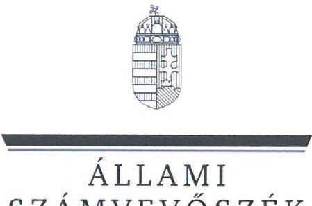
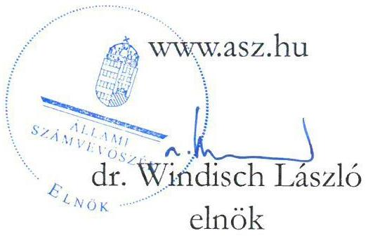
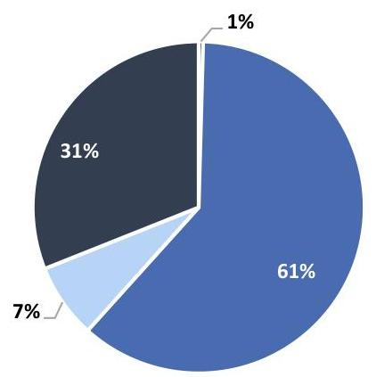
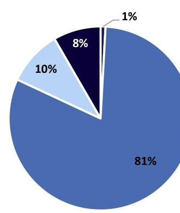
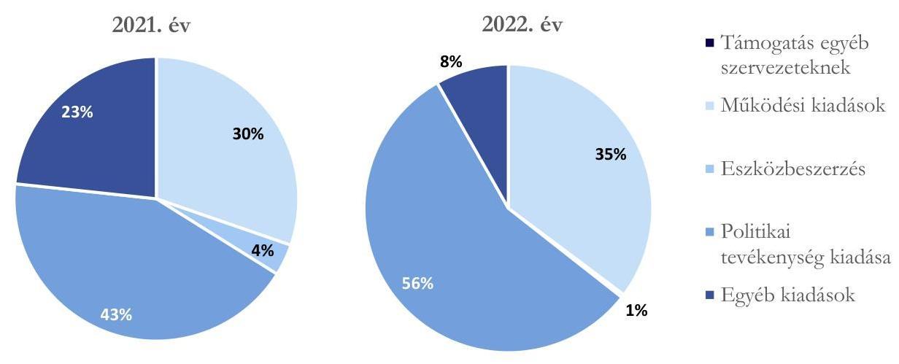
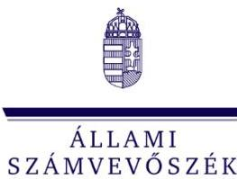

# JELENTÉS 

A költségvetési támogatásban részesülő pártok 2021-2022. évi gazdálkodása törvényességének ellenőrzése

LMP - Magyarország Zöld Pártja
2024.

---

ÁLLAMI
SZÁMVEVŐSZÉK

# JELENTÉS 

## A költségvetési támogatásban részesülő pártok 2021-2022. évi gazdálkodása törvényességének ellenőrzése

LMP - Magyarország Zöld Pártja
2024.

24078

---

# ELLENŐRZÉSI IGAZGATÓSÁG: 

ÁLLAMHÁZTARTÁSON KÍVÜLI SZERVEZETEKET ELLENŐRZŐ IGAZGATÓSÁG

## ELLENŐRZÉSI IGAZGATÓ:

KLINGA LÁSZLÓ igazgató

## ELLENŐRZÉSVEZETŐ:

Jelentéseink az interneten a www.asz.hu címen olvashatók.

SOLYMÁR ÁGNES ellenőrzésvezető

IKTATÓSZÁM: EL-4087-003/2024.
TÉMASZÁM: 2679.
ELLENŐRZÉS-AZONOSÍTÓ SZÁM: V1023

---

# TARTALOMJEGYZÉK 

AZ ELLENŐRZÉS ALAPADATAI ..... 5
AZ ELLENŐRZÖTT SZERVEZET ..... 8
ÖSSZEFOGLALÁS ..... 9
AZ ELLENŐRZÉS FÓKUSZKÉRDÉSEI ..... 11
MEGÁLLAPÍTÁSOK ..... 12
JAVASLATOK ..... 17
MELLÉKLETEK ..... 18
I. sz. melléklet: Értelmező szótár ..... 18
II. sz. melléklet: Ellenőrzési kritériumok ..... 19
FÜGGELÉK: ÉSZREVÉTELEK ..... 20
RÖVIDÍTÉSEK JEGYZÉKE ..... 21

---

.

---

# AZ ELLENŐRZÉS ALAPADATAI 

## AZ ELLENŐRZÉS CÉLJA

Az ellenőrzés célja annak értékelése volt, hogy a Párt ${ }^{1}$ által közzétett éves pénzügyi kimutatások a törvényi előírásoknak megfeleltek-e, a könyvvezetés és gazdálkodás során betartotta-e a vonatkozó jogszabályi és belső előírásokat, a Párt a működéséhez szabályszerűen igénybe vehető forrásokat használt-e fel, a pártok működéséről és gazdálkodásáról szóló Párttv. ${ }^{2}$-ben engedélyezett gazdasági-vállalkozási tevékenységet folytatott-e. Az ellenőrzés célja továbbá annak értékelése volt, hogy az előző számvevőszéki jelentésben foglalt megállapításokkal összhangban készített intézkedési tervben meghatározott feladatokat a Párt végrehajtotta-e.

## AZ ELLENŐRZÉS TÍPUSA

Szabályszerűségi ellenőrzés.

## AZ ELLENŐRZÖTT IDŐSZAK

A 2021-2022. évek.
Az utóellenőrzés tekintetében az utóellenőrzés alapját képező ÁSZ ${ }^{3}$ jelentés közzétételének napjától (2021. december 23.) az ellenőrzésről szóló adatszolgáltatásra felhívó levél keltének (2023.09.12.) napjáig terjedő időszak.

## AZ ELLENŐRZÉS TÁRGYA

A Párt ellenőrzése során az ellenőrzés tárgyát képezték a 2021. és a 2022. évre vonatkozó pénzügyi kimutatások elkészítésére, jóváhagyására, közzétételére, a Párt könyvvezetésére, gazdálkodására, ennek keretében a számviteli szabályozás kialakítására, a bizonylati rend, bizonylati fegyelem betartására, egyéb gazdálkodási, ellenőrzési és pénzügyi-számviteli feladatok ellátására irányuló tevékenységek. Az ellenőrzés tárgya volt továbbá a Párttv. szerinti források elszámolása és felhasználása, valamint a vagyon jogszabályi előírásoknak megfelelő használata, hasznosítása.

Az ellenőrzés kiterjedt minden olyan körülményre és adatra, amely az ÁSZ jogszabályban meghatározott feladatainak teljesítéséhez, valamint a program végrehajtása folyamán felmerült újabb összefüggések feltárásához szükséges volt.

Jelen ellenőrzés a 2022. évi országgyűlési képviselő-választási kampányra fordított pénzeszközök elszámolásának ellenőrzésére nem terjedt ki, azt az ÁSZ „A 2022. évi országgyűlési képviselő-választási kampányra fordított pénzeszközök elszámolásának ellenőrzése" című önálló ellenőrzése (továbbiakban: kampányellenőrzés ${ }^{4}$ ) keretében ellenőrizte.

---

# Az ellenőrzés jogalapját 

Az ellenőrzés jogalapját az ÁSZ tv ${ }^{5}$. 5. § 11. bekezdés a) pontja, a Párttv. 4. § 4. (4)-(5) bekezdései, valamint 10. § (1),(3)-(4) bekezdései képezték.

## AZ ELLENŐRZÉS MÓDSZERE

Az ellenőrzést az ellenőrzési program szempontjai, az ellenőrzött időszakban hatályos jogszabályok, az ellenőrzés általános szakmai szabályai, az ellenőrzésre irányadó ÁSZ módszertanok figyelembevételével végezte az ÁSZ.

Az ellenőrzési kérdések megválaszolásához szükséges bizonyítékok megszerzése az ellenőrzött szervezet által rendelkezésre bocsátott dokumentumokra, adatokra alapozva, továbbá kérdésfeltevés (információkérés), interjú, mintavételezés útján történt. A 2021-2022. évi bevételeket és kiadásokat mintavételi eljárással kiválasztott tételek alapján ellenőrizte az ÁSZ.

Az ellenőrzési bizonyítékként felhasználható adatforrások közé tartoztak egyrészt az ellenőrzési programban felsorolt adatforrások, másrészt adatforrás lehetett még - minden az ellenőrzés folyamán - feltárt, -az ellenőrzés szempontjából információt tartalmazó dokumentum.

Az ellenőrzés lefolytatásához az ellenőrzött szervezet a tanúsítványok kitöltésével, valamint az ÁSZ által kért dokumentumok, adatok, információk megküldésével és az ellenőrzés során szolgáltatott adatokat.

Az ÁSZ a tételes ellenőrzés mellett statisztikai alapú, véletlenszerű és kockázatalapú mintavételezést és értékelést is alkalmazott. A statisztikai alapú mintavételnél a minták kiválasztása rétegzett mintavételezéssel történt, amelynek értékelése „szabályszerű”, ha a minta ellenőrzésének eredménye alapján 95%-os bizonyossággal a teljes sokaságban az átlagos hibaarány nem haladja meg a 10%-ot, „nem szabályszerű”, ha nagyobb, mint 10%. Abban az esetben, ha a teljes sokaság tekintetében a 10%-os hibaarányhoz való viszony megítélésének megbízhatósága nem éri el a 95%-ot, annak elérése érdekében az értékelés további szempontokkal egészült ki, a feltárt hibák értéke is figyelembevételre került. A statisztikai alapú mintavétel kiegészült évente az öt legnagyobb forgalmi értékkel rendelkező szállító tételes ellenőrzésével a lényegesség biztosítása érdekében. Tételes ellenőrzésre kerültek a bevételek közül a központi költségvetésből származó támogatások, valamint a párt országgyűlési képviselőcsoportja által nyújtott állami támogatások. A kiadások közül tételes ellenőrzésre kerültek az egyéb szervezetek részére nyújtott támogatások, a vállalkozások alapítására fordított összegek, valamint a reklámhordozón elhelyezett hirdetési költségek. A bérköltségekből és eszközbeszerzésekből egyszerű véletlenszerű leválogatással került kiválasztásra tíz-tíz mintatétel.

A kampányellenőrzés keretében az ÁSZ ellenőrizte a 2022. évi országgyűlési képviselő választásra fordított állami és a Párttv.-ben meghatározott más pénzeszközök elszámolását, ezért jelen ellenőrzés a kampányidőszakra vonatkozó bevételi és kiadási tételek értékelését nem tartalmazza.

Az utóellenőrzés megállapításai az ÁSZ rendelkezésére álló dokumentumok, valamint az ellenőrzött szervezet által rendelkezésre bocsátott dokumentumok, adatok alapján kerültek megfogalmazásra. A korábbi ÁSZ jelentés alapján a Párt által készített intézkedési tervekben előírt feladatok végrehajtása az alábbiak szerint kerültek értékelésre:

- „határidőben végrehajtott”-nak minősül a feladat, ha a teljesítés dokumentáltan, az intézkedési tervben előírt határidőben és tartalommal megtörtént;

---

- „határidőn túl végrehajtott”-nak minősül a feladat, ha annak teljesítése az intézkedési tervben meghatározott módon, de az abban előírt határidőn túl történt meg;
- „határidőben végrehajtott”-nak minősül a feladat, ha a teljesítés dokumentáltan, az intézkedési tervben előírt határidőben és tartalommal megtörtént;
- „határidőn túl végrehajtott”-nak minősül a feladat, ha annak teljesítése az intézkedési tervben meghatározott módon, de az abban előírt határidőn túl történt meg;
- „nem végrehajtott”-nak minősül a feladat, ha a végrehajtás nem történt meg, vagy amennyiben a teljesítést/végrehajtást nem dokumentálták, dokumentumokkal nem tudják igazolni annak teljesítését.
- „okafogyottá vált” az a feladat, amelynek végrehajtására - meghatározott esemény bekövetkezése, továbbá külső körülmény, a működést érintő feltétel változása miatt - már nincs szükség, illetve lehetőség, és egyértelműen megállapítható, hogy az intézkedést szükségessé tevő körülmény a jövőben nem fordulhat elő;
- „nem időszerű” az a feladat, amelynek ellenőrzési időszakon belüli végrehajtására azért nem került (kerülhetett) sor, mert az intézkedés alapjául szolgáló esemény nem következett be, de annak jövőbeni előfordulása lehetséges, a végrehajtása nem volt esedékes, vagy a végrehajtás határideje még nem járt le.

---

# AZ ELLENŐRZÖTT SZERVEZET 

## LMP - MAGYARORSZÁG ZÖLD PÁRTJA

Az LMP ${ }^{6}$ - Magyarország Zöld Pártja 2009. április 1. napján „Lehet Más a Politika” néven, egyesületi formában létrejött olyan szervezet, amely nyilvántartott tagsággal rendelkezik és a nyilvántartását vezető bíróság előtt - összhangban a Pártv. 1. §-ban foglaltakkal - kinyilvánította, hogy a Párttv. rendelkezéseit magára nézve kötelezőnek ismerte el. A Párt - összhangban a 2020. július 25. napján kelt Alapszabálymódosítással - az LMP - Magyarország Zöld Pártja nevet használja.

A Párt legfőbb döntéshozó szerve a Kongresszus. A Párt képviseletét az Alapszabályban rögzített feladatkörében a két társelnök, a pártigazgató és az Országos Elnökség titkára önállóan látja el.

A Párt Alapszabálya ${ }^{8}$ szerint, liberális, balközép és közösségelvű konzervatív politikai hagyományokból is építkező, de önmagában koherens, ökológiai és radikális demokrata politikai irányvonalat követ.

A Párt által készített és közzétett pénzügyi kimutatásokban a bevételek között a 2021. évben 355786 ezer Ft bevételt, valamint 292138 ezer Ft kiadást, a 2022. évben 229797 ezer Ft bevételt, valamint 219375 ezer Ft kiadást számolt el. A 2021. és 2022. évi pénzügyi kimutatások főbb adatait az 1. számú táblázat tartalmazza.

A Párt - élve a Párttv.-ben biztosított lehetőséggel - 2010. 06. 28. napján létrehozta az Ökopolisz Alapítványt, majd 2013. január 24. napján megalapította a Lehet Más Szolgáltató Korlátolt Felelősségű Társaságot. A Párt az ellenőrzött időszakban újabb vállalkozást nem alapított.

| 1. táblázat | (adatok ezer forintban) |
| :--: | :--: |
| A PÁRT 2021-2022. ÉVI PÉNZÜGYI KIMUTATÁSAINAK ADATAI |  |
| BEVÉTELEK | 2021. ÉV | 2022. ÉV |
| Tagdíjak | 1536 | 1994 |
| Központi költségvetésből származó támogatás | 217900 | 186317 |
| A párt országgyűlési képviselőcsoportjának nyújtott állami támogatás | 0 | 0 |
| Egyéb hozzájárulások, adományok | 25950 | 22302 |
| - ebből az 500000 forint feletti befizetések nevesítve | 13874 | 8693 |
| Egyéb bevételek | 110400 | 19184 |
| Összes bevétel a gazdasági évben | 355786 | 229797 |
| Kiadások | 2021. ÉV | 2022. ÉV |
| Támogatás egyéb szervezeteknek | 0 | 0 |
| Működési kiadások | 88488 | 77286 |
| Eszközbeszerzés | 10505 | 799 |
| Politikai tevékenység kiadása | 125042 | 123276 |
| Egyéb kiadások | 68102 | 18013 |
| Összes kiadás a gazdasági évben | 292137 | 219374 |

---

# ÖSSZEFOGLALÁS 

A Párttv. 1. §-a alapján a párt olyan egyesület, amely nyilvántartott tagsággal rendelkezik, és amely a nyilvántartásba vételét végző bíróság előtt kinyilvánítja, hogy a Párttv. rendelkezéseit magára nézve kötelezőnek ismeri el.

Az ÁSZ tv. 5. § (11) bekezdés a) pontja alapján az ÁSZ - a Párttv. rendelkezéseinek megfelelően törvényességi szempontok szerint ellenőrzi a pártok gazdálkodását. A Párttv. 10. § (3) bekezdése alapján az ÁSZ kétévente ellenőrzi azoknak a pártoknak a gazdálkodását, amelyek a központi költségvetésből rendszeres támogatásban részesültek. Az LMP - Magyarország Zöld Pártja pénzügyi kimutatásai szerint a központi költségvetésből 2021-ben 217900 ezer Ft, a 2022. évben 186317 ezer Ft támogatásban részesült.

Az ÁSZ a kampányellenőrzés keretében ellenőrizte a 2022. évi országgyűlési képviselő választásra fordított állami és a Párttv.-ben meghatározott más pénzeszközök felhasználását. Jelen ellenőrzés az országgyűlési képviselő választásra fordított pénzeszközök felhasználására nem terjedt ki. Emiatt jelen ellenőrzésnek a pénzügyi kimutatásra, az azt alátámasztó könyvvezetésre, a bevételek, kiadások elszámolására vonatkozó megállapításai a párt gazdálkodásának a kampányellenőrzéssel nem érintett részére vonatkoznak.

## Szabályszerűen kialakított szabályozási környezet

A Párt a jogszabályi előírásoknak megfelelően kialakította a gazdálkodás kereteit meghatározó, a pénzügyi kimutatások összeállítására és az azokat alátámasztó könyvvezetésre is kiterjedő belső szabályzatait az ellenőrzött időszakban. A Párt belső szabályzatai tartalmazták a pénzügyi-gazdasági tevékenység ellenőrzésére vonatkozó általános előírásokat is.

Szabályszerű pénzügyi kimutatások, megfelelően elszámolt bevételek és kiadások

A Párt 2021-2022. évekre vonatkozó pénzügyi kimutatásait az előírt tagolásban, határidőben elkészítette és közzétette, a Magyar Közlöny mellékletét képező Hivatalos Értesítőben, valamint saját honlapján. A pénzügyi kimutatásokban a Párttv. előírását betartva az éves szinten ötszázezer forintot meghaladó hozzájárulásokat - a hozzájárulást adó megnevezésével és az összeg megjelölésével - külön feltüntette. A kialakított könyvvezetési rendszere és nyilvántartásai a pénzügyi kimutatások adatait alátámasztották. A Pártnál tiltott támogatás gyanúja a kampányellenőrzés során feltárt tiltott támogatáson túl az ellenőrzött területeken, illetve az ellenőrzött mintatételek esetében nem merült fel. Az ellenőrzött mintatételek alapján a bevételek és kiadások elszámolásával kapcsolatos jogszabályi előírások és belső szabályozások a gyakorlatban érvényesültek. A 2021-2022. években a Párt vagyonának nyilvántartása nem felelt meg a jogszabály és a belső szabályzatok előírásainak,
 készpénz állományának könyvviteli nyilvántartását nem a jogszabályoknak megfelelően vezette.

A gazdálkodási tevékenység ellenőrzése - a vagyongazdálkodás ellenőrzése kivételével - szabályszerű.

A Párt a Ptk. előírásainak megfelelően létrehozta felügyelőbizottságát és alapszabályában rögzítette gazdálkodásával, törvényes működésével kapcsolatos ellenőrzési feladatait. A felügyelőbizottság az Alapszabályban előírtak szerinti ellenőrzéseket elvégezte. A Párt a 2021-2022. években a gazdálkodás ellenőrzéséhez
megbízási szerződéssel belső ellenőrt foglalkoztatott. A Párt pénzügyi vezetője a belső szabályzatban előírtaktól eltérően, ellenőrzési feladatkörében nem tárta fel a pénztár vezetésének szabálytalanságait.

---

## Intézkedési terv végrehajtása szabályszerű

Az ellenőrzés időszakában végrehajtásra kerülő, korábbi ÁSZ ellenőrzés megállapításai alapján készített intézkedési tervben foglalt feladatok közül hét intézkedés határidőben, egy intézkedés határidőn túl került végrehajtásra.

---

# AZ ELLENŐRZÉS FÓKUSZKÉRDÉSEI 

1.- A párt a jogszabályi előírásoknak megfelelően kialakította-e a pénzügyi kimutatás összeállítására és az azt alátámasztó könyvvezetésre vonatkozó belső szabályozást?
2.- A párt pénzügyi kimutatása, az azt alátámasztó könyvvezetése, a bevételek, kiadások elszámolása, valamint a vagyon nyilvántartása és használata, hasznosítása megfelelt-e a jogszabályi és belső előírásoknak?
3.- A párt gazdálkodásának ellenőrzése az előírásoknak megfelelően működött-e?
4.- A korábbi ÁSZ ellenőrzés megállapításai alapján készített intézkedési tervben foglaltak végrehajtásra kerültek-e?

---

# MEGÁLLAPÍTÁSOK 

## 1. A párt a jogszabályi előírásoknak megfelelően kialakította-e a pénzügyi kimutatás összeállítására és az azt alátámasztó könyvvezetésre vonatkozó belső szabályozást?

Összegző megállapítás A Párt a 2021-2022. években a jogszabályi előírásoknak megfelelően kialakította a pénzügyi kimutatások összeállítására és az azokat alátámasztó könyvvezetésre vonatkozó belső szabályzatait.

A Párt gazdálkodásával kapcsolatos belső szabályozás kialakítása a jogszabályi előírásoknak megfelelően történt. Az ellenőrzött időszakban elkészítette a Számv. tv. ${ }^{9}$ által előírt számviteli szabályzatokat. Ennek keretében rendelkezett hatályos Számviteli politikával ${ }^{10}$, Értékelési szabályzattal ${ }^{11}$, Leltározási szabályzattal ${ }^{12}$, Pénzkezelési szabályzattal ${ }^{13}$, valamint Számlarenddel ${ }^{14}$, amelyek a jogszabályban előírtaknak megfeleltek.
A számviteli politikát és az annak keretében elkészített szabályzatokat kiadmányozó személyek a Párt önálló képviseletére jogosultsággal rendelkeztek, a szabályzatokat a Párt országos elnöksége jóváhagyta.
A Párt Alapszabályában és Tagdíjszabályzat ${ }^{15}$-ában meghatározta a tagdíjak fogalomkörébe tartozó tartalmat, a tagok által fizetendő tagdíj összegét, a tagdíjbefizetés szabályait.

## 2. A párt pénzügyi kimutatása, az azt alátámasztó könyvvezetése, a bevételek, kiadások elszámolása, valamint a vagyon nyilvántartása és használata, hasznosítása megfelelt-e a jogszabályi és belső előírásoknak?

Összegző megállapítás A Párt pénzügyi kimutatásai, az azt alátámasztó könyvvezetése, a bevételek, kiadások elszámolása megfelelt a jogszabályi és belső előírásoknak. A vagyon nyilvántartása nem felelt meg a Párt belső szabályzatai előírásainak.
2.1. számú megállapítás

A Párt a jogszabályban előírt tagolásban, határidőben elkészítette a 2021-2022. évre vonatkozó előírt tartamú pénzügyi kimutatásait; az azokat alátámasztó könyvvezetése a jogszabályi előírásoknak megfelelt.

A Párt a 2021-2022. évre vonatkozó pénzügyi kimutatásait határidőben, a Párttv.-ben előírt tagolással elkészítette. A Párt gondoskodott a nyilvántartási (könyvvezetési) rendszerének oly módon való tovább részletezéséről, hogy abból a Párttv.-ben meghatározott pénzügyi kimutatás adatai rendelkezésre álljanak, eljárása megfelelt a Számv. tv. előírásának. A pénzügyi kimutatásokat a Párt Alapszabályában előírt, hatáskörrel rendelkező testülete, a Kongresszus ${ }^{16}$ mind a két ellenőrzött időszakban elfogadta, a

---

közzététele az előírt határidőben mind a Magyar Közlöny mellékletében, mind a Hivatalos Értesítőben, mind a honlapján május 31-ig megtörtént.
A Párt 2021-2022. évi pénzügyi kimutatásaihoz kapcsolódó könyvvezetés kialakított rendje összhangban volt a Számv. tv. előírásaival.
2.2. számú megállapítás

A Párt pénzügyi kimutatásaiban a bevételek szerepeltetése és azok könyvviteli elszámolása szabályszerű volt.

A Párt a 2021. évi pénzügyi kimutatásában 355786 ezer Ft bevételt, a 2022. évi pénzügyi kimutatásában 229797 ezer Ft bevételt számolt el. A Párt a bevételek között a 2021. évben 217900 ezer Ft, a 2022. évben 186317 ezer Ft központi költségvetési támogatást mutatott ki.
A Párt 2021-2022. évi pénzügyi kimutatásaiban a bevételek szerepeltetése és azok könyvviteli elszámolása az ellenőrzött mintatételek alapján szabályszerű volt. A Párt az ellenőrzött időszakban kizárólag a Párttv. által meghatározott forrásokkal rendelkezett, tiltott támogatás gyanúja az országgyűlési képviselőválasztási ellenőrzésen feltárt tiltott támogatáson túl az ellenőrzött területeken, illetve az ellenőrzött mintatételek esetében nem merült fel. Az ellenőrzött mintatételek alapján a bevételek és kiadások elszámolásával kapcsolatos jogszabályi előírásokat és a belső szabályzatok előírásait a Párt betartotta.
A Párt 2021-2022. évi pénzügyi kimutatásaiban a Párttv. előírását betartva az egy naptári év alatt adott 500 ezer forintot meghaladó hozzájárulásokat - a hozzájárulást adó megnevezésével és az összeg megjelölésével - feltüntette.

1. ábra

# AZ LMP - MAGYARORSZÁG ZŐLD PÁRTJA BEVÉTELEINEK ALAKULÁSA A 2021 - 2022. ÉVEKBEN 

2021. év

2022. év

- Tagdíjak
- Központi költségvetésből származó támogatás
- Egyéb hozzájárulások, adományok
- Egyéb bevételek

Forrás: a Párt 2021-2022. évi pénzügyi kimutatás adatai alapján, (ÁSZ saját szerkesztés)
A Párt a Párttv.-hez igazodva az elfogadott pénzügyi kimutatásaiban az egyéb bevételek között szerepeltette a Párt képviselőcsoportjától kapott állami támogatást, amely a Párt részére az $\mathrm{OGY}^{17}$ tv. alapján került továbbadásra.

---

2.3. számú megállapítás

A Párt pénzügyi kimutatásaiban a kiadások szerepeltetése és azok könyvviteli elszámolása megfelelt a Párt belső szabályzataiban foglalt előírásoknak.

A 2021. évi pénzügyi kimutatásában 292138 ezer Ft kiadást, a 2022. évi pénzügyi kimutatásában pedig 219374 ezer Ft kiadást számolt el.
A Párt pénzügyi kimutatásainak egyes kiadási sorai az ellenőrzött mintatételek alapján a jogszabályoknak és a belső szabályzatoknak megfelelő könyvviteli nyilvántartással alátámasztottak voltak, csak az előírt jogcímű, szabályszerűen elszámolt összegeket tartalmazták. A foglalkoztatás és a személyi jellegű kifizetések, illetve az ehhez kapcsolódó bejelentési, nyilvántartási, kötelezettségek teljesítése megfelelt a jogszabályi és a belső szabályzatok előírásainak. A reklámhordozón elhelyezett plakátok közzétételének a költségelszámolása, a pénzügyi kimutatásokban való szerepeltetése megfelelt a jogszabályi előírásoknak.
2. ábra

AZ LMP - MAGYARORSZÁG ZÖLD PÁRTJA KIADÁSAINAK ALAKULÁSA A 2021. - 2022. ÉVEKBEN

Forrás: a Párt 2021-2022. évi pénzügyi kimutatás adatai alapján, (ÁSZ saját szerkesztés)
2.4. számú megállapítás

A Párt a vagyonának nyilvántartása nem volt szabályszerű, készpénz állományának könyvviteli nyilvántartását nem a jogszabályoknak megfelelően vezette.

A Párt a Számv. tv. előírásainak megfelelően a 2021-2022. évben előírta a vagyonnal való gazdálkodás, ezen belül a kapcsolódó feladat- és hatáskörök, felelősségi viszonyok szabályozását. A Pártnak az ellenőrzött időszakban a Párttv. szerinti vagyonmérleg készítési kötelezettsége nem volt, a céljai eléréséhez rendelt vagyont a jogszabályban meghatározott módon használta fel.
A Párt eszközbeszerzéseinek kifizetése, elszámolása és dokumentálása az eszköz bekerülési értékének meghatározása megfelelt a Számv. tv. és az Értékelési szabályzat előírásainak.
A Párt a pénzkezeléshez kapcsolódó pénztárjelentésnek megfelelő „Házipénztár" dokumentumokat a Számv. tv. 168. § (1) bekezdések és a Számlarend részeként elkészített Bizonylati rend 4. § előírásától eltérően nem vonta szigorú számadás alá.

---

# 3. A párt gazdálkodásának ellenőrzése az előírásoknak megfelelően működött-e? 

## Összegző megállapítás A Párt gazdálkodásának ellenőrzése - a vagyongazdálkodás ellenőrzésének kivételével - az előírásoknak megfelelően működött.

A Párt az ellenőrzési rendszer belső szabályozási kereteit a 2021-2022. évekre vonatkozóan kialakította, a belső előírások szerinti működését biztosította.
A Párt az ellenőrzött időszakban a $\mathrm{Ptk}^{18}$-nak megfelelően rendelkezett felügyelőbizottsággal, melynek feladatait az Alapszabály tartalmazta. A felügyelőbizottság a Párt gazdálkodásával kapcsolatos, Alapszabályban rögzített ellenőrzési feladatait a jegyzőkönyvek alapján elvégezte.
A Párt Pénzkezelési szabályzatában előírtak alapján az ellenőrzési feladatokat a pénzügyi vezető nem megfelelően látta el, mert a pénztár vezetésének szabálytalanságait nem tárta fel.
A Párt a 2021-2022. években a gazdálkodás ellenőrzésére megbízási szerződéssel belső ellenőrt foglalkoztatott, külső szerv az ÁSZ-on kívül ellenőrzést nem végzett.

## 4. A korábbi ÁSZ ellenőrzés megállapításai alapján készített intézkedési tervben foglaltak végrehajtásra kerültek-e?

## Összegző megállapítás A Párt a korábbi ÁSZ ellenőrzés megállapításai alapján készített intézkedési tervében ${ }^{19}$ foglaltak közül hét intézkedést határidőben, egy intézkedést határidőn túl teljesített.

A Párt a korábbi ÁSZ ellenőrzés megállapításai alapján intézkedési tervében 10 intézkedést határozott meg, amelyből hetet határidőben teljesített:

- A Párt számviteli politikájában rögzítette azokat a Pártra jellemző szabályokat, előírásokat, módszereket, amelyekkel meghatározza, hogy mit tekint a Párt a számviteli elszámolás, az értékelés szempontjából lényegesnek, nem lényegesnek, jelentősnek, nem jelentősnek.
- A Párt a Számv. tv. előírásainak megfelelően elkészítette Számlarendet és Bizonylati rendet, amely tartalmazza minden alkalmazásra kerülő számla számlajelét és megnevezését is.
- A Párt gondoskodott a pénzkezelési szabályzatban meghatározott szúrópróbaszerű pénztárellenőrzések elvégzéséről.
- A Párt a mintatételek alapján gondoskodott arról, hogy az egyéb hozzájárulások, adományok, és egyéb bevételek esetében a számviteli elszámolást alátámasztó bizonylatok tartalmazzák az utalványozó személy aláírását, felhívta a bankszámlák és pénztárak felett rendelkező személyek figyelmét, hogy győződjenek meg arról, hogy az utalványozó és teljesítésigazoló aláírása szerepeljen a pénzügyi bizonylaton.
- A Párt az ellenőrzött mintatételek alapján gondoskodott arról, hogy a kifizetésekhez csatolt dokumentumokon az arra jogosultak aláírása szerepeljen.

---

- Az ellenőrzött a jelen ellenőrzés mintatételeinek értékelése alapján gondoskodott arról, hogy a személyi kifizetésekhez teljesítés igazolásokat csatoljanak, azokon az arra jogosultak aláírása szerepeljen.
- A Párt az eszközbeszerzéseket az ellenőrzött mintatételek alapján hitelt érdemlően dokumentálta.
- A Párt az intézkedési tervében vállalt határidőn (2022. 05. 31.) túl (2022. 08. 27-én) teljesítette az Alapszabály első felügyelőbizottságának tagjainak nevével történő kiegészítését.

---

# JAVASLATOK 

Az ÁSZ tv. 33. § (1) bekezdésében foglaltak értelmében az ellenőrzött szervezet vezetője köteles a jelentésben foglalt megállapításokhoz kapcsolódó intézkedési tervet összeállítani és azt a jelentés kézhezvételétől számított 30 napon belül az ÁSZ részére megküldeni. Amennyiben az ellenőrzött szervezet vezetője nem küldi meg határidőben az intézkedési tervet, vagy továbbra sem elfogadható intézkedési tervet küld, az Állami Számvevőszék elnöke az ÁSZ tv. 33. § (3) bekezdése a) és b) pontjaiban foglaltakat érvényesítheti.

## LMP- MAGYARORSZÁG ZÖLD PÁRTJA TÁRSELNÖKEI

1. Intézkedjen annak érdekében, hogy a Párt a Számv. tv. 168. § (1) bekezdéseiben és a Számlarendjében foglaltaknak megfelelően vezesse a pénztárjelentéseit.

---

# MELLÉKLETEK 

## I. SZ. MELLÉKLET: ÉRTELMEZŐ SZÓTÁR

pénzügyi kimutatás
nem pénzbeli támogatás
ingó vagyontárgyak
intézkedési terv
egyesület
költségvetési támogatás

A pártok a pénzügyi kimutatást kötelesek minden év május 31-ig a Magyar Közlönyben, valamint saját honlappal rendelkező pártok a honlapjukon is közzétenni.
(Párttv. 9. § (1) bekezdés, 1. számú melléklet)
Vagyoni értékkel rendelkező forgalomképes dolog, szellemi alkotás, illetve vagyoni értékű jog részben vagy egészében, véglegesen vagy ideiglenesen, teljesen vagy részben ingyenesen történő átruházása vagy átengedése, illetve szolgáltatás biztosítása.
(Civil tv. ${ }^{20}$ 2. § 25. pont)
Ingó vagyontárgy: az ingatlannak nem minősülő dolog, kivéve a fizetőeszközt, az értékpapírt és a föld tulajdonosváltozása nélkül értékesített lábon álló (betakarítatlan) termést, terményt (pl. lábon álló fa). (Szja tv. 3. § 30. pont)

Az ellenőrzött szervezet vezetője által készített, a jelentés kézhezvételétől számított harminc napon belül az ÁSZ részére megküldött, az ÁSZ által elfogadott, intézkedéseket tartalmazó terv.
(ÁSZ tv. 33. §)
Az egyesület a tagok közös, tartós, alapszabályban meghatározott céljának folyamatos megvalósítására létesített, nyilvántartott tagsággal rendelkező jogi személy. (Forrás: Ptk. 3:63. § (1) bekezdés)
A Számv. tv. szempontjából egyéb szervezet. (Számv. tv. 3. § 4. a) pont)
A társadalombiztosítás pénzügyi alapjai kivételével az államháztartás központi alrendszeréből ellenérték nélkül, pénzben nyújtott támogatások.
 (Forrás: Áht. 1. § 14. pont)

---

# II. SZ. MELLÉKLET: ELLENŐRZÉSI KRITÉRIUMOK 

## FOKUSZTERÜLET / FOKUSZKÉRDÉS

1. A párt a jogszabályi előírásoknak megfelelően kialakította-e a pénzügyi kimutatás összeállítására és az azt alátámasztó könyvvezetésre vonatkozó belső szabályozást?
2. A párt pénzügyi kimutatása, az azt alátámasztó könyvvezetése, a bevételek, kiadások elszámolása, valamint a vagyon nyilvántartása és használata, hasznosítása megfelelt-e a jogszabályi és belső előírásoknak?
3. A párt gazdálkodásának ellenőrzése az előírásoknak megfelelően működött-e?
4. A korábbi ÁSZ ellenőrzés megállapításai alapján készített intézkedési tervben foglaltak végrehajtásra kerültek-e?

## ELLENŐRZÉSI KRITÉRIUMOK

Számv. tv. 3. §, 6. §, 12. §, 14. §, 15-16. §, 160-161/A. §, 164-169. §, 23-45. §, 46-53. §, 57-68. §, 69. §

Párttv. 4. §, 6. §, 9. §, 1. sz. melléklet
Civil tv. 2. §
479/2016. (XII. 28.) Korm. rendelet ${ }^{21}$ 4. § (1) bekezdés, 9. §, 15-16. §

Ptk. 3:4. §, 3:26-3:28. §, 3:63-3:87. §
Alapszabály, a Párt belső szabályozásai
Számv. tv. 6. §, 12. §, 14. §, 159. §, 160. §, 161-161/A. §, 164-167. §

Párttv. 4. §, 6. §, 9. §, 1. sz. melléklet
Mt. ${ }^{22}$ 14. §, 45. §, 48. §
Szja tv ${ }^{23}$. 3. §, 25. §, 47. §, 3. sz. melléklet
Ptk. 3:74. §, 6:272-6:280. §, 6:331-6:341. §
Civil tv. 2. §
Tvtv ${ }^{24}$. 11/F. §, 11/G. §
Reklámtörvény ${ }^{25}$ 3. §,
104/2017. (IV. 28.) Korm. rendelet 8/C. §
Art. ${ }^{26}$ 1. sz. melléklet
465/2017. (XII.28.) Korm. rendelet ${ }^{27}$
437/2015.(XII.28.) Korm. rendelet ${ }^{28}$
TAO tv ${ }^{29}$. 4. §, 18. §
Vtv ${ }^{30} .68 . \S$
Alapszabály, a Párt belső szabályozásai
Számv. tv. 14. §
Belső szabályzatok, felügyelőbizottság ügyrendjében foglaltak, A 2019-2020. évi ÁSZ ellenőrzésről készült ÁSZ jelentés megállapításai alapján készített intézkedési tervben foglalt előírások, ellenőrzési határozatok, jegyzőkönyvek.
A korábbi évek ÁSZ ellenőrzéséről készült ÁSZ jelentés megállapításai alapján készített intézkedési tervben foglalt előírások.

---

# FÜGGELÉK: ÉSZREVÉTELEK 

A jelentéstervezetet a Számvevőszék 15 napos észrevételezésre megküldte az ellenőrzött szervezet vezetőjének az ÁSZ tv. 29. § (1) bekezdése előírásának megfelelően.

Az ellenőrzött szervezet vezetője a jelentéstervezet megállapításaira nem tett észrevételt.

[^0]
[^0]:    * 29. § (1) Az Állami Számvevőszék az ellenőrzési megállapításait megküldi az ellenőrzött szervezet vezetőjének vagy az általa megbízott személynek, és annak, akinek személyes felelősségét állapította meg.
    (2) Az ellenőrzött szervezet vezetője és a felelősként megjelölt személy az ellenőrzés megállapításaira tizenöt napon belül írásban észrevételt tehet.
    (3) Az Állami Számvevőszék az észrevételre a beérkezésétől számított harminc napon belül írásban válaszol. A figyelembe nem vett észrevételeket köteles a jelentésben feltüntetni, és megindokolni, hogy azokat miért nem fogadta el.

---

# RÖVIDÍTÉSEK JEGYZÉKE 

${ }^{1}$ Párt
${ }^{2}$ Párttv.
${ }^{3}$ ÁSZ
${ }^{4}$ kampányellenőrzés
${ }^{5}$ ÁSZ tv.
${ }^{6}$ LMP
${ }^{7}$ Kongresszus
${ }^{8}$ Alapszabály;
Alapszabály;
${ }^{9}$ Számv. tv.
${ }^{10}$ Számviteli politika;
Számviteli politika;
${ }^{11}$ Értékelési szabályzat
${ }^{12}$ Leltározási és selejtezési szabályzat1
Leltározási és selejtezési szabályzat2
${ }^{13}$ Pénzkezelési szabályzat
${ }^{14}$ Számlarend;
Számlarend;
Számlarend;
${ }^{15}$ Tagdíjszabályzat
${ }^{16}$ Kongresszus
${ }^{17}$ OGY tv.
${ }^{18}$ Ptk.
${ }^{19}$ Intézkedési terv
${ }^{20}$ Civil tv.
${ }^{21}$ 479/2016. Korm. rendelet
${ }^{22}$ Mt.
${ }^{23}$ Szja tv.
${ }^{24}$ Tvtv.
${ }^{25}$ Reklámtörvény
${ }^{26}$ Art.
${ }^{27}$ 465/2017. (XII.28.) Korm. rendelet
${ }^{28}$ 437/2015. (XII. 28.) Korm. rendelet
${ }^{29}$ TAO tv.
${ }^{30}$ Vtv.

LMP - Magyarország Zöld Pártja
1989. évi XXXIII. törvény a pártok működéséről és gazdálkodásáról

Állami Számvevőszék
„A 2022. évi országgyűlési képviselő-választási kampányra fordított pénzeszközök elszámolásának ellenőrzése” címû ÁSZ ellenőrzés
Az Állami Számvevőszékről szóló 2011. évi LXVI. törvény
Lehet Más a Politika
LMP - Magyarország Zöld Pártja Kongresszusa
LMP Alapszabály, hatályos 2020.07.25
LMP Alapszabály, hatályos 2022.08.27
2000. évi C. törvény a számvitelről

Számviteli politika hatályos: 2020.06.26
Számviteli politika hatályos: 2022.05.23-tól hatályos
a Párt eszközök és források értékelési szabályzata, hatályos: 2018.05.22
a Párt Eszközök és Források leltárkészítési és selejtezési szabályzata, hatályos: 2016.12.31.
a Párt Eszközök és Források leltárkészítési és selejtezési szabályzata, hatályos: 2022.05.23.

LMP Pénzkezelési szabályzat, hatályos 2020.05.08.
Számlarend hatályos: 2020.06.26
Számlarend hatályos: 2022. 02. 18
Számlarend hatályos: 2022. 05.30.
AZ LMP tagdíj beszedésével és tagdíjnyilvántartásával kapcsolatos szabályzata (hatályos 2020.02.14-étől)
LMP - Magyarország Zöld Pártja Kongresszusa
Az Országgyűlésről szóló 2012. évi XXXVI. törvény
2013. évi V. törvény a Polgári Törvénykönyvről

Az ÁSZ LMP - Magyarország Zöld Pártja 2019-2020. évi gazdálkodása törvényességének ellenőrzéséről készült 21119 sorszámú számvevőszéki jelentéséhez kapcsolódó társelnöki utasítás intézkedési terv végrehajtására
2011. évi CLXXV. törvény az egyesülési jogról, a közhasznú jogállásról, valamint a civil szervezetek működéséről és támogatásáról
479/2016. (XII. 28.) Korm. rendelet a számviteli törvény szerinti egyes egyéb szervezetek beszámoló készítési és könyvvezetési kötelezettségének sajátosságairól a munka törvénykönyvéről szóló 2012. évi I. törvény
a személyi jövedelemadóról szóló 1995. évi CXVII. törvény
a településkép védelméről szóló 2016. évi LXXIV. törvény
a gazdasági reklámtevékenység alapvető feltételeiről és egyes korlátairól szóló 2008. évi XLVIII. törvény
az adózás rendjéről szóló 2017. évi CL. törvény
az adóigazgatási eljárás részletszabályairól szóló 465/2017. (XII.28.) Korm. rendelet
a belföldi hivatalos kiküldetést teljesítő munkavállaló költségtérítéséről szóló 437/2015. (XII. 28.) Korm. rendelet
a társasági adóról és az osztalékadóról szóló 1996. évi LXXXI. törvény
az állami vagyonról szóló 2007. évi CVI. törvény

---

1052 Budapest, Apáczai Csere János u. 10. | 1364 Budapest 4., Pf. 54
www.asz.hu | szamvevoszek@asz.hu
telefon: +36 1 4849100

