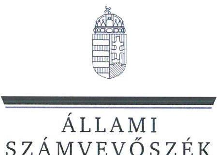
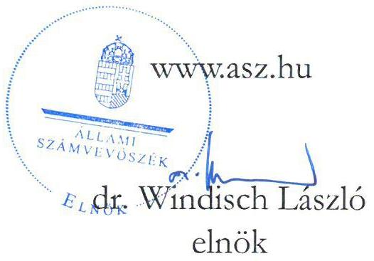
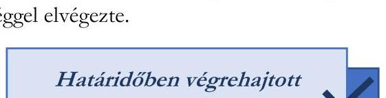
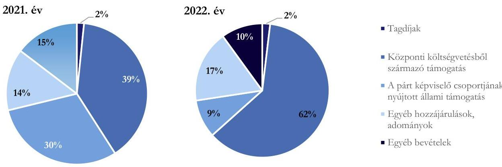
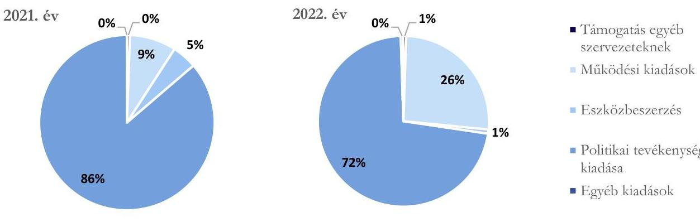

# JELENTÉS 

A költségvetési támogatásban részesülő pártok 2021-2022. évi gazdálkodása törvényességének ellenőrzése

Magyar Szocialista Párt
2024.

---

ÁLLAMI
SZÁMVEVŐSZÉK

# JELENTÉS 

## A költségvetési támogatásban részesülő pártok 2021-2022. évi gazdálkodása törvényességének ellenőrzése

Magyar Szocialista Párt
2024.

24079

---

# ELLENŐRZÉSI IGAZGATÓSÁG: 

ÁLLAMHÁZTARTÁSON KÍVÜLI SZERVEZETEKET ELLENŐRZŐ IGAZGATÓSÁG

## ELLENŐRZÉSI IGAZGATÓ:

## KLINGA LÁSZLÓ igazgató

## ELLENŐRZÉSVEZETŐ:

Jelentéseink az interneten a www.asz.hu címen olvashatók.

SOLYMÁR ÁGNES ellenőrzésvezető

IKTATÓSZÁM: EL-4087-004/2024.
TÉMASZÁM: 2679.
ELLENŐRZÉS-AZONOSÍTÓ SZÁM: V1023

---

# TARTALOMJEGYZÉK 

AZ ELLENŐRZÉS ALAPADATAI ..... 5
AZ ELLENŐRZÖTT SZERVEZET ..... 8
ÖSSZEFOGLALÁS ..... 9
AZ ELLENŐRZÉS FÓKUSZKÉRDÉSEI ..... 10
MEGÁLLAPÍTÁSOK ..... 11
JAVASLATOK ..... 17
MELLÉKLETEK ..... 18
I. sz. melléklet: Értelmező szótár ..... 18
II. sz. melléklet: Ellenőrzési kritériumok ..... 20
FÜGGELÉK: ÉSZREVÉTELEK ..... 21
RÖVIDÍTÉSEK JEGYZÉKE ..... 23

---

.

---

# AZ ELLENŐRZÉS ALAPADATAI 

## AZ ELLENŐRZÉS CÉLJA

Az ellenőrzés célja annak értékelése volt, hogy a közzétett éves pénzügyi kimutatások a törvényi előírásoknak megfeleltek-e, a könyvvezetés és gazdálkodás során betartották-e a vonatkozó jogszabályi és belső előírásokat, a párt a működéséhez szabályszerűen igénybe vehető forrásokat használt-e fel, a pártok működéséről és gazdálkodásáról szóló Párttv ${ }^{1}$-ben engedélyezett gazdasági-vállalkozási tevékenységet folytatott-e. Az ellenőrzés célja továbbá annak értékelése volt, hogy az előző számvevőszéki jelentésben foglalt megállapításokkal összhangban készített intézkedési tervben meghatározott feladatokat a párt végrehajtotta-e.

## AZ ELLENŐRZÉS TÍPUSA

Szabályszerűségi ellenőrzés.

## AZ ELLENŐRZÖTT IDŐSZAK

A 2021-2022. évek.
Az utóellenőrzés tekintetében az utóellenőrzés alapját képező ÁSZ² jelentés közzétételének napjától (2021. december 23.) az ellenőrzésről szóló adatszolgáltatásra felhívó levél keltének napjáig terjedő időszak.

## AZ ELLENŐRZÉS TÁRGYA

A párt ellenőrzése során az ellenőrzés tárgyát képezte a 2021. és a 2022. évre vonatkozó pénzügyi kimutatás elkészítésére, jóváhagyására, közzétételére, a párt könyvvezetésére, gazdálkodására, ennek keretében a számviteli szabályozás kialakítására, a bizonylati rend, bizonylati fegyelem betartására, egyéb gazdálkodási, ellenőrzési és pénzügyi-számviteli feladatok ellátására irányuló tevékenységek. Az ellenőrzés tárgya volt továbbá a Párttv. szerinti források elszámolása és felhasználása, valamint a vagyon jogszabályi előírásoknak megfelelő használata, hasznosítása.

Az ellenőrzés kiterjedt minden olyan körülményre és adatra, amely az ÁSZ jogszabályban meghatározott feladatainak teljesítéséhez, valamint a program végrehajtása folyamán felmerült újabb összefüggések feltárásához szükséges.

Jelen ellenőrzés a 2022. évi országgyűlési képviselő-választási kampányra fordított pénzeszközök elszámolásának ellenőrzésére nem terjedt ki, azt az ÁSZ „A 2022. évi országgyűlési képviselő-választási kampányra fordított pénzeszközök elszámolásának ellenőrzése" című önálló ellenőrzése (továbbiakban: kampányellenőrzés ${ }^{3}$ ) keretében ellenőrizte.

---

# AZ ELLENŐRZÉS JOGALAPJA 

Az ellenőrzés jogalapját az ÁSZ tv. ${ }^{4}$ 5. § 11. bekezdés a) pontja, a Párttv. 4. § 4. (4)-(5) bekezdései, valamint 10. § 1. (3)-(4) bekezdései képezik.

## AZ ELLENŐRZÉS MÓDSZERE

Az ellenőrzést az ellenőrzési program szempontjai, az ellenőrzött időszakban hatályos jogszabályok, az ellenőrzés általános szakmai szabályai, az ellenőrzésre irányadó ÁSZ módszertanok figyelembevételével végezte az ÁSZ.

Az ellenőrzési kérdések megválaszolásához szükséges bizonyítékok megszerzése az ellenőrzött szervezet által rendelkezésre bocsátott dokumentumokra, adatokra alapozva kérdésfeltevés (információkérés), interjú, mintavételezés útján történt.

Az ellenőrzési bizonyítékként felhasználható adatforrások közé tartoztak egyrészt az ellenőrzési programban felsorolt adatforrások, másrészt adatforrás lehetett még - minden az ellenőrzés folyamán - feltárt, az ellenőrzés szempontjából információt tartalmazó dokumentum.

Az ellenőrzés lefolytatásához az ellenőrzött szervezet tanúsítványok kitöltésével, hitelesítésével és a teljességi és hitelességi nyilatkozattal alátámasztott dokumentumok rendelkezésre bocsátásával szolgáltatott adatokat.

Az ÁSZ a tételes ellenőrzés mellett statisztikai alapú, véletlenszerű és kockázatalapú mintavételezést és értékelést alkalmazott. A statisztikai alapú mintavételnél a minták kiválasztása rétegzett mintavételezéssel történt, amelynek értékelése „szabályszerű”, ha a minta ellenőrzésének eredménye alapján 95%-os bizonyossággal a teljes sokaságban az átlagos hibaarány nem haladja meg a 10%-ot, „nem szabályszerű”, ha nagyobb, mint 10%. Abban az esetben, ha a teljes sokaság tekintetében a 10%-os hibaarányhoz való viszony megítélésének megbízhatósága nem érte el a 95%-ot, annak elérése érdekében az értékelés további szempontokkal egészült ki, a feltárt hibák értéke is figyelembevételre került. A statisztikai alapú mintavétel kiegészült évente az öt legnagyobb forgalmi értékkel rendelkező szállító tételes ellenőrzésével a lényegesség biztosítása érdekében. Tételes ellenőrzésre kerültek a bevételek közül a központi költségvetésből származó támogatások, valamint a párt országgyűlési képviselőcsoportjának nyújtott állami támogatások. A kiadások közül tételes ellenőrzésre kerültek a párt országgyűlési képviselőcsoportja számára nyújtott támogatás, az egyéb szervezetek részére nyújtott támogatások, a vállalkozások alapítására fordított összegek, valamint a reklámhordozón elhelyezett hirdetési költségek. A bérköltségekből és eszközbeszerzésekből egyszerű véletlenszerű leválogatással került kiválasztásra tíz-tíz mintatétel.

A 2022. évi országgyűlési képviselő választási kampányra fordított pénzeszközök elszámolását önálló ellenőrzése keretében ellenőrizte az ÁSZ, ezért az országgyűlési képviselő választás kampányidőszakára vonatkozó bevételi és kiadási tételek nem képezték jelen ellenőrzés alapsokaságát.

Az utóellenőrzés megállapításai az ÁSZ rendelkezésére álló dokumentumok, valamint az ellenőrzött szervezet által rendelkezésre bocsátott dokumentumok, adatok alapján kerültek megfogalmazásra. A korábbi ÁSZ jelentések alapján a párt által készített intézkedési tervben előírt feladatok végrehajtása az alábbiak szerint kerültek értékelésre:

- „határidőben végrehajtott”-nak minősült a feladat, ha a teljesítés dokumentáltan, az intézkedési tervben előírt határidőben és tartalommal megtörtént;

---

- „határidőn túl végrehajtott”-nak minősült a feladat, ha annak teljesítése az intézkedési tervben meghatározott módon, de az abban előírt határidőn túl történt meg;
- „nem végrehajtott”-nak minősült a feladat, ha a végrehajtás nem történt meg, vagy amennyiben a teljesítést/végrehajtást nem dokumentálták, dokumentumokkal nem tudják igazolni annak teljesítését;
- „okafogyottá vált”-nak minősült a feladat, ha végrehajtására - meghatározott esemény bekövetkezése, továbbá külső körülmény, a működést érintő feltétel változása miatt - már nincs szükség, illetve lehetőség, és egyértelműen megállapítható, hogy az intézkedést szükségessé tevő körülmény a jövőben nem fordulhat elő;
- „nem időszerű”-nek minősült az a feladat, amelynek ellenőrzési időszakon belüli végrehajtására azért nem került (kerülhetett) sor, mert az intézkedés alapjául szolgáló esemény nem következett be, de annak jövőbeni előfordulása lehetséges, a végrehajtása nem volt esedékes, vagy a végrehajtás határideje még nem járt le.

---

# AZ ELLENŐRZÖTT SZERVEZET

## MAGYAR SZOCIALISTA PÁRT

A Magyar Szocialista Párt - (rövidített elnevezése: MSZP ${ }^{5}$ ) 1989. november 21. napján létrejött olyan egyesület, amely nyilvántartott tagsággal rendelkezik, a nyilvántartásba vételét végző bíróság előtt kinyilvánította, hogy a Párttv. rendelkezéseit magára nézve kötelezőnek ismeri el a Párttv. 1. §-a alapján.

A Párt ${ }^{6}$ Alapszabálya ${ }^{7}$ szerint szociáldemokrata párt, politikája irányát a szabadság, az egyenlőség, az igazságosság és a szolidaritás értékei határozzák meg. Célja a demokrácia és a szociális biztonság egyidejű megvalósítása Magyarországon.

A Kongresszus ${ }^{8}$ a Párt legfelső szintű képviseleti és döntéshozó szerve. Törvényes képviseletét az Alapszabályban rögzített feladatkörében a két társelnök - a párt elsőszámú vezető tisztségviselői - külön-külön önállóan látja el. Szervezeti szintjei: helyi szervezetek, helyi együttműködési társulások, választási időszakban az egyéni választókerületi társulás, a területi szövetségek és az országos szervek.

A Párt gazdasági társaságot nem alapított, gazdasági vállalkozási tevékenységet az ellenőrzött időszakban nem folytatott. A Párttv. előírásaival összhangban 2003. évben létrehozta a Táncsics Mihály Alapítványt.

A Párt a 2021. évi pénzügyi kimutatása szerint 776760 ezer Ft bevételt - melyből 305500 ezer Ft központi költségvetési támogatás - és 502319 ezer Ft kiadást, a 2022. évi pénzügyi kimutatása szerint 650603 ezer Ft bevételt - melyből 399990 ezer Ft központi költségvetési támogatás - és 870834 ezer Ft kiadást számolt el. A 2021. és 2022. évi pénzügyi kimutatások főbb adatait az 1. táblázat tartalmazza:

|  A PÁRT 2021-2022. ÉVI PÉNZÜGYI KIMUTATÁSÁNAK ADATAI (ADATOK EZER FT-BAN) |  |   |
| --- | --- | --- |
|  BEVÉTELEK | 2021. FV | 2022. FV  |
|  Tagdíjak | 12621 | 12294  |
|  Központi költségvetésből származó támogatás | 305500 | 399990  |
|  A párt országgyűlési képviselőcsoportjának nyújtott állami támogatás | 235000 | 60000  |
|  Egyéb hozzájárulások, adományok | 109955 | 113384  |
|  - ebből az 500000 forint feletti befizetések nevesítve | 58354 | 62111  |
|  A párt által alapított kft. nyereségéből származó bevétel | 0 | 0  |
|  Egyéb bevételek | 113684 | 64935  |
|  Összes bevétel a gazdasági évben | 776760 | 650603  |
|  KIADÁSOK | 2021. FV | 2022. FV  |
|  Támogatás a párt országgyűlési képviselőcsoportja számára | 0 | 0  |
|  Támogatás egyéb szervezeteknek | 2799 | 4734  |
|  Vállalkozás alapítására fordított összegek | 0 | 0  |
|  Működési kiadások | 43072 | 226413  |
|  Eszközbeszerzés | 22991 | 6805  |
|  Politikai tevékenység kiadása | 433457 | 628511  |
|  Egyéb kiadások | 0 | 4371  |
|  Összes kiadás a gazdasági évben | 502319 | 870834  |

---

# ÖSSZEFOGLALÁS 

A párt olyan egyesület, amely nyilvántartott tagsággal rendelkezik, és amely a nyilvántartásba vételét végző bíróság előtt kinyilvánítja, hogy a Párttv. rendelkezéseit magára nézve kötelezőnek ismeri el a Párttv. 1. §-a alapján.

Az ÁSZ tv. 5. § (11) bekezdés a) pontja alapján az ÁSZ - a Párttv. rendelkezéseinek megfelelően törvényességi szempontok szerint ellenőrzi a pártok gazdálkodását. A Párttv. 10. § (3) bekezdése alapján az ÁSZ kétévente ellenőrzi azoknak a pártoknak a gazdálkodását, amelyek a központi költségvetésből rendszeres támogatásban részesültek.

Az ÁSZ a kampányellenőrzés keretében ellenőrizte a 2022. évi országgyűlési képviselő választásra fordított állami és a Párttv.-ben meghatározott más pénzeszközök felhasználását. Jelen ellenőrzés az országgyűlési képviselő választásra kapott pénzeszközökre és azok felhasználására nem terjedt ki. Emiatt jelen ellenőrzésnek a pénzügyi kimutatásra, az azt alátámasztó könyvvezetésre, a bevételek, kiadások elszámolására vonatkozó megállapításai a párt gazdálkodásának a kampányellenőrzéssel nem érintett részére vonatkoznak.

## Szabályszerűen kialakított szabályozási környezet

A Párt a jogszabályi előírásoknak megfelelően kialakította a gazdálkodás kereteit meghatározó - a pénzügyi kimutatások összeállítására és az azt alátámasztó könyvvezetésre is kiterjedő - belső szabályzatait az ellenőrzött időszakban. A Pénzkezelési szabályzat ${ }^{9}$ kivételével a szabályzatok kialakítása a jogszabályi előírásoknak megfelelően történt. A Párt belső szabályzatai tartalmazták a Számv. tv. előírásaival összhangban a gazdálkodás feltételeit és a gazdasági folyamatok ellenőrzésének kereteit.

## Szabályszerű pénzügyi kimutatás, megfelelően elszámolt bevételek és kiadások

A Párt a 2021-2022. évekre vonatkozó pénzügyi kimutatását az előírt tagolásban, határidőben elkészítette, a Magyar Közlöny mellékletét képező Hivatalos Értesítőben, valamint saját honlapján közzétette. A kialakított könyvvezetési rendszere és nyilvántartásai alátámasztották a pénzügyi kimutatások adatait. Az ellenőrzött időszakban kizárólag a Párttv. által meghatározott forrásokkal rendelkezett. A bevételek és kiadások elszámolása során a Párt betartotta a Számv. tv. és a belső szabályzatok előírásait. Az éves szinten ötszázezer forint feletti hozzájárulások a Párttv. előírásai szerint, teljeskörűen nevesítésre kerültek. A Pártnál tiltott támogatás gyanúja a kampányellenőrzés során feltárt tiltott támogatáson túl az ellenőrzött területeken, illetve az ellenőrzött mintatételek esetében nem merült fel. A Párt gazdálkodása során megfelelően kialakította
 a vagyongazdálkodás kereteit, a vagyon nyilvántartása, használata, hasznosítása és elidegenítése szabályszerű volt.

A gazdálkodási tevékenység ellenőrzése megfelelően működött.

A Párt létrehozta felügyelőbizottságát, megalkotta a gazdálkodásának és törvényes működésének ellenőrzésére vonatkozó szabályokat. A belső előírások szerinti ellenőrzéseket a felügyelőbizottság a meghatározott rendszerességgel elvégezte.

A Párt a korábbi ÁSZ ellenőrzés megállapításai alapján készített intézkedési tervében meghatározott feladatok közül három határidőben végrehajtásra került, egy intézkedés végrehajtása nem

volt időszerű.

---

# AZ ELLENŐRZÉS FÓKUSZKÉRDÉSEI 

1.- A párt a jogszabályi előírásoknak megfelelően kialakította-e a pénzügyi kimutatás összeállítására és az azt alátámasztó könyvvezetésre vonatkozó belső szabályozást?
2.- A párt pénzügyi kimutatása, az azt alátámasztó könyvvezetése, a bevételek, kiadások elszámolása, valamint a vagyon nyilvántartása és használata, hasznosítása megfelelt-e a jogszabályi és belső előírásoknak?
3.- A párt gazdálkodásának ellenőrzése az előírásoknak megfelelően működött-e?
4.- A korábbi ÁSZ ellenőrzés megállapításai alapján készített intézkedési tervben foglaltak végrehajtásra kerültek-e?

---

# MEGÁLLAPÍTÁSOK 

## 1. A párt a jogszabályi előírásoknak megfelelően kialakította-e a pénzügyi kimutatás összeállítására és az azt alátámasztó könyvvezetésre vonatkozó belső szabályozást?

Összegző megállapítás A Párt a 2021-2022. években a pénzügyi kimutatás összeállítására és az azt alátámasztó könyvvezetésre vonatkozóan a jogszabályi előírásoknak megfelelően alakította ki belső szabályozását.

A Párt az ellenőrzött időszakban rendelkezett a Számv. tv. előírásainak megfelelően Számviteli politikával ${ }^{10}$, melynek keretében elkészítette a Leltározási szabályzatot ${ }^{11}$, az Értékelési szabályzatot ${ }^{12}$, a Pénzkezelési szabályzatot, valamint kialakította Számlarendjét ${ }_{1,2}{ }^{13}$ és Bizonylati rendjét ${ }^{14}$. A számviteli szabályzatok elkészíttetéséről és hatályba léptetéséről a Számv. tv., a Civil tv. ${ }^{15}$ és az Alapszabály előírásai szerint a Párt képviseletére jogosult társelnökök gondoskodtak. A Párt gazdálkodásával kapcsolatos szabályzatok kialakítása a Pénzkezelési szabályzat kivételével a Számv. tv. előírásainak megfelelően történt.
A Párt a Számv. tv. 14. § (8) bekezdésében foglaltak ellenére Pénzkezelési szabályzatában a területi szövetségekre vonatkozóan a napi készpénzállomány maximális mértékéről nem rendelkezett.
A Párt Alapszabályában a Ptk.-ban ${ }^{16}$ foglaltaknak megfelelően meghatározásra került a tagdíjak tartalma, a tagdíj összege, valamint a tagdíjbefizetés szabályai. Az Alapszabály tartalmazta a tagdíjjal és a köztisztségből fakadó párttámogatással kapcsolatos adatok nyilvántartásának szabályozását. A Párt rendelkezett arról, hogy a helyi szervezetek saját hatáskörben kezelik a részükre juttatandó állami támogatási hányadot, a tagdíjat és támogatási bevételeket, a kapott hozzájárulást és adományt, valamint az egyéb bevételeket.
A Párt kialakította a Gazdálkodási szabályzatát ${ }^{17}$, melyben a Számv. tv. előírásaival összhangban rögzítette a gazdálkodás feltételeit és a gazdasági folyamatok ellenőrzésének kereteit.

---

# 2. A párt pénzügyi kimutatása, az azt alátámasztó könyvvezetése, a bevételek, kiadások elszámolása, valamint a vagyon nyilvántartása és használata, hasznosítása megfelelt-e a jogszabályi és belső előírásoknak? 

Összegző megállapítás

2.1. számú megállapítás

A Párt pénzügyi kimutatásai, az azt alátámasztó könyvvezetése, a bevételek, kiadások elszámolása, valamint a vagyon használata, hasznosítása megfelelt a jogszabályi előírásoknak és belső szabályzatokban foglaltaknak.

A párt határidőben elkészítette a Párttv.-ben előírt pénzügyi kimutatásait, a könyvvezetése megfelelt a Számv. tv. előírásainak.

A Párt 2021. és 2022. évben a Párttv.-ben előírt tagolásban, határidőben elkészítette a pénzügyi kimutatását. A választott könyvvezetés kialakított rendje összhangban volt a Számv. tv. szerinti előírásokkal, annak eleget téve gondoskodott nyilvántartási (könyvvezetési) rendszerének oly módon való tovább részletezéséről, hogy abból a Párttv.-ben meghatározott pénzügyi kimutatás adatai rendelkezésre álljanak. Az ellenőrzött időszakban a Számv. tv. előírásainak megfelelően biztosított volt az egyezőség a bizonylatok adatai, a főkönyvi könyvelés és az analitikus nyilvántartás adatai között.
A pénzügyi kimutatást a Párt belső szabályzatában előírt, hatáskörrel rendelkező testület, a Választmány ${ }^{18}$ mind a két ellenőrzött évben a Felügyelőbizottság jóváhagyását követően elfogadta, a közzétételük a Magyar Közlöny mellékletét képező Hivatalos Értesítőben, valamint a Párt saját honlapján a Párttv. szerint előírt határidőben történt.
2.2. számú megállapítás

A párt pénzügyi kimutatásában a bevételek szerepeltetése és azok könyvviteli elszámolása szabályszerű volt.

A Párt bevételei a Párttv.-ben meghatározott forrásokból - tagdíjfizetés, központi költségvetési támogatás, a párt országgyűlési képviselőcsoportjának nyújtott állami támogatás, adományok és egyéb bevételek származtak az ellenőrzött időszakban. A Párt bevételeinek megoszlását az 1. ábra mutatja.
1. ábra

A MAGYAR SZOCIALISTA PÁRT BEVÉTELEINEK ALAKULÁSA A 2021-2022. ÉVEKBEN

Forrás: a Párt 2021 és 2022. évi pénzügyi kimutatásának adatai alapján, ÁSZ saját szerkesztés

---

A pénzügyi kimutatásokban az egyes bevételi sorokon kimutatott összegek megegyeztek a könyvviteli nyilvántartásban szereplő összegekkel és az alátámasztó nyilvántartásokkal, azokon kizárólag az előírt jogcímű összegek szerepeltek az ellenőrzött időszakban. A bevételek elszámolása során a Párt betartotta a Számv. tv. és a belső szabályzatok előírásait.
A Párt a tagdíj bevételeket a Számv. tv. előírásainak megfelelően számolta el, a könyvviteli nyilvántartással megegyezően mutatta be a pénzügyi kimutatásban.
A Párt a központi költségvetésből származó támogatások és a párt országgyűlési képviselőcsoportjának nyújtott állami támogatások sorokon szereplő összegeket a könyvviteli nyilvántartásában elkülönítetten mutatta ki a Párttv. 1. számú mellékletében rögzítetteknek és a belső szabályzatok előírásainak megfelelően, azok megegyeztek a főkönyvi könyvelés adataival, valamint az ellenőrzött évekre vonatkozó költségvetési törvényekben ${ }^{19}$ támogatásként meghatározott összeggel.
Az ellenőrzött időszakban az egyéb hozzájárulások, adományok és egyéb bevételek elszámolása a Számv. tv. és a Számviteli politika előírásainak megfelelően történt, a Párt a Párttv.-ben meghatározott 500000 forint feletti hozzájárulásokat az előírásoknak megfelelően, teljes körűen nevesítette.
A Párt a 2021. évben nem kapott nem pénzbeli vagyoni hozzájárulást, a 2022. évben a Párttv. szerinti nem pénzbeli vagyoni hozzájárulások 50 ezer Ft értékben áramdíj és 1168 ezer Ft értékben hirdetési díj átvállalásokból származtak, belföldi magánszemélyektől.
A Párt az ellenőrzött időszakban kizárólag a Párttv. által meghatározott forrásokkal rendelkezett, tiltott támogatás gyanúja a kampányellenőrzés során feltárt tiltott támogatáson túl az ellenőrzött területeken, illetve az ellenőrzött mintatételek esetében nem merült fel. A bevételek elszámolásával kapcsolatos belső szabályozások és jogszabályi előírások a gyakorlatban érvényesültek.
2.3. számú megállapítás

A Párt pénzügyi kimutatásában a kiadások szerepeltetése és azok könyvviteli elszámolása megfelelt a jogszabályi és belső előírásoknak.

A Párt 2021. és 2022. évi pénzügyi kimutatásaiban a Párttv. előírásával összhangban kiadásként szerepeltette az egyéb szervezeteknek nyújtott támogatást, a működési kiadásokat, az eszközbeszerzést, a politikai tevékenység kiadásait és az egyéb kiadások összesített értékeit. A Párt az ellenőrzött időszakban vállalkozást nem alapított, országgyűlési képviselőcsoportja részére támogatást nem folyósított, így ezek a tételek a Párttv. előírásainak megfelelően a pénzügyi kimutatásokban érték nélkül szerepeltek. A Párt összes kiadása a 2021. évben 502319 ezer Ft, a 2022. évben 870834 ezer Ft volt, melynek megoszlását a 2. ábra mutatja.
2. ábra

A MAGYAR SZOCIALISTA PÁRT KIADÁSAINAK ALAKULÁSA A 2021-2022. ÉVEKBEN

---

A pénzügyi kimutatás egyes sorain 2021. évben az előírt jogcímű összegek szerepeltek, 2022. évben az egyéb kiadások soron kimutatott összeg nem a belső szabályozásnak megfelelően szerepelt. A pénzügyi kimutatásban szereplő összegek megegyeztek a könyvviteli nyilvántartásban szereplő összegekkel és az alátámasztó nyilvántartásokkal az ellenőrzött időszakban.
A pénzügyi kimutatás egyéb kiadások során kimutatott összegek tekintetében az ellenőrzött évek vonatkozásában eltérés volt. A Párt a pénzügyi műveletek ráfordításait a 2021. évi pénzügyi kimutatásában a Számviteli politikának megfelelően a működési kiadások között, 2022. évben a Számviteli politika 2/B melléklet előírása ellenére az egyéb kiadások soron mutatta ki. A Számviteli politikában rögzített elvektől eltérően egyéb kiadásként bemutatott összeg a 2022. év összes kiadásának 0,5%-át teszi ki (4 371 ezer Ft), mely nem éri el a Számviteli Politikában meghatározott lényegességi és jelentős összegű hibák értékét. A támogatás egyéb szervezeteknek, a működési kiadások, a politikai tevékenység kiadása és az egyéb kiadások pénzügyi kimutatás sorok vonatkozásában a kiadások kifizetése, bizonylatolása és elszámolása megfelelő volt, a támogatásokra fordított összegek felhasználása során érvényesültek a Számv. tv. előírásai, valamint a Számviteli politikában és Bizonylati rendben foglalt szabályozások.
Az ellenőrzött tételek alapján a foglalkoztatással összefüggő és a személyi jellegű kifizetések, illetve az ehhez kapcsolódó bejelentési, adó- és járulék nyilvántartási, levonási, bevallási, befizetési, adatszolgáltatási kötelezettségek teljesítése megfelelt a jogszabályi és a belső szabályzatok előírásainak.
A Párt médiahirdetésfelület-értékesítőkkel kötött reklámhordozón elhelyezett szerződések költségeinek elszámolása során a Párt betartotta a Számv. tv. előírásait. Az elszámolt költségszámlákon szereplő árak összhangban vannak a szerződések, megrendelők adataival.
2.4. számú megállapítás

A párt gazdálkodása során a vagyon használata, hasznosítása és elidegenítése 2021. és 2022. években szabályszerűen történt.

A Párt összhangban a Párttv. és Számv. tv. előírásaival az ellenőrzött időszakban hatályos belső szabályzataiban rögzítette a vagyonnal való gazdálkodás, ezen belül a kapcsolódó feladat- és hatáskörök, felelősségi viszonyok szabályozását. A Pártnak az ellenőrzött időszakban a Párttv. szerinti vagyonmérleg készítési kötelezettsége nem volt, MFB${ }^{20}$ által nyújtott hitellel nem rendelkezett a 2021. és 2022. években. Nem pénzbeli vagyoni hozzájárulásként tárgyi eszközt nem kapott, a vagyon használata során betartotta a Párttv. vonatkozó előírásait.
Mindkét ellenőrzött évben történt könyvviteli nyilvántartással alátámasztott ingatlan értékesítés és bérbeadás. A vagyon hasznosítása és elidegenítése megfelelt a Számv. tv. szerinti, valamint a Számviteli politikában, a Leltározási szabályzatban és az Értékelési szabályzatban foglalt előírásoknak. A bérelt ingatlanokhoz kapcsolódó bérleti díjak és kifizetésük megfelelő könyvviteli nyilvántartással alátámasztottak voltak. A készletek nyilvántartása megfelelt a belső szabályokban foglaltaknak, az értékesítéséből származó bevételeket a megfelelő jogcímen számolta el a Párt.
A Párt pénzügyi kimutatásaiban szereplő eszközbeszerzés kiadási sorok tartalma a Párttv. és a Számv. tv. szerint, valamint a Számviteli politikában és Számlarendben előírtaknak megfelelő könyvviteli nyilvántartással alátámasztott volt, a főkönyvi kivonatok adataival megegyezett. Az eszközbeszerzések elszámolása, a bekerülési érték meghatározása és a nyilvántartásba vétel az ellenőrzött mintatételek tekintetében a 2021. és 2022. évben összhangban volt a Számv. tv. és a belső szabályok előírásaival. Az ellenőrzött időszakban a Párt megfelelően gondoskodott az értékcsökkenés elszámolásáról.

---

A Párt a leltározást a belső szabályzatában foglaltaknak megfelelően végrehajtotta, a könyvek üzleti év végi zárásához olyan leltárt állított össze, amely tételesen, ellenőrizhető módon tartalmazza a főkönyvi kivonatban szereplő eszközeit és forrásait a belső szabályzatokban foglaltaknak megfelelően.

# 3. A párt gazdálkodásának ellenőrzése az előírásoknak megfelelően működött-e? 

## Összegző megállapítás A Párt gazdálkodásának ellenőrzése az Alapszabályban meghatározott előírásoknak megfelelően működött.

A Párt létrehozta felügyelőbizottságát a Ptk. előírásaival összhangban.
A Párt gazdálkodásának és törvényes működésének ellenőrzésére vonatkozó szabályokat az Alapszabály mellékletét képező Gazdálkodási szabályzatban határozták meg. A Pártnál ellenőrzést végezhet a felügyelőbizottság, a területi szövetségek legalább három fős pénzügyi ellenőrző bizottsága, helyi szervezeteknél az ezzel megbízott személy, valamint a könyvelési, adó tanácsadási és munkaügyi feladatok ellátásával megbízott szervezet. A területi szövetségek és helyi szervezetek az ellenőrző bizottság és megbízott ellenőr személyét saját szervezeti és működési szabályzatában meghatározott módon jelöli ki.
A felügyelőbizottság feladatai közé tartozott a Párt döntéshozó szervei által hozott döntések betartása és végrehajtása szabályszerűségének ellenőrzése, a Párt központi költségvetése koncepciójának, tervezetének és a költségvetés teljesítéséről szóló beszámolónak a véleményezése. Egyetértési jogot gyakorol a párt gazdálkodási rendjére vonatkozó
 szabályzat elfogadása során.
A felügyelőbizottság a párt gazdálkodásával kapcsolatos ellenőrzési feladatait dokumentáltan elvégezte, a Gazdálkodási szabályzatban megjelölt rendszerességgel. Az ellenőrzött időszakban az ÁSZ-on kívül a Pártnál külső szerv ellenőrzést nem végzett.
A pénztárellenőrzést összhangban a Számv. tv. előírásaival a Pénzkezelési szabályzatban meghatározottak szerint végezték el.

## 4. A korábbi ÁSZ ellenőrzés megállapításai alapján készített intézkedési tervben foglaltak végrehajtásra kerültek-e?

## Összegző megállapítás A Párt intézkedési tervében ${ }^{21}$ előírt feladatokat határidőben végrehajtotta.

Az ÁSZ korábbi ellenőrzése alapján a Párt intézkedési tervében négy feladatot határozott meg, melyből három feladatot határidőben teljesített, egy nem volt időszerű. Ennek megfelelően intézkedett:

- a pénzügyi kimutatások Párttv.-ben előírt szerkezetnek megfelelő, a Számviteli politikában előírtak szerinti, könyvvezetéssel alátámasztott elkészítéséről,
- az egyéb hozzájárulások, adományok, valamint az egyéb bevételek tekintetében a pénzeszközöket érintő gazdasági műveletek bizonylatainak főkönyvi nyilvántartásba, a Számv. tv. szerinti és belső szabályzatoknak megfelelő határidőben történő rögzítéséről,

---

- a jogszabályi előírásoknak megfelelően az egyéb hozzájárulások, adományok, valamint az egyéb bevételek könyvviteli elszámolását közvetlenül alátámasztó bizonylatokon az utalványozásra jogosult személy aláírása beazonosítható módon történő feltüntetéséről.
Egy intézkedés esetében az Alapszabály módosítása tekintetében az intézkedésre megjelölt határidő az ellenőrzési időszakban nem járt le, végrehajtása nem volt időszerű.

---

# JAVASLATOK 

Az ÁSZ tv. 33. § (1) bekezdésében foglaltak értelmében az ellenőrzött szervezet vezetője köteles a jelentésben foglalt megállapításokhoz kapcsolódó intézkedési tervet összeállítani és azt a jelentés kézhezvételétől számított 30 napon belül az ÁSZ részére megküldeni. Amennyiben az ellenőrzött szervezet vezetője nem küldi meg határidőben az intézkedési tervet, vagy továbbra sem elfogadható intézkedési tervet küld, az Állami Számvevőszék elnöke az ÁSZ tv. 33. § (3) bekezdése a) és b) pontjaiban foglaltakat érvényesítheti.

## MAGYAR SZOCIALISTA PÁRT TÁRSELNÖKEI

1. Intézkedjenek, hogy a Pénzkezelési szabályzat a területi szövetségekre vonatkozóan megfeleljen a Számv. tv. 14. § (8) bekezdésében foglalt előírásoknak a napi készpénzállomány tekintetében.

---

# MELLÉKLETEK 

- I. SZ. MELLÉKLET: ÉRTELMEZŐ SZÓTÁR
egyesület
költségvetési támogatás
pénzügyi kimutatás
a párt gazdasági-vállalkozási tevékenysége
nem pénzbeli támogatás
ingó vagyontárgyak
intézkedési terv

Az egyesület a tagok közös, tartós, alapszabályban meghatározott céljának folyamatos megvalósítására létesített, nyilvántartott tagsággal rendelkező jogi személy. (Forrás: Ptk. 3:63. § (1) bekezdés) A Számv. tv. szempontjából egyéb szervezet. (Számv. tv. 3. § 4. a) pont)
A társadalombiztosítás pénzügyi alapjai kivételével az államháztartás központi alrendszeréből ellenérték nélkül, pénzben nyújtott támogatások. (Forrás: Áht. ${ }^{22}$ 1. § 14. pont)
A pártok a pénzügyi kimutatást kötelesek minden év május 31-ig a Magyar Közlönyben, valamint saját honlappal rendelkező pártok a honlapjukon is közzétenni.
(Párttv. 9. § (1) bekezdés, 1. számú melléklet)
A párt a költségeinek fedezése és vagyonának gyarapítása érdekében a következő gazdasági-vállalkozási tevékenységeket folytathatja:
a) politikai céljainak és tevékenységének megismertetése érdekében kiadványokat jelentethet meg és terjeszthet, a pártot szimbolizáló jelvényeket és más ilyen célú tárgyakat árusíthat, és pártrendezvényeket szervezhet;
b) a tulajdonában álló ingatlanokat és ingókat díj ellenében hasznosíthatja és elidegenítheti.
(Párttv. 6. § (1) bekezdés)
Vagyoni értékkel rendelkező forgalomképes dolog, szellemi alkotás, illetve vagyoni értékű jog részben vagy egészében, véglegesen vagy ideiglenesen, teljesen vagy részben ingyenesen történő átruházása vagy átengedése, illetve szolgáltatás biztosítása.
(Civil tv. 2. § 25. pont)
Ingó vagyontárgy: az ingatlannak nem minősülő dolog, kivéve a fizetőeszközt, az értékpapírt és a föld tulajdonosváltozása nélkül értékesített lábon álló (betakarítatlan) termést, terményt (pl. lábon álló fa). (Szja tv. ${ }^{23}$ 3. § 30. pont)
Az ellenőrzött szervezet vezetője által készített, a jelentés kézhezvételétől számított harminc napon belül az ÁSZ részére megküldött, az ÁSZ által elfogadott, intézkedéseket tartalmazó terv. (ÁSZ tv. 33. §)

---

reklám
reklámhordozó

Gazdasági reklám: olyan közlés, tájékoztatás, illetve megjelenítési mód, amely valamely birtokba vehető forgalomképes ingó dolog - ideértve a pénzt, az értékpapírt és a pénzügyi eszközt, valamint a dolog módjára hasznosítható természeti erőket - (a továbbiakban együtt: termék), szolgáltatás, ingatlan, vagyoni értékű jog (a továbbiakban mindezek együtt: áru) értékesítésének vagy más módon történő igénybevételének előmozdítására, vagy e céllal összefüggésben a vállalkozás neve, megjelölése, tevékenysége népszerűsítésére vagy áru, árujelző ismertségének növelésére irányul, ide nem értve:

- a cégtáblát, üzletfeliratot, a vállalkozás használatában álló ingatlanon elhelyezett, a vállalkozást népszerűsítő egyéb feliratot és más grafikai megjelenítést,
- az üzlethelyiség portáljában (kirakatában) elhelyezett gazdasági reklámot,
- a járművön, valamint tájékozódást segítő jelzést megjelenítő reklámcélú eszközön elhelyezett gazdasági reklámot, továbbá
- a tulajdonos által az ingatlanán elhelyezett, annak elidegenítésére vonatkozó ajánlati felhívást (hirdetést), valamint a helyi önkormányzat által lakossági apróhirdetések közzétételének megkönnyítése céljából biztosított táblán vagy egyéb felületen elhelyezett, kisméretű hirdetéseket; (Reklámtörvény 3. § d) pont, Tvty. 11/F 3. pont)
A funkcióját vagy létesítésének célját tekintve túlnyomórészt reklám közzétételét, illetve elhelyezését biztosító, elősegítő vagy támogató eszköz, berendezés, létesítmény; ide nem értve a közúti közlekedési tárgyú jogszabályokban meghatározott életmentő funkciót ellátó reklámcélú eszköz.
(Tvtv. 11/F. § 4. pont)

---

# II. SZ. MELLÉKLET: ELLENŐRZÉSI KRITÉRIUMOK 

## FOKUSZTERÜLET/FOKUSZKERDÉS

1. A Párt a jogszabályi előírásoknak megfelelően kialakította-e a pénzügyi kimutatás összeállítására és az azt alátámasztó könyvvezetésre vonatkozó belső szabályozást?
2. A Párt pénzügyi kimutatása, az azt alátámasztó könyvvezetése, a bevételek, kiadások elszámolása, valamint a vagyon nyilvántartása és használata, hasznosítása megfelelt-e a jogszabályi és belső előírásoknak?
3. A Párt gazdálkodásának ellenőrzése az előírásoknak megfelelően működött-e?
4. A korábbi ÁSZ ellenőrzés megállapításai alapján készített intézkedési tervben foglaltak végrehajtásra kerültek-e?

## ELLENŐRZÉSI KRITÉRIUMOK

Számv. tv. 3. §, 6. §, 12. §, 14. §, 15-16. §, 160-161/A. §, 164-169. §, 23-45. §, 46-53. §, 57-68. §, 69. §
Párttv. 4. §, 6. §, 9. §, 1. sz. melléklet
Civil tv. 2. §
479/2016. (XII. 28.) Korm. rendelet ${ }^{24}$ 4. § (1) bekezdés, 9. $\S, 15-16 . \S$
Ptk. 3:4. §, 3:26-3:28. §, 3:63-3:87. §
Alapszabály, a Párt belső szabályozásai
Számv. tv. 6. §, 12. §, 14. §, 159. §, 160. §, 161-161/A. §, 164-167. §
Párttv. 4. §, 6. §, 9. §, 1. sz. melléklet
Mt. ${ }^{25}$ 14. §, 45. §, 48. §
Szja tv. 3. §, 25. §, 47. §, 3. sz. melléklet
Ptk. 3:74. §, 6:272-6:280. §, 6:331-6:341. §
Civil tv. 2. §
Tvtv. ${ }^{26} 11 /$ F. §, 11/G. §
Reklámtörvény ${ }^{27}$ 3. §,
104/2017. (IV. 28.) Korm. rendelet ${ }^{28}$ 8/C. §
Art. ${ }^{29}$ 1. sz. melléklet
465/2017. (XII.28.) Korm. rendelet ${ }^{30}$
437/2015.(XII.28.) Korm. rendelet ${ }^{31}$
TAO tv. ${ }^{32}$ 4. §, 18. §
Vtv. ${ }^{33} 68 . \S$
Alapszabály, a Párt belső szabályozásai
Számv. tv. 14. §
Belső szabályzatok, felügyelőbizottság ügyrendjében foglaltak, A 2019-2020. évi ÁSZ ellenőrzésről készült ÁSZ jelentés megállapításai alapján készített intézkedési tervben foglalt előírások, ellenőrzési határozatok, jegyzőkönyvek.

A korábbi évek ÁSZ ellenőrzéséről készült ÁSZ jelentés megállapításai alapján készített intézkedési tervben foglalt előírások.

---

# FÜGGELÉK: ÉSZREVÉTELEK 

A jelentéstervezetet a Számvevőszék 15 napos észrevételezésre megküldte az ellenőrzött szervezet vezetőjének az ÁSZ tv. 29. §* (1) bekezdése előírásának megfelelően.

## A Párt társelnöke a jelentéstervezetre észrevételt tett.

A függelék tartalmazza az ellenőrzött észrevételeit, illetve az el nem fogadott észrevételek elutasításának indoklását.

## A Párt Társelnökének észrevétele:

A jelentéstervezet 2.2 számú megállapítás szerint a párt pénzügyi kimutatásában a bevételek szerepeltetése és azok könyvviteli elszámolása szabályszerű volt, így nem látjuk indokoltnak a jelentéstervezet 2.2 pont utolsó bekezdésének első mondatában a kampányellenőrzéssel összefüggésben írtak szerepeltetését. Amint azt a Jelentéstervezet 9. oldalán az Összefoglalás 3. bekezdése is tartalmazza a 2022. évi országgyűlési képviselő-választási kampányra fordított pénzeszközök elszámolásának ellenőrzése önálló ellenőrzés keretében valósult meg, így azzal összefüggésben tett megállapítás ezen Jelentéstervezetben való szerepeltetésének jogszabályi alapja nincs. Mindezen felül a Magyar Szocialista Párt a 2022. évi országgyűlési képviselő-választási kampányra fordított pénzeszközök elszámolásának ellenőrzése jelentésben foglalt tiltott támogatás elfogadását az ellenőrzés során mindvégig vitatta, valamint a rendelkezésére álló jogi eszközök igénybevétele mellett jelenleg is vitatja.
A fentiek alapján kérjük, hogy a Tisztelt Állami Számvevőszék a Jelentéstervezetből szíveskedjen az alábbiakat törölni: „A Párt az ellenőrzött időszakban kizárólag a Párttv. által meghatározott forrásokkal rendelkezett, tiltott támogatás gyanúja a kampányellenőrzés során feltárt tiltott támogatáson túl az ellenőrzött területeken, illetve az ellenőrzött mintatételek esetében nem merült fel."
Az észrevétellel érintett megállapítás (jelentéstervezet 2.2. pont utolsó bekezdése):
„A Párt az ellenőrzött időszakban kizárólag a Párttv. által meghatározott forrásokkal rendelkezett, tiltott támogatás gyanúja a kampányellenőrzés során feltárt tiltott támogatáson túl az ellenőrzött területeken, illetve az ellenőrzött mintatételek esetében nem merült fel."
Az el nem fogadott észrevétel elutasításának indoklása:
Az észrevételezésre megküldött jelentéstervezet 5. oldalán „Az ellenőrzés tárgya" szövegrészben rögzítésre került, hogy „jelen ellenőrzés a 2022. évi országgyűlési képviselő-választási kampányra fordított pénzeszközök elszámolásának ellenőrzésére nem terjedt ki", továbbá a jelentéstervezet 6. oldalán „Az ellenőrzés módszere" szövegrészben szerepeltetésre került, hogy „A 2022. évi országgyűlési képviselő választási kampányra fordított pénzeszközök elszámolását önálló ellenőrzése keretében ellenőrizte az ÁSZ, ezért az országgyűlési képviselő választás kampányidőszakára vonatkozó bevételi és kiadási tételek nem képezték jelen ellenőrzés alapsokaságát." A jelentéstervezet 9.

[^0]
[^0]:    * 29. § (1) Az Állami Számvevőszék az ellenőrzési megállapításait megküldi az ellenőrzött szervezet vezetőjének vagy az általa megbízott személynek, és annak, akinek személyes felelősségét állapította meg.
    (2) Az ellenőrzött szervezet vezetője és a felelősként megjelölt személy az ellenőrzés megállapításaira tizenöt napon belül írásban észrevételt tehet.
    (3) Az Állami Számvevőszék az észrevételre a beérkezésétől számított harminc napon belül írásban válaszol. A figyelembe nem vett észrevételeket köteles a jelentésben feltüntetni, és megindokolni, hogy azokat miért nem fogadta el.

---

oldalán az „Összefoglalás" fejezet 3. bekezdése tartalmazza, hogy az Állami Számvevőszék „A 2022. évi országgyűlési képviselő-választási kampányra fordított pénzeszközök elszámolásának ellenőrzése" című önálló ellenőrzése (a továbbiakban: kampányellenőrzés) keretében ellenőrizte a 2022. évi országgyűlési képviselő választásra fordított állami és a Párttv.-ben meghatározott más pénzeszközök felhasználását."
Emellett a 23025. számú, „Kampánypénzek ellenőrzése - A 2022. évi országgyűlési képviselő-választási kampányra fordított pénzeszközök elszámolásának ellenőrzése hat jelölő szervezetnél" című részjelentés (a továbbiakban: kampányrészjelentés) tartalmazza, hogy „Az MSZP a Párt törvényben előírt finanszírozási tilalmakat nem tartotta be, mivel a hat párt és az MMM elnöke részvételével létrejött Hatpárti összefogás közös kampánya során jogi személytől, az MMM-től tiltott, nem pénzbeli vagyoni hozzájárulásban, tiltott párttámogatásban részesült. Az MSZP politikai hirdetés vásárlása során jogi személytől tiltott támogatást fogadott el."
Mindezek alapján a jelentéstervezet 2.2 pont utolsó bekezdés első mondatában foglaltak összhangban vannak a jelentéstervezet „Az ellenőrzés tárgya" és „Az ellenőrzés módszere" részeiben leírtakkal, illetve a kampányrészjelentésben foglaltakkal, ezért a jelentéstervezet módosítása nem indokolt.

---

# RÖVIDÍTÉSEK JEGYZÉKE 

${ }^{1}$ Párttv.
${ }^{2}$ ÁSZ
${ }^{3}$ kampányellenőrzés
${ }^{4}$ ÁSZ tv.
${ }^{5}$ MSZP
${ }^{6}$ Párt
${ }^{7}$ Alapszabály
${ }^{8}$ Kongresszus
${ }^{9}$ Pénzkezelési Szabályzat
${ }^{10}$ Számviteli politika
${ }^{11}$ Leltározási szabályzat
${ }^{12}$ Értékelési Szabályzat
${ }^{13}$ Számlarend
Számlarend
Számlarend $_{2}$
${ }^{14}$ Bizonylati rend
${ }^{15}$ Civil tv.
${ }^{16}$ Ptk.
${ }^{17}$ Gazdálkodási szabályzat
${ }^{18}$ Választmány
${ }^{19}$ költségvetési törvények
Költségvetési törvény
Költségvetési törvény ${ }_{2}$
${
 }^{20}$ MFB
${ }^{21}$ Intézkedési terv
${ }^{22}$ Áht.
${ }^{23}$ Szja tv.
${ }^{24}$ 479/2016. Korm. rendelet
${ }^{25} \mathrm{Mt}$.
${ }^{26}$ Tvtv.
${ }^{27}$ Reklámtörvény
${ }^{28}$ 104/2017. (IV.28) Korm. rendelet
${ }^{29}$ Art.

A pártok működéséről és gazdálkodásáról szóló 1989. évi XXXIII. törvény
Állami Számvevőszék
„A 2022. évi országgyűlési képviselő-választási kampányra fordított pénzeszközök elszámolásának ellenőrzése” című ÁSZ ellenőrzés
Az Állami Számvevőszékről szóló 2011. évi LXVI. törvény
Magyar Szocialista Párt
Magyar Szocialista Párt
A Magyar Szocialista Párt alapszabályának egységes szerkezetbe foglalt módosítása (hatályos: 2020. június 24. napjától)
A Magyar Szocialista Párt legfelső szintű képviseleti és döntéshozó szerve
A Magyar Szocialista Párt Pénzkezelési szabályzata (hatályos: 2021. január 1. napjától)
Az Magyar Szocialista Párt Számviteli politikája (hatályos: 2021. január 1. napjától)
Az Magyar Szocialista Párt Leltározási és selejtezési szabályzata (hatályos: 2021. január 1. napjától)

A Magyar Szocialista Párt Értékelési szabályzata (hatályos: 2021. január 1. napjától)

A Magyar Szocialista Párt Számlarendje (hatályos: 2021. január 1. napjától, aktualizálva 2021. május 25. napján)
A Magyar Szocialista Párt Számlarendje (hatályos: 2021. január 1. napjától, aktualizálva 2021. szeptember 23. napján)
A Magyar Szocialista Párt Bizonylati szabályzata és bizonylati albuma (hatályos: 2021. január 1. napjától)
2011. évi CLXXV. törvény az egyesülési jogról, a közhasznú jogállásról, valamint a civil szervezetek működéséről és támogatásáról
a Polgári Törvénykönyvről szóló 2013. évi V. törvény
A Magyar Szocialista Párt alapszabályának egységes szerkezetbe foglalt módosítása (hatályos: 2020. június 24. napjától) 3. számú mellékletét képező Gazdálkodási Szabályzat
A Magyar Szocialista Párt testületi szerve
2020. évi XC. tv. Magyarország 2021. évi központi költségvetéséről
2021. évi XC. tv. Magyarország 2022. évi központi költségvetéséről
Magyar Fejlesztési Bank
Az ÁSZ A Magyar Szocialista Párt 2019-2020. évi gazdálkodása törvényességének ellenőrzéséről készült 21086 sorszámú számvevőszéki jelentéséhez kapcsolódó társelnöki utasítás intézkedési terv végrehajtására
az államháztartásról szóló 2011. évi CXCV. törvény
a személyi jövedelemadóról szóló 1995. évi CXVII. törvény
479/2016. (XII. 28.) Korm. rendelet a számviteli törvény szerinti egyes egyéb szervezetek beszámoló készítési és könyvvezetési kötelezettségének sajátosságairól a munka törvénykönyvéről szóló 2012. évi I. törvény
a településkép védelméről szóló 2016. évi LXXIV. törvény
a gazdasági reklámtevékenység alapvető feltételeiről és egyes korlátairól szóló 2008. évi XLVIII. törvény
a településkép védelméről szóló törvény reklámok közzétételével kapcsolatos rendelkezéseinek végrehajtásáról szóló 104/2017. (IV.28) Korm. rendelet
az adózás rendjéről szóló 2017. évi CL. törvény

---

${ }^{30}$ 465/2017. (XII.28.) Korm. rendelet
${ }^{31}$ 437/2015. (XII. 28.) Korm. rendelet
${ }^{32}$ TAO tv.
${ }^{33} \mathrm{Vtv}$.
az adóigazgatási eljárás részletszabályairól szóló 465/2017. (XII.28.) Korm. rendelet
a belföldi hivatalos kiküldetést teljesítő munkavállaló költségtérítéséről szóló 437/2015. (XII. 28.) Korm. rendelet
a társasági adóról és az osztalékadóról szóló 1996. évi LXXXI. törvény az állami vagyonról szóló 2007. évi CVI. törvény

---

1052 Budapest, Apáczai Csere János u. 10. | 1364 Budapest 4., Pf. 54
www.asz.hu | szamvevoszek@asz.hu
telefon: +36 14849100
