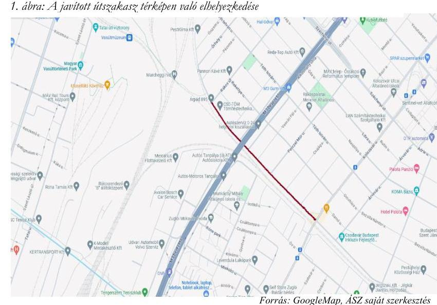
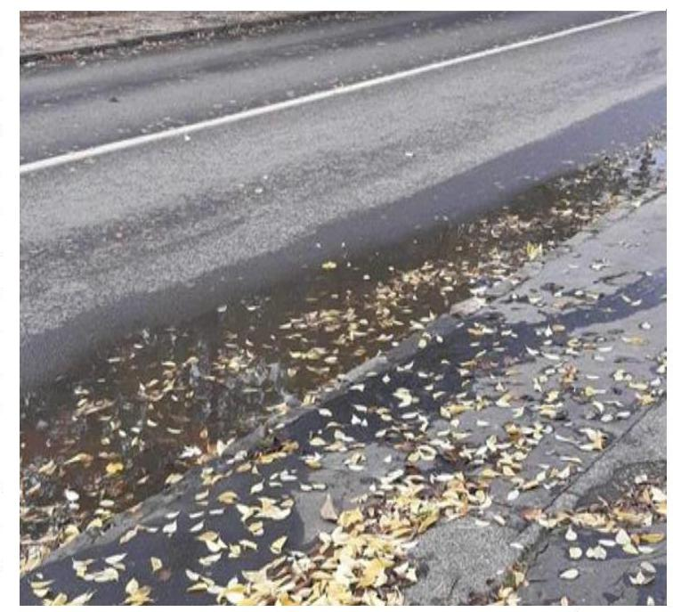

ÁLLAMI
SZÁMVEVŐSZÉK

# JELENTÉS 

Budapest XV. ker. Rákospalotai Körvasút sor Kolozsvár utca és Rákos út közötti szakaszán megvalósult útburkolat-felújítás célzott ellenőrzése
2024.

---

# JELENTÉS 

Budapest XV. ker. Rákospalotai Körvasút sor Kolozsvár utca és Rákos út közötti szakaszán megvalósult útburkolat-felújítás célzott ellenőrzése
2024.

---

# ELLENŐRZÉSI IGAZGATÓSÁG: 

## ÁLLAMHÁZTARTÁS HELYI SZINTJÉT ELLENŐRZŐ IGAZGATÓSÁG

## ELLENŐRZÉSI IGAZGATÓ:

BAFFIA GERGELY GÁBOR ellenőrzési igazgató

## ELLENŐRZÉSVEZETŐ:

Jelentéseink az interneten a www.asz.hu címen olvashatók.

KANYÓ LŐRÁNT ISTVÁN ellenőrzésvezető

IKTATÓSZÁM: EL-3889-005/2024
TÉMASZÁM: -
ELLENŐRZÉS-AZONOSÍTÓ SZÁM: V1031

---

# TARTALOMJEGYZÉK 

AZ ELLENŐRZÉS ALAPADATAI ..... 5
AZ ELLENŐRZÉS HATÓKÖRE ÉS TERÜLETE ..... 7
ÖSSZEFOGLALÁS ..... 9
AZ ELLENŐRZÉS FÓKUSZTERÜLETE ..... 11
MEGÁLLAPÍTÁSOK ..... 12
JAVASLATOK ..... 16
MELLÉKLETEK ..... 17
I. sz. melléklet: Értelmező szótár ..... 17
II. sz. melléklet: Az ellenőrzött szervezetek jegyzéke ..... 18
III. sz. melléklet: Ellenőrzési kritériumok ..... 19
FÜGGELÉK: ÉSZREVÉTELEK ..... 20
RÖVIDÍTÉSEK JEGYZÉKE ..... 24

---

.

---

# AZ ELLENŐRZÉS ALAPADATAI 

## AZ ELLENŐRZÉS CÉLJA

Az ellenőrzés célja annak vizsgálata volt, hogy megfelelően valósult-e meg a Budapest XV. kerület Rákospalotai Körvasút sor Kolozsvár utca és Rákos út közötti szakaszán a Budapest Közút Zártkörűen Működő Részvénytársaság által, útfenntartási feladatkörben végzett nagyfelületű útburkolat-felújítás (a továbbiakban: útburkolat-felújítás).

## AZ ELLENŐRZÉS TÍPUSA

Megfelelőségi ellenőrzés.

## AZ ELLENŐRZÖTT IDŐSZAK

2023. év január 1-től az ellenőrzés megállapításainak az ÁSZ tv. ${ }^{1} 29 . \int$ (1) bekezdése szerinti megküldése napjáig.

## AZ ELLENŐRZÉS TÁRGYA

Az ellenőrzés tárgyát képezte a Budapest XV. kerület Rákospalotai Körvasút sor Kolozsvár utca és Rákos út közötti szakaszán 2023. március 22-én kezdődött útburkolat-felújítás.

Az ellenőrzés kiterjedt minden olyan körülményre és adatra, amely az ÁSZ jogszabályban meghatározott feladatainak teljesítéséhez, valamint a program végrehajtása folyamán felmerült újabb összefüggések feltárásához szükséges volt.

## AZ ELLENŐRZÉS JOGALAPJA

Az ellenőrzés jogszabályi alapját az ÁSZ tv. 1. § (3) bekezdése, 5. § (4) bekezdésének a) pontja és (5) bekezdése képezték.

## AZ ELLENŐRZÉS MÓDSZERE

Az ellenőrzést az Alaptörvény 43. cikk (1) bekezdésében meghatározott törvényességi, célszerűségi szempontok, valamint a nemzetközi standardokat irányadónak tekintve az ellenőrzési program szempontjai, az ellenőrzött időszakban hatályos jogszabályok, az ellenőrzés szakmai szabályok és módszertanok figyelembevételével végezte az ÁSZ ${ }^{2}$.

---

Az ellenőrzési kérdések megválaszolásához szükséges bizonyítékok megszerzése az ellenőrzött szervezet által rendelkezésre bocsátott dokumentumokra és adatokra alapozva, továbbá megfigyelés, szemle (szemrevételezés), mérés, kérdésfeltevés (információkérés), valamint elemző eljárás útján történt.

Az ellenőrzési bizonyítékként felhasználható adatforrások közé tartoztak az ellenőrzéshez kért dokumentumok, továbbá az ellenőrzés során felvett, az ellenőrzött szervezettel egyeztetett jegyzőkönyvek, az ellenőrzés tárgyát képező útszakaszon készített fényképek, videofelvételek, valamint adatforrás volt még minden - az ellenőrzés folyamán - feltárt, az ellenőrzés szempontjából információkat tartalmazó dokumentum.

Az ellenőrzés lefolytatásához az ellenőrzött szervezet az ÁSZ által kért dokumentumok, adatok, információk megküldésével szolgáltatott adatokat.

A közúti közlekedési törvény ${ }^{3} 34 . \S$ (1) bekezdése értelmében a közút kezelője köteles gondoskodni arról, hogy a közút a biztonságos közlekedésre alkalmas legyen. A közút biztonságos közlekedésre való alkalmasságának fogalmát az irányadó jogszabályok nem határozzák meg. Az ÁSZ úgy ítélte meg, hogy egy útszakasz akkor alkalmas a biztonságos közlekedésre, ha annak állapota - rendeltetésszerű használat esetén nem okozhat olyan helyzetet, mely a közlekedők személy- és vagyonbiztonsága sérelmének a kockázatával jár. A csatornafedelek nem megfelelő szintbe helyezése, valamint a csapadékvíz nem megfelelő elvezetése a közlekedés biztonságát veszélyeztető tényezők, évente jelentős számú, anyagi kárral járó baleset okozói.

---

# AZ ELLENŐRZÉS HATÓKÖRE ÉS TERÜLETE 

Az Mötv. ${ }^{4}$ - egyebek mellett - a helyi közutak ${ }^{5}$ és tartozékai fenntartásának a feladatát a helyi önkormányzatok kötelezettségévé teszi. A Budapesten található helyi közutakat részint a kerületi önkormányzat ${ }^{6}$, részint - a 432/2012. (XII. 29.) Korm. rendelet ${ }^{7}$ kijelölése alapján - az Önkormányzat ${ }^{8}$ kezeli. Budapest XV. kerület Rákospalotai Körvasút sor Kolozsvár utca és Rákos út közé eső útszakasz kezelője az Önkormányzat.

Az Önkormányzat közútkezelői (közte útfenntartási) feladatának ellátásáról az Mötv. felhatalmazása alapján alkotott Közútkezelési Rendelet ${ }^{9}$ értelmében a Társaság ${ }^{10}$ útján gondoskodott. A feladatellátás egyéb szabályait az Önkormányzat és a Társaság közötti Keretmegállapodás és az Éves Szerződések ${ }^{11}$ tartalmazták. A Társaság útfenntartással összefüggő tevékenysége a Keretmegállapodás értelmében magában foglalja a közút karbantartása ${ }^{12}$ mellett a közút közvetlen környezetének a gondozását, valamint az utak tartozékainak és az utakhoz kapcsolódó műtárgyaknak a karbantartását is.

Az Önkormányzat az útfenntartási munkák ellátására a 2023. Éves Szerződésben 3,74 milliárd Ft-ot irányzott elő. A Társaságnál 2023-ban az útfenntartási munkák helyszíni kivitelezési részét 34 fő végezte az Önkormányzat kezelésében lévő 1108 kilométeres, Budapest útjainak 20,5\%-át kitevő útszakaszon.

A Budapest Főváros XV. kerületi Rákospalotai Körvasút sor a XIV. kerület és a XV. kerület határát követi, teljes hossza $6,2 \mathrm{~km}$. Az ellenőrzés tárgyát képező útszakasz 830 méter hosszú, kétszer egysávos, felülete 5810 négyzetméter, azon 36 víznyelő rács, 8 közműelzáró fedél, valamint 24 csatornafedél található. Az útvonalon közösségi közlekedés nincs, az utat egyik oldalról vasútvonal, a másik oldalról kertváros övezi. A Társaság által elvégzett útburkolat-felújítás folyamatát az 1. táblázat szemlélteti. A csatornafedelek szintbehelyezése az ÁSZ ellenőrzés

előkészítő szakaszában történt, azt követően, hogy a Társaság az ÁSZ ellenőrzési szándékáról 2023. május 22-én az ÁSZ ellenőrzést előkészítő megbeszélésen tudomást szerzett.

---

1. táblázat

BUDAPEST XV. KERÜLET RÁKOSPALOTAI KÖRVASÚT SOR KOLOZSVÁR UTCA ÉS RÁKOS ÚT KÖZÉ ESŐ ÚTSZAKASZ ÚTBURKOLAT-FELÚJÍTÁS IDŐHORIZONTJA

|  DATUM | ÉSEMÉNY  |
| --- | --- |
|  2023. 03. 22. | A Társaság Útfenntartási Főosztálya megrendelő lapot állított ki az „útburkolat marásos javítása" munkára a Társaság kivitelezésért felelős Közúti Szolgáltatási Igazgatósága számára, a munkát a Társaság megkezdte.  |
|  2023.03.29. | A Társaság helyszíni bejárása, jegyzőkönyv felvétele arról, hogy a munka elkészült, öt csatornafedelet szintbe hoztak, szükséges a további csatornafedelek szintbe hozása.  |
|  2023. 03. 31. | A munka elkészültét igazoló felmérési napló kiadása a Társaság részéről.  |
|  2023.05.22. | Az ÁSZ ellenőrzést előkészítő megbeszélése a Társaság képviselőivel.  |
|  2023.05.25. | Az ÁSZ ellenőrzést előkészítő helyszíni szemléje az útszakaszon.  |
|  2023. 06. 05. | A Társaság Útfenntartási Főosztálya megrendelőlapot állított ki a „Fedlapok, szereleények szintbehelyezése új anyaggal" elnevezésű munkára a Társaság kivitelezésért felelős Közúti Szolgáltatási Igazgatósága számára.  |
|  2023.06.19. | A Társaság kiállította a szerelvények szintbehelyezésének elkészültét igazoló felmérési naplót, amely szerint a csatornafedelek szintbe helyezését elvégezte az útszakaszon.  |
|  2023.10.26. | Az ÁSZ által az ellenőrzés során az útszakaszon elvégzett helyszíni szemle.  |

---

# ÖSSZEFOGLALÁS 

Az ÁSZ általános hatáskörrel végzi a közpénzekkel és az állami és önkormányzati vagyonnal való felelős gazdálkodás ellenőrzését. Az önkormányzati vagyon jelentős részét teszik ki a közutak és azok tartozékai, amelyek állapotának megfelelő szinten tartása, folyamatos karbantartása feltétele a biztonságos közlekedésnek, amely egyben társadalmi elvárás az utakat használó lakosság részéről is.

A Társaság - útfenntartási feladatkörében eljárva - Budapest XV. kerület Rákospalotai körvasút sor Rákos út és Kolozsvár utca közé eső, 830 méter hosszúságú útszakaszán a nagyfelületű (az útszakasz teljes szélességében való) aszfaltozást, a szegélykőjavítást, a különféle műtárgyak út szintjébe helyezését, a vízelvezetés biztosítását magában foglaló útburkolat-felújítást kezdett meg 2023. március 22-én. Az útburkolat-felújítás során öt csatornafedelet szintbe helyezett, de a munkát annak ellenére lezárta, hogy a műszaki átadás során észlelte, hogy maradtak olyan csatornafedelek, amelyek nem voltak az út szintjében. Jegyzőkönyvben rögzítették, hogy a későbbiekben szükséges azok szintbehozása, amelyre azonban határidőt nem határoztak meg.

Az ÁSZ az ellenőrzést előkészítő helyszíni szemle keretében megállapította, hogy az aszfaltozást követően, az út síkja alatt 1,5-2 cm-rel helyezkednek el csatornafedelek. Az újonnan kialakított aszfaltrétegbe ágyazott, ám az út szintje alatt lévő csatornafedelek elhelyezkedése miatt az útszakaszon - a gépjárművek sérülésének és balesetek bekövetkeztének kockázata miatt - az ÁSZ ellenőrzés megítélése szerint nem volt biztonságos a közlekedés, miközben e követelményt a közúti közlekedésről szóló törvény írja elő.

A Társaság az ÁSZ ellenőrzési szándékáról való tudomásszerzést követően, 2023. június 19-én a hibás csatornafedeleket javította. Az eredetileg egységes, egyetlen útburkolat-felújítási munkát tehát a Társaság két munkaként végezte el, amelyekkel összefüggésben 58,8 millió forint közvetlen költsége merült fel.

Az út állapotából közvetlenül fakadó veszélyekre a Társaság - a jogszabályi előírás ellenére - 2023. március 29. és 2023. június 19. között a közúton elhelyezett közúti jelzésekkel nem hívta fel a közlekedők figyelmét. A csatornafedelek szintbehelyezése nem a jogszabályban előírt határidőn belül történt meg. Az ÁSZ a második helyszíni szemlén azt tapasztalta, hogy az ellenőrzés tárgyát képező út egy szakaszán nagy felületen áll a csapadékvíz, ami kockázatokat jelent a közlekedőkre és a közút állapotromlását is felgyorsítja.

A jogszabályi előírások ellenére a Társaság nem alakított ki olyan, a döntéshozatalra vonatkozó belső kontrollokat, amelyek lehetővé tették volna a döntés eredményességi szempontú megalapozását és megakadályozhatták volna az útburkolat-felújítási munka lezárását annak teljeskörű elvégzése nélkül.

A Társaságnak a meglévő keretszerződései alapján lehetősége lett volna további alvállalkozót bevonni az útfenntartási feladat elvégzésébe, azonban a csatornafedelek határidőben való szintbehozása érdekében erről nem döntött. A döntések gazdaságossági, hatékonysági szempontú megalapozásának, a kapcsolódó kontrollok kialakításának hiányában a Társaság saját erőforrásaival elvégzett munka költsége - a Társaság tájékoztatása szerint - meghaladta azt a költségszintet, amely alvállalkozó bevonása esetén merült volna fel.

Az Önkormányzat és a Társaság közti szerződések az útjavítási munkák elvégzése technológiai normáinak betartását előírják, azonban nem fogalmaznak meg minőségi kritériumokat az utak állapotára, továbbá nem rögzítik az útfenntartási munka elvégzésének teljesítési határidejét, ha a határidőt jogszabály külön nem írja elő. Az utak állapotára vonatkozó minőségi követelményeket a Társaság sem határozott meg. Ennélfogva e szerződések és a belső szabályozások nem teszik mérhetővé és számonkérhetővé a Társaság által végzett útfenntartási közfeladat ellátásának minőségét. A szerződések továbbá nem kötik a közfeladat-ellátás

---

ellenértékének önkormányzati kifizetését a kezelt utak állapotához vagy az útfenntartási munka minőségi követelményeihez, valamint azt sem rögzítik, hogy az Önkormányzat nevében való közfeladat-ellátás prioritást élvez más (piaci) megrendelővel való szerződéses kötelezettség ellátásával szemben. Ezért nem ösztönzik az Önkormányzat érdekében végzett útfenntartási feladat teljesítésének mielőbbi befejezését.

Szerepet játszott a nem megfelelő eredményben - közvetetten - az is, hogy az Önkormányzat az útfenntartási munka helyszínén nem ellenőrizte a Társaság által elvégzett munkát. A Fővárosi Önkormányzat az ÁSZ tv. 29. § (2) bekezdés szerinti, a jelentéstervezet megállapításaira tett észrevételében arról tájékoztatta az ÁSZ-t, hogy intézkedéseket tett az ÁSZ ellenőrzés során felmerült hiányosságok megszüntetése érdelében, melynek keretében 2023. novemberétől két fő műszaki ellenőri jogosultsággal rendelkező mérnök munkatársat foglalkoztat, akik munkakörük részeként a Főváros és a Budapest Közút Zrt. közfeladat ellátással kapcsolatos szakmai együttműködése keretén belül helyszíni bejárást tartanak. Ezáltal az önkormányzat lépéseket tett az ÁSZ által feltárt hiányosság kiküszöbölése érdekében.

Mindezekre figyelemmel az ÁSZ azt javasolta az Önkormányzat számára, hogy a nagyfelületű aszfaltozással járó útfenntartási munkákat a helyszínen ellenőrizze, valamint vizsgálja felül a Keretmegállapodást úgy, hogy az rögzítse az Önkormányzat által elvárt útminőségi kritériumokat, az útfenntartási feladatok elvégzésének határidejét és ezek teljesüléséhez kösse az ellenérték kifizetését. Továbbá biztosítsa, hogy az Önkormányzat részére végzett útfenntartási munkák prioritást élveznek a munkaszervezés során, valamint egyértelmúen fogalmazza meg a BKK Zrt. ${ }^{11}$ szerepét az útfenntartási közfeladat ellátásában. A Társaság számára az ÁSZ javaslatként fogalmazta meg, hogy biztosítsa a vízelvezetést az útszakaszon, továbbá alakítsa úgy a kontrollkörnyezetet, hogy az az útfenntartási munkavégzés valamennyi elemét illetően tartalmazza a főbb döntési pontokat, a döntéshozók személyét, és a döntéshez szükséges információ-áramlást.

---

# AZ ELLENŐRZÉS FÓKUSZTERÜLETE 

1. A Budapest XV. ker. Rákospalotai Körvasút sor Kolozsvár utca és Rákos út közötti szakaszán 2023. március 22-én megkezdett nagyfelületű aszfaltozással járó útburkolat-felújítás.

---

# 1. A Budapest XV. ker. Rákospalotai Körvasút sor Kolozsvár utca és Rákos út közötti szakaszán 2023. március 22-én megkezdett nagyfelületű aszfaltozással járó útburkolat-felújítás. 

| Összegző megállapítás | Az ellenőrzés tárgyát képező útszakaszon 2023. március 29-e és 2023. június 19-e között nem volt biztonságos a közlekedés. Az útszakaszon a csapadékvíz elvezetése nem megfelelő. A Társaság nem vette figyelembe a vonatkozó jogszabályok és a Keretmegállapodás útburkolat-felújításra, illetve a veszélyfelhívásra vonatkozó rendelkezéseit. A Társaság nem alakított ki olyan kontrollokat, amelyek megfelelően támogatták volna az útburkolat-felújítás során a megalapozott döntéshozatalt. Az Önkormányzat nem élt a Keretmegállapodásból fakadó ellenőrzési jogával, így nem járt el kellő gondossággal közfeladatának ellátása során. A Keretmegállapodás és az Éves Szerződés nem fogalmazta meg egyértelműen az útfenntartási közfeladat-ellátás minőségi kritériumait, valamint elsődlegességét más útfenntartási munkákkal szemben. |
| :--: | :--: |

1.1. számú megállapítás

A 2023. március 22-én megkezdett útburkolat-felújítást a Társaság teljesített munkaként 2023. március 31-én - annak elszámolhatósága érdekében - lezárta, ugyanakkor több csatornafedelet nem helyezett az út szintjébe. Az útszakaszon a csatornafedelek 2023. június 19-én jogszabályi határidőn túl - megtörtént szintbehelyezéséig a biztonságos közlekedés nem volt biztosított. A Társaság a jogszabályi előírás ellenére nem helyezett el a burkolathibára figyelmeztető jelzést. A Társaság nem végezte el a munkát határidőben és költséghatékonyan. Az ÁSZ 2023. október 26-án azt tapasztalta, hogy az elkészült útról a csapadékvíz elvezetése nem történt meg maradéktalanul.

A Társaság a Keretmegállapodás 2.13., 9.1., valamint 18. pontjában foglaltak szerint és az Éves Szerződésben az útfenntartási munkákra meghatározott feladatellátási forrásra figyelemmel 2023. március 22-én önállóan döntött arról, hogy az ÁSZ ellenőrzés tárgyát képező útszakaszon az útburkolat-felújítást elvégzi.
2023. március 22 - március 31. között az útszakaszon az új aszfalt kopóréteg kialakítása, továbbá öt csatornafedél szintbe helyezése történt meg. A 2023. március 29-én kelt jegyzőkönyvben a Társaság képviselői rögzítették, hogy az útszakasz nagyfelületű aszfaltozása elkészült, de maradtak olyan szerelvények, amelyek szintbehozását a későbbiekben el kell végezni, erre határidőt nem tűztek.

---

Az út szintje alatt 1,5-2 cm-rel elhelyezkedő jellemzően a gépjárművek bal oldali keréknyomvonalába eső - csatornafedeleken való áthajtás a gépjárművek műszaki állapotát károsíthatja, a gépkocsi felfüggesztése, gumiabroncsa, felnije sérülhet, ami befolyásolja a gépjármú mozgását, akár személyi sérüléssel együtt járó közúti baleset alakulhat ki. Amennyiben a közlekedők észlelik az úthibát, a járműveik védelme érdekében megpróbálják azt hirtelen kikerülni, változtatva ezzel a haladási irányukon. Ezzel a többi közlekedőt megzavarják, ami szintén magában rejti a balesetek kialakulásának kockázatát. Ezért az ÁSZ ellenőrzés véleménye szerint az útszakaszon a biztonságos közlekedés nem volt biztosított, miközben ezt előírja a közút kezelője számára a közúti közlekedési törvény 34. §(1) bekezdése.
A Társaság az útburkolat-felújítást 2023. március 31-én a biztonságos közlekedésre alkalmas útszakasz elkészülte - a csatornafedelek szintbehozása - nélkül lezárta, annak érdekében, hogy e teljesítmény az Önkormányzat felé történő negyedéves elszámolás keretében már figyelembe vehető legyen.
A Társaság a Közútkezelési Rendelet 29. § (1) bekezdés a) pontja előirása ellenére a csatornafedelek szintbe helyezését haladéktalanul nem végezte el, noha a csatornafedelek helyzete miatt a közúti forgalom biztonságát veszélyeztető helyzet alakult ki, mert fennállt a lehetősége a személyi sérüléssel vagy vagyoni kárral járó közúti balesetnek.
A Társaság megsértette továbbá a Keretmegállapodás 6.14. pontjának g) alpontját is, mely szerint a Társaság köteles az útfenntartási tevékenysége során az 5/2004. (I. 28.) GKM rendelet mellékletének 5.3.2 pontjában lévő, a burkolathibák javítására vonatkozó ajánlott teljesítési határidőket betartani. Ez a teljesítési határidő az 5/2004. (I. 28.) GKM rendelet melléklete 5.3.2. pontjában lévő 5-1. táblázat szerint legfeljebb 10 nap, 2023. április 9-e volt.
A közúti közlekedési törvény 3. § (2) bekezdése, az 5/2004. (I. 28.) GKM rendelet ${ }^{14}$ mellékletének 5.3.2. pontja, továbbá a Keretmegállapodás 9.1. pontja szerint a forgalmat zavaró burkolathibák (kátyúk, süllyedések, gyűrődések, közműaknák fedlapjainak meghibásodása) figyelemfelhívó jelzését a hiba észlelését követően haladéktalanul ki kell helyezni. E szabályok ellenére a Társaság figyelmeztető jelzést a csatornafedelek állapotára tekintettel nem helyezett ki, így kötelezettségét nem teljesítette.
A Társaság arról döntött, hogy erőforrásait átcsoportosítja az Önkormányzattal fennálló szerződéses viszonyból fakadó más helyszínen történő munkavégzésre. A Társaság mindemellett ezen időszakban más (piaci) megrendelők számára is végzett útfenntartási munkát. A Társaságtól kapott tájékoztatás szerint a Társaság erőforrásaiban kapacitáshiány alakult ki, de a Társaságnak - a már fennálló alvállalkozói keretszerződések alapján - lehetősége lett volna alvállalkozót bevonni az útfenntartási feladat elvégzésébe, amellyel nem élt. Alvállalkozó bevonásával a csatornafedeleket határidőben és a saját erőforrásaival való kivitelezés költségénél kisebb költséggel szintbe hozhatta volna.
Az ÁSZ előkészítő helyszíni szemléjén, 2023. május 25-én azt tapasztalta, hogy az útszakaszon több csatornafedél 1,5-2 cm-rel az út szintje alatt helyezkedik el.

---

A Társaság az ÁSZ ellenőrzés időszakában - új munkafeladatként - 2023. június 19-én helyezte szintbe a csatornafedeleket, így az eredetileg egy munkát két munkaként, két szakaszban fejezte be.
Az ÁSZ 2023. október 26-án - az útburkolat-felújítás második szakaszának lezárását követően - végzett helyszíni szemléjén megállapította, hogy az elkészült útszakaszon kátyúk, jelentősebb repedések, mélyedések, felgyűrődések nem voltak tapasztalhatók. Az útszakasz szélső, útpadka melletti sávjában az esővíz 3 helyen is tócsává gyűlt össze, ami arra engedett következtetni, hogy a csapadékvíz lefolyása az útszakaszon nem volt biztosított. A felgyűlt esővíz mennyisége a Rákospalotai körvasút sor 33/B. szám előtt volt a legnagyobb, az álló vízfelület hossza 8 m , szélessége $10-110 \mathrm{~cm}$, legmélyebb pontján $1,8 \mathrm{~cm}$ volt. Ennélfogva az útburkolat-felújítás 2023. október 26-

áig nem valósult meg maradéktalanul.
1.2. számú megállapítás

Az Önkormányzat nem ellenőrizte az útburkolat-felújítás elvégzését, ami hozzájárult ahhoz, hogy az ellenőrzés tárgyát képező útszakaszon 2023. június 19-ig nem volt biztonságos a közlekedés.

A Keretmegállapodás 21.2. pontja alapján az Önkormányzat jogosult a Társaság megállapodásban vállalt kötelezettségei teljesítését akár saját maga, akár szakértő bevonásával ellenőrizni. A Közútkezelési Rendelet 3. § (3) bekezdés k) pontja alapján a Társaság szakmai tevékenységének ellenőrzése a BKK Zrt. stratégiai feladata, azonban a Közútkezelési Rendelet vagy a Keretmegállapodás nem részletezi az ellenőrzési kötelezettség tartalmát.
Az Önkormányzat az útburkolat-felújítás végrehajtása első vagy második szakaszát követően - sem közvetlenül, sem a BKK Zrt. útján közvetve - ellenőrzési jogával nem élt, így a hibás teljesítést nem észlelte.
1.3. számú megállapítás

A Társaság nem alakított ki olyan kontrollokat, amelyek elősegítik a döntéshozatalt. A Keretmegállapodás és az Éves Szerződés nem rögzít útminőségi paramétereket mérhető és számonkérhető módon, valamint azokra az útfenntartási munkákra, amelyekre jogszabály nem ír elő határidőt, a munka elvégzésének határnapját. Mindez kockázator jelent az önkormányzat útfenntartási közfeladat-ellátás minőségét illetően.

# A belső kontrollok biányosságai 

A Társaság a Takarékos tv. ${ }^{15}$ 1. § a) pontja alapján köztulajdonban álló gazdasági társaság, amelynek a Takarékos tv. 7/J. § értelmében olyan belső kontrollokat kell működtetnie, ami a Gbkr. ${ }^{16}$ 6. § (1)-(2) bekezdésének megfelelve rögzíti minden tevékenységre vonatkozóan a kontrollok kiépítését, különösen a döntések dokumentumainak előkészítése, a döntések célszerűségi, gazdaságossági, hatékonysági és eredményességi szempontú megalapozottsági vizsgálata, a döntések szabályszerűségi szempontból történő jóváhagyása és ellenjegyzése tekintetében.

---

A Gbkr. 6. § (1)-(2) bekezdése ellenére a Társaságnál nem alakítottak ki olyan, a döntéshozatalra vonatkozó belső kontrollokat, amelyek megakadályozták volna a munka teljes körű elvégzésének hiányában a munka lezárását. A kontrollok és az információs rendszer hiányosságaira vezethető vissza az is, hogy a Társaság (ha már saját kapacitásait máshol kellett foglalkoztatnia) a csatornafedelek határidőben való szintbehozása érdekében alvállalkozók igénybevételéről nem döntött. Holott, ez jelen esetben a biztonságos közlekedést veszélyeztető helyzet megelőzése mellett költséghatékonyabb is lett volna.

# A Keretmegállapodás és az Éves Szerzödés biányosságai 

A Keretmegállapodás 6.6.a pontja rögzíti, hogy a Társaság a rá átruházott közfeladatok teljesítése kapcsán köteles a szakmai színvonalat biztosítani. A Keretmegállapodás 6.12. pontja és 18.1. pontja értelmében az Önkormányzat évente, az Éves Szerződésben határozza meg az útfenntartás adott évre vonatkozó szolgáltatási szintjét. A 2023-as Éves Szerződés 6. pontja szerint a Társaság a 2. számú mellékletben meghatározott szolgáltatási szinten teljesíti a közútfenntartási feladatok körében a kötelezettségeit. Az „Üzemeltetési és Fenntartási tevékenységi mennyiségi mutatói és szolgáltatási szintééének meghatározása" című 2. számú melléklet ennek ellenére csak annyit fogalmaz meg, hogy a Társaság az Önkormányzat által meghatározott szolgáltatási szinten látja el a közútfenntartási feladatait. Az éves Szerződés 1. számú mellékletében található „a 2023-as év I-XII. hónapjaiban ellátandó Közötkezeléssel kapcsolatos Üzemeltetési és Fenntartási tevékenység mennyiségi, minőségi követelményei" című táblázat is csak mennyiségi paramétereket tartalmaz.
A Társaság alkalmazza az Útügyi Műszaki Előírásokat, melyek az útfenntartási munkák végzésének szakmai követelményeit tartalmazzák.
A Társaság és az Önkormányzat közötti szerződésesekben azonban a felek nem definiálták minőségi kritériumok alapján, hogy mit tekintenek megfelelő minőségű útnak. A Keretmegállapodás és a 2023. évre vonatkozó éves szerződés azt sem rögzítették, hogy a Társaság milyen szempontok szerint döntsön az egyes útjavítási munkák priorizálásáról, valamint azt sem, hogy a nem balesetveszélyes és a forgalmat nem zavaró úthibákat milyen határidőben kell kijavítani.

Segítené a közfeladat ellenőrzését, és a közfeladatellátás színvonalát emelné, ha az Önkormányzat és a Társaság részletesen szabályozná a teljesítés tárgyát, s rögzítenék, hogy az egyes útfenntartási munkákat milyen minőségi követelmények mentén, mennyi időtartamon belül kell elvégezni (ha a munka elvégzésére jogszabályi határnap nincs). Ezzel együtt azt is érdemes lehet kikötni, hogy a Társaságnak járó ellenérték kifizetése a jól paraméterezett és számonkérhető fenntartási munka sikeres megvalósításának a függvénye legyen.

A Keretmegállapodás 6.6.a pontja előírja, hogy a Társaságnak a közfeladat teljesítésekor tekintettel lenni az önkormányzati érdekekre, azonban ennek tartalmát nem határozza meg.
A teljesítésre vonatkozó követelmények rögzítésének hiányosságai miatt a Társaság által nyújtott szolgáltatás minőségétől független volt az Önkormányzat által fizetett ellenérték.
A Keretmegállapodás és a 2023. évre vonatkozó éves szerződés azt sem tartalmazta, hogy az Önkormányzat, mint megrendelő részére történő útfenntartási munkálatok kivitelezése előnyt élvez, más megrendelő számára teljesítendő munkákkal szemben.
Az Mötv. 23. § (4) bekezdése 1. pontja szerint az Önkormányzat közfeladata az útburkolat-felújítást is magában foglaló útfenntartás. A közfeladat megfelelő minőségben való ellátását az Önkormányzat és a Társaság közötti Keretmegállapodás és a 2023. évre vonatkozó éves szerződés, valamint a Társaság által kialakított kontrolltevékenységek nem biztosították.

---

# JAVASLATOK 

Az ÁSZ tv. 33. § (1) bekezdésében foglaltak értelmében az ellenőrzött szervezet vezetője köteles a jelentésben foglalt megállapításokhoz kapcsolódó intézkedési tervet összeállítani és azt a jelentés kézhezvételétől számított 30 napon belül az ÁSZ részére megküldeni. Amennyiben az ellenőrzött szervezet vezetője nem küldi meg határidőben az intézkedési tervet, vagy továbbra sem elfogadható intézkedési tervet küld, az Állami Számvevőszék elnöke az ÁSZ tv. 33. § (3) bekezdése a) és b) pontjaiban foglaltakat érvényesítheti.

## A FŐPOLGÁRMESTERNEK

1. Gondoskodjon arról az Mötv. 23. § (4) bekezdése 1. pontja szerinti közfeladat-ellátása során a közúti közlekedési törvény 34. § (1) bekezdésében foglalt biztonságos közlekedés követelményének érvényesítése érdekében, hogy
a) az Önkormányzat éljen ellenőrzési jogával a nagyfelületi útburkolat-aszfaltozással járó munkák során, és
b) vizsgálja felül és szükség esetén kezdeményezze a Társasággal létrejött Szerződések módosítását abból a célból, hogy azok a mennyiségi elvárások mellett útminőségi kritériumok alapján és a különféle típusú javítási munkákra vonatkozó határidők jelölésével tartalmazzák a Társaság útfenntartási feladatának tartalmát, valamint
c) vizsgálja felül és szükség esetén kezdeményezze a Keretmegállapodás módosítását annak érdekében, hogy az tartalmazza, hogy a Társaság harmadik fél számára csak akkor végezhet munkát, ha az nem jár az Önkormányzat számára végzett fenntartási munka késedelmével, továbbá
d) részletesen szabályozza, hogy milyen tartalmat tulajdonít a Közútkezelési Rendelet 3. § (3) bekezdés k) pontja szerinti, a BKK Zrt. számára előírt ellenőrzési feladatnak.

## A TÁRSASÁG VEZÉRIGAZGATÓJÁNAK

1. A Közútkezelési Rendelet 3. § (2) bekezdésének b) pontja szerinti közútkezelési feladatok ellátására és a Keretmegállapodás 8.7 a) pontjára figyelemmel intézkedjen, hogy az érintett útszakaszon a vízelvezetés hibáit a Társaság javítsa ki.
2. Tegyen intézkedéseket a Gbkr 6. § (1)-(2) bekezdése alapján azon kontrolltevékenységek kiépítésére és megfelelő müködtetésére, amelyek megelőzik a jelentésben leírt, az útburkolat-felújítási feladat végrehajtásával összefüggő hiányosságok ismételt előfordulását.
3. Alakítson ki a Gbkr. 6. § (1)-(2) bekezdése alapján olyan döntéstámogató rendszert, amely a költségek teljes körü bemutatásával megalapozza - a Szerződések alapján az Önkormányzat számára ellátott útfenntartási tevékenység keretében elvégzendő munkafeladat végrehajtási módjára vonatkozó - az eredményességi, gazdaságossági és hatékonysági szempontokat is figyelembe vevő döntés meghozatalát.

---

# MELLÉKLETEK 

## I. SZ. MELLÉKLET: ÉRTELMEZŐ SZÓTÁR

helyi közút
közútkezelés
közútfenntartás
felújítás
az út tartozéka
az út műtárgya
műszaki előírás
nagyfelületű útburkolat-felújítás
a települési önkormányzat tulajdonában lévő közút (Forrás: 5/2004. (I.28.) GKM rendelet melléklete D) pont a) alpont)
a Keretmegállapodás alapján Társaság által elvégzendő igazgatási, ellenőrzési és vizsgálati, közút-üzemeltetési és fenntartási tevékenységek összessége (Forrás: Keretmegállapodás II. Rész)
a Társaság által a közutak és hidak állagmegóvásával kapcsolatosan végzett kivitelezési tevékenységek összessége, ideértve az útburkolatok, járdás, hidak és egyéb műtárgyak, vízelvezetők rendszerek, úttartozékok fenttartását, javítását is. (Forrás: Keretmegállapodás 9. pontja)
a Keretmegállapodásban meghatározott, a számvitelről szóló 2000. évi C. törvény szerinti azonos elnevezésű fogalom (Forrás: Keretmegállapodás I. Rész, 1. Fogalmak cím)
a várakozóhely, a vezetőoszlop, a korlát, az útfenntartási és közlekedésbiztonsági célokat szolgáló műszaki és egyéb létesítmény, berendezés (segélykérő telefon, pihenőhely), zajárnyékoló fal és töltés, az út kezelője által létesített hóvédő erdősáv, fasor vagy cserjesáv (védelmi rendeltetésű erdő), valamint a közút határától számított két méter távolságon belül ültetett fa, - az összefüggő üzemi gyümölcsöshöz tartozó fák kivételével. (Forrás: 5/2004. (I. 28.) GKM rendelet a helyi közutak kezelésének szakmai szabályairól, A) függelék: Fogalommeghatározások c))
a híd, a pontonhíd, a hajóhíd, a felüljáró, az áteresz, az alagút, az aluljáró, a támfal, a bélésfal, az út víztelenítését szolgáló burkolt árok, csatorna vagy más vízelvezető létesítmény. A két méternél nagyobb nyílású áthidaló műtárgy: híd, a két méternél kisebb nyílású áthidaló műtárgy: áteresz. (Forrás: 5/2004. (I. 28.) GKM rendelet a helyi közutak kezelésének szakmai szabályairól, A) függelék: Fogalommeghatározások b))
a közút és műtárgyai tervezésére, építésére, valamint a forgalom biztonságát és forgalmi rendjét meghatározó technikai eszközökre, továbbá a közutak kezelésére vonatkozó szakmai szabály (Forrás: 93/2012. (V. 10.) Korm. rendelet $2 . \int 6$. pont)
a közútként szolgáló útszakasz felszíni aszfalt-kopórétegének komplett cseréjével megvalósuló útjavítás (Forrás: Keretmegállapodás II. rész C. fejezet 9.1. pont (f) alpontja)

---

II. SZ. MELLÉKLET: AZ ELLENŐRZÖTT SZERVEZETEK JEGYZÉKE

| SORSZÁM | MEGSEVEZÉS | SZÉKHELY |
| :--: | :--: | :--: |
| 1. | Budapest Közút   Zártkörűen Működő Részvénytársaság | 1115 Budapest,   Bánk Bán u. 8-12. |
| 2. | Budapest Főváros Önkormányzata | 1052 Budapest, Városház utca 9-11. |

---

# III. SZ. MELLÉKLET: ELLENŐRZÉSI KRITÉRIUMOK 

## FOKUSZTERÜLET/FOKUSZKÉRDÉS

1. Az útburkolat-felújítás végrehajtásának folyamata, a kijavított útszakasz állapota és a végrehajtás jogszabályi és szerződéses háttere, belső szabályozottsága megfelelőségének értékelése?

## ELLENŐRZÉSI KRITÉRIUMOK

közúti közlekedési törvény 3. § (2) bekezdése, 34. § (1) bekezdése, Takarékos tv. 1. § a), 7/J. §, 432/2012. (XII.29.) Korm.rendelet 2. ${ }^{\circ}$ mellékletének 837. sora, Gbkr. 6. § (1)-(2) bekezdések, 5/2004. (I. 28.) GKM rendelet Mellékletének 5.3. pontja, közútkezelési rendelet 23. § (18) bekezdése, Keretmegállapodás 2.13. pontja, 9.1. pontja, 14.5. pontja, 21.2. ${ }^{\circ}$ pontja, 2023. évre vonatkozó éves szerződés 7. pontja és 1a. melléklete, belső előírás 3.2., 3.3. és 3.5.pontjai

---

# FÜGGELÉK: ÉSZREVÉTELEK 

A jelentéstervezetet a Számvevőszék 15 napos észrevételezésre megküldte az ellenőrzött szervezet vezetőjének az ÁSZ tv. 29. §* (1) bekezdése előirásának megfelelően.

Az ÁSZ jelentéstervezetére a Társaság nem tett észrevételt, Budapest Főváros Főpolgármestere az Önkormányzat nevében észrevételt tett.
A függelék tartalmazza Budapest Főváros Főpolgármesterének észrevételeit, az ÁSZ ezekkel kapcsolatos álláspontját, az észrevételek el nem fogadásásának indokait.
Észrevételében Főpolgármester Úr a részére tett valamennyi javaslat törlését, visszavonását kérte.
Az ÁSZ Főpolgármester Úr észrevételeit - az alábbiak szerint - nem fogadta el.

## Főpolgármester Úr észrevétele:

„Az Állami Számvevőszék által EL-3889-002/2024. számon, a Budapest XV. ker. Rákospalotai Körvasút sor Kolozsvár utca és Rákos út közötti szakaszán megvalósult útburkolat-felújítás célzott ellenőrzése tárgyban megküldött jelentéstervezettel kapcsolatban az alábbi észrevételt teszem.
„A Főpolgármester, gondoskodjon arról az Mötv. 23. § (4) bekezdése 1. pontja szerinti közfeladat-ellátása során a közúti közlekedési törvény 34. § (1) bekezdésében foglalt biztonságos közlekedés követelményének érvényesítése érdekében, hogy
a) az Önkormányzat éljen ellenörzési jogával a nagyfelületi útburkolat-aszfaltozással járó munkák során, és
b) vizsgálja felül és szükség esetén kezdeményezze a Társasággal létrejött Szerzödések módosítását abból a célból, hogy azok a mennyiségi elvárások mellett útminőségi kritériumok alapján és a különféle típusú javítási munkákra vonatkozó határidők jelölésével tartalmazzák a Társaság útfenntartási feladatának tartalmát, valamint ...."
A helyi közutak kezelésének szakmai szabályairól szóló 5/2004. (I. 28.) GKM rendelet és Budapest Főváros Közgyűlésének a fővárosi helyi közutak kezelésének és üzemeltetésének szakmai szabályairól, továbbá az útépítések, a közterületet érintő közmű-, vasút- és egyéb építések és az útburkolatbontások szabályozásáról szóló 34/2008. (VII. 15.) önkormányzati rendeletének (továbbiakban: Közútkezelői Rendelet) meghatározott közútkezelői feladatok részeként a közúthálózat működtetésére irányuló üzemeltetési feladatok, valamint fenntartási feladatok ellátása a Budapest Közút Zrt. (továbbiakban Társaság) feladata. A Társaság a Közútkezelési Rendeletben 2. § 34. pontja szerint a kijelölt operatív közútkezelő, egyben a fővárosi tulajdonú és kezelésű helyi közút fenntartója és üzemeltetője. A Társaság operatív közútkezelőként felel a vonatkozó jogszabályok és szakmai előírások szerint a közútkezelői feladatok teljes körű ellátásért.

[^0]
[^0]:    * 29. § (1) Az Állami Számvevőszék az ellenőrzési megállapításait megküldi az ellenőrzött szervezet vezetőjének vagy az általa megbízott személynek, és annak, akinek személyes felelősségét állapította meg.
    (2) Az ellenőrzött szervezet vezetője és a felelősként megjelölt személy az ellenőrzés megállapításaira tizenöt napon belül írásban észrevételt tehet.
    (3) Az Állami Számvevőszék az észrevételre a beérkezésétől számított harminc napon belül írásban válaszol. A figyelembe nem vett észrevételeket köteles a jelentésben feltüntetni, és megindokolni, hogy azokat miért nem fogadta el.

---

A közútkezelői feladatok ellátása keretében az egyes üzemeltetési és fenntartási tevékenységek meghatározását, az ezek elvégzéséhez szükséges forrás, mint közszolgáltatási kompenzáció számításának módját, az elszámolás rendjét, az egyes tevékenységek elvégzéséről történő időszakos szakmai és pénzügyi jelentés eljárásrendjét, valamint a feladatellátás általános szabályait a Budapest Főváros Önkormányzata (továbbiakban: Önkormányzat vagy Főváros) és a Budapest Közút Zrt. között megkötött Feladatellátási és Közszolgáltatási Keretmegállapodás és annak mellékletei szabályozzák.
A Főváros a fent leírt feladatokra éves működési forrást biztosít, az üzemeltetési és fenntartási feladatok ellátására vonatkozó, a Társaság által összeállított éves szakmai program elfogadása mellett a Keretmegállapodás alapján kötött éves szerződés alapján. A Társaság által végzett fenntartási, üzemeltetési tevékenység megrendelése, annak komplexitása és volumene okán nem egyedileg történik, a Keretmegállapodás alapján a Budapest Közút Zrt. múködési alapfeladata és egyben szakmai felelőssége. A Társaság tesz javaslatot arra, hogy mely útszakaszok, milyen határidővel, mely ütemezéssel valósuljanak meg, a Társaság határozza meg a saját kapacitását és a rendelkezésre álló forrást alapul véve, hogy mely helyszíneken történik a feladat elvégzése, figyelemmel az közútkezeléssel érintett úthálózat esetileg felmerülő műszaki meghibásodásából adódó azonnali beavatkozások elvégzésére is.
A Társaság a vonatkozó ágazati jogszabályok és műszaki előírások szerint végzi az üzemeltetési és fenntartási feladatokat mint a Társaság ellátási alapfeladata körébe tartozó müködési feladatokat az általa meghatározott és a Fővárossal egyeztetett szakmai program és ütemezés szerint.
A Főváros, mint az önkormányzati feladat ellátásának biztosításáért felelős szervezet ellenőrzési jogköre alapvetően a Társaság megfelelő működésére, a feladatellátásra biztosított forrás felhasználásra irányul a Budapest Közút Zrt. által az elvégzett feladatokról, az indokolt múködési költségekre biztosított forrás felhasználásáról szóló időszakos beszámolók, jelentések alapul vételével, azaz egy szokásos megrendelői vállalkozó viszonyra jellemző napi szintű és tételes ellenőrzést nem foglal magába. Ezen túlmenően a konkrét bejelentések, jelzések alapján a Főváros ellátja a szükséges ellenőrzéseket, helyszíni bejárásokat, a Társaság intézkedésének elrendelésével.
Ugyanakkor az üzemeltetési és fenntartási feladat folyamata, a szakmai program előrehaladása eseti jellegű helyszíni ellenőrzésének is biztosításaként a Városüzemeltetési Főosztály Közlekedési Osztályára 2023-ban novemberében két új, műszaki ellenőri jogosultsággal rendelkező mérnök munkatárs került felvételre, akik munkakörük részeként a Főváros és a Budapest Közút Zrt. közfeladat ellátással kapcsolatos szakmai együttműködése keretén belül helyszíni bejárást tartanak, a 2023. december 06. napon kelt 061/3248-2/2023 iktatószámú levelünkben is foglaltaknak megfelelően.
Összefoglalva: elválasztandó a Társaság által alapfeladatként végzett üzemeltetési és fenntartási feladatok ellátása, ezen belül végzett nagyfelületen történő útjavítási munkák, melynek műszaki tartalmára az ágazati jogszabályok előírásai az irányadóak, így minőségi előírásoknak a Keretmegállapodásban történő részletesebb szabályozása nem értelmezhető. Hasonlóképpen nem értelmezhető a - jogszabályi ajánlott határidőkön túli határidők részletesebb szabályozása, mivel az ilyen karbantartási jellegű feladatok esetén - a feladat jellegéből és abból adódóan, hogy a fővárosi kezelésű közutak méretéből adódóan napi szinten keletkeznek új kisebb és nagyobb hibák - ezen karbantartási feladatok folyamatosan, az adott hibákhoz, a Társaság kapacitásaihoz, az időjárási és egyéb viszonyokhoz igazodóan változó ütemezés szerint tudnak csak megvalósulni, ráadásul a jogszabályi követelmények minden „forgalmat zavaró burkolathiba" vonatkozásában meghatározzák az ajánlott határidőt, a forgalmat nem zavaró burkolathibák javítása kapcsán további intézkedések tétele pedig a jelenlegi kapacitásokra is tekintettel nem szükségszerűen indokolt.

---

A nem a közfeladat-ellátási szerződés keretében kezelt fejlesztési célú útfelújítások, útberuházások minden esetben külön megállapodás alapján kerülnek megrendelésre és finanszírozásra a Főváros részéről, mely esetekben a megvalósításra irányuló egyedi szerződések részletesen szabályozzák a megvalósítandó műszaki tartalmat, a megrendelt felújítási, beruházási munka ellenőrzését a teljesítés igazolás és garanciális igényérvényesítés körében
Kéjük az intézkedési javaslatok, de különösen a b) pontban foglalt javaslat törlését, illetve legfeljebb célszerűségi javaslatként való fenntartását.
c) vizsgálja felül és szükség esetén kezdeményezze a Keretmegállapodás módosítását annak érdekében, bogy az tartalmazza, bogy a Társaság harmadik fél számára csak akkor végezhet munkát, ha az nem jár az Önkormányzat számára végzett fenntartási munka késedelmével, továbbá
A Keretmegállapodás 21.4 pontja tartalmazza fent előírt kritériumot, amely szerint a Budapest Közút Zrt. „Egyéb Tevékenysége nem veszélyeztetheti" a Keretmegállapodás szerinti alaptevékenységei ellátását.
Kéjük a megállapítás, illetve intézkedési javaslat törlését.
d) részletesen szabályozza, bogy milyen tartalmat tulajdonít a Közütkezelési Rendelet 3. § (3) bekezdés k) pontja szerinti, a BKK Zrt. számára elöirt ellenörzési feladatnak.
A BKK Zrt. és Budapest Főváros Önkormányzata között megkötött Feladat-Ellátásról és Közszolgáltatásról szóló Keretmegállapodás Harmadik része tartalmazza részletesen a BKK Zrt. stratégiai közútkezelési feladatait. A stratégiai közútkezelői feladat a BKK, mint integrált közlekedésszervező feladatkörében értelmezendő, a fővárosi közúthálózat és forgalomszabályozás múködtetését, fejlesztését célzó stratégiai jellegű döntéseinek előkészítése, egyeztetése, koordinálása körébe tartozó feladatként. Ebből következően a BKK Zrt.-hez rendelt, a Budapest Közút Zrt.-re vonatkozó ellenőrzési jogkör a Budapest Közút Zrt. közszolgáltatási és feladat-ellátási tevékenységéhez kapcsolódó szakmai jelentések, az éves jelentés és elszámolás szakmai véleményezésére, szakmai szempontú ellenőrzésére valamint a közútkezelői tevékenység ellátásának hatékonyságát célzó belső szabályozás és eljárásrend kialakítására irányul, mint szakmai támogató feladat a BKK Keretmegállapodásának 15.1.2. pontjában részletezettek szerint. Ennek értelmében a BKK Zrt. stratégiai céllal kapcsolódik az operatív közútkezelői feladatok ellátásához, és nem feladata az üzemeltetési és fenntartási feladatok műszaki ellenőrzése."

# 1. Főpolgármester Úrnak megfogalmazott 1. javaslat a) és b) pontjára tett észrevétel el nem fogadásának indoka 

Az Mötv. 23. § (4) bekezdése 1. pontja értelmében az Önkormányzat kötelezettsége és felelőssége, az útkezelés és útüzemeltetés, azaz az, hogy a szükséges útfenntartási munkálatokat elvégezzék. Szintén az Önkormányzat feladata, hogy az általa kezelt közutak minden esetben alkalmasak legyenek a balesetmentes, rendeltetésszerű használatra.
A közfeladatellátás érdemi teljesítése érdekében szükséges az, hogy az Önkormányzat Társasággal kötött Szerződései minden olyan kritériumot tartalmazzanak, amelynek teljesülését a közfeladat címzettjének minősülő Önkormányzat elvárja a nevében eljáró Társaságtól. A közfeladat felelős címzettjeként ugyanis akkor jár el kellő gondossággal, illetve tölti meg a közútfenntartási kötelezettségét előíró jogszabályt tartalommal, ha a saját, egyébként a Társaságra delegált közfeladata tartalmát pontosan körülírja.
Ezt segíti elő a jelentéstervezet főpolgármester részére megfogalmazott 1. javaslat b) pontja, s két olyan elemet javasol a Szerződésekbe építeni, amelyek alkalmasak az ellenőrzés során feltárt hiányosságok további előfordulásának megelőzésére. Egyfelől azt, hogy a Szerződések tartalmazzák, miszerint az Önkormányzat

---

milyen útminőséget vár el az általa kezelt közutakon, másfelől pedig azt, hogy a Társaság milyen határidővel állítja helyre azokat a hibás utakat, amelyek javítására jogszabály nem ír elő határnapot.
Kiemelendő továbbá, hogy az ÁSZ által tett 1. javaslat a) pontja nem arra vonatkozik, hogy az Önkormányzat valamennyi úthiba javítása esetén, napi szinten vizsgálja és vegye át az elvégzett munkákat. Kizárólag azt fogalmazta meg, hogy a nagyfelületű útburkolat-aszfaltozással járó munkák esetében ténylegesen ellenőrizze a feladat-ellátás megtörténtét. Az Önkormányzat is érzékelte az útfenntartási munkákhoz kapcsolódó ellenőrzési hiányosságokat, hiszen Főpolgármester Úr az észrevételében kiemelte, hogy az Önkormányzat növelte az ellenőrzési kapacitásait.
Ennek megfelelően a jelentés 10. oldalán a Főpolgármester Úr által tett észrevétel alapján az alábbi szöveg épült be:
„A Fövárosi Önkormányzat az ÁSZ tv. 29. § (2) bekezdés szerinti, a jelentéstervezet megállapitásaira tett észrevételében arról tájékoztatta az ÁSZ-t, bogy intézkedéseket tett az ÁSZ ellenörzés során felmerült biányosságok megszüntetése érdeében, melynek keretében 2023. novemberétől két fö müszaiki ellenöri jogosultsággal rendelkező mérnök munkatársat foglalkoztat, akik munkakörük részeként a Föváros és a Budapest Közút Zrt. közfeladat ellátással kapcsolatos szakmai együttmüködése keretén belül belyszini bejárást tartanak. Ezáltal az önkormányzat lépéseket tett az ÁSZ által feltárt biányosság kiküszöbölése érdekében."

# 2. Főpolgármester Úrnak megfogalmazott 1. javaslat c) pontjára tett észrevétel el nem fogadásának indoka 

Az Önkormányzat az Mötv. 13. § (1) bekezdés 2. pontja szerinti közútfenntartási közfeladatát - közreműködő bevonása esetén - csak akkor láthatja el közreműködő útján maradéktalanul, ha a közreműködő szervezettel olyan szerződést köt, ami biztosítja, hogy az Önkormányzat, mint megrendelő részére történő útfenntartási munkálatok kivitelezése a más megrendelőnek végzett munkához képest előnyt élvez, de legalábbis a más megrendelő részére történő fenntartási munka elvállalása és kivitelezése nem eredményezheti az Önkormányzat nevében ellátandó közfeladat ellátása keretében végzett munka késedelmét.
Az Önkormányzat és a Társaság között létrejött Feladatellátási és Közszolgáltatási Keretmegállapodás 23.4. pontja ugyan tartalmazza Főpolgármester Úr által említett kitételt, ez a kikötés ugyanakkor csak azt jelenti, hogy a Társaságnak a közfeladatból fakadó munkát el kell végeznie. Azt nem zárja ki, hogy e munkavégzés nem szenvedhet késedelmet. Ez a késedelem be is következett, mint azt az ellenőrzés - nem vitatottan - meg is állapította.

## 3. Főpolgármester Úrnak megfogalmazott 1. javaslat d) pontjára tett észrevétel el nem fogadásának indoka

A Társaság szakmai tevékenységének az ellenőrzését a Közútkezelési Rendelet 3. § (3) bekezdés k) pontja alapján BKK Zrt. látja el stratégiai közútkezelői feladatként. A BKK Zrt. feladata tehát nem csak az észrevétel szerinti stratégiai irányítás és felügyelet, hanem épp ellenkezőleg: stratégiai feladata a Társaság teljes szakmai tevékenységének (azaz az útfenntartási tevékenységének is) az ellenőrzése.
Az a tény, hogy az Önkormányzat BKK Zrt-vel kötött keretmegállapodása a 15.1. cím 2. Szakmai támogatói feladatok cím alatt írtakon túl egyéb feladatot nem rögzít a BKK Zrt. részére a Társaság ellenőrzése kapcsán, nem jelenti azt, hogy a Közútkezelési Rendelet hivatkozott feladatszabását a BKK Zrt-nek nem kell teljesítenie.

---

# RÖVIDÍTÉSEK JEGYZÉKE 

${ }^{1}$ ÁSZ tv.
${ }^{2}$ ÁSZ
${ }^{3}$ közúti közlekedési törvény
${ }^{4}$ Mötv.
${ }^{5}$ helyi közút
${ }^{6}$ kerületi önkormányzat
${ }^{7}$ 432/2012. (XII. 29.) Korm. rendelet
${ }^{8}$ Önkormányzat
${ }^{9}$ Közútkezelési Rendelet
${ }^{10}$ Társaság
${ }^{11}$ Éves Szerződések
${ }^{12}$ közút karbantartása
${ }^{13}$ BKK Zrt.
${ }^{14}$ 5/2004. (I. 28.) GKM rendelet
${ }^{15}$ Takarékos tv.
${ }^{16}$ Gbkr.
2011. évi LXVI. törvény az Állami Számvevőszékről

Állami Számvevőszék
1988. évi I. törvény a közúti közlekedésről
2011. évi CLXXXIX. törvény Magyarország helyi önkormányzatairól
A GKM rendelet szerint a települési önkormányzat tulajdonában és kezelése alatt lévő közút
Budapest Főváros I-XXIII. kerület Önkormányzata
432/2012. (XII.29.) kormányrendelet a Fővárosi Önkormányzat kezelésében lévő főútvonalak, közutak és közterületek kijelöléséről
Budapest Főváros Önkormányzata
34/2008. (VII. 15.) Főv. közgyűlési rendelet a fővárosi helyi közutak kezelésének és üzemeltetésének szakmai szabályairól, továbbá az útépítések, a közterületet érintő közmű-, vasút- és egyéb építések és az útburkolatbontások szabályozásáról szóló
Budapest Közút Zártkörűen működő Részvénytársaság
A Keretmegállapodás 18. pontja alapján minden évben megkötendő olyan szerződés, amely célja szerint tartalmazza a Társaság adott évi feladatellátása ellenértékének megállapítását, a szolgáltatás szintjét, az elszámolás módját és a finanszírozási rendjét a közút ellenőrzése, javítása, fenntartása
Budapesti Közlekedési Központ Zártkörűen működő Részvénytársaság
5/2004. (I. 28.) GKM rendelet a helyi közutak kezelésének szakmai szabályairól
2009. évi CXXII. törvény a köztulajdonban álló gazdasági társaságok takarékosabb müködéséről
339/2019. (XII. 23.) Korm. rendelet a köztulajdonban álló gazdasági társaságok belső kontrollrendszeréről

---

1052 Budapest, Apáczai Csere János u. 10. | 1364 Budapest 4., Pf. 54
www.asz.hu | szamvevoszek@asz.hu
telefon: +36 14849100