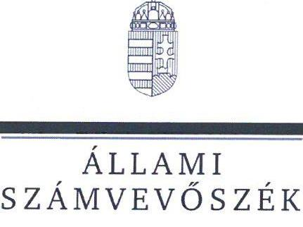
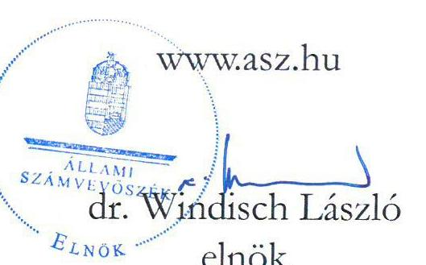

# JELENTÉS 

A költségvetési támogatásban részesült sportegyesületeknél a felügyelőbizottság, felügyelő szerv létrehozása és könyvvizsgáló alkalmazása szabályszerűségének ellenőrzése

Szent István Sportegyesület

2024.

---

ÁLLAMI
SZÁMVEVŐSZÉK

# JELENTÉS 

## A költségvetési támogatásban részesült sportegyesületeknél a felügyelőbizottság, felügyelő szerv létrehozása és könyvvizsgáló alkalmazása szabályszerűségének ellenőrzése

Szent István Sportegyesület

2024. 

24090

---

# ELLENŐRZÉSI IGAZGATÓSÁG: 

## ÁLLAMHÁZTARTÁSON KÍVÜLI SZERVEZETEKET ELLENŐRZŐ IGAZGATÓSÁG

## ELLENŐRZÉSI IGAZGATÓ:

## KLINGA LÁSZLÓ igazgató

## ELLENŐRZÉSVEZETŐ:

Jelentéseink az interneten a www.asz.hu címen olvashatók.

## HOFMEISTER LÁSZLÓ ellenőrzésvezető

IKTATÓSZÁM: EL-4070-011/2024.
TÉMASZÁM: 2717
ELLENŐRZÉS-AZONOSÍTÓ SZÁM: V1061

---

# TARTALOMJEGYZÉK 

- AZ ELLENŐRZÉS ALAPADATAI ..... 5
- MEGÁLLAPÍTÁSOK ÉS KÖVETKEZTETÉSEK ..... 7
MELLÉKLETEK ..... 8
I. sz. melléklet: Értelmező szótár ..... 8
II. sz. melléklet: Ellenőrzési kritériumok ..... 9
FÜGGELÉK: ÉSZREVÉTELEK ..... 10
RÖVIDÍTÉSEK JEGYZÉKE ..... 11

---

.

---

# AZ ELLENŐRZÉS ALAPADATAI 

## AZ ELLENŐRZÉS CÉLJA

Az ellenőrzés célja annak értékelése volt, hogy az ellenőrzött sportegyesületnél a jogszabályi előírásoknak megfelelően létrehoztak-e, működtettek-e felügyelőbizottságot vagy felügyelő szervet, továbbá alkalmaztak-e könyvvizsgálót, a könyvvizsgáló vizsgálta-e a sportegyesület 2022. évi beszámolóját.

## AZ ELLENŐRZÖTT IDŐSZAK

A 2022. év és a 2022. évi beszámoló elfogadásáig terjedő időszak.

## AZ ELLENŐRZÉS TÁRGYA

Az ellenőrzés a költségvetési támogatásban részesült sportegyesületek tekintetében a felügyelőbizottság vagy felügyelő szerv létrehozásának és működtetésének, a könyvvizsgáló alkalmazásának szabályszerűségére, a sportegyesület gazdálkodásáról készített 2022. évi beszámoló könyvvizsgáló általi vizsgálatának megtörténtére irányult.

## AZ ELLENŐRZÉS JOGALAPJA

Az ellenőrzés jogalapját az ÁSZ tv. ${ }^{1}$ 5. § (3) bekezdése képezte.

## AZ ELLENŐRZÉS MÓDSZERE

Az ellenőrzést az Alaptörvény ${ }^{2}$ 43. cikk (1) bekezdésében meghatározott törvényességi és célszerűségi szempontok szerint, valamint a nemzetközi standardokat irányadónak tekintve az ellenőrzési program szempontjai, az ellenőrzött időszakban hatályos jogszabályok, az ellenőrzés szakmai szabályok és módszertanok figyelembevételével végezte el az ÁSZ ${ }^{3}$.

Az ellenőrzési kérdések megválaszolásához szükséges bizonyítékok megszerzése az ellenőrzött szervezet által rendelkezésre bocsátott dokumentumokra, adatokra alapozva kérdésfeltevés (információkérés), interjú útján történt.

Az ellenőrzési bizonyítékként felhasználható adatforrások közé tartoztak egyrészt az ellenőrzési programban felsorolt adatforrások, másrészt az ellenőrzés folyamán feltárt, az ellenőrzés szempontjából releváns információt tartalmazó dokumentumok.

Az ellenőrzés lefolytatásához az ellenőrzött szervezet tanúsítványok kitöltésével, hitelesítésével, valamint a teljességi és hitelességi nyilatkozattal alátámasztott adatok, dokumentumok rendelkezésre bocsátásával szolgáltatott adatokat.

---

# AZ ELLENŐRZÖTT SZERVEZET 

Az ellenőrzött szervezet a Sport tv. ${ }^{4}$ 16. § (1) bekezdése szerint, a Civil tv. ${ }^{5}$ és a Ptk. ${ }^{6}$ szabályai szerint működő olyan sportegyesület, amely a Számv. tv. ${ }^{7}$ 3. § (1) bekezdés 4. a) pontja szerinti egyéb szervezeteknek minősült.

## SZENT ISTVÁN SPORTEGYESÜLET

A SZISE ${ }^{8}$ 2004-ben alakult Budapesten. A sportegyesület célja a labdarúgás és kézilabda szakosztályban részt vállalni az utánpótlás rendszer kialakításában. Ennek keretében biztosítja a sportegyesület tagjai részére a rendszeres sportolás és a versenyzés lehetőségét. További célja a közösségi élet fejlesztése, valamint a hazai és nemzetközi sportkapcsolatok megteremtése és fenntartása.

Az egyesület éves bevétele a 2022. évben 358601 E Ft volt, és az egyszerűsített éves beszámoló és közhasznúsági melléklete eredménykimutatása támogatások sora alapján 331195 E Ft támogatásban részesült.

---

# MEGÁLLAPÍTÁSOK ÉS KÖVETKEZTETÉSEK 

## Felügyelőbizottság létrehozása, működtetése

A SZISE-nek a Ptk. előírásai alapján nem kellett felügyelőbizottságot létrehoznia, mivel kizárólag természetes személy tagjainak száma nem haladta meg a 100 főt a 2022. évben. Felügyelő szervet sem kellett létrehoznia a Civil tv. előírása szerint, mivel nem volt közhasznú jogállású a 2022. évben.

## Könyvvizsgáló alkalmazása, beszámoló felülvizsgálata

A SZISE könyvvizsgálatra kötelezett volt, mivel éves bevétele a 2022. évet megelőző két év átlagában meghaladta a 300 millió Ft-ot (2020-2021. évek átlaga 320,3 M Ft volt). A SZISE a 2022. évben a Civilszr. ${ }^{9}$-ben előírtaknak megfelelően biztosította a könyvvizsgálatot, a beszámoló felülvizsgálatával könyvvizsgálót bízott meg. A sportegyesület a 2022. évi beszámolóját a Civil tv. előírásainak megfelelően a könyvvizsgálói jelentéssel alátámasztotta.

---

# MELLÉKLETEK 

## I. SZ. MELLÉKLET: ÉRTELMEZŐ SZÓTÁR

költségvetési támogatás
felügyelőbizottság
felügyelő szerv
könyvvizsgálati kötelezettség
sportegyesület
a társadalombiztosítás pénzügyi alapjai kivételével az államháztartás központi alrendszeréből ellenérték nélkül, pénzben nyújtott támogatások (Áht. ${ }^{10}$ 1. § 14. pont)
a felügyelőbizottság feladata az ügyvezetés ellenőrzése a jogi személy érdekeinek megóvása céljából (Ptk. 3:26. § (1) bekezdés). Kötelező felügyelőbizottságot létrehozni, ha a tagok több mint fele nem természetes személy, vagy ha a tagság létszáma a száz főt meghaladja (Ptk. 3:82. § (1) bekezdés).
a felügyelő szerv feladata ellenőrizni a közhasznú szervezet működését és gazdálkodását (Civil tv. 41. § (1) bekezdés). Ha a közhasznú szervezet éves bevétele meghaladja az ötvenmillió forintot, a vezető szervtől elkülönült felügyelő szerv létrehozása akkor is kötelező, ha ilyen kötelezettség más jogszabálynál fogva egyébként nem áll fenn (Civil tv. 40. § (1) bekezdés).
kötelező a könyvvizsgálat annál az egyéb szervezetnél, amelynél az éves (éves szintre átszámított) bevétel az üzleti évet megelőző két üzleti év átlagában meghaladja a 300 millió forintot. Minden olyan esetben, amikor a könyvvizsgálat e rendelet vagy más jogszabály előírásai szerint nem kötelező, az egyéb szervezet dönthet arról, hogy a beszámoló felülvizsgálatával könyvvizsgálót bíz meg (Civilszr. 16. § (1) bekezdés).
a sportegyesület olyan egyesület, amelynek alaptevékenysége a sporttevékenység szervezése, valamint a sporttevékenység feltételeinek megteremtése (Sport tv. 16. § (1) bekezdése)

---

# II. SZ. MELLÉKLET: ELLENŐRZÉSI KRITÉRIUMOK 

## ELLENŐRZÉSI KRITÉRIUMOK

Számv. tv. 156. § (4) bek.,
Civil tv. 30. § (1)., 40. § (1) (2)., 41. §
Civilszr. 16. § (1) bek.,
Ptk. 3:26. § (1), (2), 3:27. § (1), 3:82. § (1), (2) bek.
Felügyelőbizottság vagy felügyelő szerv ügyrendje
Sportegyesület alapító okirat/alapszabály

---

# FÜGGELÉK: ÉSZREVÉTELEK 

A jelentéstervezetet a Számvevőszék 15 napos észrevételezésre megküldte az ellenőrzött szervezet vezetőjének az ÁSZ tv. 29. § (1) bekezdése előírásának megfelelően.

Az ellenőrzött szervezet elnöke a jelentéstervezetre nem tett észrevételt.

[^0]
[^0]:    * 29. § (1) Az Állami Számvevőszék az ellenőrzési megállapításait megküldi az ellenőrzött szervezet vezetőjének vagy az általa megbízott személynek, és annak, akinek személyes felelősségét állapította meg.
    (2) Az ellenőrzött szervezet vezetője és a felelősként megjelölt személy az ellenőrzés megállapításaira tizenöt napon belül írásban észrevételt tehet.
    (3) Az Állami Számvevőszék az észrevételre a beérkezésétől számított harminc napon belül írásban válaszol. A figyelembe nem vett észrevételeket köteles a jelentésben feltüntetni, és megindokolni, hogy azokat miért nem fogadta el.

---

# RÖVIDÍTÉSEK JEGYZÉKE 

${ }^{1}$ ÁSZ tv.
${ }^{2}$ Alaptörvény
${ }^{3}$ ÁSZ
${ }^{4}$ Sport tv.
${ }^{5}$ Civil tv.
${ }^{6}$ Ptk.
${ }^{7}$ Számv. tv.
${ }^{8}$ SZISE
${ }^{9}$ Civilszr.
${ }^{10}$ Áht.
2011. évi LXVI. törvény az Állami Számvevőszékről
Magyarország Alaptörvénye
Állami Számvevőszék
2004. évi I. törvény a sportról
2011. évi CLXXV. törvény az egyesülési jogról, a közhasznú jogállásról, valamint a civil szervezetek működéséről és támogatásáról
2013. évi V. törvény a Polgári Törvénykönyvről
2000. évi C. törvény a számvitelről

Szent István Sportegyesület
479/2016. (XII. 28.) Korm. rendelet a számviteli törvény szerinti egyes egyéb szervezetek beszámoló készítési és könyvvezetési kötelezettségének sajátosságairól
2011. évi CXCV. törvény az államháztartásról

---

1052 Budapest, Apáczai Csere János u. 10. | 1364 Budapest 4., Pf. 54
www.asz.hu | szamvevoszek@asz.hu
telefon: +36 14849100

