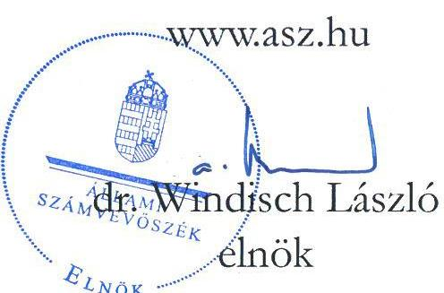
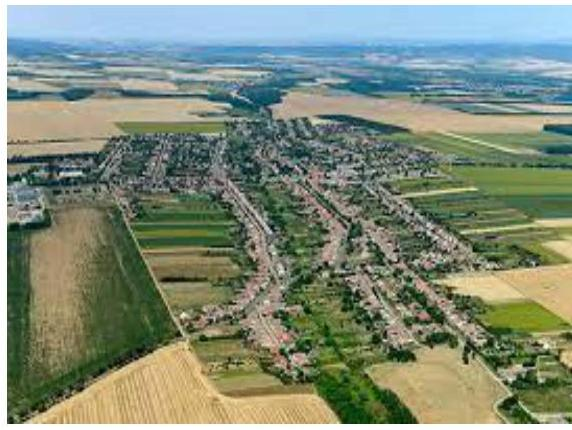
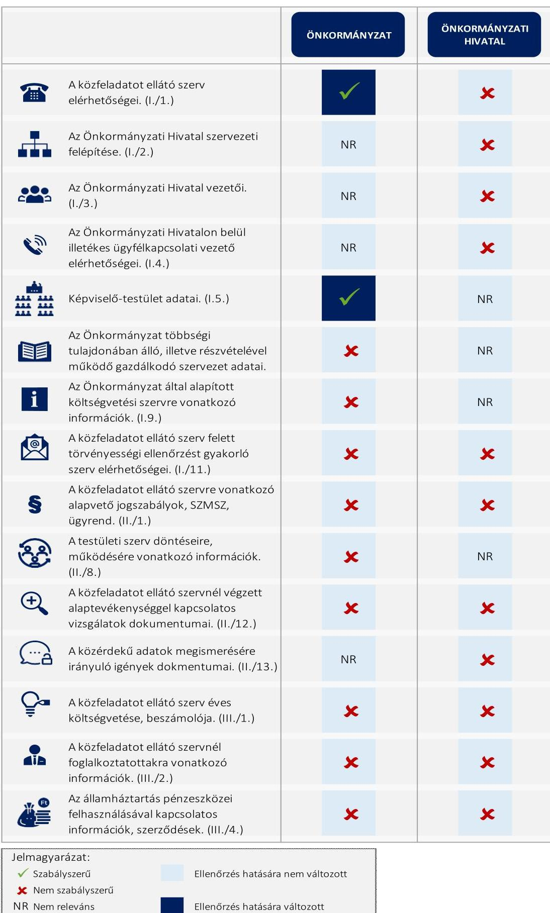

# JELENTÉS 

## Az önkormányzatok közzétételi kötelezettsége teljesítésének célzott ellenőrzése

Érsekvadkert Község Önkormányzata
Érsekvadkerti Polgármesteri Hivatal

2024.

---

# JELENTÉS 

## Az önkormányzatok közzétételi kötelezettsége teljesítésének célzott ellenőrzése

Érsekvadkert Község Önkormányzata
Érsekvadkerti Polgármesteri Hivatal
2024.

24092

---

# ELLENŐRZÉSI IGAZGATÓSÁG: 

## ÁLLAMHÁZTARTÁS HELYI SZINTJÉT ELLENŐRZŐ IGAZGATÓSÁG

## ELLENŐRZÉSI IGAZGATÓ:

DR. BAFFIA GERGELY GÁBOR igazgató

## ELLENŐRZÉSVEZETŐ:

Jelentéseink az interneten a www.asz.hu címen olvashatók.

DR. GÁL NÓRA ellenőrzésvezető

IKTATÓSZÁM: EL-3986-002/2024
TÉMASZÁM: 2718
ELLENŐRZÉS-AZONOSÍTÓ SZÁM: V1062

---

# TARTALOMJEGYZÉK 

AZ ELLENŐRZÉS ALAPADATAI ..... 5
AZ ELLENŐRZÖTT SZERVEZET ..... 7
ÖSSZEFOGLALÁS ..... 8
AZ ELLENŐRZÉS FÓKUSZKÉRDÉSE ..... 10
MEGÁLLAPÍTÁSOK ..... 11
JAVASLATOK ..... 12
MELLÉKLETEK ..... 13
I. sz. melléklet: Kimutatás az Info. tv. 1. melléklete szerinti közzétételi egységek ÁSZ ellenőrzési körébe vont adatairól ..... 13
II. sz. melléklet: Ellenőrzési kritériumok ..... 14
III. sz. melléklet: Értelmező szótár ..... 15
FÜGGELÉK: ÉSZREVÉTELEK ..... 16
RÖVIDÍTÉSEK JEGYZÉKE ..... 21

---

.

---

# AZ ELLENŐRZÉS ALAPADATAI 

## AZ ELLENŐRZÉS CÉLJA

Az ellenőrzés célja annak megállapítása volt, hogy az Önkormányzat és a gazdálkodási feladatait ellátó Önkormányzati Hivatal az elektronikus közzétételi kötelezettségüknek eleget tettek-e, biztosították-e az átláthatóság érvényesülését, a nem minősített adatokhoz való hozzáférést, az Önkormányzat munkájának nyomonkövethetőségét.

## AZ ELLENŐRZÉS TÍPUSA

Megfelelőségi ellenőrzés.

## AZ ELLENŐRZÖTT IDŐSZAK

Az ellenőrzött szervezetek ellenőrzés megindításáról történő kiértesítését megelőző munkanap (2024. január 24.).

## AZ ELLENŐRZÉS TÁRGYA

Az Önkormányzat és a gazdálkodási feladatait ellátó Önkormányzati Hivatal Info tv. ${ }^{1}$ szerinti elektronikus közzétételi kötelezettségének teljesítése.

A jogszabály által előírt adatok közzététele biztosításának az ellenőrzése az ÁSZ ${ }^{2}$ által az átláthatóság és az önkormányzati feladatellátás nyomonkövethetősége tekintetében az ellenőrzés szempontjából lényegesként meghatározott, az Info tv. 1. melléklete szerinti 15 közzétételi egység adatköréhez kapcsolódott (a jelentés I. sz. mellékletében részletezve).

Az ellenőrzés kiterjedt minden olyan körülményre és adatra, amely az ÁSZ jogszabályban meghatározott feladatainak teljesítéséhez, valamint a program végrehajtása folyamán felmerült újabb összefüggések feltárásához szükséges volt.

## AZ ELLENŐRZÉS JOGALAPJA

Az ellenőrzés jogszabályi alapját az ÁSZ tv. ${ }^{3}$ 1. § (3) bekezdésében, valamint az Áht. ${ }^{4}$ 61. § (2) bekezdésében foglalt előírások képezték.

---

# AZ ELLENŐRZÉS MÓDSZERE 

Az ellenőrzést a nemzetközi standardokat irányadónak tekintve az ellenőrzési program értékelési szempontjai, az ellenőrzött időszakban hatályos jogszabályok, valamint az ellenőrzés szakmai szabályok és módszertanok figyelembevételével végezte az ÁSZ.

Az ellenőrzési kérdések megválaszolásához szükséges bizonyítékok megszerzése megfigyelés, szemrevételezés útján történt.

Az ellenőrzési bizonyítékként felhasználható adatforrások közé tartoztak az ellenőrzött szervezetek által elektronikusan közzétett dokumentumok, adatok, valamint a MÁK ${ }^{5}$ törzsadatnyilvántartása.

Az ÁSZ az elektronikus közzétételi kötelezettség teljesítését a közzétételre szolgáló honlap közzétételi felületén ellenőrizte. A közzététel akkor volt megfelelő, azaz akkor tett eleget közzétételi kötelezettségének az ellenőrzött, ha a jelentés I. sz. melléklete szerinti közzétételi egységekhez tartozó adatokat, vagy az elérésüket biztosító hivatkozásokat a közzétételre szolgáló honlap adekvát közzétételi egységében jelenítették meg. Amennyiben a közérdekű adatok, vagy az azokra történő közvetlen hivatkozások a közzétételre szolgáló honlap „Közérdekű adatok" menürendszerén kívül, vagy ilyen menürendszer hiányában a közzétételre szolgáló honlap egyéb, az adat tartalmával összefüggő felületein kerültek elhelyezésre, akkor azt az ellenőrzés az adatok nem jogszabály szerinti közzétételeként értékelte.

Az ÁSZ akkor értékelte a jelentés II. sz. melléklet 1.1. pontja alapján megfelelőnek a jogszabály által előírt adatok közzétételét, ha a jelentés I. sz. melléklete szerinti közzétételi egységekbe tartozó adatkörben teljeskörű volt a közzététel. Az ÁSZ az ellenőrzött adat - ellenőrzött szempontjából történő - irrelevanciájára utalást az értékelés szempontjából közzétételnek minősítette.

Az ellenőrzés nem terjedt ki az adatok tartalmi megfelelőségére, a kapcsolódó belső szabályozásra, valamint arra, hogy a közzétett adatokon kívül volt-e olyan adat, amelyet közzé kellett volna tennie az ellenőrzöttnek. A közzétett adatok aktualitásának megfelelőségét az ÁSZ csak a jelentés I. sz. melléklete 13. és 14. sora szerinti közzétételi egységek közzétett adatai esetében értékelte, ahol az aktualizálás megfelelősége a MÁK törzsadatnyilvántartás, valamint a közzétett adat alapján egyértelműen megállapítható volt.

A közzétett adatok jogszabályokban meghatározott módon történő elérhetőségét akkor tekintette megfelelőnek az ÁSZ, ha a jelentés II. sz. melléklet 1.2. fókusz alkérdéshez tartozó kritériumok mindegyike teljesült.

---

# **AZ ELLENŐRZŐTT SZERVEZET**

**Érsekvadkert Község** Nógrád vármegye legnagyobb népességű, városi rang nélküli települése. A vármegye nyugati térségében, a Balassagyarmati járásban található. A lakosság száma 3 415 fő, a lakások száma 1 386 db (KSH, 2023.01.01). Lakosságszámával a hatodik legnépesebb település a vármegyében.

Érsekvadkert Község Önkormányzata Képviselő-testülete hét főből áll, élén főállású polgármesterrel. A településen roma nemzetiségi önkormányzat működik.

**Érsekvadkert Község Önkormányzata** gazdálkodási feladatait az **Érsekvadkerti Polgármesteri Hivatal** látja el. Az Érsekvadkerti Polgármesteri Hivatal önálló jogi személy, saját költségvetési előirányzatai körében önállóan működő és gazdálkodó költségvetési szerv. A jelenlegi jegyző 2023. február 8-tól látja el feladatát.

Érsekvadkert Község Önkormányzata négy további költségvetési szervet tart fenn, az Érsekvadkerti Intézmények Konyháját, az Érsekvadkerti Ary Erzsébet Óvoda és Mini Bölcsődét, az Érsekvadkerti Öregek Egyesített Szociális Intézményét és a Mikszáth Kálmán Közművelődési Intézmény Könyvtár és Ifjúsági Házat.

Érsekvadkert Község Önkormányzatának nincs gazdasági társasága. A település tagja a hosszútávú, felelős és környezettudatos hulladékgazdálkodás feltételeinek fenntartása és fejlesztése céljából létrehozott Észak-Kelet Pest és Nógrád Megyei Regionális Hulladékgazdálkodási és Környezetvédelmi Önkormányzati Társulásnak, valamint a Nyugat-Nógrád Család– és Gyermekjóléti Szolgáltatási Társulásnak.

Érsekvadkert Község Önkormányzatának a költségvetési szervei gazdálkodási adataival egybeszámított működési, felhalmozási és finanszírozási egyenlegei a 2021-es és 2022-es években az alábbiak szerint alakultak:

|  A 2021. ÉS A 2022. ÉVI MŰKÖDÉSI, FELHALMOZÁSI ÉS FINANSZÍROZÁSI EGYENLEG | 2021. | 2022.  |
| --- | --- | --- |
|  Teljesített működési költségvetési bevételek | 483 887 | 542 289  |
|  Teljesített működési költségvetési kiadások | 517 593 | 613 017  |
|  Működési egyenleg | -33 706 | -70 728  |
|  Teljesített felhalmozási költségvetési bevételek | 298 054 | 223 768  |
|  Teljesített felhalmozási költségvetési kiadások | 624 077 | 448 259  |
|  Felhalmozási egyenleg | -326 023 | -224 491  |
|  Finanszírozási bevételek | 1 045 494 | 711 035  |
|  Finanszírozási kiadások | 267 716 | 291 722  |
|  Finanszírozási egyenleg | 777 778 | 419 313  |

*Forrás: a Nemzeti Jogszabálytárban közzétett 2021. és 2022. évi költségvetés végrehajtásáról készített zárszámadás alapján ÁSZ szerkesztés*

---

# ÖSSZEFOGLALÁS 

Kiemelten fontos közérdek, hogy a választópolgárok számára biztosított legyen a helyi önkormányzat összetételének, működésének és gazdálkodásának, döntéseinek és teljesítményének átláthatósága, nyomon követhetősége, amely többek között a közérdekű adatok elektronikus közzétételén keresztül valósul meg.

A közérdeklődésre számot tartó adatok körébe tartoznak az Info tv. 1. melléklete szerinti általános közzétételi listában előírt szervezeti- és személyzeti adatok, a tevékenységre és müködésre, valamint a gazdálkodásra vonatkozó adatok.

Az ellenőrzött szervezetek tevékenységének, működésének és gazdálkodásának átláthatóságát, a közvélemény gyors és pontos tájékoztatását biztosítja az IHM Rendelet ${ }^{6}$ azzal, hogy a jogszabály a "Közérdekű adatok" hivatkozásnak a közzétételt szolgáló honlap nyitó oldalán történő megjelenítését, valamint a szervezet szempontjából nem releváns közzétételi egységekre utalás megjelenítését is előírja. A közzétételre kötelezettnek biztosítani kell továbbá az egységes közadatkereső rendszerre, a központi elektronikus jegyzékre irányító hivatkozást is, amely arra hivatott, hogy tartalmazza a közzétételre szolgáló honlapra, a fenntartott adatbázisra és nyilvántartásra vonatkozó leíró adatokat, vagyis biztosítsa a közérdekű adatok egységes szempontok szerinti, egyszerű és gyors elérését minden közzétételre kötelezett esetében.

Az ÁSZ jelen ellenőrzés keretében Érsekvadkert Község Önkormányzata és a gazdálkodási feladatait ellátó Érsekvadkerti Polgármesteri Hivatal elektronikus közzétételi kötelezettségének teljesítését értékelte, az Info tv. 1. melléklete szerinti számos közzétételi egység közül 15 közzétételi egység adatköréhez kapcsolódóan.

Érsekvadkert Község Önkormányzata és az Érsekvadkerti Polgármesteri Hivatal nem tett eleget közzétételi kötelezettségének egyetlen közzétételi egység vonatkozásában sem. Az érintett ellenőrzött szervezetek közzétételi kötelezettségük teljesítése hiányában nem biztosították a müködésükre és gazdálkodásukra vonatkozó alapvető adatok elérhetőségét, ezzel a jogszabályi előírás ellenére az átláthatóságot.

Az ellenőrzött szervezetek vezetői az ÁSZ tv. 29. § (2) bekezdés szerinti, a jelentéstervezet megállapításaira tett észrevételükben arról tájékoztatták az ÁSZ-t, hogy intézkedéseket tesznek a hiányosságok megszüntetésére.
Az ellenőrzés megállapításai az ellenőrzés folyamatában részben hasznosultak, az ellenőrzés eredményeként - a 2024. május 7-i állapot szerint - az Önkormányzat az ÁSZ által ellenőrzött közzétételi egységek közül két közzétételi egység adatkörének közzétételét biztosította, az Info. tv. 1. melléklet I. Szervezeti, személyzeti adatok címének 1. és 5. pontja közzétételre került.

Az ellenőrzés a továbbra is fennálló hiányosságok megszüntetésére összesen öt javaslatot tett a polgármester és a jegyző számára.

---

# AZ ELLENŐRZÉS FŐBB TAPASZTALATAINAK ÖSSZEGZÉSE 

[^0]
[^0]:    Jelmagyarázat:
    $\checkmark$ Szabályszerú
    $\times$ Nem szabályszerú
    NR Nem releváns

---

# AZ ELLENŐRZÉS FÓKUSZKÉRDÉSE 

Az Önkormányzat és a gazdálkodási feladatait ellátó Önkormányzati Hivatal teljesítette-e a jogszabályban elöirt elektronikus közzétételi kötelezettségét?

---

# 1. Az Önkormányzat és a gazdálkodási feladatait ellátó Önkormányzati Hivatal teljesítette-e a jogszabályban előírt elektronikus közzétételi kötelezettségét? 

Összegző megállapítás

Érsekvadkert Község Önkormányzata és a gazdálkodási feladatait ellátó Érsekvadkerti Polgármesteri Hivatal az Info tv. előírásai ellenére nem teljesítette elektronikus közzétételi kötelezettségét.

Érsekvadkert Község Önkormányzata és a gazdálkodási feladatait ellátó Érsekvadkerti Polgármesteri Hivatal Érsekvadkert Község Önkormányzata honlapján alakította ki a közzétételi felületet. A közzétételre szolgáló honlap nyitólapján elhelyezésre került az IHM Rendelet 1. mellékletében meghatározott tagolásnak megfelelő jegyzékre mutató hivatkozás "Közérdekű adatok, bejelentések" megnevezéssel. A közvetlen hivatkozással elérhető jegyzék tartalmát azonban nem az IHM Rendelet 2. $\$ (2) bekezdésében foglaltaknak megfelelően alakították ki, az nem tartalmazta az Info tv. 37. § (1) bekezdésében foglaltak ellenére az Info tv. 1. melléklete szerinti általános közzétételi lista adatkörének megfelelő közzétételi egységeket, mert a jegyzék „Tevékenységre, működésre vonatkozó adatok" elnevezésű második pontja egyáltalán nem tartalmazott közzétételi egységet.
A kapcsolati adatok, a szervezetre, a testületi szerv ülésére, az önkormányzati döntésekre („Rendeletek") vonatkozó adattartalom, a közérdekű adattal érintett szervezetre („Önkormányzat", „Polgármesteri Hivatal") utaló hivatkozások a közzétételre szolgáló honlap nyitóoldalán megtalálhatóak voltak. A közérdekű adatok egy része megtalálható volt a közzétételre szolgáló honlap egyéb felületein is. A közzététel mindezek ellenére nem volt megfelelő, mert a közérdekű adatok elérhetőségét nem az IHM Rendelet 2. $\$ (2) bekezdése által előírt közzétételi egységek szerint biztosították.
A közérdekű adatok közzétételére szolgáló honlap adattartalma nem felelt meg az IHM Rendelet 2. § (1) bekezdésében, valamint a 305/2005. (XII.25.) Korm.rendelet ${ }^{7}$ 5. § (5) bekezdésében foglalt előírásnak sem, mert a közzétételre szolgáló honlapon nem tüntették fel az egységes közadatkereső rendszerre, a központi elektronikus jegyzékre mutató hivatkozást.
Az ellenőrzött szervezetek nem tettek eleget az Info tv. 37/B. § (1) bekezdésében foglalt kötelezettségüknek, mert az adatfelelősök nem gondoskodtak az adatok közadatkereső rendszerbe történő továbbításáról, ezért az nem tartalmazott az ellenőrzött szervezetekre vonatkozóan adatot.
Érsekvadkert Község Önkormányzata és az Érsekvadkerti Polgármesteri Hivatal nem tett eleget a közzétételi egységek kialakítási és adatfeltöltési kötelezettségének, ezzel megsértette az Info. tv. 37. § (1), az IHM Rendelet 2. § (1)-(2) és a 305/2005. (XII.25.) Korm.rendelet 5. § (5) bekezdésekben foglalt előírásokat.
Az ellenőrzött szervezetek közzétételre szolgáló honlapja az ellenőrzés időpontjában nem volt alkalmas az Info. tv. által elvárt cél - az elektronikusan közzétett adatok egyszerú és gyors elérhetőségének - megvalósítására. Az adatfeltöltések hiányában az ellenőrzött szervezetek nem biztosították a közérdekú adatok megismerhetőségét, a müködés és a gazdálkodás átláthatóságát.

---

# JAVASLATOK 

Az ÁSZ tv. 33. § (1) bekezdésében foglaltak értelmében az ellenőrzött szervezet vezetője köteles a jelentésben foglalt megállapításokhoz kapcsolódó intézkedési tervet összeállítani és azt a jelentés kézhezvételétől számított 30 napon belül az ÁSZ részére megküldeni. Amennyiben az ellenőrzött szervezet vezetője nem küldi meg határidőben az intézkedési tervet, vagy továbbra sem elfogadható intézkedési tervet küld, az Állami Számvevőszék elnöke az ÁSZ tv. 33. § (3) bekezdése a) és b) pontjaiban foglaltakat érvényesítheti.

## ÉRSEKVADKERT KÖZSÉG ÖNKORMÁNYZATA POLGÁRMESTERÉNEK

1. Intézkedjen a nyilvános jelentés kézhezvételét követő 30 napon belül az Állami Számvevőszék jelentésének a Képviselő-testület elé terjesztéséről. A napirend tárgyalásáról szóló jegyzőkönyvvel együtt a jelentést tájékoztatásul küldje meg a Kormányhivatal számára is.
2. Intézkedjen a közérdekü adatok Info tv. 37. § (1) bekezdése előirása szerinti közzététele iránt. Ennek körében gondoskodjon a közzétételi listák által előirt adatokat tartalmazó felület olyan módon történő kialakításáról, hogy az IHM Rendelet 2. § (2) bekezdésének előirása alapján az IHM Rendelet 1. melléklete szerinti tagolásban tartalmazza az Info tv. 1. mellékletében foglalt általános közzétételi lista adatait tartalmazó közzétételi egységeket.
3. Intézkedjen, az IHM Rendelet 2. § (1) bekezdésében, valamint a 305/2005. (XII.25.) Korm.rendelet 5. § (5) bekezdésében foglalt előírás teljesítése iránt és tüntesse fel a közzétételre szolgáló honlapon az egységes közadatkereső rendszerre, a központi elektronikus jegyzékre mutató hivatkozást. Gondoskodjon továbbá az Info tv. 37/B. § (1) bekezdésében foglaltak szerint a közérdekü adatok közadatkereső rendszerbe történő továbbításáról.

## ÉRSEKVADKERTI POLGÁRMESTERI HIVATAL JEGYZŐJÉNEK

1. Intézkedjen a közérdekü adatok Info tv. 37. § (1) bekezdése előirása szerinti közzététele iránt. Ennek körében gondoskodjon a közzétételi listák által előirt adatokat tartalmazó felület olyan módon történő kialakításáról, hogy az IHM Rendelet 2. § (2) bekezdésének előirása alapján az IHM Rendelet 1. melléklete szerinti tagolásban tartalmazza az Info tv. 1. mellékletében foglalt általános közzétételi lista adatait tartalmazó közzétételi egységeket.
2. Intézkedjen, az IHM Rendelet 2. § (1) bekezdésében, valamint a 305/2005. (XII.25.) Korm.rendelet 5. § (5) bekezdésében foglalt előírás teljesítése iránt és tüntesse fel a közzétételre szolgáló honlapon az egységes közadatkereső rendszerre, a központi elektronikus jegyzékre mutató hivatkozást. Gondoskodjon továbbá az Info tv. 37/B. § (1) bekezdésében foglaltak szerint a közérdekü adatok közadatkereső rendszerbe történő továbbításáról.

---

# I. SZ. MELLÉKLET: KIMUTATÁS AZ INFO. TV. 1. MELLÉKLETE SZERINTI KÖZZÉTÉTELI EGYSÉGEK ÁSZ ELLENŐRZÉSI KÖRÉBE VONT ADATAIRÓL 

## SORSZAM

## ADATKÖRÉS AZ INFO TV. 1. MELLEKLET SZERINTI SORSZAM

## I. Szervezeti, személyi adatok

1. A közfeladatot ellátó szerv hivatalos neve, székhelye, postai címe, telefonszáma, elektronikus levélcíme, honlapja. (I./1.)
2. Az Önkormányzati Hivatal szervezeti felépítése szervezeti egységek megjelölésével, az egyes szervezeti egységek feladatai. (I./2.)
3. Az Önkormányzati Hivatal vezetőinek és az egyes szervezeti egységek vezetőinek neve, beosztása, elérhetősége (telefonszáma, elektronikus levélcíme). (I./3.)
4. Az Önkormányzati Hivatalon belül illetékes ügyfélkapcsolati vezető neve, elérhetősége (telefonszáma, elektronikus levélcíme) és az ügyfélfogadási rend. (I.4.)
5. A képviselő-testület létszáma, tagjainak neve, beosztása, elérhetősége. (I.5.)
6. Az Önkormányzat többségi tulajdonában álló, illetve részvételével működő gazdálkodó szervezet neve, székhelye, elérhetősége (postai címe, telefonszáma, elektronikus levélcíme), tevékenységi köre, képviselőjének neve, a közfeladatot ellátó szerv részesedésének mértéke. (I./7.)
7. Az Önkormányzat által alapított költségvetési szerv neve, székhelye, a költségvetési szerv alapító okirata, vezetője, müködési engedélye. (I.9.)
8. A közfeladatot ellátó szerv felett törvényességi ellenőrzést gyakorló szervnek a hivatalos neve, székhelye, postai címe, telefonszáma, elektronikus levélcíme, honlapja, ügyfélszolgálatának elérhetőségei. (I./11.)

## II. Tevékenységre, müködésre vonatkozó adatok

9. A közfeladatot ellátó szerv feladatát, hatáskörét és alaptevékenységét meghatározó, a szervre vonatkozó alapvető jogszabályok, valamint a szervezeti és müködési szabályzat vagy ügyrend, az adatvédelmi és adatbiztonsági szabályzat hatályos és teljes szövege. (II./1.)
10. A testületi szerv döntései előkészítésének rendje, az állampolgári közreműködés (véleményezés) módja, eljárási szabályai, a testületi szerv üléseinek helye, ideje, továbbá nyilvánossága, döntései, ülésének jegyzőkönyvei, illetve összefoglalói; a testületi szerv szavazásának adatai, ha ezt jogszabály nem korlátozza. (II./8.)
11. A közfeladatot ellátó szervnél végzett alaptevékenységgel kapcsolatos vizsgálatok, ellenőrzések nyilvános megállapításai. (II./12.)
12. A közérdekű adatok megismerésére irányuló igények intézésének rendje, az illetékes szervezeti egység neve, elérhetősége, az információs jogokkal foglalkozó személy neve. (II./13.)

## III. Gazdálkodási adatok

13. A közfeladatot ellátó szerv éves költségvetése, éves költségvetés beszámolója. (III./1.)
14. A közfeladatot ellátó szervnél foglalkoztatottak létszámára és személyi juttatásaira vonatkozó összesített adatok, illetve összesítve a vezetők és vezető tisztségviselők illetménye, munkabére és rendszeres juttatásai, valamint költségtérítése. (III./2.)
15. Az államháztartás pénzeszközei felhasználásával, az államháztartáshoz tartozó vagyonnal történő gazdálkodással összefüggő, ötmillió forintot elérő szerződések megnevezése (típusa), tárgya, szerződést kötő felek neve, a szerződés értéke, határozott időre kötött szerződés esetében annak időtartama. (III./4.)

---

# II. SZ. MELLÉKLET: ELLENŐRZÉSI KRITÉRIUMOK 

## POKUSZKÉRDÉS

1. Az Önkormányzat és a gazdálkodási feladatait ellátó Önkormányzati Hivatal teljesítette-e a jogszabályban előírt elektronikus közzétételi kötelezettségét?
1.1. Az Önkormányzat és a gazdálkodási feladatait ellátó Önkormányzati Hivatal az elektronikus közzétételi kötelezettségének teljesítése során biztosította-e a jogszabály által előírt adatok közzétételét?
1.2. Az Önkormányzat és a gazdálkodási feladatait ellátó Önkormányzati Hivatal az elektronikus közzétételi kötelezettségének teljesítése során biztosította-e a közzétett adatok jogszabályokban meghatározott módon történő elérhetőségét?

## ELLENŐRZÉSI KRITÉRIUMOK

Info tv. 33. $\$ (3), 37 . \$$ (1) és (4a.) bekezdés, 1. melléklet I/1., 2., 3., 4., 5., 7., 9., 11. pont, II/1., 8., 12., 13. pont, III/1., 2., 4. pont; Áht. 87. § b) pont; Áhsz ${ }^{\text {a }}$. 6. $\$ \$$ (1) bek. a) és f) pontjai;

IHM Rendelet 2. $\$ (2) bekezdés.
Info tv. 33. $\$ \$(1) bekezdés, 37/B. $\$$ (1) bekezdés; IHM Rendelet 2. $\$$ (1) bekezdés.
305/2005. (XII.25.) Korm.rendelet 5. $\$$ (5) bekezdés

---

# III. SZ. MELLÉKLET: ÉRTELMEZŐ SZÓTÁR 

adatfelelős
általános közzétételi lista
elektronikus közzététel
jegyzék
közadatkereső rendszer
közérdekű adat
központi elektronikus jegyzék
közzétételi egység
közzétételre szolgáló honlap

Az a közfeladatot ellátó szerv, amely az elektronikus úton kötelezően közzéteendő közérdekű adatot előállította, illetve amelynek a müködése során ez az adat keletkezett. (Info tv. 3. § 19. pont)
Közérdekű adatokat tartalmazó, Info tv. 1. melléklet szerinti lista. (Info tv. 37. § (1) bekezdés alapján)
Az Info.tv. alapján kötelezően közzéteendő közérdekủ adatokat internetes honlapon, digitális formában, bárki számára, személyazonosítás nélkül, korlátozástól mentesen, kinyomtatható és részleteiben is adatvesztés és torzulás nélkül kimásolható módon, a betekintés, a letöltés, a nyomtatás, a kimásolás és a hálózati adatátvitel szempontjából is díjmentesen kell hozzáférhetővé tenni. A közzétett adatok megismerése személyes adatok közléséhez nem köthető (Info.tv. 33. § (1) bekezdés)
A közzétételi listák által előírt adatokat tartalmazó jegyzék vagy felület. (IHM Rendelet 2. § (1) bekezdés alapján)
A közérdekű adatokhoz való egységes szempontok szerinti elektronikus hozzáférést és a közérdekủ adatok közötti keresés lehetőségét a közigazgatási informatika infrastrukturális megvalósíthatóságának biztosításáért felelős miniszter által müködtetett egységes közadatkereső rendszer biztosítja. (Info. tv. 37/A. § (2) bekezdés)
Az állami vagy helyi önkormányzati feladatot, valamint jogszabályban meghatározott egyéb közfeladatot ellátó szerv vagy személy kezelésében lévő és tevékenységére vonatkozó vagy közfeladatának ellátásával összefüggésben keletkezett, a személyes adat fogalma alá nem eső, bármilyen módon vagy formában rögzített információ vagy ismeret, függetlenül kezelésének módjától, önálló vagy gyűjteményes jellegétől, így különösen a hatáskörre, illetékességre, szervezeti felépítésre, szakmai tevékenységre, annak eredményességére is kiterjedő értékelésére, a birtokolt adatfajtákra és a müködést szabályozó jogszabályokra, valamint a gazdálkodásra, a megkötött szerződésekre vonatkozó adat. (Info tv. 3. §5. pont)
Az elektronikusan közzétett adatok egyszerủ és gyors elérhetősége érdekében az e törvény alapján közérdekủ adat elektronikus közzétételére kötelezett szervek közérdekủ adatot tartalmazó honlapjára, valamint az általuk fenntartott adatbázisra és nyilvántartásra vonatkozó leíró adatokat a közigazgatási informatika infrastrukturális megvalósíthatóságának biztosításáért felelős miniszter által müködtetett, az erre a célra létrehozott honlapon közzétett központi elektronikus jegyzék összesítve tartalmazza. (Info. tv. 37/A. § (1) bekezdés)
A közzétételi listák szerinti adatok közzétételének szerkezetét és az összefüggő tárgyú közzétett adatokat egybefoglaló tartalmi egységek. (IHM Rendelet 1. § (2) bekezdés)

Az adatközlő a közzétételre szolgáló honlapot úgy alakítja ki, hogy az adatok közzétételére alkalmas legyen, gondoskodik a folyamatos üzemeltetésről, az esetleges üzemzavar elhárításáról és az adatok frissítéséről. A közzétételre szolgáló honlapon közérthető formában tájékoztatást kell adni a közérdekủ adatok egyedi igénylésének szabályairól. A tájékoztatásnak tartalmaznia kell az igénybe vehető jogorvoslati lehetőségek ismertetését is. (Info. tv. 34. § (2)-(3) bekezdések)

---

# FÜGGELÉK: ÉSZREVÉTELEK 

A jelentéstervezetet a Számvevőszék 15 napos észrevételezésre megküldte az ellenőrzött szervezetek vezetőinek az ÁSZ tv. 29. §* (1) bekezdése előirásának megfelelően.

A jelentéstervezet megállapításaira az Önkormányzat polgármestere és az Önkormányzati Hivatal vezetője észrevételt tettek. Az ÁSZ tv. 29. § (3) bekezdésével összhangban az Állami Számvevőszék a Függelékben feltünteti a megállapításokkal kapcsolatban tett, el nem fogadott észrevételeket, és megindokolja, hogy azokat miért nem fogadta el.

[^0]
[^0]:    * 29. § (1) Az Állami Számvevőszék az ellenőrzési megállapításait megküldi az ellenőrzött szervezet vezetőjének vagy az általa megbízott személynek, és annak, akinek személyes felelősségét állapította meg.
    (2) Az ellenőrzött szervezet vezetője és a felelősként megjelölt személy az ellenőrzés megállapításaira tizenöt napon belül írásban észrevételt tehet.
    (3) Az Állami Számvevőszék az észrevételre a beérkezésétől számított harminc napon belül írásban válaszol. A figyelembe nem vett észrevételeket köteles a jelentésben feltüntetni, és megindokolni, hogy azokat miért nem fogadta el.

---

# ÁLLAMI SZÁMVEVŐSZÉK 

Államháztartás helyi szintjét ellenőrző igazgatóság
dr. Baffia Gergely Gábor igazgató
Budapest
ahszei@asz.hu

Tárgy: Az Önkormányzatok közzétételi kötelezettsége teljesítésének ellenőrzése - nyilatkozat
Ügyiratszám: ALT/43-7/2024.
Ügyintéző: dr. Nagy Atilla

## Tisztelt Igazgató Úr!

EL/4017-075/2024. számú „jelentéstervezet megküldése véleményezésre" tárgyú iratukra hivatkozással - felhívásukra - az alábbi érdemi véleményt, észrevételt tesszük

- az Érsekvadkerti Polgármesteri Hivatal és
- az Érsekvadkert Község Önkormányzata
ellenőrzésének tárgyában:

## 1. Általában

A települési önkormányzatok vezetőin és a közügyek iránt érdeklődő polgárain kívül a központi állami szerveknél - sajnos úgy tűnik, hogy - talán csak az Állami Számvevőszéknél - alapvető feladatkörükből kifolyólag - ismerik a települési önkormányzatok sanyarúvá lett helyzetét. Köztudomású, hogy az önkormányzatoktól történt többlépesős és kíméletlen forráselvonással finanszírozta az állam az elmúlt évek extra kiadásait, miután érthető politikai okokból a versenyszféra nagy és kis alanyait más-más okból nem merte ezzel terhelni, a saját álamháztartási berkein belül pedig nem is keresett költségcsökkentési módokat. Az önkormányzatok feladatfinanszírozása már-már cinikusan alultervezett, olyan állami tervezők és döntéshozók várják el ilyen kevés forrásból a kötelező feladatok maradéktalan ellátását, akik és amelyek ennek fajlagosan sokszorosából képesek csak múködni. Megfelelő finanszírozás helyett a központból kapunk viszont újabb és újabb feladatokat, természetesen - törvénysértő módon - a legelemibb finanszírozás nélkül.

Az egyik ilyen feladat a közérdekủ adatok és a közérdekből nyilvános adatok kezelése. Mivel minden közzétételre kötelezett alanynak nagyjából ugyanannyi adatot kell kezelni és folyamatosan karbantartania, ezért ismét és sokadszor ismét a kisebb alanyokat sújtják aránytalanul. A nagyobb szervezetek akár egy új munkakört is szentelni tudnak e feladatnak, a kisebbek az amúgy is többféle feladattal túlterhelt dolgozóikra tudják ezt is terhelni. Azokra a dolgozókra, akiket az önkormányzatok kivéreztetése miatt alacsony illetmények miatt általában nem a munkaerőpiac legjavából tudnak toborozni. Amikor a szűkös erőforrásaink felhasználásánál keserű döntéseket, fontossági sorrendet kell hoznunk, akkor a lakosságunk érdekeinek megfelelően járunk el, a kötelező feladatok közül azok kapnak prioritást, melyeknek valóban és a minden értelemben közérdekűek, a polgárok közvetlenül érzik azok előnyeit. Mivel eddig egyetlen érsekvadkerti polgár nem hiányolta a szabványosított általános közzétételi listát, ezért olyan logikusan olyan dolgokra fordítottuk a figyelmünket, munkaóráinkat és pénzünket, melyeket viszont valódi helyi közérdeklődés kísér és melyre valódi igény mutatkozik.

---

A fentiek természetesen nem azt jelentik, hogy a közzétételi kötelezettséget semmibe vennénk, vagy feleslegesnek tartanánk. Mindössze arról van szó, hogy eddig ennyire futotta tőlünk. Igyekszünk gyorsítani az adatok feltöltésén, illetve frissítésén, de hazudnánk, ha napokban, vagy hetekben adnánk meg azt az időt, mire utolérjük magunkat ebben.

# 2. Konkrétan 

Érsekvadkert Község Önkormányzata és annak első költségvetési szerve az Érsekvadkerti Polgármesteri Hivatal 2023-ban leváltotta régi, alavult honlapját egy újabbra. A régi sem tartalmazta az Info tv. 1. melléklet szerinti adatokat vagy az előírt hivatkozásokat, azonban sok előírt adatot a maga szerkezete szerint igen. Megjegyezzük, hogy ez a jelenlegi honlapunkkal is így van. Az adatokat elsődlegesen úgy tesszük közzé, ahogy - a honlap kötött szerkezeti kötöttségére is tekintettel - a honlap követői tárgykör szerint keresni fogják.

A jegyzőkönyvben szerepel az a megállapítás, hogy „... egyetlen közzétételi egység vonatkozásában sem...". A valóság ezzel szemben az, hogy az Info. tv. 1. melléklet I. Szervezeti, személyzeti anyagok címének 1., 2., 3., 4. és 5. pontja feltöltésre, közzétételre került.

A többi rovat kitöltése már nehezebb, ezért azok felöltésé késedelmet szenvedett.
A javasatuknak megfelelően a végleges jelentés a Képviselő-testület belé fogom terjeszteni.
Addig is, folyamatosan tesszük közzé az 1. melléklet szerint előírt, ezen belül mindenekelőtt az ellenőrzéssel érintett címek és pontok adatait.

Ezt követően az adattartalmat megosztjuk az egységes közadatkezelő rendszerrel és annak elérési útját a honlapunkon is közzétesszük.

Kelt Érsekvadkert, „dátumbélyegzõ szerint"
Tisztelettel:

## dr. Őszi Attila Csaba polgármester

## dr. Nagy Attila jegyõ

---

# Fïggelék: Észrevételek 

Dr. Baffa Gergely Gábor
2024-05-27 11:15:03 +0200

ÁLLAMHÁZTARTÁS HELYI SZINTIÉT ELLENÓRZÓ IGAZGATÓSÁG

Ikt. szám: EL-4017-079/2024
Ügyintéző: dr. Gál Nóra
Telefonszám: +36 1 398-9332

## dr. Öszi Attila Csaba

polgármester
Érsekvadkert Község Önkormányzata

## Érsekvadkert

Tárgy: Válaszlevél „Az önkormányzatok közzétételi kötelezettsége teljesitésének célzott ellenörzése Érsekvadkert Község Önkormányzata, Érsekvadkerti Polgármesteri Hivatal" című jelentéstervezettel kapcsolatos észrevétel kezeléséről

## Tisztelt Polgármester Úr!

„Az önkormányzatok közzétételi kötelezettsége teljesitésének célzott ellenörzése - Érsekvadkert Község Önkormányzata, Érsekvadkerti Polgármesteri Hivatal" című jelentéstervezette tett, 2024. április 23. napján kelt nyilatkozatát köszönettel megkaptam. A jelentéstervezet 8. oldalának utolsó előtti bekezdése szerinti megállapításhoz kapcsolódó észrevételét köszönettel vettem.

## Az észrevétellel érintett megállapítás:

„Érsekvadkert Község Önkormányzata és az Érsekvadkerti Polgármesteri Hivatal nem tett eleget közzétételi kötelezettségének egyetlen közzétételi egység vonatkozásában sem. Az érintett ellenőrzött szervezetele közzétételi kötelezettségük teljesítése hiányában nem biztosították a müködésükre és gazdálkodásokra vonatkozó alapvető adatok elérhetőségét, ezzel a jogszabályi előírás ellenére az átláthatóságot."

## Az észrevétel:

„A jegyzőkönyvben szerepel az a megállapítás, hogy „... egyetlen közzétételi egység vonatkozásában sem...". A valóság ezzel szemben az, hogy az Injo. tv. 1. melléklet I. Szervezeti, személyzeti anyagok címének 1., 2., 3., 4. és 5. pontja feltöltésre, közzétételre került."

Az EL-4017-003/2024 iktatószámú "Értesítés ellenőrzés megkezdéséről" tárgyú levél mellékleteként megküldött ellenőrzési program alapján az Állami Számvevőszék az önkormányzat közzétételi kötelezettségének teljesítését az ellenőrzött szervezet ellenőrzés megindításáról történő kiértesítését megelőző munkanapon fennálló állapot alapján értékelte, mely a tárgybeli ellenőrzés esetében a 2024. január 24.-ci állapot volt.
A hivatkozott időpontban az adatok közzétételére szolgáló honlapon az Info tv. ${ }^{1}$ I. Szervezeti,

---

személyzeti anyagok címének 1., 2., 3., 4. és 5. pontjaiban meghatározott adattartalmakat a közzétételi egységek egyike sem tartalmazta, a kialakított felületen a „Feltöltés alatt" megjelölést tüntették fel. Egyes közérdekủ adatoknak a honlap más részcin történő feltüntetése nem felel meg a jogszabályi előírásoknak. A fentiek alapján az észrevételüket nem tudjuk elfogadni, a jelentésben foglalt megállapítás álláspontunk szerint helytálló.
Az Állami Számvevőszék értékeli Polgármester úr azon törekvését, hogy az önkormányzat honlapját a jogszabályoknak megfelelő állapotba kívánja hozni, ezért a 2024. május 7 -éig megtett korrekciókat figyelembe veszi és azt a nyilvános jelentésben megjeleníti.

Budapest, időbélyegző szerint

Tisztelettel:
az Állami Számvevőszék elnöke nevében:
dr. Baffia Gergely Gábor igazgató, kiadmányozó Állami Számvevőszék
Államháztartás helyi szintjét ellenőrző igazgatóság

[^0]
[^0]:    ${ }^{1}$ 2011. évi CXII. törvény az információs önrendelkezési jogról és az információszabadságról

---

# RÖVIDÍTÉSEK JEGYZÉKE 

${ }^{1}$ Info tv.
${ }^{2}$ ÁSZ
${ }^{3}$ ÁSZ tv.
${ }^{4}$ Áht.
${ }^{5}$ MÁK
${ }^{6}$ IHM Rendelet

7 305/2005. (XII.25.) Korm.rendelet
${ }^{8}$ Áhsz.
2011. évi CXII. törvény az információs önrendelkezési jogról és az információszabadságról
Állami Számvevőszék
2011. évi LXVI. törvény az Állami Számvevőszékről
2011. évi CXCV. törvény az államháztartásról

Magyar Államkincstár
18/2005. (XII. 27.) IHM Rendelet a közzétételi listákon szereplő adatok közzétételéhez szükséges közzétételi mintákról
a közérdekủ adatok elektronikus közzétételére, az egységes közadatkereső rendszerre, valamint a központi jegyzék adattartalmára, az adatintegrációra vonatkozó részletes szabályokról
4/2013. (I. 11.) Korm. rendelet az államháztartás számviteléről

---

1052 Budapest, Apáczai Csere János u. 10. | 1364 Budapest 4., Pf. 54
www.asz.hu | szamvevoszek@asz.hu
telefon: +36 14849100