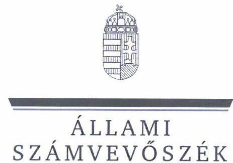
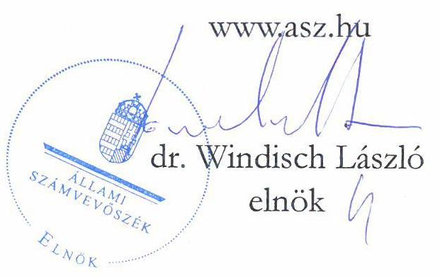
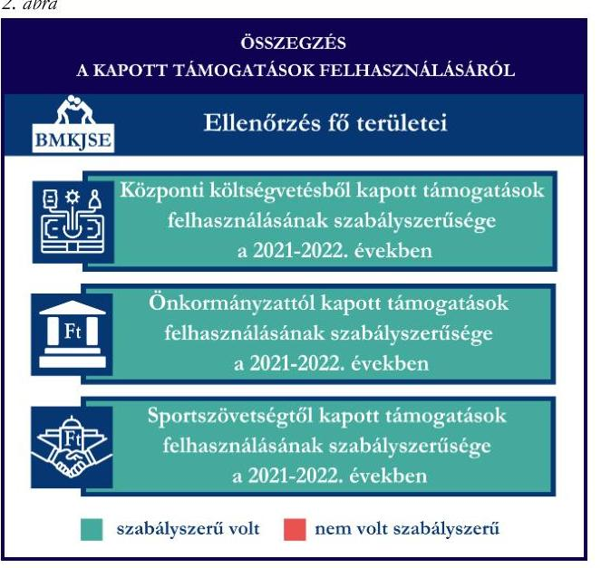
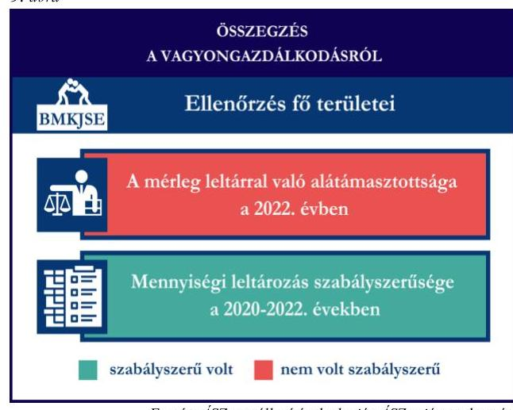

# JELENTÉS 

Támogatásban részesülő sportszövetségek és sportegyesületek gazdálkodásának ellenőrzése

Békés Megyei Kano Judo Sportegyesület

2024.

---

ÁLLAMI
SZÁMVEVŐSZÉK

# JELENTÉS 

## Támogatásban részesülő sportszövetségek és sportegyesületek gazdálkodásának ellenőrzése

Békés Megyei Kano Judo Sportegyesület

2024.

24093

---

# ELLENŐRZÉSI IGAZGATÓSÁG: 

## ÁLLAMHÁZTARTÁSON KÍVÜLI SZERVEZETEKET ELLENŐRZŐ IGAZGATÓSÁG

## ELLENŐRZÉSI IGAZGATÓ:

## KLINGA LÁSZLÓ igazgató

## ELLENŐRZÉSVEZETŐ:

Jelentéseink az interneten a www.asz.hu címen olvashatók.

## KAKAS SÁNDOR ellenőrzésvezető

IKTATÓSZÁM: EL-4060-003/2024.
TÉMASZÁM: 2682
ELLENŐRZÉS-AZONOSÍTÓ SZÁM: V1026

---

# TARTALOMJEGYZÉK 

AZ ELLENŐRZÉS ALAPADATAI ..... 5
AZ ELLENŐRZÖTT SZERVEZET ..... 7
ÖSSZEFOGLALÁS ..... 8
AZ ELLENŐRZÉS FÓKUSZKÉRDÉSEI ..... 10
MEGÁLLAPÍTÁSOK ..... 11
JAVASLATOK ..... 14
MELLÉKLETEK ..... 15
I. sz. melléklet: Értelmező szótár ..... 15
II. sz. melléklet: Az ellenőrzött szervezetek jegyzéke ..... 17
III. sz. melléklet: Ellenőrzési kritériumok ..... 18
FÜGGELÉK: ÉSZREVÉTELEK ..... 19
RÖVIDÍTÉSEK JEGYZÉKE ..... 20

---

.

---

# AZ ELLENŐRZÉS ALAPADATAI 

## AZ ELLENŐRZÉS CÉLJA

Az ellenőrzés célja az államháztartásból nyújtott támogatással, vagy az államháztartásból meghatározott célra ingyenesen juttatott vagyon felhasználásával érintett sportszövetségek és sportegyesületek gazdálkodása szabályozottságának, gazdálkodási tevékenységének, ezen belül a beszámolási kötelezettség teljesítésének, a támogatások elkülönített nyilvántartásának, valamint a támogatások felhasználásának ellenőrzése.

## AZ ELLENŐRZÉS TÍPUSA

Szabályszerüségi ellenőrzés.

## AZ ELLENŐRZÖTT IDŐSZAK

Az 1. fókuszkérdés esetében a 2022. év.
A 2. fókuszkérdés vonatkozásában a 2021-2022. évek.
A 3. fókuszkérdés vonatkozásában a 2022. év, a mennyiségi felvétellel történő leltározás dokumentumai tekintetében a 2020-2022. évek.

## AZ ELLENŐRZÉS TÁRGYA

Az ellenőrzés tárgyát képezte a támogatásban részesülő sportszövetségek, sportegyesületek gazdálkodása szabályozottságának, gazdálkodási tevékenységén belül a beszámolási kötelezettség teljesítésének, a vagyonnyilvántartásának, a támogatások elkülönített nyilvántartásának, valamint az államháztartási forrásból származó közvetlen vagy közvetett támogatások és a meghatározott célra ingyenesen juttatott vagyon felhasználásának a vizsgálata volt. Az ellenőrzés a támogatások vonatkozásában kiterjedt továbbá a támogató felé történő beszámolási és elszámolási kötelezettségek teljesítésére, az ezekkel kapcsolatos jogszabályi és belső előírások betartására.

Az ellenőrzés kiterjedt minden olyan körülményre és adatra, amely az ÁSZ ${ }^{1}$ jogszabályban meghatározott feladatainak teljesítéséhez, valamint az ellenőrzési program végrehajtása során felmerülő újabb összefüggések feltárásához szükséges.

## AZ ELLENŐRZÉS JOGALAPJA

Az ellenőrzés jogszabályi alapját az ÁSZ tv. ${ }^{2} 1 . \int(3)$ bekezdése, az 5. $\int(3)$ bekezdése, valamint a Civil tv. ${ }^{3} 47 . \int$ előírásai képezték.

---

# AZ ELLENŐRZÉS MÓDSZERE 

Az ellenőrzést a nemzetközi standardokat irányadónak tekintve az ellenőrzési program szempontjai, az ellenőrzött időszakban hatályos jogszabályok, az ellenőrzés általános szakmai szabályai, az ellenőrzésre irányadó ÁSZ módszertanok figyelembevételével végezte az ÁSZ.

Az ellenőrzési kérdések megválaszolásához szükséges bizonyítékok megszerzése az ellenőrzött szervezet által rendelkezésre bocsátott dokumentumokra, adatokra alapozva kérdésfeltevés (információkérés), interjú, mintavételezés útján történt.

Az ellenőrzési bizonyítékként felhasználható adatforrások közé tartoztak egyrészt az ellenőrzés során az ellenőrzött szervezettől bekért dokumentumok, másrészt adatforrás lehetett minden további, az ellenőrzés folyamán feltárt, az ellenőrzés szempontjából információt tartalmazó dokumentum.

A támogatásokkal, azok felhasználásával kapcsolatos kötelezettségek vizsgálatára mintavételi eljárások kerültek alkalmazásra. Támogatás-típusok szerint nagyságrend alapján 1-3 darab támogatás került részletes vizsgálat alá. Ezen támogatások felhasználásának szabályszerűsége támogatásonként kockázatértékelés alapján kiválasztott mintatételekkel került ellenőrzésre. A kiválasztott támogatási szerződésekhez kapcsolódó elszámolásokból 30-30 db mintatétel került ellenőrzésre, ahol az elszámolás nem érte el a 30 db -ot, ott tételes ellenőrzésre került sor. Ezen felül a vagyongazdálkodás szabályszerűségének ellenőrzéséhez is kockázatalapú mintavétel kapcsolódott. A támogatások felhasználása és a vagyongazdálkodás területén a minták ellenőrzése kiterjedt a könyvvezetési kötelezettség vizsgálatára is. A tárgyi eszközök tekintetében 30 db került kiválasztásra a 2022. évben állományban lévő eszközök közül azok nyilvántartásának, elszámolásának szabályszerűsége ellenőrzése céljából. A kiválasztott mintatételek ellenőrzésének eredménye nem került kivetítésre a teljes sokaságra, a megállapítások az adott ellenőrzött mintatételek vonatkozásában kerültek megjelenítésre.

---

# AZ ELLENŐRZÖTT SZERVEZET 

A Békés Megyei Kano Judo Sportegyesületet 2001. szeptember 4-én alapították. Az Alapszabály szerinti célja a küzdősportok, ezen belül a judo „Békés Megvében történő népszerüsitése, a sportág tömegsport szintü müvelésének támogatása, szervezése, az utánpótlás-nevelésen keresztül az ifjúság egészséges életmódra történő nevelésének támogatása. Feladata a sportág sportéletének fejlesztése, a rendszeresen sportolók számának növelése, a sportversenyeken és egyéb sportrendezvényeken a megye képviselete".

A BMKJSE ${ }^{4}$ jogszabályi előírás alapján könyvvizsgálatra és felügyelőbizottság, felügyelő szerv létrehozására nem volt kötelezett. A BMKJSE az $\mathrm{OBH}^{5}$ nyilvántartás adatai alapján az ellenőrzött időszakban közhasznú jogállással rendelkező szervezet volt. Vállalkozási tevékenységet az ellenőrzött időszakban nem végzett.

A BMKJSE által az ellenőrzött időszakban igénybe vett támogatásokat az 1. táblázat mutatja be. 1. táblázat

## A BMKJSE ÁLTAL IGÉNYBE VETT TÁMOGATÁSOK (ADATOK M FT-BAN)

|  | 2021. EV | 2022. EV |
| :-- | :--: | :--: |
| Központi költségvetési támogatás | 0,7 | 1,7 |
| Helyi önkormányzati támogatás | 4,4 | 2,3 |
| Magyar Judo Szövetségtől kapott támogatás | 7,1 | 4,5 |

Forrás: Az ellenőrzött szervezet ellenőrzési dokumentumai alapján ÁSZ saját szerkesztés

---

# ÖSSZEFOGLALÁS 

Magyarország Alaptörvényének XX. cikke kimondja, hogy mindenkinek joga van a testi és lelki egészséghez, melynek érvényesülését Magyarország többek között a sportolás és a rendszeres testedzés támogatásával segíti elő. Az Országgyűlés a Sport tv. ${ }^{6}$-ben kinyilvánította, hogy a nemzet közössége a test művelését, a sportot, a nemzet alapértékének, kívánatos célnak tekinti. A sport a közjó része. Erősíti a közösség tagjainak egymáshoz tartozását, miként az egyén testi és lelki egészségét.

A sportegyesületek, sportszövetségek múködésükre és szakmai tevékenységük ellátására költségvetési támogatásban, önkormányzati támogatásban, ingyenes vagyonjuttatásban, valamint látvány-csapatsport támogatásban részesülhetnek, amelyekre fokozott figyelem irányul.

A társadalom részéről jogosan felmerülő elvárás, hogy a közpénzeket kezelő, azzal gazdálkodó szervezetek működéséről, tevékenységéről átfogó képet kapjon, a közpénzek rendeltetésszerű és átlátható módon történő felhasználásának értékelésére időről-időre sor kerüljön az ellenőrzések keretében.

A gazdálkodási szabályok kialakítása, a könyvvezetési- és beszámolási kötelezettség teljesítése a 2022. évben a BMKJSE tekintetében szabályszerű volt.

A BMKJSE a könyvviteli szolgáltatás személyi feltételeinek megteremtéséről gondoskodott. A jogszabályi előírások szerint a BMKJSE kialakította a számviteli politikáját, valamint elkészítette számviteli szabályzatait, továbbá rendelkezett számlarenddel. A pénzkezelési szabályzat tekintetében tartalmi hiányosságokat tárt fel az ellenőrzés.

A könyvvezetés formája a 2022. évben megfelelt a jogszabályi előírásoknak. A BMKJSE a jogszabályoknak megfelelően teljesítette a számviteli beszámoló- és közhasznúsági melléklet készítési- és közzétételi kötelezettségét.

A gazdálkodás szervezeti keretei kialakításának, a számviteli szabályzatok megalkotásának, valamint a
számviteli beszámoló elkészítésének és közzétételének értékelését az 1. ábra mutatja be.

---

A BMKJSE a központi költségvetésből, az önkormányzattól, valamint a központi költségvetésből a sportszövetségen keresztül nyújtott támogatásokat a 2021-2022. években az ellenőrzött tételek esetében a támogatási célnak megfelelően, szabályszerűen használta fel.

A kapott támogatások felhasználásának értékelését a 2. ábra mutatja be.

A BMKJSE vagyongazdálkodása a beszámoló leltárral való alátámasztottsága, a tárgyi eszközök üzembe helyezése és értékcsökkenésük elszámolása tekintetében, az ellenőrzött tételek esetében a 2022. évben nem volt szabályszerű, mert a 2022. évi egyszerűsített éves beszámolójának mérlegtételeit a jogszabályi előírással ellentétben nem támasztotta alá szabályszerű, teljes körű leltárral, a főkönyvi könyvelés és az analitikus nyilvántartások adatai közötti egyeztetést a 2022. év mérlegfordulónapjára vonatkozóan nem teljeskörűen végezte el. A BMKJSE a mennyiségi felvétellel történő leltározást a 2022. évre elvégezte.

A vagyongazdálkodás értékelését a 3. ábra mutatja be.

---

# AZ ELLENŐRZÉS FÓKUSZKÉRDÉSEI 

1. A gazdálkodási szabályok kialakítása, a könyvvezetési- és beszámolási kötelezettség teljesítése szabályszerű volt-e?
2. A kapott támogatások felhasználása szabályszerű volt-e?
3. Az ellenőrzött szervezet vagyongazdálkodása szabályszerű volt-e?

---

# MEGÁLLAPÍTÁSOK 

## 1. A gazdálkodási szabályok kialakítása, a könyvvezetési- és beszámolási kötelezettség teljesítése szabályszerű volt-e?

Összegző megállapítás A BMKJSE a 2022. évben a szabályszerű gazdálkodás feltételeit megteremtette, azonban a pénzkezelési szabályzat tekintetében az ellenőrzés hiányosságot tárt fel. A BMKJSE a könyvvezetési- és beszámolási kötelezettségét szabályszerűen teljesítette.

A 2022. évben a BMKJSE a Számv. tv. és a Civilszr. ${ }^{7}$-ben foglalt előírások betartásával gondoskodott a könyvviteli szolgáltatás személyi feltételeinek megteremtéséről, a könyvviteli szolgáltatás körébe tartozó feladatok ellátásával megbízott személy megfelelt a jogszabályi előírásoknak.
A BMKJSE a 2022. évben rendelkezett a Számv. tv.-ben előírt számviteli politikával, az eszközök és a források értékelési szabályzatával, pénzkezelési szabályzattal ${ }^{8}$, az eszközök és a források leltárkészítési és leltározási szabályzatával, amelyek - a pénzkezelési szabályzat kivételével - az ellenőrzött tartalmi kritériumoknak megfeleltek. A BMKJSE pénzkezelési szabályzata a Számv. tv. 14. § (8) bekezdésében előírtak ellenére nem tartalmazta a napi készpénz záró állomány maximális mértékét, továbbá a készpénzállomány ellenőrzésekor követendő eljárást és az ellenőrzés gyakoriságát.
A BMKJSE a Számv. tv. szerint a számlarendet elkészítette.
A BMKJSE a Civilszr. előírásainak megfelelően kettős könyvvitelt vezetett a 2022. évben. A könyvviteli nyilvántartásait a Számv. tv. és a Civilszr. rendelkezéseinek megfelelően úgy alakította ki, hogy az éves egyszerűsített beszámolóban az egyéb bevételeken belül a kapott támogatások összegét részletezni tudta. A jogszabályi előírásoknak megfelelő formában egyszerűsített éves beszámolóját elkészítette a 2022. évre vonatkozóan. A Civil tv.-nek megfelelően a beszámolóval egyidejűleg a Civil vhr. ${ }^{9}$ melléklete szerinti tartalommal elkészítette a közhasznúsági mellékletet.
A 2022. évi egyszerűsített éves beszámolót a szervezet közgyűlése a Civil tv.-nek megfelelően jóváhagyta. A BMKJSE a 2022. évi egyszerűsített éves beszámolóját, valamint közhasznúsági mellékletét a Civil tv.nek megfelelően letétbe helyezte és közzétette.

## 2. A kapott támogatások felhasználása szabályszerű volt-e?

## Összegző megállapítás A BMKJSE a 2021. és 2022. években a judo szakosztályára vonatkozóan kapott támogatásokat szabályszerűen használta fel.

A BMKJSE a központi költségvetésből kapott támogatás bevételeit a Civil tv. előírásai alapján elkülönítetten mutatta ki a könyveiben, a Civil tv. rendelkezéseinek megfelelően a központi költségvetésből részére juttatott támogatások felhasználásáról rendelkezett a támogatások felhasználásának elkülönített számviteli nyilvántartásával. A támogatás felhasználásáról a támogató felé

---

benyújtott beszámolót és annak részeként az összesített elszámolási táblázatot a támogatási szerződésekben előírt formában és tartalommal elkészítette.
A BMKJSE a 2021. és 2022. évben a helyi önkormányzattól kapott sportcélú támogatásokat a Civil tv. előírásai szerint elkülönítetten mutatta ki a könyveiben, a Civil tv. rendelkezéseinek megfelelően a kapott támogatások felhasználásáról elkülönített számviteli nyilvántartást vezetett. A BMKJSE a beszámolási kötelezettségét a támogatás rendeltetésszerű felhasználásáról az Ábt. ${ }^{10}$-nak megfelelően teljesítette a helyi önkormányzat felé.
A BMKJSE a 2021. és 2022. évi az MJSZ ${ }^{11}$-en keresztül számára juttatott támogatások bevételeit a Civil tv. előírásai alapján elkülönítetten mutatta ki a könyveiben, a Civil tv. rendelkezéseinek megfelelően a kapott támogatások felhasználásáról elkülönített számviteli nyilvántartást vezetetett. A támogatás felhasználásáról az MJSZ felé benyújtott beszámolót és annak részeként az összesített elszámolási táblázatot a támogatási szerződésekben előírt formában és tartalommal elkészítette.
A támogatók felé benyújtott elszámolásokat alátámasztó számviteli bizonylatok a Számv. tv.-ben foglalt alaki és tartalmi követelményeknek megfeleltek, a központi költségvetésből, valamint az MJSZ-en keresztül kapott sportcélú támogatások esetén a benyújtott számlák a 474/2016. (XII. 27.) Korm. rendeletben ${ }^{12}$ előírtaknak megfelelően záradékolásra kerültek.
Közhasznú szervezetként a Civil tv. 29. § (4) bekezdésében előírtak ellenére a 2021. és 2022. évi egyszerűsített éves beszámolóinak kiegészítő mellékletében nem mutatta be a támogatási program keretében végleges jelleggel felhasznált összegeket támogatásonként.

# 3. Az ellenőrzött szervezet vagyongazdálkodása szabályszerű volt-e? 

Összegző megállapítás A BMKJSE vagyongazdálkodása nem volt szabályszerű, mert a 2022. évi egyszerúsített éves beszámolójának mérlegtételeit a jogszabályi előírással ellentétben nem támasztotta alá szabályszerű, teljes körű leltárral, továbbá a tárgyi eszközök üzembe helyezése és értékcsökkenésük elszámolása az ellenőrzött tételek esetében nem volt szabályszerű a 2022. évben. A fökönyvi könyvelés és az analitikus nyilvántartások adatai közötti egyeztetést a 2022. év mérlegfordulónapjára vonatkozóan nem teljeskörűen végezte el.

A BMKJSE a 2022. évi egyszerűsített éves beszámolója mérlegtételeinek alátámasztásához a Számv. tv. 69. § (1) bekezdésében előírtak ellenére nem állított össze olyan leltárat, amely tételesen és ellenőrizhető módon tartalmazta a BMKJSE mérleg fordulónapján meglévő eszközeit és forrásait mennyiségben és értékben, mert a követelések, saját tőke és kötelezettségek mérlegsor esetében nem készült leltár. A BMKJSE a Számv. tv. 69. § (2) bekezdésében előírtak ellenére a főkönyvi könyvelés és az analitikus nyilvántartások adatai közötti egyeztetést a 2022. év mérlegfordulónapjára vonatkozóan a követelések, kötelezettségek és saját tőke mérlegtételek esetében nem végezte el.
A BMKJSE a 2022. évben a tárgyi eszközök állományát a Számv. tv. előírása szerint mennyiségi felvétellel leltározta.
A BMKJSE esetében a tárgyi eszköz mintatételek ellenőrzése során az alábbiak kerültek megállapításra:

---

- a könyvviteli elszámolást alátámasztó számviteli bizonylatok - tizenhat mintatétel kivételével - a Számv. tv.-nek megfelelően rendelkezésre álltak. Tizenhat nullára leírt tárgyi eszköz esetében a Számv. tv. 47. § (1) bekezdése szerinti bekerülési értékét a Számv. tv. 169. § (2) bekezdésében foglaltak ellenére bizonylattal nem támasztotta alá;
- a számviteli bizonylatokkal alátámasztott mintatételek esetén a bekerülési értékeket a Számv. tv.ben előírtaknak megfelelően határozta meg;
- a tárgyi eszközök számviteli besorolása a számviteli bizonylatokkal alátámasztott mintatételek esetén megfelelt a Számv. tv. előírásainak;
- az üzembe helyezés tényét és időpontját a harminc tárgyi eszköz esetében a Számv. tv. 52. § (2) bekezdésében előírtak ellenére hitelt érdemlően nem dokumentálta;
- a tárgyévi értékcsökkenés elszámolása a harminc tárgyi eszköz esetén az üzembe helyezés hitelt érdemlő módon történő dokumentálásának, továbbá az eszköznyilvántartó lapok hiányában nem volt ellenőrizhető.

---

# JAVASLATOK 

Az ÁSZ tv. 33. § (1) bekezdésében foglaltak értelmében az ellenőrzött szervezet vezetője köteles a jelentésben foglalt megállapításokhoz kapcsolódó intézkedési tervet összeállítani és azt a jelentés kézhezvételétől számított 30 napon belül az ÁSZ részére megküldeni. Amennyiben az ellenőrzött szervezet vezetője nem küldi meg határidőben az intézkedési tervet, vagy továbbra sem elfogadható intézkedési tervet küld, az Állami Számvevőszék elnöke az ÁSZ tv. 33. § (3) bekezdése a) és b) pontjaiban foglaltakat érvényesítheti.

## A BÉKÉS MEGYEI KANO JUDO SPORTEGYESÜLET ELNÖKÉNEK

1. Gondoskodjon a pénzkezelési szabályzat Számv. tv. 14. § (8) bekezdésben elöirtaknak megfelelő tartalommal való elkészitéséről.
2. Gondoskodjon arról, hogy a Civil tv. 29. § (4) bekezdésében foglaltaknak megfelelően a támogatási program keretében végleges jelleggel kapott és elszámolt összegek, továbbá az elvégzett tevékenységek és programok kerüljenek bemutatásra a kiegészítő mellékletben.
3. Gondoskodjon a beszámoló mérlegtételeinek leltárral történő alátámasztásáról a Számv. tv. 69. § (1) bekezdésében elöirtaknak megfelelően.
4. Gondoskodjon a tárgyi eszközök esetében a bekerülési érték bizonylattal történő alátámasztásáról a Számv. tv. 169. § (2) bekezdésében elöirtak szerint.
5. Gondoskodjon a tárgyi eszközök esetében az üzembe helyezés hitelt érdemlő dokumentálásáról a Számv. tv. 52. § (2) bekezdésében foglaltaknak megfelelően.

---

# MELLÉKLETEK 

## I. SZ. MELLÉKLET: ÉRTELMEZŐ SZÓTÁR

Civil szervezet

Egyesület

Költségvetési támogatás

Közhasznú szervezet

Közhasznú tevékenység

Országos sportági szakszövetség

Sportági szövetség

A civil társaság; a Magyarországon nyilvántartásba vett egyesület a párt, a szakszervezet és a kölcsönös biztosító egyesület kivételével és - a közalapítvány és a pártalapítvány kivételével - az alapítvány. (Forrás: Civil tv. 2. §6. pont a)-c) alpontjai)
Az egyesület a tagok közös, tartós, alapszabályban meghatározott céljának folyamatos megvalósítására létesített, nyilvántartott tagsággal rendelkező jogi személy. (Forrás: Ptk. ${ }^{13}$ 3:63. § (1) bekezdés)
A Számv. tv. szempontjából egyéb szervezet. (Számv. tv. 3. § (1) bekezdés 4. pont a) alpontja)
A társadalombiztosítás pénzügyi alapjai kivételével az államháztartás központi alrendszeréből ellenérték nélkül, pénzben nyújtott támogatások. (Forrás: Áht. 1. § 14. pont)
Közhasznú szervezetté minősíthető a Magyarországon nyilvántartásba vett közhasznú tevékenységet végző szervezet, amely a társadalom és az egyén közös szükségleteinek kielégítéséhez megfelelő erőforrásokkal rendelkezik, továbbá amelynek megfelelő társadalmi támogatottsága kimutatható, és amely:
a) civil szervezet (ide nem értve a civil társaságot), vagy
b) olyan egyéb szervezet, amelyre vonatkozóan a közhasznú jogállás megszerzését törvény lehetővé teszi. (Forrás: Civil tv. 32. $\S$ (1) bekezdés)

Minden olyan tevékenység, amely a létesítő okiratban megjelölt közfeladat teljesítését közvetlenül vagy közvetve szolgálja, ezzel hozzájárulva a társadalom és az egyén közös szükségleteinek kielégítéséhez. (Forrás: Civil tv. 2. § 20. pont)
Olyan sportszövetség, amely sportágában kizárólagos jelleggel az e törvényben, valamint más jogszabályokban meghatározott feladatokat lát el és e törvényben megállapított különleges jogosítványokat gyakorol. Olyan sportágban hozható létre, amelyet vagy a Nemzetközi Olimpiai Bizottság elismert, vagy amely sportág nemzetközi szövetségét felvették a Nemzetközi Sportszövetségek Szövetségébe (GAISF). (Forrás: Sport tv. 20. § (1), (4) bekezdés)

A Civil tv. és a Ptk. előírásai alapján - a Sport tv.-ben meghatározott eltérésekkel - múködő szövetség, amelynek tagjai kizárólag sportszervezetek lehetnek. Sportági szövetség országos jelleggel is múködhet. Egy sportágban csak egy országos sportági szövetség múködhet. Törvényi feltételek teljesülése esetén szakszövetségi feladatokat is elláthat. (Forrás: Sport tv. 28. §)

---

Sportegyesület

Sportegyesületeknek, sportszövetségeknek nyújtott költségvetési támogatás

Sportszövetség

Sporttevékenység

A Civil tv. és a Ptk. szabályai szerint müködő olyan egyesület, amelynek alaptevékenysége a sporttevékenység szervezése, valamint a sporttevékenység feltételeinek megteremtése. A sportegyesületek a Sport tv. 15. § (1) bekezdésében meghatározott sportszervezetek körébe tartoznak. A sportegyesületeken kívül sportszervezet még a sportvállalkozás, a sportiskola, valamint az utánpótlás-nevelés fejlesztését végző alapítvány. (Forrás: Sport tv. 16. $\S$ (1) bekezdés)

Az állami sport célú támogatások felhasználásáról és elosztásáról szóló 474/2016. (XII. 27.) Kormány rendelet és a 27/2013. (III. 29.) EMMI rendelet ${ }^{14}$ 1. $\mathbb{S}$-ában meghatározott fejezeti kezelésű előirányzatokból nyújtott támogatás.
Meghatározott sporttevékenységek körében a sportversenyek szervezésére, a tagok érdekvédelmére és a részükre való szolgáltatásokra, valamint a nemzetközi kapcsolatok lebonyolítására létrehozott, jogi személyiséggel és önkormányzattal rendelkező, a Civil tv. és a Ptk. alapján - az e törvényben foglalt eltérésekkel - különös formában müködő egyesületek. A Sport tv. 19. § (3) bekezdése szerint a sportszövetségeknek az alábbi típusai léteznek: országos sportági szakszövetségek, sportági szövetségek, szabadidősport szövetségek, fogyatékosok sportszövetségei, diák- és egyetemifőiskolai sport sportszövetségei, nemzetközi sportszövetségek. (Forrás: Sport tv. 19. § (1), (3) bekezdés)
Meghatározott szabályok szerint, a szabadidő eltöltéseként kötetlenül vagy szervezett formában, illetve versenyszerűen végzett testedzés vagy szellemi sportágban kifejtett tevékenység, amely a fizikai erőnlét és a szellemi teljesítőképesség megtartását, fejlesztését szolgálja. (Forrás: Sport tv. 1. § (2) bekezdés)

---

# II. SZ. MELLÉKLET: AZ ELLENŐRZÖTT SZERVEZETEK JEGYZÉKE 

## ELLENŐRZÖTT SZERVEZET NEVE

Békés Megyei Kano Judo Sportegyesület

## ELLENŐRZÖTT SZERVEZET SZÉKHELYE

5600 Békéscsaba, Felső Körös sor 25/1.

---

# III. SZ. MELLÉKLET: ELLENŐRZÉSI KRITÉRIUMOK 

## FÓKUSZKÉRDÉS

## 1. fókuszkérdés:

A gazdálkodási szabályok kialakítása, a könyvvezetési és beszámolási kötelezettség teljesítése szabályszerű volt-e?

## 2. fókuszkérdés:

A kapott támogatások felhasználása szabályszerű volt-e?

## 3. fókuszkérdés:

Az ellenőrzött szervezet vagyongazdálkodása szabályszerű volt-e?

## ELLENŐRZÉSI KRITÉRIUMOK

Számv. tv. 14. § (3) bekezdés, (5) bekezdés a), b), d) pont, (8) bekezdés, 69. $\S$ (3) bekezdés, 90. $\$ (3) bekezdés c) pont, 161. $\$ \quad(1)$ bekezdés, (2) bekezdés a)-d) pont, (3)-(4) bekezdés, 161/A. $\$ 2$ bekezdés, 165. $\$ (2) bekezdés
Civilszr. 7. § (1) bekezdés, (4) bekezdés b), c) pont, 8. § (2), (3) bekezdés, 9. § (4), (5), (8) bekezdés, 12. § (4), (5) bekezdés, 15. § (1) bekezdés a), b) pont, 16. § (1) bekezdés, 24. § (2) bekezdés
Ptk. 3:26. § (1) bekezdés, 3:27. § (1) bekezdés, 3:82. § (1) bekezdés,
Civil tv. 28.§ (1) bekezdés, 29. § (2) bekezdés c) pont, (3), (6), (7) bekezdés, 30. § (1)-(4) bekezdés, 40. § (1), (2) bekezdés, 41. § (1) bekezdés
Civil vhr. melléklete
Sport tv. 23. § (1) bekezdés f) pont
Számv. tv. 44. § (2) bekezdés, 93. § (3) bekezdés, 159. §, 165. § (2) bekezdés, 167. § (1) bekezdés a), d), e), h) pont

Civil tv. 20. § (2) bekezdés a) pont, (3) bekezdés a), c) pont, (4) bekezdés, 29. § (4), (5) bekezdés
Civilszr. 24. § (2) bekezdés
27/2013. (III.29.) EMMI rend. 18. § (2) bekezdés
474/2016. (XII. 27.) Korm. rend. 22. § (2) bekezdés, 24. § (2) bekezdés
Áht. 53. §
Ptk. 3:63. § (4) bekezdés
Számv. tv. 3. § (3) bekezdés 3. pont, 15. § (3) bekezdés, 26. §, 46. $\int(3),(4)$ bekezdés, 47-51. §, 52. § (1)-(7) bekezdés, 69. § (1)-(3) bekezdés, 165. § (2) bekezdés, 169. § (2) bekezdés
Sport tv. 76/B. §, 76/C. §

---

# FÜGGELÉK: ÉSZREVÉTELEK 

A jelentéstervezetet a Számvevőszék 15 napos észrevételezésre megküldte az ellenőrzött szervezet vezetőjének az ÁSZ tv. 29. §* (1) bekezdése előírásának megfelelően.

A Békés Megyei Kano Judo Sportegyesület elnöke a jelentéstervezetre nem tett észrevételt.

[^0]
[^0]:    * 29. § (1) Az Állami Számvevőszék az ellenőrzési megállapításait megküldi az ellenőrzött szervezet vezetőjének vagy az általa megbízott személynek, és annak, akinek személyes felelősségét állapította meg.
    (2) Az ellenőrzött szervezet vezetője és a felelősként megjelölt személy az ellenőrzés megállapításaira tizenöt napon belül írásban észrevételt tehet.
    (3) Az Állami Számvevőszék az észrevételre a beérkezésétől számított harminc napon belül írásban válaszol. A figyelembe nem vett észrevételeket köteles a jelentésben feltüntetni, és megindokolni, hogy azokat miért nem fogadta el.

---

# RÖVIDÍTÉSEK JEGYZÉKE 

${ }^{1}$ ÁSZ
${ }^{2}$ ÁSZ tv.
${ }^{3}$ Civil tv.
${ }^{4}$ BMKJSE
${ }^{5} \mathrm{OBH}$
${ }^{6}$ Sport tv.
${ }^{7}$ Civilszr.
${ }^{8}$ pénzkezelési szabályzat
${ }^{9}$ Civil vhr.
${ }^{10}$ Áht.
${ }^{11}$ MJSZ
${ }^{12}$ 474/2016. (XII. 27.) Korm. rendelet
${ }^{13}$ Ptk.
${ }^{14}$ 27/2013. (III.29.) EMMI rendelet

Állami Számvevőszék
2011. évi LXVI. törvény az Állami Számvevőszékről
2011. évi CLXXV. törvény az egyesülési jogról, a közhasznú jogállásról, valamint a civil szervezetek múködéséről és támogatásáról
Békés Megyei Kano Judo Sportegyesület
Országos Bírósági Hivatal
2004. évi I. törvény a sportról

479/2016. (XII.28.) Korm. rendelet a számviteli törvény szerinti egyes egyéb szervezetek beszámoló készítési és könyvvezetési kötelezettségének sajátosságairól
Békés Megyei Kano Judo Sportegyesület Pénzkezelési Szabályzata (hatályos: 2012. január 01-jétől)
350/2011. (XII. 30.) Korm. rendelet a civil szervezetek gazdálkodása, az adománygyűjtés és a közhasznúság egyes kérdéseiről
2011. évi CXCV. törvény az államháztartásról

Magyar Judo Szövetség
474/2016. (XII. 27.) Korm. rendelet az állami sport célú támogatások felhasználásáról és elosztásáról
2013. évi V. törvény a Polgári Törvénykönyvről

27/2013. (III. 29.) EMMI rendelet az állami sport célú támogatások felhasználásáról és elosztásáról

---

1052 Budapest, Apáczai Csere János u. 10. | 1364 Budapest 4., Pf. 54
www.asz.hu | szamvevoszek@asz.hu
telefon: +36 14849100