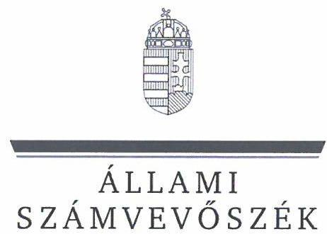
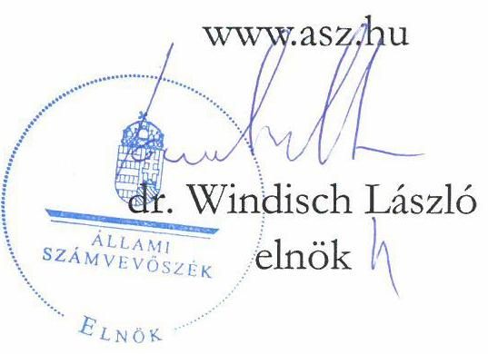
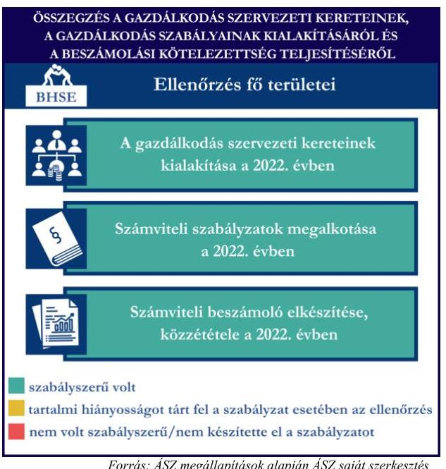
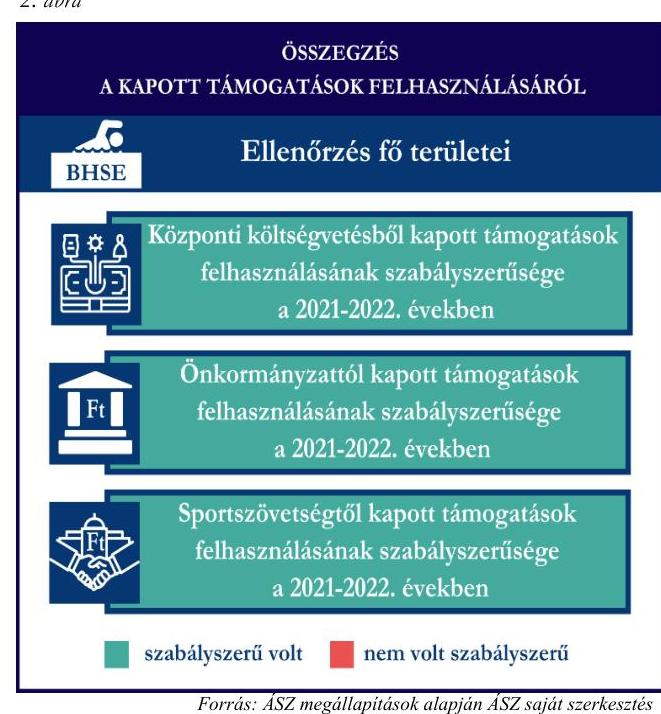
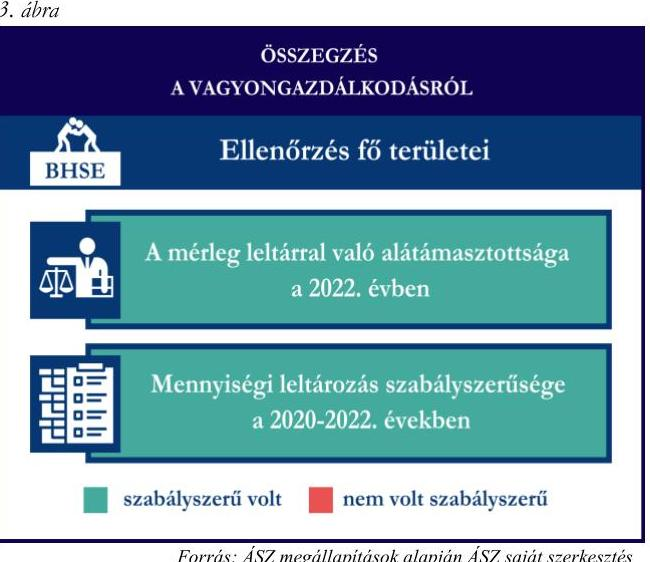

# JELENTÉS 

Támogatásban részesülő sportszövetségek és sportegyesületek gazdálkodásának ellenőrzése

Budapesti Honvéd Sportegyesület

2024.

---

ÁLLAMI
SZÁMVEVÔSZÉK

# JELENTÉS 

## Támogatásban részesülő sportszövetségek és sportegyesületek gazdálkodásának ellenőrzése

Budapesti Honvéd Sportegyesület

2024. 

24095

---

# ELLENŐRZÉSI IGAZGATÓSÁG: 

## ÁLLAMHÁZTARTÁSON KÍVÜLI SZERVEZETEKET ELLENŐRZŐ IGAZGATÓSÁG

## ELLENŐRZÉSI IGAZGATÓ:

## KLINGA LÁSZLÓ igazgató

## ELLENŐRZÉSVEZETŐ:

Jelentéseink az interneten a www.asz.hu címen olvashatók.

## KAKAS SÁNDOR ellenőrzésvezető

IKTATÓSZÁM: EL-4060-004/2024.
TÉMASZÁM: 2682
ELLENŐRZÉS-AZONOSÍTÓ SZÁM: V1026

---

# TARTALOMJEGYZÉK 

AZ ELLENŐRZÉS ALAPADATAI ..... 5
AZ ELLENŐRZÖTT SZERVEZET ..... 7
ÖSSZEFOGLALÁS ..... 8
AZ ELLENŐRZÉS FÓKUSZKÉRDÉSEI ..... 10
MEGÁLLAPÍTÁSOK ..... 11
JAVASLATOK ..... 15
MELLÉKLETEK ..... 16
I. sz. melléklet: Értelmező szótár ..... 16
II. sz. melléklet: Az ellenőrzött szervezetek jegyzéke ..... 19
III. sz. melléklet: Ellenőrzési kritériumok ..... 20
FÜGGELÉK: ÉSZREVÉTELEK ..... 21
RÖVIDÍTÉSEK JEGYZÉKE ..... 22

---

.

---

# AZ ELLENŐRZÉS ALAPADATAI 

## AZ ELLENŐRZÉS CÉLJA

Az ellenőrzés célja az államháztartásból nyújtott támogatással, vagy az államháztartásból meghatározott célra ingyenesen juttatott vagyon felhasználásával érintett sportszövetségek és sportegyesületek gazdálkodása szabályozottságának, gazdálkodási tevékenységének, ezen belül a beszámolási kötelezettség teljesítésének, a támogatások elkülönített nyilvántartásának, valamint a támogatások felhasználásának ellenőrzése.

## AZ ELLENŐRZÉS TÍPUSA

Szabályszerüségi ellenőrzés.

## AZ ELLENŐRZÖTT IDŐSZAK

Az 1. fókuszkérdés esetében a 2022. év.
A 2. fókuszkérdés vonatkozásában a 2021-2022. évek.
A 3. fókuszkérdés vonatkozásában a 2022. év, a mennyiségi felvétellel történő leltározás dokumentumai tekintetében a 2020-2022. évek.

## AZ ELLENŐRZÉS TÁRGYA

Az ellenőrzés tárgyát képezte a támogatásban részesülő sportszövetségek, sportegyesületek gazdálkodása szabályozottságának, gazdálkodási tevékenységén belül a beszámolási kötelezettség teljesítésének, a vagyonnyilvántartásának, a támogatások elkülönített nyilvántartásának, valamint az államháztartási forrásból származó közvetlen vagy közvetett támogatások és a meghatározott célra ingyenesen juttatott vagyon felhasználásának a vizsgálata. Az ellenőrzés a támogatások vonatkozásában kiterjedt továbbá a támogató felé történő beszámolási és elszámolási kötelezettségek teljesítésére, az ezekkel kapcsolatos jogszabályi és belső előírások betartására.

Az ellenőrzés kiterjedt minden olyan körülményre és adatra, amely az ÁSZ ${ }^{1}$ jogszabályban meghatározott feladatainak teljesítéséhez, valamint az ellenőrzési program végrehajtása során felmerülő újabb összefüggések feltárásához szükséges. Az ellenőrzés az 1. és 3. fókuszkérdések esetében az ellenőrzött szervezet egészére, a 2. fókuszkérdés esetén kizárólag a judo és az úszás szakágra vonatkozóan került végrehajtásra.

## AZ ELLENŐRZÉS JOGALAPJA

Az ellenőrzés jogszabályi alapját az ÁSZ tv. ${ }^{2} 1 . \int(3)$ bekezdése, az 5. $\int(3)$ bekezdése, valamint a Civil tv. ${ }^{3} 47 . \int$ előírásai képezték.

---

# AZ ELLENŐRZÉS MÓDSZERE 

Az ellenőrzést a nemzetközi standardokat irányadónak tekintve az ellenőrzési program szempontjai, az ellenőrzött időszakban hatályos jogszabályok, az ellenőrzés általános szakmai szabályai, az ellenőrzésre irányadó ÁSZ módszertanok figyelembevételével végezte az ÁSZ.

Az ellenőrzési kérdések megválaszolásához szükséges bizonyítékok megszerzése az ellenőrzött szervezet által rendelkezésre bocsátott dokumentumokra, adatokra alapozva kérdésfeltevés (információkérés), interjú, mintavételezés útján történt.

Az ellenőrzési bizonyítékként felhasználható adatforrások közé tartoztak egyrészt az ellenőrzés során az ellenőrzött szervezettől bekért dokumentumok, másrészt adatforrás lehetett minden további, az ellenőrzés folyamán feltárt, az ellenőrzés szempontjából információt tartalmazó dokumentum.

A támogatásokkal, azok felhasználásával kapcsolatos kötelezettségek vizsgálatára mintavételi eljárások kerültek alkalmazásra. Támogatás-típusok szerint nagyságrend alapján 1-3 darab támogatás került részletes vizsgálat alá. Ezen támogatások felhasználásának szabályszerűsége támogatásonként kockázatértékelés alapján kiválasztott mintatételekkel került ellenőrzésre. A kiválasztott támogatási szerződésekhez kapcsolódó elszámolásokból 30-30 db mintatétel került ellenőrzésre, ahol az elszámolás nem érte el a 30 db -ot, ott tételes ellenőrzésre került sor. Ezen felül a vagyongazdálkodás szabályszerűségének ellenőrzéséhez is kockázatalapú mintavétel kapcsolódott. A támogatások felhasználása és a vagyongazdálkodás területén a minták ellenőrzése kiterjedt a könyvvezetési kötelezettség vizsgálatára is. A tárgyi eszközök tekintetében 30 db került kiválasztásra a 2022. évben állományban lévő eszközök közül azok nyilvántartásának, elszámolásának szabályszerűsége ellenőrzése céljából. A kiválasztott mintatételek ellenőrzésének eredménye nem került kivetítésre a teljes sokaságra, a megállapítások az adott ellenőrzött mintatételek vonatkozásában kerültek megjelenítésre.

---

# AZ ELLENŐRZÖTT SZERVEZET 

Az 1949-ben alapított Budapesti Honvéd Sportegyesület alaptevékenysége sporttevékenység szervezése, valamint a sporttevékenység feltételeinek a megteremtése, ezen belül a sportlétesítmények használata, illetve működtetése. A BHSE ${ }^{4}$ Alapszabálya szerint tizenhét, köztük az ellenőrzött judo és úszó szakosztállyal rendelkezik.

A BHSE a jogszabályi előírás alapján az ellenőrzött időszakban könyvvizsgálatra és felügyelőbizottság létrehozására is kötelezett volt. A BHSE az ellenőrzött időszakban 3 tagú felügyelőbizottsággal rendelkezett. A 2022. évben a BHSE az alapcéljai megvalósítása érdekében vállalkozási tevékenységet is végzett. A BHSE az $\mathrm{OBH}^{5}$ nyilvántartás adatai alapján az ellenőrzött időszakban közhasznú jogállással rendelkező szervezet volt.

A BHSE által az ellenőrzött időszakban igénybe vett központi költségvetési, helyi önkormányzati támogatásokat, továbbá a judo és úszó szakosztályok vonatkozásában a szövetségektől kapott támogatásokat az 1. táblázat mutatja be.
1. táblázat

## A BHSE ÁLTAL IGÉNYBE VETT TÁMOGATÁSOK (ADATOK M FT-BAN)

|  | 2021. év | 2022. év |
| :-- | --: | --: |
| Központi költségvetési támogatás | 3241,1 | 3809,3 |
| Helyi önkormányzati támogatás | 32,4 | 9,6 |
| Magyar Judo Szövetségtől kapott támogatás | 8,4 | 5,6 |
| Magyar Úszó Szövetségtől kapott támogatás | 22,9 | 16,2 |

Forrás: Az ellenőrzött szervezet ellenőrzési dokumentumai alapján ÁSZ saját szerkezésétet

---

# ÖSSZEFOGLALÁS 

Magyarország Alaptörvényének XX. cikke kimondja, hogy mindenkinek joga van a testi és lelki egészséghez, melynek érvényesülését Magyarország többek között a sportolás és a rendszeres testedzés támogatásával segíti elő. Az Országgyűlés a Sport tv. ${ }^{6}$-ben kinyilvánította, hogy a nemzet közössége a test művelését, a sportot, a nemzet alapértékének, kívánatos célnak tekinti. A sport a közjó része. Erősíti a közösség tagjainak egymáshoz tartozását, miként az egyén testi és lelki egészségét.

A sportegyesületek, sportszövetségek múködésükre és szakmai tevékenységük ellátására költségvetési támogatásban, önkormányzati támogatásban, ingyenes vagyonjuttatásban, valamint látvány-csapatsport támogatásban részesülhetnek, amelyekre fokozott figyelem irányul.

A társadalom részéről jogosan felmerülő elvárás, hogy a közpénzeket kezelő, azzal gazdálkodó szervezetek múködéséről, tevékenységéről átfogó képet kapjon, a közpénzek rendeltetésszerű és átlátható módon történő felhasználásának értékelésére időről-időre sor kerüljön az ellenőrzések keretében.

A gazdálkodási szabályok kialakítása, a könyvvezetési és beszámolási kötelezettség teljesítése a 2022. évben a BHSE tekintetében szabályszerű volt. A BHSE a könyvviteli szolgáltatás személyi feltételeinek megteremtéséről, felügyelőbizottság létrehozásáról és működéséről gondoskodott. A 2022. évre vonatkozó éves beszámolót könyvvizsgáló felülvizsgálata. A jogszabályi előírások szerint a BHSE kialakította a számviteli politikáját, valamint elkészítette a számviteli szabályzatait, továbbá rendelkezett számlarenddel A szabályzatok az ellenőrzött jogszabályi kritériumoknak megfeleltek.

A könyvvezetés formája a 2022. évben megfelelt a jogszabályi előírásoknak. A BHSE a jogszabályoknak megfelelően teljesítette a számviteli beszámoló- és közhasznúsági melléklet készítési- és közzétételi kötelezettségét.

A gazdálkodás szervezeti keretei kialakításának, a számviteli szabályzatok megalkotásának, valamint a számviteli beszámoló elkészítésének és közzétételének értékelését az 1. ábra mutatja be.

---

A BHSE a judo- és az úszó szakosztálya részére a központi költségvetésből, az önkormányzattól, valamint a központi költségvetésből a sportszövetségeken keresztül nyújtott támogatásokat a 2021-2022. években az ellenőrzött tételek esetében a támogatási célnak megfelelően, szabályszerűen használta fel.

A kapott támogatások felhasználásának értékelését a 2. ábra mutatja be.

A BHSE vagyongazdálkodása a beszámoló leltárral való alátámasztottsága, a tárgyi eszközök üzembe helyezése és értékcsökkenésük elszámolása tekintetében, az ellenőrzött tételek esetében a 2022. évben szabályszerű volt. A 2022. évre vonatkozó éves beszámoló mérlegét leltárral alátámasztotta, azonban a követelések mérlegsor esetében nem készült leltár. A BHSE a mennyiségi felvétellel történő leltározást elvégezte. A jogszabályoknak megfelelően gondoskodott a vagyonkezelt állami vagyon kezeléséről és nyilvántartásáról, azonban a 2022. évi egyszerűsített éves beszámoló kiegészítő mellékletében a vagyonkezelésbe kapott állami vagyon értékét nem mutatta ki a jogszabályi előírás szerint.

A vagyongazdálkodás értékelését a 3. ábra mutatja be.

---

# AZ ELLENŐRZÉS FÓKUSZKÉRDÉSEI 

1. A gazdálkodási szabályok kialakítása, a könyvvezetési- és beszámolási kötelezettség teljesítése szabályszerű volt-e?
2. A kapott támogatások felhasználása szabályszerű volt-e?
3. Az ellenőrzött szervezet vagyongazdálkodása szabályszerű volt-e?

---

# MEGÁLLAPÍTÁSOK 

## 1. A gazdálkodási szabályok kialakítása, a könyvvezetési- és beszámolási kötelezettség teljesítése szabályszerű volt-e?

## Összegző megállapítás

A BHSE a 2022. évben a szabályszerű gazdálkodás feltételeit megteremtette. A BHSE könyvvezetési- és beszámolási kötelezettségét szabályszerűen teljesítette.

A 2022. évben az BHSE a Számv. tv. és a Civilszr. ${ }^{7}$-ben foglalt jogszabályi előírások betartásával gondoskodott a könyvviteli szolgáltatás személyi feltételeinek megteremtéséről, a könyvviteli szolgáltatás körébe tartozó feladatok ellátásával megbízott személy megfelelt a jogszabályi előírásoknak.
A 2022. évre vonatkozó éves beszámolóját a Civilszr. előírásainak megfelelően könyvvizsgáló felülvizsgálta.
A BHSE a Ptk. ${ }^{8}$ előírása szerint létrehozta a felügyelőbizottságot, a felügyelőbizottság tagjainak száma megfelelt a Ptk. előírásainak, közhasznú jogállására tekintettel a Civil tv.-nek megfelelően a felügyelőbizottság megállapította ügyrendjét.
A BHSE a 2022. évben rendelkezett a Számv. tv.-ben előírt számviteli politikával, az eszközök és a források értékelési szabályzatával, pénzkezelési szabályzattal, az eszközök és a források leltárkészítési és leltározási szabályzatával ${ }^{9}$, amelyek az ellenőrzött tartalmi kritériumoknak megfeleltek. A BHSE a Számv. tv. alapján a számlarendet elkészítette.
A BHSE a Civilszr. előírásainak megfelelően a 2022. évben kettős könyvvitelt vezetett. A 2022. évben a BHSE végzett vállalkozási tevékenységet, amelynek bevételeit és ráfordításait a könyvvezetése során a Civil tv.-nek megfelelően az alaptevékenységtől elkülönítetten tartotta nyilván és mutatta ki beszámolójában.
A könyvviteli nyilvántartásait a Számv. tv. és a Civilszr. rendelkezéseinek megfelelően úgy alakította ki, hogy a beszámolóban az egyéb bevételeken belül a kapott támogatások összegét részletezni tudta.
A jogszabályi előírásoknak megfelelő formában készítette el éves beszámolóját a 2022. évre vonatkozóan. A BHSE a Civil tv.-nek megfelelően a beszámolóval egyidejűleg a Civil vhr. ${ }^{10}$ melléklete szerinti tartalommal elkészítette a közhasznúsági mellékletet.
A BHSE esetében a 2022. évre vonatkozó éves beszámolót a Civilszr. előírása alapján könyvvizsgáló felülvizsgálta, a felügyelőbizottság véleményezte, a Civil tv.-nek megfelelően a szervezet közgyűlése jóváhagyta, a könyvvizsgálói záradék a beszámoló közgyűlés általi megtárgyalásakor rendelkezésre állt.
A BHSE a 2022. évre vonatkozó éves beszámolóját, valamint közhasznúsági mellékletét a Civil tv.-nek megfelelően letétbe helyezte és közzé tette.

---

# 2. A kapott támogatások felhasználása szabályszerű volt-e? 

## 2.1. Összegző megállapítás A BHSE a 2021. és 2022. években a judo szakosztályára vonatkozóan kapott támogatásokat szabályszerűen használta fel.

A BHSE a központi költségvetésből kapott támogatások bevételeit a Civil tv. előírásai alapján elkülönítetten mutatta ki a könyveiben, a Civil tv. rendelkezéseinek megfelelően a központi költségvetésből részére juttatott támogatás felhasználását elkülönítetten tartotta nyilván. A támogatás felhasználásáról a támogató felé benyújtott beszámolót és annak részeként az összesített elszámolási táblázatot a támogatási szerződésekben előírt formában és tartalommal elkészítette.
A BHSE a 2021. és 2022. évi könyvvezetése során elkülönítetten mutatta ki az önkormányzati támogatásokat a judo szakosztályra vonatkozóan, a Civil tv.-nek megfelelően a támogatások felhasználását elkülönítetten tartotta nyilván. Az Áht. ${ }^{11}$-nak megfelelően teljesítette beszámolási kötelezettségét a támogatás rendeltetésszerű felhasználásáról a helyi önkormányzat felé.
A BHSE a 2021. és 2022. évi könyvvezetése során az MJSZ ${ }^{12}$-en keresztül számára juttatott támogatások bevételeit a Civil. tv. és a Számv. tv. előírásainak megfelelően elkülönítetten mutatta ki a könyveiben, a Civil tv. rendelkezéseinek megfelelően a kapott támogatások felhasználásáról elkülönített számviteli nyilvántartást vezetett. A támogatás felhasználásáról az MJSZ felé benyújtott beszámolót és annak részeként az összesített elszámolási táblázatot a támogatási szerződésekben előírt formában és tartalommal elkészítette.
A támogatók felé benyújtott elszámolásokat alátámasztó számviteli bizonylatok a Számv. tv.-ben foglalt alaki és tartalmi követelményeknek megfeleltek, a központi költségvetésből, valamint az MJSZ-en keresztül kapott sportcélú támogatások esetén a benyújtott számlákat a 474/2016. (XII. 27.) Korm. rendeletben ${ }^{13}$ előírtaknak megfelelően záradékolta.
Közhasznú szervezetként a Számv. tv. és a Civil tv. rendelkezéseinek megfelelően a 2021. és 2022. évekre vonatkozó éves beszámolójának kiegészítő mellékletében bemutatta a támogatási program keretében végleges jelleggel felhasznált összegeket támogatásonként és az üzleti évben végzett főbb tevékenységeket és programokat.

---

# 2.2. Összegző megállapítás A BHSE a 2021. és 2022. években az úszó szakosztályára vonatkozóan kapott támogatásokat szabályszerűen használta fel. 

A BHSE az ellenőrzött támogatási szerződésekben foglaltak alapján, a központi költségvetésből kapott támogatás bevételeit a Civil tv. előírásai alapján elkülönítetten mutatta ki a könyveiben, a Civil tv.-ben előírtaknak megfelelően a központi költségvetésből részére juttatott támogatás felhasználásáról rendelkezett a támogatás felhasználásának elkülönített számviteli nyilvántartásával. A támogatás felhasználásáról a támogató által előírt formában és tartalommal elkészítette a beszámolókat és az összesített elszámolási táblázatokkal együtt a támogatási szerződésekben foglaltak alapján benyújtotta a támogatónak.
A Számv. tv., valamint a Civil tv. előírásainak megfelelően a BHSE az ellenőrzött támogatási szerződésekben meghatározott önkormányzati támogatási bevételeket és azok felhasználását a 2021-2022. években elkülönítetten mutatta ki a számviteli nyilvántartásában. A BHSE az Áht.-ban foglalt előírások alapján teljesítette a beszámolási kötelezettségét az önkormányzati támogatás rendeltetésszerű felhasználásáról
2021-2022. években.
A BHSE az MÚSZ ${ }^{14}$-on keresztül számára jutatott támogatások bevételeit és annak felhasználását a 2021-2022. években a Civil. tv. előírásainak megfelelően a számviteli rendszerében elkülönítetten tartotta nyilván. A támogatás felhasználásáról az MÚSZ felé benyújtott beszámolót és annak részeként az összesített elszámolási táblázatot a támogatási szerződésekben előírt formában és tartalommal elkészítette.
A támogatók felé benyújtott elszámolásokat alátámasztó számviteli bizonylatok a Számv. tv.-ben foglalt alaki és tartalmi követelményeknek megfeleltek, a központi költségvetésből, valamint az MÚSZ-on keresztül kapott sportcélú támogatások esetén a benyújtott számlák a 474/2016. (XII. 27.) Korm. rendeletben előírtaknak megfelelően záradékolásra kerültek.

## 3. Az ellenőrzött szervezet vagyongazdálkodása szabályszerű volt-e?

## Összegző megállapítás A BHSE a 2022. évi éves beszámoló mérlegtételeit a követelések kivételével leltárral alátámasztotta, a mennyiségi felvétellel történő leltározást elvégezte.

A BHSE a 2022. évre vonatkozó éves beszámolójának mérlegtételeit a Számv. tv. alapján - a követeléseket kivéve - leltárral alátámasztotta. A Számv. tv. 69. § (1)-(2) bekezdésében foglaltak ellenére 2022. évben a BHSE a követeléseket leltárral nem támasztotta alá, a könyvviteli nyilvántartásában és azzal összhangban az éves beszámolójában szereplő követelések összege magasabb volt, mint a számviteli bizonylatok adatai alapján számított összeg (az eltérés 1,6 M Ft).
A BHSE a Számv. tv.-nek megfelelően a 2022. évre vonatkozóan a mennyiségi felvétellel történő leltározást elvégezte.
A BHSE esetében a tárgyi eszköz mintatételek ellenőrzése során az ellenőrzés az alábbiakat állapította meg:

- a könyvviteli elszámolást alátámasztó számviteli bizonylatok a Számv. tv.-nek megfelelően rendelkezésre álltak,

---

- a számviteli bizonylatokkal alátámasztott mintatételek esetén a bekerülési értékeket a Számv. tv.ben előírtaknak megfelelően határozta meg,
- a tárgyi eszközök számviteli besorolása megfelelt a Számv. tv. előírásainak;
- az üzembe helyezés tényét és időpontját a Számv. tv.-nek megfelelően hitelt érdemlően dokumentálta;
- az értékcsökkenés elszámolása a Számv. tv.-nek megfelelően történt.

A BHSE a Vtv. vhr. ${ }^{15}$-nek megfelelően a rábízott állami vagyonról olyan elkülönített nyilvántartást vezetett, amely tételesen tartalmazta a vagyonkezelt eszközök könyv szerinti bruttó és nettó értékét, az elszámolt terv szerinti és terven felüli értékcsökkenés összegét és az értékben bekövetkezett egyéb változásokat.
A BHSE a 2022. évben a vagyonkezelt eszközeit a Vtv. vhr. előírásai alapján az előírt tartalmú nyilvántartás vezetésével a saját eszközeitől elkülönítetten kezelte.
A BHSE a Számv. tv. 23. § (2) bekezdésében foglaltak ellenére a 2022. évben a számviteli beszámoló részét képező kiegészítő mellékletben a vagyonkezelt eszközöket külön nem mutatta be.
A BHSE az ellenőrzött vagyonkezelt eszközök hasznosítására vonatkozó, 2022. évben hatályos szerződést az Nvtv. ${ }^{16}$ előírásai alapján átlátható szervezettel kötötte meg. A BHSE a vagyon hasznosításával kapcsolatos bérleti szerződésekben az Nvtv. előírásai alapján határozta meg a bérleti szerződés időtartamát, a szerződés tartalmazta az Nvtv. által előírt nyilatkozatokat a beszámolási, nyilvántartási, adatszolgáltatási kötelezettségek teljesítéséről, a célnak megfelelő használatról, valamint a hasznosításban résztvevő harmadik félről.

---

# JAVASLATOK 

Az ÁSZ tv. 33. § (1) bekezdésében foglaltak értelmében az ellenőrzött szervezet vezetője köteles a jelentésben foglalt megállapításokhoz kapcsolódó intézkedési tervet összeállítani és azt a jelentés kézhezvételétől számított 30 napon belül az ÁSZ részére megküldeni. Amennyiben az ellenőrzött szervezet vezetője nem küldi meg határidőben az intézkedési tervet, vagy továbbra sem elfogadható intézkedési tervet küld, az Állami Számvevőszék elnöke az ÁSZ tv. 33. § (3) bekezdése a) és b) pontjaiban foglaltakat érvényesítheti.

## A BUDAPESTI HONVÉD SPORTEGYESÜLET ELNÖKÉNEK

1. Gondoskodjon a beszámoló mérlegtételeinek teljeskörü leltárral való alátámasztásáról a Számv. tv. 69. § (1)-(2) bekezdésében, valamint a leltározási szabályzatban elöirtaknak megfelelően.
2. Gondoskodjon arról, hogy a vagyonkezelt eszközök a Számv. tv. 23. § (2) bekezdésében elöirtak szerint a kiegészítő mellékletben külön bemutatásra kerüljenek.

---

# MELLÉKLETEK 

I. SZ. MELLÉKLET: ÉRTELMEZŐ SZÓTÁR

Civil szervezet

Egyesület

Költségvetési támogatás

Közhasznú szervezet

Közhasznú tevékenység

Országos sportági szakszövetség

Sportági szövetség

A civil társaság; a Magyarországon nyilvántartásba vett egyesület a párt, a szakszervezet és a kölcsönös biztosító egyesület kivételével és - a közalapítvány és a pártalapítvány kivételével - az alapítvány. (Forrás: Civil tv. 2. §6. pont a)-c) alpontjai)
Az egyesület a tagok közös, tartós, alapszabályban meghatározott céljának folyamatos megvalósítására létesített, nyilvántartott tagsággal rendelkező jogi személy. (Forrás: Ptk. 3:63. § (1) bekezdés)

A Számv. tv. szempontjából egyéb szervezet. (Számv. tv. 3. § (1) bekezdés 4. pont a) alpontja)
A társadalombiztosítás pénzügyi alapjai kivételével az államháztartás központi alrendszeréből ellenérték nélkül, pénzben nyújtott támogatások. (Forrás: Áht. 1. § 14. pont)
Közhasznú szervezetté minősíthető a Magyarországon nyilvántartásba vett közhasznú tevékenységet végző szervezet, amely a társadalom és az egyén közös szükségleteinek kielégítéséhez megfelelő erőforrásokkal rendelkezik, továbbá amelynek megfelelő társadalmi támogatottsága kimutatható, és amely:
a) civil szervezet (ide nem értve a civil társaságot), vagy
b) olyan egyéb szervezet, amelyre vonatkozóan a közhasznú jogállás megszerzését törvény lehetővé teszi. (Forrás: Civil tv. 32. $\$ 1$ (1) bekezdés)

Minden olyan tevékenység, amely a létesítő okiratban megjelölt közfeladat teljesítését közvetlenül vagy közvetve szolgálja, ezzel hozzájárulva a társadalom és az egyén közös szükségleteinek kielégítéséhez. (Forrás: Civil tv. 2. § 20. pont)
Olyan sportszövetség, amely sportágában kizárólagos jelleggel az e törvényben, valamint más jogszabályokban meghatározott feladatokat lát el és e törvényben megállapított különleges jogosítványokat gyakorol. Olyan sportágban hozható létre, amelyet vagy a Nemzetközi Olimpiai Bizottság elismert, vagy amely sportág nemzetközi szövetségét felvették a Nemzetközi Sportszövetségek Szövetségébe (GAISF). (Forrás: Sport tv. 20. § (1), (4) bekezdés)
A Civil tv. és a Ptk. előírásai alapján - a Sport tv.-ben meghatározott eltérésekkel - múködő szövetség, amelynek tagjai kizárólag sportszervezetek lehetnek. Sportági szövetség országos jelleggel is múködhet. Egy sportágban csak egy országos sportági szövetség múködhet. Törvényi feltételek teljesülése esetén szakszövetségi feladatokat is elláthat. (Forrás: Sport tv. 28. §)

---

Sportegyesület

Sportegyesületeknek, sportszövetségeknek nyújtott költségvetési támogatás

Sportszövetség

Sporttevékenység

Vagyongazdálkodás

Vagyonkezelő

A Civil tv. és a Ptk. szabályai szerint müködő olyan egyesület, amelynek alaptevékenysége a sporttevékenység szervezése, valamint a sporttevékenység feltételeinek megteremtése. A sportegyesületek a Sport tv. 15. § (1) bekezdésében meghatározott sportszervezetek körébe tartoznak. A sportegyesületeken kívül sportszervezet még a sportvállalkozás, a sportiskola, valamint az utánpótlás-nevelés fejlesztését végző alapítvány. (Forrás: Sport tv. 16. § (1) bekezdés)
Az állami sport célú támogatások felhasználásáról és elosztásáról szóló 474/2016. (XII. 27.) Kormány rendelet és a 27/2013. (III. 29.) EMMI rendelet ${ }^{17}$ 1. §-ában meghatározott fejezeti kezelésű előirányzatokból nyújtott támogatás.
Meghatározott sporttevékenységek körében a sportversenyek szervezésére, a tagok érdekvédelmére és a részükre való szolgáltatásokra, valamint a nemzetközi kapcsolatok lebonyolítására létrehozott, jogi személyiséggel és önkormányzattal rendelkező, a Civil tv. és a Ptk. alapján - az e törvényben foglalt eltérésekkel - különös formában müködő egyesületek. A Sport tv. 19. § (3) bekezdése szerint a sportszövetségeknek az alábbi típusai léteznek: országos sportági szakszövetségek, sportági szövetségek, szabadidősport szövetségek, fogyatékosok sportszövetségei, diák- és egyetemi-főiskolai sport sportszövetségei, nemzetközi sportszövetségek. (Forrás: Sport tv. 19. § (1), (3) bekezdés)

Meghatározott szabályok szerint, a szabadidő eltöltéseként kötetlenül vagy szervezett formában, illetve versenyszerűen végzett testedzés vagy szellemi sportágban kifejtett tevékenység, amely a fizikai erőnét és a szellemi teljesítőképesség megtartását, fejlesztését szolgálja. (Forrás: Sport tv. 1. § (2) bekezdés)
A nemzeti vagyongazdálkodás feladata a nemzeti vagyon rendeltetésének megfelelő, az állam, az önkormányzat mindenkori teherbíró képességéhez igazodó, elsődlegesen a közfeladatok ellátásához és a mindenkori társadalmi szükségletek kielégítéséhez szükséges, egységes elveken alapuló, átlátható, hatékony és költségtakarékos működtetése, értékének megőrzése, állagának védelme, értéknövelő használata, hasznosítása, gyarapítása, továbbá az állam vagy a helyi önkormányzat feladatának ellátása szempontjából feleslegessé váló vagyontárgyak elidegenítése. (Forrás: Nvtv. 7. § (2) bekezdés)
a) az állam tulajdonában álló nemzeti vagyon tekintetében:
aa) költségvetési szerv,
ab) helyi önkormányzat, nemzetiségi önkormányzat, valamint ezek társulásai,
ac) az ab) alpontban felsoroltak fenntartása vagy irányítása alá tartozó intézmény,
ad) köztestület,
ae) az állam, az aa)-ac) alpontban meghatározott személyek együtt vagy külön-külön 100\%-os tulajdonában álló gazdálkodó szervezet,
af) az ae) alpont szerinti gazdálkodó szervezet 100\%-os tulajdonában álló gazdálkodó szervezet,
ag) országos törzshálózati vasúti pályát működtető többségi állami tulajdonú gazdasági társaság,

---

ah) a törvény által kijelölt egyedileg meghatározott jogi személy;
b) a helyi önkormányzat tulajdonában álló nemzeti vagyon tekintetében:
ba) állam, helyi önkormányzat, nemzetiségi önkormányzat, helyi vagy nemzetiségi önkormányzati társulás, valamint ezek fenntartása vagy irányítása alá tartozó intézmény,
bb) költségvetési szerv,
bc) köztestület,
bd) a ba) alpontban meghatározott személyek együtt vagy különkülön $100 \%$-os tulajdonában álló gazdálkodó szervezet,
be) a bd) alpont szerinti gazdálkodó szervezet $100 \%$-os tulajdonában álló gazdálkodó szervezet.
c) az egyházi jogi személy, valamint a közfeladatot ellátó közérdekủ vagyonkezelő alapítvány és az általa fenntartott felsőoktatási intézmény a tevékenysége ellátásához szükséges nemzeti vagyon tekintetében.
(Forrás: Nvtv. 3. § (1) bekezdés 19. pont)
Vagyonkezelői jog
A vagyonkezelő köteles a vagyontárgy állagának megóvásáról, jó karbantartásáról, működtetéséről gondoskodni, jogszabályban és szerződésben előírt más kötelezettségét teljesíteni, valamint a vagyontárgyat jogszabályban vagy szerződésben meghatározott célnak megfelelően használni.
A vagyonkezelő - a központi költségvetési szervek és a kizárólag közfeladatot ellátó nem központi költségvetési szerv vagyonkezelők kivételével - köteles díjat fizetni, jogszabályban és szerződésben előírt más kötelezettségét teljesíteni, valamint a vagyontárgyat jogszabályban vagy szerződésben meghatározott célnak megfelelően használni. Amennyiben a vagyonkezelő ezen kötelezettségeinek nem tesz eleget, a tulajdonosi joggyakorló jogosult a szerződést azonnali hatállyal felmondani.
(Forrás: Vtv. ${ }^{18}$ 27. § (2), (2a) bekezdés)

---

II. SZ. MELLÉKLET: AZ ELLENŐRZÖTT SZERVEZETEK JEGYZÉKE

| ELLENŐRZÖTT SZERVEZET NEVE | ELLENŐRZÖTT SZERVEZET SZÉKHELYE |
| :-- | :-- |
| Budapesti Honvéd Sportegyesület | 1134 Budapest, Dózsa Gy. út 53. |

---

# III. SZ. MELLÉKLET: ELLENŐRZÉSI KRITÉRIUMOK 

## FÓKUSZKÉRDÉS

## 1. fókuszkérdés:

A gazdálkodási szabályok kialakítása, a könyvvezetési és beszámolási kötelezettség teljesítése szabályszerű volt-e?

## 2. fókuszkérdés:

A kapott támogatások felhasználása szabályszerű volt-e?

## 3. fókuszkérdés:

Az ellenőrzött szervezet vagyongazdálkodása szabályszerű volt-e?

## ELLENŐRZÉSI KRITÉRIUMOK

Számv. tv. 14. § (3) bekezdés, (5) bekezdés a), b), d) pont, (8) bekezdés, 69. $\S$ (3) bekezdés, 90. $\$ (3) bekezdés c) pont, 161. $\$ \quad$ (1) bekezdés, (2) bekezdés a)-d) pont, (3)-(4) bekezdés, 161/A. $\$ 2$ (2) bekezdés, 165. $\$ (2) bekezdés
Civilszr. 7. § (1) bekezdés, (4) bekezdés b), c) pont, 8. § (2), (3) bekezdés, 9. § (4), (5), (8) bekezdés, 12. § (4), (5) bekezdés, 15. § (1) bekezdés a), b) pont, 16. § (1) bekezdés, 24. § (2) bekezdés
Ptk. 3:26. § (1) bekezdés, 3:27. § (1) bekezdés, 3:82. § (1) bekezdés,
Civil tv. 28.§ (1) bekezdés, 29. § (2) bekezdés c) pont, (3), (6), (7) bekezdés, 30. § (1)-(4) bekezdés, 40. § (1), (2) bekezdés, 41. § (1) bekezdés
Civil vhr. melléklete
Sport tv. 23. § (1) bekezdés f) pont
Számv. tv. 44. § (2) bekezdés, 93. § (3) bekezdés, 159. §, 165. § (2) bekezdés, 167. § (1) bekezdés a), d), e), h) pont

Civil tv. 20. § (2) bekezdés a) pont, (3) bekezdés a), c) pont, (4) bekezdés, 29. § (4), (5) bekezdés
Civilszr. 24. § (2) bekezdés
27/2013. (III.29.) EMMI rend. 18. § (2) bekezdés
474/2016. (XII. 27.) Korm. rend. 22. § (2) bekezdés, 24. § (2) bekezdés
107/2011. (VI. 30.) Korm. rend. 9. § (9) bekezdés, 11. § (1), (2), (4), (4a), (5), (6) bekezdés, 14. § (1) bekezdés, Áht. 53. §,

Ptk. 3:63. § (4) bekezdés
Számv. tv. 3. § (3) bekezdés 3. pont, 15. § (3) bekezdés, 46. § (3), (4) bekezdés, 47-51. §, 52. § (1)-(7) bekezdés, 69. § (1)-(3) bekezdés, 165. § (2) bekezdés,
Sport tv. 76/B. §, 76/C. §
Vtv. 23. § (2)-(4) bekezdés, 27. § (2), (7)-(9) bekezdés, 20. § (4) bekezdés c) pont
Vtv. vhr. 7. § (3) bekezdés, 9. § (9) bekezdés, 9/A. § (1) bekezdés b) pont, 9/A. § (2) bekezdés, 10. § (4) bekezdés, 14. § (1), (3) bekezdés, 17. § (1) bekezdés
Nvtv. 11. § (1), (7), (8) bekezdés a) pont, (10) bekezdés, (11) bekezdés a), b), c) pont, (12), (13) bekezdés

---

# FÜGGELÉK: ÉSZREVÉTELEK 

A jelentéstervezetet a Számvevőszék 15 napos észrevételezésre megküldte az ellenőrzött szervezet vezetőjének az ÁSZ tv. 29. §* (1) bekezdése előírásának megfelelően.

A Budapesti Honvéd Sportegyesület elnöke a jelentéstervezetre nem tett észrevételt.

[^0]
[^0]:    * 29. § (1) Az Állami Számvevőszék az ellenőrzési megállapításait megküldi az ellenőrzött szervezet vezetőjének vagy az általa megbízott személynek, és annak, akinek személyes felelősségét állapította meg.
    (2) Az ellenőrzött szervezet vezetője és a felelősként megjelölt személy az ellenőrzés megállapításaira tizenöt napon belül írásban észrevételt tehet.
    (3) Az Állami Számvevőszék az észrevételre a beérkezésétől számított harminc napon belül írásban válaszol. A figyelembe nem vett észrevételeket köteles a jelentésben feltüntetni, és megindokolni, hogy azokat miért nem fogadta el.

---

# RÖVIDÍTÉSEK JEGYZÉKE 

${ }^{1}$ ÁSZ
${ }^{2}$ ÁSZ tv.
${ }^{3}$ Civil tv.
${ }^{4}$ BHSE
${ }^{5}$ OBH
${ }^{6}$ Sport tv.
${ }^{7}$ Civilszr.
${ }^{8}$ Ptk.
${ }^{9}$ eszközök és a források leltárkészítési és leltározási szabályzata
${ }^{10}$ Civil vhr.
${ }^{11}$ Áht.
${ }^{12}$ MJSZ
${ }^{13}$ 474/2016. (XII. 27.) Korm. rendelet
${ }^{14}$ MÚSZ
${ }^{15}$ Vtv. vhr.
${ }^{16}$ Nvtv.
${ }^{17}$ 27/2013. (III.29.) EMMI rendelet
${ }^{18}$ Vtv.

Állami Számvevőszék
2011. évi LXVI. törvény az Állami Számvevőszékről
2011. évi CLXXV. törvény az egyesülési jogról, a közhasznú jogállásról, valamint a civil szervezetek múködéséről és támogatásáról
Budapesti Honvéd Sportegyesület
Országos Bírósági Hivatal
2004. évi I. törvény a sportról

479/2016. (XII.28.) Korm. rendelet a számviteli törvény szerinti egyes egyéb szervezetek beszámoló készítési és könyvvezetési kötelezettségének sajátosságairól
2013. évi V. törvény a Polgári Törvénykönyvről

Budapesti Honvéd Sportegyesület eszközök és a források leltárkészítési és leltározási szabályzata (hatályos: 2022. január 3.)
350/2011. (XII. 30.) Korm. rendelet a civil szervezetek gazdálkodása, az adománygyűjtés és a közhasznúság egyes kérdéseiről
2011. évi CXCV. törvény az államháztartásról

Magyar Judo Szövetség
474/2016. (XII. 27.) Korm. rendelet az állami sport célú támogatások felhasználásáról és elosztásáról
Magyar Úszó Szövetség
254/2007. (X.4.) Korm. rendelet az állami vagyonnal való gazdálkodásról
2011. évi CXCVI. törvény a nemzeti vagyonról

27/2013. (III. 29.) EMMI rendelet az állami sport célú támogatások felhasználásáról és elosztásáról
2007. évi CVI. törvény az állami vagyonról

---

1052 Budapest, Apáczai Csere János u. 10. | 1364 Budapest 4., Pf. 54
www.asz.hu | szamvevoszek@asz.hu
telefon: +36 14849100