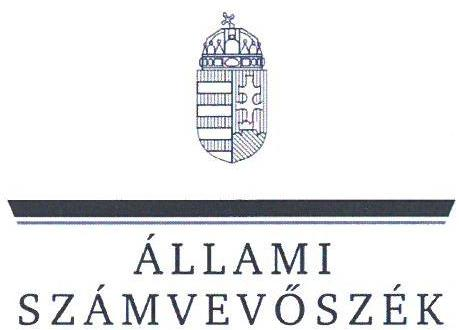
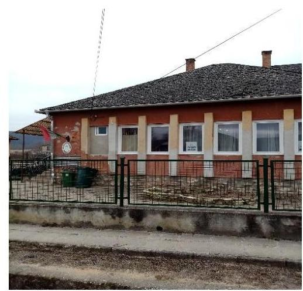
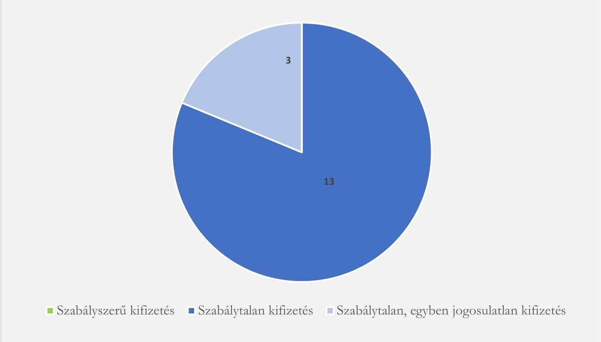

# JELENTÉS 

## Az önkormányzatok gazdálkodásának célvizsgálata

Az önkormányzatok ellenőrzése - a pénzforgalomban megjelenő kiadások teljesítésének és elszámolásának megfelelősége

Bódvalenke Község Önkormányzata

2024.

---

ÁLLAMI
SZÁMVEVŐSZÉK

# JELENTÉS 

## Az önkormányzatok gazdálkodásának célvizsgálata

Az önkormányzatok ellenőrzése - a pénzforgalomban megjelenő kiadások teljesítésének és elszámolásának megfelelősége

Bódvalenke Község Önkormányzata

2024.

---

# ELLENŐRZÉSI IGAZGATÓSÁG: 

## ÁLLAMHÁZTARTÁS HELYI SZINTJÉT ELLENŐRZŐ IGAZGATÓSÁG

## ELLENŐRZÉSI IGAZGATÓ:

DR. BAFFIA GERGELY GÁBOR igazgató

## ELLENŐRZÉSVEZETŐ:

Jelentéseink az interneten a www.asz.hu címen olvashatók.

HUDÁK MAGDOLNA ellenőrzésvezető

IKTATÓSZÁM: EL-4054-006/2024.
TÉMASZÁM: 2658
ELLENŐRZÉS-AZONOSÍTÓ SZÁM: V100209

---

# TARTALOMJEGYZÉK 

AZ ELLENŐRZÉS ALAPADATAI ..... 5
AZ ELLENŐRZÖTT SZERVEZET ..... 7
ÖSSZEFOGLALÁS ..... 9
AZ ELLENŐRZÉS FÓKUSZTERÜLETE ..... 11
MEGÁLLAPÍTÁSOK ..... 12
JAVASLATOK ..... 21
MELLÉKLETEK ..... 23
I. sz. melléklet: Az ellenőrzött szervezetek jegyzéke ..... 23
II. sz. melléklet: Ellenőrzési kritériumok ..... 24
III. sz. melléklet: Összefoglaló táblázat az önkormányzat gazdálkodási jogköreinek gyakorlásáról ellenőrzött gazdasági eseményenként ..... 25
IV. sz. melléklet: Bódvalenke Község Önkormányzata esetében ellenőrzött, késedelmesen könyvelt gazdasági események ..... 28
V. sz. melléklet: Az önkormányzati kisbusz futásteljesítménye és üzemanyag fogyasztásának kimutatása (2022-2023. évek) ..... 29
VI. sz. melléklet: Fel nem használt üzemanyag előlegek kimutatása (2022-2023. évek) ..... 30
FÜGGELÉK: ÉSZREVÉTELEK ..... 31
RÖVIDÍTÉSEK JEGYZÉKE ..... 32

---

.

---

# AZ ELLENŐRZÉS ALAPADATAI 

## AZ ELLENŐRZÉS CÉLJA

Az ellenőrzés célja annak értékelése volt, hogy az Önkormányzatnál ${ }^{1}$ a pénzforgalomban megjelenő kiadások teljesítése és elszámolása megfelelő volt-e, továbbá a kiadások teljesítése az Önkormányzat közfeladat-ellátásához kapcsolódott-e.

## AZ ELLENŐRZÉS TÍPUSA

Megfelelőségi ellenőrzés.

## AZ ELLENŐRZÖTT IDŐSZAK

Az ellenőrzött időszak a 2022. év és a 2023. év, valamint a 2024. évben az ellenőrzés megállapításainak az ÁSZ tv. ${ }^{2} 29 . \int(1)$ bekezdése szerinti megküldése napjáig.

## AZ ELLENŐRZÉS TÁRGYA

Az Önkormányzat pénzforgalmában megjelenő kiadások teljesítésének, elszámolásának, közfeladatellátással kapcsolatos felhasználásának ellenőrzése. Az ellenőrzés kiterjedt minden olyan körülményre és adatra, amely az ÁSZ jogszabályban meghatározott feladatainak teljesítéséhez, valamint a program végrehajtása folyamán felmerült újabb összefüggések feltárásához szükséges volt.

## AZ ELLENŐRZÉS JOGALAPJA

Az ellenőrzés jogszabályi alapját az ÁSZ tv. 1. § (3) bekezdésének, valamint az 5. § (2)-(3) és (6) bekezdéseinek előírásai képezték.

## AZ ELLENŐRZÉS MÓDSZERE

Az ellenőrzést a nemzetközi standardokat irányadónak tekintve az ellenőrzési program szempontjai, az ellenőrzési időszakban hatályos jogszabályok, az ellenőrzés szakmai szabályok és módszertanok figyelembevételével végezte az ÁSZ ${ }^{3}$.

Az ellenőrzési kérdések megválaszolásához szükséges bizonyítékok megszerzése az ellenőrzött szervezetek által rendelkezésre bocsátott dokumentumok és adatok, valamint az ellenőrzést támogató szervezetek ${ }^{4}$ által adott adatok, információk értékelésével, továbbá megfigyelés, szemle (szemrevételezés) és információkérés (kérdésfeltevés), valamint elemző eljárás útján történt.

---

Az ellenőrzési bizonyítékként felhasználható adatforrások közé tartoztak egyrészt az ellenőrzéshez kért dokumentumok, adatforrások, másrészt adatforrás volt még a közhiteles nyilvántartásból (Magyar Államkincstár nyilvántartásai, Önkormányzati rendellettár) származó, az ellenőrzés szempontjából információkat tartalmazó dokumentum.

Az ellenőrzés lefolytatásához az ellenőrzött szervezetek a tanúsítványok kitöltésével, valamint az ÁSZ által kért dokumentumok, adatok, információk megküldésével az ellenőrzés során szolgáltattak adatokat. A rendelkezésre bocsátott adatok, információk kontrolljára helyszíni ellenőrzés keretében is sor került.

A pénzforgalomban megjelenő kiadások teljesítésének megfelelőségét mintavételi eljárással kiválasztott 16 tétel alapján ellenőrizte az ÁSZ. Az ellenőrzés során a működés, gazdálkodás kockázatos területeinek meghatározását követően az ellenőrzött szervezetre vonatkozó főkönyvi adatbázisokból kockázat alapú eljárás alapján történt a mintatételek kiválasztása. A megállapítások csak a kiválasztott mintatételek vonatkozásában kerültek megtételre.

Az ellenőrzés kiemelten kezelte a kifizetések közfeladat ellátáshoz való közvetlen kapcsolódásának, kötelezettségvállalás szerinti teljesülésének, a kifizetések jogszerűségének, szabályszerűségének értékelését, figyelemmel a kiadások teljesítésével összefüggő kontrollok gyakorlati működésére.

Az ellenőrzés kiterjedt minden olyan körülményre és kérdésre is, amely a program végrehajtása kapcsán felmerült újabb összefüggéseknek az ellenőrzés céljaival összhangban lévő feltárásához szükséges.

---

# AZ ELLENŐRZÖTT SZERVEZET

Bódvalenke község az Észak-Magyarországi régióban, Borsod-Abaúj-Zemplén vármegyében, Edelény járásban található, a KSH5 adata szerint a lakónépesség 2023. január 1-jén 296 fő, a lakások száma 56 volt. A település területe 663 hektár. Az Önkormányzat a társadalmi-gazdasági és infrastrukturális szempontból elmaradott, jelentős munkanélküliséggel sújtott települések6 között szerepel. A munkanélküliségi ráta az NFSZ7 2023. október 20-án közzétett tájékoztatója szerint 19,8% volt. A település szerepelt a felzárkózó települések között.

A település jelenlegi polgármestere,8 alpolgármesterként 2020. november 30-tól látta el a polgármesteri feladatokat a korábbi polgármester,9 2020. november 18-ai lemondása miatt. A jelenlegi polgármester polgármesterté történő megválasztására a 2022. július 3. napján megtartott időközi polgármester választáson került sor. A Képviselő-testületnek10 a polgármesteren kívül négy fő képviselő tagja volt. Az Önkormányzat és még további kilenc önkormányzat működésével kapcsolatos feladatokat 2013. január 1-től a Bódvaszilasi Közös Önkormányzati Hivatal látta el. A Hivatal11 létszáma a 2022. évben 19 fő volt. A jegyző12 2021. november 1-jétől látta el feladatait.

Az Önkormányzat költségvetési szervet az ellenőrzött időszakban nem tartott fent. Az Önkormányzat a hulladékgazdálkodási feladatait a Sajó-Bódva Völgye és Környéke Hulladékkezelési Önkormányzati Társulás; egészségügyi alapellátási feladatait az Edelényi Kistérség Többcélú Társulás; a család- és gyermekjóléti szolgáltatás, a házi segítségnyújtás feladatait a Bódvaszilas Környéki Családsegítő és Gyermekjóléti Intézményfenntartó Társulás útján látta el. A Hivatal a hozzá tartozó tíz önkormányzat és az általuk irányított költségvetési szervek vonatkozásában a belső ellenőrzési feladatok ellátására külső szolgáltatóval kötött megbízási szerződést.

Az Önkormányzat 2022. és 2023. évi konszolidált beszámolójának főbb adatait az 1. táblázat mutatja be: 1. táblázat adatok M Ft-ban

|  MEGNEVEZÉS | 2022. ÉVI KONSZOLIDÁLT BESZÁMOLÓ | 2023. ÉVI KONSZOLIDÁLT BESZÁMOLÓ  |
| --- | --- | --- |
|  Költségvetési bevétel | 84,8 | 81,1  |
|  Ebből: önkormányzati feladatok működési támogatása | 44,3 | 47,6  |
|  hosszabb időtartamú közfoglalkoztatás támogatása | 16,9 | 0,03  |
|  közfoglalkoztatási mintaprogram támogatása | 22,7 | -  |
|  Költségvetési kiadás | 99,7 | 83,7  |
|  Finanszírozási bevétel | 21,9 | 7,4  |
|  Finanszírozási kiadás | 1,4 | 1,7  |

*1. táblázat adatok M Ft-ban*

*Forrás: Az Önkormányzat 2022. évi konszolidált beszámolója, valamint a KGR-K11 rendszerből letöltött pénzügyileg jóváhagyott 2023. évi beszámolója alapján ÁSZ saját szerkesztés*

---

Az Önkormányzat költségvetési kiadásai a 2022. és 2023. években meghaladták költségvetési bevételeit, a különbözetet az előző évi maradványból biztosították.

Az Önkormányzat a 2021. évben a Magyar Falu Program (MFP) ${ }^{13}$ keretében kommunális eszköz beszerzésre 9,9 M Ft, közterületi játszótér fejlesztésre 5,0 M Ft vissza nem térítendő pályázati támogatást nyert el. A projektek a 2022. évben megvalósításra kerültek. A Magyar Falu Program (MFP) keretében kommunális eszköz beszerzésre elnyert támogatás elszámolása az elnyert támogatás teljes összegével a 2023. évben elfogadásra került. A közterületi játszótér fejlesztésre elnyert támogatással való elszámolást az Önkormányzat a 2023. év elején benyújtotta a Kincstár ${ }^{14}$ részére. Az Önkormányzat a Magyar Falu Programon (MFP) kívül az ellenőrzött időszakban nem nyújtott be pályázatot.

Az Önkormányzat 2022. és a 2023. évi költségvetési beszámolói szerint az ellenőrzött időszakban a települési önkormányzatoknak jóváhagyott rendkívüli támogatásokból nem részesült, támogatási kérelmet nem nyújtott be. Az Önkormányzat 2022. és 2023. évi költségvetési beszámolói szerint a települési önkormányzatok szociális tüzelőanyag vásárláshoz kapcsolódó támogatásaiból a 2022. évben 2,7 M Ft, a 2023. évben 2,3 M Ft, a közfoglalkoztatási mintaprogramhoz kapcsolódóan a 2022. évben 22,7 M Ft támogatásban részesült.

---

# ÖSSZEFOGLALÁS 

A településeken az önkormányzati gazdálkodás sokrétű feladatot jelent. A tevékenység összetettsége, a megfelelő képzettségű, létszámú humán-erőforrás hiánya a gazdálkodás területén magas szintű kockázatokat eredményezhet. Az ellenőrzés hozzájárul az Önkormányzat szabályszerű és felelős gazdálkodásához, a közpénzek szabályos, cél szerinti felhasználásához, a közvagyon védelméhez.

Az Önkormányzat a 2022. évben 84,8 M Ft, a 2023. évben 81,1 M Ft költségvetési bevételből gazdálkodott, a jogszabályokban, illetve a szervezeti és múködési szabályzatában meghatározott közfeladatait ellátta. Az ellenőrzött időszakban rendkívüli támogatást nem igényelt, hitelt nem vett fel, adósságrendezési eljárás alatt nem állt.

Az Önkormányzat pénzforgalmában megjelenő ellenőrzött 20,5 M Ft összértékű 16 kiadás teljesítése és elszámolása egyetlen esetben sem felelt meg a jogszabályi előírásoknak. Az ellenőrzött kiadások 18,8 \%-ánál, a 7,1 M Ft összegű kifizetésből 2,8 M Ft esetében a közfeladatellátáshoz való kapcsolódás nem volt igazolható. Ezen túlmenően az ÁSZ ellenőrzés szabálytalanságokat állapított meg az analitikus nyilvántartások vezetésével és a leltározással kapcsolatban is.

A pénzforgalomban megjelenő kiadások teljesítésének és elszámolásának szabályszerűségét az 1. ábra mutatja be.

## 1. ábra

A PÉNZFORGALOMBAN MEGJELENŐ KIADÁSOK TELJESÍTÉSÉNEK ÉS ELSZÁMOLÁSÁNAK SZABÁLYSZERŰSÉGE AZ ÖNKORMÁNYZATNÁL (DB)

- Szabályszerú kifizetés - Szabálytalan kifizetés - Szabálytalan, egyben jogosulatlan kifizetés

---

Három karácsonyi csomag vásárlására irányuló kifizetés közfeladatellátáshoz való kapcsolódása az érintetteknek való dokumentált átadás hiányában nem volt igazolható, ezért a kifizetés szabálytalan és egyben jogosulatlan is volt.

Az Önkormányzat fizetési számlájáról és pénztárából a kiadási előirányzatok terhére teljesített kifizetések nem voltak szabályszerűek, mivel az előzetes kötelezettségvállalást igénylő 15 esetből 11 esetben 16 866,3 E Ft kifizetést érintően - a jogszabályi előírás ellenére nem, vagy nem megfelelően vállaltak írásban kötelezettséget. A kötelezettségvállalások pénzügyi ellenjegyzése egyetlen gazdasági esemény esetében sem történt meg, összesen 20 385,8 E Ft összegű kifizetést érintően. Az ellenőrzött 16 gazdasági esemény 81,3\%-ánál, összesen 18 560,6 E Ft összegű kifizetésnél elmaradt, vagy nem megfelelően végezték el a teljesítésigazolást. Az érvényesítés az ellenőrzött 16 gazdasági esemény egyikénél sem felelt meg a jogszabályi előírásoknak, nyolc esetben az utalványozás is szabálytalanul történt, ebből három esetben a polgármester az összeférhetetlenségi szabályokat megsértve saját maga számára utalványozott.

Az ÁSZ ellenőrzés hiányosságokat tárt fel többek között a szociális ellátások juttatása során, a falubusz használatával és elszámolásával, valamint az elszámolásra kiadott előlegek cél szerinti felhasználásával kapcsolatban.

Az Önkormányzat kötelezettségvállalás nyilvántartása nem felelt meg a jogszabályi előírásoknak, a feltárt hiányosságok miatt nem volt alkalmas a kötelezettségvállalás időpontjában a szabad előirányzat megállapítására. Továbbá az Önkormányzat a jogszabályi előírások ellenére a mérlegben kimutatandó tárgyi eszközöket az éves költségvetési beszámolóval lezárt 2022-2023. években nem támasztotta alá leltárral, és tárgyi eszköz nyilvántartása sem felelt meg teljeskörűen a jogszabályi előírásoknak. A leltár elkészítésének hiánya miatt a 2022. évi és 2023. évi éves költségvetési beszámoló mérlegének tárgyi eszköz eszközcsoportja tekintetében nem volt biztosított, hogy a beszámolók az Önkormányzat vagyoni helyzetéről megbízható és valós képet mutassanak.

A belső ellenőrzés az ellenőrzött időszakban nem járult hozzá a szabályszerű működéshez és a hiányosságok feltárásához, mivel az Önkormányzatot utoljára 2018. évben érintette belső ellenőrzés.

Az ÁSZ az ellenőrzés során feltárt hiányosságok felszámolása, a szabályszerű működés feltételeinek megteremtése érdekében a polgármesternek három, a jegyzőnek tizenkettő javaslatot tett.

---

# AZ ELLENŐRZÉS FÓKUSZTERÜLETE 

1.- Az Önkormányzat pénzforgalmában megjelenő kiadások teljesitésének és elszámolásának megfelelősége, az önkormányzati feladatellátásához való kapcsolódásának értékelése

---

# MEGÁLLAPÍTÁSOK 

## 1. Az Önkormányzat pénzforgalmában megjelenő kiadások teljesítésének és elszámolásának megfelelősége, az önkormányzati feladatellátásához való kapcsolódásának értékelése

Összegző megállapítás Az ellenőrzött gazdasági események tekintetében a pénzforgalomban megjelenő kiadások teljesítése és elszámolása nem volt megfelelő. A 16 kifizetésből egy sem felelt meg a jogszabályi előírásoknak, és három kifizetésnél az önkormányzati feladatellátáshoz való kapcsolódás sem volt igazolható. Az Ávr.-ben és az Áhsz.-ben előírt nyilvántartások tartalma nem felelt meg a jogszabályi előírásoknak A 2022-2023. évi beszámolókban kimutatott tárgyi eszközök értékét a Számv. tv. és az Áhsz. előírásai ellenére leltárral nem támasztották alá.
1.1. számú megállapítás Az ellenőrzött 16 gazdasági esemény 18,8\%-a nem az Önkormányzat feladatellátásához kapcsolódott.

Az Önkormányzatnál az ellenőrzött 16 gazdasági eseményből három esetben, 7100,0 E Ft összértékủ kifizetésből 2798,8 E Ft összegű kiadás a Mötv. ${ }^{15}$ 111. § (2) bekezdésében foglaltak ellenére igazolható módon nem kapcsolódott az Önkormányzat feladatellátásához.

- A Képviselő-testület 41/2022. (XI. 10.) számú határozatával 2022. november és december, valamint 2023. január hónapjára karácsonyi élelmiszer csomag biztosításáról döntött, minden bódvalenkei család részére. Az Önkormányzat a karácsonyi csomagok átadását az ONK_KIAD_10 gazdasági eseménynél öt esetben 218,8 E Ft értékben, az ONK_KIAD_11 gazdasági eseménynél 80 esetben 2400,0 E Ft értékben és az ONK_POT_02 gazdasági eseménynél 12 esetben 180,0 E Ft összegben nem igazolta.
1.2. számú megállapítás

A pénzforgalomban megjelenő ellenőrzött kiadások teljesítése nem felelt meg a jogszabályi előírásoknak.

Az előzetes írásbeli kötelezettségvállalást igénylő 15 ellenőrzött gazdasági eseményből nyolc esetben (16 084,3 E Ft összegű kifizetésnél) az Áht. ${ }^{16}$ 37. § (1) bekezdésében és az Ávr. ${ }^{17}$ 52. § (1) bekezdés c) pontjában foglaltak ellenére az Önkormányzat nem rendelkezett írásbeli kötelezettségvállalással, három esetben (782,1 E Ft összegű kifizetésnél) a kötelezettségvállalás dokumentuma nem felelt meg az Áht. és az Ávr. előírásainak.

---

- Az ONK_KIAD_05, ONK_KIAD_06, ONK_KIAD_10, ONK_KIAD_11, ONK_KIAD_12, ONK_KIAD_13, ONK_KIAD_14 és ONK_POT_02 (összesen 16 084,3 E Ft összegű) gazdasági esemény vonatkozásában az Áht. 37. $\$ 1$ ) bekezdés és az Ávr. 52. $\$ 1$ ) bekezdés c) pont előirása ellenére nem rendelkeztek írásbeli kötelezettségvállalással. Az ONK_KIAD_05 (Gyermeknapi rendezvényhez kapcsolódó reprezentáció) gazdasági esemény vonatkozásában további hiányosság volt, hogy a reprezentációs szabályzat ${ }^{18}$ III. 2. pontban foglaltak ellenére az előre nem tervezett rendezvény reprezentációs keretének elfogadásáról a Képviselő-testület nem döntött.
- Három gazdasági eseménynél a szerződések az Ávr. 50. § (1) bekezdés a) pontjában foglaltak ellenére nem tartalmazták a teljesítés mennyiségi és minőségi jellemzőinek meghatározását. Az ONK_KIAD_03, ONK_KIAD_04 (összesen 510,0 E Ft összegű) gazdasági eseményeknél a közfoglalkoztatásban adminisztratív feladatokat ellátó személyek megbízási szerződései nem tartalmazták, hogy konkrétan milyen, mennyi adminisztrációs feladatot, vagy napi hány órában kell ellátni a havi díj ellenében. Az ONK_KIAD_08 (272,1 E Ft összegű) szünidei gyermekétkeztetés biztosítására vonatkozó vállalkozási szerződés nem tartalmazta a megrendelt/szállítandó ételek adagszámát.
Négy gazdasági esemény vonatkozásában (3519,4 E Ft összegű kifizetésnél) a kötelezettségvállalásra szabályszerűen került sor.
Az Ávr. 55. § (1) bekezdésében előírtak ellenére az előzetes írásbeli kötelezettségvállalást igénylő 15 esetből (20 385,8 E Ft összegű kifizetésnél) egyetlen esetben sem végezték el a pénzügyi ellenjegyzéshez kapcsolódó ellenőrzési feladatokat, ezáltal az Áht. 37. § (1) bekezdésének előírása ellenére nem győződtek meg arról, hogy a kötelezettségvállalás nem sérti-e a gazdálkodásra vonatkozó szabályokat. Nyolc esetben (16 084,3 E Ft összegben) írásbeli kötelezettségvállalás hiányában nem került sor pénzügyi ellenjegyzésre, hét esetben ( 4301,5 E Ft összegben) a pénzügyi ellenjegyzést a kötelezettségvállalás dokumentumán nem végezték el.
- Hét esetben, az ONK_KIAD_01, ONK_KIAD_02, ONK_KIAD_03, ONK_KIAD_04, ONK_KIAD_08, ONK_KIAD_09 és ONK_KIAD_15 (4301,5 E Ft összegű) gazdasági eseményeknél rendelkezésre állt a kötelezettségvállalási dokumentum, azonban azokon a pénzügyi ellenjegyzés ténye, valamint a pénzügyi ellenjegyző dátummal ellátott aláírása az Áht. 37. § (1) bekezdés és az Ávr. 53/A. § (1) bekezdés előírása ellenére nem szerepelt. További hiányosság volt, az ONK_KIAD_15 gazdasági eseménynél, hogy a beszerzési szabályzat ${ }^{19}$ I.3.b) pontja ellenére nem folytatták le a beszerzési szabályzat III. fejezete szerinti nyílt vagy meghívásos beszerzési eljárást.

A teljesítésigazolást az Áht. 38. § (1) bekezdésében és az Ávr. 57. § (1) bekezdésében foglaltak ellenére 13 esetben nem, vagy nem megfelelően végezték el, ezáltal az ellenőrzött gazdasági események 81,3\%-ában, 18 560,6 E Ft kifizetést megelőzően nem ellenőrizték, hogy a kifizetések az arra jogosultak részére a kötelezettségvállalásnak megfelelő összegben történtek-e, illetve, hogy az ellenszolgáltatást az Önkormányzat részére ténylegesen teljesítették-e. Három esetben, 1932,5 E Ft összegű gazdasági esemény teljesítésigazolása az előírásoknak megfelelően történt.

- Az ONK_KIAD_02 és ONK_KIAD_05 (1128,8 E Ft összegű) gazdasági események vonatkozásában nem volt teljesítésigazolás.
- A teljesítésigazolás formális volt 11 (17 431,8 E Ft összegű) gazdasági esemény vonatkozásában, mert a teljesítésigazoló ellenőrizhető okmányok hiányában nem tudta ellenőrizni a kiadások teljesítésének jogosságát az Ávr. 57. § (1) bekezdés előírása ellenére.

---

Ebből hét (15 849,7 E Ft összegű) gazdasági eseménynél (ONK_KIAD_06, ONK_KIAD_10, ONK_KIAD_11, ONK_KIAD_12, ONK_KIAD_13, ONK_KIAD_14 és ONK_POT_02) a kötelezettségvállalásról szóló dokumentumok hiányoztak, ezáltal nem állt rendelkezésre olyan dokumentum, amely biztosította volna az elvégzett munka teljesítésének ellenőrizhetőségét.

- További négy gazdasági eseménynél a szerződések hiányosak voltak, vagy nem volt olyan dokumentum, amelyek alapján a teljesítést igazolni lehetett. Az Ávr. 50. § (1) bekezdés a) pontjában foglaltak ellenére a szerződések nem tartalmazták a teljesítés mennyiségi és minőségi jellemzőinek meghatározását három gazdasági eseménynél. A közfoglalkoztatás adminisztrációs feladatainak ellátására kötött, az ONK_KIAD_03, ONK_KIAD_04, mindösszesen 510,0 E Ft összértékủ gazdasági eseményekhez kapcsolódó megbízási szerződések nem tartalmazták a megbízási díjért elvégzendő adminisztrációs feladatokat, vagy a munkavégzési időt. Az ONK_KIAD_08, mindösszesen 272,1 E Ft összértékủ, szünidei gyermekétkeztetéshez kapcsolódó szerződés nem tartalmazta az étkezésben részt vevők számát, amely hiányában a kötelezettségvállalás ellenértékét nem lehetett megállapítani. A polgármester ${ }_{2}$ és a jegyző nyilatkozata szerint a konkrét étkezési adagok megrendelését egy hivatali dolgozó végezte saját telefonjáról, SMS-ben. Ezen három gazdasági esemény vonatkozásában az összegszerűség nem volt ellenőrizhető. Az ONK_KIAD_01 (800,0 E Ft) gazdasági esemény vonatkozásában az autóbuszos kirándulásokhoz kapcsolódó menetlevelek hiányoztak, amelyek miatt a szolgáltatás tényleges teljesítésének megtörténte nem volt igazolható.
Az érvényesítés az ellenőrzött 16 gazdasági esemény egyikénél sem felelt meg az Ávr. előírásainak. Az érvényesítő a kifizetést megelőzően nem ellenőrizte az összegszerűséget, a fedezet meglétét és azt, hogy a megelőző ügymenetben az Áht., Ávr. és az Áhsz. ${ }^{20}$ előírásait, a belső szabályzatokban foglaltakat betartották-e.
- Őt esetben (ONK_KIAD_01, ONK_KIAD_02, ONK_KIAD_03, ONK_KIAD_07 és ONK_KIAD_09), 2490,7 E Ft összegben az érvényesítés nem történt meg, mert az Ávr. 58. § (3) bekezdés előírása ellenére az érvényesítő aláírásával nem igazolta az ellenőrzési feladat ellátását.
- Az ellenőrzött gazdasági események közül nyolc esetben (ONK_KIAD_05, ONK_KIAD_06, ONK_KIAD_10, ONK_KIAD_11, ONK_KIAD_12, ONK_KIAD_13, ONK_KIAD_14 és ONK_POT_02), 16 084,3 E Ft összegben az érvényesítés formális volt, mivel az ellenőrzés elvégzéséhez a kötelezettségvállalási dokumentumok nem álltak rendelkezésre, és ezek hiányát az érvényesítő az Ávr. 58. § (1) bekezdésében foglaltak ellenére a megelőző ügymenet vizsgálata során nem észrevételezte. További szabálytalanság volt az ONK_KIAD_06 és ONK_KIAD_10 gazdasági eseményeknél, hogy az Ávr. 58. § (3) bekezdés előírása ellenére az érvényesítésre a kifizetést követően került sor, mivel az utalványrendeletek kelte későbbi volt, mint a kifizetés kelte. Az ONK_KIAD_14 gazdasági eseménynél az Önkormányzat 2022. évi költségvetéséről szóló 1/2022. (III. 12.) számú rendeletének 6. számú melléklete szerinti közművelődési célra elkülönített előirányzatból nem közművelődési célú eszközök (gáztűzhely, kandalló és különböző sporteszközök, pl.: kondicionáló gép, fekvenyomó pad, box szett, súlyzó szett) kerültek beszerzésre 1011,8 E Ft összegben, így a közművelődési célú előirányzat cél szerinti felhasználása nem volt biztosított. Ezt az érvényesítő az Ávr. 58. § (1) bekezdésében foglaltak ellenére az érvényesítés során nem jelezte. A zárszámadási rendelet mellékletében a beszerzésekről a Képviselő-testületnek beszámoltak.
- Az ellenőrzött gazdasági események közül kettő esetben (ONK_KIAD_08 és ONK_KIAD_15), 1768,2 E Ft összegben az érvényesítő az Ávr. 58. § (1) bekezdés előírása ellenére nem ellenőrizte és nem észrevételezte, hogy a megelőző ügymenetben az Áht., és az Ávr. előírásait betartották-e, mert a

---

kötelezettségvállalás pénzügyi ellenjegyzése nem történt meg. Az ONK_KIAD_15 gazdasági eseménynél az érvényesítés hiányában az érvényesítő nem észrevételezte, hogy a szerződést úgy kötötték meg, hogy azt megelőzően nem folytatták le a beszerzési szabályzat III. fejezete szerinti beszerzési eljárást.

- Egy esetben, az ONK_KIAD_04 számú gazdasági esemény (150,0 E Ft) vonatkozásában az érvényesítést végző az Ávr. 58. § (4) bekezdésében foglaltak ellenére az érvényesítést jogosulatlanul végezte, mivel nem rendelkezett kijelöléssel és nem szerepelt az érvényesítésre jogosult személyek nyilvántartásában. Ezen túlmenően az Ávr. 58. § (3) bekezdés előírása ellenére az érvényesítésre a kifizetést követően került sor, az utalványrendelet kelte későbbi volt, mint a kifizetés kelte.
Nyolc gazdasági esemény utalványozása 7137,0 E Ft összegű kifizetést érintően nem felelt meg az Áht. és Ávr. előírásainak. Nyolc esetben az utalványozás megfelelően történt.
- Három esetben, az ONK_KIAD_01, ONK_KIAD_05 és ONK_KIAD_07 gazdasági események vonatkozásában, 1141,9 E Ft összegben az Ávr. 60. § (2) bekezdés előírása ellenére a polgármester saját maga javára utalványozott.
- Három gazdasági esemény vonatkozásában (ONK_KIAD_04, ONK_KIAD_06 és ONK_KIAD_10) 4740,9 E Ft összegben az utalványozásra az Áht. 38. § (1) bekezdés előírása ellenére a kifizetést követően került sor, az utalványrendeletek kelte későbbi volt, mint a kifizetések dátuma.
- Két esetben, az ONK_KIAD_02 és ONK_KIAD_03 gazdasági eseményeknél, 1254,3 E Ft összegben az utalványozásra az Ávr. 59. § (3) bekezdés g) pont előírása ellenére nem került sor, az utalványozó aláírása nem szerepelt az utalványrendeleten.
(Az ellenőrzött önkormányzati kiadások gazdasági eseményeit a III. számú melléklet tartalmazza.)
1.3. számú megállapítás

A gazdálkodás belső szabályainak kialakítása megtörtént, azonban a gazdálkodási jogkörök gyakorlására jogosult személyekről vezetett nyilvántartás és a pénzkezelési szabályzat nem tartalmazta egyértelműen a jogkörök gyakorlására jogosultak körét. A kötelezettségvállalások előzetes nyilvántartásba vétele az ellenőrzött gazdasági események $18,8 \%$-ában nem történt meg.

Az Önkormányzat rendelkezett a Számv. tv. ${ }^{21}$-ben meghatározott számviteli politikával ${ }^{22}$, számlarenddel ${ }^{23}$, pénzkezelési szabályzat ${ }^{24}$-tal, leltározási és leltárkészítési szabályzat ${ }^{25}$-tal, valamint az Ávr.-ben meghatározott, gazdálkodási szabályzat ${ }^{26}$-tal, beszerzési szabályzattal és gépjármủ szabályzat ${ }^{27}$-tal.

- A gazdálkodási szabályzat az Ávr. előírásaival összhangban szabályozta az előzetes írásbeli kötelezettségvállalást nem igénylő kifizetések rendjét, tartalmazta az összeférhetetlenség szabályait. Az Önkormányzat a szabályzatában nem élt a bruttó 200 E Ft alatti beszerzések esetén a teljesítésigazolás elvégzésével kapcsolatos szabályozás lehetőségével.
A polgármester ${ }_{2}$ az Ávr-ben foglalt előírásokat betartva adott felhatalmazást a kötelezettségvállalásra, szabályszerűen kijelölte a teljesítés igazolókat és az utalványozókat. A jegyző az Ávr. 55. § (2) bekezdésében és 58. § (4) bekezdésében foglaltak ellenére egy esetben olyan személy részére adott felhatalmazást pénzügyi ellenjegyzésre és érvényesítésre, aki nem állt a Hivatal alkalmazásában, tevékenységét megbízási szerződéssel látta el.
- A megbízási szerződéssel 2023. január 1-től foglalkoztatott könyvelő pénzügyi ellenjegyzési és érvényesítési jogkörét nem gyakorolta az ellenőrzött gazdasági események vonatkozásában.

---

Az Önkormányzat gazdálkodási jogkörök gyakorlására jogosult személyekről és aláírás mintájukról vezetett nyilvántartása nem felelt meg az Ávr. 60. § (3) bekezdésében előírt belső szabályzat, a gazdálkodási szabályzat IV. fejezet 1. pontjában, valamint az V-VIII. fejezetekben foglalt előírásoknak, mert a nyilvántartás nem tartalmazta a felhatalmazásra/kijelölésre jogosító ügyirat keltét, a jogosultság megszüntetését elrendelő ügyirat számát és időpontját. A nyilvántartás nem tartalmazta az Ávr. 55. § (2) bekezdés c) pontja szerint pénzügyi ellenjegyzésre jogosult jegyző aláírásmintáját, illetve a személyi változások átvezetése a nyilvántartásban egyik gazdálkodási jogkör esetében sem történt meg.
Az ellenőrzött időszaban a pénzkezelési szabályzat a bankszámla felett rendelkezni jogosult személyek tekintetében a polgármester ${ }_{2}$ és a jegyző 2021. november 1-jétől hatályos jogosultsága mellett még tartalmazta a korábban a tisztségéről lemondott polgármester és az előző jegyző jogosultságát is. Ezért a Számv. tv. 14. § (8) bekezdésében foglaltak ellenére nem rendelkeztek egyértelműen a pénzforgalom bankszámlán történő lebonyolításának rendjéről, a pénzkezelés személyi felelősségi szabályairól.
Az ellenőrzött gazdasági események közül három esetben az Ávr. 56. § (1) bekezdés előírása ellenére a kötelezettségvállalás nyilvántartásba vételére nem került sor. A kötelezettségvállalásokról vezetett nyilvántartás így nem volt alkalmas a szabad előirányzat megállapítására, nem biztosította az Áht. 37. § (1) bekezdés a) pontjában foglalt előírás betartását.

- Az ONK_KIAD_10, ONK_KIAD_11 és ONK_POT_02 gazdasági események (7100,0 E Ft) esetében nem került sor a kötelezettségvállalás nyilvántartásba vételére, az utalványrendeleteken feltüntetett kötelezettségvállalás azonosítók a rendelkezésre bocsátott kötelezettségvállalás nyilvántartásban nem szerepeltek.
1.4. számú megállapítás

A tárgyi eszközök nyilvántartása nem felelt meg teljeskörűen az Áhsz.-ben foglaltaknak. A kiadások elszámolása egy esetben az Áhsz. és a 38/2013. (IX. 19.) NGM rendelet előírásaitól eltérően történt. Az ellenőrzött 16 gazdasági eseményből tíz esetben a könyvekben történő rögzítés késedelmesen történt.

Az ellenőrzött, 2022. év végén beszerzett tárgyi eszközöket (ONK_KIAD_12, ONK_KIAD_13, ONK_KIAD_14, ONK_KIAD_15) a tárgyi eszköz nyilvántartásban rögzítették. A helyszíni ellenőrzés során az eszközök az Önkormányzat épületében, gazdasági épületében, valamint a játszótéren fellelhetők, újszerűek voltak, azonban az azonosításhoz szükséges egyéb adatok körében az Áhsz. 14. melléklet VII. fejezet 1. b) és m) pontjaiban foglaltak ellenére leltári szám nem szerepelt rajtuk. Az eszközök azonosítására a helyszíni ellenőrzés során az eszközök típusa alapján került sor.

- Az ONK_KIAD_12, ONK_KIAD_13, ONK_KIAD_14, ONK_KIAD_15 gazdasági események keretében fűnyíró traktor, bozótvágó, magasnyomású mosó, permetező, vízszivattyú, a közterületi játszótér kialakítása és az ahhoz kapcsolódó játékok, illetve gáztűzhely, kandalló és sporteszközök beszerzésére került sor.
Az ellenőrzött időszakban a tárgyi eszközök részletező nyilvántartása tartalmában nem felelt meg az Áhsz. 14. melléklete VII. A tárgyi eszközök nyilvántartása 1. pontja b), f) és h) alpontjában meghatározottaknak, mert nem tartalmazta a szállító megnevezését, az azonosításhoz szükséges egyéb adatokat, a használatbavételt igazoló bizonylatok azonosításához szükséges adatokat, valamint a várható használati időt.

---

A kiadások számviteli elszámolása egy esetben (ONK_KIAD_15) 1496,1 E Ft összegben nem felelt meg az Áhsz. 39. §, 45. § és a 38/2013. (IX. 19.) NGM rendelet ${ }^{28}$ előírásainak, mert nem a megfelelő főkönyvi számlára, valamint nem a megfelelő egységes rovatrend szerinti nyilvántartási számlára történt a gazdasági esemény rögzítése. 15 esetben a gazdasági események számviteli elszámolása megfelelt a jogszabályi előírásoknak.

- Az ONK_KIAD_15 gazdasági esemény egy új építésű játszótér kialakítására vonatkozott, amely a Számv. tv. 3. § (4) bekezdés 7. pontja szerint beruházásnak, és nem a 8. pont szerinti felújításnak minősült, ezért az Áhsz. 15. és 16. mellékletei szerint a 05623. Ingatlanok beszerzése, létesítése teljesítése főkönyvi számon és K62 Ingatlanok beszerzése, létesítése rovaton kellett volna elszámolni, az ingatlan felújítás helyett.
A 16 ellenőrzött gazdasági esemény közül 10 esetben, 14 407,0 E Ft összegben a Számv. tv. 165. § (3) bekezdés a) pontjában előírtak ellenére nem biztosították a pénzeszközöket érintő gazdasági műveletek, események bizonylati adatainak a könyvekben történő késedelem nélküli rögzítését. A gazdasági események rögzítése általában 0,5-1,5 havi késedelemmel, de az ONK_KIAD_01 és ONK_KIAD_04 gazdasági eseményeknél három hónapos késedelemmel történt. A késedelem befolyásolta az államháztartás információs rendszerébe teljesített havi adatszolgáltatások adattartalmát, mert így az adatszolgáltatások nem valós adatokon alapultak.
(A késedelmesen rögzített gazdasági eseményeket részletesen a IV. számú melléklet mutatja be.)

# 1.5. számú megállapítás Az Önkormányzatnál a szociális ellátások juttatása során nem tartották be a jogszabályi előírásokat. 

A Képviselő-testület a szociális rendelet ${ }^{29}$ 6-7. §-ai szerint saját hatáskörben pénzbeli települési támogatást állapíthat meg a jogosult kérelmező részére. A szociális rendelet 7. §-a tartalmazza a jogosultsági feltételeket. A képviselő-testületi ülések jegyzőkönyvei szerint az érintettek kérelmei alapján a javaslatot a polgármester terjesztette a Képviselő-testület elé. A jogosultsági feltételeket nem vizsgálták. A Képviselőtestület tagjai hat alkalommal és összesen 160,0 E Ft összegben a Ptk. 8:1. § (1) bekezdés 1. pontja szerinti közeli hozzátartozójuk javára döntöttek, valamint az alpolgármester a saját maga javára döntött a pénzbeli települési támogatások megállapításáról anélkül, hogy az Mötv. 49. § (1) bekezdés előírása ellenére bejelentették volna személyes érintettségüket.

- A Képviselő-testület zárt üléseiről készült jegyzőkönyvek, valamint a kérelmezők és a Képviselő-testület tagjai között fennálló rokoni kapcsolatról szóló polgármester ${ }_{2}$ által tett nyilatkozat szerint a pénzbeli települési támogatásokról szóló 9/2022. (II. 14.), 44/2022. (XI. 10.), 17/2022. (III. 11.), 43/2022. (XI. 10.), 24/2022. (V. 23.) számú határozatokban támogatott kérelmezők a jelenlévő képviselő-testületi tagokkal a Ptk. 8:1. § (1) bekezdés 1. pontja szerinti közeli hozzátartozói kapcsolatban álltak, illetve a 29/2023. (XI. 30.) számú határozatban az alpolgármester saját maga javára döntött. Az érintett képviselőtestületi tagok a zárt ülésről készített jegyzőkönyvek szerint érintettségüket nem jelezték, a döntést jóváhagyó szavazatukkal támogatták. A benyújtott kérelmek ÁSZ általi vizsgálata alapján megállapítható, hogy a kérelmezők - az alpolgármestert kivéve, ahol jövedelmi adatok a kérelemben nem szerepeltek, így a jogosultságot nem lehetett megállapítani - megfeleltek a szociális rendelet 7. §-ában foglalt jogosultsági feltételeknek.

---

1.6. számú megállapítás

A falubusz használata, valamint az üzemanyag beszerzés elszámolása nem felelt meg az Mötv. és a gépjármú szabályzat előírásainak.

Az Önkormányzat az ellenőrzött időszakban egy Volkswagen kisbusszal rendelkezett, a falugondnoki feladatok ellátásához. A jármű gázolaj üzemủ volt, a használatára vonatkozó szabályozást a gépjármú szabályzat tartalmazta. A falubusszal a 2022-2023. években összesen 76177 km-t, átlagosan havi 3174,0 km-t tettek meg, 6960,81 üzemanyagot tankoltak, amelyre 4191,9 E Ft kifizetést teljesítettek. Az ellenőrzött időszakban a gépjármú használata során 1122,8 E Ft túlfogyasztásból ${ }^{50}$ eredő kiadás keletkezett, amely az időszakban az üzemanyagvásárlásra fordított összeg csaknem harmada, 26,8\%-a volt. A 2022. január és 2023. december közötti időszakban a kisbusz futásteljesítményét és az arra elszámolt üzemanyag fogyasztás kimutatását az V. számú melléklet tartalmazza.
A falubusz üzemanyagelszámolása nem felelt meg a gépjármú szabályzat előírásainak, mert a menetlevelek kitöltése hiányos volt, emiatt nem volt megállapítható az igénybevétel közfeladathoz kapcsolódása. Továbbá a gépjármúvet a gépjármú szabályzatban foglaltak ellenére a túlfogyasztás okainak kivizsgálása nélkül üzemeltették.

- A gépjármú szabályzat III. 2. pontjában foglaltak ellenére a tankolás időpontjában a kilométer óra állásának rögzítésére, az utazásra jogosultak nevének feltüntetésére a menetleveleken nem került sor, továbbá azok nem tartalmazták a pontos célállomásokat és az útvonal megállóhelyeit, csak az úticél település nevét, ezért a közfeladathoz kötöttség nem volt megállapítható.
- A gépjármú szabályzat III. 3. pontjában foglaltak ellenére a 2022. év végén nem állapították meg a falubusz üzemanyag túlfogyasztását. A túlfogyasztás az egész ellenőrzött időszakban fennállt, ezáltal nem tettek eleget a gépjármú szabályzat III.3. pontjában foglaltaknak, mert a túlfogyasztás okainak keresése és megszüntetése nélkül a gépjármúveket legfeljebb 30 napig lehetett volna üzemeltetni.
- A gépjármú szabályzat III. 3. pontjának előírása ellenére 10 alkalommal (2022. január, február, április, augusztus, november és december, valamint 2023. március, április, június, július hónapokban) a gépkocsi vezetője a havi üzemanyag elszámolás során hó végén nem tele tankkal adta le a gépkocsit.
A gépjármú szabályzat nem tartalmazott rendelkezést a túlfogyasztás megtéríttetésről. A szabályzat nem tartalmazott rendelkezést a falubusz magáncélú használatára és a magáncélú használat térítési díjának megállapítására vonatkozóan, emiatt nem biztosította az Mötv. 119. § (3) bekezdésében előírt, az önkormányzati források gazdaságos és hatékony felhasználását. Az Önkormányzat rendelkezett az Áhsz.-ben előírt önköltségszámtási szabályzattal ${ }^{51}$, amely 1.8-as pontja értelmében az utókalkuláció képezi a következő évi szolgáltatási díjtételek megállapításának egyik alapját. A falubusszal kapcsolatos rendszeres szolgáltatásnyújtás ellenére az Önkormányzat nem készített utókalkulációt a szolgáltatási díjak megállapításához.
- Az Önkormányzat által rendelkezésre bocsátott adatok alapján, az ellenőrzött időszakban összesen 1856,94 liter túlfogyasztás történt, amely az üzemanyag fogyasztás $26,7 \%$-át tette ki.
- A falubusz lakossági szolgáltatásait nem helyi lakosok is igénybe vehették, amelynek díját a polgármester ${ }_{1}$ 30/2020. (XI.10.) polgármesteri határozatával $100 \mathrm{Ft} / \mathrm{km}$ összegben határozta meg. A polgármester ${ }_{2}$ nyilatkozata alapján a 2022-2023. években nem került sor nem helyi lakosnak nyújtott szolgáltatásra.
- A falubusz magáncélú használatára vonatkozóan a térítési díj megállapításról dokumentumot nem tudtak az ÁSZ rendelkezésére bocsájtani. A kiállított készpénzes számlákon eltérő Ft/alkalom térítési díjak szerepeltek attól függően, hogy a falubusszal milyen távolságra utaztak. A polgármester nyilatkozata alapján a gépkocsihasználat kiszámlázása a korábbi gyakorlatnak megfelelően történt Bódvalenke-EdelényBódvalenke távolságra 4000,0 Ft/alkalom, Bódvalenke-Miskolc-Bódvalenke távolságra 6000,0 Ft/alkalom

---

összegben. A szolgáltatási díjakat számításokkal nem támasztották alá. Az Önkormányzat kimutatása szerint a 2022. évben 27, a 2023. évben 10 készpénzes számlát állítottak ki, amelyekből az egyes években 186,0 E Ft és 70,0 E Ft bevétele származott az Önkormányzatnak.
1.7. számú megállapítás

Az ellenőrzött időszakban az Önkormányzatnál az elszámolásra kiadott összesen 38 üzemanyag előleg közül 12 esetében annak felhasználására nem került sor, nem volt ellenőrizhető, hogy az előleg felvételére szükség volt-e.

Az Önkormányzatnál 2022-2023. években az elszámolásra kiadott előlegek közül 12 üzemanyag vásárlásra kiadott előleg felhasználására nem került sor. Az Önkormányzatnál a 2022. évben 10 esetben átlagosan 14, a 2023. évben két esetben átlagosan 15 napon át került sor olyan üzemanyag vásárlási előleg használatára, amelynek indokoltsága, szükségessége nem volt ellenőrizhető, mivel az összegek felhasználás nélkül visszafizetésre kerültek az Önkormányzat pénztárába. A felvett előlegek minden esetben 30 napon belül elszámolásra kerültek. A felvett, és felhasználás nélkül visszafizetett üzemanyagelőlegek összege az ellenőrzött időszakban 2190,0 E Ft volt. Az előlegek felhasználásának elmaradása felveti az önkormányzati források átmeneti jogosulatlan - saját célra történő - felhasználásának kockázatát. Az előleg felvételek indokolatlanságát támasztja alá az is, hogy az Önkormányzatnál a falubuszhoz kapcsolódóan az üzemanyag előlegek kiadása és visszafizetése között is sor került üzemanyag vásárlásra, azonban ezeket nem üzemanyag vásárlásra kiadott előlegből vásárolták.
(A 2022-2023. években fel nem használt üzemanyag előlegek kimutatását a VI. számú melléklet tartalmazza.)
1.8. számú megállapítás

A Magyar Falu Program keretében elnyert támogatások felhasználása megfelel a támogatói okiratokban foglaltaknak.

Az Önkormányzat a 2021. évben a Magyar Falu Program keretében kommunális eszköz beszerzésre 9898,5 E Ft, közterületi játszótér fejlesztésre 4994,3 E Ft vissza nem térítendő pályázati támogatást nyert el. Az Önkormányzat a MFP kommunális eszköz beszerzés támogatói okirata szerinti eszközbeszerzésekről 2023. február 1-jén elszámolást nyújtott be a Kincstárnak, amelyet a Kincstár elfogadott.
Az Önkormányzat a MFP közterületi játszótér fejlesztésről szóló támogatói okirata szerinti eszközbeszerzésekről 2023. február 6-án elszámolást nyújtott be a Kincstárnak, amelyet a Kincstár elfogadott, és amely alapján a támogatói okiratot módosította. A benyújtott elszámolás szerint az Önkormányzat a pályázat keretében folyósított támogatást a 2021. december 20-án kelt támogatói okirat szerinti célra, de attól eltérő műszaki tartalommal használta fel 4994,3 E Ft összegben.

- A pályázat benyújtását követően bekövetkezett áremelkedés miatt a betervezett játszótéri eszközök beszerzésére kisebb mennyiségben, a játszótér kivitelezésére alacsonyabb műszaki tartalommal (rövidebb kerítés, kisebb ütéscsillapító felület, szegélykövezés elmaradása) került sor. Az Önkormányzat a támogatás felhasználás műszaki tartalmában bekövetkezett változást, a pályázati elszámolás benyújtásával egyidejűleg jelezte a Kincstárnak. A Kincstár a benyújtott változás bejelentés vonatkozásában 2023. szeptember 21-én és 2023. október 10-én hiánypótlásra szólította fel az Önkormányzatot. Az Önkormányzat az első hiánypótlási felhívásnak 2023. október 6-án határidőben, de hiányosan, a második hiánypótlási felhívásnak határidőn túl tett eleget. A Kincstár a határidő túllépése miatt a bejelentett változást 2023. november 8-án kelt levelével elutasította azzal, hogy a változás bejelentését az elszámolás során kezeli. A Kincstár a

---

2024. február 28-án kelt levele szerint a benyújtott támogatás elszámolási kérelmet elbírálta, amely alapján és a változás bejelentés keretében benyújtott árajánlat és műszaki leírás szerint módosította a támogatói okiratot.
1.9. számú megállapítás Az Önkormányzatnál a pénzkezelés során a jogszabályi és belső előírásoknak megfelelően jártak el.

A 2022. évre, valamint 2023. évre vonatkozóan 2023. november 30-i állapot szerint a fizetési számla és a házipénztár nyitó- és záróegyenlegek és a főkönyvi kivonat adatai, valamint a banki és házipénztári nyitó és záró egyenlegek közötti egyezőség fennállt.
1.10. számú megállapítás

A 2022. és 2023. évi éves költségvetési beszámolókban kimutatott tárgyi eszközöket leltárral nem támasztották alá.

Az Önkormányzat a 2022. és 2023. évekre vonatkozóan az Áhsz.-ben foglaltaknak megfelelően rendelkezett aláírt éves költségvetési beszámolóval. Az Önkormányzat a 2022. évi mérlegben 93 069,7 E Ft, a 2023. évi mérlegben 88 960,7 EFt összegben kimutatott tárgyi eszközöket a Számv. tv. 69. § (1) bekezdésének, és az Áhsz. 22. § (1) bekezdésének előírása ellenére leltárral nem támasztotta alá. A leltár elkészítésének hiánya miatt a Számv. tv. 18. §-ában előírtak ellenére a 2022. és 2023. évi éves költségvetési beszámolók mérlegének tárgyi eszköz eszközcsoportja tekintetében nem volt biztosított, hogy a beszámolók az Önkormányzat vagyoni helyzetéről megbízható és valós képet mutassanak.
1.11. számú megállapítás

Az Önkormányzatnál az Mötv. szerinti belső ellenőrzést nem működtették, a belső ellenőrzés nem látta el a Bkr. ${ }^{32}$ szerinti feladatát.

A jegyző az Mötv. 119. § (4) bekezdése és az Áht. 70. § (1) bekezdése ellenére nem gondoskodott az Önkormányzatnál a belső ellenőrzés működtetéséről. A belső ellenőrzés a Bkr. 21. §-ban meghatározott feladatát nem látta el, mert a belső ellenőr által az Önkormányzat ellenőrzésére sem a 2022., sem a 2023. évben nem került sor.

- A belső ellenőrzési tevékenység ellátására a Hivatal külső szolgáltatóval kötött megbízási szerződést. A 2022. és 2023. évi belső ellenőrzési terv nem tartalmazott az Önkormányzatra vonatkozóan belső ellenőrzési feladatot. Az Önkormányzatnál utoljára a 2018. évben, a gépjármú-üzemeltetés szabályosságának ellenőrzése tárgyban került sor belső ellenőrzésre. A 2024. évi belső ellenőrzési terv 2024. III. negyedévben az Önkormányzatot érintően ismételten a gépjármú-üzemeltetés szabályosságának vizsgálatát tartalmazta.
- A belső ellenőrzési vezető 2024. január 19. napján kelt nyilatkozata szerint kapacitás hiány miatt négy-öt évente kerül sor egy szervezet belső ellenőrzésére.

---

# JAVASLATOK 

Az ÁSZ tv. 33. § (1) bekezdésében foglaltak értelmében az ellenőrzött szervezet vezetője köteles a jelentésben foglalt megállapításokhoz kapcsolódó intézkedési tervet összeállítani és azt a jelentés kézhezvételétől számított 30 napon belül az ÁSZ részére megküldeni. Amennyiben az ellenőrzött szervezet vezetője nem küldi meg határidőben az intézkedési tervet, vagy továbbra sem elfogadható intézkedési tervet küld, az Állami Számvevőszék elnöke az ÁSZ tv. 33. § (3) bekezdése a) és b) pontjaiban foglaltakat érvényesítheti.

## BÓDVALENKE KÖZSÉG ÖNKORMÁNYZATÁNAK POLGÁRMESTERE RÉSZÉRE

1. Intézkedjen az Állami Számvevőszék nyilvánosságra hozott jelentésének a kézhez vételt követő 30 napon belül a Képviselő-testület elé terjesztéséről. A jelentést a napirend tárgyalásáról szóló jegyzőkönyvvel együtt tájékoztatásul küldje meg a Kormányhivatal részére is.
2. Tegyen intézkedéseket az Áht. 37. § (1) és 38. § (1) bekezdésében foglalt kontrolltevékenységek kiépítésére és megfelelő müködtetésére, amelyek megelőzik a jelentésben leírt, az Ávr. 52. §-ában, 57. §-ában, valamint 59. §-ában foglalt kötelezettségvállalási, teljesítésigazolási és utalványozási jogkörök gyakorlásával összefüggő szabálytalanságok ismételt előfordulását.
3. Intézkedjen, hogy a Képviselő-testület tagjai az Mötv. 49. § (1) bekezdése szerint jelezzék személyes érintettségüket a képviselő-testületi döntéshozatalt megelőzően, és kezdeményezze az érintett képviselőtestületi döntéshozatalból való kizárását.

## BÓDVASZILASI KÖZÖS ÖNKORMÁNYZATI HIVATAL JEGYZŐJE RÉSZÉRE

1. Tegyen intézkedéseket az Önkormányzat vonatkozásában az Áht. 37. § (1) és 38. § (1) bekezdésében foglalt kontrolltevékenységek kiépítésére és megfelelő müködtetésére, amelyek megelőzik a jelentésben leírt, az Ávr. 53/A. §-ában, 55. §-ában, valamint 58. §-ában foglalt pénzügyi ellenjegyzési és érvényesítési jogkörök gyakorlásával összefüggő szabálytalanságok ismételt előfordulását.
2. Intézkedjen a Bkr. 8. § (2) bekezdésében foglaltakra tekintettel olyan kontrolltevékenységek kialakításáról, amelyek biztosítják, hogy a Számv. tv. 165. § (3) bekezdés a) pontjában foglaltak szerint a pénzeszközöket érintő gazdasági müveletek, események bizonylatai adatainak a könyvekben történő rögzítése késedelem nélkül megtörténjen az Önkormányzat esetében.
3. Intézkedjen az Áhsz. 39. §, 45. § és a 38/2013. (IX. 19.) NGM rendelet elöírásai alapján a gazdasági események tartalmának megfelelő számviteli elszámolásáról.
4. Intézkedjen, hogy a gépjármú elszámolások az Önkormányzat gépjármú szabályzatában foglaltaknak megfelelően történjenek, továbbá a szabályzatot egészítse ki a túlfogyasztás miatti többletköltség megtérítési módjának és a magáncélú használat térítési díjmegállapításának önköltségszámitáson alapuló szabályozásával az Mötv. 119. § (3) bekezdésében elöírtak biztosítása céljából.

---

5. Intézkedjen az Önkormányzatnál arról, hogy a pénzügyi ellenjegyzői és érvényesítési feladatokat ellátó személyek az Ávr. 55. § (2) bekezdése és 58. § (4) bekezdése szerint a Hivatal alkalmazásában álljanak.
6. Intézkedjen az Ávr. 60. § (3) bekezdésének előirása szerint az Önkormányzat vonatkozásában a kötelezettségvállalásra, pénzügyi ellenjegyzésre, teljesítés igazolására, érvényesítésre, utalványozásra jogosult személyekről és aláírás-mintájukról naprakész nyilvántartás vezetéséről.
7. Intézkedjen az Önkormányzat pénzkezelési szabályzatának aktualizálásáról, abban a Számv. tv. 14. § (8) bekezdése szerint rendelkezzen egyértelmüen a pénzforgalom lebonyolításának rendjéről, a pénzkezelés személyi és tárgyi feltételeiről, felelősségi szabályairól.
8. Intézkedjen az Önkormányzatnál a kötelezettségvállalásoknak az Ávr. 56. § (1) bekezdése szerinti nyilvántartásba vételéről.
9. Intézkedjen az Önkormányzatnál az Áhsz. 45. § (3) bekezdésében meghatározott, az Áhsz. 14. számú mellékletének VII. pontjában részletezett tartalmú tárgyi eszköz nyilvántartás vezetéséről.
10. Intézkedjen a beszerzési szabályzat I.3.b-c) pontjában meghatározott esetekben a beszerzési szabályzat III. pontjában előírt beszerzési eljárás lefolytatásáról és teljeskörü dokumentálásáról.
11. Intézkedjen az Önkormányzat éves költségvetési beszámolója mérlegének leltárral való alátámasztásáról a Számv. tv. 69. § (1) bekezdésének, és az Áhsz. 22. § (1) bekezdésének előírásai szerint.
12. Gondoskodjon az Önkormányzatnál a belső ellenőrzés Mötv. 119. § (4) bekezdése és az Áht. 70. § (1) bekezdése szerinti müködtetéséről.

---

# MELLÉKLETEK 

I. SZ. MELLÉKLET: AZ ELLENŐRZÖTT SZERVEZETEK JEGYZÉKE

## MEGSEVEZÉs

Bódvalenke Község Önkormányzata
Bódvaszilasi Közös Önkormányzati Hivatal

---

# II. SZ. MELLÉKLET: ELLENŐRZÉSI KRITÉRIUMOK 

## FOKUSZTERÜLET

1. Az Önkormányzat pénzforgalmában megjelenő kiadások teljesítésének és elszámolásának megfelelősége, az Önkormányzat feladatellátásához kapcsolódó megvalósulásának értékelése

## ELLENÖRZÉSI KRITÉRIUMOK

Áht. 37. § (1) bekezdés;
Áht. 38. § (1) bekezdés;
Áht. 70. § (1) bekezdés;
Ávr. 50. § (1) bekezdés a) pontja;
Ávr. 52. § (1) bekezdés c) pontja;
Ávr. 53/A. § (1) bekezdés;
Ávr. 55. § (1) és (2) bekezdései;
Ávr. 56. § (1) bekezdése;
Ávr. 57. § (1) és (3) bekezdései;
Ávr. 58. § (1), (3) és (4) bekezdései;
Ávr. 59. § (3) bekezdés g) pontja;
Ávr. 60. § (2) és (3) bekezdései;
Áhsz. 22. § (1) bekezdés;
Áhsz. 39. § és 45. §;
Áhsz. 14. melléklet VII. A tárgyi eszközök nyilvántartása 1. pontja;

Áhsz. 15. és 16. mellékletei;
Számv. tv. 3. § (4) bekezdés 7. és 8. pontjai;
Számv. tv. 14. § (8) bekezdés;
Számv. tv. 18. §;
Számv. tv. 69. § (1) bekezdés;
Számv. tv. 165. § (3) bekezdés a) pontja;
Mötv. 49. § (1) bekezdés;
Mötv. 111. § (2) bekezdés;
Mötv. 119. § (3) és (4) bekezdések;
38/2013. (IX.19.) NGM rendelet;
Ptk. 8:1. § (1) bekezdés 1. pontja;
Bkr. 8. § (2) bekezdés;
Bkr. 21. §.

---

# III. SZ. MELLÉKLET: ÖSSZEFOGLALÓ TÁBLÁZAT AZ ÖNKORMÁNYZAT GAZDÁLKODÁSI JOGKÖREINEK GYAKORLÁSÁRÓL ELLENŐRZÖTT GAZDASÁGI ESEMÉNYENKÉNT

## BÓDVALENKE KÖZSÉG ÖNKORMÁNYZATA - KIADÁSI TÉTELEK

|  SZ. | MINTATÉTEL
AZONOSÍTÓ
SZÁMA | GAZDASÁGI ESEMÉNY |  |  |  | GAZDÁLKODÁSI JOGKÖRÖK GYAKORLÁSA |  |  |  |  |   |
| --- | --- | --- | --- | --- | --- | --- | --- | --- | --- | --- | --- |
|   |  | TÁRGYA | DÁTUMA | KIFIZETÉS MÓDIA | ÖSSZEGE
(Ft) | KÖTELEZETTSEG -VÁLLALÁS | PÉNZÉGYI ELLENJEGYZÉS | TELJESÍTÉSIGAZOLÁS | ÉRVÉNYE-
SÍTÉS | ÚTALVÁ-
NYOZÁS | KÖZ-
FELADAT
ELLÁTÁS  |
|  1. | ONK_KIAD_01 | Előleg kiadás, visszavét és felhasználás elszámolása a kirándulások költségeire a 21/2023. (VI. 30.) Kt. határozat alapján. | 2023.07.10 | pénztár | 800000 | Megfelelő dokumentum | Nem megfelelő dokumentum | Nem
megfelelő
dokumentum | Nem
megfelelő
dokumentum | Nem
megfelelő
dokumentum | I  |
|  2. | ONK_KIAD_02 | Képviselők/ alpolgármester és polgármester 2023.06. havi tiszteletdíja és a polgármester 2023. évi cafeteria juttatása | 2023.07.31 | bank és pénztár | 894250 | Megfelelő dokumentum | Nem megfelelő dokumentum | Nincs dokumentum | Nem
megfelelő
dokumentum | Nem
megfelelő
dokumentum | I  |
|  3. | ONK_KIAD_03 | Közfoglalkoztatásban adminisztratív feladatokat ellátó személy 2023.01-02. havi megbízási díja | 2023.03.31 | bank | 360000 | Nem megfelelő dokumentum | Nem megfelelő dokumentum | Nem
megfelelő
dokumentum | Nem
megfelelő
dokumentum | Nem
megfelelő
dokumentum | I  |
|  4. | ONK_KIAD_04 | Közfoglalkoztatásban adminisztratív feladatokat ellátó személy 2022.07. havi megbízási díja | 2022.08.02 | bank | 150000 | Nem megfelelő dokumentum | Nem megfelelő dokumentum | Nem
megfelelő
dokumentum | Nem
megfelelő
dokumentum | Nem
megfelelő
dokumentum | I  |
|  5. | ONK_KIAD_05 | Gyermeknapi rendezvényhez kapcsolódó reprezentáció | 2022.06.15 | pénztár | 234590 | Nincs dokumentum | Nincs dokumentum | Nincs dokumentum | Nem
megfelelő
dokumentum | Nem
megfelelő
dokumentum | I  |
|  6. | ONK_KIAD_06 | Közfoglalkoztatási programhoz kapcsolódó anyagbeszerzés | 2022.06.22 | bank | 1090885 | Nincs dokumentum | Nincs dokumentum | Nem
megfelelő
dokumentum | Nem
megfelelő
dokumentum | Nem
megfelelő
dokumentum | I  |
|  7. | ONK_KIAD_07 | Betonjavító és falazó habarcs vásárlás (ravatalozóhoz) | 2023.06.26 | pénztár | 107323 | Nem releváns | Nem releváns | Megfelelő dokumentum | Nem
megfelelő
dokumentum | Nem
megfelelő
dokumentum | I  |

---

|  Ssz. | MINTATÉTEL
AZONOSÍTÓ
SZÁMA | GAZDÁSÁGI ESEMÉNY |  |  |  | GAZDÁLKOBÁSI JÓGKÖRÖK GYÁKORLÁSA |  |  |  |  |   |
| --- | --- | --- | --- | --- | --- | --- | --- | --- | --- | --- | --- |
|   |  | TÁRGYA | DÁTUMA | KIFIZETÉS MÓDIA | ÖSSZEGE (Ft) | KÖTELEZETTSÉG -VÁLLALÁS | PÉNZÉGYI ELLENJEGYZÉS | TELJESÍTÉSIGAZOLÁS | ÉRVÉNYESÍTÉS | ÚTALVÁNYOZÁS | KÖZFELADATOSZÁMA  |
|  8. | ONK_KIAD_08 | Szünidei gyermekétkeztetés biztosítása (2022.12.22-12.30) | 2022.12.28 | bank | 272094 | Nem megfelelő dokumentum | Nem megfelelő dokumentum | Nem megfelelő dokumentum | Nem megfelelő dokumentum |  | 1  |
|  9. | ONK_KIAD_09 | Falugondnoki autó javítása | 2023.10.30 | bank | 329100 | Megfelelő dokumentum | Nem megfelelő dokumentum | Megfelelő dokumentum | Nem megfelelő dokumentum | Megfelelő dokumentum | I  |
|  10. | ONK_KIAD_10 | 2022. évi karácsonyi élelmiszercsomag vásárlás | 2022.12.31 | bank | 3500000 | Nincs dokumentum | Nincs dokumentum | Nem megfelelő dokumentum | Nem megfelelő dokumentum | Nem | I  |
|  11. | ONK_KIAD_11 | 2022. évi karácsonyi élelmiszercsomag vásárlás | 2022.11.17 | bank | 2400000 | Nincs dokumentum | Nincs dokumentum | Nem megfelelő dokumentum | Nem megfelelő dokumentum | Megfelelő dokumentum | N  |
|  12. | ONK_KIAD_12 | MFP kommunális eszközbeszerzés | 2022.01.31 | bank | 4557087 | Nincs dokumentum | Nincs dokumentum | Nem megfelelő dokumentum | Nem megfelelő dokumentum | Megfelelő dokumentum | I  |
|  13. | ONK_KIAD_13 | MFP keretében játszótéri játékok beszerzése | 2022.11.29 | bank | 2089879 | Nincs dokumentum | Nincs dokumentum | Nem megfelelő dokumentum | Nem megfelelő dokumentum | Megfelelő dokumentum | I  |
|  14. | ONK_KIAD_14 | Gázfüzhely, kandalló, kondicionáló gép, fekvenyomó pad, boksz szett beszerzés | 2022.10.15 | bank | 1011811 | Nincs dokumentum | Nincs dokumentum | Nem megfelelő dokumentum | Nem megfelelő dokumentum | Megfelelő dokumentum | I  |
|  15. | ONK_KIAD_15 | MFP keretében játszótér kialakítása | 2022.11.29 | bank | 1496063 | Megfelelő dokumentum | Nem megfelelő dokumentum | Megfelelő dokumentum | Nem megfelelő dokumentum | Megfelelő dokumentum | I  |
|  16. | ONK_POT_02 | 2022. évi karácsonyi élelmiszercsomag vásárlás | 2022.12.29 | bank | 1200000 | Nincs dokumentum | Nincs dokumentum | Nem megfelelő dokumentum | Nem megfelelő dokumentum | Megfelelő dokumentum | N  |
|   |  |  | Összesen: | 20493082 |  |  |  |  |  |  |   |
|  Bódvalenke Község Önkormányzata kiadási tételek összesen (db): |  |  | Megfelelő dokumentum: |  | 4 | 0 | 3 | 0 | 8 | 13 | 15  |
|   |  |  | Nem megfelelő dokumentum: |  | 3 | 7 | 11 | 16 | 8 | 3 | 1  |
|   |  |  | Nincs dokumentum: |  | 8 | 8 | 2 | 0 | 0 | 0 | 0  |
|   |  |  | Nem releváns: |  | 1 | 1 | 0 | 0 | 0 | 0 | 0  |
|   |  |  | Kiadási tételek összesen: |  | 16 | 16 | 16 | 16 | 16 | 16 | 16  |

Forrás: Az ellenőrzött által szolgáltatott dokumentumok alapján ÁSZ saját szerkesztés

---

# A DOKUMENTUMOK ÉRTÉKELÉSE 

Nem megfelelő dokumentum: ha rendelkezésre áll dokumentum, de azt a gazdálkodási jogkör gyakorlók aláirással, dátummal nem látták el/ vagy ha aláirással ellátták, azonban a gazdálkodási jogkörrel kapcsolatos ellenőrzési feladatok elvégzéséhez szükséges háttérdokumentumok nem állnak rendelkezésre, és ezért nem megállapítható, hogy azt elvégezték-e/ vagy a háttér dokumentumokból az állapítható meg, hogy az ellenőrzési feladatot ténylegesen nem végezték el, mert a kifizetés nem a jogosultnak, nem megfelelő összegben történt, vagy az ellenszolgáltatás nem történt meg. Nem megfelelő a dokumentum akkor sem, ha aláirással ellátták, de azt nem az arra jogosult írta alá.

Nem releváns: az adott gazdasági eseménynél jogszabályi előírás, vagy belső szabályzat szerint nem kell az adott gazdálkodási jogkört gyakorolni (pl. 200 EFt alatti tételek esetében nem kell írásbeli kötelezettségvállalás, ha egyébként azt belső szabályzat sem írja elő.)

---

# IV. SZ. MELLÉKLET: BÓDVALENKE KÖZSÉG ÖNKORMÁNYZATA ESETÉBEN ELLENŐRZÖTT, KÉSEDELMESEN KÖNYVELT GAZDASÁGI ESEMÉNYEK 

| SORSZÁM | GAZDASÁGI   ESEMÉNY AZONOSÍTÓJA | GAZDASÁGI   ESEMÉNY TÁRGYA | PÉNZÜGYI   TÉLJESÍTÉS   IDÓPONTJA | ÖssZEGE (ÍT) | RÓGZÍTÉS JOGSZABÁLYI HATÁRIDEJE | TÉNYI EGES RÓGZÍTÉS (KÖNYVELÉS) IDÓPONTJA |
| :--: | :--: | :--: | :--: | :--: | :--: | :--: |
| 1. | ONK_KIAD_01 | Előleg kiadás, visszavét és felhasználás elszámolása a 2023.07.08. és 2023.07.15-i kirándulás költségeire a 21/2023. (VI. 30.) Kt. határozat alapján. | 2023.07.10 | 800000 | 2023.07.10 | 2023.10.15 |
| 2. | ONK_KIAD_04 | Közfoglalkoztatásban adminisztratív feladatokat ellátó személy 2022.07. havi megbízási díja | 2022.08.02 | 150000 | 2022.09.15 | 2022.12.14 |
| 3. | ONK_KIAD_05 | Gyermeknapi rendezvényhez kapcsolódó reprezentáció | 2022.06.15 | 234590 | 2022.06.15 | 2022.06.20 |
| 4. | ONK_KIAD_07 | Betonjavító és falazó habarcs vásárlás (ravatalozóhoz) | 2023.06.26 | 107323 | 2023.06.26 | 2023.07.13 |
| 5. | ONK_KIAD_08 | Szünidei gyermekétkeztetés biztosítása (2022.12.2212.30) | 2022.12.28 | 272094 | 2023.01.15 | 2023.02.09 |
| 6. | ONK_KIAD_10 | 2022. évi karácsonyi élelmiszercsomag vásárlás | 2022.12.31 | 3500000 | 2023.01.15 | 2023.02.22 |
| 7. | ONK_KIAD_12 | Fűnyíró traktor tartozékokkal, permetező, bozótvágó, magasnyomású mosó és szivattyú vásárlás MFP kommunális eszközbeszerzés | 2022.01.31 | 4557087 | 2022.02.15 | 2022.03.30 |
| 8. | ONK_KIAD_13 | MFP keretében játszótéri játékok beszerzése | 2022.11.29 | 2089879 | 2022.12.15 | 2022.12.29 |
| 9. | ONK_KIAD_15 | MFP keretében   játszótér kialakítása | 2022.11.29 | 1496063 | 2022.12.15 | 2022.12.29 |
| 10. | ONK_POT_02 | 2022. évi karácsonyi élelmiszercsomag vásárlás | 2022.12.29 | 1200000 | 2023.01.15 | 2023.02.09 |
|  |  | Összesen: |  | 14407036 |  |  |

Forrás: Az ellenőrzött által szolgáltatott dokumentumok alapján ÁSZ saját szerkesztés

---

V. SZ. MELLÉKLET: AZ ÖNKORMÁNYZATI KISBUSZ FUTÁSTELJESÍTMÉNYE ÉS ÜZEMANYAG FOGYASZTÁSÁNAK KIMUTATÁSA (2022-2023. ÉVEK)

| HÓNAP | FUTÁS   TELJESÍTMÉNY   KM | YÁSÁROLT   ÜZEMANYAG   LITER | ÜZEMANYAG   ÖSSZEGE   FT | TÜLFOGYASZTÁS   MÉRTÉKE   LITER | TÜLFOGYASZTÁS   ÉRTÉKE   FT |
| :--: | :--: | :--: | :--: | :--: | :--: |
| 2022 január | 3229 | 300,02 | 143999 | 83,68 | 40162 |
| 2022. február | 4544 | 400,07 | 209867 | 95,62 | 50161 |
| 2022 március | 6070 | 574,32 | 288783 | 167,63 | 84289 |
| 2022. április | 3899 | 339,58 | 169098 | 78,35 | 39014 |
| 2022. május | 3793 | 344,50 | 165359 | 90,37 | 43377 |
| 2022. június | 5071 | 423,57 | 243606 | 83,81 | 48203 |
| 2022. július | 3032 | 272,29 | 130700 | 69,15 | 33190 |
| 2022. augusztus | 3789 | 334,88 | 252721 | 81,02 | 61140 |
| 2022 szeptember | 2806 | 237,55 | 184203 | 49,55 | 38421 |
| 2022. október | 2924 | 282,85 | 229049 | 86,94 | 70405 |
| 2022. november | 3071 | 302,83 | 232303 | 97,07 | 74465 |
| 2022. december | 2588 | 286,05 | 201444 | 112,65 | 79334 |
| 2023. január | 2996 | 257,27 | 182509 | 56,54 | 40108 |
| 2023. február | 3154 | 286,55 | 185916 | 75,23 | 48811 |
| 2023. március | 3089 | 266,78 | 165010 | 59,82 | 36998 |
| 2023. április | 3482 | 286,65 | 163587 | 53,36 | 30449 |
| 2023. május | 3575 | 312,37 | 171496 | 72,85 | 39993 |
| 2023. június | 3090 | 275,35 | 152738 | 68,32 | 37897 |
| 2023. július | 3376 | 402,38 | 230625 | 176,19 | 100983 |
| 2023. augusztus | 4272 | 387,81 | 248293 | 101,59 | 65040 |
| 2023 szeptember | 1180 | 108,21 | 70635 | 29,15 | 19028 |
| 2023. október | 0 | 0,00 | 0 | 0,00 | 0 |
| 2023. november | 216 | 57,75 | 34997 | 43,28 | 26227 |
| 2023. december | 2931 | 221,17 | 134923 | 24,79 | 15125 |
| Összesen | 76177 | 6960,80 | 4191861 | 1856,96 | 1122820 |

Forrás: Az ellenőrzött által szolgáltatott dokumentumok alapján ÁSZ saját szerkesztés

---

VI. SZ. MELLÉKLET: FEL NEM HASZNÁLT ÜZEMANYAG ELŐLEGEK KIMUTATÁSA (2022-2023. ÉVEK)

| Ssz. | KIFIZIETÉSÉNEK IDÓPONTJA | ELŐLEG ÖSSZEGE (FT) | ÚTALVÁNYRENDELET SZÁMA | ELŐLEGGEI VALÓ ELIZÁMÓLÁS HATÁBIDEJE | VisszÁ-   FIZIETET ÖSSZEG (FT) | VisszA-   FIZETÉS IDÓPONTJA | ELŐLEG KIADÁSÁ ÉS VÍSSZÁFIZETÉSÉ KÖZÖTTI IDÓ (NAP) |
| :--: | :--: | :--: | :--: | :--: | :--: | :--: | :--: |
| 1. | 2022.01.03 | 150000 | UT-548278-2022/149 | 2022.02.02 | 150000 | 2022.01.26 | 23 |
| 2. | 2022.02.04 | 150000 | UT-548278-2022/175 | 2022.03.03 | 150000 | 2022.02.21 | 17 |
| 3. | 2022.02.21 | 180000 | UT-548278-2022/180 | 2022.03.03 | 180000 | 2022.02.25 | 4 |
| 4. | 2022.03.04 | 200000 | UT-548278-2022/189 | 2022.04.01 | 200000 | 2022.03.24 | 20 |
| 5. | 2022.03.24 | 260000 | UT-548278-2022/213 | 2022.04.01 | 260000 | 2022.03.31 | 7 |
| 6. | 2022.06.07 | 200000 | UT-548278-2022/500 | 2022.07.08 | 200000 | 2022.06.30 | 23 |
| 7. | 2022.08.04 | 130000 | UT-548278-2022/694 | 2022.09.02 | 130000 | 2022.08.19 | 15 |
| 8. | 2022.08.19 | 190000 | UT-548278-2022/732 | 2022.09.05 | 190000 | 2022.08.25 | 6 |
| 9. | 2022.08.25 | 230000 | UT-548278-2022/752 | 2022.09.05 | 230000 | 2022.08.30 | 5 |
| 10. | 2022.10.03 | 200000 | UT-548278-2022/881 | 2022.11.03 | 200000 | 2022.10.26 | 23 |
| 11. | 2023.08.01 | 100000 | UT-548278-2023/679 | 2023.08.15 | 100000 | 2023.08.14 | 13 |
| 12. | 2023.08.14 | 200000 | UT-548278-2023/685 | 2023.09.06 | 200000 | 2023.08.31 | 17 |
|  | Összesen: | 2190000 |  | 2190000 |  |  | 173 |

---

# FÜGGELÉK: ÉSZREVÉTELEK 

A jelentéstervezetet a Számvevőszék 15 napos észrevételezésre megküldte az ellenőrzött szervezetek vezetőinek az ÁSZ tv. 29. §* (1) bekezdése előírásának megfelelően.

Az ellenőrzött szervezetek a jelentéstervezet megállapításaira észrevételt nem tettek.

[^0]
[^0]:    * 29. § (1) Az Állami Számvevőszék az ellenőrzési megállapításait megküldi az ellenőrzött szervezet vezetőjének vagy az általa megbízott személynek, és annak, akinek személyes felelősségét állapította meg.
    (2) Az ellenőrzött szervezet vezetője és a felelősként megjelölt személy az ellenőrzés megállapításaira tizenöt napon belül írásban észrevételt tehet.
    (3) Az Állami Számvevőszék az észrevételre a beérkezésétől számított harminc napon belül írásban válaszol. A figyelembe nem vett észrevételeket köteles a jelentésben feltüntetni, és megindokolni, hogy azokat miért nem fogadta el.

---

# RÖVIDÍTÉSEK JEGYZÉKE 

${ }^{1}$ Önkormányzat
${ }^{2}$ ÁSZ tv.
${ }^{3}$ ÁSZ
${ }^{4}$ ellenőrzést támogató szervezetek
${ }^{5} \mathrm{KSH}$
${ }^{6}$ társadalmi-gazdasági és infrastrukturális szempontból elmaradott, jelentős munkanélküliséggel sújtott települések
${ }^{7}$ NFSZ
${ }^{8}$ polgármester ${ }_{2}$
${ }^{9}$ polgármester ${ }_{1}$
${ }^{10}$ Képviselő-testület
${ }^{11}$ Hivatal
${ }^{12}$ jegyző
${ }^{13}$ Magyar Falu Program (MFP)
${ }^{14}$ Kincstár
${ }^{15}$ Mötv.
${ }^{16}$ Áht.
${ }^{17}$ Ávr.
${ }^{18}$ reprezentációs szabályzat
${ }^{19}$ beszerzési szabályzat
${ }^{20}$ Áhsz.
${ }^{21}$ Számv. tv.
${ }^{22}$ számviteli politika
${ }^{23}$ számlarend
${ }^{24}$ pénzkezelési szabályzat
${ }^{25}$ leltározási és leltárkészítési szabályzat
${ }^{26}$ gazdálkodási szabályzat
${ }^{27}$ gépjármú szabályzat

Bódvalenke Község Önkormányzata
2011. évi LXVI. törvény az Állami Számvevőszékről

Állami Számvevőszék
Borsod-Abaúj-Zemplén Vármegyei Kormányhivatal, NAV Borsod-Abaúj-Zemplén Vármegyei Adó- és Vámigazgatóság, Borsod-Abaúj-Zemplén Vármegyei RendőrFőkapitányság
Központi Statisztikai Hivatal
105/2015. (IV. 23.) Korm. rendelet a kedvezményezett települések besorolásáról és a besorolás feltételrendszeréről szerint

Nemzeti Foglalkoztatási Szolgálat
Bódvalenke Község Önkormányzatának 2020. november 30-tól polgármesteri feladatot ellátó alpolgármestere, akit a 2022. július 3 -ai időközi polgármester választáson polgármesterré választottak
Bódvalenke Község Önkormányzatának 2020. november 18-án lemondás miatt megszűnt tisztségủ polgármestere
Bódvalenke Község Önkormányzatának Képviselő-testülete
Bódvaszilasi Közös Önkormányzati Hivatal
Bódvaszilasi Közös Önkormányzati Hivatalt 2021. november 1-től vezető jegyző
MFP-KOEB/2021., elnyert összeg: 9,9 M Ft
MFP-OJKJF/2021., elnyert összeg: 5,0 M Ft
Magyar Államkincstár
2011. évi CLXXXIX. törvény Magyarország helyi önkormányzatairól
2011. évi CXCV. törvény az államháztartásról
368/2011. (XII. 31.) Korm. rendelet az államháztartásról szóló törvény végrehajtásáról
Bódvaszilasi Közös Önkormányzati Hivatalnak Bódvalenke Község Önkormányzatára kiterjedő hatályú, 2019. január 1-től hatályos Reprezentációs Szabályzata
Bódvaszilasi Közös Önkormányzati Hivatalnak Bódvalenke Község Önkormányzatára kiterjedő hatályú, 2020. január 1-től hatályos Beszerzési Szabályzata
4/2013. (I. 11.) Korm. rendelet az államháztartás számviteléről
2000. évi C. törvény a számvitelről
Bódvaszilasi Közös Önkormányzati Hivatal Számviteli politika, hatályos 2020. január 1-jétől
Bódvaszilasi Közös Önkormányzati Hivatal Számlarend, hatályos 2020. január 1-jétől
Bódvaszilasi Közös Önkormányzati Hivatal Pénzkezelési Szabályzat, hatályos 2020. január 1-jétől
Bódvaszilasi Közös Önkormányzati Hivatalnak Bódvalenke Község Önkormányzatára kiterjedő hatályú, 2019. január 1-től hatályos Leltározási és leltárkészítési szabályzata
Bódvaszilasi Közös Önkormányzati Hivatal Gazdálkodási szabályzat a kötelezettségvállalás, pénzügyi ellenjegyzés, teljesítés igazolása, érvényesítés, utalványozás, átláthatósági nyilatkozat és adatszolgáltatás rendjéről, hatályos 2020. január 1-jétől

Bódvaszilasi Közös Önkormányzati Hivatalnak Bódvalenke Község Önkormányzatára kiterjedő hatályú, 2019. január 1-től hatályos Gépjárművek igénybevételének, használatának és költségelszámolásának szabályzata

---

28 38/2013. (IX. 19.) NGM rendelet
${ }^{29}$ szociális rendelet
${ }^{30}$ túlfogyasztás
${ }^{31}$ önköltségszámítási szabályzat
${ }^{32} \mathrm{Bkr}$.
38/2013. (IX. 19.) NGM rendelet az államháztartásban felmerülő egyes gyakoribb gazdasági események kötelező elszámolási módjáról
Bódvalenke Község Önkormányzat Képviselő-testületének a pénzbeli és természetbeni támogatások rendszeréről, valamint a személyes gondoskodást nyújtó szociális és gyermekvédelmi ellátásokól szóló 2/2021. (V. 21.) önkormányzati rendelete (hatályos: 2021.05.22-től)
a tényleges üzemanyag fogyasztás és a 60/1992. (IV.1.) Korm. rendelet 4. § (3) bekezdése szerinti gázolajüzemú személygépkocsi beépített motor hengerúrtartalma szerinti alapnorma-átalányával számított üzemanyag fogyasztás (pozitív) különbözete.
a Bódvaszilasi Közös Önkormányzati Hivatal 2019. évben kiadott Önköltségszámítási szabályzata, amely kiterjesztésre került Bódvalenke Község Önkormányzatára
a költségvetési szervek belső kontrollrendszeréről és belső ellenőrzéséről szóló 370/2011. (XII. 31.) Korm. rendelet

---

1052 Budapest, Apáczai Csere János u. 10. | 1364 Budapest 4., Pf. 54
www.asz.hu | szamvevoszek@asz.hu
telefon: +36 14849100