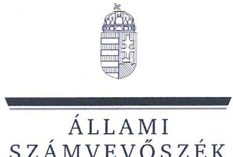
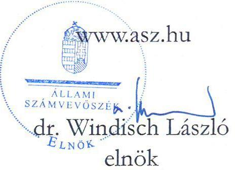
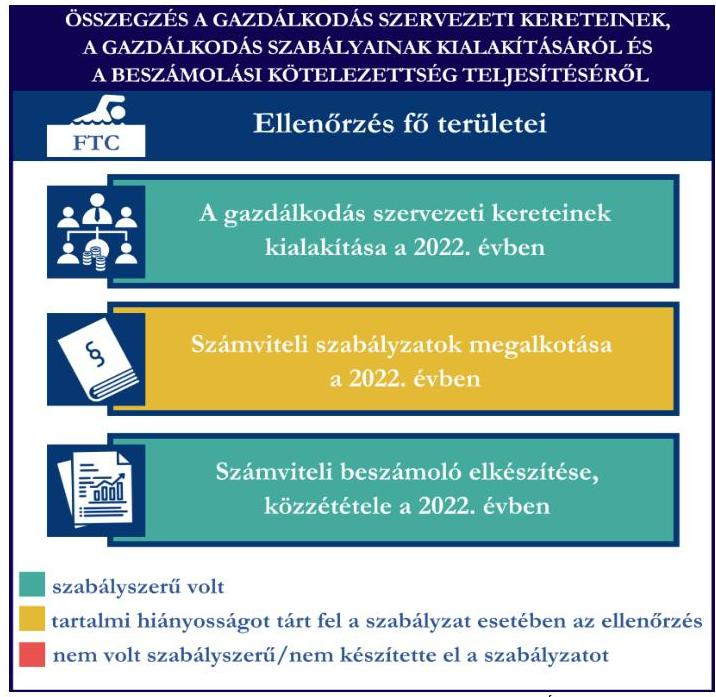
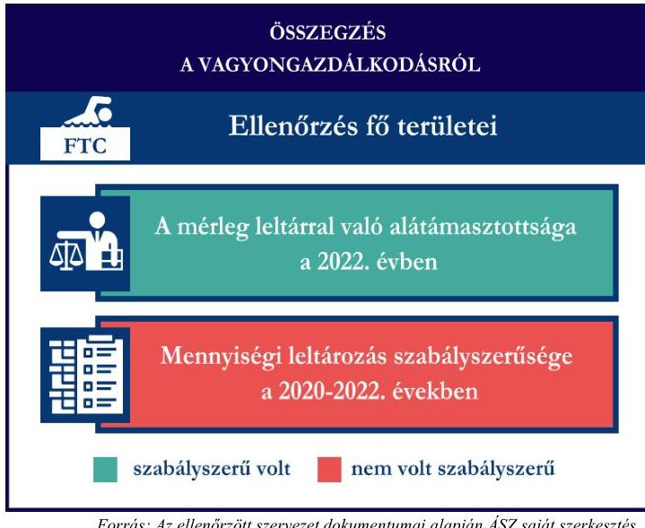
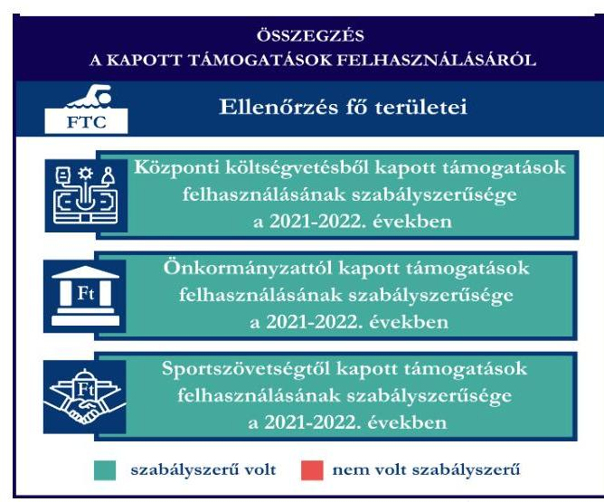

# JELENTÉS 

## Támogatásban részesülő sportszövetségek és sportegyesületek gazdálkodásának ellenőrzése

Ferencvárosi Torna Club
2024.

---

ÁLLAMI
SZÁMVEVŐSZÉK

# JELENTÉS 

## Támogatásban részesülő sportszövetségek és sportegyesületek gazdálkodásának ellenőrzése

Ferencvárosi Torna Club
2024.

24097

---

# ELLENŐRZÉSI IGAZGATÓSÁG: 

## ÁLLAMHÁZTARTÁSON KÍVÜLI SZERVEZETEKET ELLENŐRZŐ IGAZGATÓSÁG

## ELLENŐRZÉSI IGAZGATÓ:

## KLINGA LÁSZLÓ igazgató

## ELLENŐRZÉSVEZETŐ:

## KAKAS SÁNDOR ellenőrzésvezető

SALAMIN VIKTOR ellenőrzésvezető

IKTATÓSZÁM: EL-4060-013/2024.
TÉMASZÁM: 2682
ELLENŐRZÉS-AZONOSÍTÓ SZÁM: V1026

---

# TARTALOMJEGYZÉK 

AZ ELLENŐRZÉS ALAPADATAI ..... 5
AZ ELLENŐRZÖTT SZERVEZETEK ..... 7
ÖSSZEFOGLALÁS ..... 8
AZ ELLENŐRZÉS FÓKUSZKÉRDÉSEI ..... 10
MEGÁLLAPÍTÁSOK ..... 11
JAVASLATOK ..... 14
MELLÉKLETEK ..... 15
I. sz. melléklet: Értelmező szótár ..... 15
II. sz. melléklet: Az ellenőrzött szervezetek jegyzéke ..... 18
III. sz. melléklet: Ellenőrzési kritériumok ..... 19
FÜGGELÉK: ÉSZREVÉTELEK ..... 20
RÖVIDÍTÉSEK JEGYZÉKE ..... 21

---

.

---

# AZ ELLENŐRZÉS ALAPADATAI 

## AZ ELLENŐRZÉS CÉLJA

Az ellenőrzés célja az államháztartásból nyújtott támogatással, vagy az államháztartásból meghatározott célra ingyenesen juttatott vagyon felhasználásával érintett sportszövetségek és sportegyesületek gazdálkodása szabályozottságának, gazdálkodási tevékenységének, ezen belül a beszámolási kötelezettség teljesítésének, a támogatások elkülönített nyilvántartásának, valamint a támogatások felhasználásának ellenőrzése.

## AZ ELLENŐRZÉS TÍPUSA

Szabályszerüségi ellenőrzés.

## AZ ELLENŐRZÖTT IDŐSZAK

Az 1. fókuszkérdés esetében a 2022. év.
A 2. fókuszkérdés vonatkozásában a 2021-2022. évek.
A 3. fókuszkérdés vonatkozásában a 2022. év, a mennyiségi felvétellel történő leltározás dokumentumai tekintetében a 2020-2022. évek.

## AZ ELLENŐRZÉS TÁRGYA

Az ellenőrzés tárgya a támogatásban részesülő sportszövetségek, sportegyesületek gazdálkodása szabályozottságának, gazdálkodási tevékenységén belül a beszámolási kötelezettség teljesítésének, a vagyonnyilvántartásának, a támogatások elkülönített nyilvántartásának, valamint az államháztartási forrásból származó közvetlen vagy közvetett támogatások és a meghatározott célra ingyenesen juttatott vagyon felhasználásának a vizsgálata volt. Az ellenőrzés a támogatások vonatkozásában kiterjedt továbbá a támogató felé történő beszámolási és elszámolási kötelezettségek teljesítésére, az ezekkel kapcsolatos jogszabályi és belső előírások betartására. Az ellenőrzés kiterjedt minden olyan körülményre és adatra, amely az ÁSZ ${ }^{1}$ jogszabályban meghatározott feladatainak teljesítéséhez, valamint az ellenőrzés program végrehajtása során felmerülő újabb összefüggések feltárásához szükséges.

Az ÁSZ tv. 25. § (3) bekezdésében meghatározottak alapján, amennyiben a rendelkezésre bocsátott dokumentumok, adatok, illetve tájékoztatás hitelességének, megalapozottságának, teljességének megállapítása vagy egyes ellenőrzési megállapítások alátámasztása, kiegészítése indokolta, az ellenőrzés tárgyát képezték az összefüggő tények vizsgálatához más szervezetek (ellenőrzést támogató szervezetek) által rendelkezésre bocsátott adatok, dokumentációk, megadott tájékoztatások, illetve az ott végzett ellenőrzés is.

Az 1. és 3. fókuszkérdés tekintetében a vizsgálat a teljes ellenőrzött szervezetre, a 2. fókuszkérdés tekintetében kizárólag az úszás sportszakágra vonatkozott.

---

# Az ellenőrzés jogsalapja 

Az ellenőrzés jogszabályi alapját az ÁSZ tv. ${ }^{2} 1 . \int(3)$ bekezdése, az 5. $\int(3)$ bekezdése, valamint a Civil tv. ${ }^{3} 47 . \int$ előírásai képezték.

## AZ ELLENŐRZÉS MÓDSZERE

Az ellenőrzést a nemzetközi standardokat irányadónak tekintve az ellenőrzési program szempontjai, az ellenőrzött időszakban hatályos jogszabályok, az ellenőrzés általános szakmai szabályai, az ellenőrzésre irányadó ÁSZ módszertanok figyelembevételével végezte az ÁSZ.

Az ellenőrzési kérdések megválaszolásához szükséges bizonyítékok megszerzése az ellenőrzött szervezet által rendelkezésre bocsátott dokumentumokra, adatokra alapozva kérdésfeltevés (információkérés), interjú, mintavételezés útján történt.

Az ellenőrzési bizonyítékként felhasználható adatforrások közé tartoztak egyrészt az ellenőrzés során az ellenőrzött szervezettől bekért dokumentumok, másrészt adatforrás lehetett minden további az ellenőrzés folyamán feltárt, az ellenőrzés szempontjából információt tartalmazó dokumentum.

A támogatásokkal, azok felhasználásával kapcsolatos kötelezettségek vizsgálatára mintavételi eljárások kerültek alkalmazásra. Támogatás-típusok szerint nagyságrend alapján 1-3 darab támogatás került részletes vizsgálat alá. Ezen támogatások felhasználásának szabályszerűsége támogatásonként kockázatértékelés alapján kiválasztott mintatételekkel került ellenőrzésre. A kiválasztott támogatási szerződésekhez kapcsolódó elszámolásokból 30-30 db mintatétel került ellenőrzésre, ahol az elszámolás nem érte el a 30 db -ot, ott tételes ellenőrzésre került sor. Ezen felül a vagyongazdálkodás szabályszerűségének ellenőrzéséhez is kockázatalapú mintavétel kapcsolódott. A támogatások felhasználása és a vagyongazdálkodás területén a minták ellenőrzése kiterjedt a könyvvezetési kötelezettség vizsgálatára is. A tárgyi eszközök tekintetében 30 db került kiválasztásra a 2022. évben állományban lévő eszközök közül azok nyilvántartásának, elszámolásának szabályszerűsége ellenőrzése céljából. Az ellenőrzésben nem statisztikai mintavételre került sor, ezért nem történt kivetítés a teljes sokaságra, a megállapításokat az ellenőrzött mintatételekre vonatkozóan fogalmaztuk meg.

---

# AZ ELLENŐRZÖTT SZERVEZETEK

## Ferencvárosi Torna Club

A Ferencvárosi Torna Club úszó szakosztályát 1904-ben alapították. Az FTC¹ célja a magyar testnevelési és sportmozgalom segítése, az általános testkultúra javítása és az iskolai, amatőr és a tömegsport sporttevékenységén keresztüli segítése, minőségi sporteredmények elérése, a hazai és nemzetközi élmezőnyhöz tartozó sportolók kiválasztása és versenyeztetése, tagjai részére a felkészüléshez és versenyzéshez, illetőleg a minőségi sporteredmények eléréséhez szükséges személyi és tárgyi feltételek megteremtése és folyamatos fejlesztése, az általa választott sportágakban az utánpótlás folyamatos kiválasztása és nevelése. Az ellenőrzött időszakban húsz szakosztályt üzemeltetett. Az FTC a 2022. évben könyvvizsgálatra és felügyelőbizottság létrehozására volt kötelezett. Az FTC a 2022. évben az alaptevékenységén felül vállalkozási tevékenységet is végzett. Az FTC által 2021-2022. években igénybe vett államháztartási forrásból származó támogatásokat az 1. táblázat foglalja össze.

|  AZ FTC ÁLTAL IGÉNYBE VETT TÁMOGATÁSOK /
ADATOK M/FT-BAN MEGADVA | 2021. év | 2022. év  |
| --- | --- | --- |
|  Központi költségvetési támogatás* | 3600,5 | 13924,4  |
|  Helyi önkormányzati támogatás* | 2,1 | 9,1  |
|  Magyar Úszó Szövetségtől kapott támogatás | 38,5 | 33,6  |

- több sportágat érintő támogatás

Forrás: Az ellenőrzött szervezet beszámolói és főkönyvi adatai alapján ÁSZ saját szerkesztés

---

# ÖSSZEFOGLALÁS 

Magyarország Alaptörvényének XX. cikke kimondja, hogy mindenkinek joga van a testi és lelki egészséghez, melynek érvényesülését Magyarország többek között a sportolás és a rendszeres testedzés támogatásával segíti elő. Az Országgyűlés a Sport tv. ${ }^{5}$-ben kinyilvánította, hogy a nemzet közössége a test művelését, a sportot, a nemzet alapértékének, kívánatos célnak tekinti. A sport a közjó része. Erősíti a közösség tagjainak egymáshoz tartozását, miként az egyén testi és lelki egészségét.

A sportegyesületek, sportszövetségek működésükre és szakmai tevékenységük ellátására költségvetési támogatásban, önkormányzati támogatásban, ingyenes vagyonjuttatásban, valamint látvány-esapatsport támogatásban részesülhetnek, amelyekre fokozott figyelem irányul.

A társadalom részéről jogosan felmerülő elvárás, hogy a közpénzeket kezelő, azzal gazdálkodó szervezetek működéséről, tevékenységéről átfogó képet kapjon, a közpénzek rendeltetésszerủ és átlátható módon történő felhasználásának értékelésére időről-időre sor kerüljön az ellenőrzések keretében.
1. ábra

A FTC által a gazdálkodási szabályzatok kialakítása, a könyvvezetési és beszámolási kötelezettség teljesítése a 2022. évben kisebb hiányosságok mellett szabályszerű volt.

Az FTC a könyvviteli szolgáltatás személyi feltételeit, a 2022. évi számviteli beszámoló vonatkozásában a könyvvizsgálatot biztosította. A jogszabályban, valamint az FTC alapszabályában előírt felügyelőbizottsággal rendelkezett a 2022. évben.

A jogszabályban előírt számviteli szabályzatokat az FTC elkészítette, azonban a számlarendje nem volt szabályszerű a 2022-es évben.

A könyvvezetés formája a 2022. évben megfelelt a jogszabályi előírásoknak. Az FTC a 2022. évi számviteli beszámoló elkészítésének szabályszerűségét biztosította, közzétette, azonban a közhasznúsági melléklete, valamint a beszámoló kiegészítő melléklete nem tartalmazta hiánytalanul a jogszabályban előírt adatokat.

A gazdálkodási szabályok kialakítása és a beszámolási kötelezettség ellenőrzésének az összegzését az 1. ábra tartalmazza.

---

Az FTC az úszó szakosztály részére a központi költségvetésből, az önkormányzattól és a MÜSZ ${ }^{6}$-on keresztül nyújtott támogatások ellenőrzött tételeit a 20212022. években szabályszerűen használta fel.

A kapott támogatások felhasználásának ellenőrzéséről az összegzést a 2. ábra tartalmazza.

Forrás: Az ellenörzött szervezet dokumentumai alapján ÁSZ saját szerkesztés

Forrás: Az ellenőrzött szervezet dokumentumai alapján ÁSZ saját szerkesztés

Az FTC a jogszabályoknak megfelelően gondoskodott saját vagyona nyilvántartásáról és a beszámolóban történő megjelenítéséről, az ellenőrzött tételek tekintetében a vagyongazdálkodása szabályszerű volt. Az FTC a 2022. évi beszámolójának mérlegtételeit leltárral alátámasztotta, azonban a mérlegben szereplő tárgyi eszközök és készletek mennyiségi leltározását az előírások ellenére nem végezte el 2020-2022. években. Az FTC a vagyonkezelt eszközeit az előírtak alapján nyilvántartotta, az ellenőrzött tételeinek a hasznosítása szabályszerű volt.
A vagyongazdálkodás ellenőrzésének összegzését a 3. ábra tartalmazza.

---

# AZ ELLENŐRZÉS FÓKUSZKÉRDÉSEI 

1.     - A gazdálkodási szabályok kialakítása, a könyvvezetési és beszámolási kötelezettség teljesítése szabályszerű volt-e?
2.     - A kapott támogatások felhasználása szabályszerű volt-e?
3.     - Az ellenőrzött szervezet vagyongazdálkodása szabályszerű volt-e?

---

# 1. A gazdálkodási szabályok kialakítása, a könyvvezetési és beszámolási kötelezettség teljesítése szabályszerű volt-e? 

Összegző megállapítás Az FTC-nél a 2022. évben a gazdálkodási szabályok kialakításra kerültek, a beszámolási kötelezettség teljesítése kisebb hiányosággal szabályszerű volt.

Az FTC a 2022. évben a Számv. tv. ${ }^{7}$, valamint a Civilszr. ${ }^{8}$ előírásaiban foglaltaknak megfelelően gondoskodott a könyvviteli szolgáltatás személyi feltételeinek teljesüléséről. Az FTC a 2022. évben a Számv. tv.-ben, valamint Civilszr.-ben előírtaknak megfelelően könyvvizsgálót bízott meg a beszámoló felülvizsgálatára. Az FTC a 2022. évben a Ptk. ${ }^{9}$ előírásai alapján rendelkezett felügyelőbizottsággal. A felügyelőbizottság elkészítette az ügyrendjét, valamint a 2022. évi számviteli beszámolót véleményezte.
Az FTC 2022-ben rendelkezett a Számv. tv-ben előírt számviteli politikával, azon belül az eszközök és a források leltárkészítési és leltározási szabályzatával, az eszközök és a források értékelési szabályzatával, pénzkezelési szabályzattal, valamint számlarenddel, amelyek - a számlarend kivételével - az ellenőrzött tartalmi kritériumoknak megfeleltek. Az FTC 2022. évben hatályos számlarendje nem felelt meg a Számv. tv. 161. § (2) bekezdés a) pontjában foglaltaknak, mert nem tartalmazta minden alkalmazott számla számát, megnevezését. Az FTC 2021-2022-ben hatályos leltározási szabályzatának ${ }^{10}$ 2. fejezete, valamint 5.1. fejezete a tárgyi eszközök mennyiségi leltározásával kapcsolatban ellentétes szabályozást tartalmazott, mivel a 2. pontban évenkénti, az 5.1 pontban 3 évenkénti mennyiségi leltározást írt elő.
Az FTC a Számv. tv.-ben, Civil tv.-ben, valamint a Civilszr.-ben előírtak szerinti könyvvitelt vezetett. Az FTC a vállalkozási és az alaptevékenység bevételeinek és költségeinek Civilszr. előírása szerinti elkülönítését a könyviteli rendszerében teljesítette. Az FTC 2022-ben a könyvviteli nyilvántartását úgy vezette, hogy a Számv. tv., valamint a Civilszr. előírásainak megfelelően a számviteli beszámolóban az egyéb bevételeken belül részletezni tudta a kapott támogatások és tagdíjak összegeit.
Az FTC a Civil tv.-ben, valamint a Számv. tv. előírásai alapján előírt könyvvitellel alátámasztott számviteli beszámolóját, továbbá a Civil tv.-ben előírtak alapján a közhasznúsági mellékletét elkészítette, azonban a közhasznúsági melléklet a Civil vhr. ${ }^{11} 12 . \S$ (1) bekezdésében, illetve a Civil vhr. mellékletének 5. pontjában előírtak ellenére nem tartalmazta a cél szerinti juttatások bemutatását. Az FTC a 2022. évi számviteli beszámolóját a Ptk., valamint a Civil tv. alapján a legfőbb döntéshozó szerve hagyta jóvá, valamint a Civilszr. előírási alapján könyvvizsgáló felülvizsgálta, a felügyelőbizottság véleményezte. Az FTC 2022. évi elfogadott számviteli beszámolóját, valamint közhasznúsági mellékletét a Számv. tv.-ben, valamint a Civil tv.-ben előírtaknak megfelelően letétbe helyezte, közzétette.

---

# 2. A kapott támogatások felhasználása szabályszerű volt-e?? 

## Összegző megállapítás

Az FTC az úszó szakosztálya részére nyújtott támogatásokat a 2021-2022. években az ellenőrzött támogatások tekintetében szabályszerűen használta fel.

Az FTC az ellenőrzött támogatási szerződésekben foglaltak alapján, a központi költségvetésből kapott támogatás bevételeit a Civil tv. előírásai alapján elkülönítette a számviteli rendszerében. Az FTC a 20212022. években a Számv. tv.-ben és a Civil tv.-ben előírt alapcél szerinti tevékenysége költségei, ráfordításai ellentételezésére a költségvetésből kapott támogatásokról vezetett olyan elkülönített számviteli nyilvántartást, amelynek alapján támogatásonként megállapítható és ellenőrizhető a kapott támogatás felhasználása. Az FTC az ellenőrzött támogatási szerződések tekintetében a központi költségvetés támogatás felhasználásának elkülönített számviteli nyilvántartását a 2021-2022. években a számviteli rendszerében kialakította. A központi költségvetési támogatás terhére elszámolt ellenőrzött ráfordítások a Számv. tv. szerint kerültek elszámolásra, számviteli bizonylattal alátámasztottak voltak.
A központi költségvetési támogatás terhére elszámolt, ellenőrzött tételekből 1 db esetében a 474/2016. (XII.27.) Korm. rend. ${ }^{12}$ 24. § (2) bekezdésében foglaltak ellenére a támogatás felhasználásának számviteli bizonylatán az FTC az elszámolásban szereplő összeget nem záradékolta, így nem jelezte, hogy a számviteli bizonylaton szereplő összegből mennyit számolt el a szerződésszámmal hivatkozott támogatási szerződés terhére. Az FTC a támogatás felhasználásáról a támogató által előírt formában elkészítette az előírt beszámolókat és az összesített elszámolási táblázatokkal együtt a támogatási szerződésekben foglaltak alapján benyújtotta a támogatónak.
A Számv. tv., valamint a Civil tv. előírásainak megfelelően az FTC az ellenőrzött támogatási szerződésekben meghatározott önkormányzati támogatási bevételeket és azok felhasználását a 2021-2022. években elkülönítetten mutatta ki a számviteli nyilvántartásában. Az FTC a támogatási szerződésben és az alapján az Áht. ${ }^{13}$-ban foglalt előírások alapján teljesítette a beszámolási kötelezettségét az önkormányzati támogatás rendeltetésszerű felhasználásáról a 2021-2022. években. Az FTC a 2021-2022. években elszámolt önkormányzati támogatások ellenőrzött tételeit a Számv. tv.-ben előírtaknak megfelelő, szabályszerű számviteli bizonylattal alátámasztotta.
Az FTC a központi költségvetésből a MÚSZ-on keresztül számára juttatott sportcélú ellenőrzött támogatást és annak felhasználását a 2021-2022. években a Civil. tv. és a Számv. tv. előírásainak megfelelően a számviteli rendszerében elkülönítetten tartotta nyilván. A központi költségvetésből a MÚSZ-on keresztül számára juttatott sportcélú ellenőrzött támogatás felhasználásáról az Áht. és a támogatási szerződésben foglaltak szerint beszámolt a támogató felé. Az FTC a 2021-2022. években elszámolt támogatások ellenőrzött tételeit a Számv. tv.-ben előírtaknak megfelelő, szabályszerű számviteli bizonylattal alátámasztotta.

---

# 3. Az ellenőrzött szervezet vagyongazdálkodása szabályszerű volt-e? 

Összegző megállapítás Az FTC vagyongazdálkodása a 2022. évben az ellenőrzött tételek vonatkozásában szabályszerű volt. A beszámoló mérlegtételeit leltárral alátámasztotta. A mérlegben szereplő tárgyi eszközök és készletek mennyiségi leltározását nem végezte el. A vagyonkezelt eszközök nyilvántartása és az ellenőrzött tételeinek a hasznosítása szabályszerű volt.

Az FTC a 2022. évi beszámolójának mérlegtételeit a Számv. tv. alapján szabályszerű leltárral, leltár egyeztetéssel alátámasztotta. Az FTC a 2020-2022. évben a Számv. tv. 69. § (3) bekezdésében, valamint a leltározási szabályzatának 5. pontjában foglaltak ellenére a tárgyi eszközök és a készletek mennyiségi felvétellel történő leltározását nem végezte el.
Az ellenőrzött tárgyi eszközök bekerülési értékét alátámasztó számviteli bizonylatok a Számv. tv.-ben előírtaknak megfelelően rendelkezésre álltak. Az ellenőrzött tárgyi eszközök számviteli besorolása, értékcsökkenés elszámolása megfelelt a Számv. tv. előírásainak, az üzembe helyezés tényét a Számv. tv.ben előírtak alapján dokumentálta.
Az FTC a 2022. évben a vagyonkezelt eszközeit a Vtv. vhr. ${ }^{14}$ előírásai alapján az előírt tartalmú nyilvántartás vezetésével a saját eszközeitől elkülönítetten kezelte. A Számv. tv. 23. § (2) bekezdésében előírtak ellenére a 2022. évben az FTC a vagyonkezelt eszközeit a kiegészítő mellékletben külön nem mutatta be. Az FTC az ellenőrzött vagyonkezelt eszközök hasznosítására vonatkozó szerződést a 2022. évben az Nvtv. ${ }^{15}$ előírásai alapján átlátható szervezettel kötötte meg. Az FTC a vagyon hasznosításával kapcsolatos ellenőrzött három szerződésben az Nvtv. előírásai alapján határozta meg a bérleti szerződés időtartamát, a szerződések tartalmazták az Nvtv. által előírt nyilatkozatokat az adatszolgáltatás teljesítéséről, a megfelelő használatról, valamint a hasznosításban résztvevő harmadik félről.

---

# JAVASLATOK 

Az ÁSZ tv. 33. § (1) bekezdésében foglaltak értelmében az ellenőrzött szervezet vezetője köteles a jelentésben foglalt megállapításokhoz kapcsolódó intézkedési tervet összeállítani és azt a jelentés kézhezvételétől számított 30 napon belül az ÁSZ részére megküldeni. Amennyiben az ellenőrzött szervezet vezetője nem küldi meg határidőben az intézkedési tervet, vagy továbbra sem elfogadható intézkedési tervet küld, az Állami Számvevőszék elnöke az ÁSZ tv. 33. § (3) bekezdése a) és b) pontjaiban foglaltakat érvényesítheti.

## FERENCVÁROSI TORNA CLUB ELNÖKÉNEK

1. Gondoskodjon a Számv. tv. 161. § (2) bekezdés a) pontjában foglaltaknak megfelelő számlarend elkészítéséről.
2. Gondoskodjon arról, hogy a leltározási szabályzat a mennyiségi leltározással kapcsolatban ne tartalmazzon egymással ellentételes előírásokat.
3. Gondoskodjon arról, hogy a beszámoló közhasznúsági melléklete hiánytalanul tartalmazza a Civil vhr. 12. § (1) bekezdésében előírt adatokat.
4. Gondoskodjon arról, hogy a támogatás felhasználását alátámasztó számviteli bizonylaton a 474/2016. (XII.27) Korm. rend. 24. § (2) bekezdésében előírt záradékolás minden esetben szerepeljen.
5. Gondoskodjon a tárgyi eszközök és készletek mennyiségi felvétellel való tételes leltározásáról a Számv. tv. 69. § (3) bekezdésében, valamint a leltározási szabályzatban előírtaknak megfelelően.
6. Gondoskodjon arról, hogy a vagyonkezelt eszközök a Számv. tv. 23. § (2) bekezdésében előírtak szerint a kiegészítő mellékletben külön bemutatásra kerüljenek.

---

# MELLÉKLETEK 

## I. SZ. MELLÉKLET: ÉRTELMEZŐ SZÓTÁR

Civil szervezet

Egyesület

Költségvetési támogatás

Közhasznú szervezet

Közhasznú tevékenység

Országos sportági szakszövetség

Sportági szövetség

A civil társaság; a Magyarországon nyilvántartásba vett egyesület - a párt, a szakszervezet és a kölcsönös biztosító egyesület kivételével és - a közalapítvány és a pártalapítvány kivételével - az alapítvány. (Forrás: Civil tv. 2. §6. pont a)-c) alpontjai)
Az egyesület a tagok közös, tartós, alapszabályban meghatározott céljának folyamatos megvalósítására létesített, nyilvántartott tagsággal rendelkező jogi személy. (Forrás: Ptk. 3:63. § (1) bekezdés)
A Számv. tv. szempontjából egyéb szervezet. (Számv. tv. 3. § (1) bekezdés 4.pont a) alpontja)

A társadalombiztosítás pénzügyi alapjai kivételével az államháztartás központi alrendszeréből ellenérték nélkül, pénzben nyújtott támogatások. (Forrás: Áht. 1. § 14. pont)

Közhasznú szervezetté minősíthető a Magyarországon nyilvántartásba vett közhasznú tevékenységet végző szervezet, amely a társadalom és az egyén közös szükségleteinek kielégítéséhez megfelelő erőforrásokkal rendelkezik, továbbá amelynek megfelelő társadalmi támogatottsága kimutatható, és amely:
a) civil szervezet (ide nem értve a civil társaságot), vagy
b) olyan egyéb szervezet, amelyre vonatkozóan a közhasznú jogállás megszerzését törvény lehetővé teszi. (Forrás: Civil tv. 32. § (1) bekezdés)
Minden olyan tevékenység, amely a létesítő okiratban megjelölt közfeladat teljesítését közvetlenül vagy közvetve szolgálja, ezzel hozzájárulva a társadalom és az egyén közös szükségleteinek kielégítéséhez. (Forrás: Civil tv. 2. § 20. pont)

Olyan sportszövetség, amely sportágában kizárólagos jelleggel az e törvényben, valamint más jogszabályokban meghatározott feladatokat lát el és e törvényben megállapított különleges jogosítványokat gyakorol. Olyan sportágban hozható létre, amelyet vagy a Nemzetközi Olimpiai Bizottság elismert, vagy amely sportág nemzetközi szövetségét felvették a Nemzetközi Sportszövetségek Szövetségébe (GAISF). (Forrás: Sport tv. 20. § (1), (4) bekezdés)
A Civil. tv. és a Ptk. előírásai alapján - a Sport tv.-ben meghatározott eltérésekkel - múködő szövetség, amelynek tagjai kizárólag sportszervezetek lehetnek. Sportági szövetség országos jelleggel is múködhet. Egy sportágban csak egy országos sportági szövetség múködhet. Törvényi feltételek teljesülése esetén szakszövetségi feladatokat is elláthat. (Forrás: Sport tv. 28. §)

---

Sportegyesület

Sportegyesületeknek, sportszövetségeknek költségvetési támogatás

Sportszövetség

Sporttevékenység

Vagyongazdálkodás

A Civil. tv. és a Ptk. szabályai szerint múködő olyan egyesület, amelynek alaptevékenysége a sporttevékenység szervezése, valamint a sporttevékenység feltételeinek megteremtése. A sportegyesületek a Sport. tv. 15. § (1) bekezdésében meghatározott sportszervezetek körébe tartoznak. A sportegyesületeken kívül sportszervezet még a sportvállalkozás, a sportiskola, valamint az utánpótlás-nevelés fejlesztését végző alapítvány. (Forrás: Sport tv. 16. $\S(1)$ bekezdés)

Az állami sport célú támogatások felhasználásáról és elosztásáról szóló 474/2016. (XII. 27.) Kormány rendelet és a 27/2013. (III. 29.) EMMI rendelet ${ }^{16}$ 1. $\S$-ában meghatározott fejezeti kezelésű előirányzatokból nyújtott támogatás.

Meghatározott sporttevékenységek körében a sportversenyek szervezésére, a tagok érdekvédelmére és a részükre való szolgáltatásokra, valamint a nemzetközi kapcsolatok lebonyolítására létrehozott, jogi személyiséggel és önkormányzattal rendelkező, a Civil. tv. és a Ptk. alapján - az e törvényben foglalt eltérésekkel - különös formában müködő egyesületek. A Sport tv. 19. § (3) bekezdése szerint a sportszövetségeknek az alábbi típusai léteznek: országos sportági szakszövetségek, sportági szövetségek, szabadidősport szövetségek, fogyatékosok sportszövetségei, diák- és egyetemi-főiskolai sport sportszövetségei, nemzetközi sportszövetségek.
(Forrás: Sport tv. 19. § (1), (3) bekezdés)
Meghatározott szabályok szerint, a szabadidő eltöltéseként kötetlenül vagy szervezett formában, illetve versenyszerűen végzett testedzés vagy szellemi sportágban kifejtett tevékenység, amely a fizikai erőnlét és a szellemi teljesítőképesség megtartását, fejlesztését szolgálja.
(Forrás: Sport tv. 1. § (2) bekezdés)
A nemzeti vagyongazdálkodás feladata a nemzeti vagyon megőrzése, értékének és állagának védelme, rendeltetésének megfelelő, az állam, az önkormányzat mindenkori teherbíró képességéhez igazodó, elsődlegesen a közfeladatok ellátásához és a mindenkori társadalmi szükségletek kielégítéséhez szükséges, egységes elveken alapuló, átlátható, hatékony és költségtakarékos múködtetése, értéknövelő használata, hasznosítása, gyarapítása, továbbá az állam vagy a helyi önkormányzat feladatának ellátása szempontjából feleslegessé váló vagyontárgyak elidegenítése, azzal, hogy a nemzeti vagyon megőrzése érdekében végzett bontás vagy átalakítás nem minősül az állag védelmi kötelezettség megszegésének. A kiemelt kulturális örökségvédelmi és természetvédelmi szempontok - kulturális és természeti értékek jövő nemzedékek számára való megőrzése érdekében történő - érvényesítésének nem akadálya a vagyon értékváltozása. (Forrás: Nvtv. 7. § (2) bekezdés)

---

Vagyonkezelő
a) az állam tulajdonában álló nemzeti vagyon tekintetében:
aa) költségvetési szerv,
ab) helyi önkormányzat, nemzetiségi önkormányzat, valamint ezek társulásai,
ac) az ab) alpontban felsoroltak fenntartása vagy irányítása alá tartozó intézmény,
ad) köztestület,
ae) az állam, az aa)-ae) alpontban meghatározott személyek együtt vagy különkülön $100 \%$-os tulajdonában álló gazdálkodó szervezet,
af) az ae) alpont szerinti gazdálkodó szervezet $100 \%$-os tulajdonában álló gazdálkodó szervezet,
ag) országos törzshálózati vasúti pályát működtető többségi állami tulajdonú gazdasági társaság,
ah) a törvény által kijelölt egyedileg meghatározott jogi személy;
b) a helyi önkormányzat tulajdonában álló nemzeti vagyon tekintetében:
ba) állam, helyi önkormányzat, nemzetiségi önkormányzat, helyi vagy nemzetiségi önkormányzati társulás, valamint ezek fenntartása vagy irányítása alá tartozó intézmény,
bb) költségvetési szerv,
bc) köztestület,
bd) a ba) alpontban meghatározott személyek együtt vagy külön-külön 100\%os tulajdonában álló gazdálkodó szervezet,
be) a bd) alpont szerinti gazdálkodó szervezet $100 \%$-os tulajdonában álló gazdálkodó szervezet.
c) az egyházi jogi személy, valamint a közfeladatot ellátó közérdekủ vagyonkezelő alapítvány és az általa fenntartott felsőoktatási intézmény a tevékenysége ellátásához szükséges nemzeti vagyon tekintetében. (Forrás: Nvtv. 3. § (1) bekezdés 19. pont)

A vagyonkezelő köteles a vagyontárgy állagának megóvásáról, jó karbantartásáról, működtetéséről gondoskodni, jogszabályban és szerződésben előírt más kötelezettségét teljesíteni, valamint a vagyontárgyat jogszabályban vagy szerződésben meghatározott célnak megfelelően használni.

A vagyonkezelő - a központi költségvetési szervek és a kizárólag közfeladatot ellátó nem központi költségvetési szerv vagyonkezelők kivételével - köteles díjat fizetni, jogszabályban és szerződésben előírt más kötelezettségét teljesíteni, valamint a vagyontárgyat jogszabályban vagy szerződésben meghatározott célnak megfelelően használni. Amennyiben a vagyonkezelő ezen kötelezettségeinek nem tesz eleget, a tulajdonosi joggyakorló jogosult a szerződést azonnali hatállyal felmondani. (Forrás: Vtv. ${ }^{17}$ 27. § (2), (2a) bekezdés)

---

II. SZ. MELLÉKLET: AZ ELLENŐRZŐTT SZERVEZETEK JEGYZÉKE

# ELLENŐRZŐTT SZERVEZET NEVE 

## ELLENŐRZŐTT SZERVEZET SZÉKHELYE

Ferencvárosi Torna Club
1091 Budapest, Ullói út 129.

---

# FÓKUSZKÉRDÉS 

## 1. fókuszkérdés:

A gazdálkodási szabályok kialakítása, a könyvvezetési és beszámolási kötelezettség teljesítése szabályszerű volt-e?

## 2. fókuszkérdés:

A kapott támogatások felhasználása szabályszerű volt-e?

## 3. fókuszkérdés:

Az ellenőrzött szervezet vagyongazdálkodása szabályszerű volt-e?

## ÉLLENŐRZÉSI KRITÉRIUMOK

Számv. tv. 14. § (3) bekezdés, (5) bekezdés a), b), d) pont, (8) bekezdés, (11) bekezdés, 69. $\$ (3) bekezdés, 90. $\$ (3) bekezdés c) pont, 161. $\$ \quad$ (1) bekezdés, (2) bekezdés a)-d) pont, (3)-(4) bekezdés, 161/A. $\$ (2) bekezdés, 165. $\$ (2) bekezdés
Civilszr. 7. § (1) bekezdés, (4) bekezdés b), c) pont, 8. § (2), (3) bekezdés, 9. § (4), (5), (8) bekezdés, 12. § (4), (5) bekezdés, 15. § (1) bekezdés a), b) pont, 16. § (1) bekezdés, 24. § (2) bekezdés

Civil vhr. 12. § (1) bekezdés, melléklet 5. pont
Ptk. 3:26. § (1) bekezdés, 3:27. § (1) bekezdés, 3:82. § (1) bekezdés,
Civil tv. 28.§ (1) bekezdés, 29. § (2) bekezdés c) pont, (3), (6), (7) bekezdés, 30. § (1)-(4) bekezdés 40. § (1), (2) bekezdés, 41. § (1) bekezdés

Sport tv. 23. § (1) bekezdés f) pont
Számv. tv. 44. § (2) bekezdés, 93. § (3) bekezdés, 159. §, 161/A. $\int$ (2) bekezdés, 165. § (2) bekezdés, 167. § (1) bekezdés a), d), e), h) pont

Civil tv. 20.§ (2) bekezdés a) pont, (3) bekezdés a), c) pont, (4) bekezdés, 29. § (4), (5) bekezdés
Civilszr. 24. § (2) bekezdés
27/2013. (III.29.) EMMI rend. 18. § (2) bekezdés
474/2016. (XII. 27.) Korm. rend. 22. § (2) bekezdés, 24. § (2) bekezdés
Áht. 53. §, Ávr. ${ }^{18}$ 92. §, 93. § (2)-(4) bekezdések
Ptk. 3:63. § (4) bekezdés
Számv. tv. 3. § (3) bekezdés 3. pont, 15. § (3) bekezdés, 23. § (2) bekezdés, 46. § (3), (4) bekezdés, 47-51. §, 52. § (1)-(7) bekezdés, 69. § (1)-(3) bekezdések, 165. § (2) bekezdés, 169. § (2) bekezdés

Vtv. 23. § (2)-(4) bekezdés, 27. § (2), (7)-(9) bekezdés, 20. § (4) bekezdés c) pont
Vtv. vhr. 7. § (3) bekezdés, 9. § (9) bekezdés, 9/A. § (1) bekezdés b) pont, 9/A. § (2) bekezdés, 10. § (4) bekezdés, 14. § (1), (3) bekezdés, 17. § (1) bekezdés
Nvtv. 11. § (1), (7), (8) bekezdés a) pont, (10) bekezdés, (11) bekezdés a), b), c) pont, (12), (13) bekezdés

---

# FÜGGELÉK: ÉSZREVÉTELEK 

A jelentéstervezetet a Számvevőszék 15 napos észrevételezésre megküldte az ellenőrzött szervezet vezetőjének az ÁSZ tv. 29. §* (1) bekezdése előírásának megfelelően.

A Ferencvárosi Torna Club elnöke a jelentéstervezetre nem tett észrevételt.

[^0]
[^0]:    * 29. § (1) Az Állami Számvevőszék az ellenőrzési megállapításait megküldi az ellenőrzött szervezet vezetőjének vagy az általa megbízott személynek, és annak, akinek személyes felelősségét állapította meg.
    (2) Az ellenőrzött szervezet vezetője és a felelősként megjelölt személy az ellenőrzés megállapításaira tizenöt napon belül írásban észrevételt tehet.
    (3) Az Állami Számvevőszék az észrevételre a beérkezésétől számított harminc napon belül írásban válaszol. A figyelembe nem vett észrevételeket köteles a jelentésben feltüntetni, és megindokolni, hogy azokat miért nem fogadta el.

---

# RÖVIDÍTÉSEK JEGYZÉKE 

${ }^{1}$ ÁSZ
${ }^{2}$ ÁSZ tv.
${ }^{3}$ Civil tv.
${ }^{4}$ FTC
${ }^{5}$ Sport tv.
${ }^{6}$ MÚSZ
${ }^{7}$ Számv. tv.
${ }^{8}$ Civilszr.
${ }^{9}$ Ptk.
${ }^{10}$ leltározási szabályzat
${ }^{11}$ Civil vhr.
${ }^{12}$ 474/2016. (XII.27.) Korm. rendelet
${ }^{13}$ Áht.
${ }^{14}$ Vtv. vhr.
${ }^{15}$ Nvtv.
${ }^{16}$ 27/2013. (III.29.) EMMI rendelet
${ }^{17}$ Vtv.
${ }^{18}$ Ávr.

Állami Számvevőszék
2011. évi LXVI. törvény az Állami Számvevőszékről
2011. évi CLXXV. törvény az egyesülési jogról, a közhasznú jogállásról, valamint a civil szervezetek müködéséről és támogatásáról
Ferencvárosi Sport Club
2004. évi I. törvény a sportról

Magyar Úszó Szövetség
2000. évi C. törvény a számvitelről
479/2016. (XII. 28.) Korm. rendelet a számviteli törvény szerinti egyes egyéb szervezetek beszámoló készítési és könyvvezetési kötelezettségének sajátosságairól
2013. évi V. törvény a Polgári Törvénykönyvről

Az FTC 2021-2022. években hatályos leltározási szabályzata
350/2011. (XII. 30.) Korm. rendelet - a civil szervezetek gazdálkodása, az adománygyűjtés és a közhasznúság egyes kérdéseiről
474/2016. (XII. 27.) Korm. rendelet az állami sport célú támogatások felhasználásáról és elosztásáról
2011. évi CXCV. törvény az államháztartásról
254/2007. (X. 4.) Korm. rendelet az állami vagyonnal való gazdálkodásról
2011. évi CXCVI. törvény - a nemzeti vagyonról
27/2013. (III. 29.) EMMI rendelet az állami sport célú támogatások felhasználásáról és elosztásáról
2007. évi CVI. törvény az állami vagyonról
368/2011. (XII. 31.) Korm. rendelet az államháztartásról szóló törvény végrehajtásáról

---

1052 Budapest, Apáczai Csere János u. 10. | 1364 Budapest 4., Pf. 54
www.asz.hu | szamvevoszek@asz.hu
telefon: +36 14849100