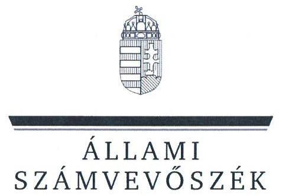
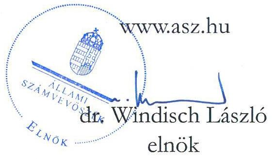
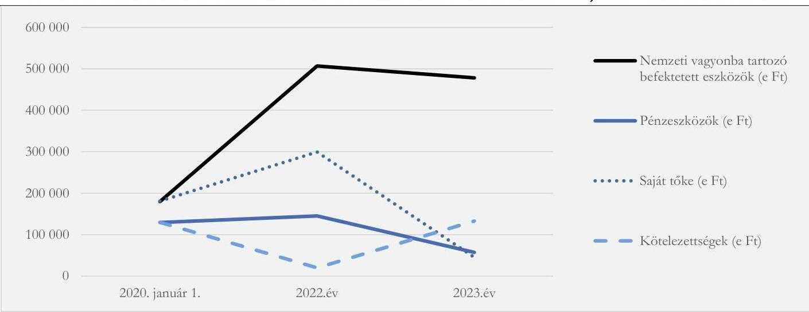
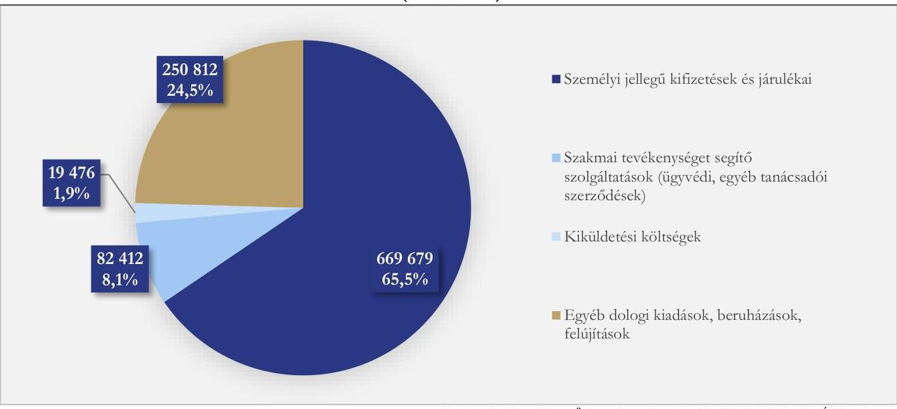
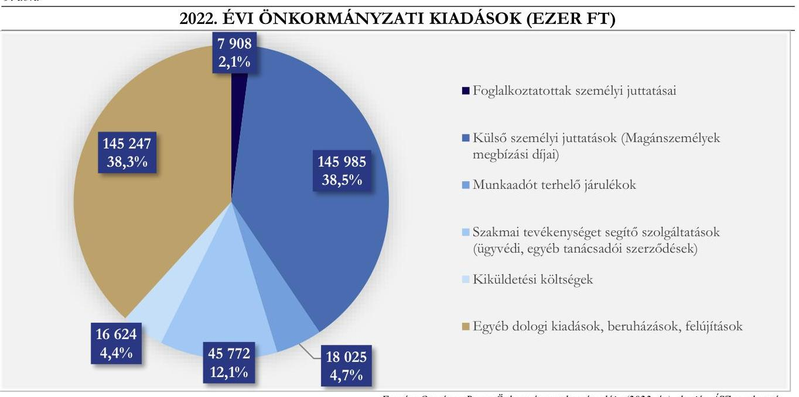

# JELENTÉS 

## Az országos nemzetiségi önkormányzatok ellenőrzése

## Országos Roma Önkormányzat

2024.

---

ÁLLAMI
SZÁMVEVŐSZÉK

# JELENTÉS 

## Az országos nemzetiségi önkormányzatok ellenőrzése

Országos Roma Önkormányzat

2024.

24098

---

# ELLENŐRZÉSI IGAZGATÓSÁG: 

## ÁLLAMHÁZTARTÁS HELYI SZINTJÉT ELLENŐRZŐ IGAZGATÓSÁG

## ELLENŐRZÉSI IGAZGATÓ:

DR. BAFFIA GERGELY GÁBOR igazgató

## ELLENŐRZÉSVEZETŐ:

Jelentéseink az interneten a www.asz.hu címen olvashatók.

DR. LÁNG ÁGNES KRISZTINA ellenőrzésvezető

IKTATÓSZÁM: EL-3886-020/2024.
TÉMASZÁM: 2688.
ELLENŐRZÉS-AZONOSÍTÓ SZÁM: V103202

---

# TARTALOMJEGYZÉK 

AZ ELLENŐRZÉS ALAPADATAI ..... 5
AZ ELLENŐRZÖTT SZERVEZET ..... 8
ÖSSZEFOGLALÁS ..... 10
AZ ELLENŐRZÉS FÓKUSZTERÜLETEI ..... 12
MEGÁLLAPÍTÁSOK ..... 13
JAVASLATOK ..... 31
MELLÉKLETEK ..... 34
I. sz. melléklet: Értelmező szótár ..... 34
II. sz. melléklet: Az ellenőrzött szervezetek jegyzéke ..... 35
III. sz. melléklet: Ellenőrzési kritériumok ..... 36
IV. sz. melléklet: Az Önkormányzat konszolidált mérlegadatai a 2020-2022. években (ezer Ft) ..... 38
V. sz. melléklet: Az Önkormányzat kiadási és bevételi adatai a 2020-2022. években (ezer Ft) ..... 39
VI. sz. melléklet: Az Önkormányzat és a hivatal által kötött megbízási szerződések adatai a 2020-2022. években ..... 40
VII. sz. melléklet: Az Önkormányzat és az intézmények - 2022-2023. III. negyedévekben a gazdálkodási jogkörök gyakorlása a mintatételeinek értékelése szerint. ..... 42
VIII. sz. melléklet: Kimutatás az Önkormányzat által teljesített személyi jellegű kifizetésekről, a szakmai feladatellátás érdekében kötött szolgáltatási szerződésekről ..... 46
IX. sz. melléklet: a külső forrással támogatott feladatok/programok/beruházások kimutatása 2022-2023.III. negyedévekben az önkormányzatnál (ezer Ft) ..... 47
X. sz. melléklet: Az Önkormányzat 2022. évi államháztartáson belülről kapott támogatásainak megoszlása ..... 48
XI. sz. melléklet: Kimutatás az önkormányzat és intézményei 2022. évi teljesített kiadásairól és annak forrásáról ..... 49
FÜGGELÉK: ÉSZREVÉTELEK ..... 50
RÖVIDÍTÉSEK JEGYZÉKE ..... 51

---

.

---

# AZ ELLENŐRZÉS ALAPADATAI 

## AZ ELLENŐRZÉS CÉLJA

Az ellenőrzés célja annak értékelése volt, hogy az Önkormányzat ${ }^{1}$ gazdálkodása, a gazdálkodással kapcsolatos szabályozása, az államháztartásból nyújtott költségvetési támogatások, illetve az államháztartásból meghatározott célra ingyenesen juttatott vagyon felhasználása a jogszabályi előírásoknak megfelelően történt-e, az Önkormányzat a nemzetiségek jogairól szóló törvényben előírt feladat- és hatásköröket ellátta-e.

Az ellenőrzés célja továbbá annak értékelése volt, hogy az Önkormányzat az intézmények fenntartójaként biztosította-e a szabályszerű, átlátható és elszámoltatható közpénzfelhasználás alapvető feltételeit; az irányítási jogok gyakorlása hozzájárult-e az intézmények szabályszerű gazdálkodásához és feladatellátásához.

## AZ ELLENŐRZÉS TÍPUSA

Megfelelőségi ellenőrzés.

## AZ ELLENŐRZÖTT IDŐSZAK

ÁSZ ${ }^{2}$ az Önkormányzat működési és gazdálkodási feltételeinek kialakítását a 2020. és a 2022. évek vonatkozásában, a közfeladatai ellátását a 2020-2023. III. negyedévének végéig ellenőrizte.

A pénzügyi- és vagyongazdálkodást a 2022. évre vonatkozóan, a költségvetés tervezését, végrehajtását, a vagyonhasznosítás értékelését a 2022-2023. III. negyedévének végéig, a vagyonelemek leltárral való alátámasztását a 2020-2022. évek tekintetében ellenőrizte az ÁSZ.

Az Önkormányzatnál rendelkezésre álló források megoszlása, a teljesített bevételek és kiadások értékelése a 2022. évre, az államháztartás alrendszereiből kapott támogatások felhasználása, elszámolása a 2022-2023. III. negyedévének vége vonatkozásában került ellenőrzésre.

A külső forrással (EU, hazai) támogatott feladatok/programok/beruházások megvalósítása szabályszerűségének ellenőrzött időszaka a 2022-2023. III. negyedévének vége volt.

Az ÁSZ a belső ellenőrzés kialakítását és működtetését a 2022. évre, a belső ellenőrzés tervezését a belső és külső ellenőrzések gazdálkodásra vonatkozó megállapításaira tett intézkedések nyomon követését a 2020 - 2022. évekre vonatkozóan ellenőrizte.

Az ellenőrzés a korrupciós kockázatok kezelését, az összeférhetetlenségi és a képesítési követelmények érvényesülését, a feladat- és hatáskör, valamint a kapcsolódó felelősségi kör szabályozását a 2022. évre, a vagyonnyilatkozattételre vonatkozó előírások betartását a 2020-2023. III. negyedévének végére vonatkozóan vizsgálta. A közzétételi kötelezettség teljesítése az ellenőrzés megkezdésének napján (2023. szeptember 20-án) fennálló állapot szerint értékelte az ÁSZ.

---

# AZ ELLENŐRZÉS TÁRGYA 

Az ellenőrzés tárgya az Önkormányzat kötelező és önként vállalt közfeladatainak ellátása, a költségvetési támogatások cél szerinti felhasználása, a pénzügyi és vagyoni helyzete, pénzügyi és vagyongazdálkodása, a vagyonváltozást eredményező döntések szabályszerűsége, a belső kontrollrendszere egyes elemeinek kialakítása és működtetése, továbbá a közzétételi kötelezettség teljesítése volt.

Az ellenőrzés kiterjedt minden olyan körülményre és adatra, amely az ÁSZ jogszabályban meghatározott feladatainak teljesítéséhez, valamint a program végrehajtása folyamán felmerült újabb összefüggések feltárásához szükséges volt.

## AZ ELLENŐRZÉS JOGALAPJA

Az ellenőrzés jogszabályi alapját az ÁSZ tv. ${ }^{3}$ 1. § (3) bekezdésének, az 5. § (2)-(3) és (6) bekezdéseinek előírásai képezték.

## AZ ELLENŐRZÉS MÓDSZERE

Az ÁSZ az ellenőrzést az Alaptörvény 43. cikk (1) bekezdésében meghatározott törvényességi szempontok, valamint a nemzetközi standardokat irányadónak tekintve az ellenőrzési program szempontjai, az ellenőrzött időszakban hatályos jogszabályok, az ellenőrzés szakmai szabályok és módszertanok figyelembevételével végezte.

Az ellenőrzési bizonyítékként felhasználható adatforrások közé tartoztak egyrészt az ellenőrzési program részletes szempontjainál felsorolt adatforrások, másrészt minden - az ellenőrzés folyamán feltárt, az ellenőrzés szempontjából releváns információt tartalmazó - dokumentum. Az ellenőrzés lefolytatásához az Önkormányzat tanúsítványok kitöltésével, az ÁSZ által kért dokumentumok megküldésével, valamint a helyszíni ellenőrzés során interjú keretében a feltett kérdésekre adott válaszokkal szolgáltatott adatokat. Az ÁSZ az ellenőrzést az Önkormányzat határozatainak előkészítésével, végrehajtásával, gazdálkodásával, valamint intézményei ${ }^{4}$ gazdálkodásával kapcsolatos feladatokat ellátó Hivatalban ${ }^{5}$ végezte. Az Önkormányzat és intézményei ellenőrzéssel érintett dokumentumait, tanúsítványait a Hivatal bocsátotta az ellenőrzés rendelkezésére.

A pénzügyi-és vagyongazdálkodás szabályozottságát az ellenőrzés az Önkormányzat határozatai, továbbá az Önkormányzat és a Hivatal szabályzatai alapján értékelte. A pénzügyi és vagyoni helyzet értékelése az Önkormányzat konszolidált éves beszámolójának adatai, a vagyonnyilvántartás alapján, továbbá a mérleg alátámasztottságának vizsgálatával történt. A leltározási, értékelési folyamat szabályszerűségére vonatkozó megállapításait az ÁSZ az Önkormányzat 2022. évi leltározási folyamatának ellenőrzése alapján tette.

Az Önkormányzat vagyonváltozást eredményező döntéseinek és azok végrehajtásának ellenőrzésére tételes ellenőrzéssel került sor. Az éves költségvetés végrehajtásának ellenőrzése során a 2022-2023. III. negyedév végéig a működési és felhalmozási kiadások értékelése mintavételi eljárás segítségével történt. Az Önkormányzatnál a 20 mintatétel, az intézményeknél a 10-10 mintatétel kockázati alapon, a főkönyvi adatállományából került kiválasztásra.

---

Az ÁSZ tételesen ellenőrizte az Önkormányzat és intézményei feladataihoz, programjaihoz, beruházásaihoz biztosított pályázati támogatások elszámolását.

Az ellenőrzés értékelte az Önkormányzat kötelező közfeladatai ellátását, a feladatellátás érdekében rendelkezésre bocsátott költségvetési támogatások cél szerinti felhasználását. Továbbá ellenőrizte az Önkormányzat pénzügyi gazdálkodási feladatainak ellátását, a vagyongazdálkodásának és a vagyonváltozást eredményező döntéseinek szabályszerűségét, valamint az Önkormányzat honlapján a kötelezően közzéteendő közérdekű adatok digitális formában történő hozzáférését, közzétételét. Az ÁSZ az egyes területek szabályszerűségének, megfelelőségének értékelését a III. számú mellékletben megjelölt kritériumok alapján végezte el.

---

# AZ ELLENŐRZÖTT SZERVEZET 

A Magyarországon elismert 13 nemzetiség közül a legnagyobb lélekszámmal rendelkező roma nemzetiség önkormányzata 1995. évben alakult. Feladat- és hatásköreit a Közgyűlés ${ }^{6}$ gyakorolja. A 2019-es általános nemzetiségi önkormányzati választáson a névjegyzékben szereplő 211133 választópolgár közül 117663 adta le szavazatát, melynek eredményeként összesen 47 képviselő kezdhette meg munkáját a Közgyűlésben, amelyet a tagjai közül választott Elnök ${ }^{7}$ képvisel. Az Elnökkel szemben a 2022. évben büntető eljárás indult. Az Elnök 2022 októberétől a Közgyűlés munkájában nem vett részt, feladatait az általános Elnökhelyettes ${ }^{8}$ látta el.

Az Önkormányzat a 2022. évi országgyűlési képviselő választáson nem állított roma nemzetiségi választási listát, így roma nemzetiségi képviselő vagy szószóló nem került megválasztásra az Országgyűlésbe.

Az Önkormányzat feladata az általa képviselt kisebbség érdekeinek országos, illetve szükség szerint a területi, települési képviseletének és védelmének ellátása, valamint a nemzetiségi kulturális autonómia fejlesztése érdekében országos szintű nemzetiségi intézményhálózat fenntartása.

Az ellenőrzött időszakban a Közgyűlés többször módosította a bizottságainak és a tanácsnokainak számát. A 2020. évben összesen nyolc, a 2021. évben egy, a 2022-évben három bizottság működött. A 2023. évben a Közgyűlés a kötelezően megválasztandó Pénzügyi Bizottságon felül az Ifjúsági Bizottságát, az Oktatási és Kulturális Bizottságát és a Hitéleti Bizottságát hozta létre. Valamennyi bizottság öt főből állt. A 47 fős Közgyűlés 2020. évben 20, a 2021-2022. évekre 40, a 2023. évben 22 tanácsnokot választott.

Az Önkormányzat 2009. július 1-jén hozta létre a Hivatalát. A Hivatal az Njtv. ${ }^{9}$-ben foglaltak alapján az országos önkormányzat szerveként előkészíti és végrehajtja annak határozatait, ellátja az Önkormányzat és intézményei gazdálkodásával kapcsolatos feladatokat.

Az Önkormányzat 2004. évben az Országos Roma Foglalkoztatási Központot, majd 2008. évben az Országos Roma Sportközpontot és az Országos Roma Kulturális és Média Centrumot, 2013-ban az Országos Roma Missziót alapította meg. Az Önkormányzat köznevelési intézményei közül a Tiszapüspöki Általános Iskolát 2007. évben, a Teleki József Általános Iskola és Szakképző Iskolát 2010. évben alapította.

Mind a hat költségvetési szervnél az alapítói jog gyakorlója, fenntartója és irányító szerve az Önkormányzat. Az intézmények pénzügyi-gazdálkodási feladatait a Hivatal látta el.

Az Országos Roma Sportközpont feladata volt az alap, közép- és felsőfokú oktatási intézmények tanulói, hallgatói számára szervezett, a tanórán kívüli sportfoglalkozásával, a szabadidősport-rendezvényekkel, a szabadidősport-szervezetek támogatásával, a szabadidősport népszerűsítésével kapcsolatos feladatok ellátása.

Az Országos Roma Foglalkoztatási Központot az álláskeresők munkahely megszerzését segítő, iskolarendszeren kívüli oktatásával és képzésével összefüggő feladatokra hozták létre.

Az Országos Roma Kulturális és Média Centrum feladatául a sokszínű roma kultúra és nyelv ápolását, megőrzését, a roma társadalom híreiről való tájékoztatást, a roma települési önkormányzatokkal és civil szervezetekkel történő kapcsolattartást határozták meg.

[^0]
[^0]:    ${ }^{9}$ a 47 képviselő összetétele: FIROSZ (Fiatal Romák Országos Szövetsége) - 18 fő, FHRALIPE (Fhralipe Független Cigány Szervezet Országos Szervezete) - 4 fő, RPM (Roma Polgárjogi Mozgalom) - 5 fő és a LUNGO DROM (Lungo Dron Országos Cigány Érdekvédelmi és Polgári Szövetség) - 20 fő

---

Az Országos Roma Missziót azzal a céllal hozták létre, hogy a hátrányos helyzetű gyermekek, fiatalok és családok életminőségét javítsa, valamint speciális tehetséggondozó programokat szervezzen.

Az általános iskolákban nyolc évfolyamon - országosan egységes követelmények szerint - alapfokú nevelés-oktatási, illetve a szakképző iskolában felnőttoktatási feladatokat láttak el.

Az Önkormányzat 2020. január 1-jei 130038 ezer Ft-os kötelezettségállományát egyes ingatlanai értékesítéséből, valamint a működésre kapott támogatásaiból a 2022. év végére 20002 ezer Ft-ra csökkentette. A BM ${ }^{10}$ 2023. március 20-án a 2017-2019. években folyósított működési és média, valamint intézmény fenntartás támogatások elszámolásának ellenőrzése alapján, összesen 538525 ezer Ft támogatás visszafizetésére szólította fel az Önkormányzatot. Az Önkormányzat a fizetési felszólításokban rögzített követelés jogalapját a kezdetektől vitatta, annak ténybeli alátámasztását kérte a BM-től. A BM a 30 napos fizetési határidő eredménytelen elteltét követően 33826 ezer Ft összeget közvetlen beszedési megbízással beszedett az Önkormányzat bankszámlájáról, majd a költségvetési támogatás visszafizetése érdekében, a NAV Keletbudapesti Adó- és Vámigazgatósága 2023. május 11-én 323046 ezer Ft beszedési megbízást eszközölt az Önkormányzat bankszámláin. A végrehajtási eljárás keretében a 2023. évben a NAV összesen 60699 ezer Ft összeget szedett be az Önkormányzat bankszámlájáról. A közoktatási intézmények működésének biztosítása érdekében 2023. augusztus 31-én a Hivatal, a kettő közoktatási intézmény és az illetékes tankerületi központok megállapodást kötöttek, ami a továbbiakban biztosította az iskolák mindennapi működésének zavartalanságát.

A költségvetési támogatás visszafizetése érdekében indult végrehajtási eljárás miatt az Önkormányzatnak a 2023. évben a 1013918 ezer Ft működési támogatás helyett 595695 ezer
 Ft működési célú államháztartáson belüli támogatás került kiutalásra. A 2023. év második felében, az Önkormányzat – működésének fenntartása érdekében – felélte a meglévő tartalékait, illetve további vagyontárgyat értékesített. Ennek következtében az Önkormányzat a 2023. év végére fizetésképtelen helyzetbe került.
1. ábra

AZ ÖNKORMÁNYZATI VAGYON ÉS FORRÁSÁNAK ALAKULÁSA 2020., 2022. ÉS 2023. ÉVEKBEN

Forrás: KGR K11 adatállomány ÁSZ szerkesztés

---

# ÖSSZEFOGLALÁS 

Az Önkormányzat a nemzetiségek jogairól szóló törvényben előírt feladat- és hatásköröket ellátta, azonban az államháztartáson belülről erre a célra juttatott támogatás egy részét nem a közfeladatainak ellátására fordította. Az Önkormányzat gazdálkodása és működése összességében nem volt szabályszerű.

A Közgyűlés a 2020. évben 20 tanácsnokot, 2021-2022. években 40 tanácsnokot, a 2023. évben 22 tanácsnokot választott, akik a szervezeti és működési szabályzatban foglaltak ellenére megállapításokat, javaslatokat nem terjesztettek a Közgyűlés elé. E mellett olyan bizottságok tagjainak fizettek ki tiszteletdíjat, amely bizottságok működéséről, tevékenységéről a jogszabály előírásai ellenére jegyzőkönyv nem állt rendelkezésre. A Hivatalvezető, majd a Helyettesítő hivatalvezető a jogszabályi előírásokat figyelmen kívül hagyva a Hivatal foglalkoztatottjaival közszolgálati jogviszony helyett munka jogviszonyt létesített és ezen dolgozók feladatkörébe tartozó feladatok elvégzésére további magánszemélyekkel megbízási szerződéseket kötött.

A Közgyűlés a főállású elnök mellett négy társadalmi megbízatású elnökhelyettest választott. A Közgyűlés a jogszabályi rendelkezések ellenére nem hozott határozatot a Közgyűlés üléseiről egy éve távol maradó Elnök képviselői megbízatásának megszűnéséről, így illetménye, egyéb juttatása továbbra is elszámolásra került.

A Közgyűlés a 2023-ban fennálló támogatás visszafizetési kötelezettsége és a jogszabály erre az esetre vonatkozó rendelkezése ellenére a tiszteletdíjak csökkentéséről nem döntött, továbbá a tanácsnokok számát a jogszabály módosított előírásai ellenére nem csökkentette.

Az Önkormányzat gazdálkodási feladatait ellátó Hivatal hivatalvezetői munkakörét 2021. július 1-jétől a jogszabályban foglaltak ellenére – a Közgyűlés döntése nélkül, hivatalvezetői utasítás alapján – a munkajogviszonyban foglalkoztatott gazdasági vezető végezte, aki sem a hivatalvezetőre, sem a gazdasági vezetőre a jogszabályban előírt képesítési feltételekkel nem rendelkezett.

Az Önkormányzat az országos szintű érdekképviseleti, érdekvédelmi feladatait ellátta, a nemzetiségi kulturális autonómia fejlesztése érdekében országos szintű nemzetiségi intézményhálózatot működtetett.

Az Önkormányzat és a Hivatala 2022. évben együttesen teljesített 506445 ezer Ft kiadása 4,8 %-kal haladta meg az erre a célra kapott támogatás összegét, ugyanakkor az intézmények teljesített kiadásai 10 %-kal elmaradtak a feladatellátásukra kapott támogatás összegétől. A 2022. évben folyósított 1035866 ezer Ft államháztartáson belülről juttatott működési támogatás az Önkormányzat összes költségvetési bevételének 87,8 %-a volt, melyből a közoktatási intézményeit megillető 348196 ezer Ft normatív támogatás mellett 196200 ezer Ft az intézményeinek fenntartását, 483200 ezer Ft a nemzetiséggel kapcsolatos közfeladatainak ellátását, valamint a nemzetiségi média működtetését szolgálta. A pályázati úton elnyert támogatás 2022. évben folyósított összege 8270 ezer Ft volt.

A 2022. évben az Önkormányzat a nemzetiséggel kapcsolatos közfeladatainak ellátására kapott támogatás terhére teljesített kiadásainak 75,5 %-át a személyi jellegű kifizetésekre és járulékaira, valamint a szakmai tevékenységet segítő szolgáltatásokra és a kiküldetési költségekre fordította. Több esetben a jogszabályban előírt kötelezettségvállalások hiánya, továbbá a jogszabályban és belső szabályzatban meghatározott gazdálkodási jogkörök gyakorlásának elmaradása és az összeférhetetlenségi szabályok figyelmen kívül hagyása nem szabályszerű kifizetésekhez vezettek. A jogszabály előírása ellenére a megbízási szerződés alapján nyújtott szakmai tevékenységet segítő szolgáltatások egy része a Hivatal által ellátandó

---

feladatokra irányult, vagy a támogatási szerződéstől eltérően nem kapcsolódott az önkormányzati kötelező feladatellátáshoz.

Az Önkormányzat a 2022. évben intézményi támogatásként kapott 196200 ezer Ft-ot a támogatási szerződés szerint átadta a közfeladatok ellátása érdekében létrehozott intézményeinek. A 2022. évi intézmények fenntartására kapott támogatásból az Országos Roma Foglalkoztatási Központ 66,6 %-ban, az Országos Roma Kulturális és Média Centrum 8,1%-ban, az Országos Roma Misszió 7,8%-ban és az Országos Roma Sportközpont 7,5%-ban részesült. Az Önkormányzat két közoktatási intézményének 2022. évi támogatása nem érte el az irányítószervhez folyósított közoktatási normatív támogatás összegét.

Az Önkormányzat nemzeti vagyonba tartozó befektetett eszközeinek állománya a 2020. év elején 179745 ezer Ft volt, ami a 2023. év végére közel háromszorosára, 478098 ezer Ft-ra emelkedett, egyrészt az Önkormányzati intézményeknél végrehajtott beruházási, felújítási munkák összegének és a 2022. évben Szirák Község Önkormányzat által ingyenesen átruházott iskolaépület értékéből adódóan.

A belső ellenőrzés ellenőrzései során tett megállapításaival, következtetéseivel és javaslataival nem támogatta az önkormányzat és a költségvetési szervei szabályszerű működését.

Az Önkormányzatnál, a Hivatalánál és a fenntartott intézményeinél az integritás szemlélet nem érvényesült, mert nem tartották be az összeférhetetlenségre vonatkozó jogszabályi előírásokat, valamint a jogszabályi előírások ellenére az Önkormányzat nem tett eleget az ötmillió forintot elérő vagy meghaladó értékű szerződésekre vonatkozó adatok közzétételi kötelezettségének és nem biztosította a képviselők vagyonnyilatkozatainak nyilvánosságát.

A feltárt hiányosságok megszüntetése érdekében az ÁSZ a Közgyűlés részére kettő, az Elnök részére nyolc, a Hivatalvezetőnek nyolc és a belső ellenőrnek kettő javaslatot tett.

---

# AZ ELLENŐRZÉS FÓKUSZTERÜLETEI 

1- Az országos nemzetiségi önkormányzat törvényes működési feltételeinek kialakítása.

2- Az országos nemzetiségi önkormányzat által ellátott kötelező és önként vállalt közfeladatok.

3- Az országos nemzetiségi önkormányzat pénzügyi- és vagyongazdálkodása.

4- A közfeladat ellátása érdekében az országos nemzetiségi önkormányzat rendelkezésére bocsátott költségvetési támogatások cél szerinti felhasználása.

5- A külső forrással (EU, hazai) támogatott feladatok/programok/beruházások megvalósításának szabályszerűsége.

6- A belső ellenőrzés kialakítása és működtetése, külső ellenőrzések megállapításai, intézkedések.

7- Korrupciós kockázatok kezelése (vagyonnyilatkozatok, összeférhetetlenség, képesítési követelmény, felelősségi szabályok, közzétételi kötelezettség).

---

# 1. Az országos nemzetiségi önkormányzat törvényes működési feltételeinek kialakítása. 

Összegző megállapítás

Az Önkormányzat az Njtv. ben foglaltak ellenére a 2020. évben nem alakította ki törvényes működésének feltételeit, valamint 2021. július 1-jétől nem biztosította az Önkormányzat törvényes működését.
1.1. számú megállapítás

Az Önkormányzat szervezete és működése részletes szabályait 2020. szeptember 10-én határozta meg, azt 2020-2023. években a szükségessé válást követő harminc napon belül az Njtv.-ben foglaltak ellenére nem módosította. A 2023. évben hatályos szervezeti és működési szabályzata kisebb hiányosságok mellett megfelelt az Njtv. előírásainak. A hivatalvezetői álláshely betöltése 2021. július 1-jétől, valamint a Hivatal dolgozóinak foglalkoztatása nem az Njtv.-ben meghatározott előírásokkal összhangban történt.

A Közgyűlés az Njtv. előírásainak megfelelően az alakuló ülésén tagjai közül megválasztotta a főállású elnökét, négy társadalmi megbízatású elnökhelyettesét, a Pénzügyi Bizottsága tagjait, döntött a tiszteletdíjakról, valamint illetményekről.
A Közgyűlés, illetve a közgyűlés jogkörében eljáró Elnök 2020. évben hét alkalommal módosította az Önkormányzat szervezeti és működési szabályzatát. Valamennyi módosítás személyi változással (bizottsági elnökök, tagok, tanácsnokok választása) járt, melynek eredményeként az Önkormányzatnál betöltött tisztségek száma folyamatosan növekedett.
A Közgyűlés a 2020. január 13-ai ülésén az előző közgyűlés SZMSZ $_{1}^{11}$-ében meghatározott hét bizottság élére elnököt választott, azonban a tagok személyéről nem hozott döntést, így nem tett eleget az Njtv. 88. § (1) bekezdésében és 104. § (1) bekezdésében foglaltaknak. A bizottságok 2-2 tagjáról a Közgyűlés 2020. február 6-án, majd az Elnök 2020. június 3-án hozott döntést, ezáltal valamennyi bizottság működőképessé vált.
A Közgyűlés az Njtv. 113. § a) pontjában foglaltak ellenére nem határozta meg a 2019. december 3-ai alakuló ülést követő három hónapon belül szervezete és működése részletes szabályait, mivel arról 2020. szeptember 10-én döntött.

A 188/2020. (IX. 10.) KGY Határozattal elfogadott SZMSZ $_{2}^{12}$ nem tartalmazta az Njtv. 88/A. § a), c) és h) pontjaiban foglaltak ellenére az önkormányzat elérhetőségét, az ülések során a Közgyűlés nyelvhasználatát, nem rendelkezett a közmeghallgatásról, valamint a közgyűlés szerveként határozta meg az Njtv. 119. § (2) bekezdésében foglaltak ellenére az elnöki kabinetet és az elnökséget. Az SZMSZ $_{2}$ nem felelt meg a Jat. $^{13}$ 7. § (1) bekezdése b) pontjában foglaltaknak, mivel nem rendelkezett a hatálybalépésének napjáról.

---

Az SZMSZ2-ben az Njtv.-ben foglaltaknak megfelelően rögzítették a Közgyűlés tanácskozásának rendjét, a Közgyűlés döntésével kapcsolatos szabályokat, a szerveinek feladat és hatáskörét, továbbá a létrehozott tanácsadó testületeinek feladatait.
A 2023. február 28-án minősített többséggel elfogadott SZMSZ $_{5}^{14}$-ben az Njtv.-ben foglaltaknak megfelelően rögzítették az Önkormányzat feladat- és hatásköreit, előírták az átruházott feladat- és hatáskörben hozott döntésekről a beszámolási kötelezettséget, meghatározták az ülések összehívására, tanácskozási rendjére és annak fenntartására, a döntéshozatali eljárásra vonatkozó rendelkezéseket, azonban az Njtv. 119. § (2) bekezdésében foglaltak ellenére a létrehozott Országos Roma Önkormányzat Szakmai Tanácsadó Testületet az Önkormányzat szerveként határozták meg.
Az ellenőrzött időszakban a Közgyűlés az SZMSZ $_{2,5}$-ben rögzített feladatait és hatásköreit szerveire nem ruházta át.
A támogató $^{15}$ a 2017., 2018. és 2019. évi költségvetési támogatási források elszámolásának felülvizsgálata alapján 2023. március 20-án visszafizetési kötelezettséget állapított meg, amelynek teljesítésére felszólította az Önkormányzatot. A Közgyűlés a visszafizetési kötelezettségre felszólítást követő 30 napon belül az Njtv. 110. § (3) bekezdésében foglaltak ellenére nem döntött az illetmény és tiszteletdíj összegének Njtv. 110. § (4)-(5) bekezdéseiben meghatározott csökkentéséről, továbbá SZMSZ $_{5}$-ben a tanácsnokai számát* a 2023. július 21-től hatályos Njtv. 113. § a) pontjában foglaltak ellenére a szükségessé válást követő harminc napon belül nem módosította.
A hivatalvezető helyettesítésének rendje – ideértve az akadályoztatás és a tisztség ideiglenesen betöltetlensége esetét – az Áht. $^{16}$ 10. § (5) bekezdésében és az Ávr. $^{17}$ 13. § (1) bekezdés g) pontjában foglaltak ellenére hivatalvezetői utasításban $^{18}$ került szabályozásra, ezáltal az Njtv. 123. § (1) bekezdésben foglalt Közgyűlési hatáskört a Hivatalvezető $^{19}$ elvonta.
A Közgyűlés a hivatalvezetői munkakör pályázati kiírásáról a 78/2021. (VII. 27.) KGY Határozatában döntött, felelősként az elnököt megjelölve. Az Elnök a pályázat kiírásával kapcsolatos közgyűlési döntés végrehajtásáról, annak eredményéről nem számolt be a Közgyűlésnek, az Njtv. 123. § (1) bekezdésében foglaltak ellenére nem írt ki új pályázatot és a hivatalvezető személyére nem tett javaslatot.
A Hivatalvezető, illetve a Helyettesítő hivatalvezető $^{20}$ az Njtv. 119. § (4) bekezdésében, valamint a Kttv. 8. § (1)-(2) bekezdéseiben foglaltak ellenére a Hivatal foglalkoztatottjaival (ide nem értve a munkavégzésre irányuló egyéb jogviszonyokat) közszolgálati jogviszony helyett munkaszerződést kötött.

A roma nemzetiségi szószóló a 2020.01.13-án az Njtv.-nek megfelelően beszámolt a Közgyűlésnek éves tevékenységéről és az Országgyűlés nemzetiségekkel kapcsolatos tevékenységéről, illetve döntéseiről. A 2022. évi országgyűlési választások után, a roma nemzetiség nem rendelkezett nemzetiségi szószólóval.

[^0]
[^0]:    * 2023. július 21-től hatályos Az Njtv. 77. § (3) bekezdése értelmében a megválasztható tanácsnokok száma 2023. július 21-től 47 fős közgyűlés esetén 5 fő lehet

---

1.2. számú megállapítás

Az Önkormányzat az ellenőrzött időszakban gazdálkodó és más szervezetet nem alapított és ezekben nem vett részt, valamint társulást nem hozott létre és ezekhez nem csatlakozott. Az ellenőrzött időszakban feladat- és hatáskör átvétel nem történt.

Az Önkormányzat gazdálkodó és más szervezetet 2020. és 2022. években nem alapított és ezekben nem vett részt, valamint társulást nem hozott létre és társuláshoz
 nem csatlakozott.
Az Önkormányzat az ellenőrzött időszakban más önkormányzatoktól feladat- és hatáskört nem vett át és nem is látott el helyi roma nemzetiségi közösséggel kapcsolatosan jelentkező feladatokat. A 2019. évi önkormányzati választások eredményeként megszűnt 15 nemzetiségi önkormányzattól 2020. évben feladatot nem, pénzeszközt összesen 6650 ezer Ft-ot vett át.
1.3. számú megállapítás

Az Önkormányzat 2020-2022. években a tanácsnokok által felügyelt feladatokat az Njtv.-ben foglaltak ellenére a szervezeti és működési szabályzatában nem határozta meg, a tanácsnokok a Közgyűlést a munkájukról nem tájékoztatták. Az Önkormányzat 2023. évben nem az Njtv.-ben meghatározott kötelező közfeladatok ellátásának felügyeletére választott tanácsnokokat.

Az Önkormányzatnak 2020. évben nyolc*, 2021-ben egy, 2022-ben három** és 2023. évben négy*** bizottsága volt, amelyek egy-egy elnökből és négy-négy tagból álltak. A 2020. év kivételével valamennyi bizottsági tag képviselő volt. A bizottságok átruházott hatáskörrel nem rendelkeztek.
A bizottságok üléseiről - a Pénzügyi Bizottság kivételével - a 2020-2022. években az Njtv. 95. § (1) és a 104. § (5) bekezdéseiben foglaltak ellenére nem készültek jegyzőkönyvek, döntéseket nem hoztak, a munkájukról a Közgyűlés ülésein sem számoltak be, így az SZMSZ ${ }_{1,2,3}{ }^{21,3^{22}}$ IV. fejezet 1.3., illetve 1.5. pontjai szerint a Közgyűlés feladatának hatékonyabb ellátásához nem járultak hozzá. A 2023. évben az Oktatási és Kulturális Bizottság a két köznevelési intézményénél a 2023/2024. tanévben induló első osztályok számának meghatározása, valamint ezen intézményei 2021/2022. tanévének szakmai beszámolója értékelésének tárgyában ülésezett, amelyről az Njtv.-nek megfelelően jegyzőkönyvet készítettek.
A Közgyűlés 2020. évben 20 tanácsnokot, 2021-2022. években 40 tanácsnokot, 2023. évben 22 tanácsnokot választott.
A Közgyűlés az Njtv. 77. § (3) bekezdésében foglaltak ellenére az SZMSZ ${ }_{2}$-ben nem határozta meg a tanácsnokok által felügyelt feladatokat és a jogszabálysértést a Hivatalvezető az Njtv. 122. § (2) bekezdésében előírt kötelezettsége ellenére nem jelezte. Az SZMSZ ${ }_{3}$-ben a 4 tanácsnok ${ }^{* * * *}$ részére az

[^0]
[^0]:    * Pénzügyi Bizottság, Ügyrendi Bizottság, Civil Szervezeti Kapcsolatok Bizottsága. Foglalkoztatási Bizottság, Kulturális és Média Bizottság, Oktatási Bizottság, Sport Bizottság, Szociális és Egészségügyi Bizottság
    ** Pénzügyi Bizottság, Oktatási Bizottság, Ügyrendi Bizottság
    *** Pénzügyi Bizottság, Oktatási és Kulturális Bizottság, Ifjúsági Bizottság, Hitéleti Bizottság
    **** az Országos Roma Önkormányzat Észak-Magyarország, Észak-Alföld, Dél-Alföld, Pest Régió közigazgatási területén működő civilszervezeti kapcsolatokért felelős tanácsnoka;
    az Országos Roma Önkormányzat Budapest, Közép-Dunántúl, Nyugat- Dunántúl, Dél-Dunántúl Régió közigazgatási területén működő civilszervezeti kapcsolatokért felelős tanácsnoka;
    az Országos Roma Önkormányzat Dél- Nyugat- és Közép-Dunántúli Régió Egyházi kapcsolatokért felelős tanácsnoka;
    az Országos Roma Önkormányzat Észak- és Dél-Alföldi Régió Egyházi kapcsolatokért felelős

---

Njtv. 117. § (2) bekezdésének 2023. július 21-től hatályos rendelkezése ellenére a helyi nemzetiségi önkormányzat kötelező közfeladataival azonos feladatot határozott meg.
A tanácsnokok 2020-2022. években az SZMSZ ${ }_{1-4}$ 60. § (41) b) pontjában foglaltak ellenére megállapításaikat, javaslataikat nem terjesztették a Közgyűlés elé.
1.4. számú megállapítás

Az Önkormányzat 2021. július 27-ig nem határozta meg vagyonleltárát, törzsvagyona körét és a tulajdonát képező vagyon használatának, valamint a rendelkezésére bocsátott állami vagy önkormányzati vagyon kezelésének, használatának működtetési szabályait. Az Önkormányzat törzsvagyonát nem az Njtv.-ben foglaltaknak megfelelően minősítette.

Az Önkormányzat vagyongazdálkodási szabályzata ${ }^{23}$ 2021. július 27-én került elfogadásra, amelyben meghatározták az Önkormányzat törzsvagyona körébe tartozó vagyonelemeket. Az Önkormányzat az államtól ingyenes vagyonátadással szerzett ingatlanrészét (székházát) az Njtv. 125. § (2) bekezdés a) pontjában foglaltak ellenére forgalomképtelen törzsvagyon helyett korlátozottan forgalomképes törzsvagyona körébe sorolta. Az Önkormányzat törzsvagyonát nem az Njtv. 125. § (2) bekezdés a)-b) pontjaiban foglaltak alapján minősítette.
1.5. számú megállapítás

Az Önkormányzat az Njtv.-ben foglaltak ellenére 2020-2022. évekre vonatkozóan nem rendelkezett a Hivatala és intézményei részére használatba adott vagyonát érintő megállapodásokkal.

Az Önkormányzat és Hivatala, valamint a négy általa alapított intézménye* az ellenőrzött időszak alatt közösen használta a székhelyként funkcionáló Budapest, Dohány utca 76. szám alatti ingatlant, azonban a 2020-2022. években az Njtv. 113. § d) pontjában rögzítettek ellenére nem rendelkeztek a használat módjára és a költségek megosztására vonatkozó megállapodásokkal. Az Önkormányzat intézményekkel 2023. évben kötött megállapodása alapján az ingatlan egyes irodahelyiségei kizárólagos, míg kiszolgáló helyiségei osztatlan közös használatban voltak, amelyre tekintettel az Önkormányzat évi fix összegű üzemeltetési költséget számlázott negyedévenként intézményei részére.

---

# 2. Az országos nemzetiségi önkormányzat által ellátott kötelező és önként vállalt közfeladatok. 

## Összegző megállapítás

Az Önkormányzat az Njtv.-ben meghatározott érdekképviseleti, érdekvédelmi feladatait ellátta, az Njtv. és az Áht. alapján gondoskodott az intézményhálózatának működtetéséről. Az Önkormányzat a rendelkezésére álló közszolgálati rádió és televízió műsoridő felhasználásának elveiről nem döntött.
2.1. számú megállapítás

Az Önkormányzat az ellenőrzött időszakban az országos szintű érdekképviseleti, érdekvédelmi feladatait ellátta, véleményezési és egyetértési jogát gyakorolta.

Az Önkormányzat a roma nemzetiségi közösséggel kapcsolatosan ellátta az Njtv.-ben foglalt országos szintű érdekképviseleti, érdekvédelmi feladatait. Az ellenőrzött időszakban az Njtv.-ben biztosított, nemzetiséget érintő jogszabálytervezetekkel, megállapodásokkal kapcsolatos véleményezési jogát, valamint az Nktv. ${ }^{24}$-ben és az Njtv.-ben biztosított egyetértési jogát gyakorolta.
2.2. számú megállapítás

Az Önkormányzat a nemzetiségi kulturális autonómia fejlesztése érdekében országos szintű nemzetiségi intézményhálózatot működtetett.

Az Önkormányzat az ellenőrzött időszakban nem alapított intézményt, az általa fenntartott intézményeinek* működési feltételeit biztosította.
Az Önkormányzat az ellenőrzött időszakban az intézményei feladatellátásának székhelyét a saját tulajdonú ingatlanában (székhelyén) biztosította, a költségvetési szervei vezetőit az Áht.-ban foglaltaknak megfelelően kinevezte.
Az Önkormányzat, mint fenntartó az Áht. előírásainak megfelelően ellátta az intézmények törvényességi és számviteli ellenőrzését. Az Önkormányzat minden költségvetési intézménye a 2020-2022. években elkészítette az éves (részletes) szakmai és pénzügyi beszámolóját, melyet a Közgyűlés elfogadott és a költségvetési törvény előírásának alapján, az Elnök a Belügyminisztériumba továbbított.
2.3. számú megállapítás

Az Önkormányzat az Njtv.-ben foglaltak ellenére a rendelkezésére álló közszolgálati rádió és televízió műsoridő felhasználásának elveiről nem döntött.

Az Önkormányzat az ellenőrzött időszak alatt az Njtv. 117. § (1) bekezdés d) pontjában foglaltak ellenére nem döntött a rendelkezésére álló közszolgálati rádió és televízió műsoridő felhasználásának elveiről.

[^0]
[^0]:    * Az Országos Roma Foglalkoztatási Központ 2004.01.01., az Országos Roma Kulturális és Média Centrum 2008.05.30., az Országos Roma Misszió 2013.06.15, az Országos Roma Sportközpont 2008.05.30., a Teleki József Általános és Szakképző Iskola 2010.09.01. és a Tiszapúspóki Általános Iskola alapítva: 2007.07.01. alapítva

---

Az Önkormányzat 2021-2022. években online és nyomtatott formában a „Hírmondó" újságot adta ki, melynek szerkesztési, nyomtatási feladatainak elvégzésére vállalkozási szerződéseket kötött.

# 3. Az országos nemzetiségi önkormányzat pénzügyi- és vagyongazdálkodása. 

Összegző megállapítás Az Önkormányzat pénzügyi- és vagyongazdálkodása nem felelt meg maradéktalanul az Áht., az Ávr. és a belső szabályozások előírásainak. A gazdálkodásának belső kontrolljait kialakításuk ellenére a 2022. évi költségvetés végrehajtása során nem működtette.
3.1. számú megállapítás Az Önkormányzat a gazdálkodásának belső kontrolljait kialakította.

A Helyettesítő hivatalvezető a Bkr. ${ }^{25}$ 8. § (1) bekezdésének előírása szerint a Gazdasági szervezet Ügyrendje ${ }^{26}$ a Gazdálkodási szabályzat ${ }^{27}$ és a Kötelezettségvállalási szabályzat ${ }^{28}$ keretében az Áht. és az Ávr. előírásainak megfelelően kialakította a költségvetés tervezésével és végrehajtásával, valamint a támogatások elszámolásával kapcsolatos folyamatok belső szabályozását, eljárásrendjét.
A jogkörgyakorlásra vonatkozó személyre szóló kijelöléseket és az ezekről készült nyilvántartást az ellenőrzött időszak vonatkozásában a Kötelezettségvállalási szabályzat tartalmazta.
3.2. számú megállapítás

Az Önkormányzat pénzügyi gazdálkodása nem felelt meg maradéktalanul az Áht.-ban és az Ávr.-ben, valamint a belső szabályzatokban rögzített előírásoknak. A pénzügyi gazdálkodás az ellenőrzött mintatételek vonatkozásában nem volt szabályszerű.

Az Önkormányzat a 2022. évi költségvetését a 51/2022. (VI. 07.) számú, a 2023. évi költségvetést a 9/2023. (II. 28.) számú KGY Határozattal - az Áht. és az Ávr. előírása szerinti tartalommal - hagyta jóvá. A 2022. évi költségvetési határozat tervezetét a Helyettesítő hivatalvezető nem az Áht. 24. § (3) bekezdésében meghatározott határidőn* belül terjesztette a Közgyűlés elé, továbbá a Közgyűlés az Áht. 25. §(1) bekezdésében foglaltak ellenére - a 2022. évi költségvetési határozatának hiányában - az átmeneti gazdálkodásáról nem döntött.

Az Önkormányzatnál a 2022-2023. évben az előirányzat-nyilvántartásokat az Áht. és az Ávr. előírásainak megfelelően vezették, az előirányzat-módosítások, átcsoportosítások során a jogszabályi és a belső szabályozás előírásait betartották.
Az 1006063 ezer Ft-os költségvetési főösszeggel jóváhagyott 51/2022. (VI. 07.) számú 2022. évi költségvetési határozatot két alkalommal módosították. A 73/2022. (VII. 12.) számú KGY Határozattal az intézményi beruházások, felújítások előirányzatának az előző évi pénzmaradvány terhére történt átcsoportosítására ( 81321 ezer Ft összegben) került sor.
A 110/2022. (IV. 29.) számú KGY Határozattal a költségvetés bevételi-kiadási főösszege 22455 ezer Ft-tal növekedett, így 1028518 ezer Ft-ra módosult, az év közben jóváhagyott intézményi

[^0]
[^0]:    * határidő: 2022.03.17.

---

többlettámogatásokból adódóan. A végrehajtott költségvetési határozat-módosítások során az Áht. az Ávr. és a belső szabályzataik előírásait betartották.
Az Önkormányzat 2022-2023. III. negyedévben teljesített gazdasági eseményeinek ellenőrzése során kiválasztott mintatételek értékelésének részletezését a VII. számú melléklet tartalmazza.
A kiadások elszámolása során az Ávr. 52. § (1) előírásában foglaltak ellenére a kötelezettségvállalás dokumentuma az ellenőrzött mintatételek 13,8\%-ában, - 25 esetben - 46847 ezer Ft összegben, nem állt rendelkezésre, ezért nem igazolt, hogy a kifizetések az arra jogosultak részére és a megfelelő összegben történtek.
A kötelezettségvállalások nyilvántartásba vétele a SALDO programban megtörtént, az Ávr. 60. § (1)-(2) bekezdése szerinti összeférhetetlenségi követelményeket az ellenőrzött mintatételek 7,7\%-nál 14 alkalommal 5706 ezer Ft kifizetésénél nem tartották be.

- A Média Centrumnál az intézményvezető, a vele azonos lakcímre bejelentett, azonos vezetéknevű magánszemély megbízási díjának kifizetésére vállalt kötelezettséget, teljesítését igazolta, valamint a kifizetést utalványozta.
- A Tiszapüspöki Iskola intézményvezetője, a vele azonos lakcímre bejelentett, azonos vezetéknevű magánszeméllyel kötött megbízási szerződést, azaz kötelezettségvállalóként, majd a megbízási díjak kifizetésénél teljesítésigazolóként is eljárt.
- A Teleki Iskola vezetője a többletfeladatainak ellátásáért járó díjazás kifizetését, saját magának utalványozta.
- A Hivatal személyi jellegű kifizetéseinél a gazdasági vezető helyettes hat esetben a saját javára látta el a pénzügyi ellenjegyzési feladatokat, továbbá a Hivatalnál könyvelő munkakörben dolgozó, érvényesítésre kijelölt munkavállalója öt esetben a saját magának történő kifizetést érvényesített.
Az Ávr. 59. § (2) bekezdés előírásai ellenére három esetben, a mintatételek 1,6 %-a, összesen 2701 ezer Ft kifizetéséhez nem állt rendelkezésre az előírásoknak megfelelő utalványrendelet.
A kötelezettségvállalások pénzügyi ellenjegyzését - amikor az megtörtént - az Ávr.-ben foglaltaknak megfelelően az arra jogosult személy végezte.
A kötelezettségvállalás pénzügyi ellenjegyzése a mintatételek 16,9\%-nál, összesen 47597 ezer Ft kifizetését megelőzően nem történt meg, továbbá a megbízási díjak kifizetése, valamint az üzemanyag vásárlása esetében a pénzügyi ellenjegyző jelezte, hogy azt „utasításra" végezte el. Ezen kifizetések esetében a pénzügyi ellenjegyző az Ávr. 55. § (1) bekezdésében rögzítettek ellenére nem igazolta a költségvetési
 előirányzat terhére történt kötelezettségvállalás szabályszerűségét.
Az Ávr. 57. § (1)-(4) bekezdéseiben rögzítettek ellenére a teljesítések igazolása 37 alkalommal az ellenőrzött mintatételek 23,1%-ánál, összesen 61190 ezer Ft kifizetését megelőzően nem történt meg.
Az adminisztrációs feladatok ellátására kötött megbízási szerződések az Ávr. 50. § (1) bekezdés a) pontjában foglaltak ellenére nem tartalmaztak olyan alapvető mennyiségi minőségi követelményeket, mint a rendelkezésre állás időtartama, a feladat teljesítésének minimális szakmai feltételei. Ezáltal a teljesítésigazoló az Ávr. 57. § (1) bekezdésében rögzítettek ellenére nem tudta ellenőrizni a kiadások teljesítésének jogosságát, az ellenszolgáltatás teljesítését, ennek ellenére a teljesítést igazolta.
Az Önkormányzat és az intézményei között - a Budapest Dohány utca 76. szám alatti ingatlan használatára vonatkozóan - létrejött megállapodás szerint az Önkormányzat által kiszámlázott

---

3750 ezer Ft bevételt, az intézmények a megállapodásban foglaltak ellenére a 2023. évben nem az Önkormányzat, hanem a Hivatal bankszámlájára utalták át. Az Önkormányzat a kiszámlázott bevételének a Hivatal finanszírozásaként történő elszámolása során nem tartotta be a Számv. tv. ${ }^{29}$ 15. $\int$ (9) bekezdésében rögzített bruttó elszámolás elvét, továbbá az elszámolt bevétel engedményezéséről dokumentum nem állt rendelkezésre.
3.3. számú megállapítás

A 2022. évre vonatkozóan az Önkormányzat az Áht. előírása szerinti beszámolási és zárszámadási kötelezettségét teljesítette.

A Hivatal az Önkormányzat 2022. évi költségvetési beszámolójának adatait az Áhsz ${ }^{30}$. 32. § (1) bekezdésében előírt határidőben, a Kincstár által működtetett elektronikus adatszolgáltató rendszerbe feltöltötte. Az Önkormányzat vagyonáról és a költségvetés végrehajtásáról az Áht. 87. § előírásának megfelelően a számviteli jogszabályok szerinti éves költségvetési beszámolót és az elfogadott költségvetéssel összehasonlítható módon az év utolsó napján érvényes szervezeti, besorolási rendnek megfelelő zárszámadást a Hivatal elkészítette.
A 2022. évi költségvetési előirányzatok teljesítése és az Önkormányzat zárszámadási határozata, valamint a költségvetési beszámoló adatai között az egyezőség biztosított volt.
A zárszámadási határozattervezetet az Elnökhelyettes ${ }^{31}$ az Áht. 91. § (1)-(3) bekezdéseinek megfelelően a Közgyűlés elé terjesztette, a 63/2023. (V. 30.) számú KGY Határozattal a Közgyűlés az Önkormányzat 2022. évi beszámolóját jóváhagyta.
3.4. számú megállapítás

Az Önkormányzat vagyongazdálkodása az előleg elszámolás kivételével megfelelt az Áhsz.-ben, az Ávr.-ben és a belső szabályozásban rögzített előírásoknak.

Az Önkormányzat a 2022. évi költségvetési év zárásával kapcsolatos feladatait az Áhsz. előírásainak és a belső szabályozásának megfelelően elvégezte. Az Áhsz. 22. § (1)-(3) bekezdés szerint a mérleg fordulónapjára vonatkozóan a főkönyvi és az analitikus nyilvántartások egyeztetése megtörtént, eltérést nem tártak fel.
Az Önkormányzat a 63/2023. (V. 30.) KGY számú határozatával jóváhagyott 2022. évi beszámolójához kapcsolódó mérleg adatokat az Áhsz. előírásának megfelelően, mennyiségi felvétellel és egyeztetéssel végrehajtott - a leltározási szabályzatnak ${ }^{32}$ megfelelő - leltárral alátámasztotta. A mérleg alátámasztáshoz csatolt dokumentumok szerint a pénzkezelési szabályzat ${ }^{33}$-ban rögzítettek ellenére a 2021. 03. 01. - 2021. 10. 20. közötti időszakban három önkormányzati képviselő részére elszámolásra kiadott előlegekkel - összesen 800 ezer Ft - a 2022. december 31-ig sem számoltak el. Az Elnök, a Hivatalvezető, illetve a Helyettesítő hivatalvezető az Ávr. 9. § (4) bekezdés és 11. § (1) bekezdés b) pontja szerinti felelősségi körében nem gondoskodott a jogtalanul használt közpénz visszafizettetéséről.
Az ellenőrzött időszakban a vagyonértékesítésből származó 3100 ezer Ft bevétel a Hivatal tulajdonában álló gépjármű értékesítéséből származott, amit az előírásoknak megfelelően a Hivatalnál számoltak el. A Közgyűlés a 83/2021.(VII. 21.) számú határozatával döntött a gépjármű értékesítéséről, melyre az Njtv. ${ }^{34}$ az Áht. és a vagyongazdálkodási szabályzat ${ }^{35}$ előírásait betartva került sor. A 2022. február 2-án az Önkormányzat az általa fenntartott közoktatási intézmény működését biztosító Szirák Petőfi utca 32. sz. alatti ingatlan tulajdonjogát - nevelési, oktatási közfeladatainak ellátása érdekében - ingyenes vagyonjuttatásként a Szirák Község Önkormányzatától átvette.

---

3.5. számú megállapítás

A pénz- és vagyongazdálkodást támogató informatikai rendszerek kialakítása és használata az ellenőrzött időszakban szabályszerű volt.

Az Önkormányzat és Hivatala, valamint az önkormányzati intézmények a 2020-2023. III. negyedév között a pénzügyi, ügyviteli, ügyintézési és egyéb alapvető feladatainak egységes, átlátható elvégzése érdekében a SALDO CREATOR BUDGET szoftver rendszerét működtették. Az ellenőrzött időszakban használt informatikai rendszerek az Njtv. 130. § (2) bekezdésének megfelelően a Kincstár ${ }^{36}$ által működtetett állami informatikai rendszerrel összekapcsolhatók voltak.
Az Áhsz és a Támogatói okiratok által előírt elkülönített nyilvántartások vezetését (egységkódok, telephelyek) a pénzügyi számviteli feladatok ellátásánál alkalmazott informatikai rendszer működtetése megbízhatóan biztosította.

# 4. A közfeladat ellátása érdekében az országos nemzetiségi önkormányzat rendelkezésére bocsátott költségvetési támogatások cél szerinti felhasználása. 

## Összegző megállapítás

Az Önkormányzat a közfeladatai ellátása érdekében rendelkezésére bocsátott költségvetési támogatás egy részét nem a támogatási cél szerint használta fel.
4.1. számú megállapítás

Az ellenőrzött időszakban az Önkormányzat részére nyújtott államháztartáson belüli támogatások a közfeladatainak ellátását biztosították, azonban a rendelkezésére álló források egy részét nem a támogatott közfeladatainak ellátására fordította.

Az Önkormányzat 2022. évi költségvetéséről szóló 51/2022.(VI. 07.) számú Közgyűlési határozatban tervezett kiadási előirányzatok a kötelező feladatellátást szolgálták.
Az Önkormányzat a 2022. évben az államháztartáson belülről kapott működési célú 1035866 ezer Ft bevételeken felül 108 ezer Ft működési bevételt realizált. Az Önkormányzat működési bevétele 106 ezer Ft szolgáltatások ellenértékéből, 2 ezer Ft egyéb bevételből származott. Az Önkormányzatnál a 2022. évben működésre és média támogatásra ${ }^{37} 483200$ ezer Ft az intézményi fenntartás támogatására ${ }^{38} 196200$ ezer Ft állt rendelkezésére.
Az ellenőrzött időszakban az Önkormányzat önként vállalt közfeladatot a belső szabályozásaiban (SZMSZ ${ }_{1,2,3}$, ügyrend, költségvetési határozatok) nem nevesített, a közfeladatainak ellátása érdekében a költségvetését érintő bevétel növelő, illetve kiadás csökkentő intézkedéseket nem hozott. Az Önkormányzatnál az ellenőrzött időszakban a közfeladat ellátás szervezeti kereteinek módosítását eredményező intézkedések nem történtek.
Az Önkormányzat a 2022. évben működésre és média támogatásra benyújtott pályázatában „a Költség és feladattart" szerint a Hivatalnál 30 fő foglalkoztatása érdekében igényelt a munkabérre és járulékaira pénzügyi fedezetet, melyet az 1. táblázat mutat be. A 63/2023. (V. 30.) számú KGY Határozattal jóváhagyott 2022. évi költségvetési beszámoló szerint a Hivatalnál a foglalkoztatotti létszám 17 fő volt.
A 2022. évi támogatás elszámolását alátámasztó „Bizonylatösszesítő" szerint 244894 ezer Ft személyi jellegű kifizetéssel számoltak el. A személyi jellegű kifizetések tartalmazták a Hivatalnál foglalkoztatott 17 fő

---

munkabérét, továbbá olyan megbízási szerződések alapján kifizetett megbízási díjakat, melyeknél a Támogatói okiratban rögzítettekkel ellentétben nem igazolt, hogy a közfeladat ellátása érdekében merültek fel. Az Önkormányzat, a Támogatói okirat 5.3 pontjában rögzítettek ellenére, a támogatott tevékenység költségeiben bekövetkezett adatok változása miatt, a támogatói okirat módosítását nem kezdeményezte.

# 1. táblázat 

AZ ÖNKORMÁNYZAT A 2022. ÉV MŰKÖDÉSRE ÉS MÉDIA TÁMOGATÁSRA BENYÚJTOTT KÖLTSÉGTERVE ÉS A TÁMOGATÁS ELSZÁMOLÁSÁVAL KAPCSOLATOS ADATOK

| MÉGNEVEZÉS | MENNYISÉG | IGÉNYELT   TÁMOGATÁS   ÖSSZEGE   (EZER FT) | BIZONYLATÖSSZESÍTŐ   SZERINTI TÁMOGATÁS   TERHÉRE ELSZÁMOLT   ÖSSZEG (EZER FT) | MEGHIVÉGZÉS |
| :--: | :--: | :--: | :--: | :--: |
| Személyi juttatásokra: |  | 271726 | 244894 | Az elszámolásban az összeg tartalmazza a reprezentációs kiadásokat is. (szja alapot képző kifizetések) |
| ebből: hivatal munkabér | 30 fő* | 99320 |  |  |
| megbízási díj (Hivatal) | 4 fő | 13800 |  |  |
| megbízási díj (Önkormányzat) | 7 fő | 28788 |  |  |
| Munkaadót terhelő járulékok, szociális hozzájárulás: | - | 35325 | 27816 |  |
| Dologi kiadások: | - | 173149 | 150138 |  |
| Ebből: Szakmai szolgáltatások (ügyvéd) | - | 1143 | 82412 |  |
| Ebből: Szakmai szolgáltatások (könyvvizsgáló, belső ellenőr...) | - | 4200 |  |  |
| Felhalmozási kiadások: | - | 3000 | 4550 |  |
| MINDÖSSZESEN: |  | 483200 | 427400 |  |

* a Hivatal SZMSZ-e szerinti állományi létszám 20 fő, zárszámadási határozat szerint a 2022. évben az állományi létszám 17 fő

Forrás: Támogatói okirat 2. sz. melléklete, Bizonylatösszesítő (01-12. havi támogatás elszámoláshoz, Támogatói okirat 5. számú melléklete szerint), önkormányzat beszámoló adatai alapján ÁSZ szerkesztés

Az Önkormányzat a 2022. évben az államháztartás alrendszereiből kapott támogatások felhasználásának elszámolásaiban, a közfeladatainak ellátása érdekében felmerült kiadásként alábbi kifizetéseket rögzítette:

- A Kttv. 8. § (1)-(2) bekezdéseiben rögzítettek ellenére az Önkormányzat a nemzetiségi önkormányzati hivatalnál közszolgálati jogviszony keretében ellátandó feladatokra megbízási szerződést kötött a Pénzügyi Bizottság elnökével és a Pénzügyi Bizottság tagjával, valamint a Hivatalvezetővel, további hivatali dolgozókkal és magánszemélyekkel. (A megbízási szerződések adatainak részletezését a VI. számú melléklet tartalmazza.) A megbízottak szerződései alapján kiállított teljesítésigazolások olyan tevékenységeket igazoltak, melyek ellátására vonatkozóan a képviselők, a tanácsnok, a bizottsági

---

tag tiszteletdíjat, a Hivatal vezetője és dolgozója pedig munkabért kaptak. A megbízási szerződésekhez az ellenjegyzést gyakorló - arra jogosultsággal rendelkező gazdasági vezető helyettes - feljegyzéseket csatolt, melyben rögzítette, hogy „a költségvetési előirányzatok szabályszerű felhasználásáért a költségvetési szerv vezetője a felelős, a kötelezettségvállalások ellenjegyzését utasításra végezte el". A teljesítésigazolás dokumentumához csatolt, a megbízottak által a munkavégzésről készített beszámolók szerint, a megbízás keretében a VI. számú mellékletben részletezett elvégzett feladatok egy része nem kapcsolódott az Önkormányzat kötelező feladataihoz.

- Az Önkormányzat SNM-340 forgalmi rendszámú gépjárművének üzemeltetéséhez az üzemanyag kártyával 377 ezer Ft-os kifizetést úgy teljesítettek, hogy az Szja tv. ${ }^{59}$ 3. számú melléklete, valamint a belső szabályozással ellentétben nem állt rendelkezésre a gépjárműhasználatot alátámasztó bizonylat (menetlevél, km. óra állás rögzítése). A szabálytalanul elszámolt üzemanyag felhasználás számláját az Önkormányzat a Támogatói okirat előírása ellenére a működési és média támogatás terhére elszámolta.
4.2. számú megállapítás

Az Önkormányzat az államháztartás alrendszereiből kapott támogatások felhasználása, elszámolása során nem tartotta be a jogszabályba, illetve a támogatói okiratba foglalt előírásokat.

Az ellenőrzött időszakban a központi költségvetésből biztosított működési és média támogatás, valamint az intézményi működési támogatás támogatói okiratainak 2. számú melléklete rögzítette a támogatott szakmai feladatok költségtételeit az Önkormányzat számára. A támogatói okirat „Költség és feladattart" szerinti költségtételei közötti saját hatáskörű átcsoportosítás esetében is, a támogatás kizárólag a jóváhagyott szakmai programban részletezett célokra volt felhasználható.
Az Önkormányzat a kötelező közfeladatainak ellátása érdekében az államháztartáson belülről kapott működési célú 1035866 ezer Ft támogatás terhére teljesített kiadásainak 75,5%-át személyi jellegű kifizetések, annak járulékai, továbbá szakmai tevékenységet segítő szolgáltatások és kiküldetési költségek teljesítésére használta fel.
2. ábra
2022. ÉVI KONSZOLIDÁLT ÖNKORMÁNYZATI KIADÁSOK (INTÉZMÉNYEKKEL EGYÜTT) (EZER FT)

Forrás: Országos Roma Önkormányzat beszámolója (2022. év) alapján ÁSZ szerkesztés

---

Az Önkormányzat 2022. évi költségvetéséből magánszemélyek részére teljesített 145985 ezer Ft megbízási díjak az Ávr. 60. § (2) bekezdésében rögzítettek ellenére a Közgyűlés tagjaival, közeli hozzátartozóival kötött megbízási szerződések alapján kerültek kifizetésre.
A 2022. évi Önkormányzati költségvetés terhére kifizetett 16624 ezer Ft kiküldetési költségek az Elnök,
 az elnökhelyettesek, továbbá a Közgyűlés egyes tagjai saját gépjármű használatának költségét tartalmazták. A saját személygépkocsi használathoz kapcsolódó kifizetések egy része a Közgyűléseken történő részvételhez kapcsolódott, így az Njtv. 109. § (5) bekezdésében foglaltak szerint, a költségtérítés a költségátalányon felül nem illette meg őket.
3. ábra

Forrás: Országos Roma Önkormányzat beszámolója (2022. év) alapján ÁSZ szerkesztésre

Az Önkormányzat a 2022. évben az intézményi fenntartás támogatására benyújtott költségterve alapján 196200 ezer Ft támogatásban részesült. A támogatói okirat 5. számú melléklete alapján elkészített bizonylatösszesítő szerint 181027 ezer Ft támogatás terhére elszámolt kiadás tartalmazta a VI. számú mellékletben felsorolt szabálytalan megbízási szerződések alapján történt kifizetéseket is.

---

# 5. A külső forrással (EU, hazai) támogatott feladatok/programok/beruházások megvalósításának szabályszerűsége. 

Összegző megállapítás

Az Önkormányzat külső forrással, pályázati támogatással megvalósított feladatainak, beruházásainak elszámolása nem volt szabályszerű.
5.1. számú megállapítás

Az Önkormányzat által megvalósított feladatokhoz, programokhoz, beruházásokhoz igénybe vett pályázati támogatások elszámolása során nem tartották be az Áht. és az Ávr., valamint a támogatási szerződés előírásait.

Az Önkormányzat külső forrással megvalósított feladatait a IX. számú melléklet tartalmazza. A mellékletben felsorolt valamennyi fejlesztés, program megvalósításához igénybe vett külső forrás elszámolását az Önkormányzat benyújtotta a BM felé, azonban az elszámolás támogató által történt elfogadásáról dokumentum a 4-7 sorszámú feladatoknál nem állt rendelkezésre. A „Tiszapüspöki Általános Iskola építése és felújítása" feladat az Önkormányzat 2022. évi beszámolója szerint „folyamatban lévő" beruházásként volt kimutatva, a kivitelezést végző társaság ellen indított felszámolási eljárás miatt. A Tiszapüspöki Általános Iskolánál a beruházás nem került befejezésre. Az Önkormányzat az állagmegóvás érdekében a tőle elvárható intézkedéseket megtette, a kármentesítő munkálatokat elvégeztette.
A támogatott fejlesztések, programok elszámolásánál, az Áht. 37. § (1) bekezdésében és az Ávr. 56. § (1) bekezdésében foglaltak ellenére, a kötelezettségvállalás nyilvántartásba vétele és a pénzügyi ellenjegyzése, összesen 247918 ezer Ft kifizetéshez kapcsolódóan, nem történt meg. Az Ávr. 57. § (1) bekezdés előírásai ellenére a teljesítésigazolás 6121 ezer Ft összegben nem történt meg, az Ávr. 58. § (3) bekezdésében rögzítettek ellenére az érvényesítés nem volt szabályszerű, mivel olyan kifizetésekhez kapcsolódott, ahol kötelezettségvállalás pénzügyi ellenjegyzése nem történt meg (összesen 180589 ezer Ft összegben). A szabálytalan kifizetések részletezését a VII. számú melléklet tartalmazza.
Az Önkormányzat a támogatások elszámolásánál a Támogatói okirat előírásai ellenére a 364 ezer Ft támogatást jogosulatlanul vette igénybe, mivel ugyanazon számla alapján a kifizetést több pályázati elszámolásban is felhasználták, az alábbiak szerint:

- A ROMA-NEMZ-KUL-22-0326 azonosítójú „Nemzetközi Romanap 2022" támogatói okirat alapján 1050 ezer Ft támogatásban részesült az Önkormányzat. A támogatás elszámolása során benyújtott KVPNY-2022-122 sorszámú számla alapján 64 ezer Ft-ot érvényesítettek, majd ugyanezen számla elszámolásra került a BM/1865-8/2022 azonosító számú működési és média 2022. évi támogatás elszámolásának 2885. sorában is.
- A BM/1865-8/2022 azonosító számú támogatói okirat elszámolásának 2898. sorában a HUM-2022-40 számú bizonylattal 350 ezer Ft kifizetés elszámolásra került. Ugyanezen bizonylattal 300 ezer Ft kifizetését a ROMA-NEMZ-KUL-22-0326 támogatásnál is elszámolták.

---

# 6. A belső ellenőrzés kialakítása és működtetése, külső ellenőrzések megállapításai, intézkedések. 

Összegző megállapítás

A belső ellenőrzés rendszerének kialakítása és működtetése szabályszerűen történt. Az ellenőrzési tervet megalapozó kockázatelemzések és ebből adódóan a lefolytatott belső ellenőrzések a Bkr. előírása ellenére a bevételek felhasználására, elszámolására nem terjedtek ki.
6.1. számú megállapítás

A belső ellenőrzés kialakítása szabályszerű volt, de a működése nem járult hozzá az Önkormányzat és a költségvetési szervei szabályszerű feladatellátásához. A belső ellenőr az ellenőrzési tervet megalapozó kockázatelemzés során a támogatások felhasználásának, elszámolásának kockázatait nem a támogatások önkormányzati gazdálkodásban betöltött szerepének megfelelően értékelte, így a támogatások felhasználását nem ellenőrizte.

A Hivatal vezetője a Bkr. előírásának megfelelően külső szolgáltató megbízásával gondoskodott az Önkormányzat, a Hivatal és az intézmények belső ellenőrzésének kialakításáról. A belső ellenőrzést végző személy, a Bkr. rendelkezésének megfelelően, a belső ellenőrzési vezető feladatait is ellátta. A belső ellenőr a Bkr. előírásaiban rögzített általános és a szakmai követelményeknek megfelelt, szervezeti és funkcionális függetlensége biztosított volt, az ellenőrzések során összeférhetetlenség nem állt fenn. A belső ellenőr az Önkormányzatra, a Hivatalra és az intézményekre kiterjedő hatályú belső ellenőrzési kézikönyvet a Bkr.-ben foglaltaknak megfelelően 2022. évben elkészítette. A belső ellenőr 2020-2022. években a belső ellenőrzési terveket a korábbi évek belső és külső ellenőrzési jelentéseinek megállapításai, a stratégiai ellenőrzési terv és a kockázatelemzések figyelembevételével állította össze.
A 2020-2022. években az éves ellenőrzési tervek, illetve az összefoglaló éves ellenőrzési tervek a Bkr. 55. § (2) bekezdésében foglalt határidőn túl kerültek megküldésre az Elnök részére.
A 2020-2022. évekre vonatkozó összefoglaló éves ellenőrzési terveket a Közgyűlés megtárgyalta és elfogadta.
A belső ellenőr 2020-2022. évben 21 ellenőrzést (évi 7 ellenőrzés) folytatott le, ezek közül a „Országos Roma Önkormányzat Hivatala 2020. évi szabályszerűségi vizsgálata", valamint a Hivatal és az intézmények vonatkozásában a „2021. évi munkaügyi nyilvántartások, munkaszerződések" ellenőrzése és annak utóellenőrzése során tárt fel hiányosságot és tett intézkedést igénylő megállapítást.
A belső ellenőr végrehajtotta a 2020-2022. években az éves ellenőrzési tervekben foglalt ellenőrzéseket, azonban az azokat megalapozó kockázatelemzések során az Önkormányzat bevételeinek 99%-át biztosító támogatások felhasználásának, elszámolásának ellenőrzése nem merült fel, mint kockázati tényező. Ezért a Bkr. 21. § (1) bekezdésében előírtak ellenére a belső ellenőrzés egyik évben sem terjedt ki a költségvetési kiadások teljesítésének, a bevételek felhasználásának ellenőrzésére.
Az ellenőrzés véleménye szerint a belső ellenőr a külső és a jelen ellenőrzés során tapasztalt hibákat, hiányosságokat, szabálytalanságokat nem tárta fel, ellenőrzései megállapításaival, következtetéseivel és javaslataival nem járult hozzá az önkormányzat és a költségvetési szervei szabályszerű működéséhez.

---

A 2022. évre vonatkozó éves ellenőrzési jelentés a Helyettesítő hivatalvezető, illetve az Elnök részére nem a Bkr. 55. § (4)-(6) bekezdéseiben foglalt határidőben került megküldésre. Az ellenőrzött intézmények vezetői a jelentésekben foglalt megállapításokkal, javaslatokkal egyetértettek, észrevételt nem tettek. A Közgyűlés a 2022. évi összefoglaló éves ellenőrzési jelentést a Bkr. 49. § (3a) bekezdésben foglaltak ellenére a zárszámadással egyidejűleg fogadta el.
6.2. számú megállapítás Az Önkormányzat és az általa irányított költségvetési szervek a külső ellenőrzések által tett javaslatok harmadát nem hajtották végre.

A 2022. évben a Kincstár, az Önkormányzat és intézményei pénzügyi szabályszerűségi utóellenőrzését, valamint a Teleki József Általános Iskola és Szakképző Iskola és a Tiszapüspöki Általános Iskola által 2021. évben igénybe vett közoktatási normatíva elszámolás ellenőrzését végezte.

Az utóellenőrzés feltárta, hogy a 2020. évi ellenőrzés megállapításaira készített intézkedési tervben meghatározott 215 feladatból 77 feladat nem került végrehajtásra, amelyekre vonatkozóan a javaslatokat továbbra is fenntartották.
Az Önkormányzat által fenntartott iskolák ellenőrzése során, a Kincstár a gyermekétkeztetésben részt vevők létszámának eltérése miatt finanszírozási különbözetet és kamatfizetési kötelezettséget állapított meg.
A Helyettesítő hivatalvezető a Bkr. előírásainak megfelelően éves bontásban nyilvántartást vezetett a külső ellenőrzések javaslatai alapján készült intézkedési tervek végrehajtásáról.
6.3. számú megállapítás A belső ellenőrzés megállapításaira, javaslataira az ellenőrzöttek intézkedéseket tettek.

A 2020. évben a belső ellenőrzés nem tett olyan megállapítást, javaslatot, amelyek intézkedési terv készítését tették volna indokolttá. A Hivatalnál és az intézményeknél végzett 2021. évi munkaügyi nyilvántartás, munkaszerződésekkel kapcsolatos utóellenőrzés javaslataira készült intézkedési tervet a Helyettesítő hivatalvezető a Bkr. 45. § (3) bekezdésében rögzítettek ellenére a belső ellenőrnek nem küldte meg.
A 2021-2022. években a belső ellenőrzés megállapításai alapján tett intézkedések nyomon követése, a Bkr. előírásainak megfelelően megtörtént, az intézkedésekről vezetett nyilvántartásban a végrehajtott feladatokat feltüntették.

---

# 7. Korrupciós kockázatok kezelése (vagyonnyilatkozatok, összeférhetetlenség, képesítési követelmény, felelősségi szabályok, közzétételi kötelezettség). 

Összegző megállapítás Az Önkormányzat a korrupciós kockázatok megelőzéséhez szükséges intézkedéseket nem tette meg. Az Önkormányzat, a Hivatal és az intézmények az Njtv., az Áht., és az Ávr. összeférhetetlenségre vonatkozó előírásait nem tartották be, valamint az Njtv.-ben foglaltak ellenére a képviselők vagyonnyilatkozatainak nyilvánosságát nem biztosították. A 2023. évben az Info. tv.-ben előírtak ellenére a közzétételi kötelezettségét az Önkormányzat maradéktalanul nem teljesítette.
7.1. számú megállapítás

Az Önkormányzat az integritási, etikai, valamint a korrupció megelőzését szolgáló szabályokat a Bkr. előírásainak megfelelően meghatározta. A Hivatal és az intézmények szervezeti és működési szabályzataiban a Vnytv.-ben foglaltak ellenére nem tüntették fel a vagyonnyilatkozat-tételre kötelezettek körét és nyilatkozattételre sem került sor. Az önkormányzati képviselők vagyonnyilatkozat-tételi kötelezettségének elmulasztása esetén a szükséges intézkedéseket megtették, azonban az Njtv.-ben foglaltak ellenére a képviselők vagyonnyilatkozatainak nyilvánosságát nem biztosították.

Az Önkormányzat és költségvetési szervei, a Bkr. előírásának megfelelően belső szabályzatban meghatározták az integrált kockázatkezelési rendszer működésével kapcsolatos szabályokat. Az Etikai kódex ${ }^{40}$, az Integrált kockázatkezelési eljárásrend ${ }^{41}$ rögzítette az integritás szempontjából lényeges magatartási és eljárási szabályokat.
Az önkormányzati képviselők teljesítették vagyonnyilatkozat-tételi kötelezettségüket, azonban 2021. évben tíz képviselő vagyonnyilatkozat-tételi kötelezettségét az Njtv. 103. § (1) bekezdésében rögzített határidőn túl teljesítette. A határidőt követően a Vnytv. ${ }^{42} 10 . \int$ (1) bekezdésében foglaltak ellenére nem az őrzésért felelős, hanem a Hivatalvezető szólította fel írásban a kötelezetteket vagyonnyilatkozat-tételi kötelezettségük teljesítésére és tájékoztatta őket az annak elmulasztása esetén bekövetkező jogkövetkezményekre. Ennek eredményeként valamennyi képviselő az Njtv.-ben meghatározott 90 napon belül eleget tett kötelezettségének.
Az Önkormányzat a képviselők vagyonnyilatkozatainak nyilvánosságát az Njtv. 103. § (3) bekezdésében foglaltak ellenére nem biztosította.
A Hivatal, valamint az intézmények szervezeti és működési szabályzataiban a Vnytv. 4. § a) pontjában foglaltak ellenére nem tüntették fel a vagyonnyilatkozat-tételre kötelezettek körét. A Hivatalnál, az Országos Roma Missziónál a vagyonnyilatkozat-tételi kötelezettséget megalapozó munkakört, beosztást, vagy feladatkört betöltő kötelezettek a Vnytv. 6. § (2) bekezdésében foglaltak ellenére 2020-2023. évekre vonatkozó vagyonnyilatkozat-tételi kötelezettségüket nem teljesítették. Az Országos Roma Foglalkoztatási Központnál a vagyonnyilatkozat-tételi kötelezettséget megalapozó munkakört, beosztást, vagy feladatkört betöltő kötelezett a Vnytv. 6. § (2) bekezdésében foglaltak ellenére 2020.01.01-

---

2021.05.01. időszakra vonatkozó vagyonnyilatkozat-tételi kötelezettségét nem teljesítette. Az Országos Roma Kulturális és Média Centrumnál a vagyonnyilatkozat-tételi kötelezettséget megalapozó munkakört, beosztást, vagy feladatkört betöltő kötelezett a Vnytv. 6. § (2) bekezdésében foglaltak ellenére 2020.01.01-2021.07.01. időszakra vonatkozó vagyonnyilatkozat-tételi kötelezettségét nem teljesítette. A szabályozás hiányában, a munkáltatói jogkört gyakorló Elnökhelyettes a Vnytv. 10. § (1) bekezdésében rögzítettek ellenére a vagyonnyilatkozat-tételi kötelezettség elmulasztása miatt szükséges intézkedéseket nem tette meg.
A vagyonnyilatkozat őrzéséért felelős a Vnytv. 11. § (6) bekezdésében foglaltak ellenére szabályzatban nem állapította meg a vagyonnyilatkozat átadására, nyilvántartására, a vagyonnyilatkozatban foglalt személyes adatok védelmére vonatkozó további szabályokat.
7.2. számú megállapítás

Az Önkormányzatnál, Hivatalánál és az intézményeknél az összeférhetetlenségre vonatkozó jogszabályi előírásokat nem tartották be. A Hivatalnál 2021. június 1-jétől alkalmazott Gazdasági vezető nem rendelkezett az Ávr.-ben előírt költségvetési szervnél szerzett legalább öt éves igazolt szakmai gyakorlattal.

Az Önkormányzatnál, a Hivatalánál és a fenntartott intézményeinél az összeférhetetlenségre vonatkozó jogszabályi előírásokat nem tartották be. Kettő nemzetiségi önkormányzati képviselő - Pénzügyi Bizottság elnöke és egy tagja - 2021. évben
 a Hivatallal az Njtv. 106. § (3) és a (9) bekezdéseiben foglaltak ellenére munkavégzésre irányuló egyéb jogviszony létesített.
A gazdálkodási jogkörök gyakorlása során, a 3 fókuszterületnél részletezettek szerint, az Ávr. 60. § (2) bekezdésében foglalt összeférhetetlenségre vonatkozó előírásokat nem tartották be.
A 2021. június 1-jétől munkaszerződéssel foglalkoztatott Gazdasági vezető az Ávr. 12. § (1) bekezdés b) pontjában foglaltak ellenére nem rendelkezett - az alkalmazásához szükséges - gazdasági vezetői, belső ellenőri, érvényesítői, pénzügyi ellenjegyzői vagy a számvitelről szóló 2000. évi C. törvény 150. § (1) és (2) bekezdése szerinti feladatok ellátásában költségvetési szervnél szerzett legalább öt éves igazolt szakmai gyakorlattal. A Hivatalnál az Ávr.-ben foglaltaknak megfelelően az ellenőrzött időszakban volt olyan alkalmazott, aki szerepelt a nemzetgazdasági miniszter által vezetett könyvviteli szolgáltatást végzők nyilvántartásában és rendelkezett engedéllyel.
7.3. számú megállapítás

A Közgyűlés az Njtv.-ben foglaltak ellenére nem hozott döntést az elnök képviselői, illetve elnöki megbízatásának megszűnéséről.

Az Elnök a 2022. október 17-ei közgyűlésen és azt követően sem vett részt a közgyűlés ülésein. A Közgyűlés az Njtv. 102. § (1) bekezdés j) pontja és (2) bekezdése, valamint a 108. § (1) bekezdés b) pontja és (2) bekezdés előírásai ellenére határozatban nem állapította meg az elnöki tisztséget betöltő képviselő képviselői, illetve elnöki megbízatásának 2023. október 16. napjával történő megszűnését. A határozat meghozatalára vonatkozó előterjesztés az SZMSZ 22. § (1) bekezdésében foglaltak alapján az általános Elnökhelyettes kötelezettsége lett volna. Ebből adódóan az Elnök részére az illetménye, a költségtérítése és egyéb juttatásai továbbra is elszámolásra kerültek.

---

7.4. számú megállapítás

Az Önkormányzat a 2023. évben nem tett eleget maradéktalanul az Info tv. 44 szerinti közzétételi kötelezettségének.

Az Önkormányzat az Info tv. előírásának megfelelően rendelkezett a költségvetési szerveire is hatályos adatvédelmi és adatbiztonsági szabályzattal 45, valamint a közérdekű adatok megismerését és a kötelezően közzéteendő adatok nyilvánosságra hozatalának rendjének szabályozásával 46.
Az Önkormányzat a közzétételi kötelezettségének az Info tv. 1. sz mellékletének I.-III. fejezetében meghatározott szervezeti, személyzeti adatok, költségvetési, zárszámadási határozatok vonatkozásában (az oronk.hu honlapján) eleget tett.
Az Önkormányzat pénzeszközei felhasználásával, az államháztartáshoz tartozó vagyonnal történő gazdálkodásával összefüggő, az ötmillió forintot elérő vagy meghaladó értékű szerződésekre vonatkozó adatainak közzétételét az Info tv. 37. § (1) bekezdésében és 33.§ (3) bekezdésében előírtak ellenére nem teljesítette.

---

# JAVASLATOK 

Az ÁSZ tv. 33. § (1) bekezdésében foglaltak értelmében az ellenőrzött szervezet vezetője köteles a jelentésben foglalt megállapításokhoz kapcsolódó intézkedési tervet összeállítani és azt a jelentés kézhezvételétől számított 30 napon belül az ÁSZ részére megküldeni. Amennyiben az ellenőrzött szervezet vezetője nem küldi meg határidőben az intézkedési tervet, vagy továbbra sem elfogadható intézkedési tervet küld, az Állami Számvevőszék elnöke az ÁSZ tv. 33. § (3) bekezdés a) és b) pontjaiban foglaltakat érvényesítheti.

## A KÖZGYÜLÉS RÉSZÉRE

1. Határozatban állapítsa meg az Njtv. 102. §. (2) bekezdésében foglaltaknak megfelelően a Közgyűlés munkájában több, mint egy év óta részt nem vevő Elnök képviselői megbízatásának megszünését.
2. Határozza meg az Njtv. 117. § (1) bekezdés d) pontja szerint, a rendelkezésére álló közszolgálati rádió és televízió műsoridő felhasználásának alapelveit.

## AZ ELNÖK RÉSZÉRE

1. Intézkedjen az Állami Számvevőszék nyilvános jelentés kézhezvételét követően 30 napon belül az Állami Számvevőszék jelentésének a Közgyűlés elé terjesztéséről. A jelentést a napirend tárgyalásáról szóló jegyzőkönyvvel együtt, tájékoztatásul küldje meg a Kormányhivatal számára is.
2. Tegyen intézkedéseket valamennyi hatályban lévő, képviselőkkel kötött megbízási szerződés felülvizsgálata tekintetében, annak érdekében, hogy azok az Ávr. 50. § (1) bekezdésében rögzített feltételeknek maradéktalanul megfeleljenek.
3. Intézkedjen, a Hivatal törvényes működtetése érdekében az Njtv. 123. § (1) bekezdésében, valamint a Kttv. 129. § (2) - (3) bekezdéseiben meghatározott képesítési előírásoknak megfelelő hivatalvezető kinevezése iránt.
4. Gondoskodjon az Njtv. 95. § (1) és a 104. § (5) bekezdéseiben foglaltak előírásainak megfelelően, a bizottsági ülések jegyzőkönyveinek elkészítéséről.

---

5. Biztosítsa az Njtv. 103. § (3) bekezdésében, valamint az Önkormányzat SzMSz-ben foglaltaknak megfelelően a képviselők vagyonnyilatkozatainak nyilvánosságát.
6. Gondoskodjon az Önkormányzat SzMSz-ének módosításáról és a Közgyűlés elé terjesztéséről, annak érdekében, hogy annak rendelkezései feleljenek meg az Njtv. előírásainak, így különösen

- rendelkezzen az Njtv. 88/A §-ában meghatározott tartalmi elemekről;
- a megválasztott tanácsnokainak számát az Njtv 77. § (3) bekezdésében rögzítettekhez igazítsa és a tanácsnokokat az Njtv. 117. § (2) bekezdésében meghatározott kötelező közfeladatok ellátásának felügyeletére válassza meg;
- az Njtv. 104. § (8) bekezdésében, valamint a Vnytv. 4. § d) pontjában foglaltak szerint rendelkezzen a nem képviselő bizottsági tagok vagyonnyilatkozat-tételi kötelezettségéről.

7. Gondoskodjon a vagyongazdálkodási szabályzat módosításáról, és a Közgyűlés elé terjesztéséről annak érdekében, hogy az Önkormányzat törzsvagyona körébe tartozó vagyonelemek az Njtv. 125. § (2) bekezdés a)-b) pontjaiban foglaltak szerinti minősítésnek feleljenek meg.
8. Gondoskodjon arról, hogy a vagyonnyilatkozat őrzéséért felelős a Vnytv. 11. § (6) bekezdésében foglaltaknak eleget téve, szabályzatban állapítsa meg a vagyonnyilatkozat átadására, nyilvántartására, a vagyonnyilatkozatban foglalt személyes adatok védelmére vonatkozó további szabályokat.

# A HIVATALVEZETŐ RÉSZÉRE 

1. A Hivatal szabályszerű működése érdekében intézkedjen a Kttv. 8. § (2) bekezdésének előírásainak megfelelően, hogy az olyan feladatok elvégzése, melyek ellátására kizárólag köztisztviselői kinevezés adható, vállalkozói, megbízási szerződést, illetve munkaszerződést ne kössenek, a hatályban lévő jogszabálysértő szerződéseket szüntessék meg.
2. Tegyen intézkedéseket a kiépített kontrolltevékenységek működtetésére, annak érdekében, hogy

- a kiadások teljesítéséhez az Ávr. 52. § (1) bekezdés szerinti kötelezettségvállalás, továbbá az Ávr. 59. § (2) bekezdésének megfelelően utalványozott dokumentum rendelkezésre álljon,
- a gazdálkodási jogkörök gyakorlása az Ávr. 55. § (1)-(2) bekezdésében és az 57. § (1)-(4) bekezdéseiben foglaltak szerint történjen, valamint
- az Ávr. 60. § (1)-(2) bekezdésében foglalt összeférhetetlenségi követelményeket tartsák be.

---

3. Alakítson ki kontrollokat és gondoskodjon azok működtetéséről annak érdekében, hogy a Közgyűlés tagjainak és tisztségviselőinek a költségátalányon felül, kizárólag az Njtv. 109. § (5) bekezdésében rögzített feltételek fennállása esetén történjen az Elnök engedélyével a saját személygépkocsi használathoz kapcsolódó kiküldetési költségek megtérítése.
4. Az Áht. 53/A. § (1) bekezdésében foglaltakra tekintettel intézkedjen, hogy a támogatások elszámolásának előkészítése során tartsák be a támogatói okiratok előírásait, a támogatás terhére kizárólag olyan kifizetést számoljanak el, melynek elszámolása más támogatás terhére még nem történt meg. Szükség esetén kezdeményezzék a költség és feladatterv költségtételei közötti átcsoportosítások támogató általi jóváhagyását.
5. Gondoskodjon arról, hogy a számviteli elszámolás során a Számv. tv. 15. § (9) bekezdés szerinti bruttó elszámolás elvét tartsák be.
6. Intézkedjen az Ávr. 9. § (4) bekezdés és 11. § (1) bekezdés b) pontja szerinti felelősségi körében előlegként felvett és jogtalanul használt közpénzek visszafizettetésére.
7. Intézkedjen, hogy az éves ellenőrzési tervek, illetve az összefoglaló éves ellenőrzési tervek a Bkr. 55. § (2) bekezdéseinek, valamint az éves ellenőrzési jelentések a Bkr. 55. § (4)-(6) bekezdéseinek megfelelően, az Elnök részére határidőben kerüljenek megküldésre.
8. Gondoskodjon, az Info tv. 37. § (1) bekezdés és a 33. § (3) bekezdés szerint az Önkormányzat közzétételi kötelezettségének maradéktalan teljesítéséről.

# A BELSŐ ELLENŐR RÉSZÉRE 

1. Intézkedjen, hogy a tárgyévet követő évre vonatkozó éves ellenőrzési tervek a Bkr. 55. § (1) bekezdésében foglalt határidőn belül kerüljenek megküldésre a Hivatalvezetőnek.
2. Vizsgálja felül az éves ellenőrzési terveket megalapozó kockázatelemzést annak érdekében, hogy a jövőben a belső ellenőrzés a Bkr. 21. § (1) bekezdésében és 21. § (2) bekezdés b) pontjában előírtaknak megfelelően terjedjen ki a költségvetési bevételek és kiadások tervezésének, valamint a kiadások teljesítésének, a bevételek (támogatások) felhasználásának ellenőrzésére is.

---

# MELLÉKLETEK 

## I. SZ. MELLÉKLET: ÉRTELMEZŐ SZÓTÁR

belső ellenőrzés
kockázat
kötelező közfeladat
nemzetiség
országos nemzetiségi önkormányzati hivatal
országos nemzetiségi önkormányzat elnöke

Független, tárgyilagos bizonyosságot adó és tanácsadó tevékenység, amelynek célja, hogy az ellenőrzött szervezet működését fejlessze és eredményességét növelje, az ellenőrzött szervezet céljai elérése érdekében rendszerszemléletű megközelítéssel és módszeresen értékeli, illetve fejleszti az ellenőrzött szervezet irányítási és belső kontrollrendszerének hatékonyságát. (Bkr. 2. § b) pont)
A kockázat annak a valószínűségét jelenti, hogy egy vagy több esemény, vagy intézkedés nem kívánt módon befolyásolja a rendszer működését, céljainak megvalósulását. (Forrás: Javaslatok a korrupciós kockázatok kezelésére - Kockázatkezelési és ellenőrzési módszertan 35. oldal, ÁSZ)
A nemzetiségi önkormányzatoknak az Njtv. 117. § (2) bekezdésében meghatározott feladatok összessége.
Nemzetiség olyan - Magyarország területén legalább egy évszázada honos - népcsoport, amely az állam lakossága körében számszerű kisebbségben van, a lakosság többi részétől saját nyelve, kultúrája és hagyományai különböztetik meg, egyben olyan összetartozás-tudatról tesz bizonyságot, amely mindezek megőrzésére, történelmileg kialakult közösségeik érdekeinek kifejezésére és védelmére irányul. (Njtv. 1. § (1) bekezdése)
A nemzetiségi önkormányzat a törvényben meghatározott nemzetiségi közszolgáltatási feladatokat ellátó, testületi formában működő, jogi személyiséggel rendelkező, demokratikus választások útján az Njtv. alapján létrehozott szervezet, amely a nemzetiségi közösséget megillető jogosultságok érvényesítésére, a nemzetiségek érdekeinek védelmére és képviseletére, a feladat- és hatáskörébe tartozó nemzetiségi közügyek települési, területi vagy országos szinten történő önálló intézésére jön létre. (Njtv. 2. § 2. pontja)
Az országos nemzetiségi önkormányzat által alapított, annak gazdálkodásával kapcsolatos feladatait ellátó költségvetési szerve. (Njtv. 121-122. §)
Az országos nemzetiségi önkormányzat testületének tagjai közül megválasztott elnöke. (Njtv. 105. § (1) bek.)

---

II. SZ. MELLÉKLET: AZ ELLENŐRZŐTT SZERVEZETEK JEGYZÉKE

| ÁDOSZÁM | ELLENŐRZŐTT SZERVEZETEK MEGNEVEZÉSE | ELLENŐRZŐTT CÍME |
| :-- | :-- | :-- |
| $18074765-1-42$ | Országos Roma Önkormányzat | 1074 Budapest, Dohány utca 76. |
| $15771126-1-42$ | Országos Roma Önkormányzat Hivatala | 1074 Budapest, Dohány utca 76. |
| $15597951-2-42$ | Országos Roma Foglalkoztatási Központ | 1074 Budapest, Dohány utca 76. |
| $15765396-1-42$ | Országos Roma Kulturális és Média Centrum | 1074 Budapest, Dohány utca 76. |
| $15815312-1-42$ | Országos Roma Misszió | 1074 Budapest, Dohány utca 76. |
| $15766153-1-42$ | Országos Roma Sportközpont | 1074 Budapest, Dohány utca 76. |
| $15577733-1-16$ | Tiszapüspöki Általános Iskola | 5211 Tiszapüspöki, Fő út 85. |
| $15775917-2-12$ | Teleki József Általános Iskola és Szakképző Iskola | 3044 Szirák, Petőfi út 32. |

---

# III. SZ. MELLÉKLET: ELLENŐRZÉSI KRITÉRIUMOK 

## FOKUSZTERÜLET/FOKUSZKÉRDÉS

1. Az országos nemzetiségi önkormányzat törvényes működési feltételeinek kialakítása.
2. Az országos nemzetiségi önkormányzat által ellátott kötelező és önként vállalt közfeladatok.
3. Az országos nemzetiségi önkormányzat pénzügyi- és vagyongazdálkodása.

## ELLENŐRZÉSI KRITÉRIUMOK

Njtv. 25. § (5) és (8) bek., 37. § (2) bek., 77. § (1)-(3) bek, 88. § (1) bek., 88/A. §, 92. § (1)-(4) bek., 95. § (1)-(4) bek., 113. § c)-d)-e) pontjai, 116. § (4) bek., 117. § (1)-(3) bek.
Áht. 23. § (2) bek. ab) és bb) pont, 26. § (1) bek., 91. § (3) bek., 92. § (4) bek. d)-f) pont,
Ptk. 3:5. § a)-e) pontjai, 6:63. § (2) bek.
Kttv. 129. § (3) bek.
Njtv. 2. § 3. pont, 10.

 § (8) bek., 47. §, 56. § (1)-(3) bek., 79. § (1) bek., 105. § (3) bek., 117. § (2) bek. a)-c)-d)-e) pontjai, (3) bek., 118. § (1) bek. a)-b)-c)-d) pontjai és (2) bek.,

Nktv. 5. § (9) bek., 50. § (10) bek., 84. § (9) bek. a)-d) pontjai Áht. 9. §, 11. §, 48. § (1) bek. b) pont, 53. §, Ávr. 93. §, 2010. évi CLXXXV. tv. 97. § (2)-(3) bek. 1. sz. melléklet támogatások folyósítása évében hatályos Magyarország központi költségvetésről szóló törvény
Önkormányzat SZMSZ, Hivatal Ügyrend, Intézmények Alapító okiratai

Ávr. 13. § (2) bek. a) pont, 24. § (1)-(4) bek., 29. § (1) bek. 42. § 43/A. § (1)-(3) bek., 45. § (1)-(4) bek., 52. §, 53. §, 55. § (2) bek. g) pontja

Áhsz. 6. § (1) bek. f) pont, (2) bek., 9. §, 14. §, 22. § (1)-(3) bek, 30. § (1)-(4) bek., 31. § (1)-(3) bek., 32. § (1) bek., 37. § (1) bek.,

Bkr. 6. § (2) bek., 8. § (1)-(4) bek.,
Áht. 4.§-6.§, 6/C (2) bek. b) pont, 23. § (2) bek., 30. § (1)-(3) bek., 34. § (1)-(5) bek., 36. §, 37. § (1)-(4) bek., 38. §(1)-(3) bek., 45. § (1)-(7) bek., 61. § (1) bek., 69. § (1)-(2) bek., 86. § (5) bek., 87. §, 91. § (3) bek.,

Számv. tv. 14. § (4)-(5) bek., 69. § (1)-(2) bek.,
Njtv. 113. § c), 119. § (4) bek., 124. § (1)-(2) bek., 125.§ (1)(4) bek., 126. § (1)-(3) bek., 122. § (1)-(3) bek., 123. § (5) bek., 126. § (1)-(3) bek., 128. § (1)-(2) bek., 130. § (1)-(2) bek., 131. §, 132. § (1)-(2) bek., 135. §,
számviteli politika, pénzkezelési szabályzat, leltározási szabályzat, gazdálkodási szabályzat, belső kontroll szabályzat, vagyongazdálkodási szabályzat, számlarend

---

4. A közfeladat ellátása érdekében az országos nemzetiségi önkormányzat rendelkezésére bocsátott költségvetési támogatások cél szerinti felhasználása.
5. A külső forrással (EU, hazai) támogatott feladatok/programok/beruházások megvalósításának szabályszerűsége.
6. A belső ellenőrzés kialakítása és működtetése, külső ellenőrzések megállapításai, intézkedések.
7. Korrupciós kockázatok kezelése (vagyonnyilatkozatok, összeférhetetlenség, képesítési követelmény, felelősségi szabályok, közzétételi kötelezettség).

Njtv. 22. § (2) bek., 26. § (1)-(2) bek., 78. § (1) bek., 114. § (1) bek. f) pontja, 117. § (1) bek. g) pontja, 127. §, 126. § (1)(3) bek. a) pont, 128. § (1)-(2) bek., 129. §, 132. § (1)-(2) bek., 134. §, 135. §

Áht. 3/A. § (1)-(3) bek., 50. §, 51. § (1)-(5) bek. 53. §, 54. §, 57. § (1)-(7) bek., 83. § (1)-(6) bek., Áhsz. 6. § (2) bek.
Ávr. 83. § (1)-(4) bek., 91/A.§
Njtv. 114. § (1) bek. f) pontja, 128. § (1)-(2) bek., 129. §. Áht. 51. § (1)-(5) bek., 52. § (1)-(3) bek., 53. §, 53/A. § (1)-(6) bek., 54. § (1)-(2) bek., 57. § (1) bek.,

Áht. 70. § (1), (4) bek.,
Bkr. 13. § (1) bek., 14. § (1) bek., 15. § (1)-(3), (9)-(12) bekezdés, 17.§ (1), (4) bek., 18-19 §, 20. § (1), (3) bek., 21. § (1)-(2) bek., 22. § (1) bek. a)-b) és g) pont, (2) bek. b) pont, 28. § c) pont, 31. §, 39. § (1)-(2) bek., 45. § (1)-(4) bekezdés, 46. § (1)-(3) bek., 47. § (1)-(2) bek., 48. §, 50. § (1) bek., 55. § (1)-(6) bek.,

Bkr. 2. § m) pont, 6. § (1) bek. c) pont, 6. § (4) bek., 7. § (4) bek.
Vnytv. 3. § (1) bek., (2) bek. d) pont, 9. § (1) bek., 10. § (1)(3) bek.
Njtv. 103. § (1)-(7) bek., 104. § (6) bek., 106. § (1)-(12) bek., 107. § (1)-(4) bek.,

Ávr. 12. § (1) bek., 13. § (1)-(2) bek. a)-h) pont, 52. § (7), (7a) bek. b) pont, 55. § (3) bek., 58. § (4) bek., 60. § (1)-(2) bek.
Áht. 10. § (4) bek., 37. § (2) bek., 38. § (2) bek., 70. § (4)- (4a) bek.,

Infotv. 32. §, 33. § (3) bek. 35.§ (3) bek., 37/C. § (1)-(3) bek., 5. § (6) bek., 1. sz. mell.

305/2005. (XII.25.) Korm.rend. 3. §, 4. §

---

| MEGNEVEZÉS | 2020. EV | 2021. EV | 2022. EV | VÁLTOZÁS %   2022/2020 | VÁLTOZÁS %   2022/2021 |
| :--: | :--: | :--: | :--: | :--: | :--: |
| A/I Immateriális javak | 639 | 150 | 64 | 10,02 % | 42,67 % |
| A/II Tárgyi eszközök | 291121 | 461336 | 506877 | 174,11 % | 109,87 % |
| A/III Befektetett pénzügyi eszközök | - | - | - | - | - |
| A) NEMZETI VAGYONBA   TARTOZÓ BEFEKTETETT   ESZKÖZÖK | 291760 | 461486 | 506941 | 173,75 % | 109,85 % |
| B/I Készletek | 56 | 70 | 35 | 62,50 % | 50,00 % |
| B/II Értékpapírok | - | - | - | - | - |
| B) NEMZETI VAGYONBA   TARTOZÓ FORGÓESZKÖZÖK | 56 | 70 | 35 | 62,50 % | 50,00 % |
| C/I Lekötött bankbetétek | - | - | - | - | - |
| C/II Pénztárak, csekkek, betétkönyvek | 4369 | 4943 | 11515 | 263,56 % | 232,96 % |
| C/III-IV. Forintszámlák, devizaszámlák | 384673 | 115353 | 133689 | 34,75 % | 115,90 % |
| C) PÉNZESZKÖZÖK | 389042 | 120296 | 145204 | 37,32 % | 120,71 % |
| D/I Költségvetési évben esedékes követelések | - | - | - | - | - |
| D/II Költségvetési évet követően esedékes követelések | - | - | - | - | - |
| D/III Követelés jellegű sajátos elszámolások | 10616 | 21911 | 9339 | 87,97 % | 42,62 % |
| D) KÖVETELÉSEK | 10616 | 21911 | 9339 | 87,97 % | 42,62 % |
| E) EGYÉB SAJÁTOS   ELSZÁMOLÁSOK | 11230 | 4860 | 7901 | 70,36 % | 162,57 % |
| F) AKTÍV IDŐBELI   ELHATÁROLÁSOK | 154 | 288 | 105 | 68,18 % | 36,46 % |
| ESZKÖZÖK ÖSSZESEN | 702858 | 608911 | 669525 | 95,26 % | 109,95 % |
| G/I-III Nemzeti vagyon és egyéb eszközök induláskori értéke és változásai | 769674 | 763554 | 763554 | 99,20 % | 100,00 % |
| G/IV Felhalmozott eredmény | -538105 | -493023 | -571296 | 106,17 % | 115,88 % |
| G/VI Mérleg szerinti eredmény | 45082 | -78274 | 107205 | 237,80 % | 136,96 % |
| G/ SAJÁT TÖKE | 276651 | 192257 | 299463 | 108,25 % | 155,76 % |
| H/I Költségvetési évben esedékes kötelezettségek | 1281 | 140 | 530 | 41,37 % | 378,57 % |
| H/II Költségvetési évet követően esedékes kötelezettségek | 26884 | 18071 | 13000 | 48,36 % | 71,94 % |
| H/III Kötelezettség jellegű sajátos elszámolások | 5929 | 5622 | 6472 | 109,16 % | 115,12 % |
| H) KÖTELEZETTSÉGEK | 34094 | 23833 | 20002 | 58,67 % | 83,93 % |
| J) PASSZÍV IDŐBELI   ELHATÁROLÁSOK | 392113 | 392821 | 350060 | 89,28 % | 89,11 % |
| FORRÁSOK ÖSSZESEN | 702858 | 608911 | 669525 | 95,26 % | 109,95 % |

---

V. SZ. MELLÉKLET: AZ ÖNKORMÁNYZAT KIADÁSI ÉS BEVÉTELI ADATAI A 2020-2022. ÉVEKBEN (EZER FT)

| MEGNEVEZÉS | $\begin{gathered} \text { 2020. EV } \\ \text { (TELJESÍTÉS) } \end{gathered}$ | $\begin{gathered} \text { 2021. EV } \\ \text { (TELJESÍTÉS) } \end{gathered}$ | $\begin{gathered} \text { 2022. EV } \\ \text { (TELJESÍTÉS) } \end{gathered}$ | $\begin{gathered} \text { VÁLT. (%) } \\ 2022 / 2020 \text { TELJ. } \end{gathered}$ | $\begin{gathered} \text { VÁLT. (%) } \\ 2022 / 2021 \text { TELJ. } \end{gathered}$ |
| :--: | :--: | :--: | :--: | :--: | :--: |
| Személyi juttatások | 553882 | 632058 | 593214 | 107,10 % | 93,85 % |
| Munkaadókat terhelő járulékok és szocho | 90599 | 89321 | 76465 | 84,40 % | 85,61 % |
| Dologi kiadások | 334035 | 249140 | 280137 | 83,86 % | 112,44 % |
| Egyéb működési célú kiadások | - | - | - | - | - |
| Beruházások | 8073 | 20371 | 8720 | 108,01 % | 42,81 % |
| Felújítások | 77798 | 231362 | 63844 | 82,06 % | 27,59 % |
| KÖLTSÉGVETÉSI KIADÁSOK | 1064387 | 1222252 | 1022380 | 96,05 % | 83,65 % |
| FINANSZÍROZÁSI KIADÁSOK | 0 | 1456 | 1313 | 0,00 % | 90,18 % |
| ÖSSZES KIADÁS | 1064387 | 1223708 | 1023693 | 96,18 % | 83,66 % |
| Működési célú támogatások ÁHT-n belülről | 907347 | 953580 | 1035866 | 114,16 % | 108,63 % |
| Felhalmozási célú támogatások ÁHT-n belülről | 359909 | - | - | - | - |
| Közhatalmi bevételek | - | - | - | - | - |
| Működési bevételek | 5403 | 6615 | 2353 | 43,55 % | 35,57 % |
| Felhalmozási bevételek | 25000 | - | - | - | - |
| Működési célú átvett pénzeszközök | - | - | - | - | - |
| KÖLTSÉGVETÉSI BEVÉTELEK | 1297659 | 960195 | 1038219 | 80,01 % | 108,13 % |
| FINANSZÍROZÁSI BEVÉTELEK | 171687 | 404959 | 141446 | 82,39 % | 34,93 % |
| ÖSSZES BEVÉTEL | 1469346 | 1365154 | 1179665 | 80,29 % | 86,41 % |

---

# VI. SZ. MELLÉKLET: AZ ÖNKORMÁNYZAT ÉS A HIVATAL ÁLTAL KÖTÖTT MEGBÍZÁSI SZERZŐDÉSEK ADATAI A 2020-2022. ÉVEKBEN 

| MEGBÍZOTT SZEMÉLY | MEGBÍZÁS TÁRGYA | MEGBÍZÁSI IDŐSZAK | MEGBÍZÁSI   DÍJ | MEGJEGYZÉS |
| :--: | :--: | :--: | :--: | :--: |
| ÖNKORMÁNYZAT |  |  |  |  |
| 1./ S. I. | hivatalvezetői feladatok ellátására | $\begin{aligned} & \text { 2020.09.10 - } \\ & \text { határozatlan } \\ & \text { időre, de } \\ & \text { legkésőbb } \\ & \text { 2021.12.31-ig } \end{aligned}$ | 526000 Ft/hó | Közös megegyezéssel megszűnt 2021. 07.01-én, amikor kinevezték a P. K. M.et Helyettesítő hivatalvezetőnek. |
| 2./ S. I.

 | megbízási szerződés | 2022.01.01 - | 400000 Ft/hó | A teljesítésigazolások szerint hivatali adminisztratív feladatok. |
| 3./ B. R. | adminisztrációs feladatok ellátása | $\begin{aligned} & \text { 2020.12.01 - } \\ & \text { 2022.03.17 } \end{aligned}$ | 250000 Ft/hó | A teljesítésigazolásban csillámtetoválás, ebédosztás, közeli hozzátartozó Pénzügyi Bizottság elnökének segítése. A megbízási szerződés felmondásakor 4 havi megbízási díj egyösszegben kifizetésre került neki. |
| 4./ R. B. | adminisztrációs feladatok ellátása | $\begin{aligned} & \text { 2020.02.01 - } \\ & \text { 2022.04.08 } \end{aligned}$ | 559000 Ft/hó | A Hivatalban 2022.04.08-tól főfoglalkozású + a Hivatalban megbízási szerződéssel is foglalkoztatott volt. (2022. április 8.-val a szerződést közös megegyezéssel megszüntették, de 2022. 12.31-ig a megbízási díjat egyösszegben az önkormányzattól - 4.685.538 Ft - megkapta.) |
| 5./ M. E. | „tanügyi - igazgatási szakértő közreműködő" jellemzően az intézményvezető hatáskörébe tartozó feladatokat „véleményezi", valamint a Hivatal feladatkörébe tartozó „bérszámfejtésre előkészítés" feladatot végezte a teljesítésigazolások szerint. | 2020.12.01 - | 300000 Ft/hó |  |
| 6./ N.-V. B. | Teljesítésigazolás alapján: szociális munka | $\begin{aligned} & \text { 2022.04.01 - } \\ & \text { 2023.12.31 } \end{aligned}$ | 290000 Ft/hó |  |
| 7./J. T. | „eszközök fellelhetőségének feltárása" - teljesítésigazolás szerint leltározási tevékenység | $\begin{aligned} & \text { 2021.09.01 - } \\ & \text { 2021.12.31 } \end{aligned}$ | 300000 Ft/hó | Képviselő, Pénzügyi Bizottsági tag + Tanácsnok |
| 8./ B.M. | „eszközök fellelhetőségének feltárása" - teljesítésigazolás szerint valamiféle leltározási tevékenység | $\begin{aligned} & \text { 2021.10.01 - } \\ & \text { 2021.12.31 } \end{aligned}$ | 300000 Ft/hó | Képviselő, Pénzügyi Bizottság Elnöke |
| 9./ Dr. K. G. | Munkavállaló által indított munkaügyi perben az Önkormányzat képviselete | 2021.07.16 - | 800000 Ft |  |

---

| 10./ Dr. B. G. | Tanácsadás megbízó részére, polgári peres, illetve nem peres eljárásokban, továbbá a megbízó képviselete közigazgatási, polgári peres és büntető ügyekben képviselet. | 2020.10.07 - | 450 000 Ft/hó | Dr. K. G.-vel közösen látják el a feladatot. |
| :--: | :--: | :--: | :--: | :--: |
| 11./B. J. | Jóváhagyott Erasmus + program végrehajtásának előkészítése | $\begin{aligned} & 2023.03.25-600000 \mathrm{Ft} \\ & 2023.04.16 \end{aligned}$ |  |  |
| 12./N. T. | önkormányzati rendezvényeken „helyettesítés" | $\begin{aligned} & 2023.04.01-150000 \mathrm{Ft} \\ & 2023.04.18 \end{aligned}$ | a Hivatal dolgozója |  |
|  | Hivatal |  |  |  |
| 13./ D. I. E. |  |  | 350 000 Ft/hó | Nem állt rendelkezésre megbízási szerződés, a teljesítésigazolás szerint adminisztrációs feladatok. |
| 14./ F. B. |  |  | 250 000 Ft/hó | Nem állt rendelkezésre megbízási szerződés, a teljesítésigazolás szerint adminisztrációs feladatok. |
| 15./ P. I. |  |  | 250 000 Ft/hó | Nem állt rendelkezésre megbízási szerződés, a teljesítésigazolás szerint adminisztrációs feladatok. |
| 16./ R. B. |  | 2022.01.01 - | 300 000 Ft/hó | Az Önkormányzattal is megbízási jogviszonyban állt, a 2022.04.08-tól a Hivatalban foglalkoztatotti jogviszonyt létesített. |

---

# VII. SZ. MELLÉKLET: AZ ÖNKORMÁNYZAT ÉS AZ INTÉZMÉNYEK - 2022-2023. III. NEGYEDÉVEKBEN A GAZDÁLKODÁSI JOGKÖRÖK GYAKORLÁSA A MINTATÉTELEINEK ÉRTÉKELÉSE SZERINT

|  MEGNEVEZÉS | ÖNKORMÁNYZAT | HIVATAL | FOKLÁLKOZTATÁSI RÖZPONT | MEDIA CENTRUM | MISSZIÓ | SPORTRÖZPONT | ISKOLÁK  |
| --- | --- | --- | --- | --- | --- | --- | --- |
|  A kötelezettségvállalás dokumentuma 25 esetben nem állt rendelkezésre. összesen: 46846613 Ft összegben. Az összeférhetetlenségi követelményeket az ellenőrzött mintatéteknél 14 esetben nem tartották be. összesen:5705507 Ft összegben | Hét esetben a 2022. évi 1.,4.,6.,17. számú mintatétel és a 2023. évi kifizetések 1.,3.,8. számú mintatételei. (27366633 Ft összegben) | Négy esetben: a 2022. évi 5-6. mintatételek, valamint a 2023. évi 1.,7. számú mintatételek). (5989452 Ft összegben) A Hivatal személyi jellegű kifizetéseinél a gazdasági vezető helyettes hat esetben a saját javára látta el a pénzügyi ellenjegyzési feladatokat (2022. évi 1-2. számú, 4-5. számú mintatételek, továbbá a 2023. évi 1-2. számú mintatételeknél). (2760000 Ft összegben) A Hivatal személyi jellegű kifizetéseinél a Hivatal alkalmazásában álló könyvelő öt esetben a saját javára látta el az érvényesítési feladatokat (2022. évi 1-2. számú, 4. számú mintatételek, a 2023. évi 1-2. számú mintatételek). (1640000 Ft összegben) | 1 esetben: 2022. évi 8. számú mintatétel. (106200 Ft összegben) 2 esetben: 2022. évi 6. számú mintatétel. (200000 Ft összegben) 3 esetben: A 2022. évi 6, 8. számú mintatétel, valamint a 2023. évi 8. számú mintatétel. (400000 Ft összegben) | 2 esetben: 2022. évi a 8. számú mintatétel, valamint a 2023. évi 8. számú mintatétel. (400000 Ft összegben) | 3 esetben: A 2022. évi 6, 8. számú mintatételek, a 2023. évi 4. számú mintatételeknél. (595000 Ft összegben) | 7 esetben: Teleki iskolánál a 2022. évi 9.,11. számú és a 2023. évi 1.,6., 9-10. számú mintatételek, a Tiszapúspóki iskolánál a 2023. évi 2. számú mintatétel (12189328 Ft összegben). A Tiszapúspóki Iskola 2022. évi 9. számú mintatétele esetében Céné T. Zs. a 2022. május és június havi megbízási díjának kifizetéséhez a teljesítést a vele azonos lakcímmel rendelkező intézményvezető, Cz. M. igazolta, valamint a 2022. január 24-én kelt megbízási szerződésen kötelezettségvállalóként is az intézményvezető járt el. (148 436 Ft összegben) A Teleki Iskola 2022. évi 6. számú mintatétele esetében a 2022. március havi munkabért és többletfeladatok ellátásáért járó díjazást az intézményvezető a saját részére utalványozta. (757 071 Ft összegben)  |
|   |  | A Hivatal személyi jellegű kifizetéseinél a Hivatal alkalmazásában álló könyvelő öt esetben a saját javára látta el az érvényesítési feladatokat (2022. évi 1-2. számú, 4. számú mintatételek, a 2023. évi 1-2. számú mintatételek). (1640000 Ft összegben) |  |  |  |  |   |

---

|  MEGNEVEZÉS | ÖNKORMÁNYZAT | HIVATAL | FOGLALKOZTATÁSI KÖZPONT | MÉDIA CENTRUM | MISSZIÓ | SPORTKÖZPONT | ISKOLÁK  |
| --- | --- | --- | --- | --- | --- | --- | --- |
|  Három esetben nem állt rendelkezésre az előírásoknak megfelelő utalványrendelet. összesen: 2 701 411 Ft összegben. |  |  |  | az utalványozási rendelkezés nem került teljes körűen kitöltésre (2023. évi 1. számú mintatétel) (1 250 000 Ft összegben) | az utalványozási rendelkezés nem került teljes körűen kitöltésre, az utalványrendelet nyomtatásának dátuma: 2023.12.07, a rajta szereplő érvényesítés, utalványozás, ellenjegyzés dátuma: 2023.06.20 (2023. évi 4. számú mintatétel) (1 250 000 Ft összegben) |  | utalványozási rendelkezés nem állt rendelkezésre, az utalványrendelet nyomtatásának dátuma: 2022.12.21, a rajta szereplő érvényesítés, utalványozás, ellenjegyzés dátuma: 2022.12.01 (Teleki Iskola 2022. évi 11. számú mintatétel) (201 411 Ft összegben)  |
|  A kötelezettségvállalás pénzügyi ellenjegyzése huszonhét esetben nem történt meg. összesen: 47 596 613 Ft összegben | a 2022. évi 1.,4.,6.,15. és 17. számú mintatétel, valamint a 2023. évi 1., 3., 8. és 11. számú mintatétel esetében nem történt meg. (28 116 633 Ft összegben) | Négy mintatétel esetében (a 2022-2023. III. negyedévi kifizetések 5.,6.,1.,7. számú mintatételei). (5 989 452 Ft összegben) | 1 esetben: 2022. évi 8. számú mintatétel. (106 200 Ft összegben) | 1 esetben: 2023. évi 6. számú mintatétel. (200 000 Ft összegben) | 2 esetben: 2022. évi a 8. számú mintatétel, valamint a 2023. évi 8. számú mintatétel. (400 000 Ft összegben) | 3 esetben: A 2022. évi 6, 8. számú mintatételek, a 2023. évi 4. számú mintatételeknél. (595 000 Ft összegben) | Teleki iskolánál a 2022. évi 8-9. számú és a 2023. évi 1.,6., 9-10. számú mintatételek, a Tiszaqúspóki iskolánál a 2023. évi 2. számú mintatétel (12 189 328 Ft összegben)  |
|  37 esetben nem történt meg a teljesítések igazolása. összesen: 61 189 953 Ft összegben | 11 esetben: 2022. évi 1., 3., 4., 6., 12., 16-17. számú, 2023. évi 1., 3., 8. és 11. számú mintatétel (31 696 633 Ft összegben) | 5 esetben: 2022. évi 5-7. számú mintatételek, 2023. évi 1. és 7. számú mintatétel) (6 599 688 Ft összegben) | 1 esetben:2022. évi 8. számú mintatétel. (106 200 Ft összegben) | 1 esetben: 2023. évi 6. számú mintatétel. (200 000 Ft összegben) | 2 esetben: 2022. évi a 8. számú mintatétel, valamint a 2023. évi 8. számú mintatétel. (400 000 Ft összegben) | 3 esetben: A 2022. évi 6, 8. számú mintatételek, a 2023. évi 4. számú mintatételeknél. (595 000 Ft összegben) | 14 esetben: Teleki Iskola 2022. évi 9., 11. számú, 2023. évi 1-3., 6-9. számú mintatétel, Tiszaqúspóki Iskola 2022. évi 4.,7., 2023. évi 2., 9-10. számú mintatétel). (19 792 432 Ft összegben)  |

*Forrás: Részletes megállapítások*

---

AZ ÖNKORMÁNYZAT ÉS AZ INTÉZMÉNYEK - 2022-2023. III. NEGYEDÉVEKBEN A GAZDÁLKODÁSI JOGKÖRÖK GYAKORLÁSA A MINTATÉTELEINEK ÉRTÉKELÉSE SZERINT

|  TÁMOGATÓI OKIRAT AZONOSÍTÓJA | BM/10177-4/2020 ÉS BM/17506-6/2020 TELEKI JÓZSEF ÁLTALÁNOS ISKOLA ÉS SZAKKÉPZŐ ISKOLA INFRASTRUKTURÁLIS FEJLESZTÉSE |  |  |  |  | BM/10182-4/2020 ÉS BM/17506-6/2020 TISZAPÜSPÖKI ÁLTALÁNOS ISKOLA INFRASTRUKTURÁLIS FEJLESZTÉSE |   |
| --- | --- | --- | --- | --- | --- | --- | --- |
|  KIFIZETÉSHEZ KAPCSOLÓDÓ SZERZŐDÉS TÁRGYA | KÖZBESZERZÉSI FELADATOK ELLÁTÁSA | PROJEKTMENEDZSERI FELADATOK ELLÁTÁSA | TERVEZÉSI FELADATOK ELLÁTÁSA | MŰSZAKI ELLENŐRI FELADATOK ELLÁTÁSA | ÉPÍTÉSI FELÚJÍTÁS KIVITELEZÉSE | ÉPÍTÉSI FELÚJÍTÁS KIVITELEZÉSE | TORNATEREM "GYÁMOLÍTÁS"  |
|  Pénzügyi ellenjegyzés a kötelezettségvállalást megelőzően nem történt meg az alábbi esetekben. (összesen: 247917575 Ft összegben) | Nem történt meg a kötelezettségvállalást megelőzően. (1250000 Ft ) | Nem történt meg a kötelezettségvállalást megelőzően. (2500000 Ft ) | Nem történt meg a kötelezettségvállalást megelőzően. (5587365 Ft ) | Nem történt meg a kötelezettségvállalást megelőzően. (5500000 Ft ) | Nem történt meg a kötelezettségvállalást megelőzően., sem az eredeti, sem a módosított szerződés esetében. (163362381 Ft ) | Nem volt a szerződés módosítása során. (62976033 Ft ) | Nem történt meg a kötelezettségvállalást megelőzően. (6741796 Ft )  |
|  A kötelezettségvállalás nyilvántartásba vétele nem történt meg az alábbi esetekben. (összesen: 247917575 Ft összegben) | Nem történt meg. (1250000 Ft ) | Nem történt meg. (2500000
 Ft ) | Nem történt meg. (5587365 Ft ) | Nem történt meg. (5500000 Ft ) | Nem történt meg., sem az Ávr. 45. § (1) bekezdése szerinti közbeszerzési eljárást megindító hirdetmény, részvételi és ajánlattételi felhívás, sem az Ábt. 1. § (15) pontja szerinti aláírt szerződés esetében. (163362381 Ft ) | Nem történt meg, sem az Ávr. 45. § (1) bekezdése szerinti közbeszerzési eljárást megindító hirdetmény, részvételi és ajánlattételi felhívás, sem az Ábt. 1. § (15) pontja szerinti aláírt szerződés (és módosítása) esetében. (62976033 Ft ) | Nem történt meg. (6741796 Ft )  |
|  A teljesítésigazolás nem volt szabályszerű az alábbi esetekben. (összesen: 6120898 Ft összegben) | - | - | - | Nem volt szabályos a 17. mintatételnél. (2750000 Ft ) | - | - | Nem volt szabályos az 1. mintatételnél. (3370898 Ft )  |

---

|  TÁMOGATÓI OKIRAT AZONOSÍTÓJA |  | BM/10177-4/2020 ÉS BM/17506-6/2020 -
TELEKI JÓZSEF ÁLTALÁNOS ISKOLA ÉS SZAKKÉPZŐ ISKOLA
INFRASTRUKTURÁLIS FEJLESZTÉSE |  |  |  | BM/10182-4/2020 ÉS
BM/17506-6/2020
TISZAPÜSPÖKI ÁLTALÁNOS ISKOLA
INFRASTRUKTURÁLIS FEJLESZTÉSE |   |
| --- | --- | --- | --- | --- | --- | --- | --- |
|  KIFIZETÉSHEZ
KAPCSOLÓDÓ
SZERZŐDÉS TÁRGYA | KÖZBESZERZÉSI
FELADATOK
ELLÁTÁSA | PROJEKTMENEDZSERI
FELADATOK ELLÁTÁSA | TERVEZÉSI
FELADATOK
ELLÁTÁSA | MÜSZAKI
ELLENŐRI
FELADATOK
ELLÁTÁSA | ÉPÍTÉSI FELÚJÍTÁS
KIVITELEZÉSE | ÉPÍTÉSI FELÚJÍTÁS
KIVITELEZÉSE | TORNATEREM
"GYÁMOLÍTÁS"  |
|  Az érvényesítés nem
szabályszerűen történt
az alábbi esetekben.
(összesen: 180585527 Ft
összegben) | Nem volt szabályos
a 4. mintatételnél.
(1250000 Ft) | - | Nem volt szabályos
a 15-16
mintatételek
esetében.
(5587365 Ft) | Nem volt szabályos a
17-18 mintatételek
esetében.
(5500000 Ft) | Nem volt szabályos a
22., 24., 26. mintatételek
esetében.
(163362381 Ft) | Nem volt szabályos a
3. mintatételnél.
(4885781 Ft) | -  |
|  Az utalványozás nem
szabályszerűen történt
az alábbi esetekben.
(összesen: 6135781 Ft
összegben) | Nem volt szabályos
a 4. mintatételnél.
(1250000 Ft) | - | - | - | - | Nem volt szabályos a
3. mintatételnél.
(4885781 Ft) | -  |

---

# - VIII. SZ. MELLÉKLET: KIMUTATÁS AZ ÖNKORMÁNYZAT ÁLTAL TELJESÍTETT SZEMÉLYI JELLEGŰ KIFIZETÉSEKRŐL, A SZAKMAI FELADATELLÁTÁS ÉRDEKÉBEN KÖTÖTT SZOLGÁLTATÁSI SZERZŐDÉSEKRŐL 

| KIADÁSOK MEGNEVEZÉSE | 2022. Év ÖNKORMÁNYZATI BESZÁMOLÓ KIADÁSOK (EZER FT) | MEGOSZLÁS   AZ ÖSSZES   TELJESÍTETT   KIADÁSHOZ   VISZONYÍTVA | 2022. Év HÍVATALI KIADÁSOK   (EZER FT) | MEGOSZLÁS   AZ ÖSSZES TELJESÍTETT KIADÁSHOZ VISZONYÍTVA | 2022. Év KONSZOLIDÁLT ÖNKORMÁNYZATI BESZÁMOLÓ KIADÁSOK (INTÉZMÉNYEKKEL EGYÜTT)   (EZER FT) | MEGOSZLÁS   AZ ÖSSZES TELJESÍTETT KIADÁSHOZ VISZONYÍTVA |
| :--: | :--: | :--: | :--: | :--: | :--: | :--: |
| Személyi juttatások: Foglalkoztatottak személyi juttatásai | 7908 | $2,1 \%$ | 84044 | $66,0 \%$ | 326019 | $31,9 \%$ |
| - Választott tisztségviselők juttatásai   - Külső személyi juttatások (Magánszemélyek megbízási díjai) | 25880 | $6,8 \%$ | - |  | 25880 | $2,5 \%$ |
|  | 145985 | $38,5 \%$ | 4494 | $3,5 \%$ | 267195 | $26,1 \%$ |
| - Munkaadót terhelő járulékok | 18025 | $4,7 \%$ | 11397 | $11,4 \%$ | 76465 | $7,5 \%$ |
| Személyi jellegű kifizetések és járulékai: | 171917 | $45,3 \%$ | 99935 | 78,7\% | 669679 | $65,5 \%$ |
| Szakmai tevékenységet segítő szolgáltatások (ügyvédi, egyéb tanácsadói szerződések) | 45772 | $12,1 \%$ | 8709 | $6,8 \%$ | 82412 | $8,0 \%$ |
| Kiküldetési költségek: | 16624 | $4,4 \%$ | 77 | $0,06 \%$ | 19476 | $1,9 \%$ |
| Személyi jellegű kifizetés és járulékai, valamint szakmai tevékenységet segítő szolgáltatások és kiküldetések összesen: | 234313 | $61,7 \%$ | 108720 | 85,7\% | 771568 | 75,5\% |
| ÖSSZES   TELJESÍTETT KÖLTSÉGVETÉSI KIADÁS: | 379560 | 100\% | 126885 | 100\% | 1022380 | 100\% |

---

| SSZÁM | OKHATSZÁM | TÁRGY | ÉLNYERT TÁMOGATÁS (EZER FT) | ÉV(EK) | FORRÁS - EGYEDI AZONOSÍTÓ |
| :--: | :--: | :--: | :--: | :--: | :--: |
| 1. | BM/10177-4/2020   (BM/4660-4/2022) | Teleki József   Általános Iskola és   Szakképző Iskola   épületének   korszerűsítése,   fejlesztése | 228000,0 | $\begin{aligned} & 2020-2021 \\ & 2020-2022 \end{aligned}$ | 381073 - Roma   nemzetiségi   önkormányzatok, civil   szervezetek pályázati   támogatása beruházásra,   felújításra, pályázati   önrészre |
| 2. | BM/10182-4/2020   (BM/1261-4/2022) | Tiszapúspöki   Általános Iskola   építési felújítás | 71908,7 | $\begin{aligned} & 2020-2021 \\ & 2020-2022 \end{aligned}$ | 381073 - Roma   nemzetiségi   önkormányzatok, civil szervezetek pályázati   támogatása beruházásra,   felújításra, pályázati   önrészre |
| 3. | BM/17506-6/2020   (BM/192-5/2021) | Infrastrukturális   fejlesztés:   Teleki József   Általános Iskola és   Szakképző Iskola:   30000,1 E Ft -   eszközbeszerzés,   módosítás után   építési felújítás   Tiszapúspöki   Általános Iskola:   30000 E Ft - építési   felújítás | 60000,1 | $\begin{aligned} & 2020-2021 \\ & 2020-2022 \end{aligned}$ | 381073 - Roma   nemzetiségi   önkormányzatok, civil szervezetek pályázati   támogatása beruházásra,   felújításra, pályázati   önrészre |
| 4. | BM/4258-5/2022 | ORÓ által   fenntartott   köznevelési   intézmények   dolgozóinak 2022.   évi   bérkompenzációja:   Teleki: 292,6 E Ft,   Tiszapúspöki:   154,6 E Ft | 447,2 | 2022 | 388084 - ORÓ   támogatása |
| 5. | BM/18359-1/2022 | Energiaár-   növekedéséből eredő többletköltségek fedezése köznevelési intézmények: Teleki:   3081,3 E Ft,   Tiszapúspöki:   3591,5 E Ft | 6672,8 | 2022 | 388084 - ORÓ   támogatása |
| 6. | ROMA-NEMZ-KUL-   22-0326 | Nemzetközi Roma Nap 2022 | 1050,0 | 2022 | 386328 - Roma   nemzetiségi szakmai és   beruházási támogatások |
| 7. | VIII/2232-   1/2022/KOZNEVINT | Zenei tanulást fejlesztő eszközök beszerzése | 100,0 | 2021-2022 | 386362 - Köznevelés speciális feladatainak támogatása fej.kez.   3. részét. |

---

# - X. SZ. MELLÉKLET: AZ ÖNKORMÁNYZAT 2022. ÉVI ÁLLAMHÁZTARTÁSON BELÜLRŐL KAPOTT TÁMOGATÁSAINAK MEGOSZLÁSA 

## BEVÉTELEK NYILVÁNTARTÁSA 2022. ÉV (EZER FT)

Önkormányzati feladat-ellátás támogatása 2021. évi XC. törvény alapján 1 ..... 483200
Önkormányzati feladat-ellátás támogatása 2021. évi XC. törvény alapján 2 ..... 196200
Pályázati bevétel - EMMI iskola ének ..... 100
Pályázati bevétel - Romanap ..... 1050
Pályázati bevétel - rezsikompenzáció ..... 6673
Oktatási intézmények normatíva ..... 348196
Bérkompenzáció ..... 447
Önkormányzat támogatások összesen ..... 1035866

---

| MEGNEVEZÉS | $\begin{aligned} & \text { 2022. ÉV } \\ & \text { ÖSSZES } \\ & \text { KIADÁS } \\ & \text { (EZER FT) } \end{aligned}$ | $\begin{aligned} & \text { 2022. ÉV } \\ & \text { FINANSZÍROZÁSI } \\ & \text { BEVÉTEL (EZER } \\ & \text { FT) } \end{aligned}$ | ERŐLŐ   IRÁNYÍTÓI   TÁMOGATÁS   (EZER FT) | $\begin{gathered} \text { ÖSSZES } \\ \text { KIADÁS/MŰKÖDÉSI } \\ \text { ÉS MÉDIA } \\ \text { TÁMOGATÁS } \end{gathered}$ | TÁMOGATÁS |
| :--: | :--: | :--: | :--: | :--: | :--: |
| Önkormányzat (Önkormányzati feladatellátás) | 379560 | - | - | 78,6\% |  |
| Hivatal | 126885 | 167184 | 161653 | 26,3\% |  |
| Összesen: | 506445 | 167184 | 161653 |  | 483200 |
|  |  |  |  | összes   kiadás/Intézményi támogatás (\%) |  |
| Foglalkoztatási központ | 130637 | 140228 | 139484 | 66,6\% |  |
| Média centrum | 15868 | 26780 | 26197 | 8,1\% |  |
| Roma Misszió | 15290 | 20295 | 15625 | 7,8\% |  |
| Roma Sportközpont | 14783 | 17517 | 14894 | 7,5\% |  |
| Összesen: | 176578 | 204820 | 196200 | 90,0\% | 196200 |
|  |  |  |  | összes   kiadás/közoktatási intézmények normatív támogatása (\%) |  |
| Tiszapüspöki iskola | 141370 | 170609 | 158008 | 40,6\% |  |
| Teleki ált. iskola | 197988 | 222334 | 188961 | 56,9\% |  |
| Közoktatási intézmények összesen: | 339358 | 392943 | 346969 | 97,5\% | 348196 |
| MINDÖSSZESEN: | 1022381 | 764947 | 704822 | 98,7\% |  |

---

# FÜGGELÉK: ÉSZREVÉTELEK 

A jelentéstervezetet a Számvevőszék 15 napos észrevételezésre megküldte az ellenőrzött szervezetek vezetőinek az ÁSZ tv. 29. § (1) bekezdése előírásának megfelelően.

Az Országos Roma Önkormányzat, illetve Hivatala a postai úton megküldött, papír alapú jelentéstervezetek átvételét nem biztosította, továbbá a hivatali kapura kiküldött elektronikus dokumentumokat nem töltötte le. A jelentéstervezetre sem az Országos Roma Önkormányzat, sem a Hivatala nem tett észrevételt.

[^0]
[^0]:    * 29. § (1) Az Állami Számvevőszék az ellenőrzési megállapításait megküldi az ellenőrzött szervezet vezetőjének vagy az általa megbízott személynek, és annak, akinek személyes felelősségét állapította meg.
    (2) Az ellenőrzött szervezet vezetője és a felelősként megjelölt személy az ellenőrzés megállapításaira tizenöt napon belül írásban észrevételt tehet.
    (3) Az Állami Számvevőszék az észrevételre a beérkezésétől számított harminc napon belül írásban válaszol. A figyelembe nem vett észrevételeket köteles a jelentésben feltüntetni, és megindokolni, hogy azokat miért nem fogadta el.

---

# RÖVIDÍTÉSEK JEGYZÉKE 

${ }^{1}$ Önkormányzat ${ }^{2}$ ÁSZ ${ }^{3}$ ÁSZ tv. ${ }^{4}$ intézményei

## ${ }^{5}$ Hivatal

${ }^{6}$ Közgyűlés
${ }^{7}$ Elnök
${ }^{8}$ Elnökhelyettes
${ }^{9}$ Njtv.
${ }^{10}$ BM
${ }^{11}$ SZMSZ $_{1}$
${ }^{12}$ SZMSZ $_{2}$
${ }^{13}$ Jat.
${ }^{14}$ SZMSZ $_{3}$
${ }^{15}$ támogató
${ }^{16}$ Áht.
${ }^{17}$ Ávr.
${ }^{18}$ Utasítás
${ }^{19}$ Hivatalvezető
${ }^{20}$ Helyettesítő hivatalvezető
${ }^{21}$ SZMSZ $_{3}$
${ }^{22}$ SZMSZ $_{4}$
${ }^{23}$ vagyongazdálkodási szabályzat
${ }^{24}$ Nktv.
${ }^{25}$ Bkr.
${ }^{26}$ Gazdasági szervezet ügyrendje
${ }^{27}$ Gazdálkodási szabályzat
${ }^{28}$ Kötelezettségvállalási szabályzat
${ }^{29}$ Számv. tv.
${ }^{30}$ Áhsz.

Országos Roma Önkormányzat
Állami Számvevőszék
2011. évi LXVI. törvény az Állami Számvevőszékről (hatályos: 2011. július 1-jétől)
az Országos Roma Foglalkoztatási Központ, az Országos Roma Sportközpont, az Országos Roma Kulturális és Média Centrum, az Országos Roma Misszió, valamint a Tiszapüspöki Általános Iskola és a Teleki József Általános Iskola és Szakképző Iskola
Országos Roma Önkormányzat Hivatala
a 2019. évi önkormányzati választásokat követően megalakult Országos Roma Önkormányzat Közgyűlése
a Közgyűlés megválasztott főállású elnöke
a Közgyűlés által megválasztott társadalmi megbízatású elnökhelyettes
a nemzetiségek jogairól szóló 2011. évi CLXXIX. törvény
Belügyminisztérium
a 2019. évi önkormányzati választásokat megelőző Országos Roma Önkormányzat Közgyűlése által elfogadott Szervezeti és Működési Szabályzata
az Országos Roma Önkormányzat 188/2020. (IX. 10.) számú határozatával elfogadott Szervezeti és Működési Szabályzata
a jogalkotásról

 szóló 2010. évi CXXX. törvény
Az Országos Roma Önkormányzat Közgyűlésének 14/2023. (II. 28.) határozata a Szervezeti és Működési Szabályzatáról
Belügyminisztérium
az államháztartásról szóló 2011. évi CXCV. törvény
az államháztartásról szóló törvény végrehajtásáról szóló 368/2011. (XII. 31.) Korm. rendelet
az Országos Roma Önkormányzat Hivatalvezetőjének utasítása a helyettesítés szabályairól
az Országos Roma Önkormányzat Hivatalának kinevezett vezetője
az Utasítás alapján a Hivatalvezetői munkakört 2022. július 2-ától helyettesítés címén ellátó személy
Az Országos Roma Önkormányzat Közgyűlésének 200/2020. (XII. 28.) határozata a Szervezeti és Működési Szabályzatáról
Az Országos Roma Önkormányzat Közgyűlésének 88/2022. (XI. 11.) határozata a Szervezeti és Működési Szabályzatáról
80/2021. (VII. 27.) Közgyűlési határozat az Országos Roma Önkormányzat vagyonáról, a vagyonhasznosítás rendjéről és a vagyontárgyak feletti tulajdonosi jogok gyakorlásának szabályairól (hatályos: 2021. július 28.)
2011. évi CXC. törvény a nemzeti köznevelésről

370/2011 (XII. 31.) Korm. rendelet a költségvetési szervek belső kontrollrendszeréről és belső ellenőrzéséről
Országos Roma Önkormányzat Országos Roma Önkormányzat Hivatala Gazdasági szervezetének ügyrendje (hatályos: 2019. január 22-től)
Országos Roma Önkormányzat, Országos Roma Önkormányzat Hivatala Gazdálkodási szabályzat (hatályos: 2022. szeptember 1-től)
Szabályzat a kötelezettségvállalás, pénzügyi ellenjegyzés, teljesítés igazolása, érvényesítés, utalványozás és adatszolgáltatás rendjéről (hatályos: 2022. január 1-jétől) 2000. évi C. törvény a számvitelről
4/2013. (I. 11.) Korm. rendelet az államháztartás számviteléről

---

${ }^{31}$ Elnökhelyettes
${ }^{32}$ leltározási szabályzat
${ }^{33}$ pénzkezelési szabályzat
${ }^{34}$ Njtv.
${ }^{35}$ vagyongazdálkodási szabályzat
${ }^{36}$ Kincstár
${ }^{37}$ működésre és média támogatás
${ }^{13}$ intézményi fenntartás támogatás
${ }^{16}$ Szja tv.
${ }^{40}$ Etikai kódex
${ }^{41}$ Integrált kockázatkezelési eljárásrend
${ }^{42}$ Vnytv.
${ }^{43}$ Gazdasági vezető
${ }^{44}$ Info tv.
${ }^{45}$ adatvédelmi és adatbiztonsági szabályzat
${ }^{46}$ közérdekű adatok megismerésének szabályzata
az Országos Roma Önkormányzat közgyűlésének társadalmi megbízatású elnökhelyettese
Országos Roma Önkormányzat és költségvetési szervei leltárkészítési és leltározási szabályzata (hatályos: 2022. január 1-jétől)
Országos Roma Önkormányzat pénzkezelési szabályzata (hatályos: 2022. január 1-jétől)
a nemzetiségek jogairól szóló 2011. évi CLXXIX. törvény
Országos Roma Önkormányzat 80/2021. (VII. 27.) számú határozatával jóváhagyott vagyongazdálkodási szabályzata (hatályos: 2021.07.28-től)
Magyar Államkincstár
BM/1865-8/2022 számú támogatói okirattal jóváhagyott támogatás
BM/1867-11/2022 számú támogatói okirattal jóváhagyott támogatás
1995. évi CXVII törvény a személyi jövedelemadóról

Országos Roma Önkormányzat Közgyűlése által 2022. december 16-án elfogadott Etikai kódex
Országos Roma Önkormányzat Integrált kockázatkezelési eljárásrendjének szabályozása (hatályos: 2022. január 1-jétől)
2007. évi CLII. törvény egyes vagyonnyilatkozat-tételi kötelezettségekről az Országos Roma Önkormányzat Hivatala gazdasági vezetője
2011. évi CXII. törvény az információs önrendelkezési jogról és az információszabadságról
Országos Roma Önkormányzat és az Országos Roma Önkormányzat Hivatala, valamint a kapcsolódó költségvetési szervek adatvédelmi és adatbiztonsági szabályzata (hatályos: 2019. június 1-jétől)
Szabályzat a közérdekű adatok megismerésére irányuló kérelmek intézésének, továbbá a kötelezően közzéteendő adatok nyilvánosságra hozatalának rendjéről (hatályos: 2019. június 1-jétől)

---

1052 Budapest, Apáczai Csere János u. 10. | 1364 Budapest 4., Pf. 54
www.asz.hu | szamvevoszek@asz.hu
telefon: +36 14849100
