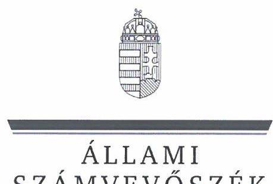
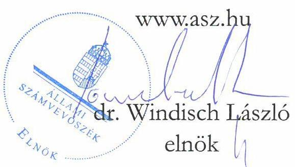
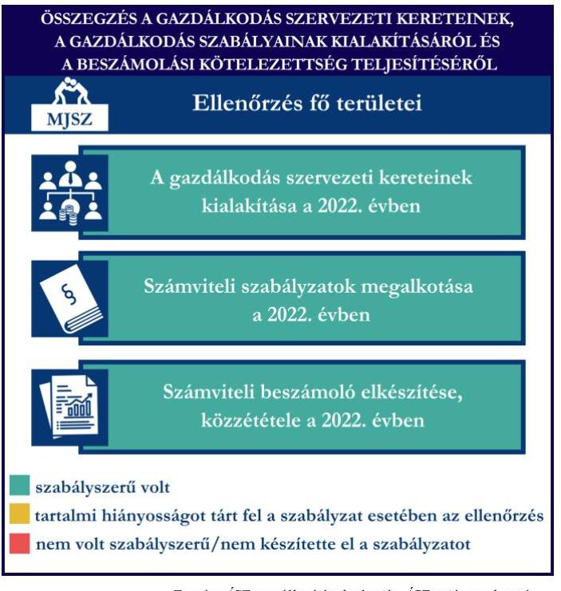
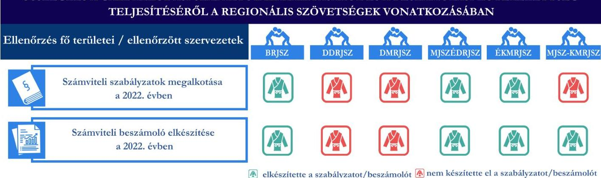
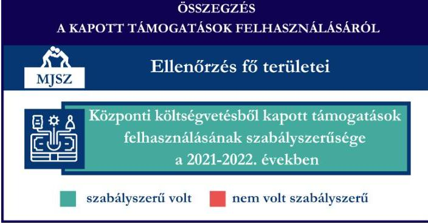

# JELENTÉS 

Támogatásban részesülő sportszövetségek és sportegyesületek gazdálkodásának ellenőrzése

Magyar Judo Szövetség

2024.

---

ÁLLAMI
SZÁMVEVŐSZÉK

# JELENTÉS 

## Támogatásban részesülő sportszövetségek és sportegyesületek gazdálkodásának ellenőrzése

Magyar Judo Szövetség

2024. 

24099

---

# ELLENŐRZÉSI IGAZGATÓSÁG: 

## ÁLLAMHÁZTARTÁSON KÍVÜLI SZERVEZETEKET ELLENŐRZŐ IGAZGATÓSÁG

## ELLENŐRZÉSI IGAZGATÓ:

## KLINGA LÁSZLÓ igazgató

## ELLENŐRZÉSVEZETŐ:

Jelentéseink az interneten a www.asz.hu címen olvashatók.

## KAKAS SÁNDOR ellenőrzésvezető

IKTATÓSZÁM: EL-4060-008/2024.
TÉMASZÁM: 2682
ELLENŐRZÉS-AZONOSÍTÓ SZÁM: V1026

---

# TARTALOMJEGYZÉK 

- AZ ELLENŐRZÉS ALAPADATAI ..... 5
- AZ ELLENŐRZÖTT SZERVEZET ..... 7
- ÖSSZEFOGLALÁS ..... 8
- AZ ELLENŐRZÉS FÓKUSZKÉRDÉSEI ..... 10
- MEGÁLLAPÍTÁSOK ..... 11
- JAVASLATOK ..... 15
- MELLÉKLETEK ..... 17
I. sz. melléklet: Értelmező szótár ..... 17
II. sz. melléklet: Az ellenőrzött szervezetek jegyzéke ..... 19
III. sz. melléklet: Ellenőrzési kritériumok ..... 20
- FÜGGELÉK: ÉSZREVÉTELEK ..... 21
- RÖVIDÍTÉSEK JEGYZÉKE ..... 22

---

.

---

# AZ ELLENŐRZÉS ALAPADATAI 

## AZ ELLENŐRZÉS CÉLJA

Az ellenőrzés célja az államháztartásból nyújtott támogatással, vagy az államháztartásból meghatározott célra ingyenesen juttatott vagyon felhasználásával érintett sportszövetségek és sportegyesületek gazdálkodása szabályozottságának, gazdálkodási tevékenységének, ezen belül a beszámolási kötelezettség teljesítésének, támogatások elkülönített nyilvántartásának, valamint a támogatások felhasználásának ellenőrzése.

## AZ ELLENŐRZÉS TÍPUSA

Szabályszerűségi ellenőrzés.

## AZ ELLENŐRZÖTT IDŐSZAK

Az 1. fókuszkérdés esetében a 2022. év.
A 2-3. fókuszkérdés vonatkozásában a 2021-2022. évek.
A 4. fókuszkérdés vonatkozásában a 2022. év, a mennyiségi felvétellel történő leltározás dokumentumai tekintetében a 2020-2022. évek.

## AZ ELLENŐRZÉS TÁRGYA

Az ellenőrzés tárgyát képezte a támogatásban részesülő sportszövetségek, sportegyesületek gazdálkodása szabályozottságának, gazdálkodási tevékenységén belül a beszámolási kötelezettség teljesítésének, a vagyonnyilvántartásának, a támogatások elkülönített nyilvántartásának, valamint az államháztartási forrásból származó közvetlen vagy közvetett támogatások és a meghatározott célra ingyenesen juttatott vagyon felhasználásának a vizsgálata. Az ellenőrzés a támogatások vonatkozásában kiterjedt továbbá a támogató felé történő beszámolási és elszámolási kötelezettségek teljesítésére, a költségvetésből kapott támogatások továbbadásának szabályszerűségére, az ezekkel kapcsolatos jogszabályi és belső előírások betartására.

Az ellenőrzés kiterjedt minden olyan körülményre és adatra, amely az ÁSZ¹ jogszabályban meghatározott feladatainak teljesítéséhez, valamint az ellenőrzési program végrehajtása során felmerülő újabb összefüggések feltárásához szükséges.

## AZ ELLENŐRZÉS JOGALAPJA

Az ellenőrzés jogszabályi alapját az ÁSZ tv.² 1. § (3) bekezdése, az 5. § (3) bekezdése, valamint a Civil tv.³ 47. § előírásai képezték.

---

# AZ ELLENŐRZÉS MÓDSZERE 

Az ellenőrzést a nemzetközi standardokat irányadónak tekintve az ellenőrzési program szempontjai, az ellenőrzött időszakban hatályos jogszabályok, az ellenőrzés általános szakmai szabályai, az ellenőrzésre irányadó ÁSZ módszertanok figyelembevételével végezte az ÁSZ.

Az ellenőrzési kérdések megválaszolásához szükséges bizonyítékok megszerzése az ellenőrzött szervezet által rendelkezésre bocsátott dokumentumokra, adatokra alapozva kérdésfeltevés (információkérés), interjú, mintavételezés útján történt.

Az ellenőrzési bizonyítékként felhasználható adatforrások közé tartoztak egyrészt az ellenőrzés során az ellenőrzött szervezettől bekért dokumentumok, másrészt adatforrás lehetett minden további, az ellenőrzés folyamán feltárt, az ellenőrzés szempontjából információt tartalmazó dokumentum.

A támogatásokkal, azok felhasználásával, a továbbadott támogatásokkal kapcsolatos kötelezettségek vizsgálatára mintavételi eljárások kerültek alkalmazásra. Támogatás-típusok szerint nagyságrend alapján 1-3 darab támogatás került részletes vizsgálat alá. Ezen támogatások felhasználásának szabályszerűsége támogatásonként kockázatértékelés alapján kiválasztott mintatételekkel került ellenőrzésre. A kiválasztott támogatási szerződésekhez kapcsolódó elszámolásokból 30-30 db mintatétel került ellenőrzésre, ahol az elszámolás nem érte el a 30 db -ot, ott tételes ellenőrzésre került sor. Ezen felül a vagyongazdálkodás szabályszerűségének ellenőrzéséhez is kockázatalapú mintavétel kapcsolódott. A támogatások felhasználása és a vagyongazdálkodás területén a minták ellenőrzése kiterjedt a könyvvezetési kötelezettség vizsgálatára is. A tárgyi eszközök tekintetében 30 db került kiválasztásra a 2022. évben állományban lévő eszközök közül azok nyilvántartásának, elszámolásának szabályszerűsége ellenőrzése céljából. A kiválasztott mintatételek ellenőrzésének eredménye nem került kivetítésre a teljes sokaságra, a megállapítások az adott ellenőrzött mintatételek vonatkozásában kerültek megjelenítésre.

---

# AZ ELLENŐRZÖTT SZERVEZET

A Magyar Judo Szövetség a Magyarországon működő, a judo sportágban a sportági versenyrendszerben részt vevő sportszervezetek által – a tevékenységük összehangolása, munkájuk elősegítése érdekében – létrehozott, a judo sportágat irányító, közhasznú minősítéssel rendelkező országos szakszövetség. Az MJSZ⁴ Alapszabály⁵ szerinti „célja a sportág, a judo verseny-, diák- és szabadidősportot űzők érdekeinek képviselete és védelme, a judo elterjesztése, nemzetközi eredményességének növelése, a judo sport irányítása és felügyelete, a mozgósítás a sportágban folyó tevékenységre és a judo sport, mint közhasznú tevékenység, népszerűsítése, fejlesztése”. Az MJSZ Alapszabályában rögzítettek szerint hat regionális szakszövetsége volt, ezek a Budapesti Regionális Judo Szövetség, a Dél-dunántúli Regionális Judo Szövetség, a Dél-magyarországi Regionális Judo Szövetség, a Magyar Judo Szövetség Észak-Dunántúli Regionális Judo Szövetsége, az Észak-Kelet-magyarországi Regionális Judo Szövetség és a Magyar Judo Szövetség – Közép-magyarországi Regionális Judo Szövetsége, amelyek az MJSZ szervezeti egységének minősülnek. Az MJSZ Alapszabályában a regionális szövetségeit az MJSZ jogi személlyé nyilvánította, a jogi személy szervezeti egység kötelezettségeiért az MJSZ kezesi felelősséggel tartozik. Az ellenőrzött időszakban a regionális szövetségek önálló jogi személyként működtek.

Az MJSZ jogszabályi előírás alapján az ellenőrzött időszakban könyvvizsgálatra és felügyelőbizottság létrehozására kötelezett volt. Az MJSZ közhasznú jogállással rendelkező szervezet, közhasznú jogállását 2012. január 1-jén szerezte meg az OBH⁶ nyilvántartás adatai alapján. Vállalkozási tevékenységet az ellenőrzött időszakban nem végzett.

Az MJSZ által az ellenőrzött időszakban igénybe vett támogatásokat az 1. táblázat mutatja be.

1. táblázat

AZ MJSZ ÁLTAL IGÉNYBE VETT TÁMOGATÁSOK (ADATOK M FT-BAN)

|   | 2021. tv | 2022. tv  |
| --- | --- | --- |
|  Központi költségvetési támogatás | 3 563,2 | 1 642,9  |

*Forrás: Az ellenőrzött szervezet ellenőrzési dokumentumai alapján ÁSZ saját szerkeztetés*

---

# ÖSSZEFOGLALÁS 

Magyarország Alaptörvényének XX. cikke kimondja, hogy mindenkinek joga van a testi és lelki egészséghez, melynek érvényesülését Magyarország többek között a sportolás és a rendszeres testedzés támogatásával segíti elő. Az Országgyűlés a Sport tv. ¹-ben kinyilvánította, hogy a nemzet közössége a test művelését, a sportot, a nemzet alapértékének, kívánatos célnak tekinti. A sport a közjó része. Erősíti a közösség tagjainak egymáshoz tartozását, miként az egyén testi és lelki egészségét.

A sportegyesületek, sportszövetségek működésükre és szakmai tevékenységük ellátására költségvetési támogatásban, önkormányzati támogatásban, ingyenes vagyonjuttatásban, valamint látvány-csapatsport támogatásban részesülhetnek, amelyekre fokozott figyelem irányul.

A társadalom részéről jogosan felmerülő elvárás, hogy a közpénzeket kezelő, azzal gazdálkodó szervezetek működéséről, tevékenységéről átfogó képet kapjon, a közpénzek rendeltetésszerű és átlátható módon történő felhasználásának értékelésére időről-időre sor kerüljön az ellenőrzések keretében.

A gazdálkodás szervezeti kereteinek kialakítása, a 1. ábra gazdálkodási szabályok kialakítása, továbbá a könyvvezetési és beszámolási kötelezettség teljesítése a 2022. évben az MJSZ tekintetében szabályszerű volt.

Az MJSZ a könyvviteli szolgáltatás személyi feltételeinek megteremtéséről, felügyelőbizottság létrehozásáról és működéséről gondoskodott. A jogszabályi előírások szerint az MJSZ kialakította a számviteli politikáját, valamint elkészítette a jogszabályban meghatározott szabályzatait. A szabályzatok az ellenőrzött jogszabályi kritériumoknak megfeleltek. Az MJSZ rendelkezett a jogszabályi előírások szerinti számlarenddel.

A könyvvezetés formája a 2022. évben megfelelt a jogszabályi előírásoknak. Az MJSZ a jogszabályoknak megfelelően teljesítette a számviteli beszámoló- és közhasznúsági melléklet készítési- és közzétételi kötelezettségét.

A gazdálkodás szervezeti keretei kialakításának, a számviteli szabályzatok megalkotásának, valamint a számviteli beszámoló elkészítésének és közzétételének értékelését az 1. ábra mutatja be.

---

Az MJSZ önálló jogi személyiségű szervezeti egységei közül a BRJSZ és az ÉKMRJSZ a 2022. évben a gazdálkodást biztosító számviteli szabályzatokat az előírások szerint, az MJSZÉDRJSZ egy szabályzat kivételével elkészítette. A DDRJSZ, a DMRJSZ és az MJSZ-KMRJSZ nem alkotta meg, ezzel a jogszabályi előírásokat nem tartotta be. A BRJSZ, az MJSZÉDRJSZ, az ÉKMRJSZ és az MJSZ-KMRJSZ regionális judo szövetség a 2022. évi beszámolóját az előírások szerint elkészítette, a DDRJSZ és a DMRJSZ szervezet a jogszabályi előírások ellenére nem tett eleget a 2022. évi számviteli beszámoló és közhasznúsági melléklet készítési kötelezettségének. Az MJSZ hat regionális szervezete vonatkozásában a gazdálkodási szabályzatok megalkotásának, valamint a számviteli beszámoló elkészítésének értékelését a 2. ábra mutatja be.
2. ábra

ÖSSZEGZÉS A GAZDÁLKODÁSI SZABÁLYOK KIALAKÍTÁSÁRÓL ÉS A BESZÁMOLÁSI KÖTELEZETTSÉG TELJESÍTÉSÉRŐL A REGIONÁLIS SZÖVETSÉGEK VONATKOZÁSÁBAN

3. ábra

ÖSSZEGZÉS
A KAPOTT TÁMOGATÁSOK FELHASZNÁLÁSÁRÓL
Ellenőrzés fő területei

A MJSZ a részére a központi költségvetésből nyújtott támogatásokat a 2021-2022. években az ellenőrzött tételek esetében a támogatási célnak megfelelően, szabályszerűen használta fel.

Az ellenőrzött időszakban az MJSZ a költségvetésből kapott támogatást szabályszerűen adta tovább. A kapott támogatások felhasználásának értékelését a 3. ábra mutatja be.
4. ábra

| ÖSSZEGZÉS |
| :--: |
| A VAGYONGAZDÁLKODÁSRÓL |
| Ellenőrzés fő területei |
| A mérleg leltárral való alátámasztottsága a 2022. évben |
| Mennyiségi leltározás szabályszerűsége a 2020-2022. években |
| szabályszerű volt nem volt szabályszerű |

A vagyongazdálkodás értékelését a 4. ábra mutatja be.

A MJSZ a részére a központi költségvetésből nyújtott támogatásokat a 2021-2022. években az ellenőrzött tételek esetében a támogatási célnak megfelelően, szabályszerűen használta fel.

Az ellenőrzött időszakban az MJSZ a költségvetésből kapott támogatást szabályszerűen adta tovább. A kapott támogatások felhasználásának értékelését a 3. ábra mutatja be.

1. ábra

| ÖSSZEGZÉS |
| :--: |
| A VAGYONGAZDÁLKODÁSRÓL |
| Ellenőrzés fő területei |
| A mérleg leltárral való alátámasztottsága a 2022. évben |
| Mennyiségi leltározás szabályszerűsége a 2020-2022. években |
| szabályszerű volt nem volt szabályszerű |

Forrás: ÁSZ megállapítások alapján ÁSZ saját szerkesztés

---

# AZ ELLENŐRZÉS FÓKUSZKÉRDÉSEI 

1.     - A gazdálkodási szabályok kialakítása, a könyvvezetési- és beszámolási kötelezettség teljesítése szabályszerű volt-e?
2.     - A kapott támogatások felhasználása szabályszerű volt-e?
3.     - A költségvetésből kapott támogatások továbbadása szabályszerűen valósult-e meg?
4.     - Az ellenőrzött szervezet vagyongazdálkodása szabályszerű volt-e?

---

# 1. A gazdálkodási szabályok kialakítása, a könyvvezetési- és beszámolási kötelezettség teljesítése szabályszerű volt-e? 

### 1.1 Magyar Judo Szövetség

## Összegző megállapítás

Az MJSZ a 2022. évben a szabályszerű gazdálkodás feltételeit megteremtette. Az MJSZ a könyvvezetési- és beszámolási kötelezettségét szabályszerűen teljesítette.

A 2022. évben az MJSZ a Számv. tv.⁸ és a Civilszr.⁹-ben foglalt jogszabályi előírások betartásával gondoskodott a könyvviteli szolgáltatás személyi feltételeinek megteremtéséről, a könyvviteli szolgáltatás körébe tartozó feladatok ellátásával megbízott szervezet megfelelt a jogszabályi előírásoknak.
A 2022. évben a Civilszr. előírásainak megfelelően az MJSZ beszámolóját könyvvizsgáló felülvizsgálta.
Az MJSZ a Ptk.¹⁰ előírása szerint létrehozta a felügyelőbizottságot, a felügyelőbizottság tagjainak száma megfelelt a Ptk. előírásainak, közhasznú jogállására tekintettel a Civil tv.-nek megfelelően a felügyelőbizottság megállapította ügyrendjét.
Az MJSZ a 2022. évben rendelkezett a Számv. tv.-ben előírt számviteli politikával, az eszközök és a források értékelési szabályzatával, pénzkezelési szabályzattal, az eszközök és a források leltárkészítési és leltározási szabályzatával, amelyek az ellenőrzött tartalmi kritériumoknak megfeleltek.
Az MJSZ a Számv. tv. szerint a számlarendet elkészítette.
Az MJSZ a Sport tv. előírásainak megfelelően 2022-ben rendelkezett olyan gazdálkodási, pénzügyi szabályzattal, amely tartalmazza az állami sportcélú támogatások Sport tv.-nek, valamint a 474/2016. (XII. 27.) Korm. rendeletnek¹¹ megfelelő felhasználására vonatkozó előírásait.
Az MJSZ a 2022. évben a Számv. tv., valamint a Civilszr. előírásainak megfelelően kettős könyvvitelt vezetett. A könyvviteli nyilvántartásait a Számv.
 tv. és a Civilszr. rendelkezéseinek megfelelően úgy alakította ki, hogy a beszámolóban az egyéb bevételeken belül a tagdíjakat és a kapott támogatások összegét részletezni tudta.
A jogszabályi előírásoknak megfelelő formában készítette el egyszerűsített éves beszámolóját a 2022. évre vonatkozóan. Elkészítette továbbá a Civil vhr. ${ }^{12}$ melléklete szerinti tartalommal a közhasznúsági mellékletet.
Az MJSZ esetében a felügyelőbizottság megvizsgálta és véleményezte a 2022. évi beszámolót. A 2022. évre vonatkozó beszámolót az MJSZ közgyűlése a Civil tv.-nek megfelelően jóváhagyta. A 2022. évi beszámoló könyvvizsgálóval történő felülvizsgálata a Civil tv.-nek megfelelően megtörtént.
A 2022. évi beszámolóját, valamint közhasznúsági mellékletét a Civil tv.-nek megfelelően letétbe helyezte és közzétette.

---

# 1.2 Regionális Judo Szövetségek 

Összegző megállapítás

Az MJSZ önálló jogi személyiségű szervezeti egységei közül kettő a 2022. évben a gazdálkodást biztosító belső szabályzatokat elkészítette, egy nem teljeskörűen alkotta meg, további három a szabályszerű gazdálkodás feltételeit nem alakította ki. Négy regionális judo szövetség a 2022. évi beszámolóját elkészítette, azonban egy regionális judo szövetség a letétbe helyezési kötelezettségének nem tett eleget. Kettő szervezet nem készítette el 2022. évi számviteli beszámolóját és közhasznúsági mellékletét.

### 1.2.1 Budapesti Regionális Judo Szövetség

A Budapesti Regionális Judo Szövetség a 2022. évben rendelkezett a Számv. tv.-ben előírt számviteli politikával, az eszközök és a források értékelési szabályzatával, pénzkezelési szabályzattal, az eszközök és a források leltárkészítési és leltározási szabályzatával, amelyek az ellenőrzött tartalmi kritériumoknak megfeleltek. A BRJSZ ${ }^{13}$ a 2022. évben a Civilszr. előírásainak megfelelően egyszeres könyvvitelt vezetett, egyszerűsített beszámolóját a jogszabályi előírásoknak megfelelően elkészítette, amelyet a felügyelőbizottság megvizsgált és véleményezett. A 2022. évre vonatkozó beszámolót a BRJSZ közgyűlése a Civil tv.-nek megfelelően jóváhagyta. A BRJSZ a 2022. évi beszámolóját, valamint közhasznúsági mellékletét a Civil tv.-nek megfelelően letétbe helyezte.

### 1.2.2 Dél-dunántúli Regionális Judo Szövetség

A Dél-dunántúli Regionális Judo Szövetség a Számv. tv. 14. § (3), valamint (5) bekezdés a), b) és d) pontjaiban előírtak ellenére a 2022. évben számviteli politikával, az eszközök és a források értékelési szabályzatával, pénzkezelési szabályzattal, az eszközök és a források leltárkészítési és leltározási szabályzatával nem rendelkezett. A DDRJSZ ${ }^{14}$ a Számv. tv. 4. § (1) és a Civil tv. 28. § (1) bekezdésében előírtak ellenére a 2022. évi beszámolóját nem készítette el.

## Dél-magyarországi Regionális Judo Szövetség

A Dél-magyarországi Regionális Judo Szövetség a Számv. tv. 14. § (3), valamint (5) bekezdés a), b) és d) pontjaiban előírtak ellenére a 2022. évben számviteli politikával, az eszközök és a források értékelési szabályzatával, pénzkezelési szabályzattal, az eszközök és a források leltárkészítési és leltározási szabályzatával nem rendelkezett. A DMRJSZ ${ }^{15}$ a Számv. tv. 4. § (1) és a Civil tv. 28. § (1) bekezdésében előírtak ellenére a 2022. évi beszámolóját nem készítette el.

## Magyar Judo Szövetség Észak-Dunántúli Regionális Judo Szövetsége

A Magyar Judo Szövetség Észak-dunántúli Regionális Judo Szövetsége a 2022. évben rendelkezett a Számv. tv.-ben előírt számviteli politikával, pénzkezelési szabályzattal, az eszközök és a források értékelési szabályzatával, azonban a Számv. tv. 14. § (5) bekezdés a) pontjában előírtak ellenére az eszközök és a források leltárkészítési és leltározási szabályzatát nem készítette el. Az MJSZÉDRJSZ ${ }^{16}$ a Civilszr. előírásainak megfelelően kettős könyvvitelt vezetett, azonban a Számv. tv. 161. § (1) bekezdés előírása ellenére a 2022. évben számlarenddel nem rendelkezett. Az MJSZÉDRJSZ a 2022. évi egyszerűsített éves beszámolóját, valamint közhasznúsági mellékletét elkészítette, azonban a Civil tv. 30. § (1)-(2) bekezdésében előírtak ellenére nem helyezte letétbe.

## Észak-Kelet-magyarországi Regionális Judo Szövetség

---

Az Észak-Kelet-magyarországi Regionális Judo Szövetség a 2022. évben rendelkezett a Számv. tv.-ben előírt számviteli politikával, az eszközök és a források értékelési szabályzatával, pénzkezelési szabályzattal, az eszközök és a források leltárkészítési és leltározási szabályzatával, amelyek az ellenőrzött tartalmi kritériumoknak megfeleltek. Az ÉKMRJSZ ${ }^{17}$ a Számv.tv. szerinti számlarendet elkészítette. Az ÉKMRJSZ a 2022. évben a Civilszr. előírásainak megfelelően kettős könyvvitelt vezetett, a jogszabályi előírásoknak megfelelően elkészítette egyszerűsített éves beszámolóját. A 2022. évi beszámolóját, valamint közhasznúsági mellékletét a Civil tv.-nek megfelelően határidőben letétbe helyezte.

# Magyar Judo Szövetség - Közép-magyarországi Regionális Judo Szövetsége 

A Magyar Judo Szövetség - Közép-magyarországi Regionális Judo Szövetség a Számv. tv. 14. § (3), valamint (5) bekezdés a), b) és d) pontjaiban előírtak ellenére a 2022. évben számviteli politikával, az eszközök és a források értékelési szabályzatával, pénzkezelési szabályzattal, az eszközök és a források leltárkészítési és leltározási szabályzatával, valamint a Számv. tv. 161. § (1) bekezdés előírása ellenére a 2022. évben számlarenddel nem rendelkezett. Az MJSZ-KMRJSZ ${ }^{18}$ a 2022. évben a Civilszr. előírásainak megfelelően kettős könyvvitelt vezetett. Az MJSZ-KMRJSZ a 2022. évi egyszerűsített éves beszámolóját, valamint a közhasznúsági mellékletét a jogszabályi előírások szerint elkészítette, azonban a Civil tv. 30. § (1)-(2) bekezdésében előírtak ellenére a jogszabályi határidőn túl helyezte letétbe.

## 2. A kapott támogatások felhasználása szabályszerű volt-e?

## Összegző megállapítás

Az MJSZ a 2021-2022. évben a jogszabályoknak megfelelően teljesítette a központi költségvetésből számára jutatott sportcélú támogatások felhasználását, valamint a támogatáshoz kapcsolódó elszámolási, adatszolgáltatási kötelezettségeit.

Az MJSZ a központi költségvetésből kapott támogatás bevételeit a Civil tv. előírásai alapján elkülönítetten mutatta ki a könyveiben, a Civil tv. rendelkezéseinek megfelelően a költségvetési támogatás felhasználását elkülönítetten tartotta nyilván. A ráfordítások ellentételezésére a kapott, pénzügyileg rendezett, egyéb bevételként elszámolt központi költségvetési támogatások összegéből, az üzleti évben költséggel, ráfordítással nem ellentételezett összeg elszámolásával kapcsolatban alkalmazta a Számv. tv. által előírt passzív időbeli elhatárolást.
A támogatás felhasználásáról a támogató felé a beszámolót és annak részeként az összesített elszámolási táblázatot a támogatási szerződésekben előírt formában és tartalommal elkészítette. Az MJSZ a pénzügyi elszámolást a támogatási szerződésben meghatározott határidőben nyújtotta be a támogató felé. A támogató felé benyújtott elszámolásokat alátámasztó számviteli bizonylatok a Számv. tv.-ben foglalt alaki és tartalmi követelményeknek megfeleltek, a támogató felé benyújtott számlák a 474/2016. (XII. 27.) Korm. rendeletben előírtaknak megfelelően záradékolásra kerültek.
Az MJSZ közhasznú szervezetként a Számv. tv. és a Civil tv. rendelkezéseinek megfelelően a 2021. és 2022. évekre vonatkozó beszámolójának kiegészítő mellékletében bemutatta a támogatási program keretében végleges jelleggel felhasznált összegeket támogatásonként és az üzleti évben végzett főbb tevékenységeket és programokat.

---

# 3. A költségvetésből kapott támogatások továbbadása szabályszerűen valósult-e meg? 

## Összegző megállapítás Az MJSZ 2021. és 2022. évben a költségvetésből kapott támogatást szabályszerűen adta tovább.

Az MJSZ 2021. évben három támogatott program keretén belül összesen 170,5 MFt összegben, 2022. évben kettő támogatott program keretén belül összesen 139,7 MFt összegben adott tovább költségvetésből kapott támogatást sportegyesületek részére.
Az MJSZ a nyilvántartási rendszerét úgy alakította ki, hogy abból a továbbutalási céllal kapott támogatásokkal kapcsolatos információk rendelkezésre álltak.
Az MJSZ a 474/2016. (XII. 27.) Korm. rendeletnek megfelelően határozta meg a végső kedvezményezett általi beszámoló benyújtásának határidejét. Az MJSZ a 474/2016. (XII. 27.) Korm. rendeletben meghatározottak szerinti tartalommal elszámoltatta a támogatás végső kedvezményezettjét a költségvetési támogatásról összesített elszámolási táblázattal.
Az MJSZ a Civilszr. rendelkezéseinek megfelelően a továbbutalási céllal kapott támogatást az egyéb bevételek között mutatta ki, a támogatás továbbadott összegét az egyéb ráfordítások között tartotta nyilván.
Az MJSZ a 2021. és 2022. évi közhasznúsági mellékletében a Civil tv.-ben előírtaknak megfelelően mutatta be a cél szerinti juttatások között a továbbadott támogatást.

## 4. Az ellenőrzött szervezet vagyongazdálkodása szabályszerű volt-e?

## Összegző megállapítás Az MJSZ 2022. évi vagyongazdálkodása szabályszerű volt.

Az MJSZ a Számv. tv. előírása szerint a 2022. évi beszámolójának mérlegtételeit leltárral alátámasztotta.
Az MJSZ a Számv. tv.-nek megfelelően a 2021. évre vonatkozóan a tárgyi eszközök mennyiségi felvétellel történő leltározását elvégezte.
Az MJSZ esetében a tárgyi eszköz mintatételek ellenőrzése során az alábbiak kerültek megállapításra:
Az MJSZ-nél a tárgyi eszközök bekerülési értékét a jogszabályi előírás szerint határozták meg. Az MJSZ-nél a tárgyi eszközök besorolása megfelelt a Számv. tv. előírásainak, a tárgyi eszközök üzembe helyezését hitelt érdemlő módon dokumentálták, az értékcsökkenés elszámolása szabályszerű volt.

---

# JAVASLATOK 

Az ÁSZ tv. 33. § (1) bekezdésében foglaltak értelmében az ellenőrzött szervezet vezetője köteles a jelentésben foglalt megállapításokhoz kapcsolódó intézkedési tervet összeállítani és azt a jelentés kézhezvételétől számított 30 napon belül az ÁSZ részére megküldeni. Amennyiben az ellenőrzött szervezet vezetője nem küldi meg határidőben az intézkedési tervet, vagy továbbra sem elfogadható intézkedési tervet küld, az Állami Számvevőszék elnöke az ÁSZ tv. 33. § (3) bekezdése a) és b) pontjaiban foglaltakat érvényesítheti.

## Dél-dunántúli Regionális Judo Szövetség elnökének

1. Gondoskodjon a Számv.tv. 14. § (3), valamint (5) bekezdés a), b) és d) pontjaiban előírtak szerinti számviteli politika, az eszközök és a források értékelési szabályzata, pénzkezelési szabályzat, az eszközök és a források leltárkészítési és leltározási szabályzata elkészítéséről.
2. Gondoskodjon a Számv. tv. 4. § (1) és a Civil tv. 28. § (1) bekezdésében előírtak szerinti számviteli beszámoló elkészítéséről.

## Dél-magyarországi Regionális Judo Szövetség elnökének

1. Gondoskodjon a Számv.tv. 14. § (3), valamint (5) bekezdés a), b) és d) pontjaiban előírtak szerinti számviteli politika, az eszközök és a források értékelési szabályzata, pénzkezelési szabályzat, az eszközök és a források leltárkészítési és leltározási szabályzata elkészítéséről.
2. Gondoskodjon a Számv. tv. 4. § (1) és a Civil tv. 28. § (1) bekezdésében előírtak szerinti számviteli beszámoló elkészítéséről.

## Magyar Judo Szövetség Észak-Dunántúli Regionális Judo Szövetsége

1. Gondoskodjon a Számv.tv. 14. § (5) bekezdés a) pontja szerint az eszközök és a források leltárkészítési és leltározási szabályzata elkészítéséről.

---

2. | Gondoskodjon a Számv.tv. 161. § (1) bekezdése szerinti számlarend elkészítéséről.
3. | Gondoskodjon a Civil tv. 30. § (1) bekezdésének előírásai szerinti számviteli beszámoló közzétételéről.

# Magyar Judo Szövetség - Közép-magyarországi Regionális Judo Szövetsége elnökének 

1. Gondoskodjon a Számv.tv. 14. § (3), valamint (5) bekezdés a), b) és d) pontjaiban előírtak szerinti számviteli politika, az eszközök és a források értékelési szabályzata, pénzkezelési szabályzat, az eszközök és a források leltárkészítési és leltározási szabályzata elkészítéséről.
2. Gondoskodjon a Számv.tv. 161. § (1) bekezdése szerinti számlarend elkészítéséről.
3. Gondoskodjon a Civil tv. 30. § (1) bekezdése előírásai szerint a számviteli beszámoló és közhasznúsági melléklet határidőben történő letétbe helyezéséről.

---

# MELLÉKLETEK 

## I. SZ. MELLÉKLET: ÉRTELMEZŐ SZÓTÁR

Civil szervezet

Egyesület

Költségvetési támogatás

Közhasznú szervezet

Közhasznú tevékenység

Országos sportági szakszövetség

Sportági szövetség

A civil társaság; a Magyarországon nyilvántartásba vett egyesület - a párt, a szakszervezet és a kölcsönös biztosító egyesület kivételével és a közalapítvány és a pártalapítvány kivételével - az alapítvány. (Forrás: Civil tv. 2. §6. pont a)-c) alpontjai)
Az egyesület a tagok közös, tartós, alapszabályban meghatározott céljának folyamatos megvalósítására létesített, nyilvántartott tagsággal rendelkező jogi személy. (Forrás: Ptk. 3:63. § (1) bekezdés)
A Számv. tv. szempontjából egyéb szervezet. (Számv. tv. 3. § (1)
 bekezdése 4. pont a) alpontja)
A társadalombiztosítás pénzügyi alapjai kivételével az államháztartás központi alrendszeréből ellenérték nélkül, pénzben nyújtott támogatások. (Forrás: Áht. ${ }^{19}$ 1. § 14. pont)
Közhasznú szervezetté minősíthető a Magyarországon nyilvántartásba vett közhasznú tevékenységet végző szervezet, amely a társadalom és az egyén közös szükségleteinek kielégítéséhez megfelelő erőforrásokkal rendelkezik, továbbá amelynek megfelelő társadalmi támogatottsága kimutatható, és amely:
a) civil szervezet (ide nem értve a civil társaságot), vagy
b) olyan egyéb szervezet, amelyre vonatkozóan a közhasznú jogállás megszerzését törvény lehetővé teszi. (Forrás: Civil tv. 32. $\S$ (1) bekezdés)

Minden olyan tevékenység, amely a létesítő okiratban megjelölt közfeladat teljesítését közvetlenül vagy közvetve szolgálja, ezzel hozzájárulva a társadalom és az egyén közös szükségleteinek kielégítéséhez. (Forrás: Civil tv. 2. § 20. pont)
Olyan sportszövetség, amely sportágában kizárólagos jelleggel az e törvényben, valamint más jogszabályokban meghatározott feladatokat lát el és e törvényben megállapított különleges jogosítványokat gyakorol. Olyan sportágban hozható létre, amelyet vagy a Nemzetközi Olimpiai Bizottság elismert, vagy amely sportág nemzetközi szövetségét felvették a Nemzetközi Sportszövetségek Szövetségébe (GAISF). (Forrás: Sport tv. 20. § (1), (4) bekezdés)
A Civil tv. és a Ptk. előírásai alapján - a Sport tv.-ben meghatározott eltérésekkel - működő szövetség, amelynek tagjai kizárólag sportszervezetek lehetnek. Sportági szövetség országos jelleggel is működhet. Egy sportágban csak egy országos sportági szövetség működhet. Törvényi feltételek teljesülése esetén szakszövetségi feladatokat is elláthat. (Forrás: Sport tv. 28. § (1)-(2) bekezdései)

---

Sportegyesület

Sportegyesületeknek, sportszövetségeknek nyújtott költségvetési támogatás

Sportszövetség

Sporttevékenység

Vagyongazdálkodás

A Civil tv. és a Ptk. szabályai szerint működő olyan egyesület, amelynek alaptevékenysége a sporttevékenység szervezése, valamint a sporttevékenység feltételeinek megteremtése. A sportegyesületek a Sport tv. 15. § (1) bekezdésében meghatározott sportszervezetek körébe tartoznak. A sportegyesületeken kívül sportszervezet még a sportvállalkozás, a sportiskola, valamint az utánpótlás-nevelés fejlesztését végző alapítvány. (Forrás: Sport tv. 16. § (1) bekezdés)
Az állami sport célú támogatások felhasználásáról és elosztásáról szóló 474/2016. (XII. 27.) Kormány rendelet és a 27/2013. (III. 29.) EMMI rendelet ${ }^{20}$ 1. $\S$-ában meghatározott fejezeti kezelésű előirányzatokból nyújtott támogatás.
Meghatározott sporttevékenységek körében a sportversenyek szervezésére, a tagok érdekvédelmére és a részükre való szolgáltatásokra, valamint a nemzetközi kapcsolatok lebonyolítására létrehozott, jogi személyiséggel és önkormányzattal rendelkező, a Civil tv. és a Ptk. alapján - az e törvényben foglalt eltérésekkel - különös formában működő egyesületek. A Sport tv. 19. § (3) bekezdése szerint a sportszövetségeknek az alábbi típusai léteznek: országos sportági szakszövetségek, sportági szövetségek, szabadidősport szövetségek, fogyatékosok sportszövetségei, diák- és egyetemi-főiskolai sport sportszövetségei, nemzetközi sportszövetségek. (Forrás: Sport tv. 19. $\S$ (1),(3) bekezdés)
Meghatározott szabályok szerint, a szabadidő eltöltéseként kötetlenül vagy szervezett formában, illetve versenyszerűen végzett testedzés vagy szellemi sportágban kifejtett tevékenység, amely a fizikai erőnlét és a szellemi teljesítőképesség megtartását, fejlesztését szolgálja. (Forrás: Sport tv. 1. § (2) bekezdés)
A nemzeti vagyongazdálkodás feladata a nemzeti vagyon rendeltetésének megfelelő, az állam, az önkormányzat mindenkori teherbíró képességéhez igazodó, elsődlegesen a közfeladatok ellátásához és a mindenkori társadalmi szükségletek kielégítéséhez szükséges, egységes elveken alapuló, átlátható, hatékony és költségtakarékos működtetése, értékének megőrzése, állagának védelme, értéknövelő használata, hasznosítása, gyarapítása, továbbá az állam vagy a helyi önkormányzat feladatának ellátása szempontjából feleslegessé váló vagyontárgyak elidegenítése. (Forrás: Nvtv. ${ }^{21}$ 7. § (2) bekezdés)

---

# II. SZ. MELLÉKLET: AZ ELLENŐRZÖTT SZERVEZETEK JEGYZÉKE 

## ELLENŐRZÖTT SZERVEZET NEVE

Magyar Judo Szövetség
Budapesti Regionális Judo Szövetség
Dél-dunántúli Regionális Judo Szövetség
Dél-magyarországi Regionális Judo Szövetség
Magyar Judo Szövetség Észak-Dunántúli Regionális Judo Szövetsége
Észak Kelet-magyarországi Regionális Judo Szövetség
Magyar Judo Szövetség-Közép-magyarországi Regionális Judo Szövetsége

## ELLENŐRZÖTT SZERVEZET SZÉKHELYE

1146 Budapest, Istvánmezei utca 1-3.
1053 Budapest, Curia utca 3.
8900 Zalaegerszeg, Bíró Márton utca 37.
6430 Bácsalmás, Oltványi utca 9.
9200 Mosonmagyaróvár, Kandó Kálmán utca 3.
3528 Miskolc, Csokonai utca 3.
1146 Budapest, Istvánmezei utca 1-3.

---

# III. SZ. MELLÉKLET: ELLENŐRZÉSI KRITÉRIUMOK 

## FOKUSZKÉRDÉS

## 1. fókuszkérdés:

A gazdálkodási szabályok kialakítása, a könyvvezetési és beszámolási kötelezettség teljesítése szabályszerű volt-e?

## 2. fókuszkérdés:

A kapott támogatások felhasználása szabályszerű volt-e?

## 3. fókuszkérdés:

A költségvetésből kapott támogatások továbbadása szabályszerűen valósult-e meg?

## 4. fókuszkérdés:

Az ellenőrzött szervezet vagyongazdálkodása szabályszerű volt-e?

## ELLENŐRZÉSI KRITÉRIUMOK

Számv. tv. 4. § (1) bekezdés, 14. § (3) bekezdés, (5) bekezdés a), b), d) pont, (8) bekezdés, 69. § (3) bekezdés, 90. § (3) bekezdés c) pont, 161. § (1) bekezdés, (2) bekezdés a)-d) pont, (3)-(4) bekezdés, 161/A. $\S$ (2) bekezdés, 165. $\S$ (2) bekezdés
Civilszr. 7. § (1) bekezdés, (4) bekezdés b), c) pont, 8. § (2), (3) bekezdés, 9. § (4), (5), (8) bekezdés, 12. § (4), (5) bekezdés, 15. § (1) bekezdés a), b) pont, 16. § (1) bekezdés, 24. § (2) bekezdés
Ptk. 3:26. § (1) bekezdés, 3:27. § (1) bekezdés, 3:82. § (1) bekezdés,
Civil tv. 28.§ (1) bekezdés, 29. § (2) bekezdés c) pont, (3), (6), (7) bekezdés, 30. § (1)-(4) bekezdés, 40. § (1), (2) bekezdés, 41. § (1) bekezdés
Sport tv. 23. § (1) bekezdés f) pont
Civil vhr. melléklete
Számv. tv. 44. § (2) bekezdés, 93. § (3) bekezdés, 159. §, 165. § (2) bekezdés, 167. § (1) bekezdés a), d), e), h) pont

Civil tv. 20. § (2) bekezdés a) pont, (3) bekezdés a), c) pont, (4) bekezdés, 29. § (4), (5) bekezdés
Civilszr. 24. § (2) bekezdés
27/2013. (III.29.) EMMI rend. 18. § (2) bekezdés
474/2016. (XII. 27.) Korm. rend. 22. § (2) bekezdés, 24. § (2) bekezdés
474/2016. (XII. 27.) Korm. rend. 14. §, 17. § (1) bekezdés 13. pont, 23. § (1) bekezdés, 24. § (1) bekezdés, 25. § (1) bekezdés
Sport tv. 57. § (2) bekezdés d) pont
Civil tv. 29. § (7), 166/2004. (V.21.) Korm.rend. ${ }^{22}$ 4. § (1) bekezdés,
Civilszr. 13. § (4) bekezdés
Ptk. 3:63. § (4) bekezdés
Számv. tv. 3. § (3) bekezdés 3. pont, 15. § (3) bekezdés, 46. § (3), (4) bekezdés, 47-51. §, 52. § (1)-(7) bekezdés, 69. § (1), (3) bekezdés, 165. § (2) bekezdés, 169. § (2) bekezdés
Sport tv. 76/B. §, 76/C. §

---

# FÜGGELÉK: ÉSZREVÉTELEK 

A jelentéstervezetet a Számvevőszék 15 napos észrevételezésre megküldte az ellenőrzött szervezet vezetőjének az ÁSZ tv. 29. § (1) bekezdése előírásának megfelelően.

A Magyar Judo Szövetség elnöke a jelentéstervezetre nem tett észrevételt.

[^0]
[^0]:    * 29. § (1) Az Állami Számvevőszék az ellenőrzési megállapításait megküldi az ellenőrzött szervezet vezetőjének vagy az általa megbízott személynek, és annak, akinek személyes felelősségét állapította meg.
    (2) Az ellenőrzött szervezet vezetője és a felelősként megjelölt személy az ellenőrzés megállapításaira tizenöt napon belül írásban észrevételt tehet.
    (3) Az Állami Számvevőszék az észrevételre a beérkezésétől számított harminc napon belül írásban válaszol. A figyelembe nem vett észrevételeket köteles a jelentésben feltüntetni, és megindokolni, hogy azokat miért nem fogadta el.

---

# RÖVIDÍTÉSEK JEGYZÉKE 

${ }^{1}$ ÁSZ
${ }^{2}$ ÁSZ tv.
${ }^{3}$ Civil tv.
${ }^{4}$ MJSZ
${ }^{5}$ alapszabály
${ }^{6}$ OBH
${ }^{7}$ Sport tv.
${ }^{8}$ Számv. tv.
${ }^{9}$ Civilszr.
${ }^{10}$ Ptk.
${ }^{11}$ 474/2016. (XII. 27.) Korm. rendelet
${ }^{12}$ Civil vhr.
${ }^{13}$ BRJSZ
${ }^{14}$ DDRJSZ
${ }^{15}$ DMRJSZ
${ }^{16}$ MJSZÉDRJSZ
${ }^{17}$ ÉKMRJSZ
${ }^{18}$ MJSZ-KMRJSZ
${ }^{19}$ Áht.
${ }^{20}$ 27/2013. (III.29.) EMMI rendelet
${ }^{21}$ Nvtv.
${ }^{22}$ 166/2004. (V. 21.) Korm. rendelet

Állami Számvevőszék
2011. évi LXVI. törvény az Állami Számvevőszékről
2011. évi CLXXV. törvény az egyesülési jogról, a közhasznú jogállásról, valamint a civil szervezetek működéséről és támogatásáról
Magyar Judo Szövetség
Magyar Judo Szövetség Alapszabálya
Országos Bírósági Hivatal
2004. évi I. törvény a sportról
2000. évi C. törvény a számvitelről
479/2016. (XII.28.) Korm. rendelet a számviteli törvény szerinti egyes egyéb szervezetek beszámoló készítési és könyvvezetési kötelezettségének sajátosságairól
2013. évi V. törvény a Polgári Törvénykönyvről
474/2016. (XII. 27.) Korm. rendelet az állami sport célú támogatások felhasználásáról és elosztásáról
350/2011. (XII. 30.) Korm. rendelet a civil szervezetek gazdálkodása, az adománygyűjtés és a közhasznúság egyes kérdéseiről
Budapesti Regionális Judo Szövetség
Dél-dunántúli Regionális Judo Szövetség
Dél-magyarországi Regionális Judo Szövetség
Magyar Judo Szövetség Észak-dunántúli Regionális Judo Szövetsége
Észak Kelet-magyarországi Regionális Judo Szövetség
Magyar Judo Szövetség - Közép-magyarországi Regionális Judo Szövetség
2011. évi CXCV. törvény az államháztartásról
27/2013. (III. 29.) EMMI rendelet az állami sport célú támogatások felhasználásáról és elosztásáról
2011. évi CXCVI. törvény a nemzeti vagyonról
166/2004. (V. 21.) Korm. rendelet az állami sportinformációs rendszerről

---

1052 Budapest, Apáczai Csere János u. 10. | 1364 Budapest 4., Pf. 54
www.asz.hu | szamvevoszek@asz.hu
telefon: +36 1 4849100

