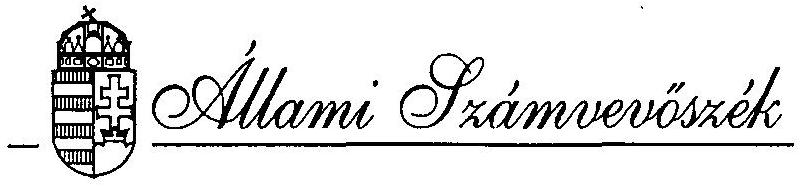
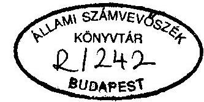
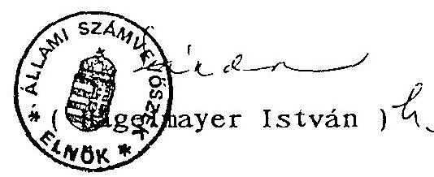
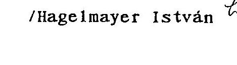
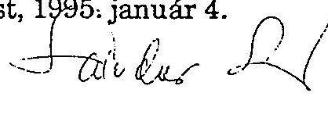
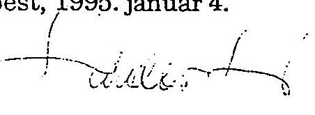
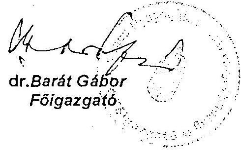
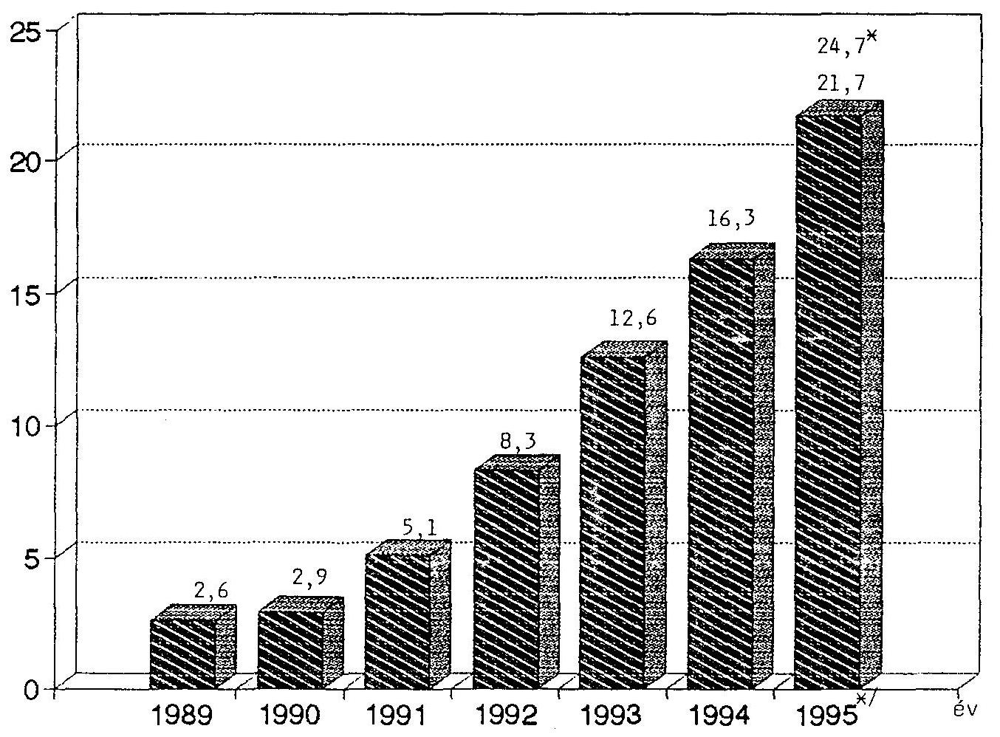
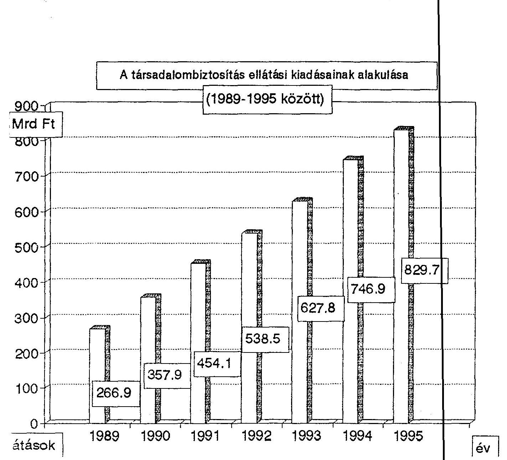

T/464/2.

# VÉLEMÉNY 

a társadalombiztosítás pénzügyi alapjainak
1995. évi költségvetéséről

---

A vizsgálatot vezette:
dr. Csépán Magdolna
osztályvezető főtanácsos

A vizsgálatban résztvettek: Ba11a Józsefné tanácsos
dr. Fónyad Erzsébet számvevő
Hajagos Józsefné tanácsos
Hegyesné
dr. Solymosi Mária számvevő
dr. Kurucz István tanácsos
Mo1nár Istvánné tanácsos
Szendrődi Józsefné számvevő

---

Állami Számvevőszék
V-19-4/1994-95.
Témaszám: 249.

# V É L E M É N Y 

a társadalombiztosítás pénzügyi alapjainak 1995. évi költségvetéséről

Az államháztartási törvény 86. §-a értelmében a társadalombiztosítás költségvetési előirányzatait a központi költségvetési törvénnyel egyidejüleg kell - jóváhagyásra - az Országgyülés elé terjeszteni. Az Országgyülés a társadalombizosítás költségvetését is az Állami Számvevőszék véleményével együtt tárgyalja meg. Mivel az előírások szerint a költségvetési törvényjavaslatot szeptember 30-ig kell benyújtani, a határidő értelemszerűen a társadalombiztosításra is érvényes. Ezt azonban 1995-re vonatkozóan sem sikerült betartani. A T/464. számú törvényjavaslatot 1995 januárjában adták át az Országgyülésnek, s azt az ÁSZ - hivatalosan - január 30-án kapta csak meg.

A késedelem legföbb oka, hogy a biztosítási önkormányzatok és a kormányzat közötti véleménykülönbségek miatt az egyeztetések nagyon elhúzódtak. A kölcsönös kompromisszumokon alapuló költségvetéseket a Nyugdíjbiztosítási Önkormányzat Közgyülése január 9-én, az Egészségbiztosítási Önkormányzat Közgyülése pedig január 10-én fogadta el. A költségvetési törvény hatálybalépéséig követendő el járásról az 1994. évi CIII. törvény intézkedett.

Mindezek miatt az ÁSZ-nak, törvényi kötelezettsége teljesítéséhez, ezúttal sem állt elegendő idő rendelkezésére, mely problémákat jelezte az Országgyülés elnökének (1. sz. melléklet). A vélemény elkészítése a tervező munka fázisainak figyelemmel kisérésére, a menetközben megszerzett információk összegzésére támaszkodik. Az előirányzatok mélyreható - az egyes ellátási kiadások részleteire kiterjedő - vizsgálatára igy nem volt mód.

---

# ÖSSZEFOGLALÓ MEGÁLLAPÍTÁSOK ÉS JAVASLATOK 

A társadalombiztosítás pénzügyi alapjainak 1995. évi 0 -sza1dós költségvetése a biztosítási önkormányzatok és a Kormány közötti kölcsönös engedmények eredményeként született meg. A létrehozott egyensúly azonban meglehetősen bizonytalan, az alapok bevételeit és kiadásait illetően egyaránt.

A pénzügyi egyensúlyhoz bevételi oldalon, minden eddigit meghaladó nagyságrendben vették számításba a vagyonból származó bevételt. (Ez különösen az Egészségbiztosítási Alap pénzügyi pozícióját teszi bizonytalanná). Eközben a mai napig nem tisztázódott az ingyenes vagyonjuttatás célja, s mindez azzal sem rendeződik, hogy az 1994. december 31-ével lejárt átadási határidőt egy évvel meghosszabbítják.

A kintlévőségek nagyságrendje ma már 200 milliárd forint körül alakul. A biztosítási alapok kezelöinek joga és kötelezettsége, hogy a járulékfizetést késedelmesen vagy nem teljesitőkkel szemben a megfelelő behajtási lépéseket megtegye és ellenőrzései során az "elfedett" járulékot megállapítsa és kí rója. A törvényjavaslat a 200 milliárdos követelésböl 20 milliárd forint behajtásával, mint "rendkívüli" járulékbevétel1el számol. Az eddigi években is volt ilyen tevékenység és ilyen bevétel is. Az hogy 1995-ben ez miért vált rendkívülivé, nehezen érthető, s arra sincs pontos magyarázat, hogy az összeg miért ennyi.

A két Alap együttes bevételi- és kiadási föösszege 850,5 milliárd forint, amit a társadalombiztosítás által folyósított, - de külsó forrásokból finanszirozott - pénzbeni ellátások összege már jóval 1000 milliárd forint fölé emel.

A Nyugdíjbiztosítási Alap pénzügyi keretei a nyugellátások terv szerint emelkedő összegére (1995-ben 436,5 milliár forint) szükösen bár, de elegendőnek látszanak. Amennyiben azonban a nettó keresetek növekedése a $13,5 \%$-os mértéket meghaladja, a fedezet biztosításáról pótlólag kell gondoskodni. A várakozások a keresetkiáramlás tervezettet meghaladó növekedésére utalnak.

---

Az Egészségbiztosítási Alapon belül 197 milliárd forint szolgál a gyógyító-megelöző egészségügyi szolgáltatások - rendszerében is továbbfejlesztésre kerülő - finanszirozására.

Az 1995-re tervezett intézkedések (főleg azok előkészítése) a költségvetési számokból még kevéssé tükröződnek vissza. A gyógyszertámogatás 62,4 milliárd forintos és a táppénzek 37 milliárd forintos kiadási elöirányzatának megtartása számos külső körülménytől függ és nem utolsó sorban épít az ellenörzésekkel kapcsolatos elképzelések következetes végig vitelére.

A költségvetést bevételi és kiadási oldalról megalapozó 1975. évi II. törvény aktuális módosítása átütö erejü változásokat nem hoz, érdemben az ellátórendszer, a járulékalap és a járulékmérték sem változik.

A társadalombiztosítás igazgatási költségei 1995-ben is növekednek, sokkal erőteljesebben, mint azt a járulékbevételek arányosan biztosítani tudják. Ez összefügg a két igazgatási szervezet létrehozásával, a feladatok bővülésével és a korszerűbb szolgáltatói háttér kiépítésére irányuló törekvésekkel is. Folytatódik az a gyakorlat, hogy a folyamatos működési kiadások fedezetén túl, az alapok - növekvő - hozzá járulásokat teljesítenek különféle egyedi célok (fejlesztések, beruházások) megvalósításához.

Az alapok pénzügyileg és időközben már naturálisan megosztott tartalék vagyonáról a törvényjavaslat nem nyújt hü képet, mert az adatok az 1994. évi eseményeket nem tükrözik vissza és az 1995. évi tervekről sem számolnak be. Így nem látható az sem, hogy a Nyugdíjbiztosítási Alapnál írodaházak vásárlására a befektetések hozama tartalékból 2 év alatt 3,5 milliárd forintot fordítanak.

Az 1995-re összállított költségvetési elöirányzatoknál egyáltalán nem számoltak a kereskedelmi banki finanszirozásra való átállás (melyet törvény ír elő) hatásaival, ami pedig nagymértékben befolyásolhatja az alapok költségvetési egyensúlyát. Az átállás előtt meg kéne történnie a társadalombiztosítás konszolidációjának, ennek valószínűsége azonban az 1995 június 30-i határidőig minimális.

---

A T/464. számon benyújtott törvényjavaslat több ellentmondást hordoz, a két alap szabályozásában - különösen a müködési költségvetésnél - zavart okoz az összhang hiánya. Ehhez kapcsolódóan a törvény véglegesítése során az ÁSZ a következöket javasolja:

1. A törvény egészüljön ki a rendszeres és a rendkívüli járulékbevételek, valamint az elfedett járulék pontos fogalommeghatározásával.
2. A Nyugdíjbiztosítási és az Egészségbiztosítási Alap müködési költségvetését azonos tartalommal és szerkezetben fogalmazzák meg és ennek megfelelően pontosítsák a törvényi szöveg vonatkozó részeit és a mellékleteket is.
3. Gondoskodni kell arról, hogy a világbanki program hazai költségeire fordítható kiadások, az informatikai fejlesztések, illetőleg a Fővárosi és Pest megyei Egészségbiztosítási Pénztár elhelyezési költségeinek 1995. évi fedezete mindkét ágban csak az adott cél megvalósítását szolgálhassa.

Ennek érdekében elö kell írni, hogy a nevesített fejlesztési elöirányzatok mindegyike csak a tényleges költségek mértékéig használható fel. Abból más célra átcsoportosítani nem lehet, pénzmaradvány képzését pedig csak az eredeti célra szabad megengedni.
4. Mindkét Alapnál úgy módosítsák a tartalékokat bemutató mellékleteket, hogy azok az 1994. december 31-i várható állapotot mutassák.
5. Lehetőség szerint egyszerüsödjék a társadalombiztosítás által folyósított ellátásokat bemutató törvényi melléklet.

---

6. Az alapok kezelöi, az érintett kormányzati szervekkel közösen - 1995. április 30-ig - tekintsék át a költségvetési törvény végrehajtása szempontjából meghatározó kérdéseket, igy:
- az ingyenes vagyonjuttatás helyzetét, az alapok közötti szolgáltatási és müködési vagyon megosztását, vagyonelemekben bekövetkezett főbb változásokat;
- a behajtási tevékenység és a járulékellenőrzés javításra tett vagy tervezett intézkedéseket, a szakterületek külön ösztönzési rendszerét;
- az egészségügyi ellátás rendszerének átalakítását szo1gáló intézkedéseket, a finanszirozás továbbfejlesztésének főbb kérdéseit;
- az Egészségbiztosítási Alapból finanszirozott ellátásokkal összefüggő ellenőrzések rendszerét;
- a kapcsolódó jogszabályok megalkotásának helyzetét;
- a kereskedelmi banki finanszirozásra való átállás feltételeinek megteremtését és
minderröl részletesen tájékoztassák az Országgyülést.

7. Előzőeken túlmenően az ÁSZ időszerűnek és fontosnak tartja a Társadalombiztosítási rendszer továbbfejlesztésével kapcsolatos 60/1991. (X.29.) OGY határozat végrehajtásának áttekintését is. Ezt a biztosítási ágak helyzete, illetőleg az eddigi intézkedések hasznosulásának megismerése, a tapasztalatok összegzése feltétlenül indokolja.

---

# RÉSZLETES MEGÁLLAPÍTÁSOK 

1./ A társadalombiztosítási alapok pénzügyi helyzetének alakulása 1994-ben

Mivel a költségvetési törvényjavaslat tárgyalására csak a tárgyév elején kerül sor, az előző év pénzügyi teljesítési adatai (bár a zárlati munkák még folyamatban vannak) már közelító pontossággal meghatározhatóak.

Az 1993. évi CXV. törvény a Nyugdíjbiztosítási Alap 1994. évi költségvetését 371,9 milliárd forint bevételi 371,1 milliárd forint kiadási elöirányzattal, kis méretü szufficittel állapította meg. Az Egészségbiztosítási
Alap bevételeinek és kiadásainak összege azonos, 336,4 milliárd forint volt. Ezt a KJT. egészségügyet érintő végrehajtásával összefüggésben az 1994. évi L. törvény 5,4 milliárd forinttal megemelte. Az Egészségbiztosítási Alap 0-szaldója eredetileg is úgy "állt elö", hogy a nyugdijág a törvény szerinti járulékbevételeiből 6,1 milliárd forintot átad a másik biztosítási ágnak.

A gazdasági folyamatok alakulása és bizonyos intézkedések miatt 1994. öszén felvetödött a pótkö1tségvetés benyújtásának gondolata, de arra végül mégsem került sor. Az alapok együttes hiányát akkor 18 milliárd forintban valószínüsítették.

A T/464. sz. törvényjavaslat az alapok együttes 1994. évi bevételi föösszegét 750,6 milliárd forintban jelöli meg, ami a tervezettnél 42,3 milliárd forinttal több. Ez alapvetően a járulékbevételek számítottnál kedvezőbb alakulásával függ össze.

A társadalombiztosítási önkormányzatok által támogatott, kedvezményes járulékbevételi akcióra ugyan nem került sor, de például a MÁV tartozásának rendezését külön törvény írta elő. Az 1994. évi LXXXIV. törvény szerinti 16,2 milliárd forint átutalása még decemberben megtörtént.

Az alapok kiadási föösszege a tervezett 712,9 milliárd forinttal szemben várhatóan 761,1 milliárd forint lesz. A nyugdijak kiadásai az elöirányzathoz képest jelentösen növekednek, összefüggésben az ellátások múlt év szeptem-

---

beri 8 \%-os (visszamenőleges) emelésével. Az egészségbiztosítás ellátásai közül a legnagyobb túllépés - immár hagyományosan - a gyógyszertámogatásnál és a táppénzkiadásoknál mutatkozik.

Az 1994. évi bevételek között 16 milliárd forint a vissztehermentesen átadott vagyonból származó bevétel, amit az ÁSZ már 1993 novemberében megalapozatlannak minösített. A vagyonátadás érdemben azóta sem haladt elöre. Igy gondoskodni kell arról, hogy ezt a kiesést a központi költségvetés terhére vagy más úton rendezzék. Ugyanakkor nyilvánvaló, hogy az 1995. tényleges induló kondíció rosszabb az elözetesen feltételezettnél.

Mindezek alapján nagy az esély arra, hogy az 1994. év valóságos hiánya a jelzett 10,5 milliárd forintnál (NY.A. = 5,6 , E.A. $=4,9$ ) lényegesen több lesz. A mai adottságokkal számolva ez $10,5+16$ (vagyonból származó bevétel elmaradása) $=26,5$ milliárd forint. A hiányrendezés kérdésével az önkormányzatoknak (és az államnak) legkésöbb a társadalombiztosítás 1994. évi zárszámadásakor szembesülnie kell. Ez az alapok kereskedelmi banki finanszírozására való átállása szempontjából sem közömbös körülmény.

Az alapkezelö önkormányzatok és az igazgatási apparátus (OEP és ONYF) eredeti müködési költségvetési elöirányzata 14,6 milliárd forint, amit részletesen az 1994. évi L. törvény határozott meg. Ezt növeli meg 1,7 milliárd forinttal az 1993. év pénzmaradványa. A pénzmaradvány összegét a társadalombiztosítás 1993. évi zárszámadásának ellenőrzéséről készített T/400/1. sz. jelentésben foglalt indokokra figyelemmel és számszerủ összegben az ÁSZ csökkenteni javasolja. E kérdésben a döntés az Országgyúlés jogköre.
2. / A társadalombiztosítási alapok 1995. évi bevételi elöirányzatai
2.1. A bevételi elöirányzatok tervezését meghatározó paraméterek

A társadalombiztosítás várható pénzügyi helyzetére vonatkozó számításokat 1995-ben is az állami költségvetésnél figyelembe vett makrogazdasági prognózisok alapozták meg. Az alapok együttesen 850,5 milliárd forintos bevételi összegét (ami 100 milliárd forinttal több az 1994. évinél) a következő főbb tételekkel számolták ki:

---

- a prognózisok szerint az 1995. évi bruttó keresettömeg 12 \%-kal haladja meg az 1994. évit;
- a vállalkozói jövedelmek 1994-ben várhatóan 34 \%-kal emelkednek (a vállalkozók járulékfizetési kötelezettségét az előző évi jövedelmek alapul vételével kell teljesíteni);
- az 1975. évi II. törvény tervezett módosítása következtében növekszik az egyéni vállalkozók járulékfizetési kötelezettsége (emelkedik a minimum járulékalap). A kiegészítő tevékenységet folytatók körének szűkítése miatt a járulékbevételek kismértékben ugyancsak nőnek, amit viszont "ellentételez" a nyugdij mellett munkát vállalók járulékfizetésének megszüntetése.

Előzőek mellett a bevételek tervezésénél az eddigieknél hatékonyabb behajtási tevékenységre eredményesebb ellenőrzési munkára is alapoztak és továbbra is számításba veszik az ingyenes vagyonjuttatásból származó bevételeket.

A bevételek tervezése a két alapra vonatkozóan közösen történt, a járulékbevételek megosztásánál az évek óta érvényes törvényi arányszámokat alkalmazva.
A bevételi előirányzatok teljesítésére a társadalombiztosításon kívüli tényezők meghatározó befolyással bírnak. A tervezés megalapozottságának minősítése ezért csak korlátozott lehet.

# 2.2. A tartozások behajtásából eredő járulékbevételek 

A törvényjavaslat a járulékbevételeken belül (Nyugdíjbiztosítási Alapnál a 2. §. (1) bekezdésében, Egészségbiztosítási Alapnál az 5. §. (1) bekezdésében) úgynevezett rendszeres és rendkívüli járulékbevételeket különböztet meg. Utóbbinak összege 20,4 milliárd forint, melynek külön címzett megjelenítése nincs alátámasztva és indokoltsága is vitatható.

A javasolt szabályozás révén a behajtási feladatokat ellátó Országos Egészségbiztosítási Pénztár működési költségvetése 1995-ben 400 millió forinttal (ösztönzési keret) gyarapszik, miközben a be-

---

hajtási költségeket átteszik az, Egészségbiztosítási Alap ellátási költségvetésébe (6. paragrafus (9) bekezdése).

Természetesen a társadalombiztosítási tartozások behajtása nagyon fontos kérdés, a kintlévőségek nagyságrendje már meghaladta a 200 milliárd forintot. Ha ennek akárcsak töredékét is sikerül behajtani, annak a társadalombiztosítás pénzügyi egyensúlya szempontjából igen nagy a jelentösége. A cél elérése érdekében egy hatékony belsö érdekeltségi rendszer szükségessége sem vitatható.

Az ÁSZ tehát nem a hatékonyabb behajtási tevékenységre irányuló szándékot kérdöjelezi meg, söt elismeri az eröfeszítéseket, csupán annak "rendkívüli"-jellegét. Itt egy természetes tevékenységről van szó. A biztosítási alapoknak, az alapkezelö önkormányzatoknak, az 1975. évi II. törvényen alapuló joga és kötelessége, hogy a járulékfizetési kötelezettséget késedelmesen vagy nem teljesítőkkel szemben a megfelelő behajtási cselekményeket kezdeményezzen, hasonlóan, hogy ellenőrzései során az elfedett járulékot megállapítsa és kírója.

Az összesen 20,4 milliárd forintos rendkívüli járulékbevételeknek - hogy miért éppen annyi - nincs érdemi számítási alapja.

A múlt év végén meghiúsult egyszeri - kedvezményes - járulékbeszedési akcióról szóló törvényjavaslat visszavonásakor a Kormány országgyülési határozat meghozatalára tett javaslatot. Ennek célja egyebek mellett a korábbi kedvezményes lehetőséggel szemben egy megszigoritott és gyorsított behajtási akció lebonyolítása lett volna. Az eredeti javaslatban (melyröl az Országgyűlés még nem határozott) szerepelt, hogy 1995. június 30-ig legalább 20 milliárd forint többletbevételt eredményező intézke-dés-sorozatot kell hozni. Ennek nyomán a költségvetési törvénybe azért került 20,4 milliárd forint, mert abból 400 millió forint - a már említettek szerint - átkerül az OEP müködési költségvetésébe. Más kérdés, hogy a törvényjavaslat szövegéből egyáltalán nem tünik ki a többletbevétel elérésének követelménye!

Időközben az országgyülési határozat ismét napirendre került. Abban már többletbevétel eléréséről nincs szó. Az Országgyülés csupán arra kéri fel az Egészségbiztosítási Önkormányzatot, hogy "úgy szervezze meg a járulék-

---

hátralèkok behajtását, hogy 1995-ben a költségvetési egyensúlyt biztosító járulékbevételi elöirányzat teljesül jön".

A törvényjavaslatban szereplő nevesített összeg meghagyása mellett is feltétlenül szükséges a járulékbevételi kategóriák pontos fogalom meghatározása.

Az OEP idöközben már hozott intézkedéseket, a "rendkívü1i" bevételek elkülönítésére, nyilvántartására. A Pénzügyminisztérium egyetértésével - még az egyszeri akcióhoz kapcsolódóan - a megyei egészségbiztosítási pénztárak ellátási bankszámláihoz csatlakozó alszámlák megnyitására került sor ( 1994 októberében). Majd, miután az év végén a tartozást mutató folyószámlákról a járulékfizetöket értesítették, rendelkeztek arról is, hogy az alszámlákra kell teljesíteni minden, a tartozások rendezésére történő befizetést (2. sz. melléklet).

Ide értendőek az egyenlegköz1ő levél, az azonnali beszedési megbizás alapján, a végrehajtásból, a csődel járásokról, az adóssal kötött megállapodás nyomán az átütemezésböl, a részletfizetésböl befolyt összegek (beleértve a korábbi megállapodásokat is).

Ebböl a megközelitésböl ha az alszámlákra 1995-ben a törvény szerinti 20,4 milliárd forint befolyik, nem fogadható el teljesitésként. Annál lényegesen többet kell teljesíteni, ugyanis a járulékbevételi elöirányzatok már évek óta tartalmaznak 10-12 milliárd forintos behajtási hányadot.

A "rendkívüli" járulékbevétel - megnevezéséből adódóan is - értelemszerűen csak töketartozás lehet. A törvényjavaslat egyébként is külön tételként tartalmazza a társadalombiztosítási tevékenységgel kapcsolatos egyéb bevételeket (késedelmi pótlék, rendbírság, jogalap nélkül felvett ellátások visszafizetése stb.), amelyek szintén kintlévőségek, s így megfizetésüknek is az alszámlán kell megjelenni. Ezek összege a Nyugdíjbiztosítási Alap költségvetésében (2. §. (2) bekezdés) 11,2 milliárd forint, az Egészségbiztosítási Alap költségvetésében (5. §. (3) bekezdés) 9,4 milliárd forint, együttesen tehát 20,6 milliárd forint.

---

Az ÁSZ számítása szerint az alszámlákra 1995-ben legalább 40 milliárd forintnak kell befolynia ahhoz, hogy a "rendkivüli" bevétel teljesítettnek legyen tekinthető. A 400 millió forintos ösztönzési keret részleges vagy teljes kifizetésének azonban nem csak ez a feltétele, hanem az is, hogy a "rendszeres" bevételi előirányzat teljesül jön. Mindezek egyértelmúen beépíthetők a kialakítandó érdekeltségi rendszerbe.

# 2.3. Az alapok egyéb bevételei 

Kamat- és egyéb hozambevételek címén az alapok együttes bevételi előirányzata 3.250 millió forint. Az alapok a szabályok szerint $90: 10 \%$ arányban osztották meg vagyonukat. Ennek során az 1990-ben vásárolt lakás-kötvények - az önkormányzatok megállapodása alapján - a Nyugdíjbiztosítási Alaphoz kerültek, ennek aktuális éves kamata 3,2 milliárd forint, amelyet az eddigi gyakorlat szerint a folyó finanszirozásba vonnak be.

Az 1995. évtől megkezdődik a kötvények visszavásárlása, az ebből származó bevétel évente 1,3 milliárd forint. Ez azonban nem szerepel a költségvetés bevételei között, hiszen az "csupán" vagyonelemek közötti mozgást jelent a tartós befektetésekből átkerült a pénzeszközökhöz. Kérdéses azonban, hogy ezzel a tartalék "tartós"-jellege is megszűnt-e. Ha igen, a töke megtérülésének összegét a befektetések hozama tartalékba kell helyezni, ame1yet a jelenlegi szabályok szerint - az önkormányzat saját (közgyűlés által hozott) döntése szerint használhat fel.

Az Egészségbiztosítási Alap tervezett hozambevételeinek összege csupán 50 millió forint. A vagyonmegosztás során az Alap karta a banki részvényeket, ame lyeket az év végén eladtak és helyette MEDICOR részvényeket vásároltak. Az említett összeg az egészségbiztosítás tartós befektetéseinek várható hozama.

Az év végén bonyol itott ügyletekről egyébként az Egészségbiztosítási Önkormányzat Elnöksége döntött, a Közgyűlés - amely a tulajdonosi jogok gyakorlására kizárólagosan jogosult - arról csak utólag a január 10-i ülésen kapott tájékoztatást!

---

Induláskor mindkét Alap költségvetésének egyensúlyi pozícióját úgy hozták létre, hogy a hiányzó összeg erejéig ismét az ingyenesen átadott vagyon hozamát, illetöleg a vagyon értékesítéséböl származó bevételt vettek figyelembe. Ez is évek óta tartó gyakorlat, mert:

- 1992-ben együttesen 1.880 MFt
- 1993-ban együttesen 5.000 MFt
- 1994-ben együttesen 16.040 MFt
vagyonnal kapcsolatos bevételt terveztek.
A valóságban ingyenes vagyonjuttatásból eddig csak az Egészségbiztosítási Alapnak volt hozambevétele (ami még a 40 millió forintot sem érte el.

Ehhez képest 1995-re már több mint 23 milliárd forintos vagyon-bevétellel számolnak (a törvényjavaslat 2. § (4) bekezdésében a Nyugdijbiztosítási Alapnál 6368 millió forinttal, az 5. §. (5) bekezdésében az Egészségbiztosítási Alapnál 16.799 millió forinttal).

A bevételből alaponként 1000-1000 millió forint, mint "1994-ben megtörtént vagyonátadásból" szàrmazó bevétel szerepel. A tervezés során ugyanis felmerült egy olyan megoldás, hogy az 1994-ben elmaradt vagyonátadás 1995-ben, még elózó évi dátummal történne meg. Az ÁsZ azonban ez sem szakmailag, sem technikailag nem tartja kivitelezhetönek.

Még át nem adott vagyon miatti "hozamgarancia" címén a Nyugdijbiztosítási Alapnak 5368 millió forint, az Egészségbiztosítási Alapnak 4832 millió forint bevétele lenne. A hozambevétel garanciái nincsenek kidolgozva, a törvényjavaslatból sem derül ki, hogy az alatt mit kell érteni.

Példaértékủ az Egészségbiztosítási Alapnak 1994-ben átadott Rico-részvények esete. A cégnél az átadás után, az APEH-revizió, 1991-re és 1992-re, jelentós adóhiányt állapitott meg és 176 millió forint megfizetését írta eló. Az egészségbiztosítás ebböl keletkező veszteségéért az ÁVƯ semmiféle felelősséget nem vállal.

---

Mindezen kívül - már csak az Egészségbiztosítási Alapnál - a költségvetési egyensúly biztosítására "vissztehermentesen vagyonjuttatás értékesítéséböl" további közel 11 milliárd forintos bevételi összeget is figyelembe vettek.

A jelenlegi helyzet ismeretében - noha a múlt év végén az ÁV Rt. és az ÁVÜ is konkrét vagyonátadási javaslatot tett a társadalombiztosítási önkormányzatoknak - a költségvetés vagyonbevétellel kapcsolatos számai nem minösíthetök megalapozottnak, azoknak csak "hiánypótló" szerepe van. A vagyonátadás 1992. óta elhúzódó ügye mielőbbi konkrét kormányzati intézkedéseket sürget. Ebből a szempontból még az sem megnyugtató, hogy a költségvetési törvény a lejárt határidőt 1995. december 31-ig ki$\mathrm{to1ja}$.

Változatlan elveken tovább folytatódik az alapok közötti keresztfinanszirozás, me1ynek révén a Nyugdíjbiztosítási Alap a pénzbeni egészségbiztosítási ellátások után 1995-ben 35,9 milliárd forint járulékbevételt vesz át az Egészségbiztosítási Alaptól. Az Egészségbiztosítási Alap pedig a nyugdíjkiadások után 55,9 milliárd forintot kap a Nyugdíjbiztosítási Alaptól. Az elszámolás 1995-töl mar a bruttó elszámolás elvének megfelelően történik.

Az ÁSZ már több alkalommal felvetette, hogy a keresztfinanszirozás megszüntetése, az E. Alapból finanszirozott nyugellátások ágazati hovatartozásának újragondolásával együtt, indokolt lenne.

# 3. / Az alapok kiadási elöirányzatai 

### 3.1. A Nyugdíjbiztosítási Alap kiadásai

Az Alap tervezett kiadási föösszege 503,1 milliárd forint, amiból a nyugellátásokra 436,5 milliárd forint jut. A nyugdijkiadások elöirányzata 52 milliárd forinttal haladja meg az előző évit. Ebből kb. 1 milliárd forint az 1975. évi II. törvény január 1-jétől életbelépett módosításának (a valorizáció és a degresszió korábbi szabályainak megváltoztatása) éves kihatása. A nyugellátások 1995. évi rendszeres emelésére a további 51 milliárd forint szolgál.

---

A Nyugdijbiztosítási Önkormányzat eredeti szándéka 1995-re egy $15 \%$-os mértékủ nyugdijemelés lett volna, a novemberi közgyülés még emellett foglalt állást. A központi költségvetés makrogazdasági prognózisából azonban a nettó átlagkeresetek várható növekedése $13,5 \%$. Ezt a mértéket a költségvetés végsỏ változatának tárgyalásakor az Önkormányzat tudomásul vette, de konkrétan csak a márciusi nyugdijemelésröl határozott (januártól visszamenőlegesen $10 \%$ ). Az ehhez szükséges összeg a Nyugdijbiztosítási Alap esetében 37-38 milliárd forint. Mint ismeretes, az Országgyülés nem 10 , hanem $11 \%$-os nyugdijemelés mellett döntött, ami a márciusi emelések hatását 41-42 milliárd forinttal növeli. Így a szeptemberi emelésre maradó összeg 9-10 milliárd forint. Az emelés konkrét mértékéröl a gazdasági folyamatok függvényében később döntenek. Amennyiben a (bruttó és nettó) keresetkiáramlás a prognózistól eltérő - nagyobb - lesz, az a nyugdijak emelésének mértékére is hat. Az NY. Alap "bérfüggősége" bevételi oldalon azonos az E. Alappal, kiadási oldalon azonban annál sokkal erősebb.

A Nyugdijbiztosítási Alap 1995. évi bevételeiböl 8.653 millió forintot, a bevételek $1,7 \%$-át (a járulékbevételek $1,9 \%$-át) adja át a müködés céljaira. Ez az 1994. évi eredeti elöirányzatnál (7433) 1.220 millió forinttal több. A hozzájárulás mértéke azonban nem tükrözi a Nyugdijbiztosítási Alap valóságos terhelését, mert nem tartalmazza a tartalékok terhére 1995-ben megvalósuló irodaházvásárlásokat és felújításokat. Az alapok müködési költségvetéséről a vélemény 4. pontja, a tartalékok alakulásáról pedig az 5. pont szól részletesebben.

Ezzel összefüggésben egyébként a törvényjavaslat 1. sz. mellékletének a müködési kiadásokat felsoroló részét 1994-re és 1995-re más logikával állitották össze. Ugyanez vonatkozik a 3. sz. mellékletre is.

# 3.2. Az Egészségbiztosítási Alap kiadásai 

A Kormány egészségügyi cselekvései programját, majd ennek alapján az egészségügy rövid- és hosszútávú feladatainak részletes programját az elmúlt év végén hozták nyilvánosságra. A megfogalmazott tennivalók szorosan

---

kapcsolódnak az egészségbiztosítás előtt ál ló feladatok megoldásához, hiszen az egészségügyi szolgáltatások finanszirozásának legfőbb forrása az Egészségbiztosítási Alap. A kitűzött célok csak a Kormány és az Egészségbiztosítási Önkormányzat közös erőfeszítéseivel érhetők el, amire az adott költségvetési év pénzügyi lehetőségei is nagymértékben hatnak.

Az Egészségbiztosítási Alap 1995. évi főbb elöirányzatainak (egészségügyi szolgáltatások, lakossági gyógyszerfogyasztás ártámogatása, táppénz) megalapozottságát éppen a várható változások miatt nehéz megitélni. Ma még inkább a változtatások elvei körvonalazódtak, az ezeket megfogalmazó konkrét intézkedések, döntések csak az előkészítés stádiumában vannak, az általuk előidézett hatások csak vélelmezhetőek.

Az Egészségbiztosítási Alap 440,6 milliárd forintos föösszegéből 197 milliárd forint szolgál a gyógyító-megelöző egészségügyi szolgáltatások finanszirozására. Az 1994. évit 27 mi 11 iárd forinttal ( $15,9 \%$-kal) meghaladó összeg a finanszirozási reform tovább viteléhez az eddigieknél szűkebb mozgásteret nyújt. Az elöirányzat levezetését a törvényjavaslat 4. sz. melléklete részleteci, nehezen áttekinthetően (a korábbi két törvényi mellékletet "összekombinálva").

A szintrehozott báziselöirányzat 174,9 milliárd forint, amiből 4,1 milliárd forint a KJT-vel összefüggő bérintézkedések és 1 milliárd forint a fejlesztések szintrehozása.

Az 1995. évi további finanszirozási reformlépések kerete 1,9 milliárd forint. Ebből az ügyeleti szolgálatok, a fogorvosi ellátás és a mentés-betegszállítás müködtetésében terveznek változtatásokat, amelyeket 1994-ben a KJT miatt elhalasztottak. A háziorvosi szolgálatoknál a szakképzettségi szorzó emelésére várható jogszabály módosítás, ezzel összefüggésben kismértékben emelkedik a HSZ-kassza keretösszege.

Fejlesztések finanszirozására a javaslat 1 milliárd forintot tartalmaz, korábbi évek rekonstrukcióinak működési többletigényeként.

---

Célelőirányzatként (az előbb említett fejlesztésekkel együtt) a tervezetben 4,4 milliárd forint szerepel, felosztása részben azonos az előző évivel. Új tétel a gyógyszer és táppénz kiadások megtakarításnak úgynevezett ösztönzési kerete. Ebból a tervezett - szigorító intézkedések végrehajtásának feltételeit kívánják megteremteni, a konkrét felhasználásra azonban még nincsenek elképzelések.

A szűkszavúan csak "növekményként" megjelölt 13,9 milliárd forintos összeg az ágazatot jelentősen érintő infláció részleges ellensúlyozására és a csődhelyzetbe került intézmények támogatására szolgál. Ebból kell fedezni a KJT szerinti - 1995-tól megemelt - 8500 forintos illetményalapot is.

A tervezetben "nivelláció" címen megjelölt 5,2 milliárd forint szolgal az egészségügyi finanszirozás 1995. évi átalakításának intézkedéseire.

Az egészségügyi kormányzat és az egészségbiztosítási önkormányzat között egyetértés van abban, hogy az ellátó rendszerek müködésének racionalizálása, strukturális átalakítása sürgető igénnyel jelentkezik és ezt a finanszirozás eszközeivel is elő kell segíteni. A finanszirozás technikája azonban önmagában nem eredményezheti a struktúra kívánatos átalakítását.

Ismeretes, hogy a szakellátás, ezen belül is a fekvőbeteg ellátás területén súlyos aránytalanságok mutatkoznak, a kapacitások egy része túlzott, míg mások szűkösek, illetve hiányoznak. Az egészségügy jelenlegi szerkezetében a meglévő kapacitások a rendelkezésre álló forrásokból nem finanszírozhatók. Eltérés van ugyanakkor az igények, a valós szükségletek és a gazdaság nyújtotta lehetőségek között. Az egészségügy működési költségeinek zömét jelentő - relatíve magas - járulékbevételek a szolgáltatások színvonalának megőrzésére sem elégségesek.

A finanszírozási reform továbbfejlesztését szolgáló 1995-re tervezett változtatások közül legfontosabb az egészségügyi kapacitások összehangolása a szükségletekkel, továbbá a finanszírozáson belül elmozdulás a normativitás irányába, a "nivellációs" program megkezdése.

---

Itt az egészségügyben müködő fontosabb szerveknek (a kormányzatnak, a tulajdonosoknak, a biztosítási önkormányzatnak, a szakmai szervezeteknek) nagyon bonyolult feladatokat kell megoldaniuk.

Az 1995. évi intézkedések alapját az a megállapodás (3. sz. melléklet) képezi, amelyet a népjóléti miniszter és az Egészségbiztosítási Önkormányzat elnöke irt alá, s jóváhagyott a Közgyülés is.

A megállapodásban foglaltaknak megfelelően a költségvetési törvényjavaslat III. fejezete (8. - 19. §-ok) keret jelleggel tartalmazza a változások alapelveit, a részletes szabályozással kapcsolatos hatásköröket, a finanszirozási rendszer átalakításának fö szabályait.

Alapvetően nem változnak a háziorvosi finanszírozás szabályai.

A feladat-finanszírozás a jelenlegivel közel azonos körben marad fenn, kivéve a fogászati ellátást.

A járóbeteg-ellátásban az egyedi bázisok megszüntetése mellett szakmánként, ellátási szintenként és területenként évente megállapított fix összegü alaptérités bevezetését tervezik (a pontrendszer egyidejü felülvizsgálata mellett).

Az aktív fekvöbeteg ellátásban az eddigi - intézményenként eltérő - alapdij helyett egy súlyszám forint-értékét egységesen, az országos összteljesitmény alapján az Egészségbiztosítási Alap kezelöje határozza meg. Az egységes dij mellett ellátási szintenként és szakmai összetétel alapján kialakított kórházcsoportok finanszirozásához szorzókat kivánnak alkalmazni.

A krónikus fekvőbeteg ellátásban pedig egységes szakmánkénti ápolási nap finanszirozásra térnek át.

A gyógyító-megelőző ellátásokat érintő konkrét intézkedéseket tehát még ezt követően kell meghozni. A finanszirozásra vonatkozó szabályokat a bevezetés előtt 60 nappal, kormányrendeletben kell megjelentetni. Az emli-

---

tett megállapodás szerinti minimális kapacitásszintet, amire a biztosítónak kötelező szerződést kötni március 31-ig kell megállapítani. A feleslegesnek ítélt kapacitások megszüntetésére, a feladatok átcsoportosítására az intézmények tulajdonosainak az OEP-NM június 30-ig tesz javaslatot. Az új szerződéseket a biztosítónak október 1-jéig kell megkötnie, amelyhez az OEP-nek egy útmutatót is készítenie kell.

A költségvetési törvény tervezete sem a kapacitásszükítés mértékéröl, sem a végrehajtás módjáról nem nyújt információt. Az intézkedések gazdasági és társadalmi hatásai, következményel az országgyülési döntés után válnak csak ismertté. Mint, ahogyan ma az sem ítélhető meg, hogy a "nivel1áció" 5,2 milliárd forintos keretösszege a finanszirozási rendszer átalakításának elözőekben vázolt intézkedéseihez elegendőnek bizonyul-e.

Az OEP-nél a hosszabb ideje tartó, alapos szakmai előkészítő munka alapján elemzések készültek az egészségügyi ellátó rendszer helyzetéről, a kapacitáskihasználtságról a költségszerkezet alakulásáról. Folyik a teljesítmény mérésére szolgáló pont és súlyszámrendszer felülvizsgálata. Az 1995. évi feladatok végrehajtására az NM-el közös munkacsoportot hoztak létre.

A gyógyszerek fogyasztói árának társadalombiztosítási támogatására szolgáló kiadási elöirányzat 62,4 milliárd forint alig több az előző évinél (1994=61,2 milliárd forint). A támogatási rendszer változatlansága kb. 80 milliárd forintos gyógyszerkiadást jelentett volna, amit az Egészségbiztosítási Alap költségvetése már nem bir el. Megjegyzendő, hogy az 1994. évi gyógyszerkiadások még a közgyógyellátással kapcsolatos ráfordításokat is tartalmazzák, 3 milliárd forint összegben. Az 1995. év elöirányzat már enélkül értendő. A 6 milliárd forintra emelt közgyógyellátási keret - amit a központi költségvetés finanszíroz - a törvényjavaslat 7. számú mellékletében szerepel.

Elkerülhetetlenné vált a támogatási rendszer átfogó új szabályozása. A kidolgozás lényegében megtörtént, a vonatkozó kormányrendelet március 1-jétől lép életbe.

---

A támogatás új rendszerének alapelvei, hogy:

- az idöskorú, krónikus betegségben szenvedöknek "elérhető áron" alapválasztékot biztosítson. Az úgynevezett alaplista - amelyen 750 féle gyógyszer szerepel - minden hatóanyag csoportból tartalmaz gyógyszert, illetve gyógyszereket;
- a közgyógyellátás keretében továbbra is térítésmentesen rendelhetök egyes gyógyszerek, sőt az eddigi kör kibővül, a felhasználható forrás megemelkedik;
- az egymással helyettesíthetö, azonos hatóanyagú, de eltérő árakon forgalomba hozott készítményeknél a biztosító az olcsóbb termék árához nyújt támogatást. Ezzel szemben számos szakmai vélemény merül(t) fel. Például kétséges, hogy a biológiai egyenértéküség fennáll-e ezekben az esetekben, figyelemmel a mellékhatásokra. egyéni érzékenységre stb.

Az új rendszer szempontjából alaplistának tekintett gyógyszerek 90,95 és $100 \%$-os támogatottságúnak. Itt az évközi árváltozások terheit a biztosító viseli, a beteg térítési díja nem változik. A 40 és $70 \%$-os támogatás esetében viszont az árnövekedést a fogyasztónak kell megfizetnie, így a támogatás valójában fix összegűnek is tekinthető.

Az alaplista gyógyszerválasztéka alig kevesebb mint az öt évvel ezelőtti 860 készítményt tartalmazó teljes gyógyszerválaszték!

Több mint 550 készítmény esetében a biztosító $70 \%$-os támogatást nyújt (pl. antibiotikumok), közel 200 készítménynél pedig az ár $40 \%$-át. Mintegy 350 recept nélkül kapható gyógyszernek viszont a teljes árát kell megfizetni a patikákban.

Az új rendszer belépésével egyidejüleg, átlagosan 14 \%-kal nönek a gyógyszerárak. A lakosság terheit így egyrészt a támogatási rendszer változása, másrészt az árnövekedés determinálja.

---

Számitások szerint a lakossági gyógyszerkiadások átlagos növekedése $53 \%$ (természetesen a dijváltozás gyógyszerfajtánként nagy szóródást mutat), ami hozzávetöleg 10-11 milliárd forintos többletet jelent.

Az 1995. évi költségvetési tervezést az determinálta, hogy nem lehet sokkal több mint 1994 -ben és a gyógyszertámogatási rendszer kidolgozásánál is a 62,4 milliárd forintot, mint "sarokszámot" vették figyelembe.

Az új feltételek mellett elsődlegesen a lakosság terhei nőnek. Az azonban gyakorlatilag becsülhetetlen, hogy a térítési díjak dinamikus változása mennyire rendezi át a fogyasztási struktúrát, aminek hatása lehet az 1995-re tervezett 62,4 milliárd forintos előirányzat teljesítésére is.

Az Egészségbiztosítási Alap kezelöje jogosult lesz a gyógyszerrendelés ellenőrzésére, szigorú szankciókat alkalmazhat. Ettől azonban - pénzügyileg is számottevó eredményt csak akkor lehet várni, ha megvalósul a teljeskörü vényfeldolgozás, aminek 1995-ben még nincs realitása.

Olyan érdekeltségi rendszer bevezetéséröl is szó van, amely a gyógyszertámogatás és a táppénzkiadások csökkentése érdekében az orvosokat a szakmailag korrekt, de költségkímélö eljárások alkalmazására ösztönzik. Ezzel szemben is sok fenntartás fogalmazódik meg.

Az Egészségbiztosítási Alap pénzbeni ellátásaira 1995-ben elöreláthatóan 117,7 milliárd forintot lehet felhasználni. Ezen belül a korhatár alatti nyugellátásokra, baleseti ellátásokra 68.5 milliárd forint fordítható. Az 1994. évihez viszonyított 10,7 milliárd forintos növekedés az ellátások összegének emelésével, a létszám változásával (illetőleg a cserélödéssel) függ össze.

Az Alap táppénzkiadásainak tervezett összege 37 milliárd forint, ami az előző évinél 4,5 milliárd forinttal kevesebb. Ismeretes, hogy a táppénzkiadások az elmúlt években növekvő tendenciát mutattak. Ezt csak részben okozta a táppénz alapjául szolgáló keresetek növekedése, abban a foglalkoztatási problémák is szerepet játszanak.

---

A betegszabadság 10 napra történt 1992. évi kiterjesztése és a táppénz mértékének 1994-töl érvényes csökkentése ellenére 1991. és 1994. között a táppénzkiadások 43 \%-kal emelkedtek.

Az 1995. évi költségvetés induló egyensúlyi pozíciójához szükség volt a táppénzkiadások összegének csökkentésére. A csökkentés mértékében és a kapcsolódó szigorító intézkedéseket illetően hosszú ideig eltérő volt a kormányzati és az önkormányzati álláspont. A 37 milliárd forlntos elöirányzat is kompromisszum eredménye, aminek a megalapozottságát ma aligha lehet megitélni.

A társadalombiztosításról szóló 1975. évi II. törvény jelenlegi módosítása nem tartalmaz olyan horderejü szigorító intézkedéseket, ami valószínüsítené az elöirányzat tarthatóságát.

A törvénymódosítás:

- 3 napra korlátozza azt az idöszakot, amig a biztosítás megszünése után táppénzes állományba lehet kerülnni;
- szigorítja a táppénzes idö 2 évre történő meghosszabbításának feltételeit;
- megszünteti a nyugdij mellett foglalkoztatottak táppénzjogosultságát (de a kapcsolódó egyéni járulékfizetési kötelezettséget is); viszont
- nem változtatja a táppénz alapot, annak mértékét és a betegszabadság idötartamát.

A táppénzkiadások mérséklödését ma alapvetően a szigorítot társadalombiztosítási ellenörzéstöl remélik. A keresőképesség orvosi elbírálása ellenőrzésének alapelveiről és szervezeti kereteiről az NM és az OEP megállapodott, a konkrét intézkedések bevezetésének idópontja azonban ma még nem ismert, a megvalósítás költségigénye az egészségbiztosítás müködési kiadásai között nevesítve nem szerepel. (Zömmel bérjellegủ és informatikai kiadásról van szó.)

---

Az Egészségbiztosítási Alap 1995-ben saját bevételeiból 11,8 milllárd forintot, a bevételek $2,7 \%$-át (a járulékbevételek $3,5 \%$-át) ad át a müködési költségvetésnek. Ez a hozzá járulás lényegesen meghaladja az 1994. évit. Akkor az átvett pénzeszköz 6,3 milliárd forint volt, amit megnövelt az 1993-ról származó pénzmaradvány ( 7,3 milliárd forintra).

# 4./ Az Alapok müködési költségvetése 

A törvényjavaslatnak az alaponkénti müködési kiadásokat érintö része - és a kapcsolódó mellékletek is - tartalmában és szerkezetében eltérö, nem egyenszilárdságú. Ez egy törvényi szintü szabályozásnál különösen zavaró és a végrehajtás ellenörzését is megneheziti.

A Nyugdijbiztosítási Alapnál a müködési kiadásokat a teljes elöirányzatból kiindulva vezetik le. Az Egészségbiztosítási Alapnál pedig a folyó kiadásokat és a különféle "egyszeri" tételeket elválasztják és a törvényben is megerösiteni kivánják az 5. sz. mellékletben foglaltakat (melynek révén a kiemelt fejlesztési célok az OEP költségvetésében igen nehezen nyomon követhetöek).

Az 1995. évben is igen dinamikusan emelkednek a müködési kiadások (1. és 2. számú ábrák). Az alapok évröl-évre az igényeknek megfelelően - növekvő mértékben járulnak hozzá a társadalombiztosítás ellátó rendszerének müködtetéséhez. A járulékbevételekkel arányosnál erőteljesebb növekedéshez alapvetően hozzá járult az, hogy a társadalombiztosítási önkormányzatok 1993. évi megalakulásával szétvált az egységes igazgatási szervezet, létrejött az OEP és az ONYF. Az új felépités értelemszerüen bizonyos funkciók megkettőződéséhez is vezetett, mindkét szerve zetnél az önállóságra ( az induló pozíció megerősitésére) való törekvés volt megfigyelhető, ami óhatatlanul is a müködési költségek növekedését eredményezte, s eredményezi a jövőben is.

Tény az is, hogy a társadalombiztosítás területén csak néhány éve kezdődött meg a korszerü (megfelelő tárgyi, technikai és személyi feltételekkel múködö) szolgáltatói háttér kiépítése, ami - tudomásul kell venni - szintén "drágább". Az évek során ezen kívül, mindkét ágazatnál, jeleıtós volt a feladatbővülés is.

---

A müködési költségvetés bevételeit 1994-töl, a korábbi \%-os mérték helyett (ami többé-kevésbé garantálta, hogy a járulékbevételek alakulásával arányos legyen a müködtetés pénzügyi pozíciója), fix összegben határozzák meg. A szabályozásban korlátozó elem nincs. A müködési költségvetés ésszerü keretek között tartása elsősorban a biztosítási önkormányzatok hatáskörébe tartozik.

A két biztosítási ág müködési kiadásainak együttes összege 1995-ben 21,7 milliárd forint, ami azonban nem tartalmazza az ONYF-nél Irodaházak vásárlására, felújítására fordítható további 3 milliárd forintot. Az alapok folyó bevételeiböl származó forrás 20,4 milliárd forint, ami 6,7 milliárd forinttal ( $50 \%$-kal) haladja meg az előző évit. Eközben az alapok járulékbevételei csak 16,9 \%-kal emelkednek!

Az 1989. és 1995. közötti években a müködési kiadások 9-10 szeresére emelkednek, szemben az ellátások 3-4-szeres növekedésével.

A központi költségvetési szervek szigorúbb gazdálkodási feltételeivel szemben a társadalombiztosítás igazgatási szerveinél gyors ütemben nőnek a bér és dologi (ezen belül a beruházási) kiadások.

Az apparátus létszáma várhatóan 11,3 ezer fö körül alakul, a foglalkoztatottak száma a nyugdíjbiztosításban 4,6 ezer fö az egészségbiztosításban pedig 6,7 ezer fö lesz, de már csak a nyugdíjágnál terveznek kisebb létszámnövelést.

A müködési költségvetéshez készített szöveges indoklások szűkszavúak. A 4. sz. mellékletben részletezett elöirányzatokat (különösen ágazatonként) ezért igen nehéz minösíteni. Nem állapítható meg például, hogy a bérkiadások növekedését milyen arányban terhelik a létszámváltozások, illetve a különböző bérintézkedések (már mind a két szervezet végrehajtotta a KTV előírásait).

Kiemelést érdemlö elöirányzatok:

- a budapesti igazgatási szervek elhelyezése,
- a világbanki hitelböl megvalósuló fejlesztések hazai kiadásai,
- az informatikai fejlesztések,
- az épületberuházások.

---

Mindkét biztosítási ágnál súlyos gond a budapesti igazgatási szervek elhelyezése, a végleges megoldás évek óta várat magára. Az 1995. évi müködési költségvetésben azonban csak az Egészségbiztosítási Alapnál irányoztak elő e célra 1,3 milliárd forintot, a Nyugdíjbiztosítási Alapnál ilyen célt nem jelöltek meg.

Miután mindkét biztosító önálló elhelyezésben gondolkodik, az egymás közötti elszámolást - a már régóta húzódó - müködési vagyon megosztásánál kell rendezni.

A világbanki hitelböl megvalósuló fejlesztések hazai hozzájárulásait a két alapnál eltérően határozták meg. Az Egészségbiztosítási Alap a projekt éves ütemezése szerint 807 millió forintot tartalmaz. Ehhez a Nyugdijbiztosítási Alap hozzájárulása 622 millió forint lenne, ezzel szemben (a realitásokat figyelembe véve) a tervszerinti elöirányzat 250 millió forint. A megvalósulást az ÁSZ is bizonytalannak tartja.

Az informatikai fejlesztések tervezése is eltérő módon és szakmai tartalommal történt. Az Egészségbiztosítási Alapnál beruházásként 500 millió forintot, a Nyugdijbiztosítási Alapnál fejlesztésként 613 millió forintot és folyamatos kiadásként további 310 millió forintot irányoznak elő.

Az előirányzatok az eltérő megközelítések miatt nem vethetők össze, szakmailag ez nem is lehetséges.

Az igazgatási szervek müködési zavarainak egyik alapvető oka az informatikai háttér hlányosságaiban rejlik (elég itt csak a folyószámla helyzetre gondolni). Ez azonban nem a pénzeszközök hiányával összefüggő kérdés, sokkal inkább magyarázható az egységes koncepció hiányával. Évek óta ugyanis csak részfejlesztések születnek, a folyó évi elöirányzatok fel nem használt részét (pénzmaradványát) pedig más célokra forditották.

Az igazgatási szervek szervezeti szétválása után általános igény merült fel a külön elhelyezés iránt.

A szervezeti kettéválást közvetlenül megelőzően még jónak minösített, bizonyos létszámbővítést is elbíró irodaépületeket ma már nem tartják elegendőnek. Az elhelyezés megoldását a müködési költségvetésből, a járuléktartozás

---

fejében elfogadott ingatlan müködési célú hasznosításából, a befektetések hozama tartalékból, illetőleg a vissztehermentesen juttatott vagyon müködési célú hasznosításából kivánják biztosítani. Az első két megoldás az alapok folyó bevételeit, a két utóbbi viszont a tartalékokat (az alapok vagyonát) terheli.

Az Egészségbiztosítási Alap müködési költségvetésében 1995-re 360 millió forint értékủ irodaépület létesítését irányozták elö, ennek zöme áthúzódó kötelezettség. Járuléktartozás fejében a sátoraljaújhelyi és a kiskunhalasi kirende1tség elhelyezését tervezik megoldani (aminek viszont arányos része a nyugdijágat illetné), ingyenes vagyonjuttatásból pedig az egri és szolnoki egészségbiztosítási pénztárét, illetve a váci kirende1tségét.

A Nyugdijbiztosítási Alap müködési költségvetése 1994-re 400 millió forintot tartalmazott épületberuházás címén, ezzel szemben mintegy 900 millió forint valósult meg. A különbözet forrása a befektetések hozama tartalék volt. Az 1995. évi költségvetésben ingatlan beruházás nem szerepel. Ezt azonban ki kell egésziteni azzal, hogy a befektetések hozama tartalékból ugyanakkor összesen csaknem 3 milliárd forintot fordítanak épületberuházásokra, illetve felújításokra. (Ilyen tételek elöreláthatólag 1996-ban is lesznek).

Az ONYF tájékoztatása szerint a beruházások a Nyugdijbiztosítási Alap tartós befektetései lennének, s így az Alap vagyona maradna és a müködési költségvetésböl fizetett bérleti dij pedig e vagyon hozama. A megoldás a nyugdijbiztosítás érdekeit közvetlenül semmiképpen nem szolgálja (szabályszerüségét azonban az 1994. évi CIV. törvény 29. §. (3) bekezdésének értelmezési gondja miatt az ÁSZ nem tudta megitélni). A befektetések hozama tartalékból elvégzendő felújítások esetében azonban eleve a müködési vagyon értékét növelték az Alap vagyonából. A vagyonnal kapcsolatos önkormányzati döntést kizárólag a Közgyülés hozhatja meg. A konkrét ügyletekröl a Nyugdijbiztosítási Önkormányzat Közgyülése részben utólag és csak mintegy tájékoztató-jelleggel kapott információt (5. sz. melléklet).

---

Az igazgatási szervek teljes elkülönülése esetenként az indokoltnál nagyobb helyet biztosít az egyik ágazat számára és egyúttal a müködési költségek további növekedését is maga után vonja. (Az egyik szervezetnél az új épület fenntartási-üzemeltetési költségei, a másiknál a korábban közösen viselt költségek önállóan jelentkeznek.)

Az előbbiekben részletesen ismertetett előirányzatok lényegében azorosak a társadalombiztosítás működési költségvetésében korábban "egyszeri" kiadásként kezelt előirányzatokkal, amelyeket valamely konkrét cél elérése érdekében - a folyó kiadások fedezetét meghaladóan - teljesítettek az alapok. Ezek az összegek - együttesen 3,5 milliárd forintról van szó! - megkötöttség nélkül növelik a müködési célok törvényi előirányzatát. Egyedül a világbanki hitelböl megvalósuló fejlesztések hazai kiadásainál jelzi a törvényjavaslat, hogy amennyiben a tényleges kiadás kevesebb lesz mint az elöirányzat, akkor azt megtakarításként más célra nem lehet felhasználni. (1tt viszont még a túllépést is megengedik, holott az csak az alapok terhére lehetséges!)

Az adott szabályozás mellett lehetséges például, hogy a Budapesti Igazgatóság elhelyezésére 1995-ben nem születik intézkedés, de az 1,3 milliárd forintos e célra rendelt összeget másra fordíthatják.

A Nyugdíjbiztosítási Alap müködési költségvetéséböl az egymás számára végzett feladatokhoz történő kölcsönös hozzájárulás "egyenlegeként" 1995-ben 1500 millió forintot átadnak az Egészségbiztosítási Alap müködési költségvetésébe. A két Alap müködési költségvetése közötti bruttó elszámolást most sem lehetett megoldani és a nettó elszámolás összege mögött sem állnak konkrét számítások, abban a két önkormányzat állapodott meg.

A költségvetési törvényjavaslat 21. §-a értelmében külön ösztönzési keret szolgálja a hatékonyabb behajtási tevékenységet (az Egészségbiztosítási Alap müködési költségvetésében 400 millió forint), illetöleg a járulékellenörzés színvonalának javítását (a Nyugdijbiztosítási Alap müködési költségvetésében 40 millió forint). Az érdekeltség konkrét rendszerét azonban még nem alakították ki.

---

Jelenleg a behajtási tevékenység az egészségbiztosítás, az ellenőrzési feladat pedig.a nyugdijbiztosítás szervezeti keretei között müködik, de már több alkalommal is felvetödött az egységes szervezeti megoldás gondolata. Ezt egyébként a vélemény 2.2. pontjában említett OGY. határozat is igényként fogalmazza meg.

# 5. / Az alapok tartalékaí 

Az 1992. évi LXXXIV. törvénynek a társadalombiztosítás pénzügyi alapjaira vonatkozó szabályai szerint a költségvetési törvėnynek az alapok tartalékainak alakulását is tartalmaznia kell. A jelen törvénytervezet 8. és 9. sz. mellékletei azonban nem alkalmasak erre, mert nem tartalmazzák az 1994. évi befektetésekkel kapcsolatos bevételeket és a vagyongazdálkodás során bekövetkezett évközi változásokat, a tartalékokból történt felhasználást.

A Nyugdijbiztosítási Alap táblázata ugyan az 1994. év végi állapot bemutatását jelzi, de az adatokból nem derül k1, hogy a befektetések hozama :artalékból - még az elmúlt évben - 500 millió forintért irodaházakat vásároltak. (Az irodaházvásárlások ráfordításai gyakorlatilag elfogyasztják a befektetések hozama tartalékot és az AFA befizetési kötelezettség miatt még vagyonvesztéssel is járnak.)

Az Egészségbiztosítási Alap vagyonát bemutató 9. sz. melléklet az 1994. évi induló állapotot mutatja. Ez értelemszerũen az 1993. évi zárszámadáshoz kapcsolódik, mint ahogyan azt a T/400. számú törvény javaslathoz benyújtott módosító indítvány számszakilag azonos módon tartalmazza is. Ezt 1995-ben még egyszer megismételni értelmetlen (az alapok közötti naturális vagyonmegosztás Egészségbiztosítási Alap tartalékaira gyakorolt hatását mutatja, semmi egyéb információt nem nyújt).

A naturális vagyonmegosztásnál a tartósan befektetett eszközök között szereplő bérház vagyon értékét az 1993. december 31-i értékben vették figyelembe, amiról az ÁSZ megállapította, hogy helyesbítésre szorul. Vannak 1994. évi események is, amelyek a vagyonelemek értékét változtatják (tartozás el'lenében átvett vagyon, az ingyenes vagyonjuttatásként kapott RI-CO-részvények).

---

Célszerűen az Egészségbiztosítási Alap tartalékainak 1994. végi állományát kellett volna bemutatni.
6. / A társadalombiztosítási alapok likviditásának biztosítása 1995-ben

Az alapok napi likviditását jelenleg az állami forgóalaphoz kapcsolódó megelölegezési számlák hiteljellegü Igénybevétele biztosítja. Az elmúlt év során az igénybevétel állandósult és az alkalmanként igénybevett összeg is növekedett. A Nyugdijbiztosítási Alap év végi hitelállománya 14,7 milliárd forint, az Egészségbiztosítási Alapé pedig 47,4 milliárd forint volt.

Az 1994. évi CIV. törvény elöírásai értelmében a társadalombiztosítási alapok számláit 1995-töl kezdődően - legkésőbb június 30-tól - kereskedelmi bank vezeti és finanszírozza a hiteligényt is. A kereskedelmi banki finanszírozásra való átállás számos kérdést vet fel, ezekre az ÁsZ a központi költségvetéshez adott véleményében is felhívta a figyelmet. Így például arra, hogy

- a forgóalap használat megszüntetése gyakorlatilag egyenlő a társadalombiztosítással szembeni állami garancia teljes visszavonásával (noha az 1975. évi II. törvény 5. §-a ma is érvényben van!);
- a számlakezelő és hitelnyújtó kereskedelmi bank kijelölése a pénzintézeti törvénybe is ütközik;
- a társadalombiztosítás önfinanszírozásával kapcsolatos elképzelések kidolgozatlanok, alapvető feltételek hiányoznak;
- a kamatfeltételek értelemszerűen növelik az alapok kiadásait;
- az átálláshoz irreálisan rövid idő áll rendelkezésre.

A hivatkozott törvény előirja, hogy a megelölegezési számlán 1994. december 31-én fennálló tartozásállományt június 30-ig rendezni kell. Ennek érdekében a ki nem bocsátott államkötvények helyett az 1992-93. évi hiányok

---

fedezetére a társadalombiztosítási önkormányzatok egy évnél rövidebb lejáratú kincstárjegyeket is kibocsáthatnak. Nem rendelkeznek ugyanakkor az 1991. évi hiányról és az 1994. év várható hiányáról sem. Az alapok konszolidációja azonban nem egyenlő a hiány rendezéssel, az alapokat hitelképessé is kell tenni (ami bizonyos forgótöke létét éppúgy feltételezi, mint a hitelfedezetet biztosító vagyoni hátteret is, valamint a tartozásállomány konszolidációját is). E téren érdemi előrehaladást az ÁSZ eddig nem tapasztalt, így korábbi fenntartásait most is aktuálisnak érzi. A mai ismeretek alapján zárható nem ki, hogy más megoldást kell keresni.

Az ÁSZ azt is igen lényegesnek tartja, hogy az alapok 1995. évi költségvetési egyensúlyát a kereskedelmi banki finanszirozásra való áttérés alapjaiban ingathatja meg (pótköltségvetés készítését is indokolhatja), bár az kétségtelen, hogy a két ág e tekintetben sincs azonos pozícióban. A költségvetési elöirányzatok kialakításánál egyébként ennek hatásaival egyáltalán nem számoltak. Az önkormányzatok egyébként foglalkoznak a kérdéssel, ez azonban inkább csak tájékozódást, elözetes tárgyalásokat jelent, konkrét előkészületek még nem történtek.

# 7./ A társadalombiztosítás forrásait nem terhelö ellátások 

A társadalombiztosítási alapok 1995-ben együttesen 217 milliárd forint összegben folyósítanak külső forrásokat terhelő ellátásokat. Ebből 71,3 milliárd forint a nyugdíjágnál, 145,7 milliárd forint az egészségbiztosításnál merül fel. A legnagyobb volument kitevő családi pótlék összege 104 milliárd forint, azonos az 1994. évivel.

Az ellátások között 1995-ben 12,5 milliárd forintot tesz ki a foglalkoztatáspolitikai célú korengedményes nyugdij összege. Itt az ellátások jogszabályi háttere miatt a Nyugdijbiztosítási Alap kezelőjének a fedezetlen nyugdijakat is finansziroznia kell. A korengedményes nyugdijhátralék 1994 december 31-én 7,3 milliár forint volt, ami a tartozások állományát növeli, erre jelenleg semmilyen garancia nem müködik.

---

A törvėnyjavaslatban a 7. sz. melléklet rendkivül bonyolultan, az alapokkal is "összeadva" sorolja fel az ellátások bevételeit és kiadásait. Az alapok ellátásainak a folyósitott ellátások együttes szerepelttetése ugyan szemlélteti a teljes tevékenységet, de költségvetési szempontból egymástól független témákról van szó.

A mellékletben egyes ellátásoknál (a nyugdijágnál) nem szerepel :dat. Az ÁSZ ismeretei szerint a hadigondozottakhoz k. :esolódó folyósitásokat továbbra is a NYUFIG végzi, csupán a fedezetet biztosítja a Hadigondozottak Kőzalapítványa, ezért az elöirányzatot adattal kell szerepe1tetni.

Budapest, 1995. február $/ \rho$.

---

1. sz. melléklet
a V-19-4/1994-95. sz. véleményhez

---

Dr. Gál Zoltán úrnak
a Magyar Köztársaság
Országgyúl ésének e1nöke

Budapest, 1995. január 30. A - 79/ 1995

# B U D A P E S T 

Tisztelt E1nök Úr!
Az Országgyưlés 1995. február havi tárgyalási anyagai között három olyan téma szerepel, melyhez a törvényi elöírások szerint csatolni kell az Állami Számvevöszék jelentését, illetve véleményét. Ezek a következők: a társadalombiztosítási alapok 1993. évi zárszámadása, a társadalombiztosítási alapok 1995. évi költségvetése, illetve kormánybeszámoló az Állami Vagyonügynökség 1993. évi tevékenységéről.

A társadalombiztosítás 1993. évi zárszámadásáról készült beszámoló és a hozzá kapcsolódó ÁsZ jelentés az Országgyúlés február 6-7-i ülésének napirendjén $1 / A$ és $1 / B$ pont alatt szerepel. Az ezzel kapcsolatos bizottsági vitákban az ÁsZ képviselöi részt vesznek és jelzem, rövid szóbeli kiegészítéssel kívánunk csatlakozni a miniszteri expozéhoz.

A tarsadalombiztosítás 1995. évi költségvetéséről készült elöterjesztés alitalános vitájának megkezdését a hozzánk eljuttatott OSZ-I/23/95. számú értesítés a február 13-14-i ülésre irányozza elő, azzal a megjegyzéssel, "ha a Kormány az elöterjesztést időben benyújtja és az Országgyülés sürgős eljárásban tárgyalja". Kérem a végleges napirendre tüzés mérlegelésekor annak figyelembevételét, hogy ezen előterjesztéshez is csatolni kell az államháztartási törvény elöírása értelmében az Allami Számvevöszék véleményét, ame lyet elkeszteni csak a lezartnak tekintet kormány elöterjesztés ismeretében van módunk. "A"T/664: "számú"elöterjesztést a mái napon kaptuk kézhez. A különbözö tervezetek alapján munkatársaim természetesen már korábban is foglalkoztak az ÁsZ véleményének előkészítésével, de annak véglegesítéséhez, belsö egyeztetéséhez - minden szervezési lépésünk, eröfeszítésünk ellenére - mintegy 3 hét továbbí időre van szüksé-günk A dokumentumbt igy fébruár harmadik hetében tudjuk i rendelkezése bocsátani, Megemlitem, hogy itt is szeretnénk rövid szóbe11 megjegyzéssel kapcsolódni az expozéhoz.

---

A Kormány beszámolója az Állami Vagyonügynökség 1993. évi tevékenységéről ugyancsak a február 13-14-i ülés napirendjén szerepel. Szíves figyelmébe ajánlom, hogy az 1993. évi költségvetési beszámolóval egyidejűleg nem csak az ÁVƯ tevékenységéröl, hanem az ÁV Rt. 1993. évi munkájáról is számot kellett volna adni. Ez utóbbi dokumentum ma sem áll rendelkezésre és nem is szerepel a napirenden. Mint ōn elött ismert, az ÁSZ a törvényi kötelezettségének megfelelően, határidőre benyújtotta az ÁVƯ és az ÁV Rt. 1993.évi tevékenységének vizsgálatáról szóló jelentéseket. Az OGY Számvevöszéki Bizottsága megtárgyalta és hasznosításra az Országgyưlés figyelmébe ajánlotta. Kérjük, hogy az ÁVƯ beszámolóhoz kapcsolódóan, a törvényi előírásnak megfelelően jelentésünk szerepeltetését és annak elfogadását, hogy itt is szeretnénk néhány kiegészítő gondolattal segíteni a vitát.

Tisztelettel:

---

2. sz. melléklet
a V-19-4/1994-95. sz. véleményhez

---

# ORSZÁGOS EGÉSZSÉGBIZTOSÍTÁSI PÉNZTÁR FÓIGAZGATÓ

Iktatószám: 30-JF-477/1-94

Valamennyi Megyei Egészségbiztosítási Pénztár
Fővárosi és Pest Megyei Egészségbiztosítási Pénztár
Vasutas Társadalombiztosítási Igazgatóság

Vezetője
részére

Székhelyén

Tisztelt Igazgató Asszony/Úr!

A Számviteli, Törvényben előírtaknak eleget téve, a Megyei Pénztárnál és a Kirendeltségeknéi 1994. szeptember 30-án tartozást mutató folyószámlákról - az igazgatási szerv által könyvelésre megküldött adattartalommal - az egyenlegközlő levelek elkészültek és azok kiküldése 1994. december 19-én megkezdődött.

A Postával történt megállapodás alapján az egyeztető levelek kézbesítése 1994. december 31-ig megtörténik.

A fentiekkel kapcsolatos felszólalások, egyeztetések lebonyolítását megfelelő ütemezéssel, esetleg munkaerő átcsoportosítással is biztosítani szükséges.

Az egyenlegközlő levél egy példányát csatoltan megküldjük.

Az egyenlegközlő levelek mellé 1 db átutalási postautalvány is kiküldésre kerül, melyen az 1994. október hónapban megnyitott alszámlaszámok kerültek feltüntetésre.

A továbbiakban az alszámlára kell teljesíteni és nyilvántartásba venni minden a járulékízetök által tartozásuk rendezésére történő befizetést.

---

Tehát az egyenlegközlô, felszólító levél, az azonnali beszedési megbizás alapján az ingó, az ingatlan végrehajtásból, a Csődtörvény hatálya alá tartozó eljárásokból, az átütemezésből, a részletízetésből befolyt összegeknek ezen az alszámlán meg kell jelenniük. Ebbe bele kell érteni. a már megkötött megállapodások és a bank-és adóskonszolidációs szerződések teljesítéséből befolyó összeget is.

A felszólító levelekhez az alszámla számot tartalmazó befizetési lapot kell csatolni.

A felszólító levél szövegében meg kell adni az alszámla számát, és fel kell hívni a járulékfizetőt, hogy befizetését erre az alszámla számra teljesítse.

Az azonnali beszedési megbízásoknál az alszámla számot kell meg jelölni.

A végrehajtási eljárások során készpénz befizetéshez az alszámlaszámot tartalmazó befizetési lapot kell az adós részére adni. Pénztárban történő befizetés esetén a befizetett összegeket az alszámla számra kell telepíteni, a lefoglalt vagyontárgyak értékesítése esetén a vételárat az alszámla számra kell befizetni.

A felszámolási eljárásoknál a felszámolóval az alszámla számát soron kívül közölni kell azzal a felhívással, hogy a felszámolás során történő befizetéseket az alszámlára teljesítsék.

Új megállapodások megkötése esetén a járulékfizető részére az alszámlaszámot tartalmazó befizetési lapot kell adni és elöirni, hogy befizetéseit azon vagy átutalással az alszámlára, vagy a Pénztárnál teljesítheti.
Pénztárban történő befizetés esetén a befizetett összegeket az alszámlára kell telepíteni.

Az alszámlára befolyt összegekröl havonta összesitést kell késziteai és az OEP Járulék és Folyószámla Főosztályának, valamint az OEP Behajtási-Végrehajtási Főosztályának a tárgyhót követő 10. napjáig meg kell küldeni.

---

Fentiekre tekintettel kérem az ügyviteli egységek vezetőit, hogy az új alszámlával ellátott átutalási postautalványt korlátozott számban rendeljenek, mivel a régi formátumú csekket 1995. március 31-ig fogadja a Posta az új rendszerre történő átállásig.

A korábbi gyakorlatnak megfelelően a társadalombiztosítás kinnlevőségeinek havi alakulásáról készítendő kimutatáshoz a nagygépes folyószámla feldolgozási rendszerben nem szereplő, manuálisan vezetett folyószámlákon fennálló hátralékok alakulásáról az igazgatási szerveknek december hónapban is jelentési kötelezettségük van.

Az 1994. évi valós adósállomány kimutatása érdekében az egyéb folyószámlákon (baleseti kártérítések, jogalap nélkül felvett társadalombiztosítást terhelő ellátások, stb.) 1994. december 31-én fennálló hátralékok összegét, a hozzá kapcsolódó "311. Fökönyvi számlák"-on nyilvántartott tartozási adatokkal szigorúan egyeztetni kell és az esetleges eltéréseket soron kívül korrigálni szükséges.

A manuális folyószámlák 1994. december 31-i tartozási adatait a főkönyvi könyvelés adataival megegyezően - legkésőbb 1995. január 15-ig - a Járulék és Folyószámla Főosztály részére kell megküldeni.

Budapest, 1994. december 19.

---

3. sz. melléklet
a V-19-4/1994-95. sz. véleményhez

---

# MEGÁLLAPODÁS 

Az egészségügyi szolgáltatások - közgyűlés által jóváhagyott társadalombiztosítási finanszírozásának szabályozásával kapcsolatosan a népjóléti miniszter és az Egészségbiztosítási Önkormányzat elnöke az alábbi közös javaslat előterjesztésében állapodik meg:
l./ Az Egészségbiztosítási Önkormányzat elnöke javasolja az elnökség és a közgyűlés számára, hogy az Egészségbiztosítási Alap 1995. évi költségvetéséről szóló törvény tervezete határozza meg a szerződéskötés és a finanszírozás általános szabályait, egyben felhatalmazza a Kormányt a minimális kapacitási szint, a prioritási sorrend és a szerződéskötés, valamint a finanszírozás részletes szabályainak meghatározására. A biztosító a kormány rendeletében meghatározott kapacitás müködtetésére köteles csak szerződést kötni, ezt meghaladóan - a népjóléti miniszter egyetértésével - szerződést köthet bármely szolgáltatóval.
2./ A népjóléti miniszter 1995. január 6-ig létrehoz az l./ pontban említett kormányrendelet előkészítésére egy munkacsoportot, amelynek munkáját az Egészségbiztosítási Önkormányzat elnöke által kijelölt szakértők segítik. Az OEP főigazgatója január 15 -ig átadja a munkaesoport részére a finanszírozott intézmények kapacitáskihasználtságára vonatkozó adatokat. Az alapkapacitások meghatározását március 31-ig el kell végezni. A kormányrendelet előterjesztésének határideje április 30.

A munkacsoport által előkészítendő rendelet tervezetében rögzítésre kerül, hogy a fekvőbeteg szakellátás müködtetésére - szakellátás fajtánként milyen területi megoszlásban és milyen terjedelemben köteles finanszírozási szerződést kötni a biztosító. Amennyiben egy adott területen felesleges kapacitás müködik azok megszüntetésére és a feladatok átcsoportosítására az érintettek bevonásával e célra létrehozott OEP-NM közös bizottság 1995. június 30 -ig tesz javaslatot az érintett intézmények tulajdonosainak. Amennyiben az érintett intézmények tulajdonosai és a közös bizottság között egyetértés alakul ki a finanszírozandó intézményekről, azokkal a szerződést október 1-jéig meg kell kötni. Amennyiben megállapodás nem születik, a Kormány rendeletében meghatározott alapkapacitás keretein belül a közös bizottság javaslatáról a népjóléti miniszter dönt. A népjóléti miniszter döntése alapján a biztosító október 1-ig megköti a szerződéseket. Azoknak az intézményeknek a fenntartóit, amelyeknél többletkapacitás müködik a népjóléti miniszter döntése alapján az

---

OEP július 31-ig értesíti arról, hogy 1995. október 1-jével mely feladatra, illetve mely kapacitásra nem köt finanszírozási szerződést.

A közös bizottság a feladatátcsoportosításra, illetve a kapacitás megszüntetésre tett javaslatában javaslatot tesz a kapacitás optimalizálással összefüggő konkrét anyagi és foglalkoztatáspolitikai megoldásokra is.

A népjóléti miniszter és az Egészségbiztosítási Önkormányzat elnöke a tulajdonosokkal együttmúködve megállapodik továbbá abban, hogy 1995. november 30 -ig közös intézkedési tervet készít a megszünt kapacitások hasznosítására.

3./ Az Önkormányzat által az egyes ellátási formákra javasolt finanszírozási rendelkezéseket a Minisztérium elfogadja azzal, a finanszírozási változásokat tartalmazó rendelkezések hatályba lépésének időpontjául a tervezet 1995. október 1-jét tünteti fel.

4./ A felek a társadalombiztosítás terhére történő gyógyszerrendelés átalakításának ezévi első lépéseként elfogadják, hogy magánorvos illetve egészségügyi vállalkozás, valamint a pro familia gyógyszerrendelés a biztosítóval kötött szerződés alapján történjen, amely szerződés értelmében a gyógyszerrendelés társadalombiztosítási feladatellátásnak minősül. Ezzel egyidejűleg a társadalombiztosítási törvény végrehajtási rendeletét ki kell egészíteni a gyógyszerrendelés ellenőrzésére és szankcionálására vonatkozó rendelkezésekkel, amelynek értelmében az ellenőrzés során feltárt, a rendelés jogszerưtlenségére vonatkozó hiányosságok alapján a biztosító a társadalombiztosítási feladat ellátására való jogosultságot megszüntetheti. E rendszer megvalósítása esetén minden orvos számára nyitva áll a szerződés megkötésének lehetősége, azonban az e tevékenység során jogsértést elkövető orvosok társadalombiztosítás terhére történő gyógyszerrendelésre való jogosultsága az ellenőrzés során feltárt hiányosságok alapján megszüntethető. Lehetőséget kell biztosítani továbbá arra, hogy a vényellenőrzési rendszerben kiugró társadalombiztosítási támogatást igénylő gyógyszert rendelố orvosokat a biztosító felkérésére a szakfelügyelet ellenőrizhesse. Ezzel egyidejüleg az előkészítendő kormányrendelet tervezetébe be lehet építeni olyan ösztönzőket, amelyek a gyógyszerártámogatás és táppénzkiadás csökkentését célozva érdekeltté teszi az orvosokat a szakmailag korrekt, de költségkíméló eljárások alkalmazásában.
5./ A felek egyetértenek abban, hogy az 1975. évi II. törvény 16/A. §-ának (4) bekezdését ki kell egészíteni a gazdaságosság követelményével.

---

6./ Jelen megállapodás az egyidejúleg aláírt záradékkal együtt érvényes.

Budapest, 1995. január 4.

/Dr. Sándor László/

/Dr. Kovács Pál/

---

# ZÁRADÉK 

az 1995. január 4-én az Egészségbiztosítási Önkormányzat elnöke és a népjóléti miniszter által az egészségügyi szolgáltatások finanszírozása tárgyában kötött megállapodáshoz:

A megállapodás érvényességének feltétele az Egészségbiztosítási Önkormányzat közgyülésének jóváhagyása.

Budapest, 1995. január 4.

/Dr. Sándor László/

/Dr. Kovács Pál

---

4. sz. melléklet
a V-19-4/1994-95. sz. véleményhez

---

# A Nyugdijbiztosítási Alap müködési költségvetésének 1995. évi elöirányzatai 

/millió forint/

|  | Bér | Tb. j. | Dologi | Felújítás | Beruházás | Összesen |
| :--: | :--: | :--: | :--: | :--: | :--: | :--: |
| NY. Önk. | 7 | 11 | 64 | 1 | 4 | 87 |
| ONYF | 260 | 119 | 202 | - | 40 | 621 |
| Területi Ig. | 1412 | 649 | 1156 | 1 | 40 | 3258 |
| NYUFIG | 519 | 246 | 620 | - | 5 | 1390 |
| Központosított | 460 | 202 | 19 | 244 | - | 925 |
| Összesen: | 2658 | 1227 | 2061 | 246 | 89 | 6281 |
| Informatikai fejlesztés |  |  |  |  |  | 631 |
| Világbanki kölcsön |  |  |  |  |  | 250 |
| Cél feladat |  |  |  |  |  |  |
| 1. tüz...védelem |  |  |  |  |  | 50 |
| 2. folyamatos informatika |  |  |  |  |  | 311 |
| Nettó hozzáj E.A.hoz |  |  |  |  |  | 1500 |
| Mindösszesen: |  |  |  |  |  | 9023 |

---

Az Egészségbiztosítási Alap müködési költségvetésének 1995. évi elöirányzatal
/mil1ió forint/

|  | Bér | Tb. j. | Dolog1 | Felújítás | Beruházás | Összesen |
| :--: | :--: | :--: | :--: | :--: | :--: | :--: |
| E. Önk. | 15 | 15 | 65 | - | - | 95 |
| OEP | 681 | 333 | 1956   (világbanki hitel be1f. $\mathrm{k} \mathrm{a}=807$ ) | 1 | 1661   (Bp. Ig=   $=1300$ ) | 4632 |
| megyék | 3459 | 1688 | 1864 | 153 | 113 | 7277 |
| OOSZI | 333 | 160 | 93 | 1 | - | 587 |
| Központositott | 704 | 310   (KTV=649   ösztönzés=400) | 35 | - | 500   (informatika) | 1549 |
| Összesen: | 5192 | 2506 | 4013 | 155 | 2574 | 14140 |

---

5. sz. melléklet
a V-19-4/1994-95. sz. véleményhez

---

# TÁJÉKOZTATÓ 

a Nyugdijbiztosítási Önkormányzat Közgyülése részére a központi és a területi igazgatási apparátus elhelyezését szolgáló beruházásokról és felújításokról

A Nyugdijbiztosítási Önkormányzat Elnöksége, majd Közgyülése több izben foglalkozott az ágazat müködési költségvetésének tervezése és zárszámadása keretében az igazgatási szervezetek elhelyezési gondjaival és a megoldás lehetőségeivel.
Az egészségbiztosítás és nyugdijbiztosítás ágazati önkormányzati irányitási, illetve igazgatás rendszerének kialakulása, valamint a korábbi elhasználódásból fakadó elhelyezési nehézségek és épülethiány - amely esetenként a hatósági ügyvitel feladatellátását veszélyeztette megszüntetése érdekében tett intézkedések a hivatali apparátus korszerü, az informatikai eszközök üzemeltetéséhez is nélkülözhetetlen munkafeltétételek megteremtését szolgálták:

1. állami vagyonjuttatás keretében megszerezhető ingatlanok átvétele,
2. irodavásárlás,
3. saját beruházás keretében irodaházak építése, illetve bővítése.

A hivatali szervezetek elhelyezését alapvetően e három lehetőség figyelembevételével tudjuk, illetve fogjuk megoldani.

A Nyugdijbiztosítási Önkormányzat közgyülése az 1995. évi költségvetési javaslat keretében foglalkozott az 1994-95. évi intézkedési javaslatokkal. Az ott leírtak kiegészítéseként a következő tájékoztató elfogadását kérem. Az elvégzett, illetve elkezdett munkák az Elnökség jóváhagyásával és kontrolljával történtek, illetve történnek.

---

Állami vagyonjuttatás keretében megoldódó elhelyezés:
a. - Bács-Kiskun megyei Nyugdijbiztosítási Igazgatóság, Kecskemét,
b. - Fővárosi és Pest megyei Nyugdijbiztosítási Igazgatóság, váci kirendeltség (CEMÜ irodaház Egészségbiztosítással közösen)

# 2.   Irodaház vásárlás: 

a. - Somogy megyei Nyugdijbiztosítási Igazgatóság, Kaposvár,
b. - Győr-Sopron megyei Nyugdijbiztosítási Igazgatóság, Győr,
(c) - Békés megyei Nyugdijbiztosítási Igazgatóság, Békéscsaba,
d. - Baranya megyei Nyugdijbiztosítási Igazgatóság, Pécs,
(e) - Zala megyei Nyugdijbiztosítási Igazgatóság, Zalaegerszeg,
(f) - Hajdú-Bihar megyei Nyugdijbiztosítási Igazgatóság, Debrecen,
(g.) - Fejér megyei Nyugdijbiztosítási Igazgatóság, Székesfehérvár,
h. - Bács-Kiskun megyei Nyugdijbiztosítási Igazgatóság, bajai kirendeltség.
i. - Fővárosi- és Pest megyei Nyugdijbiztosítási Igazgatóság, ceglédi kirendeltség.
(A c., e., f., és g. jelű vásárlások az OEP-vel közösen történtek.)

---

# 3.   Saját beruházás: 

a. - Borsod-Abaúj-Zemplén megyei Nyugdijbiztosítási Igazgatóság, Miskolc, ózdi kirendeltség,
b. - Csongrád megyei Nyugdijbiztosítási Igazgatóság, Szeged (befejezett),
c. - Fövárosi és Pest megyei Nyugdijbiztosítási Igazgatóság, Petneházy u.
d. - Heves megyei Nyugdijbiztosítási Igazgatóság, Eger (befejezett), gyöngyösi kirendeltség.
e. - Komárom megyei Nyugdijbiztosítási Igazgatóság, esztergomi kirendeltség,
f. - Szabolcs-Szatmár-Beregszáz megyei Nyugdijbiztosítási Igazgatóság Nyíregyháza,
g. - Jász-Kiskun-Szolnok megyei Nyugdijbiztosítási Igazgatóság, Szolnok,
h. - Tolna megyei Nyugdijbiztosítási Igazgatóság, Szekszárd,
i. - Vas megyei Nyugdijbiztosítási Igazgatóság, Szombathely,
j. - Nyugdijfolyósító Igazgatóság, Budapest, Váci út 73. (udvari épület),
k. - ONYF Budapest, Röntgen u.

Az e. jelzésű esztergomi kirendeltség beruházása az OEP-vel közös.

---

A fentiekben megnevezett beruházások, illetve felújitások forrása 1994. évben a müködési költségvetés ( 400 millió forint), illetve egyedi döntések alapján a befektetések hozama tartalék (1994 évben 911,1 millió Ft.).

A Közgyưlés előtt 1995 évi költségvetés mellékleteként szereplő, a fentiekben tételesen bemutatott megkezdett, illetve tervezett beruházások, a befektetések hozama tartalék terhére történnek, és az önkormányzat müködési vagyonát gyarapítják.

Kérem a tájékoztatóbarfoglaltak tudomásulvételét, illetöleg a megtett és a folyamatban lévő intézkedések megerősitését.

Budapest, 1995. január 4.

---

## 1994-95. ÉVI BERUHÁZÁSI, FELŰJÍTÁSI TERVEZETT ÖSSZEGEK A BEFEKTETÉSEK HOZAMA TARTALÉKÁBÓL - EFt + ÁFA -

|  MEGYÉK |  | BERUHÁZÁS |  |  |  | FELŰJÍTÁS |  |  |   |
| --- | --- | --- | --- | --- | --- | --- | --- | --- | --- |
|   | 1994. | ÁFA | 1995. | ÁFA | 1994. | ÁFA | 1995. | ÁFA |   |
|  BARANYA M. |  |  |  |  |  |  |  |  |   |
|  Pécs |  |  |  |  |  |  |  |  |   |
|  BÁCS M. |  |  |  |  |  |  |  |  |   |
|  Kecskemét | 15.000 | 3.750 | 15.000 | 3.750 |  |  |  |  |   |
|  Bala | 10.000 |  | 48.000 | 12.000 |  |  |  |  |   |
|  BÉKÉS M. |  |  |  |  |  |  |  |  |   |
|  Békéscsaba |  |  |  |  |  |  |  |  |   |
|  Gyula |  |  |  |  |  |  |  |  |   |
|  BORSOD M. |  |  |  |  |  |  |  |  |   |
|  Miskolc | 35.000 |  | 150.000 | 37.500 |  |  |  |  |   |
|  Özd |  |  |  |  |  |  |  | 40.000 | 10.000  |
|  Sátoraliaújhely |  |  |  |  |  |  |  |  |   |
|  CSONGRAD M. |  |  |  |  |  |  |  |  |   |
|  Szeged |  |  |  |  |  |  |  |  |   |
|  Szentes |  |  | 6.000 | 1.500 |  |  |  |  |   |
|  Hódmezővásárh. |  |  |  |  |  |  |  |  |   |
|  FEJÉR M. |  |  |  |  |  |  |  |  |   |
|  Székesfehérvár |  |  |  |  |  |  |  |  |   |
|  FOV-PEST M. |  |  |  |  |  |  |  |  |   |
|  Budapest | 198.000 |  | 530.000 | 132.500 |  |  |  |  |   |
|  Cegléd | 10.000 |  | 32.000 | 8.000 |  |  |  |  |   |
|  Vác |  |  |  |  |  |  |  |  |   |
|  GYÓR-SOPR. M. |  |  |  |  |  |  |  |  |   |
|  Győr |  |  |  |  |  |  |  |  |   |
|  Sopron |  |  |  |  |  |  |  |  |   |
|  HAJDU-BIHAR M. |  |  |  |  |  |  |  |  |   |
|  Debrecen |  |  | 104.000 | 22.000 |  |  |  | 52.000 | 13.000  |
|  HEVES M. |  |  |  |  |  |  |  |  |   |
|  Eger | 18.665 | 1.400 |  |  |  |  |  |  |   |
|  Gyöngyös |  |  |  |  |  |  |  |  |   |
|  KOMAROM M. |  |  |  |  |  |  |  |  |   |
|  Talabánya |  |  |  |  |  |  |  |  |   |
|  Esztergom |  |  |  |  | 0.216 | 0.054 | 20.000 | 5.000 |   |
|  NOGRAD M. |  |  |  |  |  |  |  |  |   |
|  Salgótarján |  |  |  |  |  |  |  |  |   |
|  Balassagyarmat |  |  |  |  |  |  |  | 22.400 | 5.000  |
|  SOMOGY M. |  |  |  |  |  |  |  |  |   |
|  Zsposvár | 60.000 | 15.000 | 108.000 | 27.000 |  |  |  |  |   |
|  SZABOLCS M. |  |  |  |  |  |  |  |  |   |
|  Nyíregyháza | 22.494 | 3.124 | 49.978 | 12.494 |  |  |  |  |   |
|  SZOLNOK M. |  |  |  |  |  |  |  |  |   |
|  Szolnok |  |  |  |  |  |  |  | 40.000 | 10.000  |
|  TOLNA M. |  |  |  |  |  |  |  |  |   |
|  Szekszárd |  |  |  |  |  |  |  |  |   |
|  VAS M. |  |  |  |  |  |  |  |  |   |
|  Szombathely | 15.100 |  | 80.000 | 20.000 |  |  |  |  |   |
|  VESZPRÉM M. |  |  |  |  |  |  |  |  |   |
|  Veszprém | 7.060 |  |  |  |  |  |  |  |   |
|  Pápa |  |  |  |  |  |  |  |  |   |
|  Tapolca |  |  |  |  |  |  |  |  |   |
|  ZALA M. |  |  |  |  |  |  |  |  |   |
|  Zalagerszeg |  |  |  |  |  |  |  |  |   |
|  Nagykarizsa |  |  |  |  |  |  |  |  |   |
|  NYÚFIG | 8.640 | 2.160 | 640.000 | 160.000 |  |  |  |  |   |
|  ONYF Röntgen u. | 100.000 |  | 560.000 |  |  |  |  |  |   |
|  OSSZESEN : | 499.959 | 25.434 | 2.322.978 | 436.744 | 0.216 | 8.054 | 174.400 | 43.600 |   |

1994-95. évi beruházás a befektetések hozama tartalék terhére összesen: 2.822.937 1994-95. évi felújítás a befektetések hozama tartalék terhére összesen: 174.616

Összesen: 2.992.553

ÁFA összesen: 505.832 3,5 Hd.ft.

Feltépítésétől: 1936-ban!

---

# A társadalombiztositás müködési kiadásainak alakulása 

/1989-1995 köaätt/
Mrd Ft.

*/ megjegyzés: a mũködésre forditott kiadások összege 1995-ben

- épületberuházások nélkül - 21,7 milliárd Ft.
- irodaházvásárlásokkal - 24,7 milliárd Ft.

---

2. sz. ábra
