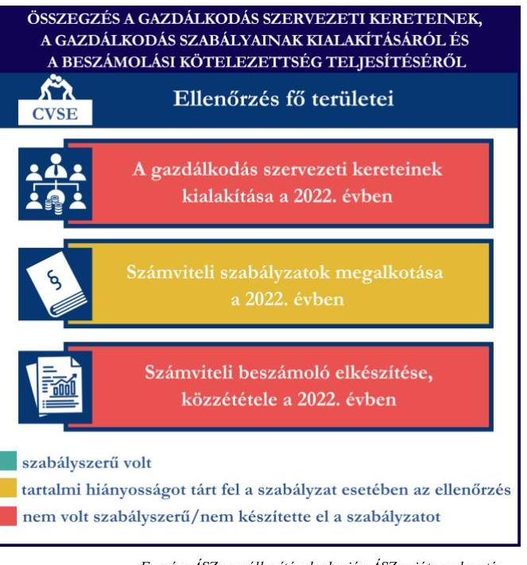
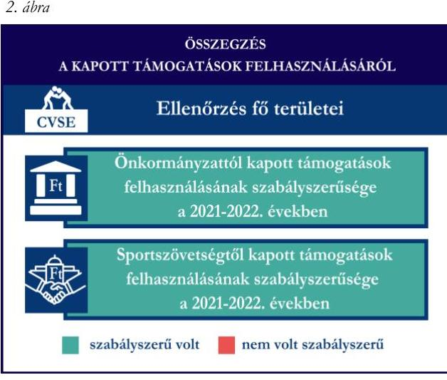
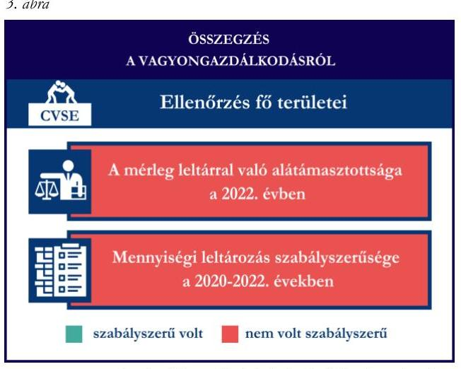

# JELENTÉS 

## Támogatásban részesülő sportszövetségek és sportegyesületek gazdálkodásának ellenőrzése

Ceglédi Vasutas Sport Egyesület

2024.

---

# JELENTÉS 

## Támogatásban részesülő sportszövetségek és sportegyesületek gazdálkodásának ellenőrzése

Ceglédi Vasutas Sport Egyesület

2024.

---

# ELLENŐRZÉSI IGAZGATÓSÁG: 

## ÁLLAMHÁZTARTÁSON KÍVÜLI SZERVEZETEKET ELLENŐRZŐ IGAZGATÓSÁG

## ELLENŐRZÉSI IGAZGATÓ:

## KLINGA LÁSZLÓ igazgató

## ELLENŐRZÉSVEZETŐ:

Jelentéseink az interneten a www.asz.hu címen olvashatók.

## KAKAS SÁNDOR ellenőrzésvezető

IKTATÓSZÁM: EL-4060-006/2024.
TÉMASZÁM: 2682
ELLENŐRZÉS-AZONOSÍTÓ SZÁM: V1026

---

# TARTALOMJEGYZÉK 

- AZ ELLENŐRZÉS ALAPADATAI ..... 5
- AZ ELLENŐRZÖTT SZERVEZET ..... 7
- ÖSSZEFOGLALÁS ..... 8
- AZ ELLENŐRZÉS FÓKUSZKÉRDÉSEI ..... 10
- MEGÁLLAPÍTÁSOK ..... 11
- JAVASLATOK ..... 14
- MELLÉKLETEK ..... 16
I. sz. melléklet: Értelmező szótár ..... 16
II. sz. melléklet: Az ellenőrzött szervezetek jegyzéke ..... 18
III. sz. melléklet: Ellenőrzési kritériumok ..... 19
- FÜGGELÉK: ÉSZREVÉTELEK ..... 20
- RÖVIDÍTÉSEK JEGYZÉKE ..... 21

---

.

---

# AZ ELLENŐRZÉS ALAPADATAI 

## AZ ELLENŐRZÉS CÉLJA

Az ellenőrzés célja az államháztartásból nyújtott támogatással, vagy az államháztartásból meghatározott célra ingyenesen juttatott vagyon felhasználásával érintett sportszövetségek és sportegyesületek gazdálkodása szabályozottságának, gazdálkodási tevékenységének, ezen belül a beszámolási kötelezettség teljesítésének, a támogatások elkülönített nyilvántartásának, valamint a támogatások felhasználásának ellenőrzése.

## AZ ELLENŐRZÉS TÍPUSA

Szabályszerüségi ellenőrzés.

## AZ ELLENŐRZÖTT IDŐSZAK

Az 1. fókuszkérdés esetében a 2022. év.
A 2. fókuszkérdés vonatkozásában a 2021-2022. évek.
A 3. fókuszkérdés vonatkozásában a 2022. év, a mennyiségi felvétellel történő leltározás dokumentumai tekintetében a 2020-2022. évek.

## AZ ELLENŐRZÉS TÁRGYA

Az ellenőrzés tárgyát képezte a támogatásban részesülő sportszövetségek, sportegyesületek gazdálkodása szabályozottságának, gazdálkodási tevékenységén belül a beszámolási kötelezettség teljesítésének, a vagyonnyilvántartásának, a támogatások elkülönített nyilvántartásának, valamint az államháztartási forrásból származó közvetlen vagy közvetett támogatások és a meghatározott célra ingyenesen juttatott vagyon felhasználásának a vizsgálata. Az ellenőrzés a támogatások vonatkozásában kiterjedt továbbá a támogató felé történő beszámolási és elszámolási kötelezettségek teljesítésére, az ezekkel kapcsolatos jogszabályi és belső előírások betartására.

Az ellenőrzés kiterjedt minden olyan körülményre és adatra, amely az ÁSZ ${ }^{1}$ jogszabályban meghatározott feladatainak teljesítéséhez, valamint az ellenőrzési program végrehajtása során felmerülő újabb összefüggések feltárásához szükséges. Az ellenőrzés az 1. és 3. fókuszkérdések esetében az ellenőrzött szervezet egészére, a 2. fókuszkérdés esetén kizárólag a judo szakágra vonatkozóan került végrehajtásra.

## AZ ELLENŐRZÉS JOGALAPJA

Az ellenőrzés jogszabályi alapját az ÁSZ tv. ${ }^{2} 1 . \int(3)$ bekezdése, az 5. $\int(3)$ bekezdése, valamint a Civil tv. ${ }^{3} 47 . \int$ előírásai képezték.

---

# AZ ELLENŐRZÉS MÓDSZERE 

Az ellenőrzést a nemzetközi standardokat irányadónak tekintve az ellenőrzési program szempontjai, az ellenőrzött időszakban hatályos jogszabályok, az ellenőrzés általános szakmai szabályai, az ellenőrzésre irányadó ÁSZ módszertanok figyelembevételével végezte az ÁSZ.

Az ellenőrzési kérdések megválaszolásához szükséges bizonyítékok megszerzése az ellenőrzött szervezet által rendelkezésre bocsátott dokumentumokra, adatokra alapozva kérdésfeltevés (információkérés), interjú, mintavételezés útján történt.

Az ellenőrzési bizonyítékként felhasználható adatforrások közé tartoztak egyrészt az ellenőrzés során az ellenőrzött szervezettől bekért dokumentumok, másrészt adatforrás lehetett minden további, az ellenőrzés folyamán feltárt, az ellenőrzés szempontjából információt tartalmazó dokumentum.

A támogatásokkal, azok felhasználásával kapcsolatos kötelezettségek vizsgálatára mintavételi eljárások kerültek alkalmazásra. Támogatás-típusok szerint nagyságrend alapján 1-3 darab támogatás került részletes vizsgálat alá. Ezen támogatások felhasználásának szabályszerűsége támogatásonként kockázatértékelés alapján kiválasztott mintatételekkel került ellenőrzésre. A kiválasztott támogatási szerződésekhez kapcsolódó elszámolásokból 30-30 db mintatétel került ellenőrzésre, ahol az elszámolás nem érte el a 30 db -ot, ott tételes ellenőrzésre került sor. Ezen felül a vagyongazdálkodás szabályszerűségének ellenőrzéséhez is kockázatalapú mintavétel kapcsolódott. A támogatások felhasználása és a vagyongazdálkodás területén a minták ellenőrzése kiterjedt a könyvvezetési kötelezettség vizsgálatára is. A tárgyi eszközök tekintetében 30 db került kiválasztásra a 2022. évben állományban lévő eszközök közül azok nyilvántartásának, elszámolásának szabályszerűsége ellenőrzése céljából. A kiválasztott mintatételek ellenőrzésének eredménye nem került kivetítésre a teljes sokaságra, a megállapítások az adott ellenőrzött mintatételek vonatkozásában kerültek megjelenítésre.

---

# AZ ELLENŐRZÖTT SZERVEZET

A Ceglédi Vasutas Sport Egyesületet 1935-ben alapították. Az Alapszabálya szerinti célja és tevékenysége többek között, a szabadidő sport támogatása, a testedzés előmozdítása, valamint a versenysport helyi feltételeinek megvalósítása, gyakorlási lehetőség biztosítása a szakosztályok körében, az ennek érdekében történő kiválasztás, utánpótlás nevelés, magas szintű edzésmunka és versenyeztetés. Az egyesületnél az ellenőrzött időszakban 17 szakosztály működött.

A CVSE a jogszabályi előírás alapján könyvvizsgálatra és felügyelőbizottság létrehozására is kötelezett volt. A CVSE az ellenőrzött időszakban 3 tagú felügyelőbizottsággal rendelkezett.

A szervezetnek a 2022. évre vonatkozóan éves beszámoló készítési kötelezettsége állt fenn. A 2022. évben a CVSE az alapcéljai megvalósítása érdekében vállalkozási tevékenységet is végzett. Az $\mathrm{OBH}^{1}$ nyilvántartás adatai alapján az ellenőrzött időszakban közhasznú jogállással nem rendelkezett.

A CVSE judo szakága által az ellenőrzött időszakban igénybe vett támogatásokat az 1. táblázat mutatja be.

1. táblázat

A CVSE ÁLTAL IGÉNYBE VETT TÁMOGATÁSOK (ADATOK M FT-BAN)

|   | 2021. EV | 2022. EV  |
| --- | --- | --- |
|  Központi költségvetési támogatás | - | -  |
|  Helyi önkormányzati támogatás | 20,0 | -  |
|  Magyar Judo Szövetségtől kapott támogatás | 9,6 | 7,2  |

---

# ÖSSZEFOGLALÁS 

Magyarország Alaptörvényének XX. cikke kimondja, hogy mindenkinek joga van a testi és lelki egészséghez, melynek érvényesülését Magyarország többek között a sportolás és a rendszeres testedzés támogatásával segíti elő. Az Országgyűlés a Sport tv. ${ }^{5}$-ben kinyilvánította, hogy a nemzet közössége a test művelését, a sportot, a nemzet alapértékének, kívánatos célnak tekinti. A sport a közjó része. Erősíti a közösség tagjainak egymáshoz tartozását, miként az egyén testi és lelki egészségét.

A sportegyesületek, sportszövetségek múködésükre és szakmai tevékenységük ellátására költségvetési támogatásban, önkormányzati támogatásban, ingyenes vagyonjuttatásban, valamint látvány-csapatsport támogatásban részesülhetnek, amelyekre fokozott figyelem irányul.

A társadalom részéről jogosan felmerülő elvárás, hogy a közpénzeket kezelő, azzal gazdálkodó szervezetek múködéséről, tevékenységéről átfogó képet kapjon, a közpénzek rendeltetésszerű és átlátható módon történő felhasználásának értékelésére időről-időre sor kerüljön az ellenőrzések keretében.

A CVSE-nél a 2022. évben a gazdálkodási szabályok kialakítása, a könyvvezetési- és beszámolási kötelezettség teljesítése nem volt szabályszerű. A CVSE a könyvviteli szolgáltatás személyi feltételeinek megteremtéséről, felügyelőbizottság létrehozásáról és működéséről gondoskodott, azonban a 2022. évben a beszámoló felülvizsgálatával könyvvizsgálót nem bízott meg.

A CVSE a jogszabályi előírások szerint kialakította a számviteli politikáját, valamint elkészítette a számviteli szabályzatait, azonban a számviteli politika a beszámoló készítés és a könyvvizsgálat vonatkozásában nem a szervezetre vonatkozó előírásokat tartalmazta. A számlarend tekintetében tartalmi hiányosságokat tárt fel az ellenőrzés.

A CVSE nem a jogszabályoknak megfelelően teljesítette a számviteli beszámoló- és közhasznúsági

melléklet készítési- és közzétételi kötelezettségét, mert a 2022. évre vonatkozó számviteli beszámolója nem a jogszabály által meghatározott formában került elkészítésre, s nem a Küldöttközgyűlés által elfogadott beszámolót helyezte letétbe. A CVSE Küldöttközgyűlése által elfogadott 2022. évi egyszerűsített éves beszámoló eredménykimutatása nem tartalmazta a jogszabályi előírás ellenére az alaptevékenység, valamint a vállalkozási tevékenységgel összefüggő tételek elkülönített kimutatását.

A gazdálkodás szervezeti keretei kialakításának, a számviteli szabályzatok megalkotásának, valamint a számviteli beszámoló elkészítésének és közzétételének értékelését az 1. ábra mutatja be.

---

A CVSE judo szakosztálya részére az önkormányzattól kapott támogatást a 2021-2022. években az ellenőrzött tételek esetében szabályszerűen használta fel. A CVSE judo szakosztálya a központi költségvetésből a sportszövetségen keresztül kapott támogatást az ellenőrzött tételek esetében a támogatási célnak megfelelően használta fel 2021-2022. években, azonban a támogatások felhasználásáról nem vezetett elkülönített könyvviteli nyilvántartást. A kapott támogatások felhasználásának értékelését a 2. ábra mutatja be.

A CVSE vagyongazdálkodása a beszámoló leltárral való alátámasztottsága, a tárgyi eszközök üzembe helyezése és értékcsökkenésük elszámolása tekintetében, az ellenőrzött tételek esetében a 2022. évben nem volt szabályszerű. A CVSE a 2022. évi egyszerűsített éves beszámolójának mérlegtételeit nem támasztotta alá szabályszerű leltárral. A tárgyi eszközök vonatkozásában a mennyiségi felvétellel történő leltározást elvégezte, azonban a leltárban kimutatott értékek a mérlegben szereplő adatokkal nem egyeztek meg, így sérült a jogszabályban előírt valódiság elve.

A vagyongazdálkodás értékelését a 3. ábra mutatja be.

*Fonrás: ÁSZ megállapítások alapján ÁSZ saját szerkesztés*

---

# AZ ELLENŐRZÉS FÓKUSZKÉRDÉSEI 

1.     - A gazdálkodási szabályok kialakítása, a könyvvezetési- és beszámolási kötelezettség teljesítése szabályszerű volt-e?
2.     - A kapott támogatások felhasználása szabályszerű volt-e?
3.     - Az ellenőrzött szervezet vagyongazdálkodása szabályszerű volt-e?

---

# MEGÁLLAPÍTÁSOK 

## 1. A gazdálkodási szabályok kialakítása, a könyvvezetési- és beszámolási kötelezettség teljesítése szabályszerű volt-e?

Összegző megállapítás A CVSE-nél a 2022. évben a gazdálkodási szabályok kialakítása, a könyvvezetési- és beszámolási kötelezettség teljesítése nem volt szabályszerű.

A 2022. évben a CVSE a Számv. tv. ${ }^{6}$ és a Civilszr. ${ }^{7}$-ben foglalt jogszabályi előírások betartásával gondoskodott a könyvviteli szolgáltatás személyi feltételeinek megteremtéséről, a könyvviteli szolgáltatás körébe tartozó feladatok ellátásával megbízott szervezet megfelelt a jogszabályi előírásoknak.
A CVSE a 2022. évben a Civilszr. 16. § (1) bekezdésében előírtak ellenére könyvvizsgálati kötelezettségének nem tett eleget, a beszámoló felülvizsgálatával könyvvizsgálót nem bízott meg, annak ellenére, hogy éves bevétele az üzleti évet megelőző két üzleti év átlagában meghaladta a 300 M Ft -ot.
A Ptk. ${ }^{8}$ előírása szerint létrehozta a felügyelőbizottságot, a felügyelőbizottság tagjainak száma megfelelt a Ptk. előírásainak.
A CVSE a 2022. évben rendelkezett a Számv. tv.-ben előírt számviteli politikával, az eszközök és a források értékelési szabályzatával, pénzkezelési szabályzattal, az eszközök és a források leltárkészítési és leltározási szabályzatával, amelyek - a számviteli politika kivételével - az ellenőrzött tartalmi kritériumoknak megfeleltek.
A CVSE a Számv.tv. szerinti éves beszámoló készítésére volt kötelezett, azonban számviteli politikájában egyszerűsített éves beszámoló készítését írta elő, amely ellentétes a Civilszr. 8. § (3) bekezdés a) és c) pontjaiban előírtaknak. A CVSE számviteli politikájában a Civilszr. 16. § (1) bekezdésében előírtakkal ellentétesen határozta meg a könyvvizsgálati kötelezettségét.
A CVSE a Számv. tv. szerint a számlarendet elkészítette, azonban a számlarend nem teljeskörűen tartalmazta

- a Számv. tv. 161. § (2) bekezdés b) pontjában előírtak ellenére a számla tartalmát, ha a számla megnevezéséből egyértelműen nem következett,
- a Számv. tv. 161. § (2) bekezdés c) pontjában előírtak ellenére a "9638 Támogatások" főkönyvi számla és az analitikus nyilvántartás kapcsolatát.
A Számv. tv. 161. § (5) bekezdésében előírtak ellenére a törvényi változást követően a számlarend módosítását a hatálybalépést követő 90 napon belül nem végezte el, mivel a 2022. évi számlarend tartalmazta a rendkívüli ráfordítások és rendkívüli bevételek főkönyvi számlacsoportokat és azok alábontásait, annak ellenére, hogy 2015. július 4-től a rendkívüli bevételek és ráfordítások megszűntek.
A CVSE a Civilszr. előírásainak megfelelően kettős könyvvitelt vezetett a 2022. évben.. A 2022. évben a CVSE végzett vállalkozási tevékenységet. A vállalkozási tevékenység bevételei, ráfordításai, eredménye elkülönítéséről munkaszám alkalmazásával gondoskodott. A 2021. és 2022. évi egyszerűsített éves beszámoló eredménylevezetésében a kimutatott vállalkozási tevékenység bevétel összegét a Számv. tv. 164. § (2) bekezdésében előírtak ellenére a főkönyvi adatok nem támasztották alá.

---

A CVSE könyvvezetésre és nyilvántartásra vonatkozó belső szabályok nem biztosították a más civil szervezettől kapott támogatások elkülönített nyilvántartását a Civil tv. 20. § (2) bekezdésében előírtak ellenére A könyvviteli nyilvántartásait a Számv. tv. és a Civil tv. rendelkezéseinek megfelelően úgy alakította ki, hogy a beszámolóban az egyéb bevételeken belül a kapott támogatások összegét részletezni tudta.
A CVSE a 2022. évre vonatkozóan a Civilszr. 8. § (3) bekezdés a) és c) pontjában előírtak ellenére éves beszámoló helyett egyszerűsített éves beszámolót készített annak ellenére, hogy a mérlegfőösszege és az átlagosan foglalkoztatottak száma is meghaladta a jogszabályban rögzített határértéket az üzleti évet megelőző két üzleti év mérlegfordulónapján.
A Civil tv.-ben előírtak szerint a beszámolóval egyidejűleg elkészítette a közhasznúsági mellékletet, mely azonban nem tartalmazta a Civil tv. 29. § (7) bekezdésében előírtak ellenére a közhasznú cél szerinti juttatások kimutatását, a vezető tisztségviselőknek nyújtott juttatások összegét és a juttatásban részesülő vezető tisztségek felsorolását.
A CVSE esetében a felügyelőbizottság megvizsgálta és véleményezte a 2022. évi beszámolót. A CVSE közgyűlése a 2022. évre vonatkozó formailag hibás, tartalmában hiányos beszámolót hagyott jóvá. A 2022. évi beszámoló könyvvizsgálóval történő felülvizsgálata a Civilszr. 16. § (3) bekezdésében előírtak ellenére nem történt meg. A CVSE felügyelőbizottsága a számviteli beszámoló jogszabályok betartásának ellenőrzés kapcsolatos feladatát, a Ptk. 3:82. § (2) bekezdésben előírtak ellenére nem látta el.
A CVSE a Civil tv. 30. § (1) bekezdésében előírtak ellenére nem a jogszabályi előírás szerint tette közzé a 2022. évi beszámolóját, ugyanis nem a Küldöttközgyűlés által elfogadott beszámolóját helyezte letétbe és tette közzé, figyelemmel arra, hogy a CVSE Küldöttközgyűlése által elfogadott 2022. évi beszámoló eredménykimutatása a Civilszr. 12. § (4) bekezdés előírása ellenére nem tartalmazta egymástól elkülönítve az alaptevékenységgel, valamint a vállalkozási tevékenységgel összefüggő tételeket. A CVSE a 2022. évi beszámolóját a Civil tv. 30. § (1) bekezdésében előírtak ellenére 19 nappal a jogszabályi határidőn túl helyezte letétbe és tette közzé. A 2022. évi beszámolót a Civil tv. 30. § (4) bekezdésében előírtak ellenére a saját honlapján nem tette közzé.

# 2. A kapott támogatások felhasználása szabályszerű volt-e? 

Összegző megállapítás A CVSE a jogszabályoknak megfelelően teljesítette a judo szakosztály részére az önkormányzattól kapott támogatás felhasználásával és elszámolásával kapcsolatos kötelezettségeit. A sportszövetségen keresztül számára jutatott támogatások felhasználásáról nem rendelkezett elkülönített számviteli nyilvántartással.

A CVSE a 2021. évben a helyi önkormányzattól a judo szakosztály vonatkozásában kapott sportcélú támogatásokat a Civil tv. előírásai szerint elkülönítetten mutatta ki a könyveiben, a Civil tv. rendelkezéseinek megfelelően a kapott támogatások felhasználásáról elkülönített nyilvántartást vezetett. A CVSE a beszámolási kötelezettségét a támogatás rendeltetésszerű felhasználásáról az Áht. ${ }^{9}$-nak megfelelően teljesítette a helyi önkormányzat felé.

---

A CVSE a Civil tv. 20. § (4) bekezdésében előírtak ellenére a sportszövetségen keresztül számára jutatott támogatások felhasználásáról nem rendelkezett olyan elkülönített számviteli nyilvántartással, amelynek alapján támogatásonként megállapítható és ellenőrizhető volt a kapott támogatás felhasználása.
A támogatások felhasználásáról az MJSZ ${ }^{10}$ felé benyújtott beszámolók és annak részeként az összesített elszámolási táblázatok a támogatási szerződésekben előírt formában és tartalommal elkészítette. A támogató felé benyújtott elszámolásokat alátámasztó számviteli bizonylatok a Számv. tv.-ben foglalt alaki és tartalmi követelményeknek megfeleltek, a támogató felé benyújtott számlák a 474/2016. (XII. 27.) Korm. rendeletben ${ }^{11}$ előírtaknak megfelelően záradékolásra kerültek.

# 3. Az ellenőrzött szervezet vagyongazdálkodása szabályszerű volt-e? 

Összegző megállapítás

A CVSE vagyongazdálkodása 2022. évben nem volt szabályszerű. A 2022. évi beszámoló mérlegét nem támasztotta alá leltárral, a főkönyvi könyvelés és az analitikus nyilvántartások adatai közötti egyeztetést a 2022. év mérlegfordulónapjára nem végezte el.

A CVSE a Számv. tv. 69. § (1) bekezdésében előírtak ellenére a 2022. évi beszámolójának mérlegtételeit nem támasztotta alá leltárral. A CVSE a Számv. tv. 69. § (2) bekezdésében előírtak ellenére a főkönyvi könyvelés és az analitikus nyilvántartások adatai közötti egyeztetést a 2022. év mérlegfordulónapjára teljeskörűen nem végezte el, mert a tárgyi eszközök, pénzeszközök mérlegtételek tekintetében a főkönyvi könyvelésben szereplő adatokat az analitikus nyilvántartások adatai nem támasztották alá.
A CVSE a 2022. évben a tárgyi eszközök mennyiségi felvétellel történő leltározást a Számv. tv. alapján elvégezte, azonban a leltárban kimutatott értékek a mérlegben szereplő adatokkal nem egyeztek meg így sérült a Számv. tv. 15. § (3) bekezdésében foglalt valódiság elve.
A CVSE esetében mintatételek ellenőrzése során az alábbiak kerültek megállapításra:

- a tárgyi eszközök való besorolása - három mintatétel kivételével - a Számv. tv. előírásai szerint történt. A „Felszerelések, eszközök", „Cserepad, öltözökabin" és „Vizilabdakapu, pályakötél" megnevezésű tárgyi eszközök mérlegben történő besorolása nem felelt meg a Számv. tv. 16. § (1) bekezdésében előírtaknak, mert a nyilvántartott eszköz alatt több további eszközt összevontan kezeltek;
- a bekerülési érték meghatározása megfelelt a Számv. tv. előírásainak.;
- három tárgyi eszköz esetében a Számv. tv. 52. § (2) bekezdésében előírtak ellenére az eszközöket nem a bekerülési érték összegével egyezően aktiválták, ennek okán az eszközök tárgyévi értékcsökkenésének elszámolása a Számv. tv. 52. § (1) bekezdésében foglaltakkal nem volt összhangban;
- három mintatétel esetében az értékcsökkenés elszámolása során nem érvényesült a Számv. tv. 52. § (2) bekezdésében előírt egyedi értékelés elve, mert a nyilvántartott eszköz alatt több további eszközt összevontan kezeltek, így az értékcsökkenés elszámolásának alapja sem volt szabályszerű., így az értékcsökkenés elszámolása nem volt megalapozott.

---

# JAVASLATOK 

Az ÁSZ tv. 33. § (1) bekezdésében foglaltak értelmében az ellenőrzött szervezet vezetője köteles a jelentésben foglalt megállapításokhoz kapcsolódó intézkedési tervet összeállítani és azt a jelentés kézhezvételétől számított 30 napon belül az ÁSZ részére megküldeni. Amennyiben az ellenőrzött szervezet vezetője nem küldi meg határidőben az intézkedési tervet, vagy továbbra sem elfogadható intézkedési tervet küld, az Állami Számvevőszék elnöke az ÁSZ tv. 33. § (3) bekezdése a) és b) pontjaiban foglaltakat érvényesítheti.

## A CEGLÉDI VASUTAS SPORT EGYESÜLET ELNÖKÉNEK

1. Gondoskodjon a számviteli beszámoló könyvvizsgálóval történő felülvizsgálatáról a Civilszr.16. §. (6) bekezdésében elöirtaknak megfelelően.
2. Gondoskodjon a számviteli politika Számv. tv.14.§ (3) bekezdésében elöirtaknak megfelelő tartalommal való elkészitéséről.
3. Gondoskodjon a számlarend a Számv. tv. 161. § (2) bekezdésében elöirtaknak megfelelő tartalommal való elkészitéséről.
4. Gondoskodjon a számviteli nyilvántartások vezetéséről oly módon, hogy az alapcél szerinti (közhasznú) tevékenysége költségei, ráfordításai ellentételezésére visszafizetési kötelezettség nélkül kapott támogatások a Civil tv. 20. § (2) bekezdésében elöirtaknak megfelelően kerüljenek kimutatásra.
5. Gondoskodjon a Civilszr. 8. § (3) a) és c) pontjai elöirásának megfelelő beszámoló elkészitéséről.
6. Gondoskodjon a beszámolóval egyidejüleg a közhasznúsági melléklet elkészitéséről a Civil tv. 29. § (7) bekezdésében elöirtaknak megfelelően.
7. Gondoskodjon a beszámoló Civil tv. 30. § (1) bekezdésében foglaltak szerinti közzétételéről.
8. Gondoskodjon a beszámoló saját honlapon való elhelyezéséről a Civil tv. 30. § (4) bekezdésében elöirtaknak megfelelően.

---

9. Gondoskodjon a beszámoló mérlegtételeinek leltárral történő alátámasztásáról a Számv. tv. 69. § (1) előírásainak megfelelően.
10. Gondoskodjon a tárgyi eszközök esetében a bekerülési érték bizonylattal történő alátámasztásáról a Számv. tv. 165. §. (2) bekezdésében előírtak szerint.
11. Gondoskodjon a tárgyi eszközök bekerülési értéken történő aktiválásáról, a Számv. tv. 52. § (1) bekezdés előírásainak megfelelően.
12. Gondoskodjon a tárgyi eszközök esetében az értékcsökkenési leírás elszámolásáról a Számv. tv. 52. § (1) bekezdés előírásainak megfelelően

---

# MELLÉKLETEK 

## I. SZ. MELLÉKLET: ÉRTELMEZŐ SZÓTÁR

Civil szervezet

Egyesület

Költségvetési támogatás

Közhasznú szervezet

Közhasznú tevékenység

Országos sportági szakszövetség

Sportági szövetség

A civil társaság; a Magyarországon nyilvántartásba vett egyesület - a párt, a szakszervezet és a kölcsönös biztosító egyesület kivételével és a közalapítvány és a pártalapítvány kivételével - az alapítvány. (Forrás: Civil tv. 2. §6. pont a)-c) alpontjai)
Az egyesület a tagok közös, tartós, alapszabályban meghatározott céljának folyamatos megvalósítására létesített, nyilvántartott tagsággal rendelkező jogi személy. (Forrás: Ptk. 3:63. § (1) bekezdés)
A Számv. tv. szempontjából egyéb szervezet. (Számv. tv. 3. (1) bekezdés $\S 4$. pont a) alpontja)
A társadalombiztosítás pénzügyi alapjai kivételével az államháztartás központi alrendszeréből ellenérték nélkül, pénzben nyújtott támogatások. (Forrás: Áht. 1. § 14. pont)
Közhasznú szervezetté minősíthető a Magyarországon nyilvántartásba vett közhasznú tevékenységet végző szervezet, amely a társadalom és az egyén közös szükségleteinek kielégítéséhez megfelelő erőforrásokkal rendelkezik, továbbá amelynek megfelelő társadalmi támogatottsága kimutatható, és amely:
a) civil szervezet (ide nem értve a civil társaságot), vagy
b) olyan egyéb szervezet, amelyre vonatkozóan a közhasznú jogállás megszerzését törvény lehetővé teszi. (Forrás: Civil tv. 32. $\$ 1$ ) bekezdés)

Minden olyan tevékenység, amely a létesítő okiratban megjelölt közfeladat teljesítését közvetlenül vagy közvetve szolgálja, ezzel hozzájárulva a társadalom és az egyén közös szükségleteinek kielégítéséhez. (Forrás: Civil tv. 2. § 20. pont)
Olyan sportszövetség, amely sportágában kizárólagos jelleggel az e törvényben, valamint más jogszabályokban meghatározott feladatokat lát el és e törvényben megállapított különleges jogosítványokat gyakorol. Olyan sportágban hozható létre, amelyet vagy a Nemzetközi Olimpiai Bizottság elismert, vagy amely sportág nemzetközi szövetségét felvették a Nemzetközi Sportszövetségek Szövetségébe (GAISF). (Forrás: Sport tv. 20. § (1), (4) bekezdés)
A Civil tv. és a Ptk. előírásai alapján - a Sport tv.-ben meghatározott eltérésekkel - múködő szövetség, amelynek tagjai kizárólag sportszervezetek lehetnek. Sportági szövetség országos jelleggel is múködhet. Egy sportágban csak egy országos sportági szövetség múködhet. Törvényi feltételek teljesülése esetén szakszövetségi feladatokat is elláthat. (Forrás: Sport tv. 28. §)

---

Sportegyesület

Sportegyesületeknek, sportszövetségeknek nyújtott költségvetési támogatás

Sportszövetség

Sporttevékenység

Vagyongazdálkodás

A Civil tv. és a Ptk. szabályai szerint müködő olyan egyesület, amelynek alaptevékenysége a sporttevékenység szervezése, valamint a sporttevékenység feltételeinek megteremtése. A sportegyesületek a Sport tv. 15. § (1) bekezdésében meghatározott sportszervezetek körébe tartoznak. A sportegyesületeken kívül sportszervezet még a sportvállalkozás, a sportiskola, valamint az utánpótlás-nevelés fejlesztését végző alapítvány. (Forrás: Sport tv. 16. § (1) bekezdés)
Az állami sport célú támogatások felhasználásáról és elosztásáról szóló 474/2016. (XII. 27.) Kormány rendelet és a 27/2013. (III. 29.) EMMI rendelet ${ }^{12}$ 1. $\mathbb{S}$-ában meghatározott fejezeti kezelésű előirányzatokból nyújtott támogatás.
Meghatározott sporttevékenységek körében a sportversenyek szervezésére, a tagok érdekvédelmére és a részükre való szolgáltatásokra, valamint a nemzetközi kapcsolatok lebonyolítására létrehozott, jogi személyiséggel és önkormányzattal rendelkező, a Civil tv. és a Ptk. alapján - az e törvényben foglalt eltérésekkel - különös formában müködő egyesületek. A Sport tv. 19. § (3) bekezdése szerint a sportszövetségeknek az alábbi típusai léteznek: országos sportági szakszövetségek, sportági szövetségek, szabadidősport szövetségek, fogyatékosok sportszövetségei, diák- és egyetemi-főiskolai sport sportszövetségei, nemzetközi sportszövetségek. (Forrás: Sport tv. 19. $\mathbb{S}(1),(3)$ bekezdés)
Meghatározott szabályok szerint, a szabadidő eltöltéseként kötetlenül vagy szervezett formában, illetve versenyszerűen végzett testedzés vagy szellemi sportágban kifejtett tevékenység, amely a fizikai erőnlét és a szellemi teljesítőképesség megtartását, fejlesztését szolgálja. (Forrás: Sport tv. 1. § (2) bekezdés)
A nemzeti vagyongazdálkodás feladata a nemzeti vagyon rendeltetésének megfelelő, az állam, az önkormányzat mindenkori teherbíró képességéhez igazodó, elsődlegesen a közfeladatok ellátásához és a mindenkori társadalmi szükségletek kielégítéséhez szükséges, egységes elveken alapuló, átlátható, hatékony és költségtakarékos müködtetése, értékének megőrzése, állagának védelme, értéknövelő használata, hasznosítása, gyarapítása, továbbá az állam vagy a helyi önkormányzat feladatának ellátása szempontjából feleslegessé váló vagyontárgyak elidegenítése. (Forrás: Nvtv. ${ }^{13}$ 7. § (2) bekezdés)

---

II. SZ. MELLÉKLET: AZ ELLENŐRZÖTT SZERVEZETEK JEGYZÉKE

| ELLENŐRZÖTT SZERVEZET NEVE | ELLENŐRZÖTT SZERVEZET SZÉKHELYE |
| :-- | :-- |
| Ceglédi Vasutas Sport Egyesületet | 1134 Budapest, Dózsa Gy. út 53. |

---

# III. SZ. MELLÉKLET: ELLENŐRZÉSI KRITÉRIUMOK 

## FÓKUSZKÉRDÉS

## 1. fókuszkérdés:

A gazdálkodási szabályok kialakítása, a könyvvezetési és beszámolási kötelezettség teljesítése szabályszerű volt-e?

## 2. fókuszkérdés:

A kapott támogatások felhasználása szabályszerű volt-e?

## 3. fókuszkérdés:

Az ellenőrzött szervezet vagyongazdálkodása szabályszerű volt-e?

## ELLENŐRZÉSI KRITÉRIUMOK

Számv. tv. 14. § (3) bekezdés, (5) bekezdés a), b), d) pont, (8) bekezdés, 69. § (3) bekezdés, 90. § (3) bekezdés c) pont, 161. $\S$ (1) bekezdés, (2) bekezdés a)-d) pont, (3)-(4) bekezdés, 161/A. $\S$ (2) bekezdés, 165. $\S$ (2) bekezdés
Civilszr. 7. § (1) bekezdés, (4) bekezdés b), c) pont, 8. § (2), (3) bekezdés, 9. § (4), (5), (8) bekezdés, 12. § (4), (5) bekezdés, 15. § (1) bekezdés a), b) pont, 16. § (1) bekezdés, 24. § (2) bekezdés
Ptk. 3:26. § (1) bekezdés, 3:27. § (1) bekezdés, 3:82. § (1) bekezdés,
Civil tv. 28.§ (1) bekezdés, 29. § (2) bekezdés c) pont, (3), (6), (7) bekezdés, 30. § (1)-(4) bekezdés, 40. § (1), (2) bekezdés, 41. § (1) bekezdés
Sport tv. 23. § (1) bekezdés f) pont
Számv. tv. 44. § (2) bekezdés, 93. § (3) bekezdés, 159. §, 165. §
(2) bekezdés, 167. § (1) bekezdés a), d), e), h) pont
Civil tv. 20. § (2) bekezdés a) pont, (3) bekezdés a), c) pont, (4) bekezdés, 29. § (4), (5) bekezdés
Civilszr. 24. § (2) bekezdés
27/2013. (III.29.) EMMI rend. 18. § (2) bekezdés
474/2016. (XII. 27.) Korm. rend. 22. § (2) bekezdés, 24. § (2) bekezdés
Áht. 53. §
Ptk. 3:63. § (4) bekezdés
Számv. tv. 3. § (3) bekezdés 3. pont, 15. § (3) bekezdés, 26. §, 46. § (3), (4) bekezdés, 47-51. §, 52. § (1)-(7) bekezdés, 69. § (1)(3) bekezdés, 165. § (2) bekezdés, 169. § (2) bekezdés
Sport tv. 76/B. §, 76/C. §

---

# FÜGGELÉK: ÉSZREVÉTELEK 

A jelentéstervezetet a Számvevőszék 15 napos észrevételezésre megküldte az ellenőrzött szervezet vezetőjének az ÁSZ tv. 29. §* (1) bekezdése előírásának megfelelően.

A Ceglédi Vasutas Sport Egyesületet elnöke a jelentéstervezetre nem tett észrevételt.

[^0]
[^0]:    * 29. § (1) Az Állami Számvevőszék az ellenőrzési megállapításait megküldi az ellenőrzött szervezet vezetőjének vagy az általa megbízott személynek, és annak, akinek személyes felelősségét állapította meg.
    (2) Az ellenőrzött szervezet vezetője és a felelősként megjelölt személy az ellenőrzés megállapításaira tizenöt napon belül írásban észrevételt tehet.
    (3) Az Állami Számvevőszék az észrevételre a beérkezésétől számított harminc napon belül írásban válaszol. A figyelembe nem vett észrevételeket köteles a jelentésben feltüntetni, és megindokolni, hogy azokat miért nem fogadta el.

---

# RÖVIDÍTÉSEK JEGYZÉKE 

${ }^{1}$ ÁSZ
${ }^{2}$ ÁSZ tv.
${ }^{3}$ Civil tv.
${ }^{4}$ OBH
${ }^{5}$ Sport tv.
${ }^{6}$ Számv. tv.
${ }^{7}$ Civilszr.
${ }^{8}$ Ptk.
${ }^{9}$ Ábt.
${ }^{10}$ MJSZ
${ }^{11}$ 474/2016. (XII. 27.) Korm. rendelet
${ }^{12}$ 27/2013. (III.29.) EMMI rendelet
${ }^{13}$ Nvtv.

Állami Számvevőszék
2011. évi LXVI. törvény az Állami Számvevőszékről
2011. évi CLXXV. törvény az egyesülési jogról, a közhasznú jogállásról, valamint a civil szervezetek müködéséről és támogatásáról
Országos Bírósági Hivatal
2004. évi I. törvény a sportról
2000. évi C. törvény a számvitelről
479/2016. (XII.28.) Korm. rendelet a számviteli törvény szerinti egyes egyéb szervezetek beszámoló készítési és könyvvezetési kötelezettségének sajátosságairól
2013. évi V. törvény a Polgári Törvénykönyvről
2011. évi CXCV. törvény az állambáztartásról

Magyar Judo Szövetség
474/2016. (XII. 27.) Korm. rendelet az állami sport célú támogatások felhasználásáról és elosztásáról
27/2013. (III. 29.) EMMI rendelet az állami sport célú támogatások felhasználásáról és elosztásáról
2011. évi CXCVI. törvény a nemzeti vagyonról

---

1052 Budapest, Apáczai Csere János u. 10. | 1364 Budapest 4., Pf. 54
www.asz.hu | szamvevoszek@asz.hu
telefon: +36 14849100