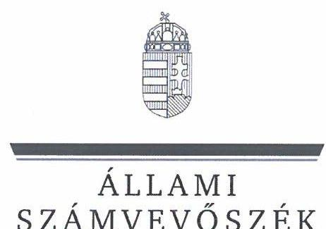
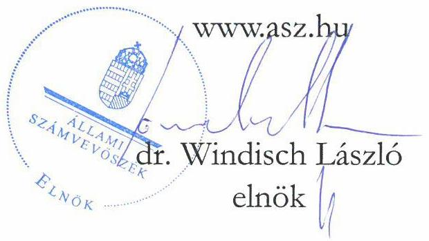
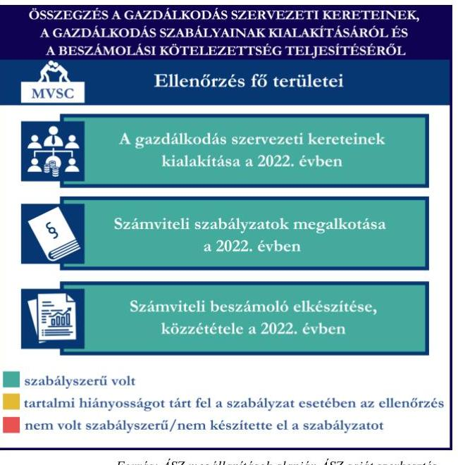
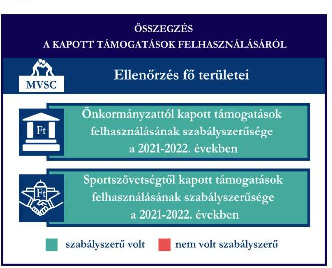
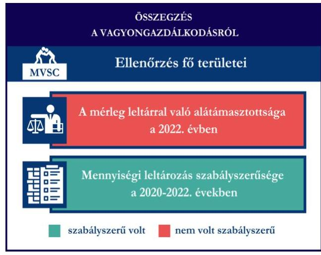

# JELENTÉS 

## Támogatásban részesülő sportszövetségek és sportegyesületek gazdálkodásának ellenőrzése

Miskolci Vasutas Sport Club

2024.

---

ÁLLAMI
SZÁMVEVŐSZÉK

# JELENTÉS 

## Támogatásban részesülő sportszövetségek és sportegyesületek gazdálkodásának ellenőrzése

Miskolci Vasutas Sport Club

2024. 

24101

---

# ELLENŐRZÉSI IGAZGATÓSÁG: 

## ÁLLAMHÁZTARTÁSON KÍVÜLI SZERVEZETEKET ELLENŐRZŐ IGAZGATÓSÁG

## ELLENŐRZÉSI IGAZGATÓ:

## KLINGA LÁSZLÓ igazgató

## ELLENŐRZÉSVEZETŐ:

Jelentéseink az interneten a www.asz.hu címen olvashatók.

## KAKAS SÁNDOR ellenőrzésvezető

IKTATÓSZÁM: EL-4060-010/2024.
TÉMASZÁM: 2682
ELLENŐRZÉS-AZONOSÍTÓ SZÁM: V1026

---

# TARTALOMJEGYZÉK 

- AZ ELLENŐRZÉS ALAPADATAI ..... 5
- AZ ELLENŐRZÖTT SZERVEZET ..... 7
- ÖSSZEFOGLALÁS ..... 8
- AZ ELLENŐRZÉS FÓKUSZKÉRDÉSEI ..... 10
- MEGÁLLAPÍTÁSOK ..... 11
- JAVASLATOK ..... 14
- MELLÉKLETEK ..... 15
I. sz. melléklet: Értelmező szótár ..... 15
II. sz. melléklet: Az ellenőrzött szervezetek jegyzéke ..... 17
III. sz. melléklet: Ellenőrzési kritériumok ..... 18
- FÜGGELÉK: ÉSZREVÉTELEK ..... 19
- RÖVIDÍTÉSEK JEGYZÉKE ..... 20

---

.

---

# AZ ELLENŐRZÉS ALAPADATAI 

## AZ ELLENŐRZÉS CÉLJA

Az ellenőrzés célja az államháztartásból nyújtott támogatással, vagy az államháztartásból meghatározott célra ingyenesen juttatott vagyon felhasználásával érintett sportszövetségek és sportegyesületek gazdálkodása szabályozottságának, gazdálkodási tevékenységének, ezen belül a beszámolási kötelezettség teljesítésének, a támogatások elkülönített nyilvántartásának, valamint a támogatások felhasználásának ellenőrzése.

## AZ ELLENŐRZÉS TÍPUSA

Szabályszerűségi ellenőrzés.

## AZ ELLENŐRZÖTT IDŐSZAK

Az 1. fókuszkérdés esetében a 2022. év.
A 2. fókuszkérdés vonatkozásában a 2021-2022. évek.
A 3. fókuszkérdés vonatkozásában a 2022. év, a mennyiségi felvétellel történő leltározás dokumentumai tekintetében a 2020-2022. évek.

## AZ ELLENŐRZÉS TÁRGYA

Az ellenőrzés tárgyát képezte a támogatásban részesülő sportszövetségek, sportegyesületek gazdálkodása szabályozottságának, gazdálkodási tevékenységén belül a beszámolási kötelezettség teljesítésének, a vagyonnyilvántartásának, a támogatások elkülönített nyilvántartásának, valamint az államháztartási forrásból származó közvetlen vagy közvetett támogatások és a meghatározott célra ingyenesen juttatott vagyon felhasználásának a vizsgálata. Az ellenőrzés a támogatások vonatkozásában kiterjedt továbbá a támogató felé történő beszámolási és elszámolási kötelezettségek teljesítésére, az ezekkel kapcsolatos jogszabályi és belső előírások betartására.

Az ellenőrzés kiterjedt minden olyan körülményre és adatra, amely az ÁSZ¹ jogszabályban meghatározott feladatainak teljesítéséhez, valamint az ellenőrzési program végrehajtása során felmerülő újabb összefüggések feltárásához szükséges. Az ellenőrzés az 1. és 3. fókuszkérdések esetében az ellenőrzött szervezet egészére, a 2. fókuszkérdés esetén kizárólag a judo szakágra vonatkozóan került végrehajtásra.

## AZ ELLENŐRZÉS JOGALAPJA

Az ellenőrzés jogszabályi alapját az ÁSZ tv.² 1. § (3) bekezdése, az 5. § (3) bekezdése, valamint a Civil tv.³ 47. § előírásai képezték.

---

# AZ ELLENŐRZÉS MÓDSZERE 

Az ellenőrzést a nemzetközi standardokat irányadónak tekintve az ellenőrzési program szempontjai, az ellenőrzött időszakban hatályos jogszabályok, az ellenőrzés általános szakmai szabályai, az ellenőrzésre irányadó ÁSZ módszertanok figyelembevételével végezte az ÁSZ.

Az ellenőrzési kérdések megválaszolásához szükséges bizonyítékok megszerzése az ellenőrzött szervezet által rendelkezésre bocsátott dokumentumokra, adatokra alapozva kérdésfeltevés (információkérés), interjú, mintavételezés útján történt.

Az ellenőrzési bizonyítékként felhasználható adatforrások közé tartoztak egyrészt az ellenőrzés során az ellenőrzött szervezettől bekért dokumentumok, másrészt adatforrás lehetett minden további, az ellenőrzés folyamán feltárt, az ellenőrzés szempontjából információt tartalmazó dokumentum.

A támogatásokkal, azok felhasználásával, kapcsolatos kötelezettségek vizsgálatára mintavételi eljárások kerültek alkalmazásra. Támogatás-típusok szerint nagyságrend alapján 1-3 darab támogatás került részletes vizsgálat alá. Ezen támogatások felhasználásának szabályszerűsége támogatásonként kockázatértékelés alapján kiválasztott mintatételekkel került ellenőrzésre. A kiválasztott támogatási szerződésekhez kapcsolódó elszámolásokból 30-30 db mintatétel került ellenőrzésre, ahol az elszámolás nem érte el a 30 db -ot, ott tételes ellenőrzésre került sor. Ezen felül a vagyongazdálkodás szabályszerűségének ellenőrzéséhez is kockázatalapú mintavétel kapcsolódott. A támogatások felhasználása és a vagyongazdálkodás területén a minták ellenőrzése kiterjedt a könyvvezetési kötelezettség vizsgálatára is. A tárgyi eszközök tekintetében 30 db került kiválasztásra a 2022. évben állományban lévő eszközök közül azok nyilvántartásának, elszámolásának szabályszerűsége ellenőrzése céljából. A kiválasztott mintatételek ellenőrzésének eredménye nem került kivetítésre a teljes sokaságra, a megállapítások az adott ellenőrzött mintatételek vonatkozásában kerültek megjelenítésre.

---

# AZ ELLENŐRZÖTT SZERVEZET

A Miskolci Vasutas Sport Clubot 1911-ben alapították, Alapszabály⁴ szerinti célja és tevékenysége többek között a szabadidő sport mozgalom fejlesztése, minőségi sport fejlesztése, amelynek keretében az ellenőrzött szervezet feladata, hogy a tagjai részére biztosítsa a szervezett formájú edzések megtartását és a versenyzési lehetőség biztosítását. Gondoskodik a tagok szakszerű sportbeli képzéséről és korszerű felkészítéséről. Az MVSC⁵ (15 szakosztállyal) rendelkezik.

Az MVSC jogszabályi előírás alapján az ellenőrzött időszakban könyvvizsgálatra nem volt kötelezett. A szervezet törvényes működésének ellenőrzését három tagból álló felügyelőbizottság látta el. Az MVSC 2022. évben az alapcéljai megvalósítása érdekében vállalkozási tevékenységet is végzett.

Az MVSC judo szakága által az ellenőrzött időszakban igénybe vett támogatásokat az 1. táblázat mutatja be.

1. táblázat

AZ MVSC ÁLTAL IGÉNYBE VETT TÁMOGATÁSOK (ADATOK M FT-BAN)

|   | 2021. ÉV | 2022. ÉV  |
| --- | --- | --- |
|  Központi költségvetési támogatás | - | -  |
|  Helyi önkormányzati támogatás | 2,8 | 2,7  |
|  Magyar Judo Szövetségtől kapott támogatás | 3,8 | 5,4  |

---

# ÖSSZEFOGLALÁS 

Magyarország Alaptörvényének XX. cikke kimondja, hogy mindenkinek joga van a testi és lelki egészséghez, melynek érvényesülését Magyarország többek között a sportolás és a rendszeres testedzés támogatásával segíti elő. Az Országgyűlés a Sport tv.⁶-ben kinyilvánította, hogy a nemzet közössége a test művelését, a sportot, a nemzet alapértékének, kívánatos célnak tekinti. A sport a közjó része. Erősíti a közösség tagjainak egymáshoz tartozását, miként az egyén testi és lelki egészségét.

A sportegyesületek, sportszövetségek működésükre és szakmai tevékenységük ellátására költségvetési támogatásban, önkormányzati támogatásban, ingyenes vagyonjuttatásban, valamint látvány-csapatsport támogatásban részesülhetnek, amelyekre fokozott figyelem irányul.

A társadalom részéről jogosan felmerülő elvárás, hogy a közpénzeket kezelő, azzal gazdálkodó szervezetek működéséről, tevékenységéről átfogó képet kapjon, a közpénzek rendeltetésszerű és átlátható módon történő felhasználásának értékelésére időről-időre sor kerüljön az ellenőrzések keretében.

A gazdálkodás szervezeti kereteinek kialakítása, a 1. ábra gazdálkodási szabályok kialakítása, a könyvvezetési és beszámolási kötelezettség teljesítése a 2022. évben az MVSC tekintetében szabályszerű volt.

Az MVSC a könyvviteli szolgáltatás személyi feltételeinek megteremtéséről, felügyelőbizottság létrehozásáról és működéséről gondoskodott. A jogszabályi előírások szerint az MVSC kialakította a számviteli politikáját, valamint elkészítette a jogszabályban meghatározott szabályzatait, továbbá rendelkezett számlarenddel. A szabályzatok az ellenőrzött jogszabályi kritériumoknak megfeleltek.

A könyvvezetés formája a 2022. évben megfelelt a jogszabályi előírásoknak. Az MVSC a jogszabályoknak megfelelően teljesítette a számviteli beszámoló- és közhasznúsági melléklet készítési- és közzétételi

A gazdálkodás szervezeti kereteinek kialakítása a 2022. évben

## Számviteli szabályzatok megalkotása a 2022. évben

Számviteli beszámoló elkészítése, közzététele a 2022. évben
$\square$ szabályszerű volt
$\square$ tartalmi hiányosságot tárt fel a szabályzat esetében az ellenőrzés
$\square$ nem volt szabályszerű/nem készítette el a szabályzatot

Forrás: ÁSZ megállapítások alapján ÁSZ saját szerkesztés
kötelezettségét.

A gazdálkodás szervezeti keretei kialakításának, a számviteli szabályzatok megalkotásának, valamint a számviteli beszámoló elkészítésének és közzétételének értékelését az 1. ábra mutatja be.

---

Forrás: ÁSZ megállapítások alapján ÁSZ saját szerkesztés
Az MVSC judo szakosztálya részére az önkormányzattól, valamint a központi költségvetésből a sportszövetségen keresztül nyújtott támogatásokat a 2021-2022. években az ellenőrzött tételek esetében a támogatási célnak megfelelően, szabályszerűen használta fel.

A kapott támogatások felhasználásának értékelését a 2. ábra mutatja be.

Az MVSC vagyongazdálkodása a 2022. évben nem volt szabályszerű, mert 2022. évi beszámolójának mérleg tételeit nem támasztotta alá teljeskörűen leltárral, a 3. ábra
főkönyvi könyvelésben szereplő adatokat az analitikus nyilvántartások adatai nem támasztották alá. A 2022. évre vonatkozóan a tárgyi eszközök esetében a mennyiségi felvétellel történő leltározást elvégezte, azonban a leltár a mérlegbeszámolóban szereplő adatokkal nem volt összhangban. A feltárt hiányosságok miatt sérült a valódiság elve. A tárgyi eszközök üzembe helyezése és értékcsökkenésük elszámolása tekintetében, az ellenőrzött tételek esetében 2022. évben nem volt szabályszerű.

A vagyongazdálkodás értékelését a 3. ábra mutatja be.

Forrás: ÁSZ megállapítások alapján ÁSZ saját szerkesztés

---

# AZ ELLENŐRZÉS FÓKUSZKÉRDÉSEI 

1.     - A gazdálkodási szabályok kialakítása, a könyvvezetési- és beszámolási kötelezettség teljesítése szabályszerű volt-e?
2.     - A kapott támogatások felhasználása szabályszerű volt-e?
3.     - Az ellenőrzött szervezet vagyongazdálkodása szabályszerű volt-e?

---

# MEGÁLLAPÍTÁSOK 

## 1. A gazdálkodási szabályok kialakítása, a könyvvezetési- és beszámolási kötelezettség teljesítése szabályszerű volt-e?

Összegző megállapítás A 2022. évben az MVSC-nél a gazdálkodási szabályok kialakítása, a könyvvezetési- és beszámolási kötelezettség teljesítése szabályszerű volt.

A 2022. évben az MVSC a Számv. tv.⁷ és a Civilszr.⁸-ben foglalt jogszabályi előírások betartásával gondoskodott a könyvviteli szolgáltatás személyi feltételeinek megteremtéséről, a könyvviteli szolgáltatás körébe tartozó feladatok ellátásával megbízott személy megfelelt a jogszabályi előírásoknak.
A Ptk.⁹ előírása szerint létrehozta a felügyelőbizottságot, a felügyelőbizottság tagjainak száma megfelelt a Ptk. előírásainak.
Az MVSC a Számv. tv.-nek megfelelően rendelkezett a 2022. évben számviteli politikával, az eszközök és a források értékelési szabályzatával, pénzkezelési szabályzattal, az eszközök és a források leltárkészítési és leltározási szabályzatával, amelyek az ellenőrzött tartalmi kritériumoknak megfeleltek. Az MVSC a Számv. tv. szerint a számlarendet elkészítette.
Az MVSC a Civilszr. előírásainak megfelelően kettős könyvvitel vezetésével teljesítette könyvvezetési kötelezettségét a 2022. évben. A 2022. évben az MVSC végzett vállalkozási tevékenységet, melynek bevételeit és ráfordításait a könyvvezetése során a Civil tv.-nek megfelelően az alaptevékenységtől elkülönítetten tartotta nyilván és mutatta ki beszámolójában. A könyvviteli nyilvántartásait a Számv. tv. és a Civilszr. rendelkezéseinek megfelelően úgy alakította ki, hogy a beszámolóban az egyéb bevételeken belül a kapott támogatások összegét részletezni tudta.
A jogszabályi előírásoknak megfelelő formában egyszerűsített éves beszámolóját elkészítette a 2022. évre vonatkozóan. A Civil tv.-nek megfelelően a beszámolóval egyidejűleg a Civil vhr.¹⁰ melléklete szerinti tartalommal elkészítette a közhasznúsági mellékletet.
A 2022. évre vonatkozó beszámolót a felügyelőbizottság véleményezte, a szervezet közgyűlése a Civil tv.-nek megfelelően jóváhagyta.
A 2022. évi beszámolóját, valamint közhasznúsági mellékletét a Civil tv.-nek megfelelően letétbe helyezte és közzétette.

## 2. A kapott támogatások felhasználása szabályszerű volt-e?

## Összegző megállapítás Az MVSC a 2021. és 2022. években a judo szakosztályára vonatkozóan kapott támogatásokat szabályszerűen használta fel.

Az MVSC a 2021. és 2022. évben a helyi önkormányzattól kapott sportcélú támogatásokat a Civil tv. előírásai szerint elkülönítetten mutatta ki a könyveiben, a Civil tv. rendelkezéseinek megfelelően a kapott támogatások felhasználásáról elkülönített számviteli nyilvántartást vezetetett. Az MVSC a beszámolási

---

kötelezettségét a támogatás rendeltetésszerű felhasználásáról az Áht.¹¹-nak megfelelően teljesítette a helyi önkormányzat felé.
Az MVSC a 2021. és 2022. évben a MJSZ¹²-en keresztül számára juttatott támogatások bevételeit a Civil tv. előírásai alapján elkülönítetten mutatta ki a könyveiben, a Civil tv. rendelkezéseinek megfelelően a kapott támogatások felhasználásáról elkülönített számviteli nyilvántartást vezetetett. A támogatás felhasználásáról az MJSZ felé benyújtott beszámolót és annak részeként az összesített elszámolási táblázatot a támogatási szerződésekben előírt formában és tartalommal elkészítette. A támogató felé benyújtott elszámolásokat alátámasztó számviteli bizonylatok a Számv. tv.-ben foglalt alaki és tartalmi követelményeknek megfeleltek, a támogató felé benyújtott számlák a 474/2016. (XII. 27.) Korm. rendeletben¹³ foglalt előírásoknak megfeleltek.

 }^{13}$ előírtaknak megfelelően záradékolásra kerültek.

# 3. Az ellenőrzött szervezet vagyongazdálkodása szabályszerű volt-e? 

Összegző megállapítás

Az MVSC vagyongazdálkodása nem volt szabályszerű, mert a főkönyvi könyvelés és az analitikus nyilvántartások adatai közötti egyeztetést a 2022. év mérlegfordulónapjára nem teljeskörűen végezte el. A beszámoló mérlegét leltárral nem teljeskörűen támasztotta alá.

Az MVSC a Számv. tv. 69. § (2) bekezdésében előírtak ellenére a főkönyvi könyvelés és az analitikus nyilvántartások adatai közötti egyeztetést a 2022. év mérlegfordulónapjára nem végezte el, mert a tárgyi eszközök, készletek és kötelezettségek mérlegtételek tekintetében a főkönyvi könyvelésben szereplő adatokat az analitikus nyilvántartások adatai nem támasztották alá. Ezáltal a Számv. tv. 69. § (1) bekezdésének megfelelő leltárral a 2022. évi egyszerűsített éves beszámoló mérlegét teljeskörűen nem támasztotta alá.
A 2022. évre vonatkozóan a tárgyi eszközök esetében a mennyiségi felvétellel történő leltározást elvégezte, azonban a Számv.tv. 69. § (1) bekezdése ellenére a tárgyi eszköz leltár tételesen, ellenőrizhető módon nem tartalmazta a mérlegben kimutatott tárgyi eszközök értékét.
Az MVSC a 2022. évi beszámolója a tárgyi eszközök (137,1 M Ft), készletek (2,6 M Ft) és kötelezettségek $(9,7 \mathrm{M} \mathrm{Ft})$ mérlegtételek sorain szerepeltetett összegek nem egyeztek meg az analitikus nyilvántartásban szereplő értékekkel, ezáltal sérült a Számv. tv. 15. § (3) bekezdésében foglalt valódiság elve.
Az MVSC esetében a mintatételek ellenőrzése során az alábbiak kerültek megállapításra:

- egy használatra átvett, idegen tulajdonú tárgyi eszközt az analitikus nyilvántartásában értékben is kimutattak, amely nem felelt meg a Számv. tv. 159. §-ában előírtaknak;
- a könyvviteli elszámolást alátámasztó számviteli bizonylatok - nyolc mintatétel kivételével - a Számv. tv.-nek megfelelően rendelkezésre álltak. Nyolc tárgyi eszköz esetében a Számv. tv. 47. § (1) bekezdése szerinti bekerülési értékét a Számv. tv. 165. § (2) bekezdésében foglaltak ellenére bizonylattal nem támasztotta alá;
- a tárgyi eszközök Számv. tv. szerinti besorolását - nyolc mintatétel kivételével - az előírások szerint elvégezték. Nyolc mintatétel esetében a bekerülési értéket alátámasztó dokumentum hiányában az eszköz Számv. tv. 26. §-a szerinti számviteli besorolása nem igazolt;

---

- nyolc tárgyi eszköz esetében a Számv. tv. 52. § (2) bekezdésében előírtak ellenére az üzembe helyezést hitelt érdemlő módon nem dokumentálták.

---

# JAVASLATOK 

Az ÁSZ tv. 33. § (1) bekezdésében foglaltak értelmében az ellenőrzött szervezet vezetője köteles a jelentésben foglalt megállapításokhoz kapcsolódó intézkedési tervet összeállítani és azt a jelentés kézhezvételétől számított 30 napon belül az ÁSZ részére megküldeni. Amennyiben az ellenőrzött szervezet vezetője nem küldi meg határidőben az intézkedési tervet, vagy továbbra sem elfogadható intézkedési tervet küld, az Állami Számvevőszék elnöke az ÁSZ tv. 33. § (3) bekezdés a) és b) pontjaiban foglaltakat érvényesítheti.

## A MISKOLCI VASUTAS SPORT CLUB ELNÖKÉNEK

1. Gondoskodjon a beszámoló mérlegtételeinek leltárral történő alátámasztásáról a Számv. tv. 69. § (1) bekezdés előírásainak megfelelően.
2. Gondoskodjon a tárgyi eszközök esetében a bekerülési érték bizonylattal történő alátámasztásáról a Számv. tv. 165. § (2) bekezdésében előírtak szerint.
3. Gondoskodjon a tárgyi eszközök esetében az üzembe helyezés hitelt érdemlő dokumentálásáról a Számv. tv. 52. §. (2) bekezdés előírásainak megfelelően.
4. Gondoskodjon a tárgyi eszközök esetében az értékcsökkenési leírás elszámolásáról a Számv. tv. 52. § (1) bekezdésében előírtaknak megfelelően.

---

# MELLÉKLETEK 

## I. SZ. MELLÉKLET: ÉRTELMEZŐ SZÓTÁR

Civil szervezet

Egyesület

Költségvetési támogatás

Közhasznú szervezet

Közhasznú tevékenység

Országos sportági szakszövetség

Sportági szövetség

A civil társaság; a Magyarországon nyilvántartásba vett egyesület - a párt, a szakszervezet és a kölcsönös biztosító egyesület kivételével és a közalapítvány és a pártalapítvány kivételével - az alapítvány. (Forrás: Civil tv. 2. §6. pont a)-c) alpontjai)
Az egyesület a tagok közös, tartós, alapszabályban meghatározott céljának folyamatos megvalósítására létesített, nyilvántartott tagsággal rendelkező jogi személy. (Forrás: Ptk. 3:63. § (1) bekezdés)
A Számv. tv. szempontjából egyéb szervezet. (Számv. tv. 3. § (1) bekezdés 4. pont a) alpontja)
A társadalombiztosítás pénzügyi alapjai kivételével az államháztartás központi alrendszeréből ellenérték nélkül, pénzben nyújtott támogatások. (Forrás: Áht. 1. § 14. pont)
Közhasznú szervezetté minősíthető a Magyarországon nyilvántartásba vett közhasznú tevékenységet végző szervezet, amely a társadalom és az egyén közös szükségleteinek kielégítéséhez megfelelő erőforrásokkal rendelkezik, továbbá amelynek megfelelő társadalmi támogatottsága kimutatható, és amely:
a) civil szervezet (ide nem értve a civil társaságot), vagy
b) olyan egyéb szervezet, amelyre vonatkozóan a közhasznú jogállás megszerzését törvény lehetővé teszi. (Forrás: Civil tv. 32. $\S$ (1) bekezdés)

Minden olyan tevékenység, amely a létesítő okiratban megjelölt közfeladat teljesítését közvetlenül vagy közvetve szolgálja, ezzel hozzájárulva a társadalom és az egyén közös szükségleteinek kielégítéséhez. (Forrás: Civil tv. 2. § 20. pont)
Olyan sportszövetség, amely sportágában kizárólagos jelleggel az e törvényben, valamint más jogszabályokban meghatározott feladatokat lát el és e törvényben megállapított különleges jogosítványokat gyakorol. Olyan sportágban hozható létre, amelyet vagy a Nemzetközi Olimpiai Bizottság elismert, vagy amely sportág nemzetközi szövetségét felvették a Nemzetközi Sportszövetségek Szövetségébe (GAISF). (Forrás: Sport tv. 20. § (1), (4) bekezdés)
A Civil tv. és a Ptk. előírásai alapján - a Sport tv.-ben meghatározott eltérésekkel - működő szövetség, amelynek tagjai kizárólag sportszervezetek lehetnek. Sportági szövetség országos jelleggel is működhet. Egy sportágban csak egy országos sportági szövetség működhet. Törvényi feltételek teljesülése esetén szakszövetségi feladatokat is elláthat. (Forrás: Sport tv. 28. §)

---

Sportegyesület

Sportegyesületeknek, sportszövetségeknek nyújtott költségvetési támogatás

Sportszövetség

Sporttevékenység

Vagyongazdálkodás

A Civil tv. és a Ptk. szabályai szerint működő olyan egyesület, amelynek alaptevékenysége a sporttevékenység szervezése, valamint a sporttevékenység feltételeinek megteremtése. A sportegyesületek a Sport tv. 15. § (1) bekezdésében meghatározott sportszervezetek körébe tartoznak. A sportegyesületeken kívül sportszervezet még a sportvállalkozás, a sportiskola, valamint az utánpótlás-nevelés fejlesztését végző alapítvány. (Forrás: Sport tv. 16. § (1) bekezdés)
Az állami sport célú támogatások felhasználásáról és elosztásáról szóló 474/2016. (XII. 27.) Kormány rendelet és a 27/2013. (III. 29.) EMMI rendelet ${ }^{14}$ 1. $\S$-ában meghatározott fejezeti kezelésű előirányzatokból nyújtott támogatás.
Meghatározott sporttevékenységek körében a sportversenyek szervezésére, a tagok érdekvédelmére és a részükre való szolgáltatásokra, valamint a nemzetközi kapcsolatok lebonyolítására létrehozott, jogi személyiséggel és önkormányzattal rendelkező, a Civil tv. és a Ptk. alapján - az e törvényben foglalt eltérésekkel - különös formában működő egyesületek. A Sport tv. 19. § (3) bekezdése szerint a sportszövetségeknek az alábbi típusai léteznek: országos sportági szakszövetségek, sportági szövetségek, szabadidősport szövetségek, fogyatékosok sportszövetségei, diák- és egyetemi-főiskolai sport sportszövetségei, nemzetközi sportszövetségek. (Forrás: Sport tv. 19. $\S$(1),(3) bekezdés)
Meghatározott szabályok szerint, a szabadidő eltöltéseként kötetlenül vagy szervezett formában, illetve versenyszerűen végzett testedzés vagy szellemi sportágban kifejtett tevékenység, amely a fizikai erőnlét és a szellemi teljesítőképesség megtartását, fejlesztését szolgálja. (Forrás: Sport tv. 1. § (2) bekezdés)
A nemzeti vagyongazdálkodás feladata a nemzeti vagyon rendeltetésének megfelelő, az állam, az önkormányzat mindenkori teherbíró képességéhez igazodó, elsődlegesen a közfeladatok ellátásához és a mindenkori társadalmi szükségletek kielégítéséhez szükséges, egységes elveken alapuló, átlátható, hatékony és költségtakarékos működtetése, értékének megőrzése, állagának védelme, értéknövelő használata, hasznosítása, gyarapítása, továbbá az állam vagy a helyi önkormányzat feladatának ellátása szempontjából feleslegessé váló vagyontárgyak elidegenítése. (Forrás: Nvtv. ${ }^{15}$ 7. § (2) bekezdés)

---

II. SZ. MELLÉKLET: AZ ELLENŐRZÖTT SZERVEZETEK JEGYZÉKE

|  ELLENŐRZÖTT SZERVEZET NEVE | ELLENŐRZÖTT SZERVEZET SZÉKHELYE  |
| --- | --- |
|  Miskolci Vasutas Sport Club | 3528 Miskolc, Csokonai utca 3.  |

---

# III. SZ. MELLÉKLET: ELLENŐRZÉSI KRITÉRIUMOK 

## FOKUSZKÉRDÉS

## 1. fókuszkérdés:

A gazdálkodási szabályok kialakítása, a könyvvezetési és beszámolási kötelezettség teljesítése szabályszerű volt-e?

## 2. fókuszkérdés:

A kapott támogatások felhasználása szabályszerű volt-e?

## 3. fókuszkérdés:

Az ellenőrzött szervezet vagyongazdálkodása szabályszerű volt-e?

## ÉLLENŐRZÉSI KRITÉRIUMOK

Számv. tv. 14. § (3) bekezdés, (5) bekezdés a), b), d) pont, (8) bekezdés, 69. $\S$ (3) bekezdés, 90. $\S$ (3) bekezdés c) pont, 161. $\S$ (1) bekezdés, (2) bekezdés a)-d) pont, (3)-(4) bekezdés, 161/A. $\S$ 2 (2) bekezdés, 165. $\S$ (2) bekezdés

Civilszr. 7. § (1) bekezdés, (4) bekezdés b), c) pont, 8. § (2), (3) bekezdés, 9. § (4), (5), (8) bekezdés, 12. § (4), (5) bekezdés, 15. § (1) bekezdés a), b) pont, 16. § (1) bekezdés, 24. § (2) bekezdés

Ptk. 3:26. § (1) bekezdés, 3:27. § (1) bekezdés, 3:82. § (1) bekezdés,

Civil tv. 28.§ (1) bekezdés, 29. § (2) bekezdés c) pont, (3), (6), (7) bekezdés, 30. § (1)-(4) bekezdés, 40. § (1), (2) bekezdés, 41. § (1) bekezdés

Sport tv. 23. § (1) bekezdés f) pont
Civil vhr. melléklete
Számv. tv. 44. § (2) bekezdés, 93. § (3) bekezdés, 159. §, 165. § (2) bekezdés, 167. § (1) bekezdés a), d), e), h) pont

Civil tv. 20. § (2) bekezdés a) pont, (3) bekezdés a), c) pont, (4) bekezdés, 29. § (4), (5) bekezdés

Civilszr. 24. § (2) bekezdés
27/2013. (III.29.) EMMI rend. 18. § (2) bekezdés
474/2016. (XII. 27.) Korm. rend. 22. § (2) bekezdés, 24. § (2) bekezdés
Áht. 53. §
Ptk. 3:63. § (4) bekezdés
Számv. tv. 3. § (3) bekezdés 3. pont, 15. § (3) bekezdés, 26. §, 46. $\S$ (3),(4) bekezdés, 47-51. §, 52. § (1)-(7) bekezdés, 69. § (1)-(3) bekezdés, 159. §, 165. § (2) bekezdés, 169. § (2) bekezdés
Sport tv. 76/B. §, 76/C. §

---

# FÜGGELÉK: ÉSZREVÉTELEK 

A jelentéstervezetet a Számvevőszék 15 napos észrevételezésre megküldte az ellenőrzött szervezet vezetőjének az ÁSZ tv. 29. § (1) bekezdése előírásának megfelelően.

A Miskolci Vasutas Sport Club elnöke a jelentéstervezetre nem tett észrevételt.

[^0]
[^0]:    * 29. § (1) Az Állami Számvevőszék az ellenőrzési megállapításait megküldi az ellenőrzött szervezet vezetőjének vagy az általa megbízott személynek, és annak, akinek személyes felelősségét állapította meg.
    (2) Az ellenőrzött szervezet vezetője és a felelősként megjelölt személy az ellenőrzés megállapításaira tizenöt napon belül írásban észrevételt tehet.
    (3) Az Állami Számvevőszék az észrevételre a beérkezésétől számított harminc napon belül írásban válaszol. A figyelembe nem vett észrevételeket köteles a jelentésben feltüntetni, és megindokolni, hogy azokat miért nem fogadta el.

---

# RÖVIDÍTÉSEK JEGYZÉKE 

${ }^{1}$ ÁSZ
${ }^{2}$ ÁSZ tv.
${ }^{3}$ Civil tv.
${ }^{4}$ Alapszabály
${ }^{5}$ MVSC
${ }^{6}$ Sport tv.
${ }^{7}$ Számv. tv.
${ }^{8}$ Civilszr.
${ }^{9}$ Ptk.
${ }^{10}$ Civil vhr.
${ }^{11}$ Áht.
${ }^{12}$ MJSZ
${ }^{13}$ 474/2016. (XII. 27.) Korm. rendelet
${ }^{14}$ 27/2013. (III.29.) EMMI rendelet
${ }^{15}$ Nvtv.

Állami Számvevőszék
2011. évi LXVI. törvény az Állami Számvevőszékről
2011. évi CLXXV. törvény az egyesülési jogról, a közhasznú jogállásról, valamint a civil szervezetek működéséről és támogatásáról
Miskolci Vasutas Sport Club Alapszabálya 2020.09.23-án kelt módosításokkal egységes szerkezetben
Miskolci Vasutas Sport Club
2004. évi I. törvény a sportról
2000. évi C törvény a számvitelről
479/2016. (XII.28.) Korm. rendelet a számviteli törvény szerinti egyes egyéb szervezetek beszámoló készítési és könyvvezetési kötelezettségének sajátosságairól
2013. évi V. törvény a Polgári Törvénykönyvről
350/2011. (XII. 30.) Korm. rendelet a civil szervezetek gazdálkodása, az adománygyűjtés és a közhasznúság egyes
 kérdéseiről
2011. évi CXCV. törvény az államháztartásról

Magyar Judo Szövetség
474/2016. (XII. 27.) Korm. rendelet az állami sport célú támogatások felhasználásáról és elosztásáról
27/2013. (III. 29.) EMMI rendelet az állami sport célú támogatások felhasználásáról és elosztásáról
2011. évi CXCVI. törvény a nemzeti vagyonról

---

1052 Budapest, Apáczai Csere János u. 10. | 1364 Budapest IV., Pf. 54
www.asz.hu | szamvevoszek@asz.hu
telefon: +36 1 4849100
