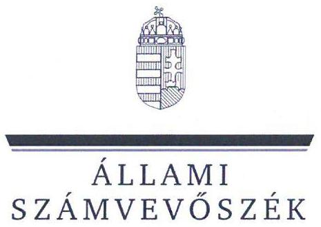
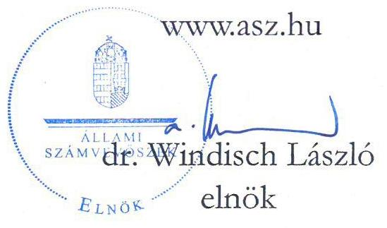
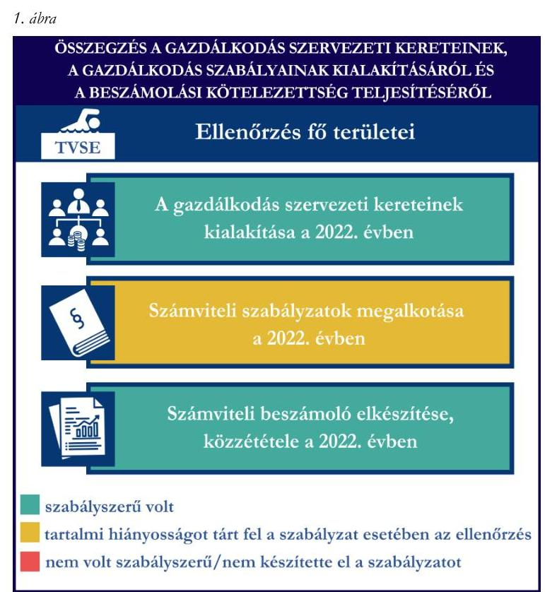
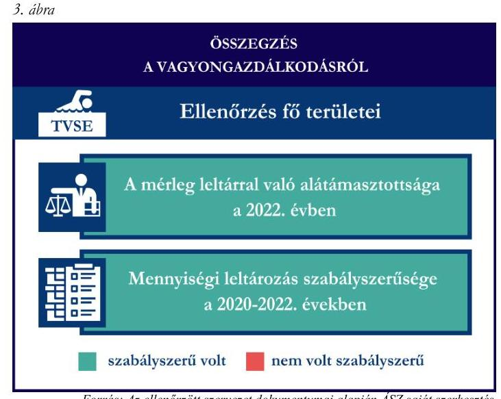
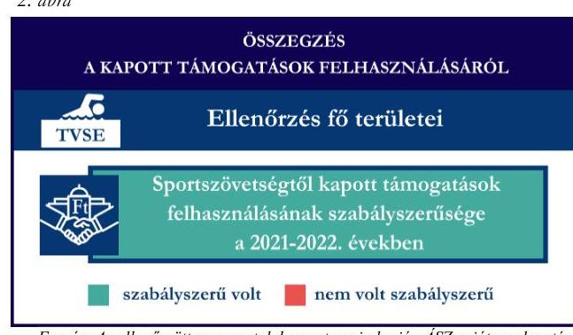

# JELENTÉS 

Támogatásban részesülő sportszövetségek és sportegyesületek gazdálkodásának ellenőrzése

Tatabányai Vízmú Sportegyesület
2024.

---

ÁLLAMI
SZÁMVEVŐSZÉK

# JELENTÉS 

## Támogatásban részesülő sportszövetségek és sportegyesületek gazdálkodásának ellenőrzése

Tatabányai Vízmú Sportegyesület
2024.

24105

---

# ELLENŐRZÉSI IGAZGATÓSÁG: 

## ÁLLAMHÁZTARTÁSON KÍVÜLI SZERVEZETEKET ELLENŐRZŐ IGAZGATÓSÁG

## ELLENŐRZÉSI IGAZGATÓ:

## KLINGA LÁSZLÓ igazgató

## ELLENŐRZÉSVEZETŐ:

## KAKAS SÁNDOR ellenőrzésvezető

SALAMIN VIKTOR ellenőrzésvezető

IKTATÓSZÁM: EL-4060-026/2024.

TÉMASZÁM: 2682

ELLENŐRZÉS-AZONOSÍTÓ SZÁM: V1026

---

# TARTALOMJEGYZÉK 

AZ ELLENŐRZÉS ALAPADATAI ..... 5
AZ ELLENŐRZÖTT SZERVEZETEK ..... 7
ÖSSZEFOGLALÁS ..... 8
AZ ELLENŐRZÉS FÓKUSZKÉRDÉSEI ..... 10
MEGÁLLAPÍTÁSOK ..... 11
JAVASLATOK ..... 13
MELLÉKLETEK ..... 14
I. sz. melléklet: Értelmező szótár ..... 14
II. sz. melléklet: Az ellenőrzött szervezetek jegyzéke ..... 16
III. sz. melléklet: Ellenőrzési kritériumok ..... 17
FÜGGELÉK: ÉSZREVÉTELEK ..... 18
RÖVIDÍTÉSEK JEGYZÉKE ..... 19

---

.

---

# AZ ELLENŐRZÉS ALAPADATAI 

## AZ ELLENŐRZÉS CÉLJA

Az ellenőrzés célja az államháztartásból nyújtott támogatással, vagy az államháztartásból meghatározott célra ingyenesen juttatott vagyon felhasználásával érintett sportszövetségek és sportegyesületek gazdálkodása szabályozottságának, gazdálkodási tevékenységének, ezen belül a beszámolási kötelezettség teljesítésének, a támogatások elkülönített nyilvántartásának, valamint a támogatások felhasználásának ellenőrzése.

## AZ ELLENŐRZÉS TÍPUSA

Szabályszerüségi ellenőrzés.

## AZ ELLENŐRZÖTT IDŐSZAK

Az 1. fókuszkérdés esetében a 2022. év.
A 2. fókuszkérdés vonatkozásában a 2021-2022. évek.
A 3. fókuszkérdés vonatkozásában a 2022. év, a mennyiségi felvétellel történő leltározás dokumentumai tekintetében a 2020-2022. évek.

## AZ ELLENŐRZÉS TÁRGYA

Az ellenőrzés tárgya a támogatásban részesülő sportszövetségek, sportegyesületek gazdálkodása szabályozottságának, gazdálkodási tevékenységén belül a beszámolási kötelezettség teljesítésének, a vagyonnyilvántartásának, a támogatások elkülönített nyilvántartásának, valamint az államháztartási forrásból származó közvetlen vagy közvetett támogatások és a meghatározott célra ingyenesen juttatott vagyon felhasználásának a vizsgálata volt. Az ellenőrzés a támogatások vonatkozásában kiterjedt továbbá a támogató felé történő beszámolási és elszámolási kötelezettségek teljesítésére, az ezekkel kapcsolatos jogszabályi és belső előírások betartására. Az ellenőrzés kiterjedt minden olyan körülményre és adatra, amely az ÁSZ ${ }^{1}$ jogszabályban meghatározott feladatainak teljesítéséhez, valamint az ellenőrzés program végrehajtása során felmerülő újabb összefüggések feltárásához szükséges.

Az ÁSZ tv. 25. § (3) bekezdésében meghatározottak alapján, amennyiben a rendelkezésre bocsátott dokumentumok, adatok, illetve tájékoztatás hitelességének, megalapozottságának, teljességének megállapítása vagy egyes ellenőrzési megállapítások alátámasztása, kiegészítése indokolta, az ellenőrzés tárgyát képezték az összefüggő tények vizsgálatához más szervezetek (ellenőrzést támogató szervezetek) által rendelkezésre bocsátott adatok, dokumentációk, megadott tájékoztatások, illetve az ott végzett ellenőrzés is.

Az 1. és 3. fókuszkérdés tekintetében a vizsgálat a teljes ellenőrzött szervezetre, a 2. fókuszkérdés tekintetében kizárólag az úszás sportszakágra vonatkozott

---

# Az ellenőrzés jogsalapja 

Az ellenőrzés jogszabályi alapját az ÁSZ tv. ${ }^{2} 1 . \S$ (3) bekezdése, az 5. $\$ (3) bekezdése, valamint a Civil tv. ${ }^{3} 47 . \int$ előírásai képezték.

## AZ ELLENŐRZÉS MÓDSZERE

Az ellenőrzést a nemzetközi standardokat irányadónak tekintve az ellenőrzési program szempontjai, az ellenőrzött időszakban hatályos jogszabályok, az ellenőrzés általános szakmai szabályai, az ellenőrzésre irányadó ÁSZ módszertanok figyelembevételével végezte az ÁSZ.

Az ellenőrzési kérdések megválaszolásához szükséges bizonyítékok megszerzése az ellenőrzött szervezet által rendelkezésre bocsátott dokumentumokra, adatokra alapozva kérdésfeltevés (információkérés), interjú, mintavételezés útján történt.

Az ellenőrzési bizonyítékként felhasználható adatforrások közé tartoztak egyrészt az ellenőrzés során az ellenőrzött szervezettől bekért dokumentumok, másrészt adatforrás lehetett minden további az ellenőrzés folyamán feltárt, az ellenőrzés szempontjából információt tartalmazó dokumentum.

A támogatásokkal, azok felhasználásával kapcsolatos kötelezettségek vizsgálatára mintavételi eljárások kerültek alkalmazásra. Támogatás-típusok szerint nagyságrend alapján 1-3 darab támogatás került részletes vizsgálat alá. Ezen támogatások felhasználásának szabályszerűsége támogatásonként kockázatértékelés alapján kiválasztott mintatételekkel került ellenőrzésre. A kiválasztott támogatási szerződésekhez kapcsolódó elszámolásokból 30-30 db mintatétel került ellenőrzésre, ahol az elszámolás nem érte el a 30 db -ot, ott tételes ellenőrzésre került sor. Ezen felül a vagyongazdálkodás szabályszerűségének ellenőrzéséhez is kockázatalapú mintavétel kapcsolódott. A támogatások felhasználása és a vagyongazdálkodás területén a minták ellenőrzése kiterjedt a könyvvezetési kötelezettség vizsgálatára is. A tárgyi eszközök tekintetében 30 db került kiválasztásra a 2022. évben állományban lévő eszközök közül azok nyilvántartásának, elszámolásának szabályszerűsége ellenőrzése céljából. Az ellenőrzésben nem statisztikai mintavételre került sor, ezért nem történt kivetítés a teljes sokaságra, a megállapításokat az ellenőrzött mintatételekre vonatkozóan fogalmaztuk meg.

---

# AZ ELLENŐRZÖTT SZERVEZETEK

## TATABÁNYAI VÍZMŰ SPORTEGYESÜLET

A Tatabányai Vízmú Sportegyesületet 1994-ben alapították. A TVSE ${ }^{1}$ célja többek között az úszás és vízilabda sportágakban biztosítani a sportolási lehetőséget a polgárok számára, a szabadidősport feltételeinek biztosítása, utánpótlás nevelés és az úszó- és vízilabda szövetségek által szervezett bajnokságokon való részvétel. A TVSE-ben úszó és vízilabda szakosztály működött. A TVSE a 2022. évben jogszabály alapján könyvvizsgálatra nem volt kötelezett, azonban saját döntés alapján a beszámoló felülvizsgálatára könyvvizsgálót bízott meg. A TVSE a 2022. évben felügyelőbizottság létrehozására kötelezett volt. A TVSE a beszámoló adatai alapján a 2022. évben az alaptevékenységén felül vállalkozási tevékenységet is végzett. A TVSE által 2021-2022. években igénybe vett államháztartási forrásból származó támogatásokat az 1. táblázat foglalja össze.

1. táblázat

|  A TVSE ÁLTAL IGÉNYBEVETT TÁMOGATÁSOK /
ADATOK M ÉT-BAN MEGADVA | 2021. év | 2022. év  |
| --- | --- | --- |
|  Központi költségvetési támogatás* | 79,3 | 152,1  |
|  Helyi önkormányzati támogatás* | 16,5 | 16,4  |
|  Magyar Úszó Szövetségtől kapott támogatás | 11,3 | 14,3  |

- több sportágat érintő támogatás, az úszó szakosztályt nem érintő támogatások

Forrás: Az ellenőrzött szervezet beszámolói és fökönyvi adatai alapján ÁSZ saját szerkesztés

---

# ÖSSZEFOGLALÁS 

Magyarország Alaptörvényének XX. cikke kimondja, hogy mindenkinek joga van a testi és lelki egészséghez, melynek érvényesülését Magyarország többek között a sportolás és a rendszeres testedzés támogatásával segíti elő. Az Országgyűlés a Sport tv. ${ }^{5}$-ben kinyilvánította, hogy a nemzet közössége a test művelését, a sportot, a nemzet alapértékének, kívánatos célnak tekinti. A sport a közjó része. Erősíti a közösség tagjainak egymáshoz tartozását, miként az egyén testi és lelki egészségét.

A sportegyesületek, sportszövetségek működésükre és szakmai tevékenységük ellátására költségvetési támogatásban, önkormányzati támogatásban, ingyenes vagyonjuttatásban, valamint látvány-csapatsport támogatásban részesülhetnek, amelyekre fokozott figyelem irányul.

A társadalom részéről jogosan felmerülő elvárás, hogy a közpénzeket kezelő, azzal gazdálkodó szervezetek működéséről, tevékenységéről átfogó képet kapjon, a közpénzek rendeltetésszerủ és átlátható módon történő felhasználásának értékelésére időről-időre sor kerüljön az ellenőrzések keretében.

A TVSE tekintetében a gazdálkodási szabályok kialakításra kerültek, a beszámolási kötelezettség teljesítése összességében szabályszerű volt a 2022. évben.

A TVSE a könyvviteli szolgáltatás személyi feltételeit biztosította, a jogszabályban előírt felügyelőbizottsággal rendelkezett. Az alapszabályában előírt könyvvizsgálat biztosítva volt. A jogszabályban előírt számviteli szabályzatokat a TVSE elkészítette, azonban a számlarendje nem volt szabályszerű a 2022. évben.

A könyvvezetés formája a 2022. évben megfelelt a jogszabályi előírásoknak. A TVSE a 2022. évi számviteli beszámolóját az előírtak alapján elkészítette, közzétette, azonban azt a saját honlapján nem tette közzé.

A gazdálkodási szabályok kialakítása és a beszámolási kötelezettség ellenőrzésének az összegzését az 1. ábra tartalmazza.

---

A TVSE az úszó szakosztálya részére a központi költségvetésből a MÜSZ ${ }^{6}$-on keresztül nyújtott, ellenőrzött támogatásokat szabályszerűen használta fel a 2021-2022. években.

A kapott támogatások felhasználásának ellenőrzéséről az összegzést a 2. ábra tartalmazza.

Forrás: Az ellenőrzött szervezet dokumentumai alapján ÁSZ saját szerkesztés
2. ábra

A TVSE vagyongazdálkodása a 2022. évben az ellenőrzött tételek vonatkozásában szabályszerű volt.

A TVSE a jogszabályoknak megfelelően gondoskodott a saját vagyona nyilvántartásáról és a számviteli beszámolóban történő megjelenítéséről.

A 2022. évi beszámolójának mérlegtételeit leltárral alátámasztotta, az előírt mennyiségi felvétellel történő leltározást elvégezte.

A vagyongazdálkodás ellenőrzésének összegzését a 3. ábra tartalmazza.

---

# AZ ELLENŐRZÉS FÓKUSZKÉRDÉSEI 

1- A gazdálkodási szabályok kialakítása, a könyvvezetési és beszámolási kötelezettség teljesítése szabályszerű volt-e?
2. A kapott támogatások felhasználása szabályszerű volt-e?
3. Az ellenőrzött szervezet vagyongazdálkodása szabályszerű volt-e?

---

# MEGÁLLAPÍTÁSOK 

## 1. A gazdálkodási szabályok kialakítása, a könyvvezetési és beszámolási kötelezettség teljesítése szabályszerű volt-e?

Összegző megállapítás A TVSE-nél a 2022. évben a gazdálkodási szabályok a jogszabályi előírásoknak megfelelően kialakításra kerültek, a beszámolási kötelezettség teljesítése a beszámoló saját honlapon való közzététele kivételével szabályszerű volt.

A TVSE a 2022. évben a Számv. tv. ${ }^{7}$, valamint a Civilszr. ${ }^{8}$ előírásaiban foglaltaknak megfelelően gondoskodott a könyvviteli szolgáltatás személyi feltételeinek teljesüléséről. A TVSE a 2022. évben rendelkezett a Ptk. ${ }^{9}$-ban előírt felügyelőbizottsággal. A TVSE az Alapszabályában előírt könyvvizsgálatot biztosította a 2022. évben.
A TVSE 2022-ben rendelkezett a Számv. tv-ben előírt számviteli politikával, azon belül az eszközök és a források leltárkészítési és leltározási szabályzatával, az eszközök és a források értékelési szabályzatával, pénzkezelési szabályzattal, valamint számlarenddel, amelyek - a számlarend kivételével - az ellenőrzött tartalmi kritériumoknak megfeleltek. A TVSE 2022. évben hatályos számlarendje nem felelt meg a Számv. tv. 161. § (2) bekezdés a), b) pontjaiban foglaltaknak, mert nem tartalmazta minden alkalmazott számla számát, megnevezését, valamint nem tartalmazta minden számlaosztály esetében (pl: 96-os számlacsoport köztük a támogatások bevételei) a számla értéke növekedésének és csökkenésének jogcímeit, a számlák más számlákkal való kapcsolatát.
A TVSE a Számv. tv.-ben, Civil. tv.-ben, valamint a Civilszr.-ben előírtak szerinti könyvvitelt vezetett. A TVSE a vállalkozási és az alaptevékenység bevételeinek és költségeinek Civilszr. előírása szerinti elkülönítését a könyviteli rendszerében teljesítette. A TVSE 2022-ben a könyvviteli nyilvántartását úgy vezette, hogy a Számv. tv., valamint a Civilszr. előírásainak megfelelően a számviteli beszámolóban az egyéb bevételeken belül részletezni tudta a kapott támogatások és a tagdíjak összegeit.
A TVSE a Civil tv.-ben, valamint a Számv. tv. előírásai alapján előírt könyvvitellel alátámasztott számviteli beszámolóját, továbbá a Civil. tv.-ben előírtak alapján a közhasznúsági mellékletét elkészítette. A TVSE 2022. évi számviteli beszámolóját a Ptk., valamint a Civil tv. alapján a legfőbb döntéshozó szerv hagyta jóvá, melyet a felügyelőbizottság véleményezett, valamint az alapszabályában foglaltak szerint a könyvvizsgáló felülvizsgált. A TVSE a 2022. évi számviteli beszámolóját, valamint közhasznúsági mellékletét a Civil. tv. -ben előírtak alapján letétbe helyezte, közzétette, azonban a Civil tv. 30. § (4) bekezdésében foglaltak ellenére a saját honlapján nem helyezte el.

---

# 2. A kapott támogatások felhasználása szabályszerű volt-e? 

## Összegző megállapítás

A TVSE az úszó szakosztálya részére nyújtott támogatásokat az ellenőrzött tételek vonatkozásában a 2021-2022. években szabályszerűen használta fel.

A TVSE a központi költségvetésből a MÚSZ-on keresztül számára juttatott sportcélú ellenőrzött támogatást és annak felhasználását a 2021-2022. években a Civil. tv. és a Számv. tv. előírásainak megfelelően a számviteli rendszerében elkülönítetten tartotta nyilván. A központi költségvetésből a MÚSZ-on keresztül számára juttatott sportcélú ellenőrzött támogatás felhasználásáról a támogatási szerződésben és az alapján az Áht. ${ }^{10}$-ban foglaltak szerint beszámolt a támogató felé. A TVSE a 20212022. években elszámolt támogatások ellenőrzött tételeit a Számv. tv.-ben előírtaknak megfelelő, szabályszerű számviteli bizonylattal alátámasztotta.

## 3. Az ellenőrzött szervezet vagyongazdálkodása szabályszerű volt-e?

## Összegző megállapítás

A 2022. évben a TVSE vagyongazdálkodása az ellenőrzött tételek vonatkozásában szabályszerű volt, a beszámolójának mérlegtételeit szabályszerű leltárral alátámasztotta.

A TVSE a 2022. évi beszámolójának mérlegtételeit a Számv. tv. alapján leltárral, mennyiségi felvétellel elvégzett leltározással alátámasztotta.
Az ellenőrzött tárgyi eszközök bekerülési értékét alátámasztó számviteli bizonylatok a Számv. tv.-ben előírtaknak megfelelően rendelkezésre álltak. Az ellenőrzött tárgyi eszközök számviteli besorolása, értékcsökkenés elszámolása megfelelt a Számv. tv. előírásainak, az üzembe helyezés tényét a TVSE a Számv. tv.-ben előírtak alapján dokumentálta.

---

# JAVASLATOK 

Az ÁSZ tv. 33. § (1) bekezdésében foglaltak értelmében az ellenőrzött szervezet vezetője köteles a jelentésben foglalt megállapításokhoz kapcsolódó intézkedési tervet összeállítani és azt a jelentés kézhezvételétől számított 30 napon belül az ÁSZ részére megküldeni. Amennyiben az ellenőrzött szervezet vezetője nem küldi meg határidőben az intézkedési tervet, vagy továbbra sem elfogadható intézkedési tervet küld, az Állami Számvevőszék elnöke az ÁSZ tv. 33. § (3) bekezdése a) és b) pontjaiban foglaltakat érvényesítheti.

## A TATABÁNYAI VÍZMÚ SPORTEGYESÜLET ELNÖKÉNEK

1. Gondoskodjon a Számv. tv. 161. § (2) bekezdés a), b) pontjaiban foglaltaknak megfelelő számlarend elkészítéséről.
2. Gondoskodjon arról, hogy a Civil. tv. 30. § (4) bekezdés alapján a számviteli beszámoló, valamint a közhasznúsági melléklet a TVSE saját honlapján is elhelyezésre kerüljön.

---

# MELLÉKLETEK 

I. SZ. MELLÉKLET: ÉRTELMEZŐ SZÓTÁR

Civil szervezet

Egyesület

Költségvetési támogatás

Közhasznú szervezet

Közhasznú tevékenység

Országos sportági szakszövetsége

Sportági szövetség

A civil társaság; a Magyarországon nyilvántartásba vett egyesület - a párt, a szakszervezet és a kölcsönös biztosító egyesület kivételével és - a közalapítvány és a pártalapítvány kivételével - az alapítvány. (Forrás: Civil tv. 2. § 6. pont a)-c) alpontjai)
Az egyesület a tagok közös, tartós, alapszabályban meghatározott céljának folyamatos megvalósítására létesített, nyilvántartott tagsággal rendelkező jogi személy. (Forrás: Ptk. 3:63. § (1) bekezdés)
A Számv. tv. szempontjából egyéb szervezet. (Számv. tv. 3. § (1) bekezdés 4. pont a) alpontja)
A társadalombiztosítás pénzügyi alapjai kivételével az államháztartás központi alrendszeréből ellenérték nélkül, pénzben nyújtott támogatások. (Forrás: Áht. 1. § 14. pont)
Közhasznú szervezetté minősíthető a Magyarországon nyilvántartásba vett közhasznú tevékenységet végző szervezet, amely a társadalom és az egyén közös szükségleteinek kielégítéséhez megfelelő erőforrásokkal rendelkezik, továbbá amelynek megfelelő társadalmi támogatottsága kimutatható, és amely:
a) civil szervezet (ide nem értve a civil társaságot), vagy
b) olyan egyéb szervezet, amelyre vonatkozóan a közhasznú jogállás megszerzését törvény lehetővé teszi. (Forrás: Civil tv. 32. § (1) bekezdés)
Minden olyan tevékenység, amely a létesítő okiratban megjelölt közfeladat teljesítését közvetlenül vagy közvetve szolgálja, ezzel hozzájárulva a társadalom és az egyén közös szükségleteinek kielégítéséhez. (Forrás: Civil tv. 2. § 20. pont)
Olyan sportszövetség, amely sportágában kizárólagos jelleggel az e törvényben, valamint más jogszabályokban meghatározott feladatokat lát el és e törvényben megállapított különleges jogosítványokat gyakorol. Olyan sportágban hozható létre, amelyet vagy a Nemzetközi Olimpiai Bizottság elismert, vagy amely sportág nemzetközi szövetségét felvették a Nemzetközi Sportszövetségek Szövetségébe (GAISF). (Forrás: Sport tv. 20. § (1), (4) bekezdés)
A Civil. tv. és a Ptk. előírásai alapján - a Sport tv.-ben meghatározott eltérésekkel - múködő szövetség, amelynek tagjai kizárólag sportszervezetek lehetnek. Sportági szövetség országos jelleggel is múködhet. Egy sportágban csak egy országos sportági szövetség múködhet. Törvényi feltételek teljesülése esetén szakszövetségi feladatokat is elláthat. (Forrás: Sport tv. 28. §)

---

Sportegyesület

Sportegyesületeknek, sportszövetségeknek nyújtott költségvetési támogatás

Sportszövetség

Sporttevékenység

A Civil. tv. és a Ptk. szabályai szerint múködő olyan egyesület, amelynek alaptevékenysége a sporttevékenység szervezése, valamint a sporttevékenység feltételeinek megteremtése. A sportegyesületek a Sport. tv. 15. § (1) bekezdésében meghatározott sportszervezetek körébe tartoznak. A sportegyesületeken kívül sportszervezet még a sportvállalkozás, a sportiskola, valamint az utánpótlás-nevelés fejlesztését végző alapítvány. (Forrás: Sport tv. 16. § (1) bekezdés)
Az állami sport célú támogatások felhasználásáról és elosztásáról szóló 474/2016. (XII. 27.) Kormány rendelet ${ }^{11}$ és a 27/2013. (III. 29.) EMMI rendelet ${ }^{12}$ 1. $\int$-ában meghatározott fejezeti kezelésű előirányzatokból nyújtott támogatás.
Meghatározott sporttevékenységek körében a sportversenyek szervezésére, a tagok érdekvédelmére és a részükre való szolgáltatásokra, valamint a nemzetközi kapcsolatok lebonyolítására létrehozott, jogi személyiséggel és önkormányzattal rendelkező, a Civil. tv. és a Ptk. alapján - az e törvényben foglalt eltérésekkel különös formában múködő egyesületek. A Sport tv. 19. § (3) bekezdése szerint a sportszövetségeknek az alábbi típusai léteznek: országos sportági szakszövetségek, sportági szövetségek, szabadidősport szövetségek, fogyatékosok sportszövetségei, diák- és egyetemi-főiskolai sport sportszövetségei, nemzetközi sportszövetségek. (Forrás: Sport tv. 19. § (1), (3) bekezdés)
Meghatározott szabályok szerint, a szabadidő eltöltéseként kötetlenül vagy szervezett formában, illetve versenyszerűen végzett testedzés vagy szellemi sportágban kifejtett tevékenység, amely a fizikai erőnlét és a szellemi teljesítőképesség megtartását, fejlesztését szolgálja. (Forrás: Sport tv. 1. § (2) bekezdés)

---

II. SZ. MELLÉKLET: AZ ELLENŐRZÖTT SZERVEZETEK JEGYZÉKE

|  ELLENŐRZÖTT SZERVEZET NEVE | ELLENŐRZÖTT SZERVEZET SZÉKHELYE  |
| --- | --- |
|  Tatabányai Vízmú Sportegyesület | 2800 Tatabánya, Cseri utca 25. fsz.  |

---

# III. SZ. MELLÉKLET: ELLENŐRZÉSI KRITÉRIUMOK 

## FOKUSZKÉRDÉS

## 1. fókuszkérdés:

A gazdálkodási szabályok kialakítása, a könyvvezetési és beszámolási kötelezettség teljesítése szabályszerű volt-e?

## 2. fókuszkérdés:

A kapott támogatások felhasználása szabályszerű volt-e?

## 3. fókuszkérdés:

Az ellenőrzött szervezet vagyongazdálkodása szabályszerű volt-e?

## ELLENŐRZÉSI KRITÉRIUMOK

Számv. tv. 14. § (3) bekezdés, (5) bekezdés a), b), d) pont, (8) bekezdés, (11) bekezdés, 69. $\$ (3) bekezdés, 90. $\$ (3) bekezdés c) pont, 161. $\$ \quad$ (1) bekezdés, (2) bekezdés a)-d) pont, (3)-(4) bekezdés, 161/A. $\$ (2) bekezdés, 165. $\$ (2) bekezdés
Civilszr. 7. § (1) bekezdés, (4) bekezdés b), c) pont, 8. § (2), (3) bekezdés, 9. § (4), (5), (8) bekezdés, 12. § (4), (5) bekezdés, 15. § (1) bekezdés a), b) pont, 16. § (1) bekezdés, 24. § (2) bekezdés
Ptk. 3:26. § (1) bekezdés, 3:27. § (1) bekezdés, 3:82. § (1) bekezdés,
Civil tv. 28.§ (1) bekezdés, 29. § (2) bekezdés c) pont, (3), (6), (7) bekezdés, 30. § (1)-(4) bekezdés 40. § (1), (2) bekezdés, 41. § (1) bekezdés
Sport tv. 23. § (1) bekezdés f) pont
Számv. tv. 44. § (2) bekezdés, 93. § (3) bekezdés, 159. §, 161/A. § (2) bekezdés,165. § (2) bekezdés, 167. § (1) bekezdés a), d), e), h) pont

Civil tv. 20.§ (2) bekezdés a) pont, (3) bekezdés a), c) pont, (4) bekezdés, 29. § (4), (5) bekezdés
Civilszr. 24. § (2) bekezdés
27/2013. (III.29.) EMMI rend. 18. § (2) bekezdés
474/2016. (XII. 27.) Korm. rend. 22. § (2) bekezdés, 24. § (2) bekezdés
Áht. 53. §, Ávr. ${ }^{13}$ 92. §, 93. § (2)-(4) bekezdések
Ptk. 3:63. § (4) bekezdés
Számv. tv. 3. § (3) bekezdés 3. pont, 15. § (3) bekezdés, 46. § (3), (4) bekezdés, 47-51. §, 52. § (1)-(7) bekezdés, 69. § (1)-(3) bekezdések, 165. § (2) 169. § (2) bekezdés

---

# FÜGGELÉK: ÉSZREVÉTELEK 

A jelentéstervezetet a Számvevőszék 15 napos észrevételezésre megküldte az ellenőrzött szervezet vezetőjének az ÁSZ tv. 29. §* (1) bekezdése előírásának megfelelően.

A Tatabányai Vízmú Sportegyesület elnöke a jelentéstervezetre nem tett észrevételt.

[^0]
[^0]:    * 29. § (1) Az Állami Számvevőszék az ellenőrzési megállapításait megküldi az ellenőrzött szervezet vezetőjének vagy az általa megbízott személynek, és annak, akinek személyes felelősségét állapította meg.
    (2) Az ellenőrzött szervezet vezetője és a felelősként megjelölt személy az ellenőrzés megállapításaira tizenöt napon belül írásban észrevételt tehet.
    (3) Az Állami Számvevőszék az észrevételre a beérkezésétől számított harminc napon belül írásban válaszol. A figyelembe nem vett észrevételeket köteles a jelentésben feltüntetni, és megindokolni, hogy azokat miért nem fogadta el.

---

# RÖVIDÍTÉSEK JEGYZÉKE 

${ }^{1}$ ÁSZ
${ }^{2}$ ÁSZ tv.
${ }^{3}$ Civil tv.
${ }^{4}$ TVSE
${ }^{5}$ Sport tv.
${ }^{6}$ MÚSZ
${ }^{7}$ Számv. tv.
${ }^{8}$ Civilszr.
${ }^{9}$ Ptk.
${ }^{10}$ Áht.
${ }^{11} 474 / 2016$. (XII.27.) Korm. rendelet
${ }^{12}$ 27/2013. (III.29.) EMMI rendelet
${ }^{13}$ Ávr.

Állami Számvevőszék
2011. évi LXVI. törvény az Állami Számvevőszékről
2011. évi CLXXV. törvény az egyesülési jogról, a közhasznú jogállásról, valamint a civil szervezetek müködéséről és támogatásáról
Tatabányai Vízmú Sportegyesület
2004. évi I. törvény a sportról

Magyar Úszó Szövetség
2000. évi C. törvény a számvitelről
479/2016. (XII. 28.) Korm. rendelet a számviteli törvény szerinti egyes egyéb szervezetek beszámoló készítési és könyvvezetési kötelezettségének sajátosságairól
2013. évi V. törvény a Polgári Törvénykönyvről
2011. évi CXCV. törvény az államháztartásról
474/2016. (XII. 27.) Korm. rendelet az állami sport célú támogatások felhasználásáról és elosztásáról
27/2013. (III. 29.) EMMI rendelet az állami sport célú támogatások felhasználásáról és elosztásáról
368/2011. (XII. 31.) Korm. rendelet az államháztartásról szóló törvény végrehajtásáról

---

1052 Budapest, Apáczai Csere János u. 10. | 1364 Budapest 4., Pf. 54
www.asz.hu | szamvevoszek@asz.hu
telefon: +36 14849100