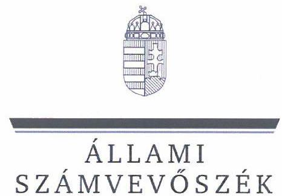
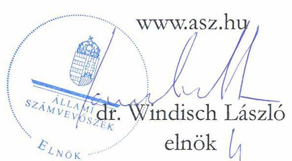
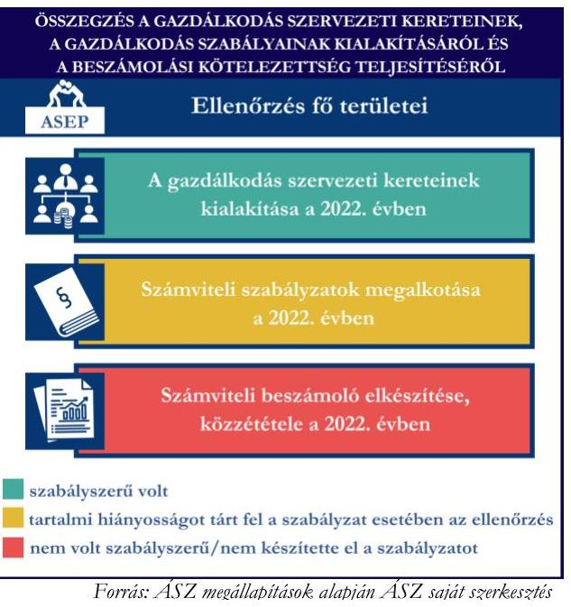
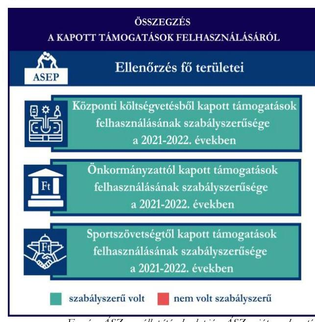
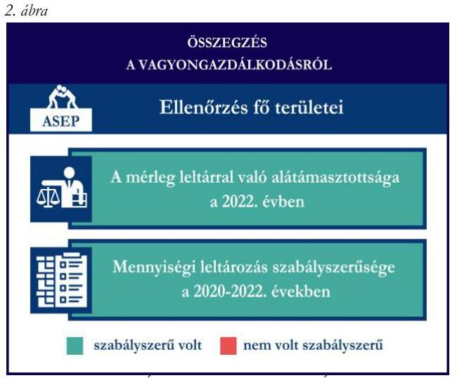

# JELENTÉS 

## Támogatásban részesülő sportszövetségek és sportegyesületek gazdálkodásának ellenőrzése

Atomerőmű Sportegyesület Paks

2024.

---

ÁLLAMI
SZÁMVEVŐSZÉK

# JELENTÉS 

## Támogatásban részesülő sportszövetségek és sportegyesületek gazdálkodásának ellenőrzése

Atomerőmű Sportegyesület Paks

2024.

24106

---

# ELLENŐRZÉSI IGAZGATÓSÁG: 

## ÁLLAMHÁZTARTÁSON KÍVÜLI SZERVEZETEKET ELLENŐRZŐ IGAZGATÓSÁG

## ELLENŐRZÉSI IGAZGATÓ:

## KLINGA LÁSZLÓ igazgató

## ELLENŐRZÉSVEZETŐ:

Jelentéseink az interneten a www.asz.hu címen olvashatók.

## KAKAS SÁNDOR ellenőrzésvezető

IKTATÓSZÁM: EL-4060-005/2024.
TÉMASZÁM: 2682
ELLENŐRZÉS-AZONOSÍTÓ SZÁM: V1026

---

# TARTALOMJEGYZÉK 

AZ ELLENŐRZÉS ALAPADATAI ..... 5
AZ ELLENŐRZÖTT SZERVEZET ..... 7
ÖSSZEFOGLALÁS ..... 8
AZ ELLENŐRZÉS FÓKUSZKÉRDÉSEI ..... 10
MEGÁLLAPÍTÁSOK ..... 11
JAVASLATOK ..... 14
MELLÉKLETEK ..... 15
I. sz. melléklet: Értelmező szótár ..... 15
II. sz. melléklet: Az ellenőrzött szervezetek jegyzéke ..... 17
III. sz. melléklet: Ellenőrzési kritériumok ..... 18
FÜGGELÉK: ÉSZREVÉTELEK ..... 19
RÖVIDÍTÉSEK JEGYZÉKE ..... 21

---

.

---

# AZ ELLENŐRZÉS ALAPADATAI 

## AZ ELLENŐRZÉS CÉLJA

Az ellenőrzés célja az államháztartásból nyújtott támogatással, vagy az államháztartásból meghatározott célra ingyenesen juttatott vagyon felhasználásával érintett sportszövetségek és sportegyesületek gazdálkodása szabályozottságának, gazdálkodási tevékenységének, ezen belül a beszámolási kötelezettség teljesítésének, a támogatások elkülönített nyilvántartásának, valamint a támogatások felhasználásának ellenőrzése.

## AZ ELLENŐRZÉS TÍPUSA

Szabályszerűségi ellenőrzés.

## AZ ELLENŐRZÖTT IDŐSZAK

Az 1. fókuszkérdés esetében a 2022. év.
A 2. fókuszkérdés vonatkozásában a 2021-2022. évek.
A 3. fókuszkérdés vonatkozásában a 2022. év, a mennyiségi felvétellel történő leltározás dokumentumai tekintetében a 2020-2022. évek.

## AZ ELLENŐRZÉS TÁRGYA

Az ellenőrzés tárgyát képezte a támogatásban részesülő sportszövetségek, sportegyesületek gazdálkodása szabályozottságának, gazdálkodási tevékenységén belül a beszámolási kötelezettség teljesítésének, a vagyonnyilvántartásának, a támogatások elkülönített nyilvántartásának, valamint az államháztartási forrásból származó közvetlen vagy közvetett támogatások és a meghatározott célra ingyenesen juttatott vagyon felhasználásának a vizsgálata volt. Az ellenőrzés a támogatások vonatkozásában kiterjedt továbbá a támogató felé történő beszámolási és elszámolási kötelezettségek teljesítésére, az ezekkel kapcsolatos jogszabályi és belső előírások betartására.

Az ellenőrzés kiterjedt minden olyan körülményre és adatra, amely az ÁSZ¹ jogszabályban meghatározott feladatainak teljesítéséhez, valamint az ellenőrzési program végrehajtása során felmerülő újabb összefüggések feltárásához szükséges. Az ellenőrzés az 1. és 3. fókuszkérdések esetében az ellenőrzött szervezet egészére, a 2. fókuszkérdés esetén kizárólag a judo szakágra vonatkozóan került végrehajtásra.

## AZ ELLENŐRZÉS JOGALAPJA

Az ellenőrzés jogszabályi alapját az ÁSZ tv.² 1. § (3) bekezdése, az 5. § (3) bekezdése, valamint a Civil tv.³ 47. § előírásai képezték.

---

# AZ ELLENŐRZÉS MÓDSZERE 

Az ellenőrzést a nemzetközi standardokat irányadónak tekintve az ellenőrzési program szempontjai, az ellenőrzött időszakban hatályos jogszabályok, az ellenőrzés általános szakmai szabályai, az ellenőrzésre irányadó ÁSZ módszertanok figyelembevételével végezte az ÁSZ.

Az ellenőrzési kérdések megválaszolásához szükséges bizonyítékok megszerzése az ellenőrzött szervezet által rendelkezésre bocsátott dokumentumokra, adatokra alapozva kérdésfeltevés (információkérés), interjú, mintavételezés útján történt.

Az ellenőrzési bizonyítékként felhasználható adatforrások közé tartoztak egyrészt az ellenőrzés során az ellenőrzött szervezettől bekért dokumentumok, másrészt adatforrás lehetett minden további, az ellenőrzés folyamán feltárt, az ellenőrzés szempontjából információt tartalmazó dokumentum.

A támogatásokkal, azok felhasználásával kapcsolatos kötelezettségek vizsgálatára mintavételi eljárások kerültek alkalmazásra. Támogatás-típusok szerint nagyságrend alapján 1-3 darab támogatás került részletes vizsgálat alá. Ezen támogatások felhasználásának szabályszerűsége támogatásonként kockázatértékelés alapján kiválasztott mintatételekkel került ellenőrzésre. A kiválasztott támogatási szerződésekhez kapcsolódó elszámolásokból 30-30 db mintatétel került ellenőrzésre, ahol az elszámolás nem érte el a 30 db-ot, ott tételes ellenőrzésre került sor. Ezen felül a vagyongazdálkodás szabályszerűségének ellenőrzéséhez is kockázatalapú mintavétel kapcsolódott. A támogatások felhasználása és a vagyongazdálkodás területén a minták ellenőrzése kiterjedt a könyvvezetési kötelezettség vizsgálatára is. A tárgyi eszközök tekintetében 30 db került kiválasztásra a 2022. évben állományban lévő eszközök közül azok nyilvántartásának, elszámolásának szabályszerűsége ellenőrzése céljából. A kiválasztott mintatételek ellenőrzésének eredménye nem került kivetítésre a teljes sokaságra, a megállapítások az adott ellenőrzött mintatételek vonatkozásában kerültek megjelenítésre.

---

# AZ ELLENŐRZÖTT SZERVEZET 

Az Atomerőmű Sportegyesület Paks 1979-ben alakult, alaptevékenysége a tömegsport és szabadidősport tevékenységekhez, valamint utánpótlás neveléshez kapcsolódik. Szervezetében sportáganként szakosztályok szakcsoportok működnek. Alapszabálya szerinti 7 szakosztállyal rendelkezik.

Az ASEP¹ a jogszabályi előírás alapján az ellenőrzött időszakban könyvvizsgálatra és felügyelőbizottság létrehozására is kötelezett volt. Az ASEP az ellenőrzött időszakban 3 tagú felügyelőbizottsággal rendelkezett. A 2022. évben az ASEP az alapcéljai megvalósítása érdekében vállalkozási tevékenységet is végzett.

Az ASEP judo szakága által az ellenőrzött időszakban igénybe vett támogatásokat az 1. táblázat mutatja be. 1. táblázat

AZ ASEP ÁLTAL IGÉNYBE VETT TÁMOGATÁSOK (ADATOK M FT-BAN)

|  | 2021. év | 2022. év |
| :-- | :--: | :--: |
| Központi költségvetési támogatás | 6,3 | 0,5 |
| Helyi önkormányzati támogatás | 2,0 | 3,0 |
| Magyar Judo Szövetségtől kapott támogatás | 5,0 | 10,7 |

Forrás: Az ellenőrzött szervezet ellenőrzési dokumentumai alapján ÁSZ saját szerkesztés

---

# ÖSSZEFOGLALÁS 

Magyarország Alaptörvényének XX. cikke kimondja, hogy mindenkinek joga van a testi és lelki egészséghez, melynek érvényesülését Magyarország többek között a sportolás és a rendszeres testedzés támogatásával segíti elő. Az Országgyűlés a Sport tv.⁵-ben kinyilvánította, hogy a nemzet közössége a test művelését, a sportot, a nemzet alapértékének, kívánatos célnak tekinti. A sport a közjó része. Erősíti a közösség tagjainak egymáshoz tartozását, miként az egyén testi és lelki egészségét.

A sportegyesületek, sportszövetségek működésükre és szakmai tevékenységük ellátására költségvetési támogatásban, önkormányzati támogatásban, ingyenes vagyonjuttatásban, valamint látvány-csapatsport támogatásban részesülhetnek, amelyekre fokozott figyelem irányul.

A társadalom részéről jogosan felmerülő elvárás, hogy a közpénzeket kezelő, azzal gazdálkodó szervezetek működéséről, tevékenységéről átfogó képet kapjon, a közpénzek rendeltetésszerű és átlátható módon történő felhasználásának értékelésére időről-időre sor kerüljön az ellenőrzések keretében.

A gazdálkodási szabályok kialakítása, a könyvvezetési
1. ábra kötelezettség teljesítése a 2022. évben az ASEP tekintetében szabályszerű volt.

Az ASEP a könyvviteli szolgáltatás személyi feltételeinek megteremtéséről, felügyelőbizottság létrehozásáról és működéséről gondoskodott. A könyvvezetés formája a 2022. évben megfelelt a jogszabályi előírásoknak. A 2022. évre vonatkozó egyszerűsített éves beszámolót könyvvizsgáló felülvizsgálta. A jogszabályi előírások szerint az ASEP kialakította a számviteli politikáját, valamint elkészítette a számviteli szabályzatait, amelyek az ellenőrzött jogszabályi kritériumoknak megfeleltek. A számlarend tekintetében az ellenőrzés tartalmi hiányosságokat tárt fel. Az ASEP elnök-ügyvezető igazgatója az ÁSZ tv. 29. § (2) bekezdés szerinti, a jelentéstervezet megállapításaira tett észrevételében arról

tájékoztatta az ÁSZ-t, hogy az ASEP számlarendjének kiegészítése folyamatban van, ezzel az ÁSZ megállapítása az ellenőrzés során hasznosult.

Az ASEP a számviteli beszámoló- és közhasznúsági melléklet készítési kötelezettségét nem a jogszabályoknak megfelelően teljesítette, tekintettel arra, hogy nem a közgyűlés által elfogadott formában helyezte letétbe és tette közzé a 2022. évre vonatkozó egyszerűsített éves beszámolót, valamint a közhasznúsági mellékletet saját honlapján nem helyezte el. Az ASEP elnök-ügyvezető igazgatója az ÁSZ tv. 29. § (2) bekezdés szerinti, a jelentéstervezet megállapításaira tett észrevételében arról tájékoztatta az ÁSZ-t, hogy intézkedett a beszámoló honlapon való közzétételéről, valamint az OBH honlapján való közzétételéről, ezzel az ÁSZ megállapítása az ellenőrzés során hasznosult.

A gazdálkodás szervezeti keretei kialakításának, a számviteli szabályzatok megalkotásának, valamint a számviteli beszámoló elkészítésének és közzétételének értékelését az 1. ábra mutatja be.

---

Az ASEP a judo szakosztály részére a központi költségvetésből, a helyi önkormányzattól, valamint a központi költségvetésből a sportszövetségen keresztül nyújtott támogatásokat a 2021-2022. években az ellenőrzött tételek esetében a támogatási célnak megfelelően, szabályszerűen használta fel. Számviteli nyilvántartásában a jogszabályi előírás ellenére a központi költségvetési, a helyi önkormányzati, valamint az MJSZ⁶-től kapott támogatások felhasználását elkülönítetten nem tartotta nyilván.

A kapott támogatások felhasználásának értékelését a 2. ábra mutatja be.

Az ASEP vagyongazdálkodása a beszámoló leltárral való alátámasztottsága, a tárgyi eszközök üzembe helyezése és értékcsökkenésük elszámolása tekintetében, az ellenőrzött tételek esetében a 2022. évben szabályszerű volt. A jogszabályoknak megfelelően gondoskodott saját vagyona egyszerűsített éves beszámolóban történő megjelenítéséről az ellenőrzött tételek alapján. A 2022. évre vonatkozó egyszerűsített éves beszámolójának mérlegtételeit alátámasztotta szabályszerű leltárral, valamint a mennyiségi felvétellel történő leltározást elvégezte.

A vagyongazdálkodás értékelését a 3. ábra mutatja be.

Az ASEP a judo szakosztály részére a központi költségvetésből, a helyi önkormányzattól, valamint a központi költségvetésből a sportszövetségen keresztül nyújtott támogatásokat a 2021-2022. években az ellenőrzött tételek esetében a támogatási célnak megfelelően, szabályszerűen használta fel. Számviteli nyilvántartásában a jogszabályi előírás ellenére a központi költségvetési, a helyi önkormányzati, valamint az MJSZ⁶-től kapott támogatások felhasználását elkülönítetten nem tartotta nyilván.

A kapott támogatások felhasználásának értékelését a 2. ábra mutatja be.

---

# AZ ELLENŐRZÉS FÓKUSZKÉRDÉSEI 

1.     - A gazdálkodási szabályok kialakítása, a könyvvezetési- és beszámolási kötelezettség teljesítése szabályszerű volt-e?
2.     - A kapott támogatások felhasználása szabályszerű volt-e?
3.     - Az ellenőrzött szervezet vagyongazdálkodása szabályszerű volt-e?

---

# 1. A gazdálkodási szabályok kialakítása, a könyvvezetési- és beszámolási kötelezettség teljesítése szabályszerű volt-e? 

Összegző megállapítás

Az ASEP a 2022. évben a szabályszerű gazdálkodás feltételeit megteremtette, azonban a számlarend tekintetében az ellenőrzés hiányosságot tárt fel. Az ASEP a jogszabályoknak megfelelően teljesítette könyvvezetési kötelezettségét. A beszámolási kötelezettség teljesítése nem volt szabályszerű.

A 2022. évben az ASEP a Számv. tv. és a Civilszr.⁷-ben foglalt jogszabályi előírások betartásával gondoskodott a könyvviteli szolgáltatás személyi feltételeinek megteremtéséről, a könyvviteli szolgáltatás körébe tartozó feladatok ellátásával megbízott személy megfelelt a jogszabályi előírásoknak.
A 2022. évre vonatkozó egyszerűsített éves beszámolóját a Civilszr. előírásainak megfelelően könyvvizsgáló felülvizsgálta.
Az ASEP a Ptk.⁸ előírása szerint létrehozta a felügyelőbizottságot, a felügyelőbizottság tagjainak száma megfelelt a Ptk. előírásainak.
Az ASEP a 2022. évben rendelkezett a Számv. tv.-ben előírt számviteli politikával, az eszközök és a források értékelési szabályzatával, pénzkezelési szabályzattal, az eszközök és a források leltárkészítési és leltározási szabályzatával, amelyek az ellenőrzött tartalmi kritériumoknak megfeleltek.
Az ASEP a Számv. tv. alapján a számlarendet elkészítette, azonban a számlarend a Számv. tv. 161. § (2) bekezdés b) pontjában előírtak ellenére nem teljeskörűen tartalmazta a számla értéke növekedésének, csökkenésének jogcímeit, a számlát érintő gazdasági eseményeket, azok más számlákkal való kapcsolatát, továbbá a Számv. tv. 161. § (2) bekezdés c) pontjában előírtak ellenére a főkönyvi számla és az analitikus nyilvántartás kapcsolatát.
Az ASEP a Civilszr. előírásainak megfelelően kettős könyvvitelt vezetett a 2022. évben. Az ASEP a 2022. évben végzett vállalkozási tevékenységet, amelynek bevételeit és ráfordításait a könyvvezetése során a Civil tv.-nek megfelelően az alaptevékenységtől elkülönítetten tartotta nyilván és mutatta ki egyszerűsített éves beszámolójában. A könyvviteli nyilvántartásait a Számv. tv. és a Civilszr. rendelkezéseinek megfelelően úgy alakította ki, hogy az egyszerűsített éves beszámolóban az egyéb bevételeken belül a tagdijakat és a kapott támogatások összegét részletezni tudta.
Az ASEP a Számv. tv. és a Civilszr. előírásainak megfelelően elkészítette a 2022. évre vonatkozó egyszerűsített éves beszámolóját. A Civil tv.-nek megfelelően a beszámolóval egyidejűleg a Civil vhr.⁹ melléklete szerinti tartalommal elkészítette a közhasznúsági mellékletet.
Az ASEP esetében a felügyelőbizottság megvizsgálta és véleményezte a 2022. évre vonatkozó beszámolót. A 2022. évre vonatkozó egyszerűsített éves beszámolót a Civil tv.-nek

 megfelelően a szervezet közgyűlése jóváhagyta, könyvvizsgáló felülvizsgálata, a könyvvizsgálói záradék a beszámoló közgyűlés általi megtárgyalásakor rendelkezésre állt.
Az ASEP a 2022. évre vonatkozó egyszerűsített éves beszámolóját a jogszabályi előírás szerint határidőben, azonban a Civil tv. 30. § (1) bekezdésében foglaltak ellenére nem a közgyűlés által elfogadott

---

formában helyezte letétbe és tette közzé, mivel az OBH nyilvántartásában 2022. évre vonatkozóan éves beszámoló nyomtatvány került közzétételre az elfogadott éves egyszerűsített éves beszámoló helyett. A Civil tv. 30. § (4) bekezdésében előírtak ellenére a saját honlapján a közhasznúsági mellékletet nem helyezte el.

# 2. A kapott támogatások felhasználása szabályszerű volt-e? 

## Összegző megállapítás Az ASEP a 2021. és 2022. években a judo szakosztályára vonatkozóan kapott támogatásokat szabályszerűen használta fel.

Az ASEP a központi költségvetési támogatások bevételeit a Civil tv. előírásai alapján elkülönítetten mutatta ki a könyveiben. A támogatás felhasználásáról a támogató felé benyújtott beszámolót és annak részeként az összesített elszámolási táblázatot a támogatási szerződésekben előírt formában és tartalommal elkészítette.
Az ASEP a 2021. és 2022. évi könyvvezetése során a Civil tv. előírásai szerint elkülönítetten mutatta ki a helyi önkormányzattól kapott sportcélú támogatásokat. Az ASEP beszámolási kötelezettségét a támogatás rendeltetésszerű felhasználásáról az Áht. ${ }^{10}$-nak megfelelően teljesítette a helyi önkormányzat felé.
Az ASEP a 2021. és 2022. években az MJSZ-en keresztül számára juttatott támogatások bevételeit a Civil tv. előírásai alapján elkülönítetten mutatta ki a könyveiben. A támogatások felhasználásáról az MJSZ felé benyújtott beszámolót és annak részeként az összesített elszámolási táblázatot a támogatási szerződésekben előírt formában és tartalommal elkészítette.
Az ASEP a Civil tv. 20. § (4) bekezdésében előírtak ellenére a központi költségvetési, a helyi önkormányzati, valamint az MJSZ-től kapott támogatások felhasználását elkülönítetten nem tartotta nyilván.
A támogatók felé benyújtott elszámolásokat alátámasztó számviteli bizonylatok a Számv. tv.-ben foglalt alaki és tartalmi követelményeknek megfeleltek, a központi költségvetésből, valamint az MJSZ-en keresztül kapott sportcélú támogatások esetén a benyújtott számlák a 474/2016. (XII. 27.) Korm. rendeletben ${ }^{11}$ előírtaknak megfelelően záradékolásra kerültek.

## 3. Az ellenőrzött szervezet vagyongazdálkodása szabályszerű volt-e?

## Összegző megállapítás A 2022. évben az ASEP vagyongazdálkodása az ellenőrzött tételek vonatkozásában szabályszerű volt.

Az ASEP a Számv. tv.-nek megfelelően a 2022. évre vonatkozó egyszerűsített éves beszámolójának mérlegtételeit alátámasztotta szabályszerű leltárral, elvégezte a főkönyvi könyvelés és az analitikus nyilvántartások adatai közötti egyeztetést.
A Számv. tv.-nek megfelelően a 2022. évre vonatkozóan a mennyiségi felvétellel történő leltározást elvégezte.
Az ASEP esetében a tárgyi eszköz mintatételek ellenőrzése során az ellenőrzés az alábbiakat állapította meg:

---

- a könyvviteli elszámolást alátámasztó számviteli bizonylatok a Számv. tv.-nek megfelelően rendelkezésre álltak;
- a mintatételek esetén a bekerülési értékeket a Számv. tv.-ben előírtaknak megfelelően határozta meg,
- a tárgyi eszközök számviteli besorolása megfelelt a Számv. tv. előírásainak;
- az üzembe helyezés tényét és időpontját a Számv. tv.-nek megfelelően hitelt érdemlően dokumentálta;
- az értékcsökkenés elszámolása a Számv. tv.-nek megfelelően történt.

---

# JAVASLATOK 

Az ÁSZ tv. 33. § (1) bekezdésében foglaltak értelmében az ellenőrzött szervezet vezetője köteles a jelentésben foglalt megállapításokhoz kapcsolódó intézkedési tervet összeállítani és azt a jelentés kézhezvételétől számított 30 napon belül az ÁSZ részére megküldeni. Amennyiben az ellenőrzött szervezet vezetője nem küldi meg határidőben az intézkedési tervet, vagy továbbra sem elfogadható intézkedési tervet küld, az Állami Számvevőszék elnöke az ÁSZ tv. 33. § (3) bekezdése a) és b) pontjaiban foglaltakat érvényesítheti.

## AZ ATOMERŐMŰ SPORTEGYESÜLET PAKS ELNÖKÉNEK

1. Gondoskodjon a számlarend Számv. tv. 161. § (2) bekezdés b)-c) pontjaiban előírtaknak megfelelő tartalommal való elkészítéséről.
2. Gondoskodjon arról, hogy a beszámoló a Civil tv. 30. § (1) bekezdésében foglaltaknak megfelelően a közgyűlés által elfogadott formában kerüljön letétbe helyezésre.
3. Gondoskodjon a beszámoló saját honlapon való megjelenítéséről a Civil tv. 30. § (4) bekezdésében előírtaknak megfelelően.
4. Gondoskodjon a Civil tv. 20. § (4) bekezdésében előírtaknak megfelelő elkülönített nyilvántartás vezetéséről az államháztartási forrásból kapott központi költségvetési, a helyi önkormányzati és a más civil szervezettől kapott támogatások felhasználására vonatkozóan.

---

# MELLÉKLETEK 

## I. SZ. MELLÉKLET: ÉRTELMEZŐ SZÓTÁR

Civil szervezet

Egyesület

Költségvetési támogatás

Közhasznú szervezet

Közhasznú tevékenység

Országos sportági szakszövetsége

Sportági szövetség

A civil társaság; a Magyarországon nyilvántartásba vett egyesület - a párt, a szakszervezet és a kölcsönös biztosító egyesület kivételével és a közalapítvány és a pártalapítvány kivételével - az alapítvány. (Forrás: Civil tv. 2. §6. pont a)-c) alpontjai)
Az egyesület a tagok közös, tartós, alapszabályban meghatározott céljának folyamatos megvalósítására létesített, nyilvántartott tagsággal rendelkező jogi személy. (Forrás: Ptk. 3:63. § (1) bekezdés)
A Számv. tv. szempontjából egyéb szervezet. (Számv. tv. 3. § (1) bekezdés 4. pont a) alpontja)
A társadalombiztosítás pénzügyi alapjai kivételével az államháztartás központi alrendszeréből ellenérték nélkül, pénzben nyújtott támogatások. (Forrás: Áht. 1. § 14. pont)
Közhasznú szervezetté minősíthető a Magyarországon nyilvántartásba vett közhasznú tevékenységet végző szervezet, amely a társadalom és az egyén közös szükségleteinek kielégítéséhez megfelelő erőforrásokkal rendelkezik, továbbá amelynek megfelelő társadalmi támogatottsága kimutatható, és amely:
a) civil szervezet (ide nem értve a civil társaságot), vagy
b) olyan egyéb szervezet, amelyre vonatkozóan a közhasznú jogállás megszerzését törvény lehetővé teszi. (Forrás: Civil tv. 32. $\S$ (1) bekezdés)

Minden olyan tevékenység, amely a létesítő okiratban megjelölt közfeladat teljesítését közvetlenül vagy közvetve szolgálja, ezzel hozzájárulva a társadalom és az egyén közös szükségleteinek kielégítéséhez. (Forrás: Civil tv. 2. § 20. pont)
Olyan sportszövetség, amely sportágában kizárólagos jelleggel az e törvényben, valamint más jogszabályokban meghatározott feladatokat lát el és e törvényben megállapított különleges jogosítványokat gyakorol. Olyan sportágban hozható létre, amelyet vagy a Nemzetközi Olimpiai Bizottság elismert, vagy amely sportág nemzetközi szövetségét felvették a Nemzetközi Sportszövetségek Szövetségébe (GAISF). (Forrás: Sport tv. 20. § (1), (4) bekezdés)
A Civil tv. és a Ptk. előírásai alapján - a Sport tv.-ben meghatározott eltérésekkel - működő szövetség, amelynek tagjai kizárólag sportszervezetek lehetnek. Sportági szövetség országos jelleggel is működhet. Egy sportágban csak egy országos sportági szövetség működhet. Törvényi feltételek teljesülése esetén szakszövetségi feladatokat is elláthat. (Forrás: Sport tv. 28. §)

---

Sportegyesület

Sportegyesületeknek, sportszövetségeknek nyújtott költségvetési támogatás

Sportszövetség

Sporttevékenység

A Civil tv. és a Ptk. szabályai szerint működő olyan egyesület, amelynek alaptevékenysége a sporttevékenység szervezése, valamint a sporttevékenység feltételeinek megteremtése. A sportegyesületek a Sport tv. 15. § (1) bekezdésében meghatározott sportszervezetek körébe tartoznak. A sportegyesületeken kívül sportszervezet még a sportvállalkozás, a sportiskola, valamint az utánpótlás-nevelés fejlesztését végző alapítvány. (Forrás: Sport tv. 16. $\S$ (1) bekezdés)

Az állami sport célú támogatások felhasználásáról és elosztásáról szóló 474/2016. (XII. 27.) Kormány rendelet és a 27/2013. (III. 29.) EMMI rendelet ${ }^{12}$ 1. $\S$-ában meghatározott fejezeti kezelésű előirányzatokból nyújtott támogatás.
Meghatározott sporttevékenységek körében a sportversenyek szervezésére, a tagok érdekvédelmére és a részükre való szolgáltatásokra, valamint a nemzetközi kapcsolatok lebonyolítására létrehozott, jogi személyiséggel és önkormányzattal rendelkező, a Civil tv. és a Ptk. alapján - az e törvényben foglalt eltérésekkel - különös formában működő egyesületek. A Sport tv. 19. $\S$ (3) bekezdése szerint a sportszövetségeknek az alábbi típusai léteznek: országos sportági szakszövetségek, sportági szövetségek, szabadidősport szövetségek, fogyatékosok sportszövetségei, diákés egyetemi-főiskolai sport sportszövetségei, nemzetközi sportszövetségek. (Forrás: Sport tv. 19. § (1), (3) bekezdés)
Meghatározott szabályok szerint, a szabadidő eltöltéseként kötetlenül vagy szervezett formában, illetve versenyszerűen végzett testedzés vagy szellemi sportágban kifejtett tevékenység, amely a fizikai erőnlét és a szellemi teljesítőképesség megtartását, fejlesztését szolgálja. (Forrás: Sport tv. 1. § (2) bekezdés)

---

# II. SZ. MELLÉKLET: AZ ELLENŐRZÖTT SZERVEZETEK JEGYZÉKE 

## ELLENŐRZÖTT SZERVEZET NEVE

Atomerőmű Sportegyesület Paks

## ELLENŐRZÖTT SZERVEZET SZÉKHELYE

8030 Paks, Gesztenyés utca 2.

---

# III. SZ. MELLÉKLET: ELLENŐRZÉSI KRITÉRIUMOK 

## FÓKUSZKÉRDÉS

## 1. fókuszkérdés:

A gazdálkodási szabályok kialakítása, a könyvvezetési és beszámolási kötelezettség teljesítése szabályszerű volt-e?

## 2. fókuszkérdés:

A kapott támogatások felhasználása szabályszerű volt-e?

## 3. fókuszkérdés:

Az ellenőrzött szervezet vagyongazdálkodása szabályszerű volt-e?

## ELLENŐRZÉSI KRITÉRIUMOK

Számv. tv. 14. § (3) bekezdés, (5) bekezdés a), b), d) pont, (8) bekezdés, 69. $\S$ (3) bekezdés, 90. $\S$ (3) bekezdés c) pont, 161. $\S$ (1) bekezdés, (2) bekezdés a)-d) pont, (3)-(4) bekezdés, 161/A. $\S$ 2 bekezdés, 165. $\S$ (2) bekezdés
Civilszr. 7. § (1) bekezdés, (4) bekezdés b), c) pont, 8. § (2), (3) bekezdés, 9. § (4), (5), (8) bekezdés, 12. § (4), (5) bekezdés, 15. § (1) bekezdés a), b) pont, 16. § (1) bekezdés, 24. § (2) bekezdés
Ptk. 3:26. § (1) bekezdés, 3:27. § (1) bekezdés, 3:82. § (1) bekezdés,
Civil tv. 28.§ (1) bekezdés, 29. § (2) bekezdés c) pont, (3), (6), (7) bekezdés, 30. § (1)-(4) bekezdés, 40. § (1), (2) bekezdés, 41. § (1) bekezdés
Civil. vhr. melléklete
Sport tv. 23. § (1) bekezdés f) pont
Számv. tv. 44. § (2) bekezdés, 93. § (3) bekezdés, 159. §, 165. § (2) bekezdés, 167. § (1) bekezdés a), d), e), h) pont

Civil tv. 20. § (2) bekezdés a) pont, (3) bekezdés a), c) pont, (4) bekezdés, 29. § (4), (5) bekezdés
Civilszr. 24. § (2) bekezdés
27/2013. (III.29.) EMMI rend. 18. § (2) bekezdés
474/2016. (XII. 27.) Korm. rend. 22. § (2) bekezdés, 24. § (2) bekezdés
Áht. 53. §
Ptk. 3:63. § (4) bekezdés
Számv. tv. 3. § (3) bekezdés 3. pont, 15. § (3) bekezdés, 46. § (3), (4) bekezdés, 47-51. §, 52. § (1)-(7) bekezdés, 69. § (1), (3) bekezdés, 165. § (2) bekezdés, 169. § (2) bekezdés
Sport tv. 76/B. §, 76/C. §

---

# FÜGGELÉK: ÉSZREVÉTELEK 

A jelentéstervezetet a Számvevőszék 15 napos észrevételezésre megküldte az ellenőrzött szervezet vezetőjének az ÁSZ tv. 29. § (1) bekezdése előírásának megfelelően.

Az Atomerőmű Sportegyesület Paks elnök-ügyvezető igazgatója a jelentéstervezetre észrevételt tett. A függelék tartalmazza az el nem fogadott észrevétel elutasításának indoklását.

## Az Atomerőmű Sportegyesület Paks elnök-ügyvezető igazgatójának észrevétele:

,,Az Egyesület nyilvántartása főkönyvi szinten, főkönyvi számok alábontásával és munkaszámok használatával biztosítja a Civil törvény 20. § (4) bekezdésében előírtaknak való megfelelést. Elkülönített nyilvántartásokról, támogatásokról szóló szabályzatában többek között az alábbiak szerinti megfeleléssel:
A használt könyvelési szoftver lehetőséget ad ún. munkaszámok kialakítására, biztosítva ezáltal a támogatások cél szerinti, valamint szakosztályok/szakcsoportok szerinti nyilvántartásának és felhasználásának elkülönítését. Azonosítónak a támogatások esetén azok szerződésszámát kell rögzíteni. Amennyiben nincs ilyen szám, akkor saját kialakítású, de az adott támogatásra egyértelműen utalót kell létrehozni.... A támogatási elszámolások nyilvántartása amennyiben lehetséges a könyvviteli program segítségével valósul meg (pl. Látványcsapatsport támogatás), illetve külön nyilvántartás által biztosított.
Az adott támogatások elszámolását, amennyiben az meghaladja a könyvviteli program által biztosított elkülönítést, külön nyilvántartás vezetésével teszi lehetővé. Excel táblákban történt nyilvántartással lehetővé teszi az adott támogatásra elszámolt költségek nyomon követését (juttató/cél/ összeg/ felhasználás/egyenleg). Az elszámolt költségek megfelelő bizonylatolása, illetve az elkészített kimutatások biztosítják, hogy mind a jogszabálynak, mind a támogatás nyújtónak elvárásának való megfelelést, melyet a könyvvizsgáló is igazol."

## Az észrevétellel
 érintett megállapítás:

"Az ASEP a Civil tv. 20. § (4) bekezdésében előírtak ellenére a központi költségvetési, a helyi önkormányzati, valamint az MJSZ-től kapott támogatások felhasználását elkülönítetten nem tartotta nyilván."

[^0]
[^0]:    * 29. § (1) Az Állami Számvevőszék az ellenőrzési megállapításait megküldi az ellenőrzött szervezet vezetőjének vagy az általa megbízott személynek, és annak, akinek személyes felelősségét állapította meg.
    (2) Az ellenőrzött szervezet vezetője és a felelősként megjelölt személy az ellenőrzés megállapításaira tizenöt napon belül írásban észrevételt tehet.
    (3) Az Állami Számvevőszék az észrevételre a beérkezésétől számított harminc napon belül írásban válaszol. A figyelembe nem vett észrevételeket köteles a jelentésben feltüntetni, és megindokolni, hogy azokat miért nem fogadta el.

---

# El nem fogadás indoklása: 

Az Állami Számvevőszék jelentésében szereplő megállapítás szerint a 2011. évi CLXXV. törvény az egyesülési jogról, a közhasznú jogállásról, valamint a civil szervezetek működéséről és támogatásáról 20. § (4) bekezdésében előírtak ellenére az Atomerőmű Sportegyesület Paks a központi költségvetési, a helyi önkormányzati, valamint az Magyar Judo Szövetségtől kapott támogatások felhasználását elkülönítetten nem tartotta nyilván. Az ellenőrzés során az EL-3837-289/2023. iktatószámú adatbekérő levél alapján az Atomerőmű Sportegyesület Paks által rendelkezésre bocsátott dokumentumokat ismételten áttekintettük és megállapítottuk, hogy az Állami Számvevőszék rendelkezésére bocsátott dokumentumok - támogatás összesítő elszámolások, támogatás elszámolások - nem támasztják alá az észrevételben, továbbá az abban hivatkozott belső szabályzatban leírtakat, mert az ellenőrzés rendelkezésére bocsátott ezen dokumentumok a támogatások elkülönített számviteli nyilvántartásának nem feleltethetőek meg. Észrevételéhez az elnök-ügyvezető igazgató egyéb, az észrevételben leírtakat alátámasztó dokumentumot nem küldött.
Fentiek alapján a jelentéstervezet módosítása nem indokolt.

---

# RÖVIDÍTÉSEK JEGYZÉKE 

${ }^{1}$ ÁSZ
${ }^{2}$ ÁSZ tv.
${ }^{3}$ Civil tv.
${ }^{4}$ ASEP
${ }^{5}$ Sport tv.
${ }^{6}$ MJSZ
${ }^{7}$ Civilszr.
${ }^{8}$ Ptk.
${ }^{9}$ Civil vhr.
${ }^{10}$ Áht.
${ }^{11}$ 474/2016. (XII. 27.) Korm. rendelet
${ }^{12}$ 27/2013. (III.29.) EMMI rendelet

Állami Számvevőszék
2011. évi LXVI. törvény az Állami Számvevőszékről
2011. évi CLXXV. törvény az egyesülési jogról, a közhasznú jogállásról, valamint a civil szervezetek működéséről és támogatásáról
Atomerőmű Sportegyesület Paks
2004. évi I. törvény a sportról

Magyar Judo Szövetség
479/2016. (XII.28.) Korm. rendelet a számviteli törvény szerinti egyes egyéb szervezetek beszámoló készítési és könyvvezetési kötelezettségének sajátosságairól
2013. évi V. törvény a Polgári Törvénykönyvről
350/2011. (XII. 30.) Korm. rendelet a civil szervezetek gazdálkodása, az adománygyűjtés és a közhasznúság egyes kérdéseiről
2011. évi CXCV. törvény az állambáztartásról
474/2016. (XII. 27.) Korm. rendelet az állami sport célú támogatások felhasználásáról és elosztásáról
27/2013. (III. 29.) EMMI rendelet az állami sport célú támogatások felhasználásáról és elosztásáról

---

1052 Budapest, Apáczai Csere János u. 10. | 1364 Budapest 4., Pf. 54
www.asz.hu | szamvevoszek@asz.hu
telefon: +36 14849100
