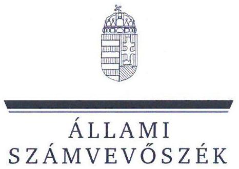
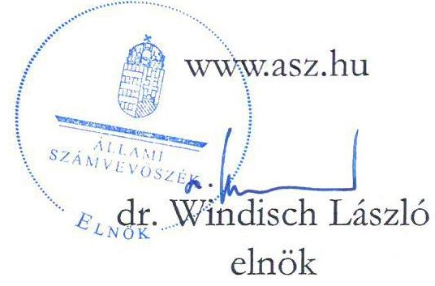
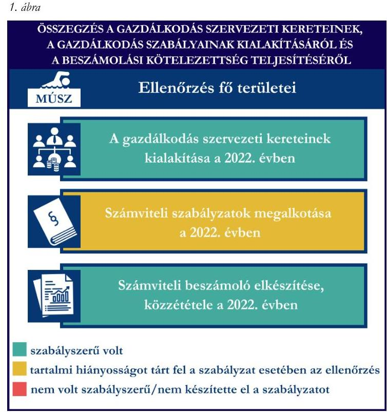
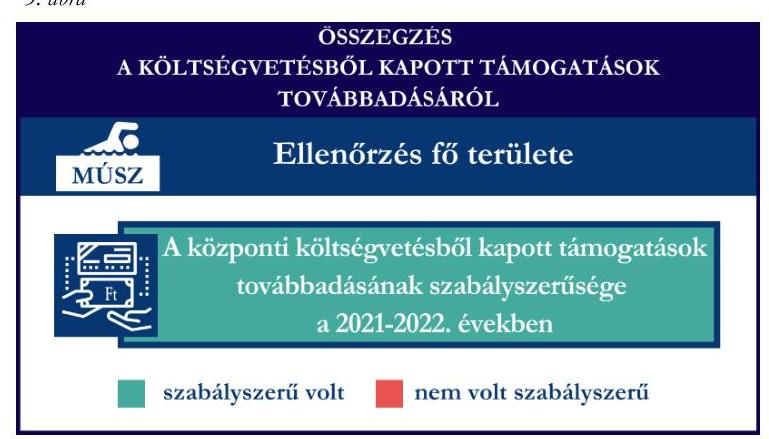
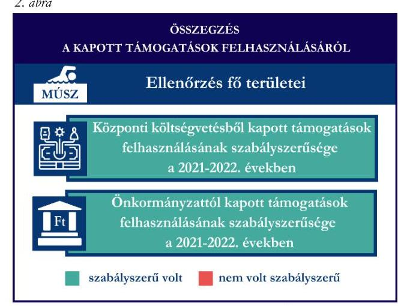
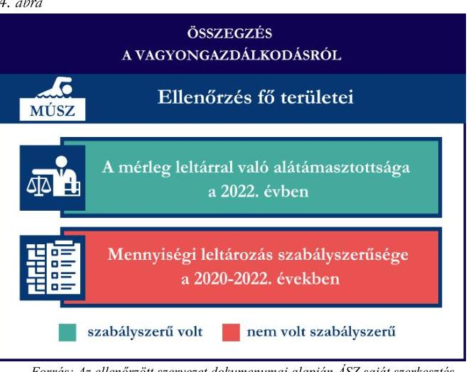

# JELENTÉS 

Támogatásban részesülő sportszövetségek és sportegyesületek gazdálkodásának ellenőrzése

Magyar Úszó Szövetség
2024.

---

ÁLLAMI
SZÁMVEVŐSZÉK

# JELENTÉS 

## Támogatásban részesülő sportszövetségek és sportegyesületek gazdálkodásának ellenőrzése

Magyar Úszó Szövetség
2024.

24107

---

# ELLENŐRZÉSI IGAZGATÓSÁG: 

## ÁLLAMHÁZTARTÁSON KÍVÜLI SZERVEZETEKET ELLENŐRZŐ IGAZGATÓSÁG

## ELLENŐRZÉSI IGAZGATÓ:

## KLINGA LÁSZLÓ IGAZGATÓ

## ELLENŐRZÉSVEZETŐ:

## KAKAS SÁNDOR ellenőrzésvezető

SALAMIN VIKTOR ellenőrzésvezető

IKTATÓSZÁM: EL-4060-031/2024.
TÉMASZÁM: 2682
ELLENŐRZÉS-AZONOSÍTÓ SZÁM: V1026

---

# TARTALOMJEGYZÉK 

AZ ELLENŐRZÉS ALAPADATAI ..... 5
AZ ELLENŐRZÖTT SZERVEZETEK ..... 7
ÖSSZEFOGLALÁS ..... 8
AZ ELLENŐRZÉS FÓKUSZKÉRDÉSEI ..... 10
MEGÁLLAPÍTÁSOK ..... 11
JAVASLATOK ..... 14
MELLÉKLETEK ..... 15
I. sz. melléklet: Értelmező szótár ..... 15
II. sz. melléklet: Az ellenőrzött szervezetek jegyzéke ..... 17
III. sz. melléklet: Ellenőrzési kritériumok ..... 18
FÜGGELÉK: ÉSZREVÉTELEK ..... 19
RÖVIDÍTÉSEK JEGYZÉKE ..... 20

---

.

---

# AZ ELLENŐRZÉS ALAPADATAI 

## AZ ELLENŐRZÉS CÉLJA

Az ellenőrzés célja az államháztartásból nyújtott támogatással, vagy az államháztartásból meghatározott célra ingyenesen juttatott vagyon felhasználásával érintett sportszövetségek és sportegyesületek gazdálkodása szabályozottságának, gazdálkodási tevékenységének, ezen belül a beszámolási kötelezettség teljesítésének, a támogatások elkülönített nyilvántartásának, valamint a támogatások felhasználásának ellenőrzése.

## AZ ELLENŐRZÉS TÍPUSA

Szabályszerűségi ellenőrzés.

## AZ ELLENŐRZÖTT IDŐSZAK

Az 1. fókuszkérdés esetében a 2022. év.
A 2-3. fókuszkérdés vonatkozásában a 2021-2022. évek.
A 4. fókuszkérdés vonatkozásában a 2022. év, a mennyiségi felvétellel történő leltározás dokumentumai tekintetében a 2020-2022. évek.

## AZ ELLENŐRZÉS TÁRGYA

Az ellenőrzés tárgya a támogatásban részesülő sportszövetségek, sportegyesületek gazdálkodása szabályozottságának, gazdálkodási tevékenységén belül a beszámolási kötelezettség teljesítésének, a vagyonnyilvántartásának, a támogatások elkülönített nyilvántartásának, valamint az államháztartási forrásból származó közvetlen vagy közvetett támogatások és a meghatározott célra ingyenesen juttatott vagyon felhasználásának a vizsgálata volt.

Az ellenőrzés a támogatások vonatkozásában kiterjedt továbbá a támogató felé történő beszámolási és elszámolási kötelezettségek teljesítésére, a költségvetésből kapott támogatások továbbadásának szabályszerűségére, az ezekkel kapcsolatos jogszabályi és belső előírások betartására.

Az ellenőrzés kiterjedt minden olyan körülményre és adatra, amely az ÁSZ ${ }^{1}$ jogszabályban meghatározott feladatainak teljesítéséhez, valamint az ellenőrzés program végrehajtása során felmerülő újabb összefüggések feltárásához szükséges.

## AZ ELLENŐRZÉS JOGALAPJA

Az ellenőrzés jogszabályi alapját az ÁSZ tv. ${ }^{2}$ 1. § (3) bekezdése, az 5. § (3) bekezdése, valamint a Civil tv. ${ }^{3}$ 47. § előírásai képezték.

---

# AZ ELLENŐRZÉS MÓDSZERE 

Az ellenőrzést a nemzetközi standardokat irányadónak tekintve az ellenőrzési program szempontjai, az ellenőrzött időszakban hatályos jogszabályok, az ellenőrzés általános szakmai szabályai, az ellenőrzésre irányadó ÁSZ módszertanok figyelembevételével végezte az ÁSZ.

Az ellenőrzési kérdések megválaszolásához szükséges bizonyítékok megszerzése az ellenőrzött szervezet által rendelkezésre bocsátott dokumentumokra, adatokra alapozva kérdésfeltevés (információkérés), interjú, mintavételezés útján történt.

Az ellenőrzési bizonyítékként felhasználható adatforrások közé tartoztak egyrészt az ellenőrzés során az ellenőrzött szervezettől bekért dokumentumok, másrészt adatforrás lehetett minden további az ellenőrzés folyamán feltárt, az ellenőrzés szempontjából információt tartalmazó dokumentum.

A támogatásokkal, azok felhasználásával, a továbbadott támogatásokkal kapcsolatos kötelezettségek vizsgálatára mintavételi eljárások kerültek alkalmazásra. Támogatás-típusok szerint nagyságrend alapján 1-3 darab támogatás került részletes vizsgálat alá. Ezen támogatások felhasználásának szabályszerűsége támogatásonként kockázatértékelés alapján kiválasztott mintatételekkel került ellenőrzésre. A kiválasztott támogatási szerződésekhez kapcsolódó elszámolásokból 30-30 db mintatétel került ellenőrzésre, ahol az elszámolás nem érte el a 30 db-ot, ott tételes ellenőrzésre került sor. Ezen felül a vagyongazdálkodás szabályszerűségének ellenőrzéséhez is kockázatalapú mintavétel kapcsolódott. A támogatások felhasználása és a vagyongazdálkodás területén a minták ellenőrzése kiterjedt a könyvvezetési kötelezettség vizsgálatára is. A tárgyi eszközök tekintetében 30 db került kiválasztásra a 2022. évben állományban lévő eszközök közül azok nyilvántartásának, elszámolásának szabályszerűsége ellenőrzése céljából. Az ellenőrzésben nem statisztikai mintavételre került sor, ezért nem történt kivetítés a teljes sokaságra, a megállapításokat az ellenőrzött mintatételekre vonatkozóan fogalmaztuk meg.

---

# AZ ELLENŐRZÖTT SZERVEZETEK 

## MAGYAR Úszó SZÖVETSÉG

A Magyar Úszó Szövetség 1907-ben alakult. Célja, hogy Magyarország területén kizárólagos jelleggel irányítsa, szervezze és ellenőrizze az úszó sportágban folyó tevékenységet, összehangolja a LEN $^{4}$ és a FINA $^{5}$ által elismert szakágak nemzetközi sportdiplomáciai tevékenységét, ellássa a Sporttörvényben és az egyéb jogszabályokban meghatározott állami sportfeladatokat, képviselje sportágának és tagjainak érdekeit, valamint önállóan részt vegyen a nemzetközi sportszervezetek tevékenységében. A MÚSZ ${ }^{6}$ a 2022. évben közhasznú jogállású volt, könyvvizsgálatra és felügyelőbizottság létrehozására volt kötelezett. A MÚSZ a 2022. évben az alaptevékenységén felül vállalkozási tevékenységet nem végzett. A MÚSZ által 2021-2022. években igénybe vett államháztartási forrásból származó támogatásokat az 1. táblázat foglalja össze.

| A MÚSZ ÁLTAL IGÉNYBEVETT TÁMOGATÁSOK /   ADATOK M FT-BAN MEGADVA | 2021. ÉV | 2022. ÉV |
| :--: | :--: | :--: |
| Központi költségvetési támogatás | 4189,4 | 4711,2 |
| Helyi önkormányzati támogatás | 4,0 | 0 |

---

# ÖSSZEFOGLALÁS 

Magyarország Alaptörvényének XX. cikke kimondja, hogy mindenkinek joga van a testi és lelki egészséghez, melynek érvényesülését Magyarország többek között a sportolás és a rendszeres testedzés támogatásával segíti elő. Az Országgyűlés a Sport tv. ${ }^{\circ}$-ben kinyilvánította, hogy a nemzet közössége a test művelését, a sportot, a nemzet alapértékének, kívánatos célnak tekinti. A sport a közjó része. Erősíti a közösség tagjainak egymáshoz tartozását, miként az egyén testi és lelki egészségét.

A sportegyesületek, sportszövetségek működésükre és szakmai tevékenységük ellátására költségvetési támogatásban, önkormányzati támogatásban, ingyenes vagyonjuttatásban, valamint látvány-esapatsport támogatásban részesülhetnek, amelyekre fokozott figyelem irányul.

A társadalom részéről jogosan felmerülő elvárás, hogy a közpénzeket kezelő, azzal gazdálkodó szervezetek működéséről, tevékenységéről átfogó képet kapjon, a közpénzek rendeltetésszerű és átlátható módon történő felhasználásának értékelésére időről-időre sor kerüljön az ellenőrzések keretében.

A MÚSZ tekintetében a gazdálkodási szabályok kialakításra kerültek, a beszámolási kötelezettség teljesítése szabályszerű volt a 2022. évben.

A MÚSZ a könyvviteli szolgáltatás személyi feltételeit, a 2022. évi számviteli beszámoló vonatkozásában a könyvvizsgálatot biztosította. A jogszabályban, valamint a MÚSZ alapszabályában előírt felügyelőbizottsággal a MÚSZ rendelkezett a 2022. évben.

A jogszabályban előírt számviteli szabályzatokat a MÚSZ elkészítette, azonban a 2022-es évben a számlarendje nem volt szabályszerű. A MÚSZ a támogatások felhasználásával kapcsolatos, jogszabályban előírt gazdálkodási szabályzatát nem készítette el.

A könyvvezetés formája a 2022. évben megfelelt a jogszabályi előírásoknak. A 2022. évi számviteli beszámolóját a jogszabályi előírásoknak megfelelően elkészítette, közzétette.

A gazdálkodási szabályok kialakítása és a beszámolási kötelezettség ellenőrzésének az összegzését az 1. ábra tartalmazza.

---

A MÚSZ a központi költségvetésből kapott ellenőrzött támogatásokat a támogatási célnak megfelelően használta fel a 2021-2022. években. A támogatások felhasználásáról az előírt elkülönített nyilvántartást a 2021-2022. években nem minden ellenőrzött tétel esetében vezette a számviteli rendszerében.

A MÚSZ az önkormányzattól kapott ellenőrzött támogatásokat a 2021-2022. években szabályszerűen használta fel.

A kapott támogatások felhasználásának ellenőrzéséről az összegzést a 2. ábra tartalmazza.

Forrás: Az ellenőrzött szervezet dokumentumai alapján ÁSZ saját szerkesztés

A MÚSZ vagyongazdálkodása az ellenőrzött tételek vonatkozásában összességében szabályszerű volt. A 2022. évi beszámolójának mérlegtételeit leltárral alátámasztotta. A MÚSZ a tárgyi eszközökkel kapcsolatban a 2022-ben előírt mennyiségi felvétellel történő leltározást nem végezte el.

A vagyongazdálkodás ellenőrzésének összegzését a 4. ábra tartalmazza.

Forrás: Az ellenőrzött szervezet dokumentumai alapján ÁSZ saját szerkesztés

A MÚSZ a központi költségvetésből kapott ellenőrzött támogatásokat összességében szabályszerűen adta tovább a sportegyesületek részére. A továbbadott támogatások elkülönített nyilvántartását nem minden esetben vezette a könyvviteli rendszerében.

A kapott támogatások továbbadásának ellenőrzéséről az összegzést a 3. ábra tartalmazza.

Forrás: Az ellenőrzött szervezet dokumentumai alapján ÁSZ saját szerkesztés

---

# AZ ELLENŐRZÉS FÓKUSZKÉRDÉSEI 

1.     - A gazdálkodási szabályok kialakítása, a könyvvezetési és beszámolási kötelezettség teljesítése szabályszerű volt-e?
2.     - A kapott támogatások felhasználása szabályszerű volt-e?
3.     - A költségvetésből kapott támogatások továbbadása szabályszerűen valósult-e meg?
4.     - Az ellenőrzött szervezet vagyongazdálkodása szabályszerű volt-e?

---

# 1. A gazdálkodási szabályok kialakítása, a könyvvezetési és beszámolási kötelezettség teljesítése szabályszerű volt-e? 

Összegző megállapítás A MÚSZ-nál a 2022. évben a gazdálkodási szabályok egy szabályzat kivételével kialakításra kerültek, a beszámolási kötelezettség teljesítése szabályszerű volt.

A MÚSZ a 2022. évben a Számv. tv. ${ }^{8}$, valamint a Civilszr. ${ }^{9}$ előírásaiban foglaltaknak megfelelően gondoskodott a könyvviteli szolgáltatás személyi feltételeinek teljesüléséről. A MÚSZ a 2022. évben a Számv. tv.-ben, valamint Civilszr.-ben előírtaknak megfelelően könyvvizsgálót bízott meg a beszámoló felülvizsgálatára. A MÚSZ a 2022. évben a Ptk. ${ }^{10}$, valamint a Civil tv. előírásai alapján rendelkezett Felügyelőbizottsággal ${ }^{11}$. A Felügyelőbizottság a 2022. évben a Civil tv. 40. § (2) bekezdésében foglalt ügyrenddel nem rendelkezett, a 2022. évi számviteli beszámolót véleményezte.
A MÚSZ 2022-ben rendelkezett a Számv. tv-ben előírt számviteli politikával, azon belül az eszközök és a források leltárkészítési és leltározási szabályzatával, az eszközök és a források értékelési szabályzatával, pénzkezelési szabályzattal, valamint számlarenddel, amelyek - a számlarend kivételével - az ellenőrzött tartalmi kritériumoknak megfeleltek. A MÚSZ 2022. évben hatályos számlarendje nem felelt meg a Számv. tv. 161. § (2) bekezdés a) és b) pontjaiban foglaltaknak, mivel nem tartalmazta minden alkalmazott számla számát, megnevezését, illetve annak tartalmát, ha az a számla megnevezéséből egyértelműen nem következik. A MÚSZ a Sport. tv. 23. § (1) bekezdés f) pontjában előírtak ellenére 2022-ben nem rendelkezett olyan gazdálkodási, pénzügyi szabályzattal, amely tartalmazza az állami sportcélú támogatások Sport tv.-nek, valamint az állami sportcélú támogatások felhasználásáról és elosztásáról szóló kormányrendeletnek megfelelő felhasználására vonatkozó előírásait.
A MÚSZ a Számv. tv.-ben, Civil. tv.-ben, valamint a Civilszr.-ben előírtak szerinti könyvvitelt vezetett. A MÚSZ a vállalkozási és az alaptevékenység bevételeinek és költségeinek Civilszr. előírása szerinti elkülönítését a könyviteli rendszerében teljesítette. A MÚSZ 2022-ben a könyvviteli nyilvántartását úgy vezette, hogy a Számv. tv., valamint a Civilszr. előírásainak megfelelően a számviteli beszámolóban az egyéb bevételeken belül részletezni tudta a kapott támogatások és tagdíjak összegeit.
A MÚSZ a Civil tv.-ben, valamint a Számv. tv. előírásai alapján előírt könyvvitellel alátámasztott számviteli beszámolóját, továbbá a Civil. tv.-ben előírtak alapján a közhasznúsági mellékletét elkészítette. A MÚSZ 2022. évi számviteli beszámolóját a Ptk., valamint a Civil tv. alapján a legfőbb döntéshozó szerv hagyta jóvá, valamint a Civilszr. előírásai alapján könyvvizsgáló felülvizsgálta, a felügyelőbizottság véleményezte. A MÚSZ 2022. évi elfogadott számviteli beszámolóját, valamint közhasznúsági mellékletét a Számv. tv.-ben, valamint a Civil tv.-ben előírtaknak megfelelően letétbe helyezte, közzétette.

---

# 2. A kapott támogatások felhasználása szabályszerű volt-e? 

Összegző megállapítás

A MÚSZ 2021-2022. években az ellenőrzött önkormányzati és központi költségvetési támogatásokat szabályszerűen használta fel, azonban a központi költségvetésből kapott támogatások felhasználását a könyvviteli rendszerében nem minden ellenőrzött tétel esetében különítette el.

A MÚSZ az ellenőrzött támogatási szerződésekben foglaltak alapján, a központi költségvetésből kapott támogatás bevételeit a Civil tv. előírásai alapján elkülönítette a számviteli rendszerében. A MÚSZ a 2021-2022. években a Számv. tv. 161/A. § (2) bekezdésében foglaltak ellenére a Civil tv. 20. § (4) bekezdésében előírt alaptevékenység szerinti tevékenysége költségei, ráfordításai ellentételezésére kapott központi költségvetési támogatásokról nem vezetett olyan elkülönített számviteli nyilvántartást, amelynek alapján támogatásonként megállapítható és ellenőrizhető lett volna a kapott

 támogatás felhasználása. A MÚSZ a központi költségvetés támogatás felhasználásának elkülönített számviteli nyilvántartását a 2021-2022. években a számviteli rendszerében kialakította, azonban a központi költségvetésből kapott támogatások elszámolásában szereplő, ellenőrzött ráfordítások közül (62 db tételből) 13 db tétel számviteli rendszerben való elkülönítésére nem került sor. Ez alapján az egyes támogatások felhasználásáról készített elszámolások könyvviteli nyilvántartással, az abban szereplő támogatásonkénti elkülönített adatokkal nem voltak alátámasztottak.
A központi költségvetéstől kapott támogatás terhére elszámolt, ellenőrzött ráfordításokból egy esetben a 474/2016. (XII.27.) Korm. rend. ${ }^{12}$ 24. § (2) bekezdésében foglaltak ellenére a támogatás felhasználásának számviteli bizonylatán a MÚSZ nem szerepeltetett záradékolást, további egy tétel esetében a záradékolt összeg nem egyezett meg az elszámolásban szereplő összeggel, így a számviteli bizonylaton nem került jelzésre, hogy az adott támogatás terhére mekkora összeg került elszámolásra. A központi támogatás terhére elszámolt ellenőrzött ráfordítások a Számv. tv. szerint kerültek elszámolásra, számviteli bizonylattal alátámasztottak voltak.
A MÚSZ a három ellenőrzött központi költségvetésből kapott támogatás felhasználásáról a támogatási szerződésben előírt pénzügyi beszámolót elkészítette, a támogató által és a 474/2016. (XII.27.) Korm. rend.-ben előírt szakmai beszámolót azonban csak az egyik ellenőrzött támogatás esetében készítette el. Két ellenőrzött támogatási szerződés tekintetében a támogatói szerződésekben (IX/3622-1/2021:6.1.7., IX/1691-2/2020:6.1.7., módIX/2125-2/2021.: IV.b.), valamint a 474/2016. (XII.27.) Korm. rend 22. § (2) bekezdésében foglaltak ellenére a szakmai beszámolót nem készítette el.
A Számv. tv., valamint a Civil tv. előírásainak megfelelően az MÚSZ az ellenőrzött önkormányzati támogatási szerződésekben meghatározott támogatási bevételeket és azok felhasználását a 2021-2022. években elkülönítetten mutatta ki a számviteli nyilvántartásában. A MÚSZ a támogatási szerződésben és az alapján az Áht.-ban ${ }^{13}$ foglalt előírások alapján teljesítette a beszámolási kötelezettségét az önkormányzati támogatás rendeltetésszerű felhasználásáról a 2021-2022. években. A MÚSZ a 2021-2022. években elszámolt önkormányzati támogatások ellenőrzött tételeit a Számv. tv.-ben előírtaknak megfelelő, szabályszerű számviteli bizonylattal alátámasztotta, a támogatási szerződésekben foglaltak alapján záradékolta, azaz a ráfordítás számviteli bizonylatán jelezte a támogatás terhére elszámolt összeget.

---

# 3. A költségvetésből kapott támogatások továbbadása szabályszerűen valósult-e meg? 

Összegző megállapítás A MÚSZ a 2021-2022. években költségvetésből kapott ellenőrzött támogatásokat szabályszerűen adta tovább, azonban két ellenőrzött támogatás esetében az előírt elkülönített nyilvántartást a könyvviteli rendszerében nem vezette.

A MÚSZ a Civilszr., valamint a Számv. tv. alapján a tovább utalási céllal kapott támogatást az egyéb bevételek között, a továbbadott támogatásokat a ráfordítások között szerepeltette a könyvviteli rendszerében a 2021-2022. években. A MÚSZ a számviteli rendszerében a továbbadott támogatások adatai elkülönített rendszerét kialakította, azonban a Civilszr. 14. § (1) bekezdésében foglaltak ellenére két továbbadott ellenőrzött támogatással kapcsolatban az adatokat nem vezette elkülönítetten a nyilvántartásában a 2021-2022. években.
A MÚSZ 2022. évi beszámoló közhasznúsági mellékletében az (5. Cél szerinti juttatások kimutatása) a célszerinti juttatás összesen kimutatott összege 6218,9 M Ft, miközben a számviteli beszámolóban és a főkönyvi nyilvántartásban a közhasznú tevékenység összes ráfordítása ennél alacsonyabb összegű (5714,6 M Ft), ezáltal a Civil. vhr. ${ }^{14}$ 12. § (3) bekezdésében foglaltak ellenére a közhasznúsági melléklet adatai nem álltak összhangban a számviteli beszámoló adataival.

## 4. Az ellenőrzött szervezet vagyongazdálkodása szabályszerű volt-e?

## Összegző megállapítás A MÚSZ 2022. évi beszámolójának mérlegtételei a tárgyi eszközök kivételével leltárral alátámasztottak voltak. A MÚSZ a tárgyi eszközök tekintetében az előírt mennyiségi felvétellel történő leltározást nem végezte el 2022-ben. A MÚSZ 2022. évi vagyongazdálkodása az ellenőrzött tételek vonatkozásában szabályszerű volt.

A MÚSZ a 2022. évi beszámolójának mérlegtételeit a Számv. tv. alapján - a tárgyi eszközöket kivéve szabályszerű leltárral, leltár egyeztetéssel alátámasztotta. A MÚSZ a 2022. évben a tárgyi eszközök tekintetében a főkönyvi könyvelés és az analitikus nyilvántartások adatai közötti egyeztetést elvégezte, azonban a Számv. tv. 69. § (3) bekezdésében foglaltak ellenére a mérlegben szerepelő tárgyi eszköz adatok valódiságát mennyiségi felvétellel lefolytatott leltározással nem támasztotta alá.
Az ellenőrzött tárgyi eszközök bekerülési értékét alátámasztó számviteli bizonylatok a Számv. tv.-ben előírtaknak megfelelően rendelkezésre álltak. Az ellenőrzött tárgyi eszközök számviteli besorolása, értékcsökkenés elszámolása megfelelt a Számv. tv. előírásainak, az üzembe helyezés tényét a Számv. tv.ben előírtak alapján dokumentálta.

---

# JAVASLATOK 

Az ÁSZ tv. 33. § (1) bekezdésében foglaltak értelmében az ellenőrzött szervezet vezetője köteles a jelentésben foglalt megállapításokhoz kapcsolódó intézkedési tervet összeállítani és azt a jelentés kézhezvételétől számított 30 napon belül az ÁSZ részére megküldeni. Amennyiben az ellenőrzött szervezet vezetője nem küldi meg határidőben az intézkedési tervet, vagy továbbra sem elfogadható intézkedési tervet küld, az Állami Számvevőszék elnöke az ÁSZ tv. 33. § (3) bekezdése a) és b) pontjaiban foglaltakat érvényesítheti.

## A MAGYAR ÚSZÓ SZÖVETSÉG ELNÖKÉNEK

1. Intézkedjen arra, hogy a Felügyelőbizottság a Civil tv. 40. § (2) bekezdésében előírt ügyrendjét készítse el.
2. Gondoskodjon a Számv. tv. 161. § (2) bekezdés a) és b) pontjaiban foglaltaknak megfelelő számlarend elkészítéséről.
3. Gondoskodjon a Sport. tv. 23. § (1) bekezdés f) pontjában előírt gazdálkodási, pénzügyi szabályzat elkészítéséről, amely tartalmazza az állami sportcélú támogatások Sport tv.-nek, valamint az állami sportcélú támogatások felhasználásáról és elosztásáról szóló kormányrendeletnek megfelelő felhasználására vonatkozó előírásait.
4. Gondoskodjon az alapcél szerinti tevékenysége költségei, ráfordításai ellentételezésére kapott támogatások elkülönített számviteli nyilvántartásának vezetéséről, amely alapján támogatásonként megállapítható és ellenőrizhető a kapott támogatás felhasználása, a Civil tv. 20. § (4) bekezdés és a Számv. tv. 161/A. (2) bekezdés előírásai alapján.
5. Gondoskodjon arról, hogy a támogatás felhasználását alátámasztó számviteli bizonylaton a 474/2016. (XII.27) Korm. rend. 24. § (2) bekezdésében előírt záradékolás minden esetben szerepeljen.
6. Gondoskodjon arról, hogy a támogatási szerződésekben, valamint a 474/2016. (XII.27) Korm. rend. 22. § (2) bekezdésében előírt szakmai beszámolók minden támogatás esetében elkészítésre kerüljenek.
7. Gondoskodjon arról, hogy a Civilszr. 14. § (1) bekezdésében előírtak alapján a továbbadott támogatások adatai a MÚSZ nyilvántartásában elkülönítésre kerüljenek.
8. Gondoskodjon arról, hogy a Civil. vhr. 12. § (3) bekezdésében előírtak alapján a közhasznúsági melléklet adatai összhangban álljanak a beszámoló adataival.
9. Gondoskodjon a tárgyi eszközök mennyiségi felvétellel való tételes leltározásáról a Számv. tv. 69. § (3) bekezdés, valamint a leltározási szabályzatban előírtaknak megfelelően.

---

# MELLÉKLETEK 

## I. SZ. MELLÉKLET: ÉRTELMEZŐ SZÓTÁR

Civil szervezet

Egyesület

Költségvetési támogatás

Közhasznú szervezet

Közhasznú tevékenység

Országos sportági szakszövetség

Sportági szövetség

A civil társaság; a Magyarországon nyilvántartásba vett egyesület - a párt, a szakszervezet és a kölcsönös biztosító egyesület kivételével és - a közalapítvány és a pártalapítvány kivételével - az alapítvány. (Forrás: Civil tv. 2. §6. pont a)-c) alpontjai)
Az egyesület a tagok közös, tartós, alapszabályban meghatározott céljának folyamatos megvalósítására létesített, nyilvántartott tagsággal rendelkező jogi személy. (Forrás: Ptk. 3:63. § (1) bekezdés)
A Számv. tv. szempontjából egyéb szervezet. (Számv. tv. 3. § (1) bekezdés 4. pont a) alpontja)
A társadalombiztosítás pénzügyi alapjai kivételével az államháztartás központi alrendszeréből ellenérték nélkül, pénzben nyújtott támogatások. (Forrás: Áht. 1. § 14. pont)
Közhasznú szervezetté minősíthető a Magyarországon nyilvántartásba vett közhasznú tevékenységet végző szervezet, amely a társadalom és az egyén közös szükségleteinek kielégítéséhez megfelelő erőforrásokkal rendelkezik, továbbá amelynek megfelelő társadalmi támogatottsága kimutatható, és amely:
a) civil szervezet (ide nem értve a civil társaságot), vagy
b) olyan egyéb szervezet, amelyre vonatkozóan a közhasznú jogállás megszerzését törvény lehetővé teszi. (Forrás: Civil tv. 32. § (1) bekezdés)
Minden olyan tevékenység, amely a létesítő okiratban megjelölt közfeladat teljesítését közvetlenül vagy közvetve szolgálja, ezzel hozzájárulva a társadalom és az egyén közös szükségleteinek kielégítéséhez. (Forrás: Civil tv. 2. § 20. pont)
Olyan sportszövetség, amely sportágában kizárólagos jelleggel az e törvényben, valamint más jogszabályokban meghatározott feladatokat lát el és e törvényben megállapított különleges jogosítványokat gyakorol. Olyan sportágban hozható létre, amelyet vagy a Nemzetközi Olimpiai Bizottság elismert, vagy amely sportág nemzetközi szövetségét felvették a Nemzetközi Sportszövetségek Szövetségébe (GAISF). (Forrás: Sport tv. 20. § (1), (4) bekezdés)
A Civil. tv. és a Ptk. előírásai alapján - a Sport tv.-ben meghatározott eltérésekkel - működő szövetség, amelynek tagjai kizárólag sportszervezetek lehetnek. Sportági szövetség országos jelleggel is működhet. Egy sportágban csak egy országos sportági szövetség működhet. Törvényi feltételek teljesülése esetén szakszövetségi feladatokat is elláthat. (Forrás: Sport tv. 28. §)

---

Sportegyesület

Sportegyesületeknek, sportszövetségeknek nyújtott költségvetési támogatás

Sportszövetség

Sporttevékenység

A Civil. tv. és a Ptk. szabályai szerint működő olyan egyesület, amelynek alaptevékenysége a sporttevékenység szervezése, valamint a sporttevékenység feltételeinek megteremtése. A sportegyesületek a Sport. tv. 15. § (1) bekezdésében meghatározott sportszervezetek körébe tartoznak. A sportegyesületeken kívül sportszervezet még a sportvállalkozás, a sportiskola, valamint az utánpótlás-nevelés fejlesztését végző alapítvány. (Forrás: Sport tv. 16. § (1) bekezdés)
Az állami sport célú támogatások felhasználásáról és elosztásáról szóló 474/2016. (XII. 27.) Kormány rendelet és a 27/2013. (III. 29.) EMMI rendelet ${ }^{15}$ 1. $\S$-ában meghatározott fejezeti kezelésű előirányzatokból nyújtott támogatás.
Meghatározott sporttevékenységek körében a sportversenyek szervezésére, a tagok érdekvédelmére és a részükre való szolgáltatásokra, valamint a nemzetközi kapcsolatok lebonyolítására létrehozott, jogi személyiséggel és önkormányzattal rendelkező, a Civil. tv. és a Ptk. alapján - az e törvényben foglalt eltérésekkel - különös formában működő egyesületek. A Sport tv. 19. § (3) bekezdése szerint a sportszövetségeknek az alábbi típusai léteznek: országos sportági szakszövetségek, sportági szövetségek, szabadidősport szövetségek, fogyatékosok sportszövetségei, diák- és egyetemi-főiskolai sport sportszövetségei, nemzetközi sportszövetségek. (Forrás: Sport tv. 19. $\mathbb{S}(1),(3)$ bekezdés)
Meghatározott szabályok szerint, a szabadidő eltöltéseként kötetlenül vagy szervezett formában, illetve versenyszerűen végzett testedzés vagy szellemi sportágban kifejtett tevékenység, amely a fizikai erőnlét és a szellemi teljesítőképesség megtartását, fejlesztését szolgálja. (Forrás: Sport tv. 1. $\mathbb{S}(2)$ bekezdés)

---

II. SZ. MELLÉKLET: AZ ELLENŐRZÖTT SZERVEZETEK JEGYZÉKE

|  ELLENŐRZÖTT SZERVEZET NEVE | ELLENŐRZÖTT SZERVEZET SZÉKHELYE  |
| --- | --- |
|  Magyar Úszó Szövetség | 1107 Budapest, Margitsziget, Hajós Alfréd sétány 2.  |

---

# III. SZ. MELLÉKLET: ELLENŐRZÉSI KRITÉRIUMOK 

## FOKUSZKÉRDÉS

## 1. fókuszkérdés:

A gazdálkodási szabályok kialakítása, a könyvvezetési és beszámolási kötelezettség teljesítése szabályszerű volt-e?

## 2. fókuszkérdés:

A kapott támogatások felhasználása szabályszerű volt-e?

## 3. fókuszkérdés:

A költségvetésből kapott támogatások továbbadása szabályszerűen valósult-e meg?

## 4. fókuszkérdés:

Az ellenőrzött szervezet vagyongazdálkodása szabályszerű volt-e?

## E LLENŐRZÉSI KRITÉRIUMOK

Számv. tv. 14. § (3) bekezdés, (5) bekezdés a), b), d) pont, (8) bekezdés, (11) bekezdés, 69. § (3) bekezdés, 90. § (3) bekezdés c) pont, 161. § (1) bekezdés, (2) bekezdés a)-d) pont, (3)-(4) bekezdés, 161/A. $\S$ (2) bekezdés, 165. $\$ (2) bekezdés
Civilszr. 7. § (1) bekezdés, (4) bekezdés b), c) pont, 8. § (2), (3) bekezdés, 9. § (4), (5), (8) bekezdés, 12. § (4), (5) bekezdés, 15. § (1) bekezdés a), b) pont, 16. § (1) bekezdés, 24. § (2) bekezdés
Ptk. 3:26. § (1) bekezdés, 3:27. § (1) bekezdés, 3:82. § (1) bekezdés,
Civil tv. 28.§ (1) bekezdés, 29. § (2) bekezdés c) pont, (3),

 (6), (7) bekezdés, 30. § (1)-(4) bekezdés, 40. § (1), (2) bekezdés, 41. § (1) bekezdés
Sport tv. 23. § (1) bekezdés f) pont
Számv. tv. 44. § (2) bekezdés, 93. § (3) bekezdés, 159. §, 165. § (2) bekezdés, 161/A. § (2) bekezdés, 167. § (1) bekezdés a), d), e), h) pont

Civil tv. 20.§ (2) bekezdés a) pont, (3) bekezdés a), c) pont, (4) bekezdés, 29. § (4), (5) bekezdés
Civilszr. 24. § (2) bekezdés
27/2013. (III.29.) EMMI rend. 18. § (2) bekezdés
474/2016. (XII. 27.) Korm. rend. 22. § (2) bekezdés, 24. § (2) bekezdés
Áht. 53. §, Ávr. ${ }^{16}$ 92. §, 93. § (2)-(4) bekezdések
474/2016. (XII. 27.) Korm. rend. 14. §, 17. § (1) bekezdés 13. pont, 23. § (1) bekezdés, 24. § (1) bekezdés, 25. § (1) bekezdés
Sport tv. 57. § (2) bekezdés d) pont
Civil tv. 29. § (7), 166/2004. (V.21.) Korm.rend. 4. § (1) bekezdés,
Civilszr. 13. § (4) bekezdés
Ptk. 3:63. § (4) bekezdés
Számv. tv. 3. § (3) bekezdés 3. pont, 15. § (3) bekezdés, 46. § (3), (4) bekezdés, 47-51. §, 52. § (1)-(7) bekezdés, 69. § (1)-(3) bekezdések, 165. § (2) bekezdés, 169. § (2) bekezdés

---

# FÜGGELÉK: ÉSZREVÉTELEK 

A jelentéstervezetet a Számvevőszék 15 napos észrevételezésre megküldte az ellenőrzött szervezet vezetőjének az ÁSZ tv. 29. § (1) bekezdése előírásának megfelelően.

A Magyar Úszó Szövetség elnöke a jelentéstervezetre nem tett észrevételt.

[^0]
[^0]:    * 29. § (1) Az Állami Számvevőszék az ellenőrzési megállapításait megküldi az ellenőrzött szervezet vezetőjének vagy az általa megbízott személynek, és annak, akinek személyes felelősségét állapította meg.
    (2) Az ellenőrzött szervezet vezetője és a felelősként megjelölt személy az ellenőrzés megállapításaira tizenöt napon belül írásban észrevételt tehet.
    (3) Az Állami Számvevőszék az észrevételre a beérkezésétől számított harminc napon belül írásban válaszol. A figyelembe nem vett észrevételeket köteles a jelentésben feltüntetni, és megindokolni, hogy azokat miért nem fogadta el.

---

# RÖVIDÍTÉSEK JEGYZÉKE 

${ }^{1}$ ÁSZ
${ }^{2}$ ÁSZ tv.
${ }^{3}$ Civil tv.
${ }^{4}$ LEN
${ }^{5}$ FINA
${ }^{6}$ MÚSZ
${ }^{7}$ Sport tv.
${ }^{8}$ Számv. tv.
${ }^{9}$ Civilszr.
${ }^{10}$ Ptk.
${ }^{11}$ Felügyelőbizottság
${ }^{12}$ 474/2016. (XII.27.) Korm. rendelet
${ }^{13}$ Áht.
${ }^{14}$ Civil vhr.
${ }^{15}$ 27/2013. (III. 29.) EMMI rendelet
${ }^{16}$ Ávr.

Állami Számvevőszék
2011. évi LXVI. törvény az Állami Számvevőszékről
2011. évi CLXXV. törvény az egyesülési jogról, a közhasznú jogállásról, valamint a civil szervezetek működéséről és támogatásáról
Európai Úszó Szövetség,
Nemzetközi Úszó Szövetség
Magyar Úszó Szövetség
2004. évi I. törvény a sportról
2000. évi C. törvény a számvitelről
479/2016. (XII. 28.) Korm. rendelet a számviteli törvény szerinti egyes egyéb szervezetek beszámoló készítési és könyvvezetési kötelezettségének sajátosságairól
2013. évi V. törvény a Polgári Törvénykönyvről

A MÚSZ Ellenőrző Bizottsága
474/2016. (XII. 27.) Korm. rendelet az állami sport célú támogatások felhasználásáról és elosztásáról
2011. évi CXCV. törvény az államháztartásról
350/2011. (XII. 30.) Korm. rendelet - a civil szervezetek gazdálkodása, az adománygyűjtés és a közhasznúság egyes kérdéseiről
27/2013. (III. 29.) EMMI rendelet az állami sport célú támogatások felhasználásáról és elosztásáról
368/2011. (XII. 31.) Korm. rendelet az államháztartásról szóló törvény végrehajtásáról

---

1052 Budapest, Apáczai Csere János u. 10. | 1364 Budapest 4., Pf. 54
www.asz.hu | szamvevoszek@asz.hu
telefon: +36 14849100
