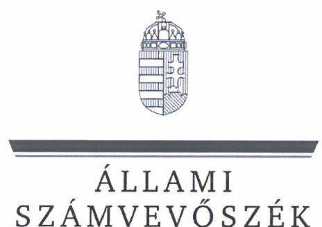
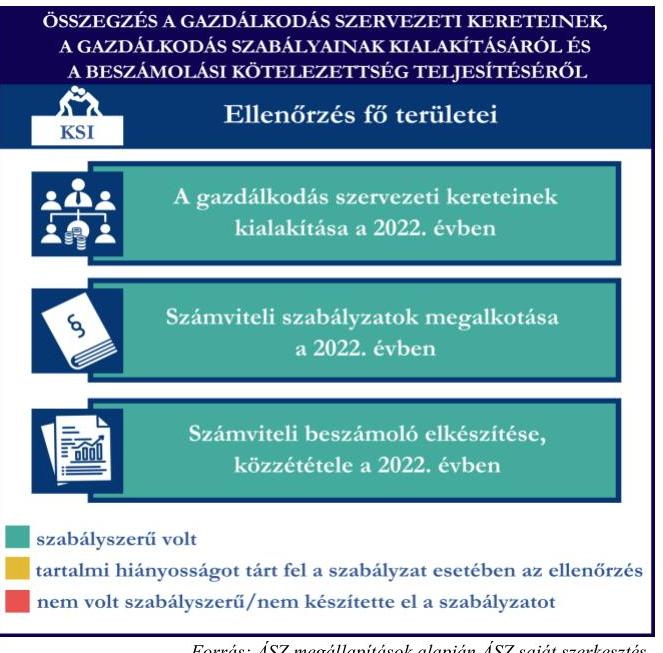
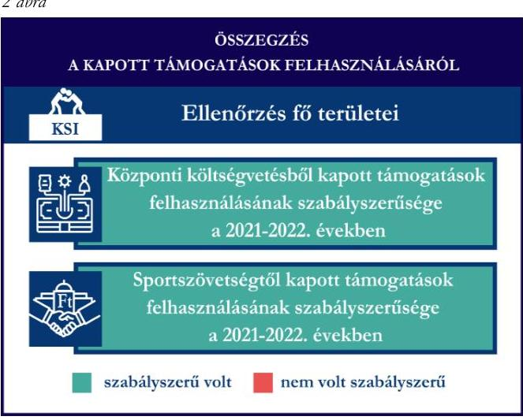
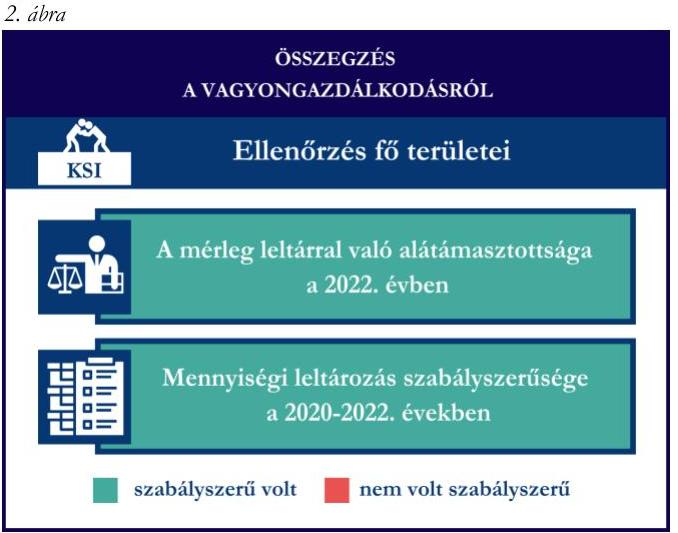

# JELENTÉS 

## Támogatásban részesülő sportszövetségek és sportegyesületek gazdálkodásának ellenőrzése

Központi Sport- és Ifjúsági Egyesület

2024.

---

ÁLLAMI
SZÁMVEVŐSZÉK

# JELENTÉS 

## Támogatásban részesülő sportszövetségek és sportegyesületek gazdálkodásának ellenőrzése

Központi Sport- és Ifjúsági Egyesület

2024.

---

# ELLENŐRZÉSI IGAZGATÓSÁG: 

## ÁLLAMHÁZTARTÁSON KÍVÜLI SZERVEZETEKET ELLENŐRZŐ IGAZGATÓSÁG

## ELLENŐRZÉSI IGAZGATÓ:

## KLINGA LÁSZLÓ igazgató

## ELLENŐRZÉSVEZETŐ:

Jelentéseink az interneten a www.asz.hu címen olvashatók.

## KAKAS SÁNDOR ellenőrzésvezető

IKTATÓSZÁM: EL-4060-007/2024.
TÉMASZÁM: 2682
ELLENŐRZÉS-AZONOSÍTÓ SZÁM: V1026

---

# TARTALOMJEGYZÉK 

- AZ ELLENŐRZÉS ALAPADATAI ..... 5
- AZ ELLENŐRZÖTT SZERVEZET ..... 7
- ÖSSZEFOGLALÁS ..... 8
- AZ ELLENŐRZÉS FÓKUSZKÉRDÉSEI ..... 10
- MEGÁLLAPÍTÁSOK ..... 11
- JAVASLATOK ..... 14
- MELLÉKLETEK ..... 15
I. sz. melléklet: Értelmező szótár ..... 15
II. sz. melléklet: Az ellenőrzött szervezetek jegyzéke ..... 17
III. sz. melléklet: Ellenőrzési kritériumok ..... 18
- FÜGGELÉK: ÉSZREVÉTELEK ..... 19
- RÖVIDÍTÉSEK JEGYZÉKE ..... 21

---

.

---

# AZ ELLENŐRZÉS ALAPADATAI 

## AZ ELLENŐRZÉS CÉLJA

Az ellenőrzés célja az államháztartásból nyújtott támogatással, vagy az államháztartásból meghatározott célra ingyenesen juttatott vagyon felhasználásával érintett sportszövetségek és sportegyesületek gazdálkodása szabályozottságának, gazdálkodási tevékenységének, ezen belül a beszámolási kötelezettség teljesítésének, a támogatások elkülönített nyilvántartásának, valamint a támogatások felhasználásának ellenőrzése.

## AZ ELLENŐRZÉS TÍPUSA

Szabályszerűségi ellenőrzés.

## AZ ELLENŐRZÖTT IDŐSZAK

Az 1. fókuszkérdés esetében a 2022. év.
A 2. fókuszkérdés vonatkozásában a 2021-2022. évek.
A 3. fókuszkérdés vonatkozásában a 2022. év, a mennyiségi felvétellel történő leltározás dokumentumai tekintetében a 2020-2022. évek.

## AZ ELLENŐRZÉS TÁRGYA

Az ellenőrzés tárgyát képezte a támogatásban részesülő sportszövetségek, sportegyesületek gazdálkodása szabályozottságának, gazdálkodási tevékenységén belül a beszámolási kötelezettség teljesítésének, a vagyonnyilvántartásának, a támogatások elkülönített nyilvántartásának, valamint az államháztartási forrásból származó közvetlen vagy közvetett támogatások és a meghatározott célra ingyenesen juttatott vagyon felhasználásának a vizsgálata volt. Az ellenőrzés a támogatások vonatkozásában kiterjedt továbbá a támogató felé történő beszámolási és elszámolási kötelezettségek teljesítésére, az ezekkel kapcsolatos jogszabályi és belső előírások betartására.

Az ellenőrzés kiterjedt minden olyan körülményre és adatra, amely az ÁSZ¹ jogszabályban meghatározott feladatainak teljesítéséhez, valamint az ellenőrzési program végrehajtása során felmerülő újabb összefüggések feltárásához szükséges. Az ellenőrzés az 1. és 3. fókuszkérdések esetében az ellenőrzött szervezet egészére, a 2. fókuszkérdés esetén kizárólag a judo szakágra vonatkozóan került végrehajtásra.

## AZ ELLENŐRZÉS JOGALAPJA

Az ellenőrzés jogszabályi alapját az ÁSZ tv.² 1. § (3) bekezdése, az 5. § (3) bekezdése, valamint a Civil tv.³ 47. § előírásai képezték.

---

# AZ ELLENŐRZÉS MÓDSZERE 

Az ellenőrzést a nemzetközi standardokat irányadónak tekintve az ellenőrzési program szempontjai, az ellenőrzött időszakban hatályos jogszabályok, az ellenőrzés általános szakmai szabályai, az ellenőrzésre irányadó ÁSZ módszertanok figyelembevételével végezte az ÁSZ.

Az ellenőrzési kérdések megválaszolásához szükséges bizonyítékok megszerzése az ellenőrzött szervezet által rendelkezésre bocsátott dokumentumokra, adatokra alapozva kérdésfeltevés (információkérés), interjú, mintavételezés útján történt.

Az ellenőrzési bizonyítékként felhasználható adatforrások közé tartoztak egyrészt az ellenőrzés során az ellenőrzött szervezettől bekért dokumentumok, másrészt adatforrás lehetett minden további, az ellenőrzés folyamán feltárt, az ellenőrzés szempontjából információt tartalmazó dokumentum.

A támogatásokkal, azok felhasználásával kapcsolatos kötelezettségek vizsgálatára mintavételi eljárások kerültek alkalmazásra. Támogatás-típusok szerint nagyságrend alapján 1-3 darab támogatás került részletes vizsgálat alá. Ezen támogatások felhasználásának szabályszerűsége támogatásonként kockázatértékelés alapján kiválasztott mintatételekkel került ellenőrzésre. A kiválasztott támogatási szerződésekhez kapcsolódó elszámolásokból 30-30 db mintatétel került ellenőrzésre, ahol az elszámolás nem érte el a 30 db -ot, ott tételes ellenőrzésre került sor. Ezen felül a vagyongazdálkodás szabályszerűségének ellenőrzéséhez is kockázatalapú mintavétel kapcsolódott. A támogatások felhasználása és a vagyongazdálkodás területén a minták ellenőrzése kiterjedt a könyvvezetési kötelezettség vizsgálatára is. A tárgyi eszközök tekintetében 30 db került kiválasztásra a 2022. évben állományban lévő eszközök közül azok nyilvántartásának, elszámolásának szabályszerűsége ellenőrzése céljából. A kiválasztott mintatételek ellenőrzésének eredménye nem került kivetítésre a teljes sokaságra, a megállapítások az adott ellenőrzött mintatételek vonatkozásában kerültek megjelenítésre.

---

# AZ ELLENŐRZÖTT SZERVEZET

A Központi Sport- és Ifjúsági Egyesületet 2001. március 19. napján vették nyilvántartásba. Alapszabálya szerint célja sporttevékenység, sporttudományos tevékenység, nevelés, oktatás, valamint a képességfejlesztés népszerűsítése, fejlesztése. A KSI⁴ alapvető feladatának tekinti a versenysportban résztvevő szakosztályok működtetését, az utánpótlás-nevelést, a hazai és nemzetközi korosztályos versenyeken. Közreműködnek az egyetemes magyar utánpótlás sport és az olimpiai mozgalom fejlesztésében, a sportiskolai rendszerű képzésben, a sportiskolai rendszerű képzés módszereinek fejlesztésében. Céljuk a fiatalokban az egészséges életszemlélet, a sportszerű életmód, magatartás és képességeik fejlesztése, erősítése, az egyesület tagjainak a közösségi életre nevelése, öntevékenységük kibontakozásának segítése, az elődök nagyszerű hagyományainak ápolása. Az egyesületnél az ellenőrzött időszakban 14 szakosztály működött.

A KSI a jogszabályi előírás alapján könyvvizsgálatra és felügyelőbizottság létrehozására is kötelezett volt. A KSI az ellenőrzött időszakban 3 tagú felügyelőbizottsággal rendelkezett. A 2022. évben a KSI az alapcéljai megvalósítása érdekében vállalkozási tevékenységet is végzett. A KSI az OBH⁵ nyilvántartás adatai alapján az ellenőrzött időszakban közhasznú jogállással rendelkező szervezet volt.

A KSI judo szakága által az ellenőrzött időszakban igénybe vett támogatásokat az 1. táblázat mutatja be. 1. táblázat

|  A KSI ÁLTAL IGÉNYBE VETT TÁMOGATÁSOK (ADATOK M FT-BAN) |  |   |
| --- | --- | --- |
|   | 2021. év | 2022. év  |
|  Központi költségvetési támogatás | 43,2 | 67,6  |
|  Helyi önkormányzati támogatás | - | -  |
|  Magyar Judo Szövetségtől kapott támogatás | 5,6 | 6,7  |

---

# ÖSSZEFOGLALÁS 

Magyarország Alaptörvényének XX. cikke kimondja, hogy mindenkinek joga van a testi és lelki egészséghez, melynek érvényesülését Magyarország többek között a sportolás és a rendszeres testedzés támogatásával segíti elő. Az Országgyűlés a Sport tv.⁶-ben kinyilvánította, hogy a nemzet közössége a test művelését, a sportot, a nemzet alapértékének, kívánatos célnak tekinti. A sport a közjó része. Erősíti a közösség tagjainak egymáshoz tartozását, miként az egyén testi és lelki egészségét.

A sportegyesületek, sportszövetségek működésükre és szakmai tevékenységük ellátására költségvetési támogatásban, önkormányzati támogatásban, ingyenes vagyonjuttatásban, valamint látvány-csapatsport támogatásban részesülhetnek, amelyekre fokozott figyelem irányul.

A társadalom részéről jogosan felmerülő elvárás, hogy a közpénzeket kezelő, azzal gazdálkodó szervezetek működéséről, tevékenységéről átfogó képet kapjon, a közpénzek rendeltetésszerű és átlátható módon történő felhasználásának értékelésére időről-időre sor kerüljön az ellenőrzések keretében.

A gazdálkodási szabályok kialakítása, az 1. ábra könyvvezetési- és beszámolási kötelezettség teljesítése a 2022. évben a KSI tekintetében szabályszerű volt.

A KSI a könyvviteli szolgáltatás személyi feltételeinek megteremtéséről, felügyelőbizottság létrehozásáról és működéséről gondoskodott. A 2022. évre vonatkozó éves beszámolót könyvvizsgáló felülvizsgálta. A jogszabályi előírások szerint a KSI kialakította a számviteli politikáját, valamint elkészítette számviteli szabályzatait, továbbá rendelkezett számlarenddel. A szabályzatok az ellenőrzött jogszabályi kritériumoknak megfeleltek.

A könyvvezetés formája a 2022. évben megfelelt a jogszabályi előírásoknak. A KSI a számviteli beszámoló- és közhasznúsági melléklet készítési- és közzétételi

A gazdálkodás szervezeti kereteinek
Kialakítása a 2022. évben

Számviteli szabályzatok megalkotása a 2022. évben

Számviteli beszámoló elkészítése, közzététele a 2022. évben
szabályszerű volt
tartalmi hiányosságot tárt fel a szabályzat esetében az ellenőrzés nem volt szabályszerű/nem készítette el a szabályzatot

Forrás: ÁSZ megállapítások alapján ÁSZ saját szerkesztés
kötelezettségét a jogszabályoknak megfelelően teljesítette.

A gazdálkodás szervezeti keretei kialakításának, a számviteli szabályzatok megalkotásának, valamint a számviteli beszámoló elkészítésének és közzétételének értékelését az 1. ábra mutatja be.

---

A KSI a judo szakosztály részére a központi költségvetésből, valamint a központi költségvetésből a sportszövetségen keresztül nyújtott támogatásokat a 2021-2022. években az ellenőrzött tételek esetében a támogatási célnak megfelelően, szabályszerűen használta fel. Számviteli nyilvántartásában a Magyar Judo Szövetségen keresztül számára juttatott támogatások felhasználását a jogszabályi előírás ellenére elkülönítetten nem tartotta nyilván.
A kapott támogatások felhasználásának értékelését a 2. ábra mutatja be.

A KSI vagyongazdálkodása a beszámoló leltárral való alátámasztottsága, a tárgyi eszközök üzembe helyezése és értékcsökkenésük elszámolása tekintetében, az ellenőrzött tételek esetében a 2022. évben szabályszerű volt. A jogszabályoknak megfelelően gondoskodott saját vagyona éves beszámolóban történő megjelenítéséről az ellenőrzött tételek alapján. A 2022. évi éves beszámolójának mérleg tételeit alátámasztotta szabályszerű leltárral, valamint a mennyiségi felvétellel történő leltározást elvégezte.
A vagyongazdálkodás értékelését a 3. ábra mutatja be.

---

# AZ ELLENŐRZÉS FÓKUSZKÉRDÉSEI 

1. A gazdálkodási szabályok kialakítása, a könyvvezetési- és beszámolási kötelezettség teljesítése szabályszerű volt-e?
2. A kapott támogatások felhasználása szabályszerű volt-e?
3. Az ellenőrzött szervezet vagyongazdálkodása szabályszerű volt-e?

---

# MEGÁLLAPÍTÁSOK 

## 1. A gazdálkodási szabályok kialakítása, a könyvvezetési- és beszámolási kötelezettség teljesítése szabályszerű volt-e?

Összegző megállapítás A 2022. évben a KSI-nél gazdálkodási szabályok kialakítása
megfelelt a jogszabályi előírásoknak, a könyvvezetési- és
beszámolási kötelezettség teljesítése szabályszerű volt.
A 2022. évben a KSI a Számv. tv.⁷ és a Civilszr.⁸-ben foglalt jogszabályi előírások betartásával gondoskodott a könyvviteli szolgáltatás személyi feltételeinek megteremtéséről, a könyvviteli szolgáltatás körébe tartozó feladatok ellátásával megbízott szervezet megfelelt a jogszabályi előírásoknak.
A 2022. évre vonatkozó éves beszámolóját a Civilszr. előírásainak megfelelően könyvvizsgáló felülvizsgálta.
A KSI a Ptk.⁹ előírása szerint létrehozta a felügyelőbizottságot, a felügyelőbizottság tagjainak száma megfelelt a Ptk. előírásainak. A közhasznú jogállására tekintettel a Civil tv. 40. § (2) bekezdésében előírtak ellenére a felügyelőbizottság ügyrendjét nem állapította meg.
A KSI a 2022. évben rendelkezett a Számv. tv.-ben előírt számviteli politikával, az eszközök és a források értékelési szabályzatával¹⁰, pénzkezelési szabályzattal, az eszközök és a források leltárkészítési és leltározási szabályzatával, amelyek az ellenőrzött tartalmi kritériumoknak megfeleltek. A KSI a Számv. tv. szerint a számlarendet elkészítette.
A KSI a Civilszr. előírásainak megfelelően a 2022. évben kettős könyvvitelt vezetett. A 2022. évben a KSI végzett vállalkozási tevékenységet, amelynek bevételeit és ráfordításait a könyvvezetése során a Civil tv.-nek megfelelően az alaptevékenységtől elkülönítetten tartotta nyilván és mutatta ki beszámolójában. A könyvviteli nyilvántartásait a Számv. tv. és a Civilszr. rendelkezéseinek megfelelően úgy alakította ki, hogy az éves beszámolóban az egyéb bevételeken belül a tagdíjakat és a kapott támogatások összegét részletezni tudta.
A KSI a Számv. tv., valamint a Civilszr. előírásainak megfelelően elkészítette a 2022. évre vonatkozó éves beszámolóját. A KSI a Civil tv.-nek megfelelően a beszámolóval egyidejűleg a Civil vhr.¹¹ melléklete szerinti tartalommal elkészítette a közhasznúsági mellékletet.
A 2022. évre vonatkozó éves beszámolót a Civilszr. előírása alapján könyvvizsgáló felülvizsgálta, a felügyelőbizottság véleményezte, a közgyűlés a Civil tv.-nek megfelelően jóváhagyta. A KSI a 2022. évi éves beszámolóját, valamint közhasznúsági mellékletét a Civil tv.-nek megfelelően letétbe helyezte és közzétette.

---

# 2. A kapott támogatások felhasználása szabályszerű volt-e? 

## Összegző megállapítás

A KSI a 2021. és 2022. években a judo szakosztályára vonatkozóan kapott támogatásokat szabályszerűen használta fel.

A KSI a központi költségvetésből kapott támogatás bevételeit a Civil tv. előírásai alapján elkülönítetten mutatta ki a könyveiben, a Civil tv. rendelkezéseinek megfelelően a központi költségvetésből részére juttatott támogatás felhasználásáról rendelkezett a támogatás felhasználásának elkülönített számviteli nyilvántartásával. A KSI a támogatás felhasználásáról a támogató felé benyújtott beszámolót és annak részeként az összesített elszámolási táblázatot a támogatói okiratokban előírt formában és
 tartalommal elkészítette.
A KSI a 2021. és 2022. évben az MJSZ ${ }^{12}$-en keresztül számára juttatott támogatások bevételeit a Civil tv. előírásai alapján elkülönítetten mutatta ki a könyveiben, azonban a Civil tv. 20. § (4) bekezdésében előírtak ellenére a kapott támogatások felhasználását elkülönítetten nem tartotta nyilván. A támogatások felhasználásáról az MJSZ felé benyújtott összesített elszámolási táblázatot a támogatási szerződésekben előírt formában és tartalommal elkészítette.
A támogatók felé benyújtott elszámolásokat alátámasztó számviteli bizonylatok a Számv. tv.-ben foglalt alaki és tartalmi követelményeknek megfeleltek, a központi költségvetésből, valamint az MJSZ-en keresztül kapott sportcélú támogatások esetén a benyújtott számlák a 474/2016. (XII. 27.) Korm. rendeletben ${ }^{13}$ előírtaknak megfelelően záradékolásra kerültek.
A KSI közhasznú szervezetként a Számv. tv. és a Civil tv. rendelkezéseinek megfelelően a 2021. és 2022. évekre vonatkozó éves beszámolójának kiegészítő mellékletében bemutatta a támogatási program keretében végleges jelleggel felhasznált összegeket támogatásonként és az üzleti évben végzett főbb tevékenységeket és programokat.

## 3. Az ellenőrzött szervezet vagyongazdálkodása szabályszerű volt-e?

## Összegző megállapítás A 2022. évben a KSI vagyongazdálkodása az ellenőrzött tételek vonatkozásában összességében szabályszerű volt.

A KSI a Számv. tv.-nek megfelelően a 2022. évi éves beszámolójának mérlegtételeit leltárral alátámasztotta, elvégezte a főkönyvi könyvelés és az analitikus nyilvántartások adatai közötti egyeztetést.
A Számv. tv.-nek megfelelően a 2022. évre vonatkozóan a mennyiségi felvétellel történő leltározást elvégezte.
A KSI esetében a tárgyi eszköz mintatételek ellenőrzése során az alábbiak kerültek megállapításra:

- a könyvviteli elszámolást alátámasztó számviteli bizonylatok - öt mintatétel kivételével - a Számv. tv.-nek megfelelően rendelkezésre álltak. A kivételek esetén négy nullára leírt, továbbá egy értékkel szereplő (nettó érték 139 519 Ft) tárgyi eszköz vonatkozásában a Számv. tv. 47. § (1) bekezdése szerinti bekerülési értékét a KSI a Számv. tv. 165. § (2) bekezdésében foglaltak ellenére bizonylattal nem támasztotta alá;

---

- a számviteli bizonylatokkal alátámasztott mintatételek esetén a bekerülési értékeket a Számv. tv.-ben előírtaknak megfelelően határozta meg,
- a tárgyi eszközök számviteli besorolása megfelelt a Számv. tv. előírásainak;
- az üzembe helyezés tényét és időpontját a Számv. tv.-nek megfelelően hitelt érdemlően dokumentálta;
- az értékcsökkenés elszámolása - egy mintatétel kivételével - a Számv. tv.-nek megfelelően történt. Egy bruttó 200 ezer Ft feletti egyedi beszerzési értékű tárgyi eszköz (számítástechnikai eszköz) esetében a Számv. tv. 52. § (1) és (2) bekezdésében, továbbá az eszközök és források értékelési szabályzata 2. pontjában előírtak ellenére az értékcsökkenést nem a fizikai elhasználódás figyelembevételével számolta el, mert a tárgyi eszköz üzembe helyezésének napján 100%-os leírási kulcs alkalmazásával nulla értékre amortizálta az eszközt.

---

# JAVASLATOK 

Az ÁSZ tv. 33. § (1) bekezdésében foglaltak értelmében az ellenőrzött szervezet vezetője köteles a jelentésben foglalt megállapításokhoz kapcsolódó intézkedési tervet összeállítani és azt a jelentés kézhezvételétől számított 30 napon belül az ÁSZ részére megküldeni. Amennyiben az ellenőrzött szervezet vezetője nem küldi meg határidőben az intézkedési tervet, vagy továbbra sem elfogadható intézkedési tervet küld, az Állami Számvevőszék elnöke az ÁSZ tv. 33. § (3) bekezdése a) és b) pontjaiban foglaltakat érvényesítheti.

## A KÖZPONTI SPORT- ÉS IFJÚSÁGI EGYESÜLET ELNÖKÉNEK

1. Intézkedjen, hogy a felügyelőbizottság a Civil tv. 40. § (2) bekezdésében előírtaknak megfelelően állapítsa meg az ügyrendjét.
2. Gondoskodjon arról, hogy a sportszövetségen keresztül kapott támogatások felhasználását a Civil tv. 20. § (4) bekezdésében foglalt előírásoknak megfelelően elkülönítetten tartsa nyilván.
3. Gondoskodjon a tárgyi eszközök esetében a bekerülési érték bizonylattal történő alátámasztásáról a Számv. tv. 165. § (2) bekezdésében előírtak szerint.
4. Gondoskodjon az értékcsökkenés szabályszerű elszámolásáról a Számv. tv. 52. § (1) és (2) bekezdésében, továbbá az eszközök és források értékelési szabályzata 2. pontjában előírtaknak megfelelően.

---

# MELLÉKLETEK 

## I. SZ. MELLÉKLET: ÉRTELMEZŐ SZÓTÁR

Civil szervezet

Egyesület

Költségvetési támogatás

Közhasznú szervezet

Közhasznú tevékenység

Országos sportági szakszövetség

Sportági szövetség

A civil társaság; a Magyarországon nyilvántartásba vett egyesület - a párt, a szakszervezet és a kölcsönös biztosító egyesület kivételével és - a közalapítvány és a pártalapítvány kivételével - az alapítvány. (Forrás: Civil tv. 2. §6. pont a)-c) alpontjai)
Az egyesület a tagok közös, tartós, alapszabályban meghatározott céljának folyamatos megvalósítására létesített, nyilvántartott tagsággal rendelkező jogi személy. (Forrás: Ptk. 3:63. § (1) bekezdés)
A Számv. tv. szempontjából egyéb szervezet. (Számv. tv. 3. § (1) bekezdés 4. pont a) alpontja)
A társadalombiztosítás pénzügyi alapjai kivételével az államháztartás központi alrendszeréből ellenérték nélkül, pénzben nyújtott támogatások. (Forrás: Áht. ${ }^{14}$ 1. § 14. pont)
Közhasznú szervezetté minősíthető a Magyarországon nyilvántartásba vett közhasznú tevékenységet végző szervezet, amely a társadalom és az egyén közös szükségleteinek kielégítéséhez megfelelő erőforrásokkal rendelkezik, továbbá amelynek megfelelő társadalmi támogatottsága kimutatható, és amely:
a) civil szervezet (ide nem értve a civil társaságot), vagy
b) olyan egyéb szervezet, amelyre vonatkozóan a közhasznú jogállás megszerzését törvény lehetővé teszi. (Forrás: Civil tv. 32. $\S$ (1) bekezdés)

Minden olyan tevékenység, amely a létesítő okiratban megjelölt közfeladat teljesítését közvetlenül vagy közvetve szolgálja, ezzel hozzájárulva a társadalom és az egyén közös szükségleteinek kielégítéséhez. (Forrás: Civil tv. 2. § 20. pont)
Olyan sportszövetség, amely sportágában kizárólagos jelleggel az e törvényben, valamint más jogszabályokban meghatározott feladatokat lát el és e törvényben megállapított különleges jogosítványokat gyakorol. Olyan sportágban hozható létre, amelyet vagy a Nemzetközi Olimpiai Bizottság elismert, vagy amely sportág nemzetközi szövetségét felvették a Nemzetközi Sportszövetségek Szövetségébe (GAISF). (Forrás: Sport tv. 20. § (1), (4) bekezdés)
A Civil tv. és a Ptk. előírásai alapján - a Sport tv.-ben meghatározott eltérésekkel - működő szövetség, amelynek tagjai kizárólag sportszervezetek lehetnek. Sportági szövetség országos jelleggel is működhet. Egy sportágban csak egy országos sportági szövetség működhet. Törvényi feltételek teljesülése esetén szakszövetségi feladatokat is elláthat. (Forrás: Sport tv. 28. §)

---

Sportegyesület

Sportegyesületeknek, sportszövetségeknek nyújtott költségvetési támogatás

Sportszövetség

Sporttevékenység

A Civil tv. és a Ptk. szabályai szerint működő olyan egyesület, amelynek alaptevékenysége a sporttevékenység szervezése, valamint a sporttevékenység feltételeinek megteremtése. A sportegyesületek a Sport tv. 15. § (1) bekezdésében meghatározott sportszervezetek körébe tartoznak. A sportegyesületeken kívül sportszervezet még a sportvállalkozás, a sportiskola, valamint az utánpótlás-nevelés fejlesztését végző alapítvány. (Forrás: Sport tv. 16. § (1) bekezdés)
Az állami sport célú támogatások felhasználásáról és elosztásáról szóló 474/2016. (XII. 27.) Kormány rendelet és a 27/2013. (III. 29.) EMMI rendelet ${ }^{11}$ 1. $\S$-ában meghatározott fejezeti kezelésű előirányzatokból nyújtott támogatás.
Meghatározott sporttevékenységek körében a sportversenyek szervezésére, a tagok érdekvédelmére és a részükre való szolgáltatásokra, valamint a nemzetközi kapcsolatok lebonyolítására létrehozott, jogi személyiséggel és önkormányzattal rendelkező, a Civil tv. és a Ptk. alapján - az e törvényben foglalt eltérésekkel különös formában működő egyesületek. A Sport tv. 19. § (3) bekezdése szerint a sportszövetségeknek az alábbi típusai léteznek: országos sportági szakszövetségek, sportági szövetségek, szabadidősport szövetségek, fogyatékosok sportszövetségei, diák- és egyetemi-főiskolai sport sportszövetségei, nemzetközi sportszövetségek. (Forrás: Sport tv. 19. § (1), (3) bekezdés)
Meghatározott szabályok szerint, a szabadidő eltöltéseként kötetlenül vagy szervezett formában, illetve versenyszerűen végzett testedzés vagy szellemi sportágban kifejtett tevékenység, amely a fizikai erőnlét és a szellemi teljesítőképesség megtartását, fejlesztését szolgálja. (Forrás: Sport tv. 1. § (2) bekezdés)

---

II. SZ. MELLÉKLET: AZ ELLENŐRZÖTT SZERVEZETEK JEGYZÉKE

|  ELLENŐRZÖTT SZERVEZET NEVE | ELLENŐRZÖTT SZERVEZET SZÉKHELYE  |
| --- | --- |
|  Központi Sport- és Ifjúsági Egyesület | 1146 Budapest, Istvánmezei út 1-3.  |

---

# III. SZ. MELLÉKLET: ELLENŐRZÉSI KRITÉRIUMOK 

## FOKUSZKÉRDÉS

## 1. fókuszkérdés:

A gazdálkodási szabályok kialakítása, a könyvvezetési és beszámolási kötelezettség teljesítése szabályszerű volt-e?

## 2. fókuszkérdés:

A kapott támogatások felhasználása szabályszerű volt-e?

## 3. fókuszkérdés:

Az ellenőrzött szervezet vagyongazdálkodása szabályszerű volt-e?

## ÉLLENŐRZÉSI KRITÉRIUMOK

Számv. tv. 14. § (3) bekezdés, (5) bekezdés a), b), d) pont, (8) bekezdés, 69. § (3) bekezdés, 90. § (3) bekezdés c) pont, 161. $\S$ (1) bekezdés, (2) bekezdés a)-d) pont, (3)-(4) bekezdés, 161/A. $\S$ (2) bekezdés, 165. $\S$ (2) bekezdés
Civilszr. 7. § (1) bekezdés, (4) bekezdés b), c) pont, 8. § (2), (3) bekezdés, 9. § (4), (5), (8) bekezdés, 12. § (4), (5) bekezdés, 15. § (1) bekezdés a), b) pont, 16. § (1) bekezdés, 24. § (2) bekezdés
Ptk. 3:26. § (1) bekezdés, 3:27. § (1) bekezdés, 3:82. § (1) bekezdés,
Civil tv. 28.§ (1) bekezdés, 29. § (2) bekezdés c) pont, (3), (6), (7) bekezdés, 30. § (1)-(4) bekezdés, 40. § (1), (2) bekezdés, 41. § (1) bekezdés
Civil vhr. melléklete
Sport tv. 23. § (1) bekezdés f) pont
Számv. tv. 44. § (2) bekezdés, 93. § (3) bekezdés, 159. §, 165. § (2) bekezdés, 167. § (1) bekezdés a), d), e), h) pont
Civil tv. 20. § (2) bekezdés a) pont, (3) bekezdés a), c) pont, (4) bekezdés, 29. § (4), (5) bekezdés
Civilszr. 24. § (2) bekezdés
27/2013. (III.29.) EMMI rend. 18. § (2) bekezdés
474/2016. (XII. 27.) Korm. rend. 22. § (2) bekezdés, 24. § (2) bekezdés
Áht. 53. §
Ptk. 3:63. § (4) bekezdés
Számv. tv. 3. § (3) bekezdés 3. pont, 15. § (3) bekezdés, 46. § (3), (4) bekezdés, 47-51. §, 52. § (1)-(7) bekezdés, 69. § (1), (3) bekezdés, 165. § (2) bekezdés
Sport tv. 76/B. §, 76/C. §

---

# FÜGGELÉK: ÉSZREVÉTELEK 

A jelentéstervezetet a Számvevőszék 15 napos észrevételezésre megküldte az ellenőrzött szervezet vezetőjének az ÁSZ tv. 29. § (1) bekezdése előírásának megfelelően.

A Központi Sport- és Ifjúsági Egyesület elnöke a jelentéstervezetre észrevételt tett. A függelék tartalmazza az el nem fogadott észrevétel elutasításának indoklását.

## A Központi Sport- és Ifjúsági Egyesület elnökének észrevétele:

„A jelentés tervezetben rögzítésre került, hogy egy bruttó 200 ezer Ft feletti egyedi beszerzési értékű tárgyi eszköz (számítástechnikai eszköz) esetében a Számv. tv. 52. § (1) és (2) bekezdésében, továbbá az eszközök és források értékelési szabályzata 2. pontjában előírtak ellenére az értékcsökkenést nem a fizikai elhasználódás figyelembevételével számolta el az egyesület, mert a tárgyi eszköz üzembe helyezésének napján 100%-os leírási kulcs alkalmazásával nulla értékre amortizálta az eszközt.
Jelen észrevételhez mellékelem a Tárgyi eszköz kartont, amin szerepel, hogy a fenti eszköz esetében 50%-os leírási kulcsot alkalmaztunk.
Kérem a Tisztelt Állami Számvevőszéket, hogy szíveskedjenek megvizsgálni az észrevételt, és a döntésüknél figyelembe venni."

## Az észrevétellel érintett megállapítás:

,,az értékcsökkenés elszámolása - egy mintatétel kivételével - a Számv. tv.-nek megfelelően történt. Egy bruttó 200 ezer Ft feletti egyedi beszerzési értékű tárgyi eszköz (számítástechnikai eszköz) esetében a Számv. tv. 52. § (1) és (2) bekezdésében, továbbá az eszközök és források értékelési szabályzata 2. pontjában előírtak ellenére az értékcsökkenést nem a fizikai elhasználódás figyelembevételével számolta el, mert a tárgyi eszköz üzembe helyezésének napján 100%-os leírási kulcs alkalmazásával nulla értékre amortizálta az eszközt."

[^0]
[^0]:    * 29. § (1) Az Állami Számvevőszék az ellenőrzési megállapításait megküldi az ellenőrzött

 szervezet vezetőjének vagy az általa megbízott személynek, és annak, akinek személyes felelősségét állapította meg.
    (2) Az ellenőrzött szervezet vezetője és a felelősként megjelölt személy az ellenőrzés megállapításaira tizenöt napon belül írásban észrevételt tehet.
    (3) Az Állami Számvevőszék az észrevételre a beérkezésétől számított harminc napon belül írásban válaszol. A figyelembe nem vett észrevételeket köteles a jelentésben feltüntetni, és megindokolni, hogy azokat miért nem fogadta el.

---

# El nem fogadás indoklása: 

Az ÁSZ ellenőrzése során az EL-3837-490/2023. iktatószámú adatbekérő levél 6. számú táblázatában - ezen belül az adatbekérő levélben Teszk_14. sorszám alatt a 04/0028. leltári számú "Dell Inspiron 5559" megnevezésű - mintatételként kiválasztott tárgyi eszközökhöz kapcsolódó dokumentumok kerültek bekérésre. Az adatbekérő levélre az Egyesület a Teszk_14. számú mintatételhez az ellenőrzés részére megküldte a "14.pdf" megnevezésű fájlt a 2016.09.26-i teljesítési dátumot tartalmazó 1605976. számú beszerzési számláról, a "04_0028_eszk_uzembe_helyezés.pdf" megnevezésű üzembehelyezési dokumentumot és a "04_0028_eszk_karton.pdf" megnevezésű tárgyi eszköz kartont. A rendelkezésre bocsátott „Dell Inspiron 5559" megnevezésű tárgyi eszköz üzembehelyezési dokumentumában és a tárgyi eszköz nyilvántartó kartonon szereplő adatok szerint a 04/0028. leltári számú tárgyi eszköz 2016.09.28-án került aktiválásra, a dokumentumokon az amortizációs kulcs 100%-ban került meghatározásra. Az ellenőrzés során továbbá rendelkezésre bocsátották a "TE nyilvantarta_2022_ev.xls" megnevezésű fájlt az Egyesület tárgyi eszközeinek nyilvántartásáról, mely nyilvántartás 531. sorában szerepel a kiválasztott mintatétel tárgyi eszköz, a nyilvántartásban szereplő adatok szerint a „Dell Inspiron 5559" megnevezésű tárgyi eszközt 2016.09.28-án helyezték üzembe, 234.900.-Ft értékkel, a nyilvántartás szerint a megállapított és elszámolt értékcsökkenés 100% volt. Az észrevételhez becsatolásra került a 00718 leltári számmal jelölt „Dell Inspiron 5559/ Judo" elnevezésű tárgyi eszköz karton, amelyen szereplő adatok nincsenek összhangban a korábban az ÁSZ rendelkezésére bocsátott dokumentumokban szereplő adatokkal, mert a korábban megküldött tárgyi eszköz kartonon eltérő leltári szám (04/0028) és értékcsökkenési leírási kulcs (100%) szerepelt az eszköz vonatkozásában.
Az észrevétel alapján a jelentéstervezet módosítása nem indokolt.

---

# RÖVIDÍTÉSEK JEGYZÉKE 

${ }^{1}$ ÁSZ
${ }^{2}$ ÁSZ tv.
${ }^{3}$ Civil tv.
${ }^{4}$ KSI
${ }^{5}$ OBH
${ }^{6}$ Sport tv.
${ }^{7}$ Számv. tv.
${ }^{8}$ Civilszr.
${ }^{9}$ Ptk.
${ }^{10}$ eszközök és források értékelési szabályzata
${ }^{11}$ Civil vhr.
${ }^{12}$ MJSZ
${ }^{13}$ 474/2016. (XII. 27.) Korm. rendelet
${ }^{14}$ Áht.
${ }^{15}$ 27/2013. EMMI rendelet

Állami Számvevőszék
2011. évi LXVI. törvény az Állami Számvevőszékről
2011. évi CLXXV. törvény az egyesülési jogról, a közhasznú jogállásról, valamint a civil szervezetek működéséről és támogatásáról
Központi Sport- és Ifjúsági Egyesület
Országos Bírósági Hivatal
2004. évi I. törvény a sportról
2000. évi C. törvény a számvitelről
479/2016. (XII.28.) Korm. rendelet a számviteli törvény szerinti egyes egyéb szervezetek beszámoló készítési és könyvvezetési kötelezettségének sajátosságairól
2013. évi V. törvény a Polgári Törvénykönyvről
Központi Sport- és Ifjúsági Egyesület eszközök és források értékelési szabályzata (hatályos: 2021. november 11-től)
350/2011. (XII. 30.) Korm. rendelet a civil szervezetek gazdálkodása, az adománygyűjtés és a közhasznúság egyes kérdéseiről
Magyar Judo Szövetség
474/2016. (XII. 27.) Korm. rendelet az állami sport célú támogatások felhasználásáról és elosztásáról
2011. évi CXCV. törvény az államháztartásról

27/2013. (III. 29.) EMMI rendelet az állami sport célú támogatások felhasználásáról és elosztásáról

---

1052 Budapest, Apáczai Csere János u. 10. | 1364 Budapest 4., Pf. 54
www.asz.hu | szamvevoszek@asz.hu
telefon: +36 14849100
