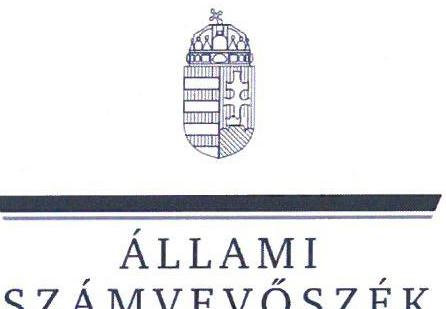
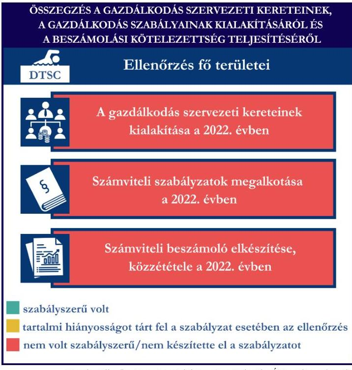
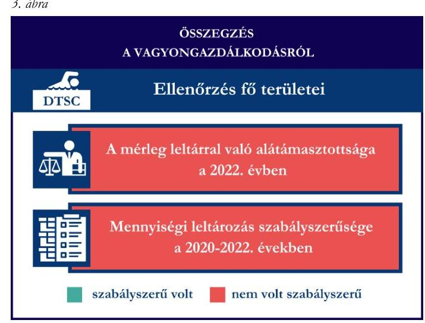
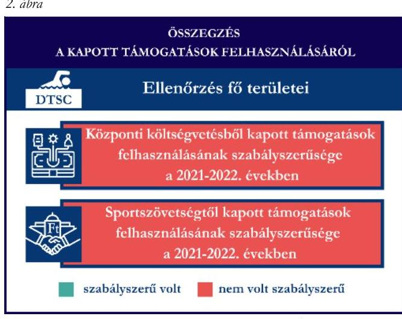

# JELENTÉS 

## Támogatásban részesülő sportszövetségek és sportegyesületek gazdálkodásának ellenőrzése

Darnyi Tamás Sport Club

2024.

---

ÁLLAMI
SZÁMVEVŐSZÉK

# JELENTÉS 

## Támogatásban részesülő sportszövetségek és sportegyesületek gazdálkodásának ellenőrzése

Darnyi Tamás Sport Club

2024.

---

# ELLENŐRZÉSI IGAZGATÓSÁG: 

## ÁLLAMHÁZTARTÁSON KÍVÜLI SZERVEZETEKET ELLENŐRZŐ IGAZGATÓSÁG

## ELLENŐRZÉSI IGAZGATÓ:

## KLINGA LÁSZLÓ igazgató

## ELLENŐRZÉSVEZETŐ:

## KAKAS SÁNDOR ellenőrzésvezető

SALAMIN VIKTOR ellenőrzésvezető

IKTATÓSZÁM: EL-4060-028/2024.
TÉMASZÁM: 2682
ELLENŐRZÉS-AZONOSÍTÓ SZÁM: V1026

---

# TARTALOMJEGYZÉK 

- AZ ELLENŐRZÉS ALAPADATAI ..... 5
- AZ ELLENŐRZÖTT SZERVEZET ..... 7
- ÖSSZEFOGLALÁS ..... 8
- AZ ELLENŐRZÉS FÓKUSZKÉRDÉSEI ..... 10
- MEGÁLLAPÍTÁSOK ..... 11
- JAVASLATOK ..... 15
- MELLÉKLETEK ..... 17
I. sz. melléklet: Értelmező szótár ..... 17
II. sz. melléklet: Az ellenőrzött szervezetek jegyzéke ..... 19
III. sz. melléklet: Ellenőrzési kritériumok ..... 20
- FÜGGELÉK: ÉSZREVÉTELEK ..... 21
- RÖVIDÍTÉSEK JEGYZÉKE ..... 22

---

.

---

# AZ ELLENŐRZÉS ALAPADATAI 

## AZ ELLENŐRZÉS CÉLJA

Az ellenőrzés célja az államháztartásból nyújtott támogatással, vagy az államháztartásból meghatározott célra ingyenesen juttatott vagyon felhasználásával érintett sportszövetségek és sportegyesületek gazdálkodása szabályozottságának, gazdálkodási tevékenységének, ezen belül a beszámolási kötelezettség teljesítésének, a támogatások elkülönített nyilvántartásának, valamint a támogatások felhasználásának ellenőrzése.

## AZ ELLENŐRZÉS TÍPUSA

Szabályszerüségi ellenőrzés.

## AZ ELLENŐRZÖTT IDŐSZAK

Az 1. fókuszkérdés esetében a 2022. év.
A 2. fókuszkérdés vonatkozásában a 2021-2022. évek.
A 3. fókuszkérdés vonatkozásában a 2022. év, a mennyiségi felvétellel történő leltározás dokumentumai tekintetében a 2020-2022. évek.

## AZ ELLENŐRZÉS TÁRGYA

Az ellenőrzés tárgya a támogatásban részesülő sportszövetségek, sportegyesületek gazdálkodása szabályozottságának, gazdálkodási tevékenységén belül a beszámolási kötelezettség teljesítésének, a vagyonnyilvántartásának, a támogatások elkülönített nyilvántartásának, valamint az államháztartási forrásból származó közvetlen vagy közvetett támogatások és a meghatározott célra ingyenesen juttatott vagyon felhasználásának a vizsgálata volt. Az ellenőrzés a támogatások vonatkozásában kiterjedt továbbá a támogató felé történő beszámolási és elszámolási kötelezettségek teljesítésére, az ezekkel kapcsolatos jogszabályi és belső előírások betartására.

Az ellenőrzés kiterjedt minden olyan körülményre és adatra, amely az ÁSZ ${ }^{1}$ jogszabályban meghatározott feladatainak teljesítéséhez, valamint az ellenőrzés program végrehajtása során felmerülő újabb összefüggések feltárásához szükséges.

## AZ ELLENŐRZÉS JOGALAPJA

Az ellenőrzés jogszabályi alapját az ÁSZ tv. 1. ${ }^{2}$ § (3) bekezdése, az 5. § (3) bekezdése, valamint a Civil tv. ${ }^{3} 47 . \int$ előírásai képezték.

---

# AZ ELLENŐRZÉS MÓDSZERE 

Az ellenőrzést a nemzetközi standardokat irányadónak tekintve az ellenőrzési program szempontjai, az ellenőrzött időszakban hatályos jogszabályok, az ellenőrzés általános szakmai szabályai, az ellenőrzésre irányadó ÁSZ módszertanok figyelembevételével végezte az ÁSZ.

Az ellenőrzési kérdések megválaszolásához szükséges bizonyítékok megszerzése az ellenőrzött szervezet által rendelkezésre bocsátott dokumentumokra, adatokra alapozva kérdésfeltevés (információkérés), interjú, mintavételezés útján történt.

Az ellenőrzési bizonyítékként felhasználható adatforrások közé tartoztak egyrészt az ellenőrzés során az ellenőrzött szervezettől bekért dokumentumok, másrészt adatforrás lehetett minden további az ellenőrzés folyamán feltárt, az ellenőrzés szempontjából információt tartalmazó dokumentum.

A támogatásokkal, azok felhasználásával kapcsolatos kötelezettségek vizsgálatára mintavételi eljárások kerültek alkalmazásra. Támogatás-típusok szerint nagyságrend alapján 1-3 darab támogatás került részletes vizsgálat alá. Ezen támogatások felhasználásának szabályszerűsége támogatásonként kockázatértékelés alapján kiválasztott mintatételekkel került ellenőrzésre. A kiválasztott támogatási szerződésekhez kapcsolódó elszámolásokból 30-30 db mintatétel került ellenőrzésre, ahol az elszámolás nem érte el a 30 db -ot, ott tételes ellenőrzésre került sor. Ezen felül a vagyongazdálkodás szabályszerűségének ellenőrzéséhez is kockázatalapú mintavétel kapcsolódott. A támogatások felhasználása és a vagyongazdálkodás területén a minták ellenőrzése kiterjedt a könyvvezetési kötelezettség vizsgálatára is. A 2022. évben állományban lévő tárgyi eszközök tekintetében 30 db került kiválasztásra, ahol nem érte el a nyilvántartott eszközök száma a 30 db -ot, ott tételes ellenőrzésre került sor azok nyilvántartásának, elszámolásának szabályszerűsége ellenőrzése céljából. Az ellenőrzésben nem statisztikai mintavételre került sor, ezért nem történt kivetítés a teljes sokaságra, a megállapításokat az ellenőrzött mintatételekre vonatkozóan fogalmaztuk meg.

---

# AZ ELLENŐRZÖTT SZERVEZET

## DARNYI TAMÁS SPORT CLUB

A Darnyi Tamás Sport Clubot 1995-ben alapították. A DTSC^{4} célja az úszósport népszerűsítése, a kisgyermekek úszásoktatása és sportolási lehetőségének biztosítása, hozzájárulás az egészséges nemzedék neveléséhez. A 2022. évben könyvvizsgálatra nem volt kötelezett, ugyanakkor a jogszabályban előírtak alapján felügyelőbizottság létrehozására kötelezett volt. A DTSC a beszámoló adatai alapján a 2022. évben az alaptevékenységén felül vállalkozási tevékenységet nem végzett. A DTSC által a 2021-2022. években igénybe vett államháztartási forrásból származó támogatásokat az 1. táblázat foglalja össze.

|  A DTSC ÁLTAL IGÉNYBE VETT TÁMOGATÁSOK (ADATOK M FT-BAN) | 2021. FV | 2022. FV  |
| --- | --- | --- |
|  Központi költségvetési támogatás | 103.5 | 2.5  |
|  Helyi önkormányzati támogatás | 0 | 0  |
|  Magyar Úszó Szövetségtől kapott támogatás | 22.1 | 18.5  |

*Forrás: Az ellenőrzőt szervezet beszámolói és főkönyvi adatai alapján ÁSZ saját szerkesztés*

---

# ÖSSZEFOGLALÁS 

Magyarország Alaptörvényének XX. cikke kimondja, hogy mindenkinek joga van a testi és lelki egészséghez, melynek érvényesülését Magyarország többek között a sportolás és a rendszeres testedzés támogatásával segíti elő. Az Országgyűlés a Sport tv. ${ }^{5}$-ben kinyilvánította, hogy a nemzet közössége a test művelését, a sportot, a nemzet alapértékének, kívánatos célnak tekinti. A sport a közjó része. Erősíti a közösség tagjainak egymáshoz tartozását, miként az egyén testi és lelki egészségét.

A sportegyesületek, sportszövetségek múködésükre és szakmai tevékenységük ellátására költségvetési támogatásban, önkormányzati támogatásban, ingyenes vagyonjuttatásban, valamint látvány-csapatsport támogatásban részesülhetnek, amelyekre fokozott figyelem irányul.

A társadalom részéről jogosan felmerülő elvárás, hogy a közpénzeket kezelő, azzal gazdálkodó szervezetek múködéséről, tevékenységéről átfogó képet kapjon, a közpénzek rendeltetésszerü és átlátható módon történő felhasználásának értékelésére időről-időre sor kerüljön az ellenőrzések keretében.
1. ábra

A gazdálkodási szabályok kialakítása, a könyvvezetési és beszámolási kötelezettség teljesítése a 2022. évben a DTSC tekintetében nem volt szabályzzerű.

A DTSC a könyvviteli szolgáltatás személyi feltételeit biztosította, azonban a jogszabályi előírások ellenére nem rendelkezett felügyelőbizottsággal a 2022. évben.

A jogszabályi előírások ellenére nem készítette el a számviteli politikát, azon belül az eszközök és a források leltárkészítési és leltározási szabályzatát, valamint az eszközök és a források értékelési szabályzatát. A 2022. évben számlarenddel nem rendelkezett.

A könyvvezetési kötelezettsége a 2022. évben nem felelt meg a jogszabályi előírásoknak, mivel a pénzeszközöket érintő gazdasági eseményekről, valamint a tevékenységével kapcsolatosan felmerült gazdasági eseményekről a nyilvántartásait a jogszabályi előírások ellenére nem vezette folyamatosan, azt a tárgyévet követő évben utólagosan készítette el. A DTSC a 2022. évi számviteli beszámoló elkészítésének szabályszerűségét nem biztosította, mivel a 2022. évi számviteli beszámolóját nem terjesztette be a legfőbb döntéshozó szerv elé, ami így a közgyűlés által nem került jóváhagyásra. A beszámoló a közgyűlés jóváhagyása hiányában került közzétételre.

A gazdálkodási szabályok kialakítása és a beszámolási kötelezettség ellenőrzésének az összegzését az 1. ábra tartalmazza.

---

A központi költségvetésből kapott ellenőrzött támogatásokat és a központi költségvetésből a MÚSZ ${ }^{6}$ on keresztül kapott támogatásokat a DTSC a 2021-2022. években nem szabályszerűen használta fel, mivel a támogatás és annak felhasználása a jogszabályi előírások ellenére a könyvviteli nyilvántartásban nem került elkülönítésre, az ellenőrzött támogatások felhasználása nem volt alátámasztva szabályszerű számviteli bizonylattal.

A kapott támogatások felhasználásának ellenőrzéséről az összegzést a 2. ábra tartalmazza.

Forrás: Ellenőrzött szervezet dokumentumai alapján ÁSZ saját szerkesztés

A DTSC vagyongazdálkodása az ellenőrzött tételek vonatkozásában a 2022. évben nem volt szabályszerű, mivel a mérlegben szereplő adatok leltárral nem voltak alátámasztottak, az előírt mennyiségi leltározást az eszközök tekintetében nem végezte el, sérült a valódiság elve. Az ellenőrzött tételek alapján a vagyonnyilvántartása nem volt szabályszerű a 2022. évben.

A vagyongazdálkodás ellenőrzéséről az összegzését a 3. ábra tartalmazza.

---

# AZ ELLENŐRZÉS FÓKUSZKÉRDÉSEI 

1.     - A gazdálkodási szabályok kialakítása, a könyvvezetési- és beszámolási kötelezettség teljesítése szabályszerű volt-e?
2.     - A kapott támogatások felhasználása szabályszerű volt-e?
3.     - Az ellenőrzött szervezet vagyongazdálkodása szabályszerű volt-e?

---

# 1. A gazdálkodási szabályok kialakítása, a könyvvezetési- és beszámolási kötelezettség teljesítése szabályszerű volt-e? 

Összegző megállapítás A DTSC a 2022. évben a gazdálkodási szabályokat nem alakította ki, a könyvvezetési kötelezettség, a beszámolási kötelezettség teljesítése nem volt szabályszerű.

A DTSC a 2022. évben a Számv. tv. ${ }^{7}$, valamint a Civilszr. ${ }^{8}$ előírásaiban foglaltaknak megfelelően gondoskodott a könyvviteli szolgáltatás személyi feltételeinek teljesüléséről.
A DTSC-nél a 2022. évben fennállt a felügyelőbizottság létrehozásának kötelezettsége, mivel taglétszáma meghaladta a 100 főt, azonban a Ptk. ${ }^{9} 3: 82 \int(1)$ bekezdésében előírtak ellenére nem rendelkezett felügyelőbizottsággal.
A DTSC 2022-ben a Számv. tv. 14. § (3) bekezdésben, valamint (5) bekezdés a), b) pontjaiban előírtak ellenére nem rendelkezett számviteli politikával, azon belül az eszközök és a források leltárkészítési és leltározási szabályzatával, az eszközök és a források értékelési szabályzatával. A Számv. tv.-ben előírtak alapján a DTSC elkészítette a pénzkezelési szabályzatát, azonban a Számv. tv. 14. § (8) bekezdésében előírtak ellenére az nem tartalmazta a készpénzállományt érintő pénzmozgások jogcímeit és eljárási rendjét, a napi készpénz záró állomány maximális mértékét, a készpénzállomány ellenőrzésekor követendő eljárást, az ellenőrzés gyakoriságát, a pénzszállítás feltételeit, a pénzforgalommal kapcsolatos nyilvántartási szabályokat, így a pénzkezelési szabályzat nem töltötte be a funkcióját. A DTSC a 2022. évben a Számv. tv. 161. $\int(1)$ bekezdésében előírtak ellenére nem rendelkezett számlarenddel. A DTSC nem biztosította a Számv. tv. 161. § (3) bekezdésében előírt analitikus nyilvántartások kapcsolatát a főkönyvi könyveléssel, valamint a kettő között az értékadatok számszerű egyeztetésének lehetőségét.
A DTSC a Számv. tv.-ben, Civil tv.-ben, valamint a Civilszr.-ben előírtak szerinti kettős könyvvitelt vezetett. A DTSC 2022-ben a könyvviteli nyilvántartását úgy vezette, hogy a Civilszr. előírásainak megfelelően a számviteli beszámolóban az egyéb bevételeken belül részletezni tudta a kapott támogatások, illetve a tagdíjak összegeit.
A DTSC a Számv. tv. 165. (3) bekezdés a) pontjában foglaltak ellenére a pénzeszközöket érintő gazdasági műveletek, események bizonylatainak adatait késedelemmel, készpénzforgalom esetén nem a pénzmozgással egyidejűleg, bankszámla forgalomnál nem a hitelintézeti értesítés megérkezésekor rögzítette a könyvekben. A pénztári pénzmozgásokról nem vezetett naprakész folyamatos nyilvántartást, a pénztári kifizetésekhez a 2022. években hatályos pénztárszabályzatának ${ }^{10} 2$. pontjában foglaltak ellenére pénztárbizonylatot nem állított ki.
A DTSC a Számv. tv. 165. § (3) bekezdés b) pontjában foglaltak ellenére a tárgyév (2022) első három negyedévében keletkezett gazdasági műveletek, események bizonylatainak adatait a gazdasági műveletek, események megtörténte után negyedévente nem rögzítette, mivel a tárgyévi adatok könyvelését utólagosan, a tárgyévet követő évben teljesítette (a 2022. év tekintetében a könyvelési adatok rögzítése az ellenőrzött számlákon szereplő adatok szerint 2023. január 30-án teljesült).

---

A DTSC a Civil tv.-ben, valamint a Számv. tv.-ben előírt számviteli beszámolóját, továbbá a Civil tv.-ben előírt közhasznúsági mellékletét a 2022. évre vonatkozóan elkészítette. A DTSC 2022. évi számviteli beszámolóját a Ptk., valamint a Civil tv.-ben előírtak ellenére a legfőbb döntéshozó szerv nem hagyta jóvá, mivel a Ptk. 3:80. § b) pontjában foglaltak ellenére az ügyvezetés nem tárta azt a közgyűlés elé. A DTSC a Civil tv. 30. § (1) bekezdésében foglaltak ellenére a legfőbb döntéshozó szerv által jóvá nem hagyott 2022. évi számviteli beszámolóját, valamint közhasznúsági mellékletét tette közzé, helyezte letétbe.

# 2. A kapott támogatások felhasználása szabályszerű volt-e? 

Összegző megállapítás

A DTSC a kapott támogatásokat a 2021-2022. években nem szabályszerűen használta fel. A felhasználás ellenőrzését nem biztosította, mivel a támogatás terhére elszámolt ellenőrzött ráfordításokat szabályszerű számviteli bizonylattal nem minden esetben támasztotta alá, valamint a könyvviteli rendszerében nem vezette azokat elkülönítetten.

A DTSC az ellenőrzött támogatási szerződésekben foglaltak alapján, a központi költségvetésből kapott támogatás bevételeit a Civil tv. 20. § (2) bekezdés a) pontja előírásával ellentétesen nem különítette el a számviteli rendszerében. A DTSC a 2021-2022. években a Számv. tv. 161/A. § (2) bekezdésében foglaltak ellenére a Civil tv. 20. § (4) bekezdésében előírt alapcél szerinti tevékenysége költségei, ráfordításai ellentételezésére a központi költségvetésből kapott támogatásokról nem vezetett olyan elkülönített számviteli nyilvántartást, amelynek alapján támogatásonként megállapítható és ellenőrizhető lett volna a kapott támogatás felhasználása. Elkülönített nyilvántartás hiányában az egyes támogatások felhasználásáról készített elszámolások könyvviteli nyilvántartással, az abban szereplő támogatásonkénti elkülönített adatokkal nem voltak alátámasztottak. A DTSC az ellenőrzött támogatási szerződések tekintetében a központi költségvetési támogatás felhasználásának elkülönített számviteli nyilvántartását a 2021-2022. években a számviteli rendszerében nem alakította ki.
A DTSC a központi költségvetési támogatás felhasználásáról a támogató által előírt formában elkészítette az előírt beszámolókat és az összesített elszámolási táblázatokkal együtt a támogatási szerződésekben foglaltak alapján benyújtotta a támogatónak.
A 474/2016. (XII.27.) Korm. rend. ${ }^{11}$ 24. § (2) bekezdésében, valamint a HBVI-106 számú támogatási szerződésben ${ }^{12}$ szerződés 6.2. c) pontjában foglaltak ellenére, a központi költségvetési támogatás felhasználásának számviteli bizonylatain a DTSC nem szerepeltette az előírt záradékolást, így nem jelezte, hogy a számviteli bizonylaton szereplő összegből melyik támogatási szerződésre vonatkozóan mekkora összeget számolt el a 2021. évben. Egy elszámolt ráfordítás esetében (268,6 E Ft) a HBVI-106. számú támogatási szerződés 6.1.6. pontjában, illetve a 6.2. c) pontjában, valamint a Számv. tv. 165. § (2) bekezdésében foglalat ellenére a DTSC a beszerzéshez kapcsolódóan nem kötött írásban szerződést, a beszerzést alátámasztó számla eredeti példánya nem került a szerződésben foglalt 10 évig megőrzésre, a kiállító által újranyomtatott másolati példányon szereplő értékesítés tartalma, teljesítésének igazolása, cél szerinti felhasználása, szabályszerű bizonylattal nem volt alátámasztva, így nem igazolt, hogy a számlán szereplő szolgáltatás a szerződés szerinti költségvetéssel összhangban valósult-e meg. A HBVI-106. számú támogatási szerződés 6.1.6. pontjában foglaltak alapján az „írásbeli alak" megsértésével kötött szerződés

---

teljesítése érdekében történt kifizetés összege a támogatott tevékenység költségei között nem vehető figyelembe.
A DTSC a központi költségvetésből az országos sportszövetségen keresztül számára juttatott sportcélú ellenőrzött támogatást és annak felhasználását a 2021-2022. években a Civil tv. 20. § (2) bekezdés a) pontja, illetve (4) bekezdésben és a Számv. tv. 161/A. § (2) bekezdésében előírtak ellenére a számviteli rendszerében nem tartotta elkülönítetten nyilván. A központi költségvetésből az országos sportszövetségen keresztül számára juttatott sportcélú ellenőrzött támogatás felhasználásáról a támogatási szerződésben foglaltak és az alapján az Áht. ${ }^{13}$ szerint beszámolt a támogató felé.
A központi költségvetésből az országos sportszövetségen keresztül kapott támogatások ellenőrzött tételei esetében a támogatási szerződések I. 6. pontjában, illetve a II. 6. pontjában és a Számv. tv. 165. § (2) bekezdésben foglaltak ellenére a számlán szereplő adatok nem voltak szabályszerű bizonylattal alátámasztottak, a támogatás cél szerinti teljesülése nem volt igazolt, mivel a kifizetéseket nem támasztotta alá írásbeli szerződés, a számlákon szereplő gazdasági események teljesítését igazoló szabályszerű, hiteles dokumentumok, valamint a pénzkezelési szabályzatban előírt kiadási pénztárbizonylatok. A 83 db ellenőrzött tételből négy ellenőrzött ráfordítás esetében a 2021/COVID/060. számú támogatási szerződés III.16. pontjában foglaltak ellenére a beszerzést alátámasztó számla eredeti példánya nem került a szerződésben foglalt tíz évig megőrzésre, azokat a DTSC „újranyomtatott" másolati példányokkal pótolta. A központi költségvetésből az országos sportszövetségen keresztül számára juttatott sportcélú ellenőrzött támogatás terhére elszámolt, ellenőrzött tételekből egy db esetében a 474/2016. (XII.27.) Korm. rend. 24. § (2) bekezdésében foglaltak ellenére a támogatás felhasználásának számviteli bizonylatán a DTSC nem záradékolta az elszámolt összeget, így nem jelezte, hogy a számviteli bizonylaton szereplő összegből melyik támogatási szerződésre vonatkozóan mekkora összeget számolt el.

# 3. Az ellenőrzött szervezet vagyongazdálkodása szabályszerű volt-e? 

Összegző megállapítás A DTSC vagyongazdálkodása a 2022. évben nem volt szabályszerű, mivel a beszámoló mérlegtételei leltárral nem voltak alátámasztottak, az ellenőrzött eszközök beszerzése nem volt minden esetben bizonylattal alátámasztva, a pénzeszközök nyilvántartása és kezelése nem volt szabályszerű.

A DTSC a 2022. évi beszámolójának mérlegtételeit a Számv. tv. 69. § (1) bekezdésében foglaltak ellenére nem támasztotta alá leltárral a követelések, a pénzeszközök, a saját tőke és a passzív időbeli elhatárolás mérlegtételek tekintetében. A DTSC a 2020-2022. évben a Számv. tv. 69. § (3) bekezdésében foglaltak ellenére a mérlegben szerepelő adatok valódiságát mennyiségi felvétellel lefolytatott leltározással nem támasztotta alá, így sérült a Számv. tv. 15. § (3) bekezdésében foglalt valódiság elve.
Az ellenőrzött tárgyi eszközök közül négy esetében a Számv. tv. 165. § (2) bekezdésben foglaltak ellenére a nyilvántartási adatokat beszerzést alátámasztó bizonylat nem támasztotta alá, valamint 14 tárgyi eszköz esetében előlegszámlákon felül a bekerülési értéket és a beszerzést alátámasztó számlabizonylat (végszámla) nem állt rendelkezésre.

---

A DTSC az Art. ${ }^{14}$ 114. § (2) bekezdésében foglaltak ellenére, mint pénzforgalmi számlanyitásra kötelezett adózó, a készpénzben teljesíthető fizetések céljára szolgáló pénzeszközökön felül a pénzeszközeit nem tartotta pénzforgalmi számlán. A főkönyvi adatok alapján a DTSC 2022. december 31-ei pénztár záró egyenlege 164,0 M Ft volt, a 2021. év végi záró egyenlege 190,4 M Ft. A főkönyvben nyilvántartott pénztári számlaszám forgalmi adatai nem indokolták a házipénztár folyamatosan magas egyenlegét a 2021-2022. években (pl: a 2022-es évben a pénztári forgalom (nyitó nélküli) egyenlege mínusz (-)28,0 M Ft alatt volt egész évben, ami azt jelenti, hogy a nyitó pénztári adatok figyelembevétele mellett a valós pénztár egyenleg nem csökkent 162,4 M Ft alá az év egyik napján sem).

---

# JAVASLATOK 

Az ÁSZ tv. 33. § (1) bekezdésében foglaltak értelmében az ellenőrzött szervezet vezetője köteles a jelentésben foglalt megállapításokhoz kapcsolódó intézkedési tervet összeállítani és azt a jelentés kézhezvételétől számított 30 napon belül az ÁSZ részére megküldeni. Amennyiben az ellenőrzött szervezet vezetője nem küldi meg határidőben az intézkedési tervet, vagy továbbra sem elfogadható intézkedési tervet küld, az Állami Számvevőszék elnöke az ÁSZ tv. 33. § (3) bekezdése a) és b) pontjaiban foglaltakat érvényesítheti.

## A DARNYI TAMÁS SPORT CLUB ELNÖKÉNEK

1. Gondoskodjon a Ptk. 3:82 § (1) bekezdésében elöirt felügyelőbizottság létrehozásáról.
2. Gondoskodjon a Számv. tv. 14. § (3) bekezdésben, (5) bekezdés a), b) pontjaiban elöirtak alapján a számviteli politika, ezen belül az eszközök és források leltárkészittési és leltározási, valamint az eszközök és források értékelési szabályzatának, a Számv. tv. 161. §-ában elöirt számlarendnek, valamint a Számv. tv. 14. § (8) bekezdésében foglaltaknak megfelelő pénzkezelési szabályzat elkészitéséről.
3. Gondoskodjon arról, hogy biztosítva legyen a Számv. tv. 161. § (3) bekezdésében elöirt analitikus nyilvántartások fökönyvi könyveléssel való szoros kapcsolata, és a kettő közötti értékadatok számszerü egyeztetésének lehetősége.
4. Gondoskodjon arról, hogy a pénzeszközöket érintő gazdasági müveletek, események bizonylatainak adatai a jövőben a Számv. tv. 165. § (3) bekezdés a) pontjában foglaltak szerint kerüljenek rögzitésre a könyvekben, a pénztári pénzmozgásokról naprakész folyamatos nyilvántartást kerüljön vezetésre, a pénztári kifizetéseket a hatályos pénztárszabályzatban foglaltak szerint bizonylatolják.
5. Gondoskodjon arról, hogy a gazdasági müveletek, események a Számv. tv. 165. § (3) bekezdés b) pontjában elöirtak szerinti határidőn belül kerüljenek könyvelésre.
6. Gondoskodjon arról, hogy a Ptk. 3:80. § b) pontjában, valamint a Civil tv. 30. § (1) bekezdés elöírásai alapján a számviteli beszámoló és közhasznúsági melléklet a legföbb döntéshozó szerv által jóváhagyásra kerüljön, illetve a legföbb döntéshozó szerv jóváhagyásával kerüljön közzétételre.

---

7. Gondoskodjon az alapcél szerinti tevékenysége költségei, ráfordításai ellentételezésére kapott támogatások elkülönített számviteli nyilvántartásának vezetéséről, amely alapján támogatásonként megállapítható és ellenőrizhető a kapott támogatás és annak felhasználása, a Civil tv. 20. § (2) bekezdés a) pontja, a 20. § (4) bekezdés és a Számv. tv. 161/A. § (2) bekezdés előírásai alapján.
8. Gondoskodjon arról, hogy a támogatás felhasználását alátámasztó számviteli bizonylaton a 474/2016. (XII.27) Korm. rend. 24. § (2) bekezdésében, valamint a támogatási szerződésben előirt záradékolás minden esetben szerepeljen.
9. Gondoskodjon arról, hogy a támogatás felhasználása a Számv. tv. 165. § (2) bekezdésében előirt szabályszerű, a támogatási szerződésben előirt számviteli bizonylatokkal alátámasztott legyen.
10. Gondoskodjon arról, hogy támogatáshoz felhasznált számviteli bizonylatok eredeti példányai a támogatási szerződésben előirtak szerint megőrzésre kerüljön.
11. Gondoskodjon a jövőben a beszámoló mérlegtételeinek leltárral való alátámasztásáról, valamint a mennyiségi felvétellel elvégzendő leltározásáról a Számv. tv. 69. § (1)-(3) bekezdéseiben, valamint a leltározási szabályzatban előirtaknak megfelelően.
12. Gondoskodjon arról, hogy a tárgyi eszközök beszerzését a Számv. tv. 165. § (2) bekezdésében előirt szabályszerű bizonylat támassza alá.
13. Gondoskodjon arról, hogy a pénzeszközök az Art. 114. § (2) bekezdésében foglaltaknak megfelelően pénzforgalmi számlán kerüljenek tartásra.

---

# MELLÉKLETEK 

## I. SZ. MELLÉKLET: ÉRTELMEZŐ SZÓTÁR

Civil szervezet

Egyesület

Költségvetési támogatás

Közhasznú szervezet

Közhasznú tevékenység

Országos sportági szakszövetség

Sportági szövetség

A civil társaság; a Magyarországon nyilvántartásba vett egyesület - a párt, a szakszervezet és a kölcsönös biztosító egyesület kivételével és a közalapítvány és a pártalapítvány kivételével - az alapítvány. (Forrás: Civil tv. 2. §6. pont a)-c) alpontjai)
Az egyesület a tagok közös, tartós, alapszabályban meghatározott céljának folyamatos megvalósítására létesített, nyilvántartott tagsággal rendelkező jogi személy. (Forrás: Ptk. 3:63. § (1) bekezdés)
A Számv. tv. szempontjából egyéb szervezet. (Számv. tv. 3. § (1) bekezdés 4. pont a) alpontja)
A társadalombiztosítás pénzügyi alapjai kivételével az államháztartás központi alrendszeréből ellenérték nélkül, pénzben nyújtott támogatások. (Forrás: Áht. 1. § 14. pont)
Közhasznú szervezetté minősíthető a Magyarországon nyilvántartásba vett közhasznú tevékenységet végző szervezet, amely a társadalom és az egyén közös szükségleteinek kielégítéséhez megfelelő erőforrásokkal rendelkezik, továbbá amelynek megfelelő társadalmi támogatottsága kimutatható, és amely:
a) civil szervezet (ide nem értve a civil társaságot), vagy
b) olyan egyéb szervezet, amelyre vonatkozóan a közhasznú jogállás megszerzését törvény lehetővé teszi. (Forrás: Civil tv. 32. § (1) bekezdés)
Minden olyan tevékenység, amely a létesítő okiratban megjelölt közfeladat teljesítését közvetlenül vagy közvetve szolgálja, ezzel hozzájárulva a társadalom és az egyén közös szükségleteinek kielégítéséhez. (Forrás: Civil tv. 2. § 20. pont)
Olyan sportszövetség, amely sportágában kizárólagos jelleggel az e törvényben, valamint más jogszabályokban meghatározott feladatokat lát el és e törvényben megállapított különleges jogosítványokat gyakorol. Olyan sportágban hozható létre, amelyet vagy a Nemzetközi Olimpiai Bizottság elismert, vagy amely sportág nemzetközi szövetségét felvették a Nemzetközi Sportszövetségek Szövetségébe (GAISF). (Forrás: Sport tv. 20. § (1), (4) bekezdés)
A Civil. tv. és a Ptk. előírásai alapján - a Sport tv.-ben meghatározott eltérésekkel - múködő szövetség, amelynek tagjai kizárólag sportszervezetek lehetnek. Sportági szövetség országos jelleggel is múködhet. Egy sportágban csak egy országos sportági szövetség múködhet. Törvényi feltételek teljesülése esetén szakszövetségi feladatokat is elláthat. (Forrás: Sport tv. 28. §)

---

Sportegyesület

Sportegyesületeknek, sportszövetségeknek nyújtott költségvetési támogatás

Sportszövetség

Sporttevékenység

A Civil. tv. és a Ptk. szabályai szerint müködő olyan egyesület, amelynek alaptevékenysége a sporttevékenység szervezése, valamint a sporttevékenység feltételeinek megteremtése. A sportegyesületek a Sport. tv. 15. § (1) bekezdésében meghatározott sportszervezetek körébe tartoznak. A sportegyesületeken kívül sportszervezet még a sportvállalkozás, a sportiskola, valamint az utánpótlás-nevelés fejlesztését végző alapítvány. (Forrás: Sport tv. 16. § (1) bekezdés)
Az állami sport célú támogatások felhasználásáról és elosztásáról szóló 474/2016. (XII. 27.) Kormány rendelet és a 27/2013. (III. 29.) EMMI rendelet ${ }^{15}$ 1. $\mathbb{S}$-ában meghatározott fejezeti kezelésű előirányzatokból nyújtott támogatás.
Meghatározott sporttevékenységek körében a sportversenyek szervezésére, a tagok érdekvédelmére és a részükre való szolgáltatásokra, valamint a nemzetközi kapcsolatok lebonyolítására létrehozott, jogi személyiséggel és önkormányzattal rendelkező, a Civil. tv. és a Ptk. alapján - az e törvényben foglalt eltérésekkel - különös formában müködő egyesületek. A Sport tv. 19. § (3) bekezdése szerint a sportszövetségeknek az alábbi típusai léteznek: országos sportági szakszövetségek, sportági szövetségek, szabadidősport szövetségek, fogyatékosok sportszövetségei, diák- és egyetemi-főiskolai sport sportszövetségei, nemzetközi sportszövetségek. (Forrás: Sport tv. 19. $\mathbb{S}(1),(3)$ bekezdés)
Meghatározott szabályok szerint, a szabadidő eltöltéseként kötetlenül vagy szervezett formában, illetve versenyszerűen végzett testedzés vagy szellemi sportágban kifejtett tevékenység, amely a fizikai erőnlét és a szellemi teljesítőképesség megtartását, fejlesztését szolgálja. (Forrás: Sport tv. 1. $\mathbb{S}$ (2) bekezdés)

---

II. SZ. MELLÉKLET: AZ ELLENŐRZÖTT SZERVEZETEK JEGYZÉKE

# ELLENŐRZÖTT SZERVEZET NEVE 

## ElLENŐRZÖTT SZERVEZET SZÉKHELYE

Darnyi Tamás Sport Club
1036 Budapest, Árpád fejedelem útja 62.

---

# III. SZ. MELLÉKLET: ELLENŐRZÉSI KRITÉRIUMOK 

## FOKUSZKÉRDÉS

## 1. fókuszkérdés:

A gazdálkodási szabályok kialakítása, a könyvvezetési és beszámolási kötelezettség teljesítése szabályszerű volt-e?

## 2. fókuszkérdés:

A kapott támogatások felhasználása szabályszerű volt-e?

## 3. fókuszkérdés:

Az ellenőrzött szervezet vagyongazdálkodása szabályszerű volt-e?

## ÉLLENŐRZÉSI KRITÉRIUMOK

Számv. tv. 14. § (3) bekezdés, (5) bekezdés a), b), d) pont, (8) bekezdés, (11) bekezdés, 69. § (3) bekezdés, 90. § (3) bekezdés c) pont, 161. § (1) bekezdés, (2) bekezdés a)-d) pont, (3)-(4) bekezdés, 161/A. $\S$ (2) bekezdés, 165. § (1)-(3) bekezdések,
Civilszr. 7. § (1) bekezdés, (4) bekezdés b), c) pont, 8. § (2), (3) bekezdés, 9. § (4), (5), (8) bekezdés, 12. § (4), (5) bekezdés, 15. § (1) bekezdés a), b) pont, 16. § (1) bekezdés, 24. § (2) bekezdés

Ptk. 3:26. § (1) bekezdés, 3:27. § (1) bekezdés, 3:80. § (2) bekezdés, 3:82. § (1) bekezdés,
Civil tv. 28.§ (1) bekezdés, 29. § (2) bekezdés c) pont, (3), (6), (7) bekezdés, 30. § (1)-(4) bekezdés 40. § (1), (2) bekezdés, 41. § (1) bekezdés

Sport tv. 23. § (1) bekezdés f) pont
Számv. tv. 44. § (2) bekezdés, 93. § (3) bekezdés, 159. §, 161/A. $\int(2)$ bekezdés
165. § (2) bekezdés, 167. § (1) bekezdés a), d), e), h) pont

Civil tv. 20.§ (2) bekezdés a) pont, (3) bekezdés a), c) pont, (4) bekezdés, 29. § (4), (5) bekezdés
Civilszr. 24. § (2) bekezdés
27/2013. (III.29.) EMMI rend. 18. § (2) bekezdés
474/2016. (XII. 27.) Korm. rend. 22. § (2) bekezdés, 24. § (2) bekezdés
Áht. 53. §, Ávr. ${ }^{16}$ 92. §, 93. § (2)-(4) bekezdések

Ptk. 3:63. § (4) bekezdés
Számv. tv. 3. § (3) bekezdés 3. pont, 15. § (3) bekezdés, 46. § (3), (4) bekezdés, 47-51. §, 52. § (1)-(7) bekezdés, 69. § (1)-(3) bekezdések, 165. § (2) bekezdés, 169. § (2) bekezdés
Art. 114. § (2) bekezdés

---

# FÜGGELÉK: ÉSZREVÉTELEK 

A jelentéstervezetet a Számvevőszék 15 napos észrevételezésre megküldte az ellenőrzött szervezet vezetőjének az ÁSZ tv. 29. §* (1) bekezdése előírásának megfelelően.

A Darnyi Tamás Sport Club elnöke a jelentéstervezetre nem tett észrevételt.

[^0]
[^0]:    * 29. § (1) Az Állami Számvevőszék az ellenőrzési megállapításait megküldi az ellenőrzött szervezet vezetőjének vagy az általa megbízott személynek, és annak, akinek személyes felelősségét állapította meg.
    (2) Az ellenőrzött szervezet vezetője és a felelősként megjelölt személy az ellenőrzés megállapításaira tizenöt napon belül írásban észrevételt tehet.
    (3) Az Állami Számvevőszék az észrevételre a beérkezésétől számított harminc napon belül írásban válaszol. A figyelembe nem vett észrevételeket köteles a jelentésben feltüntetni, és megindokolni, hogy azokat miért nem fogadta el.

---

# RÖVIDÍTÉSEK JEGYZÉKE 

${ }^{1}$ ÁSZ
${ }^{2}$ ÁSZ tv.
${ }^{3}$ Civil tv.
${ }^{4}$ DTSC
${ }^{5}$ Sport tv.
${ }^{6}$ MÚSZ
${ }^{7}$ Számv. tv.
${ }^{8}$ Civilszr.
${ }^{9}$ Ptk.
${ }^{10}$ pénztárszabályzat
${ }^{11}$ 474/2016. (XII.27.)Korm. rendelet
${ }^{12}$ HBVI-106. támogatási szerződés
${ }^{13}$ Áht.
${ }^{14}$ Art.
${ }^{15}$ 27/2013. (III.29.) EMMI rendelet
${ }^{16}$ Ávr.

Állami Számvevőszék
2011. évi LXVI. törvény az Állami Számvevőszékről
2011. évi CLXXV. törvény az egyesülési jogról, a közhasznú jogállásról, valamint a civil szervezetek müködéséről és támogatásáról
Darnyi Tamás Sport Club
2004. évi I. törvény a sportról

Magyar Úszó Szövetség
2000. évi C. törvény a számvitelről
479/2016. (XII. 28.) Korm. rendelet a számviteli törvény szerinti egyes egyéb szervezetek beszámoló készítési és könyvvezetési kötelezettségének sajátosságairól
2013. évi V. törvény a Polgári Törvénykönyvről

A DTSC 2022. évben hatályos pénzkezelési szabályzata
474/2016. (XII. 27.) Korm. rendelet az állami sport célú támogatások felhasználásáról és elosztásáról
A DTSC és a Sportszövetséges Országos Szövetsége között (2021. november 8.) létrejött HBVI-106. iktatószámú támogatási szerződés
2011. évi CXCV. törvény az államháztartásról
2017. évi CL. törvény az adózás rendjéről
27/2013. (III. 29.) EMMI rendelet az állami sport célú támogatások felhasználásáról és elosztásáról
368/2011. (XII. 31.) Korm. rendelet az államháztartásról szóló törvény végrehajtásáról

---

1052 Budapest, Apáczai Csere János u. 10. | 1364 Budapest 4., Pf. 54
www.asz.hu | szamvevoszek@asz.hu
telefon: +36 14849100