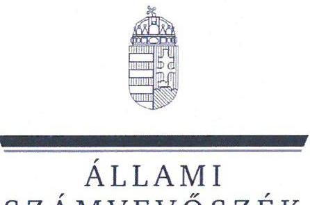
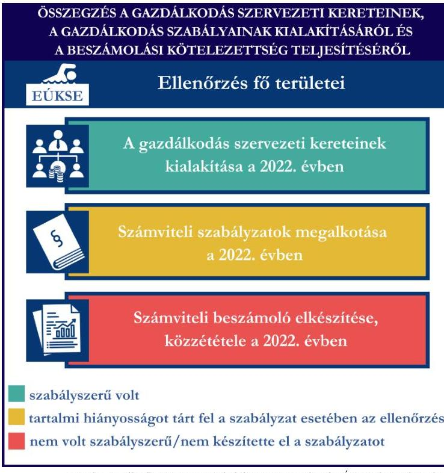
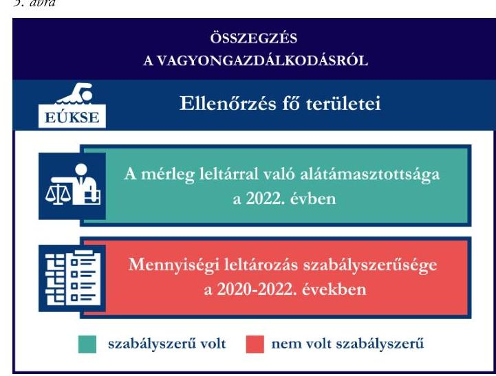
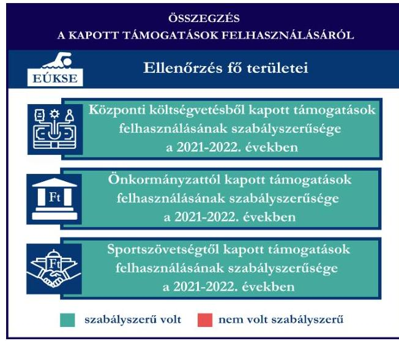
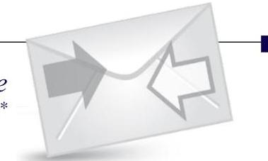

# JELENTÉS 

## Támogatásban részesülő sportszövetségek és sportegyesületek gazdálkodásának ellenőrzése

## Egri Úszó Klub Sportegyesület

2024.

---

ÁLLAMI
SZÁMVEVŐSZÉK

# JELENTÉS 

## Támogatásban részesülő sportszövetségek és sportegyesületek gazdálkodásának ellenőrzése

Egri Úszó Klub Sportegyesület

2024.

---

# ELLENŐRZÉSI IGAZGATÓSÁG: 

## ÁLLAMHÁZTARTÁSON KÍVÜLI SZERVEZETEKET ELLENŐRZŐ IGAZGATÓSÁG

## ELLENŐRZÉSI IGAZGATÓ:

## KLINGA LÁSZLÓ igazgató

## ELLENŐRZÉSVEZETŐ:

## KAKAS SÁNDOR ellenőrzésvezető

SALAMIN VIKTOR ellenőrzésvezető

IKTATÓSZÁM: EL-4060-024/2024.
TÉMASZÁM: 2682
ELLENŐRZÉS-AZONOSÍTÓ SZÁM: V1026

---

# TARTALOMJEGYZÉK 

- AZ ELLENŐRZÉS ALAPADATAI ..... 5
- AZ ELLENŐRZÖTT SZERVEZETEK ..... 7
- ÖSSZEFOGLALÁS ..... 8
- AZ ELLENŐRZÉS FÓKUSZKÉRDÉSEI ..... 10
- MEGÁLLAPÍTÁSOK ..... 11
- JAVASLATOK ..... 14
- MELLÉKLETEK ..... 15
I. sz. melléklet: Értelmező szótár ..... 15
II. sz. melléklet: Az ellenőrzött szervezetek jegyzéke ..... 17
III. sz. melléklet: Ellenőrzési kritériumok ..... 18
- FÜGGELÉK: ÉSZREVÉTELEK ..... 19
- RÖVIDÍTÉSEK JEGYZÉKE ..... 20

---

.

---

# AZ ELLENŐRZÉS ALAPADATAI 

## AZ ELLENŐRZÉS CÉLJA

Az ellenőrzés célja az államháztartásból nyújtott támogatással, vagy az államháztartásból meghatározott célra ingyenesen juttatott vagyon felhasználásával érintett sportszövetségek és sportegyesületek gazdálkodása szabályozottságának, gazdálkodási tevékenységének, ezen belül a beszámolási kötelezettség teljesítésének, a támogatások elkülönített nyilvántartásának, valamint a támogatások felhasználásának ellenőrzése.

## AZ ELLENŐRZÉS TÍPUSA

Szabályszerűségi ellenőrzés.

## AZ ELLENŐRZÖTT IDŐSZAK

Az 1. fókuszkérdés esetében a 2022. év.
A 2. fókuszkérdés vonatkozásában a 2021-2022. évek.
A 3. fókuszkérdés vonatkozásában a 2022. év, a mennyiségi felvétellel történő leltározás dokumentumai tekintetében a 2020-2022. évek.

## AZ ELLENŐRZÉS TÁRGYA

Az ellenőrzés tárgya a támogatásban részesülő sportszövetségek, sportegyesületek gazdálkodása szabályozottságának, gazdálkodási tevékenységén belül a beszámolási kötelezettség teljesítésének, a vagyonnyilvántartásának, a támogatások elkülönített nyilvántartásának, valamint az államháztartási forrásból származó közvetlen vagy közvetett támogatások és a meghatározott célra ingyenesen juttatott vagyon felhasználásának a vizsgálata volt. Az ellenőrzés a támogatások vonatkozásában kiterjedt továbbá a támogató felé történő beszámolási és elszámolási kötelezettségek teljesítésére, az ezekkel kapcsolatos jogszabályi és belső előírások betartására.

Az ellenőrzés kiterjedt minden olyan körülményre és adatra, amely az ÁSZ¹ jogszabályban meghatározott feladatainak teljesítéséhez, valamint az ellenőrzés program végrehajtása során felmerülő újabb összefüggések feltárásához szükséges.

## AZ ELLENŐRZÉS JOGALAPJA

Az ellenőrzés jogszabályi alapját az ÁSZ tv.² 1. § (3) bekezdése, az 5. § (3) bekezdése, valamint a Civil tv.³ 47. § előírásai képezték.

---

# AZ ELLENŐRZÉS MÓDSZERE 

Az ellenőrzést a nemzetközi standardokat irányadónak tekintve az ellenőrzési program szempontjai, az ellenőrzött időszakban hatályos jogszabályok, az ellenőrzés általános szakmai szabályai, az ellenőrzésre irányadó ÁSZ módszertanok figyelembevételével végezte az ÁSZ.

Az ellenőrzési kérdések megválaszolásához szükséges bizonyítékok megszerzése az ellenőrzött szervezet által rendelkezésre bocsátott dokumentumokra, adatokra alapozva kérdésfeltevés (információkérés), interjú, mintavételezés útján történt.

Az ellenőrzési bizonyítékként felhasználható adatforrások közé tartoztak egyrészt az ellenőrzés során az ellenőrzött szervezettől bekért dokumentumok, másrészt adatforrás lehetett minden további az ellenőrzés folyamán feltárt, az ellenőrzés szempontjából információt tartalmazó dokumentum.

A támogatásokkal, azok felhasználásával kapcsolatos kötelezettségek vizsgálatára mintavételi eljárások kerültek alkalmazásra. Támogatás-típusok szerint nagyságrend alapján 1-3 darab támogatás került részletes vizsgálat alá. Ezen támogatások felhasználásának szabályszerűsége támogatásonként kockázatértékelés alapján kiválasztott mintatételekkel került ellenőrzésre. A kiválasztott támogatási szerződésekhez kapcsolódó elszámolásokból 30-30 db mintatétel került ellenőrzésre, ahol az elszámolás nem érte el a 30 db-ot, ott tételes ellenőrzésre került sor. Ezen felül a vagyongazdálkodás szabályszerűségének ellenőrzéséhez is kockázatalapú mintavétel kapcsolódott. A támogatások felhasználása és a vagyongazdálkodás területén a minták ellenőrzése kiterjedt a könyvvezetési kötelezettség vizsgálatára is. A tárgyi eszközök tekintetében 30 db került kiválasztásra a 2022. évben állományban lévő eszközök közül azok nyilvántartásának, elszámolásának szabályszerűsége ellenőrzése céljából. Az ellenőrzésben nem statisztikai mintavételre került sor, ezért nem történt kivetítés a teljes sokaságra, a megállapításokat az ellenőrzött mintatételekre vonatkozóan fogalmaztuk meg.

---

# AZ ELLENŐRZÖTT SZERVEZETEK

## EGRI ÚSZÓ KLUB SPORTEGYESÜLET

Az Egri Úszó Klub Sportegyesület célja az egri fiatalok úszás sporttechnikai felkészítése, versenyeztetése, továbbá szervezett keretek között a sportolni vágyók, érdeklődők tömegbázisának bővítése, utánpótlás nevelés, az úszás népszerűsítése. Az EÚKSE⁴ az úszáson kívül egyéb sportszakosztállyal nem rendelkezett Az EÚKSE tevékenysége a célok megvalósításához szükséges személyi, anyagi és tárgyi feltételek létrehozása, biztosítása. Az EÚKSE a 2022. évben közhasznú jogállású volt. A 2022. évben könyvvizsgálatra nem volt kötelezett, felügyelő szerv létrehozására kötelezett volt. Az EÚKSE a beszámoló adatai alapján a 2022. évben az alaptevékenységén felül vállalkozási tevékenységet nem végzett. Az EÚKSE által a 2021-2022. években igénybe vett államháztartási forrásból származó támogatásokat az 1. táblázat foglalja össze. 1. táblázat

|  AZ EÚKSE ÁLTAL IGÉNYBE VETT TÁMOGATÁSOK (ADATOK M FT-BAN) |  |   |
| --- | --- | --- |
|   | 2021. FV | 2022. FV  |
|  Központi költségvetési támogatás | 1,4 | 1,5  |
|  Helyi önkormányzati támogatás | 24,6 | 26,7  |
|  Magyar Úszó Szövetségtől kapott támogatás | 26,8 | 16,4  |

---

# ÖSSZEFOGLALÁS 

Magyarország Alaptörvényének XX. cikke kimondja, hogy mindenkinek joga van a testi és lelki egészséghez, melynek érvényesülését Magyarország többek között a sportolás és a rendszeres testedzés támogatásával segíti elő. Az Országgyúlés a Sport tv.³-ben kinyilvánította, hogy a nemzet közössége a test művelését, a sportot, a nemzet alapértékének, kívánatos célnak tekinti. A sport a közjó része. Erősíti a közösség tagjainak egymáshoz tartozását, miként az egyén testi és lelki egészségét.

A sportegyesületek, sportszövetségek működésükre és szakmai tevékenységük ellátására költségvetési támogatásban, önkormányzati támogatásban, ingyenes vagyonjuttatásban, valamint látvány-csapatsport támogatásban részesülhetnek, amelyekre fokozott figyelem irányul.

A társadalom részéről jogosan felmerülő elvárás, hogy a közpénzeket kezelő, azzal gazdálkodó szervezetek működéséről, tevékenységéről átfogó képet kapjon, a közpénzek rendeltetésszerű és átlátható módon történő felhasználásának értékelésére időről-időre sor kerüljön az ellenőrzések keretében.
1. ábra

A gazdálkodás szervezeti kereteinek kialakítása a 2022. évben

Számviteli szabályzatok megalkotása a 2022. évben

Számviteli beszámoló elkészítése, közzététele a 2022. évben
szabályszerű volt
tartalmi hiányosságot tárt fel a szabályzat esetében az ellenőrzés nem volt szabályszerű/nem készítette el a szabályzatot

Forrás: Az ellenőrzött szervezetek dokumentumai alapján ÁSZ saját szerkesztés
összegzését az 1. ábra tartalmazza.

Az EÜKSE tekintetében a gazdálkodási szabályok kialakításra kerültek, a beszámolási kötelezettség teljesítése nem volt szabályszerű a 2022. évben.

Az EÜKSE a könyvviteli szolgáltatás személyi feltételeit biztosította, a jogszabályban előírt felügyelő szervvel rendelkezett.

A jogszabályban előírt számviteli szabályzatokat az EÜKSE elkészítette, azonban a számlarendje nem volt szabályszerű a 2022. évben.

Az EÜKSE könyvvezetési formája a 2022. évben megfelelt a jogszabályi előírásoknak, azonban a 2022. évi számviteli beszámolója nem volt szabályszerű, mivel azt a jogszabályi előírások ellenére a legfőbb döntéshozó szerv nem hagyta jóvá, a beszámolót a legfőbb döntéshozó szerv jóváhagyása hiányában tette közzé.

A gazdálkodási szabályok kialakítása és a beszámolási kötelezettség ellenőrzésének az

---

Az EÚKSE a kapott támogatásokat az ellenőrzött tételek tekintetében a támogatási célnak megfelelően, szabályszerűen használta fel a 2021-2022. években. Az Önkormányzattól kapott támogatás felhasználását alátámasztó bizonylatok jogszabályban előírt záradékolása a 2021-2022. években az ellenőrzött támogatások tekintetében nem teljesült.

A kapott támogatások felhasználásának ellenőrzéséről az összegzést a 2. ábra tartalmazza.

Forrás: Az ellenőrzött szervezetek dokumentumai alapján ÁSZ saját szerkesztés
2. ábra

Forrás: Az ellenőrzött szervezetek dokumentumai alapján ÁSZ saját szerkesztés
Az EÚKSE vagyongazdálkodása összességében az ellenőrzött tételek vonatkozásában szabályszerű volt. Az EÚKSE a 2022. évi beszámoló mérlegtételeit leltárral alátámasztotta, azonban a tárgyi eszközök esetében a mennyiségi felvétellel történő leltározást nem végezte el a 2022. évben.

A vagyongazdálkodás ellenőrzésének összegzését a 3. ábra tartalmazza.

---

# AZ ELLENŐRZÉS FÓKUSZKÉRDÉSEI 

1.     - A gazdálkodási szabályok kialakítása, a könyvvezetési- és beszámolási kötelezettség teljesítése szabályszerű volt-e?
2.     - A kapott támogatások felhasználása szabályszerű volt-e?
3.     - Az ellenőrzött szervezet vagyongazdálkodása szabályszerű volt-e?

---

# MEGÁLLAPÍTÁSOK 

## 1. A gazdálkodási szabályok kialakítása, a könyvvezetési- és beszámolási kötelezettség teljesítése szabályszerű volt-e?

Összegző megállapítás Az EÜKSE-nél a 2022. évben a gazdálkodási szabályok kialakításra kerültek, a könyvvezetési, beszámolási kötelezettség teljesítése nem volt szabályszerű.

Az EÜKSE a 2022. évben a Számv. tv.⁶, valamint a Civilszr.⁷ előírásaiban foglaltaknak megfelelően gondoskodott a könyvviteli szolgáltatás személyi feltételeinek teljesüléséről. Az EÜKSE a 2022. évben rendelkezett a Civil tv.-ben előírt felügyelő szervvel. A felügyelő szerv az ügyrendjét megalkotta.
Az EÜKSE 2022-ben rendelkezett a Számv. tv-ben előírt számviteli politikával, azon belül az eszközök és a források leltárkészítési és leltározási szabályzatával, az eszközök és a források értékelési szabályzatával, pénzkezelési szabályzattal, valamint számlarenddel, amelyek - a számlarend kivételével - az ellenőrzött tartalmi kritériumoknak megfeleltek. Az EÜKSE 2022. évben hatályos számlarendje nem felelt meg a Számv. tv. 161. § (2) bekezdés a) pontjában foglaltaknak, mert nem tartalmazta minden alkalmazott számla számát, megnevezését.
Az EÜKSE a Számv. tv.-ben, Civil. tv.-ben, valamint a Civilszr.-ben előírtak szerinti könyvvitelt vezetett. Az EÜKSE 2022-ben a könyvviteli nyilvántartását úgy vezette, hogy a Számv. tv., valamint a Civilszr. előírásainak megfelelően a számviteli beszámolóban az egyéb bevételeken belül részletezni tudta a kapott támogatások összegeit. Az EÜKSE a Civilszr. 24. § (2) bekezdésében foglaltak ellenére 2022-ben a könyvvezetési rendszerét nem részletezte tovább úgy, hogy a tagdijakat a beszámolóban az egyéb bevételeken belül elkülönítve kimutathassa, mivel a főkönyvi nyilvántartásában szereplő tagdíj összege, illetve a beszámoló eredménykimutatásában tagdíjként szerepeltetett összeg nem csak tagdíjbevételt, hanem úszásoktatási bevételeket is magában foglalt.
Az EÜKSE a Civil tv.-ben, valamint a Számv. tv. előírásai alapján előírt könyvvitellel alátámasztott számviteli beszámolóját, továbbá a Civil. tv.-ben előírtak alapján a közhasznúsági mellékletét elkészítette, melyet a felügyelő szerv véleményezett. Az EÜKSE 2022. évi számviteli beszámolóját a legfőbb döntéshozó szerv nem hagyta jóvá, mivel a Ptk. 3:80. § b) pontjában foglaltak ellenére az ügyvezetés nem tárta azt a közgyűlés elé. Az EÜKSE a Civil. tv. 30. § (1) bekezdésében foglaltak ellenére a legfőbb döntéshozó szerv által jóvá nem hagyott 2022. évi beszámolóját és közhasznúsági mellékletét tette közzé és helyezte letétbe.

---

# 2. A kapott támogatások felhasználása szabályszerű volt-e? 

| Összegző megállapítás | Az EÚKSE a 2021-2022. években az ellenőrzött  támogatásokat a támogatási célnak megfelelően,  szabályszerűen használta fel. Az ellenőrzött önkormányzati  támogatások vonatkozásában a felhasználást alátámasztó  bizonylatokat záradékkal nem látta el. |
| :-- | :-- |

Az EÚKSE az ellenőrzött támogatási szerződésekben foglaltak alapján, a központi költségvetésből kapott támogatás bevételeit a Civil tv. előírásai alapján elkülönítette a számviteli rendszerében. Az EÚKSE a 2021-2022. években a Számv. tv.-be és a Civil tv.-ben előírt alapcél szerinti tevékenysége költségei, ráfordításai ellentételezésére kapott központi költségvetési támogatásokról vezetett olyan elkülönített számviteli nyilvántartást, amelynek alapján támogatásonként megállapítható és ellenőrizhető volt a kapott támogatások felhasználása. Az EÚKSE az ellenőrzött támogatási szerződések tekintetében a központi költségvetési támogatás felhasználásának elkülönített számviteli nyilvántartását a 2021-2022. években a számviteli rendszerében kialakította. A központi költségvetési támogatás terhére elszámolt ellenőrzött ráfordítások a Számv. tv. szerint kerültek elszámolásra, számviteli bizonylattal alátámasztottak voltak. Az EÚKSE a központi költségvetési

 támogatás felhasználásáról a támogató által előírt formában elkészítette az előírt beszámolókat és az összesített elszámolási táblázatokkal együtt a támogatási szerződésekben foglaltak alapján benyújtotta a támogatónak.
A Számv. tv., valamint a Civil tv. előírásainak megfelelően az EÚKSE az ellenőrzött önkormányzati támogatási szerződésekben meghatározott támogatási bevételeket és azok felhasználását a 2021-2022. években elkülönítetten mutatta ki a számviteli nyilvántartásában. Az EÚKSE a támogatási szerződésben és az alapján az Áht.-ban ${ }^{8}$ foglalt előírások alapján teljesítette a beszámolási kötelezettségét az önkormányzati támogatás rendeltetésszerű felhasználásáról a 2021-2022. években. Az EÚKSE a 2021–2022. években elszámolt önkormányzati támogatások ellenőrzött tételeit a Számv. tv.-ben előírtaknak megfelelő, szabályszerű számviteli bizonylattal alátámasztotta. Az Ávr. 93. § (5) bekezdésében, valamint az EgerMJV 13191-2-2022 számú önkormányzati támogatás szerződésének 9. pontjában foglaltak ellenére az önkormányzati támogatással szemben elszámolt ráfordításokat az EÚKSE nem látta el záradékkal egyik ellenőrzött tétel esetében sem, így nem jelezte, hogy a számviteli bizonylaton szereplő összegből mennyit számolt el a szerződésszámmal hivatkozott támogatási szerződés terhére.
Az EÚKSE a központi költségvetésből a MÚSZ ${ }^{9}$-on keresztül számára juttatott sportcélú ellenőrzött támogatást és annak felhasználását a 2021-2022. években a Civil tv. és a Számv. tv. előírásainak megfelelően a számviteli rendszerében elkülönítetten tartotta nyilván. A központi költségvetésből a MÚSZ-on keresztül számára juttatott sportcélú ellenőrzött támogatás felhasználásáról az Áht. és a támogatási szerződésben foglaltak szerint beszámolt a támogató felé. Az EÚKSE a 2021-2022. években elszámolt támogatások ellenőrzött tételeit a Számv. tv.-ben előírtaknak megfelelő, szabályszerű számviteli bizonylattal alátámasztotta.
A Számv. tv. 44. § (2) bekezdésében foglaltak ellenére a 2021-2022. években az EÚKSE a támogatásból megvalósult tárgyi eszköz beszerzések tekintetében nem határolta el (passzív időbeli elhatárolásként) a költségek, ráfordítások ellentételezésére - visszafizetési kötelezettség nélkül - kapott, pénzügyileg rendezett, egyéb bevételként elszámolt támogatás összegéből az üzleti évben költséggel, ráfordítással nem ellentételezett összeget.

---

# 3. Az ellenőrzött szervezet vagyongazdálkodása szabályszerű volt-e? 

## Összegző megállapítás

Az EÚKSE a beszámoló mérlegtételeit leltárral alátámasztotta, azonban az előírt mennyiségi felvétellel történő leltározást nem végezte el 2022. évben. A 2022. évben az EÚKSE vagyongazdálkodása az ellenőrzött tételek vonatkozásában szabályszerű volt.

Az EÚKSE a 2022. évi beszámolójának mérlegtételeit - a tárgyi eszközök kivételével - a Számv. tv. alapján leltárral, leltár egyeztetéssel alátámasztotta. Az EÚKSE a 2022. évben a tárgyi eszközök tekintetében az analitikus nyilvántartások és a főkönyv adatai közötti egyeztetést elvégezte, azonban a Számv. tv. 69. § (3) bekezdésében, valamint a leltározási szabályzatában foglaltak ellenére a mérlegben szereplő tárgyi eszközök értékének valódiságát mennyiségi felvétellel lefolytatott, szabályszerű leltározással nem támasztotta alá.
Az EÚKSE-nél az ellenőrzött tárgyi eszközök bekerülési értékét alátámasztó számviteli bizonylatok - két eszköz kivételével - a Számv. tv.-ben előírtaknak megfelelően rendelkezésre álltak. Az EÚKSE két ellenőrzött tárgyi eszköz Számv. tv. 47. § (1) bekezdése szerinti bekerülési értékét, a Számv. tv. 165. § (2) bekezdésében foglaltak ellenére bizonylattal nem támasztotta alá. Az ellenőrzött tárgyi eszközök számviteli besorolása, értékcsökkenés elszámolása a két eszköz kivételével megfelelt a Számv. tv. előírásainak, az üzembe helyezés tényét a Számv. tv.-ben előírtak alapján dokumentálta.

---

# JAVASLATOK 

Az ÁSZ tv. 33. § (1) bekezdésében foglaltak értelmében az ellenőrzött szervezet vezetője köteles a jelentésben foglalt megállapításokhoz kapcsolódó intézkedési tervet összeállítani és azt a jelentés kézhezvételétől számított 30 napon belül az ÁSZ részére megküldeni. Amennyiben az ellenőrzött szervezet vezetője nem küldi meg határidőben az intézkedési tervet, vagy továbbra sem elfogadható intézkedési tervet küld, az Állami Számvevőszék elnöke az ÁSZ tv. 33. § (3) bekezdése a) és b) pontjaiban foglaltakat érvényesítheti.

## AZ EGRI ÚSZÓ KLUB SPORTEGYESÜLET ELNÖKÉNEK

1. Gondoskodjon a Számv. tv. 161. § (2) bekezdés a) pontjában foglaltaknak megfelelő számlarend elkészítéséről.
2. Gondoskodjon a tagdíjbevételek számviteli rendszerben való elkülönítéséről oly módon, hogy az az egyéb bevételeken belül részletezésre kerüljön a Civilszr. 24. § (2) bekezdésében foglaltaknak megfelelően.
3. Gondoskodjon arról, hogy a Civil tv. 30. § (1) bekezdés előírásai alapján a számviteli beszámoló és közhasznúsági melléklet a legfőbb döntéshozó szerv által jóváhagyásra kerüljön, illetve a legfőbb döntéshozó szerv által jóváhagyott számviteli beszámoló kerüljön közzétételre.
4. Gondoskodjon arról, hogy az önkormányzattól kapott támogatás felhasználását alátámasztó számviteli bizonylaton az Ávr. 93. § (5) bekezdésében, valamint a támogatási szerződésben előírt záradékolás minden esetben szerepeljen.
5. Gondoskodjon a költségek, ráfordítások ellentételezésére - visszafizetési kötelezettség nélkül - kapott, pénzügyileg rendezett, egyéb bevételként elszámolt támogatás összegéből az üzleti évben költséggel, ráfordítással nem ellentételezett összeget időbeli elhatárolásáról a számviteli nyilvántartásaiban a Számv. tv. 44. § (2) bekezdésében foglaltaknak megfelelően.
6. Gondoskodjon az eszközök mennyiségi felvétellel elvégzendő leltározásáról a Számv. tv. 69. § (3) bekezdésében, valamint a leltározási szabályzatban előírtaknak megfelelően.
7. Gondoskodjon arról, hogy a tárgyi eszközök bekerülési értékét a Számv. tv. 165. § (2) bekezdésben előírt szabályszerű bizonylat támaszza alá.

---

# MELLÉKLETEK 

## I. SZ. MELLÉKLET: ÉRTELMEZŐ SZÓTÁR

Civil szervezet

Egyesület

Költségvetési támogatás

Közhasznú szervezet

Közhasznú tevékenység

Országos sportági szakszövetség

Sportági szövetség

A civil társaság; a Magyarországon nyilvántartásba vett egyesület - a párt, a szakszervezet és a kölcsönös biztosító egyesület kivételével és a közalapítvány és a pártalapítvány kivételével - az alapítvány. (Forrás: Civil tv. 2. §6. pont a)-c) alpontjai)
Az egyesület a tagok közös, tartós, alapszabályban meghatározott céljának folyamatos megvalósítására létesített, nyilvántartott tagsággal rendelkező jogi személy. (Forrás: Ptk. 3:63. § (1) bekezdés)
A Számv. tv. szempontjából egyéb szervezet. (Számv. tv. 3. § (1) bekezdés 4. pont a) alpontja)
A társadalombiztosítás pénzügyi alapjai kivételével az államháztartás központi alrendszeréből ellenérték nélkül, pénzben nyújtott támogatások. (Forrás: Áht. 1. § 14. pont)
Közhasznú szervezetté minősíthető a Magyarországon nyilvántartásba vett közhasznú tevékenységet végző szervezet, amely a társadalom és az egyén közös szükségleteinek kielégítéséhez megfelelő erőforrásokkal rendelkezik, továbbá amelynek megfelelő társadalmi támogatottsága kimutatható, és amely:
a) civil szervezet (ide nem értve a civil társaságot), vagy
b) olyan egyéb szervezet, amelyre vonatkozóan a közhasznú jogállás megszerzését törvény lehetővé teszi. (Forrás: Civil tv. 32. § (1) bekezdés)
Minden olyan tevékenység, amely a létesítő okiratban megjelölt közfeladat teljesítését közvetlenül vagy közvetve szolgálja, ezzel hozzájárulva a társadalom és az egyén közös szükségleteinek kielégítéséhez. (Forrás: Civil tv. 2. § 20. pont)
Olyan sportszövetség, amely sportágában kizárólagos jelleggel az e törvényben, valamint más jogszabályokban meghatározott feladatokat lát el és e törvényben megállapított különleges jogosítványokat gyakorol. Olyan sportágban hozható létre, amelyet vagy a Nemzetközi Olimpiai Bizottság elismert, vagy amely sportág nemzetközi szövetségét felvették a Nemzetközi Sportszövetségek Szövetségébe (GAISF). (Forrás: Sport tv. 20. § (1), (4) bekezdés)
A Civil tv. és a Ptk. előírásai alapján - a Sport tv.-ben meghatározott eltérésekkel - működő szövetség, amelynek tagjai kizárólag sportszervezetek lehetnek. Sportági szövetség országos jelleggel is működhet. Egy sportágban csak egy országos sportági szövetség működhet. Törvényi feltételek teljesülése esetén szakszövetségi feladatokat is elláthat. (Forrás: Sport tv. 28. §)

---

Sportegyesület

Sportegyesületeknek, sportszövetségeknek nyújtott költségvetési támogatás

Sportszövetség

Sporttevékenység

A Civil tv. és a Ptk. szabályai szerint működő olyan egyesület, amelynek alaptevékenysége a sporttevékenység szervezése, valamint a sporttevékenység feltételeinek megteremtése. A sportegyesületek a Sport tv. 15. § (1) bekezdésében meghatározott sportszervezetek körébe tartoznak. A sportegyesületeken kívül sportszervezet még a sportvállalkozás, a sportiskola, valamint az utánpótlás-nevelés fejlesztését végző alapítvány. (Forrás: Sport tv. 16. § (1) bekezdés)
Az állami sport célú támogatások felhasználásáról és elosztásáról szóló 474/2016. (XII. 27.) Kormány rendelet ${ }^{10}$ és a 27/2013. (III. 29.) EMMI rendelet ${ }^{11}$ 1. $\mathbb{S}$-ában meghatározott fejezeti kezelésű előirányzatokból nyújtott támogatás.
Meghatározott sporttevékenységek körében a sportversenyek szervezésére, a tagok érdekvédelmére és a részükre való szolgáltatásokra, valamint a nemzetközi kapcsolatok lebonyolítására létrehozott, jogi személyiséggel és önkormányzattal rendelkező, a Civil tv. és a Ptk. alapján - az e törvényben foglalt eltérésekkel - különös formában működő egyesületek. A Sport tv. 19. § (3) bekezdése szerint a sportszövetségeknek az alábbi típusai léteznek: országos sportági szakszövetségek, sportági szövetségek, szabadidősport szövetségek, fogyatékosok sportszövetségei, diák- és egyetemi-főiskolai sport sportszövetségei, nemzetközi sportszövetségek. (Forrás: Sport tv. 19. § (1), (3) bekezdés)

Meghatározott szabályok szerint, a szabadidő eltöltéseként kötetlenül vagy szervezett formában, illetve versenyszerűen végzett testedzés vagy szellemi sportágban kifejtett tevékenység, amely a fizikai erőnlét és a szellemi teljesítőképesség megtartását, fejlesztését szolgálja. (Forrás: Sport tv. 1. § (2) bekezdés)

---

II. SZ. MELLÉKLET: AZ ELLENŐRZÖTT SZERVEZETEK JEGYZÉKE

|  ELLENŐRZÖTT SZERVEZET NEVE | ELLENŐRZÖTT SZERVEZET SZÉKHELYE  |
| --- | --- |
|  Egri Uszó Klub Sportegyesület | 3300 Eger, Frank Tivadar u. 5.  |

---

# III. SZ. MELLÉKLET: ELLENŐRZÉSI KRITÉRIUMOK 

## FOKUSZKÉRDÉS

## 1. fókuszkérdés:

A gazdálkodási szabályok kialakítása, a könyvvezetési és beszámolási kötelezettség teljesítése szabályszerű volt-e?

## 2. fókuszkérdés:

A kapott támogatások felhasználása szabályszerű volt-e?

## 3. fókuszkérdés:

Az ellenőrzött szervezet vagyongazdálkodása szabályszerű volt-e?

## ÉLLENŐRZÉSI KRITÉRIUMOK

Számv. tv. 14. § (3) bekezdés, (5) bekezdés a), b), d) pont, (8) bekezdés, (11) bekezdés, 69. § (3) bekezdés, 90. § (3) bekezdés c) pont, 161. § (1) bekezdés, (2) bekezdés a)-d) pont, (3)-(4) bekezdés, 161/A. $\S$ (2) bekezdés, 165. $\$ (2) bekezdés
Civilszr. 7. § (1) bekezdés, (4) bekezdés b), c) pont, 8. § (2), (3) bekezdés, 9. § (4), (5), (8) bekezdés, 12. § (4), (5) bekezdés, 15. § (1) bekezdés a), b) pont, 16. § (1) bekezdés, 24. § (2) bekezdés
Ptk. 3:26. § (1) bekezdés, 3:27. § (1) bekezdés, 3:82. § (1) bekezdés,
Civil tv. 28.§ (1) bekezdés, 29. § (2) bekezdés c) pont, (3), (6), (7) bekezdés, 30. § (1)-(4) bekezdés 40. § (1), (2) bekezdés, 41. § (1) bekezdés
Sport tv. 23. § (1) bekezdés f) pont
Számv. tv. 44. § (2) bekezdés, 93. § (3) bekezdés, 159. §, 161/A. $\int$ (2) bekezdés, 165. § (2) bekezdés, 167. § (1) bekezdés a), d), e), h) pont

Civil tv. 20.§ (2) bekezdés a) pont, (3) bekezdés a), c) pont, (4) bekezdés, 29. § (4), (5) bekezdés
Civilszr. 24. § (2) bekezdés
27/2013. (III.29.) EMMI rend. 18. § (2) bekezdés
474/2016. (XII. 27.) Korm. rend. 22. § (2) bekezdés, 24. § (2) bekezdés
Áht. 53. §, Ávr. ${ }^{12}$ 92. §, 93. § (2)-(5) bekezdések
Ptk. 3:63. § (4) bekezdés, 3:80. § b) pont
Számv. tv. 3. § (3) bekezdés 3. pont, 15. § (3) bekezdés, 46. § (3), (4) bekezdés, 47-51. §, 52. § (1)-(7) bekezdés, 69. § (1)-(3) bekezdés, 165. § (2), 169. § (2) bekezdés

---

# FÜGGELÉK: ÉSZREVÉTELEK 

A jelentéstervezetet a Számvevőszék 15 napos észrevételezésre megküldte az ellenőrzött szervezet vezetőjének az ÁSZ tv. 29. §* (1) bekezdése előírásának megfelelően.

Az Egri Úszó Klub Sportegyesület elnöke a jelentéstervezetre nem tett észrevételt.

[^0]
[^0]:    * 29. § (1) Az Állami Számvevőszék az ellenőrzési megállapításait megküldi az ellenőrzött szervezet vezetőjének vagy az

 általa megbízott személynek, és annak, akinek személyes felelősségét állapította meg.
    (2) Az ellenőrzött szervezet vezetője és a felelősként megjelölt személy az ellenőrzés megállapításaira tizenöt napon belül írásban észrevételt tehet.
    (3) Az Állami Számvevőszék az észrevételre a beérkezésétől számított harminc napon belül írásban válaszol. A figyelembe nem vett észrevételeket köteles a jelentésben feltüntetni, és megindokolni, hogy azokat miért nem fogadta el.

---

# RÖVIDÍTÉSEK JEGYZÉKE 

${ }^{1}$ ÁSZ
${ }^{2}$ ÁSZ tv.
${ }^{3}$ Civil tv.
${ }^{4}$ EÜKSE
${ }^{5}$ Sport tv.
${ }^{6}$ Számv. tv
${ }^{7}$ Civilszr.
${ }^{8}$ Áht.
${ }^{9}$ MÚSZ
${ }^{10} 474 / 2016$. (XII.27.) Korm. rendelet
${ }^{11}$ 27/2013. (III.29.) EMMI rendelet
${ }^{12}$ Ávr.

Állami Számvevőszék
2011. évi LXVI. törvény az Állami Számvevőszékről
2011. évi CLXXV. törvény az egyesülési jogról, a közhasznú jogállásról, valamint a civil szervezetek működéséről és támogatásáról
Egri Úszó Klub Sportegyesület
2004. évi I. törvény a sportról
2000. évi C. törvény a számvitelről
479/2016. (XII. 28.) Korm. rendelet a számviteli törvény szerinti egyes egyéb szervezetek beszámoló készítési és könyvvezetési kötelezettségének sajátosságairól
2011. évi CXCV. törvény az államháztartásról

Magyar Úszó Szövetség
474/2016. (XII. 27.) Korm. rendelet az állami sport célú támogatások felhasználásáról és elosztásáról
27/2013. (III. 29.) EMMI rendelet az állami sport célú támogatások felhasználásáról és elosztásáról
368/2011. (XII. 31.) Korm. rendelet az államháztartásról szóló törvény végrehajtásáról

---

1052 Budapest, Apáczai Csere János u. 10. | 1364 Budapest 4., Pf. 54
www.asz.hu | szamvevoszek@asz.hu
telefon: +36 14849100
