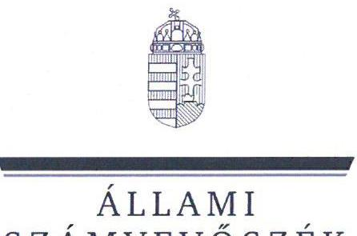
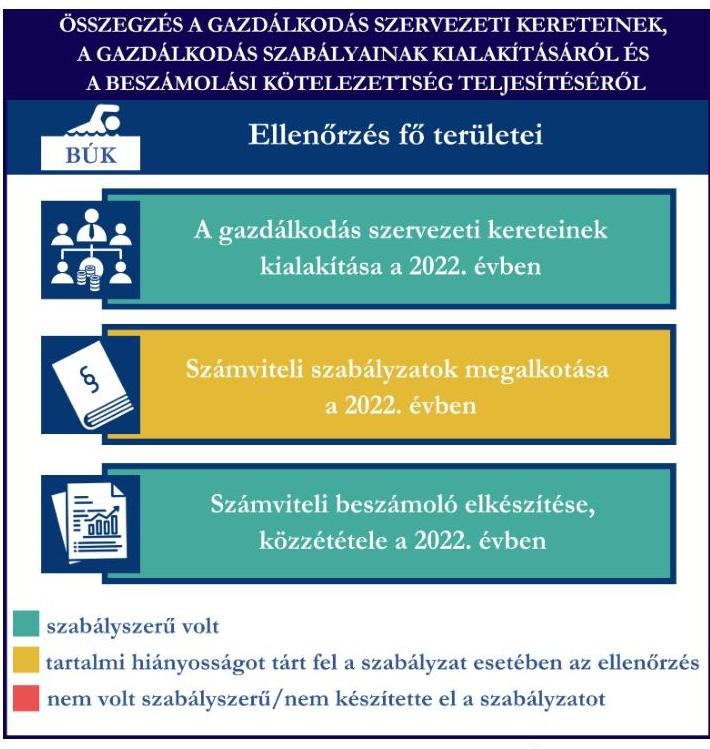
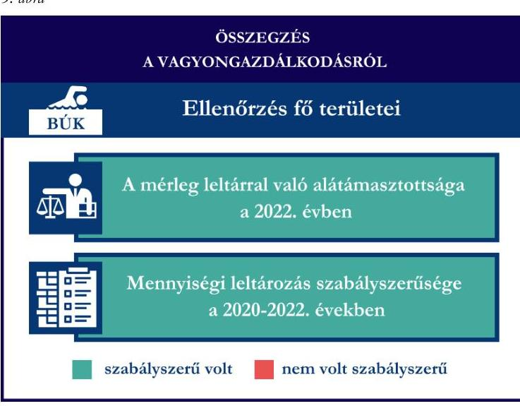
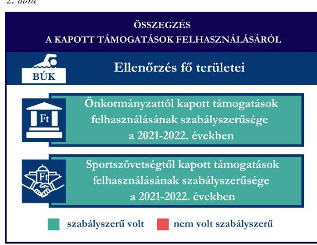

# JELENTÉS 

Támogatásban részesülő sportszövetségek és sportegyesületek gazdálkodásának ellenőrzése

Balaton Úszó Klub

2024.

---

ÁLLAMI
SZÁMVEVÔSZÉK

# JELENTÉS 

## Támogatásban részesülő sportszövetségek és sportegyesületek gazdálkodásának ellenőrzése

Balaton Úszó Klub

2024.

---

# ELLENŐRZÉSI IGAZGATÓSÁG: 

## ÁLLAMHÁZTARTÁSON KÍVÜLI SZERVEZETEKET ELLENŐRZŐ IGAZGATÓSÁG

## ELLENŐRZÉSI IGAZGATÓ:

## KLINGA LÁSZLÓ igazgató

## ELLENŐRZÉSVEZETŐ:

## KAKAS SÁNDOR ellenőrzésvezető

SALAMIN VIKTOR ellenőrzésvezető

IKTATÓSZÁM: EL-4060-025/2024.
TÉMASZÁM: 2682
ELLENŐRZÉS-AZONOSÍTÓ SZÁM: V1026

---

# TARTALOMJEGYZÉK 

- AZ ELLENŐRZÉS ALAPADATAI ..... 5
- AZ ELLENŐRZÖTT SZERVEZET ..... 7
- ÖSSZEFOGLALÁS ..... 8
- AZ ELLENŐRZÉS FÓKUSZKÉRDÉSEI ..... 10
- MEGÁLLAPÍTÁSOK ..... 11
- JAVASLATOK ..... 14
- MELLÉKLETEK ..... 15
I. sz. melléklet: Értelmező szótár ..... 15
II. sz. melléklet: Az ellenőrzött szervezetek jegyzéke ..... 17
III. sz. melléklet: Ellenőrzési kritériumok ..... 18
- FÜGGELÉK: ÉSZREVÉTELEK ..... 19
- RÖVIDÍTÉSEK JEGYZÉKE ..... 20

---

.

---

# AZ ELLENŐRZÉS ALAPADATAI 

## AZ ELLENŐRZÉS CÉLJA

Az ellenőrzés célja az államháztartásból nyújtott támogatással, vagy az államháztartásból meghatározott célra ingyenesen juttatott vagyon felhasználásával érintett sportszövetségek és sportegyesületek gazdálkodása szabályozottságának, gazdálkodási tevékenységének, ezen belül a beszámolási kötelezettség teljesítésének, a támogatások elkülönített nyilvántartásának, valamint a támogatások felhasználásának ellenőrzése.

## AZ ELLENŐRZÉS TÍPUSA

Szabályszerüségi ellenőrzés.

## AZ ELLENŐRZÖTT IDŐSZAK

Az 1. fókuszkérdés esetében a 2022. év.
A 2. fókuszkérdés vonatkozásában a 2021-2022. évek.
A 3. fókuszkérdés vonatkozásában a 2022. év, a mennyiségi felvétellel történő leltározás dokumentumai tekintetében a 2020-2022. évek.

## AZ ELLENŐRZÉS TÁRGYA

Az ellenőrzés tárgya a támogatásban részesülő sportszövetségek, sportegyesületek gazdálkodása szabályozottságának, gazdálkodási tevékenységén belül a beszámolási kötelezettség teljesítésének, a vagyonnyilvántartásának, a támogatások elkülönített nyilvántartásának, valamint az államháztartási forrásból származó közvetlen vagy közvetett támogatások és a meghatározott célra ingyenesen juttatott vagyon felhasználásának a vizsgálata volt. Az ellenőrzés a támogatások vonatkozásában kiterjedt továbbá a támogató felé történő beszámolási és elszámolási kötelezettségek teljesítésére, az ezekkel kapcsolatos jogszabályi és belső előírások betartására.

Az ellenőrzés kiterjedt minden olyan körülményre és adatra, amely az ÁSZ ${ }^{1}$ jogszabályban meghatározott feladatainak teljesítéséhez, valamint az ellenőrzés program végrehajtása során felmerülő újabb összefüggések feltárásához szükséges.

## AZ ELLENŐRZÉS JOGALAPJA

Az ellenőrzés jogszabályi alapját az ÁSZ tv. ${ }^{2} 1 . \int(3)$ bekezdése, az 5. $\int(3)$ bekezdése, valamint a Civil tv. ${ }^{3} 47 . \int$ előírásai képezték.

---

# AZ ELLENŐRZÉS MÓDSZERE 

Az ellenőrzést a nemzetközi standardokat irányadónak tekintve az ellenőrzési program szempontjai, az ellenőrzött időszakban hatályos jogszabályok, az ellenőrzés általános szakmai szabályai, az ellenőrzésre irányadó ÁSZ módszertanok figyelembevételével végezte az ÁSZ.

Az ellenőrzési kérdések megválaszolásához szükséges bizonyítékok megszerzése az ellenőrzött szervezet által rendelkezésre bocsátott dokumentumokra, adatokra alapozva kérdésfeltevés (információkérés), interjú, mintavételezés útján történt.

Az ellenőrzési bizonyítékként felhasználható adatforrások közé tartoztak egyrészt az ellenőrzés során az ellenőrzött szervezettől bekért dokumentumok, másrészt adatforrás lehetett minden további az ellenőrzés folyamán feltárt, az ellenőrzés szempontjából információt tartalmazó dokumentum.

A támogatásokkal, azok felhasználásával kapcsolatos kötelezettségek vizsgálatára mintavételi eljárások kerültek alkalmazásra. Támogatás-típusok szerint nagyságrend alapján 1-3 darab támogatás került részletes vizsgálat alá. Ezen támogatások felhasználásának szabályszerűsége támogatásonként kockázatértékelés alapján kiválasztott mintatételekkel került ellenőrzésre. A kiválasztott támogatási szerződésekhez kapcsolódó elszámolásokból 30-30 db mintatétel került ellenőrzésre, ahol az elszámolás nem érte el a 30 db -ot, ott tételes ellenőrzésre került sor. Ezen felül a vagyongazdálkodás szabályszerűségének ellenőrzéséhez is kockázatalapú mintavétel kapcsolódott. A támogatások felhasználása és a vagyongazdálkodás területén a minták ellenőrzése kiterjedt a könyvvezetési kötelezettség vizsgálatára is. A 2022. évben állományban lévő eszközök közül 30 db került kiválasztásra, ahol az állományban lévő eszközök száma nem érte el a 30 db -ot, ott tételes ellenőrzésre került sor azok nyilvántartásának, elszámolásának szabályszerűsége ellenőrzése céljából. Az ellenőrzésben nem statisztikai mintavételre került sor, ezért nem történt kivetítés a teljes sokaságra, a megállapításokat az ellenőrzött mintatételekre vonatkozóan fogalmaztuk meg.

---

# AZ ELLENŐRZÖTT SZERVEZET

## BALATON ÜSZÓ KLUB

A veszprémi székhelyű Balaton Úszó Klub célja a vízi sportok, így különösen az úszás megkedveltetése és az úszni tanulás lehetőségének biztosítása - oktatás - a lakosság széles körére, kiemelten a fiatalokra vonatkozóan. A BÚK ${ }^{4}$ tevékenységei közé tartozik az úszás-, szinkronúszás-, triatlon-, vízilabda oktatás, ezen sportágak népszerűsítése, képességek erősítése, fejlesztése, egészséges életszemlélet kialakítása a fiatalok körében, sportszerű életmódra, példamutató magatartásra, közösségi életre nevelés, valamint felkészítés arra, hogy egy hosszabb távot is mindenki meg tudjon úszva tenni, át tudja úszni a Balatont. A BÚK a 2022. évben könyvvizsgálatra, felügyelőbizottság létrehozására nem volt kötelezett. A BÚK a beszámoló adatai alapján a 2022. évben az alaptevékenységén felül vállalkozási tevékenységet nem végzett. A BÚK által 2021-2022. években igénybe vett államháztartási forrásból származó támogatásokat az 1. táblázat foglalja össze.

1. táblázat

|  A BÚK ÁLTAL IGÉNYBE VETT TÁMOGATÁSOK (ADATOK M FT-BAN) |  |   |
| --- | --- | --- |
|   | 2021. FV | 2022. FV  |
|  Központi költségvetési támogatás | 0 | 0  |
|  Helyi önkormányzati támogatás | 6,7 | 8,0  |
|  Magyar Úszó Szövetségtől kapott támogatás | 12,0 | 14,0  |

Forrás: Az ellenőrzött szervezet beszámolói és fökönyvi adatai alapján ÁSZ saját szerkesztés

---

# ÖSSZEFOGLALÁS 

Magyarország Alaptörvényének XX. cikke kimondja, hogy mindenkinek joga van a testi és lelki egészséghez, melynek érvényesülését Magyarország többek között a sportolás és a rendszeres testedzés támogatásával segíti elő. Az Országgyűlés a Sport tv. ${ }^{3}$-ben kinyilvánította, hogy a nemzet közössége a test művelését, a sportot, a nemzet alapértékének, kívánatos célnak tekinti. A sport a közjó része. Erősíti a közösség tagjainak egymáshoz tartozását, miként az egyén testi és lelki egészségét.

A sportegyesületek, sportszövetségek múködésükre és szakmai tevékenységük ellátására költségvetési támogatásban, önkormányzati támogatásban, ingyenes vagyonjuttatásban, valamint látvány-csapatsport támogatásban részesülhetnek, amelyekre fokozott figyelem irányul.

A társadalom részéről jogosan felmerülő elvárás, hogy a közpénzeket kezelő, azzal gazdálkodó szervezetek múködéséről, tevékenységéről átfogó képet kapjon, a közpénzek rendeltetésszerủ és átlátható módon történő felhasználásának értékelésére időről-időre sor kerüljön az ellenőrzések keretében.
1. ábra

A BÚK tekintetében a gazdálkodási szabályok kialakítása egy szabályzat kivételével, a könyvvezetési és beszámolási kötelezettség teljesítése szabályszerű volt a 2022. évben.

A BÚK a könyvviteli szolgáltatás személyi feltételeit biztosította. A jogszabályban előírt számviteli szabályzatokat a BÚK elkészítette, azonban a pénzkezelési szabályzata hiányos volt a 2022-es évben.

A könyvvezetés formája a 2022. évben megfelelt a jogszabályi előírásoknak. A 2022. évi számviteli beszámolóját és közhasznúsági mellékletét - a kiegészítő melléklet tartalmi hiányossága mellett az előírásoknak megfelelően a BÚK elkészítette. A BÚK a 2022. évre vonatkozó beszámoló közzétételét az jogszabályban előírt határidőn túl teljesítette.

A gazdálkodási szabályok kialakítása és a beszámolási kötelezettség ellenőrzésének összegzését az 1. ábra tartalmazza.

---

A BÚK a 2021-2022. években az ellenőrzött támogatásokat a támogatási célnak megfelelően használta fel. A támogatások felhasználásáról a jogszabályban előírt, támogatásonként elkülönített nyilvántartást a könyvviteli rendszerében nem vezette.

A kapott támogatások felhasználásának ellenőrzéséről az összegzést a 2. ábra tartalmazza.

Forrás: Az ellenrzött szervezet dokumentumai alapján ÁSZ saját szerkesztés
2. ábra

Forrás: Az ellenrzött szervezet dokumentumai alapján ÁSZ saját szerkesztés
A BÚK 2022. évi vagyongazdálkodása az ellenőrzött tételek vonatkozásában szabályszerű volt. A BÚK a jogszabályoknak megfelelően gondoskodott a saját vagyona nyilvántartásáról és a számviteli beszámolóban történő megjelenítéséről. A 2022. évi beszámolójának mérlegtételeit leltárral alátámasztotta, az előírt mennyiségi felvétellel történő leltározást elvégezte.

A vagyongazdálkodás ellenőrzésének összegzését a 3. ábra tartalmazza.

---

# AZ ELLENŐRZÉS FÓKUSZKÉRDÉSEI 

1.     - A gazdálkodási szabályok kialakítása, a könyvvezetési- és beszámolási kötelezettség teljesítése szabályszerű volt-e?
2.     - A kapott támogatások felhasználása szabályszerű volt-e?
3.     - Az ellenőrzött szervezet vagyongazdálkodása szabályszerű volt-e?

---

# MEGÁLLAPÍTÁSOK 

## 1. A gazdálkodási szabályok kialakítása, a könyvvezetési- és beszámolási kötelezettség teljesítése szabályszerű volt-e?

Összegző megállapítás A BÚK-nál a 2022. évben a gazdálkodási szabályok egy szabályzat tartalmi hiányossága mellett a jogszabályban előírtak szerint kialakításra kerültek. A BÚK a 2022. évre vonatkozóan a jogszabályban előírtak szerint a beszámolási kötelezettségét teljesítette, a beszámoló közzétételét az előírt határidőn túl teljesítette.

A BÚK a 2022. évben a Számv. tv. ${ }^{6}$, valamint a Civilszr. ${ }^{7}$ előírásaiban foglaltaknak megfelelően gondoskodott a könyvviteli szolgáltatás személyi feltételeinek teljesüléséről.
A BÚK 2022-ben rendelkezett a Számv. tv-ben előírt számviteli politikával, azon belül az eszközök és a források leltárkészítési és leltározási szabályzatával, az eszközök és a források értékelési szabályzatával, pénzkezelési szabályzattal, valamint számlarenddel, amelyek - a pénzkezelési szabályzat kivételével - az ellenőrzött tartalmi kritériumoknak megfeleltek. A BÚK 2022. évben hatályos pénzkezelési szabályzatban a Számv. tv. 14. § (8) bekezdésben foglaltak ellenére nem rögzítette a készpénzállomány ellenőrzésének gyakoriságát.
A BÚK a Számv. tv.-ben, Civil. tv.-ben, valamint a Civilszr.-ben előírtak szerinti könyvvitelt vezetett. A BÚK 2022-ben a könyvviteli nyilvántartását úgy vezette, hogy a Számv. tv., valamint a Civilszr. előírásainak megfelelően a számviteli beszámolóban az egyéb bevételeken belül részletezni tudta a kapott támogatások összegeit. A BÚK a 2022. évben a vállalkozási és az alaptevékenység bevételeinek és költségeinek Civilszr. előírása szerinti elkülönítését a könyviteli rendszerében kialakította. A BÚK a Számv. tv. és a Civilszr. előírásai alapján 2022-ben a könyvvezetési rendszerét tovább részletezte úgy, hogy a tagdíjakat a beszámolóban az egyéb bevételeken belül elkülönítve kimutathassa.
A BÚK a Civil tv., valamint a Számv. tv. szerint a 2022. évre vonatkozó könyvvitellel alátámasztott számviteli beszámolóját, továbbá a Civil. tv.-ben előírtak alapján a közhasznúsági mellékletét elkészítette. A számviteli beszámoló részét képező kiegészítő melléklet a BÚK számviteli politikája III. fejezetben, valamint a Számv. tv. 96. § (4) bekezdésében előírt adatokat nem tartalmazta hiánytalanul, mert nem tartalmazta a beszámoló összeállításánál alkalmazott szabályrendszert, annak főbb jellemzőit, az alkalmazott értékelési eljárásokat és az értékcsökkenés elszámolásának számviteli politikában meghatározott módszerét, elszámolásának gyakoriságát, a tárgyévben foglalkoztatott munkavállalók átlagos létszámát.
A BÚK 2022. évi számviteli beszámolóját, valamint közhasznúsági mellékletét a Civil. tv. előírása alapján közzé tette, letétbe helyezte, azonban a közzététel, letétbe helyezés a Civil tv. 30. § (1) bekezdésében foglaltak ellenére a mérlegkészítés fordulónapját követő ötödik hónap utolsó napját követően, 2023. szeptember 13-án teljesült.

---

# 2. A kapott támogatások felhasználása szabályszerű volt-e? 

Összegző megállapítás A BÚK a 2021-2022. években az ellenőrzött támogatásokat a támogatási célnak megfelelően használta fel. A támogatások felhasználását nem tartotta elkülönítetten nyilván a könyvviteli rendszerében.

A BÚK az ellenőrzött támogatási szerződésekben foglaltak alapján, az önkormányzati költségvetésből kapott támogatás bevételeit a Civil tv. előírásai alapján a 2021-2022. években elkülönítette a számviteli rendszerében. A BÚK a 2021-2022. években a Számv. tv. 161/A. § (2) bekezdésében foglaltak ellenére a Civil tv. 20. § (4) bekezdésében előírt alapcél szerinti tevékenysége költségei, ráfordításai ellentételezésére az önkormányzattól kapott támogatásokról nem vezetett olyan elkülönített számviteli nyilvántartást, amelynek alapján támogatásonként megállapítható és ellenőrizhető lett volna a kapott támogatás felhasználása. Ez alapján az egyes támogatások felhasználásáról készített elszámolások könyvviteli nyilvántartással, az abban szereplő támogatásonkénti elkülönített adatokkal nem voltak alátámasztottak.
A BÚK a támogatási szerződésben és az alapján az Áht.-ban ${ }^{8}$ foglalt előírások alapján teljesítette a beszámolási kötelezettségét az önkormányzati támogatás rendeltetésszerű felhasználásáról a 2021-2022. években. A BÚK a 2021-2022. években elszámolt önkormányzati támogatások ellenőrzött tételeit a Számv. tv.-ben előírtaknak megfelelő, szabályszerű számviteli bizonylattal alátámasztotta.
A BÚK a központi költségvetésből a MÚSZ9-on keresztül a számára juttatott sportcélú ellenőrzött támogatás bevételeit a Civil tv. alapján a számviteli rendszerében elkülönítetten kezelte. A BÚK a MÚSZon keresztül számára juttatott támogatások felhasználását a 2021-2022. években a Civil. tv. 20. § (4) bekezdésben és a Számv. tv. 161/A. § (2) bekezdésében előírtak ellenére a számviteli rendszerében nem tartotta nyilván elkülönítetten. A központi költségvetésből a MÚSZ-on keresztül számára juttatott sportcélú ellenőrzött támogatás felhasználásáról az Áht. és a támogatási szerződésben foglaltak szerint beszámolt a támogató felé. A BÚK a 2021-2022. években elszámolt támogatások ellenőrzött tételeit a Számv. tv.-ben előírtaknak megfelelő, szabályszerű számviteli bizonylattal alátámasztotta.
A Számv. tv. 44. § (2) bekezdésében foglaltak ellenére a 2021-2022. években a BÚK a támogatásból megvalósult tárgyi eszköz beszerzések tekintetében nem határolta el (passzív időbeli elhatárolásként) a költségek, ráfordítások ellentételezésére - visszafizetési kötelezettség nélkül - kapott, pénzügyileg rendezett, egyéb bevételként elszámolt támogatás összegéből az üzleti évben költséggel, ráfordítással nem ellentételezett összeget.

---

# 3. Az ellenőrzött szervezet vagyongazdálkodása szabályszerű volt-e? 

Összegző megállapítás A 2022. évben a BÚK vagyongazdálkodása az ellenőrzött tételek vonatkozásában szabályszerű volt, a 2022. évi beszámolójának mérlegtételeit az előírtak alapján leltárral alátámasztotta.

A BÚK a 2022. évi beszámolójának mérlegtételeit a Számv. tv. alapján leltárral alátámasztotta. A BÚK 2022-ben a Számv. tv.-ben és a leltározási szabályzatában előírt mennyiségi felvétellel elvégzett leltározást elvégezte. A BÚK-nál a 2022. évben a nyilvántartott tárgyi eszközök tételes ellenőrzésére került sor. Az ellenőrzött tárgyi eszközök bekerülési értékét alátámasztó számviteli bizonylatok a Számv. tv.-ben előírtaknak megfelelően rendelkezésre álltak. Az ellenőrzött tárgyi eszközök számviteli besorolása, értékcsökkenés elszámolása megfelelt a Számv. tv. előírásainak, az üzembe helyezés tényét a Számv. tv.ben előírtak alapján dokumentálta

---

# JAVASLATOK 

Az ÁSZ tv. 33. § (1) bekezdésében foglaltak értelmében az ellenőrzött szervezet vezetője köteles a jelentésben foglalt megállapításokhoz kapcsolódó intézkedési tervet összeállítani és azt a jelentés kézhezvételétől számított 30 napon belül az ÁSZ részére megküldeni. Amennyiben az ellenőrzött szervezet vezetője nem küldi meg határidőben az intézkedési tervet, vagy továbbra sem elfogadható intézkedési tervet küld, az Állami Számvevőszék elnöke az ÁSZ tv. 33. § (3) bekezdése a) és b) pontjaiban foglaltakat érvényesítheti.

## A BALATON ÚSZÓ KLUB ELNÖKÉNEK

1. Gondoskodjon a Számv. tv. 14. § (8) bekezdésben foglaltaknak megfelelő pénzkezelési szabályzat elkészitéséről.
2. Gondoskodjon a számviteli beszámoló részét képező kiegészítő melléklet tartalmi megfelelőségéről a Számv. tv. 96. § (4) bekezdésében és a hatályos számviteli politikában előírtak szerint, valamint a számviteli beszámoló Civil tv. 30. § (1) bekezdésében előírt határidőn belüli közzétételére, letétbe helyezésére.
3. Gondoskodjon az alapcél szerinti tevékenysége költségei, ráfordításai ellentételezésére kapott támogatások elkülönített számviteli nyilvántartásának vezetéséről, amely alapján támogatásonként megállapítható és ellenőrizhető a kapott támogatás felhasználása, a Civil tv. 20. § (4) és a Számv. tv. 161/A. § (2) bekezdés előírásai alapján.
4. Gondoskodjon a költségek, ráfordítások ellentételezésére - visszafizetési kötelezettség nélkül - kapott, pénzügyileg rendezett, egyéb bevételként elszámolt támogatás összegéből az üzleti évben költséggel, ráfordítással nem ellentételezett összeg időbeli elhatárolásáról a számviteli nyilvántartásaiban, a Számv. tv. 44. § (2) bekezdésben foglaltaknak megfelelően.

---

# MELLÉKLETEK 

## I. SZ. MELLÉKLET: ÉRTELMEZŐ SZÓTÁR

Civil szervezet

Egyesület

Költségvetési támogatás

Közhasznú szervezet

Közhasznú tevékenység

Országos sportági szakszövetség

Sportági szövetség

A civil társaság; a Magyarországon nyilvántartásba vett egyesület - a párt, a szakszervezet és a kölcsönös biztosító egyesület kivételével és a közalapítvány és a pártalapítvány kivételével - az alapítvány. (Forrás: Civil tv. 2. §6. pont a)-c) alpontjai)
Az egyesület a tagok közös, tartós, alapszabályban meghatározott céljának folyamatos megvalósítására létesített, nyilvántartott tagsággal rendelkező jogi személy. (Forrás: Ptk. ${ }^{10}$ 3:63. § (1) bekezdés)
A Számv. tv. szempontjából egyéb szervezet. (Számv. tv. 3. § (1) bekezdés 4. pont a) alpontja)
A társadalombiztosítás pénzügyi alapjai kivételével az államháztartás központi alrendszeréből ellenérték nélkül, pénzben nyújtott támogatások. (Forrás: Áht. 1. § 14. pont)
Közhasznú szervezetté minősíthető a Magyarországon nyilvántartásba vett közhasznú tevékenységet végző szervezet, amely a társadalom és az egyén közös szükségleteinek kielégítéséhez megfelelő erőforrásokkal rendelkezik, továbbá amelynek megfelelő társadalmi támogatottsága kimutatható, és amely:
a) civil szervezet (ide nem értve a civil társaságot), vagy
b) olyan egyéb szervezet, amelyre vonatkozóan a közhasznú jogállás megszerzését törvény lehetővé teszi. (Forrás: Civil tv. 32. § (1) bekezdés)
Minden olyan tevékenység, amely a létesítő okiratban megjelölt közfeladat teljesítését közvetlenül vagy közvetve szolgálja, ezzel hozzájárulva a társadalom és az egyén közös szükségleteinek kielégítéséhez. (Forrás: Civil tv. 2. § 20. pont)
Olyan sportszövetség, amely sportágában kizárólagos jelleggel az e törvényben, valamint más jogszabályokban meghatározott feladatokat lát el és e törvényben megállapított különleges jogosítványokat gyakorol. Olyan sportágban hozható létre, amelyet vagy a Nemzetközi Olimpiai Bizottság elismert, vagy amely sportág nemzetközi szövetségét felvették a Nemzetközi Sportszövetségek Szövetségébe (GAISF). (Forrás: Sport tv. 20. § (1), (4) bekezdés)
A Civil. tv. és a Ptk. előírásai alapján - a Sport tv.-ben meghatározott eltérésekkel - múködő szövetség, amelynek tagjai kizárólag sportszervezetek lehetnek. Sportági szövetség országos jelleggel is múködhet. Egy sportágban csak egy országos sportági szövetség múködhet. Törvényi feltételek teljesülése esetén szakszövetségi feladatokat is elláthat. (Forrás: Sport tv. 28. §)

---

Sportegyesület

Sportegyesületeknek, sportszövetségeknek nyújtott költségvetési támogatás

Sportszövetség

Sporttevékenység

A Civil. tv. és a Ptk. szabályai szerint múködő olyan egyesület, amelynek alaptevékenysége a sporttevékenység szervezése, valamint a sporttevékenység feltételeinek megteremtése. A sportegyesületek a Sport. tv. 15. § (1) bekezdésében meghatározott sportszervezetek körébe tartoznak. A sportegyesületeken kívül sportszervezet még a sportvállalkozás, a sportiskola, valamint az utánpótlás-nevelés fejlesztését végző alapítvány. (Forrás: Sport tv. 16. § (1) bekezdés)
Az állami sport célú támogatások felhasználásáról és elosztásáról szóló 474/2016. (XII. 27.) Kormány rendelet ${ }^{11}$ és a 27/2013. (III. 29.) EMMI rendelet ${ }^{12}$ 1. $\int$-ában meghatározott fejezeti kezelésű előirányzatokból nyújtott támogatás.
Meghatározott sporttevékenységek körében a sportversenyek szervezésére, a tagok érdekvédelmére és a részükre való szolgáltatásokra, valamint a nemzetközi kapcsolatok lebonyolítására létrehozott, jogi személyiséggel és önkormányzattal rendelkező, a Civil. tv. és a Ptk. alapján - az e törvényben foglalt eltérésekkel - különös formában múködő egyesületek. A Sport tv. 19. § (3) bekezdése szerint a sportszövetségeknek az alábbi típusai léteznek: országos sportági szakszövetségek, sportági szövetségek, szabadidősport szövetségek, fogyatékosok sportszövetségei, diák- és egyetemi-főiskolai sport sportszövetségei, nemzetközi sportszövetségek. (Forrás: Sport tv. 19. $\int(1),(3)$ bekezdés)
Meghatározott szabályok szerint, a szabadidő eltöltéseként kötetlenül vagy szervezett formában, illetve versenyszerűen végzett testedzés vagy szellemi sportágban kifejtett tevékenység, amely a fizikai erőnlét és a szellemi teljesítőképesség megtartását, fejlesztését szolgálja. (Forrás: Sport tv. 1. § (2) bekezdés)

---

II. SZ. MELLÉKLET: AZ ELLENŐRZÖTT SZERVEZETEK JEGYZÉKE

| ELLENŐRZÖTT SZERVEZET NEVE | ELLENŐRZÖTT SZERVEZET SZÉKHELYE |
| :-- | :-- |
| Balaton Úszó Klub | 8200 Veszprém, Veszprémvölgyi u. 3. |

---

# III. SZ. MELLÉKLET: ELLENŐRZÉSI KRITÉRIUMOK 

## FOKUSZKÉRDÉS

## 1. fókuszkérdés:

A gazdálkodási szabályok kialakítása, a könyvvezetési és beszámolási kötelezettség teljesítése szabályszerű volt-e?

## 2. fókuszkérdés:

A kapott támogatások felhasználása szabályszerű volt-e?

## 3. fókuszkérdés:

Az ellenőrzött szervezet vagyongazdálkodása szabályszerű volt-e?

## ÉLLENŐRZÉSI KRITÉRIUMOK

Számv. tv. 14. § (3) bekezdés, (5) bekezdés a), b), d) pont, (8) bekezdés, (11) bekezdés, 69. § (3) bekezdés, 90. § (3) bekezdés c) pont, 96. § (4) bekezdés, 161. § (1) bekezdés, (2) bekezdés a)-d) pont, (3)-(4) bekezdés, 161/A. $\S$ (2) bekezdés, 165. $\$ (2) bekezdés
Civilszr. 7. § (1) bekezdés, (4) bekezdés b), c) pont, 8. § (2), (3) bekezdés, 9. § (4), (5), (8) bekezdés, 12. § (4), (5) bekezdés, 15. § (1) bekezdés a), b) pont, 16. § (1) bekezdés, 24. § (2) bekezdés

Ptk. 3:26. § (1) bekezdés, 3:27. § (1) bekezdés, 3:82. § (1) bekezdés,

Civil tv. 28.§ (1) bekezdés, 29. § (2) bekezdés c) pont, (3), (6), (7) bekezdés, 30. § (1)-(4) bekezdés 40. § (1), (2) bekezdés, 41. § (1) bekezdés

Sport tv. 23. § (1) bekezdés f) pont
Számv. tv. 44. § (2) bekezdés, 93. § (3) bekezdés, 159. §, 161/A. $\int$ (2) bekezdés, 165. § (2) bekezdés, 167. § (1) bekezdés a), d), e), h) pont

Civil tv. 20.§ (2) bekezdés a) pont, (3) bekezdés a), c) pont, (4) bekezdés, 29. § (4), (5) bekezdés
Civilszr. 24. § (2) bekezdés
27/2013. (III.29.) EMMI rend. 18. § (2) bekezdés
474/2016. (XII. 27.) Korm. rend. 22. § (2) bekezdés, 24. § (2) bekezdés
Áht. 53. §, Ávr. ${ }^{13}$ 92. §, 93. § (2)-(4) bekezdések
Ptk. 3:63. § (4) bekezdés
Számv. tv. 3. § (3) bekezdés 3. pont, 15. § (3) bekezdés, 46. § (3), (4) bekezdés, 47-51. §, 52. § (1)-(7) bekezdés, 69. § (1)-(3) bekezdések, 165. § (2) bekezdés, 169. § (2) bekezdés

---

# FÜGGELÉK: ÉSZREVÉTELEK 

A jelentéstervezetet a Számvevőszék 15 napos észrevételezésre megküldte az ellenőrzött szervezet vezetőjének az ÁSZ tv. 29. §* (1) bekezdése előírásának megfelelően.

A Balaton Úszó Klub elnöke a jelentéstervezetre nem tett észrevételt.

[^0]
[^0]:    * 29. § (1) Az Állami Számvevőszék az ellenőrzési megállapításait megküldi az ellenőrzött szervezet vezetőjének vagy az általa megbízott személynek, és annak, akinek személyes felelősségét állapította meg.
    (2) Az ellenőrzött szervezet vezetője és a felelősként megjelölt személy az ellenőrzés megállapításaira tizenöt napon belül írásban észrevételt tehet.
    (3) Az Állami Számvevőszék az észrevételre a beérkezésétől számított harminc napon belül írásban válaszol. A figyelembe nem vett észrevételeket köteles a jelentésben feltüntetni, és megindokolni, hogy azokat miért nem fogadta el.

---

# RÖVIDÍTÉSEK JEGYZÉKE 

${ }^{1}$ ÁSZ
${ }^{2}$ ÁSZ tv.
${ }^{3}$ Civil tv.
${ }^{4}$ BÚK
${ }^{5}$ Sport tv.
${ }^{6}$ Számv. tv.
${ }^{7}$ Civilszr.
${ }^{8}$ Áht.
${ }^{9}$ MÚSZ
${ }^{10}$ Ptk.
${ }^{11} 474 / 2016$. (XII.27.) Korm. rendelet
${ }^{12}$ 27/2013. (III.29.) EMMI rendelet
${ }^{13}$ Ávr.

Állami Számvevőszék
2011. évi LXVI. törvény az Állami Számvevőszékről
2011. évi CLXXV. törvény az egyesülési jogról, a közhasznú jogállásról, valamint a civil szervezetek müködéséről és támogatásáról
Balaton Úszó Klub
2004. évi I. törvény a sportról
2000. évi C. törvény a számvitelről
479/2016. (XII. 28.) Korm. rendelet a számviteli törvény szerinti egyes egyéb szervezetek beszámoló készítési és könyvvezetési kötelezettségének sajátosságairól
2011. évi CXCV. törvény az államháztartásról

Magyar Úszó Szövetség
2013. évi V. törvény a Polgári Törvénykönyvről
474/2016. (XII. 27.) Korm. rendelet az állami sport célú támogatások felhasználásáról és elosztásáról
27/2013. (III. 29.) EMMI rendelet az állami sport célú támogatások felhasználásáról és elosztásáról
368/2011. (XII. 31.) Korm. rendelet az államháztartásról szóló törvény végrehajtásáról

---

1052 Budapest, Apáczai Csere János u. 10. | 1364 Budapest 4., Pf. 54
www.asz.hu | szamvevoszek@asz.hu
telefon: +36 14849100