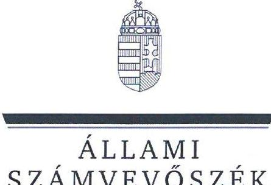
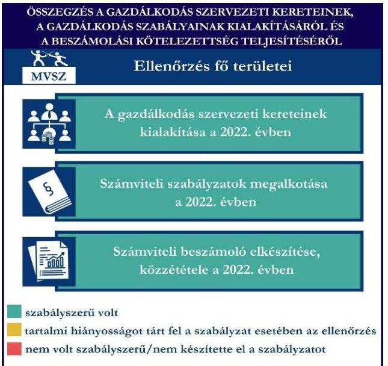
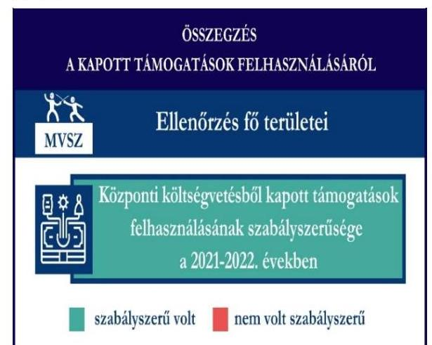
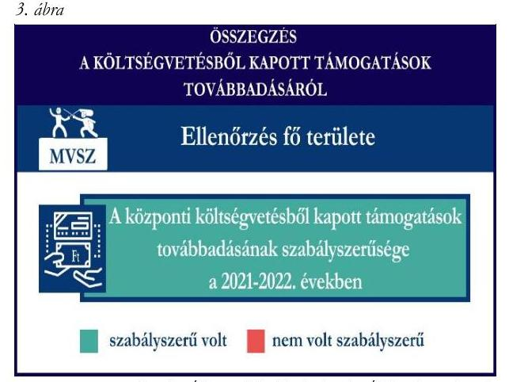
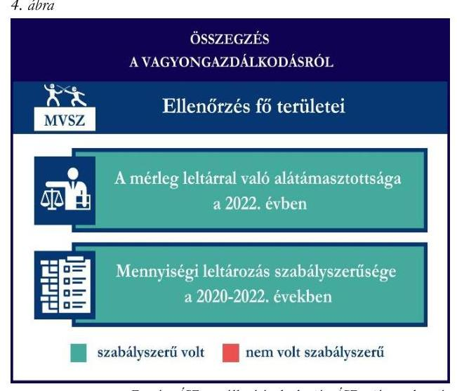
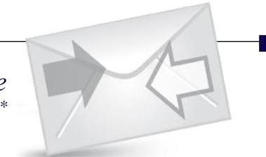

# JELENTÉS 

Támogatásban részesülő sportszövetségek és sportegyesületek gazdálkodásának ellenőrzése

Magyar Vívó Szövetség

2024.

---

ÁLLAMI
SZÁMVEVŐSZÉK

# JELENTÉS 

## Támogatásban részesülő sportszövetségek és sportegyesületek gazdálkodásának ellenőrzése

Magyar Vívó Szövetség

2024.

---

# ELLENŐRZÉSI IGAZGATÓSÁG: 

## ÁLLAMHÁZTARTÁSON KÍVÜLI SZERVEZETEKET ELLENŐRZŐ IGAZGATÓSÁG

## ELLENŐRZÉSI IGAZGATÓ:

## KLINGA LÁSZLÓ igazgató

## ELLENŐRZÉSVEZETŐ:

Jelentéseink az interneten a www.asz.hu címen olvashatók.

## HOFMEISTER LÁSZLÓ ellenőrzésvezető

IKTATÓSZÁM: EL-4060-019/2024.
TÉMASZÁM: 2682
ELLENŐRZÉS-AZONOSÍTÓ SZÁM: V1026

---

# TARTALOMJEGYZÉK 

AZ ELLENŐRZÉS ALAPADATAI ..... 5
AZ ELLENŐRZÖTT SZERVEZET ..... 7
ÖSSZEFOGLALÁS ..... 8
AZ ELLENŐRZÉS FÓKUSZKÉRDÉSEI ..... 10
MEGÁLLAPÍTÁSOK ..... 11
MELLÉKLETEK ..... 14
I. sz. melléklet: Értelmező szótár ..... 14
II. sz. melléklet: Ellenőrzési kritériumok ..... 16
FÜGGELÉK: ÉSZREVÉTELEK ..... 17
RÖVIDÍTÉSEK JEGYZÉKE ..... 18

---

.

---

# AZ ELLENŐRZÉS ALAPADATAI 

## AZ ELLENŐRZÉS CÉLJA

Az ellenőrzés célja az államháztartásból nyújtott támogatással, vagy az államháztartásból meghatározott célra ingyenesen juttatott vagyon felhasználásával érintett sportszövetségek és sportegyesületek gazdálkodása szabályozottságának, gazdálkodási tevékenységének, ezen belül a beszámolási kötelezettség teljesítésének, a támogatások elkülönített nyilvántartásának, valamint a támogatások felhasználásának ellenőrzése.

## AZ ELLENŐRZÉS TÍPUSA

Szabályszerüségi ellenőrzés.

## AZ ELLENŐRZÖTT IDŐSZAK

Az 1. fókuszkérdés esetében a 2022. év.
A 2-3. fókuszkérdés vonatkozásában a 2021-2022. évek.
A 4. fókuszkérdés vonatkozásában a 2022. év, a mennyiségi felvétellel történő leltározás dokumentumai tekintetében a 2020-2022. évek.

## AZ ELLENŐRZÉS TÁRGYA

Az ellenőrzés tárgya a támogatásban részesülő sportszövetségek, sportegyesületek gazdálkodása szabályozottságának, gazdálkodási tevékenységén belül a beszámolási kötelezettség teljesítésének, a vagyonnyilvántartásának, a támogatások elkülönített nyilvántartásának, valamint az államháztartási forrásból származó közvetlen vagy közvetett támogatások és a meghatározott célra ingyenesen juttatott vagyon felhasználásának a vizsgálata volt. Az ellenőrzés a támogatások vonatkozásában kiterjedt továbbá a támogató felé történő beszámolási és elszámolási kötelezettségek teljesítésére, a költségvetésből kapott támogatások továbbadásának szabályszerűségére, az ezekkel kapcsolatos jogszabályi és belső előírások betartására.

Az ellenőrzés kiterjedt minden olyan körülményre és adatra, amely az ÁSZ ${ }^{1}$ jogszabályban meghatározott feladatainak teljesítéséhez, valamint az ellenőrzési program végrehajtása során felmerülő újabb összefüggések feltárásához szükséges.

## AZ ELLENŐRZÉS JOGALAPJA

Az ellenőrzés jogszabályi alapját az ÁSZ tv. ${ }^{2} 1 . \int(3)$ bekezdése, az 5. $\int(3)$ bekezdése, valamint a Civil tv. ${ }^{3} 47 . \int$ előírásai képezték.

---

# AZ ELLENŐRZÉS MÓDSZERE 

Az ellenőrzést a nemzetközi standardokat irányadónak tekintve az ellenőrzési program szempontjai, az ellenőrzött időszakban hatályos jogszabályok, az ellenőrzés általános szakmai szabályai, az ellenőrzésre irányadó ÁSZ módszertanok figyelembevételével végezte az ÁSZ.

Az ellenőrzési kérdések megválaszolásához szükséges bizonyítékok megszerzése az ellenőrzött szervezet által rendelkezésre bocsátott dokumentumokra, adatokra alapozva kérdésfeltevés (információkérés), interjú, mintavételezés útján történt.

Az ellenőrzési bizonyítékként felhasználható adatforrások közé tartoztak egyrészt az ellenőrzés során az ellenőrzött szervezettől bekért dokumentumok, másrészt adatforrás lehetett minden további, az ellenőrzés folyamán feltárt, az ellenőrzés szempontjából információt tartalmazó dokumentum.

A támogatásokkal, azok felhasználásával, a továbbadott támogatásokkal kapcsolatos kötelezettségek vizsgálatára mintavételi eljárások kerültek alkalmazásra. Támogatás-típusok szerint nagyságrend alapján 1-3 darab támogatás került részletes vizsgálat alá. Ezen támogatások felhasználásának szabályszerűsége támogatásonként kockázatértékelés alapján kiválasztott mintatételekkel került ellenőrzésre. A költségvetésből kapott támogatások továbbadásának szabályszerűsége kilenc elemű minta alapján került ellenőrzésre. Ezen felül a vagyongazdálkodás szabályszerűségének ellenőrzéséhez is kockázatalapú mintavétel kapcsolódott. A támogatások felhasználása és a vagyongazdálkodás területén a minták ellenőrzése - a teljes folyamat szabályszerűségének megítélése nélkül - kiterjedt a könyvvezetési kötelezettség vizsgálatára is. A kiválasztott támogatási szerződésekhez kapcsolódó elszámolásokból 30-30 db mintatétel került ellenőrzésre, ahol a mintatételek száma nem érte el a 30 db -ot, ott tételes ellenőrzésre került sor. A tárgyi eszközök tekintetében 30 db került kiválasztásra a 2022. évben állományban lévő eszközök közül azok nyilvántartásának, elszámolásának szabályszerűsége ellenőrzése céljából. A kiválasztott mintatételek ellenőrzésének eredménye nem került kivetítésre a teljes sokaságra, a megállapítások az adott ellenőrzött mintatételek vonatkozásában kerültek megjelenítésre.

---

# AZ ELLENŐRZÖTT SZERVEZET

## MAGYAR VÍVÓ SZÖVETSÉG

Az MVSZ¹-t a sporttörvényben meghatározott, a vívás sportág feladatainak ellátására, a vívó sportversenyek szervezésére, tagjai érdekvédelmére és a részükre való szolgáltatásokra, valamint a nemzetközi kapcsolatok lebonyolítására hozták létre 1914-ben. Az MVSZ a Magyarországon működő vívó szövetségek, sportszervezetek, sportiskolák és utánpótlás-nevelés fejlesztését végző alapítványok, illetve ezek útján a vívó szakosztályok tevékenységét összehangoló, munkájukat segítő és támogató, önkormányzattal rendelkező országos sportági szakszövetség. Az MVSZ rendelkezett önálló jogi személyiséggel bíró szervezeti egységgel, amely a Budapesti Vívó Szövetség volt. Az MVSZ tagsági létszáma a 100 főt meghaladta.

Az MVSZ jogszabályi előírás alapján az ellenőrzött időszakban könyvvizsgálatra és felügyelőbizottság létrehozására kötelezett volt. A 2022. évi ellenőrzött időszakban az MVSZ az alapcéljai megvalósítása érdekében vállalkozási tevékenységet is végzett. Az OBH⁵ nyilvántartás adatai alapján 2014. szeptember 17-e óta közhasznú jogállással rendelkezett.

A 2021-2022. években az MVSZ által az ellenőrzött időszakban igénybe vett támogatásokat az 1. táblázat mutatja be.

|  AZ MVSZ ÁLTAL IGÉNYBE VETT TÁMOGATÁSOK (ADATOK M FT-BAN) |  |   |
| --- | --- | --- |
|   | 2021. EV | 2022. EV  |
|  Központi költségvetésből | 1 504,6 | 1 245,0  |
|  Helyi önkormányzattól | - | -  |

*Forrás: Az ellenőrzött szervezet főkönyvi adatai alapján ÁSZ saját szerkesztés*

---

# ÖSSZEFOGLALÁS 

Az Alaptörvény ${ }^{6}$ XX. cikke kimondja, hogy mindenkinek joga van a testi és lelki egészséghez, melynek érvényesülését Magyarország többek között a sportolás és a rendszeres testedzés támogatásával segíti elő. Az Országgyűlés ${ }^{7}$ a Sport tv. ${ }^{8}$-ben kinyilvánította, hogy a nemzet közössége a test művelését, a sportot, a nemzet alapértékének, kívánatos célnak tekinti. A sport a közjó része. Erősíti a közösség tagjainak egymáshoz tartozását, miként az egyén testi és lelki egészségét.

A sportegyesületek, sportszövetségek múködésükre és szakmai tevékenységük ellátására költségvetési támogatásban, önkormányzati támogatásban, ingyenes vagyonjuttatásban, valamint látvány-csapatsport támogatásban részesülhetnek, amelyekre fokozott figyelem irányul.

A társadalom részéről jogosan felmerülő elvárás, hogy a közpénzeket kezelő, azzal gazdálkodó szervezetek múködéséről, tevékenységéről átfogó képet kapjon, a közpénzek rendeltetésszerű és átlátható módon történő felhasználásának értékelésére időről-időre sor kerüljön az ellenőrzések keretében.

1. ábra

Forrás: ÁSZ megállapítások alapján ÁSZ saját szerkesztés
értékelését az 1. ábra mutatja be.
Az MVSZ a 2021. és 2022. években a központi költségvetésből kapott támogatásokat az ellenőrzött tételek esetében szabályszerűen használta fel.

A kapott támogatások felhasználásának ellenőrzéséről az összegzést a 2. ábra tartalmazza.
2. ábra

---

A 2021. és 2022. években az MVSZ a központi költségvetésből kapott támogatásokat az ellenőrzött tételek esetében szabályszerűen adta tovább.

A kapott támogatások továbbadásának ellenőrzéséről az összegzést a 3. ábra tartalmazza.

Az MVSZ vagyongazdálkodása a beszámoló leltárral való alátámasztottsága, a tárgyi eszközök üzembe helyezése és értékcsökkenésük elszámolása az ellenőrzött tételek esetében a 2022. évben szabályszerű volt.

A 2022. évre vonatkozó éves beszámoló mérlegét leltárral alátámasztotta, a mérlegben szereplő eszközök háromévente előírt mennyiségi leltározását a 2022. évben elvégezte.

A vagyongazdálkodás ellenőrzésének összegzését a 4. ábra tartalmazza.

---

# AZ ELLENŐRZÉS FÓKUSZKÉRDÉSEI 

1.     - A gazdálkodási szabályok kialakítása, a könyvvezetési- és beszámolási kötelezettség teljesítése szabályszerű volt-e?
2.     - A kapott támogatások felhasználása szabályszerű volt-e?
3.     - A költségvetésből kapott támogatások továbbadása szabályszerűen valósult-e meg?
4.     - Az ellenőrzött szervezet vagyongazdálkodása szabályszerű volt-e?

---

# MEGÁLLAPÍTÁSOK 

## 1. A gazdálkodási szabályok kialakítása, a könyvvezetési- és beszámolási kötelezettség teljesítése szabályszerű volt-e?

Összegző megállapítás Az MVSZ a 2022. évben a gazdálkodásának szervezeti kereteit szabályszerűen alakította ki. Könyvvezetési és beszámolási kötelezettségének teljesítése szabályszerű volt.

A könyvviteli szolgáltatás személyi feltételeinek teljesüléséről az MVSZ a 2022. évben a Számv. tv. ${ }^{9}$ és a Civilszr. ${ }^{10}$ előírásaiban foglaltaknak megfelelően gondoskodott.
Az MVSZ a 2022. évben a Számv. tv.-ben, valamint Civilszr.-ben előírtaknak megfelelően könyvvizsgálót bízott meg a beszámoló felülvizsgálatára.
Az MVSZ a Ptk. ${ }^{11}$ előírásai szerint gondoskodott felügyelőbizottság létrehozásáról, közhasznú jogállására tekintettel a Civil tv.-nek megfelelően a felügyelőbizottság megállapította ügyrendjét.
Az MVSZ a 2022. évben rendelkezett a Számv. tv.-ben előírt számviteli politikával, azon belül az eszközök és a források értékelési szabályzatával, pénzkezelési szabályzattal, az eszközök és a források leltárkészítési és leltározási szabályzatával, amelyek az ellenőrzött tartalmi kritériumoknak megfeleltek. A 2022. évben az MVSZ rendelkezett a Számv. tv.-ben előírt számlarenddel.
A 2022. évben az MVSZ végzett vállalkozási tevékenységet, melynek bevételeit és ráfordításait a könyvvezetése során a Civil tv.-nek megfelelően az alaptevékenységtől elkülönítetten tartotta nyilván és mutatta ki számviteli beszámolójában. A könyvviteli nyilvántartásait a Számv. tv. és a Civilszr. rendelkezéseinek megfelelően úgy alakította ki, hogy a számviteli beszámolóban az egyéb bevételeken belül a tagdíjakat és a kapott támogatások összegét részletezni tudta.
Az MVSZ a Civil tv.-ben, valamint a Számv. tv. előírásai alapján előírt könyvvitellel alátámasztott egyszerűsített éves beszámolóját, továbbá a Civil vhr. ${ }^{12}$-ben előírtak alapján a közhasznúsági mellékletét elkészítette.
A 2022. évi számviteli beszámoló könyvvizsgálóval történő felülvizsgálata a Civil tv.-nek megfelelően megtörtént, a könyvvizsgálói jelentés a számviteli beszámoló közgyűlés általi megtárgyalásakor rendelkezésre állt.
Az MVSZ felügyelőbizottsága megtárgyalta és elfogadásra javasolta a 2022. évi számviteli beszámolót. A 2022. évre vonatkozó számviteli beszámolót az MVSZ közgyűlése a Civil tv.-nek megfelelően jóváhagyta. Az MVSZ a 2022. évi elfogadott számviteli beszámolóját, valamint közhasznúsági mellékletét a Számv. tv.-ben, valamint Civil tv.-ben előírtaknak megfelelően letétbe helyezte, közzétette.

---

# 2. A kapott támogatások felhasználása szabályszerű volt-e? 

## Összegző megállapítás

Az MVSZ a 2021-2022. években kapott támogatásokat az ellenőrzött tételek vonatkozásában szabályszerűen használta fel.

Az MVSZ az ellenőrzött támogatási szerződésekben foglaltak alapján, a központi költségvetésből kapott támogatás bevételeit a Civil tv. előírásai alapján elkülönítette a számviteli rendszerében a 2021-2022. években.
Az MVSZ a 2021-2022. években a Számv. tv.-ben és a Civil tv.-ben előírt alapcél szerinti tevékenysége költségei, ráfordításai ellentételezésére kapott központi költségvetési ellenőrzött támogatásokról vezetett olyan elkülönített számviteli nyilvántartást, amely alapján támogatásonként megállapítható és ellenőrizhető volt a kapott támogatások felhasználása.
Az MVSZ az elszámolásokat előírt formában és tartalommal, a támogatási szerződésben meghatározott határidőig elkészítette a támogató felé, a szakmai beszámolót is mellékelte. A támogató felé benyújtott elszámolásokat alátámasztó számviteli bizonylatok a Számv. tv.-ben foglalt alaki és tartalmi követelményeknek megfeleltek, a támogató felé benyújtott számlák a 474/2016. (XII. 27.) Korm. rendeletben ${ }^{15}$ előírtaknak megfelelően záradékolásra kerültek.

Közhasznú szervezetként a Számv. tv. és a Civil tv. rendelkezéseinek megfelelően a 2021. és 2022. évekre vonatkozó beszámolójának kiegészítő mellékletében bemutatta a támogatási program keretében végleges jelleggel felhasznált összegeket támogatásonként és az üzleti évben végzett főbb tevékenységeket és programokat.

## 3. A költségvetésből kapott támogatások továbbadása szabályszerűen valósult-e meg?

## Összegző megállapítás

Az MVSZ a 2021. és 2022. években a költségvetésből kapott támogatásokat az ellenőrzött tételek vonatkozásában szabályszerűen adta tovább.

A nyilvántartási rendszerét az MVSZ úgy alakította ki, hogy abból a továbbutalási céllal kapott támogatásokkal kapcsolatos információk rendelkezésre álltak. Az MVSZ az egyesületeknek, szakosztályoknak szakmai és múködési támogatásukra a 2021. évben 286,5 M Ft-ot, a 2022. évben $363,9 \mathrm{M}$ Ft támogatást adott tovább a központi költségvetésből számára jutatott sportcélú támogatásokból.
Az MVSZ a 474/2016. (XII. 27.) Korm. rendeletnek megfelelően elszámoltatta a támogatás végső kedvezményezettjét a költségvetési támogatásról az előírt összesített elszámolási táblázattal.
Az MVSZ a Civilszr., valamint a Számv. tv. alapján a továbbutalási céllal kapott támogatást az egyéb bevételek között, a továbbadott támogatásokat a ráfordítások között szerepeltette a könyvviteli rendszerében a 2021-2022. években.
Az MVSZ a 2021. és 2022. évi közhasznúsági mellékletében a Civil tv.-ben előírtaknak megfelelően a cél szerinti juttatások között mutatta ki a továbbadott támogatások összegét.

---

# 4. Az ellenőrzött szervezet vagyongazdálkodása szabályszerű volt-e? 

## Összegző megállapítás A 2022. évben az MVSZ vagyongazdálkodása az ellenőrzött tételek vonatkozásában szabályszerű volt.

Az MVSZ a Számv. tv.-nek megfelelően a 2022. évi beszámolójának mérleg tételeit alátámasztotta szabályszerű leltárral, elvégezte a főkönyvi könyvelés és az analitikus nyilvántartások adatai közötti egyeztetést, valamint a mérlegben szereplő tárgyi eszközök háromévente előírt mennyiségi leltározását a 2022. évre vonatkozóan.

Az MVSZ-nél az ellenőrzött tételek vonatkozásában a tárgyi eszközök bekerülési értékét, az értékcsökkenés elszámolását a Számv. tv. előírásai szerint határozták meg, az üzembe helyezést a tárgyi eszközök vonatkozásában a Számv. tv.-ben előírtak alapján dokumentálták.

---

# MELLÉKLETEK 

## I. SZ. MELLÉKLET: ÉRTELMEZŐ SZÓTÁR

civil szervezet
egyesület
költségvetési támogatás
közhasznú szervezet
közhasznú tevékenység
országos sportági szakszövetség
sportági szövetség

A civil társaság; a Magyarországon nyilvántartásba vett egyesület - a párt, a szakszervezet és a kölcsönös biztosító egyesület kivételével és a közalapítvány és a pártalapítvány kivételével - az alapítvány. (Forrás: Civil tv. 2. §6. pont a) -c) alpontjai)
Az egyesület a tagok közös, tartós, alapszabályban meghatározott céljának folyamatos megvalósítására létesített, nyilvántartott tagsággal rendelkező jogi személy. (Forrás: Ptk. 3:63. § (1) bekezdés)
A Számv. tv. szempontjából egyéb szervezet. (Számv. tv. 3. § (1) bekezdés 4. pont a) alpontja)
A társadalombiztosítás pénzügyi alapjai kivételével az államháztartás központi alrendszeréből ellenérték nélkül, pénzben nyújtott támogatások. (Forrás: Áht. ${ }^{14}$ 1. § 14. pont, ide nem értve az Áht. 1. § 14. pont a) -o) pontjaiban szereplő támogatásokat)

Közhasznú szervezetté minősíthető a Magyarországon nyilvántartásba vett közhasznú tevékenységet végző szervezet, amely a társadalom és az egyén közös szükségleteinek kielégítéséhez megfelelő erőforrásokkal rendelkezik, továbbá amelynek megfelelő társadalmi támogatottsága kimutatható, és amely:
a) civil szervezet (ide nem értve a civil társaságot), vagy
b) olyan egyéb szervezet, amelyre vonatkozóan a közhasznú jogállás megszerzését törvény lehetővé teszi. (Forrás: Civil tv. 32. § (1) bekezdés)
Minden olyan tevékenység, amely a létesítő okiratban megjelölt közfeladat teljesítését közvetlenül vagy közvetve szolgálja, ezzel hozzájárulva a társadalom és az egyén közös szükségleteinek kielégítéséhez. (Forrás: Civil tv. 2. § 20. pont)
Olyan sportszövetség, amely sportágában kizárólagos jelleggel az e törvényben, valamint más jogszabályokban meghatározott feladatokat lát el és e törvényben megállapított különleges jogosítványokat gyakorol. Olyan sportágban hozható létre, amelyet vagy a Nemzetközi Olimpiai Bizottság elismert, vagy amely sportág nemzetközi szövetségét felvették a Nemzetközi Sportszövetségek Szövetségébe (GAISF). (Forrás: Sport tv. 20. § (1), (4) bekezdés)
A Civil tv. és a Ptk. előírásai alapján - a Sport tv.-ben meghatározott eltérésekkel - működő szövetség, amelynek tagjai kizárólag sportszervezetek lehetnek. Sportági szövetség országos jelleggel is működhet. Egy sportágban csak egy országos sportági szövetség működhet. Törvényi feltételek teljesülése esetén szakszövetségi feladatokat is elláthat. (Forrás: Sport tv. 28. §)

---

sportegyesület
sportegyesületeknek, sportszövetségeknek nyújtott költségvetési támogatás
sportszövetség
sporttevékenység

A Civil tv. és a Ptk. szabályai szerint müködő olyan egyesület, amelynek alaptevékenysége a sporttevékenység szervezése, valamint a sporttevékenység feltételeinek megteremtése. A sportegyesületek a Sport. tv. 15. § (1) bekezdésében meghatározott sportszervezetek körébe tartoznak. A sportegyesületeken kívül sportszervezet még a sportvállalkozás, a sportiskola, valamint az utánpótlás-nevelés fejlesztését végző alapítvány. (Forrás: Sport tv. 16. § (1) bekezdés)
Az állami sport célú támogatások felhasználásáról és elosztásáról szóló 474/2016. (XII. 27.) Kormány rendelet és a 27/2013. (III. 29.) EMMI rendelet ${ }^{15}$ 1. $\mathbb{S}$-ában meghatározott fejezeti kezelésű előirányzatokból nyújtott támogatás.
Meghatározott sporttevékenységek körében a sportversenyek szervezésére, a tagok érdekvédelmére és a részükre való szolgáltatásokra, valamint a nemzetközi kapcsolatok lebonyolítására létrehozott, jogi személyiséggel és önkormányzattal rendelkező, a Civil tv. és a Ptk. alapján - az e törvényben foglalt eltérésekkel - különös formában müködő egyesületek. A Sport tv. 19. § (3) bekezdése szerint a sportszövetségeknek az alábbi típusai léteznek: országos sportági szakszövetségek, sportági szövetségek, szabadidősport szövetségek, fogyatékosok sportszövetségei, diák- és egyetemi-főiskolai sport sportszövetségei, nemzetközi sportszövetségek. (Forrás: Sport tv. 19. § (1), (3) bekezdés)

Meghatározott szabályok szerint, a szabadidő eltöltéseként kötetlenül vagy szervezett formában, illetve versenyszerűen végzett testedzés vagy szellemi sportágban kifejtett tevékenység, amely a fizikai erőnlét és a szellemi teljesítőképesség megtartását, fejlesztését szolgálja. (Forrás: Sport tv. 1. $\S$ (2) bekezdés)

---

# II. SZ. MELLÉKLET: ELLENŐRZÉSI KRITÉRIUMOK 

## FOKUSZKÉRDÉS

## 1. fókuszkérdés:

A gazdálkodási szabályok kialakítása, a könyvvezetési és beszámolási kötelezettség teljesítése szabályszerű volt-e?

## 2. fókuszkérdés:

A kapott támogatások felhasználása szabályszerű volt-e?

## 3. fókuszkérdés:

A költségvetésből kapott támogatások továbbadása szabályszerűen valósult-e meg?

## 4. fókuszkérdés:

Az ellenőrzött szervezet vagyongazdálkodása szabályszerű volt-e?

## ELLENŐRZÉSI KRITÉRIUMOK

Számv. tv. 14. § (3) bekezdés, (5) bekezdés a), b), d) pont, (8) bekezdés, 69. $\S$ (3) bekezdés, 90. $\$ (3) bekezdés c) pont, 161. $\$$ (1) bekezdés, (2) bekezdés a) -d) pont, (3)-(4) bekezdés, 161/A. $\$ 2$ (2) bekezdés, 165. $\$ (2) bekezdés
Civilszr. 7. § (1) bekezdés, (4) bekezdés b), c) pont, 8. § (2), (3) bekezdés, 9. § (4), (5), (8) bekezdés, 12. § (4), (5) bekezdés, 15. § (1) bekezdés a), b) pont, 16. § (1) bekezdés, 24. § (2) bekezdés

Ptk. 3:26. § (1) bekezdés, 3:27. § (1) bekezdés, 3:82. § (1) bekezdés,
Civil tv. 28. § (1) bekezdés, 29. § (2) bekezdés c) pont, (3), (6), (7) bekezdés, 30. § (1)-(4) bekezdés 40. § (1), (2) bekezdés, 41. § (1) bekezdés
Civil vhr.
Sport tv. 23. § (1) bekezdés f) pont
Számv. tv. 44. § (2) bekezdés, 93. § (3) bekezdés, 159. §, 165. § (2) bekezdés, 167. § (1) bekezdés a), d), e), h) pont

Civil tv. 20. § (2) bekezdés a) pont, (3) bekezdés a), c) pont, (4) bekezdés, 29. § (4), (5) bekezdés
Civilszr. 24. § (2) bekezdés
27/2013. (III.29.) EMMI rend. 18. § (2) bekezdés
474/2016. (XII. 27.) Korm. rend. 22. § (2) bekezdés, 24. § (2) bekezdés
Áht. 53. §,
474/2016. (XII. 27.) Korm. rend. 14. §, 17. § (1) bekezdés 13. pont, 23. § (1) bekezdés, 24. § (1) bekezdés, 25. § (1) bekezdés
Sport tv. 57. § (2) bekezdés d) pont
Civil tv. 29. § (7),
Civilszr. 13. § (4) bekezdés
Számv. tv. 16. § (2) bekezdés, 23. § (2) bekezdés, 26. §, 42. § (5) bekezdés, 46. § (3) bekezdés, 47-53. §, 69. §, 159. §, 161/A. §, 162. § (1)-(2) bekezdés, 165-166. §, 169. §

Ávr. ${ }^{16}$ 93. § (5) bekezdés
474/2016. (XII. 27.) Korm. rend. 17. § (1) bekezdés 11a., 11b. pont, 17. § (2a) bekezdés, 24. § (2) bekezdés

---

# FÜGGELÉK: ÉSZREVÉTELEK 

A jelentéstervezetet a Számvevőszék 15 napos észrevételezésre megküldte az ellenőrzött szervezet vezetőjének az ÁSZ tv. 29. §* (1) bekezdése előírásának megfelelően.

Az ellenőrzött szervezet elnöke a jelentéstervezetre nem tett észrevételt.

[^0]
[^0]:    * 29. § (1) Az Állami Számvevőszék az ellenőrzési megállapításait megküldi az ellenőrzött szervezet vezetőjének vagy az általa megbízott személynek, és annak, akinek személyes felelősségét állapította meg.
    (2) Az ellenőrzött szervezet vezetője és a felelősként megjelölt személy az ellenőrzés megállapításaira tizenöt napon belül írásban észrevételt tehet.
    (3) Az Állami Számvevőszék az észrevételre a beérkezésétől számított harminc napon belül írásban válaszol. A figyelembe nem vett észrevételeket köteles a jelentésben feltüntetni, és megindokolni, hogy azokat miért nem fogadta el.

---

# RÖVIDÍTÉSEK JEGYZÉKE 

${ }^{1}$ ÁSZ
${ }^{2}$ Ász tv.
${ }^{3}$ Civil tv.
${ }^{4}$ MVSZ
${ }^{5}$ OBH
${ }^{6}$ Alaptörvény
${ }^{7}$ Országgyúlés
${ }^{8}$ Sport tv.
${ }^{9}$ Számv. tv.
${ }^{10}$ Civilszr.
${ }^{11}$ Ptk.
${ }^{12}$ Civil vhr.
${ }^{13}$ 474/2016. (XII. 27.) Korm. rendelet
${ }^{14}$ Áht.
${ }^{15}$ 27/2013. (III.29.) EMMI rendelet
${ }^{16}$ Ávr.

Állami Számvevőszék
2011. évi LXVI. törvény az Állami Számvevőszékről
2011. évi CLXXV. törvény az egyesülési jogról, a közhasznú jogállásról, valamint a civil szervezetek müködéséről és támogatásáról
Magyar Vívó Szövetség
Országos Bírósági Hivatal
Magyarország Alaptörvénye
Magyarország Országgyúlése
2004. évi I. törvény a sportról

2000. évi C. törvény a számvitelről
479/2016. (XII.28.) Korm. rendelet a számviteli törvény szerinti egyes egyéb szervezetek beszámoló készítési és könyvvezetési kötelezettségének sajátosságairól
2013. évi V. törvény a Polgári Törvénykönyvről
350/2011. (XII.30.) Korm. rendelet a civil szervezet gazdálkodása, az
adománygyűjtés és a közhasznúság egyes kérdéseiről
474/2016. (XII. 27.) Korm. rendelet az állami sport célú támogatások felhasználásáról és elosztásáról
2011. évi CXCV. törvény az államháztartásról
27/2013. (III. 29.) EMMI rendelet az állami sport célú támogatások felhasználásáról és elosztásáról
368/2011. (XII. 31.) Korm. rendelet az államháztartásról szóló törvény végrehajtásáról

---

1052 Budapest, Apáczai Csere János u. 10. | 1364 Budapest 4., Pf. 54
www.asz.hu | szamvevoszek@asz.hu
telefon: +36 14849100