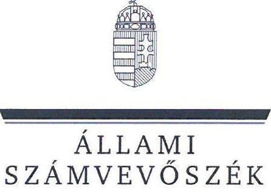
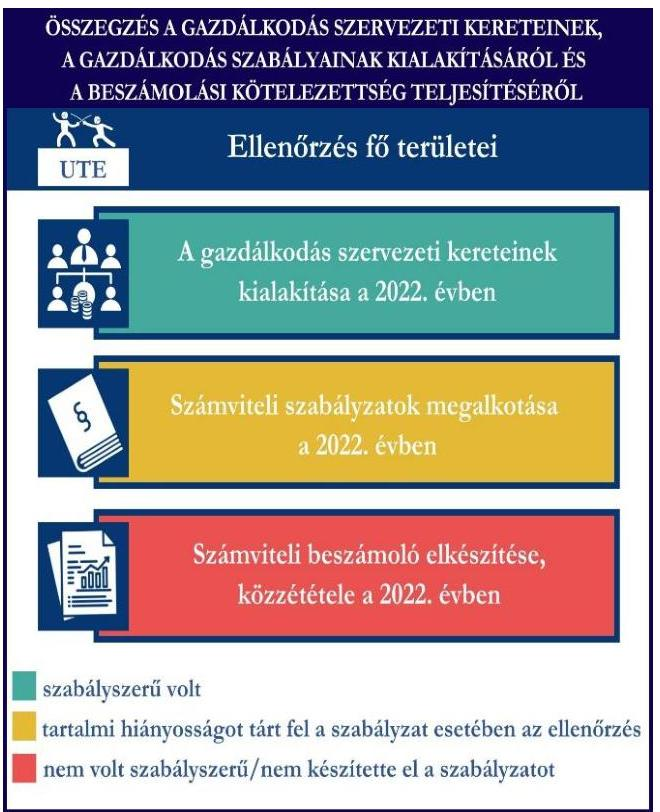
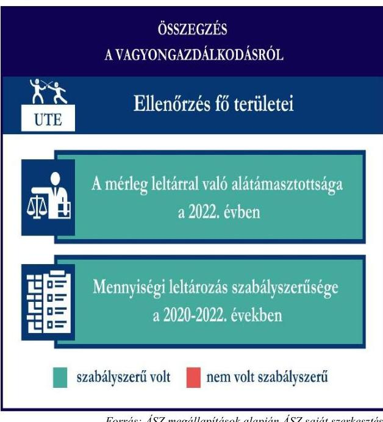
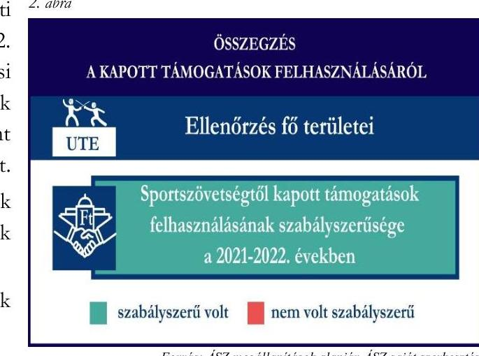

# JELENTÉS 

Támogatásban részesülő sportszövetségek és sportegyesületek gazdálkodásának ellenőrzése

Újpesti Torna Egylet

2024.

---

ÁLLAMI
SZÁMVEVŐSZÉK

# JELENTÉS 

## Támogatásban részesülő sportszövetségek és sportegyesületek gazdálkodásának ellenőrzése

Újpesti Torna Egylet

2024.

---

# ELLENŐRZÉSI IGAZGATÓSÁG: 

## ÁLLAMHÁZTARTÁSON KÍVÜLI SZERVEZETEKET ELLENŐRZŐ IGAZGATÓSÁG

## ELLENŐRZÉSI IGAZGATÓ:

## KLINGA LÁSZLÓ igazgató

## ELLENŐRZÉSVEZETŐ:

Jelentéseink az interneten a www.asz.hu címen olvashatók.

## HOFMEISTER LÁSZLÓ ellenőrzésvezető

IKTATÓSZÁM: EL-4060-021/2024.
TÉMASZÁM: 2682
ELLENŐRZÉS-AZONOSÍTÓ SZÁM: V1026

---

# TARTALOMJEGYZÉK 

- AZ ELLENŐRZÉS ALAPADATAI ..... 5
- AZ ELLENŐRZÖTT SZERVEZET ..... 7
- ÖSSZEFOGLALÁS ..... 8
- AZ ELLENŐRZÉS FÓKUSZKÉRDÉSEI ..... 10
- MEGÁLLAPÍTÁSOK ..... 11
- JAVASLATOK ..... 14
- MELLÉKLETEK ..... 15
I. sz. melléklet: Értelmező szótár ..... 15
II. sz. melléklet: Ellenőrzési kritériumok ..... 18
- FÜGGELÉK: ÉSZREVÉTELEK ..... 19
- RÖVIDÍTÉSEK JEGYZÉKE ..... 20

---

.

---

# AZ ELLENŐRZÉS ALAPADATAI 

## AZ ELLENŐRZÉS CÉLJA

Az ellenőrzés célja az államháztartásból nyújtott támogatással, vagy az államháztartásból meghatározott célra ingyenesen juttatott vagyon felhasználásával érintett sportszövetségek és sportegyesületek gazdálkodása szabályozottságának, gazdálkodási tevékenységének, ezen belül a beszámolási kötelezettség teljesítésének, a támogatások elkülönített nyilvántartásának, valamint a támogatások felhasználásának ellenőrzése.

## AZ ELLENŐRZÉS TÍPUSA

Szabályszerűségi ellenőrzés.

## AZ ELLENŐRZÖTT IDŐSZAK

Az 1. fókuszkérdés esetében a 2022. év.
A 2. fókuszkérdés vonatkozásában a 2021-2022. évek.
A 3. fókuszkérdés vonatkozásában a 2022. év, a mennyiségi felvétellel történő leltározás dokumentumai tekintetében a 2020-2022. évek.

## AZ ELLENŐRZÉS TÁRGYA

Az ellenőrzés tárgya a támogatásban részesülő sportszövetségek, sportegyesületek gazdálkodása szabályozottságának, gazdálkodási tevékenységén belül a beszámolási kötelezettség teljesítésének, a vagyonnyilvántartásának, a támogatások elkülönített nyilvántartásának, valamint az államháztartási forrásból származó közvetlen vagy közvetett támogatások és a meghatározott célra ingyenesen juttatott vagyon felhasználásának a vizsgálata volt. Az ellenőrzés a támogatások vonatkozásában kiterjedt továbbá a támogató felé történő beszámolási és elszámolási kötelezettségek teljesítésére, az ezekkel kapcsolatos jogszabályi és belső előírások betartására.

Az ellenőrzés kiterjedt minden olyan körülményre és adatra, amely az ÁSZ¹ jogszabályban meghatározott feladatainak teljesítéséhez, valamint az ellenőrzési program végrehajtása során felmerülő újabb összefüggések feltárásához szükséges.

Az 1. és 3. fókuszkérdés tekintetében az ellenőrzés a teljes ellenőrzött szervezetre, a 2. fókuszkérdés tekintetében kizárólag a vívó szakosztályra vonatkozott.

## AZ ELLENŐRZÉS JOGALAPJA

Az ellenőrzés jogszabályi alapját az ÁSZ tv.² 1. § (3) bekezdése, az 5. § (3) bekezdése, valamint a Civil tv.³ 47. § előírásai képezték.

---

# AZ ELLENŐRZÉS MÓDSZERE 

Az ellenőrzést a nemzetközi standardokat irányadónak tekintve az ellenőrzési program szempontjai, az ellenőrzött időszakban hatályos jogszabályok, az ellenőrzés általános szakmai szabályai, az ellenőrzésre irányadó ÁSZ módszertanok figyelembevételével végezte az ÁSZ.

Az ellenőrzési kérdések megválaszolásához szükséges bizonyítékok megszerzése az ellenőrzött szervezet által rendelkezésre bocsátott dokumentumokra, adatokra alapozva kérdésfeltevés (információkérés), interjú, mintavételezés útján történt.

Az ellenőrzési bizonyítékként felhasználható adatforrások közé tartoztak egyrészt az ellenőrzés során az ellenőrzött szervezettől bekért dokumentumok, másrészt adatforrás lehetett minden további, az ellenőrzés folyamán feltárt, az ellenőrzés szempontjából információt tartalmazó dokumentum.

A támogatásokkal, azok felhasználásával kapcsolatos kötelezettségek vizsgálatára mintavételi eljárások kerültek alkalmazásra. Támogatás-típusok szerint nagyságrend alapján 1-3 darab támogatás került részletes vizsgálat alá. Ezen támogatások felhasználásának szabályszerűsége támogatásonként kockázatértékelés alapján kiválasztott mintatételekkel került ellenőrzésre. Ezen felül a vagyongazdálkodás szabályszerűségének ellenőrzéséhez is kockázatalapú mintavétel kapcsolódott. A támogatások felhasználása és a vagyongazdálkodás területén a minták ellenőrzése - a teljes folyamat szabályszerűségének megítélése nélkül - kiterjedt a könyvvezetési kötelezettség vizsgálatára is. A kiválasztott támogatási szerződésekhez kapcsolódó elszámolásokból 30-30 db mintatétel került ellenőrzésre, ahol a mintatételek száma nem érte el a 30 db-ot, ott tételes ellenőrzésre került sor. A tárgyi eszközök tekintetében 30 db került kiválasztásra a 2022. évben állományban lévő eszközök közül azok nyilvántartásának, elszámolásának szabályszerűsége ellenőrzése céljából. A kiválasztott mintatételek ellenőrzésének eredménye nem került kivetítésre a teljes sokaságra, a megállapítások az adott ellenőrzött mintatételek vonatkozásában kerültek megjelenítésre.

---

# AZ ELLENŐRZÖTT SZERVEZET 

## Újpesti Torna Egylet

Az UTE⁴-t 1885-ben alapították, fő célja a sportági szakosztályok működtetése, utánpótlásnevelés támogatása, valamint azon sportolók versenyeztetése, népszerűsítése, akik kiváló eredményeket érnek el. További céljai között szerepel a hazai és nemzetközi sportkapcsolatok ápolása. Az UTE-nél 21 szakosztály működött az ellenőrzött időszakban, taglétszáma a 100 főt meghaladta 2022. december 31-én. Az UTE tulajdonosa az Újpesti Jégkorong Akadémia Nonprofit Kft.-nek, valamint az UTE Profisport Kft.-nek, továbbá részesedése van az Újpest FC Kft.-ben, és az Újpest 1885 Futball Kft.-ben. Az UTE rendelkezett a 2022. évben vagyonkezelt állami vagyonnal.

A 2022. évi ellenőrzött időszakban az UTE az alapcéljai megvalósítása érdekében vállalkozási tevékenységet is végzett. Az OBH⁵ nyilvántartás adatai alapján 2015. április 29-e óta közhasznú jogállással rendelkezett. Az UTE jogszabályi előírás alapján könyvvizsgálatra és felügyelőbizottság létrehozására kötelezett volt.

A 2021-2022. években az UTE által igénybe vett támogatásokat az 1. táblázat mutatja be.
1. táblázat

AZ UTE ÁLTAL IGÉNYBE VETT TÁMOGATÁSOK (ADATOK M FT-BAN)

|  | 2021. ÉV | 2022. ÉV |
| :-- | --: | --: |
| Központi költségvetésből* | 191,2 | 1082,0 |
| Helyi önkormányzattól* | 39,0 | 76,7 |
| Magyar Vívó Szövetségtől | 17,6 | 16,8 |
| *több sportágot érintő támogatás | Forrás: Az ellenőrzött szervezet főkönyvi adatai, főkönyvi kartonok alapján. ÁSZ saját összesítés |  |

---

# ÖSSZEFOGLALÁS 

Az Alaptörvény⁶ XX. cikke kimondja, hogy mindenkinek joga van a testi és lelki egészséghez, melynek érvényesülését Magyarország többek között a sportolás és a rendszeres testedzés támogatásával segíti elő. Az Országgyűlés⁷ a Sport tv.⁸-ben kinyilvánította, hogy a nemzet közössége a test művelését, a sportot, a nemzet alapértékének, kívánatos célnak tekinti. A sport a közjó része. Erősíti a közösség tagjainak egymáshoz tartozását, miként az egyén testi és lelki egészségét.

A sportegyesületek, sportszövetségek működésükre és szakmai tevékenységük ellátására költségvetési támogatásban, önkormányzati támogatásban, ingyenes vagyonjuttatásban, valamint látvány-csapatsport támogatásban részesülhetnek, amelyekre fokozott figyelem irányul.

A társadalom részéről jogosan felmerülő elvárás, hogy a közpénzeket kezelő, azzal gazdálkodó szervezetek működéséről, tevékenységéről átfogó képet kapjon, a közpénzek rendeltetésszerű és átlátható módon történő felhasználásának értékelésére időről-időre sor kerüljön az ellenőrzések keretében.
1. ábra

A gazdálkodás szervezeti kereteinek kialakítása a 2022. évben

Számviteli szabályzatok megalkotása a 2022. évben

Számviteli beszámoló elkészítése, közzététele a 2022. évben
szabályszerű volt
tartalmi hiányosságot tárt fel a szabályzat esetében az ellenőrzés nem volt szabályszerű/nem készítette el a szabályzatot

Forrás: ÁSZ megállapítások alapján ÁSZ saját szerkesztés

Az UTE tekintetében a könyvvezetési kötelezettség teljesítése szabályszerű volt, ugyanakkor a gazdálkodási szabályok kialakítása hiányos volt, a beszámolási kötelezettség teljesítése a 2022. évben nem volt szabályszerű.

Az UTE a könyvviteli szolgáltatás személyi feltételeinek megteremtéséről, felügyelőbizottság létrehozásáról és működéséről gondoskodott.

A 2022. évben a jogszabályban előírt számviteli szabályzatokat elkészítette, azonban a pénzkezelési szabályzat és a számlarend tekintetében az ellenőrzés hiányosságot tárt fel.

A könyvvezetés formája a 2022. évben megfelelt a jogszabályi előírásoknak, azonban a 2022. évi számviteli beszámoló elkészítése nem volt szabályszerű, mivel azt könyvvizsgálóval nem vizsgáltatta felül.

A gazdálkodás szervezeti keretei kialakításának, a számviteli szabályzatok megalkotásának, valamint a számviteli beszámoló elkészítésének és közzétételének értékelését az 1. ábra mutatja be.

---

Az UTE vívó szakosztálya részére a központi költségvetésből az MVSZ⁹-en keresztül a 2021-2022. években adott ellenőrzött támogatásokat a támogatási célnak megfelelően használta fel, azonban a támogatások felhasználásáról a jogszabályban előírt támogatásonként elkülönített számviteli nyilvántartással nem rendelkezett.

A 2021. és 2022. évi számviteli beszámolók kiegészítő mellékleteiben a kapott támogatásokat és azok felhasználását nem mutatta be.

A kapott támogatások felhasználásának ellenőrzéséről az összegzést a 2. ábra tartalmazza.
2. ábra

Forrás: ÁSZ megállapítások alapján ÁSZ saját szerkesztés

Az UTE vagyongazdálkodása, a beszámoló leltárral való alátámasztottsága, a tárgyi eszközök üzembe helyezése és értékcsökkenésük elszámolása az ellenőrzött tételek esetében a 2022. évben szabályszerű volt.

Az UTE a jogszabályoknak megfelelően gondoskodott saját vagyona nyilvántartásáról és a számviteli beszámolóban történő megjelenítéséről.

A 2022. évi beszámolójának mérleg tételeit alátámasztotta szabályszerű leltárral, valamint a mérlegben szereplő tárgyi eszközök háromévente előírt mennyiségi leltározását a 2022. évben elvégezte.

Az UTE a vagyonkezelt állami vagyonhoz kapcsolódó nyilvántartásait a jogszabályi előírásoknak megfelelően vezette.

A vagyongazdálkodás ellenőrzésének összegzését a 3. ábra tartalmazza.

---

# AZ ELLENŐRZÉS FÓKUSZKÉRDÉSEI 

1.     - A gazdálkodási szabályok kialakítása, a könyvvezetési- és beszámolási kötelezettség teljesítése szabályszerű volt-e?
2.     - A kapott támogatások felhasználása szabályszerű volt-e?
3.     - Az ellenőrzött szervezet vagyongazdálkodása szabályszerű volt-e?

---

# MEGÁLLAPÍTÁSOK 

## 1. A gazdálkodási szabályok kialakítása, a könyvvezetési- és beszámolási kötelezettség teljesítése szabályszerű volt-e?

Összegző megállapítás Az UTE a 2022. évben a gazdálkodási szabályokat kialakította, azonban a pénzkezelési szabályzat és a számlarend tekintetében az ellenőrzés hiányosságot tárt fel. A számviteli beszámoló- és közhasznúsági melléklet készítési- és közzétételi kötelezettségét a jogszabályoknak megfelelően teljesítette, azonban a jogszabályi előírás ellenére a 2022. évi beszámolót könyvvizsgálóval nem vizsgáltatta felül.

A könyvviteli szolgáltatás személyi feltételeinek megteremtéséről az UTE a 2022. évben a Számv. tv.¹⁰ és a Civilszr.¹¹-ben foglalt jogszabályi előírások betartásával gondoskodott.
Az UTE a Civilszr. 16. § (1) bekezdés előírása ellenére nem gondoskodott a 2022. évi éves beszámoló vonatkozásában könyvvizsgáló megbízásáról annak ellenére, hogy éves bevétele a 2022. évet megelőző két üzleti év átlagában meghaladta a 300,0 M Ft-ot (2020. évben 6531 M Ft, 2021. évben 1936 M Ft volt). Az UTE a 2022. évben a Ptk.¹² előírásainak betartásával gondoskodott az előírt felügyelőbizottság létrehozásáról. Az UTE felügyelőbizottsága megalkotta ügyrendjét a Civil tv.-ben foglaltak szerint.
Az UTE a 2022. évben rendelkezett a Számv. tv. előírásainak megfelelő számviteli politikával, azon belül az eszközök és a források leltárkészítési és leltározási szabályzatával, az eszközök és a források értékelési szabályzatával, amelyek az ellenőrzött tartalmi kritériumoknak megfeleltek. Az UTE 2022. évben hatályos pénzkezelési szabályzata a Számv. tv. 14. § (8) bekezdésében foglaltakkal ellentétben nem tartalmazta a pénzforgalom bankszámlán történő lebonyolításának rendjét. Az UTE 2022. évben hatályos számlarendje nem tartalmazta a Számv. tv. 161. § (2) bekezdés b) és c) pontjában előírtakat, a számla értéke növekedésének, csökkenésének jogcímeit, a számlát érintő gazdasági eseményeket, azok más számlákkal való kapcsolatát, a főkönyvi és az analitikus nyilvántartás kapcsolatát.
Az UTE a Civil tv., valamint a Civilszr. előírásainak megfelelően a 2022. évre vonatkozóan kettős könyvvitellel alátámasztott éves beszámoló készítésével teljesítette a jogszabályi kötelezettségeit, a Civil vhr.¹³-ben előírtak alapján a közhasznúsági mellékletet elkészítette. A 2022. évben az UTE végzett vállalkozási tevékenységet, melynek bevételeit és ráfordításait a könyvvezetése során a Civil tv.-nek megfelelően az alaptevékenységtől elkülönítetten tartotta nyilván és mutatta ki számviteli beszámolójában. A könyvviteli nyilvántartásait a Számv. tv. és a Civilszr. rendelkezéseinek megfelelően úgy alakította ki, hogy a számviteli beszámolóban az egyéb bevételeken belül a tagdíjakat és a kapott támogatások összegét részletezni tudta.
A 2022. évi számviteli beszámolót az UTE felügyelőbizottsága megtárgyalta és elfogadásra javasolta annak ellenére, hogy a 2022. évi beszámoló nem volt könyvvizsgálattal
 alátámasztva. A 2022. évi számviteli beszámolóját a Ptk., valamint a Civil tv. alapján az UTE küldöttközgyűlése a Civil tv.-nek megfelelően jóváhagyta.

---

Az UTE a Civil tv. 30. § (1) bekezdéseiben foglaltak ellenére a 2022. évi számviteli beszámolóját a beszámoló részét képező könyvvizsgálói záradék nélkül helyezte letétbe, tette közzé.

# 2. A kapott támogatások felhasználása szabályszerű volt-e? 

Összegző megállapítás

Az UTE vívó szakosztálya részére nyújtott támogatásokat a 2021. és a 2022. években az ellenőrzött tételek esetében a támogatási célnak megfelelően használta fel, azonban nem gondoskodott a támogatások felhasználásának elkülönített nyilvántartásáról. A számviteli beszámolók kiegészítő mellékletében a kapott támogatásokat és azok felhasználását nem mutatta be.

Az UTE a központi költségvetésből az MVSZ-en keresztül számára juttatott sportcélú ellenőrzött támogatások bevételeit a 2021-2022. években a Civil tv. és a Számv. tv. ${ }^{14}$ előírásainak megfelelően a számviteli rendszerében elkülönítetten tartotta nyilván.
Az UTE az ellenőrzött tételek esetében a 2021-2022. években a Számv. tv. 161/A. § (2) bekezdésében foglaltak ellenére a Civil tv. 20. § (4) bekezdésében előírt alapcél szerinti tevékenysége költségei, ráfordításai ellentételezésére a központi költségvetésből az MVSZ-en keresztül kapott támogatásokról nem vezetett olyan elkülönített számviteli nyilvántartást, amelynek alapján támogatásonként megállapítható és ellenőrizhető volt a kapott támogatás felhasználása. Az elkülönített nyilvántartás hiányában az egyes támogatások felhasználásáról készített elszámolások könyvviteli nyilvántartással, az abban szereplő támogatásonkénti elkülönített adatokkal nem voltak alátámasztottak.
A központi költségvetésből az MVSZ-en keresztül juttatott támogatás terhére elszámolt ellenőrzött tételekből egy tételnél a támogatás felhasználásának számviteli bizonylatán záradékolt összeg nagyobb volt, mint az összesítő elszámolásban elszámolt összeg, egy másik tétel számviteli bizonylatát nem látták el záradékkal, ezzel az UTE nem tartotta be a 474/2016. (XII.27.) Korm. rend. ${ }^{15}$ 24. § (2) bekezdésében előírtakat.
A támogatás felhasználásáról a támogató felé benyújtott beszámolót és annak részeként az összesített elszámolási táblázatot a támogatási szerződésben előírt formában és tartalommal elkészítette.
Közhasznú szervezetként a számviteli beszámolóinak kiegészítő mellékletében a Számv. tv. 93. § (3), a Civil tv. 29. § (4) bekezdések előírásai ellenére nem mutatta be a 2021. és 2022. években a támogatási programok keretében végleges jelleggel felhasznált összegeket támogatásonként.

---

# 3. Az ellenőrzött szervezet vagyongazdálkodása szabályszerű volt-e? 

## Összegző megállapítás

Az UTE 2022. évi vagyongazdálkodása az ellenőrzött tételek vonatkozásában szabályszerű volt. Az UTE a vagyonkezelt állami vagyonhoz kapcsolódó nyilvántartásait a jogszabályi előírásoknak megfelelően vezette.

Az UTE a Számv. tv.-nek megfelelően gondoskodott saját vagyona nyilvántartásáról és a számviteli beszámolóban történő megjelenítéséről a 2022. évről. A 2022. év beszámolójának mérlegét, a mérlegben szereplő eszközöket és forrásokat szabályszerű leltárral alátámasztotta, elvégezte a főkönyvi könyvelés és az analitikus nyilvántartások adatai közötti egyeztetést. A Számv. tv.-nek megfelelően a mérlegben szereplő eszközök háromévente előírt mennyiségi leltározását a 2022. évben elvégezte.
Az UTE-nél az ellenőrzött tételek vonatkozásában a tárgyi eszközök bekerülési értékét, az értékcsökkenés elszámolását a Számv. tv. előírás szerint határozták meg, az üzembe helyezést a tárgyi eszközök vonatkozásában a Számv. tv.-ben előírtak alapján dokumentálták.
Az UTE a Vtv. vhr. ${ }^{16}$-nek megfelelően a rábízott állami vagyonról olyan elkülönített nyilvántartást vezetett, amely tételesen tartalmazta ezen eszközök könyv szerinti bruttó és nettó értékét, az elszámolt terv szerinti értékcsökkenés összegét és az értékben bekövetkezett egyéb változásokat.
A Számv. tv. előírása alapján a 2022. évben az UTE a vagyonkezelt eszközeit a kiegészítő mellékletben bemutatta.
Az UTE az ellenőrzött vagyonkezelt eszközök hasznosítására vonatkozó szerződéseket a 2022. évben az Nvtv. ${ }^{17}$ előírásai alapján átlátható szervezettel kötötte meg. A vagyon hasznosításával kapcsolatos ellenőrzött bérleti szerződésekben az Nvtv. előírásai alapján határozta meg a bérleti szerződés időtartamát, a szerződés tartalmazta az Nvtv. által előírt nyilatkozatokat az adatszolgáltatás teljesítéséről, a megfelelő használatról, valamint a hasznosításban résztvevő harmadik félről. A hasznosítás bevételének főkönyvi elszámolása és a számviteli beszámolóban való szerepeltetése a Számv. tv. rendelkezéseinek, valamint a gazdálkodással kapcsolatos belső szabályozásnak megfelelően történt.

---

# JAVASLATOK 

Az ÁSZ tv. 33. § (1) bekezdésében foglaltak értelmében az ellenőrzött szervezet vezetője köteles a jelentésben foglalt megállapításokhoz kapcsolódó intézkedési tervet összeállítani és azt a jelentés kézhezvételétől számított 30 napon belül az ÁSZ részére megküldeni. Amennyiben az ellenőrzött szervezet vezetője nem küldi meg határidőben az intézkedési tervet, vagy továbbra sem elfogadható intézkedési tervet küld, az Állami Számvevőszék elnöke az ÁSZ tv. 33. § (3) bekezdése a) és b) pontjaiban foglaltakat érvényesítheti.

## AZ ÚJPESTI TORNA EGYLET KLUBIGAZGATÓJÁNAK

1. Gondoskodjon a számviteli beszámoló könyvvizsgálóval történő felülvizsgálatáról a Civilszr. 16. § (1) bekezdésében előírtak alapján.
2. Gondoskodjon a pénzkezelési szabályzat Számv. tv. 14. § (8) bekezdésében előírtaknak megfelelő tartalommal való elkészítéséről.
3. Gondoskodjon a Számv. tv. 161. § (2) bekezdés b), c) pontjaiban foglaltaknak megfelelő tartalommal való számlarend elkészítéséről.
4. Gondoskodjon a központi költségvetésből az MVSZ-en keresztül kapott támogatások elkülönített számviteli nyilvántartásának vezetéséről, amely alapján támogatásonként megállapítható és ellenőrizhető a kapott támogatás felhasználása, a Civil tv. 20. § (4) bekezdés és a Számv. tv. 161/A. § (2) bekezdés előírásai alapján.
5. Gondoskodjon arról, hogy a támogatás felhasználását alátámasztó számviteli bizonylaton a 474/2016. (XII.27.) Korm.rendelet 24. § (2) alapján a támogatási szerződésekben előírt záradékolás minden esetben szerepeljen.
6. Gondoskodjon arról, hogy a Civil tv. 29. § (4) bekezdés előírásának megfelelően a támogatási program keretében végleges jelleggel kapott és elszámolt összegek kerüljenek bemutatásra a kiegészítő mellékletben.

---

# MELLÉKLETEK 

## I. SZ. MELLÉKLET: ÉRTELMEZŐ SZÓTÁR

civil szervezet
egyesület
költségvetési támogatás
közhasznú szervezet
közhasznú tevékenység
országos sportági szakszövetség
sportági szövetség

A civil társaság; a Magyarországon nyilvántartásba vett egyesület - a párt, a szakszervezet és a kölcsönös biztosító egyesület kivételével és a közalapítvány és a pártalapítvány kivételével - az alapítvány. (Forrás: Civil tv. 2. §6. pont a) -c) alpontjai)
Az egyesület a tagok közös, tartós, alapszabályban meghatározott céljának folyamatos megvalósítására létesített, nyilvántartott tagsággal rendelkező jogi személy. (Forrás: Ptk. 3:63. § (1) bekezdés)
A Számv. tv. szempontjából egyéb szervezet. (Számv. tv. 3. § (1) bekezdés 4. pont a) alpontja)
A társadalombiztosítás pénzügyi alapjai kivételével az államháztartás központi alrendszeréből ellenérték nélkül, pénzben nyújtott támogatások. (Forrás: Áht. ${ }^{18}$ 1. § 14. pont, ide nem értve az Áht. 1. § 14. pont a) -o) pontjaiban szereplő támogatásokat)

Közhasznú szervezetté minősíthető a Magyarországon nyilvántartásba vett közhasznú tevékenységet végző szervezet, amely a társadalom és az egyén közös szükségleteinek kielégítéséhez megfelelő erőforrásokkal rendelkezik, továbbá amelynek megfelelő társadalmi támogatottsága kimutatható, és amely:
a) civil szervezet (ide nem értve a civil társaságot), vagy
b) olyan egyéb szervezet, amelyre vonatkozóan a közhasznú jogállás megszerzését törvény lehetővé teszi. (Forrás: Civil tv. 32. § (1) bekezdés)
Minden olyan tevékenység, amely a létesítő okiratban megjelölt közfeladat teljesítését közvetlenül vagy közvetve szolgálja, ezzel hozzájárulva a társadalom és az egyén közös szükségleteinek kielégítéséhez. (Forrás: Civil tv. 2. § 20. pont)
Olyan sportszövetség, amely sportágában kizárólagos jelleggel az e törvényben, valamint más jogszabályokban meghatározott feladatokat lát el és e törvényben megállapított különleges jogosítványokat gyakorol. Olyan sportágban hozható létre, amelyet vagy a Nemzetközi Olimpiai Bizottság elismert, vagy amely sportág nemzetközi szövetségét felvették a Nemzetközi Sportszövetségek Szövetségébe (GAISF). (Forrás: Sport tv. 20. § (1), (4) bekezdés)
A Civil tv. és a Ptk. előírásai alapján - a Sport tv.-ben meghatározott eltérésekkel - működő szövetség, amelynek tagjai kizárólag sportszervezetek lehetnek. Sportági szövetség országos jelleggel is működhet. Egy sportágban csak egy országos sportági szövetség működhet. Törvényi feltételek teljesülése esetén szakszövetségi feladatokat is elláthat. (Forrás: Sport tv. 28. §)

---

sportegyesület
sportegyesületeknek, sportszövetségeknek nyújtott költségvetési támogatás
sportszövetség
sporttevékenység
vagyongazdálkodás

A Civil tv. és a Ptk. szabályai szerint működő olyan egyesület, amelynek alaptevékenysége a sporttevékenység szervezése, valamint a sporttevékenység feltételeinek megteremtése. A sportegyesületek a Sport. tv. 15. § (1) bekezdésében meghatározott sportszervezetek körébe tartoznak. A sportegyesületeken kívül sportszervezet még a sportvállalkozás, a sportiskola, valamint az utánpótlás-nevelés fejlesztését végző alapítvány. (Forrás: Sport tv. 16. § (1) bekezdés)
Az állami sport célú támogatások felhasználásáról és elosztásáról szóló 474/2016. (XII. 27.) Kormány rendelet és a 27/2013. (III. 29.) EMMI rendelet ${ }^{19}$ 1. $\mathbb{S}$-ában meghatározott fejezeti kezelésű előirányzatokból nyújtott támogatás.
Meghatározott sporttevékenységek körében a sportversenyek szervezésére, a tagok érdekvédelmére és a részükre való szolgáltatásokra, valamint a nemzetközi kapcsolatok lebonyolítására létrehozott, jogi személyiséggel és önkormányzattal rendelkező, a Civil tv. és a Ptk. alapján - az e törvényben foglalt eltérésekkel - különös formában működő egyesületek. A Sport tv. 19. § (3) bekezdése szerint a sportszövetségeknek az alábbi típusai léteznek: országos sportági szakszövetségek, sportági szövetségek, szabadidősport szövetségek, fogyatékosok sportszövetségei, diák- és egyetemi-főiskolai sport sportszövetségei, nemzetközi sportszövetségek. (Forrás: Sport tv. 19. § (1), (3) bekezdés)

Meghatározott szabályok szerint, a szabadidő eltöltéseként kötetlenül vagy szervezett formában, illetve versenyszerűen végzett testedzés vagy szellemi sportágban kifejtett tevékenység, amely a fizikai erőnlét és a szellemi teljesítőképesség megtartását, fejlesztését szolgálja. (Forrás: Sport tv. 1. § (2) bekezdés)
A nemzeti vagyongazdálkodás feladata a nemzeti vagyon rendeltetésének megfelelő, az állam, az önkormányzat mindenkori teherbíró képességéhez igazodó, elsődlegesen a közfeladatok ellátásához és a mindenkori társadalmi szükségletek kielégítéséhez szükséges, egységes elveken alapuló, átlátható, hatékony és költségtakarékos működtetése, értékének megőrzése, állagának védelme, értéknövelő használata, hasznosítása, gyarapítása, továbbá az állam vagy a helyi önkormányzat feladatának ellátása szempontjából feleslegessé váló vagyontárgyak elidegenítése. (Forrás: Nvtv. 7. § (2) bek.)

---

vagyonkezelő
vagyonkezelői kötelezettségek
a) az állam tulajdonában álló nemzeti vagyon tekintetében:
aa) költségvetési szerv,
ab) helyi önkormányzat, nemzetiségi önkormányzat, valamint ezek társulásai,
ac) az ab) alpontban felsoroltak fenntartása vagy irányítása alá tartozó intézmény,
ad) köztestület,
ae) az állam, az aa)-ac) alpontban meghatározott személyek együtt vagy külön-külön 100\%-os tulajdonában álló gazdálkodó szervezet,
af) az ae) alpont szerinti gazdálkodó szervezet 100\%-os tulajdonában álló gazdálkodó szervezet,
ag) a törvény által kijelölt egyedileg meghatározott jogi személy.
(Forrás: Nvtv. 3. § (1) bek. 19. pont)
A vagyonkezelő köteles a vagyontárgy állagának megóvásáról, jó karbantartásáról, működtetéséről gondoskodni, jogszabályban és szerződésben előírt más kötelezettségét teljesíteni, valamint a vagyontárgyat jogszabályban vagy szerződésben meghatározott célnak megfelelően használni. A vagyonkezelő - a központi költségvetési szervek és a kizárólag közfeladatot ellátó nem központi költségvetési szerv vagyonkezelők kivételével - köteles díjat fizetni, jogszabályban és szerződésben előírt más kötelezettségét teljesíteni, valamint a vagyontárgyat jogszabályban vagy szerződésben meghatározott célnak megfelelően használni. Amennyiben a vagyonkezelő ezen kötelezettségeinek nem tesz eleget, a tulajdonosi joggyakorló jogosult a szerződést azonnali hatállyal felmondani. (Forrás: Vtv. 20 27. § (2), (2a) bek.)

---

# II. SZ. MELLÉKLET: ELLENŐRZÉSI KRITÉRIUMOK 

## FOKUSZKÉRDÉS

## 1. fókuszkérdés:

A gazdálkodási szabályok kialakítása, a könyvvezetési és beszámolási kötelezettség teljesítése szabályszerű volt-e?

## 2. fókuszkérdés:

A kapott támogatások felhasználása szabályszerű volt-e?

## 3. fókuszkérdés:

Az ellenőrzött szervezet vagyongazdálkodása szabályszerű volt-e?

## ELLENŐRZÉSI KRITÉRIUMOK

Számv. tv. 14. § (3) bekezdés, (5) bekezdés a), b), d) pont, (8) bekezdés, 69. § (3) bekezdés, 90. § (3) bekezdés c) pont, 161.
 § (1) bekezdés, (2) bekezdés a) -d) pont, (3)-(4) bekezdés, 161/A. § (2) bekezdés, 165. § (2) bekezdés
Civilszr. 7. § (1) bekezdés, (4) bekezdés b), c) pont, 8. § (2), (3) bekezdés, 9. § (4), (5), (8) bekezdés, 12. § (4), (5) bekezdés, 15. § (1) bekezdés a), b) pont, 16. § (1) bekezdés, 24. § (2) bekezdés

Ptk. 3:26. § (1) bekezdés, 3:27. § (1) bekezdés, 3:82. § (1) bekezdés,
Civil tv. 28. § (1) bekezdés, 29. § (2) bekezdés c) pont, (3), (6), (7) bekezdés, 30. § (1)-(4) bekezdés 40. § (1), (2) bekezdés, 41. § (1) bekezdés
Civil vhr.
Sport tv. 23. § (1) bekezdés f) pont
Számv. tv. 44. § (2) bekezdés, 93. § (3) bekezdés, 159. §, 165. § (2) bekezdés, 167. § (1) bekezdés a), d), e), h) pont

Civil tv. 20. § (2) bekezdés a) pont, (3) bekezdés a), c) pont, (4) bekezdés, 29. § (4), (5) bekezdés
Civilszr. 24. § (2) bekezdés
27/2013. (III.29.) EMMI rend. 18. § (2) bekezdés
474/2016. (XII. 27.) Korm. rend. 22. § (2) bekezdés, 24. § (2) bekezdés

Nvtv. 11. § (1), (7), (8) bekezdés a) pont, (10)-(13) bekezdés
Sport. tv. 76/B. §, 76/C. §
Számv. tv. 15. § (7)-(8) bekezdés, 16. § (2) bekezdés, 18. §, 23. § (2) bekezdés, 26. §, 32. § (1) bekezdés, 42. § (5) bekezdés, 44. § (1) bekezdés a) pont, (7) bekezdés, 46. § (3) bekezdés, 47-53. §, 69. §, 72.-73. §, 75. §, 93. § (1) bekezdés b) pont, 100. § (1) bekezdés, 109. § (1) bekezdés, 160. § (3c) bekezdés, 161. §, 161/A. §, 165-166. §, 169. §

Vtv. 20. § (4) bekezdés c) pont, 23. § (2)-(4) bekezdés, 27. § (2), (7)-(9) bekezdés

Vtv. vhr. 4. §, 7. § (3) bekezdés, 9. § (9) bekezdés a), d) pont, (11) bekezdés, 9/A. § (1) bekezdés b) pont, (2) bekezdés 10. § (4) bekezdés 14. § (1), (3) bekezdés, 17. § (1) bekezdés
474/2016. (XII. 27.) Korm. rend. 17. § (1) bekezdés 11a., 11b. pont, 17. § (2a) bekezdés, 24. § (2) bekezdés

---

# FÜGGELÉK: ÉSZREVÉTELEK 

A jelentéstervezetet a Számvevőszék 15 napos észrevételezésre megküldte az ellenőrzött szervezet vezetőjének az ÁSZ tv. 29. § (1) bekezdése előírásának megfelelően.

Az ellenőrzött szervezet klubigazgatója a jelentéstervezetre nem tett észrevételt.

[^0]
[^0]:    * 29. § (1) Az Állami Számvevőszék az ellenőrzési megállapításait megküldi az ellenőrzött szervezet vezetőjének vagy az általa megbízott személynek, és annak, akinek személyes felelősségét állapította meg.
    (2) Az ellenőrzött szervezet vezetője és a felelősként megjelölt személy az ellenőrzés megállapításaira tizenöt napon belül írásban észrevételt tehet.
    (3) Az Állami Számvevőszék az észrevételre a beérkezésétől számított harminc napon belül írásban válaszol. A figyelembe nem vett észrevételeket köteles a jelentésben feltüntetni, és megindokolni, hogy azokat miért nem fogadta el.

---

# RÖVIDÍTÉSEK JEGYZÉKE 

${ }^{1}$ ÁSZ
${ }^{2}$ Ász tv.
${ }^{3}$ Civil tv.
${ }^{4}$ UTE
${ }^{5}$ OBH
${ }^{6}$ Alaptörvény
${ }^{7}$ Országgyúlés
${ }^{8}$ Sport tv.
${ }^{9}$ MVSZ
${ }^{10}$ Számv. tv.
${ }^{11}$ Civilszr.
${ }^{12}$ Ptk.
${ }^{13}$ Civil vhr.
${ }^{14}$ Számv. tv.
${ }^{15}$ 474/2016. (XII. 27.) Korm. rendelet
${ }^{16}$ Vtv. vhr.
${ }^{17}$ Nvtv.
${ }^{18}$ Áht.
${ }^{19}$ 27/2013. (III. 29.) EMMI rendelet
${ }^{20}$ Vtv.

Állami Számvevőszék
2011. évi LXVI. törvény az Állami Számvevőszékről
2011. évi CLXXV. törvény az egyesülési jogról, a közhasznú jogállásról, valamint a civil szervezetek működéséről és támogatásáról
Újpesti Torna Egylet
Országos Bírósági Hivatal
Magyarország Alaptörvénye
Magyarország Országgyúlése
2004. évi I. törvény a sportról

Magyar Vívó Szövetség
2000. évi C. törvény a számvitelről
479/2016. (XII. 28.) Korm. rendelet a számviteli törvény szerinti egyes egyéb szervezetek beszámoló készítési és könyvvezetési kötelezettségének sajátosságairól
2013. évi V. törvény a Polgári Törvénykönyvről
350/2011. (XII. 30.) Korm. rendelet a civil szervezetek gazdálkodása, az adománygyűjtés és a közhasznúság egyes kérdéseiről
2000. évi C. törvény a számvitelről
474/2016. (XII. 27.) Korm. rendelet az állami sport célú támogatások felhasználásáról és elosztásáról
254/2007. (X.4.) Korm. rendelet az állami vagyonnal való gazdálkodásról
2011. évi CXCVI. törvény a nemzeti vagyonról
2011. évi CXCV. törvény az államháztartásról
27/2013. (III. 29.) EMMI rendelet az állami sport célú támogatások felhasználásáról és elosztásáról
2007. évi CVI. törvény az állami vagyonról

---

1052 Budapest, Apáczai Csere János u. 10. | 1364 Budapest 4., Pf. 54
www.asz.hu | szamvevoszek@asz.hu
telefon: +36 1 4849100

