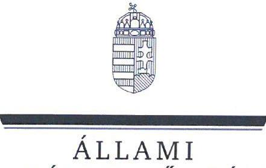
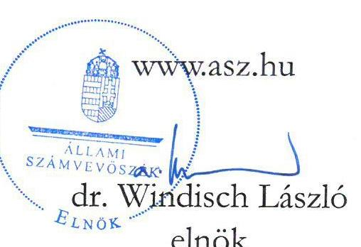
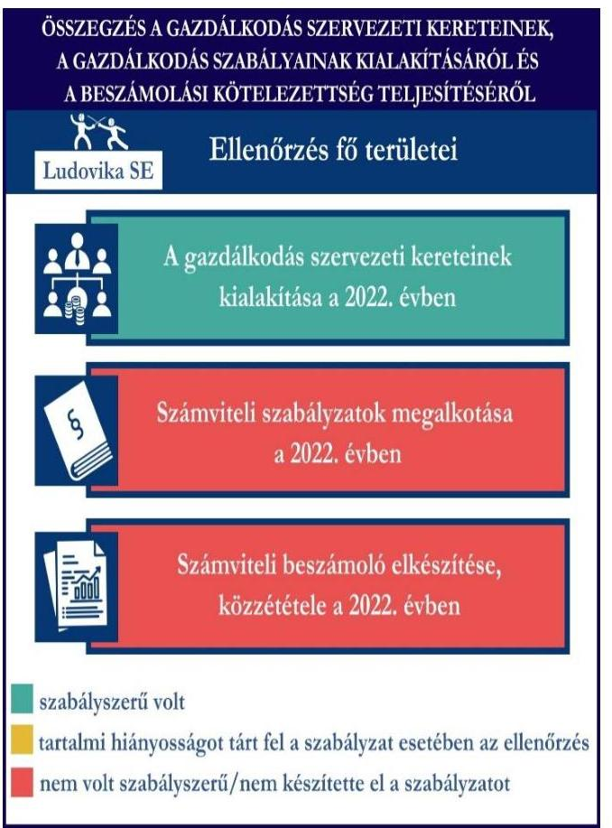
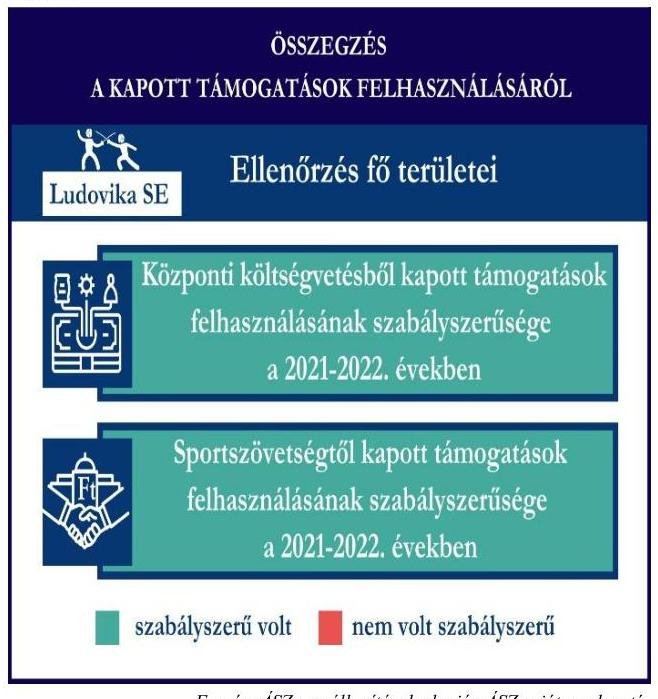
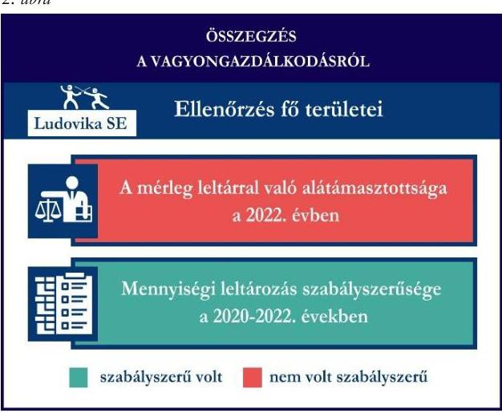

# JELENTÉS 

## Támogatásban részesülő sportszövetségek és sportegyesületek gazdálkodásának ellenőrzése

Ludovika Sportegyesület

2024.

---

ÁLLAMI
SZÁMVEVŐSZÉK

# JELENTÉS 

## Támogatásban részesülő sportszövetségek és sportegyesületek gazdálkodásának ellenőrzése

Ludovika Sportegyesület

2024.

24118

---

# ELLENŐRZÉSI IGAZGATÓSÁG: 

## ÁLLAMHÁZTARTÁSON KÍVÜLI SZERVEZETEKET ELLENŐRZŐ IGAZGATÓSÁG

## ELLENŐRZÉSI IGAZGATÓ:

## KLINGA LÁSZLÓ igazgató

## ELLENŐRZÉSVEZETŐ:

Jelentéseink az interneten a www.asz.hu címen olvashatók.

## HOFMEISTER LÁSZLÓ ellenőrzésvezető

IKTATÓSZÁM: EL-4060-023/2024.
TÉMASZÁM: 2682
ELLENŐRZÉS-AZONOSÍTÓ SZÁM: V1026

---

# TARTALOMJEGYZÉK 

AZ ELLENŐRZÉS ALAPADATAI ..... 5
AZ ELLENŐRZÖTT SZERVEZET ..... 7
ÖSSZEFOGLALÁS ..... 8
AZ ELLENŐRZÉS FÓKUSZKÉRDÉSEI ..... 10
MEGÁLLAPÍTÁSOK ..... 11
JAVASLATOK ..... 15
MELLÉKLETEK ..... 16
I. sz. melléklet: Értelmező szótár ..... 16
II. sz. melléklet: Ellenőrzési kritériumok ..... 18
FÜGGELÉK: ÉSZREVÉTELEK ..... 19
RÖVIDÍTÉSEK JEGYZÉKE ..... 20

---

.

---

# AZ ELLENŐRZÉS ALAPADATAI 

## AZ ELLENŐRZÉS CÉLJA

Az ellenőrzés célja az államháztartásból nyújtott támogatással, vagy az államháztartásból meghatározott célra ingyenesen juttatott vagyon felhasználásával érintett sportszövetségek és sportegyesületek gazdálkodása szabályozottságának, gazdálkodási tevékenységének, ezen belül a beszámolási kötelezettség teljesítésének, a támogatások elkülönített nyilvántartásának, valamint a támogatások felhasználásának ellenőrzése.

## AZ ELLENŐRZÉS TÍPUSA

Szabályszerűségi ellenőrzés.

## AZ ELLENŐRZÖTT IDŐSZAK

Az 1. fókuszkérdés esetében a 2022. év.
A 2. fókuszkérdés vonatkozásában a 2021-2022. évek.
A 3. fókuszkérdés vonatkozásában a 2022. év, a mennyiségi felvétellel történő leltározás dokumentumai tekintetében a 2020-2022. évek.

## AZ ELLENŐRZÉS TÁRGYA

Az ellenőrzés tárgya a támogatásban részesülő sportszövetségek, sportegyesületek gazdálkodása szabályozottságának, gazdálkodási tevékenységén belül a beszámolási kötelezettség teljesítésének, a vagyonnyilvántartásának, a támogatások elkülönített nyilvántartásának, valamint az államháztartási forrásból származó közvetlen vagy közvetett támogatások és a meghatározott célra ingyenesen juttatott vagyon felhasználásának a vizsgálata volt. Az ellenőrzés a támogatások vonatkozásában kiterjedt továbbá a támogató felé történő beszámolási és elszámolási kötelezettségek teljesítésére, az ezekkel kapcsolatos jogszabályi és belső előírások betartására.

Az ellenőrzés kiterjedt minden olyan körülményre és adatra, amely az ÁSZ¹ jogszabályban meghatározott feladatainak teljesítéséhez, valamint az ellenőrzési program végrehajtása során felmerülő újabb összefüggések feltárásához szükséges.

Az 1. és 3. fókuszkérdés tekintetében az ellenőrzés a teljes ellenőrzött szervezetre, a 2. fókuszkérdés tekintetében kizárólag a vívó szakosztályra vonatkozott.

## AZ ELLENŐRZÉS JOGALAPJA

Az ellenőrzés jogszabályi alapját az ÁSZ tv.² 1. § (3) bekezdése, az 5. § (3) bekezdése, valamint a Civil tv.³ 47. § előírásai képezték.

---

# AZ ELLENŐRZÉS MÓDSZERE 

Az ellenőrzést a nemzetközi standardokat irányadónak tekintve az ellenőrzési program szempontjai, az ellenőrzött időszakban hatályos jogszabályok, az ellenőrzés általános szakmai szabályai, az ellenőrzésre irányadó ÁSZ módszertanok figyelembevételével végezte az ÁSZ.

Az ellenőrzési kérdések megválaszolásához szükséges bizonyítékok megszerzése az ellenőrzött szervezet által rendelkezésre bocsátott dokumentumokra, adatokra alapozva kérdésfeltevés (információkérés), interjú, mintavételezés útján történt.

Az ellenőrzési bizonyítékként felhasználható adatforrások közé tartoztak egyrészt az ellenőrzés során az ellenőrzött szervezettől bekért dokumentumok, másrészt adatforrás lehetett minden további, az ellenőrzés folyamán feltárt, az ellenőrzés szempontjából információt tartalmazó dokumentum.

Az ellenőrzés lefolytatásához az ellenőrzött szervezet tanúsítványok kitöltésével, hitelesítésével, adatok, dokumentumok rendelkezésre bocsátásával szolgáltatott adatokat, dokumentumokat.

A támogatásokkal, azok felhasználásával, a továbbadott támogatásokkal kapcsolatos kötelezettségek vizsgálatára mintavételi eljárások kerültek alkalmazásra. Támogatás-típusok szerint nagyságrend alapján 1-3 darab támogatás került részletes vizsgálat alá. Ezen támogatások felhasználásának szabályszerűsége támogatásonként kockázatértékelés alapján kiválasztott mintatételekkel került ellenőrzésre. Ezen felül a vagyongazdálkodás szabályszerűségének ellenőrzéséhez is kockázatalapú mintavétel kapcsolódott. A támogatások felhasználása és a vagyongazdálkodás területén a minták ellenőrzése - a teljes folyamat szabályszerűségének megítélése nélkül - kiterjedt a könyvvezetési kötelezettség vizsgálatára is. A kiválasztott támogatási szerződésekhez kapcsolódó elszámolásokból 30-30 db mintatétel került ellenőrzésre, ahol a mintatételek száma nem érte el a 30 db -ot, ott tételes ellenőrzésre került sor. A tárgyi eszközök tekintetében 30 db került kiválasztásra a 2022. évben állományban lévő eszközök közül azok nyilvántartásának, elszámolásának szabályszerűsége ellenőrzése céljából. A kiválasztott mintatételek ellenőrzésének eredménye nem került kivetítésre a teljes sokaságra, a megállapítások az adott ellenőrzött mintatételek vonatkozásában kerültek megjelenítésre.

---

# AZ ELLENŐRZÖTT SZERVEZET 

## LUDOVIKA SPORTEGYESÜLET

A Ludovika SE⁴-t a 2013. január 29-én alapították. A Ludovika SE célja az Egyetem⁵ sportéletének segítése, az oktatáshoz kapcsolódó sporttevékenység szakmai támogatása, az egyetemi sportélet elősegítése. Az Egyetemmel 2013. május 31-én aláírt együttműködési megállapodás alapján a Ludovika SE közreműködik az Egyetem Sportstratégiájának megvalósításában, részt vesz az Egyetem kiképzési és sport feladatainak ellátásában, támogatja az egyetemek számára előírt sportkövetelmények teljesítését, továbbá biztosítja az Egyetem hallgatói, alkalmazottai és családtagjai sportolási igényeinek kielégítését.

A Ludovika SE húsz szakosztályt működtetett, taglétszáma a 100 főt meghaladta 2022. december 31-én. A Ludovika SE döntéshozó szerve 2022. október 10-től új elnököt és elnökségi tagokat választott.

A 2022. évben a Ludovika SE vállalkozási tevékenységet nem végzett, felügyelőbizottság létrehozására kötelezett volt, ugyanakkor könyvvizsgálatra nem volt kötelezett. A Ludovika SE az OBH⁶ nyilvántartás alapján 2016. február 18-a óta közhasznú jogállással rendelkezett.

A 2021-2022. években a Ludovika SE által igénybe vett támogatásokat az 1. táblázat mutatja be.

## A LUDOVIKA SE ÁLTAL IGÉNYBE VETT TÁMOGATÁSOK (ADATOK M FT-BAN)

|  |  |  |
| :-- | --: | --: |
|  | 2021. ÉV | 2022. ÉV |
| Központi költségvetésből* | 95,0 | 106,0 |
| Helyi önkormányzattól | - | - |
| Magyar Vívó Szövetségtől | 4,3 | 8,1 |
| * Általános sporttámogatást érteti | Forrás: Az ellenőrzött szervezet ellenőrzési dokumentumai alapján ÁSZ saját szerkesztés |  |

---

# ÖSSZEFOGLALÁS 

Az Alaptörvény⁷ XX. cikke kimondja, hogy mindenkinek joga van a testi és lelki egészséghez, melynek érvényesülését Magyarország többek között a sportolás és a rendszeres testedzés támogatásával segíti elő. Az Országgyűlés⁸ a Sport tv.⁹-ben kinyilvánította, hogy a nemzet közössége a test művelését, a sportot, a nemzet alapértékének, kívánatos célnak tekinti. A sport a közjó része. Erősíti a közösség tagjainak egymáshoz tartozását, miként az egyén testi és lelki egészségét.

A sportegyesületek, sportszövetségek működésükre és szakmai tevékenységük ellátására költségvetési támogatásban, önkormányzati támogatásban, ingyenes vagyonjuttatásban, valamint látvány-csapatsport támogatásban részesülhetnek, amelyekre fokozott figyelem irányul.

A társadalom részéről jogosan felmerülő elvárás, hogy a közpénzeket kezelő, azzal gazdálkodó szervezetek működéséről, tevékenységéről átfogó képet kapjon, a közpénzek rendeltetésszerű és átlátható módon történő felhasználásának értékelésére időről-időre sor kerüljön az ellenőrzések keretében.
1. ábra

A Ludovika SE tekintetében a gazdálkodás szervezeti kereteinek kialakítása szabályszerű volt, ugyanakkor a számviteli szabályzatok kialakítása, könyvvezetési- és beszámolási kötelezettség teljesítése a 2022. évben nem volt szabályszerű.

A Ludovika SE a könyvviteli szolgáltatás személyi feltételeinek megteremtéséről, felügyelőbizottság létrehozásáról és működéséről gondoskodott.

A 2022. évben a Ludovika SE szabályszerű gazdálkodásának feltételeit belső szabályzatokkal nem biztosította, mivel a pénzkezelési szabályzat kivételével nem rendelkezett a jogszabály által előírt számviteli szabályzatokkal.

A könyvvezetés formája a 2022. évben megfelelt a jogszabályi előírásoknak. A Ludovika SE az elfogadott 2022. évi számviteli beszámolóját, valamint közhasznúsági mellékletét letétbe helyezte, közzé tette, azonban a beszámoló tartalma nem volt szabályszerű. A 2022. évi könyvvezetése nem volt szabályszerű, melynek megszüntetésére az ellenőrzés ideje alatt a Ludovika SE intézkedési tervet állított össze.

A gazdálkodás szervezeti keretei kialakításának, számviteli szabályzatok megalkotásának, valamint a számviteli beszámoló elkészítésének és közzétételének értékelését az 1. ábra mutatja be.

---

A Ludovika SE vívó szakosztálya részére a 2021. és 2022. években a központi költségvetésből kapott támogatások felhasználása az ellenőrzött tételek esetében szabályszerű volt.

A központi költségvetésből az MVSZ¹⁰-en keresztül kapott támogatások felhasználása a 2021-2022. években az ellenőrzött tételek vonatkozásában - egy tétel kivételével - szabályszerű volt.

A támogatások felhasználásáról az előírt elkülönített nyilvántartást a 2021-2022. években nem minden ellenőrzött tétel esetében vezette szabályszerűen a számviteli rendszerében.

A támogatások beszámolóban való megjelenítése nem volt szabályszerű.

A kapott támogatások felhasználásának ellenőrzéséről az összegzést a 2. ábra tartalmazza.

2. ábra

A Ludovika SE vagyongazdálkodása az ellenőrzött tételek esetében a 2022. évben nem volt szabályszerű.

A 2022. évi beszámolójának mérlegtételeit - a tárgyi eszközök kivételével - nem támasztotta alá szabályszerű leltárral. A Ludovika SE az ellenőrzött időszakban elvégezte a jogszabályban előírt mennyiségi felvétellel történő leltározást.

A vagyongazdálkodás ellenőrzésének összegzését a 3. ábra tartalmazza.

---

# AZ ELLENŐRZÉS FÓKUSZKÉRDÉSEI 

1.     - A gazdálkodási szabályok kialakítása, a könyvvezetési- és beszámolási kötelezettség teljesítése szabályszerű volt-e?
2.     - A kapott támogatások felhasználása szabályszerű volt-e?
3.     - Az ellenőrzött szervezet vagyongazdálkodása szabályszerű volt-e?

---

# MEGÁLLAPÍTÁSOK 

## 1. A gazdálkodási szabályok kialakítása, a könyvvezetési- és beszámolási kötelezettség teljesítése szabályszerű volt-e?

## Összegző megállapítás

A Ludovika SE-nél a 2022. évben sem a gazdálkodási szabályok kialakítása, sem a könyvvezetési- és beszámolási kötelezettség teljesítése nem volt szabályszerű.

A Ludovika SE a 2022. évben a Számv. tv.¹¹ és a Civilszr.¹²-ben foglaltaknak megfelelően gondoskodott a könyvviteli szolgáltatás személyi feltételeinek teljesüléséről.
A 2022. évben a Ptk.¹³, valamint a Civil tv. előírásainak betartásával gondoskodott az előírt felügyelőbizottság létrehozásáról, a felügyelőbizottság tagjainak száma megfelelt a Ptk. előírásainak. A Ludovika SE felügyelőbizottsága ügyrendjét az Alapszabályban rögzítette.
A Ludovika SE a 2022. évben a Számv. tv. 14. § (3) bekezdésben, valamint (5) bekezdés a), b) pontjaiban előírtak ellenére nem rendelkezett számviteli politikával, az eszközök és a források leltárkészítési és leltározási szabályzatával, valamint az eszközök és a források értékelési szabályzatával. A Ludovika SE 2022. évben hatályos pénzkezelési szabályzata tartalmában megfelelt a Számv. tv. előírásainak. A Ludovika SE a Számv. tv. 161. § (1) bekezdésében előírtak ellenére nem rendelkezett számlarenddel.
A hiányzó számviteli szabályzatokat a Ludovika SE a 2022. évi beszámoló elkészítését követően, 2023. április 27-én helyezte hatályba, ezáltal a Számv. tv.-ben előírtaknak megfelelően 2023. április 27-től a Ludovika SE rendelkezett számviteli politikával, valamint az annak keretében elkészítendő szabályzatokkal.
A Ludovika SE a Civilszr. előírásainak megfelelően kettős könyvvitel vezetésével teljesítette könyvvezetési kötelezettségét a 2022. évben. A könyvviteli nyilvántartásait a Számv. tv. és a Civilszr. rendelkezéseinek megfelelően úgy alakította ki, hogy az egyszerűsített éves beszámolóban az egyéb bevételeken belül a tagdijakat és a kapott támogatások összegét részletezni tudta.
A Ludovika SE a 2022. évre vonatkozó számviteli beszámolója a jogszabály által meghatározott formában került elkészítésre, a Civil vhr.¹⁴ melléklete szerinti tartalommal a közhasznúsági mellékletet is elkészítette. A Ludovika SE felügyelőbizottsága véleményezte a 2022. évi számviteli beszámolót, amelyet a küldöttgyűlés a Ptk. és a Civil tv. előírásainak megfelelően elfogadott. A Ludovika SE az elfogadott 2022. évi számviteli beszámolóját, valamint közhasznúsági mellékletét a Civil tv. 30. § (1) bekezdés előírása ellenére határidőn túl - 2 nap késéssel - helyezte letétbe és tette közzé.
A Ludovika SE nem tartotta be a Számv. tv 15. § (3) bekezdés előírásait, miszerint a könyvvitelben rögzített és a beszámolóban szereplő tételeknek a valóságban is megtalálhatóknak, bizonyíthatóknak kell lenniük, értékelésük meg kell, hogy feleljen az Számv. tv.-ben előírt értékelési elveknek és az azokhoz kapcsolódó értékelési eljárásoknak. A 2022. évi számviteli beszámoló kiegészítő mellékletében a „Bebajthatatlannak leírt követelések”

 1893 E Ft összege, valamint az ezzel összefüggésben lévő „Követelések értékvesztése" 7573 E Ft összege megalapozatlanul szerepelt. A Ludovika SE elnöke jelen ellenőrzés ideje alatt a szabálytalanságok megszüntetése érdekében intézkedési tervet készített. Az intézkedési terv szerint a Ludovika SE-nél elrendelésre került a vizsgálati időszakban elkészített számviteli beszámolók független könyvvizsgálóval történő felülvizsgálata, a könyvvizsgálói jelentés alapján a szükséges főkönyvi könyvelés és beszámoló módosítása, valamint külső jogi szakértő bevonása a megfelelő jogi intézkedés kezdeményezése céljából.

# 2. A kapott támogatások felhasználása szabályszerű volt-e? 

Összegző megállapítás

A Ludovika SE a vívószakosztálya részére a 2021. és 2022. években kapott ellenőrzött támogatásokat - egy tétel kivételével - szabályszerűen használta fel. A 2021. és 2022. években a Ludovika SE nem a jogszabályoknak megfelelően vezette a kapott támogatások felhasználásának elkülönített számviteli nyilvántartását, a 2021. évi központi költségvetésből kapott támogatások kivételével. A támogatások számviteli beszámolókban való megjelenítése nem volt szabályszerű.

A Ludovika SE az ellenőrzött támogatási szerződésekben foglaltak alapján, a központi költségvetésből és a központi költségvetésből az MVSZ-en keresztül kapott támogatás bevételeit a Civil tv. előírásai alapján elkülönítette a számviteli rendszerében a 2021-2022. években.
A Ludovika SE a 2021. évben a központi költségvetésből kapott ellenőrzött támogatások felhasználásáról a Számv. tv.-ben és a Civil tv.-ben előírt elkülönített számviteli nyilvántartást vezetett, amelynek alapján támogatásonként megállapítható és ellenőrizhető volt a kapott támogatás felhasználása.
A 2021. évben a központi költségvetésből kapott támogatás terhére elszámolt ellenőrzött tételekből egy tételnél a Ludovika SE a számviteli bizonylatot nem látta el záradékkal a 474/2016. (XII.27.) Korm. rendelet ${ }^{15}$ 24. § (2) bekezdésében foglaltak ellenére, így a Ludovika SE nem rögzítette ennél a tételnél, hogy a számviteli bizonylaton szereplő összegből melyik támogatási szerződésre vonatkozóan mekkora összeget számolt el.
A Ludovika SE a 2022. évben a központi költségvetésből kapott ellenőrzött támogatás felhasználásáról nem a Számv. tv. 161/A. § (2) bekezdésében, valamint a Civil tv. 20. § (4) bekezdésében előírt elkülönített számviteli nyilvántartást vezetett.
2022. évben az ellenőrzött tételekből három tételnél a támogatások felhasználásának számviteli bizonylatán záradékolt összeg nem egyezett meg a támogatások felhasználásának elkülönített számviteli nyilvántartásában szereplő összeggel, a Civil tv. 20. § (4) bekezdésében előírtak ellenére. Ez alapján az egyes támogatások felhasználásáról készített elszámolások könyvviteli nyilvántartással, az abban szereplő támogatásonkénti elkülönített adatokkal nem voltak alátámasztottak.
2022. évben kettő tételnél a Ludovika SE a számviteli bizonylatokat nem látta el záradékkal a 474/2016. (XII.27.) Korm. rendelet 24. § (2) bekezdésében foglaltak ellenére, így a Ludovika SE nem rögzítette ezeknél a tételeknél, hogy a számviteli bizonylaton szereplő összegből melyik támogatási szerződésre vonatkozóan mekkora összeget számolt el.
A Ludovika SE a 2021. és a 2022. évben a központi költségvetésből részére jutatott támogatások felhasználásáról a támogató felé benyújtott beszámolót és annak részeként az összesített elszámolási táblázatot a támogatási szerződésekben előírt formában és tartalommal elkészítette.

---

A Ludovika SE a 2021-2022. években a Számv. tv. 161/A. § (2) bekezdésében foglaltak ellenére a Civil tv. 20. § (4) bekezdésében előírt alapcél szerinti tevékenysége költségei, ráfordításai ellentételezésére a központi költségvetésből az MVSZ-en keresztül kapott ellenőrzött támogatások felhasználásáról nem olyan elkülönített számviteli nyilvántartást vezetett, amelynek alapján támogatásonként megállapítható és ellenőrizhető lett volna a kapott támogatás felhasználása. Az elkülönített nyilvántartás alapján a kapcsolódó támogatások felhasználásáról készített elszámolások könyvviteli nyilvántartással, az abban szereplő támogatásonkénti elkülönített adatokkal nem voltak alátámasztottak az alábbi esetekben:

- Egy tételnél a támogatások felhasználásának számviteli bizonylatán záradékolt összeg nem egyezett meg a támogatások felhasználásának elkülönített számviteli nyilvántartásában szereplő összeggel, a Civil tv. 20. § (4) bekezdésében előírtak ellenére.
- Egy tételnél a számviteli bizonylatot nem látták el záradékkal, így ennél a tételnél nem rögzítették, hogy a számviteli bizonylaton szereplő összegből melyik támogatási szerződésre vonatkozóan mekkora összeget számoltak el,
- egy tételnél nem annak a támogatási szerződésnek a száma szerepelt a záradékon, amely támogatás terhére a tételt elszámolták, ezzel a Ludovika SE megsértette a 474/2016. (XII.27.) Korm. rend. 24. § (2) bekezdésében foglaltakat.
- Nyolc tétel számviteli rendszerben való elkülönítésére nem került sor, a Civil tv. 20. § (4) bekezdésében előírtak ellenére.
A 2022. évben az SFP/68/2022. számú támogatási szerződés összesítő elszámolásában olyan tétel szerepelt (94,6 e Ft), amely a Ludovika SE könyvelésében nem került kifizetésre. Ezzel a Ludovika SE a támogatási szerződésben előírtak ellenére pénzügyileg nem teljesített összeggel számolt el az MVSZ felé.
A Ludovika SE a központi költségvetésből az MVSZ-en keresztül számára jutatott támogatások felhasználásáról a támogató felé benyújtott beszámolót és annak részeként az összesített elszámolási táblázatot a támogatási szerződésben előírt formában készítette el.
A Ludovika SE közhasznú szervezetként a 2021. és 2022. évben a Civil tv. 29. § (4) bekezdés előírásainak teljeskörűen nem tett eleget, mivel a 2021. évi kiegészítő mellékletében nem támogatásonként szerepeltette a támogatási program keretében végleges jelleggel felhasznált összegeket, a 2022. évi kiegészítő mellékletében nem mutatta be a kapott adomány összegét.

# 3. Az ellenőrzött szervezet vagyongazdálkodása szabályszerű volt-e? 

Összegző megállapítás A Ludovika SE vagyongazdálkodása nem volt szabályszerű a 2022. évben az ellenőrzött mintatételek esetében. Nem a jogszabályoknak megfelelően gondoskodott saját vagyona nyilvántartásáról és a számviteli beszámolóban történő megjelenítéséről.

A Ludovika SE 2022. évi beszámolójának mérlegét, a mérlegben szereplő eszközöket és forrásokat - a tárgyi eszközök mérlegtétel kivételével - a Számv. tv. 69. § (1)-(2) bekezdésében foglaltak ellenében nem támasztotta alá leltárral. A Ludovika SE a 2022. évben elvégezte a Számv. tv. 69. § (4) bekezdésében előírt mennyiségi felvétellel történő leltározást. A 2022. évi mennyiségi felvétellel történő leltározáskor 1,4 M Ft értékű tárgyi adományt, mint 2022. évi új készletet leltároztak fel 2022. december 31. napra vonatkozóan, amelyet a 2022. évi számviteli beszámoló készletek mérlegsorán nem mutattak ki. Ezzel nem tettek eleget a Számv. tv. 15. § (3) bekezdésében előírt valódiság elvének.
A Számv. tv. 16. § (1) bekezdésében előírtak nem érvényesültek, mely szerint az eszközöket a könyvvezetés és a beszámoló elkészítése során egyedileg kell rögzíteni és értékelni, mivel három mintatétel esetében, az egyedi eszköznyilvántartó lapon, több (4 db, 3 db, illetve 2 db) egyedi nyilvántartást igénylő tárgyi eszköz szerepelt.
A Ludovika SE-nél az ellenőrzött tételek vonatkozásában a tárgyi eszközök bekerülési értékét, az értékcsökkenés elszámolását a Számv. tv. előírás szerint határozták meg, az üzembe helyezést a tárgyi eszközök vonatkozásában a Számv. tv.-ben előírtak alapján dokumentálták.

---

# JAVASLATOK 

Az ÁSZ tv. 33. § (1) bekezdésében foglaltak értelmében az ellenőrzött szervezet vezetője köteles a jelentésben foglalt megállapításokhoz kapcsolódó intézkedési tervet összeállítani és azt a jelentés kézhezvételétől számított 30 napon belül az ÁSZ részére megküldeni. Amennyiben az ellenőrzött szervezet vezetője nem küldi meg határidőben az intézkedési tervet, vagy továbbra sem elfogadható intézkedési tervet küld, az Állami Számvevőszék elnöke az ÁSZ tv. 33. § (3) bekezdése a) és b) pontjaiban foglaltakat érvényesítheti.

## A LUDOVIKA SPORTEGYESÜLET ELNÖKÉNEK

1. Gondoskodjon a számviteli beszámoló részét képező kiegészítő melléklet tartalmi megfelelőségéről a Civil tv. 29. § (4) bekezdésében előírtak szerint.
2. Gondoskodjon a központi költségvetésből, valamint a központi költségvetésből az MVSZ-en keresztül kapott támogatások elkülönített számviteli nyilvántartásának vezetéséről, amely alapján támogatásonként megállapítható és ellenőrizhető a kapott támogatás felhasználása a Civil tv. 20. § (4) bekezdés és a Számv. tv. 161/A. § (2) bekezdés előírásai alapján.
3. Gondoskodjon arról, hogy a támogatás felhasználását alátámasztó számviteli bizonylaton a 474/2016. (XII.27.) Korm.rendelet 24. § (2) bekezdése alapján a támogatási szerződésekben előírt záradékolás minden esetben szerepeljen.
4. Gondoskodjon a támogatások felhasználásának a könyvviteli nyilvántartásban szereplő pénzügyi teljesítést alátámasztó dokumentumokkal való alátámasztásáról minden elszámolt tétel esetében a támogatási szerződésekben foglaltaknak megfelelően.
5. Gondoskodjon a beszámoló mérlegtételeinek leltárral való alátámasztásáról, a Számv. tv. 69. § (1)-(2) bekezdéseiben előírtaknak megfelelően.
6. Gondoskodjon a tárgyi eszközök egyedi nyilvántartásáról a Számv. tv. 16. § (1) bekezdésében előírtak szerint.

---

# MELLÉKLETEK 

## I. SZ. MELLÉKLET: ÉRTELMEZŐ SZÓTÁR

civil szervezet
egyesület
költségvetési támogatás
közhasznú szervezet
közhasznú tevékenység
sportági szövetség
sportegyesület

A civil társaság; a Magyarországon nyilvántartásba vett egyesület - a párt, a szakszervezet és a kölcsönös biztosító egyesület kivételével és a közalapítvány és a pártalapítvány kivételével - az alapítvány. (Forrás: Civil tv. 2. § 6. pont a) -c) alpontjai)
Az egyesület a tagok közös, tartós, alapszabályban meghatározott céljának folyamatos megvalósítására létesített, nyilvántartott tagsággal rendelkező jogi személy. (Forrás: Ptk. 3:63. § (1) bekezdés)
A Számv. tv. szempontjából egyéb szervezet. (Számv. tv. 3. § (1) bekezdés 4. pont a) alpontja)
A társadalombiztosítás pénzügyi alapjai kivételével az államháztartás központi alrendszeréből ellenérték nélkül, pénzben nyújtott támogatások. (Forrás: Áht. ${ }^{16}$ 1. § 14. pont, ide nem értve az Áht. 1. § 14. pont a) -o) pontjaiban szereplő támogatásokat)

Közhasznú szervezetté minősíthető a Magyarországon nyilvántartásba vett közhasznú tevékenységet végző szervezet, amely a társadalom és az egyén közös szükségleteinek kielégítéséhez megfelelő erőforrásokkal rendelkezik, továbbá amelynek megfelelő társadalmi támogatottsága kimutatható, és amely:
a) civil szervezet (ide nem értve a civil társaságot), vagy
b) olyan egyéb szervezet, amelyre vonatkozóan a közhasznú jogállás megszerzését törvény lehetővé teszi. (Forrás: Civil tv. 32. § (1) bekezdés)
Minden olyan tevékenység, amely a létesítő okiratban megjelölt közfeladat teljesítését közvetlenül vagy közvetve szolgálja, ezzel hozzájárulva a társadalom és az egyén közös szükségleteinek kielégítéséhez. (Forrás: Civil tv. 2. § 20. pont)
A Civil. tv. és a Ptk. előírásai alapján - a Sport tv.-ben meghatározott eltérésekkel - működő szövetség, amelynek tagjai kizárólag sportszervezetek lehetnek. Sportági szövetség országos jelleggel is működhet. Egy sportágban csak egy országos sportági szövetség működhet. Törvényi feltételek teljesülése esetén szakszövetségi feladatokat is elláthat. (Forrás: Sport tv. 28. §)
A Civil. tv. és a Ptk. szabályai szerint működő olyan egyesület, amelynek alaptevékenysége a sporttevékenység szervezése, valamint a sporttevékenység feltételeinek megteremtése. A sportegyesületek a Sport. tv. 15. § (1) bekezdésében meghatározott sportszervezetek körébe tartoznak. A sportegyesületeken kívül sportszervezet még a sportvállalkozás, a sportiskola, valamint az utánpótlás-nevelés fejlesztését végző alapítvány. (Forrás: Sport tv. 16. § (1) bekezdés)

---

sportegyesületeknek, sportszövetségeknek nyújtott költségvetési támogatás
sportszövetség
sporttevékenység

Az állami sport célú támogatások felhasználásáról és elosztásáról szóló 474/2016. (XII. 27.) Kormány rendelet 1. § (1) bekezdésében és a 27/2013. (III. 29.) EMMI rendelet ${ }^{17}$ 1. §-ában meghatározott fejezeti kezelésű előirányzatokból nyújtott támogatás.
Meghatározott sporttevékenységek körében a sportversenyek szervezésére, a tagok érdekvédelmére és a részükre való szolgáltatásokra, valamint a nemzetközi kapcsolatok lebonyolítására létrehozott, jogi személyiséggel és önkormányzattal rendelkező, a Civil. tv. és a Ptk. alapján - az e törvényben foglalt eltérésekkel - különös formában működő egyesületek. A Sport tv. 19. § (3) bekezdése szerint a sportszövetségeknek az alábbi típusai léteznek: országos sportági szakszövetségek, sportági szövetségek, szabadidősport szövetségek, fogyatékosok sportszövetségei, diák-
 és egyetemi-főiskolai sport sportszövetségei, nemzetközi sportszövetségek. (Forrás: Sport tv. 19. § (1), (3) bekezdés)

Meghatározott szabályok szerint, a szabadidő eltöltéseként kötetlenül vagy szervezett formában, illetve versenyszerűen végzett testedzés vagy szellemi sportágban kifejtett tevékenység, amely a fizikai erőnlét és a szellemi teljesítőképesség megtartását, fejlesztését szolgálja. (Forrás: Sport tv. 1. § (2) bekezdés)

---

# II. SZ. MELLÉKLET: ELLENŐRZÉSI KRITÉRIUMOK 

## FOKUSZKÉRDÉS

## 1. fókuszkérdés:

A gazdálkodási szabályok kialakítása, a könyvvezetési és beszámolási kötelezettség teljesítése szabályszerű volt-e?

## 2. fókuszkérdés:

A kapott támogatások felhasználása szabályszerű volt-e?

## 3. fókuszkérdés:

Az ellenőrzött szervezet vagyongazdálkodása szabályszerű volt-e?

## ELLENŐRZÉSI KRITÉRIUMOK

Számv. tv. 14. § (3) bekezdés, (5) bekezdés a), b), d) pont, (8) bekezdés, 69. § (3) bekezdés, 90. § (3) bekezdés c) pont, 161. § (1) bekezdés, (2) bekezdés a) -d) pont, (3)-(4) bekezdés, 161/A. § (2) bekezdés, 165. § (2) bekezdés
Civiszr. 7. § (1) bekezdés, (4) bekezdés b), c) pont, 8. § (2), (3) bekezdés, 9. § (4), (5), (8) bekezdés, 12. § (4), (5) bekezdés, 15. § (1) bekezdés a), b) pont, 16. § (1) bekezdés, 24. § (2) bekezdés

Ptk. 3:26. § (1) bekezdés, 3:27. § (1) bekezdés, 3:82. § (1) bekezdés,
Civil tv. 28.§ (1) bekezdés, 29. § (2) bekezdés c) pont, (3), (6), (7) bekezdés, 30. § (1)-(4) bekezdés 40. § (1), (2) bekezdés, 41. § (1) bekezdés
Civil vhr.
Sport tv. 23. § (1) bekezdés f) pont
Számv. tv. 44. § (2) bekezdés, 93. § (3) bekezdés, 159. §, 165. § (2) bekezdés, 167. § (1) bekezdés a), d), e), h) pont

Civil tv. 20. § (2) bekezdés a) pont, (3) bekezdés a), c) pont, (4) bekezdés, 29. § (4), (5) bekezdés
Civilszr. 24. § (2) bekezdés
27/2013. (III.29.) EMMI rend. 18. § (2) bekezdés
474/2016. (XII. 27.) Korm. rend. 22. § (2) bekezdés, 24. § (2) bekezdés

Számv. tv. 16. § (2) bekezdés, 23. § (2) bekezdés, 26. §, 42. § (5) bekezdés, 46. § (3) bekezdés, 47-53. §, 69. §, 159. §, 161/A. §, 162. § (1)-(2) bekezdés, 165-166. §

Ávr. $^{18}$ 93. § (5) bekezdés
474/2016. (XII. 27.) Korm. rend. 17. § (1) bekezdés 11a., 11b. pont, 17. § (2a) bekezdés, 24. § (2) bekezdés

---

# FÜGGELÉK: ÉSZREVÉTELEK 

A jelentéstervezetet a Számvevőszék 15 napos észrevételezésre megküldte az ellenőrzött szervezet vezetőjének az ÁSZ tv. 29. § (1) bekezdése előírásának megfelelően.

Az ellenőrzött szervezet elnöke a jelentéstervezetre nem tett észrevételt.

[^0]
[^0]:    * 29. § (1) Az Állami Számvevőszék az ellenőrzési megállapításait megküldi az ellenőrzött szervezet vezetőjének vagy az általa megbízott személynek, és annak, akinek személyes felelősségét állapította meg.
    (2) Az ellenőrzött szervezet vezetője és a felelősként megjelölt személy az ellenőrzés megállapításaira tizenöt napon belül írásban észrevételt tehet.
    (3) Az Állami Számvevőszék az észrevételre a beérkezésétől számított harminc napon belül írásban válaszol. A figyelembe nem vett észrevételeket köteles a jelentésben feltüntetni, és megindokolni, hogy azokat miért nem fogadta el.

---

# RÖVIDÍTÉSEK JEGYZÉKE 

$^{1}$ ÁSZ
$^{2}$ Ász tv.
$^{3}$ Civil tv.
$^{4}$ Ludovika SE
$^{5}$ Egyetem
$^{6}$ OBH
$^{7}$ Alaptörvény
$^{8}$ Országgyúlés
$^{9}$ Sport tv.
$^{10}$ MVSZ
$^{11}$ Számv. tv.
$^{12}$ Civilszr.
$^{13}$ Ptk.
$^{14}$ Civil vhr.
$^{15}$ 474/2016. (XII. 27.) Korm. rendelet
$^{16}$ Áht.
$^{17}$ 27/2013. (III. 29.) EMMI rendelet
$^{18}$ Ávr.

Állami Számvevőszék
2011. évi LXVI. törvény az Állami Számvevőszékről
2011. évi CLXXV. törvény az egyesülési jogról, a közhasznú jogállásról, valamint a civil szervezetek múködéséről és támogatásáról
Ludovika Sport Egyesület
Nemzeti Közszolgálati Egyetem
Országos Bírósági Hivatal
Magyarország Alaptörvénye
Magyarország Országgyűlése
2004. évi I. törvény a sportról

Magyar Vívó Szövetség
2000. évi C. törvény a számvitelről
479/2016. (XII. 28.) Korm. rendelet a számviteli törvény szerinti egyes egyéb szervezetek beszámoló készítési és könyvvezetési kötelezettségének sajátosságairól
2013. évi V. törvény a Polgári Törvénykönyvről
350/2011. (XII. 30.) Korm. rendelet a civil szervezetek gazdálkodása, az adománygyűjtés és a közhasznúság egyes kérdéseiről
474/2016. (XII. 27.) Korm. rendelet az állami sport célú támogatások felhasználásáról és elosztásáról
2011. évi CXCV. törvény az államháztartásról
27/2013. (III. 29.) EMMI rendelet az állami sport célú támogatások felhasználásáról és elosztásáról
368/2011. (XII. 31.) Korm. rendelet az államháztartásról szóló törvény végrehajtásáról

---

1052 Budapest, Apáczai Csere János u. 10. | 1364 Budapest 4., Pf. 54
www.asz.hu | szamvevoszek@asz.hu
telefon: +36 14849100
