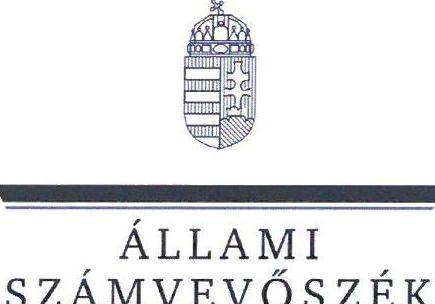
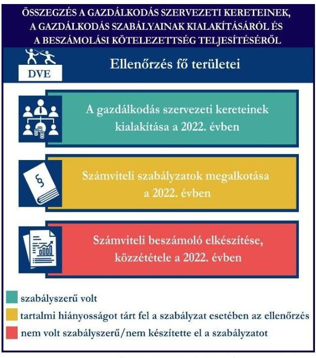
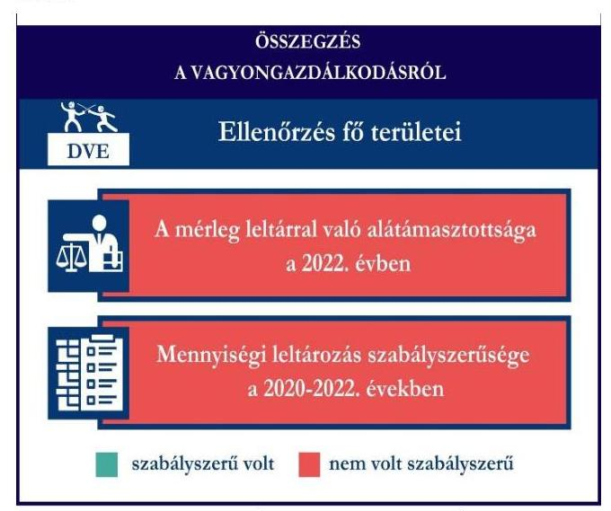
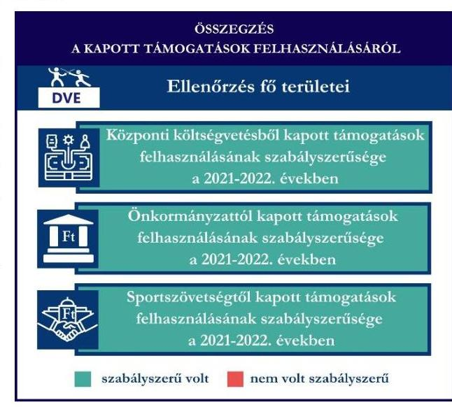

# JELENTÉS 

Támogatásban részesülő sportszövetségek és sportegyesületek gazdálkodásának ellenőrzése

Diósgyőri Vívó Egyesület

2024.

---

Állami
Számvevőszék

# JELENTÉS 

## Támogatásban részesülő sportszövetségek és sportegyesületek gazdálkodásának ellenőrzése

Diósgyőri Vívó Egyesület

2024.

---

# ELLENŐRZÉSI IGAZGATÓSÁG: 

## ÁLLAMHÁZTARTÁSON KÍVÜLI SZERVEZETEKET ELLENŐRZŐ IGAZGATÓSÁG

## ELLENŐRZÉSI IGAZGATÓ:

## KLINGA LÁSZLÓ igazgató

## ELLENŐRZÉSVEZETŐ:

Jelentéseink az interneten a www.asz.hu címen olvashatók.

## HOFMEISTER LÁSZLÓ ellenőrzésvezető

IKTATÓSZÁM: EL-4060-017/2024.
TÉMASZÁM: 2682
ELLENŐRZÉS-AZONOSÍTÓ SZÁM: V1026

---

# TARTALOMJEGYZÉK 

AZ ELLENŐRZÉS ALAPADATAI ..... 5
AZ ELLENŐRZÖTT SZERVEZET ..... 7
ÖSSZEFOGLALÁS ..... 8
AZ ELLENŐRZÉS FÓKUSZKÉRDÉSEI ..... 10
MEGÁLLAPÍTÁSOK ..... 11
JAVASLATOK ..... 14
MELLÉKLETEK ..... 15
I. sz. melléklet: Értelmező szótár ..... 15
II. sz. melléklet: Ellenőrzési kritériumok ..... 17
FÜGGELÉK: ÉSZREVÉTELEK ..... 18
RÖVIDÍTÉSEK JEGYZÉKE ..... 19

---

.

---

# AZ ELLENŐRZÉS ALAPADATAI 

## AZ ELLENŐRZÉS CÉLJA

Az ellenőrzés célja az államháztartásból nyújtott támogatással, vagy az államháztartásból meghatározott célra ingyenesen juttatott vagyon felhasználásával érintett sportszövetségek és sportegyesületek gazdálkodása szabályozottságának, gazdálkodási tevékenységének, ezen belül a beszámolási kötelezettség teljesítésének, a támogatások elkülönített nyilvántartásának, valamint a támogatások felhasználásának ellenőrzése.

## AZ ELLENŐRZÉS TÍPUSA

Szabályszerűségi ellenőrzés.

## AZ ELLENŐRZÖTT IDŐSZAK

Az 1. fókuszkérdés esetében a 2022. év.
A 2. fókuszkérdés vonatkozásában a 2021-2022. évek.
A 3. fókuszkérdés vonatkozásában a 2022. év, a mennyiségi felvétellel történő leltározás dokumentumai tekintetében a 2020-2022. évek.

## AZ ELLENŐRZÉS TÁRGYA

Az ellenőrzés tárgya a támogatásban részesülő sportszövetségek, sportegyesületek gazdálkodása szabályozottságának, gazdálkodási tevékenységén belül a beszámolási kötelezettség teljesítésének, a vagyonnyilvántartásának, a támogatások elkülönített nyilvántartásának, valamint az államháztartási forrásból származó közvetlen vagy közvetett támogatások és a meghatározott célra ingyenesen juttatott vagyon felhasználásának a vizsgálata volt. Az ellenőrzés a támogatások vonatkozásában kiterjedt továbbá a támogató felé történő beszámolási és elszámolási kötelezettségek teljesítésére, az ezekkel kapcsolatos jogszabályi és belső előírások betartására.

Az ellenőrzés kiterjedt minden olyan körülményre és adatra, amely az ÁSZ¹ jogszabályban meghatározott feladatainak teljesítéséhez, valamint az ellenőrzési program végrehajtása során felmerülő újabb összefüggések feltárásához szükséges.

## AZ ELLENŐRZÉS JOGALAPJA

Az ellenőrzés jogszabályi alapját az ÁSZ tv.² 1. § (3) bekezdése, az 5. § (3) bekezdése, valamint a Civil tv.³ 47. § előírásai képezték.

---

# AZ ELLENŐRZÉS MÓDSZERE 

Az ellenőrzést a nemzetközi standardokat irányadónak tekintve az ellenőrzési program szempontjai, az ellenőrzött időszakban hatályos jogszabályok, az ellenőrzés általános szakmai szabályai, az ellenőrzésre irányadó ÁSZ módszertanok figyelembevételével végezte az ÁSZ.

Az ellenőrzési kérdések megválaszolásához szükséges bizonyítékok megszerzése az ellenőrzött szervezet által rendelkezésre bocsátott dokumentumokra, adatokra alapozva kérdésfeltevés (információkérés), interjú, mintavételezés útján történt.

Az ellenőrzési bizonyítékként felhasználható adatforrások közé tartoztak egyrészt az ellenőrzés során az ellenőrzött szervezettől bekért dokumentumok, másrészt adatforrás lehetett minden további, az ellenőrzés folyamán feltárt, az ellenőrzés szempontjából információt tartalmazó dokumentum.

A támogatásokkal, azok felhasználásával, a továbbadott támogatásokkal kapcsolatos kötelezettségek vizsgálatára mintavételi eljárások kerültek alkalmazásra. Támogatás-típusok szerint nagyságrend alapján 1-3 darab támogatás került részletes vizsgálat alá. Ezen támogatások felhasználásának szabályszerűsége támogatásonként kockázatértékelés alapján kiválasztott mintatételekkel került ellenőrzésre. Ezen felül a vagyongazdálkodás szabályszerűségének ellenőrzéséhez is kockázatalapú mintavétel kapcsolódott. A támogatások felhasználása és a vagyongazdálkodás területén a minták ellenőrzése - a teljes folyamat szabályszerűségének megítélése nélkül - kiterjedt a könyvvezetési kötelezettség vizsgálatára is. A kiválasztott támogatási szerződésekhez kapcsolódó elszámolásokból 30-30 db mintatétel került ellenőrzésre, ahol a mintatételek száma nem érte el a 30 db-ot, ott tételes ellenőrzésre került sor. A tárgyi eszközök tekintetében 6 db eszköz tételesen került ellenőrzésre. A kiválasztott mintatételek ellenőrzésének eredménye nem került kivetítésre a teljes sokaságra, a megállapítások az adott ellenőrzött mintatételek vonatkozásában kerültek megjelenítésre.

---

# AZ ELLENŐRZÖTT SZERVEZET

## DIÓSGYŐRI VÍVÓ EGYESÜLET

A DVE⁴-t 1991-ben alapították, elsődleges célja a sport fejlesztése és fenntartása a vívó sportágban, valamint tagjai részére edzések tartása, versenyzési lehetőségek biztosítása, továbbá gondoskodás a sportolóik felkészítéséről. Taglétszáma 2022. december 31-én 47 fő volt. A DVE a jogszabályi előírások alapján nem volt kötelezett könyvvizsgálatra, felügyelőbizottság létrehozására. Az OBH⁵ nyilvántartása alapján 2010. november 03-a óta közhasznú jogállással rendelkezett.

A 2021-2022. években a DVE által igénybe vett államháztartási forrásból származó támogatásokat az 1. táblázat foglalja magában.

1. táblázat

|  A DVE ÁLTAL IGÉNYBE VETT TÁMOGATÁSOK (ADATOK M FT-BAN) |  |   |
| --- | --- | --- |
|   | 2021. FV | 2022. FV  |
|  Központi költségvetésből | 0,7 | -  |
|  Helyi önkormányzattól | 4,9 | 5,0  |
|  Magyar Vívó Szövetségtől | 7,3 | 7,4  |

---

# ÖSSZEFOGLALÁS 

Az Alaptörvény⁶ XX. cikke kimondja, hogy mindenkinek joga van a testi és lelki egészséghez, melynek érvényesülését Magyarország többek között a sportolás és a rendszeres testedzés támogatásával segíti elő. Az Országgyűlés⁷ a Sport tv.⁸-ben kinyilvánította, hogy a nemzet közössége a test művelését, a sportot, a nemzet alapértékének, kívánatos célnak tekinti. A sport a közjó része. Erősíti a közösség tagjainak egymáshoz tartozását, miként az egyén testi és lelki egészségét.

A sportegyesületek, sportszövetségek működésükre és szakmai tevékenységük ellátására költségvetési támogatásban, önkormányzati támogatásban, ingyenes vagyonjuttatásban, valamint látvány-csapatsport támogatásban részesülhetnek, amelyekre fokozott figyelem irányul.

A társadalom részéről jogosan felmerülő elvárás, hogy a közpénzeket kezelő, azzal gazdálkodó szervezetek működéséről, tevékenységéről átfogó képet kapjon, a közpénzek rendeltetésszerű és átlátható módon történő felhasználásának értékelésére időről-időre sor kerüljön az ellenőrzések keretében.
1. ábra

A DVE tekintetében a gazdálkodási szabályok kialakítása, a könyvvezetési kötelezettség teljesítése a 2022. évben összességében szabályszerű volt. A beszámolási kötelezettség teljesítése a 2022. évben nem volt szabályszerű.

A DVE a könyvviteli szolgáltatás személyi feltételeinek megteremtéséről gondoskodott, a 2022. évben a jogszabályban előírt számviteli szabályzatokkal rendelkezett, azonban a pénzkezelési szabályzat tekintetében az ellenőrzés hiányosságot tárt fel.

A könyvvezetés formája a 2022. évben megfelelt a jogszabályi előírásoknak. A 2022. évi számviteli beszámoló készítési kötelezettségét szabályszerűen, a közzétételi kötelezettségét nem a jogszabályoknak megfelelően teljesítette.

A gazdálkodás szervezeti keretei kialakításának, a számviteli szabályzatok megalkotásának, valamint a számviteli beszámoló elkészítésének és közzétételének értékelését az 1. ábra mutatja be.

---

A DVE a központi költségvetésből, a helyi önkormányzattól, valamint a központi költségvetésből az MVSZ⁹-en keresztül kapott támogatásokat az ellenőrzött tételek esetében szabályszerűen használta fel.

A támogatások felhasználásáról az előírt elkülönített nyilvántartást a 2021-2022. években nem minden ellenőrzött tétel esetében vezette szabályszerűen a számviteli rendszerében.

A kapott támogatások felhasználásának ellenőrzéséről az összegzést a 2. ábra tartalmazza.

Forrás: ÁSZ megállapítások alapján ÁSZ saját szerkesztés

A DVE vagyongazdálkodása a beszámoló leltárral való alátámasztottsága, a tárgyi eszközök üzembe helyezése és értékcsökkenésük elszámolása tekintetében, az ellenőrzött tételek esetében a 2022. évben nem volt szabályszerű.

A 2022. évi beszámolójának mérlegtételeit nem támasztotta alá szabályszerű leltárral, valamint a háromévenkénti mennyiségi felvétellel történő leltározást csak a tárgyi eszközök esetében végezte el a 2022. évben.

A vagyongazdálkodás ellenőrzésének összegzését a 3. ábra tartalmazza.

---

# AZ ELLENŐRZÉS FÓKUSZKÉRDÉSEI 

1.     - A gazdálkodási szabályok kialakítása, a könyvvezetési- és beszámolási kötelezettség teljesítése szabályszerű volt-e?
2.     - A kapott támogatások felhasználása szabályszerű volt-e?
3.     - Az ellenőrzött szervezet vagyongazdálkodása szabályszerű volt-e?

---

# MEGÁLLAPÍTÁSOK 

## 1. A gazdálkodási szabályok kialakítása, a könyvvezetési- és beszámolási kötelezettség teljesítése szabályszerű volt-e?

Összegző megállapítás A DVE a 2022. évben a gazdálkodási szabályokat kialakította, azonban a pénzkezelési szabályzat tekintetében az ellenőrzés hiányosságot tárt fel. A könyvvezetési, beszámolási kötelezettségét szabályszerűen, közzétételi kötelezettségét nem szabályszerűen teljesítette.

A könyvviteli szolgáltatás személyi feltételeinek teljesüléséről a DVE a 2022. évben a Számv. tv.¹⁰ és a Civilszr.¹¹-ben foglaltaknak megfelelően gondoskodott.
A 2022. évben a DVE rendelkezett a Számv. tv. előírásainak megfelelő számviteli politikával, az eszközök és a források leltárkészítési és leltározási szabályzatával, az eszközök és források értékelési szabályzatával, valamint számlarenddel.
A DVE 2022. évben hatályos pénzkezelési szabályzata a Számv. tv. 14. § (8) bekezdésében foglaltakkal ellentétben nem tartalmazta a napi készpénz záró állomány maximális mértékét, a készpénzállomány ellenőrzésekor követendő eljárást és az ellenőrzés gyakoriságát.
A DVE a Civilszr. előírásainak megfelelően kettős könyvvitel vezetésével teljesítette könyvvezetési kötelezettségét a 2022. évben. A könyvviteli nyilvántartásait a Számv. tv. és a Civilszr. rendelkezéseinek megfelelően úgy alakította ki, hogy a számviteli beszámolóban az egyéb bevételeken belül a tagdíjakat és a kapott támogatások összegét részletezni tudta.
A DVE a Civil tv.-nek megfelelő egyszerűsített éves beszámolóját, valamint a Civil vhr.¹² melléklete szerinti tartalommal a közhasznúsági mellékletet is elkészítette.
A 2022. évi számviteli beszámolót a Ptk., valamint a Civil tv. alapján a DVE legfőbb döntéshozó szerve hagyta jóvá.
A 2022. évi számviteli beszámolóját a DVE a Civil tv. 30. § (1) bekezdéseiben foglaltak ellenére a beszámoló részét képező kiegészítő melléklet nélkül helyezte letétbe, tette közzé.

## 2. A kapott támogatások felhasználása szabályszerű volt-e?

## Összegző megállapítás

A DVE a 2021. és 2022. évben kapott támogatásokat az ellenőrzött tételek vonatkozásában szabályszerűen használta fel. A könyvviteli rendszerében nem minden esetben különítette el szabályszerűen a kapott támogatások felhasználását.

A DVE az ellenőrzött támogatási szerződésekben foglaltak alapján, a központi költségvetéstől, a helyi önkormányzattól és a központi költségvetésből az MVSZ-en keresztül kapott támogatás bevételeit a Civil tv. előírásai alapján elkülönítette a számviteli rendszerében.

---

A DVE a 2021. évben kapott támogatást a központi költségvetéstől, amelynek elszámolásához egy számla tartozott. A támogatás felhasználásának számviteli bizonylatán záradékolt összeg nem egyezett meg a támogatás felhasználásának elkülönített számviteli nyilvántartásában szereplő összeggel, ezzel a DVE nem tett eleget a Civil tv. 20. § (4) bekezdésében előírtaknak, nem olyan elkülönített számviteli nyilvántartást vezetett, amelynek alapján támogatásonként megállapítható és ellenőrizhető lett volna a kapott támogatás felhasználása. A DVE a 2021. évben a központi költségvetésből részére jutatott támogatás felhasználásáról a támogató felé benyújtott beszámolót és annak részeként az összesített elszámolási táblázatot a támogatási szerződésekben előírt formában és tartalommal elkészítette. A támogatás felhasználásáról a támogató felé benyújtott elszámolást alátámasztó számviteli bizonylat a Számv. tv.-ben foglalt alaki és tartalmi követelményeknek megfelelt, a támogató felé benyújtott számla a 474/2016. (XII. 27.) Korm. rendeletben¹³ előírtaknak megfelelően záradékolásra került.
A Számv. tv., valamint a Civil tv. előírásainak megfelelően a DVE az ellenőrzött önkormányzati támogatási szerződésekben meghatározott támogatási bevételeket és azok felhasználását a 2021-2022. években elkülönítetten mutatta ki a számviteli nyilvántartásában. A DVE a támogatási szerződésben foglalt előírások alapján teljesítette a beszámolási kötelezettségét az önkormányzati támogatás rendeltetésszerű felhasználásáról a 2021-2022. években. A DVE a 2021-2022. években elszámolt önkormányzati támogatások ellenőrzött tételeit a Számv. tv.-ben előírtaknak megfelelő, szabályszerű számviteli bizonylattal alátámasztotta, a támogatási szerződésekben foglaltak alapján záradékolta, azaz a ráfordítás számviteli bizonylatán jelezte a támogatás terhére elszámolt összeget.
A DVE a 2021-2022. években a Számv. tv. 161/A. § (2) bekezdésében foglaltak ellenére a Civil tv. 20. § (4) bekezdésében előírt alapcél szerinti tevékenysége költségei, ráfordításai ellentételezésére a központi költségvetésből az MVSZ-en keresztül kapott ellenőrzött támogatásokról

 nem olyan elkülönített számviteli nyilvántartást vezetett, amelynek alapján támogatásonként megállapítható és ellenőrizhető lett volna a kapott támogatás felhasználása. A DVE a központi költségvetésből az MVSZ-en keresztül kapott támogatás felhasználásának elkülönített számviteli nyilvántartását a 2021-2022. években a számviteli rendszerében kialakította, azonban az ellenőrzött ráfordítások közül kilenc tételnél a támogatás felhasználásának számviteli bizonylatán záradékolt összeg nem egyezett meg a támogatás felhasználásának elkülönített számviteli nyilvántartásában szereplő összeggel. Ez alapján a támogatások felhasználásáról készített összesítő elszámolásokban szereplő tételek, az elkülönített számviteli nyilvántartásban szereplő támogatásonként elkülönített adatokkal nem voltak egyeztethetők. A központi költségvetésből az MVSZen keresztül számára jutatott támogatásokról a támogatási szerződésekben előírt formában és tartalommal a pénzügyi elszámolást és a szakmai beszámolót elkészítette, és benyújtotta a támogató felé. A támogatások felhasználásáról a támogató felé benyújtott elszámolásokat alátámasztó számviteli bizonylatok a Számv. tv.-ben foglalt alaki és tartalmi követelményeknek megfeleltek.
A DVE közhasznú szervezetként a számviteli beszámolóinak kiegészítő mellékletében a Számv. tv., a Civil tv. előírásainak megfelelően mutatta be a 2021. és 2022. években a támogatási programok keretében végleges jelleggel felhasznált összegeket támogatásonként.

---

# 3. Az ellenőrzött szervezet vagyongazdálkodása szabályszerű volt-e? 

## Összegző megállapítás

A DVE vagyongazdálkodása a 2022. évben nem volt szabályszerű az ellenőrzött tételek vonatkozásában. A 2022. évi beszámolójának mérlegtételeit szabályszerű leltárral nem támasztotta alá.

A DVE a Számv. tv. 69. § (1)-(2) bekezdéseiben foglaltak ellenére a 2022. év beszámolójának mérlegét, a mérlegben szereplő eszközöket és forrásokat nem támasztotta alá leltárral, nem végezte el a főkönyvi könyvelés és az analitikus nyilvántartások adatai közötti egyeztetést. A DVE a háromévenkénti mennyiségi felvétellel történő leltározással a mérlegben szerepelő adatok valódiságát a 2020-2022. években a Számv. tv. 69. § (3) bekezdésében foglaltak ellenére - a tárgyi eszközök kivételével - nem támasztotta alá.

Egy tárgyi eszköz esetében a DVE-nél a bekerülési értékét alátámasztó bizonylat nem került megőrzésre, a Számv. tv. 169. § (2) bekezdésében foglaltak ellenére. A DVE-nél a további ellenőrzött tételek vonatkozásában a tárgyi eszközök bekerülési értékét, az értékesedés elszámolását a Számv. tv. előírás szerint határozták meg, az üzembe helyezést a tárgyi eszközök vonatkozásában a Számv. tv.-ben előírtak alapján dokumentálták.

---

# JAVASLATOK 

Az ÁSZ tv. 33. § (1) bekezdésében foglaltak értelmében az ellenőrzött szervezet vezetője köteles a jelentésben foglalt megállapításokhoz kapcsolódó intézkedési tervet összeállítani és azt a jelentés kézhezvételétől számított 30 napon belül az ÁSZ részére megküldeni. Amennyiben az ellenőrzött szervezet vezetője nem küldi meg határidőben az intézkedési tervet, vagy továbbra sem elfogadható intézkedési tervet küld, az Állami Számvevőszék elnöke az ÁSZ tv. 33. § (3) bekezdése a) és b) pontjaiban foglaltakat érvényesítheti.

## A Diósgyőri Vívó Egyesület elnökének

1. Gondoskodjon a pénzkezelési szabályzat Számv. tv. 14. § (8) bekezdésében foglaltaknak megfelelő elkészítéséről.
2. Gondoskodjon a számviteli beszámoló letétbe helyezéséről, közzétételéről a Civil tv. 30. § (1) bekezdésében előírtaknak megfelelően.
3. Gondoskodjon a központi költségvetésből, valamint a központi költségvetésből az MVSZ-en keresztül kapott támogatások elkülönített számviteli nyilvántartásának vezetéséről, amely alapján támogatásonként megállapítható és ellenőrizhető a kapott támogatás felhasználása, a Civil tv. 20. § (4) bekezdés és a Számv. tv. 161/A. § (2) bekezdés előírásai alapján.
4. Gondoskodjon a beszámoló mérlegtételeinek leltárral való alátámasztásáról, valamint a mennyiségi felvétellel elvégzendő leltározásáról a Számv. tv. 69. § (1)-(3) bekezdéseiben előírtaknak megfelelően.
5. Gondoskodjon a bizonylat megőrzési kötelezettségének teljesítéséről a Számv. tv. 169. § (2) bekezdésében előírtak szerint.

---

# MELLÉKLETEK 

## I. SZ. MELLÉKLET: ÉRTELMEZŐ SZÓTÁR

civil szervezet
egyesület
költségvetési támogatás
közhasznú szervezet
közhasznú tevékenység
sportági szövetség
sportegyesület

A civil társaság; a Magyarországon nyilvántartásba vett egyesület - a párt, a szakszervezet és a kölcsönös biztosító egyesület kivételével és a közalapítvány és a pártalapítvány kivételével - az alapítvány. (Forrás: Civil tv. 2. §6. pont a) -c) alpontjai)
Az egyesület a tagok közös, tartós, alapszabályban meghatározott céljának folyamatos megvalósítására létesített, nyilvántartott tagsággal rendelkező jogi személy. (Forrás: Ptk. ${ }^{14}$ 3:63. § (1) bekezdés)
A Számv. tv. szempontjából egyéb szervezet. (Számv. tv. 3. § (1) bekezdés 4. pont a) alpontja)
A társadalombiztosítás pénzügyi alapjai kivételével az államháztartás központi alrendszeréből ellenérték nélkül, pénzben nyújtott támogatások. (Forrás: Áht ${ }^{15}$. 1. § 14. pont)
Közhasznú szervezetté minősíthető a Magyarországon nyilvántartásba vett közhasznú tevékenységet végző szervezet, amely a társadalom és az egyén közös szükségleteinek kielégítéséhez megfelelő erőforrásokkal rendelkezik, továbbá amelynek megfelelő társadalmi támogatottsága kimutatható, és amely:
a) civil szervezet (ide nem értve a civil társaságot), vagy
b) olyan egyéb szervezet, amelyre vonatkozóan a közhasznú jogállás megszerzését törvény lehetővé teszi. (Forrás: Civil tv. 32. § (1) bekezdés)
Minden olyan tevékenység, amely a létesítő okiratban megjelölt közfeladat teljesítését közvetlenül vagy közvetve szolgálja, ezzel hozzájárulva a társadalom és az egyén közös szükségleteinek kielégítéséhez. (Forrás: Civil tv. 2. § 20. pont)
A Civil tv. és a Ptk. előírásai alapján - a Sport tv.-ben meghatározott eltérésekkel - működő szövetség, amelynek tagjai kizárólag sportszervezetek lehetnek. Sportági szövetség országos jelleggel is működhet. Egy sportágban csak egy országos sportági szövetség működhet. Törvényi feltételek teljesülése esetén szakszövetségi feladatokat is elláthat. (Forrás: Sport tv. 28. §)
A Civil tv. és a Ptk. szabályai szerint működő olyan egyesület, amelynek alaptevékenysége a sporttevékenység szervezése, valamint a sporttevékenység feltételeinek megteremtése. A sportegyesületek a Sport. tv. 15. § (1) bekezdésében meghatározott sportszervezetek körébe tartoznak. A sportegyesületeken kívül sportszervezet még a sportvállalkozás, a sportiskola, valamint az utánpótlás-nevelés fejlesztését végző alapítvány. (Forrás: Sport tv. 16. § (1) bekezdés)

---

sportegyesületeknek, sportszövetségeknek nyújtott költségvetési támogatás
sportszövetség
sporttevékenység

Az állami sport célú támogatások felhasználásáról és elosztásáról szóló 474/2016. (XII. 27.) Kormány rendelet 1. § (1) bekezdésében és a 27/2013. (III. 29.) EMMI rendelet ${ }^{16}$ 1. $\mathbb{S}$-ában meghatározott fejezeti kezelésű előirányzatokból nyújtott támogatás.
Meghatározott sporttevékenységek körében a sportversenyek szervezésére, a tagok érdekvédelmére és a részükre való szolgáltatásokra, valamint a nemzetközi kapcsolatok lebonyolítására létrehozott, jogi személyiséggel és önkormányzattal rendelkező, a Civil tv. és a Ptk. alapján - az e törvényben foglalt eltérésekkel - különös formában működő egyesületek. A Sport tv. 19. § (3) bekezdése szerint a sportszövetségeknek az alábbi típusai léteznek: országos sportági szakszövetségek, sportági szövetségek, szabadidősport szövetségek, fogyatékosok sportszövetségei, diák- és egyetemi-főiskolai sport sportszövetségei, nemzetközi sportszövetségek. (Forrás: Sport tv. 19. § (1), (3) bekezdés)

Meghatározott szabályok szerint, a szabadidő eltöltéseként kötetlenül vagy szervezett formában, illetve versenyszerűen végzett testedzés vagy szellemi sportágban kifejtett tevékenység, amely a fizikai erőnlét és a szellemi teljesítőképesség megtartását, fejlesztését szolgálja. (Forrás: Sport tv. 1. § (2) bekezdés)

---

# II. SZ. MELLÉKLET: ELLENŐRZÉSI KRITÉRIUMOK 

## FÓKUSZKÉRDÉS

## 1. fókuszkérdés:

A gazdálkodási szabályok kialakítása, a könyvvezetési és beszámolási kötelezettség teljesítése szabályszerű volt-e?

## 2. fókuszkérdés:

A kapott támogatások felhasználása szabályszerű volt-e?

## 3. fókuszkérdés:

Az ellenőrzött szervezet vagyongazdálkodása szabályszerű volt-e?

## ELLENŐRZÉSI KRITÉRIUMOK

Számv. tv. 14. § (3) bekezdés, (5) bekezdés a), b), d) pont, (8) bekezdés, 69. $\S$ (3) bekezdés, 90. $\S$ (3) bekezdés c) pont, 161. $\S$ (1) bekezdés, (2) bekezdés a) -d) pont, (3)-(4) bekezdés, 161/A. $\S$ (2) bekezdés, 165. $\S$ (2) bekezdés
Civilszr. 7. § (1) bekezdés, (4) bekezdés b), c) pont, 8. § (2), (3) bekezdés, 9. § (4), (5), (8) bekezdés, 12. § (4), (5) bekezdés, 15. § (1) bekezdés a), b) pont, 16. § (1) bekezdés, 24. § (2) bekezdés

Ptk. 3:26. § (1) bekezdés, 3:27. § (1) bekezdés, 3:82. § (1) bekezdés,
Civil tv. 28. § (1) bekezdés, 29. § (2) bekezdés c) pont, (3), (6), (7) bekezdés, 30. § (1)-(4) bekezdés 40. § (1), (2) bekezdés, 41. § (1) bekezdés
Civil vhr.
Sport tv. 23. § (1) bekezdés f) pont
Számv. tv. 44. § (2) bekezdés, 93. § (3) bekezdés, 159. §,
165. § (2) bekezdés, 167. § (1) bekezdés a), d), e), h) pont

Civil tv. 20. § (2) bekezdés a) pont, (3) bekezdés a), c) pont, (4) bekezdés, 29. § (4), (5) bekezdés
Civilszr. 24. § (2) bekezdés
27/2013. (III.29.) EMMI rend. 18. § (2) bekezdés
474/2016. (XII. 27.) Korm. rend. 22. § (2) bekezdés, 24. § (2) bekezdés

Számv. tv. 16. § (2) bekezdés, 23. § (2) bekezdés, 26. §, 42. § (5) bekezdés, 46. § (3) bekezdés, 47-53. §, 69. §, 159. §, 161/A. §, 162. § (1)-(2) bekezdés, 165-166. §, 169. §

Ávr. ${ }^{17}$ 93. § (5) bekezdés
107/2011. (VI. 30.) Korm. rend. 11. § (5) bekezdés
474/2016. (XII. 27.) Korm. rend. 17. § (1) bekezdés 11a., 11b. pont, 17. § (2a) bekezdés, 24. § (2) bekezdés
Tao. tv. 22/C. §.

---

# FÜGGELÉK: ÉSZREVÉTELEK 

A jelentéstervezetet a Számvevőszék 15 napos észrevételezésre megküldte az ellenőrzött szervezet vezetőjének az ÁSZ tv. 29. § (1) bekezdése előírásának megfelelően.

Az ellenőrzött szervezet elnöke a jelentéstervezetre nem tett észrevételt.

* 29. § (1) Az Állami Számvevőszék az ellenőrzési megállapításait megküldi az ellenőrzött szervezet vezetőjének vagy az általa megbízott személynek, és annak, akinek személyes felelősségét állapította meg.
(2) Az ellenőrzött szervezet vezetője és a felelősként megjelölt személy az ellenőrzés megállapításaira tizenöt napon belül írásban észrevételt tehet.
(3) Az Állami Számvevőszék az észrevételre a beérkezésétől számított harminc napon belül írásban válaszol. A figyelembe nem vett észrevételeket köteles a jelentésben feltüntetni, és megindokolni, hogy azokat miért nem fogadta el.

---

# RÖVIDÍTÉSEK JEGYZÉKE 

${ }^{1}$ ÁSZ
${ }^{2}$ Ász tv.
${ }^{3}$ Civil tv.
${ }^{4}$ DVE
${ }^{5}$ OBH
${ }^{6}$ Alaptörvény
${ }^{7}$ Országgyúlés
${ }^{8}$ Sport tv.
${ }^{9}$ MVSZ
${ }^{10}$ Számv. tv.
${ }^{11}$ Civilszr.
${ }^{12}$ Civil vhr.
${ }^{13}$ 474/2016. (XII. 27.) Korm. rendelet
${ }^{14}$ Ptk.
${ }^{15}$ Áht.
${ }^{16}$ 27/2013. (III.29.) EMMI rendelet
${ }^{17}$ Ávr.

Állami Számvevőszék
2011. évi LXVI. törvény az Állami Számvevőszékről
2011. évi CLXXV. törvény az egyesülési jogról, a közhasznú jogállásról, valamint a civil szervezetek működéséről és támogatásáról
Diósgyőri Vívó Egyesület
Országos Bírósági Hivatal
Magyarország Alaptörvénye
Magyarország Országgyűlése
2004. évi I. törvény a sportról

Magyar Vívó Szövetség
2000. évi C. törvény a számvitelről

479/2016. (XII. 28.) Korm. rendelet a számviteli törvény szerinti egyes egyéb szervezetek beszámoló készítési és könyvvezetési kötelezettségének sajátosságairól
350/2011. (XII. 30.) Korm. rendelet a civil szervezetek gazdálkodása, az adománygyűjtés és a közhasznúság egyes kérdéseiről
474/2016. (XII. 27.) Korm. rendelet az állami sport célú támogatások felhasználásáról és elosztásáról
2013. évi V. törvény a Polgári Törvénykönyvről
2011. évi CXCV. törvény az államháztartásról

27/2013. (III. 29.) EMMI rendelet az állami sport célú támogatások felhasználásáról és elosztásáról
368/2011. (XII. 31.) Korm. rendelet az államháztartásról szóló törvény végrehajtásáról

---

1052 Budapest, Apáczai Csere János u. 10. | 1364 Budapest 4., Pf. 54
www.asz.hu | szamvevoszek@asz.hu
telefon: +36 1 4849100

