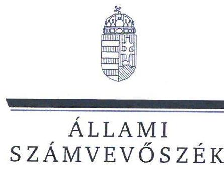
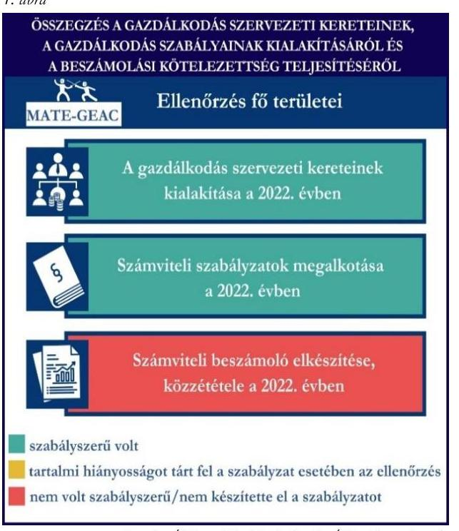
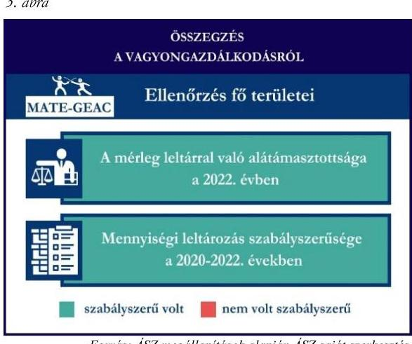

# JELENTÉS 

Támogatásban részesülő sportszövetségek és sportegyesületek gazdálkodásának ellenőrzése

MATE - Gödöllői Egyetemi Atlétikai Club

2024.

---

ÁLLAMI
SZÁMVEVŐSZÉK

# JELENTÉS 

## Támogatásban részesülő sportszövetségek és sportegyesületek gazdálkodásának ellenőrzése

MATE - Gödöllői Egyetemi Atlétikai Club

2024.

---

# ELLENŐRZÉSI IGAZGATÓSÁG: 

## ÁLLAMHÁZTARTÁSON KÍVÜLI SZERVEZETEKET ELLENŐRZŐ IGAZGATÓSÁG

## ELLENŐRZÉSI IGAZGATÓ:

## KLINGA LÁSZLÓ igazgató

## ELLENŐRZÉSVEZETŐ:

Jelentéseink az interneten a www.asz.hu címen olvashatók.

## HOFMEISTER LÁSZLÓ ellenőrzésvezető

IKTATÓSZÁM: EL-4060-015/2024.
TÉMASZÁM: 2682
ELLENŐRZÉS-AZONOSÍTÓ SZÁM: V1026

---

# TARTALOMJEGYZÉK 

- AZ ELLENŐRZÉS ALAPADATAI ..... 5
- AZ ELLENŐRZÖTT SZERVEZET ..... 7
- ÖSSZEFOGLALÁS ..... 8
- AZ ELLENŐRZÉS FÓKUSZKÉRDÉSEI ..... 10
- MEGÁLLAPÍTÁSOK ..... 11
- JAVASLATOK ..... 14
- MELLÉKLETEK ..... 15
I. sz. melléklet: Értelmező szótár ..... 15
II. sz. melléklet: Ellenőrzési kritériumok ..... 17
- FÜGGELÉK: ÉSZREVÉTELEK ..... 18
- RÖVIDÍTÉSEK JEGYZÉKE ..... 19

---

.

---

# AZ ELLENŐRZÉS ALAPADATAI 

## AZ ELLENŐRZÉS CÉLJA

Az ellenőrzés célja az államháztartásból nyújtott támogatással, vagy az államháztartásból meghatározott célra ingyenesen juttatott vagyon felhasználásával érintett sportszövetségek és sportegyesületek gazdálkodása szabályozottságának, gazdálkodási tevékenységének, ezen belül a beszámolási kötelezettség teljesítésének, a támogatások elkülönített nyilvántartásának, valamint a támogatások felhasználásának ellenőrzése.

## AZ ELLENŐRZÉS TÍPUSA

Szabályszerűségi ellenőrzés.

## AZ ELLENŐRZÖTT IDŐSZAK

Az 1. fókuszkérdés esetében a 2022. év.
A 2. fókuszkérdés vonatkozásában a 2021-2022. évek.
A 3. fókuszkérdés vonatkozásában a 2022. év, a mennyiségi felvétellel történő leltározás dokumentumai tekintetében a 2020-2022. évek.

## AZ ELLENŐRZÉS TÁRGYA

Az ellenőrzés tárgya a támogatásban részesülő sportszövetségek, sportegyesületek gazdálkodása szabályozottságának, gazdálkodási tevékenységén belül a beszámolási kötelezettség teljesítésének, a vagyonnyilvántartásának, a támogatások elkülönített nyilvántartásának, valamint az államháztartási forrásból származó közvetlen vagy közvetett támogatások és a meghatározott célra ingyenesen juttatott vagyon felhasználásának a vizsgálata volt. Az ellenőrzés a támogatások vonatkozásában kiterjedt továbbá a támogató felé történő beszámolási és elszámolási kötelezettségek teljesítésére, az ezekkel kapcsolatos jogszabályi és belső előírások betartására.

Az ellenőrzés kiterjedt minden olyan körülményre és adatra, amely az ÁSZ ${ }^{1}$ jogszabályban meghatározott feladatainak teljesítéséhez, valamint az ellenőrzési program végrehajtása során felmerülő újabb összefüggések feltárásához szükséges.

Az 1. és 3. fókuszkérdés tekintetében az ellenőrzés a teljes ellenőrzött szervezetre, a 2. fókuszkérdés tekintetében kizárólag a vívó szakosztályra vonatkozott.

## AZ ELLENŐRZÉS JOGALAPJA

Az ellenőrzés jogszabályi alapját az ÁSZ tv. ${ }^{2} 1 . \int(3)$ bekezdése, az 5. $\int(3)$ bekezdése, valamint a Civil tv. ${ }^{3} 47 . \int$ előírásai képezték.

---

# AZ ELLENŐRZÉS MÓDSZERE 

Az ellenőrzést a nemzetközi standardokat irányadónak tekintve az ellenőrzési program szempontjai, az ellenőrzött időszakban hatályos jogszabályok, az ellenőrzés általános szakmai szabályai, az ellenőrzésre irányadó ÁSZ módszertanok figyelembevételével végezte az ÁSZ.

Az ellenőrzési kérdések megválaszolásához szükséges bizonyítékok megszerzése az ellenőrzött szervezet által rendelkezésre bocsátott dokumentumokra, adatokra alapozva kérdésfeltevés (információkérés), interjú, mintavételezés útján történt.

Az ellenőrzési bizonyítékként felhasználható adatforrások közé tartoztak egyrészt az ellenőrzés során az ellenőrzött szervezettől bekért dokumentumok, másrészt adatforrás lehetett minden további, az ellenőrzés folyamán feltárt, az ellenőrzés szempontjából információt tartalmazó dokumentum.

A támogatásokkal, azok felhasználásával kapcsolatos kötelezettségek vizsgálatára mintavételi eljárások kerültek alkalmazásra. Támogatás-típusok szerint nagyságrend alapján 1-3 darab támogatás került részletes vizsgálat alá. Ezen támogatások felhasználásának szabályszerűsége támogatásonként kockázatértékelés alapján kiválasztott mintatételekkel került ellenőrzésre. Ezen felül a vagyongazdálkodás szabályszerűségének ellenőrzéséhez is kockázatalapú mintavétel kapcsolódott. A támogatások felhasználása és a vagyongazdálkodás területén a minták ellenőrzése - a teljes folyamat szabályszerűségének megítélése nélkül kiterjedt a könyvvezetési kötelezettség vizsgálatára is. A kiválasztott támogatási szerződésekhez kapcsolódó elszámolásokból 30-30 db mintatétel került ellenőrzésre, ahol a mintatételek száma nem érte el a 30 db -ot, ott tételes ellenőrzésre került sor. A tárgyi eszközök tekintetében 30 db került kiválasztásra a 2022. évben állományban lévő eszközök közül azok nyilvántartásának, elszámolásának szabályszerűsége ellenőrzése céljából. A kiválasztott mintatételek ellenőrzésének eredménye nem került kivetítésre a teljes sokaságra, a megállapítások az adott ellenőrzött mintatételek vonatkozásában kerültek megjelenítésre.

---

# AZ ELLENŐRZÖTT SZERVEZET

## MATE -GÖDÖLLŐI EGYETEMI ATLÉTIKAI CLUB

Az 1950-ben alapított MATE-GEAC ${ }^{4}$ alapszabálya szerinti elsődleges célja a rendszeres sportolás, versenyzés, testedzés biztosítása, valamint az általános egészséges életmód népszerűsítése. Ezenkívül támogatják a tehetséggondozást és az utánpótlás-nevelést is.

A MATE-GEAC-nél 14 szakosztály működött az ellenőrzött időszakban, taglétszáma a 100 főt meghaladta 2022. december 31-én.

A jogszabályi előírás alapján a MATE-GEAC könyvvizsgálatra nem, felügyelőbizottság létrehozására kötelezett volt. A 2022. évben az alapcéljai megvalósítása érdekében vállalkozási tevékenységet is végzett. A MATE-GEAC az $\mathrm{OBH}^{5}$ nyilvántartása alapján közhasznú jogállással nem rendelkezett.

A 2021-2022. években a MATE-GEAC által igénybe vett állambáztartási forrásból származó támogatásokat az 1. táblázat mutatja be.

1. táblázat

A MATE-GEAC ÁLTAL IGÉNYBE VETT TÁMOGATÁSOK (ADATOK M FT-BAN)

|   | 2021. FV | 2022. FV  |
| --- | --- | --- |
|  Központi költségvetésből* | 27,8 | 41,7  |
|  Helyi önkormányzattól* | 2,0 | 2,0  |
|  Magyar Vívó Szövetségtől | 4,9 | 6,6  |
|  * több szakosztályt érintő támogatás |  |   |

---

# ÖSSZEFOGLALÁS 

Az Alaptörvény ${ }^{6}$ XX. cikke kimondja, hogy mindenkinek joga van a testi és lelki egészséghez, melynek érvényesülését Magyarország többek között a sportolás és a rendszeres testedzés támogatásával segíti elő. Az Országgyűlés ${ }^{7}$ a Sport tv. ${ }^{8}$-ben kinyilvánította, hogy a nemzet közössége a test művelését, a sportot, a nemzet alapértékének, kívánatos célnak tekinti. A sport a közjó része. Erősíti a közösség tagjainak egymáshoz tartozását, miként az egyén testi és lelki egészségét.

A sportegyesületek, sportszövetségek múködésükre és szakmai tevékenységük ellátására költségvetési támogatásban, önkormányzati támogatásban, ingyenes vagyonjuttatásban, valamint látvány-csapatsport támogatásban részesülhetnek, amelyekre fokozott figyelem irányul.

A társadalom részéről jogosan felmerülő elvárás, hogy a közpénzeket kezelő, azzal gazdálkodó szervezetek múködéséről, tevékenységéről átfogó képet kapjon, a közpénzek rendeltetésszerủ és átlátható módon történő felhasználásának értékelésére időről-időre sor kerüljön az ellenőrzések keretében.

A MATE-GEAC tekintetében a gazdálkodási keretek kialakításra kerültek, azonban a beszámolási kötelezettség teljesítése nem volt szabályszerű a 2022. évben.

A MATE-GEAC a könyvviteli szolgáltatás személyi feltételeinek megteremtéséről, felügyelőbizottság létrehozásáról és múködéséről gondoskodott.

A MATE-GEAC a jogszabályi előírások szerint kialakította a kötelező számviteli szabályzatokat.

A könyvvezetés formája a 2022. évben megfelelt a jogszabályi előírásoknak. A 2022. évről a számviteli beszámoló és közhasznúsági melléklet készítési- és közzétételi kötelezettségét nem a jogszabályoknak megfelelően teljesítette, számviteli beszámolója nem tartalmazta a kiegészítő mellékletet.

A gazdálkodás szervezeti keretei kialakításának, a számviteli szabályzatok megalkotásának, valamint a számviteli beszámoló elkészítésének és közzétételének értékelését az 1. ábra mutatja be.

---

A MATE-GEAC a helyi önkormányzattól, valamint a központi költségvetésből az MVSZ ${ }^{9}$-en keresztül kapott támogatásokat a támogatási célnak megfelelően használta fel az ellenőrzött tételek esetében.

A támogatások felhasználásáról az előírt elkülönített nyilvántartást a 2021-2022. években nem minden ellenőrzött tétel esetében vezette szabályszerűen a számviteli rendszerében.

A kapott támogatások felhasználásának ellenőrzéséről az összegzést a 2. ábra tartalmazza.

A MATE-GEAC vagyongazdálkodása a beszámoló leltárral való alátámasztottsága, a tárgyi eszközök üzembe helyezése és értékesökkenésük elszámolása az ellenőrzött tételek esetében a 2022. évben szabályszerű volt.

A 2022. évi beszámolójának mérlegtételeit alátámasztotta szabályszerű leltárral, valamint 2022. évben a mennyiségi felvétellel történő leltározást elvégezte.

A vagyongazdálkodás ellenőrzésének összegzését a 3. ábra tartalmazza.

---

# AZ ELLENŐRZÉS FÓKUSZKÉRDÉSEI 

1. A gazdálkodási szabályok kialakítása, a könyvvezetési- és beszámolási kötelezettség teljesitése szabályszerű volt-e?
2. A kapott támogatások felhasználása szabályszerű volt-e?
3. Az ellenőrzött szervezet vagyongazdálkodása szabályszerű volt-e?

---

# MEGÁLLAPÍTÁSOK 

## 1. A gazdálkodási szabályok kialakítása, a könyvvezetési- és beszámolási kötelezettség teljesítése szabályszerű volt-e?

Összegző megállapítás A MATE-GEAC a 2022. évben a gazdálkodási szabályokat kialakította, a könyvvezetési kötelezettség teljesítése szabályszerű volt. A beszámolási kötelezettség teljesítése a kiegészítő melléklet hiánya miatt nem volt szabályszerű.

A könyvviteli szolgáltatás személyi feltételeinek teljesüléséről a MATE-GEAC a 2022. évben a Számv. tv. ${ }^{10}$ és a Civilszr. ${ }^{11}$-ben foglaltaknak megfelelően gondoskodott.
A 2022. évben a MATE-GEAC a Ptk. ${ }^{12}$ előírásainak betartásával gondoskodott az előírt felügyelőbizottság létrehozásáról, a felügyelőbizottsága rendelkezett önálló ügyrenddel.
A MATE-GEAC a 2022. évben rendelkezett a Számv. tv. előírásainak megfelelő számviteli politikával, annak keretében az eszközök és a források leltárkészítési és leltározási szabályzatával, az eszközök és források értékelési szabályzatával, pénzkezelési szabályzattal, valamint számlarenddel.
A MATE-GEAC a Civilszr. előírásainak megfelelően kettős könyvvitel vezetésével teljesítette könyvvezetési kötelezettségét a 2022. évben. A 2022. évben a MATE-GEAC végzett vállalkozási tevékenységet, melynek bevételeit és ráfordításait a könyvvezetése során a Civil tv.-nek megfelelően az alaptevékenységtől elkülönítetten tartotta nyilván és mutatta ki beszámolójában. A könyvviteli nyilvántartásait a Számv. tv. és a Civilszr. rendelkezéseinek megfelelően úgy alakította ki, hogy a beszámolóban az egyéb bevételeken belül a tagdijakat és a kapott támogatások összegét részletezni tudta. A MATE-GEAC a Civil tv. 29. § (2) bekezdés c) pontjában foglalt előírások ellenére a 2022. évi egyszerűsített éves beszámolójához kiegészítő mellékletet nem készített. A számviteli beszámolójával egyidejűleg elkészítette a Civil vhr. ${ }^{13}$ melléklete szerinti tartalommal a közhasznúsági mellékletet.
A 2022. évi egyszerűsített éves beszámolóját a Ptk. és a Civil tv. alapján a MATE-GEAC felügyelőbizottsága véleményezte, a legfőbb döntéshozó szerve jóváhagyta. A 2022. évi számviteli beszámoló részét képező kiegészítő melléklet hiánya miatt a letétbe helyezés és a közzététel nem felelt meg a Civil. tv. 30. § (3) -(4) bekezdéseiben foglaltaknak.

---

# 2. A kapott támogatások felhasználása szabályszerű volt-e? 

Összegző megállapítás

A MATE-GEAC a 2021-2022. években a vívó szakosztálya részére nyújtott támogatásokat szabályszerűen használta fel az ellenőrzött tételek vonatkozásában, azonban a könyvviteli rendszerében nem minden esetben különítette el szabályszerűen a kapott támogatások felhasználását.

A MATE-GEAC a helyi önkormányzattól, valamint a központi költségvetésből az MVSZ-en keresztül kapott támogatások bevételeit a Civil tv. előírásai alapján elkülönítetten mutatta ki számviteli rendszerében.
A MATE-GEAC a 2021-2022. években a Számv. tv. 161/A. § (2) bekezdésében foglaltak ellenére a Civil tv. 20. § (4) bekezdésében előírt alapcél szerinti tevékenysége költségei, ráfordításai ellentételezésére az önkormányzattól, valamint a központi költségvetésből az MVSZ-en keresztül kapott ellenőrzött támogatásokról nem olyan elkülönített számviteli nyilvántartást vezetett, amelynek alapján támogatásonként megállapítható és ellenőrizhető lett volna a kapott támogatás felhasználása. A helyi önkormányzattól kapott támogatás terhére elszámolt, ellenőrzött tételekből egy tételnél, a központi költségvetésből az MVSZ-en keresztül kapott támogatás terhére elszámolt, ellenőrzött tételetekből kilenc tételnél a támogatások felhasználásának számviteli bizonylatán záradékolt összeg nem egyezett meg a támogatások felhasználásának elkülönített számviteli nyilvántartásában szereplő összeggel. Ez alapján az egyes támogatások felhasználásáról készített elszámolások könyvviteli nyilvántartással, az abban szereplő támogatásonkénti elkülönített adatokkal nem voltak alátámasztottak.
A MATE-GEAC a támogatási szerződésben foglalt előírások alapján teljesítette a beszámolási kötelezettségét az önkormányzati támogatás rendeltetésszerű felhasználásáról a 2021-2022. években. A MATE-GEAC a 2021-2022. években elszámolt önkormányzati támogatások ellenőrzött tételeit a Számv. tv.-ben előírtaknak megfelelő, szabályszerű számviteli bizonylattal alátámasztotta.
A MATE-GEAC a 2021. és 2022. évben a központi költségvetésből az MVSZ-en keresztül számára jutatott támogatásokról a támogatási szerződésekben foglaltak szerint beszámolt a támogató felé. A MATE-GEAC a 2021-2022. években elszámolt támogatások ellenőrzött tételeit a Számv. tv.-ben előírtaknak megfelelő, szabályszerű számviteli bizonylattal alátámasztotta.

## 3. Az ellenőrzött szervezet vagyongazdálkodása szabályszerű volt-e?

## Összegző megállapítás A 2022. évben a MATE-GEAC vagyongazdálkodása az ellenőrzött tételek vonatkozásában szabályszerű volt.

A MATE-GEAC a 2022. évi beszámolójának mérlegtételeit a Számv. tv. alapján szabályszerű leltárral, mennyiségi felvétellel elvégzett leltározással alátámasztotta, elvégezte a főkönyvi könyvelés és az analitikus nyilvántartások adatai közötti egyeztetést.
Az ellenőrzött tárgyi eszközök bekerülési értékét alátámasztó számviteli bizonylatok a Számv. tv.-ben előírtaknak megfelelően rendelkezésre álltak. Az ellenőrzött tárgyi eszközök számviteli besorolása,

---

értékcsökkenés elszámolása megfelelt a Számv. tv. előírásainak, az üzembe helyezés tényét a MATEGEAC a Számv. tv.-ben előírtak alapján dokumentálta.

---

# JAVASLATOK 

Az ÁSZ tv. 33. § (1) bekezdésében foglaltak értelmében az ellenőrzött szervezet vezetője köteles a jelentésben foglalt megállapításokhoz kapcsolódó intézkedési tervet összeállítani és azt a jelentés kézhezvételétől számított 30 napon belül az ÁSZ részére megküldeni. Amennyiben az ellenőrzött szervezet vezetője nem küldi meg határidőben az intézkedési tervet, vagy továbbra sem elfogadható intézkedési tervet küld, az Állami Számvevőszék elnöke az ÁSZ tv. 33. § (3) bekezdése a) és b) pontjaiban foglaltakat érvényesítheti.

## A MATE - GÖDÖLLŐI EGYETEMI ATLÉTIKAI CLUB ÜGYVEZETŐ ELNÖKÉNEK

1. Gondoskodjon a beszámoló részét képező kiegészítő melléklet elkészítéséről a Civil tv. 29. § (2) bekezdés c) pontjában foglaltak szerint.
2. Gondoskodjon az alapcél szerinti tevékenysége költségei, ráfordításai ellentételezésére kapott támogatások elkülönített számviteli nyilvántartásának vezetéséről, amely alapján támogatásonként megállapítható és ellenőrizhető a kapott támogatás felhasználása, a Civil tv. 20. § (4) bekezdés és a Számv. tv. 161/A. § (2) bekezdés előírásai alapján..

---

# MELLÉKLETEK 

## I. SZ. MELLÉKLET: ÉRTELMEZŐ SZÓTÁR

civil szervezet
egyesület
költségvetési támogatás
közhasznú szervezet
közhasznú tevékenység
sportági szövetség
sportegyesület

A civil társaság; a Magyarországon nyilvántartásba vett egyesület - a párt, a szakszervezet és a kölcsönös biztosító egyesület kivételével és a közalapítvány és a pártalapítvány kivételével - az alapítvány. (Forrás: Civil tv. 2. §6. pont a) -c) alpontjai)
Az egyesület a tagok közös, tartós, alapszabályban meghatározott céljának folyamatos megvalósítására létesített, nyilvántartott tagsággal rendelkező jogi személy. (Forrás: Ptk. 3:63. § (1) bekezdés)
A Számv. tv. szempontjából egyéb szervezet. (Számv. tv. 3. § (1) bekezdés 4. pont a) alpontja)
A társadalombiztosítás pénzügyi alapjai kivételével az államháztartás központi alrendszeréből ellenérték nélkül, pénzben nyújtott támogatások. (Forrás: Áht. ${ }^{14}$ 1. § 14. pont, ide nem értve az Áht. 1. § 14. pont a) -o) pontjaiban szereplő támogatásokat)
Közhasznú szervezetté minősíthető a Magyarországon nyilvántartásba vett közhasznú tevékenységet végző szervezet, amely a társadalom és az egyén közös szükségleteinek kielégítéséhez megfelelő erőforrásokkal rendelkezik, továbbá amelynek megfelelő társadalmi támogatottsága kimutatható, és amely:
a) civil szervezet (ide nem értve a civil társaságot), vagy
b) olyan egyéb szervezet, amelyre vonatkozóan a közhasznú jogállás megszerzését törvény lehetővé teszi. (Forrás: Civil tv. 32. § (1) bekezdés)
Minden olyan tevékenység, amely a létesítő okiratban megjelölt közfeladat teljesítését közvetlenül vagy közvetve szolgálja, ezzel hozzájárulva a társadalom és az egyén közös szükségleteinek kielégítéséhez. (Forrás: Civil tv. 2. § 20. pont)
A Civil tv. és a Ptk. előírásai alapján - a Sport tv.-ben meghatározott eltérésekkel - működő szövetség, amelynek tagjai kizárólag sportszervezetek lehetnek. Sportági szövetség országos jelleggel is működhet. Egy sportágban csak egy országos sportági szövetség működhet. Törvényi feltételek teljesülése esetén szakszövetségi feladatokat is elláthat. (Forrás: Sport tv. 28. §)
A Civil tv. és a Ptk. szabályai szerint működő olyan egyesület, amelynek alaptevékenysége a sporttevékenység szervezése, valamint a sporttevékenység feltételeinek megteremtése. A sportegyesületek a Sport. tv. 15. § (1) bekezdésében meghatározott sportszervezetek körébe tartoznak. A sportegyesületeken kívül sportszervezet még a sportvállalkozás, a sportiskola, valamint az utánpótlás-nevelés fejlesztését végző alapítvány. (Forrás: Sport tv. 16. § (1) bekezdés)

---

sportegyesületeknek, sportszövetségeknek nyújtott költségvetési támogatás
sportszövetség
sporttevékenység

Az állami sport célú támogatások felhasználásáról és elosztásáról szóló 474/2016. (XII. 27.) Kormány rendelet ${ }^{15}$ és a 27/2013. (III. 29.) EMMI rendelet ${ }^{16}$ 1. $\mathbb{S}$-ában meghatározott fejezeti kezelésű előirányzatokból nyújtott támogatás.
Meghatározott sporttevékenységek körében a sportversenyek szervezésére, a tagok érdekvédelmére és a részükre való szolgáltatásokra, valamint a nemzetközi kapcsolatok lebonyolítására létrehozott, jogi személyiséggel és önkormányzattal rendelkező, a Civil tv. és a Ptk. alapján - az e törvényben foglalt eltérésekkel - különös formában müködő egyesületek. A Sport tv. 19. § (3) bekezdése szerint a sportszövetségeknek az alábbi típusai léteznek: országos sportági szakszövetségek, sportági szövetségek, szabadidősport szövetségek, fogyatékosok sportszövetségei, diák- és egyetemi-főiskolai sport sportszövetségei, nemzetközi sportszövetségek. (Forrás: Sport tv. 19. § (1), (3) bekezdés)

Meghatározott szabályok szerint, a szabadidő eltöltéseként kötetlenül vagy szervezett formában, illetve versenyszerűen végzett testedzés vagy szellemi sportágban kifejtett tevékenység, amely a fizikai erőnét és a szellemi teljesítőképesség megtartását, fejlesztését szolgálja. (Forrás: Sport tv. 1. $\mathbb{S}$ (2) bekezdés)

---

# II. SZ. MELLÉKLET: ELLENŐRZÉSI KRITÉRIUMOK 

## FOKUSZKÉRDÉS

## 1. fókuszkérdés:

A gazdálkodási szabályok kialakítása, a könyvvezetési és beszámolási kötelezettség teljesítése szabályszerű volt-e?

## 2. fókuszkérdés:

A kapott támogatások felhasználása szabályszerű volt-e?

## 3. fókuszkérdés:

Az ellenőrzött szervezet vagyongazdálkodása szabályszerű volt-e?

## ELLENŐRZÉSI KRITÉRIUMOK

Számv. tv. 14. § (3) bekezdés, (5) bekezdés a), b), d) pont, (8) bekezdés, 69. $\S$ (3) bekezdés, 90. $\$ (3) bekezdés c) pont, 161. $\$$ (1) bekezdés, (2) bekezdés a) -d) pont, (3)-(4) bekezdés, 161/A. $\$ (2) bekezdés, 165. $\$ (2) bekezdés
Civilszr. 7. § (1) bekezdés, (4) bekezdés b), c) pont, 8. § (2), (3) bekezdés, 9. § (4), (5), (8) bekezdés, 12. § (4), (5) bekezdés, 15. § (1) bekezdés a), b) pont, 16. § (1) bekezdés, 24. § (2) bekezdés
Ptk. 3:26. § (1) bekezdés, 3:27. § (1) bekezdés, 3:82. § (1) bekezdés,
Civil tv. 28 § (1) bekezdés, 29. § (2) bekezdés c) pont, (3), (6), (7) bekezdés, 30. § (1)-(4) bekezdés 40. § (1), (2) bekezdés, 41. § (1) bekezdés
Civil vhr.
Sport tv. 23. § (1) bekezdés f) pont
Számv. tv. 44. § (2) bekezdés, 93. § (3) bekezdés, 159. §, 161/A. § (2) bekezdés,
165. § (2) bekezdés, 167. § (1) bekezdés a), d), e), h) pont

Civil tv. 20 § (2) bekezdés a) pont, (3) bekezdés a), c) pont, (4) bekezdés, 29. § (4), (5) bekezdés
Civilszr. 24. § (2) bekezdés
27/2013. (III.29.) EMMI rend. 18. § (2) bekezdés
474/2016. (XII. 27.) Korm. rend. 22. § (2) bekezdés, 24. § (2) bekezdés

Számv. tv. 16. § (2) bekezdés, 23. § (2) bekezdés, 26. §, 42. § (5) bekezdés, 46. § (3) bekezdés, 47-53. §, 69. §, 159. §, 161/A. §, 165-166. §
Ávr. ${ }^{17}$ 93. § (5) bekezdés
474/2016. (XII. 27.) Korm. rend. 17. § (1) bekezdés 11a., 11b. pont, 17. § (2a) bekezdés, 24. § (2) bekezdés

---

# FÜGGELÉK: ÉSZREVÉTELEK 

A jelentéstervezetet a Számvevőszék 15 napos észrevételezésre megküldte az ellenőrzött szervezet vezetőjének az ÁSZ tv. 29. §* (1) bekezdése előírásának megfelelően.

Az ellenőrzött szervezet ügyvezető elnöke a jelentéstervezetre nem tett észrevételt.

[^0]
[^0]:    * 29. § (1) Az Állami Számvevőszék az ellenőrzési megállapításait megküldi az ellenőrzött szervezet vezetőjének vagy az általa megbízott személynek, és annak, akinek személyes felelősségét állapította meg.
    (2) Az ellenőrzött szervezet vezetője és a felelősként megjelölt személy az ellenőrzés megállapításaira tizenöt napon belül írásban észrevételt tehet.
    (3) Az Állami Számvevőszék az észrevételre a beérkezésétől számított harminc napon belül írásban válaszol. A figyelembe nem vett észrevételeket köteles a jelentésben feltüntetni, és megindokolni, hogy azokat miért nem fogadta el.

---

# RÖVIDÍTÉSEK JEGYZÉKE 

${ }^{1}$ ÁSZ
${ }^{2}$ Ász tv.
${ }^{3}$ Civil tv.
${ }^{4}$ MATE-GEAC
${ }^{5} \mathrm{OBH}$
${ }^{6}$ Alaptörvény
${ }^{7}$ Országgyülés
${ }^{8}$ Sport tv.
${ }^{9}$ MVSZ
${ }^{10}$ Számv. tv.
${ }^{11}$ Civilszr.
${ }^{12}$ Ptk.
${ }^{13}$ Civil vhr.
${ }^{14}$ Áht.
${ }^{15}$ 474/2016. (XII. 27.) Korm. rendelet
${ }^{16}$ 27/2013. (III.29.) EMMI rendelet
${ }^{17}$ Ávr.

Állami Számvevőszék
2011. évi LXVI. törvény az Állami Számvevőszékről
2011. évi CLXXV. törvény az egyesülési jogról, a közhasznú jogállásról, valamint a civil szervezetek müködéséről és támogatásáról
Magyar Agrár- és Élettudományi Egyetem -Gödöllői Egyetemi Atlétikai Club
Országos Bírósági Hivatal
Magyarország Alaptörvénye
Magyarország Országgyűlése
2004. évi I. törvény a sportról

Magyar Vívó Szövetség
2000. évi C. törvény a számvitelről
479/2016. (XII. 28.) Korm. rendelet a számviteli törvény szerinti egyes egyéb szervezetek beszámoló készítési és könyvvezetési kötelezettségének sajátosságairól
2013. évi V. törvény a Polgári Törvénykönyvről
350/2011. (XII.30.) Korm. rendelet a civil szervezet gazdálkodása, az
adománygyűjtés és a közhasznúság egyes kérdéseiről
2011. évi CXCV. törvény az államháztartásról
474/2016. (XII. 27.) Korm. rendelet az állami sport célú támogatások felhasználásáról és elosztásáról
27/2013. (III. 29.) EMMI rendelet az állami sport célú támogatások felhasználásáról és elosztásáról
368/2011. (XII. 31.) Korm. rendelet az államháztartásról szóló törvény végrehajtásáról

---

1052 Budapest, Apáczai Csere János u. 10. | 1364 Budapest 4., Pf. 54
www.asz.hu | szamvevoszek@asz.hu
telefon: +36 14849100