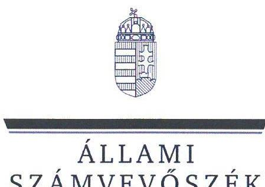
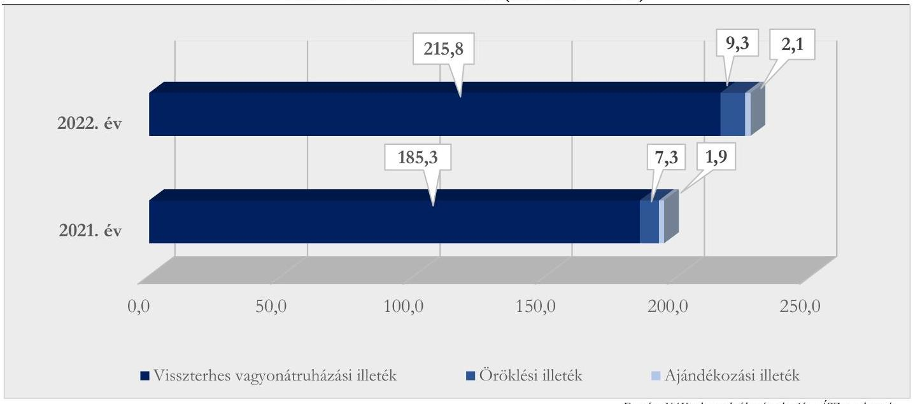
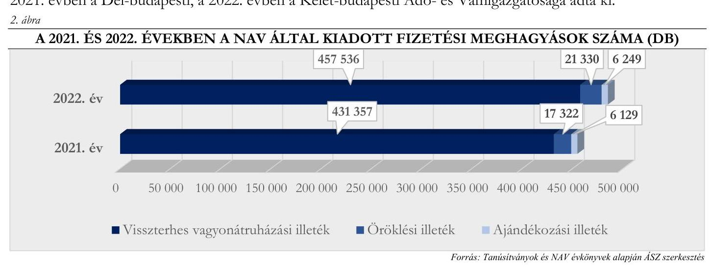
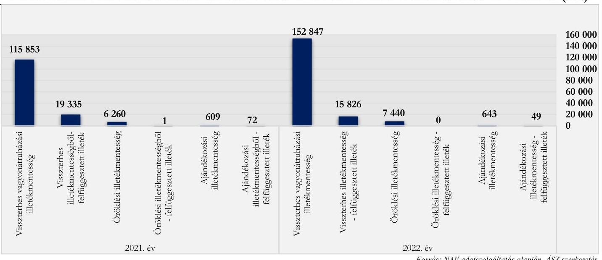
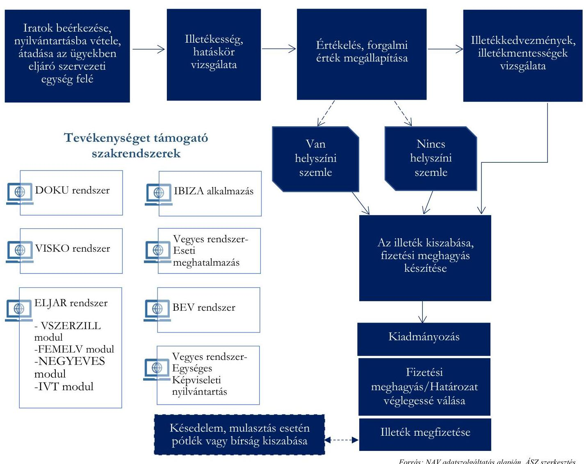
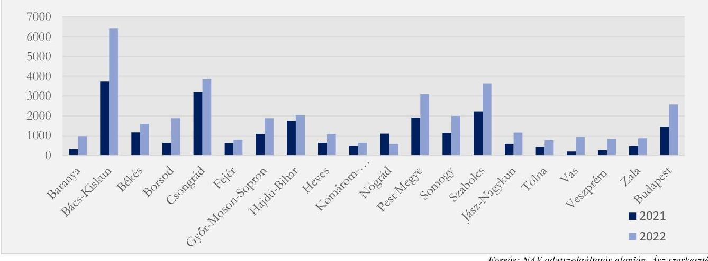
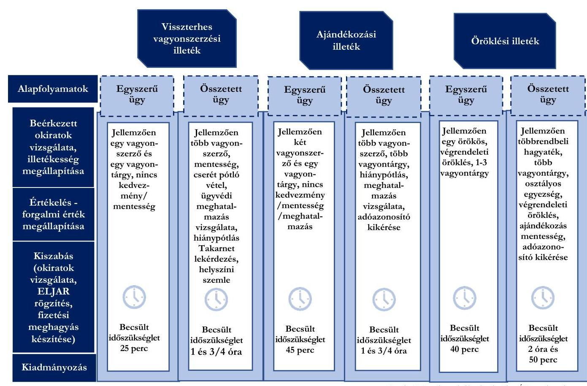
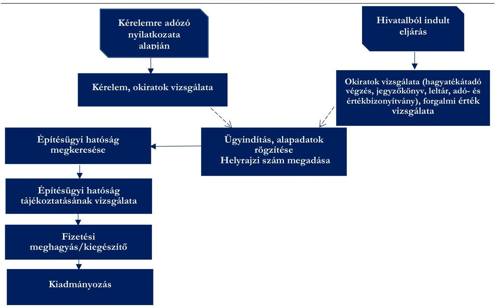
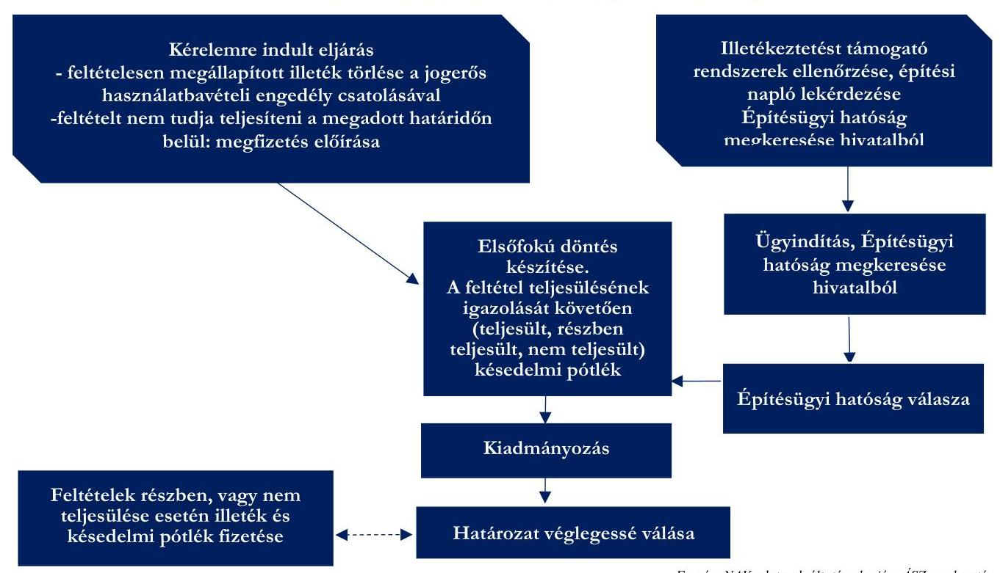

# JELENTÉS 

## A Nemzeti Adó- és Vámhivatal illetékügyekkel kapcsolatos hatósági tevékenységének ellenőrzése

2024.

---

ÁLLAMI
SZÁMVEVŐSZÉK

# JELENTÉS 

## A Nemzeti Adó- és Vámhivatal illetékügyekkel kapcsolatos hatósági tevékenységének ellenőrzése

2024.

---

# ELLENŐRZÉSI IGAZGATÓSÁG: 

## ÁLLAMHÁZTARTÁS KÖZPONTI SZINTJÉT ELLENŐRZŐ IGAZGATÓSÁG

## ELLENŐRZÉSI IGAZGATÓ:

DR. SIMON JÓZSEF igazgatóhelyettes

## ELLENŐRZÉSVEZETŐ:

## DR. PETRÁNYI GÁBOR ellenőrzésvezető

BOZSÓ ERIKA LÍVIA ellenőrzésvezető

IKTATÓSZÁM: EL-4112-001/2024
TÉMASZÁM: 2657
ELLENŐRZÉS-AZONOSÍTÓ SZÁM: V1001

---

# TARTALOMJEGYZÉK 

AZ ELLENŐRZÉS ALAPADATAI ..... 5
AZ ELLENŐRZÉS HATÓKÖRE ÉS TERÜLETE ..... 7
ÖSSZEFOGLALÁS ..... 11
AZ ELLENŐRZÉS FÓKUSZKÉRDÉSEI ..... 13
MEGÁLLAPÍTÁSOK ..... 14
JAVASLATOK ..... 30
MELLÉKLETEK ..... 31
I. sz. melléklet: Értelmező szótár ..... 31
II. sz. melléklet: Az ellenőrzött szervezetek jegyzéke ..... 33
III. sz. melléklet: Ellenőrzési kritériumok ..... 34
IV. sz. melléklet: A 2021. ÉS 2022. években kiadott fizetési meghagyások száma a NAV területi szervek esetében (db) ..... 35
V. sz. melléklet: Főbb illetékmentességek és kedvezmények ..... 36
FÜGGELÉK: ÉSZREVÉTELEK ..... 37
RÖVIDÍTÉSEK JEGYZÉKE ..... 38

---

.

---

# AZ ELLENŐRZÉS ALAPADATAI 

## AZ ELLENŐRZÉS CÉLJA

Az ellenőrzés célja annak értékelése volt, hogy a NAV ${ }^{1}$ illetékügyekkel kapcsolatos hatósági tevékenységei szabályozottak és szabályszerűek voltak-e, a feladatok ellátását biztosító belső kontrollok kiépítése és működtetése a jogszabályoknak és egyéb szabályozó eszközöknek megfelelt-e.

## AZ ELLENŐRZÉS TÍPUSA

Megfelelőségi ellenőrzés

## AZ ELLENŐRZŐTT IDŐSZAK

2021. és 2022. évek, kitekintéssel a helyszíni ellenőrzés lezárásának időpontjáig (2024.február 1.).

## AZ ELLENŐRZÉS TÁRGYA

Az ellenőrzés tárgyát képezte az illeték kiszabásához és ezzel összefüggésben az adószámla- és nyilvántartásvezetéshez kapcsolódóan a NAV hatósági tevékenysége működési keretei kialakítása, illetve a tevékenységek ellátása jogszabályoknak és NAV szabályozási eszközöknek való megfelelősége. Az illeték kiszabásához kapcsolódó hatósági tevékenységen belül értékelésre került az illeték alapjául szolgáló forgalmi érték megállapításához és a fizetési meghagyás kiadmányozásához, az illetékmentesség, illetékkedvezmény feltételei fennállásának megállapításához és teljesülésének rendszeres felülvizsgálatához, illetve az illetéket kiszabó fizetési meghagyással szembeni fellebbezéshez kapcsolódó tevékenység ellátásának szabályszerűsége. Továbbá az illeték kiszabási tevékenyég folyamata, és az azt befolyásoló tényezők is elemzésre kerültek.

Az illeték nyilvántartásával és az adószámlavezetéssel összefüggésben értékelésre került a kötelezettségek és pénzforgalmi tételek adózói adószámlán történő elő- illetőleg jóváírásának, az illeték törlési és visszatérítési eljárásoknak, a megfizetés tekintetében felfüggesztett illeték nyomon-követésének és felülvizsgálatának, valamint az illetékügyek nyilvántartása vezetésének szabályszerűsége.

Az ellenőrzés kiterjedt továbbá az illetékügyekhez kapcsolódó adatszolgáltatásra és beszámolásra vonatkozó feladatok ellátása szabályszerűségének értékelésére.

## AZ ELLENŐRZÉS JOGALAPJA

Az ellenőrzés jogszabályi alapját az ÁSZ tv. ${ }^{2} 5 . \int$ (8) bekezdésének előírása képezte.

---

# AZ ELLENŐRZÉS MÓDSZERE 

Az ellenőrzés végrehajtása - a nemzetközi standardokat irányadónak tekintve - az ellenőrzési program szempontjai, kérdéskörei, az ellenőrzött időszakban hatályos jogszabályok és az ellenőrzött szervezet belső szabályai, az ellenőrzés szakmai szabályai, valamint az ÁSZ ${ }^{3}$ megfelelőségi ellenőrzési módszertana alapján történt.

Az ellenőrzési bizonyítékként felhasználható adatforrások közé tartoztak az ellenőrzött által átadott, valamint minden egyéb - az ellenőrzés folyamán feltárt, az ellenőrzés szempontjából információt tartalmazó - dokumentum. Az ellenőrzési kérdések megválaszolásához szükséges bizonyítékok megszerzése a következő ellenőrzési eljárások alkalmazásával történt: dokumentumelemzés, megfigyelés, összehasonlítás, elemző eljárás, mintavétel.

Az ellenőrzés lefolytatásához az ellenőrzött a tanúsítványok kitöltésével és megküldésével, valamint dokumentumok, adatok, információk rendelkezésre bocsátásával, megküldésével szolgáltatott adatokat. Az ellenőrzést az ÁSZ a program kérdéseire adott válaszok kiértékelésével, valamint a programban ismertetett ellenőrzési kérdések, kritériumok, adatforrások között megjelölt adatforrások figyelembevételével folytatta le.

Az ÁSZ egyszerű véletlen mintavételi eljárással kiválasztott, az ügyben eljáró adó- és vámigazgatóságok és illetéktípusok szerint meghatározott darabszámú mintatételek alapján ellenőrizte a NAV illetékügyekkel kapcsolatos ellenőrzött időszakban végzett hatósági tevékenysége ellátásának szabályszerűségét. A megállapítások az ellenőrzött mintatételekre vonatkozóan kerültek megfogalmazásra, kivetítés nem történt. Ezen felül a mintatételek ellenőrzése - a szabályszerűség vizsgálatán felül - az illetékügyekkel kapcsolatos folyamatokban lévő kockázatok beazonosítására és elemzésére is lehetőséget nyújtott.

---

# AZ ELLENŐRZÉS HATÓKÖRE ÉS TERÜLETE 

Az illetékekből származó bevétel a központi költségvetést illeti. Az illetékek két nagy csoportba sorolhatók. Az egyik csoportba az eljárási- és felügyeleti illetékek tartoznak, amelyek a jogszabályi meghatározás szerint az állam, mint közhatalom által nyújtott közvetlen ellenszolgáltatásra jogosítanak. A másik csoportot a vagyonszerzési illetékek jelentik, amelyek nem jogosítanak közvetlen ellenszolgáltatásra, hanem az arányos közteherviselés elvének megfelelően vagyonátruházáshoz, vagyongyarapodáshoz kötődnek. Az ellenőrzés hatóköre a vagyonszerzési illetékügyekkel kapcsolatos hatósági tevékenységek szabályozottságának, és a feladatellátás végrehajtásának szabályszerűségére terjedt ki és nem érintette az eljárási illetékügyekkel kapcsolatos hatósági tevékenységet.

A vagyonszerzési illetékfajták (ajándékozási, öröklési, visszterhes vagyonátruházási illetékek) előírását, megfizetésének, illetve az illetékmentesség szabályos igénybevételének kontrollját a NAV végezte. A Központi Irányítás Adóügyi Főosztálya (az 5/2022. (VIII. 5.) PM utasítás ${ }^{4}$ alapján 2023. július 15-től Adóigazgatási és Jövedéki Főosztály) irányította az illeték megállapításával kapcsolatos adó- és vámigazgatósági feladatokat, kidolgozta az országosan egységes gyakorlatot biztosító NAV rendelkezéseket, gondoskodott a feladatellátást támogató NAV belső szakrendszerek törvényes és szakszerű működéséről.

A 2022. évben vagyonszerzési illetékből összesen 227,2 milliárd Ft bevétele származott a központi költségvetésnek, mely a központi költségvetés bevételi főösszegének közel $0,8 \%$-a volt.

A vagyonszerzési illetékbevételek 2022. évi összegéből 215,8 milliárd Ft volt a visszterhes vagyonátruházási illetékből, 9,3 milliárd Ft az öröklési illetékből és 2,1 milliárd Ft az ajándékozási illetékből keletkező bevétel. Az illetékbevételek hozzávetőlegesen $80 \%$-át az ingatlanok utáni visszterhes vagyonátruházási illeték tette ki, ezen a jogcímen a 2022. évben 179,0 milliárd Ft bevétel származott, amely 20,7\%-os növekedést mutat a 2021. évi bázisidőszaki értékhez viszonyítva. A bevétel kb. 40\%-a Budapesten, illetve közel 14\%-a Pest megyében keletkezett. A 2021. évi és 2022. évi vagyonszerzési illetékbevételek illetéknemek szerinti megoszlását az 1. ábra szemlélteti.
1. ábra

A 2021 ÉS 2022. ÉVEKBEN A VAGYONSZERZÉSI ILLETÉKBEVÉTELEK ILLETÉKNEMEK SZERINTI MEGOSZLÁSA (MILLIÁRD FT)

---

A 2021. és 2022. években kiadott fizetési meghagyások számát a 2. ábra, a NAV területi szervekre lebontott adatokat pedig a IV. számú melléklet mutatja be. A visszterhes vagyonátruházási és az ajándékozási illeték tekintetében a legtöbb fizetési meghagyást mindkét évben a Pest Megyei, az öröklési illeték esetén a 2021. évben a Dél-budapesti, a 2022. évben a Kelet-budapesti Adó- és Vámigazgatósága adta ki.

A vagyonszerzési illetékfajtákhoz kapcsolódó mentességek, kedvezmények rendszere összetett. Az Itv. ${ }^{5}$ az öröklési illeték tekintetében 11 mentességben és négy kedvezményben, az ajándékozási illeték kapcsán 30 mentességben és három kedvezményben, míg a visszterhes vagyonátruházási illetékkel összefüggésben 35 mentességben és hat kedvezményben részesülő tényállást fogalmaz meg. A tényállások között számos olyan található, mely időben évekkel későbbi (esetenként akár 10 évet meghaladó) feltétel teljesítéséhez kötődik, amelynek bekövetkeztét a határidő lejártát követően újabb hatósági eljárás keretei között kell vizsgálni. Az egyes illetékfajták esetében a főbb mentességeket és kedvezményeket az V. számú melléklet tartalmazza.

NAV a 2021. évben 122 722, illetve a 2022. évben 160930 ügyben állapított meg illetékmentességet, valamint az első lakástulajdon megszerzésére tekintettel biztosított pótlékmentes részletfizetésről fizetési meghagyásban a 2021. évben 7439 ügyben, a 2022. évben 7180 ügyben rendelkezett.

A NAV által megállapított illetékmentességek számát az egyes illetékfajták szerinti megoszlásban a 3. ábra szemlélteti.
3. ábra

A NAV ÁLTAL MEGÁLLAPÍTOTT ILLETÉKMENTESSÉGEK SZÁMA A 2021. ÉS 2022. ÉVEKBEN (DB)

---

A NAV a 2021. évben 2656 ügyben, illetve a 2022. évben 2041 ügyben döntött az illeték visszatérítése, illetve törlése tárgyában. A megfizetése tekintetében felfüggesztett visszterhes vagyonátruházási illeték felülvizsgálatát a NAV a 2021. évben 16780 esetben (közel 5,1 milliárd Ft összegben), a 2022. évben 17363 esetben (közel 6 milliárd Ft összegben) végezte el. A felülvizsgálat eredményeként a lakóház építésére alkalmas telektulajdon-vásárlással kapcsolatos ügyeknél a visszterhes vagyonátruházási illetékmentesség feltételei a 2021. éveben 4105 esetben, míg a 2022. éveben 3397 esetben - 4 éven belül - nem teljesültek.

A NAV területi szerveinek adóigazgatási (fő)osztályai állapították meg az öröklési, az ajándékozási és a visszterhes vagyonátruházási illetéket. Biztosították továbbá az illetékkedvezményt, mentességet, ellenőrizték a feltételhez kötött illetékmentesség, vagy kedvezmény feltételeinek betartását, valamint a vagyonszerzés bejelentésének elmulasztásakor vagy késedelmes bejelentésekor mulasztási bírságot szabtak ki. Az illetékkiszabási tevékenység munkafolyamatát, ennek elemeit és a támogató szakrendszereket a 4. ábra mutatja be.
4.ábra

AZ ILLETÉKEZTETÉSI TEVÉKENYSÉG FOLYAMATA, ÉS LÉPÉSEI, VALAMINT A TEVÉKENYSÉGET TÁMOGATÓ SZAKRENDSZEREK

Megjegyzés: Tevékenyéget támogató szakrendszerek: DOKU rendszer ${ }^{6}$ VISKO rendszer ${ }^{7}$ ELJAR rendszer ${ }^{7}$ IBIZA alkalmazás ${ }^{8}$ Vegyes rendszer- Eseti meghatalmazás ${ }^{10}$ BEV rendszer ${ }^{11}$, Vegyes rendszer-Egységes Képviseleti nyilvántartás ${ }^{12}$

---

A beérkező illetékkiszabási iratokban szereplő adatok rögzítése nagyrészt kézi úton történt, míg az ügyintézési folyamatok jellemzően informatikai támogatással zajlottak. Ugyanakkor a feltételes illetékmentességek, -kedvezmények megállapítása időigényes, a kapcsolódó feladatok összetettsége, bonyolultsága felkészült ügyintézői közreműködést kívánt. Az illetékmentességgel, -kedvezménnyel érintett eljárásokhoz kapcsolódó utólagos felülvizsgálatok nem voltak automatizálhatók, a felülvizsgálat szaktudást igényelt. Az illetékkiszabási folyamat több esetben külső közigazgatási szerv megkeresését, nyilvántartásainak lekérdezését igényelte (földhasználati nyilvántartás, földműves nyilvántartás, ingatlan-nyilvántartás, építéshatósági nyilvántartás, önkormányzati településrendezési tervek) vagy kizárólag helyszíni szemle lefolytatásával volt lehetséges a kiszabáshoz szükséges feltételek, körülmények felmérése, ellenőrzése.

---

# ÖSSZEFOGLALÁS 

Az ÁSZ törvényi előírás alapján ellenőrzi az állami adóhatóság adóztatási és egyéb bevételszerző tevékenységét. A NAV egyes adónemekkel - kisadók, társasági adó - kapcsolatos tevékenységének ellenőrzését az ÁSZ korábban már elvégezte, ugyanakkor az illetékekkel kapcsolatos adóhatósági tevékenység értékelésére még nem került sor. Az ellenőrzési téma kiválasztását az is indokolta, hogy a vagyonszerzési illeték, mint a központi költségvetés bevételeinek részét képező közteher kiszabása a NAV által jelentős ügyszámban végzett hatósági adómegállapítással történik. Az adómegállapítás az ügyek egyediségéből, tranzakcióalapúságából kifolyólag kevéssé automatizálható, valamint az illeték összegére ható körülmények, események feldolgozása (ideértve a mentességek és kedvezmények megállapítását és felülvizsgálatát is) nagylétszámú, szakképzett humánerőforrás alkalmazását teszi szükségessé.

A NAV az illetékügyekkel kapcsolatos hatósági tevékenysége munkafolyamatait kialakította, azokat különböző belső eljárásrendekben szabályozta. Öt vonatkozó eljárási rend rendelkezései a vizsgált időszakban nem feleltek meg a jogszabályi előírásoknak, mivel az eljárásrendek kiadása óta bekövetkezett jogszabályváltozások átvezetése ezen esetekben nem történt meg. Az aktualizálások a feladatot támogató, az ügyintézők által kötelezően használandó szakrendszerben ugyanakkor megtörténtek, melynek köszönhetően az eljárásokat a NAV a hatályos jogszabályi előírásoknak megfelelően folytatta le, a hatósági döntések a vonatkozó jogszabályi előírásoknak megfeleltek.

A NAV szabályszerűen alakította ki és végezte az illeték kiszabásával kapcsolatos tevékenységét. Ezen belül az illeték alapjául szolgáló forgalmi érték megállapítására irányuló tevékenységét, valamint az illeték kiszabását szabályszerűen látta el. Az illetékmentességek elbírálása, az első lakástulajdon megszerzéséhez kapcsolódó részletfizetések fizetési meghagyásban történő engedélyezése szabályszerűen történt. A fizetési meghagyásokkal szembeni fellebbezéseket a NAV a jogszabályoknak megfelelően kezelte. Ugyanakkor az illetékügyekkel kapcsolatos adóhatósági döntések indokolásai - az érdemi döntést nem befolyásolóan - az Air. ${ }^{13}$ rendelkezésével ellentétben a vizsgált mintatételek $15 \%$-ánál nem tartalmazták az ügyintézési határidő leteltének napjára vonatkozó információt.

Az illetékkel kapcsolatos nyilvántartási és adószámlavezetési tevékenységet a NAV szabályszerűen alakította ki és végezte. Az illeték visszatérítési és törlési ügyek ellátása összességében szabályszerűen történt. A megfizetés tekintetében felfüggesztett illetékkel kapcsolatos NAV feladatellátás szabályszerű volt. A feltételek teljesülésének nyomon követése érdekében az Itv.-ben előírt eljárások ugyanakkor a vizsgált 48 mintatétel közül 16 esetében nem történtek meg határidőn belül.

Az illetékügyekkel és az illetékbevételekkel kapcsolatos adatszolgáltatási és beszámolási tevékenységet a NAV szabályszerűen alakította ki és végezte.

---

A mintatételek a szabályszerűségi szempontok vizsgálatán túl lehetőséget teremtettek az illetékkiszabási folyamat elemzésére is. Ennek jelentőségét az adja, hogy az illetékeztetési folyamat kockázatai jelentős kihatással vannak az illetékből származó költségvetési bevételek teljesülésére. Az elemzés eredményeként az alábbi szempontok kiemelt jelentőséggel bírnak.

Az illeték alapját képező forgalmi érték megállapítási kötelezettség a jogszabály szerint a NAV-ot terheli, amelyhez elsősorban összehasonlító érték adatokat használ fel, szükség esetén egyéb módszereket is alkalmazhat, figyelembe veheti a vagyonszerző nyilatkozatát, helyszíni szemlét tarthat. A forgalmi érték megállapításakor a NAV az ügyek mindössze $1 \%$ körüli arányában tért el a vagyonszerző által közölt értéktől. A mintatételek egy részében a forgalmi érték megállapítása az ingatlan fizikai jellemzői tekintetében az összehasonlító értékadatok szűk körén alapult. E szempontból a megfelelő összehasonlító érték adatokat tartalmazó naprakész adatbázis rendelkezésre állása alapvető fontosságú. Ennek eszköze lehet az elektronikus ingatlan-nyilvántartási eljárás 2024 októberére tervezett bevezetése, a forgalmi érték meghatározásához felhasználható adatokat tartalmazó B400 adatlap tartalmi bővítése, valamint a forgalmi érték helyszíni szemle keretében történő megállapítására irányuló eljárások célzott alkalmazása.
A vizsgált mintatételek egy részénél - bár az ügyintézési folyamat a jogszabályi előírásoknak megfelelően történt - az átlagos ügyintézési folyamathoz képest jelentős idő telt el az iratok beérkezése és az illetékkiszabási döntés kiadása között, ezen belül az iratok beérkezése és az első eljárási cselekmény időpontja között. Az ügyintézési folyamat hossza jelentőséggel bír az illetékbevételek központi költségvetés részére történő rendelkezésre állása tekintetében. A NAV-val lefolytatott helyszíni interjúk rávilágítottak arra, hogy a feladatot költséghatékonyan, a határidők tartásával csak informatikai fejlesztések útján, automatizált lépések folyamatba építésével, a manuális beavatkozás legkisebb mértékűre szorításával lehet az egyre növekvő ügyszám mellett ellátni. Ugyanakkor a jogszabályi környezet változatlansága mellett az illetékeztetési folyamat elemei korlátozottan automatizálhatók.
Az illetékeztetés folyamatában kiemelt szerepelt töltenek be az illetékmentességek és kedvezmények, melyek rendszere rendkívül összetett. A szabályozás az öröklési illeték tekintetében 15, az ajándékozási illeték esetében 33, míg a visszterhes vagyonátruházással kapcsolatban 41 beazonosítható, önállóan szabályozott mentességet és kedvezményt tartalmaz. A NAV által rendelkezésre bocsátott folyamatleírások alapján jelenleg több olyan jogcím is létezik, amelynél a tényállás tisztázása a NAV részéről jelentős időt vesz igénybe, összetettsége miatt külön felülvizsgálatot igényel, és jelentős szakképzett erőforrást köt le. Ezen felül a jogcímek egy részénél a mentesség megállapítása évekkel későbbi feltétel teljesítéséhez kötődik, melynek igazolásához újabb hatósági eljárás lefolytatása, külső hatóság megkeresése szükséges. A mentesség pozitív elbírálása esetén illeték kiszabása nem történik, költségvetési bevétel nem keletkezik.
Az előzőekben bemutatott tényezők alapján az illetékeztetés jelenlegi rendszere nem kellően hatékony, mivel kevéssé automatizálható, nagylétszámú humánerőforrást igényel és összetett folyamatot jelent. Az ÁSZ véleménye szerint a hatékonyság növelésének eszköze lehet a folyamatot automatizmusokkal támogató informatikai megoldások bevezetése, melynek előfeltétele az illetékeztetés rendszerének jogszabály-módosítással történő egyszerűsítése.

---

# AZ ELLENŐRZÉS FÓKUSZKÉRDÉSEI 

1. A NAV szabályszerűen alakította-e ki és végezte-e az illeték kiszabásával kapcsolatos tevékenységet?
2. A NAV szabályszerűen alakította-e ki és végezte-e az illetékkel kapcsolatos nyilvántartási és adószámlavezetési tevékenységet?
3. A NAV szabályszerűen alakította-e ki és végezte-e az illetékügyekkel kapcsolatos, külső szerv felé irányuló adatszolgáltatási, beszámolási tevékenységet?

---

# 1. A NAV szabályszerűen alakította-e ki és végezte-e az illeték kiszabásával kapcsolatos tevékenységet? 

Összegző megállapítás

1.1 számú megállapítás

A NAV szabályszerűen alakította ki és végezte az ellenőrzött időszakban az illeték kiszabásával kapcsolatos tevékenységét.

A NAV az illeték kiszabására vonatkozó eljárását, módszertanát a jogszabályi előírásoknak és a belső szabályozási eszközeinek megfelelően alakította ki, a feladatellátást támogató szakrendszert megfelelően működtette. A belső irányítási eszközök közül három vonatkozó eljárási rend aktualizálása - a kiadásuk után bekövetkezett jogszabályváltozások ellenére - nem történt meg.

A pénzügyminiszter az 5/2022. (VIII. 5.) PM utasításban adta ki a NAV szervezeti és működési szabályzatát. Az ellenőrzött időszak vonatkozásában a szervezeti és működési szabályzat keretei között, valamint az Art ${ }^{14}$., az Itv., az Áht. ${ }^{15 .}$ az Ávr. ${ }^{16 .}$ a Bkr. ${ }^{17 .}$ és a 40/2006. (XII. 25.) PM rendelet ${ }^{18}$ előírásaival összhangban a NAV központi, illetőleg a területi igazgatóságonként az adóügyi főosztályok ügyrendjeiben, azok ellenőrzési nyomvonalában, és az egyes illetéknemek kiszabásának eljárásrendjében határozták meg a szervezeti egység vezetőinek és alkalmazottainak feladat- és hatáskörét. (1017/2016/ASZH eljárási rend ${ }^{19} ; 1070 / 2016 /$ ASZH eljárási rend ${ }^{20} ; 1121 / 2016 /$ ASZH eljárási rend ${ }^{21} ; 1156 / 2016 /$ ASZH eljárási rend ${ }^{22} ; 1157 / 2016 /$ ASZH eljárási rend ${ }^{23}$ ).
Ugyanakkor a Bkr. 4. § a) pontjában foglaltak ellenére nem történt meg az 1017/2016/ASZH eljárási rendnek, az 1156/2016/ASZH eljárási rendnek és az 1157/2016/ASZH eljárási rendnek a tevékenységre vonatkozó jogszabályokkal való harmonizációja és összehangolása. Az első két eljárási rendben a NAV nem az ellenőrzött időszakban hatályban lévő adójogi jogszabályokra, hanem a hatályon kívül helyezett (régi) Art. ${ }^{24}$ és Ket. ${ }^{25}$ rendelkezéseire hivatkozott, míg a 1157/2016/ASZH eljárási rend az Itv. 2018. január 1-től hatálytalan 78. § (2) bekezdésére hivatkozott.
Ezen felül a forgalmi érték megállapítását szabályozó 1017/2016/ASZH eljárási rend esetében a Bkr. 4. § a) pontjában foglaltakkal ellentétben elmaradt a 2018. január 1-vel hatályba lépő Itv. módosításokkal való harmonizáció. A 1017/2016/ASZH eljárási rend 15. pontja a 2017. december 31. napjáig hatályos szabályokat tartalmazva azt rögzítette, hogy az illeték alapjául szolgáló forgalmi értéket fő szabály szerint a vagyonszerző köteles bejelenteni. Az eljárásrend továbbá azon esetekre vonatkozóan, melyeknél nem állt rendelkezésre összehasonlító értékadat, kizárólag a helyszíni szemle lefolytatását és a külső szakértő igénybevételével történő forgalmi érték megállapítását szabályozta, azonban nem határozott meg az Itv. 69. § (3) bekezdésében nevesített egyéb érték-meghatározó módszert, és nem utalt az ingatlan energiatanúsítványában foglalt adatok felhasználhatóságára sem. Ugyanakkor a NAV elkészítette a hatályos Itv. szerinti szabályozásnak megfelelő, a vagyonszerzési illeték kiszabása során az ingatlanok

---

forgalmi értékének összehasonlító piaci értékeléssel történő megállapításának szabályait tartalmazó eljárási rendjét, amely azonban az ellenőrzött időszakban nem került hatályba léptetésre.
Az eljárásrendek aktualizálásának elmaradása mellett ugyanakkor a mintatételeknél hatálytalan jogszabály alapján történő eljárást az ellenőrzés nem tárt fel, az illetékeztetési feladatokat támogató belső szakrendszer a mindenkor hatályos jogszabályi rendelkezések szerint működött.
A területi igazgatóságok ügyrendjében az adóügyi főosztály feladatkörébe került az illetékkiszabás, az ügyrendek az Ávr.-nek megfelelően tartalmazták az illetékkiszabással kapcsolatos feladatokat.
A NAV az ellenőrzött időszakban az illeték kiszabására vonatkozóan rendelkezett ellenőrzési nyomvonallal, mely megfelelt a Bkr. előírásainak. A nyomvonal tartalmazta a folyamatgazdát, az eljárás jogi alapját, a keletkező dokumentumot, a végrehajtásért felelőst, a határidőt, az ellenőrzés felelősét és az ellenőrzés módját.
A NAV a Bkr.-nek megfelelően kialakította az integrált kockázatkezelési eljárásrendjét a 2072/2019/VEZ ${ }^{26}$ számú, a Nemzeti Adó- és Vámhivatal egységes belső kontrollrendszeréről szóló szabályzatában.
A NAV az integrált kockázatkezelési rendszer szabályozása keretében rögzítette:

- a tevékenységben rejlő és szervezeti célokkal összefüggő kockázatok azonosításának eljárásait, módszereit,
- azokat a kritériumokat, amelyek alapján sor kerül a kockázatok értékelésére,
- a kockázatok kezelése érdekében szükséges intézkedések megtételének kötelezettségét,
- a kockázatok kezelése érdekében meghatározott intézkedések végrehajtásának nyomon követésére vonatkozó kötelezettséget.
Az integrált kockázatkezelési rendszer működtetése keretében a NAV kockázatfelméréseket és kockázatleltárokat készített. Az illetékügyekkel kapcsolatos hatósági tevékenységgel összefüggésben döntően a nem elegendő humánerőforrás és az elmaradó helyszíni szemlék kapcsán fogalmaztak meg kockázatokat és hoztak ezek kezelése érdekében intézkedéseket (pl. többletmunka elrendelése, nem illetékeztetési tevékenységet végző munkatársak átirányítása e feladatra, helyszíni eljárásokkal foglalkozó munkatársak mentesítése az egyéb, adminisztratív jellegű feladatok alól stb.)
A NAV a Bkr. rendelkezéseinek megfelelően biztosította a szervezeti célok elérését veszélyeztető kockázatok csökkentésére irányuló kontrollok kiépítését. A kontrolltevékenységek részeként megelőző kontrollokat (pl. engedélyezési és jóváhagyási eljárások, „négy szem elv", hozzáférési kontrollok, feladat és felelősségi körök elhatárolása), valamint feltáró kontrollokat (pl. utólagos és vezetői ellenőrzés, beszámoltatás, folyamatok és műveletek vizsgálata) alkalmazott. Az illetékkiszabás felelősségi köreinek meghatározásával a Bkr. előírásainak megfelelően szabályozta az engedélyezési, jóváhagyási, kontrolleljárásokat, valamint a dokumentumokhoz és információkhoz való hozzáférést.
A NAV a Bkr. előírásával összhangban kialakította az információs és kommunikációs rendszerét, amelynek alapját a 2072/2019/VEZ szabályzat tartalmazta. A külső adatszolgáltatások rendjéről a NAV a 2020/2020/VEZ szabályzatban ${ }^{27}$ rendelkezett. Az 5013/2022/VEZ körlevélben rendelkezett a vezetői információs rendszer - NAVIR rendszer - működtetéséhez és a Pénzügyminisztérium részére történő évközi tevékenységi beszámoláshoz szükséges adatszolgáltatásokról.
A NAV a Bkr. előírásával összhangban alakította ki a szervezet tevékenységének, a célok megvalósításának nyomon követését biztosító monitoring rendszert a 2072/2019/VEZ szabályzat keretében. A NAV a

---

NAV tv., a 40/2006. (XII. 25.) PM rendelet és a Bkr. rendelkezéseinek megfelelően folyamatosan nyomon követte az illetékbevétel alakulását, melyekről kimutatásokat készített - az összes folyó évi illeték alakulására és az illetékbevételek esedékességére kiterjedően -, illetőleg ügyhátralék prognózis rendszert működtetett és nyomon követte a kiszabásra váró illetékügyek és ügyhátralék alakulását.

# 1.2 számú megállapítás A NAV szabályszerűen járt el az illeték alapjának megállapításakor. 

Az Itv. 69. § (1) bekezdése értelmében a forgalmi érték megállapítása a NAV kötelezettsége. Az Itv. 69. § (3) bekezdése alapján a NAV a forgalmi értéket elsősorban az összehasonlító értékadatok alapján állapítja meg, de - összehasonlító értékadatok hiányában - más értékmeghatározó módszert (nettó pótlási költségalapú értékbecslés, hozamszámításon alapuló értékbecslés stb.) is alkalmazhat. A forgalmi értékről a vagyonszerző is nyilatkozhat, amelyet a forgalmi érték megállapítása során a NAV figyelembe vehet, szükség esetén helyszíni szemlét tarthat, külső szakértőt vehet igénybe, továbbá felhasználhatja az ingatlan energiatanúsítványában foglalt adatokat. Ezek alapján a forgalmi értéket az adóhatóság az adózó forgalmi értékre tett nyilatkozatával megegyezően vagy attól eltérően állapítja meg.
A forgalmi érték meghatározásában közreműködő ügyintézők az ellenőrzött időszakban nem önálló munkakörben látták el feladatukat, tevékenységük az igazgatóságokon belül jellemzően nem különült el. Az adóigazgatási (fő)osztályokhoz delegált egyéb feladatok miatt az illetékeztetési feladatok erőforrásigénye önmagában a NAV nyilatkozata alapján nem mutatható ki.
A jogszabályi kötelezettség miatt a NAV-nak az ellenőrzött időszakban a forgalmi érték megállapítása céljából éves szinten több tízezer helyszíni szemlét kellett lefolytatni. A 2022. évben országosan összesen 37660 db helyszíni szemlére került sor, ami az előző évhez képest 60,0\%-os növekedést jelent. A helyszíni szemlék számának 2022. évi növekedésére nagy hatással volt, hogy a 2021. év első felében zajló COVID19 járvány miatti korlátozások időszaka alatt a helyszíni szemlék lefolytatása korlátozottan volt lehetséges. Az eljárásrendekben meghatározásra kerültek azon esetek, amikor a helyszíni szemle megtartása kötelező volt, például nem állt rendelkezésre megbízható adat a forgalmi értékről, vagy külön szabályozóban rögzített nagy értékű ingatlan esetében. Szintén szabályozásra kerültek azon ügyek, amikor a helyszíni szemle tartása mellőzésre kerülhetett. Egyéb esetekben a helyszíni szemle a forgalmi érték, valamint ezáltal a forgalmi érték meghatározását szolgáló összehasonlító értékadatok pontosítását szolgálta. A rendelkezésre bocsátott adatbázisok és tanúsítványok alapján a 2021. valamint a 2022. években országos szinten a helyszíni szemlével érintett ügyek $11,6 \%$, valamint $12,2 \%$-a esetén került sor a forgalmi érték módosítására. Amennyiben az összes illetékügy darabszámához hasonlítjuk a forgalmi érték módosításával érintett ügyek számát, az arány mindössze a 2021. évben 1,0\% valamint a 2022. évben 1,2\% volt. A módosítással érintett helyszíni szemlék tekintetében a forgalmi érték növekedés aránya mindkét évben 50 \% körül alakult, azaz átlagosan másfélszeresére emelkedett a forgalmi érték. Ugyanakkor amennyiben valamennyi helyszíni szemlével érintett ügy tekintetében nézzük a forgalmi érték növekedés arányát, ez az érték a vizsgált két évben csupán 1,9\% és 2,2\% volt.

---

5. ábra

HELYSZÍNI SZEMLÉK SZÁMA (DB) IGAZGATÓSÁGONKÉNT ÉS BUDAPEST ÖSSZESEN 2021-2022. ÉVEK

Az ellenőrzött 220 darab mintatétel dokumentációja alapján a fizetési meghagyások a forgalmi érték megállapításával kapcsolatban az Itv. hatályos rendelkezéseire hivatkoztak. Ezen felül az összetett forgalmi értékmeghatározást igénylő ügyek (ingatlanok, például családi házak, nyaralók) esetében az illetéket kiszabó fizetési meghagyás 11 visszterhes vagyonátruházási (A/1., A/17., A/27., A/30., A/31., A/32., A/48., A/56., A/59., A/68., A/70. mintatételek) és 12 ajándékozási (A/81., A/84., A/85., A/92., A/99., A/101., A/105., A/123., A/124., A/126., A/130., A/131. mintatételek) illetékügy esetében az Air. 73. § 1) bekezdés c) pontjában előírtaknak megfelelően - Itv. 69. § (3) bekezdésének az összehasonlító értékadatokra vonatkozó jogszabályi hivatkozásán felül - konkrétan tartalmazta, hogy a forgalmi érték a rendelkezésre álló összehasonlító értékadatok alapján került megállapításra, a vagyonszerző által közölt értékkel egyezően. Ugyanakkor a megküldött összehasonlító értékadatokon belül az ismert fizikai jellemzők között az ingatlanok telekalapterületén kívül más, az Itv. 69. § (5) bekezdésében részletezett adat nem szerepelt. A fentiek mellett további

Az elektronikus ingatlannyilvántartás 2024. évi tervezett bevezetésével az adatátvitel minősége, az illeték kiszabásához szükséges adatok rendelkezésre állási ideje lényegesen javulhat, amely a NAV adatbázisaiban szereplő adatokkal együtt lehetővé teszi az értékmegállapítás céljából történő kiválasztás adatalapú támogatását.
A B400-as adatlap tartalmának olyan irányban történő bővítése, mely a vagyonszerző ismereteit nem haladja meg, azonban fontos információkkal szolgál a forgalmi érték meghatározásához, az ingatlanra vonatkozóan rendelkezésre álló adatkör bővítéséhez, hozzájárulhat az összehasonlító értékadatok mennyiségi és minőségi növekedéséhez. Az így rendelkezésre álló adatok támogatni tudják a forgalmi érték egyértelmű meghatározhatóságát és az adatok összehasonlíthatóságát.
Ehhez kapcsolódva megvalósulhat a forgalmi érték helyszíni szemle keretében történő megállapítására irányuló eljárások célzott, a többi adatforrásból le nem fedett területeken történő alkalmazása, amely által az összehasonlító értékadatok szélesebb körben állhatnának rendelkezésre.
Mindezen adatok a forgalmi érték meghatározása mellett a NAV ingatlanokra vonatkozó adatszolgáltatását felhasználó szervezetek (például KSH és MNB) munkáját, elemzései megalapozottságát is támogatnák.

---

négy visszterhes (A/2., A/21., A/39., A/45. mintatételek) és hét ajándékozási (A/95., A/110., A/113., A/114., A/117., A/118., A/121. mintatételek) illetékügy fizetési meghagyása a forgalmi érték vonatkozásában rögzítette, hogy az egyező a vagyonszerző nyilatkozatában foglaltakkal. Ezen esetekben sem állt rendelkezésre a forgalmi érték meghatározásához az ingatlanok telekalapterületén kívül más, az Itv. 69. $\int(5)$ bekezdésében részletezett, az ingatlan jellemzőire vonatkozó adat. Így megállapítható, hogy a forgalmi érték meghatározása az ügylet tárgyát képező ingatlan fizikai jellemzői tekintetében korlátozott számú összehasonlítható értékadaton alapult.
Emellett egy öröklési illeték esetében (A/174. mintatétel) az örökség „tiszta értékének" megállapításánál a NAV nem vette figyelembe az Itv. 13. $\int(3)$ bekezdésében előírtakat, mivel a hagyatéki terheket nem arányosította az öröklési illetékköteles és az öröklési illeték alól mentes vagyon között. Ezen felül egy visszterhes vagyonátruházási illeték esetében, melynél családi otthonteremtési kedvezményt érvényesítettek (A/56. mintatétel) a vagyonszerzés lakóházra és gazdasági épületre vonatkozott. Ez esetben az illetékmentesség az Itv. 26. § 1a) bekezdés f) pontjában előírtak szerint kizárólag lakáscélú ingatlan vásárlása után vehető igénybe, azonban a forgalmi érték meghatározásakor a NAV nem bontotta meg az ingatlan forgalmi értékét a különböző funkciójú épületekre, ingatlanokra, és a kedvezményt nem kizárólag a lakóház után érvényesítette.
1.3 számú megállapítás

A NAV szabályszerűen végezte az illeték kiszabási tevékenységét. A fizetési meghagyások nem minden esetben tartalmazták az ügyintézési határidő leteltének napját, mint a jogszabályi előírások szerinti kötelező tartalmi elemet. Egyes mintatételek esetében a fizetési meghagyások az előírt ügyintézési határidőn túl kerültek kiadmányozásra.

A vagyonszerzési illetéket az Itv., az Air. és az Art. rendelkezései szerint a NAV - a vagyonszerző, vagy öröklés esetén a közjegyző vagy a bíróság bejelentése alapján - kiszabás útján állapította meg, melyről fizetési meghagyást (határozatot) adott ki. A vagyonszerzést vagy közvetlenül az adóhatósághoz, vagy ingatlan tulajdonjogának, valamint az ingatlanhoz kapcsolódó vagyoni értékủ jognak a megszerzése esetén - az ingatlanügyi hatósághoz kellett bejelenteni illetékkiszabásra. Az Itv. előírásai alapján az ingatlanügyi hatóság az ingatlan-nyilvántartási bejegyzés végett benyújtott szerződés (okirat) iktatószámmal ellátott és hitelesített másolatát az illetékkiszabáshoz szükséges és rendelkezésre álló egyéb iratokkal együtt az ingatlan-nyilvántartási eljárás befejezését követően haladéktalanul, kísérőjegyzékkel továbbította az állami adóhatósághoz. A bejelentéseket a NAV nyilvántartásba vette, és gondoskodott a fizetési meghagyás kiadásáról, melynek kötelező tartalmi elemeire az Itv. és az Air. tartalmazott előírásokat.
A NAV által rendelkezésre bocsátott folyamatleírások alapján az illeték kiszabására irányuló tevékenység időigénye és élőmunka-ráfordítási szükséglete - különösen a bonyolultabb öröklési illetékügyekben meghatározó volt. Az illetékkiszabási tevékenységhez kapcsolódó munkafolyamatok számos döntési pontot tartalmaztak, ezért jellemzően nem voltak automatizálhatók.
Az egyszerű megítélésű és az összetett tényállású vagyonszerzési illetékügyek munkafolyamatának időigénye eltérő volt, az utóbbiak többszörös időráfordítással jártak. Ezen felül az egyes vagyonszerzési illetékfajták között is eltérés volt tapasztalható az összetettség és az időigény tekintetében. A fizetési meghagyások száma és az illetékbevétel tekintetében jóval kisebb arányt képviselő öröklési és ajándékozási illetékkiszabás munkaidőigénye az egyszerű ügyek esetében is többszöröse volt a visszterhes vagyonátruházási ügyek vagyonszerzési illeték kiszabási időráfordításának.

---

Forrás: NAV adatszolgáltatás alapján, ÁSZ szerkestés
A NAV az ellenőrzéssel érintett időszakban humán-erőforrásszükséglet felmérést az ellátandó feladatok sokrétűsége, valamint a szervezeti egységek illetékeztetés melletti más párhuzamos feladatellátása miatt illetékeztetési feladatokkal összefüggésben nem végzett, ugyanakkor erőforrásallokációs számítás alapján értékelte, hogy a rendelkezésre álló humánerőforrás az ellátandó feladatok arányában megfelelően van-e

Az illetékügyek túlnyomó többségében a humánerőforrás igény - az Itv., mint jogszabályi környezet változatlansága mellett - kizárólag digitális megoldásokkal nem váltható ki. Ennek okán indokolt lehet a jogszabályi környezet - nemzetközi tapasztalatok és jogszabályi megoldások feltérképezése melletti - felülvizsgálata.
elosztva a szervek között. Az egyes ügyek ügyintézési folyamatairól, az ügyállomány alakulásáról a NAV Központi Irányítás statisztikákat készített. A területi szervek esetében az adóügyi igazgatóhelyettesek felügyelték az illetékkiszabási tevékenységet, akik tájékoztatják az igazgatókat az ügyhátralékról, az ügyintézési határidők alakulásáról, a humánerőforrás rendelkezésre állásáról. A területi szervek vezetőinek feladata, hogy a rendelkezésre álló humánerőforrást az ellátandó feladatok között a lehető legoptimálisabban osszák szét. A 2021-2022. években az illeték szakterület megnövekedett munkaterhelése, továbbá az ügyhátralék-állomány csökkentése érdekében ideiglenes létszámátcsoportosítást 9 területi szerv igazgatója saját hatáskörben hajtott végre. Ugyanakkor a 2021. év végén 74 010, míg a 2022. év végén 73754 volt a bejelentett, a NAV által kiszabásra váró illetékügyek száma.
Az Air. valamint az Art. rendelkezései szerint az illeték kiszabására irányuló adóigazgatási eljárások hivatalból kerültek megindításra, mely esetben a határozat meghozatalára nyitva álló határidő 60 nap volt,

---

amely határidő számításának kezdete az eljárásra hatáskörrel és illetékességgel rendelkező hatóság első eljárási cselekménye megkezdésének napja. Az első eljárási cselekmény az adott illetékügy jellemzőitől függően tipikusan lehetett a hiánypótlásra felszólító végzés, a helyszíni szemléről készült jegyzőkönyv vagy az egy ügyhöz tartozó több ügyfél esetében az adott adózóhoz kapcsolódó ügyindítási feljegyzés. Ezáltal az ügyintézési határidő kezdetét jelentő első eljárási cselekmény időben eltérhetett az illetékkiszabás alapjául szolgáló iratok adóhatósághoz történő beérkezésének és iktatásának napjától.
Az ellenőrzött 220 darab mintatétel esetében - az alább ismertetett eseteken kívül - a NAV az Itv., az Air. és az Art. rendelkezéseinek megfelelően, szabályszerűen járt el az illetékek kiszabása során.
A mintatételek közül 3 esetben (A/41., A/63. és A/64. mintatételek) az első eljárási cselekményt követő 60 napon túl került sor a fizetési meghagyás kiadására, így ezen esetekben az illetéket az Air. 50. $\$$-ban és az Art. 141. $\$ (3)$ bekezdésben előírt határozat meghozatalára rendelkezésre álló határidőt követően szabta ki a NAV.
A mintatételek értékelése alapján jellemző, hogy az illetékkiszabás alapjául szolgáló iratok a beérkezésük napján - egy esetben a következő napon - iktatásra kerültek. A mintatételek esetében az illetékkiszabás alapjául szolgáló irat beérkezése és a fizetési meghagyás közlésének napja között átlagosan 64 nap telt el, az alábbi 1. táblázat szerinti sávos megoszlásban:

# 1. táblázat 

A MINTATÉTELEK MEGOSZLÁSA AZ ILLETÉKKISZABÁS ALAPJÁUL SZOLGÁLÓ IRAT BEÉRKEZÉSE ÉS A FIZETÉSI MEGHAGYÁS KÖZLÉSE KÖZÖTT ELTELT IDŐTARTAM ALAPJÁN

| AZ ILLETÉKKISZABÁS ALAPJÁUL SZOLGÁLÓ IRAT BEÉRKEZÉSE ÉS A | MINTATÉTELEK | MINTATÉTELEK |
| :-- | :--: | :--: |
| FIZETÉSI MEGHAGYÁS KÖZLÉSE KÖZÖTT ELTELT NAPOK SZÁMA | SZÁMA | MEGOSZLÁSA |
| 0 - 60 nap | 159 | $73,3 \%$ |
| 61-90 nap | 24 | $11,1 \%$ |
| 91- 120 nap | 9 | $4,1 \%$ |
| 121- 180 nap | 11 | $5,1 \%$ |
| 181- 360 nap | 12 | $5,5 \%$ |
| 360 nap felett | 2 | $0,9 \%$ |
| Összesen | $\mathbf{2 1 7}$ | $\mathbf{1 0 0 \%}$ |
| Illeték mentesség miatt fizetési meghagyás kibocsátása nem történt (Itv. 78. § (1) bek.) | 3 |  |

A kiadmányozott fizetési meghagyások indokolása - az érdemi döntést nem befolyásolóan - nem tartalmazta 33 mintatétel esetében az ügyintézési határidő leteltének napját (A/3., A/34., A/35., A/37., A/38., A/53., A/57., A/58., A/59., A/66., A/75., A/76., A/77., A/103., A/107., A/108., A/110., A/126, A/142., A/149., A/150., A/151., A/161., A/173., A/175., A/176., A/177., A/182., A/183., A/184., A/185., A/186., A/199. mintatételek), amely ellentétes az Air. 73. $\$ (1) bekezdés c) pontjában előírtakkal. A vizsgált mintatételek $85 \%$-ban a fizetési meghagyások tartalmazták az ügyintézési határidő leteltének napját.
Azon esetekben viszont, amikor a fizetési meghagyás tartalmazta az ügyintézési határidő leteltének a napját, ennek számítása az illetékkiszabás alapjául szolgáló irat iktatási dátuma, mint kiinduló nap alapján került meghatározásra.
A mintatételek vizsgálata során megállapításra került továbbá, hogy a NAV egy esetben (A/38. mintatétel) az Air. 76. $\$ (5) bekezdésében foglaltak ellenére szabályszerű kézbesítés igazolása nélkül állapította meg a

---

fizetési meghagyás véglegessé válásának napját, és a kiszabott illetéket az adószámlán kötelezettségként előírta, azonban a szabálytalanságot az ÁSZ ellenőrzés megkezdéséig észlelte és gondoskodott az adószámla rendezéséről és intézkedést tett a szabályszerű kézbesítés iránt.
1.4 számú megállapítás Az illetékmentességek megállapítása során a NAV szabályszerűen járt el.

Az illetékkiszabásra történő bejelentésre szolgáló nyomtatványban, illetve a vagyonszerző által kötetlenül előterjesztett kérelemben feltüntetett, vagy hivatalból figyelembe venni rendelt illetékmentesség fennállásának és alkalmazhatóságának kontrollját az Itv. alapján a NAV végezte. Az illetékmentesség alkalmazhatóságáról a NAV a fizetési meghagyásban, vagy - az Itv. 78. § (1) bekezdésében felsorolt esetekben - az ügyiratra történő feljegyzéssel döntött. A fizetési meghagyás kiadása után, de még a véglegessé válás előtt előterjesztett kérelmek esetén a NAV a kedvezmény, mentesség fennállásáról a kiszabási eljárásban kibocsátott elsőfokú határozat kiegészítésével döntött.
Az egyes illetékfajták esetében a főbb mentességeket és kedvezményeket az V. számú melléklet tartalmazza.
Valamennyi illetéknem esetében a megállapított illetékmentességek száma jelentős volt a kiadott fizetési meghagyások számához viszonyítva.
A mentességek között több olyan jogcím is található, amelynél a tényállás tisztázása a 6. ábrán szemléltetett hosszabb időt vett igénybe, összetettsége miatt felülvizsgálatot igényelt, így az illetékkiszabási ügyek közül az összetett ügyek kategóriájába tartozott. A mentesség pozitív elbírálása esetén a mentességgel elérni kívánt közpolitikai cél teljesült, azonban illeték kiszabása nem történt, költségvetési bevétel nem keletkezett.
Minden ellenőrzésre kiválasztott mintatétel esetében a

Az illetékmentességek és kedvezmények megállapítása összetett tevékenység, amely időigényes folyamatot jelent a hatósági tevékenység során. A mentességek, kedvezmények elbírálása jelentős szakképzett erőforrást köt le, amely így késlelteti a tényleges bevétellel járó illetékkiszabási folyamatot.
NAV az Itv. előírásainak megfelelően bírálta el az illetékmentességek fennállásának törvényi feltételeit. A NAV az illetékmentesség fennállásáról az Itv., az Art. és az Air. rendelkezései szerint fizetési meghagyás kibocsátása/kiegészítése vagy az illetékmentesség alkalmazása tényének az ügyiratra történő feljegyzés útján döntött.
1.5 számú megállapítás

A NAV a fizetési meghagyásokban szabályszerűen kezelte az első lakástulajdon megszerzéséhez kapcsolódó részletfizetési kérelmeket.

Az Itv. szerint első lakástulajdon megszerzésekor a magánszemély - az esedékességtől számított legfeljebb 12 hónapra részletfizetést kérhetett az állami adóhatóságtól a visszterhes illeték vonatkozásában. Az illeték-részletfizetési kérelmet az adózó a fizetési meghagyás elkészítése előtt vagy a fizetési meghagyás kézhezvételét követően is előterjeszthette. Ezt követően az Itv. által biztosított részletfizetésekről szóló adóhatósági döntés - a részletek összegének és teljesítésük határnapjának megjelölésével - a fizetési meghagyásban, illetőleg a fizetési meghagyás kézhezvételét követően előterjesztett részletfizetési kérelem esetén külön határozattal történt. A kedvezmény biztosítása előtt a NAV köteles volt vizsgálni, hogy a kérelmező ténylegesen az első lakástulajdonát szerezte-e meg.
Az 1157/2016/ASZH eljárási rend alapján az esedékes részletek teljesítésének ellenőrzését - havi, központi legyűjtésű listák alapján - az illetékes igazgatóság igazgatója által kijelölt szervezeti egység végezte. Amennyiben a vagyonszerző az esedékes részlet befizetését nem teljesítette, a kedvezmény

---

érvényét vesztette, és a tartozás egy összegben esedékessé vált. Ez esetben a NAV a tartozás fennmaradó részére az eredeti esedékesség napjától késedelmi pótlékot számított fel. A havi vizsgálatokat mindaddig szükséges volt folytatni, amíg az előírt részletek mindegyikét ki nem egyenlítette az illeték megfizetésére kötelezett, kivéve, ha a megfizetés elmaradása miatt a visszarendezés már megtörtént. A visszarendezést a szakrendszer „Illeték részletfizetés - 35 éven aluliak" moduljából kellett kezdeményezni. Elvesztett kedvezmény esetén csak a meg nem fizetett részletösszegeket kellett eredeti esedékességre visszarendezni, a már teljesített részletösszegeket nem, azok megfizetettnek minősültek. Ezzel egy időben - amennyiben szükséges - intézkedni kellett a késedelmi pótlék felszámításáról / módosításáról is a vonatkozó eljárási rend figyelembevételével.
Az első lakástulajdon megszerzéséhez kapcsolódó részletfizetési kérelmek engedélyezése során a NAV az Itv. rendelkezéseinek megfelelően járt el. Az ellenőrzött 48 darab mintatétel közül egy mintatétel esetében (C/30. mintatétel) a NAV az Itv. 26. $\int$ (15) bekezdésében foglaltak ellenére nem a kérelemben megjelölt időtartamra, hanem a maximális 12 hónapra engedélyezte a részletfizetést.
Az ellenőrzött mintatélek esetében nyolc alkalommal fordult elő, hogy a vagyonszerzők elmulasztották a részletfizetési határidőket, ami így a tartozás egy összegben történő előírását és késedelmi pótlék felszámítását tette szükségessé. A NAV három alkalommal intézkedett a részletfizetési határidő elmulasztása miatt a tartozás Itv. szerinti egy összegben történő előírása iránt A fennmaradó öt esetből három esetben az adózó pár napon belül, a következő részlet esedékességéig rendezte tartozását, így a havi, központi legyűjtésű listák alapján már nem volt kimutatható tartozása (C/7., C/8., C/22. mintatételek). Míg két esetben a fizetési elmaradás az utolsó fizetési részletet érintette (C/20., C/26. mintatételek), ezáltal az adószámlarendezés Itv. 26. § (15) bekezdésében foglaltak kötelezettsége okafogyottá vált.
1.6 számú megállapítás

A NAV szabályszerűen járt el a fizetési meghagyással szemben benyújtott fellebbezésekkel kapcsolatos eljárása során. Egyes mintatételek esetében a fellebbezés felettes szervhez történő felterjesztése határidőn túl történt meg.

A fizetési meghagyással szembeni fellebbezések kapcsán az Air. értelmében az elsőfokon eljárt adóhatóságnak a fellebbezést az ügy összes iratával a fellebbezés beérkezésének napjától számított tizenöt napon belül fel kellett terjesztenie a felettes szervhez. A felterjesztés során az elsőfokú adóhatóság a fellebbezésről kialakított álláspontját ismertette. Amennyiben a fellebbezésben foglaltakkal maradéktalanul egyetértett - felterjesztés helyett - a jogszabálysértő döntést visszavonta, a fellebbezésnek teljes mértékben megfelelően módosította, kijavította vagy kiegészítette. A 2021. évben 1764, a 2022. évben 1789 fellebbezés érkezett a NAV területi szerveihez.
A vizsgált 46 mintatétel közül 21 esetben az Air. 126. $\int$ (6) bekezdés a) pontjának megfelelően a fellebbezés felettes szervhez történő felterjesztésre nem került sor, tekintettel arra, hogy az elsőfokú adóhatóság saját hatáskörben gondoskodott szerinti döntés meghozataláról.
A fennmaradó 25 mintatétel esetén az elsőfokú adóhatóság a fellebbezést az ügy összes iratával, a fellebbezésről kialakított álláspontjával együtt 22 esetben a fellebbezés beérkezésének napjától számított tizenöt napon belül - az Air. rendelkezéseinek megfelelően - terjesztette fel a felettes szervhez. Három esetben azonban (D/32., D/33., D/40. mintatételek) a felterjesztés határidőn túl történt meg, megsértve ezzel az Air. 126. § (4) bekezdésében foglaltakat.

---

A felterjesztésre kerülő ügyek 84\%-ában (21 esetben) a felettes szerv a fizetési meghagyást helybenhagyó határozatot hozott. Három esetben megváltoztató határozat született, egy tétel esetén pedig az elsőfokú adóhatóságot új eljárás lefolytatására utasította. A fellebbezési eljárás során hozott döntés az Air. rendelkezéseinek megfelelően az első fokon eljárt adóhatóság útján közlésre került a fellebbezővel.
Az elsőfokú adóhatóság a felterjesztésre kerülő ügyek közül egy esetben (D/40. mintatétel) az Itv. 73. § (3) bekezdésében foglaltak ellenére határozattal nem írta elő a fellebbezés illetékét, annak ellenére, hogy a fellebbezést a fellebbezési illeték megfizetése nélkül nyújtották be.
A NAV a megfizetett fellebbezési illeték visszatérítéséről az Itv. előírásainak megfelelően gondoskodott azokban az esetekben, amikor az elsőfokú határozat az ügyfél hátrányára részben vagy egészben jogszabálysértőnek bizonyult.

# 2. A NAV szabályszerűen alakította-e ki és végezte-e az illetékkel kapcsolatos nyilvántartási és adószámlavezetési tevékenységet? 

| Összegző megállapítás | A NAV szabályszerűen alakította ki és végezte az ellenőrzött időszakban az illetékkel kapcsolatos nyilvántartási és adószámlavezetési tevékenységet. |
| :--: | :--: |
| 2.1 számú megállapítás | Az illetékkötelezettségek adószámlán történő előírásával és a befizetések jóváírásával kapcsolatos munkafolyamatokat a NAV belső szabályzatban meghatározta. A vonatkozó eljárási rend aktualizálása - a kiadása után bekövetkezett jogszabályváltozások ellenére - nem történt meg. Az illetékekkel kapcsolatos adószámlavezetési tevékenységét szabályszerűen végezte. |

Az Itv. értelmében a fizetendő vagyonszerzési illeték a fizetési meghagyás (határozat) véglegessé válását követő 15. napon vált esedékessé. Az Art. alapján a NAV az adózó adókötelezettségét és költségvetési támogatási igényét, valamint az arra teljesített befizetést és kiutalást az adózó adószámláján tartotta nyilván. A folyószámla kötelezettség oldalán a vagyonszerzési illeték előírása az illeték kiszabásához kapcsolódó szakrendszerből, központi könyvelés útján történt. A befizetések jóváírása az adószámla pénzforgalmi oldalán szintén központilag, a befizetést lebonyolító szervezetek igazolása alapján, a pénzügyi terhelés tényleges napján történt.
A NAV az adószámla vezetési feladatának részletszabályait az Art., az Itv., az Áht., az Ávr., a Bkr. és a 40/2006. (XII. 25.) PM rendelet előírásaival összhangban alakította ki. Az 1118/2015. eljárási rendben ${ }^{28}$ szabályozta az adószámlára történő könyvelési, rendezési feladatok ellátását, tartalmazta a kötelezettség esedékességének és könyvelésének dátumát, az adószámla és a feldolgozó rendszerek kapcsolatát, az adószámla rendezés általános szabályait, illetőleg az adószámla vezetésével kapcsolatos szerepköröket és jogosultságokat. Ugyanakkor a Bkr. 4. § a) pontban foglaltakkal ellentétesen nem történt meg az eljárási rendnek a tevékenységre vonatkozó jogszabályokkal való harmonizációja és összehangolása, mivel az eljárási rendben a NAV nem az új adójogi jogszabályokra, hanem a hatályon kívül helyezett (régi) Art., Ket., és a közösségi vámjog végrehajtásáról szóló 2003. évi CXXVI. törvény rendelkezéseire hivatkozott.

---

Az ellenőrzött mintatételek esetében a NAV az Itv., az Art., és a 465/2017. (XII. 28.) Korm. rendelet ${ }^{29}$ előírásai szerint végezte az illetékhez kapcsolódó kötelezettségek előírását és a befizetések jóváírását az adószámlán.
2.2 számú megállapítás

A NAV szabályszerűen alakította az illeték visszatérítésével, illetőleg törlésével kapcsolatos tevékenységét. A vonatkozó eljárási rend aktualizálása - a kiadása után bekövetkezett jogszabályváltozások ellenére - nem történt meg. A tevékenység ellátása szabályszerűen történt. A kiadmányozott határozat nem minden esetben tartalmazta az ügyintézési határidő leteltének napját, mint a jogszabályi előírások szerinti kötelező tartalmi elemet. Egyes mintatételek esetében a határozatok az előírt ügyintézési határidőn túl kerültek kiadmányozásra.

Az Itv. alapján a kiszabott, de még meg nem fizetett illeték törlésére, illetőleg a megfizetett illeték visszatérítésére hivatalból, vagy a fizetésre kötelezett, illetőleg jogutódja kérelmére kerülhetett sor az Itv.ben meghatározott esetekben. A NAV az illeték törlése, illetőleg visszatérítése tárgyában határozattal döntött.
A NAV az Art., az Itv., az Áht., az Ávr. és a Bkr., előírásaival összhangban meghatározta az illeték visszatérítésével és törlésével kapcsolatos munkafolyamatokat, feladat- és hatásköröket az 1004/2017/VEZ eljárási rendben ${ }^{30}$. Ugyanakkor a Bkr. 4. § a) pontban foglaltakkal ellentétesen nem történt meg az eljárási rendnek a tevékenységre vonatkozó jogszabályokkal való harmonizációja és összehangolása, mivel az eljárási rendben a NAV nem az új adójogi jogszabályokra, hanem a hatályon kívül helyezett (régi) Art. és Ket. rendelkezéseire hivatkozott.
Az ellenőrzött 96 mintatétel esetében összességében a NAV az Itv., az Air. és az Art. előírásainak megfelelően, szabályszerűen végezte az illeték visszatérítésével, illetőleg törlésével kapcsolatos tevékenységét. A mintatételek esetében a kiadmányozott határozatok indokolása azonban - az érdemi döntést nem befolyásolóan - 14 esetben (E/33., E/45., E/46., E/48., E/60., E/62., E/75., E/76., E/77., E/78., E/80., E/86., E/88., E/90. mintatételek) nem tartalmazta az ügyintézési határidő leteltének napját, amellyel megsértették az Air. 73. § (1) bekezdés c) pontjában előírtakat. A vizsgált mintatételek 85\%-ában a határozatok tartalmazták az ügyintézési határidő leteltének napját.
Az illeték visszatérítésére, törlésére irányuló eljárás az esetek jelentős részében - szemben az illeték kiszabására irányuló eljárással - nem hivatalból, hanem az adózó kérelmére indult, így az Air. alapján az ügyintézési határidő a kérelemnek az eljárásra hatáskörrel és illetékességgel rendelkező adóhatósághoz történő megérkezését követő napon megindult.
A határozatok nyolc esetben (E/7., E/33., E/45., E/47., E/79., E/80., E/94., E/96. mintatételek) az Air. 50. § (2) bekezdésében előírt határidőt követően kerültek kiadmányozásra. Ebből két esetben (E/94., E/96. mintatételek) a tényállás tisztázása miatt húzódott el az eljárás, amely okot a határozatok indokolása tartalmazta, ugyanakkor az ügyintézési határidő az Air. 50. § (2) bekezdésében előírtak alapján nem került meghosszabbításra. A késedelem kedvezőtlenül érinthette az adózók azon igényét, hogy az eljárások az Air. 50. § (1) és (2) bekezdésében előírt határidőben lezárásra kerüljenek.
Az illeték visszatérítési és törlési tevékenység mintatételeinél feltárt szabálytalanságokat és az érintett határozatok darabszámát a 2. táblázat szemlélteti.

---

# 2. táblázat 

## AZ ILLETÉK VISSZATÉRÍTÉSI ÉS TÖRLÉSI TEVÉKENYSÉG MINTATÉTELEINÉL FELTÁRT SZABÁLYTALANSÁG

## FELTÁRT SZABÁLYTALANSÁG

A határozat tartalmazta az ügyintézési határidő leteltének napját, de a határozat az ügyintézési határidő leteltét követően került kiadmányozásra

A határozat nem tartalmazta az ügyintézési határidő leteltének napját, de a határozat az ügyintézési határidőn belül került kiadmányozásra*

A határozat nem tartalmazta az ügyintézési határidő leteltének napját, és az ügyintézési határidő leteltét követően került kiadmányozásra

## ÖSSZESEN   (HATÁROZÁTÓK DARÁBSZÁMA

5
11
3

Forrás: $A S Z$ szerkeszés

A NAV az E/45. számú mintatételéhez kapcsolódó döntésében illeték törlésről hozott határozatot, annak ellenére, hogy adózó kérelme a megfizetett illeték visszatérítésére vonatkozott, továbbá az illeték visszatérítése (kiutalása) az adóhatósági döntés véglegessé válását követő 30 napon túl történt meg megsértve ezzel az Art. 64. $\$ 1$ ) bekezdésében előírtakat.
2.3 számú megállapítás

A NAV szabályszerűen látta el a megfizetés tekintetében felfüggesztett illetékkel kapcsolatos tevékenységét. A mentességi feltételek teljesülésének felülvizsgálata nem történt meg minden esetben határidőben.

Lakóház építésére alkalmas telektulajdon (tulajdoni hányad) öröklési, ajándékozási, vagy visszterhes vagyonátruházási illetékmentesség alá eső módon való megszerzése érdekében a vagyonszerző az Itv. alapján - a fizetési meghagyás véglegessé válásáig - nyilatkozhatott arról, hogy négy éven belül a telken olyan lakóházat épít, amelyben a lakás(ok) hasznos alapterülete eléri a településrendezési tervben meghatározott maximális beépíthetőség legalább $10 \%$-át. A NAV a vagyonszerzés után az illetéket megállapította, majd a megállapított illetéket - a megfizetés tekintetében - négy évre felfüggesztette. A lakóház felépítését a négyéves határidőn belül kiadott, - a vagyonszerző nevére szóló - jogerős vagy végleges használatbavételi engedéllyel, illetve a használatbavétel tudomásulvételét igazoló hatósági bizonyítvánnyal kellett igazolni. Amennyiben más módon még nem jutott a NAV tudomására a lakóház felépítése - a négy éves időszak elteltét követő 15 napon belül megkereste az illetékes építésügyi hatóságot a lakóház felépítésének igazolása céljából. Az illetékmentesség feltételeinek teljesüléséről és a felfüggesztett illeték további sorsáról a NAV határozatban rendelkezett. Abban az esetben, ha a lakóház nem épült fel, a felfüggesztett illetéket - a felfüggesztés időszakára felszámított késedelmi pótlékkal együtt - meg kellett fizetni.

Az időben elhúzódó feltételek teljesítéséhez kötődő mentességek megállapítása többszöri hatósági eljárás lefolytatását igényli, mely miatt munkaigényük jelentős, bevételteremtő képességük - különös tekintettel a megállapított mentességekre korlátozott.

A lakóház építésére alkalmas telektulajdon megszerzésének illetékmentessége esetében a mentesség megállapítása évekkel későbbi feltétel teljesítéséhez kötődött, melynek igazolásához újabb hatósági eljárás lefolytatása, külső hatóság megkeresése vált szükségessé. A 7. ábra szemlélteti a megfizetés tekintetében felfüggesztett illetékügyek ügyintézési folyamatát a felfüggesztett illetékmentesség megállapításának időszakában, valamint a felfüggesztés időtartamának

---

végén. Az időben elhúzódó feltételes mentességgel érintett ügyek e két esetben is jelentős ügyviteli terhet róttak a NAV-ra. A példaként hozott mentességtípuson kívül mindez felmerül más mentességek esetében is. (pl. sportcélú ingatlanok mentessége)
7. ábra

# MEGFIZETÉS TEKINTETÉBEN NÉGYÉVES FELFŰGGESZTÉSSEL ÉRINTETT ILLETÉKMENTES ÜGYEK FOLYAMATA 

4 éves határidő lejárta után a feltételek teljesülésének vizsgálata

Forrás: NAV adatszolgáltatás alapján, $A S Z$ szerkesztés

---

Az ellenőrzött 48 darab mintatétel vonatkozásában a NAV az Itv. 16. § (2a) bekezdése előírásainak megfelelően a vagyonszerző lakóházépítési szándékáról tett nyilatkozata alapján a lakóház építésére alkalmas telektulajdon megszerzése után megállapított illeték megfizetését négy évre felfüggesztette. A fizetési meghagyás kiadása előtt amennyiben nem volt igazolt az eljárás során - a NAV megkereste az illetékes építésügyi hatóságot annak érdekében, hogy megbizonyosodjon arról, hogy a megszerzett ingatlan megfelel-e az Itv. 102. § (1) bekezdés l) pont szerinti lakóház építésére alkalmas telektulajdon definíciójában írtaknak. Azonban az Itv. 16. $\int$ (2a), 17. $\int$ (2a), valamint 26. $\int$ (2a) bekezdéseiben előírtakkal ellentétben az építésügyi hatóság megkeresése 16 mintatétel vonatkozásában (F/4., F/7., F/8., F/9., F/17., F/18., F/19., F/23., F/25., F/28., F/29., F/32., F/36., F/43., F/44., F/48.) a lakóházépítésre meghatározott illetékmegfizetési felfüggesztéssel érintett - négyéves határidő lejáratát követő 15 napon túl történt. Az érintett mintatételek vonatkozásában az illetékes építésügyi hatóság megkeresésének késedelmét a 8. ábra szemlélteti.

Az ellenőrzött időszakot követően kezdeményezett jogszabálymódosítás alapján az építésügyi hatóság megkeresését az engedélyek és hatósági bizonyítványok tekintetében kiváltja az Országos Építésügyi Nyilvántartás alapján történő lekérdezés.

A felfüggesztés feltételeinek teljesítésére vonatkozó döntésről szóló határozat az Air.-ban előírtaknak megfelelően minden esetben tartalmazta a megfelelő adatokat. Nyolc esetben (F/9., F/22., F/23., F/28., F/31., F/35., F/39., F/43. mintatételek) a döntésről szóló határozat adózó részére történő megküldése az ügyintézésre rendelkezésre álló határidőn túl történt meg a NAV által, amely nem felelt meg az Air. 50. § (2) bekezdése előírásainak. Ezek közül öt esetben a feltételek nem teljesülése okán a felfüggesztett illeték megfizetéséről kellett rendelkezni, a határidő túllépése miatt ezen illetékbevételek az Itv. és az eljárási szabályokban rögzített határidők alapján várható időpontnál később teljesültek.
2.4 számú megállapítás

A NAV szabályszerűen tartotta nyilván a bejelentett illetékügyeket. A vonatkozó eljárási rend aktualizálása - a kiadása után bekövetkezett jogszabályváltozások ellenére - nem történt meg.

A NAV a kapcsolódó belső szabályzataiban, felhasználói útmutatóiban és ellenőrzési nyomvonalában az Art., az Itv., az Áht., az Ávr. és a Bkr. előírásaival összhangban határozta meg az illetékkötelezettség bejelentésének fogadásával és az illetékügyek nyilvántartásával kapcsolatos munkafolyamatokat.
Az illetékügyek nyilvántartását a 40/2006. (XII. 25.) PM rendelet előírásai szerint végezte. A bejelentések iktatását, az illetékügyek nyilvántartását és nyomon követését szolgáló ügykezelést támogató informatikai

---

rendszereket (pl.: DOKU, ELJAR, „A" rendszer) az Ltv. ${ }^{31}$ és a 335/2005. (XII.29.) Korm. rendelet ${ }^{32}$ előírásai szerint alakította ki, valamint belső eljárási rendjében meghatározta a nyilvántartás kötelező tartalmi elemeit és a nyilvántartás vezetésének pontos lépéseit.
A NAV a bejelentés fogadását követően vizsgálta, hogy a bejelentés az előírt határidőn belül történt-e és megfelelt-e a jogszabályi követelményeknek, amelyhez a kapcsolódó részletes szabályokat az 1156/2016/ASZH eljárási rendjében meghatározta. Az eljárásrend tartalmazza a gépjármú és pótkocsi megszerzésével kapcsolatos bejelentési szabályokat (II/2. alfejezet), az ajándék és a visszterhes vagyonszerzés bejelentésére vonatkozó szabályokat (III/5-6. alfejezet), a hagyaték bejelentésének szabályait (III/7. alfejezet), a bejelentési szabályokat, amennyiben a vagyonszerzés nem tárgya az illetéknek (III/8. alfejezet), valamint a vagyonszerzés bejelentéséhez kapcsolódó adatlapokat (IV. fejezet). Ugyanakkor a Bkr. 4. § a) pontban foglaltakkal ellentétesen nem történt meg az eljárási rendnek a tevékenységre vonatkozó jogszabályokkal való harmonizációja és összehangolása, mivel az eljárási rendben a NAV nem az új adójogi jogszabályokra, hanem a hatályon kívül helyezett (régi) Art. és Ket. rendelkezéseire hivatkozott.
2.5 számú megállapítás

A NAV szabályszerűen alakította ki a nyilvántartás vezetésének folyamatát, és megfelelően vezette a visszterhes vagyonátruházási illeték kiszabása során felvett adatokat tartalmazó nyilvántartását. A vonatkozó eljárási rend aktualizálása - a kiadása után bekövetkezett jogszabályváltozások ellenére - nem történt meg.

A NAV az Itv. és a 40/2006. (XII. 25.) PM rendelet előírásaival összhangban az ingatlanok forgalmi értékének megállapításához szükséges összehasonlító értékadatok nyilvántartására (gyűjtésére) külön nyilvántartást vezetett, az 1017/2016/ASZH eljárási rendjében teljeskörűen meghatározta a nyilvántartás kötelező tartalmi elemeit.
A NAV belső eljárási rendjeiben az Art., az Itv., az Áht., az Ávr., a Bkr. előírásai szerint meghatározta a visszterhes vagyonátruházási illeték kiszabása során felvett adatokat tartalmazó nyilvántartás vezetésének munkafolyamatait az 1156/2016/ASZH eljárási rendjében, felelőseit az 1017/2016/ASZH eljárási rendjében, valamint a nyilvántartásból történő adatigénylés teljesítésének munkafolyamatait és felelőseit az 1113/2016/ASZH eljárási rendjében. ${ }^{33}$ Ugyanakkor a Bkr. 4. § a) pontban foglaltakkal ellentétesen nem történt meg ezen utóbbi eljárási rendnek a tevékenységre vonatkozó jogszabályokkal való harmonizációja és összehangolása, mivel az eljárási rendben a NAV nem az új adójogi jogszabályokra, hanem a hatályon kívül helyezett (régi) Art. és Ket. rendelkezéseire hivatkozott.
A NAV a visszterhes vagyonátruházási illeték kiszabása során felvett adatokat tartalmazó nyilvántartásának vezetését az Itv. -ben előírtak szerint végezte.

---

# 3. A NAV szabályszerűen alakította-e ki és végezte-e az illetékügyekkel kapcsolatos, külső szerv felé irányuló adatszolgáltatási, beszámolási tevékenységet? 

## Összegző megállapítás

A NAV szabályszerűen kialakította és a jogszabályi, valamint a belső szabályozók rendelkezéseinek megfelelően teljesítette az ellenőrzött időszakban az illetékügyekkel kapcsolatos, külső szerv felé irányuló adatszolgáltatási és beszámolási tevékenységét.

A NAV a NAV tv. 13. § (2) bekezdés d) pontjában foglalt adatgyűjtési, adatfeldolgozási és adatszolgáltatási feladatát az illetékügyekkel kapcsolatban az Áht., az Ávr. és a Bkr. előírásaival összhangban alakította ki. A 2020/2020/VEZ szabályzatban szabályozta a külső szerv felé irányuló - az illetékre is kiterjedő adatszolgáltatási és beszámolási feladatok ellátását.
Az illetékek kiszabása és könyvelése során vezetett nyilvántartás a központi költségvetést megillető illetékbevétel összegének megállapítása érdekében a 40/2006. (XII. 25.) PM rendeletben előírt adatokat tartalmazta, a NAV informatikai rendszere biztosította, hogy rögzített adatokból az illetékügyekkel kapcsolatos információk rendelkezésre álljanak.
A NAV a 2013. évi L. törvényben ${ }^{34}$ írtaknak megfelelően az ellenőrzött időszakban rendelkezett IBSZ ${ }^{35}$ szel. Az illetékkel kapcsolatos hatósági tevékenységeknél alkalmazott informatikai rendszerek biztonsági osztályba sorolását az IBSZ 5. melléklete tartalmazta. Az informatikai rendszerek biztonsági besorolásánál 1-től 5-ig számozott, a számozás emelkedésével párhuzamosan szigorodó védelmi előírásokkal együtt járó fokozatot alkalmaztak.
A NAV jogszabályi kötelezettség, illetőleg megállapodás alapján a következő adatszolgáltatásokat, beszámolásokat teljesítette 2021. és 2022. években:

- a $\mathrm{PM}^{36}$ felé: illeték zárási összesítője, illetékbevételek felosztása, visszterhes vagyonszerzés tárgyát képező ingatlanok adatai, illetékkel kapcsolatos fizetési meghagyások darabszáma és összege,
- az $\mathrm{MNB}^{37}$ felé: lakástulajdon után fizetendő visszterhes illetékügyek adatai,
- a $\mathrm{KSH}^{38}$ felé: illetékbevételek felosztása, visszterhes vagyonszerzés tárgyát képező ingatlanok adatai, tájékoztatás a lakás és lakótelek forgalom alakulásáról (visszterhes ügyek alapján).
A NAV tv. és a 40/2006. (XII. 25.) PM rendelet rendelkezésein alapuló adatszolgáltatásokat és beszámolásokat az ellenőrzött időszakban a NAV határidőben megküldte az arra jogosultnak. A KSH-val és az MNB-vel kötött együttmúködési megállapodás szerinti adatszolgáltatását két esetben néhány napos késedelemmel teljesítette a megállapodás szerinti határidőhöz képest.
A NAV - összhangban a NAV tv. és a belső szabályozók rendelkezéseivel - figyelemmel kísérte az illetékterületen keletkező bevételeket, ennek keretében:
- összeállította a 2021. és 2022. évek tevékenységéről szóló éves beszámolókat,
- félévente elkészíttette az illetékzárási összesítőket,
- havi rendszerességgel készített elemzést a PM felé az előző hónap illetékből származó bevételéről, annak az előző év azonos időszakához hasonlított változásáról, illetve az illetékbevételek prognózisáról.

---

# JAVASLATOK 

Az ÁSZ tv. 33. § (1) bekezdésében foglaltak értelmében az ellenőrzött szervezet vezetője köteles a jelentésben foglalt megállapításokhoz kapcsolódó intézkedési tervet összeállítani és azt a jelentés kézhezvételétől számított 30 napon belül az ÁSZ részére megküldeni. Amennyiben az ellenőrzött szervezet vezetője nem küldi meg határidőben az intézkedési tervet, vagy továbbra sem elfogadható intézkedési tervet küld, az Állami Számvevőszék elnöke az ÁSZ tv. 33. § (3) bekezdése a) és b) pontjaiban foglaltakat érvényesítheti.

## A NEMZETI ADÓ- ÉS VÁMHIVATALT VEZETŐ ÁLLAMTITKÁRNAK

1. Vizsgálja felül, és ennek eredménye alapján módosítsa az illetékügyekkel kapcsolatos belső szabályzatokat annak érdekében, hogy azok a mindenkor hatályos jogszabályi előírásokra hivatkozzanak és legyenek összhangban ezekkel, ezáltal a jövőben a tevékenység ellátása során a Bkr. 4. § a) pontjának megfelelően biztosíthassák a szabályozottságot, a szabályszerűséget.
2. Intézkedjen annak érdekében, hogy az Itv. hatályos rendelkezéseinek megfelelő forgalmi érték megállapítására irányuló adóhatósági eljárási rend hatályba léptetésre kerüljön.
3. Intézkedjen annak érdekében, hogy az illetékügyekkel kapcsolatos adóhatósági döntések minden esetben tartalmazzák az ügyintézési határidő leteltének napjára kiterjedő indokolást, biztosítva ezzel, hogy a döntések tartalma megfeleljen Air. 73. § (1) bekezdés c) pontjában foglaltaknak.
4. Intézkedjen olyan kontrolleljárás kialakítása érdekében, amely biztosítja, hogy a jövőben a megfizetés tekintetében felfüggesztett illetékkel kapcsolatos Itv. 16. § (2a) bekezdés, 17. § (2a) bekezdés illetőleg 26. § (2a) bekezdés szerinti eljárások határidőben megtörténjenek, elősegítve ezáltal a felfüggesztés feltételeinek teljesüléséről szóló adóhatósági döntés és az illetékbevételek határidőben történő teljesülését.

---

# MELLÉKLETEK 

## I. SZ. MELLÉKLET: ÉRTELMEZŐ SZÓTÁR

adóigazgatási eljárás
adószámla
adózó
belső kontrollrendszer
forgalmi érték
használatbavételi engedély
illeték
ingatlan
ingó
lakóépület
az adóigazgatási eljárásban az adóhatóság megállapítja az adózó jogait, kötelezettségeit, ellenőrzi az adókötelezettségek teljesítését, a joggyakorlás törvényességét, nyilvántartást vezet az adózást érintő tényekről, adatokról, körülményekről, és adatot igazol, illetve az ezeket érintő döntését érvényesíti. (forrás: Air. 9. §) (1) bekezdés
az állami adó- és vámhatóság, illetve az önkormányzati adóhatóság által vezetett, az adózói fizetési kötelezettség és költségvetési támogatási igény, valamint az azokkal összefüggő pénzforgalom tételes, illetve egyenleg szintű kimutatására szolgáló nyilvántartás (forrás: Art. 7. § 5. pont)
az a személy, akinek vagy amelynek adókötelezettségét adót, költségvetési támogatást megállapító törvény, e törvény, az adózás rendjéről szóló 2017. évi CL. törvény vagy önkormányzati rendelet előírja (forrás: Air. 11. § (1) bekezdés)
a belső kontrollrendszer a kockázatok kezelése és tárgyilagos bizonyosság megszerzése érdekében kialakított folyamatrendszer, amely azt a célt szolgálja, hogy a múködés és gazdálkodás során a tevékenységeket szabályszerűen, gazdaságosan, hatékonyan, eredményesen hajtsák végre, az elszámolási kötelezettségeket teljesítsék, megvédjék az erőforrásokat a veszteségektől, károktól és nem rendeltetésszerű használattól (forrás: Áht. 69. § (1) bekezdés)
az a pénzben kifejezett érték, amely a vagyontárgy eladása esetén az illetékkötelezettség keletkezésekor volt állapotában - a vagyontárgyat terhelő adósságok, továbbá az ingatlanon a vagyonszerző javára az elidegenítéskor megszűnő bérleti jog figyelembevétele nélkül - árként általában elérhető (forrás: Itv. 102. § (1) bekezdés e) pont)
az épített környezet alakításáról és védelméről szóló törvény szerinti használatbavételi engedély és az egyszerű bejelentéshez kötött épület felépítésének megtörténtét tanúsító hatósági bizonyítvány (forrás: Itv. 102. § (1) bekezdés p) pont)
az illeték olyan központi költségvetési bevétel, amelyet mind természetes személyek, mind jogi személyek, illetve jogi személyiséggel nem rendelkező szervezetek fizetnek, ha egyrészt az illetéktörvényben meghatározott vagyont az ott meghatározott módon szerzik meg, másrészt, ha közigazgatási vagy bírósági eljárást kezdeményeznek. Az illetékfizetési kötelezettséget az állam egyoldalúan törvényben írja elő, beszedéséről szükség esetén állami kényszer útján gondoskodik (forrás: Nagykommentár az illetékekről szóló 1990. évi XCIII. törvényhez)
a föld és a földdel alkotórészi kapcsolatban álló minden dolog (forrás: Itv. 102. $\$ (1) bekezdés b) pont)
a fizetőeszköz, az értékpapír, a gazdálkodó szervezetben fennálló vagyoni betét, valamint mindaz, ami ingatlannak nem minősülő dolog (forrás: Itv. 102. § (1) bekezdés c) pont)
kizárólag vagy túlnyomó részben lakást tartalmazó épület (forrás: Itv. 102. § (1) bekezdés s) pont)

---

lakóház építésére alkalmas az építésügyi szabályoknak és a településrendezési tervnek megfelelően telektulajdon kialakított, lakóépület elhelyezésére szolgáló, beépítetlen földrészlet vagy olyan földrészlet, amelyen az f) pont szerinti szerkezetkész állapotot el nem érő, lakóház céljára létesülő építmény áll (forrás: Itv. 102. § (1) bekezdés 1) lektulajdon
lakástulajdon lakás céljára létesített és az ingatlan-nyilvántartásban lakóház vagy lakás megnevezéssel nyilvántartott vagy ilyenként feltüntetésre váró ingatlan a hozzá tartozó földrészlettel. Lakásnak minősül az építési engedély szerint lakóház céljára létesülő építmény is, amennyiben annak készültségi foka a szerkezetkész állapotot (elkészült és ráépített tetőszerkezet) eléri. Ha az ingatlan-nyilvántartásban tanyaként feltüntetett földrészleten lakóház van, az épületet - a hozzá tartozó kivett területtel együtt - lakástulajdonnak kell tekinteni. Nem minősül lakástulajdonnak a lakóépülethez tartozó földrészleten létesített, a lakás rendeltetésszerú használatához nem szükséges helyiség még akkor sem, ha az a lakóépülettel egybeépült (garázs, műhely, üzlet, gazdasági épület stb.), továbbá az ingatlan-nyilvántartásban lakóházként (lakásként) nyilvántartott olyan épület, amelyet az illetékkötelezettség keletkezését megelőzően már legalább 5 éve más célra hasznosítanak (forrás: Itv. 102. $\$ 1$ ) bekezdés f) pont)
vagyon az ingatlan, az ingó, a vagyoni értékű jog (forrás: Itv. 102. § (1) bekezdés a) pont)
vagyoni értékű jog
a földhasználat, a haszonélvezet, a használat joga - ideértve az üdülőhasználati jogot és a szállás időben megosztott használati jogát is -, továbbá a vagyonkezelői jog, az üzembentartói jog, továbbá ingyenes vagyonszerzés esetén a követelés (forrás: Itv. 102. § (1) bekezdés d) pont)

---

II. SZ. MELLÉKLET: AZ ELLENŐRZÖTT SZERVEZETEK JEGYZÉKE

# MEGNEVEZÉS 

Nemzeti Adó- és Vámhivatal

---

# III. SZ. MELLÉKLET: ELLENŐRZÉSI KRITÉRIUMOK 

## FOKUSZTERÜLET/FOKUSZKÉRDÉS

1. A NAV szabályszerűen alakította-e ki és végezte-e az illeték kiszabásával kapcsolatos tevékenységét?
2. A NAV szabályszerűen alakította-e ki és végezte-e az illetékkel kapcsolatos nyilvántartási adószámlavezetési tevékenységét?

## ELLENŐRZÉSI KRITÉRIUMOK

465/2017. (XII. 28.) Korm. rendelet 20. §;
Áht. 10. § (5) bekezdés;
Air. 50. §, 64. - 65. §, 73. § (1) bekezdés a) - d) pontok és (3) bekezdés, 76. §, 98. § (3) bekezdés, 126. § (2) és (4) és (6) bekezdés, 127. § (5) - (7) bekezdések;

Art. 62. §, 141. §, 143. §;
Ávr. 13. § (5) bekezdés;
Bkr. 3. § a) - b) és d) - e) pontok, 6. § (1) - (4) bekezdések, 7. § (1) - (2) bekezdések, 8. - 10. §

Itv. 4. § (1) bekezdés, 5. - 6. §, 8. § (2) - (3) bekezdések, 9. - 10. §, 11. § (2) - (3) bekezdések, 13. § (1) - (4) és (6) bekezdések, 14. §, 15. § (1) bekezdés, 16. - 17. §, 17/B § (1) - (2) és (4) - (5) bekezdések, 17/C §. (3) - (5) bekezdések, 26. §, 32. § (1) bekezdés, 68. § (2) bekezdés, 69. § (1) - (3) és (6) - (7) bekezdések, 72. §, 73. § (3) bekezdés, 78. § (1) és (3) bekezdések.
335/2005. (XII.29.) Korm. Rendelet 14. § (1) bekezdés, 39. § (3) bekezdés;

40/2006. (XII.25.) PM rendelet 1. - 2. §; 3. § (1) bekezdés, (2) bekezdés c) és e - i) pontok;

485/2015. (XII. 29.) Korm. rendelet 30.§
2015. évi CV. törvény

465/2017. (XII. 28.) Korm. Rendelet 21. §;
Áht. 10. § (5) bekezdés;
Air. 26. §, 47. - 48. §, 50. §, 72.§ 73. § (1) bekezdés;
Art. 6. § (2) - (3) bekezdések, 62. - 63. §, 64. § (1) bekezdés, 66. § (3) bekezdés, 70. §, 74. § (4) bekezdés, 202. § (1) bekezdés, 206. - 210. §;
Ávr. 13. § (5) bekezdés;
Bkr. 3. § a) - b) és d - e) pontok, 6. § (1) - (4) bekezdések, 7. § (1) - (2) bekezdések, 9. - 10. §;

Itv. 16. § (1) bekezdés g) pont és (2a) - (2f) bekezdések, 17. § (1) bekezdés b) pont és (2a) - (2e) bekezdések, 26. § (1) bekezdés a) pont, (2a) - (2f), 69. § (5) bekezdés, 78. § (1) és (3) bekezdés, 79. - 80. §, 87. § (2) bekezdés, 89. - 91. §;

Ltv. 9. § (4) bekezdés.
40/2006. (XII. 25.) PM rendelet 1. - 2. §;
2013. évi L. törvény 7. § (1) - (3) bekezdések és 11. § (1) bekezdés f) pont;
Áht. 10. § (5) bekezdés, 108/A. §;
Ávr. 13. § 1) bekezdés e) pont és (2) bekezdés a) pont és (5) bekezdés, 172/A. §;

Bkr. 3. § a) - b) pontok, 6. § (1) - (4) bekezdések, 7. § (1) (2) bekezdések;

NAV SZMSZ ${ }_{1,2}$ Függelék;
NAV tv. 13. § (2) bekezdés b - d) pontok és (4) bekezdés h) pont;

PM előírások, iránymutatások a NAV tevékenységéről szóló beszámolási feladatokra;

---

IV. SZ. MELLÉKLET: A 2021. ÉS 2022. ÉVEKBEN KIADOTT FIZETÉSI MEGHAGYÁSOK SZÁMA A NAV TERÜLETI SZERVEK ESETÉBEN (DB)

| ADÓ- ÉS   VÁMIGAZGATÓSÁGOK | KIADOTT VAGYON-SZERZÉSI ILLETÉK FIZETÉSI MEGHAGYÁSOK SZÁMA 2021. ÉV |  |  |  | KIADOTT VAGYON-SZERZÉSI ILLETÉK FIZETÉSI MEGHAGYÁSOK SZÁMA 2022. ÉV |  |  |  |
| :--: | :--: | :--: | :--: | :--: | :--: | :--: | :--: | :--: |
|  | Visszterhes vAGYONÁTRUHÁZÁSI ILLETÉK | AkÁndÉKOZÁSI   ILLETÉK | ÖRÖKLÉSI   ILLETÉK | $\begin{aligned} & \text { 䨒 } \\ & \text { 䨒 } \\ & \text { 䨒 } \\ & \text { 䨒 } \\ & \text { Z } \end{aligned}$ | Visszterhes vAGYONÁTRUHÁZÁSI ILLETÉK | AJÁNDÉ   -KOZÁSI   ILLETÉK | ÖRÖKLÉSI   ILLETÉK | $\begin{aligned} & \text { 䨒 } \\ & \text { 䨒 } \\ & \text { 䨒 } \\ & \text { 䨒 } \end{aligned}$ |
| Észak-budapesti | 24513 | 248 | 934 | 25695 | 28171 | 349 | 740 | 29260 |
| Kelet-budapesti | 26154 | 325 | 1360 | 27839 | 27276 | 313 | 1643 | 29232 |
| Dél-budapesti | 21925 | 353 | 1420 | 23698 | 33087 | 314 | 1514 | 34915 |
| Baranya Megye | 14950 | 211 | 402 | 15563 | 18494 | 175 | 463 | 19132 |
| Bács-Kiskun Megye | 22833 | 395 | 1138 | 24366 | 24878 | 363 | 1591 | 26832 |
| Békés Megye | 14538 | 183 | 824 | 15545 | 14876 | 196 | 809 | 15881 |
| Borsod-Abaúj-Zemplén Megye | 30219 | 615 | 1046 | 31880 | 27017 | 530 | 1386 | 28933 |
| Csongrád-Csanád Megye | 17789 | 145 | 904 | 18838 | 16990 | 164 | 1112 | 18266 |
| Fejér Megye | 20844 | 289 | 843 | 21976 | 18168 | 263 | 1073 | 19504 |
| Győr-Moson-Sopron Megye | 21549 | 308 | 973 | 22830 | 23101 | 368 | 1319 | 24788 |
| Hajdú-Bihar Megye | 22905 | 280 | 796 | 23981 | 21783 | 315 | 1053 | 23151 |
| Heves Megye | 14254 | 169 | 516 | 14939 | 14301 | 198 | 759 | 15258 |
| Komárom-Esztergom Megye | 13081 | 181 | 422 | 13684 | 11931 | 186 | 545 | 12662 |
| Nógrád Megye | 7849 | 133 | 265 | 8247 | 8215 | 153 | 469 | 8837 |
| Pest Megye | 42183 | 776 | 1395 | 44354 | 50660 | 641 | 1550 | 52851 |
| Somogy Megye | 18041 | 192 | 402 | 18635 | 20173 | 233 | 598 | 21004 |
| Szabolcs-Szatmár-Bereg Megye | 21893 | 298 | 855 | 23046 | 21183 | 319 | 1136 | 22638 |
| Jász-Nagykun-Szolnok Megye | 16769 | 247 | 676 | 17692 | 15723 | 229 | 940 | 16892 |
| Tolna Megye | 10186 | 107 | 425 | 10718 | 9384 | 118 | 482 | 9984 |
| Vas Megye | 11620 | 198 | 502 | 12320 | 13510 | 252 | 615 | 14377 |
| Veszprém Megye | 20396 | 274 | 727 | 21397 | 19216 | 320 | 749 | 20285 |
| Zala Megye | 16867 | 202 | 497 | 17566 | 19399 | 250 | 784 | 20433 |
| Országos összesen | 431358 | 6129 | 17322 | 454809 | 457536 | 6249 | 21330 | 485115 |

---

# V. SZ. MELLÉKLET: FŐBB ILLETÉKMENTESSÉGEK ÉS KEDVEZMÉNYEK 

## ILLETEK FAJTÁJA

Visszterhes vagyonátruházási illeték

Ajándékozási illeték

- az örökhagyó egyenes ági rokona (ideértve az örökbefogadást is)
- túlélő házastársa által megszerzett örökrész,
- az ingóörökség, 300 ezer Ft forgalmi értéket meg nem haladó része
Öröklési illeték
- lakás -előtakarékossági szerződés alapján történő vagyonszerzésre, lakóház építésére alkalmas teleknek, illetve tulajdoni hányadnak öröklése, ha az örökös a hagyaték jogerős átadásától számított 4 éven belül lakóházat épít
- a tudományos, művészeti, oktatási, közművelődési, közjóléti célra juttatott örökség (hagyomány)
- lakástulajdonok közvetett cseréje miatt csökkentett illetékalap
- fiatal első lakásszerző illetékkedvezménye
- első lakásszerzéshez kapcsolódó illeték pótlékmentes részletfizetési kedvezmény
- hitelintézet ingatlanszerzésének visszterhes vagyonátruházási illetéke
- termőföld tulajdonjogának, vagyoni értékủ jogának ajándékozása esetén az egyébként járó ajándékozási illetékfelét kell megfizetni
- a kiskorú örökös az öröklési illetéket a nagykorúvá válásától számított két évig késedelmipótlék-mentesen fizetheti meg
- termőföld tulajdonjogának, vagyoni értékủ jogának öröklésekor az egyébként járó öröklési illeték felét, ha az örökös őstermelő, akkor egynegyedét kell megfizetni
- az örökléssel megszerzett képző-, ipar-, népművészeti alkotás, muzeális tárgy, gyűjtemény vagy ennek egy részének az államnak, a helyi önkormányzatnak vagy felsőoktatási intézménynek történő felajánlott ingóörökségre eső illeték, a felajánlás elfogadás esetén
- örökös által őstermelő örököstársnak ellenszolgáltatás fejében átengedett termőföld után nem kell öröklési illetéket fizetni

Fonrás: Ász szerkesztés

---

# FÜGGELÉK: ÉSZREVÉTELEK 

A jelentéstervezetet a Számvevőszék 15 napos észrevételezésre megküldte az ellenőrzött szervezet vezetőjének az ÁSZ tv. 29. §* (1) bekezdése előírásának megfelelően.

A jelentéstervezet megállapításaira a Nemzeti Adó- és Vámhivatalt vezető államtitkár észrevételt tett. Az ÁSZ tv. 29. § (3) bekezdésével összhangban az Állami Számvevőszék a Függelékben feltünteti a megállapításokkal kapcsolatban tett, el nem fogadott észrevételeket, és megindokolja, hogy azokat miért nem fogadta el.
3. észrevétel: „A Tervezet 11. oldalán található, kék háttérszinnel ellátott szöveg 2. bekezdése kapcsán alábbi észrevételt fogalmazom meg. „A vizsgált mintatételek egy részénél a mintatételek átlagos ügyintézési folyamatához képest jelentős idő telt el az iratok beérkezése és az illetékkiszabási döntés kiadása között, ezen belül az iratok beérkezése és az első eljárási cselekmény időpontja között. A jogszabályi előírásoknak megfelelő, ugyanakkor az átlaghoz képest hosszabb ügyintézési folyamat következtében az érintett mintatételekből származó illetékbevételek később álltak a központi költségvetés rendelkezésére. "

Észrevétel: A megállapítás - értelemzésünk szerint - leszögezi, hogy a bekezdés szerinti mintatételek ügyintézését határidőben megvalósította a NAV. Ha határidőben - az ügyintézési időn belül - a fizetési meghagyás/határozat kiadása megtörtént, akkor az ügyintézési határidőn belüli döntéskiadás szabályszerű, ennél fogva az illetékbevételek beszedésének időpontja nem lehet releváns. Megjegyzendő, hogy akkor is elhúzódhat a bevételek beszedése, amikor az adózó fellebbez, ezt is jogszerűen teheti meg. "
A Nemzeti Adó- és Vámhivatal észrevétele alapján az ÁSZ felülvizsgálta a kapcsolódó, Összefoglalásban szereplő értékelést.
Az illetékbevételek központi költségvetés részére történő rendelkezésre állására vonatkozó értékelés az észrevétel alapján az Összefoglalás fejezetben szereplő keretes írás 2. bekezdésében módosításra került.
Az ügyintézési folyamat hossza a szabályszerűség megítélésétől függetlenül tárgya volt az ellenőrzés során elvégzett folyamatelemzésnek. Az Összefoglalásban továbbra is fenntartja az ÁSZ azon értékelést, amely szerint a mintatételek egy részénél - bár az ügyintézési folyamat a jogszabályi előírásoknak megfelelően történt - az átlagos ügyintézési folyamathoz képest jelentős idő telt el az iratok beérkezése és az illetékkiszabási döntés kiadása között, ezen belül az iratok beérkezése és az első eljárási cselekmény időpontja között.

[^0]
[^0]:    * 29. § (1) Az Állami Számvevőszék az ellenőrzési megállapításait megküldi az ellenőrzött szervezet vezetőjének vagy az általa megbízott személynek, és annak, akinek személyes felelősségét állapította meg.
    (2) Az ellenőrzött szervezet vezetője és a felelősként megjelölt személy az ellenőrzés megállapításaira tizenöt napon belül írásban észrevételt tehet.
    (3) Az Állami Számvevőszék az észrevételre a beérkezésétől számított harminc napon belül írásban válaszol. A figyelembe nem vett észrevételeket köteles a jelentésben feltüntetni, és megindokolni, hogy azokat miért nem fogadta el.

---

# RÖVIDÍTÉSEK JEGYZÉKE 

${ }^{1}$ NAV
${ }^{2}$ ÁSZ tv.
${ }^{3}$ ÁSZ
${ }^{4}$ 5/2022. (VIII. 5.) PM utasítás
${ }^{5}$ Itv.
${ }^{6}$ DOKU
${ }^{7}$ VISKO
${ }^{8}$ ELJAR
${ }^{9}$ IBIZA alkalmazás
${ }^{10}$ Vegyes rendszer-Eseti meghatalmazás
${ }^{11}$ BEV rendszer
${ }^{12}$ Vegyes rendszer-Egységes Képviseleti Nyilvántartás Hatósági ügyekben az állandó meghatalmazás nyilvántartására szolgáló rendszer
${ }^{13}$ Air.
${ }^{14}$ Art.
${ }^{15}$ Áht.
${ }^{16}$ Ávr.
${ }^{17}$ Bkr.
${ }^{18}$ 40/2006. (XII. 25.) PM rendelet
${ }^{19}$ 1017/2016/ASZH eljárási rend
${ }^{20}$ 1070/2016/ASZH eljárási rend
${ }^{21}$ 1121/2016/ASZH eljárási rend
${ }^{22}$ 1156/2016/ASZH eljárási rend
${ }^{23}$ 1157/2016/ASZH eljárási rend
${ }^{24}$ (régi) Art.
${ }^{25}$ Ket.
${ }^{26}$ 2072/2019/VEZ szabályzat

Nemzeti Adó- és Vámhivatal
Az Állami Számvevőszékről szóló 2011. évi LXVI. törvény
Állami Számvevőszék
A Nemzeti Adó- és Vámhivatal Szervezeti és Müködési Szabályzatáról szóló 5/2022. (VIII. 5.) PM utasítás
Az illetékekről szóló 1990. évi XCIII. törvény
Dokumentumkezelési rendszer, az iratok érkeztetését, iktatását, iratkezelési tevékenységet szolgál
Ingatlan adatok nyilvántartási rendszere, az alkalmazás célja az ingatlan értékbecslés támogatása, adatszolgáltatások támogatása
Eljárási Rendszer, VSZERZILL modulja a visszterhes, ajándék és öröklési vagyonszerzési ügyek kezelését szolgálja, FEMELV modulja a feltételes illetékmentesség, -kedvezmény igénybevételének kezelése, a jogszabályi feltételek nem teljesülése esetén határozat kiadását és a kötelezettség adószámlára könyvelését szolgája, NEGYEVES modulja a négyéves feltételes mentesség lejáratával kapcsolatos döntések elkészítését szolgája, IVT modulja az illeték visszatérítésével, törlésével kapcsolatos tevékenységeket szolgálja.
Ingatlanhoz Kapcsolódó Bizonylat alkalmazás, a TakarNet Földhivatali Információs Rendszerből történő lekérdező bizonylat elektronikus kezelésére szolgál
Az eseti meghatalmazás rögzítésére szolgáló rendszer
Bevallási kötelezettség input előállító rendszer
Hatósági ügyekben az állandó meghatalmazás nyilvántartására szolgáló rendszer
Az adóigazgatási rendtartásról szóló 2017. évi CLL törvény
Az adózás rendjéről szóló 2017. évi CL. törvény
Az államháztartásról szóló 2011. évi CXCV. törvény
Az államháztartásról szóló törvény végrehajtásáról szóló 368/2011. (XII. 31.) Korm rendelet
A költségvetési szervek belső kontrollrendszeréről és belső ellenőrzéséről szóló 370/2011. (XII. 31.) Korm. rendelet
Az illetékekkel kapcsolatos ügyiratok kezeléséről, valamint az illetékek kiszabásáról, elszámolásáról és könyveléséről szóló 40/2006. (XII. 25.) PM rendelet
Az illetékkiszabás alapját képező forgalmi érték megállapításának rendjéről szóló 1017/2016/ASZH eljárási rend
Az öröklési illeték előírásával kapcsolatos szabályokról szóló 1070/2016/ASZH eljárási rend
Az ajándékozási illeték előírásával kapcsolatos szabályokról szóló 1121/2016/ASZH eljárási rend
Az öröklési, ajándékozási és visszterhes vagyonátruházási illeték előírásával kapcsolatos általános szabályokról szóló 1156/2016/ASZH eljárási rend
A visszterhes vagyonátruházási illeték előírásával kapcsolatos szabályokról szóló 1157/2016/ASZH eljárási rend
Az adózás rendjéről szóló 2003. évi XCII. törvény, hatályos: 2017.12.31-ig
A közigazgatási hatósági eljárás és szolgáltatás általános szabályairól szóló 2004. évi CXL. törvény, hatályos: 2017.12.31-ig
A Nemzeti Adó- és Vámhivatal egységes belső kontrollrendszeréről szóló 2072/2019/VEZ szabályzat

---

${ }^{27}$ 2020/2020/VEZ szabályzat
${ }^{28} 1118 / 2015$. eljárási rend
${ }^{29} 465 / 2017$. (XII. 28.) Korm. rendelet
${ }^{30} 1004 / 2017 /$ VEZ eljárási rend
${ }^{31}$ Ltv.
${ }^{32}$ 335/2005. (XII. 29.) Korm. rendelet
${ }^{33} 1113 / 2016 /$ ASZH eljárási rend
${ }^{34}$ 2013. évi L. törvény
${ }^{35}$ IBSZ
${ }^{36}$ PM
${ }^{37}$ MNB
${ }^{38} \mathrm{KSH}$

A külső adatszolgáltatásokról szóló 2020/2020/VEZ szabályzat
Nemzeti Adó- és Vámhivatal elnöke által kiadott, az adószámlára történő könyvelés, rendezés szabályairól szóló 1118/2015. eljárási rend
az adóigazgatási eljárás részletszabályairól szóló 465/2017. (XII. 28.) Korm. rendelet Az illeték törléséről, jóváírásáról, visszatérítéséről és kiutalásáról szóló 1004/2017/VEZ eljárási rend
A köziratokról, a közlevéltárakról és a magánlevéltári anyag védelméről szóló 1995. évi LXVI. törvény
A közfeladatot ellátó szervek iratkezelésének általános követelményeiről szóló 335/2005. (XII. 29.) Korm. rendelet
Az ingatlanok forgalmi értékadatainak szolgáltatásáról szóló 1113/2016/ASZH eljárási rend
Az állami és önkormányzati szervek elektronikus információbiztonságáról szóló 2013. évi L. törvény

Az informatikai biztonságról szóló 2039/2020/VEZ szabályzat
Pénzügyminisztérium
Magyar Nemzeti Bank
Központi Statisztikai Hivatal

---

1052 Budapest, Apáczai Csere János u. 10. | 1364 Budapest 4., Pf. 54
www.asz.hu | szamvevoszek@asz.hu
telefon: +36 14849100