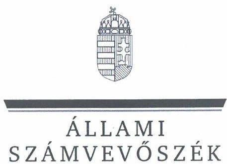

# JELENTÉS 

Az állami tulajdonú gazdasági társaságok gazdálkodásának, valamint az ehhez kapcsolódó döntések megalapozottságának ellenőrzése

Agro Rehab Nonprofit Kft.

2024.

---

# JELENTÉS 

## Az állami tulajdonú gazdasági társaságok gazdálkodásának, valamint az ehhez kapcsolódó döntések megalapozottságának ellenőrzése

Agro Rehab Nonprofit Kft.

2024.

---

# ELLENŐRZÉSI IGAZGATÓSÁG: 

## ÁLLAMI VAGYONGAZDÁLKODÁST ELLENŐRZŐ IGAZGATÓSÁG

## ELLENŐRZÉSI IGAZGATÓ:

HERCZEGH ZSOLT ellenőrzési igazgató

## ELLENŐRZÉSVEZETŐ:

Jelentéseink az interneten a www.asz.hu címen olvashatók.

DABISNÉ NYIKOS MELINDA ellenőrzésvezető

IKTATÓSZÁM: EL-3957-004/2024
TÉMASZÁM: 2677
ELLENŐRZÉS-AZONOSÍTÓ SZÁM: V1021

---

# TARTALOMJEGYZÉK 

AZ ELLENŐRZÉS ALAPADATAI ..... 5
AZ ELLENŐRZÖTT SZERVEZET ..... 7
ÖSSZEFOGLALÁS ..... 9
AZ ELLENŐRZÉS FÓKUSZKÉRDÉSE ..... 11
MEGÁLLAPÍTÁSOK ..... 12
MELLÉKLETEK ..... 27
I. sz. melléklet: Értelmező szótár ..... 27
II. sz. melléklet: Az ellenőrzött szervezetek jegyzéke ..... 30
III. sz. melléklet: Ellenőrzési kritériumok ..... 31
FÜGGELÉK: ÉSZREVÉTELEK ..... 35
RÖVIDÍTÉSEK JEGYZÉKE ..... 36

---

.

---

# AZ ELLENŐRZÉS ALAPADATAI 

## AZ ELLENŐRZÉS CÉLJA

Az ellenőrzés célja annak értékelése volt, hogy az ellenőrzött többségi állami tulajdonban álló gazdasági társaság gazdálkodása szabályszerűen történt-e; döntéshozatala során érvényesült-e a célszerűség, biztosított volt-e az állami vagyon védelme, értékének megőrzése, a társaság által a gazdálkodással összefüggésben hozott döntések megalapozottak, szabályszerűek, eredményesek voltak-e.

## AZ ELLENŐRZÉS TÍPUSA

Kombinált ellenőrzés.

## AZ ELLENŐRZÖTT IDŐSZAK

A 2022. év.
Az ellenőrzés kiterjedt az ellenőrzött időszakban hatályos, a gazdálkodással összefüggő szerződések megkötésére irányuló döntési és végrehajtási folyamatokra, illetve az ellenőrzött időszakra vonatkozó számviteli beszámoló elfogadásának időszakára is.

## AZ ELLENŐRZÉS TÁRGYA

Az ellenőrzés tárgya a többségi állami tulajdonban álló gazdasági társaság gazdálkodása szabályszerűségének, valamint az ellenőrzött időszakban a gazdálkodással összefüggésben hozott döntések megalapozottságának, célszerűségének, eredményességének, továbbá az állami vagyon értéke megőrzésének, védelmének, az állami vagyonnal való felelős gazdálkodás érvényesülésének az ellenőrzése volt. Az ellenőrzés kiterjedt továbbá a többségi állami tulajdonban álló gazdasági társaság üzleti tervében szereplő adatok és a számviteli beszámoló adatok összevetésének vizsgálatára.

Az ellenőrzés kiterjedt minden olyan körülményre és adatra, amely az ÁSZ¹ jogszabályban meghatározott feladatainak teljesítéséhez, valamint a program végrehajtása folyamán felmerült újabb összefüggések feltárásához szükséges volt.

## AZ ELLENŐRZÉS JOGALAPJA

Az ellenőrzés jogszabályi alapját az ÁSZ tv.² 1.§ (3) bekezdés és 5.§ (4) bekezdés előírásai képezték.

---

# AZ ELLENŐRZÉS MÓDSZERE 

Az ellenőrzést a nemzetközi standardokat irányadónak tekintve az ellenőrzési program szempontjai, az ellenőrzött időszakban hatályos jogszabályok, az ellenőrzés szakmai szabályok és a jelen ellenőrzésre irányadó ÁSZ módszertanok figyelembevételével végezte az ÁSZ.

Az ellenőrzési kérdések megválaszolásához szükséges bizonyítékok megszerzése az ellenőrzött szervezet által rendelkezésre bocsátott dokumentumokra és adatokra alapozva, továbbá megfigyelés, szemrevételezés, információkérés, interjú, összehasonlítás, mintavételezés, valamint elemző eljárás útján történt.

Az ÁSZ mintavételi eljárással kiválasztott tételek alapján is ellenőrizte a többségi tulajdonban álló gazdasági társaság működése szempontjából kiemelt funkcionális gazdálkodási részterületeket, melyek érintették az eszközökkel és forrásokkal való gazdálkodást, a felmerült költségeket és ráfordításokat és az alaptevékenység körébe vagy ahhoz kapcsolódóan keletkező bevételeket, ezen gazdasági események döntési, végrehajtási folyamatainak szabályszerűségét, a döntések megalapozottságát és célszerűségét, eredményességét, az állami vagyon értéke megőrzésének, védelmének, az állami vagyonnal való felelős gazdálkodás érvényesülését. A mintavételi eljárással érintett ellenőrzési területek értékelését további ellenőrzési szempontok is támogatták. A mintatételek kivetítésre nem kerültek, a megállapítások az adott mintatételekre vonatkoznak.

Az Agro Rehab Nonprofit Kft. gazdálkodásának, valamint az ehhez kapcsolódó döntések megalapozottságának az ellenőrzése a főtevékenységet érintő egyes bevételekre¹, valamint a Társaság gazdálkodására, működésére jellemző kiemelt összegeket képviselő, az eredményességre, fizetőképességre jelentős hatást gyakorló funkcionális gazdálkodási részterületekre (alterületekre) terjedt ki. Ilyenek voltak a pénzgazdálkodás funkcionális gazdálkodási részterületen belül a vevőkövetelések alterülete (továbbiakban: vevőkövetelések), valamint az állóeszköz-gazdálkodás funkcionális gazdálkodási részterület beruházások alterületéhez tartozó egyéb állományváltozások: (továbbiakban: egyéb állományváltozások).

Az ellenőrzési bizonyítékként felhasználható adatforrások közé tartoztak az ellenőrzéshez kért dokumentumok, valamint minden egyéb - az ellenőrzés folyamán feltárt - az ellenőrzés szempontjából információt tartalmazó dokumentum.

Az ellenőrzés lefolytatásához az ellenőrzött szervezet a tanúsítványok kitöltésével, az ÁSZ által kért dokumentumok, adatok, információk megküldésével és a helyszíni ellenőrzés során szolgáltatott adatokat. Az ellenőrzéshez az ÁSZ a nyilvános közhiteles adatokat is felhasználta.

[^0]
[^0]: ¹ átsorolások, elszámolt értékvesztés, terven felüli értékcsökkenés

---

# AZ ELLENŐRZÖTT SZERVEZET 

## Agro Rehab Nonprofit Korlátolt Felelősségű Társaság

Az Agro Rehab Nonprofit Kft.⁴-t az MNV Zrt.⁵ 2014.04.24-én alapította. A Társaság egyedüli tagja 2016.12.30-ig a FŐKEFE Rehabilitációs Foglalkoztató Ipari Közhasznú Nonprofit Kft., majd ezt követően 2019.07.16-ig a CONCORDIA Közraktár Kereskedelmi Zrt. volt.

2019.07.16-tól 2024.04.28-ig az Agro Rehab Nonprofit Kft. egyedüli tulajdonosa a Magyar Állam, a tulajdonosi jogokat 2019.07.16.-2019.09.25. közötti időszakban az MNV Zrt., 2019.09.26.-2022.05.26. közötti időszakban dr. Seszták Miklós kormánybiztos, majd 2022.05.27-től ismételten az MNV Zrt. gyakorolta. 2024.04.29-től a Társaság új tulajdonosa a Magyar Máltai Szeretetszolgálat Egyesület lett.

Az Agro Rehab Nonprofit Kft. önálló cégjegyzésre jogosult ügyvezetője 2014.04.24.-2020.05.18. időszak között Szabó György Zoltán, 2020.04.01.-2020.10.01. időszak között Becker György László, 2020.10.01-től Kegye Ádám volt.

Az Agro Rehab Nonprofit Kft. főtevékenysége 2014.05.19-től zöldségféle, dinnye, gyökér-, gumósnövény termesztése volt. A Társaság 2020. évig kóser növénytermesztéssel foglalkozott, a 2020. évben a kóser termesztés megszüntetésével a teljes termesztési struktúráját átalakította. A Társaság tevékenységét a székhelyén, telephelyein, valamint a fióktelepén látta el, a rendelkezésre álló adatok alapján 40 hektáron (székhely: Kisvárda, Jéki út 100. hrsz.⁶ 0121/7.; telephely: Kisvárda, hrsz. 0121/6., Kisvárda, hrsz. 0123. és hrsz.0127.; fióktelep: Karácsond, Jókai út 1615/3. sz.).

## 1. táblázat

AZ AGRO REHAB NONPROFIT KFT. 2022. ÉVI FŐBB BESZÁMOLÓ ADATAI (EZER FT, FŐ)

| MEGNEVEZÉS | 2022. ÉV |
| :-- | --: |
| Értékesítés nettó árbevétele | 62504 |
| Egyéb bevételek | 68453 |
| Anyagjellegű ráfordítások | 111128 |
| Személyi jellegű ráfordítások | 142332 |
| Adózott eredmény | -726603 |
| Tárgyi eszközök | 1540596 |
| Követelések | 14950 |
| Saját tőke | 1659931 |
| Jegyzett tőke | 67000 |
| Tőketartalék | 5207000 |
| Mérlegfőösszeg | 1736771 |
| Átlagos statisztikai létszám | 41 fő |
| ebből megváltozott munkaképességűek száma | 25 fő |

Forrás: ÁSZ saját szerkesztés az Agro Rehab Nonprofit Kft. 2022. évi éves számviteli beszámolójá alapján
Az Agro Rehab Nonprofit Kft. felügyelőbizottsága három tagból állt. A Társaság 2018.08.11-től kormányzati szektorba sorolt egyéb szervezetnek minősült, a Bkr.⁷ 54/A § alapján a Bkr. 1-10. § előírása vonatkozott rá. Az Agro Rehab Nonprofit Kft. az ellenőrzött időszakban nem alakított ki a szervezet tevékenységének, a célok megvalósításának nyomon követését biztosító rendszert és/vagy belső ellenőrzést

---

sem működtetett. A Társaság az ellenőrzött időszakban közhasznú minősítéssel nem rendelkezett, azonban a Kbt.⁸ 5. § (1) bekezdés e) pontja értelmében közbeszerzési eljárás lefolytatására kötelezett szervezetnek minősült, mivel az Agro Rehab Nonprofit Kft. részben közérdekű tevékenység folytatása céljából került létrehozásra (MNV Zrt. 124/2014. (IV.23.) számú határozata alapján megváltozott munkaképességű személyek alkalmazására).

Az Agro Rehab Nonprofit Kft. 2022. évi éves számviteli beszámolójára vonatkozó könyvvizsgálói jelentésben minősítés nélküli figyelemfelhívás került rögzítésre, mely a 2023. évet érintő működési kockázatra hívta fel a figyelmet. A 2022. évi éves számviteli beszámoló kiegészítő mellékletében rögzítésre került, hogy a legfőbb kockázati tényezőt a Társaság működésében a likviditási háttér biztonságának a hiánya jelentette.

Az ellenőrzés során az egyes állami vagyonelemek ingyenes tulajdonba adásáról szóló 1107/2024. (IV.11.) Korm. határozat⁹ 9. pontjában megadottak szerint a Kormány a Vtv.¹⁰ 36. § (2) bekezdés e) pontja alapján, a Vtv. 36. § (3) bekezdésében meghatározott jogkörében eljárva úgy határozott, hogy az Agro Rehab Nonprofit Kft. állami vagyonba tartozó üzletrésze ingyenesen, nyilvántartási értéken történő átvezetéssel a Magyar Máltai Szeretetszolgálat Egyesület közhasznú szervezet tulajdonába kerüljön. A változás bejegyzése a céginformációs rendszerben 2024.04.29-én megtörtént.

---

# ÖSSZEFOGLALÁS 

A többségi tulajdonban álló gazdasági társaságok tevékenységével szemben az egyik legfontosabb követelmény, hogy a nemzeti vagyonnal felelős módon és rendeltetésszerűen gazdálkodjanak. E követelmények érvényesülését az ÁSZ a többségi állami tulajdonban álló gazdasági társaságok gazdálkodásának ellenőrzése során kiemelten vizsgálja.
Az Agro Rehab Nonprofit Kft. 2022. évi egyéb állományváltozásokra vonatkozó legfőbb gazdálkodási döntései a 2017. és 2018. években megkezdett beruházásaihoz kapcsolódtak. A Társaság a 2017. és 2018. években speciális, a kóser termesztési technológiának megfelelő mezőgazdasági termelés kialakítására vonatkozó beruházásokat kezdett meg Kisvárdán (22 darab fóliasátor, kóser palántanevelő felépítése), valamint Fényeslitkén (logisztikai központ felépítése). A beruházások pénzügyi fedezete tőkejuttatásként került biztosításra az Agro Rehab Nonprofit Kft. részére.
Az Agro Rehab Nonprofit Kft. a kisvárdai beruházásokhoz kapcsolódó bizonylatokkal, dokumentumokkal a jogszabályi rendelkezések ellenére teljeskörűen nem rendelkezett, a fényeslitkei beruházással kapcsolatban pedig dokumentum az ellenőrzés során nem került átadásra. A rendelkezésre álló dokumentumok alapján megállapításra került, hogy az Agro Rehab Nonprofit Kft. olyan kiviteli terv alapján kötötte meg a kisvárdai (22 darab fóliasátor) beruházására vonatkozó vállalkozási szerződéseit, amely egy korábbi, a karácsondi fióktelepén végzett fóliasátor építési beruházásához készült. Jelentős többletköltséget jelentett a Társaságnak az, hogy a kisvárdai és a karácsondi beruházás eltérő konstrukciójából és méretéből adódó kivitelezési eltéréseket kizárólag pótmunkák keretében tudta megvalósíttatni. Az Agro Rehab Nonprofit Kft. további kisvárdai beruházását (kóser palántanevelő sátor telepítése) nem fejezte be, a sátor alkatrészei beszerzésre és raktári elhelyezésre kerültek, a sátor telepítésére nem került sor. Az Agro Rehab Nonprofit Kft. a megalapozatlan, részletes tervekkel alá nem támasztott döntéseinek következményeként túllépte pénzügyi kereteit, ezért nem állt rendelkezésére elegendő forrás a megkezdett beruházások befejezésére.
Az Agro Rehab Nonprofit Kft. gazdálkodási döntései nem biztosították a Társaság eredményes feladatellátását. A Társaság a 2020. évben a kóser termesztés megszüntetésével a teljes termesztési struktúra átalakítására kényszerült, majd ezt követően olyan - kóser zöldségtermesztésre kifejlesztett - fóliasátrakban kellett termesztési tevékenységet végeznie, amelyek nem a magyar klimatikus viszonyokra lettek tervezve. Az Agro Rehab Nonprofit Kft. 2022. évben - a 2017. és 2018. évben megkezdett beruházások során hozott megalapozatlan döntéseinek a következtében - jelentős összegű veszteséget realizált, befejezetlen beruházásaira terven felüli értékcsökkenést, valamint a beruházásokról az árukra átsorolt eszközökre értékvesztést számolt el.

Az ellenőrzés megállapította, hogy az Agro Rehab Nonprofit Kft. gazdálkodása nem volt szabályszerű, mivel a Társaság gazdálkodására vonatkozó szabályozási környezete nem felelt meg a jogszabályokban foglalt alapvető követelményeknek, az Agro Rehab Nonprofit Kft. belső folyamatait nem szabályozta, ellenőrzési nyomvonallal nem rendelkezett, a meglévő irányító eszközeit nem aktualizálta, szabályzatkészítési kötelezettségének, bizonylatmegőrzési kötelezettségének nem tett eleget, az ellenőrzés alá vont gazdálkodási döntései nem voltak megalapozottak.

---

Az Agro Rehab Nonprofit Kft. részére az ellenőrzés során a szabályozási környezet tekintetében feltárt szabálytalanságok súlya miatt az ÁSZ tv. alapján figyelemfelhívó levél került kiküldésre, amely azonnali intézkedést igényelt. Az ellenőrzött szervezet a figyelemfelhívó levél átvételét követő 15 napon belül tájékoztatta az ÁSZ-t a megtett intézkedésekről, valamint intézkedési tervet készített. Az ellenőrzött szervezet tervezett intézkedései a feltárt szabálytalanságok megszüntetésére alkalmasak.

Az Agro Rehab Nonprofit Kft. a jogszabályban, valamint a belső
 szabályzatban előírt rendelkezések ellenére a gazdálkodási döntések megalapozásához szükséges üzleti tervvel, valamint döntéselőkészítő dokumentumokkal nem rendelkezett. A Társaság a jogszabály előírása ellenére nyomon követési rendszert, valamint a döntés realizálás folyamatába kontrollokat nem épített be és nem működtetett.

A Társaság a jogszabályban foglalt bizonylatmegőrzési kötelezettség elmulasztásával a nemzeti vagyongazdálkodásra vonatkozó, egységes elveken alapuló, átlátható, hatékony és költségtakarékos működtetést, a vagyongazdálkodás tekintetében fennálló kötelezettségeinek teljesítését nem igazolta.

Az Agro Rehab Nonprofit Kft. által rendelkezésre bocsátott dokumentumok alapján az ellenőrzés megállapította, hogy a vizsgálat alá vont tételek tekintetében a Társaság gazdálkodási döntései a jogszabályi rendelkezések ellenére nem voltak megalapozottak, nem érvényesült a célszerűség, valamint a nemzeti vagyonnal való felelős gazdálkodás elve, továbbá nem biztosították az eredményes feladatellátást.

Az ellenőrzés a 2017., 2018. évekre juttatott 3490000 E Ft tőketartalék ~36,5%-nak (1 274 278 E Ft) felhasználását beazonosítani nem tudta. Továbbá a Társaság könyveiben kimutatott (beazonosított) 2 215 722 E Ft értékű tételből mindössze 1 516 489 E Ft kapcsolódott a 2017., 2018. évi beruházásokhoz, mint aktivált eszközök értéke. A fennmaradó 699 233 E Ft két részből, a beruházások terhére elszámolt 188 621 E Ft értékű selejtezésből, valamint 510 612 E Ft értékű befejezetlen beruházásokból tevődött össze. Az ellenőrzött időszakban a befejezetlen beruházásokra vonatkozóan az Agro Rehab Nonprofit Kft. 352 190 E Ft terven felüli értékcsökkenést számolt el, majd további 158 423 E Ft összértékű befejezetlen beruházást sorolt át az áruk közé. A Társaság az átsorolást követően az árukra 63 623 E Ft értékvesztést számolt el.

Az Agro Rehab Nonprofit Kft. számviteli elszámolásaira az ellenőrzött tételek tekintetében nem a jogszabályban foglalt rendelkezések alapján került sor. A Társaság 2022. évi éves számviteli beszámolója nem ad megbízható és valós összképet a gazdálkodó vagyonáról, annak összetételéről, pénzügyi helyzetéről és tevékenysége eredményéről.

Az Agro Rehab Nonprofit Kft. ellenőrzés alá vont egyéb állományváltozásaihoz kapcsolódó beruházásai nem fejeződtek be, ezáltal a beruházásokra kapott tőkejuttatások felhasználása eredménytelen volt.

Az Agro Rehab Nonprofit Kft. nem tett eleget az Alaptörvényben ${ }^{11}$ meghatározott azon gazdálkodási alapelvnek, mely szerint az állam tulajdonában álló gazdálkodó szervezetek törvényben meghatározott módon, önállóan és felelősen gazdálkodnak a törvényesség, a célszerűség és az eredményesség követelményei szerint, valamint megsértette az Nvtv. ${ }^{12}$ törvény szerinti felelős gazdálkodás elvét.

---

# AZ ELLENŐRZÉS FÓKUSZKÉRDÉSE 

1.- A Társaság gazdálkodása szabályozási rendszerének kialakítása, a gazdálkodás szabályszerűsége, a célszerűségi, eredményességi szempontok érvényesülése, a kapcsolódó döntések megalapozottsága, a döntés realizálás folyamatába beépített kontrollok működése.

---

# MEGÁLLAPÍTÁSOK 

## 1. A Társaság gazdálkodása szabályozási rendszerének kialakítása, a gazdálkodás szabályszerűsége, a célszerűségi, eredményességi szempontok érvényesülése, a kapcsolódó döntések megalapozottsága, a döntés realizálás folyamatába beépített kontrollok működése.

Összegző megállapítás Az Agro Rehab Nonprofit Kft. belső szabályozási rendszerét teljeskörűen nem alakította ki, gazdálkodási döntései, valamint számviteli elszámolásai az ellenőrzött tételek vonatkozásában nem voltak szabályszerűek. Az Agro Rehab Nonprofit Kft. a gazdálkodással összefüggő dokumentumokkal teljeskörűen nem rendelkezett, így a Társaság a döntéseinek megalapozottságát nem igazolta. A megőrzött és átadott dokumentumok alapján vizsgált döntések esetében megállapításra került, hogy azok a jogszabályi előírás ellenére nem voltak megalapozottak. Az Agro Rehab Nonprofit Kft. a döntés realizálás folyamatában nem alakított ki és nem működtetett kontrollokat. A Társaság vizsgálat alá vont döntései tekintetében nem érvényesültek a célszerűség szempontjai, azok nem biztosították a felelős vagyongazdálkodásra, eredményes működésre vonatkozó követelmények teljesítését.

Az Agro Rehab Nonprofit Kft. gazdálkodásának, valamint az ehhez kapcsolódó döntések megalapozottságának ellenőrzése az egyes bevételekre, valamint a vevőkövetelésekre és az egyéb állományváltozásokra terjedt ki.
Az Agro Rehab Nonprofit Kft. gazdálkodásának szabályozási rendszerére vonatkozó megállapítások
Az Agro Rehab Nonprofit Kft. az ellenőrzött időszakban a belső szabályozási környezetét - az alábbiakban részletezettek szerint - nem alakította ki szabályszerűen, hiányosságok kerültek az ellenőrzés során feltárásra.
A belső szabályozási környezet hiányosságai miatt az Agro Rehab Nonprofit Kft. részére 2024.02.05-én az ÁSZ tv. 31. §-a alapján figyelemfelhívó levél került kiküldésre. Az ellenőrzött szervezet a figyelemfelhívó levél átvételét követő 15 napon belül - 2024.02.17-én - tájékoztatta az ÁSZ-t a megtett intézkedésekről, valamint intézkedési tervet készített. Az ellenőrzött szervezet tervezett intézkedései a feltárt szabálytalanságok megszüntetésére alkalmasak.

---

Az ellenőrzés megállapította, hogy az Agro Rehab Nonprofit Kft. a Bkr. 6. § (1) bekezdésében előírtak ellenére - kormányzati szektorba sorolt egyéb szervezetként - nem alakított ki olyan kontrollkörnyezetet, amelyben világos a szervezeti struktúra, a folyamatok átláthatóak, egyértelműek a felelősségi, hatásköri viszonyok és feladatok, meghatározottak, ismertek és elfogadottak az etikai elvárások a szervezet minden szintjén, átlátható a humánerőforrás-kezelés. A szervezeti és működési szabályok az Alapítói okirat ${ }_{4-5}$ V.3.n. pont ellenére nem kerültek megállapításra, a felelősségi, döntési hatáskörök nem kerültek meghatározásra, a gazdálkodásával szemben elvárt követelmények, a létesítő okiratban meghatározott, az Alapító által elfogadott üzleti terv nem állt rendelkezésre.
Az Agro Rehab Nonprofit Kft. a 2022. évre vonatkozó üzleti tervét az Alapítói okirat ${ }_{4-5}{ }^{13}$ V.3.b. pont alapján ugyan elkészítette, azonban azt a tulajdonosi joggyakorló a Társaság részére kiegészítés céljából visszaadta, elfogadásra nem került. Ezt követően az Agro Rehab Nonprofit Kft. a 2023. évi tervezésre fókuszált, 2022. évi üzleti tervének kiegészítésére nem került sor.
Az Agro Rehab Nonprofit Kft. a Bkr. 6. § (3) bekezdésében foglaltak ellenére nem készítette el a teljes tevékenységét lefedő ellenőrzési nyomvonalat, valamint nem aktualizálta rendszeresen a gazdasági terület ellenőrzési nyomvonalát sem. Az Agro Rehab Nonprofit Kft. nem rendelkezett a működési folyamatainak szöveges, táblázatokkal vagy folyamatábrákkal szemléltetett leírásával, nem kerültek kialakításra a felelősségi és információs szintek és azok kapcsolataira, irányítási és ellenőrzési folyamataira vonatkozó szabályozások, ennek hiányában azok nyomon követése és utólagos ellenőrzése nem volt biztosított.
Az Agro Rehab Nonprofit Kft. nem rendelkezett a gazdálkodás rendjét meghatározó szabályzattal, továbbá a gazdálkodására, folyamataira vonatkozó aktualizált szabályzatokkal - többek között a Számv. tv. ${ }^{14} 14 . \S$ (3) bekezdés szerinti Számviteli politikával ${ }^{15}$, a Számv. tv. 14. § (5) bekezdés a), b), d) pontjai alapján a Számviteli politika keretében elkészítendő szabályzatokkal, valamint a Számv. tv. 161. § szerinti Számlarenddel ${ }^{16}$-. Az Agro Rehab Nonprofit Kft. képviseletére jogosult személy a Számv. tv. 14. § (12) bekezdés ellenére a Társaság Számviteli politikáját a Számv. tv. 14. § (3)-(4) bekezdés alapján a Társaság adottságainak, körülményeinek, a jellemző szabályok, előírások, módszerekben bekövetkezett változásoknak megfelelően nem módosította.
Az Agro Rehab Nonprofit Kft. a Számv. tv. 14. § (5) bekezdés c) pontja és (7) bekezdése alapján előírt önköltségszámítás rendjére vonatkozó szabályzattal nem rendelkezett, amelynek elkészítésére a 2019. évtől kötelezett volt.
Az Agro Rehab Nonprofit Kft. a Bkr. 6. § (2) bekezdésében foglaltak ellenére nem adott ki olyan szabályzatokat, nem alakított ki és működtetett olyan folyamatokat a szervezeten belül, amelyek biztosítják a rendelkezésre álló források átlátható, szabályszerű, szabályozott, gazdaságos, hatékony és eredményes felhasználását.
Az Agro Rehab Nonprofit Kft. a kontrolltevékenység részeként nem alakította ki a Bkr. 8. § (2) bekezdés a)-c) pontjai ellenére a döntések dokumentálásának, a döntések célszerűségi, gazdaságossági, hatékonysági és eredményességi szempontú megalapozottságának, valamint a döntések szabályszerűségi szempontból történő jóváhagyására irányuló kontrollokat.
Az Agro Rehab Nonprofit Kft. a Bkr. 10. §-ban foglaltak ellenére nem alakított ki a szervezet tevékenységének, a célok megvalósításának nyomon követését biztosító rendszert és/vagy belső ellenőrzést sem működtetett.
Az Agro Rehab Nonprofit Kft. az Info tv. ${ }^{17}$ 33. § alapján a közzétételi kötelezettségének nem tett eleget a honlapján ${ }^{18}$.

---

A figyelemfelhívó levélben jelzetteken kívül az Agro Rehab Nonprofit Kft. nem rendelkezett a Kbt. 27. § szerinti közbeszerzési szabályzattal, valamint a Kbt. 42. § (1) bekezdésben szabályozott közbeszerzési tervvel.
Az Agro Rehab Nonprofit Kft. 2022. évi Számlatükre ${ }^{19}$ a Számv. tv. 161. § (2) bekezdés a) pont ellenére nem volt összhangban a Számlarendjével.

# Az ellenőrzés megállapította, hogy a szabályozási környezet hiányosságai egyaránt kihatottak az Agro Rehab Nonprofit Kft. teljes gazdálkodására, döntéseire és folyamataira. Ebből adódóan az Alaptörvény 38. cikk (5) bekezdésében, valamint az Nvtv. 7. § (1) bekezdésében foglalt felelős gazdálkodás érvényesülésének alapvető feltételei nem teljesültek. 

## Egyes bevételekre vonatkozó megállapítások

Az Agro Rehab Nonprofit Kft. ellenőrzött időszaki főtevékenységéhez (TEÁOR 0113'08 Zöldségféle, dinnye, gyökér-, gumósnövény termesztése) kapcsolódó 2022. évben realizált értékesítés nettó árbevétele 62 504 E Ft volt, a tevékenységének ellátásához különböző forrásokból 45 907 E Ft támogatást kapott. A támogatások 87,6%-át a rehabilitációs foglalkoztatás ellátására juttatott támogatás, a fennmaradó 12,4%-át a mezőgazdasági tevékenység ellátásához kapcsolódó támogatások tették ki.
A főtevékenység ellenőrzéséhez 10 mintatétel került kiválasztásra, melyből hat mintatétel az Agro Rehab Nonprofit Kft. legnagyobb összegű - eltérő partnerektől származó - értékesítés nettó árbevételéhez, négy mintatétel pedig - támogatásonként differenciált - egyéb bevételeihez kapcsolódott. A kiválasztott értékesítés nettó árbevételre vonatkozó mintatételek összege az összes értékesítés nettó árbevétel 19,5%-át, míg a kiválasztott támogatások az összes támogatás 15,1%-át tették ki.
A Társaság az Alapító által elfogadott 2022. évi üzleti tervvel nem rendelkezett, annak hiánya miatt nem volt biztosított az eredményesség mérésének alapvető feltétele. Az Agro Rehab Nonprofit Kft. a Bkr. 10. § ellenére a célok megvalósításának nyomon követését biztosító rendszert nem alakított ki és/vagy belső ellenőrzést sem működtetett.
Az Agro Rehab Nonprofit Kft. ügyvezetőjének tájékoztatása alapján az ellenőrzött időszak vonatkozásában a gazdasági döntések hátterében a termesztési tevékenység és a foglalkoztatás folyamatosságának fenntartása, valamint a működés biztosítása állt. A termesztett növényi kultúrák meghatározásánál a legfontosabb szempontokat a termesztési körülmények (talaj tulajdonsága, külföldi fólia sátrak szellőztethetősége, rendelkezésre álló öntözési technológia), valamint a kereskedői igények és a szállítási költségek jelentették. Az Agro Rehab Nonprofit Kft. önköltségszámítási szabályzattal nem rendelkezett, azonban az ügyvezető nyilatkozata szerint az önköltség számítása során az összes felmerült költséget (munkabér, üzemanyag, műtrágya- és növényvédőszer felhasználás, egyéb költségek) figyelembe vették. A megtermelt termények minősítésére, értékelésére a felvásárló igényeinek megfelelően került sor, a termékek minőségét a vevő határozta meg, ennek keretében változott a felvásárlási ár is. A termeszthető növényi kultúrák szűk köre és az a tény, hogy logisztikai hátteret az Agro Rehab Nonprofit Kft. nem tartott fenn (a szállításhoz a partner infrastruktúrájára támaszkodtak), korlátozták az értékesítési lehetőségeket. Az Agro Rehab Nonprofit Kft. a lakosság irányába kiskereskedelmi, vagy ahhoz közelítő áron történő értékesítést folytatott, a nagy tételben való értékesítéseknél év elején, szerződéses formában lekötötték a legjobb árat kínáló vevő partnerekkel az egyes termesztett növények várható mennyiségét. Az értékesítési árat mindig az aktuális piaci ár határozta meg, kivéve, ha a termesztési év elején megkötött szerződéssel rendelkeztek. Az Agro Rehab Nonprofit Kft. a piaci árat a debreceni és a budapesti Nagybani

---

piaci árak alapján állapította
 meg, figyelembe véve a termesztési hely távolságát, a szállítási költséget, valamint a helyi igényeket is.
Az ellenőrzött egyes bevételek vonatkozásában a Társaság a Bkr. 8. § (2) bekezdés ellenére nem alakított ki a döntések dokumentálására, a döntések célszerűségi, gazdaságossági, hatékonysági és eredményességi szempontú megalapozottságára, valamint a döntések szabályszerűségi szempontból történő jóváhagyására irányuló kontrollokat. Ebből adódóan döntéselőkészítő és döntést tartalmazó dokumentumokkal, vagy azt alátámasztó számításokkal, elemzésekkel az Agro Rehab Nonprofit Kft. egy esetben sem rendelkezett. Az Agro Rehab Nonprofit Kft. részéről az egyes terményeknél alkalmazott egységárak dokumentumokkal alátámasztásra nem kerültek, amely támogatta volna a Társaság eredményes gazdálkodását. A Társaság főtevékenységének ellátásához kapcsolódó döntési dokumentumok, számítások hiányában nem volt igazolt az, hogy az Agro Rehab Nonprofit Kft. a gazdálkodása során az értékesítéskor alkalmazott árakat valóban az aktuális piaci árak vonatkozásában határozta meg. Az Agro Rehab Nonprofit Kft. gazdálkodási döntéseinek megalapozottsága bizonylatok hiányában nem került igazolásra.
Az ellenőrzés megállapította az értékesítés nettó árbevételét érintően, hogy az ellenőrzött tételek 83%-nál (I_6, I_7, I_8, I_9, I_10 mintatételek) nem állt rendelkezésre a számviteli nyilvántartásba történő bejegyzéshez szükséges szabályszerűen kiállított bizonylat (számla, nyugta), továbbá az ellenőrzött tételek 67%-nál (I_6, I_7, I_8, I_10 mintatételek) az Agro Rehab Nonprofit Kft. nem rendelkezett az értékesítés alapjául szolgáló szerződésekkel sem. A Társaság az eljárásával megsértette a Számv. tv. 15. § (3) bekezdését, a Számv. tv. 165. § (2) bekezdését, a Számv. tv. 169. § (2) bekezdését, a Bizonylati rend $^{20}$ 7. pontját, az Áfa tv. $^{21}$ 159. § (1) bekezdését, valamint az Áfa tv. 166. § (1) bekezdését. A Társaság értékesítés nettó árbevételére vonatkozó döntései nem voltak szabályszerűek.
Az értékesítés nettó árbevételt érintő ellenőrzött tételek 100%-nál (I_5, I_6, I_7, I_8, I_9, I_10 mintatételek) nem álltak rendelkezésre a teljesítés igazolásához kapcsolódó dokumentumok (szállítólevelek, értékesített termékre vonatkozó átadás-átvételi bizonylatok), így az Áfa tv. 25. §-a szerinti teljesítés helye nem került igazolásra.
Az Agro Rehab Nonprofit Kft. támogatásai a 2022. év vonatkozásban rehabilitációs foglalkoztatáshoz (I_1 mintatétel), valamint mezőgazdasági támogatásokhoz (I_2, I_3, I_4 mintatételek: SAPS $^{22}$, zöldségnövény termesztés, zöldítés) kapcsolódtak. A Társaság az ellenőrzött időszak vonatkozásában 25 fő megváltozott munkaképességű munkavállalót foglalkoztatott, mezőgazdasági tevékenységét székhelyén, telephelyein, valamint fióktelepén végezte.
A mezőgazdasági támogatásokra (I_2, I_3, I_4 mintatételek) vonatkozóan a Társaság a Bkr. 8. § (2) bekezdés ellenére nem alakított ki a döntések dokumentálására, a döntések célszerűségi, gazdaságossági, hatékonysági és eredményességi szempontú megalapozottságára, valamint a döntések szabályszerűségi szempontból történő jóváhagyására irányuló kontrollokat. A Társaság a támogatásokkal kapcsolatos döntéselőkészítő és döntést tartalmazó dokumentumokkal, számításokkal nem rendelkezett (pl. pályázati támogatások előkészítő anyagai, igényelt táblák, összterület meghatározása, területek hasznosítási adatainak alátámasztására szolgáló dokumentumok stb.). A mezőgazdasági támogatásokra vonatkozó egységes kérelemben szereplő adatok nem kerültek igazolásra.
Az ellenőrzés megállapította a Társaság rehabilitációs és zöldségnövény termesztési támogatásaira vonatkozóan (I_1, I_3 mintatételek), hogy a Számv. tv. 165. § (2), 169. § (2) bekezdései, a Bizonylati rend 7. pontja ellenére nem álltak rendelkezésre az elszámolás alapjául szolgáló számviteli bizonylatok (támogatási szerződések, végzések, részletkifizetések alátámasztásául szolgáló végzések),

---

mivel a Társaság csak a támogatás pénzügyi teljesítését (számlakivonatban szereplő támogatás jóváírását) tudta igazolni. A Társaság a Számv. tv. 15. § (3) bekezdését megsértette, miszerint könyvvitelben rögzített és a beszámolóban szereplő tételeknek a valóságban is megtalálhatóknak, bizonyíthatóknak, kívülállók által is megállapíthatóknak kell lenniük.
A Társaság továbbá nem tudta az ellenőrzés rendelkezésére bocsátani a támogatások 100%-nál (I_1, I_2, I_3, I_4 mintatételek) a támogatások tényleges felhasználásával kapcsolatos dokumentumokat, mivel a Számv. tv. 169. § (2) bekezdésben foglaltak ellenére nem tett eleget bizonylatmegőrzési kötelezettségének. A támogatások cél szerinti felhasználását az ellenőrzés nem tudta értékelni.

Az Agro Rehab Nonprofit Kft. az egyes bevételek elszámolása során nem járt el szabályszerűen, bizonylatmegőrzési kötelezettségének nem tett eleget, a támogatásokra vonatkozóan a cél szerinti felhasználást dokumentumokkal nem támasztotta alá. Az Agro Rehab Nonprofit Kft. részéről a termékek egységárai, önköltségei nem kerültek dokumentumokkal, részletes számításokkal alátámasztásra, holott ez támogatta volna a Társaság eredményes gazdálkodását. Az Agro Rehab Nonprofit Kft. - alátámasztó bizonylatok hiányában - a gazdálkodási döntéseinek megalapozottságát nem tudta igazolni.

# Vevőkövetelésekre vonatkozó megállapítások 

Az Agro Rehab Nonprofit Kft. külföldi és belföldi vevőkövetelésének tartozik és követel forgalmának egyenlege a 2022. év végén 85975 E Ft, a vevőkövetelésekre elszámolt értékvesztés összege 78943 E Ft-ot tett ki, a vevőkövetelések mérlegben megjelenő záró egyenlege ebből adódóan 7032 E Ft volt.
A vevőkövetelések vonatkozásában 10 mintatétel került kiválasztásra, korosított követelések $^{23}$ alapján. A mintatételek öt esetben nem lejárt (II_1, II_2, II_3, II_4, II_5 mintatételek), kettő esetben 2022. évben lejárt (II_6, II_7 mintatételek), három esetben pedig a 2022. évet megelőzően lejárt (II_8, II_9, II_10 mintatételek) tételek voltak.
Az ellenőrzött időszakban az Agro Rehab Nonprofit Kft. számviteli feladatait két szerződéses partner látta el (első partner 2022.09.30-ig, második partner 2022.10.01-től). A partnerekkel kötött szerződések mind a két esetben tartalmazták a Társaság vevőköveteléseivel kapcsolatos feladatok ellátását. Ennek keretében az első partnerrel kötött szerződés alapján a számviteli szolgáltatást nyújtó társaság feladatai közé tartozott a vevőkövetelések, kintlévőségek ellenőrzése, az adós minősítése alapján a behajthatatlan követelések után az értékvesztés elszámolásának ellenőrzése, a vevő analitika és a főkönyvi számla egyeztetésének ellenőrzése, valamint havi és negyedéves riportok készítése a Társaság vevőkkel szembeni követeléseiről. A második partner szerződése magába foglalta a vevő folyószámlák kezelését, a számlák könyvelését, a határidőn túli követelések kezelését, a vevői egyenlegközlők készítését, valamint a kapcsolódó kontrolling feladatokat (pl. vevőállomány korosítása). A szerződésben meghatározott, külső partnerek által ellátandó kontrollfeladatokkal (vevőkövetelések, kintlévőségek ellenőrzése, riportok készítése stb.) kapcsolatban a Társaság dokumentumokkal nem rendelkezett. A 2022. évi mérlegben szereplő vevőkövetelések alátámasztása a Számv. tv. 165. § (2) bekezdésében foglalt bizonylatmegőrzési kötelezettség ellenére nem került igazolásra.
A vevőkövetelések alterület vonatkozásában a Társaság a Bkr. 8. § (2) bekezdés ellenére nem alakította ki a döntések dokumentálására, a döntések célszerűségi, gazdaságossági, hatékonysági és eredményességi szempontú megalapozottságára, valamint a döntések szabályszerűségi szempontból történő jóváhagyására irányuló kontrollokat. Az Agro Rehab Nonprofit Kft. döntéseit nem alapozta meg a

---

vevőkövetelések tekintetében, továbbá a Társaság a Bkr. 10. § ellenére a célok megvalósításának nyomon követését biztosító rendszert nem alakított ki és/vagy belső ellenőrzést sem működtetett.
A Társaság a vevőkövetelések értékelésére vonatkozó szabályait a Számv. tv. rendelkezései alapján a Számviteli politikájában, Értékelési szabályzatában $^{24}$, Számlarendjében, valamint a Leltározási szabályzatában rögzítette. Azonban az Agro Rehab Nonprofit Kft. a 2022. évben - a kiegészítő melléklet szerint - a 365 nap feletti követelések esetében a teljes tartozásra 100%-os értékvesztést számolt el. A Társaság Számviteli politikája a Számv. tv. 14. § (4) bekezdésében foglaltakkal szemben nem tartalmazta a kiegészítő mellékletben alkalmazott eljárást, illetve nem tartalmazta azt sem, hogy mit tekint az értékelés szempontjából jelentősnek. A Számv. tv. 55. § (2) bekezdésében foglaltak ellenére nem került továbbá rögzítésre a kis összegű követelések értékelésekor alkalmazandó értékvesztés elszámolására vonatkozó szabályozás sem. Az ellenőrzött tételek 100%-nál a Számv. tv. 16. § (1) bekezdés ellenére az egyedi értékelés elve nem érvényesült, miszerint a könyvvezetés és a beszámoló elkészítése során az eszközöket egyedileg kell rögzíteni és értékelni. A vevőkövetelések egyedi értékelésére vonatkozó dokumentumokkal (értékvesztés alátámasztása, adós minősítés stb.) a Társaság nem rendelkezett.
A vevőkövetelések tekintetében az ellenőrzés megállapította, hogy az ellenőrzött tételek 90%-nál (II_1, II_2, II_3, II_4, II_5, II_6, II_7, II_8, II_10 mintatételek) az Agro Rehab Nonprofit Kft. az elszámolás alapjául szolgáló bizonylatokat (számla) nem tudta rendelkezésre bocsátani, mellyel megsértette a Számv. tv. 15. § (3), Számv. tv. 165. § (2), 169. § (2) bekezdéseit, valamint a Bizonylati rend 7. pontját. Ebből adódóan nem volt igazolt, hogy a Társaság könyveiben rögzített követelések összegei valósak voltak-e, a pénzgazdálkodáshoz kapcsolódó döntései során az Agro Rehab Nonprofit Kft. megalapozottan járt-e el.
A 2022. évben lejárt és a 2022. évet megelőzően lejárt ellenőrzött tételek 80%-nál (II_7, II_8, II_9, II_10 mintatételek) a Számv. tv. 29. § (2) bekezdése ellenére az egyenlegközlő levelek kiküldésének és annak visszaigazolásának hiányában nem kerültek teljeskörűen alátámasztásra az elismert követelések összegei.
A Társaság 2022. évet megelőzően lejárt vevőköveteléseinél minden esetben (II_8, II_9, II_10 mintatételek) értékvesztést számolt el, azonban az Agro Rehab Nonprofit Kft. egy esetben sem támasztotta alá dokumentumokkal - a Számv. tv. 55. § (1) bekezdésében foglalt előírások ellenére - az értékvesztés elszámolására irányuló döntését.

Az Agro Rehab Nonprofit Kft. 2022. évet megelőzően lejárt ellenőrzött tételek vonatkozásában a Bkr. 8. § (2) bekezdés ellenére a döntések dokumentálására, a döntések célszerűségi, gazdaságossági, hatékonysági és eredményességi szempontú megalapozottságára, valamint a döntések szabályszerűségi szempontból történő jóváhagyására irányuló kontrollokat nem alakított ki. A Társaság a vevőkövetelések behajtása tekintetében döntéselőkészítő dokumentumokkal nem rendelkezett, nem igazolta, hogy a behajtás érdekében bármilyen intézkedést foganatosított volna. Az ügyvezető tájékoztatása szerint a Társaságnak nem volt elég anyagi forrása pert indítani a követelések behajtására. A külföldi partnerre vonatkozó vevőkövetelése (II_8 mintatétel) esetében a külföldi partner az Agro Rehab Nonprofit Kft.-vel való üzleti kapcsolatát - és ebből adódóan a vevőkövetelés összegét - pedig el sem ismerte, ezáltal a Társaság el nem ismert követelést mutatott ki követelésként. Az értékvesztésként leírt vevőkövetelések tekintetében az egyenlegközlők kiküldései, a vevő, adós minősítésének dokumentumai nem kerültek átadásra, a Társaság semmilyen egyéb, a követelés behajtására irányuló - nem peres eljáráshoz kapcsolódó

---

- dokumentummal (pl. egyeztetések dokumentumai, fizetési felszólítások, fizetési meghagyások stb.) nem rendelkezett.

Az Agro Rehab Nonprofit Kft. a vevőkövetelések elszámolása során nem járt el szabályszerűen, a Társaság a bizonylatmegőrzési kötelezettségének nem teljeskörűen tett eleget. A Társaság folyamatba épített kontrollokat nem működtetett, továbbá az Alapító által elfogadott üzleti tervvel nem rendelkezett. Az Agro Rehab Nonprofit Kft. a Bkr. 8. § (2) bekezdés ellenére kontrollokat nem alakított ki, a vevőkövetelések kezelésével kapcsolatos gazdálkodási döntéseit, azok előkészítését nem támasztotta alá. A Társaság gazdálkodási döntéseinek megalapozottsága bizonylatok hiányában nem került igazolásra.
A Társaság az ellenőrzés során a vevőkövetelések behajtására irányuló dokumentumokkal nem rendelkezett, az ezzel kapcsolatos döntéseit az ellenőrzött tételek vonatkozásában nem igazolta, továbbá az értékvesztések elszámolását sem támasztotta alá, az Nvtv. 7. § (1)-(2) bekezdés szerinti felelős vagyongazdálkodásra vonatkozó alapelv nem érvényesült.
Az ellenőrzés véleménye szerint, amennyiben működési, finanszírozási problémái voltak a Társaságnak, mint az az ügyvezető tájékoztatásából, valamint a könyvvizsgáló jelentésében rögzített minősítés nélküli figyelemfelhívásból is kiderült, úgy a követelések nyomon követése, a behajtására vonatkozó szükséges intézkedések megtétele a folyamatos működéshez szükséges pénzügyi források
 biztosítása érdekében elengedhetetlen lett volna. Az Agro Rehab Nonprofit Kft. vevőkövetelésekkel kapcsolatos döntései nem biztosították a kintlévőségek célszerű és eredményes kezelését.

# Egyéb állományváltozásokra vonatkozó megállapítások 

Az Agro Rehab Nonprofit Kft. a 2022. évben jelentős összegű veszteséget realizált (-726 603 E Ft adózott eredmény), melynek legfőbb okai a beruházásokat érintő terven felüli értékcsökkenések, valamint az árukhoz kapcsolódó értékvesztések elszámolásai voltak. Az Agro Rehab Nonprofit Kft. tárgyi eszközeinek értéke 2021. évtől 2022. évre 30%-kal csökkent (2 209 735 E Ft-ról 1 540 596 E Ft-ra), ezen belül is kiemelkedő volt a beruházások mérlegtételi értékének változása, amely 516 912 E Ft-ról 6542 E Ft-ra redukálódott. A Társaság az ellenőrzött időszakban 352 190 E Ft értékben számolt el a beruházások mérlegtételre - azok megvalósíthatatlansága miatt - terven felüli értékcsökkenést, továbbá 158 423 E Ft értékben átsorolást hajtott végre a befejezetlen beruházásokról az áruk közé. Az Agro Rehab Nonprofit Kft. az átsorolt áruk tekintetében 63 623 E Ft értékvesztést számolt el. A Társaság 2022. évi gazdálkodásának eredményére jelentős hatást gyakoroltak a beruházásokat érintő állományváltozásokra vonatkozó döntései.
Az ellenőrzés során az egyéb állományváltozások alterületen belül a 10 legnagyobb összegű tétel került kiválasztásra (a póttétel felhasználásra került III_11 mintatétel a III_10 mintatétel helyett), így kettő mintatétel a befejezetlen beruházás árukra történő átsorolásához és értékvesztéséhez, nyolc mintatétel pedig a beruházások terven felüli értékcsökkenésének elszámolásához kapcsolódott. Az ellenőrzés során kiválasztott mintatételek a teljes kivezetett, illetve átsorolt érték 92%-át fedték le.
A Társaság az Alapító okirat ${ }_{4.5}$ V.3.b. pontjában rögzített kötelezettség ellenére a 2022. évben hatályos középtávú stratégiai tervvel, valamint az Alapító által elfogadott 2022. évi üzleti tervvel nem rendelkezett, így a beruházások egyéb állományváltozásainak tervekkel való összhangja az ellenőrzés során nem volt értékelhető.

---

Az Agro Rehab Nonprofit Kft.-ben a 2015. és a 2019. évek között, valamint a 2021. évben nagymértékű tőkeemelést hajtottak végre, melynek célja a Társaság „kóser növényház" beruházási projektjének a megvalósítása volt. A beruházások pénzügyi fedezetét az Agro Rehab Nonprofit Kft. részére teljesített tőkejuttatás jelentette, ennélfogva a 2015-2021. években összesen 5 271 000 E Ft ázsiós tőkeemelést hajtottak végre a Társaságnál (ebből tőketartalékba helyezett összeg 5 207 000 E Ft volt).
Az ellenőrzött időszakot érintő terven felüli értékcsökkenés és értékvesztés állományváltozások a kisvárdai (22 darab fóliasátor, kóser palántanevelő felépítése), valamint a fényeslitkei (logisztikai központ) beruházásokhoz kapcsolódtak. A rendelkezésre álló dokumentumok szerint az Agro Rehab Nonprofit Kft. ezen beruházásait a 2017., 2018. években kötött szerződések alapján kezdte meg, melyeket - a 2. táblázathan részletezett - tőkejuttatásokból finanszírozott (a tőkejuttatás összege a 2017., 2018. években összesen 3 550 000 E Ft volt, melyből tőketartalékba 3 490 000 E Ft került).
A kóser zöldségtermesztő és logisztikai központ céljára juttatott forrásokat az 1806/2016. (XII.20.) Korm. határozat ${ }^{25}$, az 1903/2017. (XII.5.) Korm. határozat ${ }^{26}$, valamint az 1763/2018. (XII.20.) Korm. határozat ${ }^{27}$ szabályozta.
2. táblázat

AZ AGRO REHAB NONPROFIT KFT. TÖKEEMELÉSEI 2015-2021. ÉV KÖZÖTT (EZER FT)

| TÖKEEMELÉST VÉGREHAJTÓ | ÁZSÍOS   TÖKEEMELÉS28 ÖSSZEGE | TÖKEEMELÉSRŐL TÖKETARTALÉKBA HELVEZETT ÖSSZEG | TÖKEEMELÉSBŐL JEGYZETT TÖKE EMELÉS |
| :--: | :--: | :--: | :--: |
| 2015. év |  |  |  |
| FŐKEFE Rehabilitációs Foglalkoztató Ipari Közhasznú Nonprofit Kft. | 200 000 | 199 000 | 1 000 |
| 2016. év |  |  |  |
| FŐKEFE Rehabilitációs Foglalkoztató Ipari Közhasznú Nonprofit Kft. | 600 000 | 599 000 | 1 000 |
| 2017. év |  |  |  |
| CONCORDIA Közraktár Kereskedelmi Zrt. | 3 000 000 | 2 950 000 | 50 000 |
| 2018. év |  |  |  |
| CONCORDIA Közraktár   Kereskedelmi Zrt. | 550 000 | 540 000 | 10 000 |
| 2019. év |  |  |  |
| Magyar Állam tulajdonos nevében a tulajdonosi joggyakorló dr. Seszták Miklós kormánybiztos | 571 000 | 570 000 | 1 000 |
| 2020. év | - | - | - |
| 2021. év |  |  |  |
| Magyar Állam tulajdonos nevében a tulajdonosi joggyakorló dr. Seszták Miklós kormánybiztos | 350 000 | 349 000 | 1 000 |
| Összesen | 5 271 000 | 5 207 000 | 64 000 |

---

Az ellenőrzés a 2017., 2018. évekre juttatott 3 490 000 E Ft tőketartalék ~36,5%-nak (1 274 278 E Ft) felhasználását beazonosítani nem tudta. Továbbá a Társaság dokumentumaiban - 2022. évi főkönyvi kartonok - beazonosított 2 215 722 E Ft értékű tételekből mindössze 1 516 489 E Ft kapcsolódott a 2017., 2018. évi beruházásokhoz, mint aktivált eszközök értéke. A fennmaradó 699 233 E Ft két részből, a beruházások terhére elszámolt 188 621 E Ft értékű selejtezésből[^2], valamint 510 612 E Ft értékű befejezetlen beruházásokból tevődött össze. Az ellenőrzött időszakban a befejezetlen beruházásokra vonatkozóan az Agro Rehab Nonprofit Kft. 352 190 E Ft terven felüli értékcsökkenést számolt el, majd további 158 423 E Ft összértékű befejezetlen beruházást sorolt át az áruk közé. A Társaság az átsorolást követően az árukra 63 623 E Ft értékvesztést számolt el.

# a) Beruházásokra vonatkozó megállapítások 

Az Agro Rehab Nonprofit Kft. az ellenőrzés során a beruházásokat alátámasztó dokumentumokkal, bizonylatokkal a Számv. tv. 15. § 2 (3), Számv. tv. 165. § 2 (2), 169. § 2 (1)-(2) bekezdései, valamint a Bizonylati rend 7. pontja ellenére teljeskörűen nem rendelkezett.
A Társaság ellenőrzött tételeit alkotó számlák jogalapját képező szerződések részben kerültek az ellenőrzés részére átadásra. Az Agro Rehab Nonprofit Kft. az ellenőrzés során nem adott át ellenőrzési bizonyítékot arra vonatkozóan, hogy milyen módon került sor a beruházásaiban résztvevő kivitelezők, vállalkozók, tervezők kiválasztására, valamint nem került igazolásra az sem, hogy közbeszerzési eljárás lefolytatási kötelezettségének a 2017. és 2018. években a Kbt. előírásainak - Kbt. 5. § (1) bekezdés e) pont alapján megfelelően eleget tett-e. A rendelkezésre álló információk alapján az Agro Rehab Nonprofit Kft. a 2017. és 2018. években közbeszerzési eljárást a Közbeszerzési Értesítők ${ }^{29}$, az EKR ${ }^{30}$, illetve az Európai Uniós értékhatárt elérő közbeszerzési eljárások ${ }^{31}$ adatai alapján nem folytatott le. A Kbt. 27. § (1) bekezdésében előírt szabályozás, valamint a beruházás időszakában hatályos - 2018.07.15. előtti - Beszerzési szabályzat, valamint a szerződéses partner kiválasztását igazoló dokumentumok hiányában az Agro Rehab Nonprofit Kft. beruházási eljárásainak szabályszerűsége nem volt értékelhető.
Az Agro Rehab Nonprofit Kft. beruházási döntéseire vonatkozó dokumentumokkal teljeskörűen nem rendelkezett, az iratok tárolására vonatkozó, az Alapító okirat ${ }_{1-3}$ VI.12. pontjában szereplő előírás nem érvényesült, továbbá sérült a Számv. tv. 165. § (2), 169. § (1)-(2) bekezdései, valamint a Bizonylati rend 7. pontja. A Társaság nem igazolta továbbá, hogy az Alapító okirat ${ }_{1}$ V.3.bb) pontjában, az Alapító okirat ${ }_{2}$ V.3.aa) pontjában rögzített rendelkezés szerint a beruházásokkal kapcsolatos szerződések megkötésére a tulajdonosi joggyakorló jóváhagyó határozata rendelkezésre állt-e.
Az Agro Rehab Nonprofit Kft. a kisvárdai ingatlanokra (a Társaság székhelyére és telephelyeire) a Debreceni Egyetemmel 2017.03.01-től - 20 évi határozott időtartamra - felesbérleti szerződést ${ }^{32}$ kötött (a Debreceni Egyetem vagyonkezelésében lévő földterület az állam kizárólagos tulajdonában állt). A felesbérleti szerződésben a Társaság jelezte, hogy az ingatlanon beruházást kíván végrehajtani és ahhoz a szerződés értelmében az Agro Rehab Nonprofit Kft.-nek kellett volna a Vtv. vhr. ${ }^{33}$ 9/A. § 2 (1) b) pontja szerint az ingatlan feletti tulajdonosi jogokat gyakorlótól az előzetes írásbeli engedélyt megkérni, melynek meglétét igazolni nem tudta. A felesbérleti szerződésben továbbá rögzítésre került, hogy a földhasználati jogosultság megszerzésétől számított egy éven belül az ingatlanok helye szerinti településen a Társaság mezőgazdasági üzemközpontot létesít. Az Agro Rehab Nonprofit Kft. által végzett beruházás(ok) a

[^0]
[^0]:    ${ }^{2}$ 2018. évben a 10-11. sz. fóliasátor beruházás terhére elszámolt selejtezési érték.

---

Kbt. 8. § (3) bekezdés szerint építési beruházási tevékenységnek minősült(ek), melyre vonatkozó dokumentummal a Számv. tv. 169. § (1)-(2) bekezdései ellenére a Társaság nem rendelkezett.
Az Agro Rehab Nonprofit Kft. által részben rendelkezésre bocsátott dokumentumok alapján megállapítható volt, hogy a kisvárdai 1-22. fóliasátor építési beruházással kapcsolatos vállalkozási szerződések megkötése, az Agro Rehab Nonprofit Kft. azzal kapcsolatban hozott gazdálkodási döntései nem voltak megalapozottak és célszerűek, mivel a beruházásra vonatkozó kalkulációt nem a kisvárdai projekt kiviteli tervei, hanem a karácsondi telephelyen megvalósított fóliasátrak tervei alapján készítették el. A Társaság általános igazgatója a kiviteli tervek fentiekben részletezett megkötéséről tudomással bírt (a karácsondi beruházás konstrukciójában, méretében jelentősen eltért a kisvárdai beruházástól.). Ebből adódóan a 2017. évben a kivitelezési (vállalkozási) díj nem a tényleges, a kisvárdai beruházáshoz kapcsolódó kiviteli tervek alapján került meghatározásra. Az Agro Rehab Nonprofit Kft. nem tudta rendelkezésre bocsátani a kisvárdai ingatlanon 2017. és 2018. években végzett beruházás költségtervét, költségvetését, mely keretet biztosított volna a beruházás megvalósítására, előrehaladásának nyomon követésére, illetve a felmerülő problémák esetén a gyors és szakszerű beavatkozásra. A Bkr. 8. § (2) bekezdésének a) és b) pontjaiban előírtak ellenére a Társaság a kontrolltevékenység részeként a beruházási tevékenységre vonatkozóan nem biztosította a szervezeti célok elérését veszélyeztető kockázatok csökkentésére irányuló kontrollok kiépítését, különösen a döntések dokumentumainak elkészítését, a döntések célszerűségi, gazdaságossági, hatékonysági és eredményességi szempontú megalapozottságát.
Az Agro Rehab Nonprofit Kft. a beruházás tervezése során a felelős gazdálkodás elvét nem tartotta szem előtt, nem a kellő gondossággal járt el, mivel a kisvárdai kiviteli tervek hiányában kötötte meg a beruházásra vonatkozó kivitelezési (vállalkozási) szerződéseit, vagyis a beruházás kiviteli terve nem volt összhangban a kivitelezési (vállalkozási) szerződések tárgyával. Az eltérő konstrukcióból, méretből származó különbségeket - a gondatlanul megkötött vállalkozási szerződések miatt - pótmunkák keretében volt kénytelen rendezni, ami jelentős többletköltséget jelentett az Agro Rehab Nonprofit Kft. részére (vállalkozási díj nettó: 281 080 E Ft, a nem teljeskörűen rendelkezésre bocsátott bizonylatok alapján megállapítható pótmunkák értéke nettó: 67 727 E Ft ). A pótmunka megrendelést az Agro Rehab Nonprofit Kft. általános igazgatója írta alá.
A Társaság több esetben nem tudta teljesíteni a vállalkozói számlák határidőben történő kifizetését, melynek következtében a fizetési kötelezettség nem teljesítése miatt a kivitelezési (vállalkozási) szerződései felmondásra kerültek, az Agro Rehab Nonprofit Kft. ellen a Csődtv. ${ }^{34}$ 24. § (2) bekezdése alapján felszámolási eljárás lefolytatását kérte a hitelező, melyről a bíróság a Társaságot értesítette. Az Agro Rehab Nonprofit Kft. a felszámolási eljárás indításáról szóló hitelezői kérelemről kapott bírósági végzést követően rendezte csak (számlaigazoló lap alapján) a beruházáshoz kapcsolódó kötelezettségeit.
A Társaság a gazdasági események pénzügyi teljesítését alátámasztó dokumentumokkal (számlakivonatok) nem rendelkezett a Számv. tv. 165. § (2), 169. § (2) bekezdései, valamint a Bizonylati rend 7. pontja ellenére.

[^2]: 2018. évben a 10-11. sz. fóliasátor beruházás terhére elszámolt selejtezési érték.
 A rendelkezésre álló vállalkozói szerződés alapján a karácsondi fóliasátor mérete: 192 méter hosszú, 52 méter széles. Az értékbecslő anyaga szerint a kisvárdai fóliasátor mérete: 104 méter hosszú, 57,6 méter széles.
    ${ }^{4} 24$ darab pótmunka megrendelés került átadásra az ellenőrzés során.

---

Az Agro Rehab Nonprofit Kft. kisvárdai beruházásaihoz kapcsolódó gazdálkodást érintő döntései nem voltak megalapozottak, a kivitelezés megkezdése előtt - a beruházás valós kiviteli terveinek hiányában - nem biztosította a szükséges források felmérését, a projekt előrehaladás ütemezését, a beruházás időbeli, költségkereten belüli megvalósulását. Az Agro Rehab Nonprofit Kft. a beruházás megfelelő előkészítésének hiányában, valamint a pótmunkák igénybevételével a forrásait nem körültekintően használta fel, mely a Társaság részéről a pénzügyi keretek túllépését okozta. Az Agro Rehab Nonprofit Kft. négy fóliasátorra vonatkozó beruházását nem fejezte be. A Társaság döntései nem biztosították a beruházás eredményes megvalósulását. A Társaság a fóliasátrakhoz beszerzett - még értékesíthető - eszközöket az ellenőrzött időszakban az áruk mérlegtételre 79731 E Ft összegben sorolta át, valamint a befejezetlen beruházásaira terven felüli értékcsökkenést számolt el.
Az Agro Rehab Nonprofit Kft. kóser palántanevelő beruházásának építkezési helyszíne szintén Kisvárda volt. Az Agro Rehab Nonprofit Kft. 2017. évi tervdokumentációja szerint többhajós, könnyűszerkezetes fóliasátor építésre, valamint környezetalakításra kötött szerződést. Azonban a Társaságnak a rendelkezésre álló dokumentumok alapján nem volt elegendő forrása a beruházás befejezésére. Az Agro Rehab Nonprofit Kft. kóser palántanevelő beruházással kapcsolatos döntései nem voltak megalapozottak, mivel a palántanevelő sátor telepítését meg sem kezdte, az minden alkatrészével együtt raktári elhelyezésre került. A kóser palántanevelő beruházás nem volt eredményes. A Bkr. 8. § 2 (2) bekezdésének a) és b) pontjaiban előírtak ellenére a Társaság a kontrolltevékenység részeként a beruházási tevékenységre vonatkozóan nem biztosította a szervezeti célok elérését veszélyeztető kockázatok csökkentésére irányuló kontrollok kiépítését, különösen a döntések dokumentumainak elkészítését, a döntések célszerűségi, gazdaságossági, hatékonysági és eredményességi szempontú megalapozottságát. Az Agro Rehab Nonprofit Kft. az ellenőrzött időszakban a palántanevelőhöz kapcsolódóan beszerzett tételeket - még értékesíthető eszközöket - a befejezetlen beruházásokról az áruk mérlegtételre 78692 E Ft összegben átsorolta.
Az Agro Rehab Nonprofit Kft. fényeslitkei logisztikai központ beruházásra vonatkozó gazdálkodási döntéseinek a megalapozottsága, valamint a beruházás eredményessége dokumentumok hiányában nem volt igazolt. Fényeslitkei telephelyre, fióktelepre vonatkozó információt az Agro Rehab Nonprofit Kft.-re vonatkozóan a céginformációs rendszer nem tartalmazott. A fényeslitkei építkezési terület vonatkozásában földbérletre vonatkozó szerződés nem került az ellenőrzés során rendelkezésre bocsátásra. A Társaság megsértette a Számv. tv. 15. § (3), a Számv. tv. 165. § (2), 169. § (2) bekezdéseit, valamint a Bizonylati rend 7. pontját. A Bkr. 8. § 2 (2) bekezdésének a) és b) pontjaiban előírtak ellenére a Társaság a kontrolltevékenység részeként a beruházási tevékenységre vonatkozóan nem biztosította a szervezeti célok elérését veszélyeztető kockázatok csökkentésére irányuló kontrollok kiépítését, különösen a döntések dokumentumainak elkészítését, a döntések célszerűségi, gazdaságossági, hatékonysági és eredményességi szempontú megalapozottságát. A Társaság a fényeslitkei logisztikai központ befejezetlen beruházásra terven felüli értékcsökkenést számolt el.

A beruházásokra kapott állami juttatások (tőkejuttatás) cél szerinti felhasználása nem valósult meg, a beruházások teljeskörű kivitelezésének befejezésére az Agro Rehab Nonprofit Kft. anyagi forrásainak kimerülése miatt nem került sor. A beruházások befejezésének hiányában a Társaság

[^0]
[^0]:    ${ }^{5}$ 19-22. sz. fóliasátrak.

---

kóser termelése csak időlegesen valósult meg, a 2020. évtől az Agro Rehab Nonprofit Kft. teljes termesztési struktúra átalakítására kényszerült. Az Agro Rehab Nonprofit Kft. ügyvezetőjének a nyilatkozata alapján a Társaságnak olyan fóliasátrakban kellett termesztési tevékenységet végeznie, amelyek nem a magyar klimatikus viszonyokra lettek tervezve. A Társaság beruházása során hozott döntései nem biztosították a célszerű, eredményes feladatellátást.
Az Agro Rehab Nonprofit Kft. a vagyongazdálkodási feladata keretében nem biztosította a Vtv. 2. § (1) bekezdésében foglaltak ellenére az állami vagyon rendeltetésének megfelelő hatékony, költségtakarékos, értékmegőrző, értéknövelő felhasználását. A Társaság gazdálkodása során nem érvényesült az Nvtv. 7. § (1)-(2) bekezdésében meghatározott, a nemzeti vagyonnal való felelős gazdálkodásra vonatkozó alapelv.

# b) Értékbecslésre és értékvesztésre vonatkozó megállapítások 

Az áruk közé átsorolt 158423 E Ft összértékű eszközök (kóser palántanevelő 78692 E Ft, négy fóliasátor 79731 E Ft) tekintetében az Agro Rehab Nonprofit Kft. egy, az értékesítés során elérhető átlagárra vonatkozó (a mérlegkészítés időszakában készült) értékbecslést ${ }^{35}$ készíttetett, amely szerint az eszközök értékesítési becsült nettó átlagértéke 94800 E Ft volt. Az értékbecslésben rögzítésre került, hogy az eszközök gyártási időpontjára, illetve a korábbi raktározási körülményekre vonatkozó adatok, selejtezési jegyzőkönyvek, üzemképességet kizáró információk nem álltak rendelkezésre. Továbbá az értékbecslés során nem kerültek átadásra a pontos anyagösszetételre, termékleírásra, műszaki paraméterre, megfelelőségi igazolásra, gyártói- forgalmazói nyilatkozatokra, műbizonylatokra, egyedi eszközkartonokra, tételes számviteli nyilvántartási adatokra, illetve a beszerzési árakra vonatkozó dokumentumok sem, csak az együttes bekerülési költség állt az értékbecslő rendelkezésére. Az Agro Rehab Nonprofit Kft. a 2023. januári anyagleltárat - amely csak mennyiségi nyilvántartást tartalmazott és a 2015. és 2016. években készült telepítési terveket, az összeállított részletrajzokat, valamint a helyszíni szemle keretében az egyedi információkat biztosította az értékbecslés elkészítéséhez. Az ingó vagyonelem megfelelőségi vizsgálatára, az esetleges tartozékok számbavételére, üzemképesség vizsgálatra, a készlet tételes leltárellenőrzésére nem került sor, mivel az az értékbecslői megbízás tárgyát nem képezte. Az értékbecslés során az együttes bekerülési értékből történő értékmeghatározás (költségmegközelítés), valamint a piaci összehasonlítással történő értékmeghatározás módszere került alkalmazásra.
Az Agro Rehab Nonprofit Kft. az ellenőrzött időszakban az áruk közé átsorolt 158423 E Ft összértékű eszközök (III_2, III_3 mintatételek), valamint az értékbecslés során meghatározott 94800 E Ft becsült nettó átlagérték közötti különbséget, 63623 E Ft-ot értékvesztésként számolta el.
Az Agro Rehab Nonprofit Kft. könyveiben rögzített átsorolt eszközök egyedi bekerülési értékei a Számv. tv. 47. §, Számv. tv. 51. §-ban, az Értékelési szabályzat 3. pontjában és a Számv. tv. 16. § (1) bekezdésében előírt egyedi értékelés elvének nem feleltek meg. Az Agro Rehab Nonprofit Kft. a 2022. évi számviteli beszámolójában szereplő adatokat a Számv. tv. 69. § és a Leltározási szabályzat ${ }^{36}$ 2.3., 3.1. pontjai ellenére szabályszerű leltárral nem támasztotta alá.

[^0]
[^0]:    ${ }^{6}$ A 2023.05.22-én kelt befejezetlen beruházások értékvesztésének elszámolására vonatkozó jegyzőkönyv hibásan a 18-22. számú fóliasátor anyagköltségének áruk közé történő átsorolására hivatkozott, szemben az értékbecslési, valamint az ingó adásvételi szerződésben rögzítettekkel, amelyek a 19-22. számú fóliasátrakat tartalmazta.

---

A Társaság az átsorolást alátámasztó bizonylatokat nem tudta teljeskörűen az ellenőrzés rendelkezésére bocsátani, mivel a kóser palántanevelő befejezetlen beruházáshoz tartozó bizonylatok mindössze 11,5 %-kal rendelkezett (78692 E Ft-ból számlával alátámasztott összeg mindössze 9056 E Ft volt), a fóliasátor eszközökhöz kapcsolódó számviteli bizonylatok pedig részben sem álltak rendelkezésre (79731 E Ft). Ezáltal az Agro Rehab Nonprofit Kft. nem biztosította a Számv. tv. 15. § 13 bekezdésében előírt valódiság elvének érvényesülését. A Társaság eljárásával megsértette a Számv. tv. 165. § (2), 169. § (2) bekezdéseit és a Bizonylati rend 7. pontjában rögzített feltételeket. Az Agro Rehab Nonprofit Kft. az átsorolás elszámolását a 2022. évi éves - a felügyelőbizottság és a tulajdonosi joggyakorló által elfogadott - számviteli beszámolójának kiegészítő mellékletében a Számv. tv. 92. § (1) bekezdésében foglaltak ellenére nem mutatta be.
Az Agro Rehab Nonprofit Kft. a Bkr. 8. § (2) bekezdésben foglalt előírások ellenére az értékvesztésre vonatkozóan a döntések dokumentálására, célszerűségi, gazdaságossági, hatékonysági és eredményességi szempontú megalapozottságára, valamint a döntések szabályszerűségi szempontból történő jóváhagyására irányuló kontrollokat nem alakított ki. A Társaság az értékvesztés elszámolását az egyes eszközök esetében nem alapozta meg.
Az Agro Rehab Nonprofit Kft. számviteli nyilvántartása nem felelt meg a Számv. tv. 16. § (1) bekezdésében előírt egyedi értékelés elvének, az értékvesztést követő egyedi könyv szerinti értékek sem a fóliasátrakhoz, sem pedig a kóser palántanevelőhöz kapcsolódóan nem voltak beazonosíthatóak. Az Agro Rehab Nonprofit Kft. értékvesztés elszámolása nem volt szabályszerű, valamint megalapozott. A 2022. évi értékvesztések elszámolására az Agro Rehab Nonprofit Kft. 2017., 2018. évi beruházásai során hozott megalapozatlan döntései következtében került sor.
Az Agro Rehab Nonprofit Kft. az árukra átsorolt fóliasátorra (III_3 mintatétel) vonatkozó tételeket a mérlegkészítést követően az MNV Zrt. elektronikus aukciós rendszerén keresztül bruttó 34750 E Ft értékben értékesítette. Az Agro Rehab Nonprofit Kft. értékesítéssel kapcsolatos döntése nem volt megalapozott, mivel az értékesített eszközök - értékvesztést követő - könyv szerinti értékei a Társaság számviteli elszámolásában nem voltak meghatározhatóak. A Társaság a Számv. tv. 169. § (2) bekezdésében foglalt előírások ellenére bizonylatmegőrzési kötelezettségének nem tett eleget, mivel a tételes analitikus nyilvántartást nem bocsátotta az ellenőrzés rendelkezésére. Ebből adódóan az értékesítési árat sem lehetett értékelni, így nem volt ellenőrizhető, hogy a Társaság biztosította-e a Vtv. 2. § (1) bekezdésében meghatározott elvek érvényesülését (magasabb áron adta-e el az eszközöket a Társaság azok aktuális könyv szerinti értékénél). Az Agro Rehab Nonprofit Kft. az Alapító okirat 4-5. V.3.v pontja ellenére az értékesítéshez szükséges Alapítói határozatot az ellenőrzésnek nem mutatta be, így annak meglétéről a vizsgálat nem tudott meggyőződni.

# c) Terven felüli értékcsökkenésre vonatkozó megállapítások 

Az Agro Rehab Nonprofit Kft. 2022. évben a kisvárdai, valamint a fényeslitkei befejezetlen beruházásokra összesen 352190 E Ft értékben számolt el terven felüli értékcsökkenést. Az ellenőrzött tételek kiválasztott állományváltozás - összértéke 312039 E Ft volt, amely az összes terven felüli értékcsökkenés 88,6 %-át tette ki.
Az ellenőrzött tételek közül 226071 E Ft értékű terven felüli értékcsökkenés nem került dokumentumokkal, bizonylatokkal alátámasztásra a Társaság a Számv. tv. 15. § (3), Számv. tv. 165. § (2), 169. § (2) bekezdései, a Bizonylati rend 7. pontja ellenére (III_1, III_5, III_8), mely a

---

kiválasztott mintaérték 72,5 %-át tette ki. Az Agro Rehab Nonprofit Kft. a fennmaradó 85967 E Ft-ot (III_4, III_6, III_7, III_9, III_11) is csak részben igazolta dokumentumokkal (beruházáshoz kapcsolódó bizonylatok). Az Agro Rehab Nonprofit Kft. a 2022. évi számviteli beszámolójában szereplő adatokat a Számv. tv. 69. § és a Leltározási szabályzat 2.3., 3.1. pontjai ellenére szabályszerű leltárral nem támasztotta alá.
Az Agro Rehab Nonprofit Kft. ügyvezetőjének tájékoztatása szerint a 2022. évi egyéb állományváltozások elszámolására a könyvvizsgáló utasítása alapján került sor, azonban ezzel kapcsolatos írásbeli dokumentum az ellenőrzés során nem került átadásra. A rendelkezésre álló dokumentumok szerint a terven felüli értékcsökkenés elszámolására a beruházások megvalósíthatatlansága miatt az Agro Rehab Nonprofit Kft. ügyvezetője - a mérlegkészítést követően - adott utasítást, annak ellenére, hogy a mérlegkészítés időpontját megelőzően is ismert volt a beruházás helyzete, abban a mérlegkészítés időpontját követően sem történt változás.
 Az Agro Rehab Nonprofit Kft. eljárása nem felelt meg a Számv. tv. 15. § (2) bekezdésében és a Számviteli politika 13.4. pontjában előírt teljesség elvének, azaz, hogy a Társaságnak könyvelnie kell mindazon gazdasági eseményeket, amelyek az eszközökre illetve a tárgyévi eredményre hatást gyakorolnak, ideértve azokat a gazdasági eseményeket is, amelyek az adott üzleti évre vonatkoznak, amelyek egyrészt a mérleg fordulónapját követően, de még a mérleg elkészítését megelőzően váltak ismertté, másrészt azokat is, amelyek a mérleg fordulónapjával lezárt üzleti év gazdasági eseményeiből erednek, a mérleg fordulónapja előtt még nem következtek be, de a mérleg elkészítését megelőzően ismertté váltak.
Az Agro Rehab Nonprofit Kft. a Bkr. 8. § (2) bekezdés ellenére a terven felüli értékcsökkenés elszámolására vonatkozóan a döntések dokumentálására, célszerűségi, gazdaságossági, hatékonysági és eredményességi szempontú megalapozottságára, valamint a döntések szabályszerűségi szempontból történő jóváhagyására irányuló kontrollokat nem alakított ki. Ebből adódóan az Agro Rehab Nonprofit Kft. a terven felüli értékcsökkenés elszámolását döntéselőkészítő, döntést tartalmazó dokumentumokkal nem igazolta. A Társaság nem rendelkezett a Számv. tv. 53. § (1) bekezdés b) pont szerinti terven felüli értékcsökkenés alátámasztását szolgáló dokumentumokkal, kimutatásokkal, hogy a kivezetett eszközök a vállalkozási tevékenység változása miatt feleslegessé váltak volna, megrongálódtak, megsemmisültek, hiányoznak, rendeltetésüknek megfelelően nem használhatóak, illetve használhatatlanok lettek volna.
Az Agro Rehab Nonprofit Kft. nem igazolta, hogy a terven felüli értékcsökkenésre vonatkozó döntései szabályszerűek, megalapozottak, valamint célszerűek voltak. A 2022. évi terven felüli értékcsökkenés elszámolására az Agro Rehab Nonprofit Kft. 2017., 2018. évi beruházásai során hozott megalapozatlan döntései következtében került sor.

Az Agro Rehab Nonprofit Kft. a vagyongazdálkodási feladata keretében nem biztosította a Vtv. 2. § (1) bekezdés alapján az állami vagyon rendeltetésének megfelelő hatékony, költségtakarékos, értékmegőrző, értéknővelő felhasználását, mivel az ellenőrzés alá vont beruházási döntések tekintetében nem érvényesültek a megalapozottság, valamint a célszerűség követelményei. A beruházások tervezési (mind pénzügyi, mind kiviteli) hiányossága, valamint a beruházások megvalósulásának elmaradása miatt az Agro Rehab Nonprofit Kft. állóeszköz-gazdálkodása nem volt eredményes. A megalapozatlan, valamint célszerűtlen döntések következtében a Társaság a 2017., 2018. években megkezdett beruházásaira a 2022. évben terven felüli értékcsökkenést, továbbá a beruházások keretében beszerzett eszközökre magas összegű értékvesztést számolt el.

---

A Társaság ellenőrzés alá vont számviteli elszámolásai az egyéb állományváltozások gazdálkodási részterület vonatkozásában nem voltak szabályszerűek. A Társaság a gazdálkodása során nem tett eleget az Nvtv. 7. § (1)-(2) bekezdésében meghatározott, a nemzeti vagyonnal való felelős gazdálkodásra vonatkozó alapelvek érvényesülésének.

A Számv. tv. 4. § (2) bekezdésében rögzítettekkel ellentétben a Társaság 2022. évi éves számviteli beszámolója nem ad megbízható és valós összképet a gazdálkodó vagyonáról, annak összetételéről, pénzügyi helyzetéről és tevékenysége eredményéről.

---

# MELLÉKLETEK 

## I. SZ. MELLÉKLET: ÉRTELMEZŐ SZÓTÁR

állami vagyon

A Vtv. alkalmazásában állami vagyonnak minősül:
a) az állam tulajdonában lévő dolog, valamint dolog módjára hasznosítható természeti erő;
b) az a) pont hatálya alá tartozó mindazon vagyon, amely vonatkozásában törvény az állam kizárólagos tulajdonjogát nevesíti;
c) az állam tulajdonában lévő tagsági jogviszonyt megtestesítő értékpapír, illetve az államot megillető egyéb társasági részesedés;
d) az államot megillető olyan immateriális, vagyoni értékkel rendelkező jogosultság, amelyet jogszabály vagyoni értékű jogként nevesít;
e) az állam tulajdonában álló a befektetési vállalkozásokról és az árutőzsdei szolgáltatókról, valamint az általuk végezhető tevékenységek szabályairól szóló 2007. évi CXXXVIII. törvény szerinti pénzügyi eszköz;
f) azon országgyűlési képviselőről, aki más, Alaptörvényben nevesített közjogi tisztséget is betöltve közfeladatot lát el, e közfeladata ellátása körében vagy ezzel összefüggésben, költségvetési forrásból készített, szerzői vagy szomszédos jogi védelmet élvező műhöz vagy teljesítményhez, különösen kép-, illetve hangfelvételhez kapcsolódó, felhasználási szerződés útján vagy a szerzői jogról szóló törvény alapján megszerzett felhasználási engedély, illetve vagyoni jog.
(Vtv. 1. § 2. bekezdése)
Gazdasági társaság
köztulajdonban álló gazdasági társaság
nemzeti vagyon

A gazdasági társaságok üzletszerű közös gazdasági tevékenység folytatására, a tagok vagyoni hozzájárulásával létrehozott, jogi személyiséggel rendelkező vállalkozások, amelyekben a tagok a nyereségből közösen részesednek, és a veszteséget közösen viselik.
(Ptk. 3:88. § (1) bekezdése)
Az a gazdasági társaság, amelyben a Magyar Állam, helyi önkormányzat, a helyi önkormányzat jogi személyiséggel rendelkező társulása, többcélú kistérségi társulás, fejlesztési tanács, nemzetiségi önkormányzat, nemzetiségi önkormányzat jogi személyiségű társulása, költségvetési szerv vagy közalapítvány külön-külön vagy együttesen számítva többségi befolyással rendelkezik.
(Tak.tv. 1. § a) pont)
A nemzeti vagyonba tartoznak:
a) az állam vagy a helyi önkormányzat kizárólagos tulajdonában álló dolgok,
b) az a) pont hatálya alá nem tartozó, állam vagy a helyi önkormányzat tulajdonában lévő dolog,
c) az állam vagy a helyi önkormányzat tulajdonában lévő pénzügyi eszközök, továbbá az államot vagy a helyi önkormányzatot megillető társasági részesedések,
d) az államot vagy a helyi önkormányzatot megillető bármely vagyoni értékkel rendelkező jogosultság, amelyet jogszabály vagyoni értékű jogként nevesít,
e) Magyarország határa által körbezárt terület feletti légtér,

---

tulajdonosi joggyakorló
többségi befolyás
a társaság alaptevékenység körébe vagy ahhoz kapcsolódóan keletkező bevételek (egyes bevételek)
funkcionális gazdálkodás részterület
állóeszköz-gazdálkodás funkcionális gazdálkodási részterület
készletgazdálkodás, logisztika (szolgáltatások) funkcionális gazdálkodási részterület
f) az üvegházhatású gázok kibocsátási egységeinek kereskedelméről szóló törvény szerinti kibocsátási egység és légiközlekedési kibocsátási egység, valamint az ENSZ Éghajlatváltozási Keretegyezménye és annak Kiotói Jegyzökönyve végrehajtási keretrendszeréről szóló törvény szerinti kiotói egység,
g) állami vagy helyi önkormányzati fenntartású közgyűjtemény (muzeális intézmény, levéltár, közgyűjteményként működő kép- és hangarchívum, valamint könyvtár) saját gyűjteményében nyilvántartott kulturális javak körébe tartozó dolog, kivéve, ha a dolog más tulajdonában áll,
h) a régészeti lelet,
i) a nemzeti adatvagyon körébe tartozó állami nyilvántartások fokozottabb védelméről szóló törvény szerinti nemzeti adatvagyon.
(Nvtv. 1. § (2) bekezdése)
Aki a nemzeti vagyon felett az államot vagy a helyi önkormányzatot megillető tulajdonosi jogok és kötelezettségek összességének gyakorlására jogosult.
(Nvtv. 3. § (1) bekezdés 17. pontja)
Olyan kapcsolat, amelynek révén a befolyással rendelkező egy jogi személyben a szavazatok több mint ötven százalékával - közvetlenül vagy a jogi személyben szavazati joggal rendelkező más jogi személy (köztes vállalkozás) szavazati jogán keresztül - rendelkezik, azzal, hogy a közvetett módon való rendelkezés meghatározása során a jogi személyben szavazati joggal rendelkező más jogi személyt (köztes vállalkozást) megillető szavazati hányadot meg kell szorozni a befolyással rendelkezőnek a köztes vállalkozásban, illetve vállalkozásokban fennálló szavazati hányadával, ha azonban a köztes vállalkozásban fennálló szavazatainak hányada az ötven százalékot meghaladja, akkor azt egy egészként kell figyelembe venni. A befolyás számításánál nem kell figyelembe venni a huszonöt százalékot el nem érő közvetett befolyást
(ÁSZ szerinti definíció Tak.tv. 1. § b) pontja alapján)
Magába foglalja - a főtevékenység és egyéb tevékenységei keretében - a belföldi értékesítés nettó árbevételét, export értékesítés nettó árbevételét, a tevékenység ellátásához kapott (az egyéb bevételek között kimutatott) támogatásokat.
(ÁSZ szerinti definíció)
Magába foglalja az állóeszköz-gazdálkodást, készletgazdálkodást, logisztikát, pénzgazdálkodást, valamint a humánerőforrással való gazdálkodást.
(ÁSZ szerinti definíció)
Magába foglalja az immateriális javakat, tárgyi eszközöket (ide értendőek a beruházások, felújítások, illetve az ezekhez kapcsolódó adott előlegek, valamint az elkülönítetten kimutatott, vagyonkezelésbe vett eszközök is) és a kapcsolódó költségeket, ráfordításokat, egyéb bevételeket -a támogatások kivételével-.
(ÁSZ szerinti definíció)
Magába foglalja a készleteket (anyagok, áruk, félkész termékek, befejezetlen termelés, növendék, hízó- és egyéb állatok, késztermékek, készletekre adott előlegek) és a kapcsolódó költségeket, ráfordításokat (eladott áruk beszerzési értéke is), egyéb bevételeket -támogatások kivételével-, valamint a szolgáltatás igénybevétel kapcsolódó költségeinek, ráfordításainak (eladott -közvetített- szolgáltatások értéke is) kezelését.

---

humánerőforrás-gazdálkodás funkcionális gazdálkodási részterület
pénzgazdálkodás funkcionális gazdálkodási részterület
információgazdálkodás

A gazdasági társaság készletgazdálkodása alatt a készletek beszerzésével, mozgatásával, tárolásával, kiszolgálásával, értékesítésével kapcsolatos feladatok ellátásával foglalkozó vállalati tevékenységrendszerét értjük.
A logisztikai rendszer továbbá a vállalati tevékenység azon része, amely biztosítja, hogy a folyamatok lebonyolításához szükséges készletek megfelelő helyen, időben, mennyiségben, minőségben rendelkezésre álljanak.
A logisztika másrészt magába foglalja a gazdasági társaság valamennyi igénybe vett szolgáltatásával kapcsolatos feladatokat (eladott -közvetített- szolgáltatást is).
(ÁSZ szerinti definíció)
Magába foglalja a munkaerő- és bérgazdálkodást, valamint a kapcsolódó költségek, ráfordítások kezelését.
(ÁSZ szerinti definíció)
Magába foglalja a befektetett pénzügyi eszközök, követelések, értékpapírok, pénzeszközök, kötelezettségek (hitelek, kölcsönök, szállítók), saját tőke, osztalékpolitika (a társaság által fizetendő osztalék) és a kapcsolódó költségek, ráfordítások kezelését.
(ÁSZ szerinti definíció)
Az információgazdálkodás a gazdasági társaság számára releváns információk és adatok megszerzésére irányuló folyamat. Magába foglalja a vállalati erőforrásokkal történő gazdálkodást azon célból, hogy a vállalati célok eléréséhez szükséges információk és adatok előálljanak, biztosítva a döntéshozatali képességet.
(ÁSZ szerinti definíció)

---

# II. SZ. MELLÉKLET: AZ ELLENŐRZÖTT SZERVEZETEK JEGYZÉKE 

## ELLENŐRZÖTT SZERVEZET NEVE

Agro Rehab Nonprofit Kft.

## TULAJDONOSI JOGGYAKORLÓ

2014.04.24.-2016.12.29. FÖKEFE Rehabilitációs Foglalkoztató Ipari Közhasznú Nonprofit Kft. (tulajdonos)
2016.12.30.-2019.07.15. CONCORDIA KÓZRAKTÁR Kereskedelmi Zrt. (tulajdonos)
2019.07.16.-2019.09.25. időszak között az MNV Zrt. (tulajdonosi joggyakorló)
2019.09.26.-2022.05.26. időszak között dr. Seszták Miklós kormánybiztos (tulajdonosi joggyakorló)
2022.05.27.-2024.04.28. időszak között MNV Zrt. (tulajdonosi joggyakorló)
2024.04.29-től Magyar Máltai Szeretetszolgálat Egyesület (tulajdonos)

---

## FOKUSZKÉRDÉS

1. A Társaság gazdálkodása szabályozási rendszerének kialakítása, a gazdálkodás szabályszerűsége, a célszerűségi, eredményességi szempontok érvényesülése, a kapcsolódó döntések megalapozottsága, a döntés realizálás folyamatába beépített kontrollok működése.

## ELLENŐRZÉSI KRITÉRIUMOK

## Szabályozási rendszer, döntések szabályszerűsége

## Egyes bevételek

belső szabályozási környezet kialakítása tekintetében
Ptk. 3:4. §; Bkr. 6. § (1) bek. a)-b) pont, (2) bek.; Számv. tv. 160. § (1)-(2) bek.
gazdasági társaság döntései szabályszerűségének és azok jogszabályi és belső irányítási eszközöknek való megfelelés tekintetében
Ctv. 9. § (2), (3) bek., Bkr. 6. § (1) bek., Alapító okirat, SZMSZ, ügyrend, döntési, felelősségi körökre vonatkozó szabályzat, döntésre jogosultak aláírás mintája, belső irányítási eszközök, a tulajdonosi joggyakorló előírásai a vagyon hasznosítására vonatkozóan, Földforgalmi tv.
döntések lebonyolítására, szerződések/ megrendelések megkötésére/ visszaigazolására vonatkozó szabályszerűség tekintetében
Nvtv. 11. § (10)-(12) bek.; Vtv. 23. § (2)-(3) bek., Vtv. vhr. 24. § (1) bek., 28.-29. §, 44. § (1) bek., Ptk. 6:58-6:192. §, 1990. évi LXXXVII. tv.; Csődtv., ágazati jogszabályok, ármeghatározásra vonatkozó szabályok
szerződések megvalósulása, a gazdasági esemény számviteli elszámolása szabályszerűsége tekintetében
Ptk. 6:42-6:52. §, 6:58-6:192. §, 6:256. §, 6:331.-6:341. §; Áfa tv. 159.-178. §, Számv. tv. 4. § (2), 14. §, 15. §, 19. §, 72. -74. §, 77. § (2) bek. d) pont, (3) bek. b), m) pont, 93. § (1) bek. b) pont, (3) és (6) bek., 160. § (3c) bek., 161. § (3) bek. 165. § (1)-(2) bek; 166-167. §, 169. §, 1990. évi LXXXVII. tv., Csődtv., ágazati jogszabályok, ármeghatározásra vonatkozó szabályok

Pénzgazdálkodási funkcionális gazdálkodási részterület, vevőkövetelések alterület
belső szabályozási környezet kialakítása tekintetében
Ptk. 3:4. §, Bkr. 6. § (1) bek. a)-b) pont, (2) bek., Számv. tv. 160. § (1)-(2) bek.,161. § (1)-(2) bek.
döntései szabályszerűségének és azok jogszabályi és belső irányítási eszközöknek való megfelelés tekintetében
Ctv. 9. § (2), (3) bek., Bkr. 6. § (1) bek., Alapító okirat, SZMSZ, ügyrend, döntési, felelősségi körökre vonatkozó

---
 (10)-(13) bek., 13. § (2) bek., Vtv. 23. § (4) bek., 34. §, 35. § (1)-(2) bek., 36. §, Vtv.vhr. 1. § (6) bek., 24. § (1) bek., 28.-29. §, 44. § (1) bek., Kbt. 5. § (1) bek. e) pont, 2. §; 7. § (1)-(2) bek., 8.§ (1)-(4) bek., Ptk. 6:42-6:52. §, 6:58-6:192. §, 6:256. §, 6:331.-6:341. §, Csődtv.
szerződések megvalósulása, a gazdasági esemény számviteli elszámolása szabályszerűsége tekintetében
Ptk. 6:42-6:52. §, 6:58-6:192. §, 6:256. §, 6:331.-6:341. §, Áfa tv. 25. §, 168.-178. §, Vtv. vhr. 7. §, 9. § (9) bek., Számv. tv. 3. § (4) bek. 5.-8. pont, 4. § (2), 14. §, 15.§, 19. §, 24.-26. §, 47.-53. §, 59. §, 63. §, 77. § (3) bek. e) pont, 80. §, 81. § (3) bek. e) pont, (4) bek. a) pont, 92. § (1) bek., 160. § (2) bek. a) pont, (3a)-(3b) bek, 161. § (3) bek., 165. § (1)-(2) bek.; 166-167. §, 169. § (1)-(2), Csődtv.

Állóeszköz-gazdálkodás funkcionális gazdálkodási részterület, beruházások egyéb állományváltozásai alterület
belső szabályozási környezet kialakítása tekintetében
Ptk. 3:4. §, Bkr. 6. § (1) bek. a)-b) pont, (2) bek., Számv. tv. 160. § (1)-(2) bek., 161. § (1)-(2) bek., Kbt. 27. §, 42. §
döntései szabályszerűségének és azok jogszabályi és belső irányítási eszközöknek való megfelelés tekintetében
Ctv. 9. § (2), (3) bek., Bkr. 6. § (1) bek., Alapító okirat, SZMSZ, ügyrend, döntési, felelősségi körökre vonatkozó szabályzat, döntésre jogosultak aláírás mintája, belső irányítási eszközök, a tulajdonosi joggyakorló előírásai a vagyon hasznosítására vonatkozóan, Földforgalmi tv.
döntések lebonyolítására, szerződések/megrendelések megkötésére/visszaigazolására vonatkozó szabályszerűség tekintetében
Nvtv. 11. § (1) és (10)-(13) bek., 13. § (2) bek., Vtv. 23. § (4) bek., 34. §, 35. § (1)-(2) bek., 36. §, Vtv. vhr. 1. § (6) bek., 24. § (1) bek., 28.-29. §, 44. § (1) bek., Kbt. 5. § (1) bek. e) pont, 2. §; 7. § (1)-(2) bek., 8.§ (1)-(4) bek., Ptk. 6:42-6:52. §, 6:58-6:192. §, 6:244. §, 6:256. §, 6:331.-6:341. §, Csődtv.

---

szerződések megvalósulása, a gazdasági esemény számviteli elszámolása szabályszerűsége tekintetében
Ptk. 6:42-6:52. §, 6:58-6:192. §, 6:256. §, 6:331.-6:341. §, Áfa tv. 168.-178. §, Vtv. vhr. 7. §, 9. § (9) bek., Számv. tv. 3. § (4) bek. 5.-8. pont, 4. § (2), 14. §, 15. §, 16. §, 19. §, 24.-26. §, 47.-53. §, 59. §, 63. §, 77. § (3) bek. e) pont, 80. §, 81. § (3) bek. e) pont, (4) bek. a) pont, 92. § (1) bek., 160. § (2) bek. a) pont, (3a)-(3b) bek, 161. § (3) bek., 165. § (1)-(2) bek.; 166-167. §, 169. § (1)-(2), Csődtv.

# Döntések megalapozottsága, kontrollok 

## Egyes bevételek

döntések megalapozottsága és a dokumentáltság tekintetében
Nvtv. 7. § (1)-(2) bek.; Vtv. 2. § (1) és (1a) bek., 23. § (2)-(3) bek., 27. § (2) bek., Bkr. 6. § (1) bek. a)-c) pont, (2) bek., Tak.tv. 7/J. § (3) bek., 1990. évi LXXXVII. tv., Csődtv., ágazati jogszabályok, ármeghatározásra vonatkozó szabályok, támogatás igénylésre vonatkozó belső irányítási eszközök
döntések realizálásának alátámasztására kialakított, beépített kontrollok és működtetése, nyomon követése (korrigálás) tekintetében
Bkr. 3. § a) és d)-e) pont, 6. § (2) és (5) bek., 8. §, 10. §

Pénzgazdálkodási funkcionális gazdálkodási részterület, vevőkövetelések alterület
döntések megalapozottsága és a dokumentáltság tekintetében
Nvtv. 7. § (1)-(2) bek.; Vtv. 2. § (1) és (1a) bek., 23. § (2)-(3) bek., 27. § (2) bek., Tak.tv. 7/J. § (3) bek., Csődtv.
döntések realizálásának alátámasztására kialakított-beépített kontrollok, és működtetése, nyomon követése (korrigálás) tekintetében
Bkr. 3. § a) és d)-e) pont, 6. § (2) és (5) bek., 8. §, 10. §

Állóeszköz-gazdálkodás funkcionális gazdálkodási részterület, beruházások egyéb állományváltozásai alterület
döntések megalapozottsága és a dokumentáltság tekintetében
Nvtv. 7. § (1)-(2) bek.; Vtv. 2. § (1) és (1a) bek., 23. § (2)-(3) bek., 27. § (2) bek., Vtv.vhr. 9/A. § (1) bek. b) pont; (4) bek., Bkr. 6. § (1) bek. a)-c) pont, (2) bek., Tak.tv. 7/J. § (3) bek., Csődtv., Építési kivitelezés korm.rend. $^{42}$ 3. §

---

döntések realizálásának alátámasztására kialakított, beépített kontrollok és működtetése, nyomon követése (korrigálás) tekintetében
Bkr. 3. § a) és d)-e) pont, 6. § (2) és (5) bek., 8. §, 10. §. Ptk. 6:244. §

# Célszerűség, eredményesség szempontjai 

Egyes bevételek / Pénzgazdálkodási funkcionális gazdálkodási részterület, vevőkövetelések alterület / Állóeszköz-gazdálkodás funkcionális gazdálkodási részterület, beruházások egyéb állományváltozásai alterület
a vagyongazdálkodásra, eredményre vonatkozó célok és követelmények teljesítésére, a vagyonelemek értékének megőrzésére, gyarapítására tekintettel
Nvtv. 7. § (1)-(2) bek., Vtv. 2. § (1) és (1a) bek., 23. § (2)-(3) bek., 27. § (2) bek., Bkr. 6. § (1) bek. a)-e) pont, (2) bek., Tak.tv. 7/J. § (3) bek., Alaptörvény, üzleti terv
a feladatellátás eredményessége, a gazdasági társaság deklarált céljainak támogatása tekintetében
Bkr. 3. § a) és d)-e) pont, 6. § (2) és (5) bek., 8. §, 10. §

## Egyéb kritériumok

Tak.tv. 2. §, Info tv. 33. §
az Agro Rehab Nonprofit Kft. belső szabályzatai

---

# FÜGGELÉK: ÉSZREVÉTELEK 

A jelentéstervezetet a Számvevőszék 15 napos észrevételezésre megküldte az ellenőrzött szervezet vezetőjének az ÁSZ tv. 29. § (1) bekezdése előírásának megfelelően.

Az ellenőrzött szervezet vezetője a jelentéstervezet megállapításaira észrevételt nem tett.

[^0]
[^0]:    * 29. § (1) Az Állami Számvevőszék az ellenőrzési megállapításait megküldi az ellenőrzött szervezet vezetőjének vagy az általa megbízott személynek, és annak, akinek személyes felelősségét állapította meg.
    (2) Az ellenőrzött szervezet vezetője és a felelősként megjelölt személy az ellenőrzés megállapításaira tizenöt napon belül írásban észrevételt tehet.
    (3) Az Állami Számvevőszék az észrevételre a beérkezésétől számított harminc napon belül írásban válaszol. A figyelembe nem vett észrevételeket köteles a jelentésben feltüntetni, és megindokolni, hogy azokat miért nem fogadta el.

---

# RÖVIDÍTÉSEK JEGYZÉKE 

$^{1}$ ÁSZ
$^{2}$ ÁSZ tv.
$^{3}$ egyes bevételek
$^{4}$ Agro Rehab Nonprofit Kft./Társaság/ többségi tulajdonban álló gazdasági társaság
$^{5}$ MNV Zrt./Alapító
$^{6}$ hrsz.
$^{7}$ Bkr.
$^{8}$ Kbt.
$^{9}$ 1107/2024. (IV.11.) Korm. határozat
$^{10}$ Vtv.
$^{11}$ Alaptörvény
$^{12}$ Nvtv.
$^{13}$ Alapító okirat $_{1-5}$
$^{14}$ Számv.tv.
$^{15}$ Számviteli politika
$^{16}$ Számlarend
$^{17}$ Info tv.
$^{18}$ honlap
$^{19}$ Számlatükör
$^{20}$ Bizonylati rend
$^{21}$ Áfa tv.
$^{22}$ SAPS
$^{23}$ korosított követelés
$^{24}$ Értékelési szabályzat
$^{25}$ 1806/2016. (XII.20.) Korm. határozat
$^{26}$ 1903/2017. (XII.5.) Korm. határozat
$^{27}$ 1763/2018. (XII.20.) Korm. határozat
$^{28}$ ázsiós tőkeemelés
$^{29}$ Közbeszerzési Értesítő
$^{30}$ EKR
$^{31}$ Európai Uniós értékhatárt elérő közbeszerzési eljárások nyilvántartása

Állami Számvevőszék
2011. évi LXVI. törvény az Állami Számvevőszékről az alaptevékenység körébe vagy ahhoz kapcsolódóan keletkező bevétel (I. sz. Melléklet szerint)
Agro Rehab Nonprofit Korlátolt Felelősségű Társaság
Magyar Nemzeti Vagyonkezelő Zrt.
helyrajzi szám
370/2011. (XII.13.) Korm. rendelet a költségvetési szervek belső kontrollrendszerről és belső ellenőrzésről
2015. évi CXLIII. törvény a közbeszerzésekről

1107/2024. (IV.11.) Korm. határozat Egyes állami vagyonelemek ingyenes tulajdonba adásáról
2007. évi CVI. törvény az állami vagyonról

Magyarország Alaptörvénye (2011. április 25.)
2011. évi CXCVI. törvény a nemzeti vagyonról

Agro Rehab Nonprofit Korlátolt Felelősségű Társaság - módosításokkal egységes szerkezetbe foglalt - Alapító okirata, kelte: (1) 2016.09.29., (2) 2017.01.17., (3) 2018.02.23., (4) 2021.09.08 (5) 2022.09.27.
2000. évi C. törvény a számvitelről

Ügyvezető által kiadott, Agro Rehab Nonprofit Kft. Számviteli politika, hatályos 2021.07.08-tól

Számlarend - Agro Rehab Nonprofit Kft., hatályos 2016.03.09-től
2011. évi CXII. törvény az információs önrendelkezési jogról és az információszabadságról
Agro Rehab Nonprofit Kft. honlapja https://www.agrorehab.hu/
SUP integrált számviteli rendszeréből 2023.12.08-án a kinyomtatott Agro Rehab Nonprofit Kft. 2022. évi számlatükör
Bizonylati Rend - Agro Rehab Nonprofit Kft., hatályos 2014.07.01-től
2007. évi CXXVII. törvény az általános forgalmi adóról

Single Area Payment Scheme (egységes területalapú támogatási rendszer)
A Társaság vevőköveteléseinek rendezése a fizetési esedékesség alapján.
Agro Rehab Nonprofit Kft. Értékelési szabályzat, hatályos 2017.01.01-től
1806/2016. (XII.20.) Korm. határozat az Agro Rehab Nonprofit Kft. fejlesztéseihez nyújtandó forrásjuttatásról
1903/2017. (XII.5.) Korm. határozat a kóser zöldségtermesztéssel és -feldolgozással kapcsolatos fejlesztések előkészítéséhez szükséges forrás biztosításáról A Kormány 1763/2018. (XII.20.) Korm. határozata a kóser zöldségtermesztéssel és feldolgozással kapcsolatos fejlesztések előkészítéséhez szükséges forrás biztosításáról szóló 1903/2017. (XII.5.) Korm. határozat módosításáról
A tulajdonos által teljesített vagyoni hozzájárulás egyik része a jegyzett tőkébe, a másik része pedig tőketartalékba kerül.
Közbeszerzési Értesítő a Közbeszerzési Hatóság hivatalos lapja https://www.kozbeszerzes.hu/adatbazis/keres/hirdetmeny/
Elektronikus Közbeszerzési Rendszer - https://ekr.gov.hu
https://ted.europa.eu/hu/

---

$^{32}$ felesbérleti szerződés
$^{33}$ Vtv. vhr.
$^{34}$ Csődtv.
$^{35}$ értékbecslés
$^{36}$ Leltározási szabályzat
$^{37}$ Ptk.
$^{38}$ Tak.tv.
$^{39}$ Ctv.
$^{40}$ Földforgalmi tv.
$^{41}$ 1990. évi LXXXVII. tv.
$^{42}$ Építési kivitelezés korm.rend.

Debreceni Egyetem és az Agro Rehab Nonprofit Kft. között kötött felesbérleti szerződés, hatályos 2017.03.01-től
254/2007. (X.4.) Korm. rendelet az állami vagyonnal való gazdálkodásról
1991. évi XLIX. törvény a csődeljárásról és a felszámolási eljárásról

2023.01.30-án kelt Eszközök forgalmi értékének meghatározása az Agro Rehab Nonprofit Kft. részére
Az Agro Rehab Nonprofit Kft. Leltározási szabályzat, hatályos 2017.01.01-től
2013. évi V. törvény a Polgári Törvénykönyvről
2009. évi CXXII. törvény a köztulajdonban álló gazdasági társaságok takarékosabb működéséről
2006. évi V. törvény a cégnyilvánosságról, a bírósági cégeljárásról és a végelszámolásról
A mező- és erdőgazdasági földek forgalmáról szóló 2013. évi CXXII. törvény
1990. évi LXXXVII. törvény az árak megállapításáról

191/2009. (IX.15.) Korm. rendelet az építőipari kivitelezési tevékenységről

---

1052 Budapest, Apáczai Csere János u. 10. | 1364 Budapest 4., Pf. 54
www.asz.hu | szamvevoszek@asz.hu
telefon: +36 1 4849100

