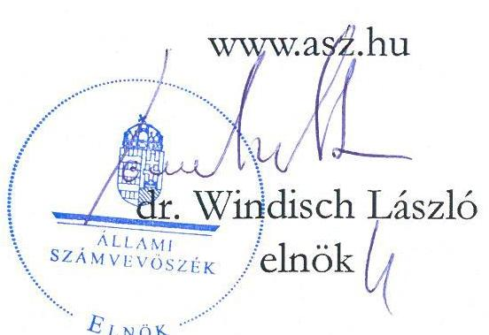
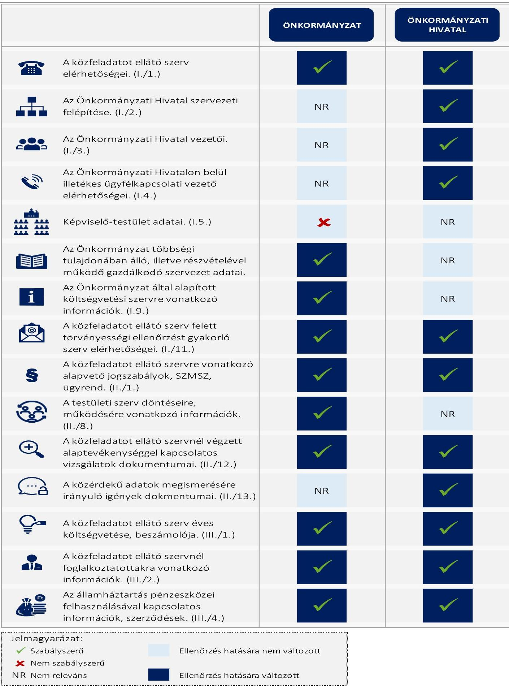

# JELENTÉS 

## Az önkormányzatok közzétételi kötelezettsége teljesítésének célzott ellenőrzése

Gönc Város Önkormányzata
Gönci Közös Önkormányzati Hivatal

2024.

---

# JELENTÉS 

## Az önkormányzatok közzétételi kötelezettsége teljesítésének célzott ellenőrzése

Gönc Város Önkormányzata
Gönci Közös Önkormányzati Hivatal

2024.

24126

---

# ELLENŐRZÉSI IGAZGATÓSÁG: 

## ÁLLAMHÁZTARTÁS HELYI SZINTJÉT ELLENŐRZŐ IGAZGATÓSÁG

## ELLENŐRZÉSI IGAZGATÓ:

DR. BAFFIA GERGELY GÁBOR igazgató

## ELLENŐRZÉSVEZETŐ:

Jelentéseink az interneten a www.asz.hu címen olvashatók.

DR. GÁL NÓRA ellenőrzésvezető

IKTATÓSZÁM: EL-3986-004/2024
TÉMASZÁM: 2718
ELLENŐRZÉS-AZONOSÍTÓ SZÁM: V1062

---

# TARTALOMJEGYZÉK 

AZ ELLENŐRZÉS ALAPADATAI ..... 5
MEGÁLLAPÍTÁSOK ÉS KÖVETKEZTETÉSEK ..... 7
JAVASLATOK ..... 10
MELLÉKLETEK ..... 11
I. sz. melléklet: Értelmező szótár ..... 11
II. sz. melléklet: Ellenőrzési kritériumok ..... 12
III. sz. melléklet: Kimutatás az Info. tv. 1. melléklete szerinti közzétételi egységek ÁSZ ellenőrzési körébe vont adatairól ..... 13
FÜGGELÉK: ÉSZREVÉTELEK ..... 14
RÖVIDÍTÉSEK JEGYZÉKE ..... 15

---

.

---

# AZ ELLENŐRZÉS ALAPADATAI 

## AZ ELLENŐRZÉS CÉLJA

Az ellenőrzés célja annak megállapítása volt, hogy Gönc Város Önkormányzata és a gazdálkodási feladatait ellátó Gönci Közös Önkormányzati Hivatal az elektronikus közzétételi kötelezettségüknek eleget tettek-e, biztosították-e az átláthatóság érvényesülését, a nem minősített adatokhoz való hozzáférést, az Önkormányzat munkájának nyomonkövethetőségét.

## AZ ELLENŐRZÖTT IDŐSZAK

Az ellenőrzött szervezetek ellenőrzés megindításáról történő kiértesítését megelőző munkanap (2024. január 25.).

## AZ ELLENŐRZÉS TÁRGYA

Az Önkormányzat ${ }^{1}$ és a gazdálkodási feladatait ellátó Önkormányzati Hivatal ${ }^{2}$ Info tv. ${ }^{3}$ szerinti elektronikus közzétételi kötelezettségének teljesítése.

A jogszabály által előírt adatok közzététele biztosításának az ellenőrzése az ÁSZ ${ }^{4}$ által az átláthatóság és az önkormányzati feladatellátás nyomonkövethetősége tekintetében az ellenőrzés szempontjából lényegesként meghatározott, az Info tv. 1. melléklete szerinti 15 közzétételi egység adatköréhez kapcsolódott (a jelentés III. sz. mellékletében részletezve).

Az ellenőrzés kiterjedt minden olyan körülményre és adatra, amely az ÁSZ jogszabályban meghatározott feladatainak teljesítéséhez, valamint a program végrehajtása folyamán felmerült újabb összefüggések feltárásához szükséges volt.

## AZ ELLENŐRZÉS JOGALAPJA

Az ellenőrzés jogszabályi alapját az ÁSZ tv. ${ }^{5}$ 1. § 2. (3) bekezdésében, valamint az Áht. ${ }^{6}$ 61. § (2) bekezdésében foglalt előírások képezték.

## AZ ELLENŐRZÉS MÓDSZERE

Az ellenőrzést a nemzetközi standardokat irányadónak tekintve az ellenőrzési program értékelési szempontjai, az ellenőrzött időszakban hatályos jogszabályok, valamint az ellenőrzés szakmai szabályok és módszertanok figyelembevételével végezte az ÁSZ.

Az ellenőrzési kérdések megválaszolásához szükséges bizonyítékok megszerzése megfigyelés, szemrevételezés útján történt.

---

Az ellenőrzési bizonyítékként felhasználható adatforrások közé tartoztak az ellenőrzött szervezetek által elektronikusan közzétett dokumentumok, adatok, valamint a MÁK ${ }^{+}$ törzsadatnyilvántartása.

Az ÁSZ az elektronikus közzétételi kötelezettség teljesítését a közzétételre szolgáló honlap közzétételi felületén ellenőrizte. A közzététel akkor volt megfelelő, azaz akkor tett eleget közzétételi kötelezettségének az ellenőrzött, ha a jelentés III. sz. melléklete szerinti közzétételi egységekhez tartozó adatokat, vagy az elérésüket biztosító hivatkozásokat a közzétételre szolgáló honlap adekvát közzétételi egységében jelenítették meg. Amennyiben a közérdekű adatok, vagy az azokra történő közvetlen hivatkozások a közzétételre szolgáló honlap „Közérdekű adatok" menürendszerén kívül, vagy ilyen menürendszer hiányában a közzétételre szolgáló honlap egyéb, az adat tartalmával összefüggő felületein kerültek elhelyezésre, akkor azt az ellenőrzés az adatok nem jogszabály szerinti közzétételeként értékelte.

Az ÁSZ akkor értékelte a jelentés II. sz. melléklet 1.1. pontja alapján megfelelőnek a jogszabály által előírt adatok közzétételét, ha a jelentés III. sz. melléklete szerinti közzétételi egységekbe tartozó adatkörben teljeskörű volt a közzététel. Az ÁSZ az ellenőrzött adat - ellenőrzött szempontjából történő - irrelevanciájára utalást az értékelés szempontjából közzétételnek minősítette.

Az ellenőrzés nem terjedt ki az adatok tartalmi megfelelőségére, a kapcsolódó belső szabályozásra, valamint arra, hogy a közzétett adatokon kívül volt-e olyan adat, amelyet közzé kellett volna tennie az ellenőrzöttnek. A közzétett adatok aktualitásának megfelelőségét az ÁSZ csak a jelentés III. sz. melléklete 13. és 14. sora szerinti közzétételi egységek közzétett adatai esetében értékelte, ahol az aktualizálás megfelelősége a MÁK törzsadatnyilvántartás, valamint a közzétett adat alapján egyértelműen megállapítható volt.

A közzétett adatok jogszabályokban meghatározott módon történő elérhetőségét akkor tekintette megfelelőnek az ÁSZ, ha a jelentés II. sz. melléklet 1.2. fókusz alkérdéshez tartozó kritériumok mindegyike teljesült.

# AZ ELLENŐRZÖTT SZERVEZET 

Gönc város Borsod-Abaúj-Zemplén vármegyében, a szlovák határ közelében, Miskolctól mintegy 65 km-re fekszik. A lakosság száma 1914 fő, a lakások száma 863 db (KSH, 2023.01.01.).

Az Önkormányzat Képviselő-testülete hét főből áll, élén főállású polgármesterrel.
A településen roma nemzetiségi önkormányzat működik.
Az Önkormányzat gazdálkodási feladatait az Önkormányzati Hivatal látja el. A jegyző 2016. július 20-tól látja el a feladatát.

Az Önkormányzat további két költségvetési szervet tart fenn, a Gönci Barackvirág Napköziotthonos Óvoda, Bölcsődét és Konyhát, valamint a Városi Könyvtárat.

Az Önkormányzatnak nincs gazdasági társasága. A település tagja a Gönci Területfejlesztési Önkormányzati Társulásnak, az Abaúj-Zempléni Szilárdhulladék Gazdálkodási Önkormányzati Társulásnak, valamint az Abaúj-Hegyközi Többcélú Kistérségi Társulásnak, mely fenntartója az Abaúj-Hegyközi Gyermekjóléti és Szociális Alapszolgáltatási Körzetnek.

---

# MEGÁLLAPÍTÁSOK ÉS KÖVETKEZTETÉSEK 

## 1. Az Önkormányzat és a gazdálkodási feladatait ellátó Önkormányzati Hivatal teljesítette-e a jogszabályban előírt elektronikus közzétételi kötelezettségét?

Összegző megállapítás Az Önkormányzat és a gazdálkodási feladatait ellátó Önkormányzati Hivatal az Info tv. előírásai ellenére nem teljesítette elektronikus közzétételi kötelezettségét.

Az Önkormányzat és a gazdálkodási feladatait ellátó Önkormányzati Hivatal Gönc város közzétételre szolgáló honlapján nem alakított ki közzétételi felületet. A "Közérdekű adatok" hivatkozást a közzétételre szolgáló honlap megnyitásakor megjelenő oldalon nem helyezték el, ami nem felel meg az IHM Rendelet ${ }^{8}$ 2. § (1) bekezdésében foglaltaknak.
Az Önkormányzat kapcsolati adatai, valamint a költségvetési szervekre, a képviselő-testületre, a testületi szerv ülésére, az önkormányzati döntésekre vonatkozó adattartalomra, a közérdekű adattal érintett szervezetre (Gönc Város Önkormányzata, Gönci Közös Önkormányzati Hivatal) utaló hivatkozások a közzétételre szolgáló honlap nyitóoldalán megtalálhatóak voltak. A közzététel mindezek ellenére nem volt megfelelő, mert a közérdekű adatok elérhetőségét nem az Info. tv. 37. § (1), valamint az IHM Rendelet 2. § (2) bekezdése által előírt közzétételi egységek szerint biztosították.
A közérdekű adatok közzétételére szolgáló honlap adattartalma nem felelt meg az IHM Rendelet 2. § (1) bekezdésében, valamint a 305/2005. (XII.25.) Korm. rendelet ${ }^{9}$ 5. § (5) bekezdésében foglalt előírásnak sem, mert a közzétételre szolgáló honlapon nem tüntették fel az egységes közadatkereső rendszerre, a központi elektronikus jegyzékre mutató hivatkozást.
Az ellenőrzött szervezetek nem tettek eleget az Info tv. 37/B. § (1) bekezdésében foglalt kötelezettségüknek, mert az adatfelelősök nem gondoskodtak az adatok közadatkereső rendszerbe történő továbbításáról, ezért az nem tartalmazott az ellenőrzött szervezetekre vonatkozóan adatot.
Az Önkormányzat és az Önkormányzati Hivatal nem tett eleget a közzétételi egységek kialakítási és adatfeltöltési, valamint közadatkereső rendszerben történő továbbítási kötelezettségének, ezzel megsértette az Info. tv. 37. § (1), az IHM Rendelet 2. § (1)-(2) és a 305/2005. (XII.25.) Korm. rendelet 5. § (5) bekezdésekben, valamint az Info tv. 37/B. § (1) bekezdésében foglalt előírásokat.
Az ellenőrzött szervezetek közzétételre szolgáló honlapja az ellenőrzés időpontjában nem volt alkalmas az Info. tv. által elvárt cél - az elektronikusan közzétett adatok egyszerű és gyors elérhetőségének - megvalósítására. A közzétételi struktúra kialakításának és az adatok feltöltésének hiányában az ellenőrzött szervezetek nem biztosították a közérdekű adatok megismerhetőségét, a működés és a gazdálkodás átláthatóságát.

---

Az ellenőrzés a fennálló hiányosságok megszüntetésére összesen öt javaslatot tett a polgármester és jegyző számára.

A Polgármester az ÁSZ tv. 29. § (2) bekezdés szerinti, a jelentéstervezet megállapításaira tett - 2024. június 11-ei - észrevételében tájékoztatta az ÁSZ-t a közzétételi kötelezettség megfelelőségének helyreállításával kapcsolatos önkormányzati intézkedésekről. Az intézkedések hatására az Önkormányzat - a június 12-ei állapot szerint - az ÁSZ által ellenőrzött 15 közzétételi egységek közül összesen 14 közzétételi egységre vonatkozóan eleget tett közzétételi kötelezettségének, ezzel az ÁSZ megállapítása az ellenőrzés során hasznosult.

---

# AZ ELLENŐRZÉS FŐBB TAPASZTALATAINAK ÖSSZEGZÉSE 

---

# JAVASLATOK 

Az ÁSZ tv. 33. § (1) bekezdésében foglaltak értelmében az ellenőrzött szervezet vezetője köteles a jelentésben foglalt megállapításokhoz kapcsolódó intézkedési tervet összeállítani és azt a jelentés kézhezvételétől számított 30 napon belül az ÁSZ részére megküldeni. Amennyiben az ellenőrzött szervezet vezetője nem küldi meg határidőben az intézkedési tervet, vagy továbbra sem elfogadható intézkedési tervet küld, az Állami Számvevőszék elnöke az ÁSZ tv. 33. § (3) bekezdése a) és b) pontjaiban foglaltakat érvényesítheti.

## GÖNC VÁROS ÖNKORMÁNYZATA POLGÁRMESTERÉNEK

1. Intézkedjen a nyilvános jelentés kézhezvételét követő 30 napon belül az Állami Számvevőszék jelentésének a Képviselő-testület elé terjesztéséről. A napirend tárgyalásáról szóló jegyzőkönyvvel együtt a jelentést tájékoztatásul küldje meg a Kormányhivatal számára is.
2. Intézkedjen a közérdekű adatok Info tv. 37. § (1) bekezdése előírása szerinti közzététele iránt. Ennek körében gondoskodjon a közzétételi listák által előírt adatokat tartalmazó felület olyan módon történő kialakításáról, hogy az IHM Rendelet 2. § (2) bekezdésének előírása alapján az IHM Rendelet 1. melléklete szerinti tagolásban tartalmazza az Info tv. 1. mellékletében foglalt általános közzétételi lista adatait tartalmazó közzétételi egységeket, vagy hivatkozzon azokra.
3. Intézkedjen, az IHM Rendelet 2. § (1) bekezdésében, valamint a 305/2005. (XII.25.) Korm. rendelet 5. § (5) bekezdésében foglalt előírás teljesítése iránt és tüntesse fel a közzétételre szolgáló honlapon az egységes közadatkereső rendszerre, a központi elektronikus jegyzékre mutató hivatkozást. Gondoskodjon továbbá az Info tv. 37/B. § (1) bekezdésében foglaltak szerint a közérdekű adatok közadatkereső rendszerbe történő továbbításáról.

## GÖNCI KÖZÖS ÖNKORMÁNYZATI HIVATAL JEGYZŐJÉNEK

1. Intézkedjen a közérdekű adatok Info tv. 37. § (1) bekezdése előírása szerinti közzététele iránt. Ennek körében gondoskodjon a közzétételi listák által előírt adatokat tartalmazó felület olyan módon történő kialakításáról, hogy az IHM Rendelet 2. § (2) bekezdésének előírása alapján az IHM Rendelet 1. melléklete szerinti tagolásban tartalmazza az Info tv. 1. mellékletében foglalt általános közzétételi lista adatait tartalmazó közzétételi egységeket, vagy hivatkozzon azokra.
2. Intézkedjen, az IHM Rendelet 2. § (1) bekezdésében, valamint a 305/2005. (XII.25.) Korm. rendelet 5. § (5) bekezdésében foglalt előírás teljesítése iránt és tüntesse fel a közzétételre szolgáló honlapon az egységes közadatkereső rendszerre, a központi elektronikus jegyzékre mutató hivatkozást. Gondoskodjon továbbá az Info tv. 37/B. § (1) bekezdésében foglaltak szerint a közérdekű adatok közadatkereső rendszerbe történő továbbításáról.

---

# MELLÉKLETEK 

## I. SZ. MELLÉKLET: ÉRTELMEZŐ SZÓTÁR

adatfelelős
általános közzétételi lista
elektronikus közzététel
jegyzék
közadatkereső rendszer
közérdekű adat
központi elektronikus jegyzék
közzétételi egység
közzétételre szolgáló honlap

Az a közfeladatot ellátó szerv, amely az elektronikus úton kötelezően közzéteendő közérdekű adatot előállította, illetve amelynek a működése során ez az adat keletkezett. (Info tv. 3. § 19. pont)
Közérdekű adatokat tartalmazó, Info tv. 1. melléklet szerinti lista. (Info tv. 37. § (1) bekezdés alapján)

Az Info.tv. alapján kötelezően közzéteendő közérdekű adatokat internetes honlapon, digitális formában, bárki számára, személyazonosítás nélkül, korlátozástól mentesen, kinyomtatható és részleteiben is adatvesztés és torzulás nélkül kimásolható módon, a betekintés, a letöltés, a nyomtatás, a kimásolás és a hálózati adatátvitel szempontjából is díjmentesen kell hozzáférhetővé tenni. A közzétett adatok megismerése személyes adatok közléséhez nem köthető (Info.tv. 33. § (1) bekezdés)
A közzétételi listák által előírt

 adatokat tartalmazó jegyzék vagy felület. (IHM Rendelet 2. § (1) bekezdés alapján)
A közérdekű adatokhoz való egységes szempontok szerinti elektronikus hozzáférést és a közérdekű adatok közötti keresés lehetőségét a közigazgatási informatika infrastrukturális megvalósíthatóságának biztosításáért felelős miniszter által működtetett egységes közadatkereső rendszer biztosítja. (Info. tv. 37/A. § (2) bekezdés)
Az állami vagy helyi önkormányzati feladatot, valamint jogszabályban meghatározott egyéb közfeladatot ellátó szerv vagy személy kezelésében lévő és tevékenységére vonatkozó vagy közfeladatának ellátásával összefüggésben keletkezett, a személyes adat fogalma alá nem eső, bármilyen módon vagy formában rögzített információ vagy ismeret, függetlenül kezelésének módjától, önálló vagy gyűjteményes jellegétől, így különösen a hatáskörre, illetékességre, szervezeti felépítésre, szakmai tevékenységre, annak eredményességére is kiterjedő értékelésére, a birtokolt adatfajtákra és a működést szabályozó jogszabályokra, valamint a gazdálkodásra, a megkötött szerződésekre vonatkozó adat. (Info tv. 3. § 5. pont)
Az elektronikusan közzétett adatok egyszerű és gyors elérhetősége érdekében az e törvény alapján közérdekű adat elektronikus közzétételére kötelezett szervek közérdekű adatot tartalmazó honlapjára, valamint az általuk fenntartott adatbázisra és nyilvántartásra vonatkozó leíró adatokat a közigazgatási informatika infrastrukturális megvalósíthatóságának biztosításáért felelős miniszter által működtetett, az erre a célra létrehozott honlapon közzétett központi elektronikus jegyzék összesítve tartalmazza. (Info. tv. 37/A. § (1) bekezdés)
A közzétételi listák szerinti adatok közzétételének szerkezetét és az összefüggő tárgyú közzétett adatokat egybefoglaló tartalmi egységek. (IHM Rendelet 1. § (2) bekezdés)
Az adatközlő a közzétételre szolgáló honlapot úgy alakítja ki, hogy az adatok közzétételére alkalmas legyen, gondoskodik a folyamatos üzemeltetésről, az esetleges üzemzavar elhárításáról és az adatok frissítéséről. A közzétételre szolgáló honlapon közérthető formában tájékoztatást kell adni a közérdekű adatok egyedi igénylésének szabályairól. A tájékoztatásnak tartalmaznia kell az igénybe vehető jogorvoslati lehetőségek ismertetését is. (Info. tv. 34. § (2)-(3) bekezdések)

---

# II. SZ. MELLÉKLET: ELLENŐRZÉSI KRITÉRIUMOK 

## FOKUSZKÉRDÉS

1. Az Önkormányzat és a gazdálkodási feladatait ellátó Önkormányzati Hivatal teljesítette-e a jogszabályban előírt elektronikus közzétételi kötelezettségét?
1.1. Az Önkormányzat és a gazdálkodási feladatait ellátó Önkormányzati Hivatal az elektronikus közzétételi kötelezettségének teljesítése során biztosította-e a jogszabály által előírt adatok közzétételét?
1.2. Az Önkormányzat és a gazdálkodási feladatait ellátó Önkormányzati Hivatal az elektronikus közzétételi kötelezettségének teljesítése során biztosította-e a közzétett adatok jogszabályokban meghatározott módon történő elérhetőségét?

## ELLENŐRZÉSI KRITÉRIUMOK

Info tv. 33. § (3), 37. § (1) és (4a) bekezdés, 1. melléklet I/1., 2., 3., 4., 5., 7., 9., 11. pont, II/1., 8., 12., 13. pont, III/1., 2., 4. pont; Áht. 87. § b) pont; Áhsz 10. 6. § (1) bek. a) és f) pontjai;

IHM Rendelet 2. § (2) bekezdés.
Info tv. 33. § (1) bekezdés, 37/B. § (1) bekezdés; IHM Rendelet 2. § (1) bekezdés;
305/2005. (XII.25.) Korm.rendelet 5. § (5) bekezdés.

---

# III. SZ. MELLÉKLET: KIMUTATÁS AZ INFO. TV. 1. MELLÉKLETE SZERINTI KÖZZÉTÉTELI EGYSÉGEK ÁSZ ELLENŐRZÉSI KÖRÉBE VONT ADATAIRÓL 

## Ssz.

## ADATKÖR ÉS AZ INFO. TV. 1. MELLÉKLET SZERINTI SORSZÁM

## I. Szervezeti, személyi adatok

1. A közfeladatot ellátó szerv hivatalos neve, székhelye, postai címe, telefonszáma, elektronikus levélcíme, honlapja. (I./1.)
2. Az Önkormányzati Hivatal szervezeti felépítése szervezeti egységek megjelölésével, az egyes szervezeti egységek feladatai. (I./2.)
3. Az Önkormányzati Hivatal vezetőinek és az egyes szervezeti egységek vezetőinek neve, beosztása, elérhetősége (telefonszáma, elektronikus levélcíme). (I./3.)
4. Az Önkormányzati Hivatalon belül illetékes ügyfélkapcsolati vezető neve, elérhetősége (telefonszáma, elektronikus levélcíme) és az ügyfélfogadási rend. (I./4.)
5. A képviselő-testület létszáma, tagjainak neve, beosztása, elérhetősége. (I./5.)
6. Az Önkormányzat többségi tulajdonában álló, illetve részvételével működő gazdálkodó szervezet neve, székhelye,
7. elérhetősége (postai címe, telefonszáma, elektronikus levélcíme), tevékenységi köre, képviselőjének neve, a közfeladatot ellátó szerv részesedésének mértéke. (I./7.)
8. Az Önkormányzat által alapított költségvetési szerv neve, székhelye, a költségvetési szerv alapító okirata, vezetője, működési engedélye. (I./9.)
9. A közfeladatot ellátó szerv felett törvényességi ellenőrzést gyakorló szervnek a hivatalos neve, székhelye, postai címe, telefonszáma, elektronikus levélcíme, honlapja, ügyfélszolgálatának elérhetőségei. (I./11.)

## II. Tevékenységre, működésre vonatkozó adatok

9. A közfeladatot ellátó szerv feladatát, hatáskörét és alaptevékenységét meghatározó, a szervre vonatkozó alapvető jogszabályok, valamint a szervezeti és működési szabályzat vagy ügyrend, az adatvédelmi és adatbiztonsági szabályzat hatályos és teljes szövege. (II./1.)
10. A testületi szerv döntései előkészítésének rendje, az állampolgári közreműködés (véleményezés) módja, eljárási szabályai, a testületi szerv üléseinek helye, ideje, továbbá nyilvánossága, döntései, ülésének jegyzőkönyvei, illetve összefoglalói; a testületi szerv szavazásának adatai, ha ezt jogszabály nem korlátozza. (II./8.)
11. A közfeladatot ellátó szervnél végzett alaptevékenységgel kapcsolatos vizsgálatok, ellenőrzések nyilvános megállapításai. (II./12.)
12. A közérdekű adatok megismerésére irányuló igények intézésének rendje, az illetékes szervezeti egység neve, elérhetősége, az információs jogokkal foglalkozó személy neve. (II./13.)

## III. Gazdálkodási adatok

13. A közfeladatot ellátó szerv éves költségvetése, éves költségvetés beszámolója. (III./1.)
14. A közfeladatot ellátó szervnél foglalkoztatottak létszámára és személyi juttatásaira vonatkozó összesített adatok, illetve összesítve a vezetők és vezető tisztségviselők illetménye, munkabére és rendszeres juttatásai, valamint költségtérítése. (III./2.)
Az államháztartás pénzeszközei felhasználásával, az államháztartáshoz tartozó vagyonnal történő gazdálkodással
15. összefüggő, ötmillió forintot elérő szerződések megnevezése (típusa), tárgya, szerződést kötő felek neve, a szerződés értéke, határozott időre kötött szerződés esetében annak időtartama. (III./4.)

---

# FÜGGELÉK: ÉSZREVÉTELEK 

A jelentéstervezetet a Számvevőszék 15 napos észrevételezésre megküldte az ellenőrzött szervezet vezetőjének az ÁSZ tv. 29. § (1) bekezdése előírásának megfelelően.

Az ellenőrzött szervezetek a jelentéstervezet megállapításaira érdemi észrevételt nem tettek.

* 29. § (1) Az Állami Számvevőszék az ellenőrzési megállapításait megküldi az ellenőrzött szervezet vezetőjének vagy az általa megbízott személynek, és annak, akinek személyes felelősségét állapította meg.
(2) Az ellenőrzött szervezet vezetője és a felelősként megjelölt személy az ellenőrzés megállapításaira tizenöt napon belül írásban észrevételt tehet.
(3) Az Állami Számvevőszék az észrevételre a beérkezésétől számított harminc napon belül írásban válaszol. A figyelembe nem vett észrevételeket köteles a jelentésben feltüntetni, és megindokolni, hogy azokat miért nem fogadta el.

---

# RÖVIDÍTÉSEK JEGYZÉKE 

${ }^{1}$ Önkormányzat
${ }^{2}$ Önkormányzati Hivatal
${ }^{3}$ Info tv.
${ }^{4}$ ÁSZ
${ }^{5}$ ÁSZ tv.
${ }^{6}$ Áht.
${ }^{7}$ MÁK
${ }^{8}$ IHM Rendelet
${ }^{9}$ 305/2005. (XII.25.) Korm.rendelet
${ }^{10}$ Áhsz.

Gönc Város Önkormányzata
Gönci Közös Önkormányzati Hivatal
2011. évi CXII. törvény az információs önrendelkezési jogról és az információszabadságról
Állami Számvevőszék
2011. évi LXVI. törvény az Állami Számvevőszékről
2011. évi CXCV. törvény az államháztartásról

Magyar Államkincstár
18/2005. (XII. 27.) IHM Rendelet a közzétételi listákon szereplő adatok közzétételéhez szükséges közzétételi mintákról
305/2005. (XII.25.) Korm.rendelet a közérdekű adatok elektronikus közzétételére, az egységes közadatkereső rendszerre, valamint a központi jegyzék adattartalmára, az adatintegrációra vonatkozó részletes szabályokról
4/2013. (I. 11.) Korm. rendelet az államháztartás számviteléről

---

1052 Budapest, Apáczai Csere János u. 10. | 1364 Budapest 4., Pf. 54
www.asz.hu | szamvevoszek@asz.hu
telefon: +36 1 4849100

