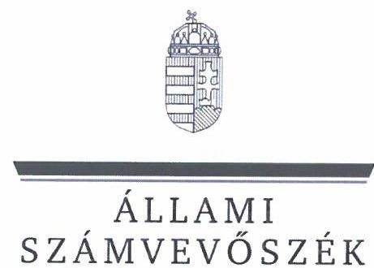
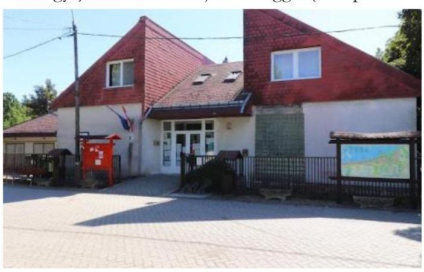
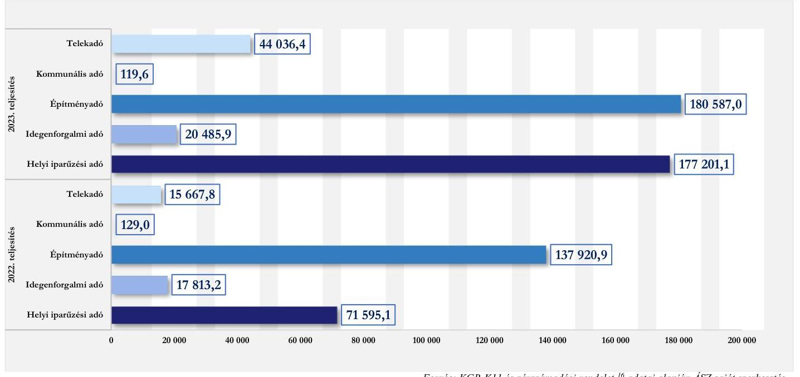
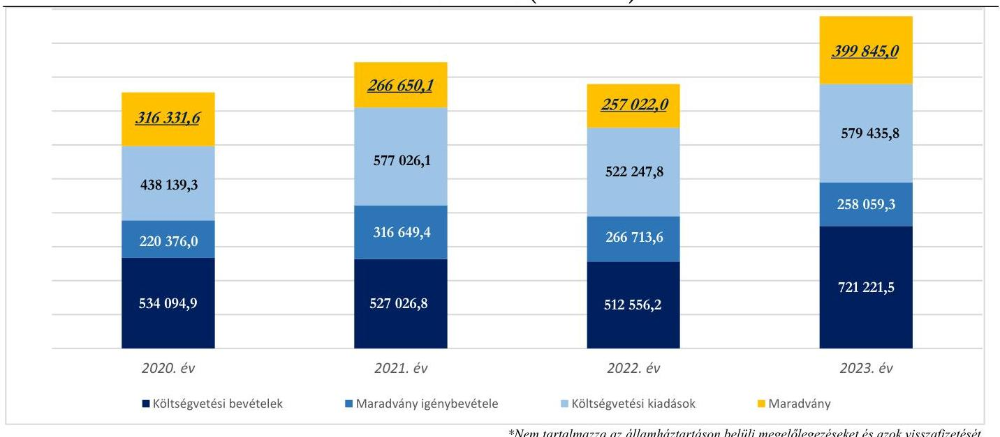
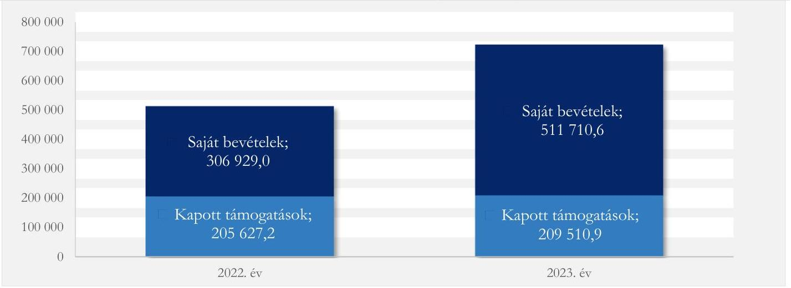

# JELENTÉS 

## Az önkormányzatok helyi adóztatási tevékenységének ellenőrzése - Ingatlanadóztatás

Balatonvilágos Község Önkormányzata

2024.

---

ÁLLAMI
SZÁMVEVŐSZÉK

# JELENTÉS 

## Az önkormányzatok helyi adóztatási tevékenységének ellenőrzése - Ingatlanadóztatás

Balatonvilágos Község Önkormányzata

2024.

---

# ELLENŐRZÉSI IGAZGATÓSÁG: 

## ÁLLAMHÁZTARTÁS HELYI SZINTJÉT ELLENŐRZŐ IGAZGATÓSÁG

## ELLENŐRZÉSI IGAZGATÓ:

DR. BAFFIA GERGELY GÁBOR ellenőrzési igazgató

## ELLENŐRZÉSVEZETŐ:

Jelentéseink az interneten a www.asz.hu címen olvashatók.

KANYÓ LŐRÁNT ISTVÁN ellenőrzésvezető

IKTATÓSZÁM: EL-4040-005/2024.
TÉMASZÁM: 2740
ELLENŐRZÉS-AZONOSÍTÓ SZÁM: V-1084

---

# TARTALOMJEGYZÉK 

AZ ELLENŐRZÉS ALAPADATAI ..... 5
AZ ELLENŐRZÉS TERÜLETE ÉS AZ ELLENŐRZÖTT SZERVEZET ..... 7
ÖSSZEFOGLALÁS ..... 9
AZ ELLENŐRZÉS FÓKUSZKÉRDÉSEI ..... 11
MEGÁLLAPÍTÁSOK ..... 12
JAVASLATOK ..... 25
MELLÉKLETEK ..... 26
I. sz. melléklet: Értelmező szótár ..... 26
II. sz. melléklet: Az ellenőrzött szervezetek jegyzéke ..... 28
III. sz. melléklet: Ellenőrzési kritériumok ..... 29
IV. sz. melléklet: A helyi ingatlanadótárgyak és adóalanyok a 2023. és a 2024. években ..... 32
FÜGGELÉK: ÉSZREVÉTELEK ..... 33
RÖVIDÍTÉSEK JEGYZÉKE ..... 34

---

.

---

# AZ ELLENŐRZÉS ALAPADATAI 

## AZ ELLENŐRZÉS CÉLJA

Az ellenőrzés célja az volt, hogy értékelje Balatonvilágos község helyi ingatlanadóztatásának és adóhatósága feladatellátásának szabályszerűségét, célszerűségét és eredményességét. További cél volt, hogy az ellenőrzés megállapításai és következtetései segítsék az önkormányzati képviselő-testületeket a jogszabályokkal és a helyi sajátosságokkal összhangban álló helyi adópolitika kialakításában és az azt végrehajtó adóigazgatási szervezet megszervezésében. Az ellenőrzés célja volt annak megállapítása is, hogy az Önkormányzat ${ }^{1}$ által bevezetett, ingatlanokat terhelő helyi adókra vonatkozó rendeleti szabályok összhangban vannak-e a helyi adópolitikai célokkal, tartalmuk tükrözi-e a település helyi sajátosságait és az adóhatósági feladatellátás biztosítja-e az önkormányzati bevételek feltárását és beszedését.

Ennek keretében az ÁSZ ${ }^{2}$ értékelte, hogy az Önkormányzat által bevezetett, ingatlanokat terhelő helyi adókról szóló adórendelet ${ }^{3}$, valamint az adóhatóság ${ }^{4}$ döntései, adóztatási gyakorlata a vonatkozó jogszabályokkal összhangban állnak-e.

## AZ ELLENŐRZÉS TÍPUSA

Kombinált ellenőrzés.

## AZ ELLENŐRZŐTT IDŐSZAK

Az 1. fókuszkérdésnél a 2023. év, valamint a 2024. évnek az ellenőrzés megkezdését megelőző napjáig (2024. április 2.) tartó időszaka.

A 2. és 3. fókuszkérdésnél a 2023. év, valamint a 2024. évnek az ellenőrzés megkezdését megelőző napjáig (2024. április 2.) tartó időszaka, a 2020-2022. évek adatainak bázisadatként való felhasználásával.

## AZ ELLENŐRZÉS TÁRGYA

Az Önkormányzat képviselő-testületének ingatlanokat terhelő helyi adókkal, azaz az építményadóval, a telekadóval és a magánszemély kommunális adójával kapcsolatos rendeletalkotási tevékenységének és az adóhatóság tevékenységének az ellátása.

Az ellenőrzés kiterjed minden olyan körülményre és adatra, amely az ÁSZ jogszabályban meghatározott feladatainak teljesítéséhez, valamint a program végrehajtása folyamán felmerült újabb összefüggések feltárásához szükséges.

## AZ ELLENŐRZÉS JOGALAPJA

Az ellenőrzés jogszabályi alapját az ÁSZ tv. ${ }^{5}$ 5. § (8) bekezdésének előírásai képezik.

---

# AZ ELLENŐRZÉS MÓDSZERE 

Az ellenőrzést az ellenőrzési program szempontjai, az ellenőrzött időszakban hatályos jogszabályok, az ellenőrzés általános szakmai szabályai és az ellenőrzésre irányadó ÁSZ módszertanok alapján végeztük.

Az ellenőrzési kérdések megválaszolásához szükséges bizonyítékok megszerzése az ellenőrzött szervezetek által rendelkezésre bocsátott dokumentumokra, adatokra és az ASP ${ }^{\circ}$ Adó és az Iratkezelő szakrendszerek, illetve a KGR-K11 ${ }^{7}$ számviteli adatgyűjtő rendszer adataira alapozva megfigyelés, szemle (szemrevételezés), kérdésfeltevés (információkérés), mintavételezés, valamint elemző eljárás útján történt. Emellett az ellenőrzési bizonyítékként felhasználható adatforrások közé tartozott minden egyéb - az ellenőrzés folyamán feltárt, az ellenőrzés szempontjából információt tartalmazó - releváns dokumentum (ideértve különösen a helyszínen felvett jegyzőkönyvet) is.

Az ellenőrzés lefolytatásához az ellenőrzött szervezet a tanúsítványok kitöltésével, valamint az ÁSZ által kért dokumentumok, adatok, információk megküldésével és az ellenőrzés során szolgáltatott adatokat. Az adómegállapítás, fizetési kedvezmények engedélyezése szabályszerűségét mintavételi eljárással ellenőrizte az ÁSZ. Az ÁSZ 12 mintatételben, 30 adóhatósági határozat szabályszerűségét ellenőrizte. A mintatételek kiválasztása véletlenszerűen történt meg, az adóhatóság nyilvántartásában lévő adótárgyak és ügyek közül, öt - adómegállapításra vonatkozó - mintatétel kivételével, melynek során a kiválasztás címadatok alapján történt meg annak érdekében, hogy feltárható legyen, volt-e olyan adótárgy, amelyet nem adóztatott az adóhatóság. Az ellenőrzött mintatételekre vonatkozó megállapítások nem vetíthetők ki a teljes sokaságra, a megállapításokat az ÁSZ az adott ellenőrzött mintatételek vonatkozásában tette.

Az ÁSZ a helyi adópolitikai elképzelések és a települési sajátosságok feltárásával értékelte, hogy az adórendelet e szempontoknak mennyiben felelt meg. Az ÁSZ a helyi adópolitikai célokkal akkor tekintette összhangban állónak az adórendeletet, ha az hatását tekintve támogatta az adópolitikai célok teljesülését.

Az ÁSZ az adóhatósági feladatellátás szabályszerűségéből, a meglévő kapacitásokból, valamint az ezer Ft adóbevételre jutó adóhatósági költségek alakulásából következtetett arra, hogy az adóhatóság rendelkezett-e azzal a potenciállal, amellyel eredményesen tudta a helyi adópolitikát végrehajtani.

Az ÁSZ - az adórendelet szabályainak érvényre juttatása körében - az eredményesség megítélésekor a III. számú melléklet 2. pontjában foglalt szempontokat tekintette mérvadónak.

---

# AZ ELLENŐRZÉS TERÜLETE ÉS AZ ELLENŐRZÖTT SZERVEZET 

Balatonvilágos község a Balaton déli partjának egyik települése, Somogy vármegyében, a Siófoki járásban található, három vármegye találkozásánál, Siófok várossal (Somogy vármegye), Enying várossal (Fejér vármegye) és Balatonfőkajár községgel (Veszprém vármegye) határos. Állandó lakossága a BM által közzétett

adatok alapján 2022. év elején 1473 fő, 2023. év elején 1468 fő, 2024. év elején 1467 fő volt. Balatonvilágos - amely magában foglalja Balatonaligát is üdülőközség, legfontosabb és arányaiban a legnagyobb bevételi forrásai az idegenforgalomhoz kapcsolódnak. A település kiemelendő adottsága még a magas aranykorona-értékkel rendelkező termőföld. Ennek megfelelően a TEIR ${ }^{8}$ 2022. december 31-ei adatai alapján a letelepedett 369 gazdasági szervezetből 113 a szálláshely, vendéglátás, ingatlanügyletek, 43 pedig a mezőgazdaság ágazatba tartozott.

Az Alaptörvény ${ }^{9}$ értelmében a helyi önkormányzat a helyi közügyek intézése körében törvény keretei között dönt a helyi adók fajtájáról és mértékéről. Az Mötv. ${ }^{10}$ rögzíti, hogy a helyi adóval kapcsolatos feladatok ellátása a helyi önkormányzatok feladata.

Az Önkormányzat a Htv. ${ }^{11}$ 1. $\$ (1) bekezdésében foglalt felhatalmazással élve illetékességi területén az adórendelettel az építményadót, a telekadót és a magánszemély kommunális adóját vezette be. A hatályos szabályozást eredményező utolsó jogszabálymódosítás 2023. január 1-jén lépett hatályba.

Az építményadó mértékét illetően az Önkormányzat övezeteket alakított ki. 2022-ig az adó mértéke az egyik övezetben $900 \mathrm{Ft} / \mathrm{m}^{2}$, a másik övezetben $720 \mathrm{Ft} / \mathrm{m}^{2}$ volt. 2023. január 1-jétől az Önkormányzat az ingatlanok vízparthoz képesti fekvését jobban figyelembe vevő, három adómérték-övezetet alakított ki. A közvetlenül a vízpartokon fekvő, a III. övezetbe tartozó ingatlanok adóterhe $1600 \mathrm{Ft} / \mathrm{m}^{2}$, a vízparttól távolodva pedig $1100 \mathrm{Ft} / \mathrm{m}^{2}$ (I. övezet) és $900 \mathrm{Ft} / \mathrm{m}^{2}$ (II. övezet) az építményadó mértéke. Ezen adómértékek az adómaximum összeghatár alatt maradtak (a 2023. évben az adómaximum összege $2190,9 \mathrm{Ft} / \mathrm{m}^{2}$ ). A 2001ben bevezetett telekadó esetében az adó mértéke 2023-tól a korábbi $50 \mathrm{Ft} / \mathrm{m}^{2}$ összegről vízparton $200 \mathrm{Ft} / \mathrm{m}^{2}$, egyéb területen $100 \mathrm{Ft} / \mathrm{m}^{2}$ összegre módosult az adórendelet változásával. A magánszemély kommunális adójának mértéke 2023. január 1-jétől nem változott, $6000 \mathrm{Ft} /$ adótárgy volt, azonban ebben az adónemben a fizetési kötelezettség a korábbi rendeleti szabályozáshoz képest már nem csak a lakásbérleti jog jogosultját terhelte.

A helyi adó megállapításával, nyilvántartásával, beszedésével összefüggő adóhatósági feladatokat - a Hatásköri tv. ${ }^{12}$ és az Air. ${ }^{13}$ rendelkezései alapján - elsőfokú hatósági jogkörben Siófok város jegyzője ${ }^{14}$ látta el a Hivatal ${ }^{15}$ vezetőjeként. A balatonvilágosi adóhatósági feladatellátás a Kirendeltségen történt, két fő adóigazgatási ügyintéző közreműködésével.

Az adóhatóság által beszedett, ingatlanok adóztatásából származó helyi adóbevételek fontos szerepet játszottak a települési feladatok finanszírozásában. A 2023. évben 224 743,0 ezer Ft bevétel származott a három ingatlanadóból, ami a konszolidált költségvetési bevételek 31,2\%-át, a települési helyi

---

adóbevételek 53,2\%-át tette ki. A legjelentősebb ingatlant terhelő adó az építményadó, amelyből 180 587,0 ezer Ft bevétel származott a 2023. évben, 2376 adóalanytól, 3147 adótárgy után.

Az Önkormányzat helyi adóbevételeinek 2022. és 2023. évi teljesítésére vonatkozó adatait az 1. ábra mutatja be:

# 1. ábra 

AZ ÖNKORMÁNYZAT HELYI ADÓBEVÉTELEINEK MEGOSZLÁSA A 2022-2023. ÉVEKBEN (EZER FT)

Forrás: KGR-K11 és zárszámadási rendelet, ${ }^{28}$ adatai alapján ÁSZ saját szerkestés
Az Önkormányzat által működtetett építményadó, telekadó és magánszemély kommunális adója 2023. és 2024. évre vonatkozó jellemző naturális adatait a $I V$. számú melléklet mutatja be.

---

# ÖSSZEFOGLALÁS 

Az ÁSZ tv. értelmében az ÁSZ feladatkörébe tartozik az önkormányzatok adóztatási tevékenységének ellenőrzése. A helyi adók az önkormányzatok saját, el nem vonható bevételét képezik, így az önkormányzatok gazdasági önállósága szempontjából különös fontossággal bír, hogy a helyi adórendeleti szabályok összhangban álljanak a magasabb szintű jogszabályokkal, továbbá az önkormányzati adóhatósági tevékenység jogszerú, eredményes és hatékony legyen. Erre figyelemmel volt tárgya az ÁSZ ellenőrzésének az Önkormányzat adórendelet-alkotási tevékenysége és az adóhatósági feladatellátás is.

Az adórendelet több ponton nem volt összhangban magasabb szintű jogszabályokkal, ugyanakkor alkalmas volt az Önkormányzat adópolitikai céljai elérésére.

Az adóigazgatási feladatellátás a jogszabályi és szakmai követelményeknek összességében megfelelt, az adóztatási kiadások nem voltak aránytalanul magasak az adóbevételekhez képest. Az adóhatóság adóbehajtási tevékenysége ugyanakkor nem volt szabályszerű és nem volt eredményes, továbbá az adómegállapításról szóló határozatok indokolása nem volt megfelelő.

## Adórendelet, adórendelet-alkotás

Az Önkormányzat adórendeletének két rendelkezése jogszabálysértő volt, mert magasabb szintű jogszabályba ütközve lehetővé tette azt, hogy vállalkozó adóalany is igénybe vehessen adóelőnyt ${ }^{17}$. Emellett az adórendelet egy rendelkezése nem felelt meg annak a jogszabályi követelménynek, miszerint egyértelműen értelmezhetőnek kell lennie a kötelezettség tartalmának.

Az ingatlanokat terhelő helyi adókra vonatkozó rendeleti szabályozás megalkotása során az Önkormányzat összességében figyelembe vette azt, hogy törvényi rendelkezés alapján a rendeleti szabályoknak tükröznie kell a helyi sajátosságokat, az önkormányzat gazdálkodási követelményét, továbbá az adóalanyok széles körét érintően az adóalanyok teherviselő képességét. Az építményadó és a telekadó mértékének 2023-tól bekövetkező emelése miatt az Önkormányzat meglévő szabad pénzmaradványa jelentősen nőtt a 2022. évihez képest.

Az Önkormányzat adórendeleti szabályai összhangban voltak az adópolitikai célokkal (az adó biztos bevételi forrás legyen, méltányos és igazságos legyen az adótehereloszlás, továbbá alacsony maradjon az adószint az egész évben életvitelszerűen a településen élők számára).

## Adóhatóság adóigazgatási feladatellátásának jogszerüsége, eredményessége

Az adómegállapító határozatokban foglalt adóösszeg és a fizetésre kötelezettek személye megfelelt a jogszabályoknak. Egyik adóhatározat sem felelt meg az adóigazgatási rendtartásról szóló törvényben foglaltaknak, mert a határozat indokolása nem tartalmazta egyértelműen az adó kiszámítását, nem volt világos a tényállás és a jogalapot jelentő jogszabályi rendelkezések egymáshoz rendelése, ami nehezítette a döntés értelmezését.

A határozatok kiadmányozása, kézbesítése jogszerú volt, de a kézbesítés módja nem volt célszerú. Az adóhatóság több esetben élhetett volna a határozatok elektronikus úton való kézbesítésének lehetőségével, ami mind az adózók, mind az adóhatóság számára egyszerűbb eljárással és alacsonyabb költséggel járt volna.

Az adóhatóság a 2023. évben és a 2024. évben fizetési felhívást nem bocsátott ki, végrehajtási cselekményt nem foganatosított, miközben az adóhátralék összege 2022. december 31-ről

---

2023. december 31-re 38,6\%-kal, 5361,6 ezer Ft-tal nőtt, s az adóhatóság 2024-ben 256,5 ezer Ft adót elévülés miatt törölt. 2024-ben három hónap alatt a hátralék összege 51,5\%-kal emelkedett. Az adóhatóság adóbeszedési tevékenysége - beszedési cselekmény híján - eredménytelen volt, a beszedési tevékenység elmaradása sértette az adóvégrehajtásra vonatkozó jogszabályt.

Az adórendelet adópolitikai célokkal való összhangia, az adórendelet hatása
A helyi adópolitikai célok elérésének megfelelő eszközéül szolgáltak az Önkormányzat ingatlanokat terhelő helyi adókra vonatkozó adórendeleti szabályai (pl.: jelentős kedvezmény a tartósan a településen lakók számára, az ingatlan vízparti elérhetőségétől függő differenciált mértékrendszer).

Az Önkormányzat országos és regionális összevetésben is kiemelkedően támaszkodott az ingatlanadó-bevételekre. Míg a községek, nagyközségek esetén országosan ezen bevételek (intézmények nélküli) költségvetési bevételeken belüli átlagos aránya $2,2 \%$, addig az Önkormányzat esetében ez 32,8\% volt 2023-ban. A költségvetési bevételeken belül a saját bevételek aránya is folyamatosan emelkedett a 20202023. időszakban, különösen jelentős mértékben 2022-ről 2023. évre 11,1 százalékponttal, 71,0\%-ra. A saját bevétel ezen arányának növekedéséből 3,2 százalékpontnyi rész tudható be az ingatlanok utáni adóbevétel növekedésének. A 2023. évtől bekövetkező adóváltozás az Önkormányzat gazdálkodási mozgásterét növelte.

Ezzel együtt az adószint-emelkedéssel járó, 2023. január 1-jétől hatályos változtatások az adóalanyok többségének adóteherbíró-képességével összhangban voltak.

# Az adóhatósági kiadások 

A Hivatal a 2023. évben 5645 072,4 ezer Ft helyi adóbevételt szedett be három településről (Siófok, Balatonvilágos, Siójut). 1000 Ft helyi adóbevételre 28,1 Ft adóztatási kiadás esett. Amennyiben csak a Kirendeltségen dolgozó két munkatárs után felmerült bérjellegủ kiadások arányát tekintjük az Önkormányzatot megillető helyi adóbevételekhez ( 422430,0 ezer Ft) képest, akkor 1000 Ft helyi adóbevételre $40,5 \mathbf{F t}$ bérjellegú kiadás jutott. Az ÁSZ által ellenőrzött nyolc (nagy)község ${ }^{1}$ átlaga 33,4 Ft, az adóztatási kiadás tapasztalati referencia-érték maximuma kivetéses adóztatás esetén: 50 Ft volt.

Az adóztatási kiadások nem voltak túlzottak a bevételhez mérten.

[^0]
[^0]:    ${ }^{1}$ Az ÁSZ által jelen ellenőrzés alapjául szolgáló ellenőrzési program alapján ellenőrzött (nagy)községek: Árpádhalom, Balatonberény, Balatonvilágos, Kompolt, Leányfalu, Szentistván, Szigetmonostor, Tiszainoka.

---

# AZ ELLENŐRZÉS FÓKUSZKÉRDÉSEI 

1.- Az önkormányzat ingatlanokat terhelő helyi adókra vonatkozó rendeleti szabályozása megfelel-e a magasabb szintü jogszabályoknak?
2.- Az önkormányzati adóhatóság megfelelően és eredményesen látta-e el az ingatlanok adóztatásával kapcsolatos adóhatósági tevékenységeit?
3.- A településen megvalósuló helyi adóztatás támogatta-e a helyi adópolitikai célok teljesülését?

---

# MEGÁLLAPÍTÁSOK 

## 1. Az önkormányzat ingatlanokat terhelő helyi adókra vonatkozó rendeleti szabályozása megfelelte a magasabb szintü jogszabályoknak?

Összegző megállapítás Az adórendelet több ponton nem felelt meg a magasabb szintü jogszabályoknak.
1.1 számú megállapítás

Az ingatlanokat terhelő helyi adókra vonatkozó rendeleti szabályozás két ponton ütközött a Htv. előírásával. Az adórendelet szövegezése több ponton sértette a normavilágosság, valamint az egyértelműség Jat. ${ }^{18}$-ban megfogalmazott követelményét.

A Htv. 7. § e) pontjában előírtak ellenére - mely az uniós jogból fakadó állami támogatási elvekre és normákra figyelemmel rögzíti, hogy az önkormányzat az építményadóban, telekadóban a vállalkozó számára adómentességet, adókedvezményt nem biztosíthat - az adórendelet:
a) 7. S-a nem zárta ki a kedvezményezetti körből azokat a vállalkozó adóalanyokat, akik/amelyek valamely magánszemély tulajdonában álló telken rendelkeztek számukra adóalanyiságot generáló ingatlan-nyilvántartásba bejegyzett vagyoni értékủ joggal;
b) 8. S-a a vállalkozó adóalanyoknak is lehetővé tette az 50\%-os adókedvezményt azon telek adójából, ahol a csatornahálózat műszakilag nem állt rendelkezésre, vagy a rákötés lehetősége műszakilag nem volt biztosított.
Az adórendelet 4. §-a a magánszemély adóalanyok számára állapított meg 95\%-os építményadókedvezményt „az igazolt, legalább egy éve folyamatosan fennálló életvitelszerủ lakóingatlan-használat alapján [...] a második adóév január 1. napjától". Az említett adókedvezmény az adótárgy hasznos alapterületének az együtt élő családok létszáma alapján meghatározott részére volt igénybe vehető (például: a kedvezmény alá eső adóalap(rész) két fő együtt élő családtag esetében személyenként legfeljebb $50 \mathrm{~m}^{2}$, de magasabb az adókedvezmény alá eső terület, ha az adóalany a lakóingatlant egyedül vagy 65 év feletti nyugdíjasként, vagy kizárólag 65 év feletti, nyugdíjas házastársával, élettárásával használja).
Az adórendelet e §-a két okból is sértette - a Jat. 2. § (1) bekezdéséből következő - normavilágosság, egyértelműség követelményét
a) A jogszabályhely jelen megfogalmazásából nem derül ki, hogy mely időponttól illeti meg az adóalanyt az adókedvezmény, ugyanis explicite a „második" adóévtől ad erre lehetőséget, ugyanakkor az adókedvezmény igénybevételének első adóéve nem feltétlenül az adóalany második (hanem akár

---

többedik) adóéve a településen. Emellett a normavilágosság elvét sérti az is, hogy nem egyértelmű ezen kedvezmény alkalmazásban az sem, hogy kit, mely személyeket kell az együttélő család tagjának tekinteni.
b) Az sem egyértelmű, hogy az adótárgy vonatkozásában fennálló $95 \%$-os adókedvezmény csak a rendeletben rögzített alapterület-nagyságra jutó adórész összegéből jár, vagy az egész adótárgy utáni adóból, de csak akkor, ha az adótárgy alapterülete nem haladja meg az ott lakók száma alapján figyelembevehető adóalap-nagyságot.
1.2 számú megállapítás

Az adórendelet tükrözte a települési sajátosságokat és az adóalanyok széles körét tekintve igazodott az adóalanyok teherviselő képességéhez. Az építményadó és a telekadó mértékének 2023-tól bekövetkező emelése miatt az Önkormányzat meglévő szabad pénzmaradványa jelentősen nőtt a 2022. évihez képest.

A Htv 7. § g) pontjában rögzített adómegállapítási korlátokból az következik, hogy a rendelet hatályossága idején is érvényre kell jutnia az e pontban szabályozott rendeletalkotási elveknek, azaz annak, hogy települési önkormányzat az adóalap fajtáját, az adó mértékét, a rendeleti adómentességet és adókedvezményt úgy állapíthatja meg, hogy azok összességükben egyaránt megfeleljenek
a) a helyi sajátosságoknak,
b) az önkormányzat gazdálkodási követelményeinek és
c) az adóalanyok széles körét érintően az adóalanyok teherviselő képességének.

Ezért a jogalkotó önkormányzatnak időről-időre, legalább az adórendelet módosítása során újra és újra vizsgálnia kell a garanciális elveket, mert e szempontok képezik alapját a méltányos adóztatásnak.

# A belyi sajátosságok figyelembevétele 

A település sajátosságaira figyelemmel az ingatlanokat terhelő adók potenciális adótárgyai és így az önkormányzat bevételi forrásai nem elsősorban az ipari-kereskedelmi ingatlanok, hanem a lakások, üdülők, üdülőépületek, szállásépületek voltak. Ezen ingatlanok forgalmi értéke (vagyoni értéke) nagyban függött a vízparttól való távolságtól.
Az adórendelet 3. §-a szerint magasabb építményadó-mérték vonatkozott a Balaton partján található, lokációjukra tekintettel értékesebb ingatlanokra, mint a Balatontól távolabb fekvő és ezáltal az előzőekben említett ingatlan-csoporthoz képest kevésbé értékes ingatlanokra. A település ingatlanadóztatás szempontjából meghatározó sajátos körülményeit a hatályos adórendelet legutóbbi, 2023. január 1-jétől hatályos módosítása előkészítésekor - a Htv.-ben foglaltaknak megfelelően - az Önkormányzat figyelembe vette és mérlegelte.

## Az önkormányzat gazdálkodási követelményeinek szempontja

Az Önkormányzat tájékoztatása szerint a településen „lakók" száma a nyári időszakban 5-6000 fő üdülővel egészül ki, akik a nyári időszakban fokozottan igénybe veszik a település infrastruktúráját. Az elsősorban idényjellegű, de mégis huzamos helyben tartózkodásuk miatt szükséges az úthálózat és a köztisztasági feladatok kiterjesztése, a szemétszállítási szolgáltatás téli időszakhoz képest sokkal nagyobb volumenű megszervezése, az orvosi ellátás területi és személyi hatókörének - legalábbis a nyári időszakban megvalósuló - bővítése. Mindezek fedezete az üdülőingatlan-tulajdonosok által fizetendő építményadó.

---

Az Önkormányzat gazdálkodási adataiból (2. ábra) az figyelhető meg, hogy a település költségvetése 20202022. között (ezen a Covid-járvány és a visszaeső turizmus jellemezte években) is stabil volt, az egyes években a bevételek felét meghaladó maradvány keletkezett. A 2023. évben bekövetkező adószintemelkedés miatt 2023-ban a költségvetési bevételek már jóval meghaladták a költségvetési kiadásokat, a 2022. évihez képest 142 823,0 ezer Ft-tal, 55,6\%-kal nőtt a kötelezettséggel nem terhelt pénzmaradvány összege.
Az ellenőrzött szervezetek nem rendelkeztek arra vonatkozó számítással, kimutatással, hogy a települési lakosságszám időszaki jelentős növekménye miatti települési többlet-közszolgáltatások mekkora összegű többletkiadást generálnak.
2. ábra

# AZ ÖNKORMÁNYZAT ÉS INTÉZMÉNYEI BEVÉTELEI, KIADÁSAI ÉS MARADVÁNYA* A 20202023. ÉVEKBEN (EZER FT) 

## Az adózók teherbíró képességének figyelembevétele

Az adórendelet 4. §-a jelentős adókedvezményt biztosított a legalább egy éve a lakóingatlanban életvitelszerűen élő adóalany számára. Az adórendelet tehát - joghatását tekintve - az évben életvitelszerűen helyben lakókhoz képest magasabb adóteherrel sújtotta a településen főként csak a nyári időszakban élő üdülőtulajdonosokat, az építményadó tárgya szerint a nyaralóingatlan-tulajdont. E megfontolás mögött - az Önkormányzat indokolása szerint- az állt, hogy az üdülőtulajdonosok esetében valószínűsíthető, hogy üdülőjük második vagy többedik ingatlanuk, így vélelmezhető az is, hogy ők nagyobb szerepet tudnak vállalni a helyi közterhekből. Az Önkormányzat a helyben lakóhellyel rendelkezők 95\%-os adókedvezménye megalkotása során mérlegelte, hogy az adókedvezménnyel preferálni kívánt helyi lakosok $40 \%$-a idős, nyugdíjas magánszemély, továbbá szintén rászorultságuk miatt tartotta indokoltnak a helyben lakó kisgyerekes, többgyerekes családok adókönnyítésben részesítését. Mindezekre tekintettel - a Htv.-ben foglaltaknak megfelelően - az Önkormányzat figyelembe vette az adózók teherbíró képességét a rendelet-alkotás során.

---

# 2. Az önkormányzati adóhatóság megfelelően és eredményesen látta-e el az ingatlanok adóztatásával kapcsolatos adóhatósági tevékenységeit? 

Összegző megállapítás Az adóhatóság adómegállapítási feladatellátása eredményes volt. Az adóhatóság az adótartozások beszedése érdekében nem tett intézkedést.
2.1. számú megállapítás

Az adóhatóság adótárgy-feltárási tevékenysége szabályszerű és eredményes volt, az adófizetési kötelezettségről jogszerűen rendelkezett. Az Air. előírásai ellenére az adómegállapításról szóló határozatok indokolása nem tartalmazta az adó kiszámításának folyamatát, és nem kizárólag az adókötelezettség szempontjából releváns jogszabályokra utalt, ami nehezítette a döntés értelmezését.

## Adótárgy-, és adóalanyfeltárás

Az adóhatóság a 2023. évben nem élt, de a 2024. évben már élt az Art. ${ }^{19}$ 83. § (2) bekezdésében foglaltak alapján az ingatlanügyi hatóság megkeresésének lehetőségével. Ezen, a települési ingatlanokról és tulajdonosaikról, és az ingatlanokon fennálló vagyoni értékű jog jogosítottaiól szóló adatokat egy-egy konkrét adóügy intézése kapcsán használta fel, nem történt meg az ingatlanügyi hatóság adatainak és az adónyilvántartásban lévő adóztatott ingatlanok adatainak teljes körű összevetése.
Az adóhatóság az adóalanyok és az adótárgyak feltárása érdekében használt térinformatikai rendszert ${ }^{20}$, valamint felhasználta az építésügyi hatóság által az Art. 86. §-a szerint szolgáltatott adatokat is.
Bár az adóhatóság 2023-ban nem kereste meg az ingatlanügyi hatóságot, az adóhatóság használta az előzőekben említett módszereket az adótárgyak és adóalanyok felkutatásához és az ÁSZ sem tárt fel olyan ingatlant, amelyet adóztatni kellett volna. Ezért az ÁSZ megítélése szerint az adóhatóság adótárgy- és adóalany-feltárási feladatellátása eredményes volt.

## Adómegállapítás (késetés)

Az ÁSZ az adóhatósági adómegállapítási feladatellátás ellenőrzése keretében 11 építményadóhatározat, 28 telekadóhatározat és egy magánszemély kommunális adója tárgyában született határozat ellenőrzését végezte el. Az adóhatóság valamennyi ellenőrzött adóhatározat esetén az adó összegének megállapítása érdekében a tényállás tisztázásához eleget tett az Art.-ban foglalt kötelezettségének, a fizetendő adó összegét helyesen számította ki.

---

Két építményadóra vonatkozó határozat (a BVG/4903/2024. és a BVG/2502-1/2023. számú határozatok), illetve egy telekadóra vonatkozó határozat (a BVG/5242-5/2023. iktatószámú határozat) rendelkező része kizárólag az adó fizetésére kötelezett által fizetendő adó összegét tartalmazta.
Az adófizetési kötelezettségről szóló határozatok indokolása - az Air. 73. § (1) bekezdés c) pontjában foglaltak ellenére - tényállási elemként egyik esetben sem tartalmazta az adótárgy utáni adó és az adóalanyokra jutó adó összegének egyértelmú számszaki levezetését, jogi természetú megalapozását, továbbá olyan jogszabályhelyek is szerepeltek a határozatok indokolásában, amelyek a fizetési kötelezettség kapcsán nem relevánsak. A határozatok jogszerüségét e hiányosság nem érintette. A világos, követhető magyarázat ugyanakkor érthetővé teszi az adózó számára, hogy

Ha az adótárgynak több tulajdonosa van, akkor ők tulajdoni illetőségük arányában adóalanyok. Ekkor, mindegyikük egyetértése esetén köthetnek arról megállapodást, hogy az adóalanyisággal kapcsolatos jogokat és kötelezettséget az adóhatóság előtt közülük egy adóalany kapcsolattartóként gyakorolja. Az ÁSZ jó gyakorlatnak azt tekinti, ha határozat nemcsak a fizetési kötelezettséget és a fizetésre kötelezettet (a kapcsolattartót), hanem az egyes adóalanyokat terhelő adót és annak jogalapját, kiszámítását is tartalmazza, annak érdekében, hogy az egyes adóalanyok számára egyértelmú legyen az őket terhelő adó összege.
milyen jogalapon és miért a határozat szerinti összeget kell fizetnie. Ezen túlmenően az adóhatóságnak és az önkormányzatnak is előnyös, ha az adózó fizetési hajlandósága jobb azáltal, hogy számára is világos és érthető a határozat.
Az adókivetési határozatok kiadmányozása és adózókkal való közlése valamennyi határozat esetében megfelelt az Air. és az Eüsztv. ${ }^{21}$ elöírásainak. Két telekadóval érintett mintatétel (a BVG/5242-5/2023. iktatószámú határozat és a BVG/4436-2/2023/adatbejelentés) esetében a magánszemély adózó adatbejelentését e-papíron keresztül tette meg, az elektronikus kapcsolattartáshoz szükséges elérhetőséget megadta. Az adóhatóság azonban ebben a két esetben sem élt az Eüsztv. 15. § (2) bekezdésben foglalt lehetőséggel, azaz nem elektronikusan, hanem papíralapon történt meg az adómegállapításról szóló határozat kézbesítése.

Az ÁSZ megítélése szerint az Eüsztv. által lehetővé tett elektronikus kézbesítés gyakorlati alkalmazása kiadáscsökkentő, valamint ügyintézési hatékonyságot növelő tényező lehet, tekintettel arra, hogy az alkalmazható esetekben gyorsabb kapcsolattartásra nyílik lehetőség és egyben elkerülhető a nagyobb költséggel járó papíralapú, postai kézbesítés. Ez az adózó számára is időmegtakarítással jár, nincs szükség a papíralapú irat, adott esetben sorban-állással járó átvételére.

A megállapított adó csökkentése: fizetési kedvezmények, adókötelezettség változás, elévülés miatti törlés
A fennálló adókövetelést csökkentő intézkedések jogszerúek voltak, azok számszaki összefoglalását az 1. táblázat mutatja be.

---

1. táblázat

# A 2023-2024. ÉVEKBEN TÖRTÉNT ADÓKÖVETELÉS TÖRLÉSEK FŐBB ADATAI (DARAB ÉS EZER FT) 

| MEGNEVEZÉS | 2023. |  | 2024. |  |
| :--: | :--: | :--: | :--: | :--: |
|  | Esetszám | Összeg | Esetszám | Összeg |
| Méltányosságból törölt adókövetelés | 1 | 45,2 | 1 | 45,2 |
| Adókötelezettség változás okán törölt adókövetelés | 138 | 23351,6 | 53 | 2692,0 |
| Elévülés miatt törölt adókövetelés | 0 | 0 | 11 | 256,5 |

Forrás: Az Önkormányzat és a Hivatal tanúsitványokon megadott adatai alapján ÁSZ saját szerkesztés

## Adatszolgáltatási, kö̃̃zétételi kötelezettség

Az adóhatóság a Htv.-ben foglalt adatszolgáltatási- és közzétételi kötelezettségének a jogszabályi előírásoknak megfelelően eleget tett.
2.2. számú megállapítás

Az adótartozások beszedése érdekében az ellenőrzött időszakban az adóhatóság a jogszabályi előírás ellenére nem tett intézkedéseket, a hátralékok kezelése nem volt eredményes.

Az Avt. ${ }^{22} 30 . \S$ (1) bekezdésének előírásai ellenére az adótartozások beszedése érdekében az adóhatóság az ellenőrzött időszakban nem intézkedett, fizetési felhívást nem bocsátott ki, végrehajtási intézkedést nem indított.
A 2. táblázat tanúsága szerint a 2023 -tól bekövetkező adószint-emelkedés és a végrehajtások elmaradása hozzájárulhatott az előző időszakhoz képest az ingatlanadókban fennálló hátralék összegének és a hátralékosok számának jelentős növekedéséhez (2024-ben három hónap alatt a

Az ÁSZ megítélése szerint az adóbeszedési, adóvégrehajtási cselekmények célja nem pusztán az önkormányzatot megillető bevétel behajtása. Legalább annyira tekinthető a fizetési kötelezettségüket rendben teljesítők melletti kiállásnak is. Összességében az adómorál és a fizetési hajlandóság növelését szolgálja valamennyi adózó esetén. Ezért a behajtás hosszú időn át való elmulasztása rossz gyakorlat, még akkor is, ha az adósonkénti behajtandó összeg a behajtási költséghez képest alacsony.
hátralék összege 51,5\%-kal emelkedett).
2. táblázat

## AZ ADÓHÁTRALÉKOK FŐBB ADATAI (DARAB ÉS EZER FT)

| MEGNEVEZÉS | NÁPTÁRI   NAP | ÉPÍTMÉNYADÓ | TELLEKADÓ | MACÁN-   SZEMÉLY   KOMMUNÁLIS   ADÓJA | ÖSSZESEN |
| :--: | :--: | :--: | :--: | :--: | :--: |
| Hátralékos adózók száma | 2022.12.31. | 293 | 45 | 4 | 342 |
|  | 2023.12.31. | 329 | 54 | 7 | 390 |
|  | 2024.04.02. | nincs adat | nincs adat | nincs adat | nincs adat |
| Adóhátralék összege | 2022.12.31. | 12856,0 | 975,8 | 57,0 | 13888,8 |
|  | 2023.12.31. | 16536,3 | 2647,7 | 66,4 | 19250,4 |
|  | 2024.04.02. | 25473,6 | 3621,6 | 78,4 | 29 173,6 |

---

# 3. A településen megvalósuló helyi adóztatás támogatta-e a helyi adópolitikai célok teljesülését? 

| Összegző megállapítás | Az Önkormányzat ingatlanokat terhelő helyi adókra vonatkozó adórendeleti szabályozása támogatta a helyi adópolitikai célok megvalósulását. Az Önkormányzat adórendelete hozzájárult az Önkormányzat gazdálkodási önállóságához, az adószint az adózók teherbíró képességével összhangban volt Az adóhatósági feladatellátás - az adóbehajtási tevékenység kivételével - megfelelő volt. |
| :--: | :--: |
| 3.1 számú megállapítás | A helyi adópolitikai célok elérésének megfelelő eszközéül szolgáltak az Önkormányzat ingatlanokat terhelő helyi adókra vonatkozó adórendeleti szabályai. |

Az Önkormányzat írásba foglalt adópolitikai koncepcióval nem rendelkezett, azonban az ÁSZ az Önkormányzat nyilatkozata alapján feltárta az Önkormányzat adórendelettel összefüggésben megfogalmazott céljait és az alkalmazott eszközrendszert, amelyet a 3. táblázat mutat be.

## 3. táblázat

AZ ÖNKORMÁNYZAT ADÓPOLITIKAI CÉLJAI ÉS ALKALMAZOTT ESZKÖZRENDSZERE

| ADÓPOLITIKAI CÉL | ADÓPOLITIKAI ESZKÖZ |
| :-- | :-- |
| Biztos bevételi forrás az üdülőtelepülési lét miatti   fokozott infrastruktúra használatból eredő karbantartási,   fejlesztési feladatok finanszírozása | Az építményadó mértékének karbantartása |
| Lehetőségekhez mérten igazságos teher-eloszlás | Az ingatlan vízparttól való távolságától függő,   differenciált építményadó-mértékrendszer |
| Elviselhető teher a lakosság számára | Jelentős építményadó-kedvezmény a ténylegesen   életvitelszerűen településen lakók számára |
| A fiatalok beköltözésének segítése, a település   előregedésének megakadályozása | Jelentős építményadó-kedvezmény a ténylegesen   életvitelszerűen településen lakók számára |
| Ne hasson az adószabály a vállalkozások fejlesztési   elképzelései ellen | A vállalkozások ingatlanainak nem túlzott adóztatása   (nincs specifikus adómérték az üzleti célú ingatlanokra) |

---

Az adórendeleti eszköztár az elérni kívánt adópolitikai célokkal összhangban volt.

Az ÁSZ véleménye szerint a fiatalok településre való letelepülése adóeszközökkel is ösztönözhető. Az ilyen típusú eszközök alkalmazását célszerű hosszabb távra kitekintő számításokkal megalapozni, figyelembe véve azt, hogy a település lélekszámának rövidtávon történő gyors növekedése együtt jár egyes települést közszolgáltatások, pl. a bölcsődei-, óvodai-, sport intézmények és infrastruktúra fejlesztésének igényével és esetlegesen többlet-forrásokat igényel.
3.2 számú megállapítás

Az Önkormányzat is nagymértékben támaszkodott az ingatlanadóbevételekre. A 2023. évben bevezetett helyi ingatlanadószabályozás eredményeként az Önkormányzat saját bevételei nőttek, a támogatásoktól való függősége csökkent. Az adószintemelkedéssel járó, 2023. január 1-jétől hatályos változtatások az adóalanyok többségének adóteherbíró-képességével összhangban voltak.

# Az adórendelet(módositás) hatása az önkormányzat gazdálkodására 

Az ingatlanadókból származó bevételek nagysága a 2020-2022. években közel azonos volt, átlagosan 147 400,8 ezer Ft.
A 2022. évi ingatlanadó-bevétel (153 717,7 ezer Ft) a 2023. évre 71 025,3 ezer Ft-tal, 46,2\%-kal 224 743,0 ezer Ft-ra történt ugrásszerű növekedésének oka a 2023. január 1-jétől hatályba lépett adórendelet volt, mely összességében az adószint növekedését eredményezte. Ennek következményeként az építményadó-bevétel 2023-ra az előző évhez képest 42 666,1 ezer Ft-tal, 30,9\%-kal lett magasabb, a telekadóból származó bevétel közel megháromszorozódott (15 667,8 ezer Ft-ról 44 036,4 ezer Ftra). A magánszemély kommunális adója jelentősége marginális, 2023-ban 119,6 ezer Ft.
A költségvetési bevételeken belül a saját bevételek aránya folyamatosan emelkedett a 20202023. időszakban, jelentős mértékben a 2022. évről a 2023. évre 11,1 százalékponttal 71,0\%-ra, ami majdnem elérte a községek országos jellemző értékének ( $24,4 \%$ ) a háromszorosát. Ennek hátterében döntően az ingatlanadó-bevétel és a helyi iparűzési adóbevétel emelkedése állt. A saját bevétel ezen arányának növekedéséből 3,9 százalékpontnyi rész tudható be az ingatlanok utáni adóbevétel növekedésének, az Önkormányzat központi költségvetéstől való függősége tehát jelentős mértékben csökkent.

A helyi iparűzési adóbevétel jelentős, 105 606,0 ezer Ft-os, 147,5\%-os növekedése a fő oka az Önkormányzat saját bevételei növekedésének, ami egyben a saját bevételeken belül az ingatlanadók arányát az ingatlanadó-bevételek jelentős növekménye ellenére csökkentette.
A 2020-2023. évekre vonatkozó konszolidált bevételek jogcímenkénti nagyságát és változását éves bontásban a 4. táblázat, az Önkormányzat konszolidált bevételeinek 2022-2023. évi megoszlását a 3. ábra mutatja be.

---

4. táblázat

# **AZ ÖNKORMÁNYZAT ÉS INTÉZMÉNYEI 2020-2023. ÉVI KONSZOLIDÁLT BEVÉTELEI (EZER FT, %)**

|  SOR-
SZAM | JOGCIM | 2020. | 2021. | 2022. | 2023.  |
| --- | --- | --- | --- | --- | --- |
|  1. | Működési
célú
támogatások
államháztartáson
belülről | 156 614,6 | 167 519,8 | 183 063,9 | 205 510,9  |
|  2. | Felhalmozási
célú
támogatások
államháztartáson
belülről | 108 290,0 | 50 735,9 | 22 563,3 | 4 000,0  |
|  3. | Közhatalmi bevételek | 192 949,2 | 202 623,8 | 251 952,2 | 428 539,3  |
|  3.1. | ebből: ingatlanadókból származó bevétel | 147 627,6 | 140 857,2 | 153 717,7 | 224 743,0  |
|  3.2. | ebből: helyi iparűzési adóbevétel | 43 181,5 | 44 694,2 | 71 595,1 | 177 201,1  |
|  3.3. | ebből: idegenforgalmi adóbevétel | 403,3 | 14 218,8 | 17 813,2 | 20 485,9  |
|  3.4. | ebből: egyéb közhatalmi bevételek | 1736,8 | 2853,6 | 8826,2 | 6109,3  |
|  4. | Egyéb saját bevételek* | 76 241,1 | 106 147,3 | 54 976,8 | 83 171,3  |
|  5. | Saját bevételek (3+4) | 269 190,3 | 308 771,1 | 306 929,0 | 511 710,6  |
|  6. | Költségvetési bevételek (1+2+5) | 534 094,9 | 527 026,8 | 512 556,2 | 721 221,5  |
|   | Saját bevételek aránya a költségvetési bevételeken belül (5/6, %) | 50,4 | 58,6 | 59,9 | 71,0  |

*Forrás: KGB-K11 és zárszámadási rendelet; a alapján ÁSZ saját szerkesztés*

*müködési bevételek, felhalmozási bevételek, működési célú átvett pénzeszközök, felhalmozási célú átvett pénzeszközök*

1. ábra

# **AZ ÖNKORMÁNYZAT ÉS INTÉZMÉNYEI KAPOTT TÁMOGATÁSA ÉS SAJÁT BEVÉTELEI A 2022-2023. ÉVEKBEN (EZER FT)**

Ha országos összevetésben szemléljük az ingatlanadóztatás nagyságrendjét, akkor azt láthatjuk, hogy míg az ingatlanadó-bevételek aránya az intézményi bevétel nélküli költségvetési bevételeken belül a településtípusra (község, nagyközség) vonatkozó **országos átlaga a 2023. évben 2,2% volt, addig az Önkormányzat esetében ez 32,8%.**

**Az Önkormányzat gazdálkodására jelentős hatást gyakorolt az adórendelet, mert az annak alapján megállapított adó alapvetően befolyásolta a település költségvetési mozgásterét, nagyban hozzájárult a maradvány növekedéséhez.**

---

# Az adóalanyok teherbíró képességével való összevetés 

Az adózók csak építményadó esetében nyújtottak be fizetési kedvezmény iránti kérelmet 2022-2024. április 2. között, mégpedig öt alkalommal, ami az adózók éves átlagos számának (2375) 0,2\%-a. 2022. év végéről 2023. év végére kismértékben, 342-ről 390-re, 14,0\%-kal nőtt a hátralékosok száma.
Az ingatlanadókban fennálló adóhátralék összege a - a 2. táblázat adatai szerint - a 2022. december 31-ei 13 888,8 ezer Ft-ról, 2023. december 31-ére 19 250,4 ezer Ft-ra, 38,6\%-kal, 2024. április 2-ára 29 173,6 ezer Ft-ra, több, mint duplájára, 110\%-kal nőtt. Ezzel együtt azonban az ingatlanadókban fennálló adóhátralékok lényegileg a bevétel-növekménnyel együtt (annál valamivel kisebb ütemben) emelkedtek, mert a KGR-K11 szerinti teljesített bevételeknek a 2022. évben a 9,0\%-át, a 2023. évben a $8,6 \%$-át tették ki.
Bár a hátralékok összege jelentős mértékben növekedett, és nőtt a hátralékos adózók száma is, az ÁSZ az adóhátralékok arányának csökkenéséből arra a következtetésre jutott, hogy az adóalanyok nagy többségének teherbíró képessége megfelelő, azt nem érintette hátrányosan a 2023. évtől bekövetkező adószint-emelkedés. A növekvő hátralékok oka a jelentősen megemelkedett bevétel, valamint a fizetési felhívások kibocsátásának és a végrehajtás elmaradása volt. Szintén az adóalanyok jó teherbíró képességére utal, hogy a fizetési könnyítésre vonatkozó kérelmek száma és annak az adóalanyok számához mért aránya elenyésző volt.
3.3. számú megállapítás

Az ÁSZ az adóhatóság feladatellátását akadályozó körülményt nem tárt fel. Az adóztatási kiadások nem voltak túlzottak. Az adómegállapítási, adótárgy-, és adóalany-feltárási feladatellátás elősegítette, a beszedési-végrehajtási feladatellátás - adóbehajtási cselekmény híján - nem segítette elő az adórendelet szabályainak végrehajtását.

## Személyi és tárgyi, informatikai feltételek:

Az Önkormányzat adóigazgatási feladatainak ellátása a Hivatalon keresztül történt. Balatonvilágos Kirendeltséghez két, felsőfokú közgazdász végzettséggel, 3,5, valamint 7,5 év helyi adóztatási tapasztalattal rendelkező adóügyi ügyintéző tartozott, akik teljes munkaidőben önkormányzati adóigazgatási munkát végeztek. Az Önkormányzat biztosította a Kirendeltség tárgyi feltételeit,

Az ÁSZ véleménye szerint több lehetőség kínálkozik arra, hogy az adóhatóság az esetlegesen meglévő kapacitáshiányt megszüntesse. Az ÁSZ jó gyakorlatnak tartja, ha közös önkormányzati hivatal esetén a jegyző időlegesen átcsoportosíthatja az adóhatóságon belüli munka-erőforrást. Célfeladat tüzésével, túlmunka elrendelésével lehet növelni a rendelkezésre álló munkaidőt.
továbbá a TAKARNET elektronikus földhivatali ingatlan nyilvántartási információs rendszer jogosultság alapján az ingatlan-nyilvántartási adatok elérhetősége és térinformatikai rendszer használata biztosított volt. Az adóhatóság a NAV ${ }^{23}$ adatszolgáltatáson keresztül nyomon követte a felszámolással, végelszámolással érintett gazdálkodó szervezeteket.

---

A jegyző a kapacitáshiányt, a 2023. évi adóváltozás miatti tömeges határozat-kiadást jelölte meg a behajtási feladatellátás elmaradásának okául. Az ÁSZ álláspontja szerint legkésőbb a 2023. év utolsó és a 2024. év első negyedévében (a határozat-kiadásokat követően) lett volna idő fizetési felhívásokat kibocsátani, végrehajtási cselekményeket foganatosítani.

## Az adóztatás kiadásai

A Hivatal az Áht. ${ }^{24}$ és a 15/2019. (XII. 7.) PM rendelet ${ }^{25}$ előírása alapján az éves költségvetési beszámolóiban az adóigazgatási tevékenységgel összefüggő kiadásokat és a kapcsolódó átlagos statisztikai létszámadatokat a 011220 Adó-, vám- és jövedéki igazgatás kormányzati funkció szerint kimutatta. Az adóztatás kiadásaival kapcsolatos adatokat az 5. táblázat tartalmazza.

Az adóztatás kiadásai (költségei) egyfelől az adóhatóság költségeiben, másfelől az adózó költségeiben öltenek testet. Önadózás esetén az adóztatási költségek nagyobb része az adózónál merül fel, mert az adót az adóalany számítja ki, vallja be, fizeti meg. Kivetéses adóztatás esetén ellenben az adózó költsége az adó megfizetésének költségét jelenti (például a gépjárműadó vagy a hatósági nyilvántartás alapján megállapított helyi adók esetén) vagy - az adófizetési költség mellett - legfeljebb csak az adómegállapításhoz szükséges adatszolgáltatás költsége merül fel.

Ha az összes bevétel több, mint 10\%-át teszi ki a kivetéses adózás, hatósági adómegállapítás, azaz ingatlanadóztatás alapján befolyó bevétel, akkor adóztatási kiadás referencia-érték maximuma 50 Ft 1000 Ft adóbevételre vetítve (a szinte kizárólag önadózásos adókat beszedő adóhatóságoknál ez az érték 10 és 20 Ft közötti).

# 5. táblázat 

AZ ADÓZTATÁS 2023. ÉVI KÖLTSÉGEINEK KIMUTATÁSA (EZER FT)

| MEGNEVEZÉS | ÖNKORMÁNYZAT ÉS   HIVATAL ADATAI | NYOLC ELLENÖRZÖTT   ÖNKORMÁNYZAT ÉS   HIVATAL ADATAI   (ÖSSZÉSEN, ÁTLÁG) |
| :-- | :--: | :--: |
| 5/A - 011220 - összes kiadás | 143236,1 | - |
| Ebböl: személyi juttatások és munkaadókat terbelö kö́terbek | 141084,8 | - |
| 5/A - 011220 - Átlagos statisztikai állományi létszám   (fö) | 16 | - |
| Egy före jutó személyi juttatás és közterhek 5/A   alapján | $\mathbf{8 8 1 7 , 8}$ | - |
| Összes tényleges kiadás adatszolgáltatás alapján | 160495,5 | 243376,7 |
| Ebböl: személyi juttatások és munkaadókat terbelö kö́terbek | 158344,3 | 237480,8 |
| Tényleges létszám adatszolgáltatás alapján (fő) | 18,5 | 32,5 |
| Beszedett helyi adóbevétel adatszolgáltatás alapján | 5645072,4 | 7112717,6 |
| Egy adótisztviselőre jutó tényleges személyi   juttatás és közteher adatszolgáltatás alapján | $\mathbf{8 5 5 9 , 2}$ | $\mathbf{7 3 0 7 , 1}$ |

---

| 1000 Ft helyi adóbevételre jutó személyi juttatás és   közteher (Ft) | 28,1 | 33,4 |
| :-- | --: | --: |
| Egy adótisztviselőre jutó beszedett adó (a közös   Hivatalt tekintve) | 305139,0 | 218852,8 |
| Egy adótisztviselőre jutó beszedett adó (csak a   Kirendeltséget tekintve) | 211215,0 | 218852,8 |
| Egy adótisztviselőre jutó ingatlanadó-tárgyak   száma (db) | 1695 | 1396 |
| Egy adótisztviselőre jutó ingatlanadó-alanyok   száma (fő, db) | 1289 | 1257 |

A Hivatal adatszolgáltatása alapján az adóigazgatási feladatellátáshoz kapcsolódóan ténylegesen teljesített költségvetési kiadás a 2023. évben 160 495,5 ezer Ft - ebből: személyi juttatás és közteher: 158344,3 ezer Ft - volt 18,5 fővel, míg a 2023. évi költségvetési beszámolóban a 011220 Adó-, vám- és jövedéki igazgatás COFOG-on 143 236,1 ezer Ft-ot - ebből személyi juttatás és közterhei: 141084,8 ezer Ft - 16 fővel mutattak ki. Az adatszolgáltatás alapján a 2023. évben az egy adóigazgatási tisztviselőre 8559,2 ezer Ft tényleges személyi juttatás és közterhe jutott. A Hivatal által közölt, az adóhatósága által beszedett 5645072,4 ezer Ft helyi adóbevételt figyelembe véve a 2023. évben 1000 Ft helyi adóbevételt 28,1 Ft adóztatási kiadással (személyi juttatások és annak közterhei) értek el. Az ÁSZ - a szervezeti rend miatt - a Kirendeltség kiadásai (két fő munkatárs után felmerülő kiadások) és az Önkormányzat adóbevételei alapján is kiszámította az adóztatási kiadásokat, ami alapján 1000 Ft helyi adóbevételre 40,5 Ft adóztatási kiadás jut.
Az ÁSZ által ellenőrzött (nagy)községek önkormányzatának (költségvetési szervek nélküli) adatai alapján az átlagos érték 33,4 Ft, a legmagasabb érték 113,1 Ft. Az alacsony, 1000 Ft helyi adóbevételre jutó kiadás ellenére - vagy ennek következtében, tekintettel a források meglétére - az egy adótisztviselőre jutó tényleges személyi juttatások és közterhek vonatkozásában a 2023. évben a legmagasabb összeget, 8559,2 ezer Ft-ot fizettek ki az Önkormányzatnál, meghaladva a nyolc ellenőrzött (nagy)község 7307,1 ezer Ft-os átlagát. Ugyanez az érték a NAV esetén 2022-ben 9700,0 ezer Ft volt.
Egy adótisztviselőre a közös Hivatalban 305 139,0 ezer Ft beszedett helyi adó, a Kirendeltségen 211215,0 ezer Ft befolyt helyi adóbevétel jutott a 2023. évben. Az ÁSZ által ellenőrzött nyolc (nagy)község - közös hivatalokkal együtt - átlaga 218 852,8 ezer Ft, azaz a Kirendeltség teljesítménye valamivel az átlag alatti (összehasonlításként az önadózásos nagy adónemeket beszedő állami adóhatóság esetén egy tisztviselőre 901300,0 ezer Ft adóbevétel jutott).
Ha azt vizsgáljuk, hogy mekkora az adótisztviselők leterheltsége ingatlanadók szempontjából, akkor azt láthatjuk, hogy a Kirendeltségen a 2023. év eleji adatok alapján egy tisztviselőre 1695 adótárgy és 1289 adóalany jutott (a többi helyi adó mellett), ami az ÁSZ által ellenőrzött nyolc (nagy)község átlagadatához közeli érték.
Összességében az állapítható meg, hogy több összevetésben is vizsgálva, az adóhatóság - a relatíve magas személyi juttatások mellett - költségei nem voltak túlzottak a bevételhez mérten.

---

3.4. számú megállapítás

Az ÁSZ nem tárt fel olyan gyakorlatot, hogy az adóhatóság jogszabályban nem előírt eszközökkel és módokon támogatta volna a településen az adózók önkéntes jogkövetését.

Az ÁSZ nem tárt fel az adózók önkéntes jogkövetését elősegítő, nem jogszabályi alapokon nyugvó gyakorlatot, módszert, eszközt.

---

# JAVASLATOK 

Az ÁSZ tv. 33. § (1) bekezdésében foglaltak értelmében az ellenőrzött szervezet vezetője köteles a jelentésben foglalt megállapításokhoz kapcsolódó intézkedési tervet összeállítani és azt a jelentés kézhezvételétől számított 30 napon belül az ÁSZ részére megküldeni. Amennyiben az ellenőrzött szervezet vezetője nem küldi meg határidőben az intézkedési tervet, vagy továbbra sem elfogadható intézkedési tervet küld, az Állami Számvevőszék elnöke az ÁSZ tv. 33. § (3) bekezdése a) és b) pontjaiban foglaltakat érvényesítheti.

## A POLGÁRMESTERNEK

1. Intézkedjen a jelentés nyilvánosságra hozatalát követő 15 napon belül annak az Önkormányzat képviselő-testülete elé terjesztéséről. A jelentést a napirend tárgyalásáról szóló jegyzőkönyvvel együtt tájékoztatásul küldje meg a Somogy Vármegyei Kormányhivatal részére is.

## A JEGYZÖNEK

1. Vizsgálja felül az adórendelet 7-8. §-ait - a Htv. 6. §-a a) pontjának elöirásaira is figyelemmel - a tekintetben, hogy azok összhangban állnak-e a Htv. 7. § e) pontjában rögzítettekkel.
2. Vizsgálja felül az adórendelet 4. §-át a tekintetben, hogy a Jat. 2. §-ának (1) bekezdésében foglaltaknak megfelel-e, különös tekintettel arra, hogy az e jogszabályhelyben rögzített 95\%-os építményadókedvezmény mely időponttól és mekkora nagyságú adóalapra illeti meg az arra jogosult adóalanyt.
3. Alakítsa ki úgy az ingatlanadó-megállapítási gyakorlatát, és alkosson arra belső szabályokat, hogy a jövőben az ingatlanokat terhelő helyi adókötelezettség tárgyában kiadott adómegállapító határozatok indokolási része - az Air. 73. § (1) bekezdés c) pontjának hatályosulása érdekében - tartalmazza a tényálláson belül az adótárgy utáni adó és az adóalany(ok)ra jutó adó kiszámításának a folyamatát, valamint kizárólag az adómegállapító határozat tárgyát képező adókötelezettség szempontjából releváns jogszabályhelyekre utaljon.
4. Rendelkezzen az Avt. 30. § (1) bekezdése szerint az adóbehajtási, adóvégrehajtási adóhatósági feladatellátásról, a meglévő erőforrások jobb kihasználásával.

---

# MELLÉKLETEK 

## I. SZ. MELLÉKLET: ÉRTELMEZŐ SZÓTÁR

adóhatóság
adóhatósági ellenőrzés
adótartozás
adókövetelés
adóbehajtási tevékenység
adózó, adóalany
adótárgy
fizetési kedvezmény
ASP rendszer
ingatlanokat terhelő adók
a vállalkozó üzleti szolgáló ingatlana
az adóztatás költségei
adóztatási kiadás

Az önkormányzat jegyzője (Forrás: Air. 22. § b) pont)
Az adóhatóság az adótörvényekben és más jogszabályokban előírt kötelezettségek teljesítésének vagy megsértésének megállapítása, a kötelezettségek teljesítésének előmozdítása érdekében ellenőrzést folytat. (Forrás: Air. 86. §)
Az esedékességkor meg nem fizetett adó (Forrás: Art. 7. §6. pont)
Az adózóval szemben fennálló pénzkövetelés.
Az adótartozás beszedésére irányuló adóhatósági tevékenység, így különösen a fizetési felhívás kibocsátása és a végrehajtási cselekmények.
Az a személy, akinek vagy amelynek adókötelezettségét a Htv. és önkormányzati rendelet előírja. (Forrás: Air. 11. § (1) bekezdés, Htv. 12. §, 18. §, 24. §)
Az az ingatlan vagy lakásbérleti jog, amelynek adókötelezettségét a Htv. és önkormányzati adórendelet előírja (Forrás: Htv. 11. §, 17. §, 24. §)
A fizetési halasztás, részletfizetés, valamint az adómérséklés. (Forrás: Art. 198.-201. §)
Az önkormányzati feladatellátást támogató, számítástechnikai hálózaton keresztül távoli alkalmazásszolgáltatást (Application Service Provider) nyújtó elektronikus információs rendszer. (Forrás: az önkormányzati ASP rendszerről szóló 257/2016. (VIII. 31.) Korm. rendelet $1 . \S 6$. pont)
Építményadó, telekadó, magánszemély kommunális adója (Forrás: Htv. II. fejezet, III. fejezet 1.1. pont)
célt Üzleti célra szolgál a vállalkozó vagy vállalkozás minden olyan ingatlana, amely kapcsán akár a tulajdonjoga, akár az ingatlan-nyilvántartásba bejegyzett vagyoni értékủ joga alapján adóalanynak tekintendő, figyelemmel arra, hogy egy vállalkozás esetében bármilyen, ingatlanhoz kapcsolódó jog megszerzésének és fenntartásának oka és célja nem lehet más, mint üzleti jellegű (Forrás: dr. Heizer-Kiss Zsófia-Kanyó Lóránd: A helyi adók jogmagyarázata 2014 Saldo).
Az ÁSZ az adóztatás költségei kapcsán egyfelől figyelembe vette azt, hogy az önkormányzati hivatalok költségeinek kormányzati funkciók szerint gyűjtése hiányos és ellentmondásos adatokat hordoz. Másfelől abból a szakmai tapasztalatból indult ki, hogy az adóztatás költségei főképp az adótisztviselők személyi juttatásaiban, a juttatások közterheiben öltenek testet. Ezért az adóztatás költségei alatt ez utóbbi, adótisztviselők által kapott juttatásokat és a juttatás közterheit értette, azzal, hogy ha az adótisztviselő munkaköre más feladat ellátását is magában foglalta, akkor az ellenőrzés az adott tisztviselő személyi juttatásának csak az adózási feladatellátás idejével arányos részét vette számításba.
Az adóigazgatási feladatellátással kapcsolatos kiadások közül a személyi juttatások és közterheik (az egyéb, dologi kiadások elhatárolása módszertanilag megfelelő módon nem volt lehetséges, ezért csak a kiadások mintegy $80 \%$-át kitevő személyi juttatásokat vette az ÁSZ figyelembe adóztatási kiadásként).

---

adóztatási kiadás referenciaérték maximuma

Szakértői tapasztalaton alapuló becsült maximum adóztatási kiadás. Megmutatja, hogy 1000 Ft közteher beszedésével mekkora az a maximum kiadási összeg, amely hatékony működés esetén racionálisan felmerül beszedő szervnél. A nemzetközi (OECD) tapasztalatok szerint ez az érték 10-20 Ft (1-2\%) között mozgott 2011-ben, a NAV esetén 2022-ben 10,8 Ft, a dologi kiadásokkal együtt 13,5 Ft volt. Ezek a számadatok olyan adóhatóságokra vonatkoznak, amelyek döntő többségében önadózásos adónemeket szednek be (a NAV által beszedett adók 97\%-a önadózással teljesítendő), amelyek esetén a hatósági kiadások kisebbek. Szakértői összevetés alapján községek esetén az 50 Ft (5\%) alatti érték fogadható el (Forrás: https://www.oecd-ilibrary.org/governance/government-at-a-glance-2011/efficiency-of-tax-administrations_gov_glance-2011-64-en és KGR-K11 és szakértői becslés).

---

II. SZ. MELLÉKLET: AZ ELLENŐRZÖTT SZERVEZETEK JEGYZÉKE

# AZ ELLENŐRZÖTT SZERVEZET MEGNEVEZÉSE 

Balatonvilágos Község Önkormányzata
Siófoki Közös Önkormányzati Hivatal

---

# FOKUSZKÉRDÉS 

1. Az önkormányzat ingatlanokat terhelő helyi adókra vonatkozó rendeleti szabályozása megfelel-e a magasabb szintű jogszabályoknak?

## ELLENŐRZÉSI KRITÉRIUMOK

Magyarország Alaptörvénye 32. cikk (1) bekezdés a), h) pontjai, 32. cikk (3) bekezdés

Hatásköri tv. 138. § (3) bekezdés a)-f) pontok
Stabilitási tv. ${ }^{26}$ 31-32. §
Mótv. 47. § (1)-(2) bekezdés, 50. §, 51. § (1)-(2) bekezdés, 52. § (1) bekezdés

Htv. 1. § (1), 2. §- 7. §, 9. § (1) bekezdés, 11. §-26/A. §, 42/B. §, 42/I. §, 43. §, 52. § 3-20. pontjai, 43-50. pontjai, 60. pont

Jat. 2. § (1) bekezdés
Pénzügyminisztérium tájékoztató az egyes tételes helyi adómérték valorizációjáról

Art. 6. § (2) bekezdés a) pontja, 10. §, 70. § (5) bekezdés, 83. § (2) bekezdés, 141. § (2) bekezdése, Air. 11. § (1) bekezdés, 24. § c) pontja, Avt. 1 § (1)-(2) bekezdései

Itv. ${ }^{27}$ 102. § (1) bekezdés e) pont
61/2009. (XII. 14.) IRM rendelet a jogszabályszerkesztésről.
2. Az önkormányzati adóhatóság megfelelően és eredményesen látta-e el az ingatlanok adóztatásával kapcsolatos adóhatósági tevékenységeit?

Htv. 1. § (1) bekezdés, 2. §- 7. §, 9. § (1) bekezdés, 11. §26/A. §, 42/B. §, 42/I. §, 43. §, 52. § 3-20. pontjai, 43-50. pontjai, 60. pont,

Art. 49. §, 58. § (1) bekezdés, 59. §, 86. §, 141. § (2) bekezdés, (6)-(7) bekezdések, 221. § (1) bekezdés b) és c) pontja

Art. 2. számú melléklet II.A/4. pont, 3.sz.mell.II.A.4. pont Air. 22. § b), 72. § (1) bekezdés, 73. § -74.§, 76.-78. §, 79. § (2), 81. § (6), 82. § (4), (6), 83. § (2) bekezdés, 86. §, 124. § (1)-(2), 125. §, 134. § (1), 135. § (3),

Avt. 30. § (1) bekezdés
465/2017. (XII. 28.) Korm. rendelet ${ }^{28}$ 84. §
Eüsztv. 14. §, 15. § (1)-(2)
451/2016. (XII.19.) Korm. rendelet ${ }^{29} 54 . \S$
335/2005. (XII.29.) Korm. rendelet ${ }^{30}$ 52. § (1)-(2) bekezdések, 53. § (1) bekezdés, (3) bekezdés a) pont

Az önkormányzati hivatal Szervezeti és Müködési Szabályzat

---

A kiadmányozás rendjéről szóló szabályzat
ingatlanokat terhelő helyi adókról szóló települési szabályokat tartalmazó önkormányzati rendelet(ek)
Az adómegállapítási feladatellátás esetén az ÁSZ abban az esetben minősítette eredményesnek a feladatellátást, ha teljesültek az alábbi kritériumok:

- az adóhatóság megkérte az Art. 83. §-a (2) bekezdése alapján az ingatlanügyi hatóságtól a településen található ingatlanokról és azok tulajdonosairól szóló adatszolgáltatást és ezen adatokat összevetette az adónyilvántartásban szereplő adótárgyakkal és adóalanyokkal;
- az ÁSZ ellenőrzés nem tár fel olyan adótárgyat, amely után az adóhatóság nem állapított meg adót, noha kellett volna;
Az adóbeszedési feladatellátás esetén az ÁSZ abban az esetben minősítette eredményesnek a feladatellátást, ha teljesültek az alábbi kritériumok:
- 2023-ban és 2024-ben az adófizetés első esedékessége előtt az adóhatóság az adózókat felhívta a fizetési kötelezettségük teljesítésére;
- a 2023. évi adóbevételhez viszonyított, 2023. december 31-én fennálló hátralék (határidőben meg nem fizetett adó) aránya nem haladta meg a településtípusra jellemző arányszámot $30 \%$-nál nagyobb mértékben,
- ha a 2022. december 31-ei hátralék összegéhez képest a 2023. december 31-ei hátralék összege legfeljebb $10 \%$-kal emelkedett, és az adóhatóság legalább a hátralék-növekedéssel érintett adózóknál emelte a beszedési cselekmények (fizetési felhívás, végrehajtási cselekmény) számát;
- az ingatlanokat terhelő adónemekből származó 2023. évi tényleges, adónemenkénti adóbevétel a 2023. évi bevétel eredeti előirányzatának legalább $90 \%$-ában teljesült.

3. A településen megvalósuló helyi adóztatás támogatta-e a helyi adópolitikai célok teljesülését?

Htv. 1. § (1) bekezdés, 2. §- 7. §, 9. § (1) bekezdés,
Htv., Art., Air., Avt. helyi adóhatóság feladatellátására vonatkozó rendelkezései
Áht.
15/2019. (XII. 7.) PM rendelet

---

A rendeleti szabályoknak az önkormányzat gazdálkodására gyakorolt hatása kapcsán az ÁSZ az alábbiakat veszi figyelembe:

- a helyi ingatlanadókból eredő bevételek saját bevételeken belüli arányának alakulása, összehasonlítása az azonos településtípusba tartozó települések ugyanezen arányszámával;
- pozitív/negatív a gyakorolt hatás, ha az arányszám növekszik/csökken a korábbi időszakhoz képest
- pozitív/negatív a gyakorolt hatás, ha a települési arányszám magasabb/alacsonyabb, mint a településtípusra jellemző arányszám;
A rendeleti szabályoknak az adóalanyok adófizetésére gyakorolt hatását az alábbiak alapján ítéli meg az ÁSZ:
Az adóalanyok adófizetési képességét a rendelet hátrányosan érintette, ha a korábbi rendeleti szabályok hatálya alatti időszakhoz képest (azonos hosszúságú időszakokat figyelembe véve)
- az ingatlanokat terhelő helyi adóhátralék összege 5\%nál magasabb mértékben emelkedett vagy;
- az ingatlanokat terhelő helyi adókra vonatkozó fizetési könnyítésekre benyújtott kérelmek száma 5\%-nál nagyobb mértékben emelkedett vagy;
- az ingatlanokat terhelő helyi adókra vonatkozó fizetési könnyítések alapjául szolgáló adó összege 5\%-nál nagyobb mértékben emelkedett vagy;
- a fizetési felhívások száma 5\%-nál nagyobb mértékben emelkedett.
Az arányszámokat annak figyelembevétel is értékeli az ÁSZ, hogy a települési ingatlanállományon belül mekkora arányt képvisel az:
- adótárgyak száma;
- adófizetési kötelezettség alá eső adótárgyak száma, és ezen arányszámok változása hogyan alakult a korábbi rendeleti szabályok hatálya alatti időszakhoz képest.

---

IV. SZ. MELLÉKLET: A HELYI INGATLANADÓTÁRGYAK ÉS ADÓALANYOK A 2023. ÉS A 2024. ÉVEKBEN

| MEGNEVEZÉS | ÉV | ÉPíTMÉNYADÓ | TELEKADÓ | MAGÁNSZEMÉLY   KOMMUNÁLIS ADÓJA | Összesen |
| :-- | :--: | :--: | :--: | :--: | :--: |
| Adótárgyak száma | 2023. | 3147 | 221 | 22 | 3390 |
| január 1-jén (db) | 2024. | 3127 | 220 | 22 | 3369 |
| Adóalanyok száma | 2023. | 2376 | 179 | 22 | 2577 |
| január 1-jén (db) | 2024. | 2378 | 182 | 22 | 2582 |

---

# FÜGGELÉK: ÉSZREVÉTELEK 

A jelentéstervezetet a Számvevőszék 15 napos észrevételezésre megküldte az ellenőrzött szervezetek vezetőinek az ÁSZ tv. 29. $5^{\dagger}$ (1) bekezdése előírásának megfelelően.

Az ellenőrzött szervezetek vezetői a jelentéstervezet megállapításaira nem tettek észrevételt.

[^0]
[^0]:    $\dagger$ 29. $\mathbb{S}$ (1) Az Állami Számvevőszék az ellenőrzési megállapításait megküldi az ellenőrzött szervezet vezetőjének vagy az általa megbízott személynek, és annak, akinek személyes felelősségét állapította meg.
    (2) Az ellenőrzött szervezet vezetője és a felelősként megjelölt személy az ellenőrzés megállapításaira tizenöt napon belül írásban észrevételt tehet.
    (3) Az Állami Számvevőszék az észrevételre a beérkezésétől számított harmine napon belül írásban válaszol. A figyelembe nem vett észrevételeket köteles a jelentésben feltüntetni, és megindokolni, hogy azokat miért nem fogadta el.

---

# RÖVIDÍTÉSEK JEGYZÉKE 

${ }^{1}$ Önkormányzat
${ }^{2}$ ÁSZ
${ }^{3}$ adórendelet
${ }^{4}$ adóhatóság
${ }^{5}$ ÁSZ tv.
${ }^{6}$ ASP
${ }^{7}$ KGR-K11
${ }^{8}$ TEIR
${ }^{9}$ Alaptörvény
${ }^{10}$ Mötv.
${ }^{11}$ Htv.
${ }^{12}$ Hatásköri tv.
${ }^{13}$ Air.
${ }^{14}$ jegyző
${ }^{15}$ Hivatal
${ }^{16}$ zárszámadási rendelet ${ }_{1-3}$
${ }^{17}$ adóelőny
${ }^{18}$ Jat.
${ }^{19}$ Art.
${ }^{20}$ térinformatikai rendszer
${ }^{21}$ Eüsztv.
${ }^{22}$ Avt.
${ }^{23}$ NAV
${ }^{24}$ Áht.
${ }^{25}$ 15/2019. (XII. 7.) PM rendelet
${ }^{26}$ Stabilitási tv.
${ }^{27}$ Itv.
${ }^{28}$ 465/2017. (XII. 28.) Korm. rendelet
${ }^{29}$ 451/2016 (XII. 19.) Korm. rendelet
${ }^{30}$ 335/2005. (XII. 29.) Korm. rendelet

Balatonvilágos Község Önkormányzata
Állami Számvevőszék
Balatonvilágos Község Önkormányzata Képviselő-testületének 12/2022. (XI. 30.) önkormányzati rendelete a helyi adókról
Siófoki Közös Önkormányzati Hivatal jegyzője mint önkormányzati adóhatóság
2011. évi LXVI. törvény az Állami Számvevőszékről

Az önkormányzati feladatellátást támogató, számítástechnikai hálózaton keresztül távoli alkalmazásszolgáltatást nyújtó elektronikus információs rendszer (Application Service Provider)
A Magyar Államkincstár egyik alapfeladataként működtetett államháztartás információs rendszer eleme, számviteli adatgyűjtő rendszer, amely az államháztartás egészének aktuális vagyoni és pénzügyi helyzetéről gyűjt adatokat a pénzügyi kormányzat számára.
Országos Területfejlesztési és Területrendezési Információs Rendszer
Magyarország Alaptörvénye (2011. április 25.)
2011. évi CLXXXIX. törvény Magyarország helyi önkormányzatairól
1990. évi C. törvény a helyi adókról
1991. évi XX. törvény a helyi önkormányzatok és szerveik, a köztársasági megbízottak, valamint egyes centrális alárendeltségủ szervek feladat- és hatásköreiről
2017. évi CLL törvény az adóigazgatási rendtartásról

Siófoki Közös Önkormányzati Hivatal jegyzője
Siófoki Közös Önkormányzati Hivatal
1.: Balatonvilágos Község Önkormányzata Képviselő-testületének 5/2021. (V. 28.) önkormányzati rendelete a 2020. évi pénzügyi terv végrehajtásáról
2.: Balatonvilágos Község Önkormányzata Képviselő-testületének 3/2022. (V. 26.) önkormányzati rendelete a 2021. évi költségvetés végrehajtásáról
3.: Balatonvilágos Község Önkormányzata Képviselő-testületének 6/2023. (V. 30.) önkormányzati rendelete a 2022. évi költségvetés végrehajtásáról
Az adóalap vagy az adó csökkentését eredményező helyzet (adómentesség, adókedvezmény) 2010. évi CXXX. törvény a jogalkotásról
2017. évi CL. törvény az adózás rendjéről

A szervezeti hatékonyságot növelő speciális térbeli információs eszközök, rendszerek, amelyek segítségével egyetlen rendszerbe integrálhatóak a térbeli és a leíró információk, valamint alkalmas keretet biztosít a földrajzi adatok adózási szempontú elemzéséhez
2015. évi CCXXII. törvény az elektronikus ügyintézés és a bizalmi szolgáltatások általános szabályairól
2017. évi CLIII. törvény az adóhatóság által foganatosítandó végrehajtási eljárásról

Nemzeti Adó- és Vámhivatal
2011. évi CXCV. törvény az államháztartásról

15/2019. (XII 7.) PM rendelet a kormányzati funkciók és államháztartási szakágazatok osztályozási rendjéről
2011. évi CXCIV. törvény Magyarország gazdasági stabilitásáról
1990. évi XCIII. törvény az illetékekről

465/2017. (XII. 28.) Korm. rendelet az adóigazgatási eljárás részletszabályairól
451/2016. (XII. 19.) Korm. rendelet 451/2016. (XII. 19.) Korm. rendelet az elektronikus ügyintézés részletszabályairól
335/2005. (XII. 29.) Korm. rendelet a közfeladatot ellátó szervek iratkezelésének általános követelményeiről

---

1052 Budapest, Apáczai Csere János u. 10. | 1364 Budapest 4., Pf. 54
www.asz.hu | szamvevoszek@asz.hu
telefon: +36 14849100