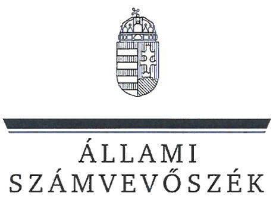
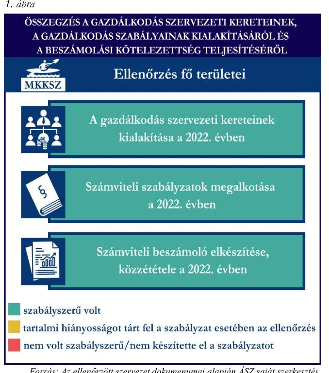
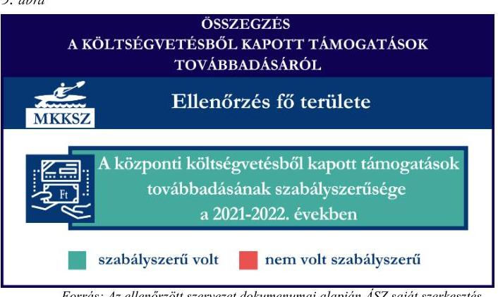
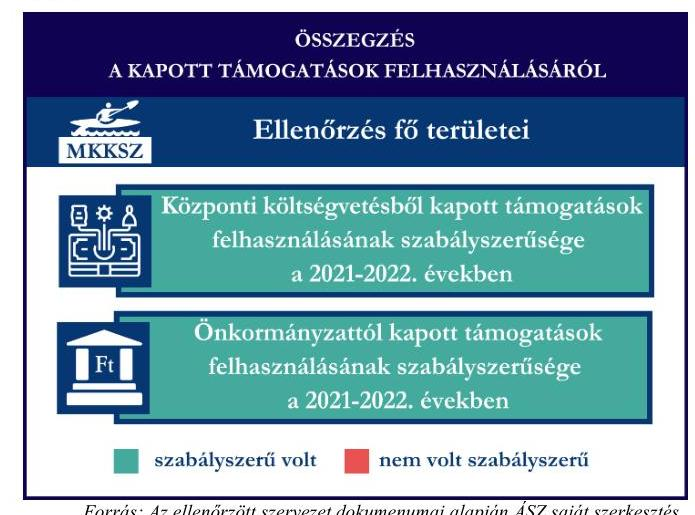
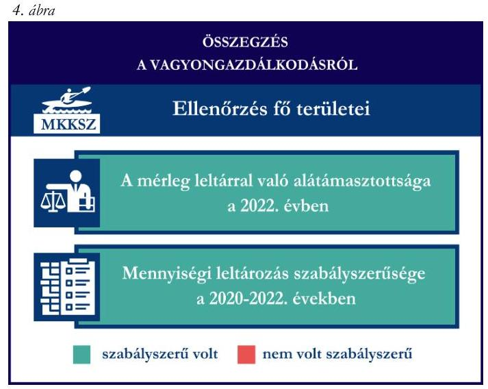

# JELENTÉS 

## Támogatásban részesülő sportszövetségek és sportegyesületek gazdálkodásának ellenőrzése

Magyar Kajak-Kenu Szövetség

2024.

---

ÁLLAMI
SZÁMVEVŐSZÉK

# JELENTÉS 

## Támogatásban részesülő sportszövetségek és sportegyesületek gazdálkodásának ellenőrzése

Magyar Kajak-Kenu Szövetség

2024.

---

# ELLENŐRZÉSI IGAZGATÓSÁG: 

## ÁLLAMHÁZTARTÁSON KÍVÜLI SZERVEZETEKET ELLENŐRZŐ IGAZGATÓSÁG

## ELLENŐRZÉSI IGAZGATÓ:

## KLINGA LÁSZLÓ igazgató

## ELLENŐRZÉSVEZETŐ:

Jelentéseink az interneten a www.asz.hu címen olvashatók.

## HOFMEISTER LÁSZLÓ ellenőrzésvezető

IKTATÓSZÁM: EL-4060-053/2024.
TÉMASZÁM: 2682
ELLENŐRZÉS-AZONOSÍTÓ SZÁM: V1026

---

# TARTALOMJEGYZÉK 

AZ ELLENŐRZÉS ALAPADATAI ..... 5
AZ ELLENŐRZÖTT SZERVEZETEK ..... 7
ÖSSZEFOGLALÁS ..... 8
AZ ELLENŐRZÉS FÓKUSZKÉRDÉSEI ..... 10
MEGÁLLAPÍTÁSOK ..... 11
JAVASLATOK ..... 14
MELLÉKLETEK ..... 15
I. sz. melléklet: Értelmező szótár ..... 15
II. sz. melléklet: Az ellenőrzött szervezetek jegyzéke ..... 17
III. sz. melléklet: Ellenőrzési kritériumok ..... 18
FÜGGELÉK: ÉSZREVÉTELEK ..... 19
RÖVIDÍTÉSEK JEGYZÉKE ..... 20

---

.

---

# AZ ELLENŐRZÉS ALAPADATAI 

## AZ ELLENŐRZÉS CÉLJA

Az ellenőrzés célja az államháztartásból nyújtott támogatással, vagy az államháztartásból meghatározott célra ingyenesen juttatott vagyon felhasználásával érintett sportszövetségek és sportegyesületek gazdálkodása szabályozottságának, gazdálkodási tevékenységének, ezen belül a beszámolási kötelezettség teljesítésének, a támogatások elkülönített nyilvántartásának, valamint a támogatások felhasználásának ellenőrzése.

## AZ ELLENŐRZÉS TÍPUSA

Szabályszerüségi ellenőrzés.

## AZ ELLENŐRZÖTT IDŐSZAK

Az 1. fókuszkérdés esetében a 2022. év.
A 2-3. fókuszkérdés vonatkozásában a 2021-2022. évek.
A 4. fókuszkérdés vonatkozásában a 2022. év, a mennyiségi felvétellel történő leltározás dokumentumai tekintetében a 2020-2022. évek.

## AZ ELLENŐRZÉS TÁRGYA

Az ellenőrzés tárgya a támogatásban részesülő sportszövetségek, sportegyesületek gazdálkodása szabályozottságának, gazdálkodási tevékenységén belül a beszámolási kötelezettség teljesítésének, a vagyonnyilvántartásának, a támogatások elkülönített nyilvántartásának, valamint az államháztartási forrásból származó közvetlen vagy közvetett támogatások és a meghatározott célra ingyenesen juttatott vagyon felhasználásának a vizsgálata volt.

Az ellenőrzés a támogatások vonatkozásában kiterjedt továbbá a támogató felé történő beszámolási és elszámolási kötelezettségek teljesítésére, a költségvetésből kapott támogatások továbbadásának szabályszerűségére, az ezekkel kapcsolatos jogszabályi és belső előírások betartására.

Az ellenőrzés kiterjedt minden olyan körülményre és adatra, amely az ÁSZ ${ }^{1}$ jogszabályban meghatározott feladatainak teljesítéséhez, valamint az ellenőrzési program végrehajtása során felmerülő újabb összefüggések feltárásához szükséges.

## AZ ELLENŐRZÉS JOGALAPJA

Az ellenőrzés jogszabályi alapját az ÁSZ tv. ${ }^{2} 1 . \int$ (3) bekezdése, az 5. $\int$ (3) bekezdése, valamint a Civil tv. ${ }^{3} 47 . \int$ előírásai képezték.

---

# AZ ELLENŐRZÉS MÓDSZERE 

Az ellenőrzést a nemzetközi standardokat irányadónak tekintve az ellenőrzési program szempontjai, az ellenőrzött időszakban hatályos jogszabályok, az ellenőrzés általános szakmai szabályai, az ellenőrzésre irányadó ÁSZ módszertanok figyelembevételével végezte az ÁSZ.

Az ellenőrzési kérdések megválaszolásához szükséges bizonyítékok megszerzése az ellenőrzött szervezet által rendelkezésre bocsátott dokumentumokra, adatokra alapozva kérdésfeltevés (információkérés), interjú, mintavételezés útján történt.

Az ellenőrzési bizonyítékként felhasználható adatforrások közé tartoztak egyrészt az ellenőrzés során az ellenőrzött szervezettől bekért dokumentumok, másrészt adatforrás lehetett minden további az ellenőrzés folyamán feltárt, az ellenőrzés szempontjából információt tartalmazó dokumentum.

A támogatásokkal, azok felhasználásával, a továbbadott támogatásokkal kapcsolatos kötelezettségek vizsgálatára mintavételi eljárások kerültek alkalmazásra. Támogatás-típusok szerint nagyságrend alapján 1-3 darab támogatás került részletes vizsgálat alá. Ezen támogatások felhasználásának szabályszerűsége támogatásonként kockázatértékelés alapján kiválasztott mintatételekkel került ellenőrzésre. A kiválasztott támogatási szerződésekhez kapcsolódó elszámolásokból 30-30 db mintatétel került ellenőrzésre, ahol az elszámolás nem érte el a 30 db -ot, ott tételes ellenőrzésre került sor. Ezen felül a vagyongazdálkodás szabályszerűségének ellenőrzéséhez is kockázatalapú mintavétel kapcsolódott. A támogatások felhasználása és a vagyongazdálkodás területén a minták ellenőrzése kiterjedt a könyvvezetési kötelezettség vizsgálatára is. A tárgyi eszközök tekintetében 30 db került kiválasztásra a 2022. évben állományban lévő eszközök közül azok nyilvántartásának, elszámolásának szabályszerűsége ellenőrzése céljából. Az ellenőrzésben nem statisztikai mintavételre került sor, ezért nem történt kivetítés a teljes sokaságra, a megállapításokat az ellenőrzött mintatételekre vonatkozóan fogalmazta meg az ÁSZ.

---

# AZ ELLENŐRZÖTT SZERVEZETEK

## MAGYAR KAJAK-KENU SZÖVETSÉG

A Magyar Kajak-Kenu Szövetséget 1941-ben alapították. Az MKKSZ¹ tagja a Nemzetközi Kajak-Kenu Szövetségnek, az Európai Kajak-Kenu Szövetségnek, valamint a Nemzetközi Rafting Szövetségnek. Magyarország területén kizárólagos jelleggel irányítja, szervezi és ellenőrzi a kajak-kenu sportágban folyó tevékenységet, összehangolja a Nemzetközi Kajak-Kenu Szövetség által elismert szakágak tevékenységét, ellátja a Sport tv.-ben, valamint más jogszabályokban az országos sportági szakszövetségek részére meghatározott feladatokat, képviseli sportágának és tagjainak érdekeit, valamint részt vesz a nemzetközi sportszervezetek tevékenységében. Az MKKSZ a 2022. évben közhasznú jogállású volt, könyvvizsgálatra és felügyelőbizottság létrehozására volt kötelezett. Az MKKSZ által a 2021-2022. években igénybe vett államháztartási forrásból származó támogatásokat az 1. táblázat foglalja össze.

|  AZ MKKSZ ÁLTAL IGENYBE VETT TÁMOGATÁSOK/
ADATOK M ÉT-BAN MEGADVA | 2021. ÉV | 2022. ÉV  |
| --- | --- | --- |
|  Központi költségvetési támogatás | 2907 | 2396  |
|  Helyi önkormányzati támogatás | 5 | 5  |

Forrás: Az ellenőrzőtt szervezet beszámolói adatai alapján ÁSZ saját szerkesztés

---

# ÖSSZEFOGLALÁS 

Magyarország Alaptörvényének XX. cikke kimondja, hogy mindenkinek joga van a testi és lelki egészséghez, melynek érvényesülését Magyarország többek között a sportolás és a rendszeres testedzés támogatásával segíti elő. Az Országgyűlés a Sport tv. ${ }^{5}$-ben kinyilvánította, hogy a nemzet közössége a test művelését, a sportot, a nemzet alapértékének, kívánatos célnak tekinti. A sport a közjó része. Erősíti a közösség tagjainak egymáshoz tartozását, miként az egyén testi és lelki egészségét.

A sportegyesületek, sportszövetségek működésükre és szakmai tevékenységük ellátására költségvetési támogatásban, önkormányzati támogatásban, ingyenes vagyonjuttatásban, valamint látvány-csapatsport támogatásban részesülhetnek, amelyekre fokozott figyelem irányul.

A társadalom részéről jogosan felmerülő elvárás, hogy a közpénzeket kezelő, azzal gazdálkodó szervezetek működéséről, tevékenységéről átfogó képet kapjon, a közpénzek rendeltetésszerủ és átlátható módon történő felhasználásának értékelésére időről-időre sor kerüljön az ellenőrzések keretében.

Az MKKSZ tekintetében a szervezeti keretek, a gazdálkodási szabályok kialakításra kerültek, a beszámolási kötelezettség teljesítése szabályszerű volt a 2022. évben.

Az MKKSZ a könyvviteli szolgáltatás személyi feltételeit, a 2022. évi számviteli beszámoló vonatkozásában a könyvvizsgálatot biztosította. A jogszabályban, valamint az MKKSZ alapszabályában előírt felügyelőbizottsággal rendelkezett a 2022. évben.

Az MKKSZ a számviteli szabályzatokat az előírásoknak megfelelően kialakította a 2022. évben. A MKKSZ 2022. évben rendelkezett a támogatások felhasználásával kapcsolatos, jogszabályban előírt gazdálkodási szabályzattal.

A könyvvezetés formája a 2022. évben megfelelt a jogszabályi előírásoknak. A 2022. évi számviteli beszámolóját a jogszabályi előírásoknak megfelelően elkészítette, közzétette.

A gazdálkodás szervezeti kereteinek és a gazdálkodási szabályok kialakítása, valamint a beszámolási kötelezettség ellenőrzésének az összegzését az 1. ábra tartalmazza.

---

AZ MKKSZ a központi költségvetésből, valamint az önkormányzattól kapott, támogatások ellenőrzött tételei vonatkozásában - egy tételt kivételével - a támogatási célnak megfelelően használta fel a 2021-2022. években.

A kapott támogatások felhasználásának ellenőrzéséről az összegzést a 2. ábra tartalmazza.
3. ábra

Forrás: Az ellenörzött szervezet dokumenumai alapján ÁSZ saját szerkesztés
Az MKKSZ vagyongazdálkodása az ellenőrzött tételek vonatkozásában kisebb hibák mellett szabályszerű volt. A 2022. évi beszámolójának mérlegtételeit leltárral alátámasztotta. Az MKKSZ a tárgyi eszközökkel kapcsolatban a 2022-ben esedékes mennyiségi felvétellel történő leltározást elvégezte. Az MKKSZ a vagyonkezelt eszközeit az előírtak alapján nyilvántartotta, az ellenőrzött tételeinek a hasznosítása szabályszerű volt.

A vagyongazdálkodás ellenőrzésének összegzését a 4. ábra tartalmazza.

Az MKKSZ a központi költségvetésből kapott ellenőrzött támogatásokat szabályszerűen adta tovább a sportegyesületek részére.

A kapott támogatások továbbadásának ellenőrzéséről az összegzést a 3. ábra tartalmazza.

Forrás: Az ellenörzött szervezet dokumenumai alapján ÁSZ saját szerkesztés

---

# AZ ELLENŐRZÉS FÓKUSZKÉRDÉSEI 

1.     - A gazdálkodási szabályok kialakítása, a könyvvezetési és beszámolási kötelezettség teljesítése szabályszerű volt-e?
2.     - A kapott támogatások felhasználása szabályszerű volt-e?
3.     - A költségvetésből kapott támogatások továbbadása szabályszerűen valósult-e meg?
4.     - Az ellenőrzött szervezet vagyongazdálkodása szabályszerű volt-e?

---

# MEGÁLLAPÍTÁSOK 

## 1. A gazdálkodási szabályok kialakítása, a könyvvezetési és beszámolási kötelezettség teljesítése szabályszerű volt-e?

Összegző megállapítás Az MKKSZ-nél a 2022. évben a jogszabályban előírtak szerint a gazdálkodási szabályok kialakításra kerültek, a könyvvezetési kötelezettség és a beszámolási kötelezettség teljesítése szabályszerű volt.

Az MKKSZ a 2022. évben a Számv. tv. ${ }^{6}$, valamint a Civilszr. ${ }^{7}$ előírásaiban foglaltaknak megfelelően gondoskodott a könyvviteli szolgáltatás személyi feltételeinek teljesüléséről. Az MKKSZ a 2022. évben a Számv. tv.-ben, valamint Civilszr.-ben előírtaknak megfelelően könyvvizsgálót bízott meg a beszámoló felülvizsgálatára. Az MKKSZ a 2022. évben a jogszabály előírásai alapján rendelkezett felügyelőbizottsággal. A felügyelőbizottság a 2022. évben a Civil tv.-ben előírt ügyrenddel rendelkezett, a 2022. évi számviteli beszámolót véleményezte.

Az MKKSZ 2022-ben rendelkezett a Számv. tv-ben előírt számviteli politikával, azon belül az eszközök és a források leltárkészítési és leltározási szabályzatával, az eszközök és a források értékelési szabályzatával, pénzkezelési szabályzattal, valamint számlarenddel, amelyek az ellenőrzött tartalmi kritériumoknak megfeleltek. Az MKKSZ a Sport tv.-ben előírtak alapján 2022-ben rendelkezett olyan gazdálkodási, pénzügyi szabályzattal, amely tartalmazta az állami sportcélú támogatások Sport tv.-nek, valamint az állami sportcélú támogatások felhasználásáról és elosztásáról szóló kormányrendeletnek megfelelő felhasználására vonatkozó előírásait.
Az MKKSZ a Számv. tv.-ben, Civil tv.-ben, valamint a Civilszr.-ben előírtak szerinti kettős könyvvitelt vezetett. Az MKKSZ 2022-ben a könyvviteli nyilvántartását úgy vezette, hogy a Számv. tv., valamint a Civilszr. előírásainak megfelelően a számviteli beszámolóban az egyéb bevételeken belül részletezni tudta a kapott támogatások és tagdíjak összegeit.
Az MKKSZ a Civil tv.-ben, valamint a Számv. tv. előírásai alapján előírt könyvvitellel alátámasztott számviteli beszámolóját, továbbá a Civil tv.-ben előírtak alapján a közhasznúsági mellékletét elkészítette. Az MKKSZ a 2022. évi számviteli beszámolóját a Ptk. ${ }^{8}$, valamint a Civil tv. alapján a legfőbb döntéshozó szerv hagyta jóvá, valamint a Civilszr. előírási alapján könyvvizsgáló felülvizsgálta, a felügyelőbizottság véleményezte. Az MKKSZ a 2022. évi elfogadott számviteli beszámolóját, valamint közhasznúsági mellékletét a Számv. tv.-ben, valamint a Civil tv.-ben előírtaknak megfelelően letétbe helyezte, közzétette.

## 2. A kapott támogatások felhasználása szabályszerű volt-e?

## Összegző megállapítás Az MKKSZ 2021-2022. években az ellenőrzött támogatásokat - egy tétel kivételével - szabályszerűen használta fel.

Az MKKSZ az ellenőrzött támogatási szerződésekben foglaltak alapján, a központi költségvetésből kapott támogatás bevételeit a Civil tv. előírásai alapján elkülönítette a számviteli rendszerében. Az MKKSZ a

---

2021-2022. években a Számv. tv., valamint a Civil tv. alapján az alapcél szerinti tevékenysége költségei, ráfordításai ellentételezésére kapott központi költségvetési támogatásokról vezetett olyan elkülönített számviteli nyilvántartást, amelynek alapján támogatásonként megállapítható és ellenőrizhető a kapott támogatás felhasználása. A központi költségvetéstől kapott támogatás terhére elszámolt, ellenőrzött ráfordításokból négy esetben a 474/2016. (XII.27.) Korm. rend. ${ }^{7}$ 24. § (2) bekezdésében foglaltak ellenére a támogatás felhasználásának számviteli bizonylatán az MKKSZ nem szerepeltetett záradékolást, további egy tétel esetében a záradékolt összeg nem egyezett meg az elszámolásban szereplő összeggel, így a számviteli bizonylaton nem került jelzésre, hogy az adott támogatás terhére mekkora összeg került elszámolásra, illetve a bizonylaton jelzett (záradékolt) összeg nem volt összhangban az elszámolt összeggel. Az MKKSZ az EMMI-IX/3339-2/2021. számú támogatás felhasználásáról készült beszámoló pénzügyi elszámolásában egy költségtételt (50,3 E Ft) duplán számolt el. A támogatás terhére duplán elszámolt költség miatt, a támogatás jogosulatlan felhasználása valósult meg. A központi támogatás terhére elszámolt ellenőrzött ráfordítások a Számv. tv. szerint kerültek elszámolásra, számviteli bizonylattal alátámasztottak voltak. Az MKKSZ az ellenőrzött központi költségvetésből kapott támogatás felhasználásáról a támogatási szerződésben előírt pénzügyi beszámolót elkészítette, a támogató által és a 474/2016. (XII.27.) Korm. rend.-ben előírt szakmai beszámolót elkészítette.
A Civil tv. előírásainak megfelelően az MKKSZ az ellenőrzött önkormányzati támogatási szerződésekben meghatározott támogatási bevételeket a 2021-2022. években elkülönítetten mutatta ki a számviteli nyilvántartásában. Az MKKSZ a 2021-2022. években a Számv. tv. és a Civil tv. szerint az alapcél szerinti tevékenysége költségei, ráfordításai ellentételezésére kapott önkormányzati támogatásokról vezetett olyan elkülönített számviteli nyilvántartást, amelynek alapján támogatásonként megállapítható és ellenőrizhető a kapott támogatás felhasználása. Az MKKSZ a 2021-2022. években elszámolt önkormányzati támogatások ellenőrzött tételeit a Számv. tv.-ben előírtaknak megfelelő, szabályszerű számviteli bizonylattal alátámasztotta, a Számv. tv. előírásai szerint számolta el.

# 3. A költségvetésből kapott támogatások továbbadása szabályszerűen valósult-e meg? 

Összegző megállapítás Az MKKSZ a 2021-2022. években költségvetésből kapott támogatásokat az ellenőrzött tételek vonatkozásában szabályszerűen adta tovább.

Az MKKSZ a számviteli rendszerében a továbbadott támogatások adatai elkülönített rendszerét kialakította a 2021-2022. években, a Civilszr., valamint a Számv. tv. alapján a tovább utalási céllal kapott támogatást az egyéb bevételek között, a továbbadott támogatásokat a ráfordítások között szerepeltette a könyvviteli rendszerében a 2021-2022. években. Az MKKSZ az ellenőrzött továbbadott támogatásokkal kapcsolatosan a támogatási szerződésekben előírt beszámolási kötelezettséget teljesítette.

---

# 4. Az ellenőrzött szervezet vagyongazdálkodása szabályszerű volt-e? 

## Összegző megállapítás

Az MKKSZ 2022. évi beszámolójának mérlegtételei a jogszabályban előírt leltárral alátámasztottak. Az MKKSZ 2022. évi vagyongazdálkodása az ellenőrzött tételek vonatkozásában összeségében szabályszerű volt.

Az MKKSZ a 2022. évi beszámolójának mérlegtételeit a Számv. tv. alapján szabályszerű leltárral alátámasztotta. Az MKKSZ a 2022. üzleti év mérlegfordulónapjára vonatkozóan a Számv. tv.-ben és a leltározási szabályzatában előírt mennyiségi felvétellel lefolytatott leltározást elvégezte.
Az ellenőrzött tárgyi eszközök bekerülési értékét alátámasztó számviteli bizonylatok - két ellenőrzött beruházást kivéve - a Számv. tv.-ben előírtaknak megfelelően rendelkezésre álltak. A 2022. évi könyvviteli elszámolásban a tárgyi eszközök között szereplő két beruházás tekintetében a beszerzést alátámasztó bizonylatok közül nem voltak fellelhetőek a beruházás teljes értékét alátámasztó beszerzési számlák. Ez alapján a Számv. tv. 165. § (2) bekezdésben foglaltak ellenére a nyilvántartott adatok, a beszerzések értéke a két tárgyi eszköz tekintetében bizonylattal nem volt alátámasztott. Ennek következtében sérült a Számv. tv. 15. § (3) bekezdésében szereplő valódiság elve, miszerint a könyvvitelben rögzített és a beszámolóban szereplő tételeknek a valóságban is megtalálhatóknak, bizonyíthatóknak, kívülállók által is megállapíthatóknak kell lenniük, értékelésük meg kell, hogy feleljen az e törvényben előírt értékelési elveknek és az azokhoz kapcsolódó értékelési eljárásoknak.
Az ellenőrzött tárgyi eszközök számviteli besorolása, értékesökkenés elszámolása megfelelt a Számv. tv. előírásainak, az üzembe helyezés tényét a Számv. tv.-ben előírtak alapján dokumentálta.
Az MKKSZ a 2022. évben a vagyonkezelt eszközeit a Vtv. vhr. ${ }^{10}$ előírásai alapján az előírt tartalmú nyilvántartás vezetésével a saját eszközeitől elkülönítetten kezelte. A Számv. tv. 23. § (2) bekezdésében előírtak ellenére a 2022. évben az MKKSZ a vagyonkezelt eszközeit a kiegészítő mellékletben külön nem mutatta be.

---

# JAVASLATOK 

Az ÁSZ tv. 33. § (1) bekezdésében foglaltak értelmében az ellenőrzött szervezet vezetője köteles a jelentésben foglalt megállapításokhoz kapcsolódó intézkedési tervet összeállítani és azt a jelentés kézhezvételétől számított 30 napon belül az ÁSZ részére megküldeni. Amennyiben az ellenőrzött szervezet vezetője nem küldi meg határidőben az intézkedési tervet, vagy továbbra sem elfogadható intézkedési tervet küld, az Állami Számvevőszék elnöke az ÁSZ tv. 33. § (3) bekezdése a) és b) pontjaiban foglaltakat érvényesítheti.

## A MAGYAR KAJAK-KENU SZÖVETSÉG ELNÖKÉNEK

1. Gondoskodjon arról, hogy a támogatás felhasználását alátámasztó számviteli bizonylaton a 474/2016. (XII.27.) Korm. rend. 24. § (2) bekezdésében előirt záradékolás minden esetben, az elszámolásban szereplő adatokkal összhangban szerepeljen.
2. Gondoskodjon arról, hogy a támogatásokkal való elszámolás során ne kerüljön sor ugyanazon ráfordítás ismételt elszámolására.
3. Gondoskodjon a Számv. tv. 165. (2) bekezdéseiben elöirtak alapján arról, hogy a számviteli nyilvántartásba csak bizonylat alapján kerüljön adat rögzítésre.
4. Gondoskodjon arról, hogy a vagyonkezelt eszközök a kiegészitő mellékletben külön kerüljenek bemutatásra a Számv. tv. 23. § (2) bekezdésében elöirtaknak megfelelően.

---

# MELLÉKLETEK 

## I. SZ. MELLÉKLET: ÉRTELMEZŐ SZÓTÁR

Civil szervezet

Egyesület

Költségvetési támogatás

Közhasznú szervezet

Közhasznú tevékenység

Országos sportági szakszövetség

Sportági szövetség

A civil társaság; a Magyarországon nyilvántartásba vett egyesület - a párt, a szakszervezet és a kölcsönös biztosító egyesület kivételével és a közalapítvány és a pártalapítvány kivételével - az alapítvány. (Forrás: Civil tv. 2. §6. pont a)-c) alpontjai)
Az egyesület a tagok közös, tartós, alapszabályban meghatározott céljának folyamatos megvalósítására létesített, nyilvántartott tagsággal rendelkező jogi személy. (Forrás: Ptk. 3:63. § (1) bekezdés)
A Számv. tv. szempontjából egyéb szervezet. (Számv. tv. 3. § (1) bekezdés 4. pont a) alpontja)
A társadalombiztosítás pénzügyi alapjai kivételével az államháztartás központi alrendszeréből ellenérték nélkül, pénzben nyújtott támogatások. (Forrás: Áht. ${ }^{11}$ 1. § 14. pont, ide nem értve az Áht. 1. § 14. pont a) -o) pontjaiban szereplő támogatásokat)

Közhasznú szervezetté minősíthető a Magyarországon nyilvántartásba vett közhasznú tevékenységet végző szervezet, amely a társadalom és az egyén közös szükségleteinek kielégítéséhez megfelelő erőforrásokkal rendelkezik, továbbá amelynek megfelelő társadalmi támogatottsága kimutatható, és amely:
a) civil szervezet (ide nem értve a civil társaságot), vagy
b) olyan egyéb szervezet, amelyre vonatkozóan a közhasznú jogállás megszerzését törvény lehetővé teszi. (Forrás: Civil tv. 32. § (1) bekezdés)
Minden olyan tevékenység, amely a létesítő okiratban megjelölt közfeladat teljesítését közvetlenül vagy közvetve szolgálja, ezzel hozzájárulva a társadalom és az egyén közös szükségleteinek kielégítéséhez. (Forrás: Civil tv. 2. § 20. pont)
Olyan sportszövetség, amely sportágában kizárólagos jelleggel az e törvényben, valamint más jogszabályokban meghatározott feladatokat lát el és e törvényben megállapított különleges jogosítványokat gyakorol. Olyan sportágban hozható létre, amelyet vagy a Nemzetközi Olimpiai Bizottság elismert, vagy amely sportág nemzetközi szövetségét felvették a Nemzetközi Sportszövetségek Szövetségébe (GAISF). (Forrás: Sport tv. 20. § (1), (4) bekezdés)
A Civil tv. és a Ptk. előírásai alapján - a Sport tv.-ben meghatározott eltérésekkel - múködő szövetség, amelynek tagjai kizárólag sportszervezetek lehetnek. Sportági szövetség országos jelleggel is múködhet. Egy sportágban csak egy országos sportági szövetség múködhet. Törvényi feltételek teljesülése esetén szakszövetségi feladatokat is elláthat. (Forrás: Sport tv. 28. §)

---

Sportegyesület

Sportegyesületeknek, sportszövetségeknek nyújtott költségvetési támogatás

Sportszövetség

Sporttevékenység

A Civil tv. és a Ptk. szabályai szerint múködő olyan egyesület, amelynek alaptevékenysége a sporttevékenység szervezése, valamint a sporttevékenység feltételeinek megteremtése. A sportegyesületek a Sport tv. 15. § (1) bekezdésében meghatározott sportszervezetek körébe tartoznak. A sportegyesületeken kívül sportszervezet még a sportvállalkozás, a sportiskola, valamint az utánpótlás-nevelés fejlesztését végző alapítvány. (Forrás: Sport tv. 16. § (1) bekezdés)
Az állami sport célú támogatások felhasználásáról és elosztásáról szóló 474/2016. (XII. 27.) Kormány rendelet 1. § (1) bekezdésében és a 27/2013. (III. 29.) EMMI rendelet ${ }^{12}$ 1. §-ában meghatározott fejezeti kezelésű előirányzatokból nyújtott támogatás.
Meghatározott sporttevékenységek körében a sportversenyek szervezésére, a tagok érdekvédelmére és a részükre való szolgáltatásokra, valamint a nemzetközi kapcsolatok lebonyolítására létrehozott, jogi személyiséggel és önkormányzattal rendelkező, a Civil tv. és a Ptk. alapján - az e törvényben foglalt eltérésekkel - különös formában múködő egyesületek. A Sport tv. 19. § (3) bekezdése szerint a sportszövetségeknek az alábbi típusai léteznek: országos sportági szakszövetségek, sportági szövetségek, szabadidősport szövetségek, fogyatékosok sportszövetségei, diák- és egyetemi-főiskolai sport sportszövetségei, nemzetközi sportszövetségek. (Forrás: Sport tv. 19. § (1), (3) bekezdés)

Meghatározott szabályok szerint, a szabadidő eltöltéseként kötetlenül vagy szervezett formában, illetve versenyszerűen végzett testedzés vagy szellemi sportágban kifejtett tevékenység, amely a fizikai erőnlét és a szellemi teljesítőképesség megtartását, fejlesztését szolgálja. (Forrás: Sport tv. 1. § (2) bekezdés)

---

II. SZ. MELLÉKLET: AZ ELLENŐRZÖTT SZERVEZETEK JEGYZÉKE

|  ELLENŐRZÖTT SZERVEZET NEVE | ELLENŐRZÖTT SZERVEZET SZÉKHELYE  |
| --- | --- |
|  Magyar Kajak-Kenu Szövetség | 1138 Budapest, Latorca utca 2.  |

---

# III. SZ. MELLÉKLET: ELLENŐRZÉSI KRITÉRIUMOK 

## FOKUSZKÉRDÉS

## 1. fókuszkérdés:

A gazdálkodási szabályok kialakítása, a könyvvezetési és beszámolási kötelezettség teljesítése szabályszerű volt-e?

## 2. fókuszkérdés:

A kapott támogatások felhasználása szabályszerű volt-e?

## 3. fókuszkérdés:

A költségvetésből kapott támogatások továbbadása szabályszerűen valósult-e meg?

## 4. fókuszkérdés:

Az ellenőrzött szervezet vagyongazdálkodása szabályszerű volt-e?

## E LLENŐRZÉSI KRITÉRIUMOK

Számv. tv. 14. § (3) bekezdés, (5) bekezdés a), b), d) pont, (8) bekezdés, (11) bekezdés, 69. § (3) bekezdés, 90. § (3) bekezdés c) pont, 161. § (1) bekezdés, (2) bekezdés a)-d) pont, (3)-(4) bekezdés, 161/A. $\S$ (2) bekezdés, 165. $\$ (2) bekezdés
Civilszr. 7. § (1) bekezdés, (4) bekezdés b), c) pont, 8. § (2), (3) bekezdés, 9. § (4), (5), (8) bekezdés, 12. § (4), (5) bekezdés, 15. § (1) bekezdés a), b) pont, 16. § (1) bekezdés, 24. § (2) bekezdés

Ptk. 3:26. § (1) bekezdés, 3:27. § (1) bekezdés, 3:82. § (1) bekezdés,
Civil tv. 28. § (1) bekezdés, 29. § (2) bekezdés c) pont, (3), (6), (7) bekezdés, 30. § (1)-(4) bekezdés 40. § (1), (2) bekezdés, 41. § (1) bekezdés
Sport tv. 23. § (1) bekezdés f) pont
Számv. tv. 44. § (2) bekezdés, 93. § (3) bekezdés, 159. §, 165. § (2) bekezdés, 161/A (2) bekezdés, 167. § (1) bekezdés a), d), e), h) pont
Civil tv. 20. § (2) bekezdés a) pont, (3) bekezdés a), c) pont, (4) bekezdés, 29. § (4), (5) bekezdés
Civilszr. 24. § (2) bekezdés
27/2013. (III.29.) EMMI rend. 18. § (2) bekezdés
474/2016. (XII. 27.) Korm. rend. 22. § (2) bekezdés, 24. § (2) bekezdés
Áht. 53. §, Ávr. ${ }^{13}$ 92. §, 93. § (2)-(4) bekezdések
474/2016. (XII. 27.) Korm. rend. 14. §, 17. § (1) bekezdés 13. pont, 23. § (1) bekezdés, 24. § (1) bekezdés, 25. § (1) bekezdés
Sport tv. 57. § (2) bekezdés d) pont
Civil tv. 29. § (7)
Civilszr. 13. § (4) bekezdés
Ptk. 3:63. § (4) bekezdés
Számv. tv. 3. § (3) bekezdés 3. pont, 15. § (3) bekezdés, 46. § (3), (4) bekezdés, 47-51. §, 52. § (1)-(7) bekezdés, 69. § (1)-(3) bekezdések, 165. § (2) bekezdés, 169. § (2) bekezdés
Vtv. ${ }^{14}$ 23. § (2)-(4) bekezdés, 27. § (2), (7)-(9) bekezdés, 20. § (4) bekezdés c) pont
Vtv. vhr. 7. § (3) bekezdés, 9. § (9) bekezdés, 9/A. § (1) bekezdés b) pont, 9/A. § (2) bekezdés, 10. § (4) bekezdés, 14. § (1), (3) bekezdés, 17. § (1) bekezdés
Nvtv. ${ }^{15}$ 11. § (1), (7), (8) bekezdés a) pont, (10) bekezdés, (11) bekezdés a), b), c) pont, (12), (13) bekezdés

---

# FÜGGELÉK: ÉSZREVÉTELEK 

A jelentéstervezetet a Számvevőszék 15 napos észrevételezésre megküldte az ellenőrzött szervezet vezetőjének az ÁSZ tv. 29. §* (1) bekezdése előírásának megfelelően.

Az ellenőrzött szervezet elnöke a jelentéstervezetre nem tett észrevételt.

[^0]
[^0]:    * 29. § (1) Az Állami Számvevőszék az ellenőrzési megállapításait megküldi az ellenőrzött szervezet vezetőjének vagy az általa megbízott személynek, és annak, akinek személyes felelősségét állapította meg.
    (2) Az ellenőrzött szervezet vezetője és a felelősként megjelölt személy az ellenőrzés megállapításaira tizenöt napon belül írásban észrevételt tehet.
    (3) Az Állami Számvevőszék az észrevételre a beérkezésétől számított harminc napon belül írásban válaszol. A figyelembe nem vett észrevételeket köteles a jelentésben feltüntetni, és megindokolni, hogy azokat miért nem fogadta el.

---

# RÖVIDÍTÉSEK JEGYZÉKE 

${ }^{1}$ ÁSZ
${ }^{2}$ ÁSZ tv.
${ }^{3}$ Civil tv.
${ }^{4}$ MKKSZ
${ }^{5}$ Sport tv.
${ }^{6}$ Számv. tv.
${ }^{7}$ Civilszr.
${ }^{8}$ Ptk.
${ }^{9}$ 474/2016. (XII.27.) Korm. rendelet
${ }^{10}$ Vtv. vhr.
${ }^{11}$ Áht.
${ }^{12}$ 27/2013. (III.29.) EMMI rendelet
${ }^{13}$ Ávr.
${ }^{14}$ Vtv.
${ }^{15}$ Nvtv.

Állami Számvevőszék
2011. évi LXVI. törvény az Állami Számvevőszékről
2011. évi CLXXV. törvény az egyesülési jogról, a közhasznú jogállásról, valamint a civil szervezetek müködéséről és támogatásáról
Magyar Kajak-Kenu Szövetség
2004. évi I. törvény a sportról
2000. évi C. törvény a számvitelről

479/2016. (XII. 28.) Korm. rendelet a számviteli törvény szerinti egyes egyéb szervezetek beszámoló készítési és könyvvezetési kötelezettségének sajátosságairól
2013. évi V. törvény a Polgári Törvénykönyvről

474/2016. (XII. 27.) Korm. rendelet az állami sport célú támogatások felhasználásáról és elosztásáról
254/2007. (X. 4.) Korm. rendelet az állami vagyonnal való gazdálkodásról
2011. évi CXCV. törvény az államháztartásról

27/2013. (III. 29.) EMMI rendelet az állami sport célú támogatások felhasználásáról és elosztásáról
368/2011. (XII. 31.) Korm. rendelet az államháztartásról szóló törvény végrehajtásáról
2007. évi CVI. törvény az állami vagyonról
2011. évi CXCVI. törvény - a nemzeti vagyonról

---

1052 Budapest, Apáczai Csere János u. 10. | 1364 Budapest 4., Pf. 54
www.asz.hu | szamvevoszek@asz.hu
telefon: +36 14849100