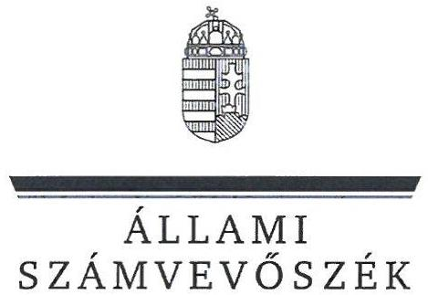
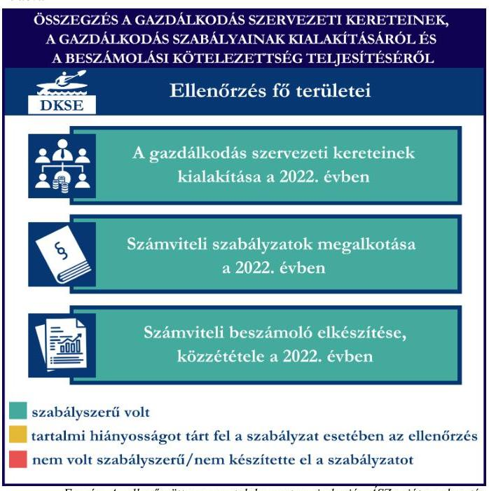
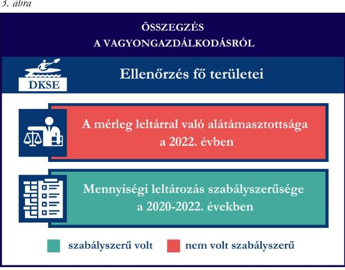

# JELENTÉS 

## Támogatásban részesülő sportszövetségek és sportegyesületek gazdálkodásának ellenőrzése

Dunaújvárosi Központi Sportegyesület

2024.

---

ÁLLAMI
SZÁMVEVÔSZÉK

# JELENTÉS 

## Támogatásban részesülő sportszövetségek és sportegyesületek gazdálkodásának ellenőrzése

Dunaújvárosi Központi Sportegyesület

2024.

---

# ELLENŐRZÉSI IGAZGATÓSÁG: 

## ÁLLAMHÁZTARTÁSON KÍVÜLI SZERVEZETEKET ELLENŐRZŐ IGAZGATÓSÁG

## ELLENŐRZÉSI IGAZGATÓ:

## KLINGA LÁSZLÓ igazgató

## ELLENŐRZÉSVEZETŐ:

Jelentéseink az interneten a www.asz.hu címen olvashatók.

## HOFMEISTER LÁSZLÓ ellenőrzésvezető

IKTATÓSZÁM: EL-4060-049/2024.
TÉMASZÁM: 2682
ELLENŐRZÉS-AZONOSÍTÓ SZÁM: V1026

---

# TARTALOMJEGYZÉK 

AZ ELLENŐRZÉS ALAPADATAI ..... 5
AZ ELLENŐRZÖTT SZERVEZETEK ..... 7
ÖSSZEFOGLALÁS ..... 8
AZ ELLENŐRZÉS FÓKUSZKÉRDÉSEI ..... 10
MEGÁLLAPÍTÁSOK ..... 11
JAVASLATOK ..... 14
MELLÉKLETEK ..... 15
I. sz. melléklet: Értelmező szótár ..... 15
II. sz. melléklet: Az ellenőrzött szervezetek jegyzéke ..... 17
III. sz. melléklet: Ellenőrzési kritériumok ..... 18
FÜGGELÉK: ÉSZREVÉTELEK ..... 19
RÖVIDÍTÉSEK JEGYZÉKE ..... 20

---

.

---

# AZ ELLENŐRZÉS ALAPADATAI 

## AZ ELLENŐRZÉS CÉLJA

Az ellenőrzés célja az államháztartásból nyújtott támogatással, vagy az államháztartásból meghatározott célra ingyenesen juttatott vagyon felhasználásával érintett sportszövetségek és sportegyesületek gazdálkodása szabályozottságának, gazdálkodási tevékenységének, ezen belül a beszámolási kötelezettség teljesítésének, a támogatások elkülönített nyilvántartásának, valamint a támogatások felhasználásának ellenőrzése.

## AZ ELLENŐRZÉS TÍPUSA

Szabályszerüségi ellenőrzés.

## AZ ELLENŐRZÖTT IDŐSZAK

Az 1. fókuszkérdés esetében a 2022. év.
A 2. fókuszkérdés vonatkozásában a 2021-2022. évek.
A 3. fókuszkérdés vonatkozásában a 2022. év, a mennyiségi felvétellel történő leltározás dokumentumai tekintetében a 2020-2022. évek.

## AZ ELLENŐRZÉS TÁRGYA

Az ellenőrzés tárgya a támogatásban részesülő sportszövetségek, sportegyesületek gazdálkodása szabályozottságának, gazdálkodási tevékenységén belül a beszámolási kötelezettség teljesítésének, a vagyonnyilvántartásának, a támogatások elkülönített nyilvántartásának, valamint az államháztartási forrásból származó közvetlen vagy közvetett támogatások és a meghatározott célra ingyenesen juttatott vagyon felhasználásának a vizsgálata volt. Az ellenőrzés a támogatások vonatkozásában kiterjedt továbbá a támogató felé történő beszámolási és elszámolási kötelezettségek teljesítésére, az ezekkel kapcsolatos jogszabályi és belső előírások betartására. Az ellenőrzés kiterjedt minden olyan körülményre és adatra, amely az ÁSZ ${ }^{1}$ jogszabályban meghatározott feladatainak teljesítéséhez, valamint az ellenőrzési program végrehajtása során felmerülő újabb összefüggések feltárásához szükséges.

Az ÁSZ tv. ${ }^{2}$ 25. § (3) bekezdésében meghatározottak alapján, amennyiben a rendelkezésre bocsátott dokumentumok, adatok, illetve tájékoztatás hitelességének, megalapozottságának, teljességének megállapítása vagy egyes ellenőrzési megállapítások alátámasztása, kiegészítése indokolta, az ellenőrzés tárgyát képezték az összefüggő tények vizsgálatához más szervezetek (ellenőrzést támogató szervezetek) által rendelkezésre bocsátott adatok, dokumentációk, megadott tájékoztatások, illetve az ott végzett ellenőrzés is.

Az 1. és 3. fókuszkérdés tekintetében a vizsgálat a teljes ellenőrzött szervezetre, a 2. fókuszkérdés tekintetében kizárólag a kajak-kenu sportszakágra vonatkozott.

---

# Az ellenőrzés jogsalapja 

Az ellenőrzés jogszabályi alapját az ÁSZ tv. 1. $\$ (3) bekezdése, az 5. $\$ (3) bekezdése, valamint a Civil tv. ${ }^{3} 47 . \int$ előírásai képezték.

## AZ ELLENŐRZÉS MÓDSZERE

Az ellenőrzést a nemzetközi standardokat irányadónak tekintve az ellenőrzési program szempontjai, az ellenőrzött időszakban hatályos jogszabályok, az ellenőrzés általános szakmai szabályai, az ellenőrzésre irányadó ÁSZ módszertanok figyelembevételével végezte az ÁSZ.

Az ellenőrzési kérdések megválaszolásához szükséges bizonyítékok megszerzése az ellenőrzött szervezet által rendelkezésre bocsátott dokumentumokra, adatokra alapozva kérdésfeltevés (információkérés), interjú, mintavételezés útján történt.

Az ellenőrzési bizonyítékként felhasználható adatforrások közé tartoztak egyrészt az ellenőrzés során az ellenőrzött szervezettől bekért dokumentumok, másrészt adatforrás lehetett minden további az ellenőrzés folyamán feltárt, az ellenőrzés szempontjából információt tartalmazó dokumentum.

A támogatásokkal, azok felhasználásával kapcsolatos kötelezettségek vizsgálatára mintavételi eljárások kerültek alkalmazásra. Támogatás-típusok szerint nagyságrend alapján 1-3 darab támogatás került részletes vizsgálat alá. Ezen támogatások felhasználásának szabályszerűsége támogatásonként kockázatértékelés alapján kiválasztott mintatételekkel került ellenőrzésre. A kiválasztott támogatási szerződésekhez kapcsolódó elszámolásokból 30-30 db mintatétel került ellenőrzésre, ahol az elszámolás nem érte el a 30 db -ot, ott tételes ellenőrzésre került sor. Ezen felül a vagyongazdálkodás szabályszerűségének ellenőrzéséhez is kockázatalapú mintavétel kapcsolódott. A támogatások felhasználása és a vagyongazdálkodás területén a minták ellenőrzése kiterjedt a könyvvezetési kötelezettség vizsgálatára is. A tárgyi eszközök tekintetében 30 db került kiválasztásra a 2022. évben állományban lévő eszközök közül, ahol az állományban lévő eszközök száma nem érte el a 30 db -ot, ott tételes ellenőrzésre került sor azok nyilvántartásának, elszámolásának szabályszerűsége ellenőrzése céljából. Az ellenőrzésben nem statisztikai mintavételre került sor, ezért nem történt kivetítés a teljes sokaságra, a megállapításokat az ellenőrzött mintatételekre vonatkozóan fogalmazta meg az ÁSZ.

---

# AZ ELLENŐRZÖTT SZERVEZETEK 

## DuNAÚJVÁROSI KÖZPONTI SPORTEGYESÜLET

A Dunaújvárosi Központi Sportegyesületet 1951-ben alapították. A DKSE ${ }^{4}$ célja többek között a versenysporttá alkalmassá tehető, tehetségesnek ítélt fiatalok kiválasztása, felkutatása, sportszakmai pedagógiai és erkölcsi nevelésük biztosítása, versenyzővé válásuk elősegítése, valamint kiemelt teljesítményű sportolók nemzetközi sport rendezvényeken történő szerepeltetése. Célja továbbá a mozgásgazdag életmód elterjesztése, a rendszeres testmozgás hagyománnyá válásának elősegítése. A DKSE birkózás, kajak-kenu, röplabda, torna és úszás szakosztályt működtet. A DKSE a 2022. évben felügyelőbizottság létrehozására volt kötelezett. A DKSE a 2022. évben saját döntése alapján volt kötelezett könyvvizsgálatra. A DKSE 2022-ben nem volt közhasznú jogállású. A DKSE a 2022. évben az alaptevékenységén felül vállalkozási tevékenységet is végzett. A DKSE által a 2021-2022. években igénybe vett államháztartási forrásból származó támogatásokat az 1. táblázat foglalja össze.

## 1. táblázat

| A DKSE ÁLTAL IGÉNYBE VETT TÁMOGATÁSOK /   ADATOK M ÉT-BAN MEGADVA | 2021. év | 2022. év |
| :-- | :--: | :--: |
| Központi költségvetési támogatás* | 183 | 259 |
| Magyar Kajak-Kenu Szövetségtől kapott támogatás | 8 | 6 |

* több-sportágat érintő támogatás
Forrás: Az ellenőrzött szervezet beszámolói és fókönyvi nyilvántartás alapján ÁSZ saját szerkesztés

---

# ÖSSZEFOGLALÁS 

Magyarország Alaptörvényének XX. cikke kimondja, hogy mindenkinek joga van a testi és lelki egészséghez, melynek érvényesülését Magyarország többek között a sportolás és a rendszeres testedzés támogatásával segíti elő. Az Országgyűlés a Sport tv. ${ }^{5}$-ben kinyilvánította, hogy a nemzet közössége a test művelését, a sportot, a nemzet alapértékének, kívánatos célnak tekinti. A sport a közjó része. Erősíti a közösség tagjainak egymáshoz tartozását, miként az egyén testi és lelki egészségét.

A sportegyesületek, sportszövetségek működésükre és szakmai tevékenységük ellátására költségvetési támogatásban, önkormányzati támogatásban, ingyenes vagyonjuttatásban, valamint látvány-esapatsport támogatásban részesülhetnek, amelyekre fokozott figyelem irányul.

A társadalom részéről jogosan felmerülő elvárás, hogy a közpénzeket kezelő, azzal gazdálkodó szervezetek működéséről, tevékenységéről átfogó képet kapjon, a közpénzek rendeltetésszerủ és átlátható módon történő felhasználásának értékelésére időről-időre sor kerüljön az ellenőrzések keretében.
1. ábra

A DKSE által a gazdálkodási szabályzatok kialakítása, a könyvvezetési és beszámolási kötelezettség teljesítése szabályszerű volt a 2022. évben.

A DKSE a könyvviteli szolgáltatás személyi feltételeit, a 2022. évi számviteli beszámoló vonatkozásában a könyvvizsgálatot biztosította. A jogszabályban, valamint a DKSE alapszabályában előírt felügyelőbizottsággal rendelkezett a 2022. évben.

A DKSE a számviteli szabályzatokat az előírásoknak megfelelően alakította ki.

A könyvvezetés formája a 2022. évben megfelelt a jogszabályi előírásoknak. A DKSE a 2022. évi számviteli beszámolóját a jogszabályban előírtak szerint elkészítette, közzétette.

A gazdálkodás szervezeti kereteinek és a gazdálkodási szabályok kialakítása, valamint a beszámolási kötelezettség ellenőrzésének az összegzését az 1. ábra tartalmazza.

---

A DKSE az kajak-kenu szakosztály részére a központi költségvetésből és az MKKSZ ${ }^{6}$-en keresztül nyújtott támogatások ellenőrzött tételeit a támogatási célnak megfelelően használta fel a 2021-2022. években, azonban a támogatás felhasználásról az előírt elkülönített nyilvántartást a 2021-2022. években a könyvviteli rendszerében nem vezette.

A kapott támogatások felhasználásának ellenőrzéséről az összegzést a 2. ábra tartalmazza.

A D KSE vagyongazdálkodása az ellenőrzött tételek vonatkozásában összeségében szabályszerű volt a 2022. évben. A DKSE a 2022. évi beszámolójának tárgyi eszköz mérlegtételét nem támasztotta alá szabályszerű leltárral, mivel a tárgyi eszközök tekintetében egyeztetéssel végzett leltár adatok nem minden tárgyi eszköz esetében voltak összhangban a főkönyvi nyilvántartásban szereplő adatokkal. A DKSE a mérlegben szereplő tárgyi eszközök évente előírt mennyiségi leltározását a 2022. évben elvégezte.
A vagyongazdálkodás ellenőrzésének összegzését a 3. ábra tartalmazza.

---

# AZ ELLENŐRZÉS FÓKUSZKÉRDÉSEI 

1.     - A gazdálkodási szabályok kialakítása, a könyvvezetési és beszámolási kötelezettség teljesítése szabályszerű volt-e?
2.     - A kapott támogatások felhasználása szabályszerű volt-e?
3.     - Az ellenőrzött szervezet vagyongazdálkodása szabályszerű volt-e?

---

# MEGÁLLAPÍTÁSOK 

## 1. A gazdálkodási szabályok kialakítása, a könyvvezetési és beszámolási kötelezettség teljesítése szabályszerű volt-e?

## Összegző megállapítás

A DKSE-nél a 2022. évben a gazdálkodási szabályok a jogszabályban előírtak szerint kialakításra kerültek, a könyvvezetési és beszámolási kötelezettség teljesítése szabályszerű volt.

A DKSE a 2022. évben a Számv. tv. ${ }^{7}$, valamint a Civilszr. ${ }^{8}$ előírásaiban foglaltaknak megfelelően gondoskodott a könyvviteli szolgáltatás személyi feltételeinek teljesüléséről. A DKSE a 2022. évben a Számv. tv. szerinti könyvvizsgálót bízott meg a 2022. évről készült beszámoló felülvizsgálatára. A DKSE a 2022. évben a Ptk. ${ }^{9}$ előírásai alapján rendelkezett felügyelőbizottsággal. A felügyelőbizottság elkészítette az ügyrendjét, valamint a 2022. évi számviteli beszámolót véleményezte.
A DKSE 2022-ben rendelkezett a Számv. tv-ben előírt számviteli politikával, azon belül az eszközök és a források leltárkészítési és leltározási szabályzatával, az eszközök és a források értékelési szabályzatával, pénzkezelési szabályzattal, valamint számlarenddel, amelyek az ellenőrzött tartalmi kritériumoknak megfeleltek.
A DKSE a Számv. tv.-ben, Civil tv.-ben, valamint a Civilszr.-ben előírtak szerinti kettős könyvvitelt vezetett. A DKSE a számviteli beszámolójában szereplő vállalkozási és alaptevékenység bevételeinek és ráfordításainak Civilszr. előírása szerinti elkülönítését a könyviteli rendszerében teljesítette.
A DKSE 2022-ben a könyvviteli nyilvántartását úgy vezette, hogy a Számv. tv., valamint a Civilszr. előírásainak megfelelően a számviteli beszámolóban az egyéb bevételeken belül részletezni tudta a kapott támogatások és tagdíjak összegeit.
A DKSE a Civil tv.-ben, valamint a Számv. tv. előírásai alapján előírt kettős könyvvitellel alátámasztott 2022. évre vonatkozó számviteli beszámolóját, továbbá a Civil tv.-ben előírtak alapján a közhasznúsági mellékletét elkészítette. A DKSE a 2022. évi számviteli beszámolóját a Ptk., valamint a Civil tv. alapján a legfőbb döntéshozó szerve hagyta jóvá, valamint a Civilszr. előírási alapján könyvvizsgáló felülvizsgálta, a felügyelőbizottság véleményezte. A DKSE a 2022. évi elfogadott számviteli beszámolóját, valamint közhasznúsági mellékletét a Számv. tv.-ben, valamint a Civil tv.-ben előírtaknak megfelelően letétbe helyezte, azonban a Civil tv. 30. § (4) bekezdésében foglaltak ellenére a közhasznúsági mellékletet a saját honlapján nem helyezte el.

---

# 2. A kapott támogatások felhasználása szabályszerű volt-e? 

Összegző megállapítás A DKSE a kajak-kenu szakosztálya részére nyújtott ellenőrzött támogatásokat a 2021-2022. években a támogatási célnak megfelelően használta fel. A DKSE a támogatások felhasználását a könyvviteli nyilvántartásában nem különítette el a 2021-2022. években.

A DKSE az ellenőrzött támogatási szerződésekben foglaltak alapján, a központi költségvetésből kapott ellenőrzött támogatások bevételeit a Civil tv. előírásai alapján elkülönítette a számviteli rendszerében. A DKSE a 2021-2022. években a Számv. tv. 161/A. § (2) bekezdésében foglaltak ellenére a Civil tv. 20. § (4) bekezdésében előírt alapcél szerinti tevékenysége költségei, ráfordításai ellentételezésére az ellenőrzött központi költségvetésből kapott támogatásokról nem vezetett olyan elkülönített számviteli nyilvántartást, amelynek alapján támogatásonként megállapítható és ellenőrizhető a kapott támogatás felhasználása. Ez alapján az egyes támogatások felhasználásáról készített elszámolások könyvviteli nyilvántartással, az abban szereplő támogatásonkénti elkülönített adatokkal nem voltak alátámasztottak.
A központi költségvetési támogatás terhére elszámolt, két ellenőrzött tétel esetében a 474/2016. (XII.27.) Korm. rend. ${ }^{10}$ 24. § (2) bekezdésében foglaltak ellenére a támogatás felhasználásának számviteli bizonylatán a záradékolt összeg magasabb volt az elszámolásban szereplő összegnél, így a DKSE tévesen jelezte, hogy a számviteli bizonylaton szereplő összegből mennyit számolt el a szerződésszámmal hivatkozott támogatási szerződés terhére. A DKSE a támogatás felhasználásáról a támogató által előírt formában elkészítette az előírt beszámolókat és az összesített elszámolási táblázatokkal együtt a támogatási szerződésekben foglaltak alapján benyújtotta a támogatónak.
A DKSE a Számv. tv. 161/A. § (2) bekezdésében foglaltak ellenére a Civil tv. 20. § (4) bekezdésében előírt alapcél szerinti tevékenysége költségei, ráfordításai ellentételezésére a központi költségvetésből az MKKSZ-en keresztül számára juttatott, ellenőrzött támogatásokról nem vezetett olyan elkülönített számviteli nyilvántartást, amelynek alapján támogatásonként megállapítható és ellenőrizhető a kapott támogatás felhasználása a 2021-2022. években. Ez alapján az egyes támogatások felhasználásáról készített elszámolások könyvviteli nyilvántartással, az abban szereplő támogatásonkénti elkülönített adatokkal nem voltak alátámasztottak. A DKSE központi költségvetésből az MKKSZ-en keresztül számára juttatott ellenőrzött támogatás felhasználásáról és a támogatási szerződésben - és az alapján az Ábt. ${ }^{11}$-ban foglaltak szerint beszámolt a támogató felé. A DKSE a 2021-2022. években elszámolt támogatások ellenőrzött tételeit a Számv. tv.-ben előírtaknak megfelelő, szabályszerű számviteli bizonylattal alátámasztotta.

---

# 3. Az ellenőrzött szervezet vagyongazdálkodása szabályszerű volt-e? 

## Összegző megállapítás

A DKSE vagyongazdálkodása a 2022. évben az ellenőrzött tételek vonatkozásában szabályszerű volt. A beszámoló mérlegtételeit a tárgyi eszközt kivéve szabályszerű leltárral alátámasztotta.

A DKSE a 2022. évi beszámolójának mérlegtételeit - a tárgyi eszközök kivételével - a Számv. tv. alapján leltárral alátámasztotta. A Számv. tv. 69. § (2) bekezdésében foglaltak ellenére a tárgyi eszközöket nem támasztotta alá szabályszerű leltárral, mivel az üzleti év mérlegfordulónapjára vonatkozó főkönyvi könyvelés és analitikus nyilvántartások adatai több eszközcsoport tekintetében eltértek egymástól (abszolút értékben az eltérés 938 E Ft, ami nem minősül jelentős összegű hibának). A DKSE a Számv. tv.-ben, valamint a leltározási szabályzatában ${ }^{12}$ előírt mennyiségi felvétellel történő leltározását a 2022. évben teljesítette.
A DKSE 3 db ellenőrzött tárgyi eszköz bekerülési értékét a Számv. tv. 47. § (4) bekezdés b) pontjában foglaltak ellenére úgy határozta meg, hogy az nem csak az üzembehelyezésig felmerült ráfordításokat, hanem az üzembehelyezést követő teljesítésű ráfordításokat (üzembe helyezést követő teljesítésű gépjármú biztosítási díjat) is tartalmazott.
Az ellenőrzött tárgyi eszközök bekerülési értékét alátámasztó számviteli bizonylatok a Számv. tv.-ben előírtaknak megfelelően rendelkezésre álltak. A fentiekben részletezett három tárgyi eszközt kivéve az ellenőrzött tárgyi eszközök értékcsökkenés elszámolása, valamint az ellenőrzött tárgyi eszközök számviteli besorolása megfelelt a Számv. tv. előírásainak. Az üzembe helyezés tényét a Számv. tv.-ben előírtak alapján a DKSE az ellenőrzött tárgyi eszközök tekintetében dokumentálta.

---

# JAVASLATOK 

Az ÁSZ tv. 33. § (1) bekezdésében foglaltak értelmében az ellenőrzött szervezet vezetője köteles a jelentésben foglalt megállapításokhoz kapcsolódó intézkedési tervet összeállítani és azt a jelentés kézhezvételétől számított 30 napon belül az ÁSZ részére megküldeni. Amennyiben az ellenőrzött szervezet vezetője nem küldi meg határidőben az intézkedési tervet, vagy továbbra sem elfogadható intézkedési tervet küld, az Állami Számvevőszék elnöke az ÁSZ tv. 33. § (3) bekezdése a) és b) pontjaiban foglaltakat érvényesítheti.

## DUNAÚJVÁROSI KÖZPONTI SPORTEGYESÜLET ELNÖKÉNEK

1. Gondoskodjon a közhasznúsági melléklet saját honlapon való elhelyezéséről a Civil tv. 30. § (4) bekezdésében foglaltak megfelelően.
2. Gondoskodjon az alapcél szerinti tevékenysége költségei, ráfordításai ellentételezésére kapott támogatások elkülönített számviteli nyilvántartásának vezetéséről, amely alapján támogatásonként megállapítható és ellenőrizhető a kapott támogatás és annak felhasználása, a Civil tv. 20. § (4) bekezdés és a Számv. tv. 161/A. § (2) bekezdés előirásai alapján.
3. Gondoskodjon arról, hogy a támogatás felhasználását alátámasztó számviteli bizonylaton a 474/2016. (XII.27.) Korm. rend. 24. § (2) bekezdésében előírt záradékolás szabályszerűen szerepeljen.
4. Gondoskodjon a beszámoló mérlegtételeinek szabályszerű leltárral való alátámasztásáról a Számv. tv. 69. § (1)-(2) bekezdéseiben előírtaknak megfelelően.
5. Gondoskodjon arról, hogy a tárgyi eszközök bekerülési értéke a Számv. tv. 47. § (4) bekezdés b) pontjában foglaltaknak megfelelően kerüljön megállapításra.

---

# MELLÉKLETEK 

## I. SZ. MELLÉKLET: ÉRTELMEZŐ SZÓTÁR

Civil szervezet

Egyesület

Költségvetési támogatás

Közhasznú szervezet

Közhasznú tevékenység

Országos sportági szakszövetség

Sportági szövetség

A civil társaság; a Magyarországon nyilvántartásba vett egyesület - a párt, a szakszervezet és a kölcsönös biztosító egyesület kivételével és a közalapítvány és a pártalapítvány kivételével - az alapítvány. (Forrás: Civil tv. 2. §6. pont a)-c) alpontjai)
Az egyesület a tagok közös, tartós, alapszabályban meghatározott céljának folyamatos megvalósítására létesített, nyilvántartott tagsággal rendelkező jogi személy. (Forrás: Ptk. 3:63. § (1) bekezdés)
A Számv. tv. szempontjából egyéb szervezet. (Számv. tv. 3. § (1) bekezdés 4.pont a) alpontja)
A társadalombiztosítás pénzügyi alapjai kivételével az államháztartás központi alrendszeréből ellenérték nélkül, pénzben nyújtott támogatások. (Forrás: Áht. 1. § 14. pont, ide nem értve az Áht. 1. § 14. pont a) -o) pontjaiban szereplő támogatásokat)
Közhasznú szervezetté minősíthető a Magyarországon nyilvántartásba vett közhasznú tevékenységet végző szervezet, amely a társadalom és az egyén közös szükségleteinek kielégítéséhez megfelelő erőforrásokkal rendelkezik, továbbá amelynek megfelelő társadalmi támogatottsága kimutatható, és amely:
a) civil szervezet (ide nem értve a civil társaságot), vagy
b) olyan egyéb szervezet, amelyre vonatkozóan a közhasznú jogállás megszerzését törvény lehetővé teszi. (Forrás: Civil tv. 32. § (1) bekezdés)
Minden olyan tevékenység, amely a létesítő okiratban megjelölt közfeladat teljesítését közvetlenül vagy közvetve szolgálja, ezzel hozzájárulva a társadalom és az egyén közös szükségleteinek kielégítéséhez. (Forrás: Civil tv. 2. § 20. pont)
Olyan sportszövetség, amely sportágában kizárólagos jelleggel az e törvényben, valamint más jogszabályokban meghatározott feladatokat lát el és e törvényben megállapított különleges jogosítványokat gyakorol. Olyan sportágban hozható létre, amelyet vagy a Nemzetközi Olimpiai Bizottság elismert, vagy amely sportág nemzetközi szövetségét felvették a Nemzetközi Sportszövetségek Szövetségébe (GAISF). (Forrás: Sport tv. 20. § (1), (4) bekezdés)
A Civil tv. és a Ptk. előírásai alapján - a Sport tv.-ben meghatározott eltérésekkel - múködő szövetség, amelynek tagjai kizárólag sportszervezetek lehetnek. Sportági szövetség országos jelleggel is múködhet. Egy sportágban csak egy országos sportági szövetség múködhet. Törvényi feltételek teljesülése esetén szakszövetségi feladatokat is elláthat. (Forrás: Sport tv. 28. §)

---

Sportegyesület

Sportegyesületeknek, sportszövetségeknek nyújtott költségvetési támogatás

Sportszövetség

Sporttevékenység

A Civil tv. és a Ptk. szabályai szerint múködő olyan egyesület, amelynek alaptevékenysége a sporttevékenység szervezése, valamint a sporttevékenység feltételeinek megteremtése. A sportegyesületek a Sport tv. 15. § (1) bekezdésében meghatározott sportszervezetek körébe tartoznak. A sportegyesületeken kívül sportszervezet még a sportvállalkozás, a sportiskola, valamint az utánpótlás-nevelés fejlesztését végző alapítvány. (Forrás: Sport tv. 16. § (1) bekezdés)
Az állami sport célú támogatások felhasználásáról és elosztásáról szóló 474/2016. (XII. 27.) Kormány rendelet és a 27/2013. (III. 29.) EMMI rendelet ${ }^{13}$ 1. $\mathbb{S}$-ában meghatározott fejezeti kezelésű előirányzatokból nyújtott támogatás.
Meghatározott sporttevékenységek körében a sportversenyek szervezésére, a tagok érdekvédelmére és a részükre való szolgáltatásokra, valamint a nemzetközi kapcsolatok lebonyolítására létrehozott, jogi személyiséggel és önkormányzattal rendelkező, a Civil tv. és a Ptk. alapján - az e törvényben foglalt eltérésekkel - különös formában múködő egyesületek. A Sport tv. 19. § (3) bekezdése szerint a sportszövetségeknek az alábbi típusai léteznek: országos sportági szakszövetségek, sportági szövetségek, szabadidősport szövetségek, fogyatékosok sportszövetségei, diák- és egyetemi-főiskolai sport sportszövetségei, nemzetközi sportszövetségek. (Forrás: Sport tv. 19. § (1), (3) bekezdés)

Meghatározott szabályok szerint, a szabadidő eltöltéseként kötetlenül vagy szervezett formában, illetve versenyszerűen végzett testedzés vagy szellemi sportágban kifejtett tevékenység, amely a fizikai erőnlét és a szellemi teljesítőképesség megtartását, fejlesztését szolgálja. (Forrás: Sport tv. 1. § (2) bekezdés)

---

II. SZ. MELLÉKLET: AZ ELLENŐRZŐTT SZERVEZETEK JEGYZÉKE

# ELLENŐRZÓTT SZERVEZET NEVE 

Dunaújvárosi Központi Sportegyesület
ELLENŐRZÓTT SZERVEZET SZÉKHELYE
2400 Dunaújváros, Városháza tér 1-2.

---

# III. SZ. MELLÉKLET: ELLENŐRZÉSI KRITÉRIUMOK 

## FOKUSZKÉRDÉS

## 1. fókuszkérdés:

A gazdálkodási szabályok kialakítása, a könyvvezetési és beszámolási kötelezettség teljesítése szabályszerű volt-e?

## 2. fókuszkérdés:

A kapott támogatások felhasználása szabályszerű volt-e?

## 3. fókuszkérdés:

Az ellenőrzött szervezet vagyongazdálkodása szabályszerű volt-e?

## ÉLLENŐRZÉSI KRITÉRIUMOK

Számv. tv. 14. § (3) bekezdés, (5) bekezdés a), b), d) pont, (8) bekezdés, (11) bekezdés, 69. § (3) bekezdés, 90. § (3) bekezdés c) pont, 161. § (1) bekezdés, (2) bekezdés a)-d) pont, (3)-(4) bekezdés, 161/A. $\S$ (2) bekezdés, 165. $\$ (2) bekezdés
Civilszr. 7. § (1) bekezdés, (4) bekezdés b), c) pont, 8. § (2), (3) bekezdés, 9. § (4), (5), (8) bekezdés, 12. § (4), (5) bekezdés, 15. § (1) bekezdés a), b) pont, 16. § (1) bekezdés, 24. § (2) bekezdés

Civil vhr. ${ }^{14}$ 12. § (1) bekezdés, melléklet 5. pont
Ptk. 3:26. § (1) bekezdés, 3:27. § (1) bekezdés, 3:82. § (1) bekezdés,
Civil tv. 28.§ (1) bekezdés, 29. § (2) bekezdés c) pont, (3), (6), (7) bekezdés, 30. § (1)-(4) bekezdés 40. § (1), (2) bekezdés, 41. § (1) bekezdés

Sport tv. 23. § (1) bekezdés f) pont
Számv. tv. 44. § (2) bekezdés, 93. § (3) bekezdés, 159. §, 161/A. § (2) bekezdés, 165. § (2) bekezdés, 167. § (1) bekezdés a), d), e), h) pont

Civil tv. 20.§ (2) bekezdés a) pont, (3) bekezdés a), c) pont, (4) bekezdés, 29. § (4), (5) bekezdés
Civilszr. 24. § (2) bekezdés
27/2013. (III.29.) EMMI rend. 18. § (2) bekezdés
474/2016. (XII. 27.) Korm. rend. 22. § (2) bekezdés, 24. § (2) bekezdés
Áht. 53. §, Ávr. ${ }^{15}$ 92. §, 93. § (2)-(4) bekezdések
Ptk. 3:63. § (4) bekezdés
Számv. tv. 3. § (3) bekezdés 3. pont, 15. § (3) bekezdés, 46. § (3), (4) bekezdés, 47-51. §, 52. § (1)-(7) bekezdés, 69. § (1)-(3) bekezdések, 165. § (2) bekezdés, 169. § (2) bekezdés

---

# FÜGGELÉK: ÉSZREVÉTELEK 

A jelentéstervezetet a Számvevőszék 15 napos észrevételezésre megküldte az ellenőrzött szervezet vezetőjének az ÁSZ tv. 29. §* (1) bekezdése előírásának megfelelően.

Az ellenőrzött szervezet elnöke a jelentéstervezetre nem tett észrevételt.

[^0]
[^0]:    * 29. § (1) Az Állami Számvevőszék az ellenőrzési megállapításait megküldi az ellenőrzött szervezet vezetőjének vagy az általa megbízott személynek, és annak, akinek személyes felelősségét állapította meg.
    (2) Az ellenőrzött szervezet vezetője és a felelősként megjelölt személy az ellenőrzés megállapításaira tizenöt napon belül írásban észrevételt tehet.
    (3) Az Állami Számvevőszék az észrevételre a beérkezésétől számított harminc napon belül írásban válaszol. A figyelembe nem vett észrevételeket köteles a jelentésben feltüntetni, és megindokolni, hogy azokat miért nem fogadta el.

---

# RÖVIDÍTÉSEK JEGYZÉKE 

${ }^{1}$ ÁSZ
${ }^{2}$ ÁSZ tv.
${ }^{3}$ Civil tv.
${ }^{4}$ DKSE
${ }^{5}$ Sport tv.
${ }^{6}$ MKKSZ
${ }^{7}$ Számv. tv.
${ }^{8}$ Civilszr.
${ }^{9}$ Ptk.
${ }^{10}$ 474/2016. (XII.27.) Korm. rendelet
${ }^{11}$ Áht.
${ }^{12}$ leltározási szabályzat
${ }^{13}$ 27/2013. (III.29.) EMMI rendelet
${ }^{14}$ Civil vhr.
${ }^{15}$ Ávr.

Állami Számvevőszék
2011. évi LXVI. törvény az Állami Számvevőszékről
2011. évi CLXXV. törvény az egyesülési jogról, a közhasznú jogállásról, valamint a civil szervezetek müködéséről és támogatásáról
Dunaújvárosi Központi Sportegyesület
2004. évi I. törvény a sportról

Magyar Kajak-Kenu Szövetség
2000. évi C. törvény a számvitelről

479/2016. (XII. 28.) Korm. rendelet a számviteli törvény szerinti egyes egyéb szervezetek beszámoló készítési és könyvvezetési kötelezettségének sajátosságairól
2013. évi V. törvény a Polgári Törvénykönyvről

474/2016. (XII. 27.) Korm. rendelet az állami sport célú támogatások felhasználásáról és elosztásáról
2011. évi CXCV. törvény az államháztartásról

DKSE leltározási szabályzata, hatályos 2020. január 4-étől
27/2013. (III. 29.) EMMI rendelet az állami sport célú támogatások felhasználásáról és elosztásáról
350/2011. (XII. 30.) Korm. rendelet a civil szervezetek gazdálkodása, az adománygyűjtés és a közhasznúság egyes kérdéseiről
368/2011. (XII. 31.) Korm. rendelet az államháztartásról szóló törvény végrehajtásáról

---

1052 Budapest, Apáczai Csere János u. 10. | 1364 Budapest 4., Pf. 54
www.asz.hu | szamvevoszek@asz.hu
telefon: +36 14849100